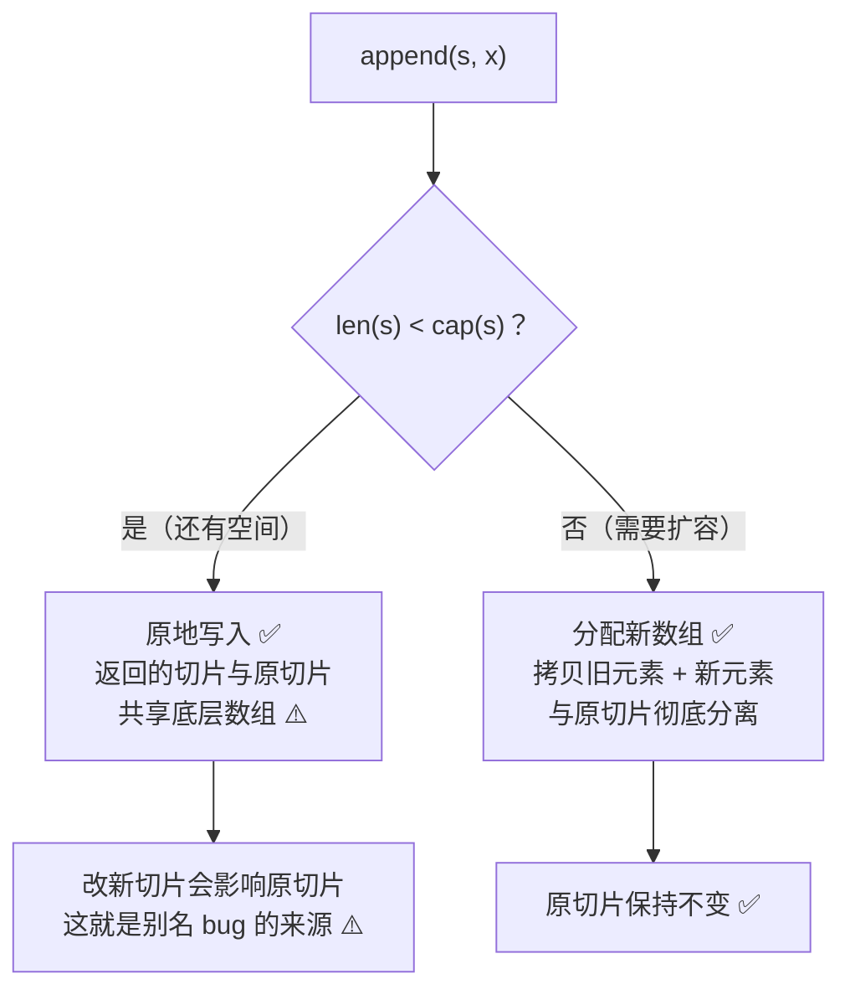
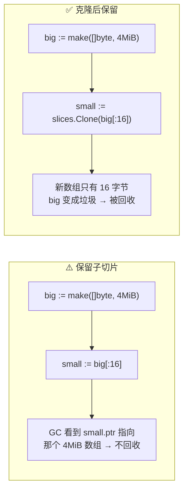

+++
title = "07 数组·切片·映射·结构体"
linkTitle = "07 数组·切片·映射·结构体"
weight = 107
date = "2026-09-20T10:35:00+08:00"
type = "docs"
description = "Go 复合类型速查：数组与切片的内存结构、len/cap/扩容、三索引切片、append 别名陷阱、map 底层与操作、struct 标签与内存对齐"
isCJKLanguage = true
draft = false
+++

# 07 数组·切片·映射·结构体

本页是 Go 里**最容易写出隐蔽 bug** 的一页。切片的三字段结构、`append` 的别名效应、`map` 的并发禁地、结构体的内存填充，每一条都有对应的血案。

> 基线：**Go 1.27.1** / 64 位平台。所有内存数值与输出为本机实跑结果。

---

## 数组与切片：值语义 vs 三字段头

这是全页最重要的一张图。**数组是值**（赋值即整体拷贝），**切片是「指向数组的视图」**（赋值只拷贝头部）。

```text
数组 [3]int              切片 []int
┌────┬────┬────┐        ┌─────────┬─────┬─────┐
│ 1  │ 2  │ 3  │        │ ptr ────┼─► │ len │ cap │
└────┴────┴────┘        └─────────┴─────┴─────┘
 赋值 = 拷贝 3 个 int      赋值 = 拷贝 1 指针 + 2 个 int（24 字节）
                          指向同一个底层数组 ⚠️

底层数组（堆上）
┌────┬────┬────┬────┬────┐
│ 1  │ 2  │ 3  │ 4  │ 5  │
└────┴────┴────┴────┴────┘
  ▲         ▲
  │         │
完整切片    子切片（共享同一块内存）
```

| 维度 | 数组 `[N]T` | 切片 `[]T` |
| --- | --- | --- |
| 大小 | 编译期固定，是类型的一部分 | 运行期可变 |
| 赋值语义 | **值拷贝**（整个数组） | **头部拷贝**，共享底层数组 ⚠️ |
| 可比较 | ✅ 元素可比较时 | ❌ 只能与 `nil` 比 |
| 作 map 键 | ✅ 可比较时 | ❌ |
| 作函数参数 | 拷贝整个数组 ⚠️ | 只拷贝 24 字节头部 |
| 零值 | 全零元素 | `nil`（`len=0`） |
| 能否 append | ❌ | ✅ |

⚠️ **数组作为函数参数会整体拷贝**，大数组要用指针或切片：

```go
func byValue(a [1000000]int) { }   // 🛑 每次调用拷贝 8 MB
func bySlice(a []int)        { }   // ✅ 只拷贝 24 字节头部
func byPointer(a *[1000000]int) { } // ✅ 只传指针
```

---

## 切片的 len 与 cap

```go
s := make([]int, 2, 5)   // len=2, cap=5，前 2 个元素是零值
s = append(s, 1)         // len=3, cap=5（还有空间，不扩容）

l := []int{1, 2, 3}      // len=3, cap=3（字面量 cap 通常=len）

arr := [5]int{1, 2, 3, 4, 5}
sl := arr[1:3]           // len=2, cap=4 ← cap 是「从起点到数组末尾」🔥
sl2 := sl[1:2]           // len=1, cap=3
```

```text
make([]int,2,5): [0 0] 2 5
after append 1: [0 0 1] 3 5
literal: [1 2 3] 3 3
arr[1:3]: [2 3] 2 4
sl[1:2]: [3] 1 3
```

💡 **`cap` 的规律**：`cap = 底层数组长度 − 切片起点偏移`。所以从数组中间切出来的切片，`cap` 往往比 `len` 大很多——这就是后面「`append` 覆盖原数据」的根源。

### 三种切片表达式

| 表达式 | 含义 | 结果 len | 结果 cap |
| --- | --- | --- | --- |
| `s[low:high]` | 常规切片 | `high-low` | `cap(s)-low` |
| `s[low:high:max]` | **三索引**，限制容量 | `high-low` | `max-low` 🔥 |
| `s[:]` | 整个切片 | `len(s)` | `cap(s)` |
| `s[:n]` | 前 n 个 | `n` | `cap(s)` |

```go
full := []int{1, 2, 3, 4, 5}
limited := full[1:3:3]
fmt.Println("full[1:3:3]:", limited, len(limited), cap(limited))
```

```text
full[1:3:3]: [2 3] 2 2
```

三索引的用途：**把 `cap` 卡死在 `len`，让后续 `append` 必然扩容、绝不污染原数组**。

⚠️ 常见的错误写法是四索引 `s[a:b:c:d]` 🛑——Go **只有**两索引和三索引两种形式。

---

## append 的三种命运

`append` 的行为取决于**能否在原数组里放下**，这决定了它是否与旧切片共享内存：



```text
两条路径的内存实况

【路径一】cap 还够 → 原地写
  s := make([]int, 3, 5)        b := append(s, 4)
  s ┌───────┬─────┬─────┐       b ┌───────┬─────┬─────┐
    │ ptr ──┼─►3  │  3  │ 5       │ ptr ──┼─►3  │  4  │ 5
    └───────┴─────┴─────┘         └───────┴─────┴─────┘
            │                             │
            └──────────┬──────────────────┘
                       ▼
            ┌────┬────┬────┬────┬────┐
            │ 1  │ 2  │ 3  │ 4  │    │  ◄── 同一个底层数组 ⚠️
            └────┴────┴────┴────┴────┘
            b[0]=100 会同时改掉 s[0]！

【路径二】cap 用尽 → 另起炉灶
  s := make([]int, 3, 3)        b := append(s, 4)
  s ┌───────┬─────┬─────┐       b ┌───────┬─────┬─────┐
    │ ptr ──┼─►A  │  3  │ 3       │ ptr ──┼─►B  │  4  │ 4
    └───────┴─────┴─────┘         └───────┴─────┴─────┘
            │                             │
            ▼                             ▼
     ┌────┬────┬────┐              ┌────┬────┬────┬────┐
     │ 1  │ 2  │ 3  │  A           │ 1  │ 2  │ 3  │ 4  │  B
     └────┴────┴────┘              └────┴────┴────┴────┘
     完全独立 ✅ 改 b 不影响 s

结论：append 是否「安全」取决于 cap，而不是你的意图 ⚠️
     要确定性 → slices.Clone 或三索引切片把 cap 卡死
```

```go
// 场景 1：还有容量 → 共享
a := make([]int, 3, 5)
copy(a, []int{1, 2, 3})
b := append(a, 4)
b[0] = 100
fmt.Println("share cap: a =", a, " b =", b)

// 场景 2：容量用尽 → 分离
c := make([]int, 3, 3)
copy(c, []int{1, 2, 3})
d := append(c, 4)
d[0] = 100
fmt.Println("grown:    c =", c, " d =", d)
```

```text
share cap: a = [100 2 3]  b = [100 2 3 4]     ← a 被意外改掉了 ⚠️
grown:    c = [1 2 3]  d = [100 2 3 4]        ← c 安全 ✅
```

### 子切片 + append = 覆盖原数据

```go
full := []int{1, 2, 3, 4, 5}
limited := full[1:3:3]              // cap 卡到 2
pushed := append(limited, 42)       // 必须扩容
pushed[0] = 77
fmt.Println("after append to limited:", full, pushed)
```

```text
after append to limited: [1 2 3 4 5] [77 3 42]   ← full 完好 ✅
```

对比一下**不加三索引**的版本，危害立现：

```go
full := []int{1, 2, 3, 4, 5}
view := full[1:3]              // cap=4，还有空间！
view = append(view, 42)        // 原地写入 full[3]
fmt.Println(full)              // [1 2 3 42 5] ⚠️ 原数组被改了
```

### 修复清单

| 场景 | 修复 |
| --- | --- |
| 想把子切片当独立数据用 | `slices.Clone(s)` ✅ |
| 想防止 `append` 污染原数组 | 三索引 `s[a:b:b]` ✅ |
| 想让 `append` 永不共享 | `slices.Clip(s)` 🆕 1.21（把 cap 卡到 len） |
| 想拷贝到已有切片 | `copy(dst, src)` |
| 想拼接两个切片 | `slices.Concat(a, b)` 🆕 1.22 |

```go
safe := slices.Clone(full[1:3:3])
safe[0] = 55
fmt.Println("cloned safe:", safe, "full untouched:", full)
```

```text
cloned safe: [55 3] full untouched: [1 2 3 4 5]
```

---

## 扩容规律

`append` 需要扩容时，Go 会分配更大的数组。**具体倍数不是规范的一部分**，不要依赖它，但知道大致规律有助于理解性能：

```go
var s []int
prev := 0
for range 12 {
	s = append(s, 1)
	if cap(s) != prev {
		fmt.Printf("len=%d cap=%d\n", len(s), cap(s))
		prev = cap(s)
	}
}
```

```text
len=1 cap=4
len=5 cap=8
len=9 cap=16
```

| 观察 | 说明 |
| --- | --- |
| 小切片起点是 `cap=4` | 不是 1，避免频繁分配 |
| 之后大致翻倍 | 元素变大时增长率会低于 2 倍（减少内存浪费） |
| **不要硬编码这些数字** | 不同 Go 版本策略会调整 ⚠️ |
| `cap` 增长 ≠ 2 倍保证 | 规范只说「足够用」 |

💡 **性能实践**：已知最终大小时用 `make([]T, 0, n)` 预分配，能避免多次拷贝：

```go
big := make([]int, 0, 1000)
for range 1000 {
	big = append(big, 1)
}
fmt.Println("preallocated:", len(big), cap(big))
```

```text
preallocated: 1000 1000
```

### copy：只拷 min(len) 个

```go
src := []int{1, 2, 3, 4, 5}
dst := make([]int, 3)
n := copy(dst, src)
fmt.Println("copy 3:", dst, "n =", n)

overlap := []int{1, 2, 3, 4, 5}
copy(overlap[1:], overlap[:4])   // copy 能正确处理重叠
fmt.Println("overlap:", overlap)
```

```text
copy 3: [1 2 3] n = 3
overlap: [1 1 2 3 4]
```

⚠️ `copy` **不会**帮你扩容 `dst`。要「追加拷贝」得用 `append(dst, src...)`。

---

## 子切片会拖住整个底层数组

这是生产环境最常见的**内存泄漏形态**：你只留了 16 字节，却让 GC 无法回收那块 4 MB 的底层数组。



```go
kept := make([][]byte, 0, 8)
for range 8 {
	big := bigSlice()          // 每次 4 MiB
	kept = append(kept, big[:16])   // ⚠️ 只留 16 字节
}
fmt.Printf("window kept:  heap %d MiB -> %d MiB\n", start, heapMiB())

kept2 := make([][]byte, 0, 8)
for range 8 {
	big := bigSlice()
	kept2 = append(kept2, slices.Clone(big[:16]))   // ✅ 拷贝独立小切片
}
fmt.Printf("cloned small: heap %d MiB -> %d MiB\n", start2, heapMiB())
```

```text
window kept:  heap 0 MiB -> 32 MiB
cloned small: heap 0 MiB -> 0 MiB
```

💡 **判据**：任何「解析大 buffer 后长期保存其中一小段」的地方（协议解析、日志切分、JSON 取值）都是这个坑的高发区。**要么 `slices.Clone`，要么 `strings.Clone`**（字符串同理）。

---

## 切片惯用法速查

| 我想干的事 | 写法 |
| --- | --- |
| 声明空切片 | `var s []int`（nil，推荐）或 `s := []int{}`（非 nil） |
| 预分配 | `make([]int, 0, n)` |
| 定长初始化 | `make([]int, n)`（n 个零值元素） |
| 追加 | `s = append(s, x)` ⚠️ 必须接返回值 |
| 追加多个 | `s = append(s, xs...)` |
| 追加另一个切片 | `s = append(s, other...)` |
| 拼接 | `slices.Concat(a, b)` 🆕 1.22 |
| 拷贝 | `slices.Clone(s)` 🆕 1.21 |
| 截断 | `s = s[:n]` |
| 清空但保留容量 | `s = s[:0]` 🔥 |
| 真清空（置零元素） | `clear(s)` 🆕 1.21 |
| 相等比较 | `slices.Equal(a, b)` 🆕 1.21 |
| 查找 | `slices.Index(s, v)` / `slices.Contains(s, v)` |
| 排序 | `slices.Sort(s)` / `slices.SortFunc(s, cmp)` |
| 删除第 i 个 | `s = slices.Delete(s, i, i+1)` 🆕 1.21 |
| 插入 | `s = slices.Insert(s, i, v...)` 🆕 1.21 |
| 反向迭代 | `for i, v := range slices.Backward(s)` 🆕 1.23 ⚠️ 它返回 `iter.Seq2[int, E]`，单变量拿到的是**索引** |
| 二维切片 | `grid := make([][]int, rows)`，再逐行 make ⚠️ |

⚠️ `var s []int` 与 `s := []int{}` 的区别只在 `s == nil` 的判断上，JSON 序列化时两者都被编码为 `null` 与 `[]` 的差别：

| 值 | `json.Marshal` 结果 |
| --- | --- |
| `var s []int`（nil） | `null` |
| `s := []int{}` | `[]` |
| `make([]int, 0)` | `[]` |

API 返回列表时通常希望是 `[]` 而不是 `null`。⚠️ **`slices.Clone` 帮不上忙**——官方文档明确写它「preserves the nilness of s」，实测 `slices.Clone(nil) == nil` 仍为 `true`，JSON 照样输出 `null`。正确做法只有两条：

| 做法 | 写法 |
| --- | --- |
| 一开始就别用 nil | `s := []int{}` 或 `make([]int, 0)` ✅ |
| 返回前兜底 | `if s == nil { s = []int{} }` |

---

## map：底层与操作

`map` 是哈希表，底层是 **bucket 数组**，每个 bucket 装 8 个键值对：

```text
map[string]int 的内部结构（简化）
┌──────────────────────────────────────────┐
│ hmap: count, flags, B(桶数量=2^B), ...    │
│       buckets ─────────────┐              │
└────────────────────────────┼──────────────┘
                             ▼
        ┌─────────────┬─────────────┬─────────────┐
        │ bucket 0    │ bucket 1    │ bucket 2    │
        │ tophash[8]  │ tophash[8]  │ tophash[8]  │
        │ keys[8]     │ keys[8]     │ keys[8]     │
        │ values[8]   │ values[8]   │ values[8]   │
        │ overflow ───┼──► 溢出桶    │             │
        └─────────────┴─────────────┴─────────────┘
```

这个结构解释了三件事：

| 现象 | 原因 |
| --- | --- |
| 遍历顺序随机 | 遍历从随机的 bucket 与随机偏移开始，**刻意为之** |
| 不能取元素地址 | 扩容时元素会搬移，地址不稳定 → 编译器禁止 `&m[k]` |
| 不是并发安全的 | 并发写入会触发运行时检测并 panic（不是加锁保护） |

### 基本操作全表

```go
m1 := map[string]int{"a": 1}       // 字面量
m2 := make(map[string]int)         // 空 map，可写 ✅
m3 := make(map[string]int, 100)    // 预分配，减少扩容
// var m4 map[string]int           // ⚠️ nil map，读可以，写 panic

v, ok := m1["a"]                   // 取值 + 存在性 🔥
v2, ok2 := m1["missing"]           // v2 = 0, ok2 = false
delete(m1, "missing")              // 删不存在的键是安全的，无操作
len(m1)                            // 键值对数量
```

```text
map[a:1] 0 0
comma-ok: 1 true
missing: 0 false
delete noop ok, len = 1
```

### 键类型：必须可比较

| 可作键 | 不可作键 |
| --- | --- |
| 所有数值、字符串、布尔 | 切片 `[]T` 🛑 |
| 指针、通道 | 映射 `map[K]V` 🛑 |
| 接口（运行期可比才行）⚠️ | 函数 🛑 |
| 数组（元素可比较时） | 含不可比较字段的结构体 🛑 |
| 结构体（字段全可比较时）✅ | |

```go
type Point struct{ X, Y int }
grid := map[Point]string{{0, 0}: "origin"}
fmt.Println("struct key:", grid[Point{0, 0}])
```

```text
struct key: origin
```

⚠️ 结构体作键时，**字段顺序和类型必须完全一致**才算同一个键。别用浮点作键（NaN 永不等于自身，会导致取不到值）。

### 遍历顺序随机

```go
m := map[string]int{"c": 3, "a": 1, "b": 2}
keys2 := slices.Collect(maps.Keys(m))
fmt.Println("unsorted:", keys2)                    // 每次运行可能不同 ⚠️
keys := slices.Sorted(maps.Keys(m))
fmt.Println("sorted keys:", keys)                  // 稳定 ✅
```

```text
sorted keys: [a b c]
unsorted: [c a b]
```

### 并发访问：必须加锁

```go
// 🛑 并发写 map 会 panic（fatal error: concurrent map writes），无法 recover
var m = map[string]int{}
go func() { m["a"] = 1 }()
go func() { m["b"] = 2 }()

// ✅ 三种正确做法
mu.Lock(); m["a"] = 1; mu.Unlock()          // 1. Mutex
var sm sync.Map                              // 2. sync.Map（读多写少）
// 3. 每个 goroutine 用局部 map，最后合并
```

⚠️ 并发 map 写导致的 `fatal error` **不能被 `recover` 捕获**（它是 runtime throw 不是 panic）。`go test -race` 能在测试阶段抓到它。

### 常用泛型助手 🆕 1.21+

| 需求 | 函数 |
| --- | --- |
| 相等比较 | `maps.Equal(a, b)` |
| 拷贝 | `maps.Clone(m)` |
| 合并 | `maps.Copy(dst, src)` |
| 删除满足条件的 | `maps.DeleteFunc(m, f)` |
| 取键/值迭代器 | `maps.Keys(m)` / `maps.Values(m)` |
| 收集成切片 | `slices.Collect(maps.Keys(m))` 🆕 1.23 |
| 有序键 | `slices.Sorted(maps.Keys(m))` 🆕 1.23 |

```go
fmt.Println("maps.Equal:", maps.Equal(map[string]int{"a": 1}, map[string]int{"a": 1}))
```

```text
maps.Equal: true
```

---

## struct：标签、对齐、比较

### 字段对齐与填充

编译器会插入**填充字节**让字段地址满足对齐要求。字段顺序会显著影响结构体大小：

```text
type Bad struct {          type Good struct {
    A bool   // off 0        B int64  // off 0
    (pad 7)  //              A bool   // off 8
    B int64  // off 8        C bool   // off 9
    C bool   // off 16       (pad 6)  //
    (pad 7)  //              }         // size 16 ✅
}             // size 24 ⚠️
```

```go
fmt.Println("Bad  size:", unsafe.Sizeof(Bad{}), "align:", unsafe.Alignof(Bad{}))
fmt.Println("Good size:", unsafe.Sizeof(Good{}))
fmt.Println("offsets Bad:", unsafe.Offsetof(Bad{}.A), unsafe.Offsetof(Bad{}.B), unsafe.Offsetof(Bad{}.C))
```

```text
Bad  size: 24 align: 8
Good size: 16
offsets Bad: 0 8 16
```

💭 **实践建议**：字段按**大小降序排列**（`int64`/指针/`string` 在前，`bool`/`int8` 在后）能省内存。但在大多数业务结构体里这点收益不值得牺牲可读性；只有在**百万级实例**的场合才手动排布。

### struct 标签

标签是编译期字符串，通过反射读取。**格式必须严格**（`key:"value"` 用空格分隔），写错 `go vet` 会报错：

```go
type Tagged struct {
	ID       int    `json:"id" db:"user_id"`
	Name     string `json:"name,omitempty"`
	internal string
}

t := reflect.TypeOf(Tagged{})
for i := range t.NumField() {
	f := t.Field(i)
	fmt.Printf("%-10s %-8s tag=%q exported=%v\n", f.Name, f.Type, f.Tag, f.IsExported())
}
fmt.Println("Tag.Get:", t.Field(0).Tag.Get("json"), "|", t.Field(0).Tag.Get("db"))
```

```text
ID         int      tag="json:\"id\" db:\"user_id\"" exported=true
Name       string   tag="json:\"name,omitempty\"" exported=true
internal   string   tag="" exported=false
Tag.Get: id | user_id
```

⚠️ **未导出字段（小写开头）会被 `encoding/json` 忽略**，这是「为什么我的字段没被序列化」的第一大原因。但要说准「读不到」的含义——实测：

| 操作未导出字段 | 结果 |
| --- | --- |
| `reflect.Value.String()` / `.Int()` 等按 Kind 取值 | ✅ 能读到（实测 `Field(1).String()` 返回 `"secret"`）|
| `fmt.Println(struct)` 直接打印 | ✅ 能打印 |
| `reflect.Value.Interface()` | 🛑 **panic**：`cannot return value obtained from unexported field` |
| `reflect.Value.Set*()` | 🛑 panic |
| `encoding/json` 序列化 | 🛑 忽略 |

💡 所以「读不到」只对 `Interface()` 成立——这正是 `json` 包忽略它们的原因。这是「为什么我的字段没被序列化」的第一大原因（见 [16 编码]()）。

常用 tag 一览：

| 包 | 标签 | 例子 |
| --- | --- | --- |
| `encoding/json` | `json` | `json:"name,omitempty"` |
| `encoding/xml` | `xml` | `xml:"item,attr"` |
| `database/sql` | `db` | `db:"user_id"` |
| `gopkg.in/yaml.v3` | `yaml` | `yaml:"name"` |
| `go-playground/validator` | `validate` | `validate:"required,email"` |

### 结构体比较与零值

```go
type P struct{ X, Y int }
fmt.Println("comparable:", P{1, 2} == P{1, 2})
```

```text
comparable: true
```

| 结构体含什么字段 | 能否 `==` |
| --- | --- |
| 全是可比较字段 | ✅ |
| 含 slice / map / func | 🛑 编译错误 |
| 含接口字段 | ✅ 编译通过，但运行期可能 panic ⚠️ |
| 含数组（元素可比较） | ✅ |

💡 需要比较含 slice 的结构体时，用 `reflect.DeepEqual`（慢）或手写 `Equal` 方法（快、推荐），或用 `cmp.Diff` 做测试断言（见 [17 测试]()）。

---

## 本页陷阱速查

| 症状 | 实际原因 | 正确做法 |
| --- | --- | --- |
| `s = append(s, x)` 后元素错乱 | 忘接返回值，切片头没更新 | 必须 `s = append(s, x)` |
| 改子切片，原切片也变了 | 共享底层数组 | 需要独立就 `slices.Clone` |
| `append` 后原数组被覆盖 | 子切片 `cap` 还有余量 | 三索引 `s[a:b:b]` 或 `slices.Clip` |
| 内存持续增长但找不到泄漏 | 子切片拖住大底层数组 | `slices.Clone` / `strings.Clone` |
| 传大数组给函数后性能骤降 | 数组是值语义，整体拷贝 | 改传切片或指针 |
| `&m[k]` 编译错误 | map 元素不可寻址 | 取出 → 改 → 放回 |
| map 并发写导致进程崩溃 | 并发写是 fatal error，不可 recover | 加锁 / `sync.Map` / 分片 |
| 遍历 map 顺序每次都变 | 刻意随机化 | 需要顺序就 `slices.Sorted(maps.Keys(m))` |
| 服务偶发并发崩溃，测试不复现 | 数据竞争 | `go test -race` |
| JSON 里字段消失 | 字段未导出（小写） | 首字母大写 |
| 结构体莫名比预期大 | 字段顺序造成填充 | 大字段放前面，或接受它 |
| `[3]int` 和 `[4]int` 不能互相赋值 | 长度是类型的一部分 | 用切片 |

---

📘 官方参考：[Go Slices: usage and internals](https://go.dev/blog/slices-intro)、[Spec — Slice expressions](https://go.dev/ref/spec#Slice_expressions)、[Go maps in action](https://go.dev/blog/maps)、[slices 包](https://pkg.go.dev/slices)、[maps 包](https://pkg.go.dev/maps)

➡️ 上一节：[06 函数·方法·defer]() ｜ 下一节：[08 接口与嵌入]()
