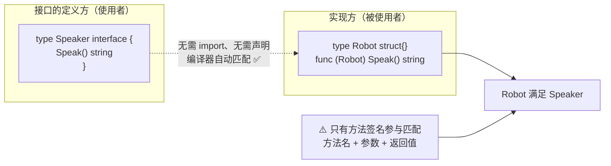
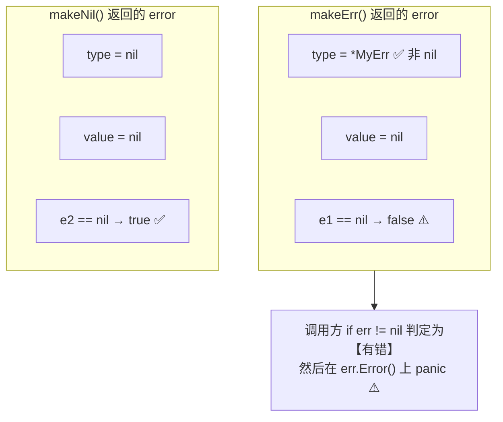
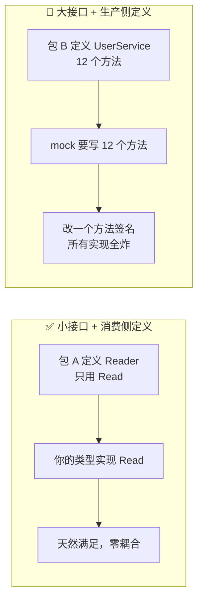

+++
title = "08 接口与嵌入"
linkTitle = "08 接口与嵌入"
weight = 108
date = "2026-09-20T10:40:00+08:00"
type = "docs"
description = "Go 接口速查：隐式实现、接口值二元组结构、nil 接口与 nil 指针的区别、类型断言、类型 switch、结构体与接口嵌入、方法提升"
isCJKLanguage = true
draft = false
+++

# 08 接口与嵌入

Go 的抽象机制只有一个：**接口**。没有继承、没有虚函数表、没有 `implements` 关键字。本页回答：**怎么定义、怎么满足、为什么 `err != nil` 有时会骗你**、**嵌入到底提升什么**。

> 基线：**Go 1.27.1**。所有输出为本机实跑结果。

---

## 隐式实现：Go 唯一的抽象方式

**类型不需要声明「我实现了某接口」**。只要方法集满足，编译器自动认可——这就是「鸭子类型 + 静态检查」。



| 特点 | 说明 |
| --- | --- |
| 无需声明 | 不打 `implements`，也不改被适配类型的源码 🔥 |
| 结构化匹配 | 只看方法签名，与方法定义顺序、注释无关 |
| 跨包可用 | 你可以为**别人的类型**定义接口，无需它配合 |
| 编译期检查 | 满足关系在编译期确定，无运行期查找开销 |
| 编译期断言 | `var _ Speaker = (*Robot)(nil)` 强制检查 🔥 |

```go
// 编译期断言：一旦 Robot 不再满足 Speaker，这行就编译失败
var _ Speaker = (*Robot)(nil)
```

💭 这是 Go 生态解耦的核心：`io.Reader` 由标准库定义，你的类型不需要知道 `io` 包存在就能满足它。

---

## 接口值的结构：一个二元组

接口变量**不是**简单的指针，它是 `(动态类型, 动态值)` 两个字段：

```text
接口变量 iface
┌──────────────┬──────────────┐
│  itab / type │     data     │
│  （类型信息） │  （值或指针） │
└──────────────┴──────────────┘
       │              │
       ▼              ▼
   具体类型描述    实际数据（小值直接放这里，
   + 方法表        大值放堆上，这里存指针）

零值接口：两个字段都是 nil → iface == nil 为 true ✅

装了 (*T)(nil) 的接口：
┌──────────────┬──────────────┐
│   *T 的类型  │     nil      │  ← type 不是 nil！
└──────────────┴──────────────┘
       → iface == nil 为 false ⚠️ 陷阱根源
```

这张图解释了 Go 最著名的坑：**「有类型的 nil」不等于「nil 接口」**。

---

## nil 接口 vs nil 指针：Go 第一大坑

```go
type MyErr struct{ msg string }

func (e *MyErr) Error() string { return e.msg }

func makeErr() error {
	var p *MyErr = nil
	return p          // ⚠️ 返回的是「装进接口的 nil 指针」
}

func makeNil() error {
	return nil        // ✅ 真正的 nil 接口
}

e1 := makeErr()
e2 := makeNil()
fmt.Println("typed nil == nil ?", e1 == nil)
fmt.Println("true  nil == nil ?", e2 == nil)
fmt.Printf("type=%T value=%v\n", e1, e1)
```

```text
typed nil == nil ? false
true  nil == nil ? true
type=*main.MyErr value=<nil>
```



### 这个坑的现实形态

```go
// 🛑 危险：返回了具体类型的 nil 指针
func find(id string) (*User, error) {
	var u *User
	if notFound {
		return u, nil      // ⚠️ 返回 nil 指针 + nil error
	}
	return &User{}, nil
}

u, err := find("x")
if err != nil { ... }      // err 是 nil，通过
fmt.Println(u.Name)        // 💥 nil 解引用 panic
```

```go
// 🛑 更隐蔽：把具体类型直接当接口返回
func get() error {
	var e *MyErr          // nil
	return e              // ⚠️ 装进 error 接口后 != nil
}

if err := get(); err != nil {
	fmt.Println(err.Error())   // 💥 在 nil 接收者上调用方法
}
```

### 三种防御写法

```go
// ✅ 1. 返回前显式判空
func makeErr() error {
	var p *MyErr
	if p == nil {
		return nil          // 返回真正的 nil 接口
	}
	return p
}

// ✅ 2. 用哨兵错误变量而不是 nil 指针
var ErrNotFound = errors.New("not found")
func find2(id string) (*User, error) {
	return nil, ErrNotFound     // 语义清晰
}

// ✅ 3. 接收者方法里判 nil（有些类型需要支持零值可用）
func (e *MyErr) Error() string {
	if e == nil {
		return "<nil>"
	}
	return e.msg
}
```

⚠️ **注意 `errors.Is`/`errors.As` 也会被这个坑影响**：如果错误链里混进了「有类型的 nil」，`errors.Is(nil)` 的行为会出乎意料。

---

## 类型断言

```go
var v any = 42

// ① 带 ok：安全，失败返回零值 + false
n, ok := v.(int)      // 42 true
s, ok2 := v.(string)  // "" false

// ② 不带 ok：失败直接 panic
n2 := v.(int)         // ✅
// s2 := v.(string)   // 💥 panic: interface conversion
```

```text
comma-ok: 42 true
failed assert:  false empty string? true
panic on bad assert: true
```

| 形式 | 失败行为 | 何时用 |
| --- | --- | --- |
| `v.(T)` | panic 💥 | 你**确定**类型时（少见） |
| `v, ok := v.(T)` | 零值 + `false` | 默认选择 🔥 |

⚠️ 断言失败返回的是**零值**，不是 `nil`。对 `string` 是 `""`，对 `int` 是 `0`——所以不能靠「结果为空」判断断言是否成功，必须看 `ok`。

### 接口 → 接口的断言

```go
var r io.Reader = strings.NewReader("hi")
if rc, ok := r.(io.Closer); ok {
	rc.Close()
}
```

这是 `io`/`http` 生态里的常见模式：**探测是否实现了更强的接口**（如 `io.ReaderFrom`、`http.Flusher`、`http.Hijacker`）。

---

## 类型 switch

```go
switch v := x.(type) {
case nil:
	fmt.Print("nil ")
case int:
	fmt.Print("int:", v, " ")
case string, []byte:      // 多类型：v 保持接口类型
	fmt.Print("text-like ")
case []int:
	fmt.Print("slice len=", len(v), " ")
default:
	fmt.Printf("other %T ", v)
}
```

| 细节 | 规则 |
| --- | --- |
| `v` 的类型 | 单类型 case 里 `v` 是该**具体类型** 🔥 |
| 多类型 case | `v` 保持**外层被 switch 变量的类型**，不是「某个接口类型」这种含糊说法 ⚠️ |
| `case nil` | 只匹配 **nil 接口** ⚠️ |
| `default` | 最多出现一次，**位置任意**（习惯放最后），`v` 与 switch 的变量同类型 |
| 顺序 | 从上到下，第一个匹配的执行 |

⚠️ **多类型 case 的 `v` 是最容易记错的一点**，实测确认（`x` 是 `any`）：

```go
var y any = 42
switch v := y.(type) {
case int, int64:
	var _ any = v      // ✅ 能赋给 any
	fmt.Printf("动态类型=%T, 静态类型=any\n", v)
}
```

```text
multi-case: 动态类型=int, 静态类型=any
```

反证——若以为 `v` 是具体类型，这段就编译不过：

```go
switch v := y.(type) {
case int, int64:
	return v + 1   // 🛑 invalid operation: v + 1 (mismatched types any and untyped int)
}
```

💡 结论：**多类型 case 里 `v` 不能直接参与具体类型的运算**，要先断言或拆成单类型 case。若 switch 的变量本身是 `error`，那么多类型 case 里的 `v` 就是 `error`。

⚠️ 下面这个组合最容易误判：

```go
var x any = (*MyErr)(nil)   // 有类型的 nil
switch x.(type) {
case nil:
	fmt.Println("匹配 nil")     // ❌ 不会执行
case *MyErr:
	fmt.Println("匹配 *MyErr")  // ✅ 走这里，但值是 nil ⚠️
}
```

---

## 接口设计原则

### 小接口 + 在消费侧定义

```go
// ✅ 标准库的典范：每个接口只有 1~2 个方法
type Reader interface { Read(p []byte) (n int, err error) }
type Writer interface { Write(p []byte) (n int, err error) }
type Stringer interface { String() string }
type error interface { Error() string }
```



| 原则 | 说明 |
| --- | --- |
| **接口越窄越好** | 1 个方法最佳，超过 3 个要警惕 🔥 |
| **在消费侧定义** | 谁使用谁定义，不要在建库时预设接口 |
| **返回具体类型，接收接口** | `func New() *Store` + `func Save(s Storer)` |
| **不要为单实现造接口** | 💭 除非为了测试打桩或解耦跨包依赖 |

### 常用内置接口

| 接口 | 签名 | 用途 |
| --- | --- | --- |
| `error` | `Error() string` | 错误（见 [09]()） |
| `fmt.Stringer` | `String() string` | 自定义 `%v`/`%s` 输出 🔥 |
| `fmt.Formatter` | `Format(f State, c rune)` | 完全接管格式化 |
| `io.Reader` | `Read([]byte) (int, error)` | 一切数据源 |
| `io.Writer` | `Write([]byte) (int, error)` | 一切数据目标 |
| `io.Closer` | `Close() error` | 资源释放 |
| `sort.Interface` | `Len/Less/Swap` | 旧 API；官方未标 deprecated，但新代码用 `slices.SortFunc` |
| `encoding.BinaryMarshaler` | `MarshalBinary() ([]byte, error)` | 二进制序列化 |
| `json.Marshaler` | `MarshalJSON() ([]byte, error)` | 自定义 JSON |
| `http.Handler` | `ServeHTTP(ResponseWriter, *Request)` | HTTP 处理 |
| `driver.Valuer` | `Value() (driver.Value, error)` | 数据库值转换 |

### fmt.Stringer：最值得实现的一个

```go
type Color int

const (
	Red Color = iota
	Green
	Blue
)

func (c Color) String() string {
	if c < Red || c > Blue {
		return fmt.Sprintf("Color(%d)", int(c))
	}
	return [...]string{"Red", "Green", "Blue"}[c]
}

fmt.Println(Red, Green, Blue)      // Red Green Blue
fmt.Printf("%v %s %d\n", Red, Red, Red)  // Red Red 0 ⚠️ 注意 %d 不走 String
```

⚠️ 哪些动词会走 `String()`，比想象的更宽——实测（`Color` 的 `String()` 返回 `"Red"`）：

```text
v=Red s=Red q="Red" x=526564 X=526564 d=0 b=0 o=0 c=
```

| 动词 | 是否调用 `String()` |
| --- | --- |
| `%v` `%s` `%q` | ✅ 会 |
| `%x` `%X` | ✅ **也会**（`526564` 正是 `"Red"` 的十六进制）⚠️ |
| `%d` `%b` `%o` `%c` `%U` `%f` … | ❌ 真正的数值/字符动词才绕过 Stringer |

```go
// 🛑 无限递归陷阱：在 String() 里用 %v 打印自己
func (c Color) String() string {
	return fmt.Sprintf("%v", c)   // 💥 无限递归 → 栈溢出
}
```

---

## 嵌入：Go 的「组合优于继承」

### 结构体嵌入（匿名字段）

```go
type Base struct{ Name string }

func (b Base) Describe() string { return "Base:" + b.Name }
func (b Base) OnlyBase() string { return "only base" }

type Derived struct {
	Base            // 嵌入：字段名就是 Base
	Age  int
}

func (d Derived) Describe() string { return "Derived:" + d.Name }  // 覆盖

d := Derived{Base: Base{Name: "d"}, Age: 3}
fmt.Println(d.Describe())       // Derived:d  ← 外层优先（更浅）
fmt.Println(d.Base.Describe())  // Base:d     ← 显式访问被遮蔽的
fmt.Println(d.OnlyBase())       // only base  ← 方法提升
fmt.Println(d.Name)             // d          ← 字段提升
```

```text
Derived:d
Base:d
only base
d
```

| 概念 | 规则 |
| --- | --- |
| 字段名 | 嵌入类型的**类型名**就是字段名（`Base`） |
| 提升 | 外层可以直接访问内层的字段与方法 🔥 |
| 遮蔽 | 外层同名的字段/方法优先（**深度浅的赢**） |
| 显式访问 | `d.Base.Describe()` 绕过遮蔽 |
| 指针嵌入 | `*Base` 也可嵌入，提升规则相同 |

### 歧义：同层同名会报错

```go
type A struct{ X int }
type B struct{ X int }
type Ambiguous struct {
	A
	B
}

amb := Ambiguous{A{1}, B{2}}
fmt.Println(amb.A.X, amb.B.X)   // ✅ 1 2，显式限定可以
// fmt.Println(amb.X)           // 🛑 编译错误：ambiguous selector amb.X
```

```text
1 2
```

💡 解决歧义的两种办法：**显式限定**（`amb.A.X`），或**在外层直接声明同名成员**让深度变浅：

```go
type Resolved struct {
	A
	B
	X int      // 深度更浅 → 歧义消失
}
r := Resolved{A{1}, B{2}, 9}
fmt.Println("resolved:", r.X)     // 9
```

```text
resolved: 9
```

### 接口嵌入

```go
type Speaker interface{ Speak() string }
type Walker interface{ Walk() string }

type Both interface {
	Speaker
	Walker
}   // 等价于把两个接口的方法合并
```

```go
var b Both = Robot{}
fmt.Println(b.Speak(), b.Walk())
```

```text
beep clank
```

标准库的典范：`io.ReadWriter`、`io.ReadWriteCloser`、`http.ResponseWriter` 都是这样组合出来的。

### 嵌入接口到结构体：只暴露需要的方法

```go
type SpeakerBase struct{ Speaker }   // 只提升 Speaker 的方法

s := SpeakerBase{robot}
s.Speak()      // ✅ 被提升
// s.Walk()    // 🛑 SpeakerBase 上看不到 Walk
```

```go
w := WalkBase{Robot{}}
fmt.Println(w.Walk())
```

```text
clank
```

💭 这个技巧在**接口收窄**和**测试打桩**时很好用：嵌入真实实现，只覆盖其中一两个方法。

### 嵌入 ≠ 继承

| 维度 | 嵌入（组合） | 经典继承 |
| --- | --- | --- |
| 关系 | has-a / uses-a | is-a |
| 方法分发 | **编译期**静态确定 ⚠️ | 运行期虚函数分发 |
| 覆盖语义 | 只是遮蔽，内层方法看不到外层 | 真正的多态重写 |
| 菱形问题 | 歧义 → 编译错误 ✅ | 需要虚继承等复杂机制 |
| 类型等价 | `Derived` 不是 `Base` ⚠️ | 子类 is-a 父类 |

⚠️ **最关键的一条**：把 `Derived` 赋给要求 `Base` 的接口是**不行的**（它不是 `Base`），但外层的方法会**静态**调用——不存在「运行时按实际类型分发到 Derived 版本」：

```go
func (b Base) CallDescribe() string { return b.Describe() }  // 🛑 永远调 Base 的版本
// 这里没有虚函数表，嵌入不是继承
```

---

## 接口的实现细节（何时需要在意）



{}

```text
给定：func (t T) V()      // 值接收者
      func (t *T) P()     // 指针接收者

            ┌────────────────────┬──────────┬──────────┐
            │ 表达式             │ 可调 V() │ 可调 P() │
            ├────────────────────┼──────────┼──────────┤
            │ 可寻址变量 v       │   ✅     │   ✅     │  ← 自动 &v
            │ 指针 p             │   ✅     │   ✅     │  ← 自动 *p
            │ T{} 字面量         │   ✅     │   ❌     │  ← 不可寻址
            │ f() 返回值         │   ✅     │   ❌     │  ← 不可寻址
            │ m["k"]（map 元素） │   ✅     │   ❌     │  ← 不可寻址 ⚠️
            │ s[i]（切片元素）   │   ✅     │   ✅     │  ← 可寻址
            │ 接口值 iface       │  接口方法集决定     │
            └────────────────────┴──────────┴──────────┘

            ┌────────────────────┬──────────────────────────┐
            │ 接口要求什么方法   │ 谁能满足                 │
            ├────────────────────┼──────────────────────────┤
            │ 全是值方法         │ T ✅ 和 *T ✅            │
            │ 含指针方法         │ 只有 *T ✅（T ❌）       │
            └────────────────────┴──────────────────────────┘
```

💭 记法：**「指针能用的方法更多，值能被更多地方使用」**。所以设计类型时，接收者形式统一是最省心的选择。

{}

{}

遇到「明明返回 nil 却判不出 nil」时，按这个顺序查：

```text
第 1 步：%T 看类型
        fmt.Printf("%T
", err)   → *main.MyErr  ← 类型非 nil！
                                     └─► 这就是元凶

第 2 步：找到返回它的那行
        var p *MyErr
        return p          ← ⚠️ 这里把 nil 指针装进了接口

第 3 步：修
        if p == nil { return nil }     ✅ 返回真正的 nil 接口
        或直接 return ErrSentinel      ✅ 语义更清晰
```

```text
实测证据（本机）
  typed nil == nil ? false        ← 有类型的 nil
  true  nil == nil ? true         ← 真正的 nil 接口
  type=*main.MyErr value=<nil>
```

⚠️ 同一个坑还存在于：`errors.Is` 的 target、`atomic.Value.Store` 的指针、`reflect.DeepEqual` 的比较结果。

{}

{}

| 方式 | 语法 | 提升什么 | 典型用途 |
| --- | --- | --- | --- |
| 结构体嵌入 | `struct{ Base }` | 字段 + 方法 🔥 | 复用实现 |
| 指针嵌入 | `struct{ *Base }` | 同上，不拷贝 | 大对象共享 |
| 具名字段 | `struct{ base Base }` | **什么都不提升** ⚠️ | 不想暴露方法 |
| 接口嵌入（结构体里） | `struct{ Speaker }` | 只提升该接口的方法 | 收窄接口、测试打桩 |
| 接口嵌入（接口里） | `interface{ A; B }` | 方法集合并 | `io.ReadWriter` |

{}



| 场景 | 建议 |
| --- | --- |
| 小接口 + 少量实现 | 直接用接口，开销可忽略 |
| 热路径上每次调用都装箱 | 考虑具体类型或泛型（见 [10]()） |
| 类型断言在循环里 | 提到循环外断言一次 🔥 |
| 空接口 `any` 存 int | 会分配（小整数有一定优化，但不要依赖）⚠️ |
| 方法调用 | 接口调用比直接调用多一次间接跳转，但现代 CPU 预测器通常能处理 |

```go
// 🛑 循环里反复断言
for _, v := range xs {
	if n, ok := v.(int); ok { use(n) }
}

// ✅ 断言一次
if n, ok := xs[0].(int); ok { _ = n }
// 或干脆用泛型：func Sum[T int|float64](xs []T) T
```

---

## 本页陷阱速查

| 症状 | 实际原因 | 正确做法 |
| --- | --- | --- |
| `err != nil` 成立但 `err.Error()` panic | 返回了「有类型的 nil」 | 显式 `if p == nil { return nil }` |
| 函数返回 `nil, nil` 后调用方解引用 panic | 解引用的是 nil 具体类型 | 返回哨兵错误，或调用方判空 |
| `case nil` 不匹配 | 接口装的是有类型的 nil | 在对应 case 里再判 `v == nil` |
| 断言失败拿到空字符串以为成功 | 失败返回零值不是 nil | 必须检查 `ok` |
| `String()` 导致栈溢出 | 内部用 `%v` 打印自己 | 用手写拼接或换动词 |
| `%d` 没走 `String()` | 数值/字符动词绕过 Stringer（但 `%x`/`%X`/`%q` **会**走）| 用 `%v`/`%s`/`%q` |
| 结构体嵌入后方法没提升 | 嵌的是**具名字段** `base Base` | 改成匿名嵌入 `Base` |
| `amb.X` 编译错误 | 同层歧义 | `amb.A.X` 显式限定 |
| 把嵌入当继承用，多态失效 | 方法在编译期静态绑定 | 用接口，别用嵌入模拟继承 |
| 大接口导致 mock 痛苦 | 接口太宽 | 拆成 1~2 个方法的小接口 |
| 类型断言在热循环里变慢 | 每次断言都有开销 | 循环外断言，或改用泛型 |

---

📘 官方参考：[Spec — Interface types](https://go.dev/ref/spec#Interface_types)、[Effective Go — Interfaces](https://go.dev/doc/effective_go#interfaces)、[Go Blog — Interfaces in Go](https://research.swtch.com/interfaces)、[Go FAQ — nil error](https://go.dev/doc/faq#nil_error)

➡️ 上一节：[07 数组·切片·映射·结构体]() ｜ 下一节：[09 错误处理]()
