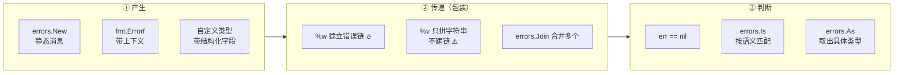
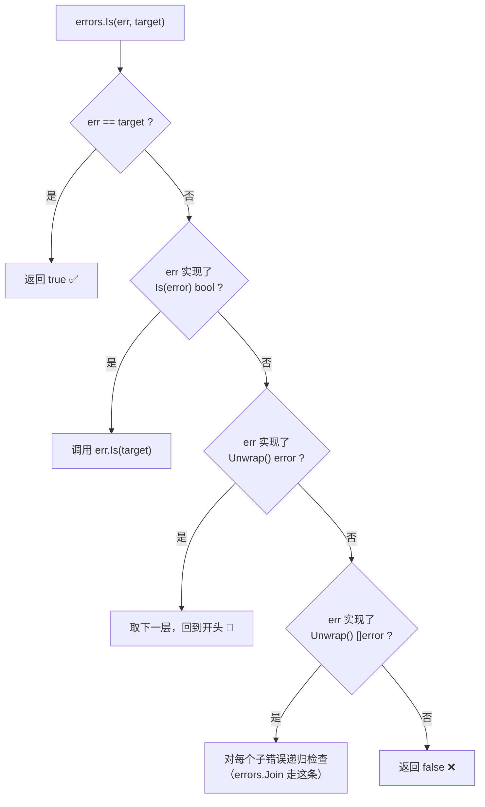
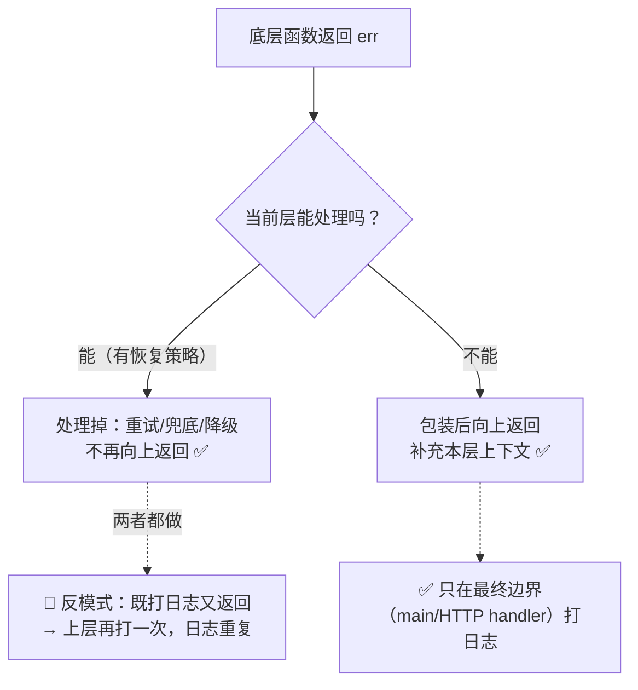
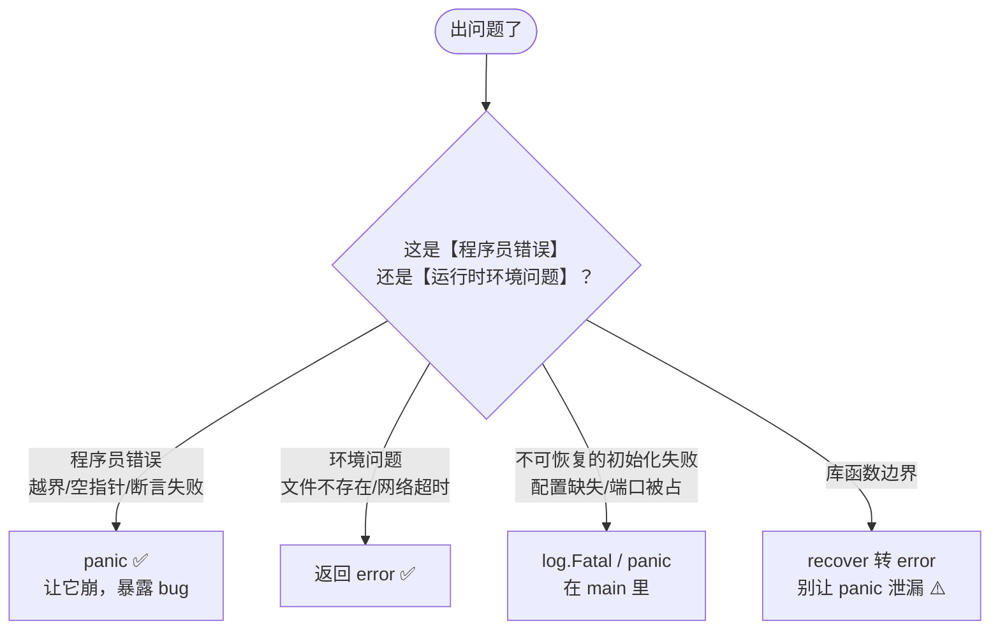

+++
title = "09 错误处理"
linkTitle = "09 错误处理"
weight = 109
date = "2026-09-20T10:45:00+08:00"
type = "docs"
description = "Go 错误处理速查：error 接口、哨兵错误、%w 包装链、errors.Is/As/Join/Unwrap、自定义错误类型、panic 与 error 的边界"
isCJKLanguage = true
draft = false
+++

# 09 错误处理

Go **没有异常**：错误是普通值，必须显式检查。本页回答：**错误怎么造、怎么包、怎么判、什么时候该用 panic**。

> 基线：**Go 1.27.1**。所有输出为本机实跑结果。

---

## 错误处理的三个动作



| 动作 | 用什么 | 关键点 |
| --- | --- | --- |
| 产生 | `errors.New` / `fmt.Errorf` / 自定义类型 | 消息小写、不加标点（Go 惯例） |
| 包装 | `%w` | **只有 `%w` 建立错误链** 🔥 |
| 判断 | `errors.Is` / `errors.As` | 永远别用 `==` 比较包装后的错误 ⚠️ |

---

## error 接口与三种错误形态

```go
// 就这一个方法，整个错误体系的基础
type error interface {
	Error() string
}
```

### 形态一：哨兵错误（sentinel error）

包级导出变量，供调用方用 `errors.Is` 比对：

```go
var (
	ErrNotFound = errors.New("not found")
	ErrConflict = errors.New("conflict")
)
```

| 特点 | 说明 |
| --- | --- |
| 命名 | `Err` 前缀 + 大驼峰 🔥 |
| 语义 | 表示「某类可预期的失败」 |
| 判断 | `errors.Is(err, pkg.ErrNotFound)` |
| 标准库例子 | `io.EOF`、`sql.ErrNoRows`、`fs.ErrNotExist` |
| 缺点 | 无法携带上下文数据 ⚠️ |

### 形态二：包装错误（wrapping）

```go
func find(id int) error {
	if id == 0 {
		return fmt.Errorf("find user %d: %w", id, ErrNotFound)
	}
	return nil
}
```

| 动词 | 行为 |
| --- | --- |
| `%w` | **包装**，保留错误链，可用 `errors.Is`/`As` 穿透 🔥 |
| `%v` | 只格式化字符串，**链断掉** ⚠️ |
| `%s` | 同 `%v` |
| 多个 `%w` | 🆕 1.20 起支持，等价于 `errors.Join` |

### 形态三：自定义错误类型

需要携带结构化信息时用：

```go
type ValidationError struct {
	Field string
	Msg   string
}

func (e *ValidationError) Error() string { return e.Field + ": " + e.Msg }
```

```go
var ve *ValidationError
if errors.As(err, &ve) {
	fmt.Println("字段校验失败:", ve.Field, ve.Msg)   // 拿到结构化字段 🔥
}
```

🆕 **1.26 起有了泛型版本，更安全也更简洁**（推荐新代码使用）：

```go
// 老写法：需要一个预先声明的变量 + 取地址
var ve *ValidationError
if errors.As(err, &ve) { fmt.Println(ve.Field) }

// 🆕 新写法：errors.AsType，类型安全、无需取地址
if ve, ok := errors.AsType[*ValidationError](err); ok {
	fmt.Println("字段校验失败:", ve.Field, ve.Msg)
}
```

```go
// 函数签名（本机实测）
//   func AsType[E error](err error) (E, bool)
```

| 要素 | 惯例 |
| --- | --- |
| 类型名 | `XxxError` 结尾 |
| 指针接收者 | `func (e *XxxError) Error()`，便于 `errors.As` |
| 字段 | 只放判断和展示需要的信息 |
| 嵌套 | 可加 `Unwrap() error` 让它参与错误链 |

```go
// 让自定义错误也能继续包装下一层
type OpError struct {
	Op  string
	Err error        // 被包装的错误
}

func (e *OpError) Error() string { return e.Op + ": " + e.Err.Error() }
func (e *OpError) Unwrap() error { return e.Err }   // 🔥 实现这个才能被 Is/As 穿透
```

---

## 错误链与 Is / As 的判定路径



```go
err := find(0)   // find user 0: not found
fmt.Println("err:", err)
fmt.Println("Is ErrNotFound:", errors.Is(err, ErrNotFound))
fmt.Println("Is other:", errors.Is(err, ErrConflict))
fmt.Println("Unwrap == ErrNotFound:", errors.Unwrap(err) == ErrNotFound)
```

```text
err: find user 0: not found
Is ErrNotFound: true
Is other: false
Unwrap == ErrNotFound: true
```

### `%v` vs `%w`：一行之差，链断不断

```go
plain := fmt.Errorf("plain: %v", ErrNotFound)
wrapped := fmt.Errorf("wrapped: %w", ErrNotFound)
fmt.Println("plain Is:", errors.Is(plain, ErrNotFound))     // false ⚠️
fmt.Println("wrapped Is:", errors.Is(wrapped, ErrNotFound)) // true ✅
```

```text
plain Is: false
wrapped Is: true
```

🛑 **这是最常见的错误处理 bug**：包装时随手写了 `%v`，导致上层 `errors.Is` 永远返回 false，错误分类逻辑静默失效。

### 多层包装仍然能穿透

```go
multi := fmt.Errorf("a: %w", fmt.Errorf("b: %w", ErrNotFound))
fmt.Println("multi Is:", errors.Is(multi, ErrNotFound))   // true
```

```text
multi Is: true
```

手动数链深度：

```go
chain := fmt.Errorf("l1: %w", fmt.Errorf("l2: %w", fmt.Errorf("l3: %w", ErrNotFound)))
depth := 0
for e := chain; e != nil; e = errors.Unwrap(e) {
	depth++
}
fmt.Println("single-chain depth:", depth, "->", chain)
```

```text
single-chain depth: 4 -> l1: l2: l3: not found
```

### errors.Join：合并多个错误 🆕 1.20

```go
j := errors.Join(ErrNotFound, ErrConflict)
fmt.Println("Join Is NotFound:", errors.Is(j, ErrNotFound), "Is Conflict:", errors.Is(j, ErrConflict))
fmt.Println("Join str:", j)
```

```text
Join Is NotFound: true Is Conflict: true
Join str: not found
conflict
```

⚠️ **`errors.Unwrap` 不会展开 `Join` 的结果**——这是官方文档明确说明的行为：

```go
unwrapped := errors.Unwrap(joined)
fmt.Printf("Join Unwrap type: %T value=%v\n", unwrapped, unwrapped)
```

```text
Join Unwrap type: <nil> value=<nil>
```

原因：`Unwrap` 只调用 `Unwrap() error` 形式的方法，而 `Join` 返回的类型实现的是 `Unwrap() []error`。判断代码要写：

```go
var multi interface{ Unwrap() []error }
if errors.As(joined, &multi) {
	for _, e := range multi.Unwrap() { ... }   // ✅ 手动展开
}
```

💡 `Join` 的典型用途：**清理阶段收集多个错误**、**并行任务汇总失败原因**：

```go
var errs []error
for _, f := range closers {
	if err := f.Close(); err != nil {
		errs = append(errs, err)
	}
}
return errors.Join(errs...)     // nil 元素会被自动忽略 ✅
```

### 同一条错误被包装两次 🆕 1.20

```go
double := fmt.Errorf("x: %w and also %w", ErrNotFound, ErrNotFound)
fmt.Println("double:", double)
```

```text
double: x: not found and also not found
```

---

## 与标准库错误对齐

标准库的哨兵错误值得直接用，而不是自己再造一套：

| 哨兵 | 来源 | 语义 |
| --- | --- | --- |
| `io.EOF` | `io` | 读到流末尾（**不是错误**，是正常信号）⚠️ |
| `fs.ErrNotExist` / `os.ErrNotExist` | `io/fs`、`os` | 文件不存在（两者 `Is` 互通 ✅） |
| `fs.ErrExist` | `io/fs` | 已存在 |
| `fs.ErrPermission` | `io/fs` | 权限不足 |
| `sql.ErrNoRows` | `database/sql` | 查询无结果 |
| `context.Canceled` | `context` | 主动取消 |
| `context.DeadlineExceeded` | `context` | 超时 |
| `http.ErrServerClosed` | `net/http` | 服务器正常关闭 |

```go
_, err := os.Open("/definitely/not/here")
fmt.Println("Is ErrNotExist:", errors.Is(err, fs.ErrNotExist))
fmt.Println("Is os.ErrNotExist:", errors.Is(err, os.ErrNotExist))
```

```text
Is ErrNotExist: true
Is os.ErrNotExist: true
```

⚠️ `io.EOF` **必须用 `errors.Is` 或 `==` 判等**，但它在 `io.ReadAll` 等高层 API 里已经被吞掉了——只有自己写 `Read` 循环才需要处理。

```go
// 标准读取循环
for {
	n, err := r.Read(buf)
	if n > 0 {
		process(buf[:n])       // ⚠️ 先处理数据，再判错误
	}
	if errors.Is(err, io.EOF) {
		break                  // 正常结束 ✅
	}
	if err != nil {
		return err
	}
}
```

⚠️ 注意顺序：**先处理 `n > 0` 的数据，再判 `err`**。`Read` 允许同时返回数据和 `io.EOF`，先判错会丢最后一块数据。

---

## 错误处理的工程惯例

### 惯例一：错误消息小写、不加标点

```go
// ✅ Go 惯例
errors.New("user not found")
fmt.Errorf("open %s: %w", path, err)

// 🛑 不符合惯例
errors.New("User not found.")      // 大写 + 句号
errors.New("failed to open file")  // "failed to" 是冗余噪音 💭
```

理由：错误会被层层拼接（`l1: l2: l3: ...`），首字母大写和句号在中间会很难看。

### 惯例二：包装时补充「在做什么」，而不是重复「出错了」

```go
// ✅ 补充上下文
return fmt.Errorf("load config %s: %w", path, err)

// 🛑 噪音
return fmt.Errorf("failed to load config: %w", err)   // "failed to" 没信息量
```

### 惯例三：错误只处理一次



### 惯例四：`err` 永远是最后一个返回值

```go
// ✅ Go 惯例
func Do(a, b int) (Result, error)

// 🛑 反例
func Do(a, b int) (error, Result)
```

### 惯例五：不要用 `_` 静默吞错

```go
// 🛑 除非你有意识地在忽略
f, _ := os.Open(path)      // 万一 f 是 nil，下一行就 panic
defer f.Close()

// ✅
f, err := os.Open(path)
if err != nil {
	return fmt.Errorf("open %s: %w", path, err)
}
defer f.Close()
```

⚠️ `defer f.Close()` 的错误也常被忽略。写文件时**必须**处理：

```go
defer func() {
	if cerr := f.Close(); cerr != nil && err == nil {
		err = fmt.Errorf("close %s: %w", path, cerr)   // 需要命名返回值
	}
}()
```

---

## panic vs error：边界在哪



| 场景 | 选择 | 理由 |
| --- | --- | --- |
| 文件不存在、网络失败 | `error` | 可预期、可重试 |
| 参数校验失败 | `error` | 调用方问题，应能处理 |
| 数组越界、nil 解引用 | panic（自然发生） | 是 bug，掩盖它更糟 |
| 配置缺失导致无法启动 | `log.Fatal` 或 panic | 起不来比带病运行好 |
| 库内部深层 panic | 边界 `recover` 转 error | 保护调用方 ⚠️ |
| 用 panic 做流程控制 | 🛑 绝不 | 性能与可读性双输 |

```go
// 库边界统一兜底（见 06 的 defer 详解）
func (s *Server) Handle(ctx context.Context, req Request) (resp Response, err error) {
	defer func() {
		if r := recover(); r != nil {
			err = fmt.Errorf("panic in handler: %v", r)
		}
	}()
	return s.handle(ctx, req)
}
```

⚠️ **不要 recover `runtime.Error`**：空指针、越界这类错误说明程序状态已经不可信，继续跑只会产生更隐蔽的 bug。除非在最外层（HTTP 服务器、任务队列 worker）做「一个请求崩了不影响其他请求」的隔离。

### panic 的传播边界（配合 06 看）

| 位置 | 行为 |
| --- | --- |
| 同一 goroutine | 沿调用栈向上执行 defer，可被 recover |
| **跨 goroutine** | ❌ 不传播，直接崩溃整个进程 ⚠️ |
| `init()` 里 panic | 程序启动失败，打印栈并退出 |
| 未 recover 的 panic | 程序退出码 2，打印完整栈 |

---

## 完整范式：一个可用的错误设计

```go
package user

import (
	"errors"
	"fmt"
)

// ① 哨兵错误：调用方可以判定的「类别」
var (
	ErrNotFound = errors.New("user not found")
	ErrConflict = errors.New("user already exists")
)

// ② 自定义类型：需要携带结构化数据时
type ValidationError struct {
	Field  string
	Reason string
}

func (e *ValidationError) Error() string {
	return fmt.Sprintf("invalid %s: %s", e.Field, e.Reason)
}

// ③ 底层操作：包装并保留链
func (s *Store) Get(id string) (*User, error) {
	u, err := s.db.Query(id)
	if err != nil {
		return nil, fmt.Errorf("query user %s: %w", id, err)
	}
	if u == nil {
		return nil, fmt.Errorf("user %s: %w", id, ErrNotFound)
	}
	return u, nil
}

// ④ 业务层：用 Is/As 分类处理
func (s *Service) Register(u *User) error {
	if u.Email == "" {
		return &ValidationError{Field: "email", Reason: "required"}
	}
	if _, err := s.store.Get(u.ID); err == nil {
		return fmt.Errorf("register %s: %w", u.ID, ErrConflict)
	} else if !errors.Is(err, ErrNotFound) {
		return err        // 只放过「不存在」这一种预期错误 ⚠️
	}
	return s.store.Save(u)
}

// ⑤ 边界层（main / HTTP handler）：分类映射 + 打日志
func handle(w http.ResponseWriter, r *http.Request) {
	err := svc.Register(u)
	switch {
	case err == nil:
		w.WriteHeader(http.StatusCreated)
	case errors.Is(err, ErrConflict):
		http.Error(w, err.Error(), http.StatusConflict)
	case errors.Is(err, ErrNotFound):
		http.Error(w, err.Error(), http.StatusNotFound)
	default:
		var ve *ValidationError
		if errors.As(err, &ve) {
			http.Error(w, err.Error(), http.StatusBadRequest)
			return
		}
		log.Printf("internal error: %v", err)          // 🔥 只在边界打日志
		http.Error(w, "internal error", http.StatusInternalServerError)  // 不泄漏内部细节
	}
}
```

💭 这个范式值得背下来：**哨兵定类别、类型带数据、`%w` 保链条、边界做映射**。

---

## 本页陷阱速查

| 症状 | 实际原因 | 正确做法 |
| --- | --- | --- |
| `errors.Is` 始终 false | 包装时用了 `%v` 而非 `%w` | 改 `%w` |
| `errors.Unwrap(joined)` 返回 nil | `Join` 实现的是 `Unwrap() []error` | 用 `errors.As` 取 `interface{ Unwrap() []error }` |
| 用 `==` 比较错误失败 | 错误被包装过了 | 用 `errors.Is` |
| 日志里同一错误出现三次 | 每层都打日志又往上返 | 只在边界打一次 |
| `io.EOF` 被当成错误上报 | EOF 是正常结束信号 | `errors.Is(err, io.EOF)` 时 break |
| 读最后一块数据丢失 | 先判 err 后处理 n | 先 `if n > 0` 处理，再判错 |
| 错误消息变成 `Failed to open: Failed to read` | 每层都加 `failed to` | 只补充本层的动作与参数 |
| `errors.As` 传了非指针 | 第二参数必须是 `*T` | `var ve *ValidationError; errors.As(err, &ve)`，或改用 🆕 `errors.AsType[*ValidationError](err)` |
| 自定义错误没被 `Is` 穿透 | 没实现 `Unwrap()` | 加 `func (e *X) Unwrap() error { return e.Err }` |
| `recover` 掩盖了 nil 解引用 bug | 吞掉了 `runtime.Error` | 只在外层隔离边界 recover |
| goroutine 里的 panic 导致整个服务挂掉 | panic 不跨 goroutine | 每个 goroutine 自己 defer recover |
| 内部错误细节泄漏给客户端 | 直接把 err.Error() 返回 | 边界层映射成通用消息 + 内部日志 |

---

📘 官方参考：[Go Blog — Working with Errors in Go 1.13](https://go.dev/blog/go1.13-errors)、[errors 包文档](https://pkg.go.dev/errors)、[Go Blog — Error Handling and Go](https://go.dev/blog/error-handling-and-go)、[Go Wiki — Error Handling](https://go.dev/wiki/ErrorHandling)

➡️ 上一节：[08 接口与嵌入]() ｜ 下一节：[10 泛型]()
