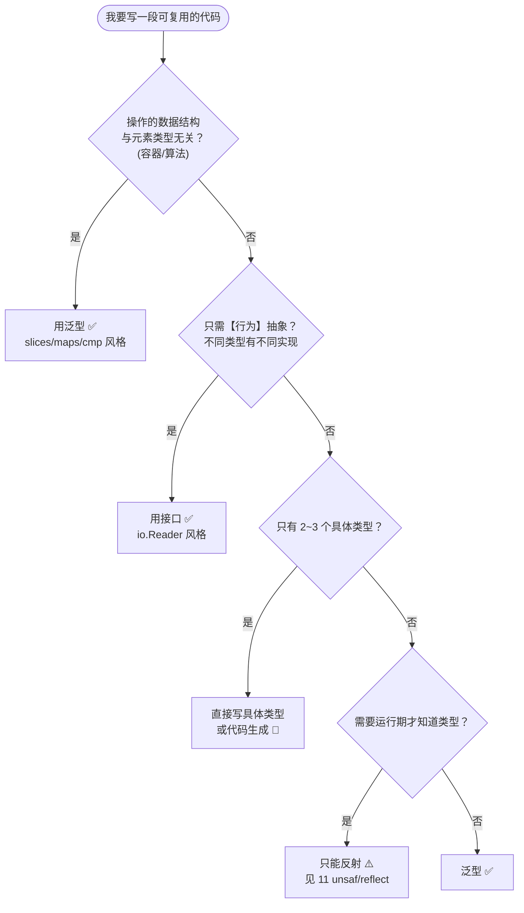
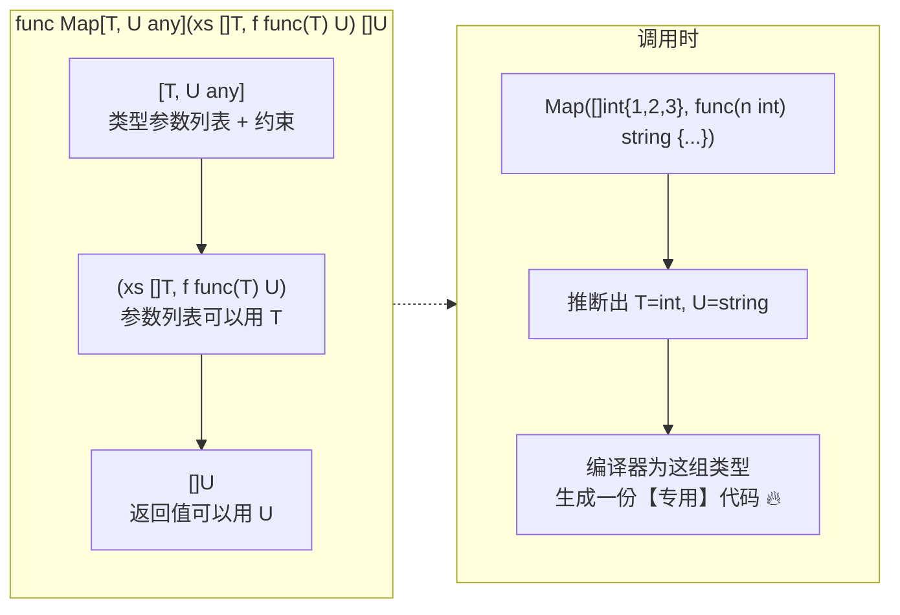
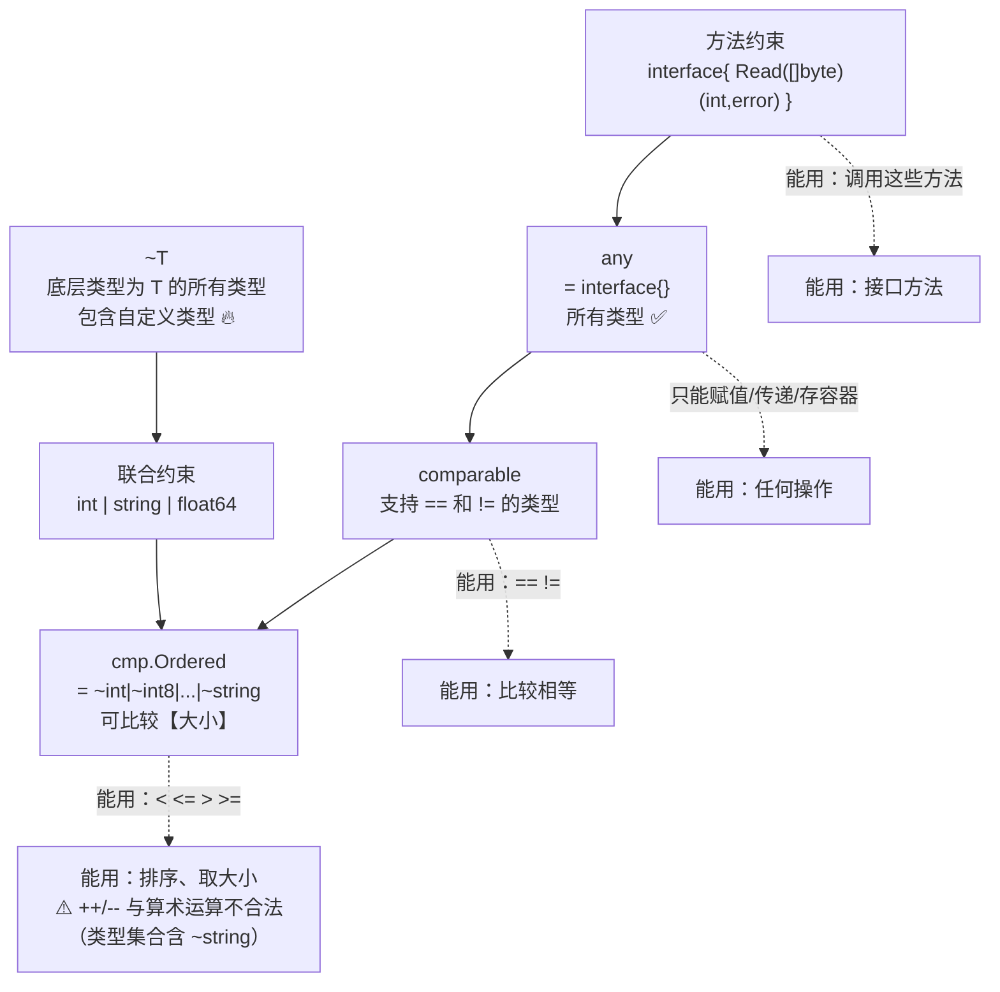

+++
title = "10 泛型"
linkTitle = "10 泛型"
weight = 110
date = "2026-09-20T10:50:00+08:00"
type = "docs"
description = "Go 泛型速查：类型参数语法、约束与 ~T、类型推断、泛型类型与方法、标准库 slices/maps/cmp、真正的限制清单"
isCJKLanguage = true
draft = false
+++

# 10 泛型

Go 1.18 引入类型参数（泛型）。本页回答：**语法怎么写**、**约束怎么表达**、**什么时候该用泛型而不是接口**、**哪些事泛型做不到**。

> 基线：**Go 1.27.1**。所有输出为本机实跑结果。泛型相关特性若无特别说明，均自 **1.18** 起可用；`slices`/`maps`/`cmp` 标准库包需 **1.21+**。

---

## 该不该用泛型：先看决策树

Go 社区对泛型的态度是**克制**：能用接口或具体类型解决就别上泛型。



| 场景 | 选择 | 理由 |
| --- | --- | --- |
| `Map`/`Filter`/`Reduce` 等集合算法 | **泛型** | 纯结构操作，与元素类型无关 |
| 类型安全的容器（`Set[T]`、`Stack[T]`） | **泛型** | 避免 `any` + 断言 |
| 多种实现需要运行期替换 | **接口** | 泛型是编译期单态化，不能存异质集合 |
| 需要在切片里混放不同类型 | **接口** | `[]any` 而不是 `[]T` |
| 只有 `int` 和 `string` 两个用例 | 💭 具体类型或代码生成 | 泛型收益不抵复杂度 |
| 数值计算（求和、比较、排序） | **泛型 + `cmp.Ordered`** | 但**不能**抽象运算符（见下文限制） |

---

## 类型参数语法



```go
// ① 类型参数列表写在函数名之后，约束写在类型参数名之后
func Map[T, U any](xs []T, f func(T) U) []U {
	out := make([]U, 0, len(xs))
	for _, x := range xs {
		out = append(out, f(x))
	}
	return out
}

// ② 泛型类型：类型参数写在类型名之后
type Pair[K comparable, V any] struct {
	Key K
	Val V
}

// ③ 泛型类型的方法：可以使用类型的类型参数，也可以【再声明】自己的 ⚠️ 与很多资料说法不同
func (b Box[T]) Map[U any](f func(T) U) Box[U] { return Box[U]{f(b.v)} }
```

```go
fmt.Println(Map([]int{1, 2, 3}, func(n int) string { return fmt.Sprint(n * 2) }))
```

```text
[2 4 6]
```

### 显式实例化

推断不出来或想强制类型时用方括号：

```go
fmt.Println(Sum[int]([]int{4, 5}))       // 显式指定 T=int
p := NewPair[string, int]("z", 9)        // 多个类型参数
```

⚠️ 语法细节：**类型参数用方括号 `[]`，不是尖括号**。Go 用 `[]` 是为了避免与比较运算符 `<` `>` 产生解析歧义。

---

## 约束：能对类型参数做什么

约束就是**接口**，但可以是「类型集合」。这是 Go 泛型最需要理解的部分：



| 约束 | 允许的操作 | 典型用途 |
| --- | --- | --- |
| `any` | 赋值、传参、放容器 | 通用容器 |
| `comparable` | `==` `!=`、作 map 键 | 去重、查找、`Set[T]` |
| `cmp.Ordered` | `<` `<=` `>` `>=` | 排序、求最值 |
| `~int \| ~string` | 上述 + 类型集合限制 | 自定义数值类型 |
| 方法约束 | 调用约束里的方法 | 泛型 + 行为抽象 🔥 |

### `~T` 是什么：底层类型匹配

```go
type Number interface {
	~int | ~int8 | ~int16 | ~int32 | ~int64 |
		~float32 | ~float64
}

type Celsius float64
type MyInt int

func Sum[T Number](xs []T) T {
	var total T
	for _, x := range xs {
		total += x
	}
	return total
}

fmt.Println(Sum([]int{1, 2, 3}))          // 6
fmt.Println(Sum([]float64{1.5, 2.5}))     // 4
fmt.Println(Sum([]Celsius{1.5, 2.5}))     // 4  ← ~float64 让自定义类型也能进来 🔥
fmt.Println(Sum([]MyInt{1, 2, 3}))        // 6
```

```text
6
4
4
6
```

⚠️ **不加 `~` 的后果**：`int | float64` 只匹配**内置类型本身**，`MyInt` 这种自定义类型**不满足**约束：

| 约束写法 | `int` | `MyInt`（`type MyInt int`） |
| --- | --- | --- |
| `int` | ✅ | 🛑 不满足 |
| `~int` | ✅ | ✅ 满足 🔥 |

💭 **写库时优先用 `~T`**，否则使用者必须为自定义类型单独适配，这是最常见的泛型 API 设计失误。

### 方法约束：把接口当约束用

```go
type Stringer interface{ String() string }

func Join[T Stringer](xs []T, sep string) string {
	parts := make([]string, len(xs))
	for i, x := range xs {
		parts[i] = x.String()      // ✅ 约束里有 String()，所以能调
	}
	return strings.Join(parts, sep)
}
```

⚠️ 约束里**不能有类型参数的接口方法** 🛑：

```go
// 🛑 编译错误：interface method must have no type parameters
type Mapper interface {
	Map[U any](f func(int) U) U
}
```

---

## 类型推断：什么时候不用写方括号

Go 的推断能力有限，但覆盖了绝大多数日常场景：

| 场景 | 能推断？ | 例子 |
| --- | --- | --- |
| 从函数参数推断 | ✅ | `Map(xs, f)` |
| 从多个参数联合推断 | ✅ | `Map[T,U]([]T, func(T) U)` |
| 从返回值推断 | 🛑 | `var x = NewPair(...)` 需要显式 |
| 从赋值目标推断 | 🛑 | `var p Pair[string,int] = NewPair("a", 1)` 才行 |
| 泛型类型的方法调用 | ✅ 部分 | 接收者已实例化时可推断 |
| 约束里有类型集合时 | ⚠️ 有时失败 | 加显式实例化 |

```go
fmt.Println(NewPair("a", 1))          // ✅ 推断 K=string, V=int
fmt.Println(NewPair("a", 1).String()) // ✅

// 推断不出来时必须显式
var empty []int
fmt.Println(Sum(empty))               // ✅ 从参数推断 T=int
fmt.Println(Sum[int](nil))            // ✅ nil 推断不出来，必须显式
```

⚠️ `Sum(nil)` 这类**字面量 nil** 参数推断不出类型，必须写 `Sum[int](nil)`。

---

## 泛型类型与容器

```go
// 类型安全的 Set
type Set[T comparable] map[T]struct{}

func (s Set[T]) Add(v T)       { s[v] = struct{}{} }
func (s Set[T]) Has(v T) bool  { _, ok := s[v]; return ok }
func (s Set[T]) Len() int      { return len(s) }

s := Set[string]{}
s.Add("a")
fmt.Println(s.Has("a"), s.Len())      // true 1
```

```go
// 去重
func Unique[T comparable](xs []T) []T {
	seen := make(map[T]struct{}, len(xs))
	var out []T
	for _, x := range xs {
		if _, ok := seen[x]; !ok {
			seen[x] = struct{}{}
			out = append(out, x)
		}
	}
	return out
}

fmt.Println(Unique([]int{1, 1, 2, 3, 3}))   // [1 2 3]
```

`comparable` 约束的边界：**切片、映射、函数不满足 `comparable`** 🛑：

```go
// 🛑 编译错误：[]int does not satisfy comparable
fmt.Println(Eq([]int{1}, []int{1}))
```

需要比较不可比较类型时，用 `slices.Equal`、`maps.Equal` 或自定义 `Equal` 函数（传比较器）。

---

## 约束该怎么写：三种场景



{}

```go
func Map[T, U any](xs []T, f func(T) U) []U
```

| 约束 | 能做什么 |
| --- | --- |
| `any` | 赋值、传参、放容器 —— **仅此而已** ⚠️ |
| 不能做 | 比较、算术、取字段、调方法 |

💡 需要「对元素做点什么」时，把行为作为**函数参数**传进来，而不是加大约束。

{}

{}

```go
func Unique[T comparable](xs []T) []T {
	seen := make(map[T]struct{}, len(xs))
	...
}
```

| 约束 | 能做什么 |
| --- | --- |
| `comparable` | `==` `!=`、作 map 键 ✅ |
| 不满足 | 切片、映射、函数 ⚠️（它们本来就不可比较） |

⚠️ 需要比较不可比较类型时，加一个 `func(T, T) bool` 参数（`slices.EqualFunc` 就是这么做的）。

{}

{}

```go
type Number interface {
	~int | ~int8 | ~int16 | ~int32 | ~int64 | ~float32 | ~float64
}

func Sum[T Number](xs []T) T {
	var total T
	for _, x := range xs {
		total += x          // 约束里有数值类型集合，+ 才合法 ✅
	}
	return total
}
```

| 约束 | 说明 |
| --- | --- |
| `cmp.Ordered` 🆕 1.21 | 可直接用 `<` `>`，覆盖整数/浮点/字符串 🔥 |
| `~T` | 让**自定义类型**也能满足（`type MyInt int`） 🔥 |
| 联合 `\|` | 显式列出允许的类型集合 |
| `~` 的代价 | 语义放宽，要确认「底层类型」的行为真的适用 |

{}



## 标准库泛型工具

这三套包是**优先使用**的对象——不要自己重复实现：

### `slices` 🆕 1.21

| 函数 | 说明 |
| --- | --- |
| `slices.Sort(s)` / `SortFunc(s, cmp)` | 排序（`SortFunc` 支持自定义比较） |
| `slices.BinarySearch(s, v)` | 二分查找（必须已排序） |
| `slices.Contains(s, v)` / `Index(s, v)` | 查找 |
| `slices.Equal(a, b)` / `EqualFunc` | 相等比较（解决切片不能 `==`） |
| `slices.Clone(s)` | 浅拷贝 🔥 |

| `slices.Delete(s, i, j)` / `Insert(s, i, v...)` | 删除/插入 |
| `slices.Max` / `Min` / `MaxFunc` / `MinFunc` | 最值 |
| `slices.Compact(s)` | 去除**相邻**重复 |
| `slices.Reverse(s)` | 原地反转 |
| `slices.Values(s)` 🆕 1.23 | 元素迭代器 `iter.Seq[E]` |
| `slices.Backward(s)` 🆕 1.23 | **反向**迭代器 `iter.Seq2[int, E]`（带索引，别只接一个变量）⚠️ |
| `slices.Collect(seq)` / `Sorted(seq)` 🆕 1.23 | 迭代器 → 切片 |
| `slices.Chunk(s, n)` | 分块迭代 🆕 1.23 |
| `slices.Repeat(s, n)` | 重复 🆕 1.23 |
| `slices.Concat(as, bs)` 🆕 1.22 | 拼接 |

### `maps` 🆕 1.21

| 函数 | 说明 |
| --- | --- |
| `maps.Clone(m)` | 浅拷贝 |
| `maps.Copy(dst, src)` | 合并 |
| `maps.Equal(a, b)` / `EqualFunc` | 相等比较 |
| `maps.DeleteFunc(m, f)` | 按条件删除 |
| `maps.Keys(m)` / `Values(m)` | 迭代器 🆕 1.23（1.21–1.22 返回切片 ⚠️） |
| `maps.Insert(seq)` / `Collect(seq)` 🆕 1.23 | 迭代器 ↔ map |

### `cmp` 🆕 1.21

```go
cmp.Compare(a, b)     // -1 / 0 / +1，要求 cmp.Ordered
cmp.Less(a, b)        // a < b
cmp.Or(a, b, c)       // 返回第一个非零值，用于默认值 🔥
```

```go
fmt.Println(cmp.Compare(1, 2), cmp.Or("", "fallback"))
```

```text
-1 fallback
```

### 组合使用示例

```go
// 按值排序 map 的键
m := map[string]int{"c": 3, "a": 1, "b": 2}
keys := slices.SortedFunc(maps.Keys(m), func(a, b string) int {
	return cmp.Compare(m[a], m[b])     // 按值升序
})

// 有默认值的配置取值
timeout := cmp.Or(cfg.Timeout, 30*time.Second)
```

---

## 真正的限制清单

这些是**实测确认**的边界，比道听途说要可靠：

| 限制 | 说明 | 替代方案 |
| --- | --- | --- |
| 泛型方法 | 🆕 **1.27 起正式支持**：方法可以声明自己的类型参数 ✅ | 老版本需要写成包级泛型函数 |
| 接口方法不能有类型参数 | 🛑 `interface method must have no type parameters` | 用泛型函数代替泛型方法接口 |
| 约束不能当普通类型用 | 🛑 `cannot use type Number outside a type constraint` | 用 `any` 或具体类型 |
| 不能抽象运算符 | `T + T` 只在约束允许 `+` 时合法，无法写「任意运算符」 | 显式约束 `~int \| ~float64`，或传函数 |
| 没有泛型类型别名 | 🆕 1.24 起**已支持**参数化别名：`type MySlice[T any] = []T` ✅ | 老版本才需要变通 |
| 不能对类型参数做类型断言 | `v.(T)` 是语法错误 🛑 | 先转 `any` 再断言 |
| 不能 `switch v.(type)` 用类型参数 | 同上 | 转 `any` |
| 运行时无类型信息 | 单态化后没有类型参数的概念 | 需要运行期判断只能反射 |
| 泛型方法 | 🆕 1.27 起支持 ✅（此前版本不支持） | — |

⚠️ 这一条容易踩到**版本陷阱**：网上大量文章说「Go 不支持泛型方法」，在 1.26 及以前这是对的，但从 **Go 1.27 起泛型方法已成为语言特性**（官方 1.27 Release Notes 明确写入）。实测结果：

```go
type Box[T any] struct{ v T }

// ✅ 1.27 起合法：方法可以声明自己的类型参数 U
func (b Box[T]) Map[U any](f func(T) U) Box[U] { return Box[U]{f(b.v)} }

b.Map(func(n int) string { return fmt.Sprint(n * 2) })   // 6
```

⚠️ 但**接口**的方法仍然不能声明类型参数，而且**泛型方法不能用来实现接口方法**：

```go
// 🛑 编译错误：interface method must have no type parameters
type Mapper interface {
	Map[U any](f func(int) U) U
}
```

💡 标准库已经用上了这个特性：`math/rand/v2` 的 `(*Rand).N[Int intType](Int) Int` 就是一个泛型方法。

### 性能：单态化，不是装箱

```text
泛型 vs 接口的代码生成
┌─────────────────────────────────────────────┐
│ 泛型 func Sum[T Number](xs []T) T            │
│   Sum[int]    → 生成一份 int 专用代码 ✅ 无装箱 │
│   Sum[float64]→ 生成一份 float64 专用代码      │
│   代价：二进制体积随实例化组合增长 ⚠️           │
├─────────────────────────────────────────────┤
│ 接口 func Sum(xs []Number) Number（不存在，示意）│
│   一份代码，但每次调用都要装箱/查表 ⚠️          │
└─────────────────────────────────────────────┘
```

| 维度 | 泛型 | 接口 |
| --- | --- | --- |
| 性能 | 单态化，无装箱开销 ✅ | 有接口调用与装箱开销 |
| 二进制大小 | 随类型组合膨胀 ⚠️ | 固定 |
| 编译时间 | 变长 ⚠️ | 短 |
| 异质集合 | 🛑 不支持 | ✅ 支持 |

💭 实践结论：**热路径且类型固定 → 泛型；需要运行期多态 → 接口**。

---

## 本页陷阱速查

| 症状 | 实际原因 | 正确做法 |
| --- | --- | --- |
| 自定义类型不满足约束 | 约束写了 `int` 而不是 `~int` | 加 `~` |
| `cannot use type X outside a type constraint` | 把约束接口当普通类型用了 | 用具体类型或 `any` |
| `interface method must have no type parameters` | 接口方法声明了类型参数 | 改成泛型函数 |
| `Sum(nil)` 编译失败 | nil 推断不出类型参数 | `Sum[int](nil)` |
| 切片不满足 `comparable` | 切片本来就不能 `==` | 用 `slices.Equal` |
| 无法写「任意数值类型求和」 | 运算符不能抽象 | 用 `cmp.Ordered` 或自定义约束 |
| `[]T` 里想混放不同类型 | 泛型是编译期单态化 | 用 `[]any` |
| `maps.Keys` 返回类型与预期不符 | 1.23 起改为迭代器 | 用 `slices.Collect(maps.Keys(m))` |
| 二进制体积暴涨 | 泛型实例化组合过多 | 收敛类型组合，或退化为接口 |
| 泛型代码比手写慢 | 有间接调用或未内联 | 用基准测试确认，别猜 |

---

📘 官方参考：[Spec — Type parameters](https://go.dev/ref/spec#Type_parameter_declarations)、[Go Blog — An Introduction To Generics](https://go.dev/blog/intro-generics)、[Go 1.21 Release Notes](https://go.dev/doc/go1.21)、[When To Use Generics](https://go.dev/blog/when-generics)

➡️ 上一节：[09 错误处理]() ｜ 下一节：[11 内存·指针·unsafe]()
