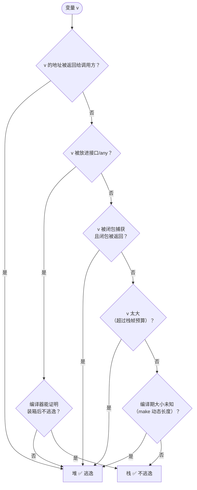
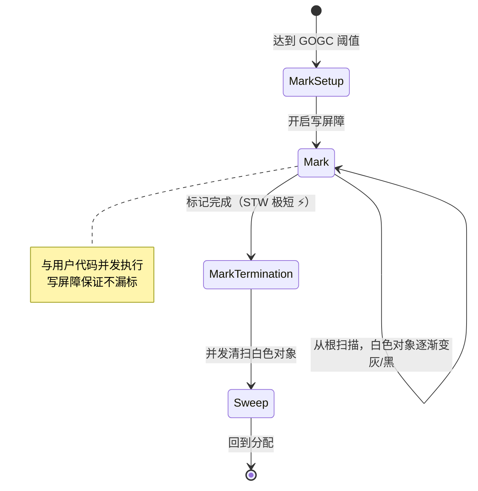
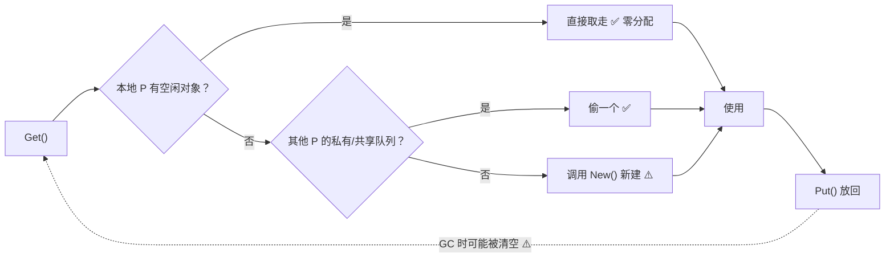

+++
title = "11 内存·指针·unsafe"
linkTitle = "11 内存·指针·unsafe"
weight = 111
date = "2026-09-20T10:55:00+08:00"
type = "docs"
description = "Go 内存速查：栈与堆、逃逸分析判据、new 与 make 的区别、GC 与调优旋钮、sync.Pool、unsafe 包的安全边界"
isCJKLanguage = true
draft = false
+++

# 11 内存·指针·unsafe

本页回答：**变量到底分配在哪**、**`new` 和 `make` 差在哪**、**GC 怎么调**、**`unsafe` 什么时候值得用**。

> 基线：**Go 1.27.1** / darwin/arm64。逃逸分析输出由本机 `go build -gcflags=-m` 实测得到。

---

## 栈与堆：谁决定变量放哪

Go 的内存分配由**编译器**决定，判据叫**逃逸分析（escape analysis）**：变量如果「活不过当前函数」或「不需要在函数外可见」，就可以放在栈上。



**关键结论**：Go 里「取地址」**不等于**「分配到堆」。局部指针完全可以留在栈上——这与其他语言（如 C# 的 `ref struct` 限制、Java 的逃逸分析优化）都不同，Go 把这件事交给了编译器自动判断。

### 实测：逃逸分析的判定结果

```go
//go:noinline
func heapReturn() *Point { return &Point{1, 2} }   // 返回给调用方

//go:noinline
func stackLocal() int {
	p := &Point{3, 4}      // 只在函数内用
	return p.X + p.Y
}

//go:noinline
func toInterface(v any) { _ = v }                   // 装箱

//go:noinline
func closureCapture() func() int {
	n := 42
	return func() int { return n }                   // 被返回的闭包捕获
}
```

```console
$ go build -gcflags="-m -l" .
./escape.go:8:35: &Point{...} escapes to heap          ← heapReturn
./escape.go:12:7: &Point{...} does not escape          ← stackLocal 🔥
./escape.go:17:18: v does not escape                   ← 编译器证明装箱参数不逃逸
./escape.go:22:9: func literal escapes to heap         ← 闭包本身
```

| 写法 | 判定 | 原因 |
| --- | --- | --- |
| 返回 `&T{}` | **堆** | 地址暴露给调用方 |
| 局部 `&T{}` 只在函数内解引用 | **栈** ✅ | 编译器能证明生命周期 |
| `any(v)` 传给未知函数 | 视情况 | 若编译器能证明不逃逸则留在栈 |
| 被**返回的**闭包捕获 | **堆** | 闭包活过了函数 |
| `make([]T, n)` 且返回 | **堆** | 长度编译期未知 + 被返回 |
| `make([]T, 0, 3)` 且未返回 | **栈** ✅ | 常量长度 + 不逃逸 |

💡 **看自己代码的逃逸情况**：

```console
$ go build -gcflags="-m" ./...             # 逃逸摘要 + 内联决策
$ go build -gcflags="-m -m" ./...          # 更详细的原因
$ go build -gcflags="-m -l" ./...          # -l 禁用内联，看真实逃逸
```

⚠️ 加 `-l` 很重要：内联会改变逃逸结论，不开 `-l` 看到的常常是「内联后」的乐观结果。

### 栈：不是固定大小的

每个 goroutine 的初始栈只有 **2 KB**，按需增长（可到默认上限 1 GB）。

```text
goroutine 栈的增长
┌──────────┐  需要更多栈帧   ┌───────────────┐  继续增长  ┌────────────────────┐
│  2 KB    │ ─────────────► │  4 KB → 8 KB  │ ────────► │ ... → 上限 1 GB ⚠️ │
│ 初始栈    │   复制到新栈     │  内容整体搬迁   │           │ 超出 → stack overflow│
└──────────┘                └───────────────┘           └────────────────────┘
```

⚠️ 栈增长要**复制**内容，所以**指向栈上变量的指针不能在栈搬迁后失效**——这就是为什么「逃逸到栈外」的指针必须放堆。栈溢出（无限递归）的表现是：

```text
runtime: goroutine stack exceeds 1000000000-byte limit
fatal error: stack overflow
```

这是 **fatal error，不可 recover** ⚠️。

---

## new 与 make：两个完全不同的东西

| 表达式 | 返回 | 用于 | 结果 |
| --- | --- | --- | --- |
| `new(T)` | `*T` | **任意类型** | 指向 T 的零值的指针 |
| `make(T, ...)` | `T`（本身） | **仅 slice / map / chan** | 已初始化的可用值 |

```go
np := new(int)          // *int，指向 0
fmt.Println(*np)        // 0

ns := new([]int)        // *[]int，切片【头】本身是 nil ⚠️
fmt.Println(*ns == nil) // true，len 也是 0
*ns = append(*ns, 1)    // 还能用，但很别扭

ms := make([]int, 0, 4) // []int，已初始化，cap=4
```

```text
new(int): 0 true
new([]int): true 0
make slice: 0 4
make map/chan: true true
```

```go
// make 的三种用法
s := make([]int, 5)        // len=5, cap=5
s2 := make([]int, 0, 100)  // len=0, cap=100（预分配，最常用）🔥
m := make(map[string]int)  // 空 map，可写 ✅
m2 := make(map[string]int, 100)  // 预分配 bucket
ch := make(chan int)       // 无缓冲
ch2 := make(chan int, 10)  // 有缓冲
```

| 常见误解 | 真相 |
| --- | --- |
| `new([]int)` 得到可用切片 | 🛑 得到指向 nil 切片的指针，几乎没人这么写 |
| `make` 能用于结构体 | 🛑 结构体用 `&T{}` 或 `new(T)` |
| `new(T)` 和 `&T{}` 有性能差异 | 基本没有，`&T{}` 更常用（可同时初始化字段）💭 |
| `make(map, 0)` 与 `make(map)` 有差 | 无差别，容量只是提示 |

💡 **实践**：日常只需要记 `make` 用来建 slice/map/chan，结构体用 `&T{...}`，`new` 几乎用不上。

---

## 指针：什么时候该用

Go 的指针**没有算术运算**（除非用 `unsafe`），比 C 安全得多。

```go
x := 42
p := &x          // *int
*p = 100         // 通过指针修改
fmt.Println(x)   // 100

var np *int      // 零值是 nil
// *np = 1       // 💥 panic: nil pointer dereference
```

### 用指针的四个正当理由

| 理由 | 例子 |
| --- | --- |
| **需要修改调用方的值** | `func (u *User) SetName(n string)` 🔥 |
| **避免大结构体拷贝** | `func process(b *BigStruct)` |
| **表示「可能不存在」** | `*string` 区分「空字符串」与「未设置」 |
| **共享同一份可变状态** | 多个 goroutine 共享配置对象 |

### 不该用指针的情况

```go
// 🛑 小结构体用指针反而多一次间接寻址
func (p *Point) Dist() float64 { ... }   // Point 只有 16 字节，值接收者更好

// 🛑 为了「省内存」把 []int 换成 []*int —— 更费内存
// 每个 int 8 字节，每个指针也 8 字节，还多了一次解引用

// 🛑 返回指向循环变量的指针（1.22 前是同一个地址）
```

### 指针的零值与判空

```go
type Config struct {
	Timeout *time.Duration   // nil 表示「用默认值」
	Name    *string          // nil 表示「未设置」
}

// 使用时要判空
if c.Timeout != nil {
	timeout = *c.Timeout
}
```

💭 这与 JSON 的 `omitempty` 配合时很常见：`omitzero`/`*T` 字段能区分「零值」和「未提供」（见 [16]()）。

---

## GC：并发三色标记

Go 的 GC 是**并发、三色标记-清除**，目标是**低延迟**而非高吞吐。



🆕 **Green Tea GC**：Go 1.25 作为实验引入，**Go 1.26 起默认启用**。它通过更好的局部性与 CPU 可扩展性来加速小对象的标记与扫描，官方给出的预期是**降低 10%~40% 的 GC 开销**。可用 `GOEXPERIMENT=nogreenteagc` 关闭（实测 1.27.1 中该开关**依然存在且可用**，`$GOROOT/src/internal/goexperiment/` 下 on/off 两份文件都在）。

| 阶段 | 是否 STW | 说明 |
| --- | --- | --- |
| Mark Setup | ✅ 极短（微秒级） | 开启写屏障 |
| Mark | ❌ 并发 | 与用户代码同时跑，占约 25% CPU ⚠️ |
| Mark Termination | ✅ 极短 | 收尾 |
| Sweep | ❌ 并发 | 惰性清扫 |

### 两个调优旋钮

| 变量 | 默认 | 作用 | 调整方向 |
| --- | --- | --- | --- |
| `GOGC` | `100` | 堆增长到上次的 2 倍时触发 GC | 调大 → 省 CPU 费内存；`off` 关闭 |
| `GOMEMLIMIT` | 无限制 | **软**内存上限 🆕 1.19 | 容器里设为内存限制的 90% 🔥 |

```console
$ GOGC=200 ./app            # GC 频率减半，内存翻倍
$ GOMEMLIMIT=400MiB ./app   # 内存接近 400MiB 时更激进地 GC
$ GOGC=off GOMEMLIMIT=1GiB ./app   # 只在接近上限时 GC（批处理常用）
```

```go
// 运行期调整
debug.SetGCPercent(200)
debug.SetMemoryLimit(400 << 20)

// 手动触发（谨慎，通常只在基准测试前用）
runtime.GC()

// 读取内存统计
var ms runtime.MemStats
runtime.ReadMemStats(&ms)
fmt.Println(ms.HeapAlloc>>20, "MiB")
```

⚠️ `GOMEMLIMIT` 是**软限制**：Go 会尽量不超，但如果活着的数据本身就超了，它无法阻止（不会 OOM kill，但会持续 GC）。

💭 **容器实践**：`GOMEMLIMIT` 设为容器内存上限的 85~90%，`GOGC` 保持默认。这样既避免 OOM Kill，又不会因 GC 过频浪费 CPU。

### GC 与 finalizer / 弱引用

| 机制 | 引入 | 用途 |
| --- | --- | --- |
| `runtime.SetFinalizer` | 1.0 | 旧机制；官方文档明说「新代码应考虑 AddCleanup」⚠️ 不保证执行 |
| `runtime.AddCleanup` | 🆕 1.24 | 更高效安全的清理机制，**新代码用它** |
| `weak.Pointer[T]` | 🆕 1.24 | 弱指针，用于缓存/规范化表 |

```go
// 🆕 1.24：推荐的资源清理方式（本机实测签名）
//   func AddCleanup[T, S any](ptr *T, cleanup func(S), arg S) Cleanup
type File struct{ fd uintptr }

func open(path string) *File {
	f := &File{fd: mustOpen(path)}
	runtime.AddCleanup(f, func(fd uintptr) { syscall.Close(int(fd)) }, f.fd)
	return f
}
```

⚠️ 注意文档里的一条硬约束：**如果 `ptr` 能从 `cleanup` 或 `arg` 到达，它就永远不会被回收，cleanup 也永远不会运行**。所以 `arg` 必须是底层资源（如 fd），不能是 `ptr` 本身——`AddCleanup` 在 `arg == ptr` 时会直接 panic。

⚠️ finalizer/cleanup **不能保证在程序退出前执行**，只适合「兜底释放」，不能替代显式的 `Close()`。

---

## sync.Pool：减少分配，不是缓存

```go
var bufPool = sync.Pool{
	New: func() any { return new(bytes.Buffer) },
}

func handler() {
	buf := bufPool.Get().(*bytes.Buffer)
	buf.Reset()            // ⚠️ 必须重置，Pool 不保证干净
	defer bufPool.Put(buf)
	// 用 buf 干活
}
```



| 特性 | 说明 |
| --- | --- |
| 用途 | 复用**临时**对象，降低分配压力 🔥 |
| GC 行为 | **每次 GC 可能清空 Pool** ⚠️ 不能当缓存 |
| 并发 | 自带 per-P 缓存，无锁快速路径 |
| 不保证 | `Get` 可能返回 nil（若 `New` 也为 nil） |
| 常见场景 | `bytes.Buffer`、`[]byte` 缓冲、编解码临时对象 |

⚠️ **不要把 Pool 当缓存用**：放进去的东西随时可能消失。要缓存就用 map + 淘汰策略。

### 一个真实的 Pool 场景

```go
var encPool = sync.Pool{New: func() any { return json.NewEncoder(io.Discard) }}

// 🛑 每次请求都新建 Encoder 会持续分配
// ✅ 复用，但注意 Encoder 持有 writer 引用，用完要 Reset
```

💭 先测再优化：`sync.Pool` 只在**基准测试证明分配是瓶颈**时才值得引入，它会增加代码复杂度（要记得 `Reset`、不能跨越 goroutine 传递语义）。

---

## unsafe：四个可用工具与三条铁律

`unsafe` 包能绕过类型系统，代价是**失去兼容性保证**。

| 工具 | 签名 | 用途 |
| --- | --- | --- |
| `unsafe.Pointer` | 任意指针互转的桥梁 | 唯一能转类型的指针 |
| `unsafe.Sizeof(x)` | `uintptr` | 类型大小（编译期常量） |
| `unsafe.Alignof(x)` | `uintptr` | 对齐要求 |
| `unsafe.Offsetof(f)` | `uintptr` | 字段偏移 |
| `unsafe.Add(p, n)` 🆕 1.17 | `Pointer` | 指针偏移（替代 `uintptr` 算术）🔥 |
| `unsafe.Slice(p, n)` 🆕 1.17 | `[]T` | 指针 + 长度 → 切片（**零拷贝**） |
| `unsafe.SliceData(s)` 🆕 1.20 | `*T` | 切片 → 首元素指针 |
| `unsafe.String(p, n)` 🆕 1.20 | `string` | 指针 + 长度 → 字符串（**零拷贝**） |
| `unsafe.StringData(s)` 🆕 1.20 | `*byte` | 字符串 → 字节指针 |

```go
fmt.Println("Sizeof:", unsafe.Sizeof(Small{}), unsafe.Sizeof(Big{}), unsafe.Sizeof(int64(0)))
fmt.Println("Alignof:", unsafe.Alignof(Small{}), unsafe.Alignof(int64(0)), unsafe.Alignof(true))
fmt.Println("Offsetof:", unsafe.Offsetof(Small{}.A), unsafe.Offsetof(Small{}.B))
```

```text
Sizeof: 16 65536 8
Alignof: 8 8 1
Offsetof: 0 8
```

### `unsafe.Pointer` 的合法转换

Go 允许这几种转换（其他都是未定义行为）：

```text
✅ 允许的转换
   *T  ──►  unsafe.Pointer  ──►  *U          （任意指针互转）
   *T  ──►  unsafe.Pointer  ──►  uintptr     （仅用于打印/比较）
   uintptr  ──►  unsafe.Pointer  ──►  *T     （仅在同一个表达式内 ⚠️）

🛑 禁止
   *T ──► uintptr ──► 保存到变量 ──► 之后再转回 unsafe.Pointer
   → GC 可能在中间移动对象，指针失效 💥
```

⚠️ **铁律一**：`uintptr` **不能**跨语句保存后再转回指针。必须在**同一个表达式**里完成转换：

```go
// 🛑 危险：中间的 GC 可能让 p 失效
u := uintptr(unsafe.Pointer(p))
// ... 这里可能发生 GC 与栈增长 ...
q := (*T)(unsafe.Pointer(u))

// ✅ 正确：一气呵成
q := (*T)(unsafe.Pointer(uintptr(unsafe.Pointer(p)) + offset))
// ✅ 更好：直接用 unsafe.Add
q := (*T)(unsafe.Add(unsafe.Pointer(p), offset))
```

⚠️ **铁律二**：`unsafe.Slice` / `unsafe.String` 创建的切片/字符串**与原内存共享**。原内存被修改或回收，你拿到的东西就变了。

```go
b := []byte("hello")
s := unsafe.String(&b[0], len(b))   // ⚠️ s 与 b 共享内存，改 b 会影响 s
```

⚠️ **铁律三**：Go 1 兼容性承诺**不覆盖** `unsafe` 的用法。升级 Go 版本可能让依赖内部布局的代码失效。

### 值得用 unsafe 的场景

| 场景 | 例子 |
| --- | --- |
| **零拷贝** `[]byte` ↔ `string` | 高性能解析、网络框架 |
| 结构体字段布局内省 | 序列化库、ORM、`reflect` 替代 |
| 与 C 互操作 | cgo 边界传递数据 |
| 原子操作自定义类型 | 高版本已内置泛型 `atomic`，用得少了 |
| 编译期常量表达式 | `unsafe.Sizeof` 用在数组长度里 |

### 不值得用 unsafe 的场景

| 场景 | 更好的做法 |
| --- | --- |
| 「为了快一点」而不测量 | 先 `go test -bench` + `pprof` |
| 想访问结构体私有字段 | 改 API 设计 |
| 想做类型转换 | 用类型断言或泛型 |
| 想优化字符串拼接 | `strings.Builder` |
| 想避免切片拷贝 | `slices.Clone` 已经够快 |

💭 **决策标准**：只有在**有基准数据证明**、并且**写下注释说明依赖了哪个实现细节**时，才引入 `unsafe`。生产代码里它应该是稀有物种。

---

## 内存问题的排查工具

| 工具 | 命令 | 看什么 |
| --- | --- | --- |
| 逃逸分析 | `go build -gcflags="-m -l"` | 谁分配到了堆 |
| 堆剖析 | `go tool pprof http://localhost:6060/debug/pprof/heap` | 谁在占内存 🔥 |
| 分配剖析 | `-alloc_space` | 累计分配（含已回收） |
| 内存统计 | `runtime.ReadMemStats` | HeapAlloc / HeapObjects |
| GC 追踪 | `GODEBUG=gctrace=1` | GC 频率与停顿 |
| 竞态检测 | `go test -race` | 数据竞争（不是内存泄漏） |
| 泄漏检测 | 对比两次 heap profile | 持续增长的对象 |

```console
$ GODEBUG=gctrace=1 go run .
gc 1 @0.008s 1%: 0.070+0.31+0.020 ms clock, 0.70+0.16/0.55/0+0.20 ms cpu, 3->4->0 MB, 4 MB goal, 0 MB stacks, 0 MB globals, 10 P
gc 2 @0.011s 1%: 0.011+0.22+0.008 ms clock, 0.11+0.044/0.47/0.23+0.089 ms cpu, 3->3->1 MB, 4 MB goal, 0 MB stacks, 0 MB globals, 10 P
```

| 字段 | 含义 |
| --- | --- |
| `@0.008s` | 距程序启动的时间 |
| `1%` | GC 累计占用的 CPU 比例 🔥 |
| `0.070+0.31+0.020 ms clock` | STW-标记开始 + 并发标记 + STW-标记结束 |
| `3->4->0 MB` | GC 开始时堆 → GC 结束时堆 → 存活堆 |
| `4 MB goal` | 下次触发的目标堆大小 |
| `10 P` | 参与调度的 P 数量（GOMAXPROCS 相关） |

---

## 本页陷阱速查

| 症状 | 实际原因 | 正确做法 |
| --- | --- | --- |
| 以为取地址就上堆 | 局部指针可留在栈上 | 用 `-gcflags=-m -l` 看真实判定 |
| 无限递归后进程直接崩 | 栈溢出是 fatal error，不可 recover | 加深度限制或改迭代 |
| `new([]int)` 后 append 报错 | 得到的是指向 nil 切片的指针 | 直接用 `make` 或 `var s []int` |
| `make(map)` 后立刻写入正常，nil map 写入 panic | 只有 `make` 的 map 可写 | 一定初始化 |
| 容器里被 OOM Kill | 没设内存上限，Go 不知道 cgroup 限制 | `GOMEMLIMIT` + `GOMAXPROCS` |
| GC 占用大量 CPU | 默认 GOGC=100 触发频繁 | 调大 GOGC 或设 GOMEMLIMIT |
| `sync.Pool` 里的对象偶尔不见了 | GC 会清空 Pool | 它只做复用，不做缓存 |
| Pool 取出的 buffer 有脏数据 | Pool 不保证干净 | 取出后 `Reset()` |
| finalizer 没执行 | 不保证在退出前运行 | 显式 `Close()`，cleanup 只做兜底 |
| `unsafe` 代码升级 Go 后崩了 | 依赖了内部布局，不在兼容承诺内 | 减少依赖面，加注释与测试 |
| 字符串被 `unsafe.String` 改后内容变了 | 零拷贝共享底层内存 | 只用于只读场景 |

---

📘 官方参考：[Go Blog — Escape Analysis](https://go.dev/doc/faq#stack_or_heap)、[A Guide to the Go Garbage Collector](https://go.dev/doc/gc-guide)、[unsafe 包文档](https://pkg.go.dev/unsafe)、[Go 1.24 — weak 与 AddCleanup](https://go.dev/doc/go1.24#runtime)

➡️ 上一节：[10 泛型]() ｜ 下一节：[12 goroutine 与 channel]()
