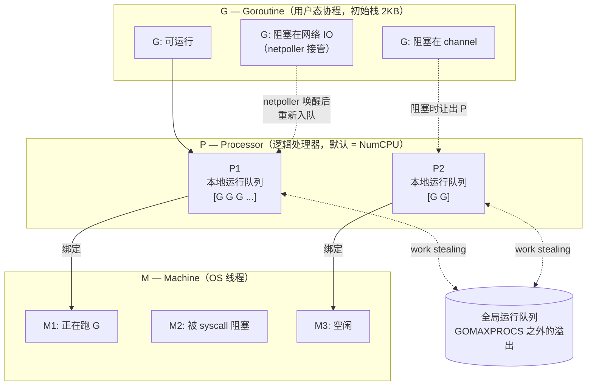
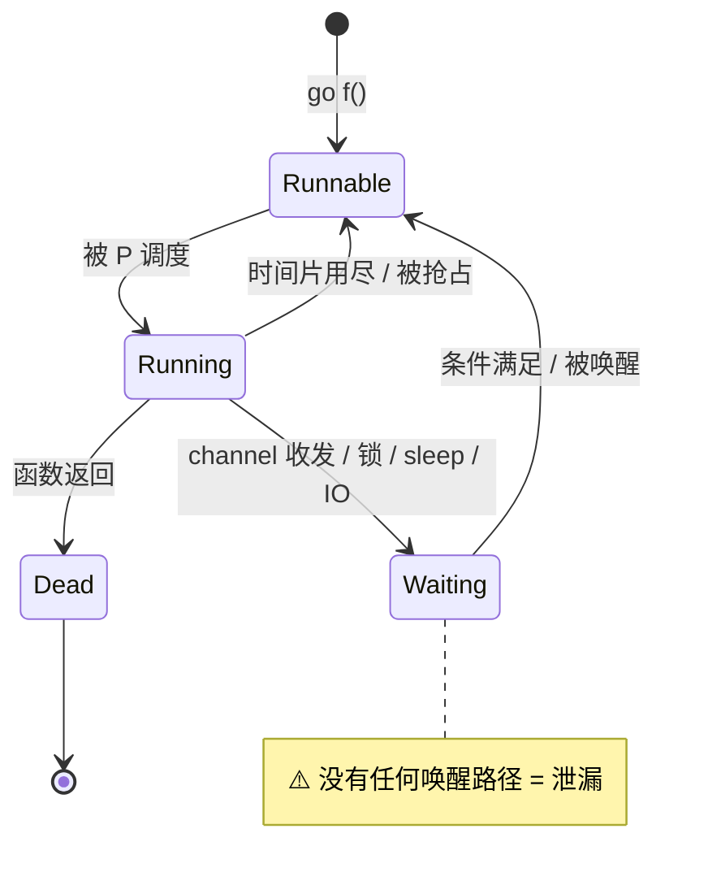
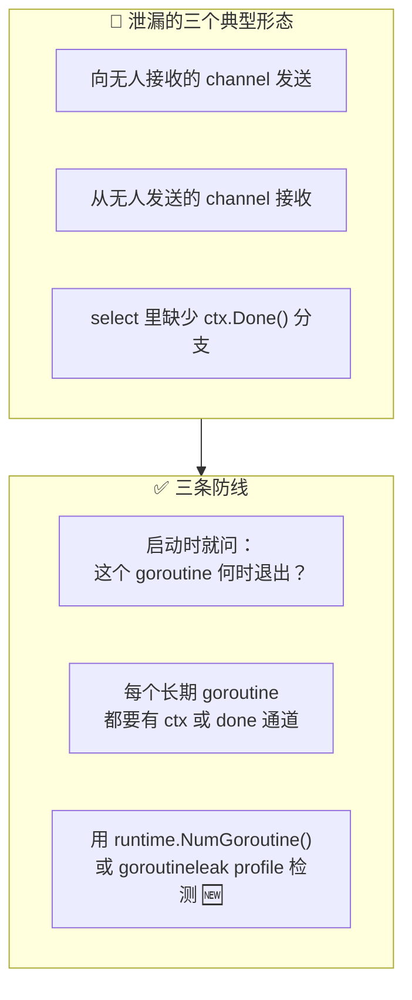
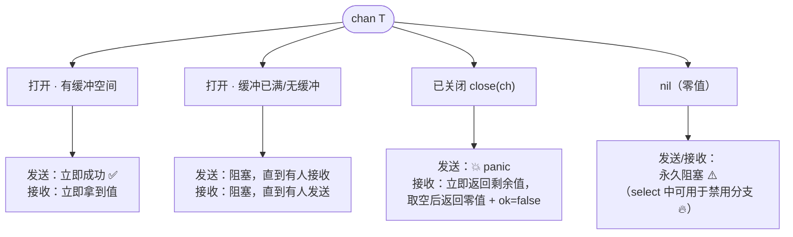
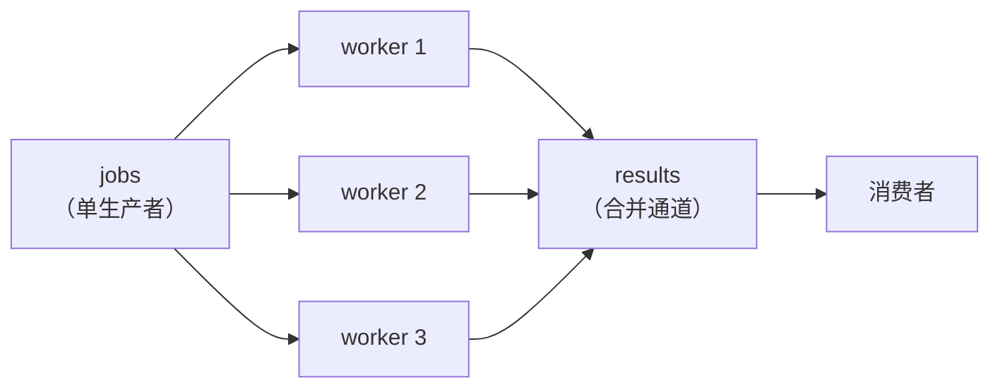
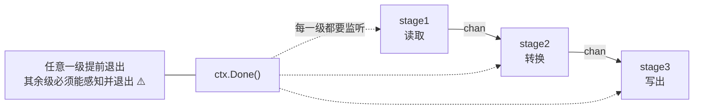

+++
title = "12 goroutine 与 channel"
linkTitle = "12 goroutine 与 channel"
weight = 112
date = "2026-09-20T11:00:00+08:00"
type = "docs"
description = "Go 并发速查：GMP 调度模型、goroutine 生命周期、channel 三种状态、close 语义、select 多路复用、超时与取消、生成器与管线"
isCJKLanguage = true
draft = false
+++

# 12 goroutine 与 channel

本页回答：**`go` 到底启动了什么**、**channel 什么时候阻塞**、**`close` 之后会发生什么**、**`select` 怎么写才不漏 goroutine**。

> 基线：**Go 1.27.1**。所有输出为本机实跑结果。

---

## GMP：Go 调度的三层结构



| 概念 | 含义 | 关键点 |
| --- | --- | --- |
| **G** | goroutine | 初始栈 **2 KB**，可增长；创建成本约几百纳秒 |
| **M** | OS 线程 | 由内核调度；数量不随 `GOMAXPROCS` 增长，但运行时默认上限 **10000**（`debug.SetMaxThreads` 可调，超过即崩溃）|
| **P** | 逻辑处理器 | 数量 = `GOMAXPROCS`，**同一时刻只有 P 个 goroutine 在真正跑 Go 代码** 🔥 |
| work stealing | 偷任务 | P 空闲时会从别的 P 或全局队列偷 G，保证负载均衡 |
| netpoller | 网络轮询器 | 网络 IO 阻塞时 G 被挂起，M 可以去跑别的 G ✅ |
| 抢占 | 协作 + 异步抢占 | 🆕 1.14 起基于信号的异步抢占，长循环不再霸占 P |

```go
runtime.NumCPU()          // 逻辑 CPU 数
runtime.NumGoroutine()    // 当前 goroutine 数（泄漏排查常用）
runtime.GOMAXPROCS(0)     // 查询当前值（传 0 表示只查询）
runtime.GOMAXPROCS(4)     // 设置
```

⚠️ **`GOMAXPROCS` 不是 goroutine 上限**，它只是「同时执行 Go 代码的 P 数量」。你可以轻松起 100 万个 goroutine，但同一时刻只有 `GOMAXPROCS` 个在跑。

🆕 **1.25 起容器感知**：在 Linux 上运行时，`GOMAXPROCS` 默认会考虑容器的 cgroup CPU 带宽限制（对应 Kubernetes 的 `limits.cpu`）；所有平台都会周期性更新该值。手动设置 `GOMAXPROCS` 环境变量或调用 `runtime.GOMAXPROCS` 会关闭这两种行为。

💭 **容器里不要在 CPU limit 很低时把 GOMAXPROCS 设成宿主机核数**——那会导致严重的调度抖动。1.25 之后默认行为已经帮你处理了，除非有特殊理由，别覆盖它。

---

## goroutine 的生命周期



### 三种启动方式

```go
// ① 具名函数
go worker(ctx)

// ② 闭包（常带参数）
go func(id int) { process(id) }(i)

// ③ 方法
go s.serve(ctx)
```

⚠️ **goroutine 没有返回值，也不能被「join」**。要让调用方等待，必须用：
- `sync.WaitGroup`（知道数量）
- channel（要收结果）
- `errgroup.Group`（要收错误，见 [13]()）

### goroutine 泄漏：最常见的并发 bug

```go
// 🛑 泄漏：ch 无缓冲，没人接收，goroutine 永久阻塞
func leak() {
	ch := make(chan int)
	go func() { ch <- 42 }()   // 这个 goroutine 永远不会结束
	// 函数返回，ch 不可达，但 goroutine 还挂在 channel 上
}

// ✅ 修复 1：加缓冲
ch := make(chan int, 1)

// ✅ 修复 2：用 select + ctx 提供退出路径
select {
case ch <- 42:
case <-ctx.Done():
}
```



🆕 **1.27 起可用 goroutine 泄漏剖析**（`/debug/pprof/goroutineleak`）：运行时借助 GC 可达性分析，能自动识别「阻塞在永远不可能被唤醒的并发原语上」的 goroutine。它靠可达性判断，所以对「全局变量可达的 channel」这类泄漏可能识别不出来。

⚠️ **panic 不会跨 goroutine 传播**：任何 goroutine 里未 recover 的 panic 都会**崩溃整个进程**。长期运行的 goroutine 顶部应该有 recover（见 [06]()）。

---

## channel：三种状态与五条规则



```text
channel 三种状态的读写行为（记这张图就够）

【无缓冲 make(chan T)】同步交接
   发送方 ──阻塞──┐                ┌──阻塞── 接收方
                  │  必须有对面    │
                  └──► 值直接传递 ─┘
   len=0 cap=0，无任何缓冲

【有缓冲 make(chan T, 2)】异步队列
   ┌──────────────────────────────┐
   │ [ 1 ][ 2 ][   ]              │  队列
   └──────────────────────────────┘
      ▲            ▲         ▲
      │            │         │
   发送满则阻塞   取走即空   缓冲未满 → 发送不阻塞
   len = 当前元素数    cap = 队列长度

【已关闭 close(ch)】
   ┌──────────────────────────────┐
   │ [ 1 ][ 2 ]  ✗ 不能写          │
   └──────────────────────────────┘
   写 → 💥 panic: send on closed channel
   读 → 先吐完剩余值，再返回 零值 + ok=false ✅
       （这就是 for range ch 能退出的原因）

【nil channel（零值）】
   var ch chan int
   写 → 永久阻塞   读 → 永久阻塞
   在 select 里用它 = 永久禁用该分支 🔥
```

| # | 规则 | 后果 |
| --- | --- | --- |
| 1 | 向 `nil` channel 收发 → **永久阻塞** | select 里可用来禁用分支 🔥 |
| 2 | 向**已关闭**的 channel 发送 → **panic** | 只有发送方应该 `close` |
| 3 | **重复 close** → **panic** | 用 `sync.Once` 或确保单一 owner |
| 4 | 从已关闭 channel 接收 → 返回剩余值，然后零值 + `ok=false` | `for range` 靠这个退出 |
| 5 | 关闭**只读** channel（`<-chan T`）→ 编译错误 | 用类型系统保证单一发送方 |

```go
ch := make(chan int, 2)
ch <- 1
ch <- 2
fmt.Println("len/cap:", len(ch), cap(ch), <-ch, <-ch)   // len=2 cap=2

c := make(chan int, 2)
c <- 1
close(c)
v, ok := <-c
fmt.Println("recv after close:", v, ok)   // 1 true  ← 还有数据
v2, ok2 := <-c
fmt.Println("drained:", v2, ok2)          // 0 false  ← 取空了，零值 + false
```

```text
len/cap: 2 2 1 2
recv after close: 1 true
drained: 0 false
```

```go
// 三种 panic 场景（实测均可被 recover 捕获，但生产中不该出现）
ch <- 1    // 向已关闭的 channel 发送 → panic: send on closed channel
close(ch)  // 重复关闭 → panic: close of closed channel
```

### 无缓冲 vs 有缓冲：选哪个

| 维度 | 无缓冲 `make(chan T)` | 有缓冲 `make(chan T, n)` |
| --- | --- | --- |
| 语义 | **同步交接**（rendezvous） | **异步队列** |
| 发送方 | 阻塞到有人接收 | 缓冲未满则不阻塞 |
| 接收方 | 阻塞到有人发送 | 缓冲非空则不阻塞 |
| 适用 | 需要确认「对方收到了」🔥 | 削峰、解耦生产消费速度 |
| 风险 | 双方必须同时在场，易死锁 | 缓冲掩盖背压问题 ⚠️ |

💭 **默认用无缓冲**，除非你能说清「为什么要缓冲这么多」——缓冲区的深度是一个需要论证的设计参数，不是随手填的常数。

### channel 的方向类型

```go
func producer(out chan<- int) {   // 只能发送
	for i := range 3 {
		out <- i
	}
	close(out)
}

func consumer(in <-chan int) {    // 只能接收
	for v := range in {
		fmt.Println(v)
	}
}

ch := make(chan int)
go producer(ch)   // 双向 channel 可隐式转成单向 ✅
consumer(ch)
```

💡 函数签名里用方向类型是**编译期的所有权声明**：`chan<-` 才能 `close`，`<-chan` 保证了「这个函数不会关我的通道」。

---

## select：多路复用

```go
select {
case v := <-chA:
	// chA 就绪
case chB <- value:
	// chB 可发送
case <-ctx.Done():
	// 取消或超时 🔥
case <-time.After(time.Second):
	// 超时
default:
	// 没有一个就绪，立即走这里（非阻塞）
}
```

| 特性 | 说明 |
| --- | --- |
| 阻塞语义 | 没有任何 case 就绪时**阻塞**（有 `default` 则立即执行 `default`）|
| 随机选择 | 多个 case 同时就绪 → **随机选一个**（刻意设计，防饥饿）|
| `nil` channel | 该 case **永不就绪** → 等于禁用该分支 🔥 |
| `default` | 使其变成**非阻塞**操作 |
| 空 `select {}` | **永久阻塞**（可用于 `main` 等待）|

### 用 nil 动态禁用分支

这是 `select` 最优雅的技巧——把已经处理完的 channel 设为 `nil`：

```go
chA := make(chan string, 1)
chB := make(chan string, 1)
chA <- "from A"

for range 2 {
	select {
	case v := <-chA:
		fmt.Println("got", v, "→ 之后禁用 A")
		chA = nil      // 🔥 该分支从此永不就绪
	case v := <-chB:
		fmt.Println("got", v)
	default:
		fmt.Println("没有就绪的 channel")
	}
}
```

```text
got from A → 之后禁用 A
没有就绪的 channel
```

### 超时模式：`time.After` 的真实代价

```go
// ⚠️ 在循环里这么写会累积定时器（Go 1.23 前的经典泄漏）
for {
	select {
	case v := <-ch:
		use(v)
	case <-time.After(time.Second):   // 每轮都新建一个 Timer
		return
	}
}
```

🆕 **Go 1.23 起这个「泄漏」已经不成立**。官方 1.27 文档原文：

> As of Go 1.23, the garbage collector can recover unreferenced, unstopped timers. **There is no reason to prefer NewTimer when After will do.**

| 版本 | 循环内 `time.After` 的代价 |
| --- | --- |
| ≤ 1.22 | 未触发的 Timer 不会被 GC 回收 → 真泄漏 ⚠️ |
| **≥ 1.23** | 不可达的 Timer 可被回收 → **不再泄漏** ✅ |

所以现在用 `time.After` 是**正确**的。要不要换成可复用的 `Timer`，取决于你是否在意「每轮一次计时器分配」这点开销：

```go
timer := time.NewTimer(time.Second)
defer timer.Stop()
for {
	timer.Reset(time.Second)     // ✅ 复用同一个 Timer，避免每轮分配
	select {
	case v := <-ch:
		use(v)
	case <-timer.C:
		return
	}
}
```

⚠️ 注意 `Reset` 的语义也有版本差异：**Go 1.23 起，`Reset` 返回后从 `t.C` 收到的值保证不是上一次设置留下的**；而在 1.23 之前，唯一安全的用法是「先 `Stop` 再显式 drain channel」。

💡 如果只需要一个整体时限，`context.WithTimeout` 比每轮重置更清晰——它还能把 deadline 传播给下游调用。

### 取消模式：`ctx.Done()` 优先

```go
func worker(ctx context.Context, jobs <-chan Job) error {
	for {
		select {
		case <-ctx.Done():
			return ctx.Err()       // 🔥 必须有的退出路径
		case job, ok := <-jobs:
			if !ok {
				return nil          // 通道关闭，正常结束
			}
			if err := handle(job); err != nil {
				return err
			}
		}
	}
}
```

⚠️ 注意 `case job, ok := <-jobs` 的 `ok`：**通道关闭后 `select` 的该分支会持续就绪**，不检查 `ok` 就会拿到无穷多个零值，典型表现为 CPU 100% 空转。

---

## 并发模式

### 模式一：生成器（配合 range over func）

```go
func gen(ctx context.Context, nums ...int) <-chan int {
	out := make(chan int)
	go func() {
		defer close(out)              // 🔥 确保接收方 range 能结束
		for _, n := range nums {
			select {
			case out <- n:
			case <-ctx.Done():
				return
			}
		}
	}()
	return out
}

for n := range gen(ctx, 1, 2, 3) {
	fmt.Println(n)
}
```

### 模式二：扇出 / 扇入（fan-out / fan-in）



```go
func merge(ctx context.Context, chans ...<-chan int) <-chan int {
	out := make(chan int)
	var wg sync.WaitGroup
	for _, c := range chans {
		wg.Go(func() {                 // 🆕 1.25：Add(1) + Done() 已内含
			for v := range c {
				select {
				case out <- v:
				case <-ctx.Done():
					return
				}
			}
		})
		// ⚠️ 千万不要再写 defer wg.Done()：Go 已经替你调用，重复调用会让计数器变负而 panic
	}
	go func() { wg.Wait(); close(out) }()   // 🔥 全部完成后关闭
	return out
}
```

⚠️ `sync.WaitGroup.Go`（🆕 1.25）内部已经包含 `Add(1)` 与 `Done()`。**用了它就不能再手动 `Add`/`Done`**，实测两种后果：

实测两种误用的后果，**取决于多余的 `Done()` 落在 `Wait()` 之前还是之后**：

| 误用 | 实测结果 |
| --- | --- |
| 多余的 `Done()` 在 **`Wait()` 返回之前** | `Wait()` 提前返回（此时 worker 还在跑），随后 `wg.Go` 内部那次 `Done()` 把计数打成负数 → **整个进程 fatal panic**：`panic: sync: negative WaitGroup counter` ⚠️ |
| 多余的 `Done()` 在 **`Wait()` 返回之后** | 同步 panic，**可以被 `recover` 捕获**（在调用它的那个 goroutine 里）|
| `Done()` 次数多于 `Add`（从未 `Add`） | `panic: sync: negative WaitGroup counter` |

```text
实测（场景一，panic 发生在 wg.Go 起的 goroutine 里，main 无法 recover）：
  Wait 返回了（提前返回或正常返回）
  panic: sync: negative WaitGroup counter
      sync.(*WaitGroup).Add(...)   waitgroup.go:118
      sync.(*WaitGroup).Done(...)  waitgroup.go:156
      sync.(*WaitGroup).Go.func1.1()  waitgroup.go:256
  exit status 2

实测（场景二，多余 Done 在 Wait 之后，可 recover）：
  main 内 recover: sync: negative WaitGroup counter
  场景2 结束，进程未崩溃
```

⚠️ 场景一是最危险的：`Wait()` 提前返回会让后续代码在 worker 未完成时就往下跑，紧接着进程被 fatal panic 带走——**排查时看到的是 panic，根因却是前面那次提前返回**。

💭 记忆法：**`wg.Go` = `wg.Add(1)` + `go func(){ defer wg.Done(); f() }()`**，一行顶三行，所以别再补 `Done`。

### 模式三：管线（pipeline）



管线设计的**唯一铁律**：每一级都必须能感知上游关闭与上下文取消，否则上游退出后下游会永久阻塞。

### 模式四：信号量（限流）

```go
sem := make(chan struct{}, 10)   // 最多 10 个并发
for _, task := range tasks {
	sem <- struct{}{}            // 获取令牌（满了就阻塞）
	go func() {
		defer func() { <-sem }() // 释放令牌
		process(task)
	}()
}
```

⚠️ 这段代码有个隐蔽 bug：循环变量 `task` 在 Go 1.22 前会被所有 goroutine 共享。1.22 起每次迭代新建，所以现在安全。更规范的写法是把 `task` 作为参数传入。

### 模式五：`done` 通道（无 context 时代的取消）

```go
done := make(chan struct{})   // 只用于关闭，不传数据 🔥
go func() {
	defer close(done)
	work()
}()
<-done
```

💡 `chan struct{}` 是 Go 里「零大小信号」的惯用表达——它不占内存，只表达「事件发生」。

---

## 死锁：Go 运行时会帮你抓一部分

```go
func main() {
	ch := make(chan int)
	<-ch    // 所有 goroutine 都睡了
}
```

```text
fatal error: all goroutines are asleep - deadlock!
```

⚠️ 这个检测只在**所有** goroutine 都阻塞时触发。只要有**一个** goroutine 还活着（比如 `time.Sleep`），死锁就不会被报告——这是「偶发卡死」的常见原因。

| 死锁形态 | 表现 | 修复 |
| --- | --- | --- |
| 自己等自己 | `<-ch` 无发送方 | 加缓冲或另起 goroutine |
| 循环等待 | A 等 B、B 等 A | 统一加锁顺序 |
| 漏掉关闭 | `range ch` 永不结束 | 生产者 `defer close(ch)` |
| 漏掉取消 | 卡在 `select` 上 | 加 `ctx.Done()` 分支 |
| 缓冲掩盖 | 有缓冲时暂时不阻塞，压力大时才死 | 压测 + `-race` |

---

## 本页陷阱速查

| 症状 | 实际原因 | 正确做法 |
| --- | --- | --- |
| `send on closed channel` panic | 多个发送方都调了 `close` | 只让唯一的 owner 关闭 |
| `close of closed channel` panic | 重复 close | `sync.Once` 包一层 |
| 向 nil channel 发送后永久卡住 | nil channel 收发都阻塞 | 初始化，或有意用它在 select 里禁用分支 |
| `range ch` 收不完 | 生产者没 `close` | `defer close(ch)`，且只由发送方关 |
| CPU 100% 空转 | select 里没检查 `ok`，关闭的通道持续就绪 | `case v, ok := <-ch: if !ok { return }` |
| goroutine 数持续增长 | 没有退出路径 | 每个 goroutine 都要有 ctx/done 通道 |
| 循环里 `time.After` 内存涨 | 🆕 1.23 起已修（不可达 Timer 可回收） | 在意分配开销就复用 `time.Timer` |
| 多 case 就绪时执行了「不该执行」的那个 | select 随机选择 | 用优先级 select（嵌套）表达顺序 |
| 死锁没被检测到 | 有 goroutine 还活着 | 靠超时、pprof 与日志定位 |
| `go func(){ use(v) }()` 全都用了最后一个 v | 旧版循环变量共享（≤1.21） | 升级 `go` 指令到 1.22+ |
| `sync.WaitGroup` 里 `wg.Go` 后又 `done` | `WaitGroup.Go` 已内含 Done 🆕 1.25 | 去掉多余的 `Done` |
| `GOMAXPROCS` 设成宿主机核数后容器卡顿 | 未考虑 cgroup 限制 | 交给 1.25+ 默认行为，别手动覆盖 |

---

📘 官方参考：[Go Blog — Share Memory By Communicating](https://go.dev/blog/codelab-share)、[Go Concurrency Patterns](https://go.dev/blog/concurrency-patterns)、[Advanced Go Concurrency Patterns](https://go.dev/blog/advanced-go-concurrency-patterns)、[Go 1.25 — Container-aware GOMAXPROCS](https://go.dev/doc/go1.25#container-aware-gomaxprocs)

➡️ 上一节：[11 内存·指针·unsafe]() ｜ 下一节：[13 sync·atomic·context]()
