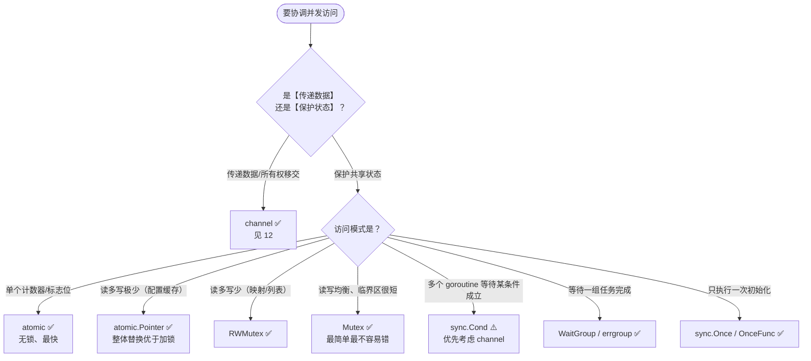
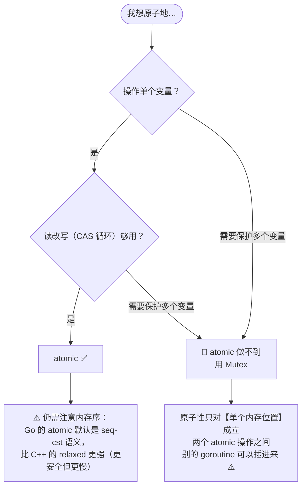
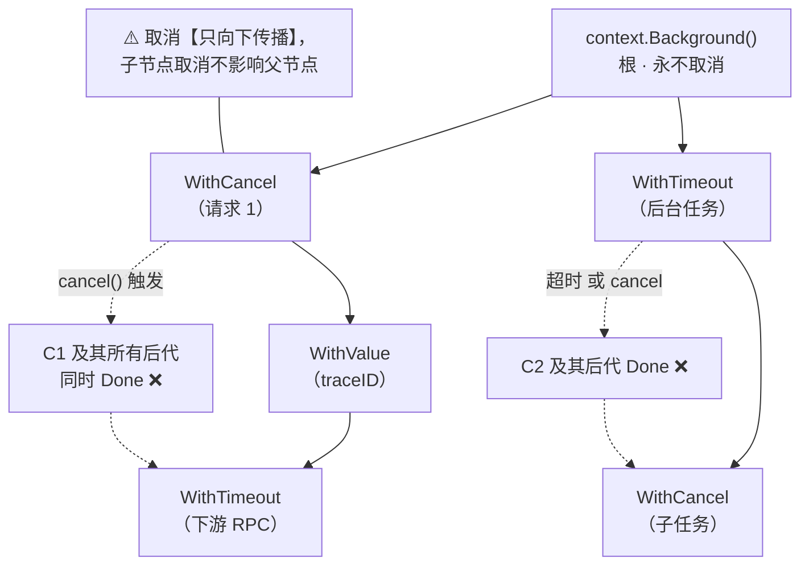

+++
title = "13 sync·atomic·context"
linkTitle = "13 sync·atomic·context"
weight = 113
date = "2026-09-20T11:05:00+08:00"
type = "docs"
description = "Go 同步速查：Mutex/RWMutex/WaitGroup/Once/Cond/Pool 选型、atomic 全部类型与操作、context 取消树与派生函数、errgroup 与 semaphore"
isCJKLanguage = true
draft = false
+++

# 13 sync·atomic·context

本页回答：**该用锁还是 channel**、**atomic 能做什么**、**context 怎么传才不漏**。

> 基线：**Go 1.27.1**。所有输出为本机实跑结果。包里列出的 `golang.org/x/sync` 需另外 `go get`。

---

## 选型：锁、channel 还是 atomic



💭 Go 的官方建议是：**「不要通过共享内存来通信，而要通过通信来共享内存」**。但这不是教条——保护一小段共享状态时，`Mutex` 比 channel 更直接、更快、更好读。

| 需求 | 选择 | 理由 |
| --- | --- | --- |
| 移交数据所有权 | channel | 语义清晰，天然同步 |
| 保护结构体字段 | `sync.Mutex` | 简单、无死锁设计负担 |
| 高频读、低频写 | `sync.RWMutex` 或 `atomic.Pointer` | 读不互斥 |
| 单变量计数/开关 | `sync/atomic` | 无锁，但**只能保证单变量原子性** ⚠️ |
| 等待 N 个任务 | `sync.WaitGroup` / `errgroup.Group` | 后者还能收集错误 |
| 惰性初始化 | `sync.Once` | 保证只执行一次 |
| 复用临时对象 | `sync.Pool` | 减少分配（见 [11]()） |

---

## sync.Mutex / RWMutex

```go
type Counter struct {
	mu sync.Mutex     // ⚠️ 必须与数据放在一起，且不要拷贝
	n  int
}

func (c *Counter) Inc() {
	c.mu.Lock()
	defer c.mu.Unlock()   // 🔥 惯用法：加锁后立刻 defer 解锁
	c.n++
}

func (c *Counter) Value() int {
	c.mu.Lock()
	defer c.mu.Unlock()
	return c.n
}
```

### 四条铁律

| 铁律 | 说明 |
| --- | --- |
| ① **Lock 后立刻 `defer Unlock`** | 避免任何一条 return 路径漏解锁 🔥 |
| ② **不要拷贝含锁的结构体** | 拷贝的是锁的状态，`go vet` 会报 `copylocks` ⚠️ |
| ③ **不要让锁跨越函数边界太久** | 临界区越小越好，别在持锁时做 IO |
| ④ **统一加锁顺序** | 多个锁时固定顺序，否则死锁 |

```go
// 🛑 go vet 会报错的写法
type Bad struct {
	mu sync.Mutex
	n  int
}

func useBad(b Bad) { ... }        // 按值传参 → 拷贝了锁
b2 := b                          // 赋值也会拷贝

// ✅ 只用指针
func useGood(b *Bad) { ... }
```

### RWMutex：只在读远多于写时才用

```go
type Cache struct {
	mu sync.RWMutex
	m  map[string]string
}

func (c *Cache) Get(k string) (string, bool) {
	c.mu.RLock()           // 读锁：多个读者可同时持有
	defer c.mu.RUnlock()
	v, ok := c.m[k]
	return v, ok
}

func (c *Cache) Set(k, v string) {
	c.mu.Lock()            // 写锁：独占
	defer c.mu.Unlock()
	c.m[k] = v
}
```

⚠️ `RWMutex` 有一个**反直觉的性能陷阱**：它的内部实现比 `Mutex` 复杂，在**读少写多或临界区极短**的场景下，`RWMutex` 往往**比 `Mutex` 更慢**。💭 选它之前先做基准测试。

⚠️ **RWMutex 不可重入**：持 `RLock` 时再请求 `Lock` 会死锁（写锁要等所有读者释放，而你自己就是读者）。

---

## sync.WaitGroup

```go
var wg sync.WaitGroup

// 传统写法（1.25 前）
for _, t := range tasks {
	wg.Add(1)
	go func() {
		defer wg.Done()
		process(t)
	}()
}
wg.Wait()

// 🆕 1.25 起：WaitGroup.Go 一行搞定
for _, t := range tasks {
	wg.Go(func() { process(t) })
}
wg.Wait()
```

| 方法 | 说明 |
| --- | --- |
| `Add(n)` | 增加计数（**必须在 `go` 之前或同 goroutine 内调用** ⚠️） |
| `Done()` | 计数减一，等价 `Add(-1)` |
| `Wait()` | 阻塞到计数归零 |
| `Go(f)` 🆕 1.25 | `Add(1)` + 起 goroutine + `Done()`，三合一 🔥 |

⚠️ `Add` 的位置很重要——**必须在启动 goroutine 之前**，否则 `Wait` 可能在 `Add` 之前就返回：

```go
// 🛑 竞态：Add 在 goroutine 里，Wait 可能提前返回
for range 10 {
	go func() { wg.Add(1); defer wg.Done(); work() }()
}
wg.Wait()

// ✅ 正确
for range 10 {
	wg.Add(1)
	go func() { defer wg.Done(); work() }()
}
wg.Wait()
```

---

## sync.Once 与惰性初始化

```go
var (
	once   sync.Once
	client *http.Client
)

func GetClient() *http.Client {
	once.Do(func() {
		client = &http.Client{Timeout: 10 * time.Second}
	})
	return client
}
```

🆕 **1.21 起有更简洁的函数式封装**（本机实测可用）：

```go
// OnceFunc：保证只执行一次
setup := sync.OnceFunc(func() { fmt.Print("once ") })
for range 3 { setup() }
// 输出：once

// OnceValue：保证只计算一次并缓存结果
cached := sync.OnceValue(func() int { fmt.Print("compute "); return 42 })
fmt.Println(cached(), cached())     // ⚠️ 返回值必须打印出来，否则只看到 "compute "
// 输出：compute 42 42

// OnceValues：缓存值 + 错误两个返回
load := sync.OnceValues(func() (*Config, error) { return loadConfig() })
```

```text
once 
compute 42 42
```

⚠️ `sync.Once.Do` 只保证 `f` 执行一次，但**并发的 `Do` 调用都会阻塞到这次执行结束才返回**（实测：第二个 `Do` 等了 300ms，正好是第一个 `f` 的睡眠时长）。也正因如此，若 `f` 内部再次调用同一个 `once.Do`，会**死锁**。

💭 也可以用 `init()` 做初始化，但 `Once` 的优势是**惰性**：不用就不初始化，还能返回错误。

---

## sync.Cond：只在特定场景用

```go
type Queue struct {
	mu   sync.Mutex
	cond *sync.Cond
	items []int
}

func NewQueue() *Queue {
	q := &Queue{}
	q.cond = sync.NewCond(&q.mu)
	return q
}

func (q *Queue) Push(v int) {
	q.mu.Lock()
	q.items = append(q.items, v)
	q.mu.Unlock()
	q.cond.Signal()          // 唤醒一个等待者
}

func (q *Queue) Pop() int {
	q.mu.Lock()
	defer q.mu.Unlock()
	for len(q.items) == 0 {  // ⚠️ 必须用 for 而不是 if
		q.cond.Wait()        // Wait 内部会解锁 → 阻塞 → 重新加锁
	}
	v := q.items[0]
	q.items = q.items[1:]
	return v
}
```

| 方法 | 说明 |
| --- | --- |
| `Wait()` | 原子地解锁并阻塞，被唤醒后重新加锁 🔥 |
| `Signal()` | 唤醒**一个**等待者 |
| `Broadcast()` | 唤醒**全部**等待者 |

⚠️ **必须用 `for` 循环包住 `Wait()`**：被唤醒不代表条件成立（可能有其他 goroutine 抢先消费了）。用 `if` 是经典 bug。

💭 现代 Go 里 `Cond` 的用途已经很窄，绝大多数场景用 channel 更清晰。只有在「多个等待者 + 一个共享条件 + 高频唤醒」时才值得用。

---

## sync/atomic：无锁但要小心

### 类型化 API 🆕 1.19（首选）

```go
var n atomic.Int64
n.Add(1)
n.Add(2)
n.Load()                   // 3
n.CompareAndSwap(3, 10)    // true
n.Store(0)
n.Swap(5)

var f atomic.Bool
f.Store(true)
f.Load()
f.CompareAndSwap(true, false)

var p atomic.Pointer[string]
s := "hello"
p.Store(&s)
*p.Load()                  // hello

// 泛型 Value（存任意类型，需类型一致）
var av atomic.Value
av.Store("first")
av.Load().(string)
```

```text
atomic: 3 true 10
ptr: hello
value: first
```

### 完整操作表

| 类型 | 可用操作 |
| --- | --- |
| `atomic.Int32/64`、`Uint32/64` | `Add` `Sub` `Load` `Store` `Swap` `CompareAndSwap` |
| `atomic.Bool` | `Load` `Store` `Swap` `CompareAndSwap`（**无 Add**） |
| `atomic.Pointer[T]` | `Load` `Store` `Swap` `CompareAndSwap` |
| `atomic.Value` | `Load` `Store` `Swap` `CompareAndSwap` |
| `atomic.Uintptr` | 同整数 |
| 包级函数 | `atomic.AddInt64(&x, 1)` 等旧式写法（**未标 deprecated**，但新代码用类型化 API 更不容易出错） |

### atomic 的能力边界



⚠️ **最常见的 atomic 误用**：以为「用了 atomic 就没有数据竞争」。

```go
// 🛑 看似安全，实际有竞态：读两个变量之间状态可能已变
type Stats struct {
	reads  atomic.Int64
	writes atomic.Int64
}

r := s.reads.Load()
w := s.writes.Load()   // 这两次 Load 之间，别的 goroutine 可能改了状态

// ✅ 需要一致性快照时，要么加锁，要么把两个值合成一个用 CAS 更新
```

⚠️ **`atomic.Value` 的类型必须完全一致**：先存 `string` 后存 `int` 会 panic（`sync/atomic: store of inconsistently typed value`）。存指针类型时也要避免「有类型的 nil」问题。

💭 **实践建议**：默认用 `Mutex`；只有基准测试表明锁竞争确实是瓶颈时，才换成 atomic 并把不变量写成注释。

---

## context：取消树的传播



```text
取消树：一次 cancel，整棵子树倒下（但不会向上传染）

  context.Background()                    ← 根：永不取消
        │
        ├── WithCancel ──────────────────► 请求 A
        │      │
        │      ├── WithValue(traceID) ───► 带追踪信息
        │      │      │
        │      │      └── WithTimeout(3s) ► 调下游服务
        │      │
        │      └── WithCancel ───────────► 请求 A 的子任务
        │
        └── WithTimeout(30s) ────────────► 后台任务
               │
               └── WithCancel ───────────► 子任务

  ✂️ cancel() 请求 A  ──►  A 及其【所有后代】的 Done 同时关闭
  ✅ 后代取消         ──►  不影响 A、不影响兄弟节点
  ⚠️ 忘记 cancel      ──►  timer 与子树泄漏（go vet 的 lostcancel 会查）
  ⚠️ 用已取消的 ctx   ──►  下游立刻失败（优雅关闭时最容易犯）
```

| 函数 | 返回 | 用途 |
| --- | --- | --- |
| `context.Background()` | 空 context | **main / init / 测试**的根 🔥 |
| `context.TODO()` | 空 context | 暂时不知道该传什么时占位 |
| `context.WithCancel(parent)` | `ctx, cancel` | 手动取消 |
| `context.WithTimeout(parent, d)` | `ctx, cancel` | 超时自动取消 🔥 |
| `context.WithDeadline(parent, t)` | `ctx, cancel` | 绝对时间点 |
| `context.WithValue(parent, k, v)` | `ctx` | 传请求域数据（**不传业务参数** ⚠️） |
| `context.WithoutCancel(parent)` 🆕 1.21 | `ctx` | 剥离取消信号，保留值 |
| `context.AfterFunc(ctx, f)` 🆕 1.21 | `stop func() bool` | ctx 结束时异步执行 f |

```go
ctx, cancel := context.WithCancel(context.Background())
child, childCancel := context.WithTimeout(ctx, time.Second)
defer childCancel()

cancel()               // 取消父节点
<-child.Done()
fmt.Println(child.Err(), errors.Is(child.Err(), context.Canceled))
```

```text
child err: context canceled Is Canceled: true
```

⚠️ **取消是向下传播的**：取消子 context 不会影响父 context 或其他兄弟节点。

### 三个错误值的判定

```go
switch {
case errors.Is(ctx.Err(), context.Canceled):
	// 主动取消（或父节点被取消）
case errors.Is(ctx.Err(), context.DeadlineExceeded):
	// 超时
case ctx.Err() == nil:
	// 还没结束
}
```

| 值 | 何时出现 |
| --- | --- |
| `context.Canceled` | 调用了 `cancel()`，或父节点被取消 |
| `context.DeadlineExceeded` | 到达 deadline |
| `nil` | context 仍然有效 |

### 携带取消原因 🆕 1.20 / 1.21

```go
ctx, cancel := context.WithCancelCause(context.Background())
cancel(errors.New("自定义原因"))
fmt.Println(context.Cause(ctx), ctx.Err())
```

```text
Cause: 自定义原因 Err: context canceled
```

⚠️ 关键区别：`ctx.Err()` 永远只返回 `Canceled` 或 `DeadlineExceeded` 这两个**规范值**；具体原因要用 `context.Cause(ctx)` 取。这样调用方既能做标准判定，又能拿到细节。

### WithoutCancel 与 AfterFunc

```go
// 剥离取消：日志上报、审计这类「即使请求取消也要做完」的操作
detached := context.WithoutCancel(ctx)
fmt.Println(detached.Err(), detached.Value(k{}))
```

```text
detached Err: <nil> value: v
```

```go
// ctx 结束时自动执行清理（比起一个 goroutine 等 <-ctx.Done() 更省）
stop := context.AfterFunc(ctx, func() { cleanup() })
fired := stop()   // 返回 false 表示已经触发过了
```

```text
AfterFunc fired, stop() = false
```

### context 的五条使用规范

| 规范 | 说明 |
| --- | --- |
| ① **作为第一个参数**，命名为 `ctx` | `func Do(ctx context.Context, ...)` |
| ② **不要存进结构体** | 例外：`http.Request` 这类本身就是请求域的对象 ⚠️ |
| ③ **不要传 nil** | 不确定就传 `context.TODO()`，`nil` 会导致 panic |
| ④ **`cancel` 必须调用** | `defer cancel()`，否则泄漏（`go vet` 的 `lostcancel` 会查） |
| ⑤ **`WithValue` 只放请求域元数据** | traceID、用户 ID 可以；数据库连接、业务参数不行 🛑 |

### WithValue 的 key 类型：必须是自定义类型

```go
// 🛑 用内置类型作 key：任何包都能覆盖你的值
ctx = context.WithValue(ctx, "userID", 42)
ctx.Value("userID")   // 可能被别的包的同名 key 覆盖

// ✅ 用未导出的自定义类型
type userIDKey struct{}

func WithUserID(ctx context.Context, id int) context.Context {
	return context.WithValue(ctx, userIDKey{}, id)
}

func UserID(ctx context.Context) (int, bool) {
	id, ok := ctx.Value(userIDKey{}).(int)
	return id, ok
}
```

⚠️ 这是 `context` 包的核心约定：**key 必须是可比较的、未导出的类型**，最好配一对封装函数，让调用方看不到 key 本身。

---

## errgroup 与 semaphore（`golang.org/x/sync`）

标准库没有 errgroup，但它是 Go 生态里最常用的并发工具。

```go
import "golang.org/x/sync/errgroup"

func fetchAll(ctx context.Context, urls []string) ([]string, error) {
	g, ctx := errgroup.WithContext(ctx)      // 🔥 ctx 会在任一任务失败时取消
	results := make([]string, len(urls))

	for i, u := range urls {
		g.Go(func() error {
			body, err := fetch(ctx, u)
			if err != nil {
				return fmt.Errorf("fetch %s: %w", u, err)
			}
			results[i] = body               // ✅ 每个 goroutine 写不同下标，无需加锁
			return nil
		})
	}

	if err := g.Wait(); err != nil {        // 返回第一个错误
		return nil, err
	}
	return results, nil
}
```

| 特性 | 说明 |
| --- | --- |
| `WithContext` | 返回的 ctx 在**任一任务返回错误或 `Wait` 返回后**被取消 🔥 |
| 错误语义 | `Wait` 只返回**第一个**非 nil 错误 |
| 并发上限 | 用 `g.SetLimit(n)` 🆕 或 `semaphore` |
| `TryGo` | 非阻塞提交，返回是否成功启动 |

```go
// 限制并发数（x/sync 0.3+）
g.SetLimit(10)      // 最多 10 个 goroutine 同时在跑

// 或显式信号量
sem := semaphore.NewWeighted(10)
if err := sem.Acquire(ctx, 1); err != nil { return err }
defer sem.Release(1)
```

### singleflight：合并重复请求

```go
import "golang.org/x/sync/singleflight"

var g singleflight.Group

func GetUser(ctx context.Context, id string) (*User, error) {
	v, err, _ := g.Do(id, func() (any, error) {
		return db.LoadUser(ctx, id)     // 同一 id 的并发调用只会执行一次 🔥
	})
	if err != nil {
		return nil, err
	}
	return v.(*User), nil
}
```

| 场景 | 为什么有用 |
| --- | --- |
| 缓存击穿 | 热点 key 失效瞬间，N 个请求合并成 1 次回源 |
| 重复计算 | 相同参数的昂贵计算合并 |
| 限流下的重试风暴 | 降低下游压力 |

⚠️ `singleflight` 的返回是 `any`，需要类型断言。官方语义是重复调用者**拿到同一个结果**（实测 8 个并发调用只执行了 1 次 `fn`，且 8 个指针完全相同），所以**返回值必须当作只读共享对象**，不要就地修改它。

---

## 本页陷阱速查

| 症状 | 实际原因 | 正确做法 |
| --- | --- | --- |
| `go vet` 报 `copylocks` | 按值传递了含 `Mutex` 的结构体 | 传指针 |
| 偶发死锁 | 加锁顺序不一致，或 RWMutex 重入 | 统一顺序；持 RLock 时别请求 Lock |
| `RWMutex` 比 `Mutex` 还慢 | 临界区太短，RWMutex 自身开销更大 | 基准测试后再选 |
| `WaitGroup.Wait` 提前返回 | `Add` 写在 goroutine 内部 | `Add` 必须在 `go` 之前 |
| `wg.Go` 后多余 `Done` | `Go` 已内含 `Done` 🆕 1.25 | 计数变负 → `panic: sync: negative WaitGroup counter`（在 `wg.Go` 起的 goroutine 内，不可 recover）；二选一，别混用 |
| `panic: sync: negative WaitGroup counter` | `Done` 多于 `Add` | 检查配对 |
| `sync.Once` 死锁 | `Do` 里的函数又调了同一个 `Do` | 拆成两个 Once，或用 `OnceValue` |
| `sync.Cond` 唤醒后拿到错数据 | 用 `if` 而不是 `for` 包 `Wait` | 条件判断必须循环 |
| `atomic.Value` panic 类型不一致 | 前后存了不同类型 | 固定类型，或改用 `atomic.Pointer[T]` |
| 用了 atomic 仍有数据竞争 | 多个变量之间没有原子性 | 需要一致性快照就加锁 |
| `ctx.Err()` 拿不到自定义原因 | `Err()` 只返回规范值 | 用 `context.Cause(ctx)` |
| `go vet` 报 `lostcancel` | `cancel` 没调用 | `defer cancel()` |
| context 里传业务参数 | 违反约定，依赖关系被隐藏 | 显式参数传递 |
| `ctx.Value` 取不到值 | key 用了内置类型且被别的包覆盖 | 自定义未导出类型 key |
| errgroup 没有取消兄弟任务 | 没用 `WithContext` 返回的 ctx | `g, ctx := errgroup.WithContext(parent)` |

---

📘 官方参考：[Go Blog — Share Memory By Communicating](https://go.dev/blog/codelab-share)、[context 包文档](https://pkg.go.dev/context)、[sync/atomic 文档](https://pkg.go.dev/sync/atomic)、[Go Blog — Contexts and structs](https://go.dev/blog/context-and-structs)、[x/sync/errgroup](https://pkg.go.dev/golang.org/x/sync/errgroup)

➡️ 上一节：[12 goroutine 与 channel]() ｜ 下一节：[14 标准库：字符串与数字]()
