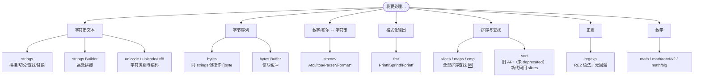
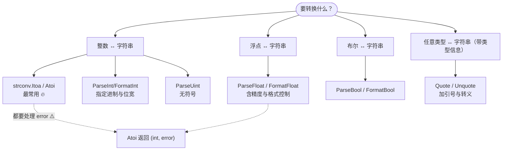

+++
title = "14 标准库：字符串与数字"
linkTitle = "14 标准库：字符串与数字"
weight = 114
date = "2026-09-20T11:10:00+08:00"
type = "docs"
description = "Go 标准库速查：strings/bytes 全函数表、Builder 与迭代器、strconv 转换决策、unicode、regexp、sort、slices、maps、cmp、math"
isCJKLanguage = true
draft = false
+++

# 14 标准库：字符串与数字

本页是**日常调用最频繁**的一页：字符串处理、类型转换、排序、切片/映射的泛型助手。

> 基线：**Go 1.27.1**。所有输出为本机实跑结果。

---

## 包地图：该找谁



| 需求 | 用哪个 | 别用 |
| --- | --- | --- |
| 拼接字符串 | `strings.Builder` 🔥 | `+`（循环里）、`fmt.Sprintf` |
| `[]byte` 拼接 | `bytes.Buffer` | `append` 手写（除非已知长度） |
| 数字 → 字符串 | `strconv.Itoa` | 🛑 `string(n)` |
| 字符串 → 数字 | `strconv.Atoi` / `ParseInt` | 🛑 `int(s)` |
| 排序 | `slices.Sort` 🆕 | `sort.Slice`（旧 API，官方未标 deprecated） |
| 字符串切分 | `strings.Cut` / `SplitSeq` | `strings.Split`（需要全部时除外） |
| 正则 | `regexp`（RE2） | 想用后向引用？Go 不支持 ⚠️ |

---

## strings：全函数速查

```go
s := "héllo, 世界"

// ── 查找与判断 ──
strings.Contains(s, "ell")      // true
strings.ContainsAny(s, "xyz世") // true
strings.ContainsRune(s, '世')   // true
strings.HasPrefix(s, "hé")      // true
strings.HasSuffix(s, "界")      // true
strings.Index(s, "l")           // 3（字节下标！é 占 2 字节）
strings.LastIndex(s, "l")       // 4
strings.IndexByte(s, 'l')       // 3
strings.IndexRune(s, '世')      // 8（字节下标）🔥 下标是字节不是字符序号
strings.Count(s, "l")           // 2
strings.EqualFold("Go", "GO")   // true，忽略大小写
strings.Compare("a", "b")       // -1
```

```go
// ── 切分 ──
strings.Cut("key=value", "=")         // "key" "value" true 🔥 最常见
strings.CutPrefix("prefix-x", "pre")  // "fix-x" true      🆕 1.20
strings.CutSuffix("x-suffix", "fix")  // "x-suf" true      🆕 1.20
strings.CutLast("a/b/c", "/")         // "a/b" "c" true    🆕 1.27
strings.Split("a,b,c", ",")           // ["a" "b" "c"]
strings.SplitN("a,b,c", ",", 2)       // ["a" "b,c"]
strings.Fields("  a  b\tc  ")         // ["a" "b" "c"]（按空白切）
strings.FieldsFunc("a1b2c", unicode.IsDigit) // ["a" "b" "c"]
```

```text
Cut: "key" "value" true
"fix-x" true
"x-suf" true
a/b c true
```

🆕 **1.24 起有迭代器版本**：不需要一次性分配切片，大字符串处理更省内存。

```go
for part := range strings.SplitSeq("a,b,c", ",") {
	fmt.Print(part, "|")
}
for line := range strings.Lines("l1\nl2\n") {
	fmt.Print("[", strings.TrimRight(line, "\n"), "]")
}
```

```text
a|b|c|
[l1][l2]
```

| 迭代器函数 🆕 1.24 | 对应的一次性版本 |
| --- | --- |
| `SplitSeq` / `SplitAfterSeq` | `Split` / `SplitAfter` |
| `FieldsSeq` / `FieldsFuncSeq` | `Fields` / `FieldsFunc` |
| `Lines` | `strings.SplitAfter(s, "\n")` ⚠️ 但 `Lines` 产出的每行**含结尾换行符**，且末尾换行不产生空元素（`Split` 会多一个 `""`）|

```go
// ── 变换 ──
strings.TrimSpace("  x  ")            // "x"
strings.TrimLeft("xxabc", "x")        // "abc"
strings.TrimPrefix("prefix", "pre")   // "fix"
strings.TrimSuffix("a.go", ".go")     // "a"
strings.ToUpper("go")                 // "GO"
strings.ToLower("GO")                 // "go"
strings.Title(s)                      // 🪦 已废弃：官方建议改 golang.org/x/text/cases
strings.ToTitle("hello world")        // "HELLO WORLD" ⚠️ 是全大写，不是首字母大写
strings.ToTitle(s) != strings.Title(s) // 两者语义完全不同，别混用
strings.Repeat("ab", 3)               // "ababab"
strings.Join([]string{"a","b"}, "-")  // "a-b"
strings.Replace("aaa", "a", "b", 2)   // "bba"（n<0 表示全部）
strings.ReplaceAll("aaa", "a", "b")   // "bbb"
strings.NewReplacer("a","1","b","2").Replace("abc")  // "12c"
```

### Builder：循环拼接的唯一正解

```go
var sb strings.Builder
sb.Grow(64)                 // 预分配，避免多次扩容 🔥
for i := range 3 {
	fmt.Fprintf(&sb, "%d,", i)
}
sb.String()                 // "0,1,2,"
sb.Len()                    // 6
sb.Reset()                  // 复用
```

```text
builder: 0,1,2, len: 6
```

| 方法 | 说明 |
| --- | --- |
| `Grow(n)` | 预分配容量（已知大小时必用） |
| `WriteString(s)` | 追加字符串（最常用） |
| `Write([]byte)` / `WriteByte(c)` / `WriteRune(r)` | 追加其他类型 |
| `String()` | 取出结果（**会拷贝**，不要放循环里）⚠️ |
| `Reset()` | 清空复用，保留底层数组 |
| `Cap()` 🆕 1.12 | 当前容量 |

⚠️ `strings.Builder` **不可拷贝**，但机制不是 `noCopy`+`go vet`——官方源码注释明说不能加 `noCopy`，实测 `go vet ./...` 对拷贝零输出。真正的防线是**运行期检测**：

```text
拷贝后再写入 → panic: strings: illegal use of non-zero Builder copied by value
```

（`Builder` 内部用 `self` 指针在写方法里调用 `copyCheck()`，只有真的写入时才触发；只赋值不写入不会立刻出错，所以这类 bug 可能潜伏很久 ⚠️。）

### 四种拼接方式的取舍



{}

```go
s := "a" + "b" + "c"      // 编译期常量折叠，零开销 ✅
```

```go
// 🛑 循环里用 + 是 O(n²)
var s string
for _, w := range words {
	s += w                 // 每次都分配新字符串
}
```

| 适用 | 不适用 |
| --- | --- |
| 字面量拼接、固定几段 | 任何循环、任何未知长度 ⚠️ |

{}

{}

```go
s := strings.Join(words, "-")
```

```console
strings.Join([]string{"a", "b"}, "-")   →   "a-b"
```

| 适用 | 说明 |
| --- | --- |
| **已经拿到完整切片** 🔥 | 内部先算总长、一次分配，理论最优 |
| 需要分隔符 | 自己处理分隔符容易写错 |

{}

{}

```go
var sb strings.Builder
sb.Grow(64)                       // 🔥 已知大致长度时必做
for i := range 3 {
	fmt.Fprintf(&sb, "%d,", i)
}
s := sb.String()
```

```console
builder: 0,1,2, len: 6
```

| 适用 | 注意 |
| --- | --- |
| 边算边拼、长度未知 🔥 | 不可拷贝（`go vet` 会查） |
| 需要格式化输出 | `String()` 会拷贝，别放循环里 ⚠️ |

{}

{}

```go
var buf bytes.Buffer
buf.WriteString("hello ")
buf.WriteString("world")
b := buf.Bytes()                  // ⚠️ 与 buf 共享底层数组
```

| 适用 | 注意 |
| --- | --- |
| 目标是 `[]byte` 而非 `string` | `Bytes()` 共享内存，要留存就 `bytes.Clone` |
| 需要同时读写 | 比 Builder 多一层无关能力 |

💭 只拼字符串就用 `strings.Builder`；要 `[]byte` 结果才用 `bytes.Buffer`。

{}



### 复杂度小结

| 方式 | 复杂度 | 一句话 |
| --- | --- | --- |
| `s += x`（循环） | O(n²)，每次重新分配 ⚠️ | 只在极少量拼接时用 |
| `strings.Join` | O(n)，预先算好总长 | **已知所有片段时最优** 🔥 |
| `strings.Builder` | O(n)，增量增长 | 边算边拼时用 🔥 |
| `fmt.Sprintf` | O(n)，但反射开销大 | 只在需要格式化时用 |

---

## bytes：和 strings 一一对应

`bytes` 包是 `strings` 的 `[]byte` 版本，函数名几乎完全一致：

| strings | bytes |
| --- | --- |
| `Contains(s, sub)` | `bytes.Contains(b, sub)` |
| `Cut(s, sep)` | `bytes.Cut(b, sep)` |
| `Split(s, sep)` | `bytes.Split(b, sep)` |
| `TrimSpace(s)` | `bytes.TrimSpace(b)` |
| `strings.Builder` | `bytes.Buffer` |
| `strings.NewReader` | `bytes.NewReader` |

```go
var buf bytes.Buffer
buf.WriteString("hello ")
buf.WriteString("world")
buf.String()        // "hello world"
buf.Bytes()         // []byte，⚠️ 与 buf 共享底层
buf.Len()
buf.Reset()
```

⚠️ `bytes.Buffer.Bytes()` 返回的切片**与 Buffer 共享内存**，Buffer 后续写入可能覆盖它。要保留就 `bytes.Clone(buf.Bytes())`。

### 零拷贝转换（慎用）

```go
b := []byte("hello")

// 标准写法：发生拷贝 ✅ 安全
s := string(b)

// 零拷贝写法：共享内存 ⚠️ 只能只读，且 b 不能再被修改
s2 := unsafe.String(&b[0], len(b))
b2 := unsafe.Slice(unsafe.StringData(s), len(s))
```

💡 只在**热点路径**并且能证明生命周期安全时用 `unsafe` 版本（见 [11]()）。

---

## strconv：转换决策图



```go
// 整数
strconv.Itoa(42)                    // "42"
strconv.Atoi("123")                 // 123, nil
strconv.ParseInt("ff", 16, 64)      // 255, nil
strconv.FormatInt(255, 16)          // "ff"
strconv.FormatInt(255, 2)           // "11111111"

// 浮点
strconv.ParseFloat("3.14", 64)      // 3.14, nil
strconv.FormatFloat(3.14159, 'f', 2, 64)   // "3.14"
strconv.FormatFloat(0.00001234, 'e', 2, 64) // "1.23e-05"
strconv.FormatFloat(1234.5678, 'g', -1, 64) // "1234.5678"（最短表示）

// 布尔
strconv.ParseBool("true")           // true, nil
strconv.FormatBool(true)            // "true"

// 引号与转义
strconv.Quote("a\nb")               // "\"a\\nb\""
strconv.QuoteRune('世')              // "'世'"
strconv.Unquote(`"a\nb"`)           // "a\nb", nil
```

```text
42 "a\nb"
123 <nil>
3.14 <nil>
true <nil>
ff 3.14
'世'
```

| 格式化动词（`FormatFloat` 的 `fmt` 参数） | 输出示例（值 1234.5678） |
| --- | --- |
| `'f'` | `1234.57`（定点，需给精度） |
| `'e'` | `1.23e+03` |
| `'E'` | `1.23E+03` |
| `'g'` | `1234.5678`（最短表示，精度 -1）🔥 |
| `'x'` | 十六进制浮点 |

⚠️ 三个必须记住的坑：

| 写法 | 结果 | 真相 |
| --- | --- | --- |
| `string(65)` | `"A"` | 是**码点转换**，不是数字转字符串 🛑 |
| `int("123")` | 编译错误 | 必须用 `strconv.Atoi` |
| `strconv.Atoi("12x")` | `0, error` | 返回零值 + 错误，**必须判 err** ⚠️ |

### ParseInt 的位宽语义

```go
strconv.ParseInt("127", 10, 8)   // 127, nil
strconv.ParseInt("128", 10, 8)   // 127, error ⚠️ 不是返回 0！
strconv.ParseInt("0x1f", 0, 64)  // 31, nil（base=0 时自动识别前缀）
```

💡 `base` 传 `0` 时，`0x`/`0o`/`0b` 前缀会被自动识别——解析用户输入时很方便。`bitSize` 用于**范围校验**，不要图省事传 64。

⚠️ **溢出时的返回值不是 0，而是被钳制到该位宽的最大值**（官方文档："the returned value is the maximum magnitude integer of the appropriate bitSize and sign"）。本机实测：

```text
ParseInt("128", 10, 8)                       = 127,   value out of range
ParseInt("99999999999999999999", 10, 64)     = 9223372036854775807, value out of range
```

所以**光看返回值判不出溢出**，必须检查 `err`（可以用 `errors.Is(err, strconv.ErrRange)` 精确判定）。

---

## unicode 与 unicode/utf8

```go
import (
	"unicode"
	"unicode/utf8"
)

// 字符类别判断
unicode.IsLetter('A')     // true
unicode.IsDigit('5')      // true
unicode.IsSpace(' ')      // true
unicode.IsUpper('A')      // true
unicode.Is(unicode.Han, '世')  // true，是否汉字

// UTF-8 编解码
utf8.RuneCountInString("世界")   // 2（字符数）
utf8.ValidString("世界")         // true
utf8.RuneLen('世')               // 3
utf8.DecodeRuneInString("世界")  // '世', 3
utf8.EncodeRune(buf, '世')       // 写入 3 字节

// 按符文迭代（处理非法 UTF-8 时替换为 U+FFFD）
for i, r := range "a世" { ... }
```

| 需求 | 函数 |
| --- | --- |
| 数字符（不是字节） | `utf8.RuneCountInString` 或 `len([]rune(s))` |
| 判合法 UTF-8 | `utf8.ValidString` |
| 大小写转换（Unicode 感知） | `strings.ToUpper` / `unicode.ToUpper` |
| 判汉字 | `unicode.Is(unicode.Han, r)` |
| 去除首尾空白 | `strings.TrimSpace`（支持 Unicode 空白） |

---

## slices / maps / cmp：泛型助手 🆕 1.21

这三套包**取代了大部分 `sort` 与手写循环**，新代码优先用它们（详见 [10 泛型]()）。

### slices 实战

```go
xs := []int{3, 1, 2}
slices.Sort(xs)                     // [1 2 3]

users := []User{{"b", 30}, {"a", 20}, {"c", 20}}
slices.SortFunc(users, func(a, b User) int {
	if c := cmp.Compare(a.Age, b.Age); c != 0 {
		return c    // 先按年龄
	}
	return cmp.Compare(a.Name, b.Name)   // 再按名字 🔥 多字段排序的标准写法
})
slices.SortStableFunc(users, func(a, b User) int { return cmp.Compare(a.Age, b.Age) })

idx, found := slices.BinarySearch([]int{1, 2, 3}, 2)   // 1, true（要求已排序）
slices.Contains(xs, 2)              // true
slices.Index(xs, 2)                 // 1
slices.Equal([]int{1, 2}, []int{1, 2})   // true
slices.Max(xs)                      // 3
slices.Compact([]int{1, 1, 2, 2, 3})     // [1 2 3]（去相邻重复）
slices.Insert([]int{1, 3}, 1, 2)    // [1 2 3]
slices.Delete([]int{1, 2, 3}, 1, 2) // [1 3]
slices.ContainsFunc(users, func(u User) bool { return u.Age > 25 })   // true
```

```text
Sort: [1 2 3]
SortFunc: [{a 20} {c 20} {b 30}]
BinarySearch: 1 true
Compact: [1 2 3]
```

⚠️ `slices.BinarySearch` **返回两个值** `(index int, found bool)`，不是单个下标。目标不存在时返回「应插入位置」。

⚠️ `slices.Sort` **不保证稳定**，需要稳定时用 `SortStableFunc`。

⚠️ `slices.Reverse` **没有返回值**（原地修改），写 `xs = slices.Reverse(xs)` 是编译错误 🛑。

| 需求 | 函数 |
| --- | --- |
| 多字段排序 | `SortFunc` + 多次 `cmp.Compare` 🔥 |
| 从迭代器收集 | `slices.Collect(seq)` / `slices.Sorted(seq)` 🆕 1.23 |
| 分组迭代 | `slices.Chunk(s, n)` 🆕 1.23 |
| 重复 | `slices.Repeat(s, n)` 🆕 1.23 |
| 反向遍历 | `for v := range slices.Backward(s)` 🆕 1.23 |

### maps 实战

```go
m := map[string]int{"c": 3, "a": 1, "b": 2}

slices.Sorted(maps.Keys(m))              // [a b c]，迭代器 → 有序切片 🔥
slices.Sorted(maps.Values(m))            // [1 2 3]
maps.Clone(m)                            // 浅拷贝
maps.Equal(map[string]int{"a": 1}, map[string]int{"a": 1})   // true
maps.DeleteFunc(m, func(k string, v int) bool { return v < 2 })
maps.Copy(dst, src)                      // 合并
maps.Insert(m, iter.Seq2[string, int])   // 🆕 1.23
```

### cmp 包

```go
cmp.Compare(1, 2)        // -1
cmp.Less(1, 2)           // true
cmp.Or("", "fallback")   // "fallback"  ← 取第一个非零值 🔥
cmp.Or(0, 0, 30)         // 30
```

💡 `cmp.Or` 是配置默认值的利器：

```go
timeout := cmp.Or(cfg.Timeout, 30*time.Second)
name := cmp.Or(req.Name, "anonymous")
```

---

## sort 包：已过时但仍会遇到

```go
// 旧 API（官方未标 deprecated，但新代码请用 slices）
sort.Slice(users, func(i, j int) bool { return users[i].Age < users[j].Age })
sort.SliceStable(...)
sort.Sort(byAge(users))          // 需要实现 sort.Interface
sort.Strings(ss)
sort.Ints(ns)
sort.Search(n, func(i int) bool { return ns[i] >= target })
```

| 老写法 | 新写法 🆕 |
| --- | --- |
| `sort.Slice(s, less)` | `slices.SortFunc(s, cmp)` |
| `sort.SliceStable(s, less)` | `slices.SortStableFunc(s, cmp)` |
| `sort.Strings(ss)` | `slices.Sort(ss)` |
| `sort.Ints(ns)` | `slices.Sort(ns)` |
| `sort.Search` | `slices.BinarySearch` |
| `sort.IsSorted(s)` | `slices.IsSorted(s)` |

💭 新代码一律用 `slices`：类型安全（不需要 `any` + 断言）、更快、更不容易写错比较函数的方向。

---

## regexp：RE2 语义

Go 的正则是 **RE2**（无回溯，线性时间），因此**不支持**后向引用、环视断言等特性。

⚠️ 注意：**每个操作都是相对于「当前这个正则」的**。下面把两个不同用途的正则分开写，避免把 `\d+` 的结果记到 email 正则头上：

```go
re := regexp.MustCompile(`(\w+)@(\w+)\.com`)     // 专门匹配 email

fmt.Println(re.MatchString("a@b.com"))            // true
fmt.Println(re.FindString("contact a@b.com now")) // a@b.com
fmt.Println(re.FindStringSubmatch("a@b.com"))     // [a@b.com a b]
fmt.Println(re.ReplaceAllString("a@b.com", "$2#$1")) // b#a
fmt.Println(re.NumSubexp())                       // 2

digits := regexp.MustCompile(`\d+`)                 // 匹配数字，用途不同所以单独编译
fmt.Println(digits.FindAllString("a1b22c333", -1))                    // [1 22 333]
fmt.Println(digits.ReplaceAllStringFunc("a1b2", func(s string) string { return "<" + s + ">" })) // a<1>b<2>

ws := regexp.MustCompile(`\s+`)                     // 按空白切分
fmt.Println(ws.Split("a  b   c", -1))             // [a b c]
```

```text
MatchString: true
FindString: a@b.com
FindStringSubmatch: [a@b.com a b]
ReplaceAllString: b#a
NumSubexp: 2
FindAllString: [1 22 333]
ReplaceAllStringFunc: a<1>b<2>
Split: [a b c]
```

⚠️ `Regexp.Split` 是**在正则匹配处切开**，不会自动合并连续分隔符。用 email 正则去切 `"a  b   c"` 得不到任何切分（实测返回 `["a  b   c"]` 原样）——想按空白切必须先编译 `\s+`。

### 命名分组

```go
re2 := regexp.MustCompile(`(?P<year>\d{4})-(?P<month>\d{2})`)
m := re2.FindStringSubmatch("2026-09")
for i, name := range re2.SubexpNames() {
	if name != "" {
		fmt.Println("named:", name, m[i])
	}
}
```

```text
named: year 2026
named: month 09
```

### 性能与陷阱

| 事项 | 建议 |
| --- | --- |
| 编译开销 | **包级变量里编译一次**，绝不在循环内 `MustCompile` 🛑 |
| 必须用 `MustCompile`？ | 只有模式是常量字面量时；动态模式用 `Compile` 处理错误 |
| 贪婪 vs 非贪婪 | `.*` 贪婪，`.*?` 非贪婪 |
| 不支持 | 后向引用 `\1`、环视 `(?=...)`、条件匹配 🛑 |
| 大文本 | 用 `FindAllStringIndex` 避免重复分配子串 |
| Unicode | `\w` 默认是 ASCII 单词字符，中文要用 `\p{Han}` |

```go
// 🛑 每次调用都重新编译
func bad(s string) bool { return regexp.MustCompile(`^\d+$`).MatchString(s) }

// ✅ 包级编译一次
var digitsOnly = regexp.MustCompile(`^\d+$`)
func good(s string) bool { return digitsOnly.MatchString(s) }
```

---

## math 与 math/rand/v2

```go
math.Round(2.5)      // 3   四舍五入（远离零）
math.Round(-2.5)     // -3  ⚠️ 不是银行家舍入
math.Round(2.4)      // 2
math.Floor(2.7)      // 2
math.Ceil(2.1)       // 3
math.Trunc(-2.7)     // -2  向零截断
math.Abs(-3.5)       // 3.5
math.Max(1, 2)       // 2
math.Pow(2, 10)      // 1024
math.Sqrt(16)        // 4
math.Mod(7, 3)       // 1
math.IsNaN(math.NaN())            // true（NaN != NaN，必须用它）
math.IsInf(math.Inf(1), 1)        // true
math.MaxInt64 / math.MinInt64     // 整数边界常量
math.MaxFloat64 / math.SmallestNonzeroFloat64
```

```text
Round: 3 -3 2
Floor/Ceil/Trunc: 2 3 -2
Abs/Max/Min: 3.5 2 1
Pow/Sqrt: 1024 4
IsNaN: true true
Mod: 1
```

⚠️ `math.Round(2.5) == 3`、`math.Round(-2.5) == -3`——这是**远离零**的舍入，不是「四舍六入五成双」。财务计算要用 `math/big.Rat` 或整数分单位。

### math/rand/v2 🆕 1.22

```go
import "math/rand/v2"

rand.IntN(100)              // [0,100) 的 int
rand.Float64()              // [0.0,1.0)
rand.N(10 * time.Second)    // 泛型：任意整数/时长类型 🔥
rand.Shuffle(n, swap)       // 洗牌
rand.Perm(5)                // 随机排列

// 可复现的随机源
r := rand.New(rand.NewPCG(1, 2))
r.IntN(100)

// 密码学安全要用 crypto/rand
import crand "crypto/rand"
b := make([]byte, 16)
crand.Read(b)
```

| 需求 | 用哪个 |
| --- | --- |
| 一般随机（模拟、抽样） | `math/rand/v2` |
| **安全相关**（token、密钥、盐） | `crypto/rand` 🛑 绝不能用 math/rand |
| 可复现的测试 | `rand.New(rand.NewPCG(seed1, seed2))` |

⚠️ `math/rand`（v1）的顶层 `Seed` 已被官方标记为 **Deprecated**（Go 1.20 起），且它从 **1.24 起不再有任何效果**（`randseednop=0` 可临时恢复）。v1 整体未被标 deprecated，但已被 `math/rand/v2` 取代。新代码直接用 `math/rand/v2`。

### math/big：大数与精确计算

```go
import "math/big"

a := big.NewInt(1)
a.Exp(big.NewInt(2), big.NewInt(100), nil)   // 2^100，精确
a.String()                                    // 1267650600228229401496703205376

f := new(big.Float).SetPrec(200)             // 200 位精度
r := new(big.Rat).SetFrac64(1, 3)            // 精确分数 1/3
```

| 场景 | 用什么 |
| --- | --- |
| 金额计算 | 整数分（`int64`）+ 格式化，或 `big.Rat` 🔥 |
| 超大整数（加密、哈希） | `big.Int` |
| 高精度浮点 | `big.Float` |
| 精确分数 | `big.Rat` |

---

## 本页陷阱速查

| 症状 | 实际原因 | 正确做法 |
| --- | --- | --- |
| 循环拼接字符串越来越慢 | `+=` 每次都重新分配 | `strings.Builder` + `Grow` |
| `string(65)` 得到 `"A"` | 码点转换不是格式化 | `strconv.Itoa` |
| `int("123")` 编译错误 | Go 没有字符串转数字的转换语法 | `strconv.Atoi` |
| `Atoi` 返回 0 但数据是 "abc" | 忽略了 error | 必须判 err |
| `slices.Reverse(xs)` 编译错误 | 它没有返回值 | 原地调用后再用 |
| `BinarySearch` 用法报错 | 返回 `(int, bool)` 两个值 | `idx, found := ...` |
| 排序结果不稳定 | `slices.Sort` 不保证稳定 | `slices.SortStableFunc` |
| 排序时 panic：比较函数不自洽 | `less` 方向写反或用了 `<=` | 严格小于；多字段用 `cmp.Compare` |
| 正则把 CPU 跑满 | 循环里反复 `MustCompile` | 包级编译一次 |
| 正则不支持后向引用 | Go 用 RE2，无回溯 | 换算法或分两步匹配 |
| `bytes.Buffer.Bytes()` 内容被改 | 与 Buffer 共享底层数组 | `bytes.Clone` |
| `math.Round(-2.5)` 得到 -3 | 远离零舍入 | 财务用整数或 `big.Rat` |
| 用 `math/rand`（v1）做安全 token | 它可预测 | `crypto/rand` 🛑 |
| `rand.Seed` 无效 | 1.24 起顶层 Seed 不再生效 | 用 `rand.New(rand.NewPCG(...))` |
| 中文被 `\w` 匹配不到 | `\w` 是 ASCII 语义 | `\p{Han}` / `\p{L}` |
| 以为 `Index` 返回「第几个字符」 | 它返回**字节**下标 | 需要字符序号先 `[]rune(s)` |

---

📘 官方参考：[strings 包](https://pkg.go.dev/strings)、[strconv 包](https://pkg.go.dev/strconv)、[slices 包](https://pkg.go.dev/slices)、[regexp/syntax](https://pkg.go.dev/regexp/syntax)、[math/rand/v2](https://pkg.go.dev/math/rand/v2)

➡️ 上一节：[13 sync·atomic·context]() ｜ 下一节：[15 标准库：io·fs·time]()
