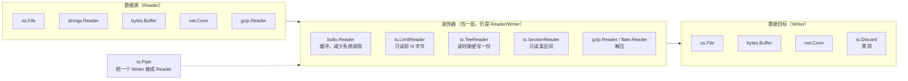

+++
title = "15 标准库：io·fs·time"
linkTitle = "15 标准库：io·fs·time"
weight = 115
date = "2026-09-20T11:15:00+08:00"
type = "docs"
description = "Go 标准库速查：io.Reader/Writer 装饰器组合、bufio 与 Scanner 陷阱、os 与 filepath、fs.FS 与 embed、os/exec、time 格式化与定时器"
isCJKLanguage = true
draft = false
+++

# 15 标准库：io·fs·time

本页回答：**数据怎么流**、**文件怎么读写**、**时间怎么格式化与计算**。

> 基线：**Go 1.27.1**。所有输出为本机实跑结果。

---

## io：一切皆 Reader / Writer

Go 的 IO 抽象只有两个核心接口，所有装饰器都是它们的组合：

```go
type Reader interface { Read(p []byte) (n int, err error) }
type Writer interface { Write(p []byte) (n int, err error) }
```



**关键洞察**：装饰器可以任意套娃，接口不变。这就是为什么 `http.Response.Body` 能直接喂给 `gzip.NewReader`，再喂给 `io.Copy`。

```text
真实的套娃长什么样（一个 HTTP 响应体 → 解压 → 解析 JSON）

  net.Conn（TCP 字节流）
      │  实现了 io.Reader
      ▼
  http.Response.Body ──────────────┐
      │  还是 io.Reader             │  每一层都只满足
      ▼                             │  Read([]byte)(int,error)
  bufio.Reader ────────────────────┤  这一个签名，
      │  Peek / ReadString 可用      │  所以能无限套
      ▼                             │
  gzip.Reader ─────────────────────┤
      │  解压后的字节流              │
      ▼                             │
  json.Decoder ─────────────────────┘
      │
      ▼
  你的 struct

关键点：调用方只写 json.NewDecoder(resp.Body)，中间全部由构造函数内部装配。
```

### 核心函数速查

| 函数 | 说明 |
| --- | --- |
| `io.Copy(dst, src)` | 全量拷贝，返回字节数；内部用 `WriterTo`/`ReaderFrom` 优化 🔥 |
| `io.CopyN(dst, src, n)` | 只拷贝 n 字节 |
| `io.ReadAll(r)` | 读到 EOF，返回 `[]byte` 🆕 1.26 起**更快、内存占用约为一半** |
| `io.ReadFull(r, buf)` | 读满 buf，不足则返回 `ErrUnexpectedEOF` |
| `io.WriteString(w, s)` | 写字符串（比 `w.Write([]byte(s))` 少一次分配） |
| `io.Discard` | 丢弃一切的 Writer（替代 `ioutil.Discard`） |
| `io.MultiWriter(ws...)` | 一份数据写多个目标 |
| `io.MultiReader(rs...)` | 把多个 Reader 串成一个 |
| `io.LimitReader(r, n)` | 限制最多读 n 字节 |
| `io.TeeReader(r, w)` | 读的同时写到 w |
| `io.Pipe()` | 返回 `(*PipeReader, *PipeWriter)`，同步管道 |
| `io.NopCloser(r)` | 给只有 `Read` 的东西补一个空 `Close` |
| `io.ReadSeekCloser` 🆕 1.16 | 组合接口 `Reader + Seeker + Closer` |

```go
n, err := io.Copy(io.Discard, strings.NewReader("hello world"))   // 11, nil
b, err := io.ReadAll(strings.NewReader("abc"))                    // "abc", nil

// TeeReader：读数据的同时留一份副本（日志、校验、重放）
var captured bytes.Buffer
tee := io.TeeReader(strings.NewReader("payload"), &captured)
data, _ := io.ReadAll(tee)          // data = "payload"，captured = "payload"

// LimitReader：防止读爆内存
lr := io.LimitReader(r, 4)
```

```text
Copy: 11 <nil>
ReadAll: abc <nil>
Tee: payload | captured: payload
Limit: 0123
MultiWriter: x x
```

### 正确的读取循环

⚠️ `Read` 允许**同时返回数据和错误**，所以必须先处理数据再判错误：

```go
buf := make([]byte, 4096)
for {
	n, err := r.Read(buf)
	if n > 0 {
		process(buf[:n])          // 🔥 先消费这一批数据
	}
	if errors.Is(err, io.EOF) {
		break                      // 正常结束
	}
	if err != nil {
		return fmt.Errorf("read: %w", err)
	}
}
```

🛑 常见错误是先 `if err != nil { return }`——这会**丢掉最后一次读到的数据**。

### io.Pipe：把 Writer 变成 Reader

```go
pr, pw := io.Pipe()
go func() {
	defer pw.Close()          // 🔥 必须 Close，否则读端可能永久阻塞
	fmt.Fprint(pw, "streamed data")
}()
io.Copy(os.Stdout, pr)
```

⚠️ `io.Pipe` 是**同步无缓冲**的：写端会阻塞到读端消费。忘记 `Close` 是典型死锁原因。

---

## bufio：缓冲与 Scanner

| 类型 | 用途 |
| --- | --- |
| `bufio.Reader` | 带缓冲的读，配 `ReadString`/`ReadBytes`/`ReadLine` |
| `bufio.Writer` | 带缓冲的写，**必须 `Flush()`** ⚠️ |
| `bufio.Scanner` | 按行/按词/按自定义切分迭代 🔥 |

```go
// Scanner 标准用法
sc := bufio.NewScanner(strings.NewReader("l1\nl2\nl3\n"))
for sc.Scan() {
	line := sc.Text()
	_ = line
}
if err := sc.Err(); err != nil {      // 🔥 别忘了检查错误
	return err
}
```

### ⚠️ Scanner 的行长度上限：64 KB

这是**生产事故级**的坑，必须记住：

```go
long := strings.Repeat("x", bufio.MaxScanTokenSize+1)   // 65537 字节
sc := bufio.NewScanner(strings.NewReader(long))
sc.Scan()
sc.Err()    // bufio.Scanner: token too long ⚠️
```

```text
Scanner lines: 3 err: <nil> max token: 65536
overlong line err: bufio.Scanner: token too long
```

| 方案 | 说明 |
| --- | --- |
| `sc.Buffer(buf, max)` | 提高上限（max 设太小仍会失败） |
| 改用 `bufio.Reader.ReadString('\n')` | **无长度限制** ✅ |
| 改用 `bufio.Reader.ReadBytes('\n')` | 同上，返回 `[]byte` |

```go
br := bufio.NewReaderSize(strings.NewReader(long), 64*1024)
line, err := br.ReadString('\n')   // 65537 字节也能读出来 ✅
```

```text
bufio.Reader ReadString len: 65537 err: EOF
```



{}

```go
sc := bufio.NewScanner(r)
for sc.Scan() {
	line := sc.Text()        // 不含换行符
	use(line)
}
if err := sc.Err(); err != nil {   // 🔥 别忘
	return err
}
```

| 优点 | 缺点 |
| --- | --- |
| API 最简洁，`for` 循环即迭代 | 单行上限 **64 KB** ⚠️ |
| 可切换 `ScanWords`/`ScanRunes` | 不能读超长行 |
| 内存占用恒定（复用缓冲） | 无法知道字节偏移 |

{}

{}

```go
br := bufio.NewReaderSize(r, 64*1024)
for {
	line, err := br.ReadString('\n')
	if len(line) > 0 {
		use(strings.TrimRight(line, "\n"))
	}
	if errors.Is(err, io.EOF) {
		break
	}
	if err != nil {
		return err
	}
}
```

| 优点 | 缺点 |
| --- | --- |
| **无行长度限制** 🔥 | 每行都新分配字符串 |
| 可 `Peek` 预读、`UnreadByte` 回退 | 写法略啰嗦 |
| 能精确控制缓冲大小 | 超长行会占大内存 |

{}

{}

| 需求 | 选择 |
| --- | --- |
| 逐行处理普通文本 | `bufio.Scanner`（简洁）✅ |
| 可能有超长行（日志、JSON 行、用户输入） | `bufio.Reader` 🔥 |
| 按分隔符切分 | `sc.Split(bufio.ScanWords)` 或自定义 |
| 需要按 token 解析二进制 | `bufio.Reader.ReadByte` / `io.ReadFull` |
| 已经知道整个文件不大 | `os.ReadFile` + `bytes.Split` |

💭 经验：**日志与用户输入一律用 `bufio.Reader`**——你永远不知道哪天会来一行 100 KB 的堆栈。

{}



⚠️ `bufio.Writer` 忘了 `Flush()` 是最常见的「文件写不进去」原因：

```go
w := bufio.NewWriter(f)
defer w.Flush()          // 🔥 必须；且在 defer Close 之前
fmt.Fprintln(w, "data")
```

⚠️ defer 顺序陷阱：

```go
f, err := os.Create("out.txt")
if err != nil {
	return err
}

defer f.Close()          // 先注册 → 后执行
w := bufio.NewWriter(f)
defer w.Flush()          // 后注册 → 先执行 ✅ 顺序正确
```

🛑 **写反了会真出事**——本机实测（把 `defer f.Close()` 放到 `defer w.Flush()` 之后）：

```text
wrong order: Flush failed → write /tmp/demo-2486932672: file already closed
```

| 写法 | 执行顺序 | 结果 |
| --- | --- | --- |
| 先 `defer f.Close()` 再 `defer w.Flush()` | Flush → Close | ✅ 数据写入成功 |
| 先 `defer w.Flush()` 再 `defer f.Close()` | Close → Flush | 🛑 `file already closed`，**数据全丢** |

💭 记忆法：**defer 是栈，最后注册的最先执行**；所以要「后收尾的动作」先注册。

---

## os 与 filepath

### 文件操作速查

| 需求 | 函数 |
| --- | --- |
| 一次性读小文件 | `os.ReadFile(path)` 🔥 |
| 一次性写小文件 | `os.WriteFile(path, data, 0o644)` 🔥 |
| 流式读 | `os.Open` + `io.Copy` / `bufio` |
| 创建/截断 | `os.Create`（权限 0666 受 umask 影响） |
| 打开模式 | `os.OpenFile(path, os.O_RDWR\|os.O_APPEND\|os.O_CREATE, 0644)` |
| 列目录 | `os.ReadDir(dir)`（返回已排序的 `DirEntry`） |
| 删除 | `os.Remove`（单个）/ `os.RemoveAll`（递归）⚠️ |
| 改名/移动 | `os.Rename`（同设备内原子） |
| 临时文件 | `os.CreateTemp("", "prefix-*")` |
| 临时目录 | `os.MkdirTemp("", "prefix-*")` |
| 环境变量 | `os.Getenv` / `os.LookupEnv` / `os.Setenv` |
| 标准流 | `os.Stdin` / `os.Stdout` / `os.Stderr` |

```go
os.WriteFile("data/out.txt", []byte("written"), 0o644)
rb, _ := os.ReadFile("data/out.txt")     // "written"
os.Remove("data/out.txt")

entries, _ := os.ReadDir("data")          // []DirEntry，已按文件名排序
```

### 文件权限：八进制字面量

```go
0o644   // rw-r--r--  普通文件 🔥
0o755   // rwxr-xr-x  可执行文件/目录
0o600   // rw-------  私密文件（密钥、凭据）
0o700   // rwx------  私密目录
```

⚠️ `os.WriteFile` 的 perm **只在文件被创建时生效**；文件已存在时权限不变。要改权限用 `os.Chmod`。

⚠️ 新建文件的实际权限 = `perm &^ umask`，所以 `0o666` 在 umask 022 下变成 `0o644`。

### filepath vs path

| 包 | 分隔符 | 用途 |
| --- | --- | --- |
| `path/filepath` | **平台相关**（Windows 是 `\`） | 操作本地文件路径 🔥 |
| `path` | 固定 `/` | 操作 URL、Slash 路径、`fs.FS` 内部路径 |

```go
filepath.Base("/a/b/c.go")   // "c.go"
filepath.Dir("/a/b/c.go")    // "/a/b"
filepath.Ext("c.go")         // ".go"
filepath.Join("a", "b", "..", "c")   // "a/c"（自动 Clean）
filepath.Clean("a//b/../c")          // "a/c"
filepath.Abs("data")                 // "/tmp/gochk/ch15/data"
filepath.Match("*.txt", "a.txt")     // true, nil
```

```text
c.go /a/b .go
a/c a/c
Abs: /tmp/gochk/ch15/data
true <nil>
```

| 需求 | 函数 |
| --- | --- |
| 拼接（不要手写 `+ "/" +`） | `filepath.Join` 🔥 |
| 规范化 | `filepath.Clean` |
| 转绝对路径 | `filepath.Abs` |
| 相对路径 | `filepath.Rel(base, target)` |
| 通配匹配 | `filepath.Match`（**不匹配路径分隔符**） |
| 递归通配 | `filepath.Glob` / `fs.Glob` |
| 遍历目录树 | `filepath.WalkDir` 🆕 1.16（比 `Walk` 高效） |

🆕 **1.24 新增 `os.Root`：目录受限访问**，能防止 `../` 与符号链接逃逸，处理用户提供的路径时值得用：

```go
root, err := os.OpenRoot("/safe/dir")
if err != nil {
	return err
}
defer root.Close()

f, err := root.Open("user-supplied.txt")   // 无法逃出 /safe/dir ✅
```

---

## fs.FS 与 embed：把文件编译进二进制

### io/fs：文件系统的抽象 🆕 1.16

```go
type FS interface {
	Open(name string) (File, error)
}
```

| 接口 | 能力 |
| --- | --- |
| `fs.FS` | 只读打开 |
| `fs.ReadFileFS` | 有 `ReadFile` 优化 |
| `fs.ReadDirFS` | 有 `ReadDir` 优化 |
| `fs.StatFS` | 有 `Stat` |
| `fs.SubFS` | 有 `Sub`（子目录视图） |
| `fs.GlobFS` | 有 `Glob` |
| `fs.ReadLinkFS` 🆕 1.25 | 有 `ReadLink`（`os.DirFS`、`Root.FS`、`fstest.MapFS` 都已实现）|

标准库里的实现：`os.DirFS(dir)`、`embed.FS`、`fstest.MapFS`（测试用）、`*zip.Reader` 🆕 1.16（有 `Open` 方法，因此可直接当 `fs.FS` 用）。⚠️ `archive/tar` **没有** `FS` 实现，需要自己包一层。

```go
// 用 fs.FS 写与文件系统无关的代码
func LoadConfig(fsys fs.FS) (*Config, error) {
	data, err := fs.ReadFile(fsys, "config.json")
	if err != nil {
		return nil, fmt.Errorf("read config: %w", err)
	}
	var c Config
	if err := json.Unmarshal(data, &c); err != nil {
		return nil, fmt.Errorf("parse config: %w", err)
	}
	return &c, nil
}

// 生产用真实目录，测试用内存 FS —— 同一份代码 ✅
LoadConfig(os.DirFS("/etc/myapp"))
LoadConfig(fstest.MapFS{"config.json": &fstest.MapFile{Data: []byte(`{}`)}})
```

💡 这是 Go 里**最值得采用的可测试性模式**：函数签名收 `fs.FS` 而不是路径字符串。

### embed：编译期嵌入

```go
import "embed"

//go:embed version.txt
var version string              // 单个文件 → string

//go:embed config.json
var configData []byte           // 单个文件 → []byte

//go:embed templates/*.html
var templates embed.FS          // 多个文件 → embed.FS

//go:embed all:static             // all: 前缀包含 _ 和 . 开头的文件
var static embed.FS

//go:embed a.txt b.txt
var multi embed.FS
```

```go
data, err := templates.ReadFile("templates/index.html")
entries, err := fs.ReadDir(templates, "templates")
sub, err := fs.Sub(static, "static")     // 去掉前缀，直接当根用 🔥
http.Handle("/", http.FileServer(http.FS(sub)))
```

| 规则 | 说明 |
| --- | --- |
| `//go:embed` 必须在**包级变量**上 | 不能用在函数内 🛑 |
| 需要 `import "embed"` | 即使只用 `string`/`[]byte` 也要导入（空导入 `_ "embed"` 也行） |
| 路径是**相对包目录**的 | 不能用 `..` 或绝对路径 🛑 |
| 默认忽略 `_`/`.` 开头的文件 | 要包含得写 `all:` 前缀 🆕 1.18 |
| 只读 | 不能写回 |
| 体积 | 内容会**完整进入二进制**（注意大资源）⚠️ |
| 与 `fs.FS` 无缝配合 | `embed.FS` 实现了 `fs.FS` ✅ |

💡 典型用途：Web 静态资源、SQL 迁移脚本、模板、默认配置、时区数据库。产物仍是**单个二进制**——这是 Go 部署优势的重要一环。

---

## os/exec：调用外部命令

```go
// ① 拿输出
out, err := exec.Command("git", "rev-parse", "HEAD").Output()
if err != nil {
	return fmt.Errorf("git: %w", err)
}
sha := strings.TrimSpace(string(out))

// ② 只要成功与否
if err := exec.Command("make", "build").Run(); err != nil {
	return err
}

// ③ 带上下文（可超时/取消）🔥
ctx, cancel := context.WithTimeout(context.Background(), 30*time.Second)
defer cancel()
cmd := exec.CommandContext(ctx, "long-task")
cmd.Stdout = os.Stdout          // 直通到终端
cmd.Stderr = os.Stderr
if err := cmd.Run(); err != nil {
	// ⚠️ ctx 超时时这里通常是 *exec.ExitError（"signal: killed"），
	//    而不是 context.DeadlineExceeded —— 想判超时请查 ctx.Err()
	if ctx.Err() != nil {
		return fmt.Errorf("long-task timed out: %w", ctx.Err())
	}
	return fmt.Errorf("long-task: %w", err)
}

// ④ 组合管道（用 StdinPipe/StdoutPipe）
c1 := exec.Command("echo", "hello")
c2 := exec.Command("tr", "a-z", "A-Z")
c2.Stdin, _ = c1.StdoutPipe()
c2.Stdout = os.Stdout
c2.Start()
c1.Run()
c2.Wait()
```

| 坑 | 说明 |
| --- | --- |
| 参数不会经过 shell | 没有通配符展开、没有管道；要用 shell 就 `sh -c "..."` |
| `Output()` 只捕获 stdout | stderr 在 `ExitError.Stderr`（只有用 `CombinedOutput` 才合并） |
| 不设 `Stdin` 时子进程读到 EOF | 交互式命令会立刻退出 |
| 忘记 `Wait()` | 用 `Start` 后必须 `Wait`，否则泄漏 |
| 环境变量不继承修改 | 用 `cmd.Env = append(os.Environ(), "K=V")` |
| 退出码 | `var ee *exec.ExitError; errors.As(err, &ee); ee.ExitCode()` |

```go
// 取退出码
var ee *exec.ExitError
if errors.As(err, &ee) {
	code := ee.ExitCode()
}
```

🆕 **1.19 起有 `exec.Cmd.WaitDelay`**：设置后，即使子进程不退，`Wait` 也会在超时后返回，避免 `ctx` 取消后仍永久阻塞。

---

## time：格式化与计算

### 参考时间：`2006-01-02 15:04:05`

Go 不用 `%Y-%m-%d`，而是用一个**具体的参考时间**做模板。记法：**1 月 2 日 3 点 4 分 5 秒 2006 年，时区 −0700**。

```text
参考时间的完整拆解（把这张图背下来，时区/格式问题就绝迹了）

   2006 - 01 - 02   T   15 : 04 : 05   .999999999   Z07:00
   ────   ──   ──       ──   ──   ──   ─────────    ──────
     │     │    │        │    │    │        │           │
     │     │    │        │    │    │        │           └─ 数字时区（UTC 时输出 Z）
     │     │    │        │    │    │        └───────────── 小数秒，.999 去掉尾随 0
     │     │    │        │    │    └────────────────────── 秒（05 补零，5 不补）
     │     │    │        │    └─────────────────────────── 分（04 补零，4 不补）
     │     │    │        └──────────────────────────────── 时（15=24h，03=12h 补零）
     │     │    └───────────────────────────────────────── 日（02 补零，_2 空格补齐）
     │     └────────────────────────────────────────────── 月（01 数字，Jan 缩写，January 全称）
     └──────────────────────────────────────────────────── 年（2006 四位，06 两位）

   其他常用片段：Mon / Monday（星期）  PM（上下午）  MST（时区名）  -0700（±hhmm）

记忆口诀：1 月 2 日 3 点 4 分 5 秒，2006 年，西七区（-0700）。
```

```go
t := time.Date(2026, 9, 20, 15, 4, 5, 123456789, time.UTC)

t.Format("2006-01-02 15:04:05")     // "2026-09-20 15:04:05" 🔥
t.Format(time.RFC3339)              // "2026-09-20T15:04:05Z"
t.Format(time.RFC3339Nano)          // "2026-09-20T15:04:05.123456789Z"
t.Format(time.ANSIC)                // "Sun Sep 20 15:04:05 2026"
t.Format(time.Kitchen)              // "3:04PM"
t.String()                          // "2026-09-20 15:04:05.123456789 +0000 UTC"
```

```text
自定义: 2026-09-20 15:04:05
RFC3339: 2026-09-20T15:04:05Z
Kitchen: 3:04PM
```

### 预定义 layout 常量（直接用，别手写）

| 常量 | 值 |
| --- | --- |
| `time.RFC3339` | `2006-01-02T15:04:05Z07:00` 🔥 |
| `time.RFC3339Nano` | `2006-01-02T15:04:05.999999999Z07:00` |
| `time.RFC1123` | `Mon, 02 Jan 2006 15:04:05 MST`（HTTP 头用） |
| `time.RFC822` | `02 Jan 06 15:04 MST` |
| `time.ANSIC` | `Mon Jan _2 15:04:05 2006` |
| `time.UnixDate` | `Mon Jan _2 15:04:05 MST 2006` |
| `time.Kitchen` | `3:04PM` |
| `time.DateTime` 🆕 1.20 | `2006-01-02 15:04:05` 🔥 |
| `time.DateOnly` 🆕 1.20 | `2006-01-02` 🔥 |
| `time.TimeOnly` 🆕 1.20 | `15:04:05` |

💡 **1.20 起有了 `DateTime`/`DateOnly`/`TimeOnly`**，日常格式化不用再手写 layout 字符串了。

### 解析：注意时区

```go
p, _ := time.Parse(time.RFC3339, "2026-09-20T15:04:05+08:00")   // 带上偏移，正确
p2, _ := time.ParseInLocation("2006-01-02 15:04:05", "2026-09-20 15:04:05", time.Local)
```

| 函数 | 无时区信息时 |
| --- | --- |
| `time.Parse` | 当作 **UTC** ⚠️ |
| `time.ParseInLocation` | 用指定的 `Location` ✅ |

🛑 解析不带时区的本地时间字符串时用 `time.Parse`，会得到错 8 小时的 `Time`——这是中文 Go 项目里最常见的时区 bug。

### 时间运算

```go
d := 90 * time.Minute
d.String()        // "1h30m0s"
d.Minutes()       // 90
d.Seconds()       // 5400
time.ParseDuration("1h30m")   // 1h30m0s

t.Add(24 * time.Hour)              // 加一天（注意这是加 24h，不是加「自然日」）
t.AddDate(0, 1, 0)                 // 加一个自然月 🔥
t.Sub(t2)                          // 得 Duration
time.Since(t)                      // = time.Now().Sub(t)
time.Until(t)                      // = t.Sub(time.Now())
t.Truncate(time.Hour)              // 截断到小时
t.Round(time.Hour)                 // 舍入到最近的小时
t.Unix() / UnixMilli() / UnixNano()   // 时间戳
time.Unix(0, 0)                    // 从时间戳构造
```

⚠️ `AddDate(0, 1, 0)` 与 `Add(30*24*time.Hour)` **不等价**：前者按日历加月（1 月 31 日 → 2 月 28/29 日），后者是固定 720 小时。**日历语义用 `AddDate`**。

⚠️ **单调时钟**：`time.Now()` 返回的 `Time` 同时带墙上时钟与单调时钟读数，`Sub`/`Since` 会优先用单调读数，因此**不受系统时间调整影响**。但经过序列化（JSON、数据库）或 `Round(0)` 后单调部分会丢失。

### 定时器

```go
// 一次性
timer := time.NewTimer(10 * time.Millisecond)
<-timer.C
timer.Stop()          // 已触发时返回 false

// 周期
ticker := time.NewTicker(5 * time.Millisecond)
defer ticker.Stop()   // 🔥 必须 Stop，否则泄漏
for range ticker.C {
	// 干活
}

// 便捷函数
<-time.After(time.Second)      // 一次性延迟（🆕 1.23 起不可达的 Timer 可被 GC 回收）
time.Sleep(time.Second)
```

| 需求 | 用法 |
| --- | --- |
| 单次超时（在 `select` 里） | `time.After` |
| 循环里超时 | `time.NewTimer` + `Reset`（避免反复分配）🔥 |
| 周期任务 | `time.NewTicker` + `defer Stop()` |
| 时限 | `context.WithTimeout`（可传播给下游）🔥 |
| 计时 | `time.Since(start)` |

⚠️ **`time.Tick` 的「会泄漏」说法在 Go 1.23 起已经过时**。官方 1.27 文档原文：

> As of Go 1.23, the garbage collector can recover unreferenced tickers, even if they haven't been stopped. The Stop method is no longer necessary to help the garbage collector. **There is no longer any reason to prefer NewTicker when Tick will do.**

| 版本 | `time.Tick` 的行为 |
| --- | --- |
| ≤ 1.22 | 底层 Ticker 永远不会被 GC 回收，官方建议改用 `NewTicker`+`Stop` ⚠️ |
| **≥ 1.23** | 未被引用的 ticker 可被 GC 回收，`Tick` 与 `NewTicker` 等价 ✅ |

💭 那还需要 `NewTicker` 吗？需要——当你**要显式停止**它时（`time.Tick` 没有 `Stop` 方法）。只是「为了 GC」这个理由已经不成立了。

🆕 **1.23 起 `time.Timer`/`Ticker` 的 channel 改为无缓冲**（`asynctimerchan` GODEBUG 在 **1.27 已永久移除**）。旧的「先 `Stop` 再 `Reset` 前必须 drain channel」的复杂建议已经不再需要——现在直接 `Reset` 即可。

---

## 本页陷阱速查

| 症状 | 实际原因 | 正确做法 |
| --- | --- | --- |
| 读到最后一块数据丢了 | 先判 `err` 后处理 `n` | 先 `if n > 0` 处理，再判 `io.EOF` |
| `bufio.Scanner: token too long` | 默认行长上限 64 KB | `sc.Buffer` 提高上限，或改 `bufio.Reader` |
| 写文件内容为空 | `bufio.Writer` 没 `Flush` | `defer w.Flush()`（注意与 `Close` 的顺序） |
| `Close` 在 `Flush` 之前执行 | defer 是 LIFO | 先 `defer f.Close()` 再 `defer w.Flush()` |
| `io.Pipe` 读端永久阻塞 | 写端忘记 `Close` | 写完 `defer pw.Close()` |
| 用 `filepath` 处理 URL 路径 | 平台分隔符不同 | URL 用 `path`，本地文件用 `filepath` |
| `filepath.Match` 没匹配到子目录 | `*` 不匹配路径分隔符 | 用 `filepath.WalkDir` 或 `Glob` |
| `embed` 变量是空的 | 变量在函数内，或缺 `import "embed"` | 必须是包级变量 + 导入 embed |
| `//go:embed` 漏掉了 `.env` 之类的文件 | 默认忽略 `_`/`.` 开头 | 用 `all:` 前缀 |
| 解析本地时间差 8 小时 | `time.Parse` 把无时区串当 UTC | `time.ParseInLocation` |
| 加一个月得到错日期 | `Add(30*24h)` 是固定时长 | `AddDate(0, 1, 0)` |
| `time.Tick` 导致内存泄漏 | 🆕 1.23 起已不成立（未引用的 ticker 可被 GC 回收） | 需要显式 Stop 时才用 `NewTicker` |
| 子进程超时后 `Wait` 仍阻塞 | 子进程不退 | 设置 `cmd.WaitDelay` 🆕 1.20 |
| `exec` 命令找不到 | `PATH` 里没有，或路径有空格 | 用绝对路径；参数分开传 |
| 拿不到子进程 stderr | `Output()` 只返回 stdout | `CombinedOutput()` 或先设 `cmd.Stderr` |
| 时区数据库缺失（容器里） | 精简镜像没有 tzdata | 导入 `_ "time/tzdata"` 嵌入时区库 🔥 |

💡 最后一条值得展开：在 `scratch`/`distroless` 镜像里 `time.LoadLocation("Asia/Shanghai")` 会失败。加一行 `import _ "time/tzdata"` 就能把时区库编译进二进制（约增加 450 KB）。

---

📘 官方参考：[io 包](https://pkg.go.dev/io)、[io/fs 包](https://pkg.go.dev/io/fs)、[embed 包](https://pkg.go.dev/embed)、[time 包](https://pkg.go.dev/time)、[Go Blog — Working with Files in Go](https://go.dev/blog/io2013-talk)

➡️ 上一节：[14 标准库：字符串与数字]() ｜ 下一节：[16 标准库：编码与日志]()
