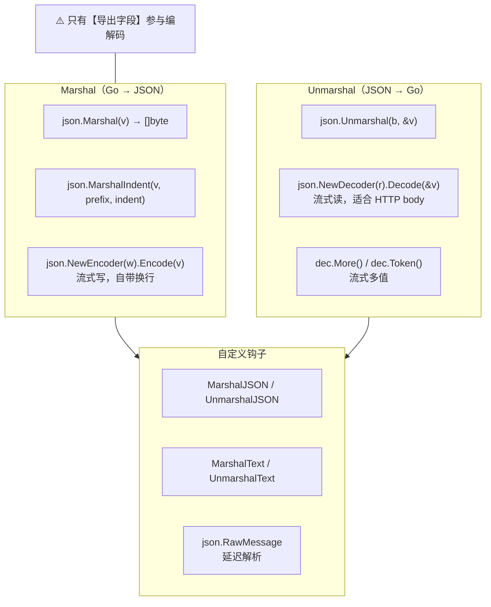
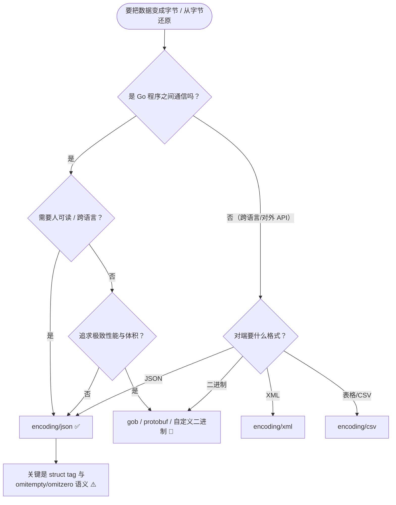
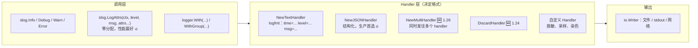

+++
title = "16 标准库：编码与日志"
linkTitle = "16 标准库：编码与日志"
weight = 116
date = "2026-09-20T11:20:00+08:00"
type = "docs"
description = "Go 标准库速查：encoding/json 全表与 tag 语义、自定义 Marshaler、json.RawMessage、base64 与压缩、log 与 log/slog 结构化日志"
isCJKLanguage = true
draft = false
+++

# 16 标准库：编码与日志

本页回答：**JSON 怎么编解码才不出错**、**struct tag 每个选项什么意思**、**日志该怎么打**。

> 基线：**Go 1.27.1**。所有输出为本机实跑结果。
> ⚠️ **Go 1.27 起 `encoding/json` 底层已换成 v2 实现**（行为保持兼容，错误文本可能不同），同时提供显式的 `encoding/json/v2` 与 `encoding/json/jsontext` 包。

---

## encoding/json：编解码全景



### 基本用法

```go
type User struct {
	Name    string    `json:"name"`
	Age     int       `json:"age,omitempty"`
	Email   string    `json:"email,omitempty"`
	Created time.Time `json:"created,omitzero"`
	secret  string    // ⚠️ 未导出 → 完全忽略
	Tags    []string  `json:"tags,omitempty"`
	Score   *int      `json:"score,omitempty"`
}

b, _ := json.Marshal(User{Name: "a"})
// {"name":"a"}

json.Unmarshal([]byte(`{"name":"d","age":30}`), &got)
```

```text
omitempty zero: {"name":"a"}
unmarshal: d 30 true <nil>
```

### struct tag 选项全表

| 选项 | 作用 | 示例 |
| --- | --- | --- |
| `json:"name"` | 改字段名 | `json:"user_name"` |
| `json:"-"` | **完全忽略**该字段 | `json:"-"` |
| `json:"-,"` | 名字就是 `-` | 少见 |
| `json:",omitempty"` | 零值时省略（**有"空"概念的才算**） | 见下表 |
| `json:",omitzero"` 🆕 1.24 | 零值时省略（用 `IsZero()` 或零值判断） | 推荐用于 `time.Time` 🔥 |
| `json:",string"` | 数值编码成 JSON 字符串 | `{"n":"42"}` |
| `json:",inline"` 🚧 | v2 的嵌入选项（v1 靠匿名字段） | v2 特性 |

### `omitempty` 到底省略什么

这是最容易误判的地方：

| 类型 | `omitempty` 视为「空」的值 | 会省略吗 |
| --- | --- | --- |
| `string` | `""` | ✅ |
| 整数/浮点 | `0` | ✅ |
| `bool` | `false` | ✅ |
| 指针 | `nil` | ✅ |
| 切片/映射 | `len == 0`（含 `nil`） | ✅ |
| 接口 | `nil` | ✅ |
| **结构体** | **永远不空** | ❌ 总是输出 ⚠️ |
| **`time.Time`** | **永远不空** | ❌ 连零值也输出 ⚠️ |
| 数组 | 长度固定，不空 | ❌ |

```go
// ⚠️ 这是经典坑：零值 time.Time 依然被输出
u2 := User{Name: "b", Created: time.Time{}}
json.Marshal(u2)     // {"name":"b","created":"0001-01-01T00:00:00Z"}
```

```text
omitzero time: {"name":"b"}
with time: {"name":"c","created":"2026-09-20T00:00:00Z"}
```

🆕 **1.24 起用 `omitzero` 解决这个问题**：它对 `time.Time` 这类零值有意义的结构体也生效（优先用类型的 `IsZero() bool` 方法）。

| 需求 | 用哪个 |
| --- | --- |
| 省略空字符串、0、nil | `omitempty` |
| 省略 `time.Time` 零值、结构体零值 | `omitzero` 🆕 1.24 🔥 |
| 两者都要 | 同时写 `omitempty,omitzero`（任一满足即省略） |

### 输出格式与流式 API

```go
b, _ := json.MarshalIndent(v, "", "  ")     // 人类可读
```

```text
{
  "name": "c",
  "created": "2026-09-20T00:00:00Z"
}
```

```go
// Encoder：写 HTTP 响应推荐用法
w.Header().Set("Content-Type", "application/json")
enc := json.NewEncoder(w)
enc.SetEscapeHTML(false)      // 不转义 < > &
enc.SetIndent("", "  ")       // 开发环境可读
enc.Encode(resp)              // ⚠️ Encode 会自动加换行

// Decoder：读 HTTP body 推荐用法（流式，不必先 ReadAll）
dec := json.NewDecoder(r.Body)
dec.DisallowUnknownFields()   // 严格模式：遇到未知字段报错 🔥
if err := dec.Decode(&req); err != nil {
	http.Error(w, "bad request", http.StatusBadRequest)
	return
}
```

| 选择 | 场景 |
| --- | --- |
| `Marshal` / `Unmarshal` | 数据已在内存里（配置、缓存） |
| `Encoder` / `Decoder` | HTTP 请求响应、文件、流式数据 🔥 |
| `DisallowUnknownFields` | 对外 API 想尽早发现客户端拼错字段名 |

⚠️ `json.NewEncoder(w).Encode()` **会在末尾追加换行符**，做字节级比对时要注意。

### 数值精度：默认走 float64

```go
var raw struct{ Big int64 }
json.Unmarshal([]byte(`{"Big":9007199254740993}`), &raw)
fmt.Println(raw.Big)     // 9007199254740993 —— 目标是 int64，精确解析 ✅
```

但如果目标是 `map[string]any` 或 `any`，数字会变成 **`float64`**：

```go
var m map[string]any
json.Unmarshal([]byte(`{"n":9007199254740993}`), &m)
m["n"].(float64)     // 9.007199254740992e+15 ⚠️ 精度已丢
```

| 场景 | 建议 |
| --- | --- |
| 已知结构 | 定义 struct 用 `int64` ✅ |
| 未知结构 + 大整数 | `dec.UseNumber()`，值变成 `json.Number`（字符串保留）🔥 |
| 金额 | **绝不**用 float；用整数分或字符串 |

```go
dec := json.NewDecoder(r)
dec.UseNumber()      // 🔥 避免 float64 精度陷阱
```

### 自定义编解码：四种钩子

```go
type Color int

const (
	Red Color = iota
	Green
	Blue
)

// ① MarshalJSON：完全控制输出
func (c Color) MarshalJSON() ([]byte, error) {
	return json.Marshal([...]string{"red", "green", "blue"}[c])
}

// ② UnmarshalJSON：完全控制输入
func (c *Color) UnmarshalJSON(b []byte) error {
	var s string
	if err := json.Unmarshal(b, &s); err != nil {
		return err
	}
	switch s {
	case "red":
		*c = Red
	case "green":
		*c = Green
	case "blue":
		*c = Blue
	default:
		return fmt.Errorf("unknown color %q", s)
	}
	return nil
}
```

```text
custom marshal: {"C":"blue"}
custom unmarshal: 1
```

| 钩子 | 优先级 | 说明 |
| --- | --- | --- |
| `json.Marshaler` / `Unmarshaler` | 最高 | JSON 专属，完全控制字节 |
| `encoding.TextMarshaler` / `TextUnmarshaler` | 次之 | 转成 JSON 字符串；**map 键必须实现它** |
| 默认可编码类型 | 最低 | 结构体、切片、映射、基本类型 |

```go
// ③ TextMarshaler：比 MarshalJSON 更通用（YAML/XML 也能用）
type Upper string

func (u Upper) MarshalText() ([]byte, error) { return []byte(strings.ToUpper(string(u))), nil }

json.Marshal(WithText{U: "abc"})     // {"u":"ABC"}
```

```text
textmarshaler: {"u":"ABC"}
```

⚠️ 实现 `UnmarshalJSON` 时**必须用指针接收者**（`func (c *Color) UnmarshalJSON`），否则不会生效——这是最常见的「我的自定义反序列化没被调用」原因。

### json.RawMessage：延迟解析

```go
type Event struct {
	Type string          `json:"type"`
	Data json.RawMessage `json:"data"`   // 先原样收下，之后再解析
}

var e Event
json.Unmarshal([]byte(`{"type":"click","data":{"x":1}}`), &e)
// e.Data 是 []byte(`{"x":1}`)

var payload struct{ X int }
json.Unmarshal(e.Data, &payload)     // 按 Type 决定解析成什么
```

```text
raw: click {"x":1}
decoded payload: 1
```

💡 典型用途：**多态事件/消息**（先读类型字段再解析具体结构）、**转发**（不解内容直接透传）、**部分解析**。

### 常见错误与类型

| 错误类型 | 触发场景 | 怎么判 |
| --- | --- | --- |
| `*json.SyntaxError` | JSON 语法错误 | `errors.As` |
| `*json.UnmarshalTypeError` | 类型不匹配 | `errors.As`，含 `Field`/`Value`/`Type`/`Offset` 🔥 |
| `*json.InvalidUnmarshalError` | 目标不是指针 | `errors.As` |
| `io.ErrUnexpectedEOF` / `io.EOF` | 数据被截断 | `errors.Is` |

```text
type error: json: cannot unmarshal string into Go value of type int
  Value: string Type: int Offset: 5
```

⚠️ 忘记给 `Unmarshal` 传**指针**会得到 `json: Unmarshal(non-pointer T)`——这是新手最常见的一类错误。

---

## 编解码选型：先做三个判断





{}

| 优点 | 缺点 |
| --- | --- |
| 跨语言、人可读、生态完备 | 体积大、解析慢 |
| 标准库零依赖 🔥 | 无 schema，类型全靠约定 |
| 流式 `Encoder`/`Decoder` | 大整数要小心 `float64` |

**最常踩的三个坑**：`omitempty` 对结构体无效、未导出字段被忽略、忘记传指针。

{}

{}

```go
var buf bytes.Buffer
gob.NewEncoder(&buf).Encode(myStruct)
var out MyStruct
gob.NewDecoder(&buf).Decode(&out)
```

| 优点 | 缺点 |
| --- | --- |
| 快、体积小、支持类型信息 | **只有 Go 能读** ⚠️ |
| 零配置 | 不适合对外接口、不适合长期存储 |

💭 适合：进程间通信、缓存、RPC（内部）。

{}

{}

| 格式 | 包 | 关键点 |
| --- | --- | --- |
| CSV | `encoding/csv` | `Writer.Flush()` 必须调 ⚠️；`FieldsPerRecord=-1` 允许变长 |
| XML | `encoding/xml` | tag 支持 `,attr`/`,chardata`/`,innerxml` |
| YAML | 无标准库 🚧 | 用 `gopkg.in/yaml.v3` |
| TOML | 无标准库 🚧 | 用 `BurntSushi/toml` |

{}

{}

```go
// 写：必须 Close 才会输出完整数据 ⚠️
zw := gzip.NewWriter(w)
defer zw.Close()

// 读
zr, err := gzip.NewReader(r)
defer zr.Close()
```

| 格式 | 何时用 |
| --- | --- |
| gzip | HTTP `Content-Encoding: gzip` 🔥 |
| zlib | 协议规定用 zlib 时 |
| flate | 不需要头部开销、自管封装 |
| zstd | 标准库没有，用 `klauspost/compress` 🚧 |

{}



## 其他编码格式

### base64 / hex

```go
base64.StdEncoding.EncodeToString([]byte("hello"))   // "aGVsbG8="
base64.StdEncoding.DecodeString("aGVsbG8=")
hex.EncodeToString([]byte("hello"))                  // "68656c6c6f"
```

```text
aGVsbG8=
68656c6c6f
hello
```

| 变体 | 用途 |
| --- | --- |
| `base64.StdEncoding` | 标准（含 `+/=`） |
| `base64.RawStdEncoding` | 去 padding（JWT 用这个） |
| `base64.URLEncoding` | URL 安全（`-_`） |
| `base64.RawURLEncoding` | URL 安全 + 无 padding（JWT 场景）🔥 |

⚠️ 选错变体是「token 解码失败」的常见原因：JWT 用 `RawURLEncoding`。

### 压缩：记住必须 Close

```go
var gz bytes.Buffer
zw := gzip.NewWriter(&gz)
zw.Write([]byte("compress me"))
fmt.Println("after Write:", gz.Len())    // 10，数据还在缓冲区 ⚠️
zw.Close()                                // 🔥 必须 Close 才写出全部数据
fmt.Println("after Close:", gz.Len())    // 36

zr, _ := gzip.NewReader(&gz)
plain, _ := io.ReadAll(zr)
```

```text
after Write: 10
after Close: 36
roundtrip: compress me
```

⚠️ **压缩 Writer 不 `Close` 就丢数据**，这是仅次于 `bufio` 忘 `Flush` 的高频事故。`Close` 会写入压缩尾部与页脚。

| 格式 | 包 |
| --- | --- |
| gzip | `compress/gzip`（HTTP `Content-Encoding: gzip`） |
| zlib | `compress/zlib` |
| flate（裸 DEFLATE） | `compress/flate` |
| zstd | 标准库**没有**，用 `klauspost/compress/zstd` 🚧 |
| zip / tar | `archive/zip` / `archive/tar` |

### CSV / XML

```go
// encoding/csv
r := csv.NewReader(strings.NewReader("a,b\n1,2\n"))
records, _ := r.ReadAll()          // [][]string
r.FieldsPerRecord = -1             // 允许变长行
r.LazyQuotes = true                // 容忍不规范引号

w := csv.NewWriter(os.Stdout)
w.Write([]string{"a", "b"})
w.Flush()                          // ⚠️ 必须 Flush

// encoding/xml
type Person struct {
	XMLName xml.Name `xml:"person"`
	Name    string   `xml:"name"`
	Age     int      `xml:"age,attr"`
}
```

| tag 选项（xml） | 含义 |
| --- | --- |
| `xml:"name"` | 元素名 |
| `xml:",attr"` | 作为属性 |
| `xml:",chardata"` | 作为文本内容 |
| `xml:",innerxml"` | 原始内部 XML |
| `xml:"a>b>c"` | 嵌套路径 |

---

## log：标准库日志

```go
log.Println("simple")
log.Printf("formatted %d", 42)
log.Fatalf("fatal: %v", err)       // 打印后 os.Exit(1)，⚠️ defer 不会执行！ 
log.Panicf("panic: %v", err)       // 打印后 panic

// 配置
log.SetPrefix("[app] ")
log.SetFlags(log.LstdFlags | log.Lshortfile)   // 日期时间 + 文件名:行号
log.SetOutput(io.MultiWriter(os.Stdout, f))    // 同时写多处
```

| flag | 输出 |
| --- | --- |
| `log.Ldate` | `2026/09/20` |
| `log.Ltime` | `15:04:05` |
| `log.Lmicroseconds` | 微秒 |
| `log.LUTC` | 用 UTC 而非本地时间 |
| `log.Lshortfile` | `main.go:42` |
| `log.Llongfile` | 完整路径 |
| `log.LstdFlags` | `Ldate \| Ltime`（默认） |
| `log.Lmsgprefix` | 前缀放在消息前而非行首 |

⚠️ `log.Fatal*` 会调用 `os.Exit(1)`，**所有 `defer` 都不会执行**——不要在库代码里用它，也不要在持有资源（文件、锁、连接）时用。

💭 **新项目直接用 `log/slog`**：`log` 的顶层函数会**转发到默认 `slog` logger**，本机实测如下——把默认 slog 换成 JSON handler 后，`log.Println` 的输出也变成了 JSON：

```go
slog.SetDefault(slog.New(slog.NewJSONHandler(os.Stdout, nil)))
log.Println("via log package")     // 输出 JSON！
```

```text
{"time":"2026-09-20T20:07:47.931227+08:00","level":"INFO","msg":"via log package"}
{"time":"2026-09-20T20:07:47.931239+08:00","level":"INFO","msg":"via slog"}
```

⚠️ 这条链路是双向影响的：`slog.SetDefault` 会改变老 `log` 代码的输出格式，反过来 `log.SetOutput` 也会影响默认 slog 的落盘位置（实测两者都会写入同一个 `io.Writer`）。混用两套日志 API 时务必注意。

---

## log/slog：结构化日志 🆕 1.21



### 三种 handler 的实测输出

```go
var buf bytes.Buffer
l := slog.New(slog.NewJSONHandler(&buf, &slog.HandlerOptions{Level: slog.LevelInfo}))

l.Info("user login", "user", "alice", "ip", "1.2.3.4")
l.Debug("not shown")                        // 低于 Level，被丢弃
l.Error("failed", "err", os.ErrNotExist)
l.With("service", "api").WithGroup("req").Info("handled", "status", 200, "ms", 12)
```

```text
{"time":"2026-09-20T20:07:15.462385+08:00","level":"INFO","msg":"user login","user":"alice","ip":"1.2.3.4"}
{"time":"2026-09-20T20:07:15.46276+08:00","level":"ERROR","msg":"failed","err":"file does not exist"}
{"time":"2026-09-20T20:07:15.462775+08:00","level":"INFO","msg":"handled","service":"api","req":{"status":200,"ms":12}}
```

```go
slog.New(slog.NewTextHandler(&tb, &slog.HandlerOptions{Level: slog.LevelDebug})).Debug("debug msg", "k", "v")
```

```text
time=2026-09-20T20:07:15.462+08:00 level=DEBUG msg="debug msg" k=v
```

| 选择 | 场景 |
| --- | --- |
| `NewTextHandler` | 本地开发、人眼阅读 |
| `NewJSONHandler` | **生产环境**，被 ELK/Loki/CloudWatch 采集 🔥 |
| `NewMultiHandler` 🆕 1.26 | 同时输出到控制台和文件、或同时做脱敏审计 |
| `slog.DiscardHandler` 🆕 1.24 | 测试时静音（⚠️ 它是**变量**，直接传 `slog.DiscardHandler`，不要加括号）|

### 类型化 Attr：性能与正确性

```go
l.Info("attrs",
	slog.String("s", "x"),
	slog.Int("i", 1),
	slog.Bool("b", true),
	slog.Duration("d", 0),
	slog.Time("t", time.Now()),
	slog.Any("v", complexObj),      // ⚠️ 有反射开销
)
```

```text
{"time":"...","level":"INFO","msg":"attrs","s":"x","i":1,"b":true,"d":0}
```

| 写法 | 开销 | 建议 |
| --- | --- | --- |
| `l.Info("m", "k", v)` | 键值对，会装箱 | 方便，非热点可接受 |
| `slog.String("k", v)` 等 | 类型化，较少分配 | 热点路径推荐 |
| `slog.LogAttrs(ctx, level, msg, attrs...)` | **零分配** 🔥 | 高频日志 |
| `slog.Any` | 反射 | 只在必要时用 |

### 分组、上下文与全局

```go
// 派生 logger：带上公共字段，避免重复
reqLog := base.With("request_id", id, "user_id", uid)
reqLog.Info("start")
reqLog.Info("done", "ms", 12)

// 分组：字段嵌套
l.WithGroup("db").Info("query", "sql", "SELECT 1", "ms", 3)
// {"msg":"query","db":{"sql":"SELECT 1","ms":3}}

// 设置 / 读取全局默认 logger
slog.SetDefault(l)                     // 之后 log 包也会转发到这个 handler
slog.Info("via default")               // 用默认 logger
logger := slog.Default()               // 取回默认 logger
```

⚠️ `slog.SetDefault` 影响 `log` 包的顶层函数输出格式（因为 `log` 转发到默认 slog）——有时这会「意外」改变老代码的日志格式。

### 自定义 Handler：脱敏

```go
type redactHandler struct{ slog.Handler }

func (h redactHandler) Handle(ctx context.Context, r slog.Record) error {
	r2 := slog.NewRecord(r.Time, r.Level, r.Message, r.PC)
	r.Attrs(func(a slog.Attr) bool {
		if a.Key == "password" || a.Key == "token" {
			a.Value = slog.StringValue("[REDACTED]")
		}
		r2.AddAttrs(a)
		return true
	})
	return h.Handler.Handle(ctx, r2)
}

// ⚠️ 包装型 Handler 必须同时重写这两个方法，否则 logger.With(...) 之后脱敏会失效！
func (h redactHandler) WithAttrs(as []slog.Attr) slog.Handler {
	return redactHandler{h.Handler.WithAttrs(as)}
}

func (h redactHandler) WithGroup(name string) slog.Handler {
	return redactHandler{h.Handler.WithGroup(name)}
}
```

🛑 **这是自定义 Handler 最容易踩的坑**：如果只重写 `Handle`，那么

```go
l.With("service", "api").Info("login", "password", "s3cr3t")
```

会**绕过你的脱敏逻辑**——因为内嵌的 `slog.Handler` 的 `WithAttrs` 返回的是**未被包装的内层 handler**，之后的日志直接打到内层去了。本机实测：不重写时上面的输出里 `password` 是明文 `s3cr3t`；补上这两个方法后正确显示 `[REDACTED]`。

💡 这是 `slog` 设计得最好的地方：**格式由 Handler 决定**，业务代码只管打日志，运行期换 handler 就能切换格式、级别、脱敏策略。但要记住：**任何「包装型 Handler」都要把 `WithAttrs`/`WithGroup` 一起包装**，否则派生 logger 会逃出你的处理链。

### 日志实践清单

| 建议 | 说明 |
| --- | --- |
| 用结构化字段而非拼接字符串 | 便于检索与聚合 🔥 |
| 键名统一（全小写下划线） | `request_id` 而非 `requestID` |
| 只在**边界**打错误日志 | 见 [09 错误处理]() |
| 别在热循环里打日志 | 即使被 Level 过滤也有函数调用与参数求值开销 |
| 敏感信息脱敏 | 用自定义 Handler 统一处理 |
| 生产级别设 Info | Debug 留到排查时动态开 |
| 带上下文 | `LogAttrs(ctx, ...)`，配合 trace 集成 |

⚠️ 即使日志级别被过滤，**参数表达式仍然会被求值**：

```go
// 🛑 即使 Debug 被禁用，expensiveString() 也会执行
slog.Debug("debug", "payload", expensiveString())

// ✅ 先判级别（或用 LogAttrs + 惰性 Value）
if slog.Default().Enabled(ctx, slog.LevelDebug) {
	slog.Debug("debug", "payload", expensiveString())
}
```

🆕 **1.24 起可用 `slog.DiscardHandler` 变量**在测试中静音（`slog.New(slog.DiscardHandler)`），配合 `NewMultiHandler` 就能「安静地同时验证日志内容」。

---

## 本页陷阱速查

| 症状 | 实际原因 | 正确做法 |
| --- | --- | --- |
| JSON 里字段不见了 | 字段未导出（小写开头） | 首字母大写 |
| 零值 `time.Time` 也被输出 | `omitempty` 对结构体无效 | 用 `omitzero` 🆕 1.24 |
| `age:0` 被省略但你想保留 | `omitempty` 把 0 当空 | 去掉 `omitempty`，或用 `*int` |
| 自定义 `UnmarshalJSON` 不生效 | 用了值接收者 | 改成指针接收者 `func (c *T)` |
| `Unmarshal(non-pointer T)` | 传了值不是指针 | 传 `&v` |
| 大整数精度丢失 | `any`/`map[string]any` 里是 `float64` | 定义 struct 用 `int64`，或 `dec.UseNumber()` |
| 未知字段被静默丢弃 | 默认宽松模式 | `dec.DisallowUnknownFields()` |
| 响应体末尾多了个换行 | `Encoder.Encode` 会加 `\n` | 用 `Marshal` 或接受它 |
| JWT/token 解码失败 | base64 变体选错 | JWT 用 `RawURLEncoding` |
| 解压后数据不完整 | 压缩 Writer 没 `Close` | `defer zw.Close()` |
| CSV 少了几行 | Writer 没 `Flush` | `defer w.Flush()` |
| `log.Fatal` 后 defer 没执行 | 它调用 `os.Exit` | 库代码返回 error；用 `return` 交给 main |
| 日志格式突然变了 | 有人调了 `slog.SetDefault` | 显式传入 logger，别依赖全局 |
| Debug 日志有性能损耗 | 参数被求值 | 先 `Enabled(ctx, level)` 判断 |
| JSON tag 写错静默失效 | tag 语法不合法 | `go vet` 能查出结构体 tag 问题 |

---

📘 官方参考：[encoding/json](https://pkg.go.dev/encoding/json)、[Go 1.24 — omitzero](https://go.dev/doc/go1.24#encodingjson)、[Go 1.27 — encoding/json/v2](https://go.dev/doc/go1.27)、[log/slog](https://pkg.go.dev/log/slog)、[Go Blog — Structured Logging with slog](https://go.dev/blog/slog)

➡️ 上一节：[15 标准库：io·fs·time]() ｜ 下一节：[17 测试]()
