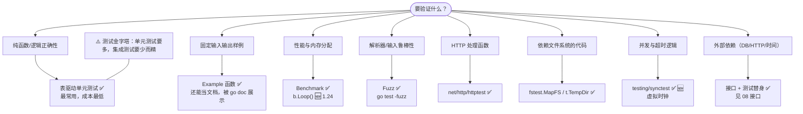
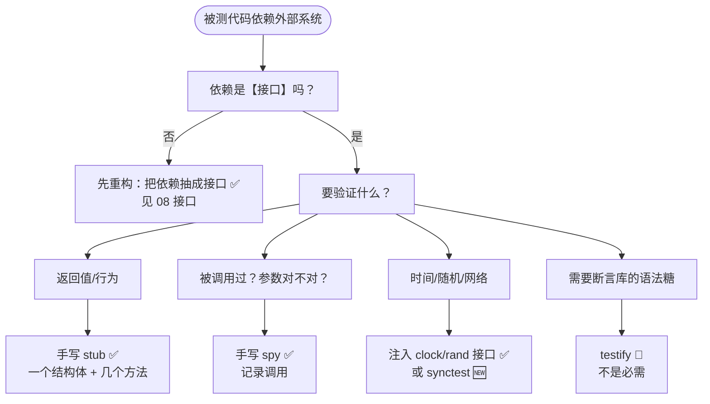

+++
title = "17 测试"
linkTitle = "17 测试"
weight = 117
date = "2026-09-20T11:25:00+08:00"
type = "docs"
description = "Go 测试速查：go test 全参数、表驱动与子测试、并行与 helper、示例函数、基准测试 B.Loop、模糊测试、httptest/fstest/synctest、测试替身策略"
isCJKLanguage = true
draft = false
+++

# 17 测试

Go 把测试做进了工具链：**不需要第三方框架**。本页回答：**测试怎么写**、**`go test` 怎么用**、**并发与 IO 怎么测**。

> 基线：**Go 1.27.1**。所有输出为本机实跑结果（测试包为 `ch17`）。

---

## 测试类型选型



```text
测试的层次：越往上越慢、越脆、越少

        ▲  数量少
        │
   ┌────┴─────┐
   │ 端到端 E2E │  起真实服务/浏览器 · 分钟级 · 只在关键路径 🔥
   ├──────────┤
   │ 集成测试   │  真 DB/真 HTTP · 秒级 · 用 -tags=integration 隔离
   ├──────────┤
   │ 单元测试   │  表驱动 + 子测试 · 毫秒级 · 【数量最多】✅
   └──────────┘
        │
        ▼  数量多

   配套手段（横切所有层）：
     -race 数据竞争 · fuzz 边界 · bench 性能 · cover 覆盖率
```

```text
子测试树：t.Run 生成的层级结构

  TestDiv                        ← 顶层测试
   ├── TestDiv/normal            ← t.Run("normal")
   ├── TestDiv/negative
   └── TestDiv/by_zero
                                  可单独跑：
                                  go test -run 'TestDiv/by_zero'

  TestSumParallel                ← 并行父测试
   ├── TestSumParallel/case0  ─┐
   ├── TestSumParallel/case1  ─┼─ t.Parallel() → 都 PAUSE 后一起 CONT
   └── TestSumParallel/case2  ─┘

  ⚠️ t.Parallel() 建议放在 t.Run 闭包开头（可读性最好）；硬性限制见下文
```

| 文件命名 | 说明 |
| --- | --- |
| `xxx_test.go` | 必须以 `_test.go` 结尾，否则不会被编译进测试 |
| `package foo`（内部测试） | 可访问未导出标识符 🔥 |
| `package foo_test`（外部测试） | 只测公开 API，验证「用户视角」 |

💡 两种包名可以**在同一个目录共存**：`foo_test.go` 用 `package foo` 测内部细节，`foo_ext_test.go` 用 `package foo_test` 测公开接口。

---

## go test 参数全表

| 参数 | 作用 | 常用组合 |
| --- | --- | --- |
| `./...` | 递归跑所有包 | `go test ./...` 🔥 |
| `-v` | 打印每个测试名与结果 | 排查失败时必开 |
| `-run 'TestFoo'` | 正则筛选测试 | `-run 'TestUser/创建'` 筛子测试 |
| `-bench .` | 跑基准测试 | `-bench=. -benchmem` 🔥 |
| `-benchmem` | 报告内存分配 | 配合 `-bench` |
| `-fuzz FuzzX` | 跑模糊测试 | `-fuzz=FuzzParse -fuzztime=30s` |
| `-cover` | 覆盖率 | `-coverprofile=cover.out` |
| `-covermode` | 覆盖模式 | `set`/`count`/`atomic`（并发必须 atomic） |
| `-race` | 数据竞争检测 | **CI 必开** 🔥 |
| `-count=1` | 禁用结果缓存 | 「为什么没重跑」的答案 ⚠️ |
| `-short` | 跳过耗时测试 | 用 `testing.Short()` 判断 |
| `-timeout 30s` | 超时（默认 10m） | CI 里建议收紧 |
| `-parallel n` | 并行上限（默认 GOMAXPROCS） | 配合 `t.Parallel()` |
| `-failfast` | 首个失败即停 | 本地快速迭代 |
| `-json` | 结构化输出 | 给 CI 解析 🆕 1.24 起含构建错误 |
| `-shuffle=on` | 随机化测试顺序 | 暴露测试间依赖 🔥 |
| `-list '.*'` | 只列出测试名不执行 | 确认被测到 |
| `-cpu 1,2,4` | 多 GOMAXPROCS 重复跑基准 | `-bench=. -cpu=1,4,8` |

```console
# 最常用的三条
$ go test ./...                       # 快速全量
$ go test -race -count=1 ./...        # CI 上认真跑
$ go test -run TestUser -v ./user     # 单点排查
```

⚠️ **结果缓存**：`go test` 会缓存成功结果（显示 `(cached)`）。依赖外部状态或改了环境变量时用 `-count=1` 强制重跑。

⚠️ `go test` 会调用一部分 `go vet` 检查（如 `tests` 分析器），所以有些「测试没跑」的问题其实是 vet 报出来的。

---

## 第一个测试：三件事

```go
// calc_test.go
package calc

import "testing"

func TestAdd(t *testing.T) {
	if got := Add(1, 2); got != 3 {
		t.Errorf("Add(1,2) = %d, want 3", got)
	}
}
```

```console
$ go test ./...
ok  	ch17	0.404s
```

| 规则 | 说明 |
| --- | --- |
| 函数名 | `Test` + 大写开头，参数 `*testing.T` |
| 报告失败 | `t.Error`（继续）/ `t.Fatal`（立即停止当前测试） |
| 不是断言 | Go 没有 `assert`；自己写 `if` 判断 🔥 |
| 失败信息 | 写**期望值 vs 实际值**，格式 `X = got, want W` |

### `t.Error` vs `t.Fatal` vs `t.Fail`

| 方法 | 行为 |
| --- | --- |
| `t.Errorf` | 记录错误，**继续执行**后续代码 |
| `t.Fatalf` | 记录错误，**立刻结束当前测试**（`runtime.Goexit`）⚠️ |
| `t.Fail()` | 只标记失败，不输出 |
| `t.FailNow()` | 标记失败并结束当前测试 |
| `t.Skipf` | 跳过，标记为 SKIP |
| `t.Cleanup(f)` | 注册清理（LIFO，测试结束时执行）🔥 |

⚠️ `t.Fatalf` 内部调用 `runtime.Goexit()`，所以**同一 goroutine 里的 `defer` 会执行，但函数不会返回**。不要在非测试 goroutine 里调 `t.Fatal`（Go 1.24 起 `go vet` 的 `tests` 分析器会查这类误用）。

---

## 表驱动测试：Go 的标准写法

```go
func TestDiv(t *testing.T) {
	tests := []struct {
		name    string
		a, b    int
		want    int
		wantErr error
	}{
		{"normal", 10, 2, 5, nil},
		{"negative", -9, 3, -3, nil},
		{"by zero", 1, 0, 0, ErrDivZero},
	}
	for _, tc := range tests {
		t.Run(tc.name, func(t *testing.T) {
			got, err := Div(tc.a, tc.b)
			if !errors.Is(err, tc.wantErr) {
				t.Fatalf("Div(%d,%d) err = %v, want %v", tc.a, tc.b, err, tc.wantErr)
			}
			if got != tc.want {
				t.Errorf("Div(%d,%d) = %d, want %d", tc.a, tc.b, got, tc.want)
			}
		})
	}
}
```

```console
$ go test -v -run TestDiv ./...
=== RUN   TestDiv
=== RUN   TestDiv/normal
=== RUN   TestDiv/negative
=== RUN   TestDiv/by_zero
--- PASS: TestDiv (0.00s)
    --- PASS: TestDiv/normal (0.00s)
    --- PASS: TestDiv/negative (0.00s)
    --- PASS: TestDiv/by_zero (0.00s)
PASS
```

| 要点 | 说明 |
| --- | --- |
| `t.Run(name, f)` | 子测试：独立报告、可单独筛选、可并行 🔥 |
| 子测试名 | 用 `tc.name`，`go test -run 'TestDiv/normal'` 可单跑 |
| 错误用 `%w` 比较 | 用 `errors.Is` 而不是 `==`（见 [09]()） |
| 循环变量 | 🆕 1.22 起每次迭代新建，**不需要** `tc := tc` 🪦 |
| 空间换可读性 | 表放在测试函数顶部，一眼能看出覆盖了哪些场景 |

### 并行子测试

```go
func TestSumParallel(t *testing.T) {
	for i := range 3 {
		t.Run(fmt.Sprint("case", i), func(t *testing.T) {
			t.Parallel()          // 🔥 标记为可并行
			if got := Sum(1, 2, 3); got != 6 {
				t.Errorf("got %d", got)
			}
		})
	}
}
```

```console
=== RUN   TestSumParallel
=== PAUSE TestSumParallel/case0
=== PAUSE TestSumParallel/case1
=== PAUSE TestSumParallel/case2
=== CONT  TestSumParallel/case0
=== CONT  TestSumParallel/case1
=== CONT  TestSumParallel/case2
```

| 方法 | 作用 |
| --- | --- |
| `t.Parallel()` | 暂停当前测试，等同级测试都暂停后并行执行 |

⚠️ `t.Parallel()` **没有「必须是第一行」的硬性要求**（官方文档只说它标记并行并暂停）。真正会 panic 的只有三种情况：

| 禁止 | 后果 |
| --- | --- |
| 对同一个 `t` 重复调用 | panic |
| 在 `testing/synctest` 的 bubble 内调用 | panic |
| 在 `t.Setenv` / `t.Chdir` 之后调用 | panic（实现里用 `denyParallel` 标记） |

💭 放在闭包第一行是**可读性建议**，不是语言规则。
| `t.Setenv(k, v)` | 设置环境变量，**自动禁止该测试并行** ✅ |
| `t.TempDir()` | 临时目录，测试结束自动删除 ✅ |
| `t.Chdir(dir)` 🆕 1.24 | 切换工作目录，测试结束自动恢复 |
| `t.Context()` 🆕 1.24 | 测试作用域的 context，测试结束自动取消 🔥 |
| `t.Deadline()` | 超时时间点 |

⚠️ 并行测试里**不能**依赖全局可变状态（`os.Setenv`+并行、共享变量、当前目录）。`t.Setenv` 会自动把测试标记为非并行来保护你。

---

## Helper 与 Cleanup

```go
func newTempFile(t *testing.T) *os.File {
	t.Helper()               // 🔥 失败行号指向调用方，而不是这里
	f, err := os.CreateTemp(t.TempDir(), "test-*")
	if err != nil {
		t.Fatalf("create temp: %v", err)
	}
	t.Cleanup(func() { f.Close() })   // ✅ 测试结束自动清理（LIFO）
	return f
}
```

| 方法 | 用途 |
| --- | --- |
| `t.Helper()` | 把当前函数标记为辅助函数，报错时显示**调用方的行号** |
| `t.Cleanup(f)` | 注册清理函数，**LIFO** 执行，比 `defer` 更适合「构造器」场景 🔥 |
| `t.TempDir()` | 每测试独立临时目录，自动递归删除 |
| `t.Log` / `t.Logf` | 只在失败或 `-v` 时输出 |
| `t.Output()` 🆕 1.25 | 返回一个 `io.Writer`，把日志写进测试输出 |

💡 `t.Cleanup` 比 `defer` 好的地方：**它跟着 `t` 走**。辅助函数里注册的清理会在测试函数返回后仍被执行，而 `defer` 在辅助函数返回时就跑了。

---

## Example 函数：可执行的文档

```go
func ExampleSum() {
	fmt.Println(Sum(1, 2, 3))
	// Output: 6
}
```

```console
--- PASS: ExampleSum (0.00s)
```

| 规则 | 说明 |
| --- | --- |
| 函数名 | `Example` 或 `ExampleType` / `ExampleFunc` |
| 必须有 `// Output:` 注释 | 否则不校验输出（只编译） |
| 输出必须**完全一致** | 包括空格与换行 |
| `// Unordered output:` | 输出顺序不确定时用 |
| 会在 `go doc` 里展示 | 最好的 API 文档形式 🔥 |

⚠️ `Example` 的输出注释必须紧跟在函数**最后一行**，中间不能有空行。

---

## 基准测试

```go
func BenchmarkSum(b *testing.B) {
	for b.Loop() {          // 🆕 1.24 推荐写法 🔥
		Sum(1, 2, 3, 4, 5)
	}
}

func BenchmarkSumOld(b *testing.B) {
	for range b.N {          // 老写法，等价
		Sum(1, 2, 3, 4, 5)
	}
}
```

```console
$ go test -bench=. -benchmem -run=^$ ./...
goos: darwin
goarch: arm64
pkg: ch17
cpu: Apple M4
BenchmarkSum-10       	601631548	         1.787 ns/op	       0 B/op	       0 allocs/op
BenchmarkSumOld-10    	808863117	         1.474 ns/op	       0 B/op	       0 allocs/op
PASS
ok  	ch17	2.612s
```

| 列 | 含义 |
| --- | --- |
| `601631548` | 迭代次数（`b.N`） |
| `1.787 ns/op` | 每次操作耗时 |
| `0 B/op` | 每次操作的字节数 🔥 |
| `0 allocs/op` | 每次操作的分配次数 🔥 |

### `b.Loop()` 相对 `for range b.N` 的两大优势 🆕 1.24

| 优势 | 说明 |
| --- | --- |
| 每次测量只跑一次函数体 | 不再像 `for range b.N` 那样为了校准反复调用，setup/cleanup 可以直接放在 `b.Loop()` 之前 🔥 |
| 自带保活 | 循环体内的函数参数与结果被保活，编译器无法把整段优化掉 ✅ |

⚠️ 注意「一次」指的是**每次测量（per measurement）**，不是「整个基准只跑一次」——`-count=2` 就是两次测量、函数体执行两次。本机实测（`-count=2`）：

```text
--- BENCH: BenchmarkLoopBodyCount-10
    bench_test.go:15: bodyRuns = 1, b.N = 1
--- BENCH: BenchmarkLoopBodyCount-10
    bench_test.go:15: bodyRuns = 2, b.N = 1
```

⚠️ **老写法（`for range b.N`）必须自己防优化**：把结果赋给**包级变量**，否则编译器可能把整个循环删掉。

🛑 **`b.ReportAllocs()` 不是防优化手段**——它的实现只有一行 `b.showAllocResult = true`，纯粹控制「是否报告内存分配」。本机实测两个「结果丢弃」的基准耗时几乎相同（`1.592` vs `1.613 ns/op`），说明加了 `ReportAllocs` 照样会被优化掉。

```go
// 🆕 1.26 起 b.Loop 不再阻止循环体内联，所以老写法可以放心迁移到 b.Loop
```

| 常用方法 | 作用 |
| --- | --- |
| `b.ReportAllocs()` | 报告内存分配（等价 `-benchmem`） |
| `b.ResetTimer()` | 重置计时（排除 setup） |
| `b.StopTimer()` / `b.StartTimer()` | 暂停/恢复计时 |
| `b.SetBytes(n)` | 报告吞吐量（MB/s） |
| `b.RunParallel(f)` | 并行基准（测锁竞争）🔥 |
| `b.ReportMetric(v, unit)` | 自定义指标 |
| `b.Run(name, f)` | 子基准：不同实现/不同规模的对比 🔥 |

```go
// 参数化基准：对比不同输入规模
func BenchmarkParse(b *testing.B) {
	for _, size := range []int{10, 100, 1000} {
		b.Run(fmt.Sprintf("size=%d", size), func(b *testing.B) {
			data := makeInput(size)
			b.ResetTimer()
			for b.Loop() {
				Parse(data)
			}
		})
	}
}

// 并行基准：暴露锁竞争
func BenchmarkParallel(b *testing.B) {
	b.RunParallel(func(pb *testing.PB) {
		for pb.Next() {
			work()
		}
	})
}
```

💡 基准测试的两条纪律：**① 结果只看相对值**（不同机器的绝对数字没有可比性）；**② 用 `benchstat` 比较两次结果**，单次数字噪声很大：

```console
$ go test -bench=. -count=10 ./... > old.txt
$ # 改代码
$ go test -bench=. -count=10 ./... > new.txt
$ benchstat old.txt new.txt
```

---

## 模糊测试 🆕 1.18

```go
func FuzzSum(f *testing.F) {
	f.Add(1, 2)        // 种子语料（可选，也可放 testdata/fuzz/）
	f.Add(0, 0)

	f.Fuzz(func(t *testing.T, a, b int) {
		if Sum(a, b) != Sum(b, a) {
			t.Errorf("not commutative: %d %d", a, b)
		}
	})
}
```

```console
$ go test -run FuzzSum ./...            # 只跑种子语料（默认，CI 用）
$ go test -fuzz FuzzSum -fuzztime 30s   # 真正开始变异探索
```

| 概念 | 说明 |
| --- | --- |
| 种子语料 | `f.Add(...)` 或 `testdata/fuzz/FuzzX/` 下的文件 |
| 变异 | `-fuzz` 模式下不断生成新输入 |
| 失败用例保存 | 自动写入 `testdata/fuzz/FuzzX/`，之后普通 `go test` 也会复现 🔥 |
| 支持的类型 | `string`、`[]byte`、所有整数/浮点/布尔 |

⚠️ Fuzz 目标函数的参数**只支持基本类型**（不能直接 fuzz 结构体，要先转成 `[]byte` 或字段组合）。

💡 模糊测试最值钱的场景：**解析器**（JSON、协议、正则、URL）、**边界计算**、**序列化往返**（`Unmarshal(Marshal(x)) == x`）。

---

## 测试替身：不用框架也能做好



```go
// 生产代码：依赖接口，不是具体类型
type Store interface {
	Get(ctx context.Context, id string) (*User, error)
}

type Service struct{ store Store }

// 测试替身：手写即可，不需要 mock 框架
type fakeStore struct {
	data map[string]*User
	err  error
	got  []string          // spy：记录调用
}

func (f *fakeStore) Get(_ context.Context, id string) (*User, error) {
	f.got = append(f.got, id)
	if f.err != nil {
		return nil, f.err
	}
	u, ok := f.data[id]
	if !ok {
		return nil, ErrNotFound
	}
	return u, nil
}

func TestService_Get(t *testing.T) {
	fs := &fakeStore{data: map[string]*User{"1": {Name: "a"}}}
	svc := &Service{store: fs}

	u, err := svc.Get(context.Background(), "1")
	if err != nil {
		t.Fatalf("unexpected err: %v", err)
	}
	if u.Name != "a" {
		t.Errorf("Name = %q, want %q", u.Name, "a")
	}
	if len(fs.got) != 1 || fs.got[0] != "1" {
		t.Errorf("store calls = %v, want [1]", fs.got)
	}
}
```

| 替身类型 | 用途 |
| --- | --- |
| Stub | 返回预设值 |
| Spy | 记录调用，事后断言 |
| Fake | 轻量可用实现（内存 map 代替 DB）🔥 最实用 |
| Mock | 预设期望的调用（框架驱动，Go 社区不主流） |

💭 **Go 社区共识**：优先设计「可测试的接口」，然后**手写 fake**。`testify` 之类的库主要价值是 `require`/`assert` 的语法糖，不是 mock 能力。

⚠️ 反模式：为了让测试通过而设计出「11 个方法的大接口」。接口应该由**消费方**按需定义（见 [08]()）。

---

## 测并发与 IO：标准库的三个利器

### httptest：不用真起服务器

```go
func TestHandler(t *testing.T) {
	// ① 直接测 handler 函数（最快）
	req := httptest.NewRequest(http.MethodGet, "/users/1", nil)
	rec := httptest.NewRecorder()
	handler(rec, req)

	if rec.Code != http.StatusOK {
		t.Errorf("status = %d, want %d", rec.Code, http.StatusOK)
	}
	var got User
	if err := json.Unmarshal(rec.Body.Bytes(), &got); err != nil {
		t.Fatalf("bad body: %v", err)
	}

	// ② 需要真实网络行为时起测试服务器
	srv := httptest.NewServer(http.HandlerFunc(handler))
	defer srv.Close()
	resp, err := srv.Client().Get(srv.URL + "/users/1")
	...
}
```

| 工具 | 用途 |
| --- | --- |
| `httptest.NewRequest` | 构造请求（无需网络） 🔥 |
| `httptest.NewRecorder` | 捕获响应（`Code`/`Body`/`Header`） 🔥 |
| `httptest.NewServer` | 起真实 HTTP 服务器（测客户端代码） |
| `httptest.NewTLSServer` | HTTPS 版本 |
| `srv.Client()` | 已配置好信任测试证书的客户端 |

### fstest：内存文件系统

```go
func TestLoadConfig(t *testing.T) {
	fsys := fstest.MapFS{
		"config.json": &fstest.MapFile{Data: []byte(`{"port":8080}`)},
		"sub/x.txt":   &fstest.MapFile{Data: []byte("hi")},
	}
	cfg, err := LoadConfig(fsys)      // 生产传 os.DirFS，测试传 MapFS ✅
	if err != nil {
		t.Fatal(err)
	}
	if cfg.Port != 8080 {
		t.Errorf("Port = %d", cfg.Port)
	}

	// 校验 FS 实现是否符合 io/fs 契约
	if err := fstest.TestFS(fsys, "config.json"); err != nil {
		t.Fatal(err)
	}
}
```

### testing/synctest：虚拟时钟 🆕 1.25 正式可用

测「超时 / 重试 / 定时」逻辑的痛点是要真等。`synctest` 用虚拟时钟把等待变成瞬时：

```go
func TestWithFakeClock(t *testing.T) {
	synctest.Test(t, func(t *testing.T) {
		start := time.Now()
		done := make(chan struct{})
		go func() {
			time.Sleep(time.Hour)      // 虚拟时钟：瞬间跳过 🔥
			close(done)
		}()
		synctest.Wait()                // 等当前 bubble 内所有 goroutine 阻塞
		<-done
		if elapsed := time.Since(start); elapsed != time.Hour {
			t.Fatalf("elapsed = %v, want 1h", elapsed)
		}
	})
}
```

```console
$ go test -run TestWithFakeClock -v ./...
=== RUN   TestWithFakeClock
--- PASS: TestWithFakeClock (0.00s)     ← 真实耗时 0.00s，逻辑时间 1h ✅
```

| 函数 | 作用 |
| --- | --- |
| `synctest.Test(t, f)` | 在「bubble」里运行 f，内部时间被虚拟化 |
| `synctest.Wait()` | 等 bubble 内所有 goroutine 进入阻塞 |
| `synctest.Sleep(d)` 🆕 1.27 | `time.Sleep` + `synctest.Wait` 的组合 |

| 能做 | 不能做 |
| --- | --- |
| 测 `time.Sleep`/`Timer`/`Ticker` 逻辑 🔥 | 真实网络 IO（bubble 内禁止外部阻塞） |
| 确定性复现并发时序 | 依赖真实时钟精度的场景 |
| 让 `-race` 更容易命中问题 | 🚧 `net/http` 需配合 `httptest.NewTestServer` 🆕 1.27 |

---

## 四种测试的真实输出并排



{}

```console
$ go test -v -run TestDiv ./...
=== RUN   TestDiv
=== RUN   TestDiv/normal
=== RUN   TestDiv/negative
=== RUN   TestDiv/by_zero
--- PASS: TestDiv (0.00s)
    --- PASS: TestDiv/normal (0.00s)
    --- PASS: TestDiv/negative (0.00s)
    --- PASS: TestDiv/by_zero (0.00s)
PASS
ok  	ch17	0.404s
```

**读法**：缩进的 `--- PASS` 是子测试，名字就是 `t.Run` 的第一个参数。

{}

{}

```console
$ go test -bench=. -benchmem -run=^$ ./...
goos: darwin
goarch: arm64
pkg: ch17
cpu: Apple M4
BenchmarkSum-10       	601631548	         1.787 ns/op	       0 B/op	       0 allocs/op
BenchmarkSumOld-10    	808863117	         1.474 ns/op	       0 B/op	       0 allocs/op
PASS
ok  	ch17	2.612s
```

**读法**：`-10` 是 GOMAXPROCS，`601631548` 是迭代次数，后两列是**内存分配**（优化时最该盯的指标）。

{}

{}

```console
$ go test -run FuzzSum ./...          # 只跑种子（CI 默认）
=== RUN   FuzzSum
=== RUN   FuzzSum/seed#0
=== RUN   FuzzSum/seed#1
--- PASS: FuzzSum (0.00s)

$ go test -fuzz FuzzSum -fuzztime 30s # 真正变异探索
```

**读法**：失败样本会自动写进 `testdata/fuzz/FuzzSum/`，之后普通 `go test` 也能复现 ✅。

{}

{}

```console
$ go test -run TestWithFakeClock -v ./...
=== RUN   TestWithFakeClock
--- PASS: TestWithFakeClock (0.00s)     ← 真实 0.00s，逻辑 1h 🔥
PASS
ok  	ch17	0.415s
```

**读法**：真实耗时与逻辑耗时解耦，这就是 `testing/synctest` 的价值。

{}



## 覆盖率：看什么、别看什么

```console
$ go test -cover ./...
ok  	ch17	0.413s	coverage: 100.0% of statements

$ go test -coverprofile=cover.out ./...
$ go tool cover -html=cover.out        # 浏览器里看哪些行没覆盖
$ go tool cover -func=cover.out        # 按函数列出覆盖率
```

| 模式 | 说明 |
| --- | --- |
| `-covermode=set` | 是否执行过（默认） |
| `-covermode=count` | 执行次数（可做热点分析） |
| `-covermode=atomic` | 并发安全的 count（`-race` 时必须） |
| `-coverpkg=a,b` | 统计其他包的覆盖率（集成测试用） |

⚠️ **覆盖率是下限指标，不是目标**。100% 覆盖不等于正确：表驱动测试跑过所有分支，但可能没有任何有效的断言。反过来，防御性代码（`default` 分支、不可能路径）没必要强求覆盖。

💭 实用的做法：**关键路径覆盖率要高，同时用 `-race` 与 fuzz 兜底**，而不是追一个全仓库的百分比数字。

---

## 本页陷阱速查

| 症状 | 实际原因 | 正确做法 |
| --- | --- | --- |
| 改了代码但测试没重跑 | 命中了结果缓存 | `-count=1` |
| 测试文件不生效 | 文件名没有 `_test.go` 后缀 | 改名 |
| 测试函数没被执行 | 名字不是 `Test` + 大写开头，或签名不对 | `func TestX(t *testing.T)` |
| `Example` 不校验输出 | 缺少 `// Output:` 注释 | 补注释；注意不能在最后留空行 |
| 报错行号指向 helper 内部 | 没调 `t.Helper()` | 在辅助函数首行调用 |
| 辅助函数里的 `defer` 提前执行 | `defer` 跟函数走，不跟测试走 | 用 `t.Cleanup` |
| 并行测试互相干扰 | 共享全局状态/环境变量/工作目录 | `t.Setenv`、`t.TempDir`、`t.Chdir` |
| 并发测试报了竞态但不知道在哪 | 没开 race | `go test -race`（CI 必开） |
| 基准数字忽高忽低 | 单次采样噪声大 | `-count=10` + `benchstat` |
| 基准测出来 0.3 ns/op 快得离谱 | 循环体被编译器优化掉了 | 用 `b.Loop()` 🆕 1.24 |
| fuzz 目标编译不过 | 参数不是支持的基本类型 | 只收 `string`/`[]byte`/数值/布尔 |
| fuzz 失败后普通测试也挂了 | 失败用例被写进 `testdata/fuzz/` | 这是特性 ✅，修好后删除该文件 |
| 测试里 `t.Fatal` 没停止 | 在子 goroutine 里调用了 | 子 goroutine 用 `t.Errorf` + `return` |
| 集成测试超时被杀 | 默认 10 分钟超时 | `-timeout` 调整，或 spliting 测试 |
| `httptest` 服务器忘了关闭 | 没 `defer srv.Close()` | 补上，否则端口与 goroutine 泄漏 |
| 覆盖率 100% 但仍然有 bug | 覆盖的是行，不是断言 | 检查断言是否有效 |

---

📘 官方参考：[testing 包](https://pkg.go.dev/testing)、[Go Blog — Using Subtests and Sub-benchmarks](https://go.dev/blog/subtests)、[Go Blog — Fuzzing](https://go.dev/blog/fuzz-beta)、[Go 1.24 — B.Loop](https://go.dev/doc/go1.24#testing)、[testing/synctest](https://pkg.go.dev/testing/synctest)

➡️ 上一节：[16 标准库：编码与日志]() ｜ 下一节：[18 并发模式]()
