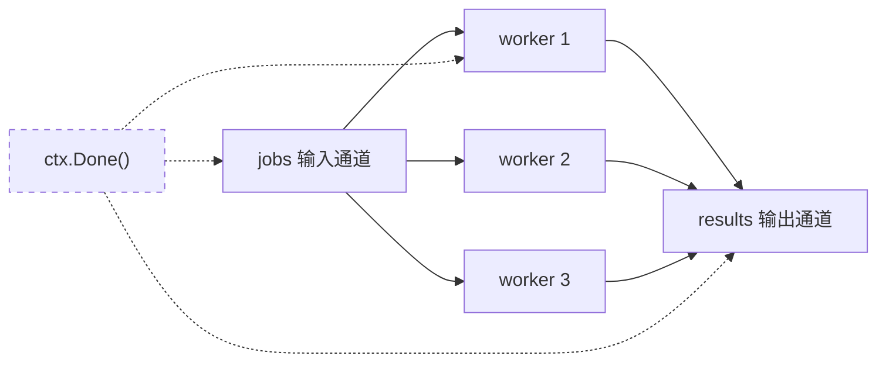
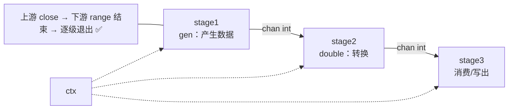
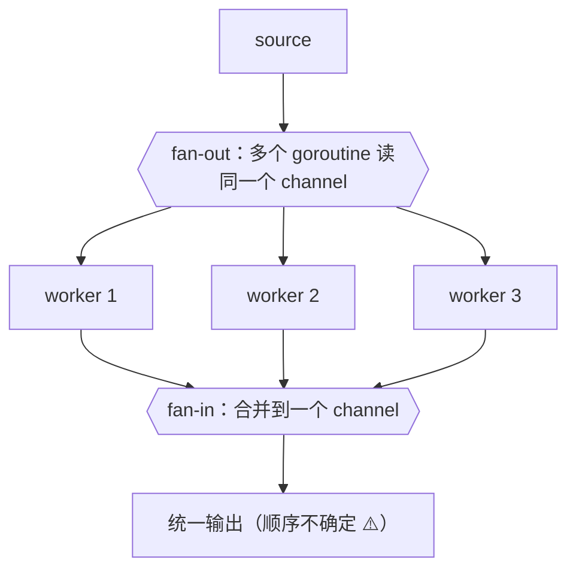
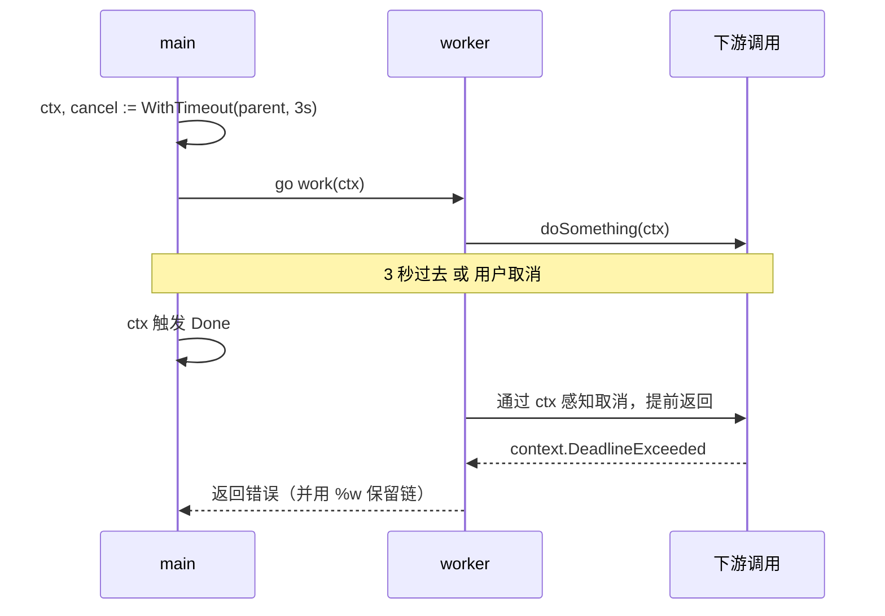
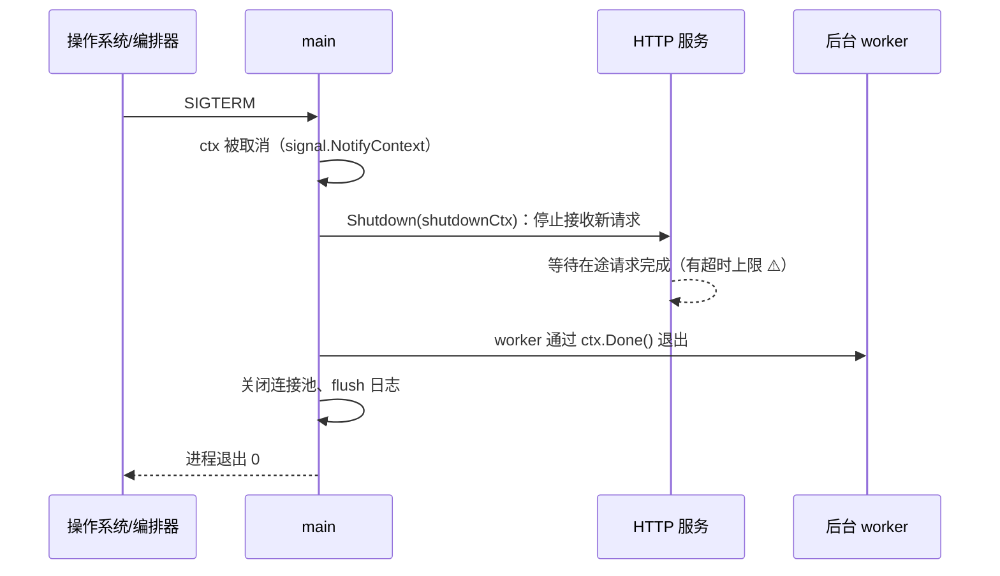
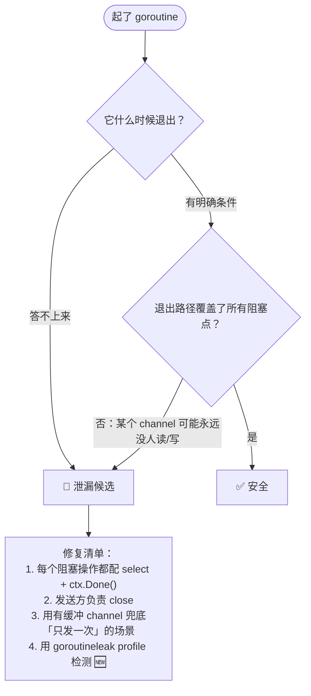

+++
title = "18 并发模式"
linkTitle = "18 并发模式"
weight = 118
date = "2026-09-20T11:30:00+08:00"
type = "docs"
description = "Go 并发模式速查：worker pool、pipeline、fan-in/fan-out、取消与超时、优雅关闭、限流背压、goroutine 泄漏排查"
isCJKLanguage = true
draft = false
+++

# 18 并发模式

[12 章]() 讲的是**语法**，本页讲的是**结构**：把 `go`/`chan`/`select` 组合成可维护、可取消、不会泄漏的并发代码。

> 基线：**Go 1.27.1**。所有示例在本机实跑并通过 `go run -race` 检查。

---

## 六个模式的选型表



{}

**→ Worker Pool**（模式一）

```go
sem := make(chan struct{}, limit)   // 或 g.SetLimit(n)（errgroup 的方法）
```

| 关键 | 值 |
| --- | --- |
| 并发上限 | CPU 密集 = NumCPU；IO 密集靠压测 🔥 |
| 结果收集 | 按下标写预分配切片，天然有序 ✅ |
| 取消 | 每个 select 都要有 `ctx.Done()` |

{}

{}

**→ Pipeline**（模式二）

```go
for v := range stage3(ctx, stage2(ctx, stage1(ctx, src))) { ... }
```

| 关键 | 值 |
| --- | --- |
| 返回类型 | `<-chan T`（只读） |
| 每级收尾 | `defer close(out)` 🔥 |
| 取消 | 每级都监听 ctx，否则某级永久阻塞 ⚠️ |

{}

{}

**→ Fan-in**（模式三）

| 关键 | 值 |
| --- | --- |
| 顺序 | **会丢失** ⚠️ 需要有序就按下标写切片 |
| 关闭 | `wg.Wait()` 后再 `close(out)` 🔥 |
| 常见 bug | `wg.Go` 后又写 `Done`（1.25）→ Wait 提前返回 |

{}

{}

**→ 取消与超时**（模式四）

| 关键 | 值 |
| --- | --- |
| 超时 | `context.WithTimeout` + `defer cancel()` 🔥 |
| 重试三件套 | 可重试性判断 + 指数退避 + 尊重 ctx |
| 错误 | `%w` 包装，让调用方 `errors.Is` 判定 |

{}

{}

**→ 优雅关闭**（模式五）

| 步骤 | 关键 |
| --- | --- |
| 信号 | `signal.NotifyContext` |
| 停流量 | `srv.Shutdown(独立 ctx)` ⚠️ 别传已取消的 ctx |
| 等 worker | `wg.Wait()` |
| 顺序 | 停流量 → 处理存量 → 释放资源 |

{}

{}

**→ 防泄漏**（模式七）

| 检查项 | 说明 |
| --- | --- |
| 每个 goroutine | 都能回答「何时退出」 🔥 |
| 每个阻塞点 | 都有 ctx 或兜底缓冲 |
| 检测 | `NumGoroutine` 基线 / pprof / 🆕 goroutineleak |

{}



## 模式一：Worker Pool（固定并发）

**用途**：控制并发上限，避免一次起 10 万个 goroutine 打爆下游。



```text
Worker Pool 的 goroutine 与 channel 拓扑

  main goroutine                    workers（固定 N 个）          收集方
  ──────────────                    ────────────────────          ──────
                                   ┌──────────────┐
                    ┌──► close(in) │ worker 1     │──┐
  for _, j := range │              │ for j := range in │  │
      jobs          │              └──────────────┘  │
        │           │                                │
        └─► in ─────┤              ┌──────────────┐  ├──► out ──► for r := range out
            (无缓冲) │              │ worker 2     │  │   (缓冲 = len(jobs))
                    └─────────────►│ ...          │──┘
                                   └──────────────┘
                                   ┌──────────────┐
                                   │ worker N     │──┘
                                   └──────────────┘
                                        │
                                        ▼
                              wg.Wait() 之后 close(out) 🔥
                              └─► 收集方的 range 才能正常结束

  三个必须存在的收尾动作：
   ① 生产者 defer close(in)     → worker 的 range 能结束
   ② wg.Wait() 后 close(out)    → 收集方的 range 能结束
   ③ 每个 select 都有 ctx.Done() → 取消时所有 goroutine 能退出
```

```go
func RunPool(ctx context.Context, jobs []Job, workers int) ([]Result, error) {
	in := make(chan Job)
	out := make(chan Result, len(jobs))

	var wg sync.WaitGroup
	for range workers {                       // 🆕 1.25：wg.Go 一步到位
		wg.Go(func() {
			for j := range in {
				select {
				case out <- process(j):
				case <-ctx.Done():
					return                 // 🔥 每个 worker 都要能退出
				}
			}
		})
	}

	go func() {
		defer close(in)                    // 🔥 生产者负责关闭
		for _, j := range jobs {
			select {
			case in <- j:
			case <-ctx.Done():
				return
			}
		}
	}()

	go func() { wg.Wait(); close(out) }()  // 🔥 全部 worker 结束后关闭 out

	var results []Result
	for r := range out {                   // range 会在 out 关闭后自动结束
		results = append(results, r)
	}
	return results, ctx.Err()
}
```

```console
pool: [2 4 6]         # 输入 [1 2 3]，2 个 worker，各自乘 2
```

| 关键点 | 为什么 |
| --- | --- |
| `in` 无缓冲 | 天然背压：worker 忙不过来时生产者自动阻塞 |
| `out` 带缓冲 `len(jobs)` | 避免 worker 在写结果时被阻塞 |
| 生产者 `close(in)` | 让 worker 的 `range in` 能正常结束 🔥 |
| `wg.Wait()` 后 `close(out)` | 让消费者能结束，且不会「发送到已关闭的通道」 |
| 每个 `select` 都有 `ctx.Done()` | 取消时所有 goroutine 都能退出 |

💡 **worker 数量的经验值**：
| 任务类型 | 建议 |
| --- | --- |
| CPU 密集 | `runtime.NumCPU()` |
| IO 密集（网络/磁盘） | `10 ~ 100`，靠压测确定 |
| 打下游 API | 看对方限流额度，宁少勿多 |

---

## 模式二：Pipeline（流水线）

每级只做一件事，通过 channel 串联。**每级都必须能感知上游关闭与 ctx 取消**。



```go
func gen(ctx context.Context, ns ...int) <-chan int {
	out := make(chan int)
	go func() {
		defer close(out)                  // 🔥 每级都要 close 自己的输出
		for _, n := range ns {
			select {
			case out <- n:
			case <-ctx.Done():
				return
			}
		}
	}()
	return out
}

func double(ctx context.Context, in <-chan int) <-chan int {
	out := make(chan int)
	go func() {
		defer close(out)
		for v := range in {               // 上游关闭 → 循环自动结束
			select {
			case out <- v * 2:
			case <-ctx.Done():
				return
			}
		}
	}()
	return out
}

for v := range double(ctx, gen(ctx, 1, 2, 3)) {
	fmt.Println(v)                        // 2 4 6
}
```

```console
pipeline: [2 4 6]
```

| 规则 | 说明 |
| --- | --- |
| 返回**只读** channel | `<-chan T`，防止调用方误发数据 |
| 每级 `defer close(out)` | 让下游知道「没有更多数据」 🔥 |
| 每级都有 `ctx.Done()` 分支 | 否则取消后某一级会永久阻塞 |
| 最后一个消费者负责 `range` | 别用固定次数 `<-out`，管道长度会变 |

---

## 模式三：Fan-out / Fan-in



```go
func merge(ctx context.Context, chans ...<-chan int) <-chan int {
	out := make(chan int)
	var wg sync.WaitGroup

	for _, c := range chans {
		wg.Go(func() {                    // ⚠️ wg.Go 已含 Done，别再手动调
			for v := range c {
				select {
				case out <- v:
				case <-ctx.Done():
					return
				}
			}
		})
	}

	go func() { wg.Wait(); close(out) }()  // 🔥 全部合并完再关闭
	return out
}

// 使用：把一个大任务切成 3 份并行处理
c1 := process(ctx, part1)
c2 := process(ctx, part2)
c3 := process(ctx, part3)
for v := range merge(ctx, c1, c2, c3) {
	// 输出顺序不确定 ⚠️ 需要有序就带上序号再排序
}
```

⚠️ **fan-in 会丢失顺序**。需要有序结果的标准做法：**让每个结果带上原始下标，收集完再排序**：

```go
type indexed struct {
	idx int
	val Result
}

results := make([]Result, len(inputs))
var wg sync.WaitGroup
for i, in := range inputs {
	wg.Go(func() {
		results[i] = process(in)          // 🔥 各写各的下标，无需锁
	})
}
wg.Wait()
// results 天然有序 ✅
```

💡 这段代码值得背下来：**「按下标写入切片」比「用 channel 收集再排序」更简单、更快，而且天然有序**。前提是每个 goroutine 写不同下标（Go 规范保证不同元素的并发写是安全的）。

---

## 模式四：取消与超时



```go
func fetchWithTimeout(ctx context.Context, url string) ([]byte, error) {
	ctx, cancel := context.WithTimeout(ctx, 3*time.Second)
	defer cancel()                        // 🔥 必须，否则泄漏 timer

	req, err := http.NewRequestWithContext(ctx, http.MethodGet, url, nil)
	if err != nil {
		return nil, fmt.Errorf("new request: %w", err)
	}
	resp, err := http.DefaultClient.Do(req)
	if err != nil {
		return nil, fmt.Errorf("get %s: %w", url, err)   // ctx 错误已在链里
	}
	defer resp.Body.Close()
	return io.ReadAll(resp.Body)
}
```

| 要点 | 说明 |
| --- | --- |
| `WithTimeout` + `defer cancel()` | 即使提前返回也要 cancel，释放 timer 🔥 |
| 把 ctx 传进 `NewRequestWithContext` | 否则超时不会中断请求 |
| 错误用 `%w` 包装 | 调用方才能 `errors.Is(err, context.DeadlineExceeded)` |
| 不要 `select` 等 `ctx.Done()` 而不 cancel 下游 | 下游必须自己感知 ctx，不要靠外部杀 |

### 带重试与退避

```go
func retry(ctx context.Context, attempts int, f func(context.Context) error) error {
	var err error
	backoff := 100 * time.Millisecond

	for i := range attempts {
		if err = f(ctx); err == nil {
			return nil
		}
		if ctx.Err() != nil {             // 上下文已取消，没必要再试
			return ctx.Err()
		}
		if !isRetryable(err) {            // 🔥 不可重试的错误立即返回
			return err
		}

		timer := time.NewTimer(backoff)
		select {
		case <-ctx.Done():
			timer.Stop()
			return ctx.Err()
		case <-timer.C:
		}
		backoff *= 2                      // 指数退避
		if backoff > 5*time.Second {
			backoff = 5 * time.Second     // 封顶
		}
		_ = i
	}
	return fmt.Errorf("after %d attempts: %w", attempts, err)
}

func isRetryable(err error) bool {
	// 🔥 只重试「暂时性」错误；参数错误、404 之类重试也没用
	return !errors.Is(err, ErrInvalidInput) && !errors.Is(err, ErrNotFound)
}
```

⚠️ 重试的三个必修项：**① 判断可重试性；② 指数退避 + 抖动；③ 尊重 ctx**。缺了第①条会把「参数错误」重试 3 次，缺了第③条会在取消后继续打下游。

---

## 模式五：优雅关闭



```go
func main() {
	// ① 信号 → ctx（收到 SIGINT/SIGTERM 时取消）🔥
	ctx, stop := signal.NotifyContext(context.Background(), os.Interrupt, syscall.SIGTERM)
	defer stop()

	srv := &http.Server{Addr: ":8080", Handler: mux}

	go func() {
		if err := srv.ListenAndServe(); err != nil && !errors.Is(err, http.ErrServerClosed) {
			log.Fatalf("listen: %v", err)
		}
	}()

	// ② 后台任务用同一个 ctx
	var wg sync.WaitGroup
	wg.Go(func() { runWorker(ctx) })

	// ③ 等信号
	<-ctx.Done()
	log.Println("shutting down...")
	stop()                                 // 恢复默认信号行为，第二次 Ctrl-C 强制退出

	// ④ 给在途请求一个有限的完成窗口
	shutdownCtx, cancel := context.WithTimeout(context.Background(), 15*time.Second)
	defer cancel()
	if err := srv.Shutdown(shutdownCtx); err != nil {
		log.Printf("forced shutdown: %v", err)
	}

	wg.Wait()                              // ⑤ 等后台任务退出
	log.Println("bye")
}
```

| 步骤 | 关键点 |
| --- | --- |
| 信号 → ctx | `signal.NotifyContext` 比手写 `signal.Notify` 简洁 🔥 |
| `stop()` 二次调用 | 让第二次信号走默认行为（强制退出），避免「卡住关不掉」 |
| `srv.Shutdown(ctx)` | 停止接受新连接并等待在途请求；ctx 是**等待上限** |
| `shutdownCtx` 用 `context.Background()` | ⚠️ 不能再用已取消的 ctx，否则立即超时 |
| 后台任务 `wg.Wait()` | 先关服务再等 worker，顺序不要反 |
| 顺序事务 | 先停止收流量 → 再处理存量 → 最后释放资源 |

⚠️ **常见错误**：`Shutdown(shutdownCtx)` 传了已经被取消的 ctx（比如直接传 `ctx`），导致服务瞬间强杀，在途请求全部失败。

### 实测行为（本机验证）

```text
triggering shutdown...
  client got: 200              ← 在途请求被等完，正常返回 ✅
shutdown returned, waiting workers
clean exit
```

`Shutdown` 的语义值得亲眼看一次：它**先停止接受新连接，再等在途请求做完**，最后返回。上面的实测里，一个 200ms 的慢请求在 shutdown 触发后仍然拿到了 200。

⚠️ **更正一个常见误传**：对**没有启动过**的 `http.Server` 调用 `Shutdown` 是**安全的空操作**，本机实测 71µs 就返回 `nil`（源码路径：先关监听器 → `listenerGroup.Wait()` 无监听器即返回 → `closeIdleConns()` 无连接即返回）。同理，传一个**已取消的 ctx** 也不会挂死，会立刻返回。

💭 那什么情况会挂死？**在途请求不结束**。这时 `Shutdown` 会一直等到 `shutdownCtx` 超时——所以给 `shutdownCtx` 设超时是必须的，它是「等待上限」而不是「触发条件」。

---

## 模式六：限流与背压

### 信号量限流

```go
func fetchAll(ctx context.Context, urls []string, limit int) ([]string, error) {
	sem := make(chan struct{}, limit)      // 最多 limit 个并发
	results := make([]string, len(urls))

	g, ctx := errgroup.WithContext(ctx)
	for i, u := range urls {
		g.Go(func() error {
			select {
			case sem <- struct{}{}:        // 获取令牌（满了就等）
			case <-ctx.Done():
				return ctx.Err()
			}
			defer func() { <-sem }()       // 🔥 释放令牌

			body, err := fetch(ctx, u)
			if err != nil {
				return fmt.Errorf("fetch %s: %w", u, err)
			}
			results[i] = body
			return nil
		})
	}
	if err := g.Wait(); err != nil {
		return nil, err
	}
	return results, nil
}
```

实测峰值并发严格受限：

```console
peak concurrency: 3        # limit = 3，起 20 个任务
```

### 有缓冲 channel 做背压

```go
// 队列满时阻塞生产者，而不是无限堆积内存
queue := make(chan Task, 100)

go func() {
	for t := range queue {
		handle(t)
	}
}()

for _, t := range tasks {
	queue <- t          // 队列满 → 生产者阻塞，形成背压 ✅
}
close(queue)
```

| 手段 | 效果 |
| --- | --- |
| 无缓冲 channel | 最强背压：生产与消费严格同步 |
| 有缓冲 channel | 缓冲吸收抖动，满了才阻塞 |
| 信号量 | 限制并发而非队列长度 |
| `g.SetLimit(n)`（errgroup 的**方法**） | 同上，写法更短 🔥 |
| 令牌桶 / `rate.Limiter` | 限制**速率**（每秒 N 个），非并发数 🚧 x/time |

⚠️ **缓冲区无限增长的错觉**：把缓冲设置成 100000 并不能解决容量问题，只是把「阻塞」推迟成「OOM」。缓冲深度应该是**经过计算的**（例如「下游能承受的突发量」）。

---

## 模式七：防止 goroutine 泄漏



### 五种泄漏形态与修复

| 泄漏形态 | 症状 | 修复 |
| --- | --- | --- |
| 向无人接收的 channel 发送 | goroutine 永久阻塞 | 加缓冲，或 `select` + ctx |
| 从无人发送的 channel 接收 | 永久阻塞 | 生产者保证发送或 close |
| 忘记 `close` | `range` 永不结束 | 发送方 `defer close(ch)` |
| `select` 缺少 `ctx.Done()` | 取消后仍挂着 | 每个 `select` 都加取消分支 |
| 提前 `return` 导致兄弟 goroutine 卡死 | 部分任务泄漏（errgroup 场景常见） | 用 `errgroup.WithContext` 让 ctx 一起取消 |

```go
// 🛑 典型：提前 return，兄弟 goroutine 泄漏
func bad(ctx context.Context, items []Item) error {
	ch := make(chan result)               // 无缓冲
	for _, it := range items {
		go func() { ch <- process(it) }()  // 若下面提前 return，这些 goroutine 全部卡死
	}
	for range items {
		r := <-ch
		if r.err != nil {
			return r.err                  // 💥 剩余 goroutine 永远阻塞在 ch <- 上
		}
	}
	return nil
}

// ✅ 修复：加缓冲，或用 errgroup
func good(ctx context.Context, items []Item) error {
	ch := make(chan result, len(items))   // 🔥 缓冲兜底：即使无人接收也能写完
	...
}
```

### 检测手段

| 手段 | 说明 |
| --- | --- |
| `runtime.NumGoroutine()` | 基线对比，持续增长就是有问题 |
| `go test -race` | 抓数据竞争（不抓泄漏） |
| `pprof` goroutine profile | `/debug/pprof/goroutine?debug=2` 看所有栈 🔥 |
| **goroutineleak profile** 🆕 1.27 | `/debug/pprof/goroutineleak`，自动识别「永远无法唤醒」的 goroutine 🔥 |
| `go.uber.org/goleak` | 单元测试里断言测试前后 goroutine 数一致 🚧 |

```go
// 测试里做泄漏断言
func TestNoLeak(t *testing.T) {
	before := runtime.NumGoroutine()
	doWork()
	time.Sleep(50 * time.Millisecond)     // 给 goroutine 时间退出
	if after := runtime.NumGoroutine(); after > before {
		t.Errorf("goroutine leak: %d -> %d", before, after)
	}
}
```

---

## 组合起来：一个可用的并发骨架

```go
func Process(ctx context.Context, inputs []Input, workers, limit int) ([]Result, error) {
	g, ctx := errgroup.WithContext(ctx)        // ① 一处失败，全局取消
	g.SetLimit(limit)                          // ② 并发上限

	results := make([]Result, len(inputs))

	for i, in := range inputs {
		g.Go(func() error {
			// ③ 每个任务都要尊重取消
			if err := ctx.Err(); err != nil {
				return err
			}

			r, err := processOne(ctx, in)
			if err != nil {
				return fmt.Errorf("process %d: %w", i, err)   // ④ 带上下文包装
			}

			results[i] = r                     // ⑤ 按下标写，无需锁，天然有序
			return nil
		})
	}

	if err := g.Wait(); err != nil {           // ⑥ 等全部完成或首个错误
		return nil, err
	}
	return results, nil
}
```

这份骨架覆盖了并发代码的五个必备要素：**取消传播、并发上限、错误包装、无锁收集、确定性顺序**。

---

## 本页陷阱速查

| 症状 | 实际原因 | 正确做法 |
| --- | --- | --- |
| goroutine 数持续增长 | 有 goroutine 没有退出路径 | 每个阻塞点都配 `select` + ctx |
| 服务收到 SIGTERM 后卡住不退 | `Shutdown` 用的 ctx 已被取消 | `context.WithTimeout(context.Background(), ...)` |
| 优雅关闭时在途请求全失败 | 传了已取消的 ctx 给 `Shutdown` | 用独立的 shutdownCtx |
| 取消后下游仍在被打 | 只 cancel 了本地 ctx，没传进下游调用 | 用 `NewRequestWithContext` 之类把 ctx 传下去 |
| 结果顺序每次不同 | fan-in 天然无序 | 按下标写入预分配切片 |
| 重试把不可重试的错误也重试了 | 没做可重试性判断 | 哨兵错误 + `errors.Is` |
| 重试风暴打垮下游 | 没有退避与抖动 | 指数退避 + 上限 + jitter |
| `wg.Go` 后多余 `Done` → Wait 提前返回 | 1.25 的 `WaitGroup.Go` 已含 Done | 二选一 |
| 收结果时 channel 卡住 | 无缓冲 + 提前 return | 给结果 channel 加 `len(tasks)` 缓冲 |
| 缓冲区设很大仍 OOM | 缓冲只是推迟问题 | 用背压，而不是加深队列 |
| worker 池吃掉全部内存 | 每个任务都带大对象 | 用 `sync.Pool` 复用，或减小批大小 |
| `-race` 报竞争在读结果切片 | 多个 goroutine 写同一元素 | 按下标写不同元素（规范允许） |
| 泄漏排查无从下手 | 没有观测手段 | `NumGoroutine` 基线 + pprof + 🆕 goroutineleak |

---

📘 官方参考：[Go Blog — Pipelines](https://go.dev/blog/pipelines)、[Go Blog — Context](https://go.dev/blog/context)、[Go Concurrency Patterns: Timing out, moving on](https://go.dev/blog/concurrency-timeouts)、[Go 1.27 — goroutine leak profile](https://go.dev/doc/go1.27#goroutineleak-profile)

➡️ 上一节：[17 测试]() ｜ 下一节：[19 陷阱与惯用法]()
