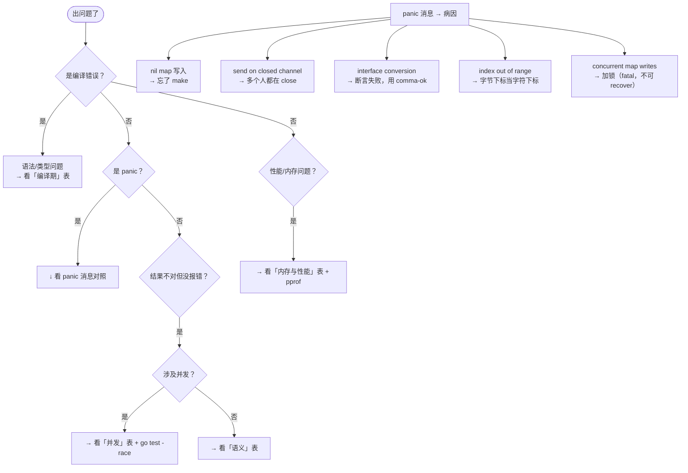
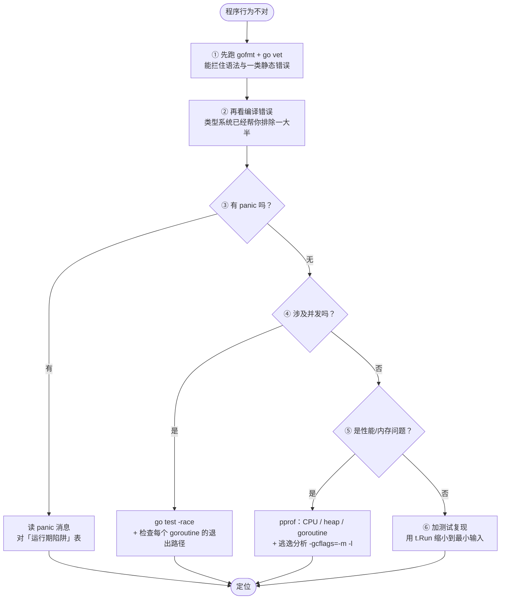

+++
title = "19 陷阱与惯用法"
linkTitle = "19 陷阱与惯用法"
weight = 119
date = "2026-09-20T11:35:00+08:00"
type = "docs"
description = "Go 陷阱总表：按症状索引的高频 bug、以为 vs 实际对照、从 C/Java/Python 迁来的思维定势、Go 惯用法与反模式"
isCJKLanguage = true
draft = false
+++

# 19 陷阱与惯用法

这是全套速查表的**病历本**。前面 18 页讲「怎么写」，本页讲「**为什么你写错了，以及正确的长什么样**」。

> 基线：**Go 1.27.1**。所有「实际结果」都是本机实跑得到的，不是推测。

---

## 按症状找答案



---

## 十组「以为 vs 实际」：一张图看完

```text
 你脑子里的模型                         Go 运行时里真实发生的事
 ─────────────────                      ────────────────────────────────
 ① error 是 nil 吗？
    err == nil  ──── 返回了 nil 指针 ───► 接口 = (类型≠nil, 值=nil)
                                          └─► err != nil ❌ 陷阱

 ② 传结构体进去改
    func(v S)              ┌──────────┐
    s ────────────────────►│ S 的副本 │  改的是副本，外面纹丝不动
                           └──────────┘

 ③ 传切片进去改
    func(v []int)          ┌──────────────────────┐
    sl ───────────────────►│ 切片头副本           │
                           │ ptr ──┐ len  cap     │
                           └───────┼──────────────┘
                                   ▼
                            ┌─────────────┐
                            │ 底层数组     │ ◄── 改元素：能改到 ✅
                            └─────────────┘     append 换头：改不到 ❌

 ④ defer 在循环里
    for i { defer f(i) }   ──► 攒成一个栈，函数返回时倒着弹
                               输出 2 1 0（不是 0 1 2）

 ⑤ map 里的结构体
    m["a"].N = 99          ──► 编译错误（map 元素不可寻址）
    取→改→放回              ──► 可行但要三步 ⚠️

 ⑥ 循环里的 time.After  ──► 每轮新建一个定时器
                             ≤1.22 会泄漏；≥1.23 不可达的 Timer 可被 GC 回收 ✅

 ⑦ fmt.Errorf("%v")      ──► 错误链断开，errors.Is 永远 false ❌
    fmt.Errorf("%w")      ──► 链条保留，errors.Is 可穿透 ✅

 ⑧ "世界"                
    len(s) = 6             ──► 字节数，不是字符数
    s[0]   = 0xE4          ──► UTF-8 的首字节，不是「世」

 ⑨ 5 / 2                 ──► 2（整数除法截断），要 2.5 必须写 5.0/2

 ⑩ const ( A = iota )    ──► 每个 const 块都从 0 重新开始
```

下面逐条给出可复现的证据。

### ① `err != nil` 但错误值是 nil 指针

```go
type S struct{ N int }
func (s *S) Error() string { return "S error" }

func nilIface() error {
	var p *S
	return p            // ⚠️ 装进接口后 != nil
}

err := nilIface()
fmt.Println(err == nil, fmt.Sprintf("%T", err))
```

```text
false *main.S
```

| 以为 | 实际 |
| --- | --- |
| 返回 nil 指针就是返回 nil 错误 | 接口是 `(类型, 值)` 二元组，类型非 nil 就不等于 nil ⚠️ |

✅ **正确**：`if p == nil { return nil }`，或直接返回哨兵错误。见 [08]()。

### ② 传结构体进函数改不掉

```go
s := S{1}
func(v S) { v.N = 99 }(s)
fmt.Println(s.N)
```

```text
1
```

✅ **正确**：改值就传 `*S`，或用指针接收者。见 [06]()。

### ③ 切片传进函数「有时能改有时不能」

```go
sl := make([]int, 1, 3)
func(v []int) { v[0] = 99 }(sl)        // 改元素 → 生效
fmt.Println(sl[0])                      // 99

func(v []int) { v = append(v, 7) }(sl) // 改切片头 → 不生效
fmt.Println(sl, len(sl))                // [99] 1
```

```text
99
[99] 1
```

| 以为 | 实际 |
| --- | --- |
| 切片是「引用类型」，传进去随便改 | 传的是**切片头副本**：改元素生效，`append` 后的新头不会回传 ⚠️ |

✅ **正确**：需要扩容就返回新切片 `sl = append(sl, 7)`。见 [07]()。

### ④ `defer` 在循环里全部延后

```go
for i := range 3 {
	defer fmt.Print(i, " ")
}
```

```text
2 1 0        ← 全部在函数返回时才执行，且 LIFO
```

✅ **正确**：循环体抽成函数，或显式 `Close()`。见 [06]()。

### ⑤ map 里的结构体不能直接改字段

```go
m := map[string]S{"a": {1}}
// m["a"].N = 99      // 🛑 编译错误：cannot assign to struct field in map

tmp := m["a"]          // 取出
tmp.N = 99             // 改副本
m["a"] = tmp           // 放回 ✅

mm := map[string]int{}
mm["k"]++              // ✅ 但 map 的值是基本类型时可以直接自增
```

```text
99
1
```

⚠️ 注意最后一行：`m["k"]++` 和 `m["k"] += 1` **是合法的**（编译器特殊处理，等于读-改-写），但 `m["k"].Field = x` 不行。

### ⑥ `time.After` 在循环里每轮新建定时器（但 1.23 起不再泄漏）

```go
start := time.Now()
ch := make(chan int, 1)
for range 3 {
	select {
	case <-ch:
	case <-time.After(30 * time.Millisecond):
	}
}
fmt.Println(time.Since(start) > 80*time.Millisecond)
```

```text
true         ← 三个 30ms 串行等待 ≈ 90ms
```

🆕 **Go 1.23 起未触发的 `time.After` 定时器可被 GC 回收**，官方 1.27 文档明确写「There is no reason to prefer NewTimer when After will do」。所以这条**不再算坑**——只是在每轮都新建计时器这一点上仍有分配开销，想省就用 `time.NewTimer` + `Reset` 复用。

### ⑦ `%v` 和 `%w` 只差一个字母，错误链天差地别

```go
base := errors.New("base")
fmt.Println(errors.Is(fmt.Errorf("wrap: %v", base), base))   // false ⚠️
fmt.Println(errors.Is(fmt.Errorf("wrap: %w", base), base))   // true ✅
```

```text
false
true
```

### ⑧ `len` 是字节，`range` 是字符

```go
str := "世界"
fmt.Printf("len=%d s[0]=%d first rune=%c\n", len(str), str[0], []rune(str)[0])
```

```text
len=6 s[0]=228 first rune=世
```

| 以为 | 实际 |
| --- | --- |
| `len("世界")` 是 2 | 是 **6**（UTF-8 字节数）⚠️ |
| `s[0]` 是「世」 | 是字节 `228`（0xE4，UTF-8 首字节）⚠️ |

✅ **正确**：字符数用 `utf8.RuneCountInString`，遍历用 `for range`。见 [03]()。

### ⑨ 整数除法截断

```go
fmt.Println(5/2, 5.0/2)
```

```text
2 2.5
```

⚠️ 想要浮点结果，**至少一侧必须是浮点**。另外 `-7/2 == -3`（向零截断），不是 `-4`。

### ⑩ `iota` 每个 const 块独立从 0 开始

```go
const ( A = iota; B )    // A=0, B=1
const ( C = iota; D )    // C=0, D=1  ⚠️ 不是 2、3
```

✅ 跨块连续编号要显式写 `const ( C = iota + 2 )` 之类。见 [04]()。

---

## 编译期陷阱

| 症状 | 原因 | 正确写法 |
| --- | --- | --- |
| `syntax error: unexpected {` | 左大括号另起一行，被自动插入分号 | 大括号与语句同行 |
| `missing ',' before newline` | 多行字面量缺尾逗号 | 每行末尾加 `,` |
| `cannot assign to struct field in map` | map 元素不可寻址 | 取出 → 改 → 放回 |
| `cannot take the address of N` | 常量没有地址 | 改用变量 |
| `declared and not used: x` | Go 不允许未使用的局部变量 | 用 `_ = x` 或删掉 |
| `imported and not used` | 未使用的 import 是错误 | 删掉，或用 `_ "pkg"` 做副作用导入 |
| `no new variables on left side of :=` | 左侧全是已声明变量 | 改用 `=` |
| `invalid operation: ... (mismatched types int and int64)` | Go 无隐式数值转换 | 显式 `int64(i)` |
| `cannot use x (type T) as type U` | 接口不满足 | 检查方法集（值 vs 指针接收者） |
| `i++ used as value` | `i++` 是语句不是表达式 | 拆成两行 |
| `func literal evaluated but not used` | 函数字面量没调用 | 补 `()` 或赋值 |
| `missing return` | 有分支没返回值 | 补齐所有路径，或加 `panic` |
| `constant overflows int8` | 常量超出目标类型 | 换类型或运行时校验 |
| `ambiguous selector x.F` | 嵌入导致同层歧义 | 显式 `x.A.F` |
| `method has pointer receiver` | 值不可寻址却调指针方法 | 先赋给变量，或用 `&T{}` |
| `copylocks`（go vet） | 复制了含锁的结构体 | 传指针 |
| `too many arguments` / `not enough return values` | 变参不展开/展开错 | 检查 `...` |
| `unreachable code`（go vet） | `return` 之后还有代码 | 删除死代码 |

---

## 运行期陷阱

| 症状 / panic 消息 | 原因 | 修复 |
| --- | --- | --- |
| `assignment to entry in nil map` | 零值 map 不能写 | `make(map[K]V)` |
| `index out of range [n] with length m` | 下标越界 | 检查边界；切片用 `s[i:i+n]` 前判长度 |
| `nil pointer dereference` | 解引用 nil（含 nil map/slice 元素） | 判空；用 `errors.As` 处理 `runtime.Error` 不要掩盖 |
| `interface conversion: X is nil, not Y` | 类型断言失败 | 用 `v, ok := x.(T)` |
| `send on closed channel` | 多个人都在 close，或先 close 后发 | 只由发送方 close，用 `sync.Once` 保护 |
| `close of closed channel` | 重复 close | 同上 |
| `all goroutines are asleep - deadlock!` | 所有 goroutine 都阻塞 | 加缓冲、加取消路径；⚠️ 有活着的 goroutine 时不会报 |
| `sync: negative WaitGroup counter` | `Done` 多于 `Add` | 检查配对；🆕 1.25 的 `wg.Go` 已含 Done |
| `fatal error: concurrent map writes` | 并发写 map | 加锁 / `sync.Map`；⚠️ **不可 recover** |
| `runtime: goroutine stack exceeds 1000000000-byte limit` | 无限递归/`String()` 自递归 | 加终止条件；⚠️ fatal，不可 recover |
| `json: cannot unmarshal string into Go value of type int` | JSON 类型与结构体不匹配 | 修结构体或数据；用 `errors.As` 取 `UnmarshalTypeError` |
| `json: Unmarshal(non-pointer T)` | 没传指针 | 传 `&v` |
| `bufio.Scanner: token too long` | 行超过 64 KB | `sc.Buffer` 或改 `bufio.Reader` |
| `context deadline exceeded` | 超时 | 检查上游 deadline，别用已取消的 ctx |
| `file already closed` | 重复 Close | 用 `sync.Once` 或标志位 |
| 程序退出码 2 并打印栈 | 未 recover 的 panic | 定位根因；goroutine 里要自己 recover |
| `map iteration order` 每次不同 | 刻意随机化 | 需要顺序就 `slices.Sorted(maps.Keys(m))` |

---

## 并发陷阱

| 症状 | 原因 | 修复 |
| --- | --- | --- |
| 偶发 panic/错误结果，测试不复现 | 数据竞争 | `go test -race` 找出来，加锁或改 channel |
| goroutine 数持续增长 | 没有退出路径 | 每个阻塞操作配 `select` + `ctx.Done()` |
| `Wait()` 提前返回 | `Add` 写在 goroutine 里 | `Add` 必须在 `go` 之前 |
| `sync.WaitGroup` 按值传递 | 复制了计数器 | 传 `*sync.WaitGroup` |
| `sync.Mutex` 按值传递 | 复制了锁状态 | 与数据放在同一结构体，用指针接收者 |
| 锁住了但没解锁 | 某条 return 路径漏了 | `Lock()` 后立刻 `defer Unlock()` |
| `RWMutex` 死锁 | 持 `RLock` 时请求 `Lock` | 不要在读锁内请求写锁 |
| `select` 里某个 case 永远不执行 | 该 channel 是 nil | 有意为之可禁用分支；否则检查初始化 |
| `select` 缺少 `default` 导致阻塞 | 无就绪分支时阻塞 | 需要非阻塞就加 `default` |
| 多个 case 同时就绪，执行了「错的」那个 | select **随机**选择 | 需要优先级就用嵌套 select |
| 关闭的 channel 让循环空转 | 没检查 `ok` | `case v, ok := <-ch: if !ok { return }` |
| 往 channel 发数据后没人收 | 生产者比消费者多 | 加缓冲或用 `errgroup` 统一取消 |
| 用了 ctx 但下游没反应 | ctx 没传进下游调用 | `NewRequestWithContext` / 一路透传 |
| `cancel` 没调用 | `go vet` 报 `lostcancel` | `defer cancel()` |
| 一个 goroutine panic 整个服务挂 | panic 不跨 goroutine | 每个长期 goroutine 自己 recover |

---

## 内存与性能陷阱

| 症状 | 原因 | 修复 |
| --- | --- | --- |
| 内存持续增长找不到泄漏 | 子切片拖住大底层数组 | `slices.Clone` / `strings.Clone` |
| GC 占大量 CPU | 分配太频繁 | `sync.Pool`、预分配 `make([]T, 0, n)` |
| 容器里被 OOM Kill | 没设内存上限 | `GOMEMLIMIT` 设为容器限制的 85~90% |
| `sync.Pool` 里的对象不见了 | GC 会清空 Pool | 它只做复用不做缓存 |
| Pool 取出的数据是脏的 | 忘了 `Reset` | 取出后立刻 `Reset()` |
| `append` 后原切片被改 | 子切片 `cap` 有余量 | 三索引 `s[a:b:b]` 或 `slices.Clip` |
| 传大数组给函数后变慢 | 数组是值语义会整体拷贝 | 传切片或指针 |
| 循环里拼字符串越来越慢 | `+=` 每次重新分配 | `strings.Builder` + `Grow` |
| 正则跑到 CPU 100% | 循环内反复 `MustCompile` | 包级编译一次 |
| 基准数字好得不真实 | 循环体被优化掉 | 用 `b.Loop()` 🆕 1.24 |
| 二进制体积暴涨 | 泛型实例化过多 | 收敛类型组合，或退化为接口 |
| 逃逸分析结论看不懂 | 内联改变了结论 | `go build -gcflags="-m -l"` |

---

## 从别的语言迁来的思维定势

| 你的直觉（来自 C/Java/Python） | Go 的现实 |
| --- | --- |
| 有异常可以 `try/catch` | **没有异常**，错误是返回值，必须显式检查 |
| `a & b == 0` 在 C 里是 `a & (b == 0)` | Go 里是 `(a & b) == 0` **正好相反** |
| 数组名就是指针 | 数组是**值**，赋值/传参会整体拷贝 |
| 字符串可以用整数索引取字符 | 索引是**字节**，中文要 `[]rune` |
| 有 `while` 循环 | 只有 `for`，`for cond {}` 就是 while |
| 有继承和重写 | 只有接口 + 嵌入；嵌入**不是继承**（无动态分发） |
| 有构造函数 | 用 `NewXxx()` 约定函数，或用零值设计 |
| 有析构函数 | 用 `defer`；`runtime.AddCleanup` 只做兜底 |
| 有泛型运算符重载 | 运算符不能抽象，泛型约束只能列类型集合 |
| `null` 只有一种 | `nil` 接口 ≠ nil 指针 ⚠️ |
| 模块/包管理靠环境 | 内置 module + `go mod tidy`，`go.mod` 就是契约 |
| 格式化靠约定/插件 | `gofmt` 是唯一标准，没有配置项 |
| `switch` 需要 `break` | 默认自动 break，穿透要写 `fallthrough` |
| `i++` 是表达式 | 是**语句**，不能出现在表达式里 |
| 方法重载 | 不支持重载，同包内函数名唯一 |
| 默认参数 / 关键字参数 | 没有，用 Options 模式或配置结构体 |
| 整数除法得到浮点 | 整数除整数还是整数，截断 |

---

## Go 惯用法：Before / After

### 初始化与错误处理

```go
// 🛑 不惯用
if err != nil {
	return err
} else {
	return doSomething()
}

// ✅ 惯用：提前返回，减少嵌套（"line of sight" 原则）
if err != nil {
	return err
}
return doSomething()
```

```go
// 🛑 不惯用：用 panic 表达业务失败
if user == nil {
	panic("user not found")
}

// ✅ 惯用：哨兵错误 + errors.Is
var ErrUserNotFound = errors.New("user not found")
if user == nil {
	return nil, fmt.Errorf("get user %s: %w", id, ErrUserNotFound)
}
```

### 命名

```go
// 🛑 不惯用
func GetUserById(userId string) (*User, error)   // 下划线命名 + 冗余 Get
func (this *User) Name() string                  // this/self
type IUserService interface{}                    // I 前缀

// ✅ 惯用
func (s *Store) User(ctx context.Context, id string) (*User, error)  // 接收者短名，方法名不重复包名
func (u *User) Name() string
type UserService interface{}                     // 接口用 -er 或直接名词
```

| 不惯用 | 惯用 | 原因 |
| --- | --- | --- |
| `userSlice` `listOfUsers` | `users` | 切片本身就是复数 |
| `err2` `err3` | 换名字或有意义的后缀 | 可读性 |
| `GetUser()` 包名已经叫 `user` | `user.Get()` 或 `user.Fetch()` | 避免重复 |
| 长变量名 `configurationData` | `cfg` | 作用域越小名字越短 |
| `util.go` `common.go` `helpers.go` | 按职责命名 | 避免垃圾抽屉文件 |

### 结构体设计

```go
// ✅ 惯用：零值可用
type Buffer struct {
	mu   sync.Mutex
	data []byte
}
var b Buffer       // 直接可用，不需要 New ✅

// 🛑 反例：零值不可用，必须 New
type Bad struct{ m map[string]int }   // 零值时写入 panic
```

```go
// ✅ 惯用：Options 模式（替代默认参数）
type Option func(*Server)

func WithTimeout(d time.Duration) Option { return func(s *Server) { s.timeout = d } }
func WithLogger(l *slog.Logger) Option   { return func(s *Server) { s.log = l } }

func New(opts ...Option) *Server {
	s := &Server{timeout: 30 * time.Second, log: slog.Default()}   // 默认值
	for _, o := range opts {
		o(s)
	}
	return s
}

srv := New(WithTimeout(5*time.Second))
```

### 接口与依赖

```go
// ✅ 惯用：消费方定义窄接口（见 08）
type Store interface {
	Get(ctx context.Context, id string) (*User, error)
}

// ✅ 惯用：构造函数返回【具体类型】——这里是 *sqlStore，不是 *Store
type sqlStore struct{ db *sql.DB }

func NewStore(db *sql.DB) *sqlStore { return &sqlStore{db: db} }

// ✅ 惯用：接收方依赖接口
func (s *Service) SetStore(st Store) { s.store = st }

// 🛑 反例：构造函数直接返回接口
//   调用方拿不到具体类型的方法，也无法判断「是不是某个增强能力」
func NewStoreBad(db *sql.DB) Store { return &sqlStore{db: db} }

// 🛑 更糟：返回接口的指针（*Store）——Go 里几乎总是写错了
//   *Store 是「指向接口变量的指针」，既不能直接调方法，也接不住具体实现
```

| 位置 | 惯用 | 反例 |
| --- | --- | --- |
| 构造函数返回值 | 具体类型 `*sqlStore` ✅ | 接口 `Store` 🛑 |
| 结构体字段 | 接口 `Store` ✅ | 具体类型（难打桩） |
| 函数参数 | 接口 `Store` ✅ | 具体类型（耦合实现） |
| 接口的指针 | 几乎不存在 | `*Store` 🛑 |

### 测试与并发

```go
// ✅ 惯用：表驱动 + 子测试
for _, tc := range tests {
	t.Run(tc.name, func(t *testing.T) { ... })
}

// ✅ 惯用：并发骨架（取消 + 上限 + 有序收集）
g, ctx := errgroup.WithContext(ctx)
g.SetLimit(10)
for i, in := range inputs {
	g.Go(func() error { results[i] = process(ctx, in); return nil })
}
err := g.Wait()
```

---

## 上手检查清单

写完一个 Go 文件，用这张表自查一遍：

| # | 检查项 |
| --- | --- |
| 1 | `gofmt -l .` 无输出 |
| 2 | `go vet ./...` 无告警 |
| 3 | 所有 `err` 都被检查（没有 `_ = f()` 吞错） |
| 4 | 所有 `context.WithXxx` 都有 `defer cancel()` |
| 5 | 每个 goroutine 都有明确退出路径 |
| 6 | 每个 `select` 都有 `ctx.Done()` 或 `default` |
| 7 | map 使用前确认已 `make` 或字面量初始化 |
| 8 | `append` 的返回值都被接收 |
| 9 | 导出的标识符都有文档注释 |
| 10 | 结构体 tag 与 JSON 字段名一致（`go vet` 也能查） |
| 11 | 没有按值传递含锁/含切片头的结构体 |
| 12 | 日志只在边界打，且用结构化字段 |
| 13 | `go test -race ./...` 通过 |
| 14 | 关键路径有测试覆盖，`go test -cover` 符合预期 |
| 15 | 二进制里能查到版本：`go version -m ./app` |

---

## 排错顺序：先看哪一层



💡 **顺序很重要**：80% 的「诡异 bug」在 ①②③ 步就能定位；跳过 `-race` 直接猜并发问题，通常会浪费几小时。

---

## 全表导航

| 想查什么 | 去哪一页 |
| --- | --- |
| 命令、模块、交叉编译 | [01]() |
| 关键字、运算符、命名 | [02]() |
| 类型、零值、字符串与 rune | [03]() |
| 变量、常量、iota | [04]() |
| if/for/range/switch/标签 | [05]() |
| 函数、方法集、defer、panic | [06]() |
| 切片、map、struct 内存布局 | [07]() |
| 接口值、nil 陷阱、嵌入 | [08]() |
| error、%w、errors.Is/As/Join | [09]() |
| 类型参数、约束、slices | [10]() |
| 逃逸分析、GC、unsafe | [11]() |
| goroutine、channel、select | [12]() |
| Mutex、atomic、context | [13]() |
| strings/strconv/regexp/math | [14]() |
| io/os/filepath/embed/time | [15]() |
| json/base64/压缩/slog | [16]() |
| 表驱动、基准、fuzz、synctest | [17]() |
| worker pool、pipeline、优雅关闭 | [18]() |

---

📘 官方参考：[Effective Go](https://go.dev/doc/effective_go)、[Go Code Review Comments](https://go.dev/wiki/CodeReviewComments)、[Go FAQ](https://go.dev/doc/faq)、[100 Go Mistakes](https://100go.co/)

➡️ 上一节：[18 并发模式]() ｜ 回到 [速查表首页]()
