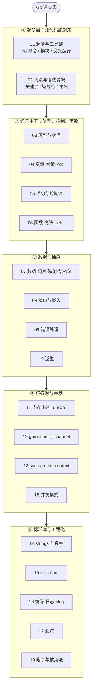
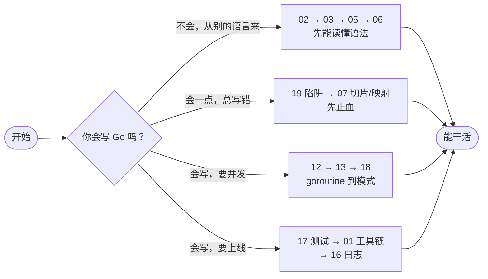
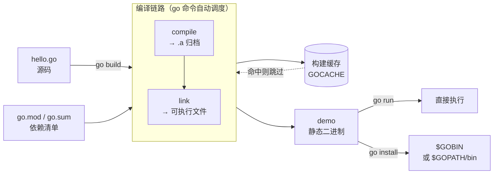

+++
title = "Go 语言速查表"
linkTitle = "Go 速查表"
weight = 99
date = "2026-09-20T10:00:00+08:00"
type = "docs"
description = "面向「已经会编程」的 Go 速查表：一页一个主题，表格 + 可切换标签页 + 结构图，专治“我记得 Go 里能干这个，但忘了怎么写”"
isCJKLanguage = true
draft = false
+++

# Go 语言速查表

这不是教程，是**字典**。教程教你走路，字典只在你卡住时递上一根拐杖。所以本页写得密、写得短、写得没什么耐心——每一条都假设你已经会编程，只是记不清 Go 里这个动作该怎么写。

风格上参考 [Rust Language Cheat Sheet](https://cheats.rs/)，但内容完全按 Go 重写：Go 没有泛型继承、没有异常、没有析构函数，却有一等公民的 goroutine、隐式接口、值语义切片，还有一整套只有 `go` 命令才有的工程化约定。照搬没有意义，该不一样的地方就让它不一样。

> 语言版本基线：**Go 1.27.1**（写作时本机工具链实际版本）。凡是较新版本才引入的特性，都会当场标注 🆕 并写明起始版本；示例一律在该版本下实跑验证。

---

## 图例说明

| 符号 | 含义 |
| --- | --- |
| 🔥 | 高频使用，值得先记住 |
| ⚠️ | 陷阱或易错点，踩过一次就该记住 |
| 🛑 | 错误示例，故意写错给你看 |
| 🆕 | 较新版本才有的特性，注意 `go.mod` 里的 `go` 指令 |
| 🚧 | 有限制、仍在演进，或只在特定平台可用 |
| 🪦 | 已废弃（deprecated），新代码不要再用 |
| 🝖 | 偏深的内容，第一遍可以跳过 |
| 💭 | 笔者见解，不是官方定论 |
| ↪ | 等价写法或语法糖展开 |
| 📘 | 指向官方文档或权威资料 |

> **关于 `// 输出:`**：标的是这段代码真实跑出来的结果，全部在 Go 1.27.1 / darwin/arm64 下实跑核对。行尾的中文注解只是给人看的，不属于输出内容。

---

## 全表地图

19 页不是随便切的，它按「写代码时的思维路径」分层：从**怎么跑起来**，到**语言主干**，再到**并发与工程化**。



## 学习路径

如果你只有半小时，按这条线看；如果只是查一个语法，直接翻目录。



---

## 目录导航

| 主题 | 内容一句话 |
| --- | --- |
| [01 起步与工具链]() | `go` 命令全表、模块初始化、`go run/build/install` 差异、交叉编译 |
| [02 词法与语法骨架]() | 25 个关键字分组、运算符优先级、分号插入规则、命名与导出 |
| [03 类型与零值]() | 类型体系全景、数值边界表、`rune/byte/string`、零值总表 |
| [04 变量·常量·iota]() | `var`/`:=`/批量声明、无类型常量、`iota` 六种惯用模式 |
| [05 语句与控制流]() | `if` 带初始化、`for` 三形态、`range` 语义、`switch`/`goto` |
| [06 函数·方法·defer]() | 多返回值、变参、闭包、方法集、`defer` 时序、`panic`/`recover` |
| [07 数组·切片·映射·结构体]() | 切片三字段头、扩容、三索引切片、map 底层、struct tag 与对齐 |
| [08 接口与嵌入]() | 隐式实现、接口值二元组、`nil` 接口陷阱、类型断言、嵌入提升 |
| [09 错误处理]() | 哨兵错误、`%w` 包装链、`errors.Is/As/Join`、自定义错误 |
| [10 泛型]() | 类型参数、约束与 `~T`、类型推断、泛型标准库 `slices`/`maps` |
| [11 内存·指针·unsafe]() | 逃逸分析、`new` vs `make`、`GC`、`sync.Pool`、`unsafe` 边界 |
| [12 goroutine 与 channel]() | GMP 调度、channel 语义、`select` 多路复用、生成器与管线 |
| [13 sync·atomic·context]() | 锁家族选型、`atomic` 操作表、context 取消树、`errgroup` |
| [14 标准库：字符串与数字]() | `strings`/`bytes`/`strconv`/`unicode`/`regexp`/`sort`/`slices`/`math` |
| [15 标准库：io·fs·time]() | `io.Reader` 组合链、`bufio`、`os`/`filepath`、`embed`、`time` |
| [16 标准库：编码·日志]() | `encoding/json` 全表、struct tag、`log`/`slog` 结构化日志 |
| [17 测试]() | `go test` 生命周期、表驱动、子测试、基准、fuzz、mock 策略 |
| [18 并发模式]() | worker pool、pipeline、fan-in/out、取消传播、优雅关闭 |
| [19 陷阱与惯用法]() | 按**症状**索引的踩坑表 + 惯用法对照，Go 程序员的病历本 |

---

## 你好，Go

先让第一行代码跑起来。Go 的设计目标之一就是「装上就能编译」，从 1.16 起模块模式已是默认，不再需要 `GOPATH`。



{}

不建模块也能跑单个文件，适合验证一小段语法：

```go
// hello.go
package main

import "fmt"

func main() {
	fmt.Println(greet("世界"))
}

// greet 被下一节的测试复用，所以单独抽出来
func greet(name string) string {
	return "Hello, " + name
}
```

```console
$ go run hello.go
Hello, 世界
```

`fmt.Println` 会在参数之间自动加空格、末尾补换行；要精细控制就用 `fmt.Printf`。

{}

{}

真正的项目从 `go mod init` 开始，它生成 `go.mod` 记录模块路径与依赖：

```console
$ mkdir demo && cd demo
$ go mod init example.com/demo
go: creating new go.mod: module example.com/demo
$ cat go.mod
module example.com/demo

go 1.27.1
```

`main.go` 与上面相同，然后 `go build` 得到可执行文件：

```console
$ go build -o demo .
$ ./demo
Hello, 世界
```

{}

{}

Go 把测试做进了工具链，不需要第三方框架。文件名必须以 `_test.go` 结尾：

```go
// hello_test.go
package main

import "testing"

func TestHello(t *testing.T) {
	got := greet("世界")
	want := "Hello, 世界"
	if got != want {
		t.Errorf("greet() = %q, want %q", got, want)
	}
}
```

```console
$ go test ./...
ok  	example.com/demo	0.002s
```

详见 [17 测试]()。

{}



---

## 15 条最高频速查

这 15 条是「一天要用十次」级别的。每条都能在对应章节里找到完整展开。

| # | 我想干的事 | 写法 | 注意 |
| --- | --- | --- | --- |
| 1 | 声明并赋值 | `x := 42` | 只能在函数内用；类型由右值推断 🔥 |
| 2 | 声明带类型 | `var x int = 42` / `var x int` | 包级变量只能用 `var` |
| 3 | 错误处理 | `v, err := f(); if err != nil { return err }` | Go 没有异常，`err` 永远显式 🔥 |
| 4 | 忽略某个返回值 | `_ = f()` / `v, _ := f()` | `_` 是空标识符，不是变量 |
| 5 | 打印 | `fmt.Println(a, b)` / `fmt.Printf("%d\n", n)` | 调试用 `%+v` 看字段名 |
| 6 | 遍历切片 | `for i, v := range xs {}` | 只要值用 `for _, v := range xs`；Go 1.22 起 `v` 每次迭代新建 🆕 |
| 7 | 追加元素 | `xs = append(xs, x)` | **必须接返回值**，切片头可能被换掉 ⚠️ |
| 8 | 建映射 | `m := map[string]int{}` | `m["k"]++` 不用先判存在；零值即 0 |
| 9 | 判映射键存在 | `v, ok := m[k]` | 用 `ok`，不要用 `v != 0` 判存在 ⚠️ |
| 10 | 定义结构体 | `type User struct { Name string }` | 字段首字母大写才能被外部包访问 |
| 11 | 取地址 / 解引用 | `p := &u` / `*p` | 结构体方法常用指针接收者 |
| 12 | 起一个 goroutine | `go f(ctx)` | 记得有退出路径，否则泄漏 ⚠️ |
| 13 | 发/收 channel | `ch <- v` / `v := <-ch` | 无缓冲 channel 会阻塞到对面就绪 |
| 14 | 带取消的上下文 | `ctx, cancel := context.WithTimeout(ctx, 3*time.Second); defer cancel()` | `cancel` 必须调用，否则泄漏 ⚠️ |
| 15 | 加锁 | `mu.Lock(); defer mu.Unlock()` | 锁值不可复制；用 `go vet` 能查出部分误用 |

---

## Go 的取舍

Go 不是「更好的 C++」，它是一套**明确取舍**：用表达力换编译速度与工程一致性。



{}

- **编译快**：中型项目秒级全量编译，工具链本身几乎是零配置。
- **并发是语言级的**：`go` + `chan` + `select` 三个关键字就能表达多数并发结构，不需要库。
- **部署简单**：产出**单个可执行文件**，交叉编译只需两个环境变量（`GOOS`/`GOARCH`）。
  ⚠️ 「默认静态链接」要分平台说：Linux 上纯 Go 程序是静态链接的；想让交叉编译产物彻底不依赖系统库需 `CGO_ENABLED=0`；而在 macOS 上即使 `CGO_ENABLED=0`，二进制仍会链接 `libSystem`（见 [01]()）。
- **工程一致性**：`gofmt` 终结格式争论，`go vet`/`go test`/`go doc` 全部内置，标准库质量高且向后兼容承诺明确。
- **隐式接口**：接口由使用方定义，无需修改被适配的类型——这是 Go 生态解耦的核心机制（见 [08 接口]()）。

{}

{}

- **没有异常**：错误全靠手写 `if err != nil`，代码里三成行数是它。这是设计选择，不是缺陷，但你得接受。
- **泛型来得晚且克制**：1.18 才引入，不支持泛型方法、不支持运算符抽象，写数值容器时仍会难受（见 [10 泛型]()）。
- **无继承、无重载、无默认参数**：用嵌入和接口组合替代，写法上更啰嗦。
- **`nil` 与零值的设计会咬人**：`nil` 接口不等于 `nil` 指针、`nil` 切片可 `append` 但 `nil` 映射不能写（见 [19 陷阱]()）。
- **调度与 GC 是黑盒**：可控性远不如 Rust/C++，延迟敏感场景需要靠 `sync.Pool`、`GOGC`、`GOMEMLIMIT` 调（见 [11 内存]()）。

{}

{}

| 维度 | Go | Rust | Java | Python |
| --- | --- | --- | --- | --- |
| 内存管理 | GC（并发三色标记） | 所有权 + 借用检查 | GC（分代） | 引用计数 + GC |
| 错误处理 | 返回值 `error` | `Result<T, E>` + `?` | 异常 | 异常 |
| 并发模型 | goroutine（M:N 调度）+ channel | 线程 + `async` + `Send/Sync` | 线程 / 虚拟线程 | GIL / asyncio |
| 泛型 | 1.18 起，受限 | 完整 | 擦除式 | 鸭子类型 |
| 编译速度 | 极快 | 慢 | 中（JIT 预热） | 无编译期 |
| 部署产物 | 单个可执行文件（Linux 纯 Go 为静态）| 单个二进制 | 需要 JVM | 需要解释器 |
| 学习曲线 | 平缓（关键字仅 25 个） | 陡峭 | 中等 | 平缓 |

💭 Go 的定位是「**工程语言**」：让 50 人写出的代码看起来像 1 个人写的，比让 1 个人写出最优雅的代码更重要。

{}



---

## 安装与验证



{}

```console
$ brew install go
# 或用官方安装包：https://go.dev/dl/
$ go version
go version go1.27.1 darwin/arm64
```

{}

{}

```bash
# 官方压缩包（推荐，版本可控）
curl -LO https://go.dev/dl/go1.27.1.linux-amd64.tar.gz
sudo rm -rf /usr/local/go && sudo tar -C /usr/local -xzf go1.27.1.linux-amd64.tar.gz
export PATH=$PATH:/usr/local/go/bin   # 写进 ~/.zshrc 或 ~/.bashrc
go version
```

{}

{}

```powershell
winget install GoLang.Go
# 或下载官方 .msi 安装包，会自动配置 PATH
go version
```

{}

{}

国内环境先把模块代理换成可用的镜像，否则 `go get` 会超时：

```console
$ go env -w GOPROXY=https://goproxy.cn,direct
$ go env -w GOSUMDB=sum.golang.org
$ go env GOPROXY
https://goproxy.cn,direct
```

⚠️ `direct` 必须保留在列表末尾，表示「代理不可用时直连」。可用 `go env -w` 写入的值，`go env -u` 撤销。

{}



装完做一次「四连验证」，四项全过说明工具链完好：

```console
$ go version && go env GOROOT GOPATH && go vet ./... && go test ./...
```

---

## Go 程序是怎么变成可执行文件的

理解这条流水线，你才能在「报错不知道在哪一步」时定位问题。



关键点只有两条：

1. **缓存是默认的**：`GOCACHE` 命中时编译几乎是瞬间的，`go build -a` 可以强制全量重建（排查「本地能过 CI 不能过」时偶尔有用）。
2. **`go run` 不落盘**：它把二进制放进临时目录再执行，所以生产环境不要依赖它的产物路径。

---

## 术语速查

| 术语 | 含义 |
| --- | --- |
| module | 一个 `go.mod` 定义的版本化单元，是依赖管理的最小单位 |
| package | 同一目录下同 `package xxx` 的一组 `.go` 文件，是编译的最小单位 |
| goroutine | 由 Go 运行时调度的轻量执行单元，初始栈 2 KB，可增长 |
| channel | 带类型的管道，goroutine 间通信与同步的载体 |
| interface | 一组方法签名的集合，隐式实现，Go 唯一的抽象机制 |
| zero value | 未显式初始化的变量的默认值：`0`/`""`/`nil`/`false` |
| escape analysis | 编译期判断变量该放栈还是堆的分析（见 [11 内存]()） |
| GMP | Goroutine / Machine / Processor 三层调度模型（见 [12 并发]()） |
| cgo | 调用 C 代码的机制，会破坏静态链接并拖慢编译 🚧 |

---

> 准备好了？从 [01 起步与工具链]() 开始，或直接跳到你在找的那一页。
