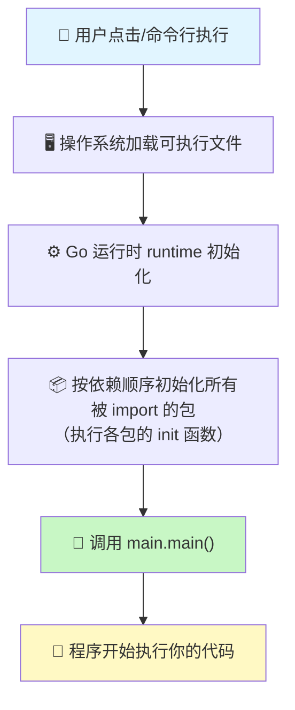

+++
title = "第1章：程序从 main 开始—— builtin 包"
weight = 10
date = "2026-03-30T13:43:00+08:00"
type = "docs"
description = ""
isCJKLanguage = true
draft = false
+++
# 第1章：程序从 main 开始—— builtin 包

> "Go 语言的核心秘密，就藏在这个看不见摸不着的 `builtin` 包里。"

---

## 1.1 builtin 包解决什么问题

想象一下，你在学 Go 的第一天，兴冲冲地写下了：

```go
package main

func main() {
    var n int = 42
    println(n)
}
```

你没有 `import` 任何东西，但 `int`、`println` 从哪来的？难道是凭空冒出来的？

**答案就是 `builtin` 包。**

`builtin` 是 Go 语言标准库中最特殊的一个包——它不需要你手动导入，编译器会自动加载它。它存在的意义不是提供什么强大的功能，而是**给所有内置类型、关键字和预定义标识符一个正式的"户口本"**。

换句话说：
- `int`、`string`、`bool` 这些类型是谁？它们住在 `builtin` 包里。
- `true`、`false`、`nil`、`iota` 这些常量是谁？它们也是 `builtin` 包的居民。
- `make`、`new`、`append` 这些函数是谁？同样来自 `builtin`。

没有 `builtin` 包，Go 的类型系统就成了一群没有身份证的黑户。

> **专业词汇解释**
>
> **builtin**（内置）：指语言层面直接支持的功能，不需要任何 import 语句就能使用。builtin 是"开箱即用"的代名词。

---

## 1.2 builtin 核心原理：预定义标识符与关键字

Go 语言的设计哲学是：**简单的事情简单做**。

当你写 `true` 的时候，你不需要 `import "布尔值"`；当你写 `nil` 的时候，也不需要任何声明。这些"神奇"的存在，是因为它们被**预定义**了。

### 预定义标识符

以下这些家伙，生来就是 Go 公民：

| 类别 | 成员 |
|------|------|
| **内置常量** | `true`, `false`, `iota`, `nil` |
| **内置类型** | `int`, `int8`, `int16`, `int32`, `int64`, `uint`, `uint8`, `uint16`, `uint32`, `uint64`, `uintptr`, `float32`, `float64`, `complex64`, `complex128`, `bool`, `byte`, `rune`, `string`, `error`, `any` |
| **内置函数** | `make`, `new`, `append`, `cap`, `close`, `complex`, `copy`, `delete`, `imag`, `len`, `panic`, `print`, `println`, `real`, `recover`, `clear`, `min`, `max` |

这些家伙不需要 `import`，因为它们**和 Go 编译器是铁哥们**。

> **专业词汇解释**
>
> **预定义标识符（Predeclared Identifier）**：在 Go 程序还没有开始运行之前，就已经存在于编译器的字典里的标识符。它们是语言规格的一部分，所有 Go 程序都可以直接使用，无需任何导入操作。

---

## 1.3 Go 程序入口

### 1.3.1 main 包与 main 函数

Go 程序的入口，是一个叫 `main` 的包，里面有一个叫 `main` 的函数。

```go
package main

import "fmt"

func main() {
    fmt.Println("Hello, Go!")
}
```

就这么简单！当你运行 `go run main.go` 的时候，Go 编译器会去找 `package main`，然后找到 `func main()`，这就是你的程序的家。

> **专业词汇解释**
>
> **入口函数（Entry Point）**：程序开始执行时第一个被调用的函数。在可执行程序中，这个角色由 `main` 函数担任。

### 1.3.2 没有 main 包就编不出可执行文件

如果你把 `package main` 改成了 `package foo`，会发生什么？

```go
package foo

import "fmt"

func main() {  // 这里的 main 不再是程序入口
    fmt.Println("Hello")
}
```

```
# go build ./foo
package foo is not main
```

编译器会毫不客气地告诉你：这个包不是 `main`，所以它没法生成可执行文件。

**因为 Go 的可执行程序，有且只有一个规则：必须从 `main` 包开始。**

---

## 1.4 程序启动的全景图

### 1.4.1 from OS to main

一个 Go 程序是如何从操作系统启动到 `main()` 函数被调用的？这中间经历了什么？

让我们用一张图来揭示这个神秘的旅程：



### 1.4.2 操作系统怎么跑起一个 Go 程序

让我们一步步拆解：

**第一步：引导加载器（Bootstrap）**

操作系统读取可执行文件的头部信息，了解它是一个 Go 程序，然后启动它。这时候控制权交给 Go 的 runtime。

**第二步：runtime 初始化**

Go runtime 开始初始化：
- 分配内存池
- 启动垃圾回收器（GC）的后台线程
- 初始化 goroutine 调度器
- 设置好了一切"基础设施"

**第三步：init 函数**

在调用 `main.main` 之前，Go 会先执行所有被导入包的 `init` 函数。这包括：
- 标准库（fmt、os、io...）
- 第三方库
- 你自己的库

**第四步：main.main**

最后，终于轮到了你的 `main` 函数！

```go
package main

import "fmt"

var globalVar = "我是全局变量，在 init 之前初始化"

func init() {
    println("🔧 init 被调用了！")
}

func main() {
    println("🎉 main 被调用了！")
    println("globalVar =", globalVar)
}
```

**运行结果：**

```
🔧 init 被调用了！
🎉 main 被调用了！
globalVar = 我是全局变量，在 init 之前初始化
```

> **专业词汇解释**
>
> **runtime（运行时）**：Go 程序运行时的基础设施，包括内存管理、垃圾回收、goroutine 调度等。runtime 和你的代码一起打包在可执行文件里。

---

## 1.5 包（package）是什么

### 1.5.1 代码组织的基本单位

Go 的代码组织基本单位是**包（package）**。你可以把包想象成一个文件夹，里面装着相关的代码。

```go
package utils

func Add(a, b int) int {
    return a + b
}

func Multiply(a, b int) int {
    return a * b
}
```

上面这个文件就是一个叫 `utils` 的包。

### 1.5.2 一个目录就是一个包，包名和目录名可以不同

**重要规则：同一个目录下的所有 `.go` 文件必须属于同一个包。**

```
myproject/
├── utils/
│   ├── add.go       // package utils
│   └── multiply.go  // package utils
└── main.go          // package main
```

不过，`package 名字` 和**目录名**可以不一样！

```go
// 文件名：math.go
package calculator  // 包名是 calculator，可以和目录名不同

func Add(a, b int) int {
    return a + b
}
```

但实践中，**强烈建议包名和目录名保持一致**，否则你的同事会拿着刀子来找你。

> **专业词汇解释**
>
> **包（package）**：Go 代码的封装和组织单位。每个 .go 文件第一行声明自己属于哪个包，同一个包内的代码可以互相访问（即使不是大写开头）。

---

## 1.6 import 导入包

### 1.6.1 加载顺序与初始化

当你 `import` 一个包时，Go 会先加载并初始化那个包。

```go
package main

import (
    "fmt"
    "strings"
)

func main() {
    fmt.Println(strings.ToUpper("hello"))
}
```

`fmt` 和 `strings` 都在你的 `main` 执行之前就准备好了。

### 1.6.2 import 进来的包会先初始化，main 包最后初始化

Go 的包初始化顺序是**拓扑排序**的——依赖的包先初始化，被依赖的包后初始化。

```go
package main

import "fmt"

func init() {
    fmt.Println("1. main 包的 init")
}

func main() {
    fmt.Println("2. main 函数")
}
```

**运行结果：**

```
1. main 包的 init
2. main 函数
```

> **专业词汇解释**
>
> **import**：用于声明当前文件需要使用的包。Go 编译器会先解析所有 import，然后按依赖顺序初始化这些包。

---

## 1.7 init 函数

### 1.7.1 包级别的自动初始化器

`init` 函数是一个特殊的函数——**你不能调用它，它自动被调用**。

```go
package main

import "fmt"

func init() {
    fmt.Println("我不需要被调用，程序会自动找到我！")
}

func main() {
    fmt.Println("main 函数执行了")
}
```

**运行结果：**

```
我不需要被调用，程序会自动找到我！
main 函数执行了
```

### 1.7.2 每个包可以有多个 init，执行顺序按依赖树深度优先遍历决定

一个包可以有多个 `init` 函数！

```go
package main

import "fmt"

func init() {
    fmt.Println("init 1")
}

func init() {
    fmt.Println("init 2")
}

func init() {
    fmt.Println("init 3")
}

func main() {
    fmt.Println("main")
}
```

**运行结果：**

```
init 1
init 2
init 3
main
```

同一个包内的多个 `init` 按出现顺序执行。

> **专业词汇解释**
>
> **init 函数**：Go 语言的包初始化函数。每个包可以有零个或多个 `init` 函数，它们在包被导入时自动执行，用于初始化包级别的状态。

---

## 1.8 包初始化的执行顺序

### 1.8.1 依赖树的深度优先遍历

Go 的包初始化使用**深度优先遍历**。简单来说，就是先走到底，再往回走。

```
main
├── utils
│   └── helper
└── config
    └── helper
```

初始化顺序：`helper (utils)` → `utils` → `helper (config)` → `config` → `main`

```go
package main

import (
    "fmt"
    "go-std-examples/chapter01/helper"
)

func init() {
    fmt.Println("main init")
}

func main() {
    fmt.Println("main main")
    helper.Say()
}
```

### 1.8.2 同一个包的多个文件按文件名排序

如果你的包有多个文件：

```
mypackage/
├── a_init.go
└── z_init.go
```

`a_init.go` 中的 `init` 会比 `z_init.go` 中的先执行（按文件名排序）。

```go
// a_init.go
package mypackage

func init() {
    println("a_init: 我先跑")
}
```

```go
// z_init.go
package mypackage

func init() {
    println("z_init: 我后跑")
}
```

> **专业词汇解释**
>
> **拓扑排序（Topological Sort）**：一种决定依赖关系下执行顺序的算法。Go 使用它来确定包和 `init` 函数的执行顺序。

---

## 1.9 匿名导入（blank identifier）

### 1.9.1 import _ "database/sql"

有时候，你只想让一个包的 `init` 函数跑起来，但不需要使用它的任何导出符号。这时可以用**匿名导入**：

```go
package main

import (
    "database/sql"
    _ "github.com/go-sql-driver/mysql"  // 只注册驱动，不使用任何符号
)

func main() {
    // 现在可以安全地使用 sql 包了
    _, _ = sql.Open("mysql", "user:password@/dbname")
}
```

### 1.9.2 只执行包的 init，不使用任何导出符号

`_`（下划线）叫做**空白标识符**（blank identifier）。它的意思是："我导入这个包只是为了执行它的 `init`，我对它的导出符号毫无兴趣。"

```go
package main

import (
    _ "fmt"
)

func main() {
    // fmt 的任何东西都用不了，因为是空白导入
    // println("Hello") // 这能工作是因为 println 是内置函数，不是 fmt 的
    println("Hello without fmt")
}
```

**运行结果：**

```
Hello without fmt
```

> **专业词汇解释**
>
> **空白标识符（blank identifier）**：用 `_` 表示，可以用来忽略不使用的导入或返回值。它是 Go 语言的"垃圾桶"，什么都能往里扔。

---

## 1.10 Go 关键字完整列表（25个）

Go 语言只有 **25 个关键字**，这在编程语言中是相当罕见的存在。让我们来认识一下它们：

| 关键字 | 用途 |
|--------|------|
| `package` | 声明包名 |
| `import` | 导入包 |
| `func` | 声明函数 |
| `return` | 返回值 |
| `var` | 声明变量 |
| `const` | 声明常量 |
| `type` | 声明类型 |
| `struct` | 定义结构体 |
| `interface` | 定义接口 |
| `map` | 声明或创建 map |
| `chan` | 声明或创建通道 |
| `if` | 条件判断 |
| `else` | 条件判断的分支 |
| `switch` | 多路分支 |
| `case` | switch 的选项 |
| `default` | switch 的默认选项 |
| `for` | 循环 |
| `range` | 遍历切片、map、通道等 |
| `break` | 跳出循环或 switch |
| `continue` | 跳过本次循环 |
| `goto` | 跳转（谨慎使用） |
| `fallthrough` | 贯穿到下一个 case |
| `go` | 启动 goroutine |
| `select` | 多通道操作 |
| `defer` | 延迟执行 |

> **专业词汇解释**
>
> **关键字（Keyword）**：语言预留的保留词，有固定的含义，不能用作变量名、函数名等标识符。关键字也叫做"保留字"。

---

## 1.11 预定义标识符

### 1.11.1 内置类型

Go 语言为每种基本数据类型都预定义了类型名：

```go
package main

func main() {
    // 整数类型
    var a int = 42
    var b int8 = 127
    var c int16 = 32767
    var d int32 = 2147483647
    var e int64 = 9223372036854775807

    // 无符号整数
    var f uint = 42
    var g uint8 = 255
    var h uint16 = 65535
    var i uint32 = 4294967295
    var j uint64 = 18446744073709551615
    var k uintptr = 0x7fff0000  // 指针类型的整数表示

    // 浮点数
    var l float32 = 3.14
    var m float64 = 3.141592653589793

    // 复数
    var n complex64 = 1 + 2i
    var o complex128 = 1 + 2i

    // 其他
    var p bool = true
    var q byte = 'A'
    var r rune = '中'
    var s string = "Hello, Go!"

    println(a, b, c, d, e)
    println(f, g, h, i, j, k)
    println(l, m)
    println(n, o)
    println(p, q, r, s)
}
```

### 1.11.2 内置常量

```go
package main

func main() {
    const a = true    // 布尔常量
    const b = false   // 布尔常量
    const c = nil     // 空值常量

    println("a =", a)
    println("b =", b)
    println("c =", c)
}
```

### 1.11.3 内置函数

```go
package main

func main() {
    // make - 创建切片、map、通道
    s := make([]int, 3)
    m := make(map[string]int)
    ch := make(chan int, 1)

    // new - 分配内存，返回指针
    p := new(int)
    *p = 42

    // append - 追加元素到切片
    s = append(s, 1, 2, 3)

    // len - 获取长度
    println("len(s) =", len(s))

    // cap - 获取容量
    println("cap(s) =", cap(s))

    // close - 关闭通道
    close(ch)

    println("s =", s)
    println("m =", m)
    println("*p =", *p)
}
```

**运行结果：**

```
len(s) = 3
cap(s) = 3
s = [0 0 0 1 2 3]
m = map[]
*p = 42
```

> **专业词汇解释**
>
> **预定义标识符（Predeclared Identifier）**：编译器预先知道的标识符，可以在没有导入任何包的情况下使用。

---

## 1.12 iota

### 1.12.1 枚举常量生成器

`iota` 是 Go 语言的枚举利器！它是一个从 0 开始、每行自动递增的计数器。

```go
package main

import "fmt"

const (
    Zero  = iota  // 0
    One           // 1（省略写法，iota 继续递增）
    Two           // 2
    Three         // 3
)

const (
    _  = iota      // 0，丢弃
    KB = 1 << (10 * iota)  // 1 << 10 = 1024
    MB             // 1 << 20 = 1048576
    GB             // 1 << 30 = 1073741824
    TB             // 1 << 40 = 1099511627776
)

const (
    A, B = iota, iota  // 0, 0
    C, D               // 1, 1
    E, F               // 2, 2
)

func main() {
    fmt.Println("枚举:", Zero, One, Two, Three)
    fmt.Println("容量:", KB, MB, GB, TB)
    fmt.Println("并行:", A, B, C, D, E, F)
}
```

**运行结果：**

```
枚举: 0 1 2 3
容量: 1024 1048576 1073741824 1099511627776
并行: 0 0 1 1 2 2
```

### 1.12.2 const 声明块中从 0 开始连续递增的整数常量

`iota` 只在 `const` 声明块内有效果，每一个新的 `const` 块都会重置为 0。

```go
package main

const (
    Spring = iota  // 0
    Summer         // 1
    Autumn         // 2
    Winter         // 3
)

const Count = iota  // 0（新块，重置）

func main() {
    println("季节:", Spring, Summer, Autumn, Winter)
    println("Count:", Count)
}
```

**运行结果：**

```
季节: 0 1 2 3
Count: 0
```

> **专业词汇解释**
>
> **iota**：Go 语言中用于枚举的常量生成器。它在一个 const 声明块内从 0 开始计数，每行自动加 1，直到块结束。

---

## 1.13 nil 的本质

### 1.13.1 每种类型都有自己的 nil

在 Go 里，`nil` 不是"空"，而是**零值**。但更准确地说：**每种类型都有自己的 nil**。

```go
package main

import "fmt"

func main() {
    var s *string       // 指针的 nil
    var m map[string]int  // map 的 nil
    var c chan int      // 通道的 nil
    var f func()        // 函数的 nil
    var i interface{}   // 接口的 nil
    var sl []int        // 切片的 nil

    fmt.Printf("s = %v\n", s)
    fmt.Printf("m = %v\n", m)
    fmt.Printf("c = %v\n", c)
    fmt.Printf("f = %v\n", f)
    fmt.Printf("i = %v\n", i)
    fmt.Printf("sl = %v\n", sl)
}
```

**运行结果：**

```
s = <nil>
m = map[]
c = <nil>
f = <nil>
i = <nil>
sl = []
```

> 等等，`m = map[]`、`sl = []`？不是 `nil`？
>
> 这是因为 `fmt.Printf` 用 `%v` 打印时，会"自动美化"某些 nil 值。但它们确实是 nil！

### 1.13.2 nil 之间不相等除非是同一个变量的 nil

```go
package main

import "fmt"

func main() {
    var a []int
    var b []int

    fmt.Printf("a == nil: %v\n", a == nil)
    fmt.Printf("b == nil: %v\n", b == nil)
    fmt.Printf("a == b: %v\n", a == b)

    c := a
    fmt.Printf("a == c: %v\n", a == c)
}
```

**运行结果：**

```
a == nil: true
b == nil: true
a == b: false  // 两个不同的 nil 变量比较，结果是 false！
a == c: true   // 同一个变量的 nil 才是相等的
```

> **专业词汇解释**
>
> **nil**：Go 语言的"零值"标识符，表示指针、通道、函数、接口、切片或 map 的空值。注意：不同变量的 nil 即使类型相同也不相等，只有同一个变量的 nil 才相等。

---

## 1.14 byte 和 rune 的区别

Go 里有两位处理字符的好兄弟：**byte** 和 **rune**。

```go
package main

import "fmt"

func main() {
    // byte 是 uint8 的别名
    var b byte = 'A'
    fmt.Printf("byte: %T, 值: %d ('%c')\n", b, b, b)

    // rune 是 int32 的别名
    var r rune = '中'
    fmt.Printf("rune: %T, 值: %d ('%c')\n", r, r, r)

    // 字符串遍历的差异
    str := "Hello世界"
    fmt.Println("\n用 byte 遍历（错误方式）：")
    for i := 0; i < len(str); i++ {
        fmt.Printf("  [%d] %c\n", i, str[i])
    }

    fmt.Println("\n用 rune 遍历（正确方式）：")
    for i, r := range str {
        fmt.Printf("  [%d] %c\n", i, r)
    }
}
```

**运行结果：**

```
byte: uint8, 值: 65 ('A')
rune: int32, 值: 20013 ('中')

用 byte 遍历（错误方式）：
  [0] H
  [1] e
  [2] l
  [3] l
  [4] o
  [5] ç  ← 乱码！因为一个中文字符占 3 个字节
  [6] ¬
  [7] ¸

用 rune 遍历（正确方式）：
  [0] H
  [1] e
  [2] l
  [3] l
  [4] o
  [5] 世
  [6] 界
```

**总结：**

| 类型 | 本质 | 用途 |
|------|------|------|
| **byte** | `uint8` 的别名 | 表示单个字节（0-255） |
| **rune** | `int32` 的别名 | 表示单个 Unicode 码点 |

> **专业词汇解释**
>
> **byte（字节）**：8 位二进制数，取值范围 0-255。在 Go 中是 `uint8` 的别名，用于处理原始字节数据。
>
> **rune（符文）**：Go 中 `int32` 的别名，代表一个 Unicode 码点。名字来自古日耳曼字母"rune"，象征文字的最小单元。

---

## 1.15 error 接口

### 1.15.1 Go 最常用的接口之一

`error` 是 Go 程序中最常见的接口——当你需要表示"出错了"的时候，就会用到它。

```go
package main

import (
    "errors"
    "fmt"
)

// 自定义错误
var ErrNotFound = errors.New("资源不存在")
var ErrTimeout = errors.New("操作超时")

func findUser(id int) (string, error) {
    if id < 0 {
        return "", errors.New("id 不能为负数")
    }
    if id == 0 {
        return "", ErrNotFound
    }
    return "张三", nil
}

func main() {
    name, err := findUser(0)
    if err != nil {
        fmt.Println("出错了:", err)
    } else {
        fmt.Println("找到用户:", name)
    }

    name2, err2 := findUser(-1)
    if err2 != nil {
        fmt.Println("出错了:", err2)
    } else {
        fmt.Println("找到用户:", name2)
    }

    name3, err3 := findUser(1)
    if err3 != nil {
        fmt.Println("出错了:", err3)
    } else {
        fmt.Println("找到用户:", name3)
    }
}
```

**运行结果：**

```
出错了: 资源不存在
出错了: id 不能为负数
找到用户: 张三
```

### 1.15.2 内置 error 类型，只有一个方法 Error() string

`error` 接口的定义超级简单：

```go
type error interface {
    Error() string
}
```

任何实现了 `Error() string` 的类型，都是 `error`。

```go
package main

import "fmt"

// 自定义错误类型
type MyError struct {
    Code    int
    Message string
}

func (e MyError) Error() string {
    return fmt.Sprintf("错误码: %d, 信息: %s", e.Code, e.Message)
}

func main() {
    err := MyError{Code: 404, Message: "页面不存在"}
    fmt.Println(err)  // 自动调用 Error() 方法
}
```

**运行结果：**

```
错误码: 404, 信息: 页面不存在
```

> **专业词汇解释**
>
> **error 接口**：Go 语言内置的接口，用于表示错误。任何实现了 `Error() string` 方法的类型都实现了 `error` 接口。

---

## 1.16 comparable 接口

### 1.16.1 Go 1.21+ 的内置 comparable 约束

Go 1.21 引入了 `comparable` 内置约束，用于泛型编程。

```go
package main

import "fmt"

// comparable 约束：T 必须是可比较的类型
func Contains[T comparable](slice []T, target T) bool {
    for _, v := range slice {
        if v == target {
            return true
        }
    }
    return false
}

func main() {
    // 整型切片
    nums := []int{1, 2, 3, 4, 5}
    println(Contains(nums, 3))   // true
    println(Contains(nums, 100)) // false

    // 字符串切片
    names := []string{"Alice", "Bob", "Charlie"}
    println(Contains(names, "Bob"))   // true
    println(Contains(names, "David")) // false
}
```

**运行结果：**

```
true
false
true
false
```

### 1.16.2 表示所有可比较的类型（可用于泛型）

```go
package main

import "fmt"

// 泛型约束：K 必须是可比较的（用于 map 的 key）
type Key interface {
    comparable
}

func GetOrDefault[K comparable, V any](m map[K]V, key K, defaultVal V) V {
    if v, ok := m[key]; ok {
        return v
    }
    return defaultVal
}

func main() {
    scores := map[string]int{"Alice": 95, "Bob": 88}

    alice := GetOrDefault(scores, "Alice", 0)
    unknown := GetOrDefault(scores, "Unknown", -1)

    fmt.Printf("Alice: %d\n", alice)
    fmt.Printf("Unknown: %d\n", unknown)
}
```

**运行结果：**

```
Alice: 95
Unknown: -1
```

> **专业词汇解释**
>
> **comparable 约束**：Go 1.21 引入的内置泛型约束，表示所有可以用 `==` 和 `!=` 比较的类型，包括所有基本类型、指针、结构体（字段全部可比较时）等。

---

## 1.17 any 接口

### 1.17.1 Go 1.18+ 的内置 any 类型

Go 1.18 引入了 `any` 作为空接口 `interface{}` 的别名。

```go
package main

import "fmt"

func printAnything(v any) {
    fmt.Printf("值: %v, 类型: %T\n", v, v)
}

func main() {
    printAnything(42)
    printAnything("Hello")
    printAnything(3.14)
    printAnything(true)
    printAnything([]int{1, 2, 3})
}
```

**运行结果：**

```
值: 42, 类型: int
值: Hello, 类型: string
值: 3.14, 类型: float64
值: true, 类型: bool
值: [1 2 3], 类型: []int
```

### 1.17.2 any 是 interface{} 的别名

```go
package main

import "fmt"

// 两种写法完全等价
func process1(v any) {
    fmt.Println("process1:", v)
}

func process2(v interface{}) {
    fmt.Println("process2:", v)
}

func main() {
    process1("any is better")
    process2("interface{} is old school")
}
```

**运行结果：**

```
process1: any is better
process2: interface{} is old school
```

> **专业词汇解释**
>
> **any 类型**：`any` 是 `interface{}` 的别名，Go 1.18+ 可用。它表示"可以是任何类型"，常用于泛型和需要存储任意类型值的场景。
>
> `any` 这个名字比 `interface{}` 语义更清晰，所以推荐在新代码中使用 `any`。

---

## 本章小结

本章我们深入探索了 Go 程序的起点——从 `builtin` 包到 `main` 函数的完整旅程。

**核心要点回顾：**

1. **builtin 包**是 Go 语言内置类型、常量和函数的"户口本"，无需 import 即可使用。

2. **预定义标识符**包括内置常量（`true`、`false`、`nil`、`iota`）、内置类型（`int`、`string`、`bool` 等）和内置函数（`make`、`new`、`append` 等）。

3. **main 包和 main 函数**是 Go 可执行程序的唯一入口，没有它们就编译不出可执行文件。

4. **程序启动流程**：操作系统加载 → runtime 初始化 → 包依赖初始化（包括 init 函数）→ main.main 被调用。

5. **包（package）**是 Go 代码组织的基本单位，同一目录的所有文件必须属于同一个包。

6. **import** 声明依赖的包，被导入的包会先于当前包初始化。

7. **init 函数**是包级别的自动初始化器，每个包可以有多个 init，按依赖树深度优先遍历执行。

8. **匿名导入（import _）**只执行包的 init，用于驱动注册等场景。

9. **25 个关键字**涵盖了 Go 语言的所有语法要素，简洁而强大。

10. **iota** 是 Go 语言的枚举生成器，在 const 块内从 0 开始连续递增。

11. **nil** 不是"空"，而是"零值"。不同变量的 nil 不相等，只有同一个变量的 nil 才相等。

12. **byte（uint8）**和 **rune（int32）**分别表示单个字节和单个 Unicode 码点。

13. **error 接口**是 Go 错误处理的核心，只需实现 `Error() string` 方法。

14. **comparable 接口**（Go 1.21+）是用于泛型的可比较类型约束。

15. **any 接口**（Go 1.18+）是 `interface{}` 的别名，语义更清晰。

---

> *"Go 的设计哲学是：简单、实用、不废话。builtin 包就是这种哲学的最好体现——该有的都有，不需要 import，不需要解释，一切都是那么自然。"*
