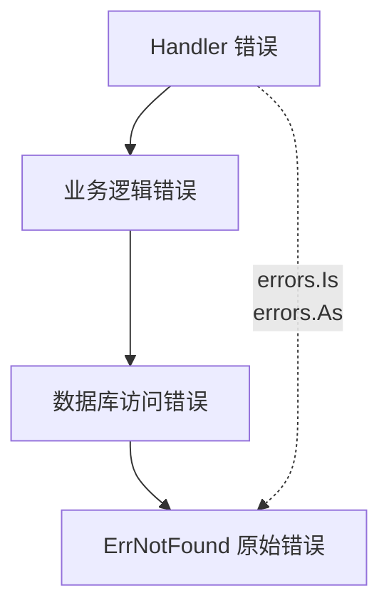

+++
title = "第3章：程序出错怎么办——errors 包与 panic/recover"
weight = 30
date = "2026-03-30T13:43:00+08:00"
type = "docs"
description = ""
isCJKLanguage = true
draft = false
+++
# 第3章：程序出错怎么办——errors 包与 panic/recover

> "代码跑得通，世界一片祥和；代码一报错，天塌地陷。" —— 某位被 bug 毒打过的程序员

程序运行从来不会一帆风顺，网络会断开、文件会丢失、用户会输入奇奇怪怪的东西。作为一门成熟的编程语言，Go 为我们准备了完善的错误处理机制。在这一章里，让我们一起来看看 Go 是如何优雅地表达和处理"意外"的。

---

## 3.1 errors 包解决什么问题

想象一下：你写了一个读取文件的函数，文件不存在怎么办？抛个异常？在 Java 里可以，但在 Go 里不行。Go 的做法是——**把错误当作返回值返回来**。

`errors` 包就是 Go 标准库中专门负责"生产错误"的工厂。它轻量、简单、够用，让你能优雅地告诉调用者："嘿，出问题了。"

```go
package main

import (
    "errors"
    "fmt"
)

// 模拟一个可能失败的操作
func findUser(id int) (string, error) {
    if id <= 0 {
        // 用户 ID 无效，返回一个错误
        return "", errors.New("user id must be positive")
    }
    if id > 1000 {
        // 模拟用户不存在
        return "", errors.New("user not found")
    }
    return fmt.Sprintf("User #%d", id), nil
}

func main() {
    name, err := findUser(-1)
    if err != nil {
        fmt.Println("查找用户失败:", err) // 查找用户失败: user id must be positive
        return
    }
    fmt.Println("找到用户:", name)
}
```

**专业词汇解释：**

- **错误（Error）**：表示程序运行过程中的异常情况，通过返回值传递，而不是抛异常。
- **errors.New()**：errors 包提供的创建错误的方法，接收一个字符串消息。

---

## 3.2 errors 核心原理

### 3.2.1 Go 的错误哲学是"错误是值，不是异常"

Go 的设计哲学深受 C 的影响，但又在错误处理上走出了自己的路。在 Go 里，**错误只是一个普通的值**——你可以把它赋值给变量、传给函数、存在数据结构里。

这和 Java/Python 的"异常"机制完全不同。那些语言里，异常会一路冒泡向上，调用者可以选择捕获或者不捕获，一旦不捕获整个程序可能就炸了。

Go 的做法更直接：**你必须显式处理错误**。函数返回两个值，`(result, error)`，调用者必须检查 error 是否为 nil。

```go
package main

import "errors"

func divide(a, b int) (int, error) {
    if b == 0 {
        return 0, errors.New("division by zero")
    }
    return a / b, nil
}

func main() {
    result, err := divide(10, 0)
    if err != nil {
        // 错误是值，可以打印、可以记录、可以做任何事
        println("发生错误:", err.Error())
        return
    }
    println("结果:", result)
}
```

> 💡 这种设计的好处是什么？**强制你思考错误**。每一次调用可能出错的函数，你都得决定怎么处理错误。代码的意图清晰明了。

### 3.2.2 错误通过返回值传递，调用者必须显式处理

Go 的编译器可不会放过你没处理的错误。如果你调用一个返回 error 的函数但不使用它，编译直接失败：

```go
package main

import "errors"

func mayFail() error {
    return errors.New("oops")
}

func main() {
    mayFail() // 编译错误：mayFail() call has no effect
}
```

这强迫开发者养成好习惯：要么处理错误，要么显式忽略它（用 `_`）。

```go
func main() {
    _ = mayFail() // 显式忽略，编译器没意见了
}
```

---

## 3.3 error 接口

### 3.3.1 错误的核心契约

在 Go 里，`error` 只是一个接口，定义极其简单：

```go
type error interface {
    Error() string
}
```

就一个方法 `Error()`，返回错误的描述字符串。任何实现了这个接口的类型，都可以当作错误来用。

### 3.3.2 只有一个方法 Error() string，实现它就是错误类型

只要你有一个类型，它的 `Error()` 方法返回字符串，那它就是一个合法的错误类型。Go 的 `errors.New()` 就是这么干的。

```go
package main

import (
    "fmt"
    "errors"
)

// 自定义错误类型
type MyError struct {
    Code    int
    Message string
}

// 实现 error 接口
func (e *MyError) Error() string {
    return fmt.Sprintf("[%d] %s", e.Code, e.Message)
}

func main() {
    // errors.New 返回的是 error 接口
    var err error = errors.New("原始错误")
    fmt.Println(err) // 原始错误

    // 自定义错误也可以赋值给 error 接口
    var myErr error = &MyError{Code: 404, Message: "资源不存在"}
    fmt.Println(myErr) // [404] 资源不存在
}
```

> 🏭 **工厂模式小提示**：虽然任何类型都能实现 `error` 接口，但实践中推荐用**结构体指针**（如 `*MyError`）来实现，这样可以在错误中携带更多上下文信息。

---

## 3.4 errors.New

### 3.4.1 从字符串创建错误

`errors.New` 是创建错误最简单的方式——给它一个字符串，它还你一个错误。

```go
package main

import (
    "errors"
    "fmt"
)

func main() {
    // 一行代码，错误创建完成
    err := errors.New("文件未找到")
    fmt.Println("发生了错误:", err) // 发生了错误: 文件未找到
}
```

### 3.4.2 最简单直接的错误创建方式

`errors.New` 非常适合快速创建简单的错误。不过记住，每次调用 `errors.New` 都会分配新的内存（后面会详细讲）。

```go
package main

import (
    "errors"
    "fmt"
)

var (
    ErrNotFound = errors.New("资源不存在")
    ErrInvalid  = errors.New("输入无效")
    ErrTimeout  = errors.New("操作超时")
)

func fetchData(key string) error {
    if key == "" {
        return ErrInvalid
    }
    if key == "missing" {
        return ErrNotFound
    }
    return nil
}

func main() {
    if err := fetchData("missing"); err != nil {
        fmt.Println("获取数据失败:", err)
        // 可以进一步判断是哪种错误
        if errors.Is(err, ErrNotFound) {
            fmt.Println("→ 需要从数据库重新加载")
        }
    }
}
```

---

## 3.5 errors.New 的内部机制

### 3.5.1 字符串不可变，每个 New 调用都会分配新内存

`errors.New` 的内部实现其实就是一个简单的结构体：

```go
// Go 标准库内部大概长这样
type errorString struct {
    s string
}

func (e *errorString) Error() string {
    return e.s
}

func New(text string) error {
    return &errorString{text}
}
```

注意，每次调用 `New("same message")` 都会创建一个**全新的结构体实例**，分配新的内存。即使字符串内容相同，它们也是不同的指针。

```go
package main

import (
    "errors"
    "fmt"
)

func main() {
    err1 := errors.New("同样的错误消息")
    err2 := errors.New("同样的错误消息")

    fmt.Printf("err1 == err2: %v\n", err1 == err2) // err1 == err2: false
    fmt.Printf("err1.Error() == err2.Error(): %v\n", err1.Error() == err2.Error()) // true
}
```

> ⚠️ **性能坑**：如果在循环里频繁创建同样的错误，内存分配会很可观。这种场景下，建议用全局变量。

### 3.5.2 频繁创建同一错误时用全局变量

把常用的错误定义成包级变量，避免重复分配：

```go
package main

import (
    "errors"
    "fmt"
)

// ✅ 推荐：全局错误变量，程序生命周期内只分配一次
var ErrNotFound = errors.New("not found")
var ErrTimeout = errors.New("timeout")
var ErrInvalidInput = errors.New("invalid input")

// ❌ 不推荐：循环里每次都创建新错误
func checkInputs(inputs []string) {
    for _, input := range inputs {
        if input == "" {
            // 每次循环都分配新内存！
            doSomething(errors.New("empty input"))
        }
    }
}

func doSomething(err error) {
    fmt.Println("Error:", err)
}

func main() {
    fmt.Println("ErrNotFound:", ErrNotFound)
    fmt.Println("ErrTimeout:", ErrTimeout)
}
```

---

## 3.6 fmt.Errorf

### 3.6.1 带上下文信息的错误包装

有时候我们需要在错误里添加更多上下文，比如当前操作的参数、函数名、请求 ID 等。`fmt.Errorf` 就是干这个的。

```go
package main

import (
    "fmt"
)

func readConfig(filename string) error {
    // 模拟文件不存在
    return fmt.Errorf("读取配置文件 %s 失败: 文件不存在", filename)
}

func main() {
    err := readConfig("app.yaml")
    fmt.Println("错误详情:", err)
    // 错误详情: 读取配置文件 app.yaml 失败: 文件不存在
}
```

### 3.6.2 "%w" 占位符把原错误包装进去，保留错误链

这是 `fmt.Errorf` 最强大的功能！使用 `%w` 占位符可以把原错误"包装"进去，这样调用者可以用 `errors.Is` 或 `errors.As` 检查原始错误。

```go
package main

import (
    "errors"
    "fmt"
)

// 底层错误
var ErrDB = errors.New("database connection failed")

func queryDB(sql string) error {
    return fmt.Errorf("查询 SQL 失败: %w", ErrDB)
}

func main() {
    err := queryDB("SELECT * FROM users")
    if err != nil {
        fmt.Println("最外层错误:", err)

        // 用 errors.Is 检查原始错误
        if errors.Is(err, ErrDB) {
            fmt.Println("→ 发现根本原因: 数据库连接失败！")
        }
    }
}
```

输出：
```
最外层错误: 查询 SQL 失败: database connection failed
→ 发现根本原因: 数据库连接失败！
```

> 🎁 **错误链的好处**：你可以一层层往上包装错误，每一层都添加自己的上下文，但原始错误不会丢失。这就像一个洋葱，每剥一层都能找到核心。

---

## 3.7 错误包装的层级：每一层包装都会记录上一层错误，形成因果链

想象一个典型的 Go Web 服务请求处理流程：

```go
package main

import (
    "errors"
    "fmt"
)

var ErrNotFound = errors.New("资源不存在")

func handler() error {
    return fmt.Errorf("Handler 处理请求失败: %w", businessLogic())
}

func businessLogic() error {
    return fmt.Errorf("业务逻辑失败: %w", dataAccess())
}

func dataAccess() error {
    return fmt.Errorf("数据库访问失败: %w", ErrNotFound)
}

func main() {
    err := handler()
    fmt.Println("完整错误链:")

    // 逐层展示
    for i, e := range walkErrorChain(err) {
        fmt.Printf("  Level %d: %s\n", i, e)
    }

    // 检查具体错误
    if errors.Is(err, ErrNotFound) {
        fmt.Println("\n最终原因: 资源不存在!")
    }
}

// 模拟遍历错误链
func walkErrorChain(err error) []string {
    var chain []string
    current := err
    for current != nil {
        chain = append(chain, current.Error())
        current = errors.Unwrap(current)
    }
    return chain
}
```

输出：
```
完整错误链:
  Level 0: Handler 处理请求失败: 业务逻辑失败: 数据库访问失败: 资源不存在
  Level 1: 业务逻辑失败: 数据库访问失败: 资源不存在
  Level 2: 数据库访问失败: 资源不存在
  Level 3: 资源不存在

最终原因: 资源不存在!
```



---

## 3.8 errors.Is

### 3.8.1 检查错误链中是否有目标错误

`errors.Is` 沿着错误链向上查找，检查是否有任何一个包装过的错误和目标错误相等。

```go
package main

import (
    "errors"
    "fmt"
)

var ErrPermission = errors.New("permission denied")

func main() {
    // 模拟多层包装
    err := layer3()

    // errors.Is 会沿着整个错误链检查
    if errors.Is(err, ErrPermission) {
        fmt.Println("检测到权限错误！")
    }

    // 即使是不同的错误包装方式
    err2 := fmt.Errorf("中间层: %w", ErrPermission)
    if errors.Is(err2, ErrPermission) {
        fmt.Println("fmt.Errorf 包装的也能检测到！")
    }
}

func layer3() error {
    return fmt.Errorf("第三层: %w", layer2())
}

func layer2() error {
    return fmt.Errorf("第二层: %w", layer1())
}

func layer1() error {
    return fmt.Errorf("第一层: %w", ErrPermission)
}
```

### 3.8.2 沿着包装链向上查找

`errors.Is` 的实现原理其实很简单：不断调用 `errors.Unwrap()` 获取被包装的内部错误，逐层比较。

```go
package main

import (
    "errors"
    "fmt"
)

// 手撕一个简化版 errors.Is，理解其原理
func myIs(err, target error) bool {
    for err != nil {
        if err == target {
            return true
        }
        err = errors.Unwrap(err) // 往上一层
    }
    return false
}

func main() {
    base := errors.New("base error")
    wrapped := fmt.Errorf("wrapped: %w", base)

    fmt.Println("myIs(wrapped, base):", myIs(wrapped, base))    // true
    fmt.Println("errors.Is(wrapped, base):", errors.Is(wrapped, base)) // true
}
```

---

## 3.9 errors.As

### 3.9.1 沿着错误链找到第一个匹配的类型

`errors.As` 和 `errors.Is` 类似，但它是用来找**特定类型**的错误的。它会沿着错误链，找到第一个可以赋值给目标类型的错误。

```go
package main

import (
    "errors"
    "fmt"
)

// 自定义错误类型，可以携带更多信息
type ValidationError struct {
    Field   string
    Message string
}

func (e *ValidationError) Error() string {
    return fmt.Sprintf("验证失败 [%s]: %s", e.Field, e.Message)
}

// 错误的包装层级
func process() error {
    return fmt.Errorf("处理失败: %w", validate())
}

func validate() error {
    return fmt.Errorf("校验失败: %w", &ValidationError{Field: "email", Message: "格式不正确"})
}

func main() {
    err := process()
    fmt.Println("错误:", err)

    // 用 errors.As 提取具体类型
    var validationErr *ValidationError
    if errors.As(err, &validationErr) {
        fmt.Printf("→ 捕获到验证错误! 字段: %s, 消息: %s\n",
            validationErr.Field, validationErr.Message)
    }
}
```

输出：
```
错误: 处理失败: 校验失败: 验证失败 [email]: 格式不正确
→ 捕获到验证错误! 字段: email, 消息: 格式不正确
```

### 3.9.2 可以还原出具体错误类型

```go
package main

import (
    "errors"
    "fmt"
)

// 另一个自定义错误类型
type TimeoutError struct {
    Duration int // 超时时长（秒）
}

func (e *TimeoutError) Error() string {
    return fmt.Sprintf("操作超时 (%d秒)", e.Duration)
}

func main() {
    // 包装多个不同类型的错误
    err := fmt.Errorf("外层: %w", &TimeoutError{Duration: 30})

    // 尝试提取 TimeoutError
    var timeoutErr *TimeoutError
    if errors.As(err, &timeoutErr) {
        fmt.Printf("提取到超时错误: 持续 %d 秒\n", timeoutErr.Duration)
    }

    // 尝试提取不匹配的类型（不会 panic，只返回 false）
    var validationErr *ValidationError
    if errors.As(err, &validationErr) {
        fmt.Println("这行不会打印")
    } else {
        fmt.Println("不是 ValidationError 类型")
    }
}
```

---

## 3.10 errors.Join（Go 1.20+）

### 3.10.1 组合多个错误

Go 1.20 引入了 `errors.Join`，可以把多个错误合并成一个"错误集合"。这在需要同时报告多个错误的场景下非常有用。

```go
package main

import (
    "errors"
    "fmt"
)

func main() {
    err1 := errors.New("第一个错误")
    err2 := errors.New("第二个错误")
    err3 := errors.New("第三个错误")

    // 把多个错误合并成一个
    combined := errors.Join(err1, err2, err3)

    fmt.Println("合并后的错误:")
    fmt.Println(combined)
    fmt.Println()

    // errors.Join 返回的错误调用 Error() 时，各错误用换行分隔
    fmt.Printf("Error() 字符串长度: %d\n", len(combined.Error()))
}
```

输出：
```
合并后的错误:
第一个错误
第二个错误
第三个错误

Error() 字符串长度: 36
```

### 3.10.2 errors.Is 分别检查

`errors.Join` 返回的错误可以用 `errors.Is` 分别检查每个原始错误：

```go
package main

import (
    "errors"
    "fmt"
)

var ErrCritical = errors.New("严重错误")
var ErrWarning = errors.New("警告")

func main() {
    combined := errors.Join(ErrCritical, ErrWarning, errors.New("普通错误"))

    // 分别检查
    fmt.Println("包含严重错误?", errors.Is(combined, ErrCritical)) // true
    fmt.Println("包含警告?", errors.Is(combined, ErrWarning))     // true
    fmt.Println("包含普通错误?", errors.Is(combined, errors.New("普通错误"))) // true
}
```

---

## 3.11 自定义错误类型

### 3.11.1 结构体 + Error() 方法

前面我们已经见过自定义错误类型了。标准的模式就是：定义一个结构体，然后为它实现 `Error()` 方法。

```go
package main

import (
    "fmt"
    "time"
)

// 自定义错误类型：带丰富上下文
type AppError struct {
    Code      int       // 错误码
    Message   string    // 错误信息
    RequestID string    // 请求 ID，方便追踪
    Timestamp time.Time // 发生时间
}

func (e *AppError) Error() string {
    return fmt.Sprintf("[%d] %s (请求: %s, 时间: %s)",
        e.Code, e.Message, e.RequestID, e.Timestamp.Format("15:04:05"))
}

// 方便的构造函数
func NewAppError(code int, message, requestID string) *AppError {
    return &AppError{
        Code:      code,
        Message:   message,
        RequestID: requestID,
        Timestamp: time.Now(),
    }
}

func main() {
    err := NewAppError(404, "用户不存在", "req-12345")
    fmt.Println(err)
    // [404] 用户不存在 (请求: req-12345, 时间: 15:30:25)
}
```

### 3.11.2 可以携带错误码

在大型系统中，错误码比字符串消息更实用。错误码便于程序处理，也方便国际化。

```go
package main

import (
    "errors"
    "fmt"
)

// 错误码常量
const (
    ErrCodeNotFound      = 404
    ErrCodeUnauthorized  = 401
    ErrCodeInternalError = 500
)

type CodeError struct {
    Code int
    Msg  string
}

func (e *CodeError) Error() string {
    return fmt.Sprintf("错误码 %d: %s", e.Code, e.Msg)
}

func FindUser(id int) error {
    if id <= 0 {
        return &CodeError{Code: ErrCodeNotFound, Msg: "无效的用户 ID"}
    }
    return nil
}

func main() {
    err := FindUser(-1)
    if err != nil {
        var ce *CodeError
        if errors.As(err, &ce) {
            fmt.Printf("处理错误码: %d\n", ce.Code) // 处理错误码: 404
        }
    }
}
```

### 3.11.3 请求 ID

在分布式系统中，请求 ID 是串联整个调用链的关键。

```go
package main

import (
    "errors"
    "fmt"
)

type RequestError struct {
    RequestID string
    Err       error // 包装底层错误
}

func (e *RequestError) Error() string {
    return fmt.Sprintf("请求[%s]失败: %s", e.RequestID, e.Err.Error())
}

func (e *RequestError) Unwrap() error {
    return e.Err
}

func main() {
    baseErr := errors.New("数据库连接超时")
    reqErr := &RequestError{RequestID: "abc-123", Err: baseErr}

    fmt.Println(reqErr)
    // 请求[abc-123]失败: 数据库连接超时

    // 仍然可以检查原始错误
    if errors.Is(reqErr, baseErr) {
        fmt.Println("→ 可以追踪到原始错误")
    }
}
```

### 3.11.4 时间戳等额外信息

错误里带时间戳，对排查问题非常有帮助。

```go
package main

import (
    "fmt"
    "time"
)

type DetailedError struct {
    When time.Time
    What string
    Who  string // 谁触发的
}

func (e *DetailedError) Error() string {
    return fmt.Sprintf("%s 由 %s 触发: %s",
        e.When.Format("2006-01-02 15:04:05"),
        e.Who,
        e.What)
}

func main() {
    err := &DetailedError{
        When: time.Now(),
        What: "磁盘空间不足",
        Who:  "日志写入模块",
    }
    fmt.Println(err)
    // 2026-03-29 15:45:00 由 日志写入模块 触发: 磁盘空间不足
}
```

---

## 3.12 defer

### 3.12.1 延迟执行语句

`defer` 是 Go 里一个超级实用的语法。它的意思是"推迟执行"，函数结束前一定会执行 defer 指定的内容，不管函数是正常返回还是 panic。

```go
package main

import "fmt"

func readFile(filename string) {
    // 假设这里打开了文件
    fmt.Println("打开文件:", filename)

    // defer 确保退出前执行清理
    defer fmt.Println("关闭文件:", filename)

    fmt.Println("读取文件内容...")
    fmt.Println("处理数据...")
}

func main() {
    readFile("data.txt")
}
```

输出：
```
打开文件: data.txt
读取文件内容...
处理数据...
关闭文件: data.txt
```

### 3.12.2 在函数返回之前执行，常用于资源清理

`defer` 最经典的使用场景就是**资源清理**：关闭文件、释放锁、关闭数据库连接等。不管函数中途 return 还是出错，defer 都能保证清理代码被执行。

```go
package main

import "fmt"

type File struct {
    name string
}

func (f *File) Close() {
    fmt.Println("释放文件资源:", f.name)
}

func processFile(name string) {
    file := &File{name: name}
    defer file.Close() // 无论发生什么，Close 都会被调用

    fmt.Println("打开文件:", name)
    if name == "missing.txt" {
        fmt.Println("文件不存在！提前返回")
        return // defer 仍然会执行
    }
    fmt.Println("正常处理文件")
}

func main() {
    processFile("missing.txt")
    fmt.Println("---")
    processFile("data.txt")
}
```

输出：
```
打开文件: missing.txt
文件不存在！提前返回
释放文件资源: missing.txt
---
打开文件: data.txt
正常处理文件
释放文件资源: data.txt
```

---

## 3.13 defer 的执行时机

### 3.13.1 return 之后

Go 的函数执行流程是这样的：先计算返回值，然后执行 defer 语句，最后真正返回。defer 在 return 之后、执行完毕之前运行。

```go
package main

import "fmt"

func example() int {
    fmt.Println("1. 函数体执行")
    defer fmt.Println("3. defer 执行（return 之后）")
    fmt.Println("2. 准备返回")
    return 42
}

func main() {
    result := example()
    fmt.Println("4. 调用者收到返回值:", result)
}
```

输出：
```
1. 函数体执行
2. 准备返回
3. defer 执行（return 之后）
4. 调用者收到返回值: 42
```

### 3.13.2 函数退出之前

无论函数是正常执行完毕，还是因为错误提前 return，defer 都会在真正离开函数之前执行。

### 3.13.3 即使函数 panic 了，defer 也会执行

这是 defer 最厉害的地方！即使程序进入了恐慌状态，defer 依然会忠心耿耿地执行。

```go
package main

import "fmt"

func riskyFunction() {
    defer fmt.Println("4. defer 在 panic 时也会执行！")

    fmt.Println("1. 开始执行")
    panic("哎呀，出问题了！")
    fmt.Println("2. 这行不会打印")
}

func main() {
    fmt.Println("0. 调用前")
    riskyFunction()
    fmt.Println("3. 这行不会打印")
}
```

输出：
```
0. 调用前
1. 开始执行
4. defer 在 panic 时也会执行！
panic: 哎呀，出问题了！
...
```

> 🦸 defer 就像一个尽职的保镖，不管任务成功还是失败，它都会把现场收拾干净再离开。

---

## 3.14 defer 的参数预计算

### 3.14.1 defer 语句中的参数在 defer 时就确定了

这是 Go 新手很容易踩的坑：**defer 语句中的参数值是在 defer 这一行就确定的**，而不是在 defer 执行时才确定。

```go
package main

import "fmt"

func main() {
    i := 1

    // defer 执行到这里时，i 的值是 1
    defer fmt.Println("defer 打印 i:", i)

    i = 2
    fmt.Println("函数体打印 i:", i)
}
```

输出：
```
函数体打印 i: 2
defer 打印 i: 1  // 预计算的结果！
```

### 3.14.2 小心闭包捕获循环变量的指针/引用

如果 defer 后面跟的是闭包，闭包会捕获变量的引用，但引用的变量的值依然是**执行时**确定的：

```go
package main

import "fmt"

func main() {
    // 演示闭包捕获循环变量的问题
    for i := 1; i <= 3; i++ {
        // 这里 defer 执行时，i 还是 1，然后 i++... 等等
        // 实际上 defer 参数是预计算的，但闭包是延迟执行的
        defer func() {
            fmt.Printf("闭包打印 i: %d\n", i) // i 是引用，会是最终值
        }()
    }

    fmt.Println("循环结束")
}
```

输出：
```
循环结束
闭包打印 i: 3
闭包打印 i: 3
闭包打印 i: 3
```

> ⚠️ **经典坑**：三个 defer 闭包都捕获了同一个变量 `i`，当闭包执行时循环已经结束，`i` 的值是 3。正确的做法是传参：

```go
package main

import "fmt"

func main() {
    for i := 1; i <= 3; i++ {
        // 通过参数传递，固化当前的值
        defer func(val int) {
            fmt.Printf("闭包打印 val: %d\n", val)
        }(i) // i 的值作为参数传递进去
    }
}
```

输出：
```
闭包打印 val: 3
闭包打印 val: 2
闭包打印 val: 1
```

> 💡 注意：即使传参了，执行顺序还是 LIFO（后进先出），所以是 3→2→1。

---

## 3.15 defer 多个语句：同一个函数里可以多个 defer，按 LIFO（后进先出）顺序执行

一个函数里可以有多个 defer，它们按照**后进先出**的顺序执行——最后定义的 defer 最先执行。

```go
package main

import "fmt"

func complexOperation() {
    fmt.Println("1. 分配资源 A")
    defer fmt.Println("6. 释放资源 A（最后定义，最先执行）")

    fmt.Println("2. 分配资源 B")
    defer fmt.Println("5. 释放资源 B")

    fmt.Println("3. 分配资源 C")
    defer fmt.Println("4. 释放资源 C（最先定义，最后执行）")

    fmt.Println("4. 执行主要操作")
}

func main() {
    complexOperation()
}
```

输出：
```
1. 分配资源 A
2. 分配资源 B
3. 分配资源 C
4. 执行主要操作
4. 释放资源 C（最先定义，最后执行）
5. 释放资源 B
6. 释放资源 A（最后定义，最先执行）
```

> 🧱 **栈的特性**：defer 语句栈，后进先出。想象成叠盘子，最后放上去的盘子最先被拿走。

---

## 3.16 panic

### 3.16.1 Go 的"紧急退出"机制

`panic` 是 Go 里的"紧急刹车"。当你遇到完全不应该发生的致命错误时，可以用 `panic` 让程序停下来。

```go
package main

import "fmt"

func main() {
    fmt.Println("程序开始...")

    panic("这是一个 panic！")

    fmt.Println("这行不会执行")
}
```

输出：
```
程序开始...
panic: 这是一个 panic！
...
```

### 3.16.2 导致当前 goroutine 恐慌崩溃，应该尽量避免使用

`panic` 会让当前 goroutine 崩溃（注意：只是当前 goroutine，不是整个程序）。这应该**尽量避免使用**，因为：

1. panic 会导致程序终止（如果不 recover 的话）
2. 很难在调用链中间恢复
3. 破坏了 Go 的错误处理哲学

> 🚨 **经验法则**：能用 error 返回值解决的，就不要用 panic。panic 只用于真正"不应该发生"的情况，比如程序逻辑错误（索引越界、空指针等）。

```go
package main

import "fmt"

// 模拟一个内部 bug
func internalBug() {
    panic("内部错误：数组越界（模拟）")
}

// 正常业务流程
func normalFlow() {
    fmt.Println("执行正常流程...")
}

func main() {
    normalFlow()
    internalBug() // 这应该用 error 返回，而不是 panic
    normalFlow()  // 不会执行到这里
}
```

---

## 3.17 recover

### 3.17.1 捕获 panic，防止程序崩溃

`recover` 是 Go 提供的"紧急刹车修复工具"。它可以拦截 panic，防止程序真的崩溃。

```go
package main

import "fmt"

func main() {
    fmt.Println("开始执行...")

    // recover 必须在 defer 里用
    defer func() {
        if r := recover(); r != nil {
            fmt.Println("捕获到 panic:", r)
            fmt.Println("程序继续运行！")
        }
    }()

    panic("模拟严重错误")
    fmt.Println("这行不会执行")
}
```

输出：
```
开始执行...
捕获到 panic: 模拟严重错误
程序继续运行！
```

### 3.17.2 必须在 defer 里调用，在其他位置调用无效

`recover` 有个很特别的限制：**它只能在 defer 函数里调用**。在普通函数里调用 recover 是没有任何效果的。

```go
package main

import "fmt"

func willPanic() {
    defer fmt.Println("defer 里的 recover 可以工作")
    recover() // 这里调用 recover 毫无作用！
    panic("啊啊啊")
}

func main() {
    willPanic() // 程序还是会 panic
}
```

> ⚠️ **正确姿势**：

```go
func safeCall() {
    defer func() {
        if r := recover(); r != nil {
            // 这里才是 recover 正确的工作场所
            fmt.Println("已恢复:", r)
        }
    }()
    panic("需要被恢复的 panic")
}
```

---

## 3.18 panic 和 error 的取舍

> error 用于可预期的错误（如文件不存在、网络超时），panic 用于程序不应该继续运行的情况（如索引越界、断言失败）

这是一个经验法则：

| 场景 | 用 error 还是 panic |
|------|---------------------|
| 用户输入验证失败 | `error` |
| 文件不存在 | `error` |
| 网络超时 | `error` |
| 程序逻辑错误（bug） | `panic` 或直接崩 |
| 数组越界（不应该发生） | `panic` |
| 严重的配置错误 | `panic` |

```go
package main

import (
    "errors"
    "fmt"
)

// 用 error 表示可预期的失败
func validateAge(age int) error {
    if age < 0 {
        return errors.New("年龄不能为负数")
    }
    if age > 150 {
        // 这是一个配置/逻辑错误，用 panic 更合适
        panic("年龄不可能大于150，配置出错了！")
    }
    return nil
}

func main() {
    defer func() {
        if r := recover(); r != nil {
            fmt.Println("严重错误被 recover:", r)
        }
    }()

    // 可预期的错误用 error 处理
    if err := validateAge(-5); err != nil {
        fmt.Println("验证失败:", err)
    }

    // 触发 panic 的场景
    validateAge(200)
}
```

---

## 3.19 runtime.Goexit

### 3.19.1 退出当前 goroutine

`runtime.Goexit()` 会立即终止**当前 goroutine**的执行，但不会影响其他 goroutine。注意，它不会导致整个程序退出。

```go
package main

import (
    "fmt"
    "runtime"
)

func worker(id int) {
    for i := 0; i < 3; i++ {
        fmt.Printf("Worker %d: %d\n", id, i)
        if i == 1 && id == 1 {
            fmt.Println("Worker 1 决定退出...")
            runtime.Goexit() // 只退出当前 goroutine
        }
    }
    fmt.Printf("Worker %d 完成\n", id)
}

func main() {
    go worker(0)
    go worker(1)
    go worker(2)

    // 给其他 goroutine 时间执行
    runtime.Gosched()
    fmt.Println("main 函数结束")
}
```

### 3.19.2 不会导致整个程序退出，只退出当前协程

`runtime.Goexit()` 和 `panic` 的区别：

- `panic`：终止整个 goroutine，会触发 defer 执行，如果没被 recover 会导致整个程序崩溃
- `runtime.Goexit()`：优雅地终止当前 goroutine，会触发 defer 执行，但不会影响其他 goroutine

```go
package main

import (
    "fmt"
    "runtime"
)

func main() {
    done := make(chan bool)

    go func() {
        defer func() {
            fmt.Println("goroutine defer 执行")
            done <- true
        }()

        for i := 0; i < 5; i++ {
            fmt.Println("goroutine 执行中:", i)
            if i == 2 {
                runtime.Goexit() // 优雅退出
            }
        }
    }()

    <-done
    fmt.Println("main 函数结束，程序正常退出")
}
```

---

## 3.20 errors.ErrUnsupported

### 3.20.1 标准库里的"不支持"错误

Go 1.21 引入了 `errors.ErrUnsupported`，这是一个预定义的标准错误，表示"当前实现不支持该操作"。

```go
package main

import (
    "errors"
    "fmt"
)

func main() {
    fmt.Println("errors.ErrUnsupported:", errors.ErrUnsupported)
    fmt.Println("errors.ErrUnsupported.Error():", errors.ErrUnsupported.Error())
}
```

### 3.20.2 用来表示某种操作不被当前实现支持

当你的 API 或者功能还不完整时，可以用 `errors.ErrUnsupported` 来表示：

```go
package main

import (
    "errors"
    "fmt"
)

var ErrUnsupported = errors.ErrUnsupported

type Feature struct {
    Name string
}

func (f *Feature) Enable() error {
    return fmt.Errorf("功能 %s 暂未实现: %w", f.Name, ErrUnsupported)
}

func main() {
    f := &Feature{Name: "批量导出"}
    if err := f.Enable(); err != nil {
        fmt.Println("错误:", err)

        if errors.Is(err, ErrUnsupported) {
            fmt.Println("→ 该功能尚未支持，敬请期待！")
        }
    }
}
```

---

## 3.21 panic 的值可以是任意类型

### 3.21.1 panic("error message")

`panic` 最常见的使用方式，传入一个字符串：

```go
panic("这是一条恐慌消息")
```

### 3.21.2 panic(err)

也可以传入一个 error，这样可以用 `recover()` 捕获到完整的错误信息：

```go
package main

import (
    "errors"
    "fmt"
)

func main() {
    defer func() {
        if r := recover(); r != nil {
            fmt.Printf("捕获到 panic: %v (类型: %T)\n", r, r)
        }
    }()

    err := errors.New("一个错误")
    panic(err)
}
```

### 3.21.3 panic(123) 都可以

`panic` 接收的是 `any`（空接口），所以你可以传入任意类型：

```go
package main

import "fmt"

func main() {
    defer func() {
        if r := recover(); r != nil {
            fmt.Printf("捕获到: %v (类型: %T)\n", r, r)
        }
    }()

    // 整数
    panic(404)

    // 结构体
    panic(struct{ Msg string }{"自定义结构体"})

    // 甚至是 nil
    // panic(nil)
}
```

> 🎭 panic 的值可以是任意类型，这是 Go 的设计选择。但实践中，**强烈建议使用 error 类型或 string**，方便 recover 后处理。

---

## 3.22 recover 只能在 defer 里用

```go
defer func() { if r := recover(); r != nil { ... } }()
```

这是 Go 里最经典的错误恢复模式。让我给你展示它的完整形态：

```go
package main

import (
    "errors"
    "fmt"
)

func risky() (err error) {
    // defer 函数可以捕获 named return 值
    defer func() {
        if r := recover(); r != nil {
            // 把 panic 转换为 error
            err = fmt.Errorf("panic 被恢复: %v", r)
        }
    }()

    fmt.Println("执行可能 panic 的代码...")
    panic(errors.New("假装出了点问题"))
    return nil // 不会执行到这里
}

func main() {
    result, err := risky()
    if err != nil {
        fmt.Println("函数返回错误:", err)
    }
    fmt.Println("程序优雅地处理了 panic，程序继续运行！")
}
```

输出：
```
执行可能 panic 的代码...
函数返回错误: panic 被恢复: 假装出了点问题
程序优雅地处理了 panic，程序继续运行！
```

> 💪 **最佳实践**：把可能 panic 的代码用 defer + recover 包裹起来，把 panic 转换成普通的 error，这样调用者可以用统一的方式处理错误。

---

## 本章小结

本章我们学习了 Go 的错误处理机制，以下是核心要点：

| 概念 | 关键点 |
|------|--------|
| **error 接口** | `Error() string`，实现它就是错误类型 |
| **errors.New** | 从字符串创建简单错误，每次调用分配新内存 |
| **fmt.Errorf + %w** | 包装错误，保留错误链 |
| **errors.Is** | 检查错误链中是否有目标错误 |
| **errors.As** | 提取错误链中匹配类型的错误 |
| **errors.Join** | 合并多个错误（Go 1.20+） |
| **自定义错误** | 结构体 + Error()，可携带错误码、请求ID等 |
| **defer** | 延迟执行，函数退出前执行，常用于资源清理 |
| **panic** | 紧急退出，尽量避免使用 |
| **recover** | 捕获 panic，必须在 defer 中调用 |
| **runtime.Goexit** | 只退出当前 goroutine，不影响其他协程 |
| **errors.ErrUnsupported** | 标准库的"不支持"错误 |

**记住**：Go 的错误哲学是"**错误是值，不是异常**"。能用 error 返回值解决的，就不要用 panic。把 panic 留给真正不应该发生的致命错误。
