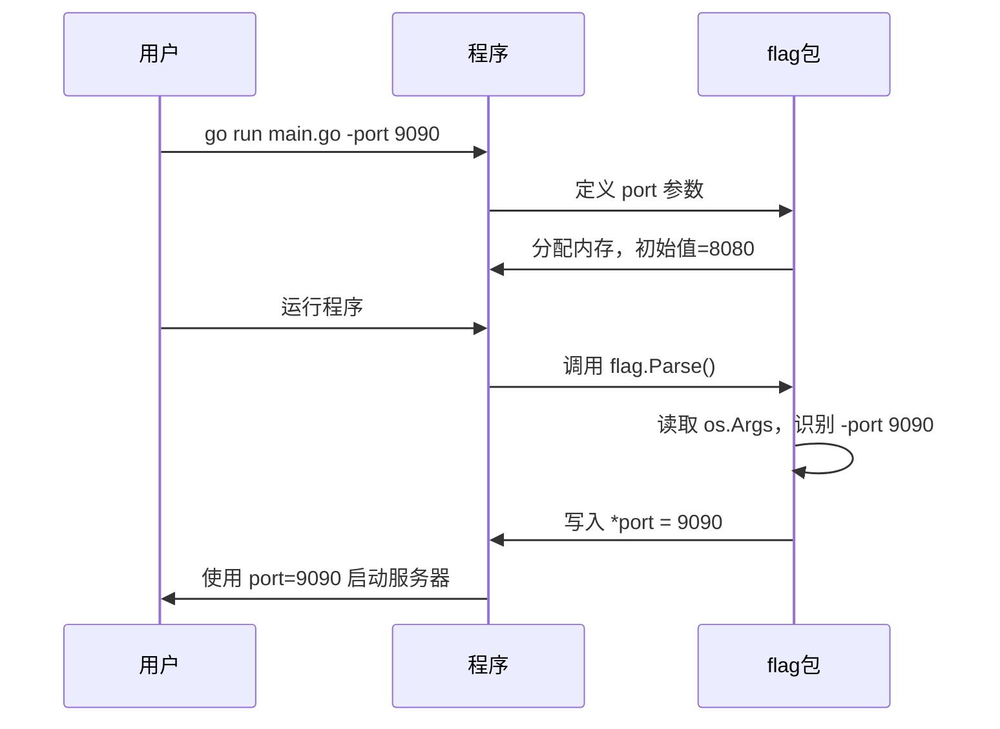
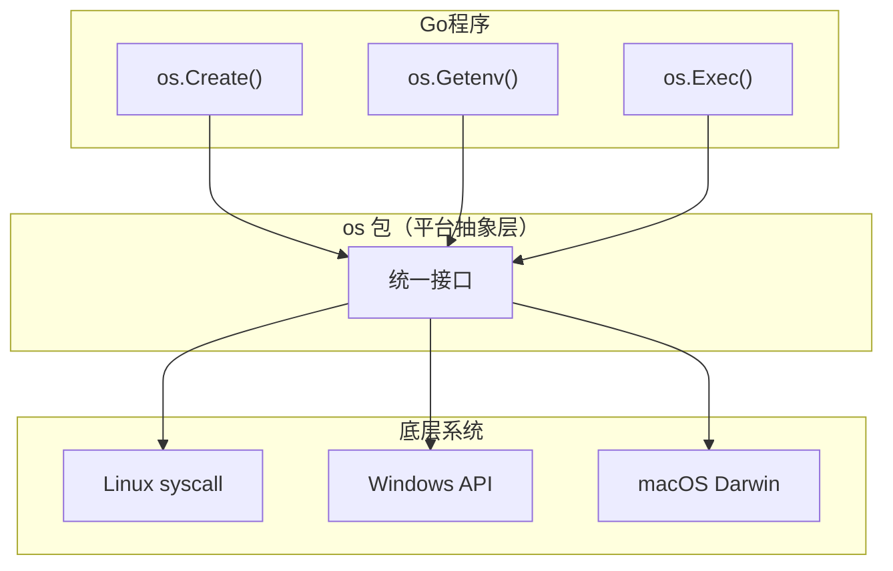
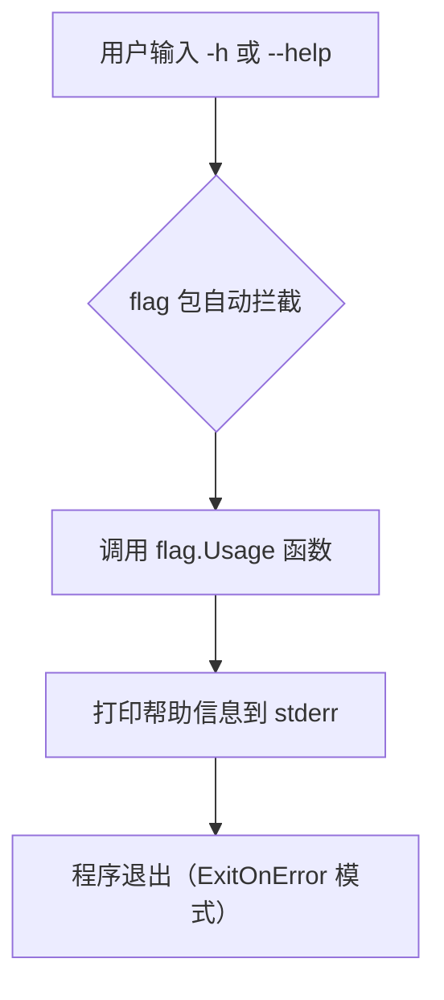
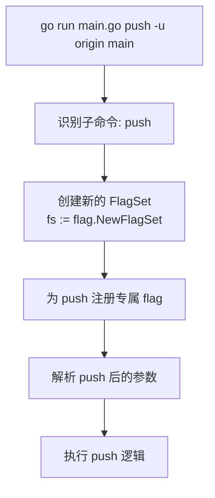

+++
title = "第4章：让程序响应命令行——flag 包与 os 基础"
weight = 40
date = "2026-03-30T13:43:00+08:00"
type = "docs"
description = ""
isCJKLanguage = true
draft = false
+++
# 第4章：让程序响应命令行——flag 包与 os 基础


> 💡 **章前导读**：你有没有想过，为什么 `go run main.go -o output.txt` 里的 `-o output.txt` 能被程序"看懂"？是谁在默默做了翻译工作？答案就是本章的主角——`flag` 包。而 `os` 包则是 Go 程序与操作系统对话的万能翻译器。准备好了吗？让我们一起揭开命令行参数处理的神秘面纱！

---

## 4.1 flag 包解决什么问题

想象一下这个场景：你写了一个图片压缩工具，用户使用时输入：

```bash
./image-tool -width 800 -height 600 -quality 85 -o compressed.jpg input.png
```

没有 `flag` 包之前，你可能需要自己写一堆字符串解析代码，眼睛都要瞎了。而 `flag` 包就像一个贴心的秘书，帮你把这些乱七八糟的命令行参数整理得服服帖帖，直接变成 Go 代码里的变量。

**专业词汇解释：**

- **命令行参数（Command-line Arguments）**：运行程序时在命令后面附加的选项和值，如 `-width 800`
- **flag 解析（Flag Parsing）**：将命令行字符串转换成程序内部可用的变量值的过程
- **短选项（Short Flag）**：单字符选项，如 `-o`（对应 `-output`）
- **长选项（Long Flag）**：完整单词选项，如 `--output`

```go
// 4.1 flag包解决什么问题
// 运行: go run main.go -name "张三" -age 28

package main

import (
    "flag"
    "fmt"
)

func main() {
    // 直接定义一个 name 参数，默认值是"游客"，使用说明是"用户名"
    name := flag.String("name", "游客", "用户名")
    age := flag.Int("age", 18, "年龄")

    // 重要：解析！不解析就白定义了
    flag.Parse()

    fmt.Printf("你好，%s！你今年 %d 岁了。\n", *name, *age)
    // 输出: 你好，张三！你今年 28 岁了。
}
```

```mermaid
flowchart LR
    A["用户输入命令<br/>go run main.go -name 张三 -age 28"] --> B["flag 包自动解析"]
    B --> C["程序内部变量<br/>name = \"张三\"<br/>age = 28"]
    C --> D["程序逻辑使用这些值"]
```

> 📝 **小贴士**：`flag.String()` 返回的是指针，千万别忘了最后 `flag.Parse()`！没有解析，你的参数永远都是默认值。

---

## 4.2 flag 核心原理

flag 包的运作遵循**三步走战略**，就像点外卖一样：

1. **定义参数**（下单）：告诉 flag 包我需要哪些参数
2. **解析参数**（接单）：调用 `flag.Parse()` 把命令行字符串转成 Go 变量
3. **使用参数**（吃外卖）：这时候变量里才有正确的值

**核心概念：**

- **FlagSet**：`flag` 包的核心结构体，管理一组相关的 flag
- **解析（Parse）**：将 `os.Args`（或自定义字符串切片）中的命令行参数转换为对应变量
- **默认值（Default Value）**：用户没提供时使用的值

```go
// 4.2 flag核心原理：定义 → 解析 → 使用
// 运行: go run main.go -port 9090

package main

import (
    "flag"
    "fmt"
)

func main() {
    fmt.Println("=== 第1步：定义参数（注册用户想吃什么） ===")

    // 定义一个整型参数 port，默认 8080，说明是"服务器端口"
    port := flag.Int("port", 8080, "服务器端口")

    fmt.Println("=== 第2步：解析参数（厨房接单准备） ===")

    // 解析之前，*port 的值还是默认值 8080
    fmt.Printf("解析前，port = %d\n", *port)

    flag.Parse()

    // 解析之后，*port 的值是用户传入的 9090
    fmt.Printf("解析后，port = %d\n", *port)

    fmt.Println("=== 第3步：使用参数（上菜开吃） ===")
    fmt.Printf("服务器将在端口 %d 启动！\n", *port)
    // 输出: 服务器将在端口 9090 启动！
}
```



> ⚠️ **血的教训**：`flag.Parse()` 必须在**所有** flag 定义完之后、**使用**任何 flag 变量**之前**调用！顺序不能乱！

---

## 4.3 os 包解决什么问题

`os` 包是 Go 标准库中的"瑞士军刀"，它提供了与操作系统交互的各种功能。没有它，你的 Go 程序就是个"聋子瞎子"——不知道自己在哪、读不了文件、拿不到环境变量、也运行不了其他命令。

### 4.3.1 Go 程序和操作系统之间的桥梁

os 包封装了操作系统底层调用，让你用纯 Go 代码就能：

- 操作文件和目录
- 读写环境变量
- 启动和管理进程
- 处理信号
- 获取系统信息

### 4.3.2 读写文件

```go
// 4.3.2 os包：读写文件
// 运行后会在当前目录创建 demo.txt

package main

import (
    "fmt"
    "os"
)

func main() {
    // 创建一个文件（如果存在会清空）
    file, err := os.Create("demo.txt")
    if err != nil {
        fmt.Println("创建文件失败:", err)
        return
    }
    defer file.Close() // 函数结束前关闭文件

    // 写入数据
    content := "Hello, os package!\n这是用 Go 写的文件。"
    n, err := file.WriteString(content)
    if err != nil {
        fmt.Println("写入失败:", err)
        return
    }
    fmt.Printf("成功写入 %d 个字节到 demo.txt\n", n)
    // 输出: 成功写入 44 个字节到 demo.txt

    // 读取文件内容
    data := make([]byte, 100)
    file2, err := os.Open("demo.txt")
    if err != nil {
        fmt.Println("打开文件失败:", err)
        return
    }
    defer file2.Close()

    count, err := file2.Read(data)
    if err != nil {
        fmt.Println("读取失败:", err)
        return
    }
    fmt.Printf("读取到: %s\n", string(data[:count]))
    // 输出: 读取到: Hello, os package!
    //       这是用 Go 写的文件。
}
```

### 4.3.3 获取环境变量

```go
// 4.3.3 os包：获取环境变量
// 运行: GOPATH=/my/gopath go run main.go

package main

import (
    "fmt"
    "os"
)

func main() {
    // 获取单个环境变量
    goPath := os.Getenv("GOPATH")
    fmt.Printf("GOPATH = %s\n", goPath)
    // 输出: GOPATH = /my/gopath

    // 获取 PATH（可能很长）
    path := os.Getenv("PATH")
    fmt.Printf("PATH = %s\n", path)
    // 输出: PATH = /usr/local/bin:/usr/bin:/bin

    // 设置环境变量（只影响当前进程和子进程）
    os.Setenv("MY_VAR", "Hello from os!")
    fmt.Printf("MY_VAR = %s\n", os.Getenv("MY_VAR"))
    // 输出: MY_VAR = Hello from os!
}
```

### 4.3.4 运行命令

```go
// 4.3.4 os包：运行命令
// 运行: go run main.go

package main

import (
    "fmt"
    "os"
    "os/exec"
)

func main() {
    // 运行 ls 命令（Linux/macOS）或 dir 命令（Windows）
    cmd := exec.Command("go", "version")
    output, err := cmd.Output()
    if err != nil {
        fmt.Println("执行命令失败:", err)
        return
    }
    fmt.Printf("Go 版本: %s", string(output))
    // 输出: Go 版本: go version go1.21.0 linux/amd64
}
```

### 4.3.5 处理信号

```go
// 4.3.5 os包：处理信号
// 运行后按 Ctrl+C 发送 SIGINT 信号观察效果

package main

import (
    "fmt"
    "os"
    "os/signal"
    "syscall"
)

func main() {
    fmt.Println("程序启动，按 Ctrl+C 发送信号...")

    // 创建一个通道接收信号
    sigChan := make(chan os.Signal, 1)

    // 通知通道接收 SIGINT（Ctrl+C）和 SIGTERM 信号
    signal.Notify(sigChan, syscall.SIGINT, syscall.SIGTERM)

    // 阻塞等待信号
    sig := <-sigChan
    fmt.Printf("接收到信号: %v\n", sig)
    // 输出: 接收到信号: interrupt
    fmt.Println("程序正在优雅退出...")
    os.Exit(0)
}
```

**专业词汇解释：**

- **信号（Signal）**：操作系统发送给进程的通知，如 `SIGINT`（中断）、`SIGTERM`（终止）
- **进程（Process）**：正在运行的程序的实例
- **环境变量（Environment Variable）**：操作系统层面的键值对，影响程序运行环境
- **工作目录（Working Directory）**：程序当前所在的目录

---

## 4.4 os 核心原理

`os` 包是 Go 标准库里最"接地气"的包——它是**平台抽象层**。无论你用的是 Windows、Linux 还是 macOS，调用 `os.Create()` 的代码都是一样的，底层差异被 os 包默默封装了。

**设计哲学：**

- **跨平台一致性**：同一套 API 到处跑
- **错误包装**：所有系统调用错误都通过 `os.ErrNotExist` 等标准错误暴露
- **资源封装**：文件、进程、信号等资源都有对应的 Go 类型



```go
// 4.4 os核心原理：跨平台抽象示例
// 这个代码在 Windows、Linux、macOS 上都能运行

package main

import (
    "fmt"
    "os"
    "path/filepath"
)

func main() {
    // 获取当前工作目录（跨平台）
    dir, err := os.Getwd()
    if err != nil {
        fmt.Println("获取工作目录失败:", err)
        return
    }
    fmt.Printf("当前工作目录: %s\n", dir)
    // 输出: 当前工作目录: /home/user/project (Linux)
    //       当前工作目录: C:\Users\user\project (Windows)

    // 路径拼接（自动处理 / 或 \）
    configPath := filepath.Join(dir, "config", "app.yaml")
    fmt.Printf("配置文件路径: %s\n", configPath)
    // 输出: 配置文件路径: /home/user/project/config/app.yaml (Linux)
    //       配置文件路径: C:\Users\user\project\config\app.yaml (Windows)
}
```

> 💡 **冷知识**：`os` 包本身不直接做系统调用，它底下还有 `syscall` 包。但通常你不需要直接碰 `syscall`，用 `os` 就够了——除非你在写标准库或者做底层性能优化。

---

## 4.5 flag 支持的参数类型

`flag` 包支持多种数据类型，简直是"参数类型全家桶"：

### 4.5.1 string 类型

```go
// 4.5.1 flag 支持 string 类型
// 运行: go run main.go -host localhost -port 3306

package main

import (
    "flag"
    "fmt"
)

func main() {
    host := flag.String("host", "127.0.0.1", "数据库主机地址")
    port := flag.Int("port", 5432, "数据库端口")

    flag.Parse()

    fmt.Printf("连接到 %s:%d\n", *host, *port)
    // 运行 -host localhost -port 3306: 输出: 连接到 localhost:3306
    // 运行不带参数: 输出: 连接到 127.0.0.1:5432
}
```

### 4.5.2 int 类型

```go
// 4.5.2 flag 支持 int 类型
// 运行: go run main.go -timeout 30

package main

import (
    "flag"
    "fmt"
)

func main() {
    timeout := flag.Int("timeout", 10, "超时时间（秒）")

    flag.Parse()

    fmt.Printf("超时时间设定为 %d 秒\n", *timeout)
    // 输出: 超时时间设定为 30 秒
}
```

### 4.5.3 int64 类型

```go
// 4.5.3 flag 支持 int64 类型
// 运行: go run main.go -max-bytes 8589934592

package main

import (
    "flag"
    "fmt"
)

func main() {
    maxBytes := flag.Int64("max-bytes", 1024*1024*1024, "最大字节数")

    flag.Parse()

    fmt.Printf("最大字节数: %d (%.2f GB)\n", *maxBytes, float64(*maxBytes)/(1024*1024*1024))
    // 输出: 最大字节数: 8589934592 (8.00 GB)
}
```

### 4.5.4 uint 类型

```go
// 4.5.4 flag 支持 uint 类型
// 运行: go run main.go -workers 8

package main

import (
    "flag"
    "fmt"
)

func main() {
    workers := flag.Uint("workers", 4, "工作线程数")

    flag.Parse()

    fmt.Printf("启动 %d 个工作线程\n", *workers)
    // 输出: 启动 8 个工作线程
}
```

### 4.5.5 uint64 类型

```go
// 4.5.5 flag 支持 uint64 类型
// 运行: go run main.go -capacity 18446744073709551615

package main

import (
    "flag"
    "fmt"
)

func main() {
    capacity := flag.Uint64("capacity", 1000000, "容量上限")

    flag.Parse()

    fmt.Printf("容量上限: %d\n", *capacity)
    // 输出: 容量上限: 18446744073709551615
}
```

### 4.5.6 float64 类型

```go
// 4.5.6 flag 支持 float64 类型
// 运行: go run main.go -rate 3.14

package main

import (
    "flag"
    "fmt"
)

func main() {
    rate := flag.Float64("rate", 1.0, "采样率")

    flag.Parse()

    fmt.Printf("采样率: %.2f\n", *rate)
    // 输出: 采样率: 3.14
}
```

### 4.5.7 bool 类型

```go
// 4.5.7 flag 支持 bool 类型
// 运行: go run main.go -verbose -debug

package main

import (
    "flag"
    "fmt"
)

func main() {
    verbose := flag.Bool("verbose", false, "详细输出模式")
    debug := flag.Bool("debug", false, "调试模式")
    quiet := flag.Bool("quiet", false, "安静模式")

    flag.Parse()

    fmt.Printf("verbose=%t, debug=%t, quiet=%t\n", *verbose, *debug, *quiet)
    // 运行 -verbose -debug: 输出: verbose=true, debug=true, quiet=false
    // 运行不带参数: 输出: verbose=false, debug=false, quiet=false
}
```

### 4.5.8 常用类型全覆盖

```go
// 4.5.8 flag 类型全覆盖展示
// 运行: go run main.go -name test -count 100 -rate 2.5 -enable

package main

import (
    "flag"
    "fmt"
)

func main() {
    // string: 字符串参数
    name := flag.String("name", "default", "项目名称")

    // int: 有符号整数
    count := flag.Int("count", 10, "重复次数")

    // int64: 大整数
    maxVal := flag.Int64("max-val", 1<<62, "最大值")

    // uint: 无符号整数
    capacity := flag.Uint("capacity", 100, "容量")

    // uint64: 大无符号整数
    bigVal := flag.Uint64("big-val", 1<<63, "大数值")

    // float64: 浮点数
    rate := flag.Float64("rate", 1.0, "速率")

    // bool: 布尔值
    enable := flag.Bool("enable", false, "是否启用")

    flag.Parse()

    fmt.Println("=== 解析结果 ===")
    fmt.Printf("name:    %s\n", *name)
    fmt.Printf("count:   %d\n", *count)
    fmt.Printf("maxVal:  %d\n", *maxVal)
    fmt.Printf("capacity:%d\n", *capacity)
    fmt.Printf("bigVal:  %d\n", *bigVal)
    fmt.Printf("rate:    %.2f\n", *rate)
    fmt.Printf("enable:  %t\n", *enable)
}
```

---

## 4.6 flag.String、flag.Int 等便捷函数

这些是 `flag` 包的一键定义函数，用起来非常方便，但有两个重要特点需要记住：

### 4.6.1 返回值是指针

```go
// 4.6.1 flag.String 返回的是指针
// 运行: go run main.go -title "我的应用"

package main

import (
    "flag"
    "fmt"
)

func main() {
    // flag.String 返回 *string 类型的指针
    title := flag.String("title", "未命名", "应用标题")

    // 注意：title 是 *string 类型，不是 string 类型！
    // 打印类型验证
    fmt.Printf("title 的类型: %T\n", title)
    // 输出: title 的类型: *string

    flag.Parse()

    // 解引用才能拿到实际值
    fmt.Printf("应用标题: %s\n", *title)
    // 输出: 应用标题: 我的应用
}
```

### 4.6.2 修改指针内容就修改了参数值

```go
// 4.6.2 修改指针内容就是修改参数值
// 运行: go run main.go -level 5

package main

import (
    "flag"
    "fmt"
)

func main() {
    level := flag.Int("level", 1, "日志级别")

    flag.Parse()

    // 直接修改指针指向的值
    if *level > 10 {
        fmt.Println("级别太高了，自动调整为 10")
        *level = 10
    }

    fmt.Printf("当前日志级别: %d\n", *level)
    // 输出: 当前日志级别: 5
}
```

> 💡 **记忆口诀**：`flag.String()` 后面有个 `.String()` 方法的是**指针版**，后面跟着 `Var` 的是**绑定版**。指针版返回 `*string`，绑定版直接填进你给的变量里。

---

## 4.7 flag.StringVar、flag.IntVar 等绑定函数

不想用指针？`StringVar`、`IntVar` 这些"绑定函数"直接把值塞进你预先声明好的变量里。

### 4.7.1 绑定到已有变量

```go
// 4.7.1 flag.StringVar 绑定到已有变量
// 运行: go run main.go -env production

package main

import (
    "flag"
    "fmt"
)

func main() {
    // 先声明变量（普通变量，不是指针）
    var env string
    var port int
    var verbose bool

    // 绑定到已声明的变量
    flag.StringVar(&env, "env", "development", "运行环境")
    flag.IntVar(&port, "port", 8080, "端口号")
    flag.BoolVar(&verbose, "verbose", false, "详细输出")

    flag.Parse()

    fmt.Printf("环境: %s, 端口: %d, 详细: %t\n", env, port, verbose)
    // 运行 -env production -port 3000 -verbose:
    // 输出: 环境: production, 端口: 3000, 详细: true
}
```

### 4.7.2 不通过返回值，直接填充变量

```go
// 4.7.2 绑定方式 vs 返回值方式对比
// 运行: go run main.go -name "绑方式" -tag "返方式"

package main

import (
    "flag"
    "fmt"
)

func main() {
    fmt.Println("=== 方式一：返回值方式（指针版）===")
    // 方式一：flag.String() 返回指针
    namePtr := flag.String("name", "默认", "名称")
    fmt.Printf("namePtr 是指针: %p，值: %s\n", namePtr, *namePtr)
    // namePtr 是指针: 0xc000010038，值: 绑方式

    fmt.Println("\n=== 方式二：绑定方式（Var版）===")
    // 方式二：flag.StringVar() 直接填进变量
    var tag string
    flag.StringVar(&tag, "tag", "默认", "标签")
    fmt.Printf("tag 是普通变量: %s\n", tag)
    // tag 是普通变量: 返方式

    flag.Parse()

    fmt.Println("\n=== 解析后的值 ===")
    fmt.Printf("namePtr: %s\n", *namePtr)
    fmt.Printf("tag: %s\n", tag)
}
```

| 方式 | 函数 | 适用场景 |
|------|------|---------|
| 返回值方式 | `flag.String()` | 变量少、功能简单 |
| 绑定方式 | `flag.StringVar(&var, ...)` | 变量多、结构清晰 |

---

## 4.8 flag.Args、flag.Arg、flag.NArg

解析完 flag 之后，剩下的"非 flag 参数"（ positional arguments）怎么处理？

### 4.8.1 解析后的剩余参数

```go
// 4.8.1 flag.Args 获取剩余参数
// 运行: go run main.go -verbose input.txt output.txt -force

package main

import (
    "flag"
    "fmt"
)

func main() {
    verbose := flag.Bool("verbose", false, "详细模式")

    flag.Parse()

    // flag.Args() 返回 []string，是所有非 flag 参数的切片
    args := flag.Args()

    fmt.Printf("verbose=%t\n", *verbose)
    fmt.Printf("剩余参数数量: %d\n", flag.NArg())
    fmt.Printf("剩余参数列表: %v\n", args)
    // 输出:
    // verbose=true
    // 剩余参数数量: 3
    // 剩余参数列表: [input.txt output.txt -force]
}
```

### 4.8.2 参数里非 flag 的部分

```go
// 4.8.2 flag.Arg 和 flag.NArg 的使用
// 运行: go run main.go -debug file1.txt file2.txt file3.txt

package main

import (
    "flag"
    "fmt"
)

func main() {
    debug := flag.Bool("debug", false, "调试模式")

    flag.Parse()

    fmt.Printf("调试模式: %t\n", *debug)
    fmt.Printf("非 flag 参数个数: %d\n", flag.NArg())

    // 逐个访问剩余参数
    for i := 0; i < flag.NArg(); i++ {
        // flag.Arg(i) 获取第 i 个非 flag 参数
        fmt.Printf("  参数[%d]: %s\n", i, flag.Arg(i))
    }
    // 输出:
    // 调试模式: true
    // 非 flag 参数个数: 3
    //   参数[0]: file1.txt
    //   参数[1]: file2.txt
    //   参数[2]: file3.txt
}
```

> 📝 **注意**：`--` 是 flag 和 positional arguments 的分界线。`--` 之后的所有内容都当作普通参数，即使以 `-` 开头也不会被解析为 flag。

---

## 4.9 flag.Usage

当用户输入 `-h` 或 `--help` 时，程序会打印帮助信息。`flag.Usage` 让你自定义这个行为。

### 4.9.1 自定义帮助信息

```go
// 4.9.1 自定义帮助信息
// 运行: go run main.go -h

package main

import (
    "flag"
    "fmt"
    "os"
)

func main() {
    // 自定义帮助信息输出
    flag.Usage = func() {
        fmt.Fprintf(os.Stderr, "=== 欢迎使用图片处理工具 ===\n")
        fmt.Fprintf(os.Stderr, "\n用法:\n")
        fmt.Fprintf(os.Stderr, "  %s [选项] <输入文件> [输出文件]\n", os.Args[0])
        fmt.Fprintf(os.Stderr, "\n选项:\n")
        flag.PrintDefaults()
        fmt.Fprintf(os.Stderr, "\n示例:\n")
        fmt.Fprintf(os.Stderr, "  %s -width 800 input.jpg output.png\n", os.Args[0])
    }

    width := flag.Int("width", 0, "输出宽度（像素）")
    height := flag.Int("height", 0, "输出高度（像素）")

    flag.Parse()

    if *width == 0 && *height == 0 {
        flag.Usage()
        os.Exit(1)
    }

    fmt.Printf("将调整图片尺寸为 %dx%d\n", *width, *height)
}
```

### 4.9.2 输入 -h 或 --help 时显示的提示

```go
// 4.9.2 flag 内置的 -h/--help 处理
// 运行: go run main.go --help

package main

import (
    "flag"
    "fmt"
)

func main() {
    name := flag.String("name", "World", "打招呼的名字")
    age := flag.Int("age", 0, "年龄")

    // 设置自定义 Usage
    flag.Usage = func() {
        fmt.Println("这是一个演示程序")
        fmt.Println("用法: main [选项]")
        flag.PrintDefaults()
    }

    flag.Parse()

    fmt.Printf("你好，%s！\n", *name)
}
```



---

## 4.10 flag.NewFlagSet

`flag.NewFlagSet()` 用来创建**子命令**系统，这是实现 `git clone`、`git push`、`git pull` 这种子命令的秘诀！

### 4.10.1 子命令的实现方式

```go
// 4.10.1 flag.NewFlagSet 创建子命令
// 运行: go run main.go clone https://github.com/user/repo

package main

import (
    "flag"
    "fmt"
    "os"
)

func main() {
    // 顶层命令
    name := flag.String("name", "", "项目名称")

    if len(os.Args) < 2 {
        fmt.Println("请指定子命令：clone, pull, push")
        fmt.Println("用法:", os.Args[0], "[全局选项] <子命令> [子命令选项]")
        os.Exit(1)
    }

    subCommand := os.Args[1]

    // 根据子命令创建不同的 FlagSet
    switch subCommand {
    case "clone":
        handleClone(os.Args[2:])
    case "push":
        handlePush(os.Args[2:])
    case "pull":
        handlePull(os.Args[2:])
    default:
        fmt.Printf("未知子命令: %s\n", subCommand)
        os.Exit(1)
    }

    fmt.Printf("全局 name=%s\n", *name)
}
```

### 4.10.2 像 git clone

```go
// 4.10.2 模拟 git clone 子命令
// 运行: go run main.go clone -b main https://github.com/user/repo

package main

import (
    "flag"
    "fmt"
    "os"
)

func handleClone(args []string) {
    // 为 clone 子命令创建新的 FlagSet
    fs := flag.NewFlagSet("clone", flag.ExitOnError)

    // clone 专有的参数
    branch := fs.String("b", "master", "分支名称")
    shallow := fs.Bool("shallow", false, "浅克隆")

    // 解析 clone 后的参数
    fs.Parse(args)

    // 剩下的就是仓库 URL
    if fs.NArg() < 1 {
        fs.Usage()
        os.Exit(1)
    }

    repoURL := fs.Arg(0)
    fmt.Printf("正在克隆仓库: %s\n", repoURL)
    fmt.Printf("分支: %s, 浅克隆: %t\n", *branch, *shallow)
}
```

### 4.10.3 git push 这样的子命令

```go
// 4.10.3 模拟 git push 子命令
// 运行: go run main.go push -u origin main

package main

import (
    "flag"
    "fmt"
    "os"
)

func handlePush(args []string) {
    fs := flag.NewFlagSet("push", flag.ExitOnError)

    // push 专有参数
    setUpstream := fs.Bool("u", false, "设置上游分支")
    force := fs.Bool("force", false, "强制推送")
    all := fs.Bool("all", false, "推送所有分支")

    fs.Parse(args)

    if fs.NArg() < 1 {
        fmt.Println("请指定远程仓库")
        fs.Usage()
        os.Exit(1)
    }

    remote := fs.Arg(0)
    branch := "main"
    if fs.NArg() > 1 {
        branch = fs.Arg(1)
    }

    fmt.Printf("推送到 %s/%s\n", remote, branch)
    fmt.Printf("选项: 上游=%t, 强制=%t, 全部=%t\n", *setUpstream, *force, *all)
}

func handlePull(args []string) {
    fs := flag.NewFlagSet("pull", flag.ExitOnError)

    rebase := fs.Bool("rebase", false, "使用 rebase 合并")
    noCommit := fs.Bool("no-commit", false, "不自动提交")

    fs.Parse(args)

    if fs.NArg() < 1 {
        fmt.Println("请指定远程仓库")
        fs.Usage()
        os.Exit(1)
    }

    remote := fs.Arg(0)
    fmt.Printf("从 %s 拉取\n", remote)
    fmt.Printf("选项: rebase=%t, no-commit=%t\n", *rebase, *noCommit)
}
```



---

## 4.11 flag.ErrorHandling

当解析失败时，`flag` 包的行为由 `FlagSet.ErrorHandling` 控制。

### 4.11.1 解析失败时的行为

```go
// 4.11.1 flag.ErrorHandling 三种模式
// 运行下面的代码观察不同模式的行为

package main

import (
    "flag"
    "fmt"
    "os"
)

func main() {
    fmt.Println("=== ErrorHandling 模式对比 ===\n")

    testMode(flag.ContinueOnError, "ContinueOnError")
    testMode(flag.ExitOnError, "ExitOnError")
    testMode(flag.PanicOnError, "PanicOnError")
}

func testMode(mode flag.ErrorHandling, name string) {
    fmt.Printf("--- 测试 %s ---\n", name)

    // 创建一个新的 FlagSet
    fs := flag.NewFlagSet("test", mode)

    port := fs.Int("port", 8080, "端口号")

    // 故意传入一个无效参数，触发解析错误
    err := fs.Parse([]string{"-port", "not-a-number", "extra"})

    if err != nil {
        fmt.Printf("解析返回错误: %v\n", err)
    }

    fmt.Printf("port 值: %d\n", *port)
    fmt.Println()
}
```

### 4.11.2 ContinueOnError（继续执行）

```go
// 4.11.2 ContinueOnError 模式：遇到错误继续执行
// 运行: go run main.go

package main

import (
    "flag"
    "fmt"
    "os"
)

func main() {
    fs := flag.NewFlagSet("myapp", flag.ContinueOnError)

    port := fs.Int("port", 8080, "端口")

    // 模拟传入无效参数
    err := fs.Parse([]string{"-port", "abc"})

    if err != nil {
        fmt.Printf("⚠️ 解析出错，但程序继续: %v\n", err)
    }

    // 程序继续运行，用的是默认值
    fmt.Printf("程序继续执行，port = %d\n", *port)
    fmt.Println("✅ 没有崩溃！")
    // 输出:
    // ⚠️ 解析出错，但程序继续: invalid value "abc" for flag -port: parse error
    // 程序继续执行，port = 8080
    // ✅ 没有崩溃！
}
```

### 4.11.3 ExitOnError（打印后退出）

```go
// 4.11.3 ExitOnError 模式：打印错误后退出
// 运行: go run main.go

package main

import (
    "flag"
    "fmt"
    "os"
)

func main() {
    fs := flag.NewFlagSet("myapp", flag.ExitOnError)

    port := fs.Int("port", 8080, "端口")

    // 模拟传入无效参数
    err := fs.Parse([]string{"-port", "xyz"})

    if err != nil {
        fmt.Printf("遇到错误: %v\n", err)
    }

    fmt.Printf("port = %d\n", *port)
    // 注意：ExitOnError 会直接调用 os.Exit(2)，后续代码不会执行
}
```

### 4.11.4 PanicOnError（panic）

```go
// 4.11.4 PanicOnError 模式：抛出 panic
// 运行: go run main.go

package main

import (
    "flag"
    "fmt"
)

func main() {
    defer func() {
        if r := recover(); r != nil {
            fmt.Printf("🔴 捕获到 panic: %v\n", r)
            fmt.Println("程序从 panic 中恢复")
        }
    }()

    fs := flag.NewFlagSet("myapp", flag.PanicOnError)

    port := fs.Int("port", 8080, "端口")

    // 模拟传入无效参数，会触发 panic
    err := fs.Parse([]string{"-port", "bad"})

    if err != nil {
        fmt.Printf("遇到错误: %v\n", err)
    }

    fmt.Printf("port = %d\n", *port)
}
```

> 💡 **实战建议**：CLI 工具推荐 `ExitOnError`，库代码推荐 `ContinueOnError`，测试代码中可以用 `PanicOnError` 配合 `recover` 做断言。

---

## 4.12 flag.Var

`flag.Var` 是"万能 flag"，可以把**任何自定义类型**绑定到命令行参数——只要你实现了 `Value` 接口。

### 4.12.1 绑定到自定义类型

```go
// 4.12.1 flag.Var 绑定自定义类型
// 运行: go run main.go -level debug

package main

import (
    "flag"
    "fmt"
    "strings"
)

// LogLevel 自定义日志级别类型
type LogLevel struct {
    Value string
}

// Set 方法：实现 flag.Value 接口，解析命令行字符串
func (l *LogLevel) Set(s string) error {
    s = strings.ToUpper(s)
    switch s {
    case "DEBUG", "INFO", "WARN", "ERROR":
        l.Value = s
        return nil
    default:
        return fmt.Errorf("无效的日志级别: %s", s)
    }
}

// String 方法：实现 flag.Value 接口，控制输出格式
func (l *LogLevel) String() string {
    return l.Value
}

func main() {
    // 创建 LogLevel 变量
    level := &LogLevel{Value: "INFO"}

    // 用 flag.Var 绑定
    flag.Var(level, "level", "日志级别 (DEBUG|INFO|WARN|ERROR)")

    flag.Parse()

    fmt.Printf("当前日志级别: %s\n", *level)
    // 运行 -level debug: 输出: 当前日志级别: DEBUG
    // 运行 -level invalid: 输出: invalid value "invalid" for flag -level: 无效的日志级别: invalid
}
```

### 4.12.2 只要实现 Value 接口就可以作为 flag 类型

```go
// 4.12.2 flag.Value 接口让任何类型都可以作为 flag
// 运行: go run main.go -color 255,100,50

package main

import (
    "flag"
    "fmt"
    "strconv"
    "strings"
)

// RGBColor 自定义颜色类型
type RGBColor struct {
    R, G, B int
}

func (c *RGBColor) Set(s string) error {
    parts := strings.Split(s, ",")
    if len(parts) != 3 {
        return fmt.Errorf("格式应为 R,G,B")
    }

    var err error
    c.R, err = strconv.Atoi(parts[0])
    if err != nil {
        return fmt.Errorf("R 必须是整数: %v", err)
    }
    c.G, err = strconv.Atoi(parts[1])
    if err != nil {
        return fmt.Errorf("G 必须是整数: %v", err)
    }
    c.B, err = strconv.Atoi(parts[2])
    if err != nil {
        return fmt.Errorf("B 必须是整数: %v", err)
    }

    if c.R < 0 || c.R > 255 || c.G < 0 || c.G > 255 || c.B < 0 || c.B > 255 {
        return fmt.Errorf("RGB 值必须在 0-255 之间")
    }

    return nil
}

func (c *RGBColor) String() string {
    return fmt.Sprintf("RGB(%d, %d, %d)", c.R, c.G, c.B)
}

func main() {
    color := &RGBColor{R: 128, G: 128, B: 128}

    flag.Var(color, "color", "颜色值 (R,G,B)")

    flag.Parse()

    fmt.Printf("你选择的颜色: %s\n", color)
    // 输出: 你选择的颜色: RGB(255, 100, 50)
}
```

---

## 4.13 Value 接口

`flag.Value` 接口是 flag 包的"魔法接口"，只要实现它，你的类型就能参与命令行参数解析！

### 4.13.1 Get、Set、String 三个方法

```go
// 4.13.1 flag.Value 接口的三个方法
// Value 接口定义在 flag 包源码中：
//
// type Value interface {
//     String() string
//     Set(string) error
// }
// 注意：在 Go 1.21+ 中，Value 接口只需要 Set 和 String 两个方法

package main

import (
    "flag"
    "fmt"
    "strings"
)

// IntSlice 实现了 flag.Value 接口的切片类型
type IntSlice struct {
    vals []int
}

func (i *IntSlice) String() string {
    if len(i.vals) == 0 {
        return "[]"
    }
    strs := make([]string, len(i.vals))
    for k, v := range i.vals {
        strs[k] = fmt.Sprintf("%d", v)
    }
    return "[" + strings.Join(strs, ", ") + "]"
}

func (i *IntSlice) Set(s string) error {
    // 逗号分隔的数字列表
    parts := strings.Split(s, ",")
    for _, p := range parts {
        var v int
        _, err := fmt.Sscanf(p, "%d", &v)
        if err != nil {
            return fmt.Errorf("无法解析 '%s' 为整数", p)
        }
        i.vals = append(i.vals, v)
    }
    return nil
}

func main() {
    nums := &IntSlice{}

    flag.Var(nums, "nums", "数字列表，如 1,2,3")

    flag.Parse()

    fmt.Printf("你输入的数字: %s\n", nums)
    fmt.Printf("原始数据: %v\n", nums.vals)
    // 运行 -nums 10,20,30: 输出: 你输入的数字: [10, 20, 30]
    //                          原始数据: [10 20 30]
}
```

### 4.13.4 实现它就能让自定义类型支持 flag 解析


```go
// 4.13.4 Value 接口完整示例：Duration 类型
// flag 包内置的 time.Duration 就是通过 Value 接口实现的！
// 运行: go run main.go -timeout 5m

package main

import (
    "flag"
    "fmt"
    "time"
)

func main() {
    // flag 内置的 Duration 其实也是实现了 Value 接口
    timeout := flag.Duration("timeout", 30*time.Second, "超时时间")

    flag.Parse()

    fmt.Printf("超时时间: %v\n", *timeout)
    // 输出: 超时时间: 5m0s

    // 看看 Duration 的底层类型
    fmt.Printf("类型: %T\n", *timeout)
    // 输出: 类型: time.Duration
}
```

> 🔮 **高级技巧**：Go 标准库中，`time.Duration`、`encoding.TextUnmarshaler` 等都受益于这个接口设计。理解了 `Value` 接口，你就掌握了 flag 包的"九阴真经"！

---

## 4.14 os.Args

`os.Args` 是 flag 解析的"原材料"，是未经处理的原始命令行参数列表。

### 4.14.1 原始命令行参数

```go
// 4.14.1 os.Args 原始命令行参数
// 运行: go run main.go -name Alice -age 25 Bob

package main

import (
    "fmt"
    "os"
)

func main() {
    // os.Args 是 []string 类型
    fmt.Printf("os.Args 类型: %T\n", os.Args)
    fmt.Printf("os.Args 长度: %d\n", len(os.Args))

    fmt.Println("\n=== os.Args 完整内容 ===")
    for i, arg := range os.Args {
        fmt.Printf("  [%d]: %s\n", i, arg)
    }
    // 输出:
    // [0]: /tmp/go-build123456789/b001/exe/main  (程序自身路径)
    // [1]: -name
    // [2]: Alice
    // [3]: -age
    // [4]: 25
    // [5]: Bob
}
```

### 4.14.2 没经过 flag 解析的原始参数列表

```go
// 4.14.2 os.Args vs flag.Args 的区别
// 运行: go run main.go -v -- input.txt output.txt

package main

import (
    "flag"
    "fmt"
    "os"
)

func main() {
    verbose := flag.Bool("v", false, "详细模式")

    fmt.Println("=== os.Args（原始数据）===")
    for i, arg := range os.Args {
        fmt.Printf("  [%d]: %s\n", i, arg)
    }

    flag.Parse()

    fmt.Println("\n=== flag.Args（解析后剩余）===")
    for i, arg := range flag.Args() {
        fmt.Printf("  [%d]: %s\n", i, arg)
    }

    fmt.Printf("\nverbose = %t\n", *verbose)
    // 输出:
    // os.Args: [0]=程序路径, [1]=-v, [2]=--, [3]=input.txt, [4]=output.txt
    // flag.Args: [0]=input.txt, [1]=output.txt
    // verbose = true
}
```

> 📝 **重要**：`os.Args[0]` 是程序自身的路径/名称，`os.Args[1:]` 才是真正的命令行参数。而 `flag` 包处理的就是从 `os.Args[1:]` 开始的参数。

---

## 4.15 os.Getenv、os.Setenv、os.LookupEnv

环境变量是程序和操作系统之间的"便签纸"，`os` 包提供了全套读写操作。

### 4.15.1 环境变量读写

```go
// 4.15.1 os.Getenv 和 os.Setenv
// 运行: DATABASE_URL=postgres://localhost:5432 go run main.go

package main

import (
    "fmt"
    "os"
)

func main() {
    // 读取环境变量（如果不存在，返回空字符串）
    dbURL := os.Getenv("DATABASE_URL")
    home := os.Getenv("HOME")
    nonexistent := os.Getenv("THIS_VAR_DOES_NOT_EXIST")

    fmt.Printf("DATABASE_URL = %s\n", dbURL)
    fmt.Printf("HOME = %s\n", home)
    fmt.Printf("不存在的变量 = '%s' (空字符串)\n", nonexistent)

    // 设置环境变量（只影响当前进程和子进程）
    os.Setenv("MY_APP_NAME", "AwesomeTool")
    fmt.Printf("MY_APP_NAME = %s\n", os.Getenv("MY_APP_NAME"))

    // 运行此程序后，在终端执行: echo $MY_APP_NAME
    // 不会看到任何输出，因为 Setenv 只影响当前进程
}
```

### 4.15.2 LookupEnv 还会告诉你这个变量存不存在

```go
// 4.15.2 os.LookupEnv 的独特能力
// 运行: TZ=Asia/Shanghai go run main.go

package main

import (
    "fmt"
    "os"
)

func main() {
    // LookupEnv 返回 (value, exists)
    // 这在区分"变量值为空"和"变量不存在"时非常有用！

    tz, exists := os.LookupEnv("TZ")
    fmt.Printf("TZ: 值='%s', 存在=%t\n", tz, exists)
    // 输出: TZ: 值='Asia/Shanghai', 存在=true

    nonExistent, exists := os.LookupEnv("NON_EXISTENT_VAR")
    fmt.Printf("NON_EXISTENT_VAR: 值='%s', 存在=%t\n", nonExistent, exists)
    // 输出: NON_EXISTENT_VAR: 值='', 存在=false

    // 模拟"未设置"的空值 vs "设置为空字符串"的区别
    os.Setenv("EMPTY_VAR", "")
    emptyVal, emptyExists := os.LookupEnv("EMPTY_VAR")
    unsetVal, unsetExists := os.LookupEnv("UNSET_VAR")

    fmt.Printf("\n空字符串变量: 值='%s', 存在=%t\n", emptyVal, emptyExists)
    fmt.Printf("未设置变量: 值='%s', 存在=%t\n", unsetVal, unsetExists)
}
```

---

## 4.16 os.Environ

`os.Environ()` 返回**所有**环境变量，就像系统自带的 `env` 命令。

### 4.16.1 返回所有环境变量

```go
// 4.16.1 os.Environ 获取所有环境变量
// 运行: FOO=bar BAZ=qux go run main.go

package main

import (
    "fmt"
    "os"
    "strings"
)

func main() {
    // os.Environ() 返回 []string，每个元素格式是 "KEY=value"
    allEnv := os.Environ()

    fmt.Printf("共 %d 个环境变量\n\n", len(allEnv))

    // 筛选出我们关心的变量
    fmt.Println("=== 与 PATH 相关的环境变量 ===")
    for _, env := range allEnv {
        if strings.HasPrefix(env, "PATH") {
            fmt.Println(env)
        }
    }

    // 演示如何解析单个环境变量
    fmt.Println("\n=== 解析 FOO 环境变量 ===")
    for _, env := range allEnv {
        if strings.HasPrefix(env, "FOO=") {
            value := strings.TrimPrefix(env, "FOO=")
            fmt.Printf("FOO = %s\n", value)
        }
    }
}
```

### 4.16.2 格式是 KEY=value 的切片

```go
// 4.16.2 环境变量切片的常用操作
// 运行: go run main.go

package main

import (
    "fmt"
    "os"
    "strings"
)

func main() {
    // 构建一个 map 方便查询
    envMap := make(map[string]string)
    for _, env := range os.Environ() {
        parts := strings.SplitN(env, "=", 2)
        if len(parts) == 2 {
            envMap[parts[0]] = parts[1]
        }
    }

    // 查询常用环境变量
    fmt.Println("=== 常用环境变量 ===")
    fmt.Printf("GOOS (操作系统): %s\n", envMap["GOOS"])
    fmt.Printf("GOARCH (架构): %s\n", envMap["GOARCH"])
    fmt.Printf("GOPATH: %s\n", envMap["GOPATH"])
    fmt.Printf("USER (当前用户): %s\n", envMap["USER"])

    // 打印所有变量（限制数量避免刷屏）
    fmt.Printf("\n=== 所有环境变量（共 %d 个）===\n", len(envMap))
    for i, (key, val) range envMap {
        if i < 10 { // 只打印前 10 个作为示例
            fmt.Printf("  %s = %s\n", key, val)
        }
    }
    fmt.Println("  ...")
}
```

---

## 4.17 os.Expand

`os.Expand` 可以在字符串中展开环境变量，是处理配置模板的利器。

### 4.17.1 展开环境变量

```go
// 4.17.1 os.Expand 展开环境变量
// 运行: HOME=/home/user go run main.go

package main

import (
    "fmt"
    "os"
)

func main() {
    os.Setenv("HOME", "/home/user")
    os.Setenv("USER", "alice")
    os.Setenv("PROJECT_DIR", "/workspace/myproject")

    // os.Expand 遍历字符串，将 ${VAR} 或 $VAR 替换为环境变量值
    template := "用户目录: ${HOME}\n"
    template += "当前用户: $USER\n"
    template += "项目路径: ${PROJECT_DIR}\n"
    template += "未定义的: ${UNDEFINED_VAR:-默认值}\n" // 注意：这只是示例，os.Expand 不支持 :- 语法

    expanded := os.Expand(template, os.Getenv)

    fmt.Println("=== 原始模板 ===")
    fmt.Println(template)

    fmt.Println("=== 展开后 ===")
    fmt.Println(expanded)
    // 输出:
    // 用户目录: /home/user
    // 当前用户: alice
    // 项目路径: /workspace/myproject
    // 未定义的: (空，因为 UNDEFINED_VAR 不存在)
}
```

### 4.17.2 os.Expand 的实际应用

```go
// 4.17.2 os.Expand 实际应用场景
// 运行: TEMPLATE_DIR=/templates ASSET_DIR=/assets go run main.go

package main

import (
    "fmt"
    "os"
)

func main() {
    os.Setenv("TEMPLATE_DIR", "/var/templates")
    os.Setenv("ASSET_DIR", "/var/assets")
    os.Setenv("PORT", "8080")

    // 场景1：构建配置文件模板
    configTemplate := `
[server]
port = ${PORT}
template_dir = ${TEMPLATE_DIR}
asset_dir = ${ASSET_DIR}
`
    expanded := os.Expand(configTemplate, os.Getenv)
    fmt.Println("=== 生成的配置文件 ===")
    fmt.Println(expanded)

    // 场景2：路径拼接
    htmlPath := os.Expand("${TEMPLATE_DIR}/index.html", os.Getenv)
    cssPath := os.Expand("${ASSET_DIR}/style.css", os.Getenv)
    jsPath := os.Expand("${ASSET_DIR}/app.js", os.Getenv)

    fmt.Println("=== 资源路径 ===")
    fmt.Printf("HTML: %s\n", htmlPath)
    fmt.Printf("CSS: %s\n", cssPath)
    fmt.Printf("JS: %s\n", jsPath)
}
```

---

## 4.18 os.TempDir：返回临时目录路径

```go
// 4.18 os.TempDir 获取临时目录
// 运行: go run main.go

package main

import (
    "fmt"
    "os"
)

func main() {
    // os.TempDir() 返回操作系统推荐的临时文件目录
    tempDir := os.TempDir()

    fmt.Printf("临时目录: %s\n", tempDir)
    // Linux/macOS 输出: /tmp
    // Windows 输出: C:\Users\用户名\AppData\Local\Temp

    // 常见用法：在临时目录下创建子目录
    subDir := tempDir + string(os.PathSeparator) + "myapp-cache"
    fmt.Printf("应用缓存目录: %s\n", subDir)

    // 使用 os.MkdirTemp 创建唯一的临时目录（更安全）
    uniqueDir, err := os.MkdirTemp("", "myapp-*")
    if err != nil {
        fmt.Println("创建临时目录失败:", err)
        return
    }
    defer os.RemoveAll(uniqueDir) // 函数结束时清理

    fmt.Printf("创建的临时目录: %s\n", uniqueDir)
    // 输出类似: /tmp/myapp-1234567890abcdef
}
```

**专业词汇解释：**

- **临时目录（Temp Directory）**：操作系统提供的临时文件存储区，重启后通常清空
- **PathSeparator**：路径分隔符（Linux/macOS 是 `/`，Windows 是 `\`）

---

## 4.19 os.Getwd、os.Chdir：获取和切换当前工作目录

```go
// 4.19 os.Getwd 和 os.Chdir 操作工作目录
// 运行: go run main.go

package main

import (
    "fmt"
    "os"
)

func main() {
    // 获取当前工作目录
    cwd, err := os.Getwd()
    if err != nil {
        fmt.Println("获取当前目录失败:", err)
        return
    }
    fmt.Printf("当前工作目录: %s\n", cwd)
    // 输出: 当前工作目录: /home/user/project

    // 切换到临时目录
    tempDir := os.TempDir()
    fmt.Printf("\n切换到: %s\n", tempDir)

    err = os.Chdir(tempDir)
    if err != nil {
        fmt.Println("切换目录失败:", err)
        return
    }

    // 验证切换成功
    newCwd, _ := os.Getwd()
    fmt.Printf("切换后的工作目录: %s\n", newCwd)
    // 输出: 切换后的工作目录: /tmp

    // 切换回原目录
    os.Chdir(cwd)
    fmt.Printf("\n恢复到: %s\n", cwd)
}
```


> ⚠️ **注意**：`os.Chdir()` 只影响**当前 goroutine**所在的操作系统进程。如果你在 goroutine 中调用 `Chdir`，其他 goroutine 仍然在原目录。而且在多线程程序中切换工作目录是"危险操作"，可能导致竞态条件，生产环境中慎用！

---

## 本章小结

本章我们深入探索了 Go 标准库中与**命令行处理**和**操作系统交互**相关的两大核心包：`flag` 和 `os`。

### 核心要点回顾

| 知识点 | 关键点 |
|--------|--------|
| **flag 包三步走** | 定义 (`flag.String/Int...`) → 解析 (`flag.Parse()`) → 使用 |
| **返回值 vs 绑定** | `flag.String()` 返回指针，`flag.StringVar()` 绑定到变量 |
| **子命令实现** | `flag.NewFlagSet()` 为每个子命令创建独立的 FlagSet |
| **自定义 flag 类型** | 实现 `Value` 接口（`Set` + `String`），用 `flag.Var` 绑定 |
| **ErrorHandling** | `ContinueOnError` / `ExitOnError` / `PanicOnError` 三种错误处理模式 |
| **os.Args** | 原始命令行参数，第一个元素是程序名 |
| **环境变量操作** | `Getenv` / `Setenv` / `LookupEnv` / `Environ` |
| **os.Expand** | 在字符串中展开环境变量 |
| **临时目录** | `os.TempDir()` 返回临时目录路径 |
| **工作目录** | `os.Getwd()` 获取，`os.Chdir()` 切换 |

### 学习路径建议

```
第1步：熟练使用 flag.String/Int/Bool 等基础函数
第2步：掌握 flag.Var 和 Value 接口，实现自定义类型
第3步：使用 flag.NewFlagSet 实现子命令
第4步：结合 os 包读写环境变量和文件系统
第5步：探索 flag.allThedets 和更高级的 flag 技巧
```

### 常见错误清单

- ❌ 忘记调用 `flag.Parse()`——参数永远是默认值
- ❌ `flag.Parse()` 调用顺序不对——定义前就解析
- ❌ 使用 `os.Args` 而不是 `flag.Args`——漏掉了非 flag 参数
- ❌ `os.Chdir()` 在多线程中使用——可能导致竞态条件
- ❌ 环境变量设置后期望子进程外也能看到——`Setenv` 只影响当前进程及子进程

> 🎉 **恭喜完成第 4 章！** 你现在可以写出真正"听话"的命令行工具了。下一章我们将探索 Go 的并发编程，带你进入 goroutine 和 channel 的世界！

---

*第 4 章完*
