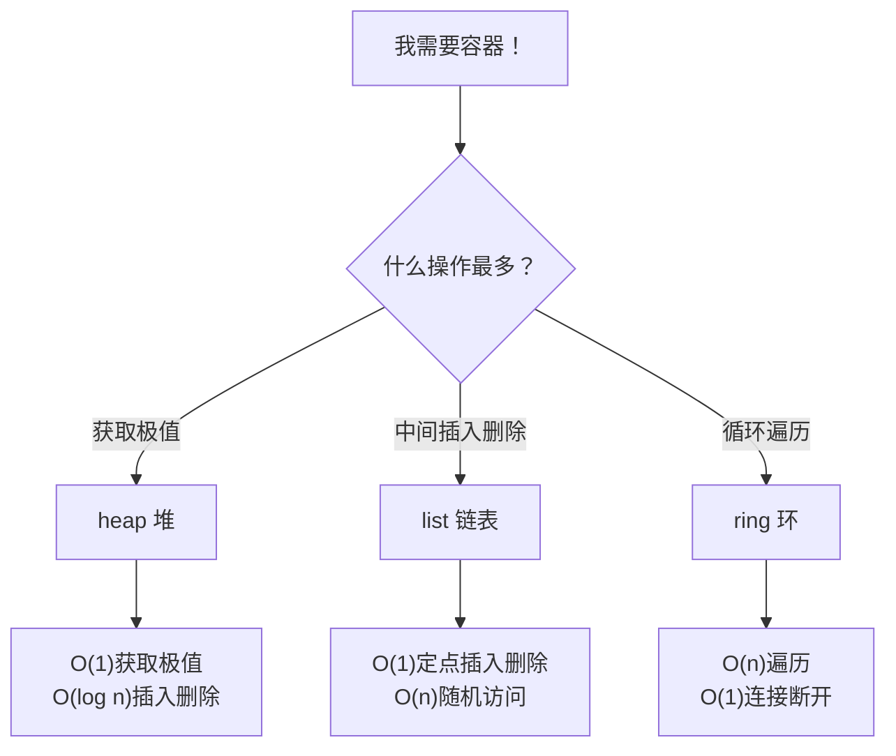

+++
title = "第5章：放数据的容器——container/heap、container/list、container/ring"
weight = 50
date = "2026-03-30T13:43:00+08:00"
type = "docs"
description = ""
isCJKLanguage = true
draft = false
+++
# 第5章：放数据的容器——container/heap、container/list、container/ring

> "人生苦短，何必用数组硬撑？来点容器，让数据住得舒服点。"

Go语言的`container`包是一个"数据结构博物馆"，里面住着三位性格迥异的居民：heap（堆）、list（双向链表）和ring（环形链表）。它们各有绝活，各有脾气，今天我们就来一一拜访。

---

## 5.1 container包解决什么问题

### 5.1.1 切片和映射不够用时

你可能会问："切片不是万能的吗？append、index、range，要啥有啥！"

确实，切片是Go语言的无名英雄，99%的情况下你只需要它。但有时候，切片也会力不从心：

- **需要按优先级处理数据？** 切片只能傻傻地遍历，时间复杂度O(n)
- **需要频繁在中间插入/删除？** 切片每次操作都要挪动一大波元素，烦死
- **需要知道谁是"老大"（最大或最小）？** 切片得先排序，麻烦

这时候，`container`包里的三位选手就闪亮登场了。

### 5.1.2 heap 实现优先级队列，list 实现频繁中间操作的链表

| 需求 | 推荐数据结构 | 原因 |
|------|-------------|------|
| 每次取最大/最小 | `heap` | O(1)获取堆顶，O(log n)插入删除 |
| 频繁中间插入删除 | `list` | O(1)定点操作，不用挪元素 |
| 循环遍历/缓存 | `ring` | 首尾相连，天生闭环 |

---

## 5.2 container核心原理

### 5.2.1 heap 是完全二叉树的数组实现，list 是双向链表，ring 是环形链表

想象一下三种户型：

```text
heap（完全二叉树，住在数组里）
        ┌───┐
        │ 1 │  ← 堆顶，最小或最大
      ┌─┴───┴─┐
      │ 2     │3
    ┌─┴─┐   ┌─┴─┐
    │4  │5  │6  │7
    └───┘   └───┘
    想象成一棵倒栽的树，但元素住在连续的数组里

list（双向链表，各住各的，通过指针串门）
    ┌───┐    ┌───┐    ┌───┐    ┌───┐
    │ A │←──→│ B │←──→│ C │←──→│ D │
    └───┘    └───┘    └───┘    └───┘
    每人一个窝，通过"前门""后门"串门

ring（环形链表，首尾相连的圆桌）
        ┌───┐
      ┌─┤ A ├──┐
      │ └───┘  │
    ┌─┴─┐    ┌─┴─┐
    │ D │←──→│ B │
    └───┘    └───┘
      ↑_______│
        ┌───┐
        │ C │
        └───┘
    围成一圈，没有起点也没有终点
```

### 5.2.2 三种数据结构应对三种不同的性能需求



**性能总结：**

| 操作 | heap | list | ring |
|------|------|------|------|
| 获取极值 | O(1) | O(n) | O(n) |
| 插入（首） | O(log n) | O(1) | O(1) |
| 插入（尾） | O(log n) | O(1) | O(1) |
| 中间插入 | O(log n) | O(1) | O(n) |
| 删除（首） | O(log n) | O(1) | O(1) |
| 删除（尾） | O(log n) | O(1) | O(1) |
| 随机访问 | O(n) | O(n) | O(n) |

---

## 5.3 container/heap 核心原理

### 5.3.1 完全二叉树的数组实现

heap的精髓在于：它用数组"装"了一棵树！这棵树必须满足：**每个节点的父节点都比它小（最小堆）或大（最大堆）**。

这就是著名的**堆属性**。

### 5.3.2 父节点索引 = (i-1)/2，子节点 = 2i+1 和 2i+2

这是heap的灵魂公式，背下来考试能加分：

```text
数组索引对应关系（假设索引从0开始）：

        i=0
       ┌───┐
       │ 1 │  ← 根节点
     ┌─┴───┴─┐
     │ i=1   │i=2
   ┌─┴───┐ ┌─┴───┐
   │ i=3 ││ i=4 ││ i=5 ││ i=6 │...
   └─────┘└─────┘└─────┘└─────┘

公式：
- 父节点索引 = (i - 1) / 2
- 左子节点 = 2 * i + 1
- 右子节点 = 2 * i + 2

验证一下：
- i=3 的父节点 = (3-1)/2 = 1 ✓
- i=1 的左子节点 = 2*1+1 = 3 ✓
- i=1 的右子节点 = 2*1+2 = 4 ✓
```

> **专业词汇解释**
> - **完全二叉树**：除了最后一层，其他层都是满的，而且最后一层的节点都靠左
> - **堆（Heap）**：满足堆属性的完全二叉树
> - ** sift-up（上浮）**：当插入新元素时，把它往上挪直到满足堆属性
> - ** sift-down（下沉）**：当删除堆顶时，把最后一个元素放堆顶，然后往下挪直到满足堆属性

---

## 5.4 heap.Interface 五个方法

Go的heap包设计得很优雅——它不强迫你用特定的类型，只需要你实现一个接口：

### 5.4.1 Len() 

返回堆中元素的数量，简单粗暴。

```go
// 长度方法，返回切片长度即可
func (h IntHeap) Len() int {
    return len(h)
}
```

### 5.4.2 Less(i, j)

比较两个元素，决定谁在上面。**这是最小堆和最大堆的分界线！**

```go
// 最小堆：a[i] < a[j] 表示 i 应该比 j 更上面
func (h IntHeap) Less(i, j int) bool {
    return h[i] < h[j]  // 数字越小越"小"，放上面
}

// 如果写成 h[i] > h[j]，就是最大堆了
```

### 5.4.3 Swap(i, j)

交换两个位置的元素。

```go
// 交换两个位置的元素
func (h IntHeap) Swap(i, j int) {
    h[i], h[j] = h[j], h[i]
}
```

### 5.4.4 Push(x)

把元素 x 推入堆中。注意！这个方法接收的是 `*list`，要往里面 append 元素。

```go
// 推入元素，x 是 interface{}，要往 h 里追加
func (h *IntHeap) Push(x any) {
    *h = append(*h, x.(int))  // 类型断言 + append
}
```

### 5.4.5 Pop()

弹出堆顶元素并返回。同样是 `*list`，要用切片操作弹出最后一个。

```go
// 弹出堆顶元素，返回的是 interface{}
func (h *IntHeap) Pop() any {
    n := len(*h)
    x := (*h)[n-1]           // 取出最后一个
    *h = (*h)[:n-1]          // 截断
    return x
}
```

### 5.4.6 实现这五个就能用 heap 包

完整示例：

```go
package main

import (
    "container/heap"
    "fmt"
)

// 定义一个整数堆类型（最小堆）
type IntHeap []int

// 返回堆中元素数量
func (h IntHeap) Len() int { return len(h) }

// 比较方法：最小堆用 < 号
func (h IntHeap) Less(i, j int) bool { return h[i] < h[j] }

// 交换方法
func (h IntHeap) Swap(i, j int) { h[i], h[j] = h[j], h[i] }

// Push 添加元素（注意接收者是 *IntHeap）
func (h *IntHeap) Push(x any) {
    *h = append(*h, x.(int))
}

// Pop 弹出堆顶（注意接收者是 *IntHeap）
func (h *IntHeap) Pop() any {
    n := len(*h)
    x := (*h)[n-1]
    *h = (*h)[:n-1]
    return x
}

func main() {
    h := &IntHeap{2, 1, 5, 3, 4}  // 创建并初始化
    heap.Init(h)                  // 初始化堆

    fmt.Println("堆内容（验证是否有序）:", *h)  // [1 2 5 3 4]

    heap.Push(h, 0)               // 推入新元素
    fmt.Println("Push(0) 后:", *h) // [0 2 1 3 4 5]

    fmt.Println("堆顶:", heap.Pop(h)) // 0（最小值）
    fmt.Println("Pop 后:", *h)        // [1 2 5 3 4]
}
```

> 注意：Push 和 Pop 的接收者必须是指针类型 `*IntHeap`，因为它们要修改切片本身。

---

## 5.5 heap.Init

### 5.5.1 初始化一个堆

`heap.Init` 把一个无序的切片变成一个合格的堆。它会原地调整，时间复杂度 O(n)。

```go
func main() {
    h := &IntHeap{9, 3, 7, 1, 5, 2, 8, 6, 4}
    // 现在切片里的顺序是乱的，不满足堆属性

    fmt.Println("Init 前:", *h) // [9 3 7 1 5 2 8 6 4]

    heap.Init(h) // 一行搞定！

    fmt.Println("Init 后:", *h) // [1 3 2 3 5 9 8 6 4] 实际上不是严格排序，但满足堆属性
}
```

### 5.5.2 调用一次即可，把任意顺序的切片变成堆

**重点**：`heap.Init` 只会调用一次，之后维护堆属性就靠 Push 和 Pop 了。不要没事就 Init 一下，那是脱了裤子放屁——多此一举。

```go
// 典型使用流程
h := &IntHeap{3, 1, 4, 1, 5, 9, 2, 6}  // 1. 随便扔进去
heap.Init(h)                            // 2. Init 一次，变成真堆
heap.Push(h, 0)                         // 3. 之后的操作会自动维护堆属性
heap.Pop(h)                             // 4. Pop 也一样
```

---

## 5.6 heap.Push

### 5.6.1 添加元素

`heap.Push` 把元素加到堆末尾，然后执行 **sift-up**（上浮）调整。

### 5.6.2 添加到末尾后可能需要上浮（sift-up）调整

"上浮"就像气泡往上冒：新元素比它爸小（最小堆），就往上挪；挪到正确位置为止。

```go
package main

import (
    "container/heap"
    "fmt"
)

type IntHeap []int

func (h IntHeap) Len() int            { return len(h) }
func (h IntHeap) Less(i, j int) bool  { return h[i] < h[j] }
func (h IntHeap) Swap(i, j int)       { h[i], h[j] = h[j], h[i] }
func (h *IntHeap) Push(x any)         { *h = append(*h, x.(int)) }
func (h *IntHeap) Pop() any           { n := len(*h); x := (*h)[n-1]; *h = (*h)[:n-1]; return x }

func main() {
    h := &IntHeap{2, 1, 3}
    heap.Init(h)

    fmt.Println("Push 前:", *h)       // [2 1 3]
    heap.Push(h, 0)                   // 推入一个很小的值

    fmt.Println("Push(0) 后:", *h)    // [0 1 2 3] - 0 浮到了堆顶！
    fmt.Println("堆顶是:", (*h)[0])   // 0
}
```

**原理解释：**

```text
Push(0) 前的堆（最小堆）：
        1
      ┌─┴─┐
      2   3

Push(0) 后，先把 0 放末尾：
        1
      ┌─┴─┐
      2   3
      ↑
      0（新人，刚来就被发现比爸小）

sift-up：0 和 1 换位置：
        0
      ┌─┴─┐
      2   1
          │
          3

完成！堆属性恢复。
```

---

## 5.7 heap.Pop

### 5.7.1 弹出堆顶

`heap.Pop` 弹出堆顶元素（最小堆弹出最小值，最大堆弹出最大值）。

### 5.7.2 用最后一个元素替换堆顶后下沉（sift-down）调整

Pop 的骚操作：把堆顶和最后一个元素换位置，然后删掉最后一个（返回），再把新的堆顶 sift-down 下去。

```go
package main

import (
    "container/heap"
    "fmt"
)

type IntHeap []int

func (h IntHeap) Len() int            { return len(h) }
func (h IntHeap) Less(i, j int) bool  { return h[i] < h[j] }
func (h IntHeap) Swap(i, j int)       { h[i], h[j] = h[j], h[i] }
func (h *IntHeap) Push(x any)         { *h = append(*h, x.(int)) }
func (h *IntHeap) Pop() any           { n := len(*h); x := (*h)[n-1]; *h = (*h)[:n-1]; return x }

func main() {
    h := &IntHeap{1, 2, 3, 4, 5}
    heap.Init(h)

    fmt.Println("Pop 前:", *h)        // [1 2 3 4 5]

    top := heap.Pop(h)                // 弹出堆顶
    fmt.Printf("弹出了: %d\n", top)   // 1
    fmt.Println("Pop 后:", *h)        // [2 5 3 4]
}
```

**原理解释：**

```text
Pop 前的堆（最小堆）：
        1  ← 堆顶，要弹出去
      ┌─┴─┐
      2   3
    ┌─┴─┐
    4   5

Step 1: 堆顶和最后一个换位置：
        5
      ┌─┴─┐
      2   3
    ┌─┴─┐
    4   1  ← 这是要返回的

Step 2: sift-down 调整 5：
        2
      ┌─┴─┐
      4   3
      │
      5

Step 3: 删掉 1，返回 1

最终堆：[2, 4, 3, 5]
```

---

## 5.8 heap.Fix

### 5.8.1 在修改某个位置的元素后修复堆

有时候你直接改了堆中间的元素（比如 `h[i] = xxx`），这时候堆属性可能就被破坏了。`heap.Fix` 来帮你修复。

### 5.8.2 比重新 Init 高效

`Fix(i)` 只从位置 i 开始调整，而 `Init` 要从半中间开始往上调整个堆。Fix 是 O(log n)，Init 是 O(n)。能用 Fix 就别用 Init。

```go
package main

import (
    "container/heap"
    "fmt"
)

type IntHeap []int

func (h IntHeap) Len() int            { return len(h) }
func (h IntHeap) Less(i, j int) bool  { return h[i] < h[j] }
func (h IntHeap) Swap(i, j int)       { h[i], h[j] = h[j], h[i] }
func (h *IntHeap) Push(x any)         { *h = append(*h, x.(int)) }
func (h *IntHeap) Pop() any           { n := len(*h); x := (*h)[n-1]; *h = (*h)[:n-1]; return x }

func main() {
    h := &IntHeap{1, 2, 3, 4, 5}
    heap.Init(h)

    fmt.Println("修改前:", *h)        // [1 2 3 4 5]

    // 直接修改索引 2 的元素（改成很大的值）
    (*h)[2] = 100

    fmt.Println("直接改后:", *h)      // [1 2 100 4 5] - 堆属性可能已破坏

    heap.Fix(h, 2)                    // 只修复位置 2

    fmt.Println("Fix 后:", *h)        // 重新满足堆属性
}
```

**什么时候用 Fix：**
- 直接用索引改了某个位置的元素
- 删除或增加元素后，手动维护

**什么时候用 Init：**
- 整个切片乱了，需要重建
- 第一次把切片变成堆

---

## 5.9 最小堆 vs 最大堆

### 5.9.1 Less 方法决定

最小堆和最大堆的区别就一行代码：

```go
// 最小堆：父节点 <= 子节点
func (h IntHeap) Less(i, j int) bool {
    return h[i] < h[j]  // 小的往上来
}

// 最大堆：父节点 >= 子节点
func (h IntHeap) Less(i, j int) bool {
    return h[i] > h[j]  // 大的往上来
}
```

### 5.9.2 Less(i,j) = a[i] < a[j] 是最小堆，Less(i,j) = a[i] > a[j] 是最大堆

```go
package main

import (
    "container/heap"
    "fmt"
)

// 最小堆
type MinHeap []int
func (h MinHeap) Len() int            { return len(h) }
func (h MinHeap) Less(i, j int) bool  { return h[i] < h[j] }  // 最小堆
func (h MinHeap) Swap(i, j int)       { h[i], h[j] = h[j], h[i] }
func (h *MinHeap) Push(x any)         { *h = append(*h, x.(int)) }
func (h *MinHeap) Pop() any           { n := len(*h); x := (*h)[n-1]; *h = (*h)[:n-1]; return x }

// 最大堆
type MaxHeap []int
func (h MaxHeap) Len() int            { return len(h) }
func (h MaxHeap) Less(i, j int) bool  { return h[i] > h[j] }  // 最大堆！反过来
func (h MaxHeap) Swap(i, j int)       { h[i], h[j] = h[j], h[i] }
func (h *MaxHeap) Push(x any)         { *h = append(*h, x.(int)) }
func (h *MaxHeap) Pop() any           { n := len(*h); x := (*h)[n-1]; *h = (*h)[:n-1]; return x }

func main() {
    min := &MinHeap{3, 1, 4, 1, 5, 9, 2, 6}
    max := &MaxHeap{3, 1, 4, 1, 5, 9, 2, 6}

    heap.Init(min)
    heap.Init(max)

    fmt.Println("最小堆，堆顶:", heap.Pop(min)) // 1
    fmt.Println("最大堆，堆顶:", heap.Pop(max)) // 9

    // 继续弹几个
    fmt.Println("最小堆再弹:", heap.Pop(min)) // 1
    fmt.Println("最大堆再弹:", heap.Pop(max)) // 6
}
```

---

## 5.10 heap 的应用场景

### 5.10.1 优先级队列

堆最经典的应用！医院挂号、飞机登机、操作系统的任务调度，都靠它。

```go
package main

import (
    "container/heap"
    "fmt"
)

// 任务结构体
type Task struct {
    priority int    // 优先级，数字越大优先级越高
    name     string // 任务名
}

// 任务堆（最大堆）
type TaskHeap []Task

func (h TaskHeap) Len() int            { return len(h) }
func (h TaskHeap) Less(i, j int) bool {
    return h[i].priority > h[j].priority  // 优先级高的在前面
}
func (h TaskHeap) Swap(i, j int)       { h[i], h[j] = h[j], h[i] }
func (h *TaskHeap) Push(x any)         { *h = append(*h, x.(Task)) }
func (h *TaskHeap) Pop() any           { n := len(*h); t := (*h)[n-1]; *h = (*h)[:n-1]; return t }

func main() {
    tasks := &TaskHeap{
        {3, "发送邮件"},
        {1, "清理缓存"},
        {5, "编译程序"},
        {2, "更新日志"},
    }

    heap.Init(tasks)

    fmt.Println("=== 优先级队列演示 ===")
    for tasks.Len() > 0 {
        task := heap.Pop(tasks).(Task)
        fmt.Printf("执行任务: %s (优先级: %d)\n", task.name, task.priority)
    }
}

// 执行结果:
// 执行任务: 编译程序 (优先级: 5)
// 执行任务: 发送邮件 (优先级: 3)
// 执行任务: 更新日志 (优先级: 2)
// 执行任务: 清理缓存 (优先级: 1)
```

### 5.10.2 Top-K 问题

找海量数据中的前K大（或前K小）元素，堆是标准解法。

```go
package main

import (
    "container/heap"
    "fmt"
)

// 最小堆，用于找前K大的数
type TopKHeap []int

func (h TopKHeap) Len() int            { return len(h) }
func (h TopKHeap) Less(i, j int) bool  { return h[i] < h[j] }  // 最小堆
func (h TopKHeap) Swap(i, j int)       { h[i], h[j] = h[j], h[i] }
func (h *TopKHeap) Push(x any)         { *h = append(*h, x.(int)) }
func (h *TopKHeap) Pop() any           { n := len(*h); x := (*h)[n-1]; *h = (*h)[:n-1]; return x }

// 找出数组中前K大的元素
func topK(arr []int, k int) []int {
    if k >= len(arr) {
        // 如果K大于等于数组长度，直接排序返回
        h := TopKHeap(arr)
        heap.Init(&h)
        result := make([]int, 0, k)
        for h.Len() > 0 {
            result = append(result, heap.Pop(&h).(int))
        }
        return result
    }

    // 前K个元素建堆（最小堆）
    h := TopKHeap(arr[:k])
    heap.Init(&h)

    // 剩余元素，如果比堆顶大就替换
    for i := k; i < len(arr); i++ {
        if arr[i] > (*h)[0] {
            heap.Pop(h)           // 弹掉最小的
            heap.Push(h, arr[i])  // 推入新元素
        }
    }

    return []int(*h)
}

func main() {
    data := []int{1, 23, 12, 9, 30, 2, 50, 100, 45, 20, 78, 90, 34, 56, 78, 90}

    top3 := topK(data, 3)
    fmt.Println("前3大的数:", top3)  // [90, 100, 78] 类似这样的结果

    top5 := topK(data, 5)
    fmt.Println("前5大的数:", top5)  // 类似
}
```

**Top-K 复杂度分析：**
- 如果 K 很小：O(n log K)，比排序 O(n log n) 快
- 适合处理数据量很大、无法全部加载到内存的场景

### 5.10.3 最小生成树

Prim算法的核心就是用堆来选择当前权值最小的边。

```go
package main

import (
    "container/heap"
    "fmt"
)

// 边结构体
type Edge struct {
    to      int     // 目标顶点
    weight  int     // 权重
}

// 带权无向图（邻接表）
type Graph struct {
    vertices int
    edges    [][]Edge
}

// Prim 算法求最小生成树
func (g *Graph) Prim() int {
    n := g.vertices
    inMST := make([]bool, n)
    mstWeight := 0
    edgeCount := 0

    // 边的最小堆（权值小的先出）
    type WeightedEdge struct {
        weight int
        to     int
    }
    edgeHeap := &MinEdgeHeap{}

    // 从顶点0开始
    inMST[0] = true
    for _, e := range g.edges[0] {
        heap.Push(edgeHeap, WeightedEdge{e.weight, e.to})
    }

    for edgeHeap.Len() > 0 && edgeCount < n-1 {
        minEdge := heap.Pop(edgeHeap).(WeightedEdge)
        to := minEdge.to

        if inMST[to] {
            continue // 已经在MST中了
        }

        // 把这条边加入MST
        inMST[to] = true
        mstWeight += minEdge.weight
        edgeCount++

        // 把新顶点出发的边加入堆
        for _, e := range g.edges[to] {
            if !inMST[e.to] {
                heap.Push(edgeHeap, WeightedEdge{e.weight, e.to})
            }
        }
    }

    return mstWeight
}

// 辅助：边的最小堆
type WeightedEdgeInternal struct {
    weight int
    to     int
}
type MinEdgeHeap []WeightedEdgeInternal

func (h MinEdgeHeap) Len() int            { return len(h) }
func (h MinEdgeHeap) Less(i, j int) bool  { return h[i].weight < h[j].weight }
func (h MinEdgeHeap) Swap(i, j int)       { h[i], h[j] = h[j], h[i] }
func (h *MinEdgeHeap) Push(x any)         { *h = append(*h, x.(WeightedEdgeInternal)) }
func (h *MinEdgeHeap) Pop() any           { n := len(*h); x := (*h)[n-1]; *h = (*h)[:n-1]; return x }

func main() {
    // 创建一个简单的图
    //     1
    //    /|\
    //   4 | 2
    //  /  |  \
    // 0---3---2
    //  5  6  7
    g := &Graph{
        vertices: 4,
        edges: [][]Edge{
            {{1, 4}, {3, 5}},           // 0: 到1权重4，到3权重5
            {{0, 4}, {2, 2}, {3, 1}},  // 1: 到0权重4，到2权重2，到3权重1
            {{1, 2}, {3, 7}},           // 2: 到1权重2，到3权重7
            {{0, 5}, {1, 1}, {2, 7}},   // 3: 到0权重5，到1权重1，到2权重7
        },
    }

    weight := g.Prim()
    fmt.Printf("最小生成树总权重: %d\n", weight) // 应该是 1+2+5=8 或类似结果
}
```

### 5.10.4 Dijkstra 算法

最短路径算法，用堆来高效选择当前距离最小的未处理顶点。

```go
package main

import (
    "container/heap"
    "fmt"
)

// 图和Dijkstra实现见上面的Prim算法
// Dijkstra和Prim的区别：Prim用边的权值选，Dijkstra用"从源点到当前点的距离"选
// 完整实现留给读者练手，这里展示核心思路

/*
Dijkstra 核心伪代码：

function Dijkstra(Graph, source):
    dist[source] = 0
    其他节点的 dist = 无穷大
    PQ = 最小堆，按 dist 排序

    while PQ 不为空:
        u = Pop(PQ)  // 取出当前距离最小的顶点

        for each neighbor v of u:
            alt = dist[u] + weight(u, v)
            if alt < dist[v]:
                dist[v] = alt
                Push(PQ, (v, alt))

    return dist
*/
```

> **堆在算法中的地位总结**
> - 优先级队列：堆的直接应用
> - Top-K：堆的变种
> - Prim/Dijkstra：用堆选择"当前最优"的边/顶点
> - 堆排序：堆的衍生算法

---

## 5.11 container/list 核心原理

### 5.11.1 双向链表

list 包实现了一个双向链表。每个节点都知道自己前面是谁、后面是谁。

```text
双向链表结构：
    ┌────┐    ┌────┐    ┌────┐    ┌────┐
    │ A  │←──→│ B  │←──→│ C  │←──→│ D  │
    └────┘    └────┘    └────┘    └────┘
      ↑                                        ↑
    head                                    tail
```

### 5.11.2 Element 是节点，List 是链表管理器，节点之间双向链接

Go 的 list 设计很有意思：

- `Element` 是节点，包含 `Value`（数据）、`Prev`（前驱）、`Next`（后继）
- `List` 是链表管理器，负责创建空链表、首尾操作等

```go
// Element 结构（内部实现，类似这样）
type Element struct {
    Next, Prev *Element  // 前驱和后继指针
    Value      interface{}  // 存储的值
}

// List 结构（内部实现，类似这样）
type List struct {
    root Element  // 哨兵节点，简化边界处理
    len  int      // 长度
}
```

> **专业词汇解释**
> - **哨兵节点（Sentinel）**：一个不存储数据的节点，用来简化边界处理。Go 的 list 在头部和尾部各有一个哨兵，它们互相指向对方。
> - **双向链接**：每个节点都知道自己的前一个和后一个是谁
> - **O(1) 插入删除**：只要拿到节点指针，插入和删除都是常数时间

---

## 5.12 list.New()

### 5.12.1 创建空链表

```go
l := list.New()
```

就这一行，简洁得像Go语言本身。

### 5.12.2 返回 *List，指针类型避免拷贝

**重要**：返回的是 `*List`，不是 `List`！为什么？因为 list 的增删改操作都是修改自身结构，如果拷贝一份，那修改的就是副本，原始链表纹丝不动。

```go
package main

import (
    "container/list"
    "fmt"
)

func main() {
    // 创建空链表
    l := list.New()

    fmt.Println("新链表长度:", l.Len()) // 0
    fmt.Println("是否为空:", l.Len() == 0) // true

    // 注意：返回的是指针类型
    fmt.Printf("类型: %T\n", l) // *list.List
}
```

---

## 5.13 PushFront、PushBack

### 5.13.1 首尾插入

```go
// 在头部插入，返回新节点的指针
e1 := l.PushFront(1)

// 在尾部插入，返回新节点的指针
e2 := l.PushBack(2)
```

### 5.13.2 返回新节点的指针

返回 `*Element`，你可以用它来做更多操作（比如在它前面或后面插入）。

```go
package main

import (
    "container/list"
    "fmt"
)

func main() {
    l := list.New()

    // 尾插法创建链表：1 -> 2 -> 3
    e1 := l.PushBack(1)  // 返回节点指针
    l.PushBack(2)
    l.PushBack(3)

    // 头插法插入 0：0 -> 1 -> 2 -> 3
    l.PushFront(0)

    // 在某个节点前面插入
    l.PushBefore(e1, "before 1")

    // 遍历打印
    for e := l.Front(); e != nil; e = e.Next() {
        fmt.Print(e.Value, " ")
    }
    fmt.Println()
    // 输出: 0 before 1 1 2 3
}
```

---

## 5.14 InsertBefore、InsertAfter

### 5.14.1 定点插入

```go
// 在某个节点前面插入新节点
newE := l.InsertBefore(value, mark)

// 在某个节点后面插入新节点
newE := l.InsertAfter(value, mark)
```

### 5.14.2 在某个节点前后插入

```go
package main

import (
    "container/list"
    "fmt"
)

func main() {
    l := list.New()

    // 创建链表：a -> b -> c
    eA := l.PushBack("a")
    eB := l.PushBack("b")
    eC := l.PushBack("c")

    fmt.Println("原链表:")
    printList(l)  // a b c

    // 在 b 前面插入 x
    l.InsertBefore("x", eB)
    fmt.Println("在 b 前插入 x:")
    printList(l)  // a x b c

    // 在 b 后面插入 y
    l.InsertAfter("y", eB)
    fmt.Println("在 b 后插入 y:")
    printList(l)  // a x b y c
}

func printList(l *list.List) {
    for e := l.Front(); e != nil; e = e.Next() {
        fmt.Print(e.Value, " ")
    }
    fmt.Println()
}
```

---

## 5.15 Remove

### 5.15.1 移除元素

```go
// 移除节点 e，返回 e 的值
value := l.Remove(e)
```

### 5.15.2 返回元素的值（interface{}）

```go
package main

import (
    "container/list"
    "fmt"
)

func main() {
    l := list.New()
    e1 := l.PushBack(1)
    e2 := l.PushBack(2)
    e3 := l.PushBack(3)

    fmt.Println("删除前:")
    printList(l)  // 1 2 3

    // 移除中间节点
    removed := l.Remove(e2)
    fmt.Printf("删除了: %v\n", removed) // 2

    fmt.Println("删除后:")
    printList(l)  // 1 3

    // e2 现在已经无效了，不要再使用
}
```

> **注意**：`Remove` 会将 `Element` 从链表中摘除，但不会帮你释放任何资源。如果你有引用计数之类的需要手动处理。

---

## 5.16 MoveToFront、MoveToFront

### 5.16.1 移动元素

```go
// 把节点 e 移动到链表头部
l.MoveToFront(e)

// 把节点 e 移动到链表尾部
l.MoveToBack(e)
```

### 5.16.2 改变顺序但不改变内容

```go
package main

import (
    "container/list"
    "fmt"
)

func main() {
    l := list.New()
    e1 := l.PushBack(1)
    e2 := l.PushBack(2)
    e3 := l.PushBack(3)

    fmt.Println("初始:", toSlice(l))  // [1 2 3]

    // 把 e3（值为3）移到最前面
    l.MoveToFront(e3)
    fmt.Println("MoveToFront(e3):", toSlice(l))  // [3 1 2]

    // 把 e1（值为1）移到最后
    l.MoveToBack(e1)
    fmt.Println("MoveToBack(e1):", toSlice(l))  // [3 2 1]

    // 再把 e2 移到最前面
    l.MoveToFront(e2)
    fmt.Println("MoveToFront(e2):", toSlice(l))  // [2 3 1]
}

func toSlice(l *list.List) []int {
    result := make([]int, 0, l.Len())
    for e := l.Front(); e != nil; e = e.Next() {
        result = append(result, e.Value.(int))
    }
    return result
}
```

---

## 5.17 Front、Back

### 5.17.1 获取首尾节点

```go
// 获取头节点，没有返回 nil
head := l.Front()

// 获取尾节点，没有返回 nil
tail := l.Back()
```

### 5.17.2 返回 *Element

```go
package main

import (
    "container/list"
    "fmt"
)

func main() {
    l := list.New()
    l.PushBack(1)
    l.PushBack(2)
    l.PushBack(3)

    head := l.Front()
    tail := l.Back()

    fmt.Println("头节点值:", head.Value)  // 1
    fmt.Println("尾节点值:", tail.Value)   // 3

    // 空链表
    empty := list.New()
    fmt.Println("空链表 Front:", empty.Front())  // nil
    fmt.Println("空链表 Back:", empty.Back())   // nil
}
```

---

## 5.18 遍历链表

### 5.18.1 for e := l.Front(); e != nil; e = e.Next()

这是链表的"标准遍历姿势"，比 `range` 更快更安全。

### 5.18.2 典型遍历方式

```go
package main

import (
    "container/list"
    "fmt"
)

func main() {
    l := list.New()
    for i := 1; i <= 5; i++ {
        l.PushBack(i)
    }

    // 方式1：传统 for 循环（推荐）
    fmt.Println("正向遍历:")
    for e := l.Front(); e != nil; e = e.Next() {
        fmt.Print(e.Value, " ")  // 1 2 3 4 5
    }
    fmt.Println()

    // 方式2：倒序遍历
    fmt.Println("逆向遍历:")
    for e := l.Back(); e != nil; e = e.Prev() {
        fmt.Print(e.Value, " ")  // 5 4 3 2 1
    }
    fmt.Println()
}
```

---

## 5.19 list vs 切片：频繁插入删除用链表，随机访问用切片，内存占用链表更高

| 特性 | list | 切片 |
|------|------|------|
| 随机访问 | O(n) | O(1) |
| 头部插入/删除 | O(1) | O(n) |
| 尾部插入/删除 | O(1) | O(1) amortized |
| 中间插入/删除（已知位置） | O(1) | O(n) |
| 内存占用 | 高（每节点多两个指针） | 低（连续内存） |
| 缓存友好性 | 差 | 好 |
| 适用场景 | 频繁中间操作 | 随机访问为主 |

```go
package main

import (
    "container/list"
    "fmt"
)

func main() {
    // list：中间插入 O(1)
    l := list.New()
    for i := 1; i <= 1000; i++ {
        l.PushBack(i)
    }
    // 在第500个位置插入，O(1) 拿到位置，然后 InsertBefore
    e := l.Front()
    for i := 0; i < 499; i++ {
        e = e.Next()
    }
    l.InsertBefore("插入的节点", e)  // O(1) 操作

    // 切片：同样的操作 O(n)
    s := make([]int, 1000)
    for i := 0; i < 1000; i++ {
        s[i] = i + 1
    }
    // 在第500个位置插入，后面的全要往后挪
    s = append(s[:500], append([]int{9999}, s[500:]...)...)
    // O(n) 操作

    fmt.Println("list 中间插入完成，长度:", l.Len())
    fmt.Println("切片中间插入完成，长度:", len(s))
}
```

---

## 5.20 container/ring 核心原理

### 5.20.1 环形链表

ring 是"首尾相连"的链表，链表最后一个节点的 Next 指向头节点，头节点的 Prev 指向尾节点。

```text
环形链表（没有起点，没有终点）：

    ┌──────────────────────────────┐
    │                              │
    ▼                              │
    ┌───┐    ┌───┐    ┌───┐    ┌───┐│
    │ A │←──→│ B │←──→│ C │←──→│ D ││
    └───┘    └───┘    └───┘    └───┘│
      ↑                              │
      │______________________________┘
```

### 5.20.2 首尾相连，没有起点也没有终点，ring.New(n) 创建 n 个节点的环

```go
// 创建一个有 n 个节点的环
r := ring.New(5)  // 5个节点，全部初始化为 nil

// 初始化节点的值
for i := 0; i < 5; i++ {
    r.Value = i
    r = r.Next()
}
```

---

## 5.21 ring.Next、ring.Prev

### 5.21.1 移动指针

```go
// 移动到下一个节点
next := r.Next()

// 移动到上一个节点
prev := r.Prev()
```

### 5.21.2 在环上移动到下一个或上一个节点

```go
package main

import (
    "fmt"
    "container/ring"
)

func main() {
    // 创建一个3节点的环
    r := ring.New(3)
    for i := 0; i < 3; i++ {
        r.Value = i
        r = r.Next()
    }

    // 从任意节点出发都能遍历整个环
    fmt.Println("从节点0开始:")
    for i := 0; i < 3; i++ {
        fmt.Print(r.Value, " ")  // 0 1 2
        r = r.Next()
    }

    fmt.Println("\n从节点1开始:")
    r = r.Next()  // 移动到节点1
    for i := 0; i < 3; i++ {
        fmt.Print(r.Value, " ")  // 1 2 0
        r = r.Next()
    }
}
```

---

## 5.22 ring.Do

### 5.22.1 遍历所有节点一次

`Do` 对环中的每个节点执行一次函数，从当前节点出发，绕一圈回来。

### 5.22.2 从当前节点出发，遍历一圈，对每个节点执行函数

```go
package main

import (
    "fmt"
    "container/ring"
)

func main() {
    r := ring.New(5)
    for i := 0; i < 5; i++ {
        r.Value = i + 1
        r = r.Next()
    }

    // 用 Do 遍历并打印每个节点
    fmt.Println("遍历环:")
    r.Do(func(v interface{}) {
        fmt.Print(v, " ")  // 1 2 3 4 5
    })
    fmt.Println()

    // 从任意节点开始 Do
    r = r.Next()  // 从第二个节点开始
    fmt.Println("从节点2开始 Do:")
    r.Do(func(v interface{}) {
        fmt.Print(v, " ")  // 2 3 4 5 1
    })
}
```

---

## 5.23 ring.Link、ring.Unlink

### 5.23.1 连接两个环

`Link` 把当前环和另一个环拼接起来，结果是一个更大的环。

### 5.23.2 断开环的一段

`Unlink` 从当前节点开始，摘除 n 个节点，形成一个新的环。

### 5.23.3 link 后第二个环被拼到第一个环后面

```go
package main

import (
    "fmt"
    "container/ring"
)

func main() {
    // 创建两个环
    r1 := ring.New(3)
    r2 := ring.New(3)

    // 给 r1 赋值 1, 2, 3
    for i := 0; i < 3; i++ {
        r1.Value = i + 1
        r1 = r1.Next()
    }

    // 给 r2 赋值 4, 5, 6
    for i := 0; i < 3; i++ {
        r2.Value = i + 4
        r2 = r2.Next()
    }

    fmt.Println("连接前:")
    fmt.Print("r1: ")
    r1.Do(func(v interface{}) { fmt.Print(v, " ") })  // 1 2 3
    fmt.Println()
    fmt.Print("r2: ")
    r2.Do(func(v interface{}) { fmt.Print(v, " ") })  // 4 5 6
    fmt.Println()

    // 把 r1 连接到 r2 后面
    r1.Link(r2)

    fmt.Println("r1.Link(r2) 后（r2 被拼到 r1 后面）:")
    fmt.Print("r1: ")
    r1.Do(func(v interface{}) { fmt.Print(v, " ") })  // 1 2 3 4 5 6
    fmt.Println()

    // Unlink：把 r1 中的 2 个节点摘除
    // 先重置 r1
    for i := 0; i < 3; i++ {
        r1 = r1.Next()
    }

    // 从当前位置 unlink 2 个节点
    removed := r1.Unlink(2)
    fmt.Println("Unlink(2) 移除的节点:")
    fmt.Print("removed: ")
    removed.Do(func(v interface{}) { fmt.Print(v, " ") })  // 应该是被摘除的部分
    fmt.Println()

    fmt.Println("Unlink 后 r1:")
    r1.Do(func(v interface{}) { fmt.Print(v, " ") })
}
```

---

## 5.24 ring.Len

### 5.24.1 返回环的节点数

```go
length := r.Len()
```

### 5.24.2 注意是 O(n) 操作，需要遍历一圈

这是 ring 唯一不太优雅的地方——`Len()` 是 O(n) 的，因为它要真的绕一圈数一遍。

```go
package main

import (
    "fmt"
    "container/ring"
)

func main() {
    r := ring.New(10)
    for i := 0; i < 10; i++ {
        r.Value = i
        r = r.Next()
    }

    fmt.Println("环的长度:", r.Len())  // 10

    // 注意：每次调用 Len 都会遍历整个环
    // 如果频繁查询长度，可能需要自己维护一个计数器
}
```

> **性能提示**：如果你的代码里频繁调用 `ring.Len()`，可以考虑用 `Do` 遍历时顺便计数一次，然后缓存结果。

---

## 5.25 ring 的应用场景

### 5.25.1 约瑟夫环

经典问题！n 个人围成一圈，从第 k 个人开始报数，数到 m 的人出列，然后从下一个人继续，直到全部出列。

```go
package main

import (
    "fmt"
    "container/ring"
)

// 约瑟夫问题：n 个人，数到 m 出列
func josephus(n, m int) []int {
    // 创建 n 个人的环
    r := ring.New(n)
    for i := 0; i < n; i++ {
        r.Value = i + 1
        r = r.Next()
    }

    result := make([]int, 0, n)

    // r 当前指向待报数的人
    // 循环直到环为空
    for r.Len() > 0 {
        // 数 m-1 下（因为当前算1）
        for i := 0; i < m-1; i++ {
            r = r.Next()
        }

        // 当前这个人要出列
        result = append(result, r.Value.(int))
        r = r.Next()  // 移动到下一个人（出列后，下一个变成当前位置）

        // 重要：必须先移动指针，再 Unlink
        // Unlink 会从当前节点摘除一个节点，但不影响当前指针
        removed := r.Prev()
        r.Unlink(1)  // 摘除前一个节点（即刚出列的）
        // 重新调整：Unlink 后 removed 已经不在环里了，r 自动前移
    }

    return result
}

func main() {
    // n=5, m=3：5个人围成一圈，从1开始报数，数到3出列
    order := josephus(5, 3)
    fmt.Println("出列顺序:", order)  // [3 1 5 2 4] 或类似
}
```

### 5.25.2 循环队列

用 ring 实现循环队列，可以高效地重复使用固定大小的缓冲区。

```go
package main

import (
    "fmt"
    "container/ring"
)

// 循环队列
type CircularQueue struct {
    r      *ring.Ring
    size   int
    count  int
}

// 创建指定容量的循环队列
func NewCircularQueue(size int) *CircularQueue {
    return &CircularQueue{
        r:     ring.New(size),
        size:  size,
        count: 0,
    }
}

// 入队
func (q *CircularQueue) Enqueue(v interface{}) bool {
    if q.count == q.size {
        return false  // 队列满了
    }
    q.r.Value = v
    q.r = q.r.Next()
    q.count++
    return true
}

// 出队
func (q *CircularQueue) Dequeue() (interface{}, bool) {
    if q.count == 0 {
        return nil, false  // 队列空了
    }
    // 要从队列头部取出，队列头部是当前节点的前一个
    head := q.r.Prev()
    v := head.Value
    head.Value = nil  // 清空
    q.count--
    return v, true
}

func main() {
    q := NewCircularQueue(5)

    // 入队
    for i := 1; i <= 5; i++ {
        q.Enqueue(i)
    }
    fmt.Println("队满后再入队:", q.Enqueue(6))  // false

    // 出队
    fmt.Println("出队:", q.Dequeue())  // 1
    fmt.Println("出队:", q.Dequeue())  // 2

    // 再入队
    q.Enqueue(6)
    q.Enqueue(7)

    // 继续出队
    for q.count > 0 {
        v, _ := q.Dequeue()
        fmt.Print(v, " ")  // 3 4 5 6 7
    }
}
```

### 5.25.3 LRU 缓存

Least Recently Used（最近最少使用）缓存淘汰策略，用 ring 实现可以让 recent 列表的移动是 O(1)。

```go
package main

import (
    "fmt"
    "container/ring"
)

// LRU 缓存
type LRUCache struct {
    capacity int
    data     map[string]*ring.Ring
    recent   *ring.Ring  // 指向最老的元素
}

// 创建指定容量的 LRU 缓存
func NewLRUCache(capacity int) *LRUCache {
    r := ring.New(capacity)
    for i := 0; i < capacity; i++ {
        r.Value = nil
        r = r.Next()
    }
    return &LRUCache{
        capacity: capacity,
        data:     make(map[string]*ring.Ring),
        recent:   r,
    }
}

// 获取值，顺便更新最近使用
func (c *LRUCache) Get(key string) (interface{}, bool) {
    if e, ok := c.data[key]; ok {
        // 已经存在，移到最前面
        c.recent = e
        return e.Value, true
    }
    return nil, false
}

// 设置值
func (c *LRUCache) Set(key string, value interface{}) {
    if e, ok := c.data[key]; ok {
        // 已存在，更新并移到前面
        e.Value = value
        c.recent = e
        return
    }

    // 新插入
    c.recent.Value = key
    c.data[key] = c.recent
    c.recent = c.recent.Next()
}

// 显示最近使用的顺序（排除空槽）
func (c *LRUCache) Show() {
    fmt.Print("最近使用顺序: ")
    c.recent.Do(func(v interface{}) {
        if v != nil {
            fmt.Print(v, " ")
        }
    })
    fmt.Println()
}

func main() {
    cache := NewLRUCache(3)

    cache.Set("a", 1)
    cache.Set("b", 2)
    cache.Set("c", 3)
    cache.Show()  // c b a 或类似顺序

    cache.Get("a")  // 访问 a
    cache.Show()  // a c b

    cache.Set("d", 4)  // 淘汰 b（最近最少使用）
    cache.Show()  // d a c
}
```

---

## 本章小结

这一章我们逛了 Go 语言 `container` 包的"数据结构博物馆"，认识了三位居民：

### heap（堆）
- **本质**：用数组实现的完全二叉树
- **特点**：O(1) 获取最大/最小值，O(log n) 插入删除
- **关键**：通过 `Less` 方法决定是最小堆还是最大堆
- **应用**：优先级队列、Top-K 问题、最短路径算法等

### list（双向链表）
- **本质**：节点之间通过指针双向链接
- **特点**：O(1) 定点插入删除，O(n) 随机访问
- **关键**：返回 `*Element`，可以用它做更多操作
- **应用**：需要频繁中间插入删除的场景

### ring（环形链表）
- **本质**：首尾相连的链表，没有起点也没有终点
- **特点**：O(1) 首尾操作和连接断开，O(n) 获取长度
- **关键**：`Len()` 是 O(n) 操作
- **应用**：约瑟夫环、循环队列、LRU 缓存

### 性能对比

| 操作 | heap | list | ring |
|------|------|------|------|
| 获取极值 | O(1) | O(n) | O(n) |
| 插入 | O(log n) | O(1) | O(1) |
| 删除 | O(log n) | O(1) | O(1) |
| 随机访问 | O(n) | O(n) | O(n) |
| 长度 | O(1) | O(1) | O(n) |

**选择建议**：
- 需要"总是能快速拿到最大/最小值"？用 heap
- 需要"频繁在中间插来插去"？用 list
- 需要"首尾相连的循环结构"？用 ring

> "没有最好的数据结构，只有最合适的数据结构。" —— 某位不想透露姓名的算法大师

下一章，我们将探索 Go 的同步原语——`sync` 包，看看 Go 是如何优雅地处理并发的。
