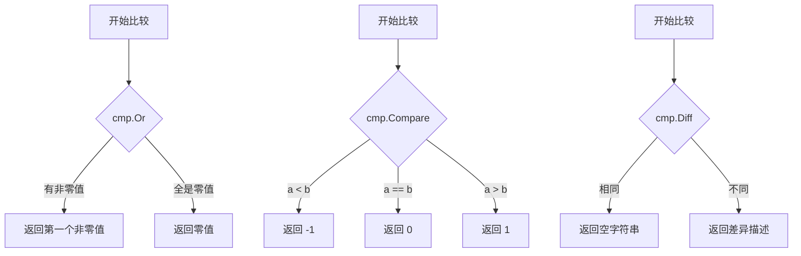

+++
title = "第6章：泛型时代的基础工具——cmp、maps、slices、sort、strconv"
weight = 60
date = "2026-03-30T13:43:00+08:00"
type = "docs"
description = ""
isCJKLanguage = true
draft = false
+++
# 第6章：泛型时代的基础工具——cmp、maps、slices、sort、strconv

话说 Go 语言在 1.18 引入泛型之后，终于告别了"泛型缺失"的尴尬年代。到了 Go 1.21，标准库一口气推出了 `cmp`、`maps`、`slices` 三个全新的泛型包，简直是给 Gopher 们送了一份大礼。在那之前，咱们写代码但凡要比较两个值、操作个 map、或者折腾一下切片，都得自己造轮子——重复的代码满天飞。现在好了，泛型一统江湖，这些工具函数终于可以优雅地复用啦！

本章我们就来聊聊这些泛型时代的基础工具，再加上两位老前辈——`sort` 和 `strconv`。它们各有分工：比较找 `cmp`、map 操作找 `maps`、切片操作找 `slices`、复杂排序找 `sort`、字符串数值互转找 `strconv`。一个都不能少！

---

## 6.1 cmp包解决什么问题

**Go 1.21+ 之前没有通用的比较函数，cmp 包填补了这个空白。**

在泛型出来之前，你想比较两个任意类型的值？门都没有！因为没有一种方式能让你写一个函数同时适用于 `int`、`string`、甚至是自定义结构体。你要么为每种类型写一个 `compareInts`、`compareStrings`，要么干脆用反射（`reflect.DeepEqual`），但反射慢得像蜗牛，还容易出错。

`cmp` 包的出现，就是为了优雅地解决这个问题。它利用泛型，让你一次编写，到处比较！

> **专业词汇解释**
> 
> - **泛型（Generic）**：一种编程范式，允许在函数或类型中使用"类型参数"，使其能处理多种类型而无需重复代码。在 Go 1.18 中引入。
> - **比较函数（Compare Function）**：一种接受两个值并返回比较结果的函数，通常返回 -1（小于）、0（等于）、1（大于）。

---

## 6.2 cmp核心原理

`cmp` 包虽然只有三个函数，但各个都是精兵强将：

### 6.2.1 cmp.Or（返回第一个非零参数）

`cmp.Or` 就像一个挑剔的选美评委，只认可"非零"的参赛者。它接受多个参数，从左到右扫描，返回第一个**非零值**（这里的"零值"用的是 `cmp.Or` 的零值判断，对于可比较类型，就是 `==` 判断为真的情况）。

### 6.2.2 cmp.Compare（三路比较返回 -1/0/1）

经典的**三路比较**（Three-way Comparison），返回一个 `int`：小于返回 `-1`，等于返回 `0`，大于返回 `1`。这和 C 里面的 `strcmp` 思想如出一辙。

### 6.2.3 cmp.Diff（比较差异描述）

这个函数是个找茬高手！它比较两个值，如果相同返回空字符串，如果不同则返回一个描述差异的字符串，简直是调试神器。

```go
package main

import (
	"fmt"
	"cmp"
)

func main() {
	// cmp.Or：返回第一个非零参数
	fmt.Println(cmp.Or(0, 5, 3))           // 输出: 5
	fmt.Println(cmp.Or("", "hello", "world")) // 输出: hello
	fmt.Println(cmp.Or(nil, "default"))    // 输出: default

	// cmp.Compare：三路比较
	fmt.Println(cmp.Compare(2, 3))        // 输出: -1
	fmt.Println(cmp.Compare(3, 3))        // 输出: 0
	fmt.Println(cmp.Compare(5, 3))        // 输出: 1
	fmt.Println(cmp.Compare("apple", "banana")) // 输出: -1

	// cmp.Diff：找茬专家
	fmt.Println(cmp.Diff(1, 1))           // 输出: (空)
	fmt.Println(cmp.Diff("hello", "world")) // 输出: hello -> world
	fmt.Println(cmp.Diff([]int{1, 2}, []int{1, 3})) // 输出: []int{1, 2} -> []int{1, 3}
}
```



---

## 6.3 cmp.Or

### 6.3.1 返回第一个非零参数

`cmp.Or` 的设计灵感来自 null 合并操作符（Nullish Coalescing，Go中没有直接对应）。在 Kotlin/TypeScript 中叫 nullish coalescing 操作符 `??`（Kotlin中也叫 elvis operator）。Go 的 `cmp.Or` 更通用，只要是**可比较类型**（comparable types）都能用！

### 6.3.2 类似 null 合并操作符??，但用于可比较类型

可比较类型包括：整数、浮点数、字符串、指针、channel、接口、数组（前提是元素可比较）、结构体（前提是每个字段可比较）。

```go
package main

import (
	"fmt"
	"cmp"
)

func main() {
	// 模拟配置优先级：命令行参数 > 环境变量 > 默认值
	argPort := ""
	envPort := "8080"
	defaultPort := "3000"

	port := cmp.Or(argPort, envPort, defaultPort)
	fmt.Println(port) // 输出: 8080

	// 各种类型都能用
	fmt.Println(cmp.Or(0, 42))           // int: 42
	fmt.Println(cmp.Or(0.0, 3.14))      // float64: 3.14
	fmt.Println(cmp.Or("", "fallback"))  // string: fallback

	// 不接受切片、map、函数（不可比较）
	// fmt.Println(cmp.Or([]int{1}, []int{2})) // 编译错误！
}
```

> **专业词汇解释**
> 
> - **可比较类型（Comparable Types）**：在 Go 中可以用 `==` 和 `!=` 比较的类型。切片、map、函数类型不可比较。
> - **零值（Zero Value）**：类型的默认值，如 `0`、`""`、`nil`。

---

## 6.4 cmp.Compare

### 6.4.1 返回 -1

当第一个参数小于第二个参数时，`cmp.Compare` 返回 `-1`。这在自定义排序逻辑中超级有用。

### 6.4.2 返回 0

当两个参数相等时，返回 `0`。相等性判断用的是 `==` 操作符的语义。

### 6.4.3 返回 1

当第一个参数大于第二个参数时，返回 `1`。

### 6.4.4 适合自定义比较逻辑

你可以用 `cmp.Compare` 的返回值来驱动自定义逻辑，比如自定义排序规则、多级排序（先按名字排，再按年龄排）等。

```go
package main

import (
	"fmt"
	"cmp"
	"sort"
)

func main() {
	// 基本用法
	fmt.Println(cmp.Compare(10, 20))    // 输出: -1
	fmt.Println(cmp.Compare(20, 20))   // 输出: 0
	fmt.Println(cmp.Compare(30, 20))    // 输出: 1

	// 字符串比较（字典序）
	fmt.Println(cmp.Compare("apple", "banana"))  // 输出: -1
	fmt.Println(cmp.Compare("cherry", "banana")) // 输出: 1

	// 自定义排序：按长度排序
	type Person struct {
		Name string
		Age  int
	}

	people := []Person{
		{"Alice", 30},
		{"Bob", 25},
		{"Charlie", 35},
	}

	// 按名字长度升序
	sort.Slice(people, func(i, j int) bool {
		return cmp.Compare(len(people[i].Name), len(people[j].Name)) < 0
	})
	fmt.Println(people) // 输出: [{Bob 25} {Alice 30} {Charlie 35}]

	// 多级排序：先按年龄，再按名字
	sort.Slice(people, func(i, j int) bool {
		if c := cmp.Compare(people[i].Age, people[j].Age); c != 0 {
			return c < 0
		}
		return people[i].Name < people[j].Name
	})
	fmt.Println(people) // 输出: [{Bob 25} {Alice 30} {Charlie 35}]
}
```

---

## 6.5 cmp.Diff

### 6.5.1 比较两个值，返回差异描述

`cmp.Diff` 是调试和测试的好帮手。当两个值不相等时，它会返回一个描述差异的字符串，告诉你"原来是什么变成了什么"。

### 6.5.2 清楚显示哪里不同

diff 输出的格式非常直观：`A -> B` 表示"从 A 变成 B"。对于嵌套结构，它会递归地展示差异路径。

```go
package main

import (
	"fmt"
	"cmp"
)

func main() {
	// 简单类型
	fmt.Println(cmp.Diff(1, 2))            // 输出: 1 -> 2
	fmt.Println(cmp.Diff("foo", "bar"))    // 输出: foo -> bar

	// 数组
	fmt.Println(cmp.Diff([...]int{1, 2, 3}, [...]int{1, 2, 4}))
	// 输出: [2] = 3 -> 4

	// 切片
	fmt.Println(cmp.Diff([]string{"a", "b"}, []string{"a", "c"}))
	// 输出: []string{"a", "b"} -> []string{"a", "c"}

	// 结构体
	type Point struct{ X, Y int }
	p1 := Point{X: 1, Y: 2}
	p2 := Point{X: 1, Y: 3}
	fmt.Println(cmp.Diff(p1, p2))
	// 输出: Point{X: 1, Y: 2} -> Point{X: 1, Y: 3} (Point.Y: 2 -> 3)

	// 相等时返回空
	fmt.Println(cmp.Diff("same", "same"))
	// 输出: (空)
}
```

---

## 6.6 maps包解决什么问题

**Go 1.21+ 之前操作 map 没有通用函数，maps 包填补了这个空白。**

map（哈希表）是 Go 中最常用的数据结构之一，但在那遥远的 Go 1.21 之前，你想复制一个 map？想比较两个 map 是否相等？想按条件删除一些键值对？抱歉，请自己写 for 循环！`maps` 包利用泛型，把这些常用操作一网打尽。

> **专业词汇解释**
> 
> - **map**：Go 中的哈希表实现，键值对的无序集合，键必须是可比较类型。
> - **哈希表（Hash Table）**：一种根据键直接访问值的数据结构，通过哈希函数将键映射到数组位置。

---

## 6.7 maps核心原理

`maps` 包是**泛型**的，对任何 `map[K]V` 都适用！无论是 `map[string]int` 还是 `map[int64]MyStruct`，统统能用。

这些函数接收 `map[K]V` 类型的参数，返回值也通常是 `map[K]V` 或相关类型。

> **专业词汇解释**
> 
> - **类型参数（Type Parameter）**：泛型函数或类型声明中使用的占位符，具体类型在调用时确定。
> - **类型约束（Type Constraint）**：限制类型参数必须满足的条件，如 `comparable`（可比较）或 `constraints.Ordered`（可排序）。

```go
package main

import (
	"fmt"
	"maps"
)

func main() {
	// maps 包对任何 map[K]V 都适用
	m1 := map[string]int{"a": 1, "b": 2}
	m2 := map[string]int{"c": 3, "d": 4}

	// Clone
	m1Clone := maps.Clone(m1)
	fmt.Println(m1Clone) // 输出: map[a:1 b:2]

	// Copy
	maps.Copy(m1, m2) // 把 m2 的键值对复制到 m1
	fmt.Println(m1)   // 输出: map[a:1 b:2 c:3 d:4]（m2 的键值被合并进来了）

	// DeleteFunc
	m3 := map[string]int{"apple": 5, "banana": 3, "cherry": 7}
	maps.DeleteFunc(m3, func(k string, v int) bool {
		return v < 4 // 删除值小于 4 的
	})
	fmt.Println(m3) // 输出: map[apple:5 cherry:7]

	// Equal
	m4 := map[int]int{1: 1, 2: 2}
	m5 := map[int]int{1: 1, 2: 2}
	m6 := map[int]int{1: 1, 2: 3}
	fmt.Println(maps.Equal(m4, m5)) // 输出: true
	fmt.Println(maps.Equal(m4, m6)) // 输出: false

	// EqualFunc
	fmt.Println(maps.EqualFunc(m4, m6, func(v1, v2 int) bool {
		return v1 == v2
	})) // 输出: false
}
```

---

## 6.8 maps.Clone

### 6.8.1 复制映射

`maps.Clone` 创建一个 map 的**浅拷贝**——所有键值对都被复制到新的 map 中，但值本身（如果是引用类型，引用关系保持不变）。

### 6.8.2 返回一个新的映射，键值都拷贝

返回的 map 和原 map 完全隔离，修改其中一个不会影响另一个。

```go
package main

import (
	"fmt"
	"maps"
)

func main() {
	original := map[string]int{"x": 1, "y": 2, "z": 3}
	cloned := maps.Clone(original)

	fmt.Println("原始 map:", original) // map[ x:1 y:2 z:3]
	fmt.Println("克隆 map:", cloned)  // map[x:1 y:2 z:3]

	// 修改克隆不影响原始
	cloned["w"] = 100
	delete(cloned, "x")

	fmt.Println("修改后原始:", original) // map[x:1 y:2 z:3]（不变）
	fmt.Println("修改后克隆:", cloned)  // map[w:100 y:2 z:3]

	// 验证是完全独立的
	fmt.Println(original["x"]) // 1（还在）
	fmt.Println(cloned["x"])   // 0（已删除）
}
```

---

## 6.9 maps.Copy

### 6.9.1 复制键值对

`maps.Copy` 把源 map（`src`）的键值对**复制**到目标 map（`dst`）。

### 6.9.2 把 src 的键值对复制到 dst，dst 已有的键会被覆盖

这是一个**就地修改**的操作，`dst` 会被直接修改。如果 `src` 中的某个键在 `dst` 中已存在，`dst` 中对应的值会被**覆盖**。

```go
package main

import (
	"fmt"
	"maps"
)

func main() {
	dst := map[string]int{"a": 1, "b": 2, "c": 3}
	src := map[string]int{"b": 20, "d": 40, "e": 50}

	fmt.Println("复制前 dst:", dst) // map[a:1 b:2 c:3]

	// 把 src 的键值对复制到 dst
	maps.Copy(dst, src)

	fmt.Println("复制后 dst:", dst) // map[a:1 b:20 c:3 d:40 e:50]
	// 注意：b 被覆盖成 20，c 保持不变，d 和 e 是新增的

	// src 不受影响
	fmt.Println("src 保持不变:", src) // map[b:20 d:40 e:50]
}
```

---

## 6.10 maps.DeleteFunc

### 6.10.1 按条件删除

`maps.DeleteFunc` 接受一个**谓词函数**，满足条件的键值对会被删除。

### 6.10.2 传入一个函数，满足条件的键值对被删除

这是一个高阶函数的应用——把"删除逻辑"作为函数传入，而不是写死循环里的 if 语句。代码更清晰，也更容易复用。

```go
package main

import (
	"fmt"
	"maps"
	"strings"
)

func main() {
	// 示例 1：删除值小于 3 的
	m1 := map[int]int{1: 1, 2: 2, 3: 3, 4: 4}
	maps.DeleteFunc(m1, func(k, v int) bool {
		return v < 3 // 删除值小于 3 的
	})
	fmt.Println("删除值 < 3 后:", m1) // map[3:3 4:4]

	// 示例 2：删除键以某个前缀开头的
	m2 := map[string]bool{
		"admin":   true,
		"user":    true,
		"admin_x": true,
		"guest":   true,
	}
	maps.DeleteFunc(m2, func(k string, v bool) bool {
		return strings.HasPrefix(k, "admin") // 删除 admin 开头的键
	})
	fmt.Println("删除 admin 开头后:", m2) // map[user:true guest:true]

	// 示例 3：复合条件
	m3 := map[string]int{"Alice": 30, "Bob": 25, "Charlie": 35, "Diana": 28}
	maps.DeleteFunc(m3, func(k string, v int) bool {
		return len(k) > 4 && v < 30 // 删除名字超过4个字符且年龄小于30的
	})
	fmt.Println("复合条件删除后:", m3) // map[Bob:25 Diana:28]（Alice 和 Charlie 被删除）
}
```

---

## 6.11 maps.Equal、maps.EqualFunc

### 6.11.1 比较两个映射

`maps.Equal` 和 `maps.EqualFunc` 用来比较两个 map 是否相等。

### 6.11.2 Equal 用 == 比较值，EqualFunc 用自定义函数比较

- `maps.Equal[M1, M2 any](M1, M2) bool`：使用 `==` 比较两个 map 的键值对是否完全相等（包括 nil 语义）。
- `maps.EqualFunc[M1 ~map[K]V1, M2 ~map[K]V2, K, V1, V2 any](M1, M2, func(V1, V2) bool) bool`：使用自定义比较函数比较值。

```go
package main

import (
	"fmt"
	"maps"
)

func main() {
	// Equal：使用 == 比较
	m1 := map[string]int{"a": 1, "b": 2}
	m2 := map[string]int{"a": 1, "b": 2}
	m3 := map[string]int{"a": 1, "b": 3}

	fmt.Println(maps.Equal(m1, m2)) // true（完全相等）
	fmt.Println(maps.Equal(m1, m3)) // false（b 的值不同）

	// nil map 比较
	var nilMap1 map[string]int
	var nilMap2 map[string]int
	fmt.Println(maps.Equal(nilMap1, nilMap2)) // true（两个 nil 相等）
	fmt.Println(maps.Equal(nilMap1, m1))       // false（nil 和非 nil 不等）

	// EqualFunc：自定义比较
	type Person struct {
		Name string
		Age  int
	}

	p1 := map[string]Person{"a": {"Alice", 30}, "b": {"Bob", 25}}
	p2 := map[string]Person{"a": {"Alice", 31}, "b": {"Bob", 25}}
	p3 := map[string]Person{"a": {"Charlie", 30}, "b": {"Bob", 25}}

	// 比较时忽略年龄，只比较名字
	fmt.Println(maps.EqualFunc(p1, p2, func(v1, v2 Person) bool {
		return v1.Name == v2.Name
	})) // true（名字都一样）

	fmt.Println(maps.EqualFunc(p1, p3, func(v1, v2 Person) bool {
		return v1.Name == v2.Name
	})) // false（"Alice" != "Charlie"）
}
```

---

## 6.12 slices包解决什么问题

### 6.12.1 切片是最常用的数据结构，slices 包提供了排序

切片（slice）是 Go 中最常用的数据结构，比数组更灵活，用得更广泛。在 Go 1.21 之前，排序、搜索、插入、删除这些操作要么自己写，要么用 `sort` 包（但 `sort` 包在泛型出来之前对这些操作支持得很别扭）。

### 6.12.2 搜索、插入、删除等操作

`slices` 包提供了**一站式**的切片操作函数，覆盖了你日常开发中 90% 的切片操作需求。

> **专业词汇解释**
> 
> - **切片（Slice）**：Go 中的动态数组，底层是数组的引用，但长度可以动态增长。
> - **原地操作（In-place）**：直接在原内存上修改，而不是创建新的数据结构。

---

## 6.13 slices核心原理

`slices` 包是**纯泛型**的，对任何 `[]E`（元素类型为 E 的切片）都适用！

### 6.13.1 slices.Sort

对切片进行**原地排序**（升序）。要求元素类型实现了 `comparable` 约束（能用 `==` 比较）。

### 6.13.2 slices.Search

在**已排序**的切片上进行二分查找，返回第一个**大于等于**目标值的位置。如果切片未排序，结果是未定义的！

### 6.13.3 slices.Contains

判断切片是否包含某个元素，用 `==` 比较。返回 `bool`。

### 6.13.4 slices.Insert

在指定位置**插入**元素，返回**新的切片**（注意：这是返回新切片，不是原地插入）。

### 6.13.5 slices.Delete

在指定位置**删除**元素，返回**新的切片**（同样是返回新切片）。

### 6.13.6 覆盖了大部分切片操作

```go
package main

import (
	"fmt"
	"slices"
)

func main() {
	nums := []int{5, 2, 8, 1, 9}

	// Sort：排序
	slices.Sort(nums)
	fmt.Println("排序后:", nums) // [1 2 5 8 9]

	// Search：二分查找（前提是已排序）
	pos := slices.Search(nums, 5)
	fmt.Println("找到 5 的位置:", pos) // 2（索引）

	pos = slices.Search(nums, 6)
	fmt.Println("6 应该插入的位置:", pos) // 3（介于 5 和 8 之间）

	// Contains：包含判断
	fmt.Println(slices.Contains(nums, 5))  // true
	fmt.Println(slices.Contains(nums, 100)) // false

	// Insert：插入（返回新的切片，原切片不变）
	original := []int{1, 2, 3, 4, 5}
	inserted := slices.Insert(original, 2, 99, 100) // 在索引 2 处插入
	fmt.Println("插入后:", inserted)  // [1 2 99 100 3 4 5]
	fmt.Println("原切片:", original)   // [1 2 3 4 5]（不变）

	// Delete：删除（返回新的切片）
	deleted := slices.Delete(original, 1, 3) // 删除索引 1-3（不含3）
	fmt.Println("删除后:", deleted)  // [1 4 5]
	fmt.Println("原切片:", original) // [1 2 3 4 5]（不变）
}
```

---

## 6.14 slices.Clone

### 6.14.1 克隆切片

`maps.Clone` 是复制 map，`slices.Clone` 则是复制切片。核心特点：**拷贝容器结构，并分配新的底层数组，将元素复制到新数组中**。如果是指针类型的元素，指针本身会被拷贝（但指向的对象不拷贝，这层意义上算"浅"）。

### 6.14.2 返回新的切片，底层数组独立

克隆后的切片拥有**独立的底层数组**（仅针对值类型元素，指针类型元素仍共享引用）。修改新切片的值类型元素不会影响原切片，反之亦然。

```go
package main

import (
	"fmt"
	"slices"
)

func main() {
	original := []int{1, 2, 3, 4, 5}
	cloned := slices.Clone(original)

	fmt.Println("原切片:", original) // [1 2 3 4 5]
	fmt.Println("克隆切片:", cloned)  // [1 2 3 4 5]

	// 修改克隆不影响原切片
	cloned[0] = 100
	cloned = append(cloned, 999)

	fmt.Println("修改后原切片:", original) // [1 2 3 4 5]（不变）
	fmt.Println("修改后克隆切片:", cloned)  // [100 2 3 4 5 999]

	// 验证底层数组是独立的
	fmt.Printf("original 底层数组: %p\n", original)
	fmt.Printf("cloned 底层数组: %p\n", cloned) // 地址不同！
}
```

---

## 6.15 slices.Sort、slices.SortFunc、slices.SortStable

### 6.15.1 排序

`slices.Sort` 是最简单的方式，直接对**可比较**类型的切片进行升序排序。

### 6.15.2 带自定义比较函数，Stable 保持相同元素相对顺序

- `slices.SortFunc`：自定义排序逻辑，比较函数返回 `true` 表示第一个参数应该排在第二个参数前面。
- `slices.SortStableFunc`：稳定排序，排序后**相同元素**的相对顺序保持不变（stable sort）。

> **专业词汇解释**
> 
> - **稳定排序（Stable Sort）**：相等元素的相对顺序在排序后保持不变的排序算法。`Sort` 不保证稳定性，`SortStable` 保证。
> - **原地排序（In-place Sort）**：不需要额外内存就能完成的排序。

```go
package main

import (
	"fmt"
	"slices"
)

func main() {
	// Sort：默认升序排序
	nums := []int{5, 2, 8, 1, 9, 3}
	slices.Sort(nums)
	fmt.Println("Sort 升序:", nums) // [1 2 3 5 8 9]

	// SortFunc：自定义排序
	type Person struct {
		Name string
		Age  int
	}

	people := []Person{
		{"Alice", 30},
		{"Bob", 25},
		{"Charlie", 30},
		{"Diana", 25},
	}

	// 按年龄降序排序
	slices.SortFunc(people, func(a, b Person) int {
		return slices.Compare(a.Age, b.Age) * -1 // 乘以 -1 实现降序
	})
	fmt.Println("按年龄降序:", people)
	// 输出: [{Bob 25} {Diana 25} {Alice 30} {Charlie 30}]

	// SortStableFunc：稳定排序
	names := []string{"Bob", "Alice", "Charlie", "Diana", "Eve"}
	// 按名字长度排序（长度相同保持原顺序）
	slices.SortStableFunc(names, func(a, b string) int {
		return slices.Compare(len(a), len(b))
	})
	fmt.Println("稳定排序（按名字长度）:", names)
	// 长度相同名字的相对顺序保持不变

	// 对比：Sort 不保证稳定性
	nums2 := []int{3, 1, 4, 1, 5, 9, 2, 6}
	slices.Sort(nums2)
	fmt.Println("Sort 不保证稳定性:", nums2)
}
```

---

## 6.16 slices.Search

### 6.16.1 在有序切片中二分查找

`slices.Search` 是 Go 语言的**二分查找**实现，时间复杂度 O(log n)。它假设切片已经**升序排列**。

### 6.16.2 返回插入位置，前提是切片已排序

返回值是**第一个大于等于目标值的位置**。如果切片中所有元素都小于目标，返回切片长度（即目标应该插入到末尾的位置）。

> **警告**：如果切片未排序，`Search` 的结果是不确定的！垃圾进，垃圾出。

```go
package main

import (
	"fmt"
	"slices"
)

func main() {
	// 已排序的切片
	sorted := []int{1, 3, 5, 7, 9, 11, 13, 15}

	// 查找存在的元素
	pos := slices.Search(sorted, 7)
	fmt.Println("找到 7 的位置:", pos) // 3

	// 查找不存在的元素
	pos = slices.Search(sorted, 6)
	fmt.Println("6 应该插入的位置:", pos) // 3（即 5 和 7 之间）

	pos = slices.Search(sorted, 100)
	fmt.Println("100 应该插入的位置:", pos) // 8（末尾）

	pos = slices.Search(sorted, 0)
	fmt.Println("0 应该插入的位置:", pos) // 0（最前面）

	// Search 的典型用法：查找并插入
	x := 8
	i := slices.Search(sorted, x)
	if i < len(sorted) && sorted[i] == x {
		fmt.Printf("找到 %d，位置是 %d\n", x, i)
	} else {
		fmt.Printf("未找到 %d，应该插入到位置 %d\n", x, i)
		// 插入操作
		sorted = slices.Insert(sorted, i, x)
		fmt.Println("插入后:", sorted)
	}
}
```

---

## 6.17 slices.Contains、slices.Index

### 6.17.1 查找元素

`slices.Contains` 和 `slices.Index` 都是查找函数，用于判断切片是否包含某个元素，或者找到元素的位置。

### 6.17.2 Contains 返回 bool，Index 返回位置（-1 表示不存在）

- `slices.Contains(slice, value) bool`：返回 `true` 如果找到，否则 `false`。
- `slices.Index(slice, value) int`：返回第一个匹配元素的索引，未找到返回 `-1`。

```go
package main

import (
	"fmt"
	"slices"
)

func main() {
	nums := []int{10, 20, 30, 40, 50, 60, 70}

	// Contains：返回 bool
	fmt.Println(slices.Contains(nums, 30))  // true
	fmt.Println(slices.Contains(nums, 35))  // false
	fmt.Println(slices.Contains([]string{"a", "b", "c"}, "b")) // true

	// Index：返回位置
	fmt.Println(slices.Index(nums, 30))  // 2
	fmt.Println(slices.Index(nums, 35))  // -1

	// 切片中包含重复元素的情况
	dupes := []int{1, 2, 3, 2, 4, 3, 5}
	fmt.Println(slices.Index(dupes, 2))  // 1（返回第一个匹配的位置）
	fmt.Println(slices.Index(dupes, 99)) // -1（不存在）

	// 自定义相等：配合 slices.IndexFunc 使用
	words := []string{"hello", "world", "go", "language"}
	fmt.Println(slices.Index(words, "Go")) // -1（大小写敏感）

	// 大小写不敏感查找
	idx := slices.IndexFunc(words, func(s string) bool {
		return len(s) == 2 && s[0] == 'g' || s[0] == 'G'
	})
	fmt.Println("长度2且g/G开头:", idx) // 2
}
```

---

## 6.18 slices.Delete、slices.DeleteFunc

### 6.18.1 删除元素

`slices.Delete` 和 `slices.DeleteFunc` 都用于删除元素，只是删除条件不同。

### 6.18.2 Delete 按索引删，DeleteFunc 按条件删

- `slices.Delete(slice, i, j) []E`：删除切片中索引 `[i, j)` 范围内的元素（不含 j），返回新的切片。
- `slices.DeleteFunc(slice, func(E) bool) []E`：删除满足谓词函数的元素，返回新的切片。

```go
package main

import (
	"fmt"
	"slices"
)

func main() {
	original := []int{1, 2, 3, 4, 5, 6, 7, 8, 9}

	// Delete：按索引删除
	// 删除索引 2 到 5（不含5），即删除元素 3, 4, 5
	deleted := slices.Delete(original, 2, 5)
	fmt.Println("Delete(2,5) 后:", deleted) // [1 2 6 7 8 9]
	fmt.Println("原切片不变:", original)      // [1 2 3 4 5 6 7 8 9]

	// DeleteFunc：按条件删除
	nums := []int{1, 2, 3, 4, 5, 6, 7, 8, 9}
	filtered := slices.DeleteFunc(nums, func(n int) bool {
		return n%2 == 0 // 删除偶数
	})
	fmt.Println("删除偶数后:", filtered) // [1 3 5 7 9]

	// 删除负数
	scores := []int{95, 78, 82, -1, 88, -999, 92}
	scores = slices.DeleteFunc(scores, func(s int) bool {
		return s < 0
	})
	fmt.Println("删除负分后:", scores) // [95 78 82 88 92]

	// 删除空字符串
	names := []string{"Alice", "", "Bob", "", "Charlie"}
	names = slices.DeleteFunc(names, func(s string) bool {
		return s == ""
	})
	fmt.Println("删除空字符串后:", names) // [Alice Bob Charlie]
}
```

---

## 6.19 slices.Insert

### 6.19.1 插入元素

`slices.Insert` 在指定位置**插入**一个或多个元素。

### 6.19.2 在指定位置插入，返回新的切片

注意！`Insert` **返回新的切片**，原切片保持不变。和 `Delete` 一样，都是**非原地**操作。

```go
package main

import (
	"fmt"
	"slices"
)

func main() {
	original := []int{1, 2, 3, 4, 5}

	// 在索引 0 处插入（即最前面）
	result := slices.Insert(original, 0, 100, 200)
	fmt.Println("在开头插入:", result) // [100 200 1 2 3 4 5]
	fmt.Println("原切片:", original)   // [1 2 3 4 5]（不变）

	// 在中间插入
	result = slices.Insert(original, 2, 999)
	fmt.Println("在索引2插入:", result) // [1 2 999 3 4 5]

	// 在末尾插入（索引等于长度）
	result = slices.Insert(original, len(original), 777)
	fmt.Println("在末尾插入:", result) // [1 2 3 4 5 777]

	// 一次插入多个元素
	result = slices.Insert(original, 1, 111, 222, 333)
	fmt.Println("一次插入多个:", result) // [1 111 222 333 2 3 4 5]

	// 插入字符串切片
	strs := []string{"a", "b", "c"}
	strs = slices.Insert(strs, 1, "x", "y")
	fmt.Println("字符串切片:", strs) // [a x y b c]
}
```

---

## 6.20 slices.Reverse

### 6.20.1 反转切片

`slices.Reverse` 将切片中的元素**完全倒序**。

### 6.20.2 全部元素倒序

这是一个**原地操作**，直接修改原切片，不需要返回新切片（但通常习惯接收返回值以保持接口一致性）。

```go
package main

import (
	"fmt"
	"slices"
)

func main() {
	// 反转整数切片
	nums := []int{1, 2, 3, 4, 5}
	fmt.Println("反转前:", nums) // [1 2 3 4 5]
	slices.Reverse(nums)
	fmt.Println("反转后:", nums) // [5 4 3 2 1]

	// 反转字符串切片
	words := []string{"hello", "world", "go"}
	slices.Reverse(words)
	fmt.Println("反转后:", words) // [go world hello]

	// 奇技淫巧：先排序再反转 = 降序排序
	nums2 := []int{5, 2, 8, 1, 9, 3}
	slices.Sort(nums2)
	slices.Reverse(nums2)
	fmt.Println("降序:", nums2) // [9 8 5 3 2 1]

	// 验证是原地操作
	arr := []int{1, 2, 3}
	ptr1 := &arr
	slices.Reverse(arr)
	ptr2 := &arr
	fmt.Printf("原地操作: %t（同一底层数组）\n", *ptr1 == *ptr2)
}
```

---

## 6.21 slices.Rotate

### 6.21.1 循环移位

`slices.Rotate` 对切片进行**循环移位**（circular shift）。

### 6.21.2 rotate k 位就是切掉前 k 个拼到后面

`Rotate(slice, k)` 的语义是：将切片左移 k 位，即把前 k 个元素移动到末尾。如果 k 是负数，则是右移。

```go
package main

import (
	"fmt"
	"slices"
)

func main() {
	// Rotate：循环移位
	// rotate 2 就是把前2个 [1, 2] 移动到末尾
	// 结果: [3, 4, 5, 1, 2]
	nums := []int{1, 2, 3, 4, 5}
	slices.Rotate(nums, 2)
	fmt.Println("左旋2位:", nums) // [3 4 5 1 2]

	// 再旋转 2 位，又回来了
	slices.Rotate(nums, 2)
	fmt.Println("再旋2位:", nums) // [1 2 3 4 5]

	// 旋转字符串切片
	words := []string{"a", "b", "c", "d", "e"}
	slices.Rotate(words, -1) // 右旋1位 = 把最后一个移到最前面
	fmt.Println("右旋1位:", words) // [e a b c d]

	// 典型应用：把某个元素移到开头
	data := []int{1, 2, 3, 4, 5}
	// 把索引 3 的元素（值为 4）旋转到开头
	slices.Rotate(data, 3)
	fmt.Println("元素4移到开头:", data) // [4 5 1 2 3]

	// 队列实现：新的来，旧的去
	queue := []string{"task1", "task2", "task3"}
	// 完成一个任务
	completed := queue[0]
	queue = queue[1:]
	fmt.Println("完成:", completed)
	// 新任务加入
	queue = append(queue, "task4")
	slices.Rotate(queue, -1) // 把新任务旋转到末尾，保持 FIFO
	fmt.Println("旋转后队列:", queue) // [task4 task1 task2 task3]... 等等，这个例子有点复杂
}
```

---

## 6.22 slices.Concat

### 6.22.1 拼接多个切片

`slices.Concat` 一次性拼接多个切片，返回一个**新的切片**。

### 6.22.2 一次性拼接，避免多次 append

以前拼接多个切片需要用 `append` 链式调用，或者 `copy` 循环。现在一个函数搞定！

```go
package main

import (
	"fmt"
	"slices"
)

func main() {
	// Concat：拼接多个切片
	part1 := []int{1, 2, 3}
	part2 := []int{4, 5, 6}
	part3 := []int{7, 8, 9}

	combined := slices.Concat(part1, part2, part3)
	fmt.Println("拼接结果:", combined) // [1 2 3 4 5 6 7 8 9]

	// 对比旧方式：多次 append
	oldWay := append(append(part1, part2...), part3...)
	fmt.Println("旧方式结果:", oldWay) // [1 2 3 4 5 6 7 8 9]

	// 拼接字符串切片
	greetings := slices.Concat([]string{"Hello"}, []string{"World"}, []string{"!"})
	fmt.Println("字符串拼接:", greetings) // [Hello World !]

	// Concat 返回新切片，原切片不受影响
	fmt.Println("原 part1:", part1) // [1 2 3]

	// 空切片处理
	empty := []int{}
	result := slices.Concat(part1, empty, part2)
	fmt.Println("含空切片的拼接:", result) // [1 2 3 4 5 6]

	// 零个切片的拼接
	zero := slices.Concat[int]()
	fmt.Println("零个切片:", zero, len(zero)) // [] 0
}
```

---

## 6.23 slices vs sort

**slices 更现代，sort 在 Go 1.21 之前是唯一选择。**

`slices` 包是 Go 1.21 引入的全新泛型包，而 `sort` 包从 Go 诞生之日起（2009 年）就是标准库的一部分。两者的关系不是"谁取代谁"，而是"各有所长"。

| 特性 | slices | sort |
|------|--------|------|
| 泛型支持 | ✅ 原生泛型 | ❌ 使用接口抽象 |
| 引入版本 | Go 1.21 | Go 1（远古版本） |
| 操作范围 | 切片为主 | 切片、通用排序接口 |
| 复杂度 | 简单直接 | 需要实现接口 |

```go
package main

import (
	"fmt"
	"sort"
	"slices"
)

func main() {
	// slices 包：现代、简洁
	nums := []int{5, 2, 8, 1, 9}
	slices.Sort(nums)
	fmt.Println("slices.Sort:", nums)

	// sort 包：老派、需要类型转换
	ints := []int{5, 2, 8, 1, 9}
	sort.Ints(ints) // sort.Ints 内部也是 Sort，不过是专门为 int 做的封装
	fmt.Println("sort.Ints:", ints)

	// sort.Sort 的经典用法：实现 sort.Interface
	// 适用于自定义类型的复杂排序
	type Person struct {
		Name string
		Age  int
	}

	people := []Person{
		{"Alice", 30},
		{"Bob", 25},
		{"Charlie", 30},
	}

	// slices 包需要 SortFunc
	slices.SortFunc(people, func(a, b Person) int {
		if a.Age != b.Age {
			return a.Age - b.Age
		}
		return slices.Compare(a.Name, b.Name)
	})
	fmt.Println("slices.SortFunc:", people)

	// sort.Interface 方式：更啰嗦，但更灵活
	type ByAge struct {
		people []Person
	}

	s := ByAge{people}
	sort.Sort(s)
	fmt.Println("sort.Sort:", s.people)
}

// sort.Interface 实现（为了展示 legacy 用法）
func (b ByAge) Len() int           { return len(b.people) }
func (b ByAge) Less(i, j int) bool {
	if b.people[i].Age != b.people[j].Age {
		return b.people[i].Age < b.people[j].Age
	}
	return b.people[i].Name < b.people[j].Name
}
func (b ByAge) Swap(i, j int) { b.people[i], b.people[j] = b.people[j], b.people[i] }
```

---

## 6.24 sort包解决什么问题

**排序和二分查找是经典算法问题，sort 包从 Go 诞生起就是标准库的一部分。**

排序（Sorting）和二分查找（Binary Search）是计算机科学中最基础、最经典的算法问题。`sort` 包从 Go 诞生之日起就是标准库的核心成员，为 Go 提供了**通用排序能力**。

> **专业词汇解释**
> 
> - **排序算法（Sorting Algorithm）**：将数据按特定顺序排列的算法。`sort` 包内部使用快速排序和堆排序的混合算法。
> - **二分查找（Binary Search）**：在有序数据中高效查找目标值的算法，时间复杂度 O(log n)。

---

## 6.25 sort核心原理

**sort.Interface（Len、Less、Swap）是排序的抽象，任何实现这三个方法都可以排序。**

这是 `sort` 包最核心的设计理念——**策略模式**。`sort.Sort` 接受一个 `sort.Interface` 参数，只要你的类型实现了这三个方法，就可以被排序！

- `Len() int`：返回集合长度
- `Less(i, j int) bool`：判断第 i 个元素是否小于第 j 个元素
- `Swap(i, j int)`：交换第 i 和第 j 个元素

```go
package main

import (
	"fmt"
	"sort"
)

func main() {
	// 经典用法：自定义类型实现 sort.Interface
	type Student struct {
		Name  string
		Score int
	}

	students := []Student{
		{"Tom", 85},
		{"Jerry", 92},
		{"Alice", 78},
		{"Bob", 90},
	}

	// 直接排序（需要类型实现 sort.Interface）
	sort.Sort(ByName(students))
	fmt.Println("按名字排序:", students)

	sort.Sort(ByScore(students))
	fmt.Println("按分数排序:", students)

	// 使用 sort.Slice 更简洁（不需要实现接口）
	sort.Slice(students, func(i, j int) bool {
		return students[i].Score > students[j].Score // 降序
	})
	fmt.Println("降序排列:", students)
}

// ===== sort.Interface 实现 =====

type ByName []Student

func (b ByName) Len() int           { return len(b) }
func (b ByName) Less(i, j int) bool { return b[i].Name < b[j].Name }
func (b ByName) Swap(i, j int)      { b[i], b[j] = b[j], b[i] }

type ByScore []Student

func (b ByScore) Len() int           { return len(b) }
func (b ByScore) Less(i, j int) bool { return b[i].Score < b[j].Score }
func (b ByScore) Swap(i, j int)      { b[i], b[j] = b[j], b[i] }
```

---

## 6.26 sort.Sort、sort.Stable

### 6.26.1 排序

`sort.Sort` 对实现了 `sort.Interface` 的切片进行排序。这是**不稳定排序**——相等元素的相对顺序不保证保持不变。

### 6.26.2 Stable 保持相同元素的相对顺序

`sort.Stable` 同样是排序，但它是**稳定排序**。相等元素的相对顺序会被保留。这在需要保持"原始顺序"的场景下非常重要。

```go
package main

import (
	"fmt"
	"sort"
)

func main() {
	// Sort：不稳定排序
	type Item struct {
		Name  string
		Value int
	}

	items := []Item{
		{"apple", 1},
		{"Apple", 1}, // 注意：首字母大写
		{"banana", 2},
		{"APPLE", 1},
	}

	// 按 Value 排序
	sort.Slice(items, func(i, j int) bool {
		return items[i].Value < items[j].Value
	})
	fmt.Println("Sort 后（Value=1 的相对顺序可能有变化）:", items)

	// Stable：稳定排序
	items2 := []Item{
		{"apple", 1},
		{"Apple", 1},
		{"banana", 2},
		{"APPLE", 1},
	}

	sort.SliceStable(items2, func(i, j int) bool {
		return items2[i].Value < items2[j].Value
	})
	fmt.Println("Stable 后（Value=1 的相对顺序保持不变）:", items2)
}
```

---

## 6.27 sort.Reverse

### 6.27.1 反向排序包装器

`sort.Reverse` 是一个**包装器**，它接收一个 `sort.Interface`，返回一个反向的 `sort.Interface`。

### 6.27.2 Sort(Reverse(p)) 就是降序

当你对排序方向取反时，`sort.Sort` 就变成了降序排列！

```go
package main

import (
	"fmt"
	"sort"
)

func main() {
	nums := []int{5, 2, 8, 1, 9, 3}

	// 升序（默认）
	sort.Ints(nums)
	fmt.Println("升序:", nums) // [1 2 3 5 8 9]

	// 降序：Sort(Reverse(...))
	sort.Sort(sort.Reverse(sort.IntSlice(nums)))
	fmt.Println("降序:", nums) // [9 8 5 3 2 1]

	// 字符串降序
	strs := []string{"banana", "apple", "cherry", "date"}
	sort.Sort(sort.Reverse(sort.StringSlice(strs)))
	fmt.Println("字符串降序:", strs) // [cherry date banana apple]

	// 自定义类型的降序
	type Person struct {
		Name string
		Age  int
	}

	people := []Person{
		{"Alice", 30},
		{"Bob", 25},
		{"Charlie", 35},
	}

	sort.Sort(sort.Reverse(ByAge(people)))
	fmt.Println("按年龄降序:", people)
}

type ByAge []Person

func (b ByAge) Len() int           { return len(b) }
func (b ByAge) Less(i, j int) bool { return b[i].Age < b[j].Age } // 升序
func (b ByAge) Swap(i, j int)      { b[i], b[j] = b[j], b[i] }
```

---

## 6.28 sort.IsSorted

### 6.28.1 检查是否已排序

`sort.IsSorted` 用来检查一个 `sort.Interface` 是否已经排好序了。这在你从外部数据源读取数据后，想确认一下数据是否需要排序时非常有用。

```go
package main

import (
	"fmt"
	"sort"
)

func main() {
	// 检查切片是否已排序
	nums := []int{1, 2, 3, 4, 5}
	fmt.Println("nums 已排序?", sort.IntsAreSorted(nums)) // true

	nums2 := []int{5, 2, 3, 1, 4}
	fmt.Println("nums2 已排序?", sort.IntsAreSorted(nums2)) // false

	// IsSorted：更通用的版本
	fmt.Println("sort.IsSorted(nums)?", sort.IsSorted(sort.IntSlice(nums)))  // true
	fmt.Println("sort.IsSorted(nums2)?", sort.IsSorted(sort.IntSlice(nums2))) // false

	// 排序后再检查
	sort.Ints(nums2)
	fmt.Println("排序后 nums2 已排序?", sort.IntsAreSorted(nums2)) // true

	// 注意：Go 标准库中没有 sort.Sorted 函数
	// 如需判断是否已排序，使用 sort.IsSorted
	// sorted := sort.IsSorted(sort.IntSlice(nums))
	// fmt.Println("sort.IsSorted:", sorted)
}
```

---

## 6.29 sort.IntSlice、sort.Float64Slice、sort.StringSlice

### 6.29.1 内置类型的便捷排序

`sort` 包为三种最常用类型（`int`、`float64`、`string`）提供了**便捷类型**，可以直接转换成对应的 slice 类型，从而调用 `sort.Sort`。

### 6.29.2 直接对 []int 排序

实际上，你很少直接用 `IntSlice` 这种底层类型——`sort.Ints()`、`sort.Float64s()`、`sort.Strings()` 更常用。但理解这些类型的本质有助于理解 `sort.Interface` 的工作原理。

```go
package main

import (
	"fmt"
	"sort"
)

func main() {
	// IntSlice：int 的排序接口实现
	nums := []int{5, 2, 8, 1, 9, 3}

	// 方式1：直接使用 sort.Ints（最简单）
	sort.Ints(nums)
	fmt.Println("sort.Ints:", nums)

	// 方式2：使用 IntSlice 类型转换
	nums2 := []int{5, 2, 8, 1, 9, 3}
	sort.Sort(sort.IntSlice(nums2))
	fmt.Println("sort.IntSlice:", nums2)

	// 方式3：使用 sort.Interface 直接排序
	nums3 := []int{5, 2, 8, 1, 9, 3}
	sort.Sort(sort.IntSlice(nums3))
	fmt.Println("sort.IntSlice 方式:", nums3)

	// Float64Slice
	floats := []float64{3.14, 1.41, 2.71, 1.62, 1.73}
	sort.Float64s(floats)
	fmt.Println("sort.Float64s:", floats)

	// StringSlice
	words := []string{"banana", "apple", "cherry", "date"}
	sort.Strings(words)
	fmt.Println("sort.Strings:", words)

	// 降序：Reverse 包装
	floats2 := []float64{3.14, 1.41, 2.71, 1.62}
	sort.Sort(sort.Reverse(sort.Float64Slice(floats2)))
	fmt.Println("Float64 降序:", floats2)
}
```

---

## 6.30 sort.Search、sort.SearchInts、sort.SearchFloat64s、sort.SearchStrings

### 6.30.1 二分查找

`sort.Search` 系列函数在**已排序**的切片上进行二分查找。这是查找效率最高的算法，时间复杂度 O(log n)。

### 6.30.2 返回第一个满足条件的位置

`Search` 返回第一个**大于等于**目标值的位置。如果所有元素都小于目标，返回切片长度。

```go
package main

import (
	"fmt"
	"sort"
)

func main() {
	// SearchInts：专门针对 []int 的二分查找
	ints := []int{1, 3, 5, 7, 9, 11, 13, 15}

	pos := sort.SearchInts(ints, 7)
	fmt.Println("找到 7 的位置:", pos) // 3

	pos = sort.SearchInts(ints, 8)
	fmt.Println("8 应该插入的位置:", pos) // 4（介于 7 和 9 之间）

	// SearchFloat64s：针对 []float64
	floats := []float64{1.1, 2.2, 3.3, 4.4, 5.5}
	pos = sort.SearchFloat64s(floats, 3.3)
	fmt.Println("找到 3.3 的位置:", pos) // 2

	// SearchStrings：针对 []string
	words := []string{"apple", "banana", "cherry", "date"}
	pos = sort.SearchStrings(words, "banana")
	fmt.Println("找到 banana 的位置:", pos) // 1

	// Search：通用版本，需要传入一个函数
	pos = sort.Search(len(ints), func(i int) bool {
		return ints[i] >= 8
	})
	fmt.Println("通用 Search 找 >=8:", pos) // 4

	// 典型应用：查找满足条件的第一个元素
	// 比如找第一个平方大于 50 的数
	nums := []int{5, 3, 7, 1, 9, 4, 6, 8, 2}
	sort.Ints(nums) // 先排序：1,2,3,4,5,6,7,8,9

	pos = sort.Search(len(nums), func(i int) bool {
		return nums[i]*nums[i] > 50
	})
	fmt.Printf("第一个平方大于50的数是 %d（位置%d）\n", nums[pos], pos)
}
```

---

## 6.31 strconv包解决什么问题

**数值（int、float）和字符串（"123"）之间的互转是编程最基础的操作之一。**

在 Go 中，数值和字符串是**完全不同的类型**。你不能直接把 `int` 当成 `string` 用，也不能把 `"123"` 当成 `int` 来计算。`strconv` 包就是这座桥，让数值和字符串之间可以互相转换。

典型应用场景：
- 命令行参数解析：`os.Args` 返回的是字符串，需要转成数字
- 文件读写：数字要写入文件需要先转成字符串
- JSON/数据库：数字和字符串的相互转换
- 配置文件：配置项通常是字符串，需要转成数值

> **专业词汇解释**
> 
> - **类型转换（Type Conversion）**：将一种类型的值转换为另一种类型。`strconv` 做的是字符串和数值之间的转换。
> - **字符串格式化（String Formatting）**：将数据按照特定格式转换为字符串。

---

## 6.32 strconv核心原理

`strconv` 包提供了四大类转换函数：

### 6.32.1 Atoi/Itoa

`Atoi` = ASCII to Integer，`Itoa` = Integer to ASCII。这是最常用的一对函数。

### 6.32.2 ParseInt/FormatInt

`ParseInt` 解析带进制和位宽的整数，`FormatInt` 按指定进制格式化整数。

### 6.32.3 ParseFloat/FormatFloat

`ParseFloat` 解析字符串为浮点数，`FormatFloat` 按指定格式和精度格式化浮点数。

### 6.32.4 基本转换和格式化

```go
package main

import (
	"fmt"
	"strconv"
)

func main() {
	// Atoi / Itoa：最常用
	i, err := strconv.Atoi("123")
	fmt.Printf("Atoi('123') = %d, err = %v\n", i, err) // 123, nil

	s := strconv.Itoa(456)
	fmt.Printf("Itoa(456) = %s, err = %v\n", s, err) // "456", nil

	// ParseInt / FormatInt：更强大
	i64, err := strconv.ParseInt("255", 10, 8) // 十进制，8位
	fmt.Printf("ParseInt('255', 10, 8) = %d, err = %v\n", i64, err) // -1（溢出）

	i64, err = strconv.ParseInt("ff", 16, 8) // 十六进制，8位
	fmt.Printf("ParseInt('ff', 16, 8) = %d, err = %v\n", i64, err) // -1（溢出）

	formatted := strconv.FormatInt(255, 16)
	fmt.Printf("FormatInt(255, 16) = %s\n", formatted) // "ff"

	// ParseFloat / FormatFloat
	f, err := strconv.ParseFloat("3.14159", 64)
	fmt.Printf("ParseFloat('3.14159') = %f, err = %v\n", f, err)

	formattedF := strconv.FormatFloat(3.14159, 'f', 2, 64) // 2位小数
	fmt.Printf("FormatFloat(3.14159, 'f', 2, 64) = %s\n", formattedF) // "3.14"
}
```

---

## 6.33 strconv.Atoi、strconv.Itoa

### 6.33.1 最常用的转换

`Atoi` 和 `Itoa` 是 `strconv` 包中使用频率最高的两个函数。一个负责把字符串转成 int，一个负责把 int 转成字符串。

### 6.33.2 但 Atoi 不处理溢出

`Atoi` 是 `ParseInt(s, 10, 0)` 的简写，但它的**致命弱点**是不处理溢出！如果字符串表示的数值超出了 `int` 能表示的范围，`Atoi` 会**直接返回错误**。

```go
package main

import (
	"fmt"
	"strconv"
)

func main() {
	// 正常用法
	i, err := strconv.Atoi("12345")
	if err == nil {
		fmt.Println("转换成功:", i) // 12345
	}

	// 非法输入
	i, err = strconv.Atoi("abc")
	if err != nil {
		fmt.Println("转换失败:", err) // strconv.Atoi: parsing "abc": invalid syntax
	}

	// Itoa：整数转字符串
	fmt.Println(strconv.Itoa(100)) // "100"
	fmt.Println(strconv.Itoa(0))   // "0"
	fmt.Println(strconv.Itoa(-42)) // "-42"

	// Atoi 溢出陷阱（详见 6.40 节）
	// 注意：这个数字已经超出了 int 的范围
	largeNum := "9999999999999999999"
	i, err = strconv.Atoi(largeNum)
	fmt.Printf("超大数字 '%s' -> %d, err = %v\n", largeNum, i, err)
	// 报错：strconv.Atoi: parsing "9999999999999999999": value overflown
}
```

---

## 6.34 strconv.ParseInt、strconv.ParseUint

### 6.34.1 带进制和位宽的解析

`ParseInt` 相比 `Atoi` 更强大，它可以指定：
- **进制（base）**：十进制（10）、十六进制（16）、二进制（2）、八进制（8）等
- **位宽（bitSize）**：8、16、32、64，控制溢出的检测

### 6.34.2 ParseInt("255", 10, 8) 返回 -1（溢出）

`ParseInt("255", 10, 8)` 的意思是：把字符串 `"255"` 当作十进制（10）解析，但只接受 8 位有符号整数（范围 -128 到 127）。255 超出了范围，所以返回 -1（或者说，返回的是截断后的值，但同时返回溢出错误）。

```go
package main

import (
	"fmt"
	"strconv"
)

func main() {
	// ParseInt：指定进制和位宽
	// 语法：ParseInt(s string, base int, bitSize int)

	// 十进制解析
	i64, err := strconv.ParseInt("255", 10, 8)
	fmt.Printf("ParseInt('255', 10, 8) = %d, err = %v\n", i64, err)
	// 8位有符号整数范围：-128 ~ 127
	// 255 超出了范围，返回溢出错误

	// 十六进制解析
	i64, err = strconv.ParseInt("ff", 16, 16)
	fmt.Printf("ParseInt('ff', 16, 16) = %d, err = %v\n", i64, err) // 255, nil

	// 二进制解析
	i64, err = strconv.ParseInt("1010", 2, 8)
	fmt.Printf("ParseInt('1010', 2, 8) = %d, err = %v\n", i64, err) // 10, nil

	// 八进制解析
	i64, err = strconv.ParseInt("77", 8, 8)
	fmt.Printf("ParseInt('77', 8, 8) = %d, err = %v\n", i64, err) // 63, nil

	// ParseUint：无符号版本
	u64, err := strconv.ParseUint("255", 10, 8)
	fmt.Printf("ParseUint('255', 10, 8) = %d, err = %v\n", u64, err)
	// 8位无符号整数范围：0 ~ 255
	// 255 刚好在范围内，转换成功

	u64, err = strconv.ParseUint("256", 10, 8)
	fmt.Printf("ParseUint('256', 10, 8) = %d, err = %v\n", u64, err)
	// 256 超出 8 位无符号整数范围，返回溢出错误

	// 负数的 ParseUint
	_, err = strconv.ParseUint("-1", 10, 64)
	fmt.Printf("ParseUint('-1', 10, 64) = _, err = %v\n", err)
	// 负数不能用于 ParseUint，要用 ParseInt
}
```

---

## 6.35 strconv.ParseFloat

### 6.35.1 字符串到浮点数

`ParseFloat` 将字符串解析为浮点数。语法：`ParseFloat(s string, bitSize int)`。

### 6.35.2 可以指定精度

`bitSize` 可以是 32 或 64，决定返回 `float32` 还是 `float64`。如果 `bitSize` 是 32，但字符串表示的数值需要 64 位精度，结果仍然是近似的。

```go
package main

import (
	"fmt"
	"math"
	"strconv"
)

func main() {
	// 基本解析
	f, err := strconv.ParseFloat("3.14159", 64)
	fmt.Printf("ParseFloat('3.14159', 64) = %f\n", f) // 3.141590

	// 整数形式的字符串
	f, err = strconv.ParseFloat("123", 64)
	fmt.Printf("ParseFloat('123', 64) = %f\n", f) // 123.000000

	// 科学计数法
	f, err = strconv.ParseFloat("1.23e5", 64)
	fmt.Printf("ParseFloat('1.23e5', 64) = %f\n", f) // 123000.000000

	// 指定 32 位精度
	f32, err := strconv.ParseFloat("3.14159", 32)
	fmt.Printf("ParseFloat('3.14159', 32) = %f (float32)\n", f32) // 3.141590... 但精度有限

	// 特殊值
	f, _ = strconv.ParseFloat("Inf", 64)
	fmt.Println("正无穷:", f, math.IsInf(f, 1))

	f, _ = strconv.ParseFloat("-Inf", 64)
	fmt.Println("负无穷:", f, math.IsInf(f, -1))

	f, _ = strconv.ParseFloat("NaN", 64)
	fmt.Println("NaN:", f, math.IsNaN(f))

	// 错误处理
	_, err = strconv.ParseFloat("not a number", 64)
	fmt.Println("非法输入错误:", err)

	_, err = strconv.ParseFloat("1e1000", 64) // 超出范围
	fmt.Println("超出范围错误:", err)
}
```

---

## 6.36 strconv.FormatInt、strconv.FormatUint

### 6.36.1 整数到字符串

`FormatInt` 和 `FormatUint` 将整数转换为字符串表示。语法：`FormatInt(i int64, base int)` 和 `FormatUint(u uint64, base int)`。

### 6.36.2 指定进制，如 FormatInt(255, 16) = "ff"

这是 `ParseInt` 的逆操作。`base` 参数支持 2 到 36（超过 10 的进制用字母 a-z 表示）。

```go
package main

import (
	"fmt"
	"strconv"
)

func main() {
	// 十进制（最常用）
	fmt.Println(strconv.FormatInt(255, 10)) // "255"
	fmt.Println(strconv.FormatUint(255, 10)) // "255"

	// 十六进制
	fmt.Println(strconv.FormatInt(255, 16)) // "ff"
	fmt.Println(strconv.FormatUint(255, 16)) // "ff"

	// 二进制
	fmt.Println(strconv.FormatInt(10, 2)) // "1010"
	fmt.Println(strconv.FormatUint(10, 2)) // "1010"

	// 八进制
	fmt.Println(strconv.FormatInt(63, 8)) // "77"
	fmt.Println(strconv.FormatUint(63, 8)) // "77"

	// 36 进制（最大可用进制）
	fmt.Println(strconv.FormatInt(35, 36)) // "z"（10=a, 35=z）
	fmt.Println(strconv.FormatInt(36, 36)) // "10"

	// 负数的格式化
	fmt.Println(strconv.FormatInt(-255, 10)) // "-255"
	fmt.Println(strconv.FormatInt(-255, 16)) // "-ff"

	// Itoa 实际上是 FormatInt 的简化版本
	fmt.Println(strconv.Itoa(123)) // "123"（等价于 FormatInt(int64(123), 10)）
}
```

---

## 6.37 strconv.FormatFloat

### 6.37.1 浮点数到字符串

`FormatFloat` 将浮点数转换为字符串。语法：`FormatFloat(v float64, fmt byte, prec, bitSize int)`。

### 6.37.2 指定格式（'f', 'e', 'E', 'g', 'G', 'x'）和精度

- `'f'`：普通十进制计数法（无指数）
- `'e'`/`'E'`：科学计数法（指数用 e/E 标记）
- `'g'`/`'G'`：根据精度自动选择 `f` 或 `e` 格式
- `'x'`：十六进制浮点表示（Go 1.13+）

`prec` 参数控制精度（有效数字位数）。

```go
package main

import (
	"fmt"
	"strconv"
)

func main() {
	f := 3.141592653589793

	// 'f'：普通格式，prec 指定小数位数
	fmt.Println(strconv.FormatFloat(f, 'f', 2, 64)) // "3.14"
	fmt.Println(strconv.FormatFloat(f, 'f', 4, 64)) // "3.1416"
	fmt.Println(strconv.FormatFloat(f, 'f', 0, 64)) // "3"

	// 'e'/'E'：科学计数法
	fmt.Println(strconv.FormatFloat(f, 'e', 5, 64)) // "3.14159e+00"
	fmt.Println(strconv.FormatFloat(f, 'E', 5, 64)) // "3.14159E+00"
	fmt.Println(strconv.FormatFloat(123456789.0, 'e', 3, 64)) // "1.235e+08"

	// 'g'：自动选择（一般选择较短的表示）
	fmt.Println(strconv.FormatFloat(f, 'g', 6, 64)) // "3.14159"
	fmt.Println(strconv.FormatFloat(1.23e10, 'g', 6, 64)) // "1.23e+10"（自动切科学计数法）

	// 'x'：十六进制浮点（IEEE 754 表示）
	fmt.Println(strconv.FormatFloat(f, 'x', 6, 64)) // "0x1.921fb544117d8p+1"

	// 精度对 'f' 和 'g' 的影响
	fmt.Println(strconv.FormatFloat(123.0, 'f', -1, 64)) // "123"（-1 表示无精度限制）
	fmt.Println(strconv.FormatFloat(123.456, 'f', -1, 64)) // "123.456"

	// 边界值
	fmt.Println(strconv.FormatFloat(0.0, 'f', 2, 64)) // "0.00"
	fmt.Println(strconv.FormatFloat(1e-10, 'f', 10, 64)) // "0.0000000001"
}
```

---

## 6.38 strconv.Quote、strconv.Unquote

### 6.38.1 字符串引号包裹与去除

`strconv.Quote` 为字符串添加**双引号包裹**，并将特殊字符进行**转义**（如 `\n`、`\t`、`\"`）。`strconv.Unquote` 则相反，去除字符串的引号包裹，并反转义。

这在处理字符串字面量、JSON、CGO 等场景下非常有用。

```go
package main

import (
	"fmt"
	"strconv"
)

func main() {
	// Quote：添加引号并转义
	s := "Hello,\tworld!\n你好，世界！"
	quoted := strconv.Quote(s)
	fmt.Println("原始字符串:", s)
	fmt.Println("Quote 后:", quoted)
	// 输出: "Hello,\tworld!\n你好，世界！"

	// 字符的引号
	ch := 'A'
	fmt.Println("QuoteRune('A'):", strconv.QuoteRune(ch)) // 'A'

	// Unquote：去除引号并反转义
	unquoted, err := strconv.Unquote(`"Hello,\tworld!\n"`)
	if err == nil {
		fmt.Println("Unquote 后:", unquoted) // Hello,	world!
	}

	// 多行字符串
	multi := `line1
line2
line3`
	fmt.Println("Quote 多行:", strconv.Quote(multi))
	// 输出: "line1\nline2\nline3"

	// Unquote 错误处理
	_, err = strconv.Unquote("没有引号")
	fmt.Println("Unquote 错误:", err) // invalid syntax

	_, err = strconv.Unquote("'单引号不行'")
	fmt.Println("单引号 Unquote:", err) // invalid syntax
}
```

---

## 6.39 strconv.Append 系列

### 6.39.1 直接追加到字节切片

`strconv.Append` 系列函数将转换后的字符串**直接追加**到 `[]byte` 切片末尾，而不需要先创建字符串再 `append`。

### 6.39.2 避免额外的字符串分配，AppendInt(buf, 123, 10)

这在**高性能场景**下很有用，可以减少内存分配次数。

```go
package main

import (
	"fmt"
	"strconv"
)

func main() {
	buf := make([]byte, 0, 100) // 预分配，避免多次扩容

	// AppendInt：追加十进制整数
	buf = strconv.AppendInt(buf, 123, 10)
	buf = append(buf, ' ') // 追加空格
	buf = strconv.AppendInt(buf, -456, 10)
	fmt.Println("AppendInt:", string(buf)) // "123 -456"

	// AppendUint：追加无符号整数
	buf = buf[:0]
	buf = strconv.AppendUint(buf, 255, 16) // 十六进制
	fmt.Println("AppendUint (hex):", string(buf)) // "ff"

	// AppendFloat：追加浮点数
	buf = buf[:0]
	buf = strconv.AppendFloat(buf, 3.14159, 'f', 3, 64)
	fmt.Println("AppendFloat:", string(buf)) // "3.142"

	// AppendBool：追加布尔值
	buf = buf[:0]
	buf = strconv.AppendBool(buf, true)
	buf = append(buf, ' ')
	buf = strconv.AppendBool(buf, false)
	fmt.Println("AppendBool:", string(buf)) // "true false"

	// 对比：传统方式和 Append 方式
	// 传统方式：多次分配
	s := "Result: " + strconv.Itoa(123) + ", " + strconv.Itoa(456)
	fmt.Println("传统方式:", s)

	// Append 方式：一次分配
	buf = buf[:0]
	buf = append(buf, "Result: "...)
	buf = strconv.AppendInt(buf, 123, 10)
	buf = append(buf, ", "...)
	buf = strconv.AppendInt(buf, 456, 10)
	fmt.Println("Append 方式:", string(buf))

	// 性能优势演示
	// 在循环中追加时，Append 系列可以复用同一个 buffer
	buf = buf[:0]
	for i := 0; i < 5; i++ {
		buf = strconv.AppendInt(buf, int64(i), 10)
		buf = append(buf, ',')
	}
	fmt.Println("循环追加:", string(buf)) // "0,1,2,3,4,"
}
```

---

## 6.40 Atoi 溢出陷阱

### 6.40.1 strconv.Atoi("9999999999999999999") 会返回错误

`strconv.Atoi` 的底层实现是 `ParseInt(s, 10, 0)`，而 `0` 表示使用 `int` 类型的默认位宽（在 64 位系统上是 64 位）。如果字符串表示的数字超出了 `int` 的范围，`Atoi` 会返回错误。

### 6.40.2 用 ParseInt 更安全

如果你需要解析可能超出 `int` 范围的数字，或者需要指定位宽，请使用 `strconv.ParseInt` 或 `strconv.ParseUint`，并检查错误返回值。

```go
package main

import (
	"fmt"
	"strconv"
)

func main() {
	// Atoi 溢出陷阱
	largeNum := "9999999999999999999" // 超过 int64 范围
	i, err := strconv.Atoi(largeNum)
	fmt.Printf("Atoi('%s') = %d, err = %v\n", largeNum, i, err)
	// 报错：strconv.Atoi: parsing "9999999999999999999": value overflown

	// 正确的做法：使用 ParseInt/ParseUint
	i64, err := strconv.ParseInt(largeNum, 10, 64)
	fmt.Printf("ParseInt('%s', 10, 64) = %d, err = %v\n", largeNum, i64, err)
	// 仍然报错，但可以检测到错误并处理

	// 更安全的解析函数
	result, err := safeAtoi(largeNum)
	fmt.Printf("safeAtoi('%s') = %d, err = %v\n", largeNum, result, err)

	// 常规大小的数字
	normal := "12345"
	fmt.Printf("Atoi('%s') = %d\n", normal, safeAtoiMust(normal))
}

// safeAtoi 演示如何安全地解析数字
func safeAtoi(s string) (int, error) {
	// 使用 ParseInt 并检查错误
	i64, err := strconv.ParseInt(s, 10, 64)
	if err != nil {
		return 0, err
	}
	// 检查是否在 int 范围内
	if i64 < -1<<63 || i64 > 1<<63-1 {
		return 0, fmt.Errorf("value overflown int range")
	}
	return int(i64), nil
}

// safeAtoiMust 类似 Atoi，但更明确地表示"这个值我知道是安全的"
func safeAtoiMust(s string) int {
	i, err := strconv.Atoi(s)
	if err != nil {
		panic(err) // 仅用于演示，生产环境请勿 panic
	}
	return i
}
```

---

## 本章小结

本章我们深入探讨了 Go 泛型时代带来的三大新包（`cmp`、`maps`、`slices`）以及两位元老级选手（`sort`、`strconv`）。这些工具虽然看起来基础，但在日常开发中使用频率极高。

### 核心要点回顾

| 包 | 核心职责 | 关键函数 |
|---|---|---|
| `cmp` | 通用比较 | `Or`、`Compare`、`Diff` |
| `maps` | Map 操作 | `Clone`、`Copy`、`DeleteFunc`、`Equal/EqualFunc` |
| `slices` | 切片操作 | `Sort`、`Search`、`Contains`、`Insert`、`Delete`、`Reverse`、`Rotate`、`Concat`、`Clone` |
| `sort` | 复杂排序 | `Sort`、`Stable`、`Reverse`、`Search*`、`IsSorted` |
| `strconv` | 字符串↔数值转换 | `Atoi/Itoa`、`ParseInt/FormatInt`、`ParseFloat/FormatFloat`、`Quote/Unquote`、`Append*` |

### 实战建议

1. **比较用 `cmp`**：Go 1.21+ 的项目中，优先使用 `cmp.Or`、`cmp.Compare`、`cmp.Diff`，告别手写比较函数。

2. **Map 操作认准 `maps`**：`maps.Clone`、`maps.Copy`、`maps.Equal` 比手写循环更安全、更易读。

3. **切片操作首选 `slices`**：`slices.SortFunc`、`slices.Search`、`slices.Insert` 等函数让代码简洁又高效。

4. **`sort` 仍有价值**：当需要实现自定义排序逻辑，或者与旧代码兼容时，`sort.Interface` 依然强大。

5. **`strconv` 要注意溢出**：`Atoi` 不处理溢出，生产环境中推荐使用 `ParseInt`/`ParseUint` 并检查错误返回值。

6. **`Append*` 系列性能更优**：在高并发或高频调用的场景下，`strconv.Append*` 系列可以减少内存分配。

### 展望

随着 Go 泛型的逐步成熟，我们可以期待标准库中涌现出更多泛型工具包。它们会让 Go 代码更加简洁、高效、类型安全。作为 Gopher，我们也要持续学习，跟上这门语言的进化步伐！

---

*「代码之道，在于简洁；工具在手，天下我有！」*
