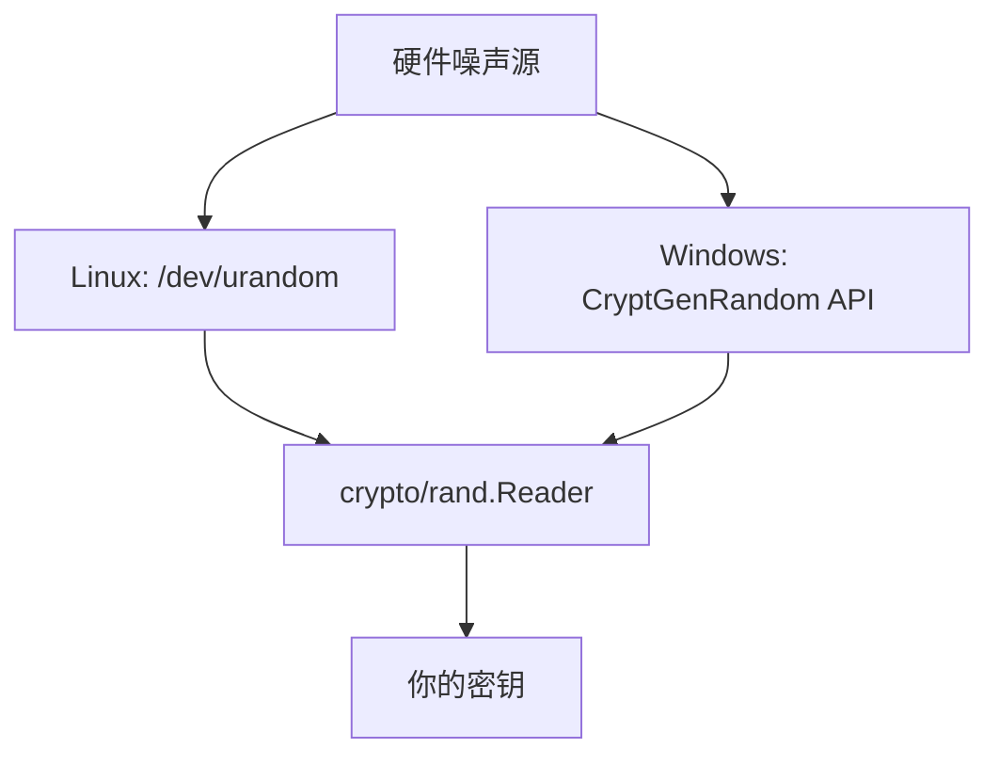
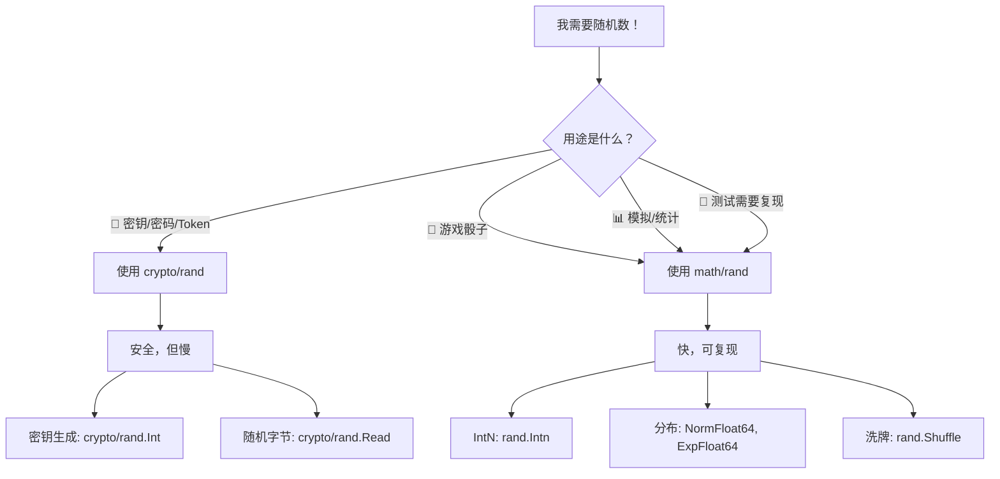

+++
title = "第9章：随机数——math/rand、crypto/rand"
weight = 90
date = "2026-03-30T13:43:00+08:00"
type = "docs"
description = ""
isCJKLanguage = true
draft = false
+++
# 第9章：随机数——math/rand、crypto/rand

> "在计算机世界里，没有真正的随机数，只有足够复杂的伪随机数。" ——一位被骰子欺骗的程序员

随机数是现代计算的基石。从掷骰子游戏到密码学密钥，从蒙特卡洛模拟到机器学习，数据都离不开随机数。但你知道吗？计算机里的"随机数"其实都是"算计"出来的！本章带你揭开 Go 语言随机数包的神秘面纱。

---

## 9.1 随机数包解决什么问题

想象你是一位游戏开发者和密码学工程师，你会遇到这样的困境：

**🎲 游戏开发者：** 我需要"随机"骰子！
- 掷出 1~6，概率均等
- 每次结果不同，但可以复现（方便调试）
- 性能要快，毕竟每秒要掷几万次

**📊 模拟工程师：** 我需要"统计"分布！
- 身高、体重、考试成绩——这些都符合正态分布
- 客户到达间隔时间——指数分布
- 热点数据访问频率——Zipf 分布

**🔐 安全工程师：** 我需要"不可预测"的密钥！
- 攻击者就算知道了之前的密钥，也猜不出下一个
- 必须来自物理世界的真实熵源
- 速度慢一点没关系，安全性是第一位

Go 贴心地准备了两套工具：

| 场景 | 包 | 特点 |
|------|-----|------|
| 游戏、模拟 | `math/rand` | 速度快，可复现，伪随机 |
| 密钥、Token | `crypto/rand` | 不可预测，密码学安全，慢 |

```go
package main

import (
    "fmt"
    "math/rand"
    crypto_rand "crypto/rand"
)

func main() {
    // math/rand: 游戏骰子，秒生成
    fmt.Printf("🎲 随机骰子: %d\n", rand.Intn(6)+1) // 1~6

    // crypto/rand: 密钥，安全性拉满
    b := make([]byte, 8)
    crypto_rand.Read(b)
    fmt.Printf("🔐 安全随机字节: %x\n", b)
}
```

> **专业词汇解释：**
> - **熵（Entropy）：** 物理世界的随机程度。操作系统通过键盘敲击时间、鼠标移动、硬件噪声等方式收集熵。
> - **伪随机数（Pseudorandom Number）：** 由确定性的算法生成，看起来随机但实际可预测。
> - **真随机数（True Random Number）：** 来自物理现象，不可预测。

---

## 9.2 随机数核心原理

### math/rand：伪随机数的"套路"

伪随机数的原理很简单：**用一个种子（Seed）通过数学公式计算出看似随机序列**。

```go
// 伪随机数生成器的工作原理（简化版）
// 公式: 下一个数 = (a * 当前数 + c) mod m
```

给定相同的种子，生成器会吐出一模一样的序列——这在调试和测试时简直是救命稻草！

```go
package main

import (
    "fmt"
    "math/rand"
)

func main() {
    // 种子 = 42，每次运行结果都相同
    // 注意：Go 1.20+ 已废弃 rand.Seed，全局 rand 会自动种子化
    // 如需确定性随机，需使用 rng := rand.New(rand.NewSource(42))
    rng := rand.New(rand.NewSource(42))

    fmt.Println("第一次运行:")
    for i := 0; i < 5; i++ {
        fmt.Printf("  rng.Intn(100) = %d\n", rng.Intn(100))
    }

    fmt.Println("第二次运行（同样的种子）:")
    for i := 0; i < 5; i++ {
        fmt.Printf("  rng.Intn(100) = %d\n", rng.Intn(100))
    }
    // 两次输出完全相同！
}
```

### crypto/rand：真随机的"玄学"

crypto/rand 从操作系统获取随机数：



> **专业词汇解释：**
> - **线性同余生成器（LCG）：** `math/rand` 使用的经典算法，公式简单但随机性一般。
> - **梅森旋转（Mersenne Twister）：** 另一种高质量伪随机算法，周期极长（2^19937-1），被 Python 和 C++ 使用。

---

## 9.3 math/rand 快速上手

告别理论，开始实践！`rand.Intn(n)` 返回 `[0, n)` 范围内的随机整数。

```go
package main

import (
    "fmt"
    "math/rand"
    "time"
)

func main() {
    // 设置当前时间作为种子（真随机起点）
    rand.Seed(time.Now().UnixNano())

    // 生成 0~99 的随机整数
    n := rand.Intn(100)
    fmt.Printf("随机数 [0,100): %d\n", n) // 例如: 42

    // 模拟掷骰子
    dice := rand.Intn(6) + 1
    fmt.Printf("🎲 掷骰子: %d\n", dice) // 1~6

    // 不设种子会怎样？默认种子是 1
    // 所以不调 Seed 的话，每次程序结果都一样（坑！）
    defaultRand := rand.New(rand.NewSource(1)) // 显式用种子1
    fmt.Printf("默认种子 1 的结果: %d\n", defaultRand.Intn(100))
}
```

> **警告：** Go 1.20 之前，不调用 `rand.Seed()` 会导致每次运行结果相同！这让无数新手踩坑。从 Go 1.20 开始，`math/rand` 会自动以全局锁的方式初始化随机种子，妈妈再也不用担心我了。

---

## 9.4 Source 与 Rand：随机数生成器的两层结构

这是理解 Go 随机数的关键！

```mermaid
graph TD
    A[Source 底层] --> B[Rand 上层]
    A:---|"Seed + 算法<br/>确定性"|A
    B:---|"便捷方法<br/>线程不安全"|B
    A -->|Int()|B
    B -->|用户调用|B
    A1[rand.Source] -->|接口|A
    A2[rand.NewSource] -->|创建函数|A
    B1[rand.Rand] -->|结构体|B
    B2[rand.New] -->|创建函数|B
```

- **Source（源）：** 负责用种子和算法产生随机数序列。它是个接口，定义了 `Int63() int64` 和 `Seed(int64)` 方法。
- **Rand（生成器）：** 负责封装 Source，提供各种便捷方法（`Intn`、`Float64`、`Shuffle` 等）。每个 `Rand` 实例都有状态。

```go
package main

import (
    "fmt"
    "math/rand"
)

func main() {
    // 1. 创建 Source（种子 = 123）
    source := rand.NewSource(123)

    // 2. 用 Source 创建 Rand
    rng := rand.New(source)

    // 3. 调用 Rand 的方法
    fmt.Printf("随机整数: %d\n", rng.Intn(100))    // 0~99
    fmt.Printf("随机浮点: %.4f\n", rng.Float64())  // 0.0~1.0
    fmt.Printf("随机排列: %v\n", rng.Perm(5))      // 0~4 的随机排列
}
```

> **专业词汇解释：**
> - **线程安全：** 默认的 `math/rand` 全局函数通过全局锁保护 Source，所以是线程安全的，但性能会打折扣。
> - **局部 Rand：** 自己 `New` 的 Rand 实例不共享锁，性能更好，但多 goroutine 共用同一个 Rand 实例会有数据竞争（需要加锁）。

---

## 9.5 rand.NewSource：创建自定义随机源

`NewSource(seed)` 是创建随机源的工厂函数。固定种子 = 固定序列 = 可复现。

```go
package main

import (
    "fmt"
    "math/rand"
)

func main() {
    // 同一个种子，同一个世界
    s1 := rand.NewSource(2024)
    s2 := rand.NewSource(2024)

    r1 := rand.New(s1)
    r2 := rand.New(s2)

    fmt.Println("比较两个同种子的 Rand:")
    for i := 0; i < 3; i++ {
        v1 := r1.Intn(1000)
        v2 := r2.Intn(1000)
        fmt.Printf("  迭代 %d: %d == %d ? %v\n", i+1, v1, v2, v1 == v2)
    }

    // 不同种子，不同命运
    s3 := rand.NewSource(42)
    r3 := rand.New(s3)
    fmt.Printf("\n种子 42 的第一个数: %d\n", r3.Intn(1000))
}
```

**应用场景：**
- **单元测试：** 确保"随机"测试用例可复现，bug 不会时而有时而没有
- **游戏回放：** 用相同种子重放一局游戏
- **科学模拟：** 其他研究者可以用相同种子复现你的结果

---

## 9.6 rand.New：创建随机数生成器

`rand.New(source)` 用已有的 Source 创建 Rand 实例。

```go
package main

import (
    "fmt"
    "math/rand"
    "time"
)

func main() {
    // 创建一个基于时间种子的 Rand
    rng := rand.New(rand.NewSource(time.Now().UnixNano()))

    // 每次运行都不一样
    fmt.Printf("这次运行: %d\n", rng.Intn(100))
    fmt.Printf("这次运行: %d\n", rng.Intn(100))

    // 也可以从零开始创建 Rand（隐含种子 = 0）
    rng2 := rand.New(rand.NewSource(0))
    fmt.Printf("\n种子 0: %d, %d, %d\n",
        rng2.Intn(100), rng2.Intn(100), rng2.Intn(100))
}
```

> **小技巧：** 如果你在多个 goroutine 中使用随机数，最好每个 goroutine 创建自己的 Rand 实例（各自不同的种子），避免锁竞争带来的性能问题。

---

## 9.7 rand.Int、rand.Int31、rand.Int63：生成随机整数

生成不同位数的随机有符号整数：

```go
package main

import (
    "fmt"
    "math/rand"
    "unsafe"
)

func main() {
    rng := rand.New(rand.NewSource(99))

    // Int() 返回非负随机整数（平台相关，32或64位）
    i := rng.Int()
    fmt.Printf("rand.Int(): %d (平台相关位数)\n", i)

    // Int31() 返回随机 31 位有符号整数
    i31 := rng.Int31()
    fmt.Printf("rand.Int31(): %d (范围: 0 ~ 2,147,483,647)\n", i31)

    // Int63() 返回随机 63 位有符号整数
    i63 := rng.Int63()
    fmt.Printf("rand.Int63(): %d (范围: 0 ~ 9,223,372,036,854,775,807)\n", i63)

    // Int() 可以很大，Int31n/Int63n 则限制范围
    fmt.Printf("\n对比大小:\n")
    fmt.Printf("  Int()   位数: %d\n", unsafe.Sizeof(i)*8)
    fmt.Printf("  Int31() 位数: %d\n", unsafe.Sizeof(i31)*8)
    fmt.Printf("  Int63() 位数: %d\n", unsafe.Sizeof(i63)*8)
}
```

> **专业词汇解释：**
> - **有符号整数（Signed Integer）：** 可以表示正数、负数和零。最高位是符号位。
> - **无符号整数（Unsigned Integer）：** 只能表示正数和零。

---

## 9.8 rand.Intn：生成 0~n-1 的随机整数

最常用的方法！`rand.Intn(n)` 返回 `[0, n)` 范围的整数。

```go
package main

import (
    "fmt"
    "math/rand"
)

func main() {
    rng := rand.New(rand.NewSource(123))

    // 模拟抽奖：10 个人编号 0~9，中奖者是...
    winner := rng.Intn(10)
    fmt.Printf("🎉 中奖编号: %d\n", winner)

    // 模拟密码：6位数字验证码
    code := 0
    for i := 0; i < 6; i++ {
        digit := rng.Intn(10)
        code = code*10 + digit
    }
    fmt.Printf("📱 短信验证码: %06d\n", code)

    // Intn(0) 会 panic！边界情况要注意
    // rng.Intn(0) // 别这样！
    fmt.Println("注意: Intn(n) 的 n 必须大于 0，否则会 panic!")
}
```

> **警告：** `Intn(0)` 会引发 panic！永远不要传 0。

---

## 9.9 rand.Int31n、rand.Int63n：带上限的 31/63 位随机整数

底层高效版本，`Intn` 内部其实就是调用的这些：

```go
package main

import (
    "fmt"
    "math/rand"
)

func main() {
    rng := rand.New(rand.NewSource(456))

    // Int31n: 随机 31 位整数，再取模
    v31 := rng.Int31n(1000)
    fmt.Printf("rand.Int31n(1000): %d (范围: 0~999)\n", v31)

    // Int63n: 随机 63 位整数，再取模
    v63 := rng.Int63n(10000)
    fmt.Printf("rand.Int63n(10000): %d (范围: 0~9999)\n", v63)

    // 直接用 Int31 然后 %n 也可以，但 Int31n 更均匀
    // 不推荐: rng.Int31() % 100 // 会偏向某些值（如果你不懂原理的话）
    fmt.Println("\n推荐用法:")
    fmt.Println("  rand.Intn(n)   → int 类型，n<1<<31 时使用")
    fmt.Println("  rand.Int31n(n) → int32 类型，精确控制位数")
    fmt.Println("  rand.Int63n(n) → int63 类型，大范围时使用")
}
```

> **专业词汇解释：**
> - **模偏差（Modulo Bias）：** 如果你对随机数直接取模，某些值出现的概率会略高。`Intn` 系列通过算法避免了这个问题。
> - **拒绝采样（Rejection Sampling）：** Intn 使用的算法：生成比目标范围更大更均匀的随机数，丢弃不合格的，效率更高。

---

## 9.10 rand.Float64、rand.Float32：生成 0~1 之间的随机浮点数

```go
package main

import (
    "fmt"
    "math/rand"
)

func main() {
    rng := rand.New(rand.NewSource(789))

    // Float64: [0.0, 1.0) 范围的 64 位浮点数
    for i := 0; i < 5; i++ {
        f := rng.Float64()
        fmt.Printf("  Float64: %.6f\n", f)
    }

    // Float32: [0.0, 1.0) 范围的 32 位浮点数
    fmt.Println("\nFloat32 (精度更低):")
    for i := 0; i < 3; i++ {
        f := rng.Float32()
        fmt.Printf("  Float32: %.8f\n", f)
    }

    // 实用：生成 [min, max) 范围的浮点数
    min, max := 1.5, 9.5
    r := min + rng.Float64()*(max-min)
    fmt.Printf("\n[%.1f, %.1f) 范围: %.4f\n", min, max, r)
}
```

> **注意：** 浮点数永远取不到 1.0，最大值约为 0.9999999999999999。这是 IEEE 754 的特性。

---

## 9.11 rand.NormFloat64：正态（高斯）分布，均值 0，标准差 1

自然界大多数数据都符合正态分布：身高、考试成绩、测量误差。`NormFloat64` 生成标准正态分布的随机数。

```go
package main

import (
    "fmt"
    "math/rand"
)

func main() {
    rng := rand.New(rand.NewSource(111))

    fmt.Println("标准正态分布样本（均值=0, 标准差=1）:")
    fmt.Println("  大多数值在 -3 ~ +3 之间")
    fmt.Println("  约 68% 在 -1 ~ +1 之间")
    fmt.Println("  约 95% 在 -2 ~ +2 之间")

    sum := 0.0
    samples := []float64{}
    for i := 0; i < 10; i++ {
        v := rng.NormFloat64()
        samples = append(samples, v)
        sum += v
    }
    fmt.Printf("\n  样本值: %+.4f\n", samples)
    fmt.Printf("  样本均值: %.4f (应该接近 0)\n", sum/float64(len(samples)))
}
```

> **专业词汇解释：**
> - **正态分布（Normal Distribution）：** 又称高斯分布，钟形曲线，均值处概率最高。
> - **均值（Mean/μ）：** 分布的中心点。这里 NormFloat64 的均值固定为 0。
> - **标准差（Standard Deviation/σ）：** 衡量数据分散程度。这里固定为 1。

---

## 9.12 rand.ExpFloat64：指数分布，模拟"无记忆"的随机等待时间

指数分布常用于描述独立随机事件发生的时间间隔，比如：
- 客户到达银行的时间间隔
- 网站请求的到达间隔
- 放射性衰变

```go
package main

import (
    "fmt"
    "math/rand"
)

func main() {
    rng := rand.New(rand.NewSource(222))

    fmt.Println("指数分布样本（λ=1）:")
    fmt.Println("  大多数值较小，少数值很大")
    fmt.Println("  无记忆性：已等待 5 分钟，再等 5 分钟的概率不变")

    for i := 0; i < 10; i++ {
        v := rng.ExpFloat64()
        fmt.Printf("  等待时间: %.4f 单位时间\n", v)
    }

    // 调整 lambda（率参数）：值越小，分布越"平缓"
    // Go 的 ExpFloat64 固定 lambda=1
    // 如果需要其他 lambda，可以乘以 1/lambda
    lambda := 0.5
    fmt.Printf("\nlambda=%.1f 的指数分布:\n", lambda)
    for i := 0; i < 5; i++ {
        v := rng.ExpFloat64() / lambda
        fmt.Printf("  %.4f\n", v)
    }
}
```

> **专业词汇解释：**
> - **指数分布（Exponential Distribution）：** 描述两次独立事件发生的时间间隔。
> - **无记忆性（Memoryless）：** 指数分布的独特性质——"已经等了多久"不影响"还要等多久"。

---

## 9.13 rand.Perm：生成 0~n-1 的随机排列

`Perm(n)` 返回一个 `[0, 1, 2, ..., n-1]` 的随机排列，常用于洗牌算法。

```go
package main

import (
    "fmt"
    "math/rand"
)

func main() {
    rng := rand.New(rand.NewSource(333))

    // 生成一副牌的随机顺序（简化版，4张牌）
    deck := rng.Perm(4)
    fmt.Printf("🃏 洗牌结果: %v\n", deck)
    // 例如 [2, 0, 3, 1]

    // 真实场景：生成测试数据顺序
    n := 10
    order := rng.Perm(n)
    fmt.Printf("\n📋 测试执行顺序: %v\n", order)

    // 抽奖：随机决定 5 个人的出场顺序
    names := []string{"Alice", "Bob", "Charlie", "Diana", "Eve"}
    perm := rng.Perm(5)
    fmt.Println("\n🎤 出场顺序:")
    for i, idx := range perm {
        fmt.Printf("  第 %d 位: %s\n", i+1, names[idx])
    }
}
```

---

## 9.14 rand.Shuffle：打乱已有顺序

`Shuffle` 直接在原地打乱切片，不返回新切片。

```go
package main

import (
    "fmt"
    "math/rand"
)

func main() {
    rng := rand.New(rand.NewSource(444))

    // 打乱字符串切片
    colors := []string{"红", "黄", "蓝", "绿", "紫"}
    fmt.Printf("洗牌前: %v\n", colors)

    rng.Shuffle(len(colors), func(i, j int) {
        colors[i], colors[j] = colors[j], colors[i]
    })
    fmt.Printf("洗牌后: %v\n", colors)

    // 打乱整数切片
    numbers := []int{1, 2, 3, 4, 5, 6, 7, 8, 9, 10}
    rng.Shuffle(len(numbers), func(i, j int) {
        numbers[i], numbers[j] = numbers[j], numbers[i]
    })
    fmt.Printf("随机序列: %v\n", numbers)

    // Shuffle 的 swap 函数签名
    // func(i, j int)
    // i: 第一个位置, j: 第二个位置
    // 交换 slice[i] 和 slice[j]
}
```

> **提示：** Shuffle 是 Fisher-Yates 洗牌算法的 Go 实现，时间复杂度 O(n)。

---

## 9.15 rand.Read：生成随机字节切片

```go
package main

import (
    "fmt"
    "math/rand"
)

func main() {
    rng := rand.New(rand.NewSource(555))

    // 生成 16 字节的随机数据
    data := make([]byte, 16)
    n, err := rng.Read(data)
    if err != nil {
        fmt.Printf("错误: %v\n", err)
        return
    }
    fmt.Printf("读取了 %d 字节: %x\n", n, data)

    // 生成 UUID 风格的随机字符串
    uuid := make([]byte, 16)
    rng.Read(uuid)
    fmt.Printf("UUID 风格: %x-%x-%x-%x-%x\n",
        uuid[0:4], uuid[4:6], uuid[6:8], uuid[8:10], uuid[10:])
}
```

> **注意：** `rand.Read` 是 `io.Reader` 接口的实现，可以直接当数据源用。

---

## 9.16 rand.NewZipf：Zipf 分布，模拟"热点数据"

Zipf 分布（齐夫分布）描述了一种"赢家通吃"的现象：
- 20% 的网站拥有 80% 的访问量
- 少数词汇占据了大部分语言使用
- 热门商品被反复购买

```go
package main

import (
    "fmt"
    "math/big"
    "math/rand"
)

func main() {
    // 创建 Zipf 分布生成器
    // v: 最大值, alpha: 分布参数(>0), q: 指数参数(>=1)
    // alpha 越大，热门越集中
    // q 影响最小值
    source := rand.NewSource(666)
    rng := rand.New(source)

    zipf := rand.NewZipf(rng, 1.5, 1.0, 100000) // alpha=1.5, q=1.0, v=100000

    fmt.Println("Zipf 分布样本（模拟网站访问）:")
    fmt.Println("  alpha=1.5 表示热门集中度适中")
    fmt.Println("  v=100000 表示有 10 万个页面")

    // 统计：前 1000 个样本中各"档次"的数量
    bucket := map[string]int{
        "热门(1~10)":      0,
        "中等(11~100)":    0,
        "冷门(101~1000)":  0,
        "长尾(1001~)":     0,
    }

    for i := 0; i < 10000; i++ {
        page := zipf.Uint64()
        switch {
        case page <= 10:
            bucket["热门(1~10)"]++
        case page <= 100:
            bucket["中等(11~100)"]++
        case page <= 1000:
            bucket["冷门(101~1000)"]++
        default:
            bucket["长尾(1001~)"]++
        }
    }

    fmt.Println("\n10000 次访问的分布:")
    for k, v := range bucket {
        pct := float64(v) / 100.0
        bar := ""
        for i := 0; i < int(pct)/2; i++ {
            bar += "█"
        }
        fmt.Printf("  %-12s: %5d 次 (%5.1f%%) %s\n", k, v, pct, bar)
    }
}
```

> **专业词汇解释：**
> - **Zipf 分布：** 以语言学家 George Kingsley Zipf 命名，公式：`P(k) ∝ 1/k^α`
> - **幂律分布（Power Law）：** Zipf 是幂律分布的一种，特点是"无标度"。

---

## 9.17 math/rand/v2（Go 1.20+）：新一代随机数 API

Go 1.20 带来了全新的 `math/rand/v2`！这次升级可不只是版本号+1：

```go
package main

import (
    "fmt"
    "math.rand/v2"
)

func main() {
    // v2 的核心改进：
    // 1. 默认全局 Rand 无需 Seed，自动初始化
    // 2. 底层算法升级为 PCG（性能更好）
    // 3. 新增 Uint、Uint64 等更直接的 API
    // 4. 分布函数命名更一致（Exp, Norm 等）

    // 快速上手
    fmt.Printf("Uint64: %d\n", v2.Uint64())
    fmt.Printf("IntN(100): %d\n", v2.IntN(100))
    fmt.Printf("Float64: %.6f\n", v2.Float64())

    // 创建自己的 Rand（更推荐的方式）
    rng := v2.New(v2.NewPCG(1234, 5678))

    fmt.Printf("\n自定义 Rand (PCG):\n")
    for i := 0; i < 5; i++ {
        fmt.Printf("  %d\n", rng.IntN(1000))
    }
}
```

> **升级亮点：**
> - **PCG 算法：** 比旧版 LCG 随机性更好，性能相当
> - **无需 Seed：** 全局函数开箱即用，不会踩"种子=1"的坑
> - **命名统一：** `Uint`、`Uint64`、`IntN`——和 crypto/rand 更一致

---

## 9.18 crypto/rand.Int：加密安全的随机大整数

密码学应用需要"不可预测"的随机数。`crypto/rand.Int` 生成加密安全的大整数。

```go
package main

import (
    "crypto/rand"
    "fmt"
    "math/big"
)

func main() {
    // 生成 [0, n) 范围内的加密安全随机整数
    n, _ := new(big.Int).SetString("100000000000000000000", 10) // 10^20
    k, err := rand.Int(rand.Reader, n)
    if err != nil {
        fmt.Printf("错误: %v\n", err)
        return
    }
    fmt.Printf("加密安全随机数 [0, 10^20): %d\n", k)

    // 生成大素数（RSA 密钥需要）
    // 实际中用 crypto/rand 读取足够多的字节，再找素数
    prime, err := rand.Prime(rand.Reader, 256) // 256 位的素数
    if err != nil {
        fmt.Printf("错误: %v\n", err)
        return
    }
    fmt.Printf("256位素数: %x...\n", prime.Text(16)[:32])
}
```

> **注意：** `crypto/rand.Int` 需要 `math/big` 的 `Int` 类型作为参数，返回值也是 `big.Int`。对于普通 int 范围，用下面的 `Read` 更直接。

---

## 9.19 crypto/rand.Reader：读取加密随机字节

`crypto/rand.Reader` 是一个全局的 `io.Reader`，从操作系统获取高质量熵。

```mermaid
graph LR
    A[硬件噪声] --> B[OS 熵源]
    A --> C[系统调用]
    B --> D[/dev/urandom<br/>CryptGenRandom]
    C --> D
    D --> E[crypto/rand.Reader]
    E --> F[密钥生成<br/>Nonce 初始化<br/>盐值]
```

```go
package main

import (
    "crypto/rand"
    "fmt"
)

func main() {
    // 生成 32 字节的随机数（256 位）
    key := make([]byte, 32)
    n, err := rand.Read(key)
    if err != nil {
        fmt.Printf("熵源错误: %v\n", err)
        return
    }
    fmt.Printf("生成了 %d 字节的加密随机数:\n", n)
    fmt.Printf("  %x\n", key)

    // 用于密码学场景
    fmt.Printf("\n使用场景:\n")
    fmt.Printf("  - AES 密钥: %d 字节\n", 32)
    fmt.Printf("  - HMAC 密钥: %d 字节\n", 32)
    fmt.Printf("  - RSA 签名 nonce: 至少 %d 字节\n", 32)
}
```

> **专业词汇解释：**
> - **Nonce：** 只能使用一次的随机数，用于加密协议中防止重放攻击。
> - **Salt：** 随机盐值，和密码一起哈希存储，防止彩虹表攻击。

---

## 9.20 crypto/rand.Read：生成加密随机字节

```go
package main

import (
    "crypto/rand"
    "fmt"
)

func main() {
    // 生成指定长度的加密随机字节
    token := make([]byte, 16)
    _, err := rand.Read(token)
    if err != nil {
        fmt.Printf("错误: %v\n", err)
        return
    }
    fmt.Printf("会话 Token: %x\n", token)

    // 生成验证码
    digits := make([]byte, 6)
    rand.Read(digits)
    for i := range digits {
        digits[i] = digits[i] % 10 // 只取数字 0~9
    }
    fmt.Printf("数字验证码: %s\n", digits)
}
```

> **重要：** crypto/rand 的操作通常比 math/rand 慢几个数量级。对于不需要密码学安全的场景（如游戏、模拟），请使用 `math/rand`。

---

## 9.21 crypto/rand vs math/rand：密码/token/密钥用 crypto，游戏骰子用 math

最后，来一张对比图，让你选对工具：



| 场景 | 推荐 | 原因 |
|------|------|------|
| 密码学密钥 | `crypto/rand` | 不可预测，攻击者无法猜测 |
| Session Token | `crypto/rand` | 安全第一 |
| 游戏骰子 | `math/rand` | 速度快，可复现调试 |
| 蒙特卡洛模拟 | `math/rand` | 需要大量随机数 |
| 单元测试 | `math/rand` + 固定种子 | 每次运行结果相同 |
| 机器学习 | `math/rand` | 速度重要 |
| 洗牌/抽奖 | `math/rand` | 不涉及安全 |

```go
package main

import (
    "crypto/rand"
    "fmt"
    "math/rand"
)

func main() {
    fmt.Println("=== 选择指南 ===")
    fmt.Println("✅ crypto/rand 使用场景:")
    fmt.Println("   - 生成密码")
    fmt.Println("   - 生成 API Token")
    fmt.Println("   - 生成 SSH 密钥")
    fmt.Println("   - 加密盐值")

    fmt.Println("\n✅ math/rand 使用场景:")
    fmt.Println("   - 游戏随机事件")
    fmt.Println("   - 数据采样/打乱")
    fmt.Println("   - 蒙特卡洛模拟")
    fmt.Println("   - 需要复现的测试")

    // 示例：生成安全的随机密码
    charset := "abcdefghijklmnopqrstuvwxyzABCDEFGHIJKLMNOPQRSTUVWXYZ0123456789"
    password := make([]byte, 16)
    crypto_rand.Read(password) // 加密安全
    for i := range password {
        password[i] = charset[int(password[i])%len(charset)]
    }
    fmt.Printf("\n🔐 随机密码: %s\n", password)
}
```

---

## 本章小结

| 概念 | 要点 |
|------|------|
| **math/rand** | 伪随机数，速度快，可复现，适合游戏/模拟 |
| **crypto/rand** | 真随机数，密码学安全，慢，适合密钥/Token |
| **Source & Rand** | Source 管种子和算法，Rand 管用户接口 |
| **rand.NewSource** | 固定种子 = 固定序列 = 可复现 |
| **rand.Intn(n)** | 返回 [0, n)，最常用的方法 |
| **rand.Float64** | 返回 [0.0, 1.0)，用于缩放 |
| **rand.NormFloat64** | 标准正态分布，均值0，标准差1 |
| **rand.ExpFloat64** | 指数分布，无记忆性 |
| **rand.Perm / Shuffle** | 洗牌和随机排列 |
| **rand.NewZipf** | Zipf分布，模拟热点数据 |
| **math/rand/v2** | Go 1.20+ 新API，自动种子，PCG算法 |
| **crypto/rand.Reader** | OS 熵源的 io.Reader 接口 |
| **crypto/rand.Int** | 加密安全的大整数 |
| **选择原则** | 安全场景用 crypto，游戏模拟用 math |

> **记住：** 计算机里的"随机"都是伪装的确定性。选择正确的随机数源，让你的程序既高效又安全！
