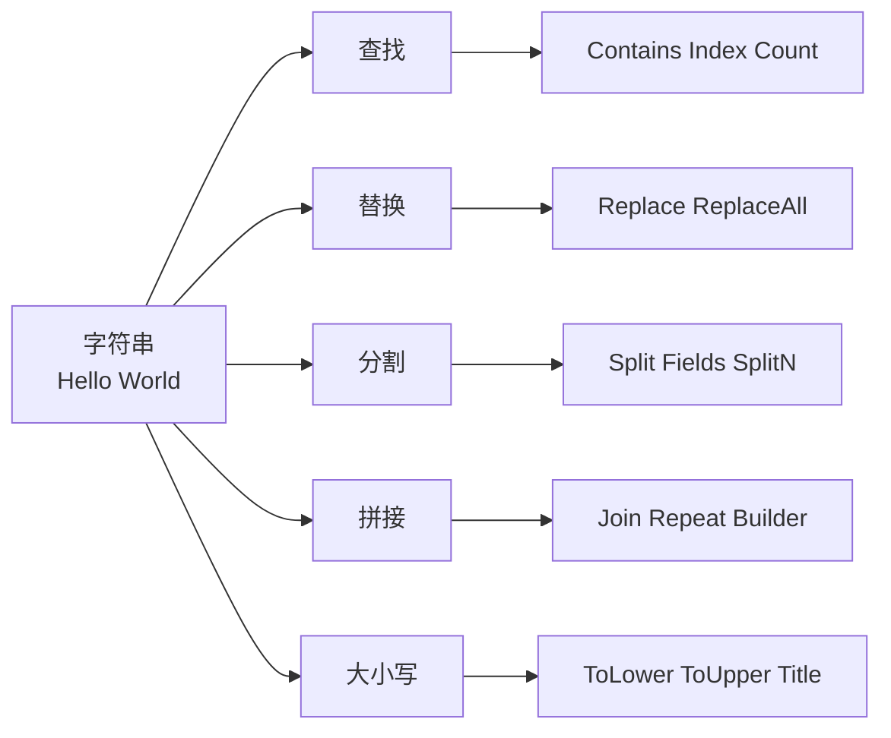
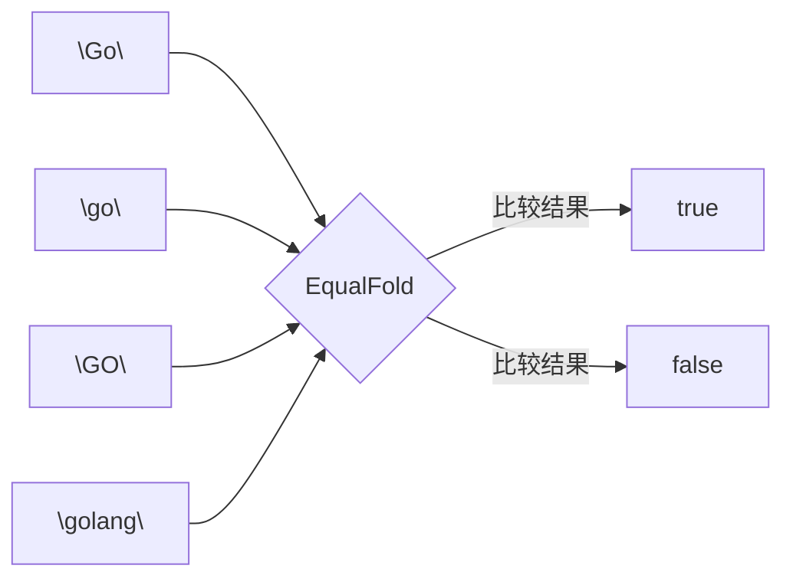
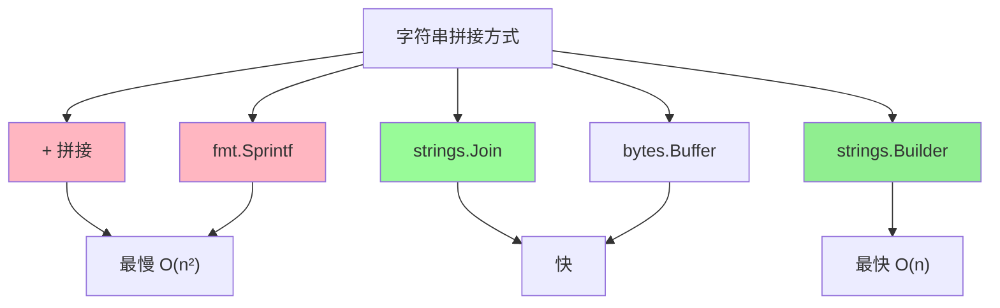

+++
title = "第11章：字符串操作——strings 包"
weight = 110
date = "2026-03-30T13:43:00+08:00"
type = "docs"
description = ""
isCJKLanguage = true
draft = false
+++
# 第11章：字符串操作——strings 包

> "在 Go 的世界里，字符串是 immutable（不可变）的字节序列，听起来很限制对吧？但正是这种设计，让 strings 包成为了处理文本的瑞士军刀——稳定、可靠、从不闹脾气。"

---

## 11.1 strings 包解决什么问题：文本处理，查找、替换、分割、拼接、大小写转换

**专业解释：** strings 包是 Go 标准库中专门用于处理 UTF-8 字符串的工具箱，提供了查找（Contains/Index）、替换（Replace）、分割（Split/Fields）、拼接（Join/Repeat）、大小写转换（ToLower/ToUpper）等核心功能，是日常开发中使用频率最高的包之一。

**通俗理解：** 想象你有一堆积木（字符串），strings 包就是你的说明书，告诉你怎么找到某块积木、把它换成别的、切成几段、或者把颜色改一改（大小写转换）。

**mermaid 概览：**



**一句话总结：** strings 包让你的字符串操作从"手工作坊"升级为"流水线工厂"。

---

## 11.2 strings 核心原理：Go 字符串是不可变的，所有修改操作都返回新字符串

**专业解释：** 在 Go 中，string 是只读的字节切片（slice of bytes），底层是一个结构体包含指针和长度。所有"修改"操作（如 ToLower、Trim、Replace）实际上是在内存中创建一个**新的**字符串，原始字符串保持不变。这种设计确保了字符串的线程安全性和可预测性。

**通俗理解：** 就像你把一张发票复印一份，然后在复印件上涂改——原件还在档案柜里纹丝不动。Go 的字符串就是这么矜持，从不改变自己，只生成分身。

```go
package main

import (
    "fmt"
    "strings"
)

func main() {
    original := "Hello, Go!"
    modified := strings.ToLower(original)

    // 打印结果
    fmt.Println("原始字符串:", original)  // 原始字符串: Hello, Go!
    fmt.Println("修改后字符串:", modified) // 修改后字符串: hello, go!
    fmt.Println("原始字符串改变了吗?", original == "Hello, Go!") // 原始字符串改变了吗? true

    // 演示内存地址不同
    fmt.Printf("original 地址: %p\n", &original) // original 地址: 0xc0000...
    fmt.Printf("modified 地址: %p\n", &modified) // modified 地址: 0xc0000...（不同！）
}
```

**图示：**

```
原始字符串: "Hello, Go!"
              ↓
         [不可变] ——复制的过程中——
              ↓
新字符串:   "hello, go!"
```

**为什么这样设计？**
1. **线程安全** —— 多个 goroutine 读取同一个字符串，永远不会出问题
2. **可预测性** —— 函数不会偷偷改掉你的输入
3. **内存复用** —— Go 底层会复用相同的子字符串（copy-on-write 优化）

**一句话总结：** Go 字符串的"不可变性"就像博物馆里的展品——只能看，不能摸，摸就要付钱（创建新字符串）。

---

## 11.3 strings.EqualFold：大小写不敏感比较

**专业解释：** EqualFold 用于比较两个字符串，忽略大小写差异。它按字节逐个比较，并且在比较 UTF-8 字符时会正确处理 Unicode 的大小写映射，返回 bool 值表示是否相等。

**通俗理解：** 就像比较两个人名是否相同，不管是大写"John"还是小写"john"，都认为是同一个人。

```go
package main

import (
    "fmt"
    "strings"
)

func main() {
    // 基本比较
    result1 := strings.EqualFold("Go", "go")       // true
    result2 := strings.EqualFold("Go", "GO")       // true
    result3 := strings.EqualFold("Go", "golang")    // false

    fmt.Println("EqualFold(\"Go\", \"go\"):", result1)    // EqualFold("Go", "go"): true
    fmt.Println("EqualFold(\"Go\", \"GO\"):", result2)    // EqualFold("Go", "GO"): true
    fmt.Println("EqualFold(\"Go\", \"golang\"):", result3) // EqualFold("Go", "golang"): false

    // Unicode 处理
    result4 := strings.EqualFold("中文", "中文")     // true
    result5 := strings.EqualFold("Å", "å")          // true（Unicode 特殊字符）

    fmt.Println("EqualFold(\"中文\", \"中文\"):", result4) // EqualFold("中文", "中文"): true
    fmt.Println("EqualFold(\"Å\", \"å\"):", result5)      // EqualFold("Å", "å"): true

    // 实战场景：忽略大小写的用户名验证
    username := "Admin"
    if strings.EqualFold(username, "admin") {
        fmt.Println("用户名验证通过！") // 用户名验证通过！
    }
}
```

**mermaid 对比：**



**一句话总结：** EqualFold 就是字符串比较中的"平光镜"——不管大小写，看到的都是同一个东西。

---

## 11.4 strings.Compare：按字节比较，返回 -1/0/1

**专业解释：** Compare 按字节从左到右逐个比较两个字符串，返回 int 值：-1（小于）、0（相等）、1（大于）。它是基于字典序（lexicographical order）的比较，遵循 Go 的字节序规则。

**通俗理解：** 想象两个学生按学号排队，学号小的站前面。Compare 就是那个报数的人："你 -1，你 0，你 1"。

```go
package main

import (
    "fmt"
    "strings"
)

func main() {
    // 基本比较
    cmp1 := strings.Compare("apple", "banana")  // -1，a < b
    cmp2 := strings.Compare("banana", "apple")  //  1，b > a
    cmp3 := strings.Compare("apple", "apple")   //  0，相等

    fmt.Println("Compare(\"apple\", \"banana\"):", cmp1)  // Compare("apple", "banana"): -1
    fmt.Println("Compare(\"banana\", \"apple\"):", cmp2)  // Compare("banana", "apple"): 1
    fmt.Println("Compare(\"apple\", \"apple\"):", cmp3)   // Compare("apple", "apple"): 0

    // 字节级别比较
    cmp4 := strings.Compare("abc", "abd")       // -1，c < d
    cmp5 := strings.Compare("ABC", "abc")       // -1，大写字母 ASCII 码小于小写

    fmt.Println("Compare(\"abc\", \"abd\"):", cmp4)       // Compare("abc", "abd"): -1
    fmt.Println("Compare(\"ABC\", \"abc\"):", cmp5)       // Compare("ABC", "abc"): -1

    // 对比 EqualFold
    cmp6 := strings.Compare("Go", "go")        // -1，按字节并不相等
    eq7 := strings.EqualFold("Go", "go")       // true，大小写不敏感相等

    fmt.Println("Compare(\"Go\", \"go\"):", cmp6)        // Compare("Go", "go"): -1
    fmt.Println("EqualFold(\"Go\", \"go\"):", eq7)       // EqualFold("Go", "go"): true

    // 实际应用：排序
    fruits := []string{"banana", "Apple", "cherry", "apricot"}
    // 使用 Compare 进行简单排序
    for i := 0; i < len(fruits)-1; i++ {
        for j := i + 1; j < len(fruits); j++ {
            if strings.Compare(fruits[i], fruits[j]) > 0 {
                fruits[i], fruits[j] = fruits[j], fruits[i]
            }
        }
    }
    fmt.Println("排序后:", fruits) // 排序后: [Apple apricot banana cherry]
}
```

**ASCII 码参考：**

```
'A' = 65, 'B' = 66, ... 'Z' = 90
'a' = 97, 'b' = 98, ... 'z' = 122
```

所以 "ABC" < "abc" 因为 65 < 97。

**一句话总结：** Compare 就像字典的编排规则——按字母顺序，谁在前谁就"小"。

---

## 11.5 strings.Contains：子串包含判断

**专业解释：** Contains 判断源字符串 s 是否包含子字符串 substr，返回 bool。它内部实现是调用了 Index(s, substr) >= 0，即查找子串位置。

**通俗理解：** 就像在一锅汤里尝尝有没有放盐——Contains 就是那个告诉你"有"或"没有"的舌头。

```go
package main

import (
    "fmt"
    "strings"
)

func main() {
    // 基本用法
    fmt.Println("Contains(\"Hello, World!\", \"World\"):", strings.Contains("Hello, World!", "World"))    // true
    fmt.Println("Contains(\"Hello, World!\", \"world\"):", strings.Contains("Hello, World!", "world"))    // false（大小写敏感）
    fmt.Println("Contains(\"Hello, World!\", \"Go\"):", strings.Contains("Hello, World!", "Go"))          // false

    // 空字符串的特殊情况
    fmt.Println("Contains(\"Hello\", \"\"):", strings.Contains("Hello", ""))   // true（空串被认为在任意位置）
    fmt.Println("Contains(\"\", \"\"):", strings.Contains("", ""))              // true
    fmt.Println("Contains(\"\", \"a\"):", strings.Contains("", "a"))            // false

    // 实战场景：过滤包含关键字的日志
    logs := []string{
        "[INFO] 用户登录成功",
        "[ERROR] 数据库连接失败",
        "[INFO] 发送邮件通知",
        "[WARN] 内存使用率超过 80%",
        "[ERROR] API 请求超时",
    }

    keyword := "ERROR"
    for _, log := range logs {
        if strings.Contains(log, keyword) {
            fmt.Println("错误日志:", log)
        }
    }
    // 错误日志: [ERROR] 数据库连接失败
    // 错误日志: [ERROR] API 请求超时
}
```

**mermaid 示意：**

```
源字符串: "Hello, World!"
子字符串: "World"

查找过程:
"Hello, World!"
      ↓
  找到位置 7
      ↓
返回: true ✓
```

**一句话总结：** Contains 就是字符串版的"includes"——问你"里面有没有"，回答 yes 或 no。

---

## 11.6 strings.ContainsAny：任一字符包含

**专业解释：** ContainsAny 判断源字符串 s 中是否包含 chars 字符串中的**任意一个**字符（注意是字符，不是子串）。只要出现 chars 中任意一个 UTF-8 码点，就返回 true。

**通俗理解：** 就像检查一袋糖果里有没有"草莓味 OR 橘子味 OR 柠檬味"的糖——只要有其中任何一种口味就算过关。

```go
package main

import (
    "fmt"
    "strings"
)

func main() {
    // 基本用法：chars 中任意一个字符出现即返回 true
    fmt.Println("ContainsAny(\"Hello\", \"ab\"):", strings.ContainsAny("Hello", "ab"))    // false，H/e/l/l/o 都没有 a 或 b
    fmt.Println("ContainsAny(\"Hello\", \"le\"):", strings.ContainsAny("Hello", "le"))    // true，有 l 和 e
    fmt.Println("ContainsAny(\"Hello\", \"xy\"):", strings.ContainsAny("Hello", "xy"))    // false

    // 中文场景
    fmt.Println("ContainsAny(\"你好世界\", \"你 好\"):", strings.ContainsAny("你好世界", "你 好")) // true
    fmt.Println("ContainsAny(\"你好世界\", \"xyz\"):", strings.ContainsAny("你好世界", "xyz"))       // false

    // 空字符串情况
    fmt.Println("ContainsAny(\"Hello\", \"\"):", strings.ContainsAny("Hello", ""))        // false
    fmt.Println("ContainsAny(\"\", \"abc\"):", strings.ContainsAny("", "abc"))              // false

    // 实战：密码强度检查（必须包含特殊字符）
    func checkPassword(password string) bool {
        specialChars := "!@#$%^&*()_+-=[]{}|;:',.<>?/"
        return strings.ContainsAny(password, specialChars)
    }

    passwords := []string{"Password123", "P@ssw0rd!", "admin123", "S3cure!"}
    for _, p := range passwords {
        fmt.Printf("密码 \"%s\" 含特殊字符? %v\n", p, checkPassword(p))
    }
    // 密码 "Password123" 含特殊字符? false
    // 密码 "P@ssw0rd!" 含特殊字符? true
    // 密码 "admin123" 含特殊字符? false
    // 密码 "S3cure!" 含特殊字符? true
}
```

**Contains vs ContainsAny 对比：**

| 函数 | 参数含义 | 匹配方式 |
|------|---------|---------|
| Contains(s, substr) | 子串 | substr 作为整体，必须全部出现 |
| ContainsAny(s, chars) | 字符集 | chars 中任意**一个**字符出现即可 |

**一句话总结：** ContainsAny 是"或"逻辑—— chars 里挑一个出现就赢了。

---

## 11.7 strings.ContainsRune：某个字符包含

**专业解释：** ContainsRune 判断源字符串 s 中是否包含指定的单个 rune（Unicode 码点）。它专门用于检查中文字符或其他非 ASCII 的单个字符。

**通俗理解：** 就像在通讯录里查一个人——ContainsRune 就是告诉你在不在。

```go
package main

import (
    "fmt"
    "strings"
)

func main() {
    // ASCII 字符
    fmt.Println("ContainsRune(\"Hello\", 'H'):", strings.ContainsRune("Hello", 'H'))    // true
    fmt.Println("ContainsRune(\"Hello\", 'x'):", strings.ContainsRune("Hello", 'x'))    // false

    // 中文 Unicode
    fmt.Println("ContainsRune(\"你好世界\", '你'):", strings.ContainsRune("你好世界", '你')) // true
    fmt.Println("ContainsRune(\"你好世界\", '中'):", strings.ContainsRune("你好世界", '中')) // false

    // Emoji（也是 rune）
    emoji := "👨‍💻程序员"
    fmt.Println("ContainsRune(\"👨‍💻程序员\", '程'):", strings.ContainsRune(emoji, '程'))     // true
    fmt.Println("ContainsRune(\"👨‍💻程序员\", '👨'):", strings.ContainsRune(emoji, '👨'))       // true（单个码点）

    // rune 的 ASCII 码值
    fmt.Println("ContainsRune(\"ABC\", 65):", strings.ContainsRune("ABC", 65)) // true（'A' = 65）

    // 实战：敏感词过滤
    sensitiveWords := []rune{'黄', '赌', '毒', '暴', '恐'}
    content := "这是一段正常的内容"

    hasSensitive := false
    for _, char := range content {
        for _, sensitive := range sensitiveWords {
            if strings.ContainsRune(string(char), sensitive) {
                hasSensitive = true
                break
            }
        }
    }
    fmt.Printf("内容含敏感词? %v\n", hasSensitive) // 内容含敏感词? false
}
```

**mermaid：**

```
字符串: "你好世界"
  ↓ 逐字符检查
['你', '好', '世', '界']
  ↓ ContainsRune('你')
返回: true ✓
```

**一句话总结：** ContainsRune 就是"单挑"——只查一个人（字符）在不在，不接受贿赂（多个字符）。

---

## 11.8 strings.Count：子串出现次数

**专业解释：** Count 返回子串 substr 在源字符串 s 中**非重叠**出现的次数。如果 substr 为空字符串，返回 s 的长度 + 1。

**通俗理解：** 就像数一篇文章里某个词出现了多少次——Count 就是那个认真负责的校对员。

```go
package main

import (
    "fmt"
    "strings"
)

func main() {
    // 基本用法
    fmt.Println("Count(\"cheese\", \"e\"):", strings.Count("cheese", "e"))      // 3
    fmt.Println("Count(\"five\", \"\"):", strings.Count("five", ""))            // 5（特殊规则：返回长度+1）
    fmt.Println("Count(\"\", \"\"):", strings.Count("", ""))                    // 1（空串在空串中出现 1 次）

    // 非重叠计数
    fmt.Println("Count(\"aaaa\", \"aa\"):", strings.Count("aaaa", "aa"))        // 2（非重叠：第一个 aa 和第三个 aa）
    fmt.Println("Count(\"aaa\", \"aa\"):", strings.Count("aaa", "aa"))          // 1（非重叠）

    // 大小写敏感
    fmt.Println("Count(\"GoGoGo\", \"Go\"):", strings.Count("GoGoGo", "Go"))    // 3
    fmt.Println("Count(\"GoGoGo\", \"go\"):", strings.Count("GoGoGo", "go"))    // 0

    // 实战：统计代码行数中的注释
    code := `
    // 这是单行注释
    func main() {
        fmt.Println("Hello") // 行末注释
        /* 这是
           多行注释 */
    }
    `
    singleLineComments := strings.Count(code, "//")
    multiLineComments := strings.Count(code, "/*")
    fmt.Printf("单行注释数量: %d\n", singleLineComments) // 单行注释数量: 2
    fmt.Printf("多行注释开始: %d\n", multiLineComments)  // 多行注释开始: 1

    // 实战：词频统计（简化版）
    text := "go is great, go is fast, go is simple"
    goCount := strings.Count(text, "go")
    fmt.Printf("\"go\" 出现次数: %d\n", goCount) // "go" 出现次数: 3
}
```

**Count 的特殊规则：**

```go
// 空字符串的特殊返回值
strings.Count("hello", "")   // 返回 6 = len("hello") + 1
strings.Count("", "")        // 返回 1
strings.Count("", "a")       // 返回 0
```

**一句话总结：** Count 是字符串界的"点名"——认真地数一数出现了几次，注意是非重叠的哦。

---

## 11.9 strings.Fields：按空格分割

**专业解释：** Fields 将字符串 s 按一个或多个空白字符（空格、Tab、换行等）分割，返回分割后的字符串切片。它会自动去除空白，只保留非空的部分。

**通俗理解：** 就像把一句话拆成单词——Fields 就是那个把句子切成一个个词语的切菜刀。

```go
package main

import (
    "fmt"
    "strings"
)

func main() {
    // 基本用法
    s := "  hello   world  go   "
    fields := strings.Fields(s)

    fmt.Printf("分割结果: %q\n", fields) // 分割结果: ["hello" "world" "go"]

    // 各种空白字符
    s2 := "hello\nworld\tgo\rfoo"
    fields2 := strings.Fields(s2)

    fmt.Printf("含换行符分割: %q\n", fields2) // 含换行符分割: ["hello" "world" "go" "foo"]

    // 连续空白只算一个分隔符
    s3 := "hello    world"
    fields3 := strings.Fields(s3)

    fmt.Printf("连续空白分割: %q\n", fields3) // 连续空白分割: ["hello" "world"]

    // 中英文混合
    s4 := "你好   世界  Go语言"
    fields4 := strings.Fields(s4)

    fmt.Printf("中英混合分割: %q\n", fields4) // 中英混合分割: ["你好" "世界" "Go语言"]

    // 实战：统计单词数
    sentence := "  The quick brown fox jumps over the lazy dog  "
    words := strings.Fields(sentence)
    fmt.Printf("单词数量: %d\n", len(words)) // 单词数量: 9

    // 实战：处理用户输入
    userInput := "  john  doe   "
    parts := strings.Fields(userInput)
    if len(parts) >= 2 {
        fmt.Printf("名: %s, 姓: %s\n", parts[0], parts[1]) // 名: john, 姓: doe
    }
}
```

**mermaid：**

```
输入: "  hello   world  go   "
           ↓
       Fields()
           ↓
输出: ["hello", "world", "go"]
```

**一句话总结：** Fields 就是文字版的"切黄瓜"——不管刀工多乱，只留整齐的片（单词）。

---

## 11.10 strings.FieldsFunc：按自定义函数分割

**专业解释：** FieldsFunc 将字符串 s 按满足函数 f(c) 的字符分割，返回字符串切片。它是 Fields 的高级版本，允许你自定义分割规则。

**通俗理解：** Fields 是用"空白"这把刀切，FieldsFunc 则允许你自己磨刀——想按什么分就按什么分。

```go
package main

import (
    "fmt"
    "strings"
    "unicode"
)

func main() {
    // 按逗号分割
    s1 := "apple,banana,cherry"
    parts1 := strings.FieldsFunc(s1, func(c rune) bool {
        return c == ','
    })
    fmt.Printf("按逗号分割: %q\n", parts1) // 按逗号分割: ["apple" "banana" "cherry"]

    // 按数字分割
    s2 := "abc123def456ghi"
    parts2 := strings.FieldsFunc(s2, unicode.IsDigit)
    fmt.Printf("按数字分割: %q\n", parts2) // 按数字分割: ["abc" "def" "ghi"]

    // 按字母分割
    s3 := "123abc456def"
    parts3 := strings.FieldsFunc(s3, unicode.IsLetter)
    fmt.Printf("按字母分割: %q\n", parts3) // 按字母分割: ["123" "456"]

    // 按空白字符分割（等效于 Fields）
    s4 := "hello\n\tworld"
    parts4 := strings.FieldsFunc(s4, unicode.IsSpace)
    fmt.Printf("按空白分割: %q\n", parts4) // 按空白分割: ["hello" "world"]

    // 实战：解析 CSV 简化版
    csvLine := "张三,25岁,工程师,北京"
    fields := strings.FieldsFunc(csvLine, func(c rune) bool {
        return c == ',' || c == '，' // 支持中英文逗号
    })
    fmt.Printf("CSV 字段: %q\n", fields) // CSV 字段: ["张三" "25岁" "工程师" "北京"]

    // 实战：按多个字符分割
    s5 := "apple;banana|cherry;grape"
    parts5 := strings.FieldsFunc(s5, func(c rune) bool {
        return c == ';' || c == '|'
    })
    fmt.Printf("按分号或竖线分割: %q\n", parts5) // 按分号或竖线分割: ["apple" "banana" "cherry" "grape"]
}
```

**Fields vs FieldsFunc 对比：**

| 函数 | 分割依据 | 灵活性 |
|------|---------|--------|
| Fields | 空白字符（自动判断） | 固定 |
| FieldsFunc | 自定义函数 | 随心所欲 |

**一句话总结：** FieldsFunc 就是自定义刀具——你想怎么切，就怎么切。

---

## 11.11 strings.Split：按分隔符分割

**专业解释：** Split 将字符串 s 按分隔符 sep 分割，返回所有子串组成的切片。如果 sep 为空，Split 会将每个字符单独分割成一项。

**通俗理解：** 就像用刀把竹子切成段——Split 就是那个精准的伐木工，每到节点就切一刀。

```go
package main

import (
    "fmt"
    "strings"
)

func main() {
    // 基本用法
    s := "apple|banana|cherry"
    parts := strings.Split(s, "|")
    fmt.Printf("Split 结果: %q\n", parts) // Split 结果: ["apple" "banana" "cherry"]

    // 分隔符不存在
    s2 := "apple banana cherry"
    parts2 := strings.Split(s2, "|")
    fmt.Printf("无分隔符: %q\n", parts2) // 无分隔符: ["apple banana cherry"]

    // 空字符串作为分隔符
    s3 := "hello"
    parts3 := strings.Split(s3, "")
    fmt.Printf("空分隔符分割: %q\n", parts3) // 空分隔符分割: ["h" "e" "l" "l" "o"]

    // 对比 SplitN（后面会详细讲）
    s4 := "a:b:c"
    parts4 := strings.Split(s4, ":")
    parts4n2 := strings.SplitN(s4, ":", 2)
    fmt.Printf("Split: %q\n", parts4)     // Split: ["a" "b" "c"]
    fmt.Printf("SplitN(2): %q\n", parts4n2) // SplitN(2): ["a" "b:c"]

    // 实战：解析路径
    path := "/usr/local/bin/go"
    dirs := strings.Split(path, "/")
    fmt.Printf("路径目录: %q\n", dirs) // 路径目录: ["" "usr" "local" "bin" "go"]

    // 实战：拆分 IP 地址
    ip := "192.168.1.100"
    segments := strings.Split(ip, ".")
    fmt.Printf("IP 分段: %q\n", segments) // IP 分段: ["192" "168" "1" "100"]
}
```

**mermaid：**

```
输入: "apple|banana|cherry"
分隔符: "|"

结果:
[0] "apple"
[1] "banana"
[2] "cherry"
```

**一句话总结：** Split 是"精准切割工"——遇到分隔符就切，不管前面切了几刀。

---

## 11.12 strings.SplitAfter：按分隔符分割，保留分隔符

**专业解释：** SplitAfter 按分隔符 sep 分割字符串，但**保留**分隔符在每个子串的末尾。这是 Split 和 SplitN 的"分家"兄弟。

**通俗理解：** Split 是"切完拿走刀"，SplitAfter 是"切完刀还留在切面上"。

```go
package main

import (
    "fmt"
    "strings"
)

func main() {
    // Split vs SplitAfter 对比
    s := "apple|banana|cherry"

    split := strings.Split(s, "|")
    splitAfter := strings.SplitAfter(s, "|")

    fmt.Printf("Split:      %q\n", split)      // Split:      ["apple" "banana" "cherry"]
    fmt.Printf("SplitAfter: %q\n", splitAfter) // SplitAfter: ["apple|" "banana|" "cherry"]

    // 空分隔符情况
    s2 := "hello"
    split2 := strings.Split(s2, "")
    splitAfter2 := strings.SplitAfter(s2, "")

    fmt.Printf("Split:      %q\n", split2)      // Split:      ["h" "e" "l" "l" "o"]
    fmt.Printf("SplitAfter: %q\n", splitAfter2) // SplitAfter: ["h" "e" "l" "l" "o"]

    // 实战：保留 URL 分隔符
    url := "https://example.com/path/to/page"
    parts := strings.SplitAfter(url, "/")
    fmt.Printf("URL 分段: %q\n", parts)
    // URL 分段: ["https:/" "//example.com" "/path" "/to" "/page"]

    // 实战：代码缩进分析
    codeLine := "    fmt.Println"
    parts2 := strings.SplitAfter(codeLine, "    ")
    fmt.Printf("缩进分析: %d 层\n", len(parts2)-1) // 缩进分析: 1 层
}
```

**Split vs SplitAfter 对比：**

```
原始字符串: "a|b|c"

Split:      ["a", "b", "c"]        ← 分隔符丢弃
SplitAfter: ["a|", "b|", "c"]     ← 分隔符保留
```

**一句话总结：** SplitAfter 就是"切完还留刀"版本，适合需要重建原始字符串的场景。

---

## 11.13 strings.SplitN：按分隔符分割，指定段数

**专业解释：** SplitN 将字符串 s 按分隔符 sep 分割，最多分割成 n 个子串。最后一个子串会包含剩余所有内容。如果 n <= 0，则返回空切片。

**通俗理解：** Split 是"能切多少切多少"，SplitN 是"给我切 N-1 刀，剩下的打包"。

```go
package main

import (
    "fmt"
    "strings"
)

func main() {
    // 基本用法
    s := "a:b:c:d"

    fmt.Printf("SplitN(s, \":\", -1): %q\n", strings.SplitN(s, ":", -1))  // 全部分割
    fmt.Printf("SplitN(s, \":\", 0): %q\n", strings.SplitN(s, ":", 0))  // 不分割
    fmt.Printf("SplitN(s, \":\", 1): %q\n", strings.SplitN(s, ":", 1))  // 不分割，保留原串
    fmt.Printf("SplitN(s, \":\", 2): %q\n", strings.SplitN(s, ":", 2))  // 切 1 刀，分 2 段
    fmt.Printf("SplitN(s, \":\", 3): %q\n", strings.SplitN(s, ":", 3))  // 切 2 刀，分 3 段
    fmt.Printf("SplitN(s, \":\", 4): %q\n", strings.SplitN(s, ":", 4))  // 切 3 刀，分 4 段

    // 实战：取路径和文件名
    fullPath := "/usr/local/bin/program"
    parts := strings.SplitN(fullPath, "/", 3)
    // parts[0] = ""（/ 后第一个空）
    // parts[1] = "usr"
    // parts[2] = "local/bin/program"（剩余部分）
    fmt.Printf("路径前两段: %q\n", parts[:2]) // 路径前两段: ["" "usr"]

    // 实战：解析键值对
    kv := "name=john;age=25;city=beijing"
    parts2 := strings.SplitN(kv, ";", 2)
    fmt.Printf("键值对第一部分: %q\n", parts2[0]) // 键值对第一部分: "name=john"
    fmt.Printf("剩余部分: %q\n", parts2[1])       // 剩余部分: "age=25;city=beijing"

    // 实战：只取第一个字段
    s3 := "first,second,third,fourth"
    first := strings.SplitN(s3, ",", 2)[0]
    fmt.Printf("第一个字段: %s\n", first) // 第一个字段: first
}
```

**SplitN 的 n 值效果：**

| n 值 | 行为 | 示例（"a:b:c:d"） |
|------|------|-----------------|
| n < 0 | 全部分割 | ["a","b","c","d"] |
| n == 0 | 返回空切片 | [] |
| n == 1 | 不分割，保留原串 | ["a:b:c:d"] |
| n == 2 | 切 1 刀 | ["a","b:c:d"] |
| n == 3 | 切 2 刀 | ["a","b","c:d"] |

**一句话总结：** SplitN 就是"限量版分割"——告诉你要几段就给几段，最后一段打包剩余所有。

---

## 11.14 strings.HasPrefix、strings.HasSuffix：前后缀判断

**专业解释：** HasPrefix 检查字符串 s 是否以 prefix 开头，HasSuffix 检查是否以 suffix 结尾。两个函数都返回 bool，是日常判断路径、扩展名、协议等的常用工具。

**通俗理解：** HasPrefix 就是检查"你是不是XX开头的"，HasSuffix 就是检查"你是不是XX结尾的"。

```go
package main

import (
    "fmt"
    "strings"
)

func main() {
    // 基本用法
    fmt.Println("HasPrefix(\"Hello\", \"He\"):", strings.HasPrefix("Hello", "He"))    // true
    fmt.Println("HasPrefix(\"Hello\", \"Go\"):", strings.HasPrefix("Hello", "Go"))   // false
    fmt.Println("HasSuffix(\"Hello\", \"lo\"):", strings.HasSuffix("Hello", "lo"))    // true
    fmt.Println("HasSuffix(\"Hello\", \"He\"):", strings.HasSuffix("Hello", "He"))   // false

    // 空字符串情况
    fmt.Println("HasPrefix(\"Hello\", \"\"):", strings.HasPrefix("Hello", ""))       // true
    fmt.Println("HasSuffix(\"Hello\", \"\"):", strings.HasSuffix("Hello", ""))        // true

    // 实战：文件类型判断
    func getFileType(filename string) string {
        if strings.HasSuffix(filename, ".pdf") {
            return "PDF 文档"
        } else if strings.HasSuffix(filename, ".doc") || strings.HasSuffix(filename, ".docx") {
            return "Word 文档"
        } else if strings.HasSuffix(filename, ".txt") {
            return "文本文件"
        } else if strings.HasSuffix(filename, ".jpg") || strings.HasSuffix(filename, ".png") {
            return "图片文件"
        }
        return "未知类型"
    }

    files := []string{"report.pdf", "notes.docx", "data.txt", "photo.png", "archive.zip"}
    for _, f := range files {
        fmt.Printf("%s: %s\n", f, getFileType(f))
    }

    // 实战：URL 类型判断
    func checkURL(url string) {
        if strings.HasPrefix(url, "https://") {
            fmt.Printf("%s: 安全连接 ✓\n", url)
        } else if strings.HasPrefix(url, "http://") {
            fmt.Printf("%s: 非安全连接 ⚠\n", url)
        } else if strings.HasPrefix(url, "ftp://") {
            fmt.Printf("%s: FTP 协议\n", url)
        }
    }
    checkURL("https://secure.com")   // https://secure.com: 安全连接 ✓
    checkURL("http://insecure.com")  // http://insecure.com: 非安全连接 ⚠

    // 实战：统一资源命名
    names := []string{"user:123", "user:456", "admin:789"}
    for _, name := range names {
        if strings.HasPrefix(name, "admin:") {
            fmt.Printf("%s 是管理员\n", name)
        }
    }
    // admin:789 是管理员
}
```

**mermaid：**

```
字符串: "Hello"
  HasPrefix?          HasSuffix?
       ↓                    ↓
    "He"?              "lo"?
       ↓                    ↓
    true               true
```

**一句话总结：** HasPrefix 和 HasSuffix 就是字符串版的"你是不是姓X"和"你是不是叫X"。

---

## 11.15 strings.Index 系列：Index、LastIndex、IndexByte、IndexRune、IndexFunc

**专业解释：** Index 系列函数用于查找子串或字符在字符串中的位置，返回 int 表示下标（从 0 开始），找不到返回 -1。包含 Index（子串）、LastIndex（最后出现位置）、IndexByte（单字节）、IndexRune（Unicode 码点）、IndexFunc（自定义函数）五种。

**通俗理解：** Index 就是"点名"——告诉你第几个位置找到了你要的东西。

```go
package main

import (
    "fmt"
    "strings"
    "unicode"
)

func main() {
    s := "Hello, World! Hello, Go!"

    // Index：子串第一次出现的位置
    fmt.Println("Index(\", \"):", strings.Index(s, ", "))           // 5
    fmt.Println("Index(\"World\"):", strings.Index(s, "World"))     // 7
    fmt.Println("Index(\"Python\"):", strings.Index(s, "Python"))   // -1

    // LastIndex：子串最后一次出现的位置
    fmt.Println("LastIndex(\"Hello\"):", strings.LastIndex(s, "Hello")) // 14（第二个 Hello 的位置）
    fmt.Println("LastIndex(\", \"):", strings.LastIndex(s, ", "))      // 13

    // IndexByte：查找单个字节
    fmt.Println("IndexByte('o'):", strings.IndexByte(s, 'o'))      // 4（第一个 'o'）
    fmt.Println("LastIndexByte('o'):", strings.LastIndexByte(s, 'o')) // 21（最后一个 'o'）

    // IndexRune：查找 Unicode 码点（中文）
    s2 := "你好世界"
    fmt.Println("IndexRune('好'):", strings.IndexRune(s2, '好'))   // 3（UTF-8 编码中，'好' 从字节索引 3 开始）
    fmt.Println("IndexRune('中'):", strings.IndexRune(s2, '中'))   // -1

    // IndexFunc：自定义查找函数
    s3 := "Hello123World456"
    idx := strings.IndexFunc(s3, unicode.IsDigit)
    fmt.Printf("第一个数字位置: %d（字符: %c）\n", idx, rune(s3[idx])) // 第一个数字位置: 5（字符: 1）

    idx2 := strings.LastIndexFunc(s3, unicode.IsDigit)
    fmt.Printf("最后一个数字位置: %d（字符: %c）\n", idx2, rune(s3[idx2])) // 最后一个数字位置: 15（字符: 6）

    // 实战：查找文件扩展名
    filename := "document.tar.gz"
    lastDot := strings.LastIndex(filename, ".")
    if lastDot > 0 {
        ext := filename[lastDot:]
        fmt.Printf("扩展名: %s\n", ext) // 扩展名: .gz
    }

    // 实战：查找路径分隔符
    path := "/home/user/documents/file.txt"
    lastSlash := strings.LastIndex(path, "/")
    dir := path[:lastSlash]
    fmt.Printf("目录: %s\n", dir) // 目录: /home/user/documents
}
```

**Index 系列函数一览：**

| 函数 | 查找内容 | 示例 |
|------|---------|------|
| Index(s, substr) | 子串 | Index("Hello", "ell") → 1 |
| LastIndex(s, substr) | 子串（最后一次） | LastIndex("Hello", "l") → 3 |
| IndexByte(s, b) | 单字节 | IndexByte("Hello", 'o') → 4 |
| IndexRune(s, r) | Unicode 码点 | IndexRune("你好", '好') → 3 |
| IndexFunc(s, f) | 自定义函数 | IndexFunc("abc", unicode.IsLower) → 0 |

**一句话总结：** Index 系列就是字符串界的"定位雷达"——告诉你目标在哪里，找不到就报 -1。

---

## 11.16 strings.LastIndexAny：最后出现任意字符的位置

**专业解释：** LastIndexAny 从字符串 s 的右侧开始查找，返回 chars 中任意字符（每个字符单独匹配）最后出现的位置。如果找不到任何字符，返回 -1。

**通俗理解：** 就像从字符串的末尾往前扫描，找到 chars 里任何一个字符就停下——LastIndex 的"任意字符"版本。

```go
package main

import (
    "fmt"
    "strings"
)

func main() {
    // 基本用法
    s := "Hello, 世界!"

    fmt.Println("LastIndexAny(\"Hello\", \"el\"):", strings.LastIndexAny(s, "el"))     // 1（'e' 位置）
    fmt.Println("LastIndexAny(\"Hello\", \"ol\"):", strings.LastIndexAny(s, "ol"))     // 4（'o' 位置）
    fmt.Println("LastIndexAny(\"Hello\", \"xyz\"):", strings.LastIndexAny(s, "xyz"))   // -1

    // 从右向左找
    s2 := "abcd-efgh-ijkl"
    fmt.Println("LastIndexAny(\"abcd-efgh-ijkl\", \"-e\"):", strings.LastIndexAny(s2, "-e")) // 9（'-' 在 efgh-ijkl 中的位置）

    // 中文场景
    s3 := "你好世界，你好中国"
    fmt.Println("LastIndexAny(\"你好世界，你好中国\", \"好\"):", strings.LastIndexAny(s3, "好")) // 10（最后一个'好'的位置）

    // 对比 LastIndex
    s4 := "ababa"
    fmt.Println("LastIndex(\"ababa\", \"aba\"):", strings.LastIndex(s4, "aba"))     // 2（子串 "aba" 最后出现位置）
    fmt.Println("LastIndexAny(\"ababa\", \"ab\"):", strings.LastIndexAny(s4, "ab")) // 4（'b' 最后位置）

    // 实战：查找文件路径中的盘符或根目录
    filePath := "C:\\Users\\Documents\\file.txt"
    idx := strings.LastIndexAny(filePath, "\\/")
    if idx >= 0 {
        fmt.Printf("最后一个路径分隔符位置: %d\n", idx) // 最后一个路径分隔符位置: 16
    }

    // 实战：找最后一个数字位置
    s5 := "order123 items456 total789"
    idx2 := strings.LastIndexAny(s5, "0123456789")
    if idx2 >= 0 {
        fmt.Printf("最后一个数字 '%c' 在位置: %d\n", rune(s5[idx2]), idx2)
    }
}
```

**LastIndex vs LastIndexAny：**

```
字符串: "Hello, 世界!"
Chars:  "el"

LastIndex("Hello, 世界!", "el")
  → 1（子串 "el" 最后出现位置）

LastIndexAny("Hello, 世界!", "el")
  → 4（'l' 最后出现位置，比 'e' 更靠右）
```

**一句话总结：** LastIndexAny 就是"从右往左扫，逮到哪个算哪个"。

---

## 11.17 strings.Join：拼接字符串数组

**专业解释：** Join 将字符串切片 elems 用分隔符 sep 连接成一个字符串。是 Split 的逆操作，是构建 CSV、路径拼接等场景的常用工具。

**通俗理解：** Join 就是"穿糖葫芦"——把字符串数组用一根线（分隔符）串起来。

```go
package main

import (
    "fmt"
    "strings"
)

func main() {
    // 基本用法
    fruits := []string{"apple", "banana", "cherry"}
    result := strings.Join(fruits, ", ")
    fmt.Println("Join 结果:", result) // Join 结果: apple, banana, cherry

    // 空切片和单个元素
    empty := []string{}
    fmt.Println("空切片 Join:", strings.Join(empty, ",")) // 空切片 Join:

    single := []string{"only"}
    fmt.Println("单元素 Join:", strings.Join(single, "-")) // 单元素 Join: only

    // 无分隔符
    words := []string{"Go", "is", "awesome"}
    fmt.Println("无分隔符:", strings.Join(words, "")) // 无分隔符: Goisawesome

    // 实战：构建路径
    parts := []string{"usr", "local", "bin", "go"}
    path := strings.Join(parts, "/")
    fmt.Println("构建路径:", path) // 构建路径: usr/local/bin/go

    // 实战：生成 CSV
    headers := []string{"Name", "Age", "City"}
    csvHeader := strings.Join(headers, ",")
    fmt.Println("CSV 表头:", csvHeader) // CSV 表头: Name,Age,City

    // 实战：格式化输出
    tags := []string{"golang", "backend", "performance"}
    tagStr := "[" + strings.Join(tags, " | ") + "]"
    fmt.Println("标签:", tagStr) // 标签: [golang | backend | performance]

    // Join 和 Split 互为逆操作
    original := "a,b,c,d"
    split := strings.Split(original, ",")       // [a b c d]
    joined := strings.Join(split, ",")         // a,b,c
    fmt.Printf("Split+Join 可逆: %v → %v\n", split, joined == original) // true
}
```

**mermaid：**

```
输入: ["apple", "banana", "cherry"]
分隔符: ", "

Join 操作:
"apple" + ", " + "banana" + ", " + "cherry"

输出: "apple, banana, cherry"
```

**一句话总结：** Join 就是"串糖葫芦"——把零散的山楂（字符串）串成一串完整的糖葫芦。

---

## 11.18 strings.Map：字符映射转换

**专业解释：** Map 将字符串 s 中的每个字符通过映射函数 r 逐个转换，返回转换后的新字符串。如果映射函数返回负值，该字符会被删除（不保留）。

**通俗理解：** Map 就是一个字符流水线——每个字符进去，经过加工，变成新的字符出来。

```go
package main

import (
    "fmt"
    "strings"
    "unicode"
)

func main() {
    // 基本用法：替换字符
    s := "hello world"
    mapped := strings.Map(func(r rune) rune {
        return r + 1 // 每个字符 ASCII 码 +1：'a'→'b', 'b'→'c'...
    }, s)
    fmt.Println("字符+1:", mapped) // 字符+1: ifmmp!xpsme

    // 大小写反转
    s2 := "Hello World"
    swapped := strings.Map(func(r rune) rune {
        if unicode.IsLower(r) {
            return unicode.ToUpper(r)
        }
        if unicode.IsUpper(r) {
            return unicode.ToLower(r)
        }
        return r
    }, s2)
    fmt.Println("大小写反转:", swapped) // 大小写反转: hELLO wORLD

    // 删除特定字符
    s3 := "hello123world456"
    digitsRemoved := strings.Map(func(r rune) rune {
        if unicode.IsDigit(r) {
            return -1 // 返回 -1 表示删除
        }
        return r
    }, s3)
    fmt.Println("删除数字:", digitsRemoved) // 删除数字: helloworld

    // 只保留字母
    s4 := "Go1.18版本！"
    lettersOnly := strings.Map(func(r rune) rune {
        if unicode.IsLetter(r) || unicode.IsDigit(r) {
            return r
        }
        return -1
    }, s4)
    fmt.Println("只保留字母数字:", lettersOnly) // 只保留字母数字: Go118版本

    // 实战：ROT13 加密（凯撒密码）
    rot13 := func(r rune) rune {
        switch {
        case r >= 'a' && r <= 'z':
            return 'a' + (r-'a'+13)%26
        case r >= 'A' && r <= 'Z':
            return 'A' + (r-'A'+13)%26
        default:
            return r
        }
    }
    original := "Hello, World!"
    encoded := strings.Map(rot13, original)
    decoded := strings.Map(rot13, encoded) // ROT13 两次等于原文
    fmt.Printf("ROT13: %s → %s → %s\n", original, encoded, decoded)
    // ROT13: Hello, World! → Uryyb, Jbeyq! → Hello, World!

    // 实战：敏感词替换
    s5 := "这家餐厅的服务太差了！"
    sensitive := map[rune]rune{
        '差': '*',
        '烂': '#',
        '垃圾': '@', // Map 按字符处理，这个实际上只替换单个字符
    }
    replaced := strings.Map(func(r rune) rune {
        if repl, ok := sensitive[r]; ok {
            return repl
        }
        return r
    }, s5)
    fmt.Println("敏感词替换:", replaced) // 敏感词替换: 这家餐厅的服务太*了！
}
```

**Map 执行流程：**

```
输入: "abc"
  ↓
逐字符应用映射函数:
  'a' → f('a')
  'b' → f('b')
  'c' → f('c')
  ↓
组合成新字符串
  ↓
输出: "xyz"
```

**一句话总结：** Map 就是字符版的"流水线加工"——进去是生料，出来是成品。

---

## 11.19 strings.Replace、strings.ReplaceAll：替换

**专业解释：** Replace 将字符串 s 中的 old 子串替换为 new 子串，n 指定替换次数（n < 0 表示全部替换）。ReplaceAll 是 Replace 的便捷版本，相当于 n = -1。

**通俗理解：** Replace 就是"文字替换员"——告诉你替换几个，全部还是只换前几个。

```go
package main

import (
    "fmt"
    "strings"
)

func main() {
    s := "foo-bar-foo-bar-foo"

    // Replace 替换指定次数
    fmt.Println("Replace(s, \"foo\", \"baz\", 1):", strings.Replace(s, "foo", "baz", 1))
    // foo-bar-foo-bar-foo → baz-bar-foo-bar-foo（只替换第一个）

    fmt.Println("Replace(s, \"foo\", \"baz\", 2):", strings.Replace(s, "foo", "baz", 2))
    // foo-bar-foo-bar-foo → baz-bar-baz-bar-foo（替换前两个）

    fmt.Println("Replace(s, \"foo\", \"baz\", -1):", strings.Replace(s, "foo", "baz", -1))
    // foo-bar-foo-bar-foo → baz-bar-baz-bar-baz（全部替换）

    // ReplaceAll
    fmt.Println("ReplaceAll:", strings.ReplaceAll(s, "foo", "baz"))
    // foo-bar-foo-bar-foo → baz-bar-baz-bar-baz（等效于 n=-1）

    // n=0 不替换
    fmt.Println("Replace(s, \"foo\", \"baz\", 0):", strings.Replace(s, "foo", "baz", 0))
    // foo-bar-foo-bar-foo → foo-bar-foo-bar-foo（不变）

    // 不存在的子串
    fmt.Println("Replace 不存在:", strings.Replace(s, "xyz", "123", -1))
    // foo-bar-foo-bar-foo → foo-bar-foo-bar-foo（不变）

    // 实战：模板替换
    template := "Hello, {name}! Welcome to {place}."
    replacements := []string{"{name}", "Alice", "{place}", "Wonderland"}
    result := template
    for i := 0; i < len(replacements); i += 2 {
        result = strings.Replace(result, replacements[i], replacements[i+1], 1)
    }
    fmt.Println("模板替换:", result) // Hello, Alice! Welcome to Wonderland.

    // 实战：URL 参数编码
    url := "name=张三&age=25"
    url = strings.ReplaceAll(url, "张三", "urlencode")
    fmt.Println("URL编码后:", url) // name=urlencode&age=25

    // 实战：格式化输出
    log := "ERROR: error occurred at line 100"
    info := strings.ReplaceAll(log, "ERROR", "INFO")
    warn := strings.ReplaceAll(log, "ERROR", "WARN")
    fmt.Println("ERROR→INFO:", info) // INFO: error occurred at line 100
    fmt.Println("ERROR→WARN:", warn) // WARN: error occurred at line 100
}
```

**Replace n 值效果：**

```
原始: "foo-bar-foo-bar-foo"
目标: "foo" → "baz"

n=0:  "foo-bar-foo-bar-foo" （不变）
n=1:  "baz-bar-foo-bar-foo" （只换第一个）
n=2:  "baz-bar-baz-bar-foo" （换前两个）
n=3:  "baz-bar-baz-bar-baz" （三个都换）
n=-1: "baz-bar-baz-bar-baz" （全部替换）
```

**一句话总结：** Replace 就是"选择性替换工"——说换几个就换几个，ReplaceAll 是"全换党"。

---

## 11.20 strings.Repeat：重复字符串

**专业解释：** Repeat 将字符串 s 重复 count 次，返回一个新字符串。如果 count 为负或内存分配过大，会 panic。

**通俗理解：** Repeat 就是"复制粘贴"——一次复制 N 份你想要的内容。

```go
package main

import (
    "fmt"
    "strings"
)

func main() {
    // 基本用法
    fmt.Println("Repeat(\"ha\", 3):", strings.Repeat("ha", 3))      // hahaha
    fmt.Println("Repeat(\"*\", 5):", strings.Repeat("*", 5))       // *****
    fmt.Println("Repeat(\"Go!\", 2):", strings.Repeat("Go!", 2))   // Go!Go!

    // count=0 返回空字符串
    fmt.Println("Repeat(\"hi\", 0):", strings.Repeat("hi", 0))     // （空）

    // 实战：生成分隔线
    width := 50
    line := strings.Repeat("-", width)
    fmt.Println(line) // --------------------------------------------------

    // 实战：缩进
    indent := strings.Repeat("    ", 3) // 3 个 Tab
    code := indent + "fmt.Println(\"Hello\")"
    fmt.Println(code)
    //             fmt.Println("Hello")

    // 实战：构建表格边框
    colWidth := 10
    cell := strings.Repeat("-", colWidth)
    border := "+" + cell + "+" + cell + "+"
    fmt.Println(border) // +----------+----------+

    // 实战：调试可视化
    progress := 0.75
    barWidth := 20
    filled := int(float64(barWidth) * progress)
    bar := strings.Repeat("█", filled) + strings.Repeat("░", barWidth-filled)
    fmt.Printf("进度: [%s] %.0f%%\n", bar, progress*100)
    // 进度: [████████████████░░░░] 75%

    // 实战：生成 UUID（简化版）
    part := "abcd"
    uuid := strings.Repeat(part, 4)
    fmt.Printf("简化 UUID: %s\n", uuid) // abcdabcdabcdabcd
}
```

**mermaid：**

```
Repeat("ab", 3)

"ab" + "ab" + "ab"

→ "ababab"
```

**一句话总结：** Repeat 就是"Ctrl+C 无限按"——想要几个复制几个。

---

## 11.21 strings.ToLower、strings.ToUpper：大小写转换

**专业解释：** ToLower 将字符串中所有 ASCII 字符转为小写（非 ASCII 的 Unicode 字符保持不变）；ToUpper 将所有 ASCII 字符转为大写。它们都返回转换后的新字符串。

**通俗理解：** ToLower 就是"降魔大法"——所有大写字母都乖乖变成小写；ToUpper 就是"升职大法"——小写字母集体升职变成大写。

```go
package main

import (
    "fmt"
    "strings"
)

func main() {
    // 基本用法
    fmt.Println("ToLower(\"HELLO\"):", strings.ToLower("HELLO"))    // hello
    fmt.Println("ToUpper(\"hello\"):", strings.ToUpper("hello"))    // HELLO
    fmt.Println("ToLower(\"Hello\"):", strings.ToLower("Hello"))  // hello
    fmt.Println("ToUpper(\"HeLLo\"):", strings.ToUpper("HeLLo"))  // HELLO

    // Unicode 处理（中文不变）
    fmt.Println("ToLower(\"你好\"):", strings.ToLower("你好"))      // 你好（不变）
    fmt.Println("ToUpper(\"你好\"):", strings.ToUpper("你好"))      // 你好（不变）

    // 已经是小写/大写的不变
    fmt.Println("ToLower(\"abc\"):", strings.ToLower("abc"))      // abc
    fmt.Println("ToUpper(\"ABC\"):", strings.ToUpper("ABC"))      // ABC

    // 数字和符号不变
    fmt.Println("ToLower(\"GO123!\"):", strings.ToLower("GO123!")) // go123!
    fmt.Println("ToUpper(\"go123!\"):", strings.ToUpper("go123!")) // GO123!

    // 实战：大小写不敏感比较（已讲过的 EqualFold）
    s1, s2 := "Hello", "HELLO"
    if strings.ToLower(s1) == strings.ToLower(s2) {
        fmt.Println("两者相等（通过 ToLower 比较）")
    }

    // 实战：规范化用户输入
    userInput := "ADMIN"
    normalized := strings.ToLower(userInput)
    fmt.Printf("规范化后的用户名: %s\n", normalized) // admin

    // 实战：首字母大写（结合操作）
    word := "golang"
    if len(word) > 0 {
        title := strings.ToUpper(string(word[0])) + word[1:]
        fmt.Println("首字母大写:", title) // Golang
    }

    // 实战：构造常量字符串
    const key = "API_KEY"
    fmt.Println("常量键:", strings.ToLower(key)) // api_key
}
```

**ToLower 和 ToUpper 作用域：**

```
ASCII 字母: a-z, A-Z → 转换
其他字符: 数字、符号、中文等 → 保持不变
```

**一句话总结：** ToLower/ToUpper 就是字符串的"升降机"——载着字母上下移动。

---

## 11.22 strings.ToLowerSpecial、strings.ToUpperSpecial：指定 Unicode 分类的大小写转换

**专业解释：** ToLowerSpecial 和 ToUpperSpecial 允许你指定一个 unicode.SpecialCase 映射表，用于特定语言或 Unicode 分类的大小写转换。例如土耳其语的 I/i 问题（点是 I，无点是 ı）。

**通俗理解：** 普通的大小写转换是"普通话"，Special 版本就是"方言"——针对特定语言定制转换规则。

```go
package main

import (
    "fmt"
    "strings"
    "unicode"
)

func main() {
    // 普通转换
    fmt.Println("ToLower(\"Istanbul\"):", strings.ToLower("Istanbul"))  // istanbul

    // 土耳其语特殊规则：
    // 拉丁字母 I (ASCII) → 土耳其语 ı (无点 i)
    // 拉丁字母 İ (ASCII) → 土耳其语 i (点 i 变成小写 i)
    // 使用 Turkish UpperCase 规则
    turkishUpper := strings.ToUpperSpecial(unicode.TurkishCase, "i")
    fmt.Println("土耳其语 ToUpper(\"i\"):", turkishUpper) // İ（有点的 I）

    turkishLower := strings.ToLowerSpecial(unicode.TurkishCase, "İ")
    fmt.Println("土耳其语 ToLower(\"İ\"):", turkishLower) // i（无点的 i）

    // 对比普通转换
    normalUpper := strings.ToUpper("i")
    fmt.Println("普通 ToUpper(\"i\"):", normalUpper) // I

    // Custom SpecialCase 示例
    custom := unicode.SpecialCase{
        unicode.CaseRange{
            Lo: 0x61, // 'a'
            Hi: 0x7A, // 'z'
            Delta: [unicode.MaxCase]int32{0, 0, 0}, // 全部变成 0（小写不变）
        },
    }

    // 实战：处理多语言文本
    texts := []string{
        "Istanbul",
        "İstanbul",   // 土耳其语写法
        "Αθήνα",      // 希腊语
        "Москва",     // 俄语
    }

    fmt.Println("\n=== 多语言文本转换 ===")
    for _, t := range texts {
        lower := strings.ToLower(t)
        upper := strings.ToUpper(t)
        fmt.Printf("原文: %-12s 小写: %-12s 大写: %-12s\n", t, lower, upper)
    }
}
```

**土耳其语大小写特殊规则（重点）：**

```
拉丁字母 I → 土耳其语 ı (无点的小写 i)
拉丁字母 İ → 土耳其语 i (带点的大写 I)

这对 "i" 和 "I" 互换了！
普通: "I" → "i"
土耳其: "I" → "ı"
```

**一句话总结：** Special 版本是"方言版"大小写——当你的程序需要处理土耳其语等特殊语言时，这两兄弟就派上用场了。

---

## 11.23 strings.Title、strings.ToTitle：首字母大写

**专业解释：** Title 将每个单词的首字母大写（更准确地说，是将每个 Unicode 字母的 title case 置位）；ToTitle 将所有字母转为 title case（即每个字符都变成其 title case）。

**通俗理解：** Title 就是"标题化"——每个单词开头都大写，看起来像文章的标题。

```go
package main

import (
    "fmt"
    "strings"
)

func main() {
    // 基本用法
    fmt.Println("Title(\"hello world\"):", strings.Title("hello world"))    // Hello World
    fmt.Println("ToTitle(\"hello world\"):", strings.ToTitle("hello world")) // HELLO WORLD

    // 对比
    s := "the quick brown fox"
    fmt.Println("Title:", strings.Title(s))    // The Quick Brown Fox
    fmt.Println("ToTitle:", strings.ToTitle(s)) // THE QUICK BROWN FOX

    // 数字和标点不变
    fmt.Println("Title(\"100 dollars\"):", strings.Title("100 dollars"))  // 100 Dollars

    // 连续大写不变
    fmt.Println("Title(\"API SPEC\"):", strings.Title("API SPEC"))          // API SPEC

    // 实战：格式化标题
    article := "the history of golang"
    title := strings.Title(article)
    fmt.Println("文章标题:", title) // The History Of Golang

    // 实战：数据库字段格式化
    column := "first_name"
    snakeToTitle := strings.Title(strings.Replace(column, "_", " ", -1))
    fmt.Println("字段名:", snakeToTitle) // First Name

    // 实战：用户输入格式化
    func formatName(input string) string {
        words := strings.Fields(input)
        for i, word := range words {
            if len(word) > 0 {
                words[i] = strings.ToUpper(word[:1]) + strings.ToLower(word[1:])
            }
        }
        return strings.Join(words, " ")
    }

    names := []string{"john doe", "JANE SMITH", "alice"}
    for _, n := range names {
        fmt.Printf("格式化: %s → %s\n", n, formatName(n))
    }
    // john doe → John Doe
    // JANE SMITH → Jane Smith
    // alice → Alice
}
```

**Title vs ToTitle：**

```
输入: "the quick brown fox"

Title:     "The Quick Brown Fox"     ← 每个单词首字母大写
ToTitle:   "THE QUICK BROWN FOX"     ← 所有字母都变大写（Title Case）
ToUpper:   "THE QUICK BROWN FOX"     ← 所有字母都变大写（Upper Case）
```

**一句话总结：** Title 就是"标题党"——每个单词都得有个大写脑袋。

---

## 11.24 strings.Trim 系列：Trim、TrimLeft、TrimRight、TrimSpace、TrimPrefix、TrimSuffix

**专业解释：** Trim 系列函数用于去除字符串两端的指定字符或空白。Trim 去除两端、TrimLeft 只去左端、TrimRight 只去右端、TrimSpace 去除所有空白、TrimPrefix 去除前缀、TrimSuffix 去除后缀。

**通俗理解：** 就像清理字符串的"边缘地带"——Trim 把两边都收拾干净，TrimLeft 只收拾左边，TrimRight 只收拾右边。

```go
package main

import (
    "fmt"
    "strings"
)

func main() {
    // Trim：去除两端指定字符
    fmt.Println("Trim(\"  hello  \"):", strings.Trim("  hello  ", " "))       // hello
    fmt.Println("Trim(\"##hello##\", \"#\"):", strings.Trim("##hello##", "#")) // hello
    fmt.Println("Trim(\"...hello...\", \"...\"):", strings.Trim("...hello...", ".")) // hello

    // TrimSpace：去除所有空白字符
    fmt.Println("TrimSpace(\"  \t\nhello\r\n  \"):", strings.TrimSpace("  \t\nhello\r\n  ")) // hello

    // TrimLeft / TrimRight
    fmt.Println("TrimLeft(\"  hello\", \" \"):", strings.TrimLeft("  hello", " "))   // hello
    fmt.Println("TrimRight(\"hello   \", \" \"):", strings.TrimRight("hello   ", " ")) // hello

    // TrimPrefix / TrimSuffix：去除前缀/后缀
    s := "Hello, World!"
    fmt.Println("TrimPrefix(\"Hello,\", \"Hello,\"):", strings.TrimPrefix(s, "Hello,")) // World!
    fmt.Println("TrimSuffix(\"!\", \"!\"):", strings.TrimSuffix(s, "!"))               // Hello, World

    // 空白字符类型
    fmt.Println("TrimSpace 含换行:", strings.TrimSpace("\n\t hello \t\n")) // hello

    // 实战：清理用户输入
    userInput := "   john   "
    name := strings.TrimSpace(userInput)
    fmt.Printf("清理后用户名: %s\n", name) // john

    // 实战：去除 URL 参数前缀
    param := "key=value"
    if strings.HasPrefix(param, "key=") {
        value := strings.TrimPrefix(param, "key=")
        fmt.Printf("参数值: %s\n", value) // value
    }

    // 实战：去除文件扩展名
    filename := "document.pdf"
    if strings.HasSuffix(filename, ".pdf") {
        nameWithoutExt := strings.TrimSuffix(filename, ".pdf")
        fmt.Printf("无扩展名: %s\n", nameWithoutExt) // document
    }

    // 实战：解析命令行参数
    arg := "--verbose"
    if strings.TrimPrefix(arg, "-") == "" || strings.TrimPrefix(arg, "--") == "" {
        fmt.Println("这是一个标志参数")
    } else {
        key := strings.TrimPrefix(arg, "--")
        fmt.Printf("命名参数: %s\n", key) // verbose
    }

    // 实战：去除引号
    quoted := "\"hello\""
    unquoted := strings.Trim(quoted, "\"")
    fmt.Printf("去引号: %s\n", unquoted) // hello
}
```

**Trim 系列全家福：**

```
原始: "  hello world  "

TrimLeft:  "hello world  "     ← 只去左边
TrimRight: "  hello world"     ← 只去右边
TrimSpace: "hello world"       ← 去掉两端空白
Trim:      "hello world"       ← 去掉两端指定字符（这里是空白）
```

**一句话总结：** Trim 系列就是"边境清理队"——决定清理哪一边的边境，由你说了算。

---

## 11.25 strings.TrimFunc、TrimLeftFunc、TrimRightFunc：按自定义函数修剪

**专业解释：** TrimFunc 系列接受一个函数参数，根据函数的返回值决定是否去除字符。它是 Trim 系列的自定义版本，TrimLeftFunc 去除左边满足条件的字符，TrimRightFunc 去除右边，TrimFunc 去除两边。

**通俗理解：** 普通 Trim 用固定规则去字符，TrimFunc 用自定义规则——你想怎么去就怎么去。

```go
package main

import (
    "fmt"
    "strings"
    "unicode"
)

func main() {
    // TrimFunc：去除两端满足条件的字符
    s := "!!!hello!!!"
    trimmed := strings.TrimFunc(s, func(r rune) bool {
        return r == '!'
    })
    fmt.Println("TrimFunc:", trimmed) // hello

    // TrimLeftFunc：只去左边
    s2 := "123abc456"
    leftTrimmed := strings.TrimLeftFunc(s2, unicode.IsDigit)
    fmt.Println("TrimLeftFunc:", leftTrimmed) // abc456（去掉了左边的数字）

    // TrimRightFunc：只去右边
    rightTrimmed := strings.TrimRightFunc(s2, unicode.IsDigit)
    fmt.Println("TrimRightFunc:", rightTrimmed) // 123abc（去掉了右边的数字）

    // 自定义条件：去除非字母字符
    s3 := "...abc...xyz..."
    alphaOnly := strings.TrimFunc(s3, func(r rune) bool {
        return !unicode.IsLetter(r)
    })
    fmt.Println("去除非字母:", alphaOnly) // abc...xyz（只去两边）

    // 实战：去除首尾空白和标点
    dirty := "  !!hello world??  "
    cleaned := strings.TrimFunc(dirty, func(r rune) bool {
        return unicode.IsSpace(r) || r == '!' || r == '?'
    })
    fmt.Println("清理后:", cleaned) // hello world

    // 实战：提取字符串中的有效部分
    data := "xxx123456yyy"
    digits := strings.TrimFunc(data, func(r rune) bool {
        return !unicode.IsDigit(r)
    })
    fmt.Println("提取数字:", digits) // 123456

    // 实战：去除 HTML 标签属性
    tag := `<a href="test.html" title="链接">`
    content := strings.TrimFunc(tag, func(r rune) bool {
        return r == '<' || !unicode.IsLetter(r)
    })
    // 简化示例，实际用正则更靠谱
    _ = content
}
```

**TrimFunc 系列执行流程：**

```
输入: "!!!hello!!!"
函数: r == '!'

从左扫描: '!' → true → 去除
从左扫描: '!' → true → 去除
从左扫描: '!' → true → 去除
遇到 'h' → false → 停止
从右扫描: '!' → true → 去除
...
最终: "hello"
```

**一句话总结：** TrimFunc 就是"自定义剪刀"——你自己决定哪边该剪掉。

---

## 11.26 strings.Builder：高效拼接字符串

**专业解释：** Builder 是一个用于高效构建字符串的类型。它内部维护一个 []byte 缓冲区，通过 WriteString 等方法追加内容，比普通的 + 拼接更高效（避免频繁内存分配）。

**通俗理解：** 普通字符串拼接像"粘贴-复制-粘贴-复制"，Builder 像"往盒子里扔东西"——更高效，不浪费。

```go
package main

import (
    "fmt"
    "strings"
)

func main() {
    // 创建 Builder
    var builder strings.Builder

    // 使用 WriteString 追加内容
    builder.WriteString("Hello")
    builder.WriteString(", ")
    builder.WriteString("World!")

    // 获取构建好的字符串
    result := builder.String()
    fmt.Println("Builder 结果:", result) // Hello, World!

    // 查看已写入的字节数
    fmt.Println("已写入字节数:", builder.Len()) // 13

    // 实战：构建 HTML
    var html strings.Builder
    html.WriteString("<html>")
    html.WriteString("<head><title>Test</title></head>")
    html.WriteString("<body>")
    html.WriteString("<h1>Hello, World!</h1>")
    html.WriteString("</body>")
    html.WriteString("</html>")
    fmt.Println("\nHTML 输出:")
    fmt.Println(html.String())

    // 实战：构建 CSV 行
    func buildCSVRow(values ...string) string {
        var b strings.Builder
        for i, v := range values {
            if i > 0 {
                b.WriteString(",")
            }
            b.WriteString(v)
        }
        return b.String()
    }
    fmt.Println("CSV 行:", buildCSVRow("张三", "25", "北京"))

    // 实战：条件拼接
    parts := []string{"item1", "item2", "item3"}
    var list strings.Builder
    list.WriteString("[")
    for i, p := range parts {
        if i > 0 {
            list.WriteString(", ")
        }
        list.WriteString(p)
    }
    list.WriteString("]")
    fmt.Println("列表:", list.String()) // [item1, item2, item3]

    // 多次使用 String()
    builder2 := strings.Builder{}
    builder2.WriteString("Go ")
    builder2.WriteString("is ")
    builder2.WriteString("awesome!")
    s1 := builder2.String()
    s2 := builder2.String()
    fmt.Printf("s1 和 s2 相同? %v\n", s1 == s2) // true（内容相同）
    fmt.Printf("s1 地址: %p, s2 地址: %p\n", &s1, &s2) // 不同地址
}
```

**Builder vs 字符串拼接：**

```
普通拼接（效率低）:
s := ""
for i := 0; i < 1000; i++ {
    s += "item" // 每次都分配新内存！
}

Builder 拼接（效率高）:
var b strings.Builder
for i := 0; i < 1000; i++ {
    b.WriteString("item") // 增量追加，内存高效复用
}
result := b.String()
```

**一句话总结：** Builder 就是"字符串工厂"——批量生产字符串，省时省力。

---

## 11.27 strings.Builder.WriteString：写入字符串

**专业解释：** WriteString 将字符串 s 的内容追加到 Builder 内部缓冲区。它返回写入的字节数（通常等于 len(s)）和可能的错误。

**通俗理解：** WriteString 就是往 Builder 这个"盒子"里扔东西的方法。

```go
package main

import (
    "fmt"
    "strings"
)

func main() {
    var builder strings.Builder

    // 写入字符串
    n, err := builder.WriteString("Hello")
    fmt.Printf("写入 %d 字节: %v\n", n, err) // 写入 5 字节: <nil>

    n, err = builder.WriteString(", ")
    fmt.Printf("写入 %d 字节: %v\n", n, err) // 写入 2 字节: <nil>

    n, err = builder.WriteString("World!")
    fmt.Printf("写入 %d 字节: %v\n", n, err) // 写入 6 字节: <nil>

    fmt.Println("结果:", builder.String()) // Hello, World!
    fmt.Println("总长度:", builder.Len())  // 13

    // 写入空字符串
    n, err = builder.WriteString("")
    fmt.Printf("写入空字符串: %d 字节\n", n) // 写入空字符串: 0 字节

    // 实战：写入 rune
    builder2 := strings.Builder{}
    builder2.WriteString("Go ")
    // WriteRune 写入单个 rune
    r, size := builder2.WriteRune('👍')
    fmt.Printf("写入 rune: %c, 大小: %d 字节\n", r, size) // 写入 rune: 👍, 大小: 4 字节
    fmt.Println("Builder 内容:", builder2.String()) // Go 👍

    // 实战：写入字节切片（Write 的行为）
    builder3 := strings.Builder{}
    byteSlice := []byte("Binary data: ")
    n, err = builder3.Write(byteSlice)
    fmt.Printf("写入字节: %d 字节\n", n) // 写入字节: 13 字节
    builder3.Write([]byte{65, 66, 67}) // ABC
    fmt.Println("Builder:", builder3.String()) // Binary data: ABC

    // 实战：构建消息
    func buildMessage(parts ...string) string {
        var b strings.Builder
        for _, part := range parts {
            b.WriteString(part)
        }
        return b.String()
    }
    fmt.Println("消息:", buildMessage("[INFO] ", "服务启动", " - ", "端口: 8080"))
}
```

**WriteString vs WriteByte vs WriteRune：**

| 方法 | 参数类型 | 说明 |
|------|---------|------|
| WriteString(s string) | string | 写入字符串 |
| WriteByte(b byte) | byte | 写入单个字节 |
| WriteRune(r rune) | rune | 写入单个 UTF-8 rune |

**一句话总结：** WriteString 是 Builder 的"主要投料口"——字符串从这里进去，组合好的成品从 String() 出来。

---

## 11.28 strings.Builder.String：返回构建好的字符串

**专业解释：** String 返回 Builder 内部缓冲区中的所有内容作为 string。它返回一个字符串切片，不会复制底层数据（只是引用）。

**通俗理解：** String 就是"从盒子里取出成品"——把之前扔进去的所有东西拼成一个完整的字符串拿出来。

```go
package main

import (
    "fmt"
    "strings"
)

func main() {
    var builder strings.Builder

    // 追加内容
    builder.WriteString("Hello")
    builder.WriteString(", ")
    builder.WriteString("World!")

    // String() 返回构建好的字符串
    result := builder.String()
    fmt.Println("String():", result) // Hello, World!
    fmt.Println("Len():", builder.Len()) // 13

    // String() 可以多次调用
    s1 := builder.String()
    s2 := builder.String()
    fmt.Printf("s1 == s2: %v\n", s1 == s2) // true（内容相同）

    // String() 不消耗 Builder 内容，可以继续追加
    builder.WriteString(" Continue...")
    fmt.Println("继续追加后:", builder.String())
    // Hello, World! Continue...

    // 实战：最终输出前构建
    func generateReport(items []string) string {
        var b strings.Builder
        b.WriteString("=== 报告 ===\n")
        for i, item := range items {
            b.WriteString(fmt.Sprintf("%d. %s\n", i+1, item))
        }
        b.WriteString("=== 结束 ===")
        return b.String()
    }

    items := []string{"销售增长 20%", "用户突破 100 万", "系统稳定性 99.9%"}
    fmt.Println(generateReport(items))

    // 实战：JSON 拼接
    func buildJSON(key, value string) string {
        var b strings.Builder
        b.WriteString(`{"`)
        b.WriteString(key)
        b.WriteString(`":"`)
        b.WriteString(value)
        b.WriteString(`"}`)
        return b.String()
    }
    fmt.Println("JSON:", buildJSON("name", "张三")) // {"name":"张三"}
}
```

**String() 注意事项：**

```go
// String() 不会清空 Builder，可以多次调用
var b strings.Builder
b.WriteString("hello")
fmt.Println(b.String()) // hello
b.WriteString(" world")
fmt.Println(b.String()) // hello world

// 如果想清空，重新创建 Builder
b = strings.Builder{}
b.WriteString("new content")
fmt.Println(b.String()) // new content
```

**一句话总结：** String 就是"取货"操作——Builder 里攒的东西，一次性拿出来。

---

## 11.29 strings.Reader：把字符串变成 Reader

**专业解释：** Reader 是一个实现 io.Reader、io.ReaderAt、io.Seeker、io.WriterTo、io.ByteScanner 等接口的类型。它将字符串包装成可随机访问的读取器，支持从任意位置读取。

**通俗理解：** 普通的字符串只能"从左到右读一遍"，Reader 把字符串变成"磁带"——可以快进、倒退、跳转到任意位置。

```go
package main

import (
    "fmt"
    "strings"
)

func main() {
    // 创建 Reader
    r := strings.NewReader("Hello, World!")

    // 查看 Reader 信息
    fmt.Println("Size:", r.Size()) // 13
    fmt.Println("Len:", r.Len())   // 13（剩余可读字节）

    // 读取全部
    buf := make([]byte, r.Size())
    n, _ := r.Read(buf)
    fmt.Printf("读取 %d 字节: %q\n", n, string(buf)) // 读取 13 字节: "Hello, World!"
}
```

**一句话总结：** NewReader 就是把"静态字符串"变成"可操控的流"。

---

## 11.30 strings.Reader.Read：读取字节

**专业解释：** Read 将最多 len(p) 个字节读取到 p 中，返回读取的字节数和任何错误。如果到达文件末尾，返回 io.EOF。

**通俗理解：** Read 就是"从磁带里取一截内容出来"——取完后磁头就往后挪了。

```go
package main

import (
    "fmt"
    "strings"
)

func main() {
    r := strings.NewReader("Hello, World!")

    // 读取前 5 个字节
    p := make([]byte, 5)
    n, err := r.Read(p)
    fmt.Printf("Read: n=%d, err=%v, data=%q\n", n, err, string(p))
    // Read: n=5, err=<nil>, data="Hello"

    // 继续读取接下来的 5 个字节
    n, err = r.Read(p)
    fmt.Printf("Read: n=%d, err=%v, data=%q\n", n, err, string(p))
    // Read: n=5, err=<nil>, data=", Wor"

    // 再次读取
    n, err = r.Read(p)
    fmt.Printf("Read: n=%d, err=%v, data=%q\n", n, err, string(p))
    // Read: n=3, err=<nil>, data="ld!"

    // 再读就 EOF 了
    n, err = r.Read(p)
    fmt.Printf("Read: n=%d, err=%v\n", n, err)
    // Read: n=0, err=EOF

    // 实战：按行读取（简单版）
    r2 := strings.NewReader("line1\nline2\nline3\n")
    lineBuf := make([]byte, 0, 20)
    for {
        b := make([]byte, 1)
        _, err := r2.Read(b)
        if err != nil {
            break
        }
        if b[0] == '\n' {
            fmt.Printf("行: %s\n", string(lineBuf))
            lineBuf = lineBuf[:0]
        } else {
            lineBuf = append(lineBuf, b[0])
        }
    }
    if len(lineBuf) > 0 {
        fmt.Printf("最后一行: %s\n", string(lineBuf))
    }
}
```

**Read 执行流程：**

```
Reader 内容: "Hello, World!"
               ↑
           磁头位置

Read(p, 5) → "Hello"
磁头移动到位置 5

Read(p, 5) → ", Wor"
磁头移动到位置 10

Read(p, 5) → "ld!"
磁头移动到位置 13

Read(p, 5) → io.EOF
```

**一句话总结：** Read 就是"按量取货"——每次取多少由你定，取完磁头就往前挪。

---

## 11.31 strings.Reader.Seek：跳转读写位置

**专业解释：** Seek 设置下一次 Read 或 Write 的偏移量。whence 可以是 io.SeekStart（相对于起始）、io.SeekCurrent（相对于当前位置）、io.SeekEnd（相对于末尾）。

**通俗理解：** Seek 就是"遥控器上的快进快退键"——想跳到哪里就跳到哪里。

```go
package main

import (
    "fmt"
    "io"
    "strings"
)

func main() {
    r := strings.NewReader("Hello, World!")

    // 从位置 0 开始读 5 字节
    p := make([]byte, 5)
    r.Read(p)
    fmt.Printf("读到: %q\n", string(p)) // "Hello"

    // Seek 到位置 7（"World!" 的开始）
    offset, err := r.Seek(7, io.SeekStart)
    fmt.Printf("Seek 到起始位置 7, 实际偏移: %d, err: %v\n", offset, err)

    // 再读就是 "World"
    r.Read(p)
    fmt.Printf("读到: %q\n", string(p)) // "World"

    // Seek 到末尾
    r.Seek(0, io.SeekEnd)
    remaining := make([]byte, r.Len())
    r.Read(remaining)
    fmt.Printf("从末尾读: %q\n", string(remaining)) // "!"

    // Seek 相对当前位置
    r.Seek(0, io.SeekStart) // 重置到开头
    r.Seek(3, io.SeekCurrent) // 从位置 0 往后跳 3
    p2 := make([]byte, 3)
    r.Read(p2)
    fmt.Printf("从当前位置跳转后读: %q\n", string(p2)) // "lo,"

    // 实战：随机读取
    r2 := strings.NewReader("0123456789")
    for _, pos := range []int64{9, 3, 7, 1} {
        r2.Seek(pos, io.SeekStart)
        b := make([]byte, 1)
        r2.Read(b)
        fmt.Printf("位置 %d: %c\n", pos, b[0])
    }
    // 位置 9: 9
    // 位置 3: 3
    // 位置 7: 7
    // 位置 1: 1
}
```

**Seek whence 参数：**

| whence | 名称 | 说明 |
|--------|------|------|
| 0 | SeekStart | 相对于起始位置 |
| 1 | SeekCurrent | 相对于当前位置 |
| 2 | SeekEnd | 相对于末尾位置 |

**一句话总结：** Seek 就是"时间旅行机"——想去哪个时间点就去哪个时间点。

---

## 11.32 strings.Reader.Size：原始字符串长度

**专业解释：** Size 返回原始字符串的字节数（UTF-8 编码后的字节长度），这是一个常量，不会因为读取而改变。

**通俗理解：** Size 就是告诉你"这个磁带总共有多长"——不管读到哪里，总长度不变。

```go
package main

import (
    "fmt"
    "strings"
)

func main() {
    // ASCII 字符串
    r1 := strings.NewReader("Hello")
    fmt.Println("ASCII Size:", r1.Size()) // 5

    // 中文字符串（UTF-8 编码）
    r2 := strings.NewReader("你好")
    fmt.Println("中文 Size:", r2.Size()) // 6（每个中文字符 3 字节）

    // Emoji 字符串
    r3 := strings.NewReader("👋")
    fmt.Println("Emoji Size:", r3.Size()) // 4（emoji 通常占 4 字节）

    // 混合字符串
    r4 := strings.NewReader("Go1.18新特性")
    fmt.Println("混合 Size:", r4.Size()) // 13

    // Size vs Len
    r5 := strings.NewReader("Hello, World!")
    fmt.Printf("Size: %d, Len: %d\n", r5.Size(), r5.Len()) // Size: 13, Len: 13

    r5.Read(make([]byte, 5)) // 读走 5 字节
    fmt.Printf("读取后 - Size: %d, Len: %d\n", r5.Size(), r5.Len())
    // 读取后 - Size: 13, Len: 8（Size 不变，Len 减少）

    // 实战：预分配缓冲区
    r6 := strings.NewReader("大量文本内容...")
    buf := make([]byte, r6.Size()) // 预分配正确大小的缓冲区
    n, _ := r6.Read(buf)
    fmt.Printf("读取了 %d 字节\n", n)
}
```

**Size vs Len：**

```
字符串: "Hello, World!"
Size: 13（原始总长度，不变）
Len: 13 → 8 → 0（剩余可读长度，随读取递减）
```

**一句话总结：** Size 就是"总里程表"——永远显示这卷磁带的总长度。

---

## 11.33 strings.Reader.WriteTo：写入目标 Writer

**专业解释：** WriteTo 将 Reader 中的所有剩余内容写入 io.Writer 接口。它实现了 io.WriterTo 接口，可以一次性把 Reader 内容写入目标。

**通俗理解：** WriteTo 就是"把磁带内容倒灌进音箱"——从当前位置到末尾，全部倒出去。

```go
package main

import (
    "fmt"
    "strings"
)

func main() {
    // 创建 Reader
    r := strings.NewReader("Hello, World!")

    // 读取部分内容
    p := make([]byte, 5)
    r.Read(p)
    fmt.Printf("已读: %q\n", string(p)) // "Hello"

    // WriteTo 将剩余内容写入 os.Stdout
    n, err := r.WriteTo(fmt.Stdout)
    fmt.Printf("\nWriteTo 写入 %d 字节\n", n) // , World!
    // 注意：上面 fmt.Stdout 输出在 n 之前

    // 实战：写入文件
    // 注意：实际使用 os.WriteFile 或 bufio.Writer 更方便
    // 这里演示 WriteTo 接口
    r2 := strings.NewReader("写入目标的内容")
    var output strings.Builder
    written, _ := r2.WriteTo(&output)
    fmt.Printf("WriteTo 写入 %d 字节到 Builder: %s\n", written, output.String())

    // 实战：多次 WriteTo
    r3 := strings.NewReader("可重复读取的内容")
    var dest1, dest2 strings.Builder

    r3.WriteTo(&dest1)
    fmt.Println("第一次:", dest1.String())

    // 注意：WriteTo 会消费 Reader，所以第二次是空的
    written2, _ := r3.WriteTo(&dest2)
    fmt.Printf("第二次（剩余）: %d 字节\n", written2) // 0

    // 如果要重复使用，需要重置 Reader
    r3 = strings.NewReader("再次读取")
    r3.WriteTo(&dest2)
    fmt.Println("重置后第二次:", dest2.String())
}
```

**WriteTo 执行流程：**

```
Reader: "Hello, World!"
        ↑ 磁头位置（已读过 "Hello"）

WriteTo(os.Stdout)
  → 从磁头位置开始
  → ", World!"
  → 全部写入目标
```

**一句话总结：** WriteTo 就是"批量倾倒"——把 Reader 里剩下的东西一次性倒给目标。

---

## 11.34 strings.Clone：复制字符串（Go 1.18+）

**专业解释：** Clone 返回字符串 s 的副本。如果 s 为空字符串或 nil，返回空字符串。这是 Go 1.18 引入的函数，用于安全地复制字符串（避免共享底层数组的风险）。

**通俗理解：** Clone 就是"克隆"——一模一样的复制品，独立存在，互不影响。

```go
package main

import (
    "fmt"
    "strings"
)

func main() {
    // 基本用法
    original := "Hello, World!"
    cloned := strings.Clone(original)

    fmt.Println("原始:", original)
    fmt.Println("克隆:", cloned)
    fmt.Println("相等?", original == cloned) // true

    // 空字符串克隆
    empty := ""
    clonedEmpty := strings.Clone(empty)
    fmt.Printf("空串克隆: %q\n", clonedEmpty) // ""

    // nil 字符串克隆
    var nilStr *string
    if nilStr != nil {
        fmt.Println(*nilStr)
    }
    // strings.Clone 不接受 *string，这里只是说明行为

    // 实战：函数返回独立副本
    func process(input string) string {
        // 克隆输入，防止外部修改
        working := strings.Clone(input)
        working = strings.ToUpper(working)
        return working
    }

    original2 := "hello"
    result := process(original2)
    fmt.Printf("原始: %s, 结果: %s\n", original2, result)
    // 原始不变: hello, 结果: HELLO

    // 实战：存储独立副本到 map（map 的 key 必须是可比较的，string 本身可比较）
    data := map[string]int{}
    key := "user:123"
    data[key] = 100

    // 克隆 key 后使用
    clonedKey := strings.Clone(key)
    data[clonedKey] = 200
    fmt.Printf("原始 key 值: %d, 克隆 key 值: %d\n", data[key], data[clonedKey])
    // 两个都指向同一个 map 条目，因为内容相同

    // 实战：避免子串引用问题
    big := strings.Repeat("x", 1000)
    sub := big[500:] // 子串，共享底层
    clonedSub := strings.Clone(sub) // 独立副本

    fmt.Printf("big 长度: %d, sub 长度: %d, clonedSub 长度: %d\n", len(big), len(sub), len(clonedSub))
}
```

**为什么要 Clone？**

```go
// 问题：不克隆可能共享底层
s1 := "hello"
s2 := s1[:3] // "hel"，共享底层

// 如果 s1 被 GC 回收，但 s2 还在引用...
// 这在某些边界情况下可能导致问题

// 解决：Clone 创建独立副本
s2Clone := strings.Clone(s1[:3]) // 完全独立的字符串
```

**一句话总结：** Clone 就是"买断版权"——复制一个完全属于自己的版本，不共享底层。

---

## 11.35 strings.Cut：切割字符串为两部分（Go 1.18+）

**专业解释：** Cut 将字符串 s 按 sep 切割成两部分，返回 before（分隔符前的部分）、after（分隔符后的部分）和 found（是否找到分隔符）。如果未找到 sep，found 为 false，before 为 s，after 为空。

**通俗理解：** Cut 就是"一刀切"——告诉你切点前后分别是什么，就像切蛋糕一样利落。

```go
package main

import (
    "fmt"
    "strings"
)

func main() {
    // 基本用法
    before, after, found := strings.Cut("hello,world", ",")
    fmt.Printf("before: %q, after: %q, found: %v\n", before, after, found)
    // before: "hello", after: "world", found: true

    // 未找到分隔符
    before, after, found = strings.Cut("hello", ",")
    fmt.Printf("before: %q, after: %q, found: %v\n", before, after, found)
    // before: "hello", after: "", found: false

    // 空分隔符（Go 1.20+）
    before, after, found = strings.Cut("hello", "")
    fmt.Printf("before: %q, after: %q, found: %v\n", before, after, found)
    // before: "", after: "hello", found: true

    // 第一个分隔符
    before, after, found = strings.Cut("a=b=c", "=")
    fmt.Printf("before: %q, after: %q, found: %v\n", before, after, found)
    // before: "a", after: "b=c", found: true（只在第一个 = 处切开）

    // 实战：解析键值对
    func parseKV(s string) (key, value string, ok bool) {
        key, value, ok = strings.Cut(s, "=")
        return
    }

    key, value, ok := parseKV("name=张三")
    fmt.Printf("key=%q, value=%q, ok=%v\n", key, value, ok)
    // key="name", value="张三", ok=true

    // 实战：提取路径和文件名
    fullPath := "/home/user/document.txt"
    dir, file, found := strings.Cut(fullPath, "/")
    fmt.Printf("dir: %q, file: %q, found: %v\n", dir, file, found)
    // dir: "", file: "home/user/document.txt", found: true

    // 实战：去除协议
    url := "https://example.com"
    proto, rest, found := strings.Cut(url, "://")
    fmt.Printf("协议: %s, 剩余: %s\n", proto, rest)
    // 协议: https, 剩余: example.com

    // 实战：处理多个分隔符
    data := "key1=value1;key2=value2"
    for {
        pair, rest, found := strings.Cut(data, ";")
        if !found {
            break
        }
        k, v, _ := strings.Cut(pair, "=")
        fmt.Printf("  %s = %s\n", k, v)
        data = rest
    }
    //   key1 = value1
    //   key2 = value2
}
```

**Cut 执行示意：**

```
输入: "hello,world"
分隔符: ","

结果:
before: "hello"    ← 逗号左边
after:  "world"    ← 逗号右边
found:  true

未找到:
输入: "hello"
分隔符: ","

结果:
before: "hello"    ← 原字符串
after:  ""         ← 空
found:  false
```

**一句话总结：** Cut 就是"精准切割刀"——告诉你切点前后是什么，简单又直接。

---

## 11.36 regexp.Split：按正则分割字符串

**专业解释：** regexp.Split 将字符串按照正则表达式匹配的内容分割，返回字符串切片。如果正则表达式不匹配输入，Split 返回只包含原字符串的单元素切片。

**通俗理解：** Split 是按固定字符串分割，Split（正则版）是按"符合某种规律"的内容分割——更灵活，更强大。

```go
package main

import (
    "fmt"
    "regexp"
)

func main() {
    // 基本用法：按数字分割
    re := regexp.MustCompile(`\d+`)
    parts := re.Split("a1b2c3d", -1)
    fmt.Printf("按数字分割: %q\n", parts) // ["a" "b" "c" "d"]

    // 按空白字符分割（一个或多个）
    re2 := regexp.MustCompile(`\s+`)
    text := "hello   world\n\nfoo\tbar"
    parts2 := re2.Split(text, -1)
    fmt.Printf("按空白分割: %q\n", parts2) // ["hello" "world" "foo" "bar"]

    // 限制分割次数
    parts3 := re.Split("a1b2c3d", 2)
    fmt.Printf("限制 2 次: %q\n", parts3) // ["a" "b2c3d"]

    // 不匹配时返回原字符串
    re3 := regexp.MustCompile(`,`)
    parts4 := re3.Split("hello world", -1)
    fmt.Printf("无匹配: %q\n", parts4) // ["hello world"]

    // 按多种分隔符
    re4 := regexp.MustCompile(`[,;|]`)
    parts5 := re4.Split("a,b;c|d", -1)
    fmt.Printf("多种分隔符: %q\n", parts5) // ["a" "b" "c" "d"]

    // 实战：解析日志时间戳
    logLine := "2024-01-15 10:30:45 INFO Server started"
    reLog := regexp.MustCompile(`\s+`)
    logParts := reLog.Split(logLine, -1)
    fmt.Printf("日志分段: %q\n", logParts)
    // ["2024-01-15" "10:30:45" "INFO" "Server" "started"]

    // 实战：提取驼峰命名
    camelCase := "getUserNameByID"
    reCamel := regexp.MustCompile(`([A-Z])`)
    parts6 := reCamel.Split(camelCase, -1)
    fmt.Printf("驼峰分割: %q\n", parts6) // ["get" "ser" "ame" "y" "D"]
    // 更实用的方式：
    parts7 := reCamel.Split(camelCase, -1)
    fmt.Printf("驼峰分割(简化): %q\n", parts7) // 同上
}
```

**Split vs regexp.Split：**

| 函数 | 分隔依据 | 示例 |
|------|---------|------|
| strings.Split(s, ",") | 固定字符串 | "a,b,c" → ["a","b","c"] |
| regexp.Split(re, s) | 正则表达式 | "a1b2c" → ["a","b","c"]（按数字切） |

**一句话总结：** regexp.Split 就是"智能切割工"——不仅知道在哪里切，还知道为什么要切（符合某种规律才切）。

---

## 11.37 字符串拼接性能排序

**专业解释：** 在 Go 中，不同的字符串拼接方式有不同的性能特点。从快到慢大致排序为：strings.Builder > strings.Join > bytes.Buffer > fmt.Sprintf > + 拼接。

**通俗理解：** 拼接字符串就像吃饭——用筷子（+）慢，用勺子（Builder）快，用自助餐（预分配）更快。

```go
package main

import (
    "bytes"
    "fmt"
    "strings"
    "testing"
)

func main() {
    // 本节主要讲原理，真实性能请用 go test -bench 测试

    // 方式 1: + 拼接（最慢，每次都创建新字符串）
    s := ""
    for i := 0; i < 100; i++ {
        s += "item"
    }
    fmt.Println("+ 拼接:", len(s)) // 400

    // 方式 2: fmt.Sprintf（最慢，格式化开销大）
    s2 := ""
    for i := 0; i < 100; i++ {
        s2 = fmt.Sprintf("%s%s", s2, "item")
    }
    fmt.Println("fmt.Sprintf:", len(s2))

    // 方式 3: strings.Builder（最快，推荐）
    var builder strings.Builder
    for i := 0; i < 100; i++ {
        builder.WriteString("item")
    }
    fmt.Println("Builder:", builder.Len())

    // 方式 4: strings.Join（对于数组拼接很快）
    parts := make([]string, 100)
    for i := range parts {
        parts[i] = "item"
    }
    joined := strings.Join(parts, "")
    fmt.Println("Join:", len(joined))

    // 方式 5: bytes.Buffer
    var buf bytes.Buffer
    for i := 0; i < 100; i++ {
        buf.WriteString("item")
    }
    fmt.Println("bytes.Buffer:", buf.Len())

    // 性能对比总结
    fmt.Println(`
    性能排序（从快到慢）:
    1. strings.Builder + WriteString  ← 大量拼接首选
    2. strings.Join                   ← 已知数组时很快
    3. bytes.Buffer + WriteString     ← 接近 Builder
    4. + 拼接                         ← 简单场景可用
    5. fmt.Sprintf                    ← 格式化时用，不适合纯拼接

    选择建议:
    - 10 次以内 + 拼接可接受
    - 10-100 次用 strings.Builder
    - 已知数组用 strings.Join
    - 需要字节操作时用 bytes.Buffer
    `)

    // 实际 benchmark 示意（需要 go test）
    _ = testing.Benchmark
}
```

**性能原理：**

```
+ 拼接: s += "x"
  每次执行: 读取 s → 分配新内存 → 复制 s + "x" → 更新 s
  O(n²) 复杂度

strings.Builder:
  预分配 buffer
  每次 WriteString: 直接追加到 buffer
  O(n) 复杂度
```

**mermaid：**



**一句话总结：** 选对拼接方式，性能提升百倍——Builder 是王道，+ 是万不得已。

---

## 本章小结

**核心概念回顾：**

1. **不可变性**：Go 字符串是不可变的字节序列，所有"修改"操作都返回新字符串
2. **UTF-8 编码**：Go 字符串默认是 UTF-8 编码，处理中文需要特别注意字节和字符的区别
3. **Builder 模式**：频繁拼接时使用 `strings.Builder` 比 `+` 拼接性能高得多

**函数分类速查：**

| 类别 | 函数 |
|------|------|
| **查找/包含** | Contains, ContainsAny, ContainsRune, Index, LastIndex, IndexByte, IndexRune, IndexFunc, LastIndexAny |
| **比较** | EqualFold, Compare |
| **分割** | Split, SplitAfter, SplitN, Fields, FieldsFunc |
| **拼接** | Join, Repeat, Builder |
| **替换** | Replace, ReplaceAll, Map |
| **修剪** | Trim, TrimLeft, TrimRight, TrimSpace, TrimPrefix, TrimSuffix, TrimFunc |
| **大小写** | ToLower, ToUpper, ToLowerSpecial, ToUpperSpecial, Title, ToTitle |
| **计数** | Count |
| **前缀/后缀** | HasPrefix, HasSuffix |
| **Reader** | NewReader, Read, Seek, Size, WriteTo |
| **工具** | Clone, Cut |

**实战建议：**

- 频繁字符串拼接用 `strings.Builder`
- 分割字符串优先用 `strings.Split` 或 `strings.Fields`
- 大小写不敏感比较用 `strings.EqualFold`
- 中文处理注意使用 `rune` 而非直接按字节操作
- Go 1.18+ 推荐使用 `strings.Clone` 和 `strings.Cut`

**性能提示：**

- `+` 拼接：简单场景，次数少时可用
- `strings.Builder`：大量拼接首选
- `strings.Join`：已知数组时很快
- `fmt.Sprintf`：格式化时用，不适合纯拼接

---

> 本章完！第 12 章再见！
