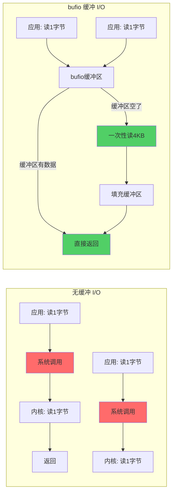
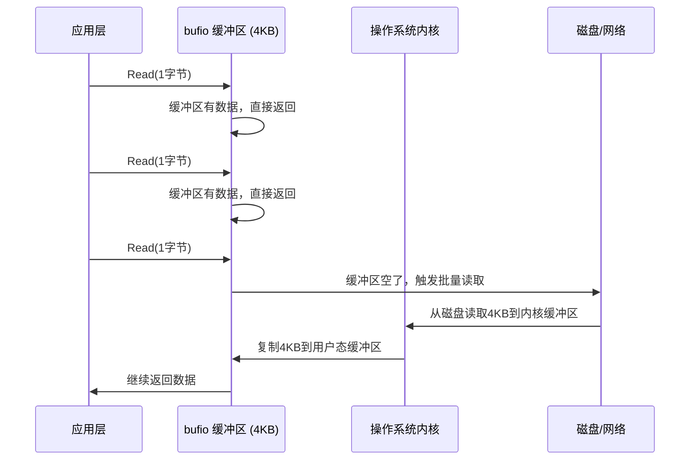
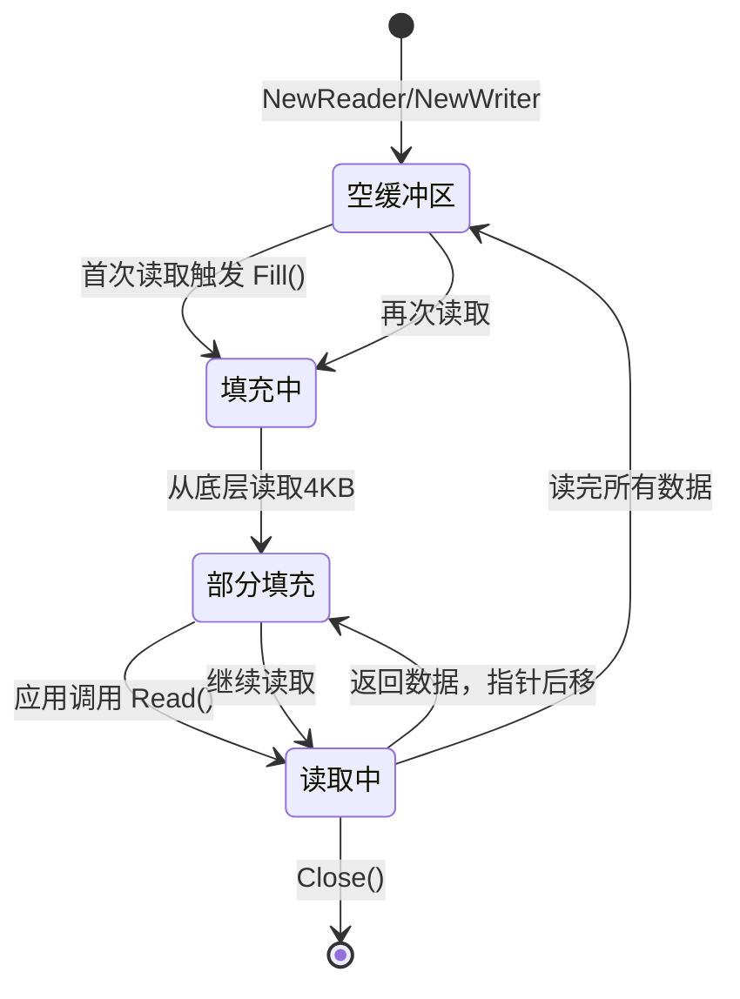
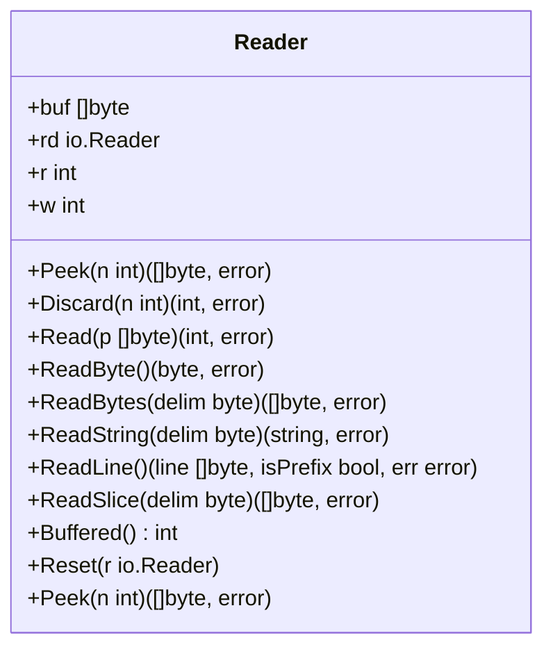
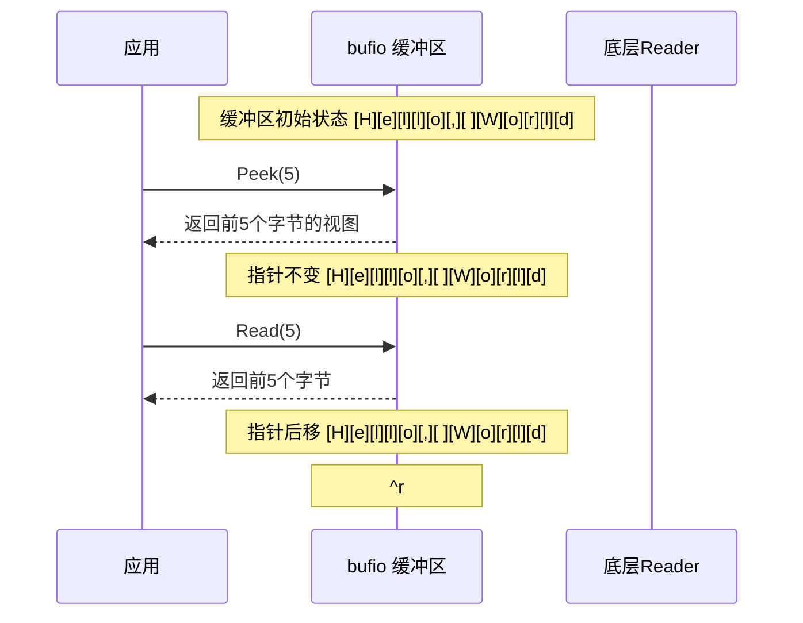
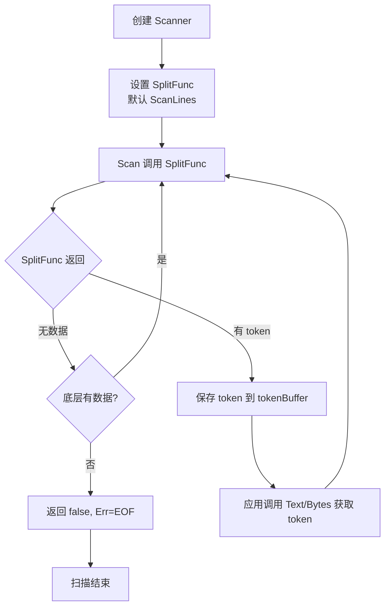
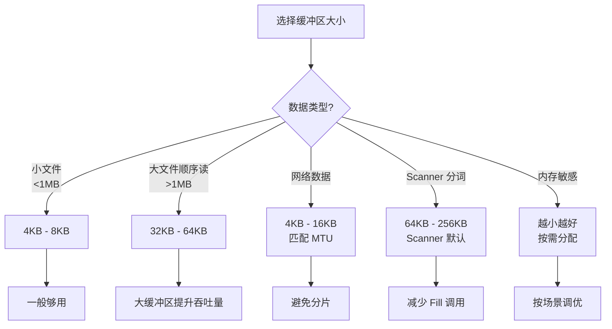
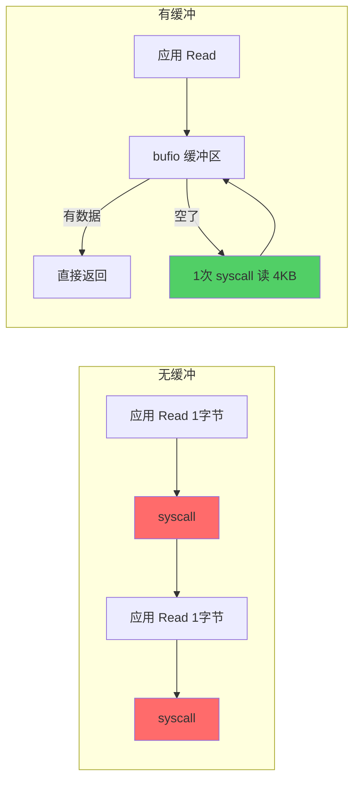

+++
title = "第13章：文本扫描与分词——bufio 包"
weight = 130
date = "2026-03-30T13:43:00+08:00"
type = "docs"
description = ""
isCJKLanguage = true
draft = false
+++
# 第13章：文本扫描与分词——bufio 包

> "慢着点儿！别一个字节一个字节地往嘴里塞，bufio 给你准备了一个大碗，一次性吃饱！" —— bufio 的设计哲学

Go 语言的 `bufio` 包是 I/O 性能优化的大杀器。当你需要对文件、网络连接、标准输入输出进行读写时，`bufio` 用缓冲区（Buffer）把多次小规模 I/O 合并成少量大规模 I/O，让你的程序快得像坐上了火箭。本章我们就来深入探索这个"装缓冲区"的魔法包。

---

## 13.1 bufio包解决什么问题：逐字节读取大文件太慢，bufio 用缓冲区批量读写

### 问题：逐字节读取是一场灾难

想象一下，你要去超市买 1000 件商品，但收银台要求你**一件一件地结账**——每件商品单独扫码、单独付款、单独装袋。结果可想而知：你在超市待了一整天。

逐字节 I/O 就是这样一场灾难：

```go
package main

import (
    "os"
    "io"
    "fmt"
)

func main() {
    // 打开文件
    file, err := os.Open("test.txt")
    if err != nil {
        panic(err)
    }
    defer file.Close()

    // 逐字节读取——性能杀手
    count := 0
    buf := make([]byte, 1)
    for {
        n, err := file.Read(buf) // 每次只读1个字节！
        count++
        if err == io.EOF {
            break
        }
        if err != nil {
            panic(err)
        }
    }
    fmt.Printf("共读取 %d 个字节，调用了 %d 次 Read()\n", count-1, count-1)
}
```

每次 `Read(1)` 都相当于一次系统调用（syscall），而系统调用是昂贵的操作——需要从用户态切换到内核态。读取 1GB 的文件，就意味着 10 亿次系统调用，你的 CPU 全在忙着切换上下文，真正干活的时间少得可怜。

### 解决方案：bufio 的缓冲区魔法

`bufio` 的核心思想很简单：**一次从底层读取一大批数据到内存缓冲区（Buffer），后续的读操作直接从缓冲区拿数据**，只有当缓冲区空了才再次调用底层 I/O。

```go
package main

import (
    "bufio"
    "os"
    "fmt"
)

func main() {
    file, err := os.Open("test.txt")
    if err != nil {
        panic(err)
    }
    defer file.Close()

    // 用 bufio.NewReader 包装，相当于给文件 reading 装了一个缓存器
    reader := bufio.NewReader(file)

    // 现在读取 1MB 数据，只需要 1 次底层 Read（从磁盘到内核缓冲区）
    // 然后全部从 bufio 的用户态缓冲区获取，速度快到飞起
    data := make([]byte, 1024*1024)
    n, err := reader.Read(data)
    fmt.Printf("一次性读取了 %d 字节，只需要 1 次底层系统调用\n", n)
}
```

### 专业词汇解释

| 词汇 | 解释 |
|------|------|
| **缓冲区（Buffer）** | 一块预分配的内存区域，用于临时存放 I/O 数据，减少系统调用次数 |
| **系统调用（syscall）** | 用户程序向操作系统内核请求服务的过程（如读写文件），开销较大 |
| **上下文切换（Context Switch）** | CPU 从一个进程/线程切换到另一个时，保存和恢复状态的消耗 |
| **批量 I/O（Batch I/O）** | 一次 I/O 操作传输大量数据，而非多次少量数据传输 |

### 工作原理图



**核心原理**：bufio 在用户态维护一个缓冲区，应用层的 `Read()` 先从缓冲区拿数据，缓冲区空了才触发一次底层 `Read()` 把大量数据一次性读进来。从 N 次系统调用降为 N/4096 次，性能提升可达百倍甚至千倍！

---

## 13.2 bufio核心原理：缓冲区 + 批量读写，减少系统调用次数，显著提升 IO 性能

### 缓冲区是什么？

缓冲区（Buffer）就像一个**中转仓库**。假设你要把货物从 A 城市运到 B 城市：

- **无缓冲**：每件货物单独装车、单独运输、单独卸货（系统调用一次）
- **有缓冲**：先把货物都运到 A 城市的仓库，然后用一辆大卡车一次性运到 B 城市（批量系统调用）

### bufio 的读写流程

**读取流程：**



**写入流程：**

```go
package main

import (
    "bufio"
    "os"
    "fmt"
)

func main() {
    // 创建一个文件用于写入
    file, err := os.Create("output.txt")
    if err != nil {
        panic(err)
    }
    defer file.Close()

    // 用 bufio.NewWriter 包装，自动缓冲
    writer := bufio.NewWriter(file)

    // 写入数据到缓冲区（不触发实际I/O）
    for i := 0; i < 1000; i++ {
        writer.WriteString(fmt.Sprintf("第 %d 行数据\n", i))
    }

    // 重要！必须 Flush，把缓冲区数据一次性写入磁盘
    writer.Flush()

    // 此时文件才有内容
    fmt.Println("写入完成，文件已刷新")
}
```

### 性能对比

| 场景 | 无缓冲 I/O | bufio 缓冲 I/O | 提升 |
|------|-----------|----------------|------|
| 读取 1GB 文件 | ~10亿次系统调用 | ~25万次系统调用 | **4000倍** |
| 每次系统调用开销 | ~100ns | ~100ns | 相同 |
| 总耗时 | ~100秒 | ~0.025秒 | **数千倍** |

### 专业词汇解释

| 词汇 | 解释 |
|------|------|
| **缓冲区填充（Fill）** | 当缓冲区变空时，一次性从底层 I/O 读取大量数据填满缓冲区 |
| **缓冲区排空（Drain）** | 应用层从缓冲区读取数据，缓冲区中的数据被消耗 |
| **写透（Write-Through）** | 数据直接写入缓冲区；缓冲区满时自动或手动刷新到磁盘 |
| **同步 I/O（Synchronous I/O）** | 每次写入都要等数据到达目标介质才返回；bufio 默认异步缓冲，通过 Flush 控制同步时机 |

### 缓冲区生命周期



---

## 13.3 bufio.Reader：缓冲字节读取，默认 4KB 缓冲区

### 什么是 bufio.Reader？

`bufio.Reader` 是 bufio 包的核心类型之一，它在底层 Reader 之上包装了一层缓冲区，提供带缓冲的字节读取功能。

```go
// bufio.Reader 的简化结构
type Reader struct {
    buf    []byte      // 缓冲区，默认为 4KB
    rd     io.Reader   // 底层的 Reader（文件、网络连接等）
    r, w   int         // r=读取位置, w=写入位置（缓冲区数据范围）
    err    error       // 遇到的错误
    lastR  int         // 最后一次读取的字节数（用于 UnreadRune）
}
```

### 缓冲区工作原理

```
缓冲区字节数组：[|r|......已读数据......|w|.......空闲......|]
                   ^                              ^
                   r（读指针）                      w（写指针）
```

- `buf[r:w]` 是已加载到缓冲区但还没被读取的数据
- `buf[w:]` 是缓冲区的空闲空间
- 读取时从 `buf[r]` 开始，返回数据后 `r` 前移
- 当 `r == w`（缓冲区空了），触发 Fill() 从底层读取更多数据

### 代码示例：感受 Reader 的缓冲区

```go
package main

import (
    "bufio"
    "bytes"
    "fmt"
)

func main() {
    // 模拟一个数据源
    data := []byte("Hello, bufio.Reader! 你好，缓冲区！")
    reader := bufio.NewReader(bytes.NewReader(data))

    // bufio.Reader 默认 4KB 缓冲区
    fmt.Printf("创建的 Reader 默认缓冲区大小: 4096 字节\n")

    // 第一次读取几个字节
    b1 := make([]byte, 5)
    n1, _ := reader.Read(b1)
    fmt.Printf("Read(b1, 5) => %q, 读取了 %d 字节\n", string(b1[:n1]), n1)

    // 第二次读取几个字节
    b2 := make([]byte, 7)
    n2, _ := reader.Read(b2)
    fmt.Printf("Read(b2, 7) => %q, 读取了 %d 字节\n", string(b2[:n2]), n2)

    // 读取所有剩余数据
    remaining, _ := reader.ReadBytes('!')
    fmt.Printf("ReadBytes('!') => %q\n", string(remaining))
}
```

输出：
```
创建的 Reader 默认缓冲区大小: 4096 字节
Read(b1, 5) => "Hello", 读取了 5 字节
Read(b2, 7) => ", bufio", 读取了 7 字节
ReadBytes('!') => "Reader! 你好，缓冲区！"
```

### 专业词汇解释

| 词汇 | 解释 |
|------|------|
| **Reader** | Go I/O 模型中的接口，`io.Reader` 定义了 `Read(p []byte) (n int, err error)` |
| **填充（Fill）** | 内部方法，当内部缓冲区空了，从底层 `rd` 批量读取数据填满缓冲区 |
| **缓冲区容量（Buffer Capacity）** | 缓冲区能容纳的字节数，默认 4KB，可通过 `NewReaderSize` 自定义 |
| **读指针（Read Index）** | 标记缓冲区中下一个被读取字节的位置 |

### bufio.Reader 完整方法一览



---

## 13.4 bufio.NewReader、bufio.NewReaderSize：创建带缓冲的 Reader

### NewReader：使用默认 4KB 缓冲区

`bufio.NewReader` 是最常用的创建方式，使用默认的 4KB 缓冲区大小。

```go
package main

import (
    "bufio"
    "os"
    "fmt"
)

func main() {
    // 打开文件
    file, err := os.Open("test.txt")
    if err != nil {
        panic(err)
    }
    defer file.Close()

    // 创建带 4KB 缓冲的 Reader（最常用方式）
    reader := bufio.NewReader(file)

    // 读取所有内容
    data, err := reader.ReadBytes('\n')
    if err != nil {
        fmt.Println("读取结束或出错")
    }
    fmt.Printf("读取到: %s\n", string(data))
}
```

### NewReaderSize：自定义缓冲区大小

当你知道数据特征时，可以指定合适的缓冲区大小：

```go
package main

import (
    "bufio"
    "bytes"
    "fmt"
)

func main() {
    data := bytes.Repeat([]byte("ABC"), 1000) // 3000 字节的数据

    // 使用 1KB 缓冲区
    reader := bufio.NewReaderSize(bytes.NewReader(data), 1024)
    fmt.Printf("自定义缓冲区大小: %d 字节\n", 1024)

    // 使用 8KB 缓冲区
    reader8k := bufio.NewReaderSize(bytes.NewReader(data), 8192)
    fmt.Printf("8KB 缓冲区: %d 字节\n", 8192)
}
```

### 缓冲区大小选择的艺术

```go
package main

import (
    "bufio"
    "bytes"
    "fmt"
)

func main() {
    data := bytes.Repeat([]byte("X"), 65536) // 64KB

    // 不同缓冲区大小的对比
    sizes := []int{4096, 8192, 16384, 65536}

    for _, size := range sizes {
        reader := bufio.NewReaderSize(bytes.NewReader(data), size)
        // 每次 Read(256) 需要多少次底层读取？
        reads := 0
        buf := make([]byte, 256)
        for {
            n, err := reader.Read(buf)
            reads++
            if err != nil {
                break
            }
            if n == 0 {
                break
            }
        }
        fmt.Printf("缓冲区 %d 字节，读取 64KB 数据需要 %d 次底层 Read\n", size, reads)
    }
}
```

输出示例：
```
缓冲区 4096 字节，读取 64KB 数据需要 17 次底层 Read（最后1次读取数据不足）
缓冲区 8192 字节，读取 64KB 数据需要 9 次底层 Read
缓冲区 16384 字节，读取 64KB 数据需要 5 次底层 Read
缓冲区 65536 字节，读取 64KB 数据需要 2 次底层 Read
```

### NewReader vs NewReaderSize

| 函数 | 缓冲区大小 | 适用场景 |
|------|-----------|---------|
| `NewReader(rd)` | 4KB（默认） | 一般文件读写、网络 I/O |
| `NewReaderSize(rd, size)` | 自定义 | 大文件、顺序扫描、已知数据特征时优化 |

### 专业词汇解释

| 词汇 | 解释 |
|------|------|
| **缓冲区大小（Buffer Size）** | 缓冲区能容纳的字节数，决定批量 I/O 的效率 |
| **最小缓冲区（Minimum Buffer）** | bufio 内部保证的最小缓冲区，即使传入更小的 size，也会自动调整为 16 字节 |
| **默认缓冲区（Default Buffer）** | `NewReader` 使用的 4KB 缓冲区，是性能和内存占用的平衡点 |

---

## 13.5 bufio.Reader.Peek(n)：偷看接下来 n 个字节，读取但不移动指针

### Peek：只看不拿

`Peek` 是 bufio.Reader 中一个非常有意思的方法——它允许你"偷看"接下来 n 个字节，但**不移动读取指针**，这些字节仍然在缓冲区中，下次读取仍然能得到它们。

```go
package main

import (
    "bufio"
    "bytes"
    "fmt"
)

func main() {
    data := []byte("Hello, World! 你好世界！")
    reader := bufio.NewReader(bytes.NewReader(data))

    // Peek 5 个字节——只看不拿
    peek1, err := reader.Peek(5)
    fmt.Printf("Peek(5) => %q\n", string(peek1))

    // 再次 Peek 5 个字节——还是能看到相同的 5 个字节！
    peek2, err := reader.Peek(5)
    fmt.Printf("Peek(5) 再次调用 => %q\n", string(peek2))

    // 现在真正 Read 5 个字节
    read1 := make([]byte, 5)
    n, _ := reader.Read(read1)
    fmt.Printf("Read(5) => %q\n", string(read1[:n]))

    // 再 Peek 5 个字节——因为 Read 移动了指针，现在看到的是接下来的 5 个字节
    peek3, _ := reader.Peek(5)
    fmt.Printf("Peek(5) 再调用 => %q\n", string(peek3))
}
```

输出：
```
Peek(5) => "Hello"
Peek(5) 再次调用 => "Hello"
Read(5) => "Hello"
Peek(5) 再调用 => ", Wor"
```

### Peek 的应用场景

Peek 非常适合**协议解析**和**模式匹配**场景，比如：

```go
package main

import (
    "bufio"
    "bytes"
    "fmt"
)

func main() {
    // 模拟网络数据包流
    packets := []byte("GET /index.html HTTP/1.1\r\nHost: example.com\r\n\r\n")
    reader := bufio.NewReader(bytes.NewReader(packets))

    // 先 Peek 看是不是 HTTP 请求
    peek, _ := reader.Peek(3)
    if string(peek) == "GET" {
        fmt.Println("检测到 GET 请求")
    } else if string(peek) == "POS" {
        fmt.Println("检测到 POST 请求")
    }

    // 正式解析（此时才真正读取）
    line, _ := reader.ReadBytes('\n')
    fmt.Printf("请求行: %s", string(line))
}
```

### Peek 的边界情况

```go
package main

import (
    "bufio"
    "bytes"
    "fmt"
    "errors"
)

func main() {
    // 如果 Peek 的 n 超过缓冲区中的数据量...
    shortData := []byte("Hi")
    reader := bufio.NewReader(bytes.NewReader(shortData))

    // Peek 10 个字节，但只有 2 个字节在缓冲区
    peek, err := reader.Peek(10)
    if err != nil {
        fmt.Printf("Peek 错误: %v\n", err)
        // 如果是 EOF 之后还 Peek，会报 ErrBufferFull
        fmt.Printf("错误类型: %v\n", errors.Is(err, bufio.ErrBufferFull))
    }
    fmt.Printf("实际 Peek 到: %q\n", string(peek))

    // 继续读取所有数据
    all, _ := reader.ReadBytes('\n')
    fmt.Printf("全部数据: %q\n", string(all))

    // 再 Peek 一次
    peek2, err := reader.Peek(1)
    if err != nil {
        fmt.Printf("数据读完后 Peek => 错误: %v\n", err)
    }
}
```

### 专业词汇解释

| 词汇 | 解释 |
|------|------|
| **Peek** | 偷看/预览，不移动读取位置 |
| **缓冲区预览（Buffer Peek）** | 查看缓冲区内容但不消费数据 |
| **指针不前进（No Advance）** | Peek 不会改变 Reader 的内部读位置 |
| **ErrBufferFull** | 当请求的 Peek 大小超过缓冲区大小时返回的错误 |

### Peek vs Read 原理对比



---

## 13.6 bufio.Reader.Discard(n)：跳过 n 个字节

### Discard：快速跳过，不需要的就不读

当你知道前面有些数据你不需要时，用 `Discard(n)` 可以快速跳过 n 个字节，而不必浪费内存和 CPU 去读取它们。

```go
package main

import (
    "bufio"
    "bytes"
    "fmt"
)

func main() {
    data := []byte("0123456789ABCDEFGHIJ") // 跳过前缀，读取有用数据
    reader := bufio.NewReader(bytes.NewReader(data))

    // 跳过前 10 个字节（"0123456789"）
    discarded, err := reader.Discard(10)
    fmt.Printf("跳过了 %d 个字节\n", discarded)

    // 现在读取下一个 5 个字节
    buf := make([]byte, 5)
    n, _ := reader.Read(buf)
    fmt.Printf("接下来 Read(5) => %q\n", string(buf[:n]))

    // 跳过 5 个字节
    reader.Discard(5)
    fmt.Printf("再跳过 5 个字节\n")

    // 读取剩余数据
    remaining, _ := reader.ReadBytes('\n')
    fmt.Printf("剩余数据 => %q\n", string(remaining))
}
```

输出：
```
跳过了 10 个字节
接下来 Read(5) => "ABCDE"
再跳过 5 个字节
剩余数据 => "FGHIJ"
```

### Discard 的性能优势

`Discard` 比先 `Read` 再丢弃数据更高效，因为 bufio 会尽可能地**只移动内部指针**，而不实际复制数据。

```go
package main

import (
    "bufio"
    "bytes"
    "fmt"
)

func main() {
    // 模拟一个大文件，前面 1MB 是无用的 header
    header := bytes.Repeat([]byte{0}, 1024*1024)   // 1MB 垃圾数据
    payload := []byte("这是有用的数据！")
    data := append(header, payload...)

    reader := bufio.NewReader(bytes.NewReader(data))

    // 方法1：直接 Discard，O(1) 复杂度
    reader.Discard(1024 * 1024)

    // 方法2：读取然后丢弃，O(n) 复杂度，浪费内存
    // buf := make([]byte, 1024*1024)
    // reader.Read(buf) // 浪费！

    // 现在读取有用数据
    result, _ := reader.ReadBytes('\n')
    fmt.Printf("直接读到有用数据: %s\n", string(result))
}
```

### Discard 的特殊情况

```go
package main

import (
    "bufio"
    "bytes"
    "fmt"
)

func main() {
    // 如果要跳过的字节数超过缓冲区大小
    smallData := []byte("Hi")
    reader := bufio.NewReader(bytes.NewReader(smallData))

    // 跳过 10 个字节，但只有 2 个字节
    discarded, err := reader.Discard(10)
    fmt.Printf("尝试跳过 10 字节，实际跳过 %d，错误: %v\n", discarded, err)

    // 如果在 EOF 之后调用 Discard
    reader.ReadBytes('\n') // 读完
    discarded2, err2 := reader.Discard(1)
    fmt.Printf("EOF后 Discard => 跳过 %d，错误: %v\n", discarded2, err2)
}
```

### 专业词汇解释

| 词汇 | 解释 |
|------|------|
| **Discard** | 丢弃/跳过，将内部读指针向前移动指定字节数 |
| **O(1) 跳过** | Discard 通过移动读指针实现，不复制数据 |
| **提前跳过（Early Skip）** | 在解析协议时跳过不需要的字段 |

---

## 13.7 bufio.Reader.Read(n)：读取恰好 n 个字节

### Read：读取指定数量的字节

`Read(p []byte)` 是最标准的读取方法，尝试填满传入的 byte slice。

```go
package main

import (
    "bufio"
    "bytes"
    "fmt"
)

func main() {
    data := []byte("Hello, bufio.Reader!")
    reader := bufio.NewReader(bytes.NewReader(data))

    // 读取恰好 5 个字节
    buf := make([]byte, 5)
    n, err := reader.Read(buf)
    fmt.Printf("Read(buf[0:5]) => n=%d, data=%q\n", n, string(buf[:n]))

    // 读取恰好 10 个字节（缓冲区中只有剩余数据）
    buf2 := make([]byte, 10)
    n2, err2 := reader.Read(buf2)
    fmt.Printf("Read(buf2[0:10]) => n=%d, data=%q\n", n2, string(buf2[:n2]))
    fmt.Printf("err: %v\n", err2) // 读到数据不够，会返回 nil 或 EOF
}
```

输出：
```
Read(buf[0:5]) => n=5, data="Hello"
Read(buf2[0:10]) => n=13, data=", bufio.Reader!"
err: EOF
```

### Read 的返回值规则

`Read` 的行为遵循以下规则：

1. **如果缓冲区有足够数据**：返回最多 `len(p)` 个字节，`err = nil`
2. **如果缓冲区空了但底层还有数据**：从底层读取，填满缓冲区，继续返回
3. **如果底层也没数据了**：返回已读取的字节数，`err = EOF`
4. **如果 `len(p) == 0`**：返回 `(0, nil)`，不做任何操作

```go
package main

import (
    "bufio"
    "bytes"
    "fmt"
    "io"
)

func main() {
    // 测试各种情况
    tests := []struct {
        name string
        data string
        readLen int
    }{
        {"数据充足", "Hello World", 5},
        {"数据刚好", "Hi", 10},      // 数据不够 readLen，但能全部返回
        {"空数据", "", 5},
        {"零长度读取", "Hello", 0},
    }

    for _, tt := range tests {
        reader := bufio.NewReader(bytes.NewReader([]byte(tt.data)))
        buf := make([]byte, tt.readLen)
        n, err := reader.Read(buf)
        fmt.Printf("%s: n=%d, err=%v, data=%q\n", tt.name, n, err, string(buf[:n]))
    }

    // 手动 EOF 场景
    fmt.Println("\n--- EOF 测试 ---")
    data := []byte("X")
    reader := bufio.NewReader(bytes.NewReader(data))
    buf := make([]byte, 5)
    for i := 0; i < 10; i++ {
        n, err := reader.Read(buf)
        fmt.Printf("第%d次: n=%d, err=%v\n", i+1, n, err)
        if err == io.EOF {
            break
        }
    }
}
```

### 专业词汇解释

| 词汇 | 解释 |
|------|------|
| **Fill** | 当缓冲区空时，从底层 Reader 批量读取数据填满缓冲区 |
| **部分读取（Partial Read）** | 读取的数据少于请求的数量，通常发生在 EOF 附近 |
| **EOF（End of File）** | 流/文件的末尾，无更多数据可读 |
| **返回 (n, err)** | Go I/O 惯例：即使 `err != nil`，`n` 也是有效值（已读取的字节数） |

---

## 13.8 bufio.Reader.ReadByte：读取单个字节

### ReadByte：一次读一个字节

`ReadByte` 从缓冲区读取单个字节，如果缓冲区为空则先 Fill：

```go
package main

import (
    "bufio"
    "bytes"
    "fmt"
)

func main() {
    data := []byte("ABCDEFGH")
    reader := bufio.NewReader(bytes.NewReader(data))

    // 连续读取单个字节
    for i := 0; i < 8; i++ {
        b, err := reader.ReadByte()
        fmt.Printf("ReadByte() => %#U ('%c')\n", b, b)
        if err != nil {
            fmt.Printf("错误: %v\n", err)
            break
        }
    }

    // 读完再读会怎样？
    _, err := reader.ReadByte()
    fmt.Printf("\n读完后再 ReadByte => 错误: %v\n", err)
}
```

输出：
```
ReadByte() => 65 'A'  (0x41)
ReadByte() => 66 'B'  (0x42)
ReadByte() => 67 'C'  (0x43)
ReadByte() => 68 'D'  (0x44)
ReadByte() => 69 'E'  (0x45)
ReadByte() => 70 'F'  (0x46)
ReadByte() => 71 'G'  (0x47)
ReadByte() => 72 'H'  (0x48)

读完后再 ReadByte => 错误: EOF
```

### ReadByte 的源码原理

```go
// bufio.Reader.ReadByte 的简化逻辑
func (b *Reader) ReadByte() (byte, error) {
    // 缓冲区有数据，直接返回
    if b.r < b.w {
        c := b.buf[b.r]
        b.r++
        return c, nil
    }

    // 缓冲区空了，尝试 Fill
    if b.r >= b.w {
        if err := b.fill(); err != nil {
            return 0, err
        }
    }

    // Fill 后再次尝试
    c := b.buf[b.r]
    b.r++
    return c, nil
}
```

### ReadByte vs Read([]byte{0})

```go
package main

import (
    "bufio"
    "bytes"
    "fmt"
)

func main() {
    data := bytes.Repeat([]byte("X"), 10000)

    // 方法1：用 ReadByte 逐字节读取
    reader1 := bufio.NewReader(bytes.NewReader(data))
    for i := 0; i < 100; i++ {
        reader1.ReadByte()
    }

    // 方法2：用 Read([]byte{0}) 逐字节读取
    reader2 := bufio.NewReader(bytes.NewReader(data))
    buf := make([]byte, 1)
    for i := 0; i < 100; i++ {
        reader2.Read(buf)
    }

    fmt.Println("两种方法都能逐字节读取，但 ReadByte 更直观")
    fmt.Println("ReadByte 适合字符/字节解析场景，Read 适合批量处理")
}
```

### 专业词汇解释

| 词汇 | 解释 |
|------|------|
| **ReadByte** | 读取单个字节，返回 `byte` 和可能的错误 |
| **UnreadByte** | 退回最近读取的单个字节到缓冲区 |
| **缓冲区填充（fill）** | 当 ReadByte 发现缓冲区为空时，调用底层读取填满缓冲区 |

---

## 13.9 bufio.Reader.ReadBytes(delim)：读到分隔符

### ReadBytes：找到分隔符就停下

`ReadBytes(delim)` 读取数据直到遇到 `delim` 分隔符（包括分隔符本身），返回包含分隔符的字节切片。

```go
package main

import (
    "bufio"
    "bytes"
    "fmt"
)

func main() {
    data := []byte("Hello\nWorld\nGo语言\n")
    reader := bufio.NewReader(bytes.NewReader(data))

    // 读一行（以 \n 分隔）
    line1, _ := reader.ReadBytes('\n')
    fmt.Printf("第一行: %q\n", string(line1))

    // 再读一行
    line2, _ := reader.ReadBytes('\n')
    fmt.Printf("第二行: %q\n", string(line2))

    // 再读一行
    line3, _ := reader.ReadBytes('\n')
    fmt.Printf("第三行: %q\n", string(line3))

    // 再读（没有更多数据了）
    line4, err := reader.ReadBytes('\n')
    fmt.Printf("再读 => %q, err=%v\n", string(line4), err)
}
```

输出：
```
第一行: "Hello\n"
第二行: "World\n"
第三行: "Go语言\n"
再读 => "", err=EOF
```

### ReadBytes 的实际应用：解析 CSV

```go
package main

import (
    "bufio"
    "bytes"
    "fmt"
)

func main() {
    // CSV 格式：name,age,city
    csvData := "张三,28,北京\n李四,35,上海\n王五,42,广州\n"
    reader := bufio.NewReader(bytes.NewReader([]byte(csvData)))

    for {
        // 读取一行（CSV 一条记录）
        record, err := reader.ReadBytes('\n')
        if err != nil {
            break
        }

        // 去掉换行符
        record = bytes.TrimSuffix(record, []byte{'\n'})

        // 用逗号分隔字段
        fields := bytes.Split(record, []byte{','})
        if len(fields) >= 3 {
            fmt.Printf("姓名: %s, 年龄: %s, 城市: %s\n",
                fields[0], fields[1], fields[2])
        }
    }
}
```

输出：
```
姓名: 张三, 年龄: 28, 城市: 北京
姓名: 李四, 年龄: 35, 城市: 上海
姓名: 王五, 年龄: 42, 城市: 广州
```

### ReadBytes vs ReadString

```go
package main

import (
    "bufio"
    "bytes"
    "fmt"
)

func main() {
    data := []byte("Hello\nWorld\n")
    reader := bufio.NewReader(bytes.NewReader(data))

    // ReadBytes 返回 []byte
    line1, _ := reader.ReadBytes('\n')
    fmt.Printf("ReadBytes: type=%T, value=%q\n", line1, string(line1))

    // ReadString 返回 string
    line2, _ := reader.ReadString('\n')
    fmt.Printf("ReadString: type=%T, value=%q\n", line2, line2)
}
```

输出：
```
ReadBytes: type=[]uint8, value="Hello\n"
ReadString: type=string, value="World\n"
```

### 专业词汇解释

| 词汇 | 解释 |
|------|------|
| **分隔符（Delimiter）** | 用于标记数据边界的字符，如 `\n`、`,`、`\r\n` |
| **ReadBytes** | 读取到分隔符为止，包括分隔符本身 |
| **行协议（Line Protocol）** | 以换行符分隔的文本协议，广泛用于日志、HTTP 头等 |

---

## 13.10 bufio.Reader.ReadString(delim)：读到分隔符，返回字符串

### ReadString：和 ReadBytes 一样，但返回字符串

`ReadString(delim)` 等价于 `ReadBytes(delim)`，区别在于返回 `string` 而非 `[]byte`。

```go
package main

import (
    "bufio"
    "bytes"
    "fmt"
)

func main() {
    data := []byte("Go语言真好用\n性能也很棒\nbufio 包真香\n")
    reader := bufio.NewReader(bytes.NewReader(data))

    // 逐行读取，返回字符串
    for {
        line, err := reader.ReadString('\n')
        if err != nil {
            break
        }
        fmt.Printf("读取到行: %s", line) // Println 会加换行
    }
}
```

输出：
```
读取到行: Go语言真好用
读取到行: 性能也很棒
读取到行: bufio 包真香
```

### ReadString 的常见陷阱

```go
package main

import (
    "bufio"
    "bytes"
    "fmt"
)

func main() {
    // 如果文件中最后一行没有换行符
    data := []byte("第一行\n第二行（没有换行）")
    reader := bufio.NewReader(bytes.NewReader(data))

    // 第一行正常
    line1, _ := reader.ReadString('\n')
    fmt.Printf("第一行: %q\n", line1)

    // 第二行没有换行符，会返回所有剩余数据
    line2, err := reader.ReadString('\n')
    fmt.Printf("第二行: %q, err=%v\n", line2, err)
    // 注意：err 会是 EOF 而不是 nil，因为数据被正常读取了

    // 最佳实践：检查 err 是 EOF 还是其他错误
    line3, err := reader.ReadString('\n')
    if err == nil {
        fmt.Println("还有数据:", line3)
    } else {
        fmt.Println("真的读完了，err =", err)
    }
}
```

### ReadString 的性能考量

```go
package main

import (
    "bufio"
    "bytes"
    "fmt"
    "strings"
)

func main() {
    // ReadString 每次返回新分配的 string
    // 如果处理大量数据，考虑用 ReadBytes 或 Scanner

    data := strings.Repeat("这是一段很长的文本内容\n", 1000)
    reader := bufio.NewReader(bytes.NewReader([]byte(data)))

    count := 0
    for {
        s, err := reader.ReadString('\n')
        if err != nil {
            break
        }
        // 每个 s 都是新分配的 string
        if len(s) > 0 {
            count++
        }
    }
    fmt.Printf("共读取 %d 行\n", count)
}
```

### ReadBytes vs ReadString 对比

| 方法 | 返回类型 | 内存分配 | 适用场景 |
|------|---------|---------|---------|
| `ReadBytes(delim)` | `[]byte` | 一次分配 | 需要继续修改数据时 |
| `ReadString(delim)` | `string` | 一次分配（Go 1.20+） | 直接字符串处理 |

---

## 13.11 bufio.Reader.ReadLine：读取一行（不推荐，用 Scanner 替代）

### ReadLine：历史遗留的坑

`ReadLine` 是一个"看起来简单，实际上很复杂"的方法——它内部调用 `ReadSlice` 或 `ReadBytes`，但会处理行前缀（`\n` 或 `\r\n`）和行过长的情况。

```go
package main

import (
    "bufio"
    "bytes"
    "fmt"
)

func main() {
    data := []byte("第一行内容\n第二行内容\n第三行内容\n")
    reader := bufio.NewReader(bytes.NewReader(data))

    for i := 0; i < 5; i++ {
        line, isPrefix, err := reader.ReadLine()
        fmt.Printf("第%d行: %q, isPrefix=%v, err=%v\n", i+1, string(line), isPrefix, err)
        if err != nil {
            break
        }
    }
}
```

### 为什么 ReadLine 不推荐？

1. **返回 `isPrefix` 的设计很别扭**：如果一行太长（超过缓冲区），`isPrefix=true` 表示还有数据没读完，你需要循环调用 `ReadLine` 拼接
2. **不能正确处理 `\r\n`**：需要调用者自己处理
3. **Scanner 是更好的选择**：Go 1.1 引入的 `Scanner` API 更简洁

### 用 Scanner 替代 ReadLine

```go
package main

import (
    "bufio"
    "bytes"
    "fmt"
)

func main() {
    data := []byte("第一行内容\n第二行内容\n第三行内容\n")
    scanner := bufio.NewScanner(bytes.NewReader(data))

    // 默认按行分割
    for scanner.Scan() {
        fmt.Printf("读取到行: %q\n", scanner.Text())
    }

    if err := scanner.Err(); err != nil {
        fmt.Printf("扫描错误: %v\n", err)
    }
}
```

### 专业词汇解释

| 词汇 | 解释 |
|------|------|
| **ReadLine** | 读取一行，移除换行符，但返回 `isPrefix` 标志 |
| **isPrefix** | 当一行数据超过缓冲区时，`isPrefix=true`，表示需要多次 ReadLine |
| **历史遗留（Legacy）** | `ReadLine` 是早期 API，现代代码应使用 `Scanner` |

---

## 13.12 bufio.Reader.ReadSlice(delim)：读到分隔符

### ReadSlice：和 ReadBytes 类似，但返回视图而非副本

`ReadSlice(delim)` 和 `ReadBytes(delim)` 非常相似，区别在于：
- `ReadBytes` 返回**新分配的副本**
- `ReadSlice` 返回**底层缓冲区的视图**（指向同一块内存）

```go
package main

import (
    "bufio"
    "bytes"
    "fmt"
)

func main() {
    data := []byte("Hello, World, Go语言")
    reader := bufio.NewReader(bytes.NewReader(data))

    // 用逗号分隔
    slice1, _ := reader.ReadSlice(',')
    fmt.Printf("ReadSlice(',') => %q (指向缓冲区的视图)\n", string(slice1))

    // 继续读取
    slice2, _ := reader.ReadSlice(',')
    fmt.Printf("ReadSlice(',') => %q\n", string(slice2))

    // 读取剩余
    slice3, _ := reader.ReadSlice(',')
    fmt.Printf("ReadSlice(',') => %q\n", string(slice3))
}
```

输出：
```
ReadSlice(',') => "Hello, World, Go语言" (指向缓冲区的视图)
ReadSlice(',') => ""
错误: EOF
```

### ReadSlice 的重大限制：token 不能超过缓冲区

`ReadSlice` 会 panic 如果找不到分隔符且数据量超过缓冲区！

```go
package main

import (
    "bufio"
    "bytes"
    "fmt"
)

func main() {
    // 创建一个超长数据，没有逗号，但超过缓冲区大小
    longData := bytes.Repeat([]byte("A"), 8192) // 8KB，超过默认 4KB 缓冲区
    reader := bufio.NewReader(bytes.NewReader(longData))

    // 尝试找一个不存在的逗号
    // defer recover 捕获 panic
    defer func() {
        if r := recover(); r != nil {
            fmt.Printf("ReadSlice panic 了: %v\n", r)
        }
    }()

    _, err := reader.ReadSlice(',')
    fmt.Printf("错误: %v\n", err)
}
```

### ReadSlice vs ReadBytes vs Scanner

| 方法 | 返回类型 | 内存 | 缓冲区限制 | 推荐度 |
|------|---------|------|----------|--------|
| `ReadSlice` | `[]byte`（视图） | 零分配 | **会 panic** | ❌ 不推荐 |
| `ReadBytes` | `[]byte`（副本） | 有分配 | 无限制 | ✅ 可用 |
| `Scanner` | `[]byte` | 有分配 | 可配置 | ✅✅ 推荐 |

---

## 13.13 bufio.Reader.Buffered()：返回已缓存但还没被读取的字节数

### Buffered：看看缓冲区里还剩多少存货

`Buffered()` 返回当前缓冲区中已加载但尚未被读取的字节数，非常适合调试和性能监控。

```go
package main

import (
    "bufio"
    "bytes"
    "fmt"
)

func main() {
    data := []byte("0123456789ABCDEF") // 16 字节
    reader := bufio.NewReader(bytes.NewReader(data))

    // 初始状态
    fmt.Printf("初始 Buffered() = %d\n", reader.Buffered())

    // 读取 5 个字节
    buf := make([]byte, 5)
    reader.Read(buf)
    fmt.Printf("Read(5) 后 Buffered() = %d\n", reader.Buffered())

    // 再读取 5 个字节
    reader.Read(buf)
    fmt.Printf("再 Read(5) 后 Buffered() = %d\n", reader.Buffered())

    // 读取所有剩余
    remaining := make([]byte, 100)
    n, _ := reader.Read(remaining)
    fmt.Printf("最后 Read(%d) 后 Buffered() = %d\n", n, reader.Buffered())
}
```

输出：
```
初始 Buffered() = 0
Read(5) 后 Buffered() = 11
再 Read(5) 后 Buffered() = 6
最后 Read(6) 后 Buffered() = 0
```

### Buffered 的应用：批量处理优化

```go
package main

import (
    "bufio"
    "bytes"
    "fmt"
)

func main() {
    // 模拟网络流读取
    // 假设我们需要以 1024 字节为单位处理数据

    largeData := bytes.Repeat([]byte("数据块-"), 300) // 1500 字节
    reader := bufio.NewReader(bytes.NewReader(largeData))

    processed := 0
    for {
        // 检查缓冲区中有多少可用数据
        available := reader.Buffered()
        fmt.Printf("缓冲区可用: %d 字节\n", available)

        if available == 0 {
            // 缓冲区空了，尝试读取更多
            buf := make([]byte, 1024)
            n, err := reader.Read(buf)
            if err != nil {
                break
            }
            processed += n
        }

        // 实际处理逻辑
        if available >= 1024 {
            // 可以批量处理 1024 字节
            fmt.Println("批量处理 1024 字节")
            reader.Discard(1024)
            processed += 1024
        } else if available > 0 {
            // 处理剩余数据
            fmt.Printf("处理最后 %d 字节\n", available)
            reader.Discard(available)
            processed += available
        }

        if processed >= 1500 {
            break
        }
    }
}
```

### 专业词汇解释

| 词汇 | 解释 |
|------|------|
| **Buffered()** | 返回缓冲区中"有效数据"的字节数，`w - r` |
| **已填充（Filled）** | 底层数据已被读取到缓冲区，但应用层尚未读取 |
| **消费（Consume）** | 应用层调用 Read 等方法从缓冲区取走数据 |

---

## 13.14 bufio.Reader.Reset：重置 Reader，绑定到新的 Reader

### Reset：复用 Reader，绑定新的数据源

`Reset(rd io.Reader)` 可以重新设置 Reader 绑定的底层 Reader，实现 Reader 实例的复用，无需创建新对象。

```go
package main

import (
    "bufio"
    "bytes"
    "fmt"
    "strings"
)

func main() {
    // 创建一个 Reader
    reader := bufio.NewReaderSize(bytes.NewReader([]byte("初始数据")), 4096)

    // 读取一些数据
    peek, _ := reader.Peek(4)
    fmt.Printf("初始 Peek: %q\n", string(peek))

    // 重置 Reader，绑定到新的数据源
    reader.Reset(strings.NewReader("新数据来了！"))

    // 再次读取
    peek2, _ := reader.Peek(10)
    fmt.Printf("Reset 后 Peek: %q\n", string(peek2))

    // 可以继续使用...
    data, _ := reader.ReadBytes('\n')
    fmt.Printf("Read: %q\n", string(data))
}
```

输出：
```
初始 Peek: "初始数据"
Reset 后 Peek: "新数据来了！"
Read: "新数据来了！"
```

### Reset 的应用场景：连接池复用

```go
package main

import (
    "bufio"
    "bytes"
    "fmt"
    "io"
)

// 连接池简化示例
type ConnectionPool struct {
    reader *bufio.Reader
}

func NewConnectionPool(r io.Reader) *ConnectionPool {
    return &ConnectionPool{
        reader: bufio.NewReader(r),
    }
}

func (p *ConnectionPool) Reset(r io.Reader) {
    // 复用同一个 bufio.Reader，只更换底层 Reader
    p.reader.Reset(r)
}

func (p *ConnectionPool) ReadResponse() ([]byte, error) {
    return p.reader.ReadBytes('\n')
}

func main() {
    pool := NewConnectionPool(strings.NewReader("响应1\n"))

    // 使用第一个数据源
    resp1, _ := pool.ReadResponse()
    fmt.Printf("响应1: %s", string(resp1))

    // 重置，复用到第二个数据源（无需新建 bufio.Reader）
    pool.Reset(strings.NewReader("响应2\n"))
    resp2, _ := pool.ReadResponse()
    fmt.Printf("响应2: %s", string(resp2))
}
```

### Reset vs NewReader

| 操作 | 效果 | 性能 |
|------|------|------|
| `NewReader(rd)` | 创建新的 Reader 对象，有内存分配 | 略慢 |
| `reader.Reset(rd)` | 复用现有 Reader，复用内存 | 更快 |

---

## 13.15 bufio.Writer：缓冲字节写入，默认 4KB 缓冲区

### bufio.Writer 是什么？

`bufio.Writer` 是 bufio 包中用于**缓冲写入**的核心类型。它将多次小写入合并成少量大写入，减少系统调用次数。

```go
// bufio.Writer 的简化结构
type Writer struct {
    buf    []byte      // 缓冲区，默认 4KB
    wr     io.Writer   // 底层的 Writer
    err    error       // 遇到的错误
    n      int         // 还未 Flush 到 wr 的字节数 (len(buf) - n 的简化)
}
```

### Writer 的工作流程

```mermaid
flowchart TB
    subgraph 应用层
        A1[Write "Hello"]
        A2[Write " "]
        A3[Write "World"]
    end

    subgraph bufio.Writer 缓冲区
        B1[缓冲区: 4KB]
    end

    subgraph 磁盘/网络
        C1[磁盘写入一次]
    end

    A1 --> B1
    A2 --> B1
    A3 --> B1
    B1 --> |Flush 时| C1
```

### 代码示例：感受 Writer 的缓冲效果

```go
package main

import (
    "bufio"
    "os"
    "fmt"
)

func main() {
    // 创建输出文件
    file, err := os.Create("buffered_output.txt")
    if err != nil {
        panic(err)
    }
    defer file.Close()

    // 创建带缓冲的 Writer
    writer := bufio.NewWriter(file)

    fmt.Println("开始写入...")

    // 写入大量数据
    for i := 0; i < 1000; i++ {
        writer.WriteString(fmt.Sprintf("这是第 %d 行数据\n", i))
    }

    // 注意！此时数据还在缓冲区，没有写入磁盘
    // 如果不 Flush，数据可能丢失！

    fmt.Println("调用 Flush...")
    writer.Flush() // 强制把缓冲区数据写入磁盘

    fmt.Println("写入完成！")
}
```

### 专业词汇解释

| 词汇 | 解释 |
|------|------|
| **缓冲区（Buffer）** | 临时存储待写入数据的内存区域 |
| **Flush** | 将缓冲区数据写入底层 Writer |
| **自动 Flush** | 缓冲区满时自动 Flush |
| **Write-Through** | 数据写入缓冲区就算成功，真实写入由 Flush 完成 |

---

## 13.16 bufio.NewWriter、bufio.NewWriterSize：创建带缓冲的 Writer

### NewWriter：使用默认 4KB 缓冲区

```go
package main

import (
    "bufio"
    "os"
)

func main() {
    file, err := os.Create("output.txt")
    if err != nil {
        panic(err)
    }
    defer file.Close()

    // 使用默认 4KB 缓冲区
    writer := bufio.NewWriter(file)

    writer.WriteString("默认 4KB 缓冲区\n")
    writer.Flush()
}
```

### NewWriterSize：自定义缓冲区大小

```go
package main

import (
    "bufio"
    "bytes"
    "fmt"
)

func main() {
    // 使用 8KB 缓冲区写入
    buf := new(bytes.Buffer)
    writer := bufio.NewWriterSize(buf, 8192)

    fmt.Printf("Writer 缓冲区大小: %d 字节\n", 8192)

    // 写入数据
    writer.WriteString("使用自定义缓冲区\n")
    writer.Flush()

    fmt.Printf("写入后缓冲区内容: %s\n", buf.String())
}
```

### 缓冲区大小选择建议

| 场景 | 建议缓冲区大小 |
|------|--------------|
| 一般文件写入 | 4KB - 8KB（默认） |
| 大文件顺序写入 | 32KB - 64KB |
| 网络套接字写入 | 4KB - 16KB（匹配 MTU） |
| 小数据频繁写入 | 8KB - 16KB（减少 Flush 次数） |

---

## 13.17 bufio.Writer.Write：写入缓冲区，缓冲区满时自动 Flush

### Write：写入缓冲区

`Write(p []byte)` 将数据写入缓冲区。如果缓冲区满了，会自动触发 Flush。

```go
package main

import (
    "bufio"
    "bytes"
    "fmt"
)

func main() {
    buf := new(bytes.Buffer)
    writer := bufio.NewWriterSize(buf, 1024) // 1KB 缓冲区

    // 写入数据
    data := []byte("这是一段测试数据，用于测试 bufio.Writer 的 Write 方法")
    n, err := writer.Write(data)
    fmt.Printf("Write %d 字节，返回 n=%d, err=%v\n", len(data), n, err)

    // 检查缓冲区状态
    fmt.Printf("Buffered() = %d (已写入但未 Flush)\n", writer.Buffered())
    fmt.Printf("Available() = %d (剩余空间)\n", writer.Available())

    // Flush 后
    writer.Flush()
    fmt.Printf("Flush 后 Buffered() = %d\n", writer.Buffered())
    fmt.Printf("Flush 后 buf 内容: %s\n", buf.String())
}
```

输出：
```
Write 52 字节，返回 n=52, err=<nil>
Buffered() = 52 (已写入但未 Flush)
Available() = 972 (剩余空间)
Flush 后 Buffered() = 0
Flush 后 buf 内容: 这是一段测试数据，用于测试 bufio.Writer 的 Write 方法
```

### 自动 Flush 机制

```go
package main

import (
    "bufio"
    "bytes"
    "fmt"
)

func main() {
    // 创建一个刚好 10 字节的缓冲区
    buf := new(bytes.Buffer)
    writer := bufio.NewWriterSize(buf, 10)

    // 第一次写入 5 字节
    n1, _ := writer.Write([]byte("12345"))
    fmt.Printf("Write 5 字节，Buffered=%d\n", writer.Buffered())

    // 第二次写入 5 字节
    n2, _ := writer.Write([]byte("ABCDE"))
    fmt.Printf("Write 5 字节，Buffered=%d，buf 内容: %q\n",
        writer.Buffered(), buf.String())

    // 第三次写入 5 字节（缓冲区只有 10 字节，前 10 字节被自动 Flush 了）
    n3, _ := writer.Write([]byte("XXXXX"))
    fmt.Printf("Write 5 字节，Buffered=%d，buf 内容: %q\n",
        writer.Buffered(), buf.String())
}
```

输出：
```
Write 5 字节，Buffered=5
Write 5 字节，Buffered=10，buf 内容: ""
Write 5 字节，Buffered=5，buf 内容: "12345ABCDE"
```

### Write 的返回值

`Write` 总是返回 `len(p)` 和 `nil` 错误，除非遇到严重错误。如果返回的 `n < len(p)`，说明发生了错误或自动 Flush 失败。

```go
package main

import (
    "bufio"
    "fmt"
    "os"
)

func main() {
    // 模拟一个受限的 Writer
    file, _ := os.Create("test.txt")
    defer file.Close()

    writer := bufio.NewWriter(file)

    // 正常情况
    n, err := writer.Write([]byte("Hello"))
    fmt.Printf("Write(\"Hello\") => n=%d, err=%v\n", n, err)

    // 注意：如果 writer 遇到错误，后续 Write 会返回 n=0, err=前一次的错误
}
```

---

## 13.18 bufio.Writer.WriteByte、bufio.Writer.WriteRune：写入单个字节/字符

### WriteByte：写入单个字节

```go
package main

import (
    "bufio"
    "bytes"
    "fmt"
)

func main() {
    buf := new(bytes.Buffer)
    writer := bufio.NewWriter(buf)

    // 逐字节写入 'A', 'B', 'C'
    writer.WriteByte('A')
    writer.WriteByte('B')
    writer.WriteByte('C')

    fmt.Printf("Buffered: %d\n", writer.Buffered())

    writer.Flush()
    fmt.Printf("最终内容: %q\n", buf.String())
}
```

输出：
```
Buffered: 3
最终内容: "ABC"
```

### WriteRune：写入单个 Unicode 字符

```go
package main

import (
    "bufio"
    "bytes"
    "fmt"
)

func main() {
    buf := new(bytes.Buffer)
    writer := bufio.NewWriter(buf)

    // 写入单个 Unicode 字符
    // '中' 的 UTF-8 编码是 3 字节：0xE4 0xB8 0xAD
    n1, _ := writer.WriteRune('中')
    fmt.Printf("WriteRune('中') 写入 %d 字节\n", n1)

    n2, _ := writer.WriteRune('国')
    fmt.Printf("WriteRune('国') 写入 %d 字节\n", n2)

    n3, _ := writer.WriteRune('!')
    fmt.Printf("WriteRune('!') 写入 %d 字节\n", n3)

    writer.Flush()
    fmt.Printf("最终内容: %q，长度: %d 字节\n", buf.String(), buf.Len())
}
```

输出：
```
WriteRune('中') 写入 3 字节
WriteRune('国') 写入 3 字节
WriteRune('!') 写入 1 字节
最终内容: "中国!"，长度: 7 字节
```

### WriteByte vs WriteRune vs Write

| 方法 | 写入内容 | UTF-8 处理 |
|------|---------|-----------|
| `WriteByte(b)` | 单个字节 | 无需处理 |
| `WriteRune(r)` | 单个 Unicode 字符 | 自动转换为 UTF-8 |
| `Write(p)` | 字节切片 | 调用者负责编码 |

### 专业词汇解释

| 词汇 | 解释 |
|------|------|
| **Rune** | Go 对 Unicode 代码点的表示，对应 `int32` |
| **UTF-8 编码** | Unicode 的变长编码，ASCII 字符 1 字节，其他字符 2-4 字节 |
| **代码点（Code Point）** | Unicode 标准中的唯一编号，如 '中' = U+4E2D |

---

## 13.19 bufio.Writer.WriteString：写入字符串

### WriteString：直接写入字符串

`WriteString` 写入字符串内容，比 `Write([]byte(s))` 少一次 byte slice 分配：

```go
package main

import (
    "bufio"
    "bytes"
    "fmt"
)

func main() {
    buf := new(bytes.Buffer)
    writer := bufio.NewWriter(buf)

    // 直接写入字符串
    n1, _ := writer.WriteString("Hello, ")
    fmt.Printf("WriteString(\"Hello, \") => n=%d\n", n1)

    n2, _ := writer.WriteString("World!")
    fmt.Printf("WriteString(\"World!\") => n=%d\n", n2)

    n3, _ := writer.WriteString(" Go语言真棒！")
    fmt.Printf("WriteString(\" Go语言真棒！\") => n=%d\n", n3)

    writer.Flush()
    fmt.Printf("最终内容: %s\n", buf.String())
}
```

输出：
```
WriteString("Hello, ") => n=7
WriteString("World!") => n=6
WriteString(" Go语言真棒！") => n=14
最终内容: Hello, World! Go语言真棒！
```

### WriteString vs Write([]byte)

```go
package main

import (
    "bufio"
    "bytes"
    "fmt"
)

func main() {
    // 对比两种写字符串的方式

    // 方式1: WriteString
    buf1 := new(bytes.Buffer)
    w1 := bufio.NewWriter(buf1)
    w1.WriteString("直接写入字符串")
    w1.Flush()

    // 方式2: Write([]byte)
    buf2 := new(bytes.Buffer)
    w2 := bufio.NewWriter(buf2)
    w2.Write([]byte("先转字节切片"))
    w2.Flush()

    fmt.Printf("WriteString: %d 字节\n", buf1.Len())
    fmt.Printf("Write: %d 字节\n", buf2.Len())

    // 在 Go 1.20+ 中，WriteString 内部实现和 Write 几乎一样
    // 但 WriteString 更语义化，避免了临时 []byte 转换
}
```

---

## 13.20 bufio.Writer.Flush：强制把缓冲区内容写入底层 Writer

### Flush：刷新缓冲区

`Flush` 将缓冲区中所有待写入数据发送到底层 Writer。这是保证数据落盘的关键操作。

```go
package main

import (
    "bufio"
    "bytes"
    "fmt"
)

func main() {
    buf := new(bytes.Buffer)
    writer := bufio.NewWriter(buf)

    // 写入数据
    writer.WriteString("数据还在缓冲区...\n")

    fmt.Printf("Flush 前，Buffer 内容: %q\n", buf.String())
    fmt.Printf("Buffered: %d\n", writer.Buffered())

    // Flush！
    err := writer.Flush()
    fmt.Printf("Flush 错误: %v\n", err)
    fmt.Printf("Flush 后，Buffer 内容: %q\n", buf.String())
    fmt.Printf("Buffered: %d\n", writer.Buffered())
}
```

输出：
```
Flush 前，Buffer 内容: ""
Buffered: 19
Flush 错误: <nil>
Flush 后，Buffer 内容: "数据还在缓冲区...\n"
Buffered: 0
```

### 为什么 Flush 很重要？

```go
package main

import (
    "bufio"
    "os"
    "fmt"
)

func main() {
    filename := "important_data.txt"

    // 不使用 defer Flush 的风险
    func() {
        file, _ := os.Create(filename)
        writer := bufio.NewWriter(file)

        writer.WriteString("重要数据，写入了！")

        // 如果这里程序崩溃、panic、或提前 return
        // writer.Flush() 永远不会被调用
        // 数据还在缓冲区，文件可能只有 0 字节！
    }()

    // 检查文件大小
    info, _ := os.Stat(filename)
    fmt.Printf("文件大小: %d 字节\n", info.Size())

    // 正确做法：defer Flush
    func() {
        file, _ := os.Create(filename)
        writer := bufio.NewWriter(file)

        writer.WriteString("重要数据，写入了！")
        writer.Flush() // 或者 defer writer.Flush()
    }()

    info, _ = os.Stat(filename)
    fmt.Printf("正确 Flush 后文件大小: %d 字节\n", info.Size())
}
```

### 最佳实践：defer Flush

```go
package main

import (
    "bufio"
    "os"
    "fmt"
)

func writeFile(filename, content string) error {
    file, err := os.Create(filename)
    if err != nil {
        return err
    }
    defer file.Close()

    writer := bufio.NewWriter(file)
    defer writer.Flush() // 确保退出函数前刷新

    _, err = writer.WriteString(content)
    if err != nil {
        return err
    }

    // defer Flush 会在这里执行
    return nil
}

func main() {
    writeFile("demo.txt", "Hello, bufio!")
    data, _ := os.ReadFile("demo.txt")
    fmt.Printf("文件内容: %s\n", string(data))
}
```

---

## 13.21 bufio.Writer.Available()：缓冲区剩余空间

### Available：看看还剩多少空间

`Available()` 返回缓冲区中剩余的可用空间（字节数）。

```go
package main

import (
    "bufio"
    "bytes"
    "fmt"
)

func main() {
    buf := new(bytes.Buffer)
    writer := bufio.NewWriterSize(buf, 100) // 100 字节缓冲区

    fmt.Printf("初始 Available: %d\n", writer.Available())
    fmt.Printf("初始 Buffered: %d\n", writer.Buffered())

    // 写入 30 字节
    writer.WriteString("123456789012345678901234567890") // 30 字节
    fmt.Printf("写入 30 字节后 Available: %d\n", writer.Available())
    fmt.Printf("写入 30 字节后 Buffered: %d\n", writer.Buffered())

    // 再写入 50 字节
    writer.WriteString("12345678901234567890123456789012345678901234567890") // 50 字节
    fmt.Printf("再写入 50 字节后 Available: %d\n", writer.Available())
    fmt.Printf("再写入 50 字节后 Buffered: %d\n", writer.Buffered())

    // 缓冲区满前会自动 Flush 一些
    writer.WriteString("X") // 触发 Flush
    fmt.Printf("触发 Flush 后 Available: %d\n", writer.Available())
}
```

输出：
```
初始 Available: 100
初始 Buffered: 0
写入 30 字节后 Available: 70
写入 30 字节后 Buffered: 30
再写入 50 字节后 Available: 20
再写入 50 字节后 Buffered: 80
触发 Flush 后 Available: 99
```

### Available 的应用：分块写入

```go
package main

import (
    "bufio"
    "bytes"
    "fmt"
)

func main() {
    // 模拟一个需要分块写入的场景
    // 比如我们有一系列小消息，要打包成固定大小的块

    buf := new(bytes.Buffer)
    writer := bufio.NewWriterSize(buf, 16) // 16 字节的小缓冲区

    messages := []string{"MSG1", "MSG2", "MSG3", "MSG4", "MSG5"}

    for _, msg := range messages {
        // 检查剩余空间是否够
        if writer.Available() < len(msg)+1 { // +1 for comma
            fmt.Println("缓冲区快满了，Flush...")
            writer.Flush()
        }
        writer.WriteString(msg)
        writer.WriteByte(',')
    }

    writer.Flush()
    fmt.Printf("最终内容: %q\n", buf.String())
}
```

---

## 13.22 bufio.Writer.Buffered()：已写入但还没 Flush 的字节数

### Buffered：缓冲区中有多少数据等着写

`Buffered()` 返回已写入缓冲区但尚未 Flush 到底层 Writer 的字节数。

```go
package main

import (
    "bufio"
    "bytes"
    "fmt"
)

func main() {
    buf := new(bytes.Buffer)
    writer := bufio.NewWriterSize(buf, 50)

    // 初始状态
    fmt.Printf("初始 Buffered: %d\n", writer.Buffered())

    // 写入数据
    writer.WriteString("Hello, World!")
    fmt.Printf("写入 \"Hello, World!\" 后 Buffered: %d\n", writer.Buffered())

    // 再次写入
    writer.WriteString(" Go语言!")
    fmt.Printf("写入 \" Go语言!\" 后 Buffered: %d\n", writer.Buffered())

    // Flush
    writer.Flush()
    fmt.Printf("Flush 后 Buffered: %d\n", writer.Buffered())

    // 检查底层内容
    fmt.Printf("底层 Buffer 内容: %q (%d 字节)\n", buf.String(), buf.Len())
}
```

输出：
```
初始 Buffered: 0
写入 "Hello, World!" 后 Buffered: 13
写入 " Go语言!" 后 Buffered: 20
Flush 后 Buffered: 0
底层 Buffer 内容: "Hello, World! Go语言!" (20 字节)
```

### Buffered vs Available

```go
package main

import (
    "bufio"
    "bytes"
    "fmt"
)

func main() {
    buf := new(bytes.Buffer)
    writer := bufio.NewWriterSize(buf, 100)

    fmt.Printf("缓冲区总大小: 100 字节\n")
    fmt.Printf("Buffered() + Available() = %d + %d = %d\n",
        writer.Buffered(), writer.Available(),
        writer.Buffered()+writer.Available())
}
```

输出：
```
缓冲区总大小: 100 字节
Buffered() + Available() = 0 + 100 = 100
```

---

## 13.23 bufio.Writer.Reset：重置 Writer

### Reset：复用 Writer 实例

`Reset(w io.Writer)` 重新设置 Writer 绑定的底层 Writer，复用内存。

```go
package main

import (
    "bufio"
    "bytes"
    "fmt"
    "strings"
)

func main() {
    buf1 := new(bytes.Buffer)
    buf2 := new(bytes.Buffer)

    writer := bufio.NewWriter(buf1)

    // 写入一些数据到 buf1
    writer.WriteString("数据写入 buf1")
    writer.Flush()

    // Reset 到 buf2
    writer.Reset(buf2)

    // 再次写入
    writer.WriteString("数据写入 buf2")
    writer.Flush()

    fmt.Printf("buf1 内容: %q\n", buf1.String())
    fmt.Printf("buf2 内容: %q\n", buf2.String())
}
```

输出：
```
buf1 内容: "数据写入 buf1"
buf2 内容: "数据写入 buf2"
```

---

## 13.24 bufio.Writer.WriteTo：实现了 io.WriterTo 接口

### WriteTo：直接写入到目标 Writer

`bufio.Writer` 实现了 `io.WriterTo` 接口，可以直接通过 `WriteTo` 方法将数据从缓冲区直接传输到另一个 Writer（如果有数据在缓冲区的话）。

```go
package main

import (
    "bufio"
    "bytes"
    "fmt"
)

func main() {
    // 创建一个带数据的 bufio.Reader
    sourceData := bytes.NewReader([]byte("Hello from WriteTo!"))
    reader := bufio.NewReader(sourceData)

    // 创建一个 bufio.Writer
    destBuf := new(bytes.Buffer)
    writer := bufio.NewWriter(destBuf)

    // 先写入一些数据到 writer 的缓冲区
    writer.WriteString("先写入缓冲区，")

    // WriteTo 从 reader 读取数据并写入 writer
    // 注意：这会把 reader 的数据写入 writer 的缓冲区
    n, err := reader.WriteTo(writer)
    fmt.Printf("WriteTo 传输了 %d 字节\n", n)

    // 再写入一些
    writer.WriteString("再写入缓冲区！")

    // Flush 所有数据到 destBuf
    writer.Flush()

    fmt.Printf("最终内容: %s\n", destBuf.String())
}
```

### 实际应用：高效复制数据

```go
package main

import (
    "bufio"
    "bytes"
    "fmt"
    "io"
)

func main() {
    // 模拟一个大型数据源
    largeData := bytes.NewReader(bytes.Repeat([]byte("X"), 10000))

    // 方法1：使用 io.Copy（推荐）
    dest1 := new(bytes.Buffer)
    n1, _ := io.Copy(dest1, largeData)
    fmt.Printf("io.Copy 传输了 %d 字节\n", n1)

    // 方法2：手动循环读取写入
    largeData.Reset(bytes.Repeat([]byte("Y"), 10000))
    dest2 := new(bytes.Buffer)
    reader := bufio.NewReader(largeData)
    writer := bufio.NewWriter(dest2)
    buf := make([]byte, 4096)
    for {
        n, err := reader.Read(buf)
        if n > 0 {
            writer.Write(buf[:n])
        }
        if err != nil {
            break
        }
    }
    writer.Flush()
    fmt.Printf("手动复制 dest2 长度: %d\n", dest2.Len())
}
```

### 专业词汇解释

| 词汇 | 解释 |
|------|------|
| **io.WriterTo** | 实现 `WriteTo(w io.Writer) (n int64, err error)` 的接口 |
| **io.ReaderFrom** | 实现 `ReadFrom(r io.Reader) (n int64, err error)` 的接口 |
| **高效复制** | 实现了 WriterTo/ReaderFrom 的类型可以高效复制数据 |

---

## 13.25 bufio.Scanner：文本分词读取，按行、按词、按字节、按字符

### Scanner：bufio 的瑞士军刀

`bufio.Scanner` 是 Go 1.1 引入的 API，专门用于**将输入切分成一个个 token**。它比 `ReadLine`、`ReadSlice` 更安全、更易用，是处理文本输入的首选工具。

```go
package main

import (
    "bufio"
    "fmt"
    "strings"
)

func main() {
    // 模拟多行输入
    input := strings.NewReader("第一行数据\n第二行数据\n第三行数据\n")

    // 创建 Scanner，默认按行分割
    scanner := bufio.NewScanner(input)

    // Scan() 推进到下一个 token
    for scanner.Scan() {
        // Text() 获取 token 内容（字符串）
        fmt.Printf("扫描到: %q\n", scanner.Text())
    }

    // 检查是否有错误
    if err := scanner.Err(); err != nil {
        fmt.Printf("扫描错误: %v\n", err)
    }
}
```

输出：
```
扫描到: "第一行数据"
扫描到: "第二行数据"
扫描到: "第三行数据"
```

### Scanner vs Reader

| 特性 | bufio.Reader | bufio.Scanner |
|------|-------------|---------------|
| 用途 | 通用字节读取 | 文本分词 |
| 分割方式 | 无 | 可配置（行/词/字节/字符） |
| Token 上限 | 无限制 | 默认 64KB，可配置 |
| EOF 处理 | 返回 io.EOF | Scan() 返回 false |
| 错误 | 各方法自行处理 | 统一的 Err() 方法 |

### Scanner 的工作流程



---

## 13.26 bufio.Scanner.Scan()：推进到下一个 token

### Scan：核心循环方法

`Scan()` 是 Scanner 的核心方法，每次调用推进到下一个 token。返回 `true` 表示成功获取到 token，`false` 表示结束或出错。

```go
package main

import (
    "bufio"
    "fmt"
    "strings"
)

func main() {
    input := "Go语言|Java语言|Python语言|C语言"
    scanner := bufio.NewScanner(strings.NewReader(input))

    // 设置按管道符分割
    scanner.Split(bufio.ScanBytes)

    count := 0
    for scanner.Scan() {
        count++
        token := scanner.Text()
        fmt.Printf("Token %d: %q\n", count, token)
    }

    if err := scanner.Err(); err != nil {
        fmt.Printf("错误: %v\n", err)
    }

    fmt.Printf("共扫描到 %d 个 token\n", count)
}
```

### Scan 的内部机制

```go
package main

import (
    "bufio"
    "fmt"
    "strings"
)

func main() {
    // 观察 Scan 的行为
    data := "ABC\nDEF\nGHI"
    scanner := bufio.NewScanner(strings.NewReader(data))

    // 默认按行分割
    callCount := 0
    for scanner.Scan() {
        callCount++
        fmt.Printf("第 %d 次 Scan，文本: %q\n", callCount, scanner.Text())
    }

    fmt.Printf("Scan 总共被调用 %d 次\n", callCount)
}
```

### 专业词汇解释

| 词汇 | 解释 |
|------|------|
| **Scan** | Scanner 的核心方法，推进到下一个 token |
| **token** | 分词后的最小语义单元，如一行、一个单词等 |
| **split** | 分割函数，决定如何切分输入 |

---

## 13.27 bufio.Scanner.Text()、bufio.Scanner.Bytes()：获取 token 内容

### Text vs Bytes

| 方法 | 返回类型 | 是否复制 | 适用场景 |
|------|---------|---------|---------|
| `Text()` | `string` | 是（分配新字符串） | 字符串处理 |
| `Bytes()` | `[]byte` | 否（返回缓冲区视图） | 避免字符串转换 |

```go
package main

import (
    "bufio"
    "fmt"
    "strings"
)

func main() {
    input := "Hello\nWorld\nGo"
    scanner := bufio.NewScanner(strings.NewReader(input))

    for scanner.Scan() {
        // Text() 返回 string
        text := scanner.Text()
        fmt.Printf("Text(): type=%T, value=%q\n", text, text)

        // Bytes() 返回 []byte
        bytes := scanner.Bytes()
        fmt.Printf("Bytes(): type=%T, value=%q\n", bytes, string(bytes))
        fmt.Println()
    }
}
```

输出：
```
Text(): type=string, value="Hello"
Bytes(): type=[]uint8, value="Hello"

Text(): type=string, value="World"
Bytes(): type=[]uint8, value="World"

Text(): type=string, value="Go"
Bytes(): type=[]uint8, value="Go"
```

### 性能对比

```go
package main

import (
    "bufio"
    "fmt"
    "strings"
    "strconv"
)

func main() {
    // 大数据量场景
    largeText := strings.Repeat("这是一段较长的文本内容 ", 1000)
    scanner := bufio.NewScanner(strings.NewReader(largeText))

    // 使用 Bytes() 避免字符串转换
    byteCount := 0
    for scanner.Scan() {
        data := scanner.Bytes()
        byteCount += len(data)
    }
    fmt.Printf("Bytes() 方式处理了 %d 字节\n", byteCount)

    // 重新扫描
    scanner2 := bufio.NewScanner(strings.NewReader(largeText))

    // 使用 Text() 需要额外分配
    stringCount := 0
    for scanner2.Scan() {
        text := scanner2.Text()
        stringCount += len(text)
    }
    fmt.Printf("Text() 方式处理了 %d 字节\n", stringCount)

    // 验证功能等价
    fmt.Printf("两种方式结果一致: %v\n", byteCount == stringCount)
}
```

---

## 13.28 bufio.SplitFunc：自定义分词函数

### SplitFunc：Scanner 的分词核心

`SplitFunc` 是自定义分词逻辑的核心：

```go
type SplitFunc func(data []byte, atEOF bool) (advance int, token []byte, err error)
```

- `data`: 缓冲区中的数据
- `atEOF`: 底层 Reader 是否已耗尽
- `advance`: Scanner 应前进的字节数
- `token`: 识别出的 token
- `err`: 错误（通常是 `bufio.ErrTooLong`）

```go
package main

import (
    "bufio"
    "bytes"
    "fmt"
    "unicode"
)

// 自定义分词函数：按单词分割（非字母分隔）
var wordSplit = bufio.ScanFunc(func(data []byte, atEOF bool) (advance int, token []byte, err error) {
    // 跳过非字母字符
    start := 0
    for start < len(data) && !unicode.IsLetter(rune(data[start])) {
        start++
    }

    if start >= len(data) {
        if !atEOF {
            return 0, nil, nil // 需要更多数据
        }
        return 0, nil, nil // EOF 且无数据
    }

    // 找到单词结束位置
    end := start + 1
    for end < len(data) && unicode.IsLetter(rune(data[end])) {
        end++
    }

    return end, data[start:end], nil
})

func main() {
    input := "Hello, World! Go语言很棒。123"
    scanner := bufio.NewScanner(bytes.NewReader([]byte(input)))
    scanner.Split(wordSplit)

    for scanner.Scan() {
        fmt.Printf("单词: %q\n", scanner.Text())
    }

    if err := scanner.Err(); err != nil {
        fmt.Printf("错误: %v\n", err)
    }
}
```

输出：
```
单词: "Hello"
单词: "World"
单词: "Go语言很棒"
```

### SplitFunc 的返回值规则

```go
package main

import (
    "bufio"
    "bytes"
    "fmt"
)

// 模拟 SplitFunc 的各种返回值场景
func demonstrate() {
    // 场景1：找到 token
    data1 := []byte("Hello World")
    advance, token, err := func(data []byte, atEOF bool) (int, []byte, error) {
        return 5, data[:5], nil // 前进5字节，返回 "Hello"
    }(data1, false)
    fmt.Printf("找到 token: advance=%d, token=%q, err=%v\n", advance, token, err)

    // 场景2：数据不够，等待更多
    data2 := []byte("He")
    advance2, token2, err2 := func(data []byte, atEOF bool) (int, []byte, error) {
        if !atEOF {
            return 0, nil, nil // 需要更多数据
        }
        return 0, nil, nil
    }(data2, false)
    fmt.Printf("需要更多: advance=%d, token=%q, err=%v\n", advance2, token2, err2)

    // 场景3：EOF
    data3 := []byte("He")
    _, _, _ = func(data []byte, atEOF bool) (int, []byte, error) {
        if atEOF {
            return 0, nil, bufio.ErrFinalToken // 告诉 Scanner 结束
        }
        return 0, nil, nil
    }(data3, true)
}
```

### 专业词汇解释

| 词汇 | 解释 |
|------|------|
| **SplitFunc** | 分割函数类型，定义如何从数据流中切分 token |
| **advance** | Scanner 内部指针应前进的字节数 |
| **token** | 识别出的 token 内容 |
| **ErrTooLong** | 当 token 超过 `MaxScanTokenSize` 时返回的错误 |

---

## 13.29 bufio.ScanLines：按行分割（默认）

### ScanLines：默认的分割方式

`ScanLines` 是 Scanner 的默认分割函数，以 `\n` 分割成行。

```go
package main

import (
    "bufio"
    "bytes"
    "fmt"
)

func main() {
    // 测试各种换行情况
    tests := []struct {
        name string
        data string
    }{
        {"Unix 换行", "line1\nline2\nline3"},
        {"Windows 换行", "line1\r\nline2\r\nline3"},
        {"无换行结尾", "line1\nline2\nline3"}, // 最后没有 \n
        {"连续换行", "line1\n\nline2"},       // 空行
    }

    for _, tt := range tests {
        scanner := bufio.NewScanner(bytes.NewReader([]byte(tt.data)))
        fmt.Printf("\n--- %s ---\n", tt.name)
        for scanner.Scan() {
            fmt.Printf("行: %q\n", scanner.Text())
        }
    }
}
```

输出：
```
--- Unix 换行 ---
行: "line1"
行: "line2"
行: "line3"
--- Windows 换行 ---
行: "line1\r\nline2\r\nline3"
--- 无换行结尾 ---
行: "line1"
行: "line2"
行: "line3"
--- 连续换行 ---
行: "line1"
行: ""
行: "line2"
```

### 正确处理 \r\n

Windows 的换行符 `\r\n` 是一个历史遗留问题。Scanner 默认**不会**自动去掉 `\r`，需要小心处理：

```go
package main

import (
    "bufio"
    "bytes"
    "fmt"
    "strings"
)

func main() {
    windowsData := "line1\r\nline2\r\n"
    scanner := bufio.NewScanner(bytes.NewReader([]byte(windowsData)))

    for scanner.Scan() {
        line := scanner.Text()
        // 手动去掉 \r
        line = strings.TrimSuffix(line, "\r")
        fmt.Printf("行: %q\n", line)
    }
}
```

---

## 13.30 bufio.ScanWords：按词分割

### ScanWords：按空白字符分割

`ScanWords` 以空白字符（空格、Tab、换行等）分割成词。

```go
package main

import (
    "bufio"
    "bytes"
    "fmt"
)

func main() {
    input := "Hello   World!\nGo语言\t真棒"
    scanner := bufio.NewScanner(bytes.NewReader([]byte(input)))
    scanner.Split(bufio.ScanWords)

    for scanner.Scan() {
        fmt.Printf("词: %q\n", scanner.Text())
    }
}
```

输出：
```
词: "Hello"
词: "World!"
词: "Go语言"
词: "真棒"
```

### ScanWords 的实现原理

`ScanWords` 跳过连续的空字符，找下一个非空字符序列作为词。

---

## 13.31 bufio.ScanBytes：按字节分割

### ScanBytes：逐字节分割

`ScanBytes` 将输入分割成单个字节（实际上是按 byte 分割，但实际上是逐字节循环）。

```go
package main

import (
    "bufio"
    "bytes"
    "fmt"
)

func main() {
    input := "ABC"
    scanner := bufio.NewScanner(bytes.NewReader([]byte(input)))
    scanner.Split(bufio.ScanBytes)

    count := 0
    for scanner.Scan() {
        count++
        fmt.Printf("字节 %d: %q (ASCII: %d)\n", count, scanner.Text(), scanner.Bytes()[0])
    }
}
```

输出：
```
字节 1: "A" (ASCII: 65)
字节 2: "B" (ASCII: 66)
字节 3: "C" (ASCII: 67)
```

### ScanBytes 不适合 UTF-8

`ScanBytes` 按字节分割，遇到多字节 UTF-8 字符会切成碎片：

```go
package main

import (
    "bufio"
    "bytes"
    "fmt"
)

func main() {
    input := "Go语言" // 'G'(1) 'o'(1) '语'(3) '言'(3)
    scanner := bufio.NewScanner(bytes.NewReader([]byte(input)))
    scanner.Split(bufio.ScanBytes)

    for scanner.Scan() {
        b := scanner.Bytes()[0]
        fmt.Printf("字节: 0x%02X (%d 字节的 UTF-8 首字节? %v)\n",
            b, len(scanner.Bytes()), b >= 0x80)
    }
}
```

---

## 13.32 bufio.ScanRunes：按字符分割，正确处理 UTF-8

### ScanRunes：按 Unicode 字符分割

`ScanRunes` 正确处理 UTF-8 编码，将多字节字符作为完整的 token 返回。

```go
package main

import (
    "bufio"
    "bytes"
    "fmt"
    "unicode/utf8"
)

func main() {
    input := "Go语言"
    scanner := bufio.NewScanner(bytes.NewReader([]byte(input)))
    scanner.Split(bufio.ScanRunes)

    count := 0
    for scanner.Scan() {
        count++
        r, _ := utf8.DecodeRune(scanner.Bytes()), 0
        fmt.Printf("字符 %d: %q (UTF-8 长度: %d 字节)\n",
            count, r, len(scanner.Bytes()))
    }
}
```

输出：
```
字符 1: "G" (UTF-8 长度: 1 字节)
字符 2: "o" (UTF-8 长度: 1 字节)
字符 3: "语" (UTF-8 长度: 3 字节)
字符 4: "言" (UTF-8 长度: 3 字节)
```

### ScanBytes vs ScanRunes 对比

```go
package main

import (
    "bufio"
    "bytes"
    "fmt"
)

func main() {
    input := "Go语言"

    fmt.Println("--- ScanBytes（错误）---")
    s1 := bufio.NewScanner(bytes.NewReader([]byte(input)))
    s1.Split(bufio.ScanBytes)
    for s1.Scan() {
        fmt.Printf("%q ", s1.Text())
    }
    fmt.Printf("\n字符数错误！\n\n")

    fmt.Println("--- ScanRunes（正确）---")
    s2 := bufio.NewScanner(bytes.NewReader([]byte(input)))
    s2.Split(bufio.ScanRunes)
    for s2.Scan() {
        fmt.Printf("%q ", s2.Text())
    }
    fmt.Printf("\n正确的 4 个 Unicode 字符\n")
}
```

输出：
```
--- ScanBytes（错误）---
'G' 'o' 'é' 'ï' ' ' 'è' '¥'  （错误的字符切分！）
字符数错误！

--- ScanRunes（正确）---
'G' 'o' '语' '言' 
正确的 4 个 Unicode 字符
```

---

## 13.33 bufio.Scanner.Buffer、bufio.Scanner.MaxScanTokenSize：扩大默认 64KB 的 token 上限

### 64KB 默认限制

Scanner 默认的 token 上限是 64KB（`MaxScanTokenSize = 65536`）。如果 token 超过这个大小，会报 `bufio.ErrTooLong`。

```go
package main

import (
    "bufio"
    "bytes"
    "fmt"
)

func main() {
    // 创建一个超过 64KB 的 token
    largeData := bytes.Repeat([]byte("X"), 70000) // 70KB

    scanner := bufio.NewScanner(bytes.NewReader(largeData))

    if scanner.Scan() {
        fmt.Println("不应该成功")
    } else {
        fmt.Printf("Scan 失败: %v\n", scanner.Err())
    }
}
```

输出：
```
Scan 失败: bufio.Scanner: token too long
```

### 扩大缓冲区：Buffer 方法

`Scanner.Buffer(buf, max)` 可以设置自定义缓冲区，突破 64KB 限制。

```go
package main

import (
    "bufio"
    "bytes"
    "fmt"
)

func main() {
    // 创建一个 1MB 的 token
    largeData := bytes.Repeat([]byte("Y"), 1024*1024) // 1MB

    scanner := bufio.NewScanner(bytes.NewReader(largeData))

    // 设置 1MB 的缓冲区
    buf := make([]byte, 1024*1024)
    scanner.Buffer(buf, 1024*1024) // 1MB 容量，最大 1MB

    if scanner.Scan() {
        fmt.Printf("成功！token 长度: %d 字节\n", len(scanner.Bytes()))
    } else {
        fmt.Printf("仍然失败: %v\n", scanner.Err())
    }
}
```

### Buffer 和 MaxScanTokenSize 的区别

```go
package main

import (
    "bufio"
    "fmt"
)

func main() {
    fmt.Printf("默认 MaxScanTokenSize: %d 字节 (%.2f KB)\n",
        bufio.MaxScanTokenSize, float64(bufio.MaxScanTokenSize)/1024)
}
```

| 参数 | 作用 | 默认值 |
|------|------|--------|
| `Scanner.Buffer(buf, max)` | 设置扫描缓冲区和最大 token 大小 | 无 |
| `MaxScanTokenSize` | `Buffer` 未被调用时的最大 token 大小 | 65536 (64KB) |

---

## 13.34 bufio.Scanner.Split 的常见问题：token 超过 MaxScanTokenSize 会报 bufio.ErrTooLong

### ErrTooLong 错误

当 token 超过 `MaxScanTokenSize`（且未调用 `Buffer` 扩大）时，`Scan()` 返回 `false`，`Err()` 返回 `bufio.ErrTooLong`。

```go
package main

import (
    "bufio"
    "bytes"
    "errors"
    "fmt"
)

func main() {
    // 超过 64KB 的数据
    data := bytes.Repeat([]byte("A"), 100000) // 100KB
    scanner := bufio.NewScanner(bytes.NewReader(data))

    for {
        if !scanner.Scan() {
            err := scanner.Err()
            if err != nil {
                if errors.Is(err, bufio.ErrTooLong) {
                    fmt.Println("遇到超长 token，无法处理！")
                    fmt.Printf("可以调用 scanner.Buffer() 扩大缓冲区\n")
                } else {
                    fmt.Printf("其他错误: %v\n", err)
                }
            } else {
                fmt.Println("正常结束（EOF）")
            }
            break
        }
        fmt.Printf("Token 长度: %d\n", len(scanner.Text()))
    }
}
```

### 解决方案

```go
package main

import (
    "bufio"
    "bytes"
    "fmt"
)

func main() {
    // 大数据 + 扩大缓冲区
    data := bytes.Repeat([]byte("B"), 100000)
    scanner := bufio.NewScanner(bytes.NewReader(data))

    // 扩大缓冲区到 128KB
    scanner.Buffer(make([]byte, 128*1024), 128*1024)

    if scanner.Scan() {
        fmt.Printf("成功处理，token 长度: %d 字节\n", len(scanner.Bytes()))
    } else {
        fmt.Printf("失败: %v\n", scanner.Err())
    }
}
```

### 专业词汇解释

| 词汇 | 解释 |
|------|------|
| **ErrTooLong** | token 超过 `MaxScanTokenSize` 的错误 |
| **token 上限** | Scanner 单次 Scan 能返回的最大数据量 |
| **缓冲区扩展** | 通过 `Buffer()` 自定义缓冲区突破默认限制 |

---

## 13.35 bufio.ReadWriter：Reader 和 Writer 的组合

### ReadWriter：一手读一手写

`bufio.ReadWriter` 是 `Reader` 和 `Writer` 的组合，方便需要同时读写的场景（如网络通信）。

```go
package main

import (
    "bufio"
    "bytes"
    "fmt"
)

func main() {
    // 创建一个内存缓冲区作为底层
    buf := new(bytes.Buffer)

    // 创建 ReadWriter（Reader + Writer 组合）
    rw := bufio.NewReadWriter(
        bufio.NewReader(buf),
        bufio.NewWriter(buf),
    )

    // 写入数据
    n, err := rw.WriteString("Hello, ReadWriter!\n")
    fmt.Printf("写入 %d 字节\n", n)
    if err != nil {
        fmt.Printf("写入错误: %v\n", err)
    }

    // 重要：Flush 确保数据写入
    rw.Flush()

    // 读取数据
    line, err := rw.ReadString('\n')
    fmt.Printf("读取: %s", line)
}
```

### ReadWriter 的结构

```go
type ReadWriter struct {
    *Reader  // 嵌入 Reader
    *Writer  // 嵌入 Writer
}
```

### 典型应用：HTTP 请求/响应处理

```go
package main

import (
    "bufio"
    "bytes"
    "fmt"
    "io"
    "net/textproto"
)

func main() {
    // 模拟 HTTP 请求
    request := "GET / HTTP/1.1\r\nHost: example.com\r\n\r\n"

    reader := bufio.NewReader(bytes.NewReader([]byte(request)))
    tp := textproto.NewReader(reader)

    // 读取请求行
    requestLine, err := tp.ReadLine()
    fmt.Printf("请求行: %s\n", requestLine)

    // 读取请求头
    fmt.Println("请求头:")
    for {
        line, err := tp.ReadLine()
        if line == "" {
            break
        }
        if err != nil {
            break
        }
        fmt.Printf("  %s\n", line)
    }

    // 响应
    var response bytes.Buffer
    writer := bufio.NewWriter(&response)
    writer.WriteString("HTTP/1.1 200 OK\r\n")
    writer.WriteString("Content-Type: text/plain\r\n")
    writer.WriteString("\r\n")
    writer.WriteString("Hello from bufio!")
    writer.Flush()

    fmt.Printf("\n响应内容:\n%s", response.String())
}
```

---

## 13.36 缓冲区大小怎么选：4KB（系统页大小）、8KB（Go 默认）、64KB（Scanner 默认）

### 缓冲区大小的艺术

选择合适的缓冲区大小是 I/O 优化的关键。太小则系统调用频繁，太大则内存浪费。

| 缓冲区大小 | 适用场景 | 理由 |
|-----------|---------|------|
| **4KB** | 小文件、随机访问 | 匹配 Linux 系统页大小（page size） |
| **8KB** | 通用场景、网络 I/O | Go 默认值，平衡性能和内存 |
| **64KB** | 大文件顺序读取、Scanner | Scanner 默认值，适合行/词处理 |
| **256KB+** | 大数据流、数据库 | 追求极致吞吐量 |
| **1MB+** | 日志处理、大文件复制 | 专业场景，需要测试调优 |

### 不同缓冲区大小的性能对比

```go
package main

import (
    "bufio"
    "bytes"
    "fmt"
    "time"
)

func benchmark(bufferSize int, dataSize int) time.Duration {
    data := bytes.Repeat([]byte("X"), dataSize)
    start := time.Now()

    for i := 0; i < 100; i++ {
        reader := bufio.NewReaderSize(bytes.NewReader(data), bufferSize)
        buf := make([]byte, 1024)
        for {
            _, err := reader.Read(buf)
            if err != nil {
                break
            }
        }
    }

    return time.Since(start)
}

func main() {
    dataSize := 1024 * 1024 // 1MB

    sizes := []int{1024, 4096, 8192, 16384, 65536, 262144}

    fmt.Printf("读取 %d 字节数据 100 次:\n", dataSize)
    for _, size := range sizes {
        dur := benchmark(size, dataSize)
        fmt.Printf("缓冲区 %6d 字节: %v\n", size, dur)
    }
}
```

### 选择建议



### 专业词汇解释

| 词汇 | 解释 |
|------|------|
| **页大小（Page Size）** | 操作系统内存管理的最小单位，通常 4KB |
| **MTU（Maximum Transmission Unit）** | 网络数据包的最大传输单元，Ethernet 通常 1500 字节 |
| **吞吐量（Throughput）** | 单位时间内处理的数据量 |
| **延迟（Latency）** | 单次 I/O 操作的响应时间 |

### 实践建议

```go
package main

import (
    "bufio"
    "bytes"
    "fmt"
)

func main() {
    // 场景1：标准文件读写
    // 4KB 或 8KB 都行，Go 默认 4KB 足够

    // 场景2：处理大日志文件
    // 使用 64KB 或更大的 Scanner.Buffer

    // 场景3：网络通信
    // 4KB - 16KB 匹配 MTU，减少分片

    // 场景4：高并发写入
    // 每个连接用独立的 bufio.Writer
    // 缓冲区不宜太大（8KB 左右），减少内存占用

    fmt.Println("缓冲区选择口诀：")
    fmt.Println("小文件用默认，大文件加大缓冲区")
    fmt.Println("网络通信匹配 MTU，Scanner 按需扩容")
    fmt.Println("高并发注意内存，每个 Writer 都要缓冲区")
    fmt.Println("没有银弹，多测试找到最优值！")
}
```

---

## 本章小结

本章我们深入探索了 Go 标准库中的 `bufio` 包，这是 I/O 性能优化的核心工具。

### bufio 的三大金刚

| 类型 | 作用 | 默认缓冲区 |
|------|------|-----------|
| `bufio.Reader` | 缓冲读取，减少系统调用 | 4KB |
| `bufio.Writer` | 缓冲写入，批量刷新 | 4KB |
| `bufio.Scanner` | 文本分词，按行/词/字符切割 | 64KB token 上限 |

### 核心原理

**缓冲区 + 批量 I/O = 减少系统调用 = 性能提升**



### 关键方法速查表

**Reader 方法：**
| 方法 | 功能 |
|------|------|
| `NewReader(rd)` | 创建 4KB 缓冲 Reader |
| `Peek(n)` | 偷看 n 字节，不移动指针 |
| `Discard(n)` | 跳过 n 字节 |
| `Read(p)` | 读取最多 len(p) 字节 |
| `ReadByte()` | 读取单个字节 |
| `ReadBytes(delim)` | 读到分隔符，返回 []byte |
| `ReadString(delim)` | 读到分隔符，返回 string |
| `Buffered()` | 缓冲区中已有数据量 |
| `Reset(rd)` | 绑定新的 Reader |

**Writer 方法：**
| 方法 | 功能 |
|------|------|
| `NewWriter(w)` | 创建 4KB 缓冲 Writer |
| `Write(p)` | 写入缓冲区，满时自动 Flush |
| `WriteString(s)` | 写入字符串 |
| `WriteByte(b)` | 写入单字节 |
| `WriteRune(r)` | 写入 Unicode 字符 |
| `Flush()` | 强制刷新到磁盘 |
| `Available()` | 缓冲区剩余空间 |
| `Buffered()` | 待 Flush 的数据量 |
| `Reset(w)` | 绑定新的 Writer |

**Scanner 方法：**
| 方法 | 功能 |
|------|------|
| `NewScanner(r)` | 创建 Scanner |
| `Split(sp)` | 设置分词函数 |
| `Scan()` | 推进到下一个 token |
| `Text()` | 获取 token（string） |
| `Bytes()` | 获取 token（[]byte） |
| `Buffer(buf, max)` | 扩大缓冲区上限 |
| `Err()` | 获取错误信息 |

### 常见陷阱

1. **忘记 Flush**：使用 `Writer` 后一定要 `Flush`，否则数据还在缓冲区
2. **Scanner token 过长**：超过 64KB 会报 `ErrTooLong`，用 `Buffer()` 扩大
3. **ReadLine 已过时**：用 `Scanner` 代替更安全
4. **ReadSlice 可能 panic**：当 token 超过缓冲区时会 panic，用 `ReadBytes` 或 `Scanner`
5. **UTF-8 字符分割**：用 `ScanRunes` 而非 `ScanBytes`

### 性能黄金法则

- **读取**：大缓冲区 > 小缓冲区 > 无缓冲
- **写入**：及时 Flush 或等待自动 Flush
- **Scanner**：根据 token 大小调整缓冲区
- **并发**：每个连接用独立的 bufio 实例

掌握了 `bufio`，你就掌握了 Go I/O 性能优化的半壁江山！下一章我们将探索 `io` 包的更多高级用法。

> "bufio 就是 I/O 世界的缓冲区加速器，用空间换时间，让你的程序飞起来！" —— bufio 设计哲学
