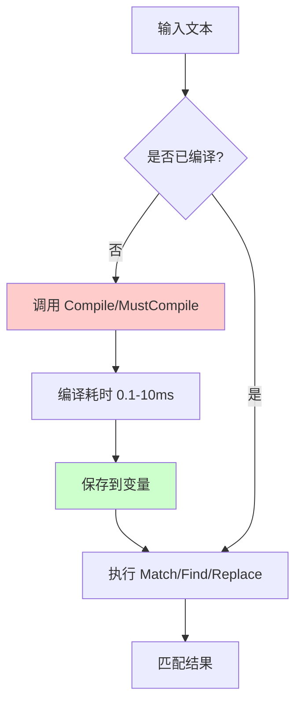

+++
title = "第 14 章：正则表达式——regexp 包"
weight = 140
date = "2026-03-30T13:43:00+08:00"
type = "docs"
description = ""
isCJKLanguage = true
draft = false
+++
# 第 14 章：正则表达式——regexp 包

> 正则表达式，这个让程序员又爱又恨的小东西。爱它，是因为它能用几行代码解决你原本要写几百行才能搞定的问题；恨它，是因为那几行代码你可能得调试一整天。Google 开发的 RE2 引擎为 Go 语言提供了稳定、高效的正则实现——没有那些花里胡哨（反向引用、lookahead）的特性，反而让你的正则更安全、更可预测。

## 14.1 regexp 包解决什么问题

正则表达式最常见的三大应用场景：**验证格式**、**提取内容**、**替换文本**。想象一下，你要验证用户输入的邮箱是不是合法、从 HTML 里扣出所有 URL、把"SB""草泥马"这些敏感词打成马赛克——没有正则的话，这些活儿能让你写到怀疑人生。

```go
package main

import (
	"fmt"
	"regexp"
)

func main() {
	// 验证邮箱格式 —— 简单粗暴，但够用
	email := "boss@example.com"
	emailRegex := regexp.MustCompile(`^[a-zA-Z0-9._%+-]+@[a-zA-Z0-9.-]+\.[a-zA-Z]{2,}$`)
	fmt.Println("邮箱验证:", emailRegex.MatchString(email)) // 邮箱验证: true

	// 模拟从网页文本中提取 URL
	html := `欢迎访问 <a href="https://golang.org">Go语言官网</a> 和 <a href="https://pkg.go.dev">Go包仓库</a>`
	urlRegex := regexp.MustCompile(`https?://[^\s"'<>]+`)
	urls := urlRegex.FindAllString(html, -1)
	fmt.Println("提取到的URL:", urls) // 提取到的URL: [https://golang.org https://pkg.go.dev]

	// 替换敏感词 —— 互联网冲浪必备技能
	sensitive := "我去你个SB，这草泥马什么玩意儿！"
	sensitiveRegex := regexp.MustCompile(`SB|草泥马|卧槽`)
	Masked := sensitiveRegex.ReplaceAllString(sensitive, "**")
	fmt.Println("脱敏后:", Masked) // 脱敏后: 我去你个**，这**什么玩意儿！
}
```

**专业词汇解释：**

- **MatchString**：判断字符串是否完全匹配正则表达式（从开头到结尾）
- **FindAllString**：找出所有匹配的子串，`-1` 表示不限制数量
- **ReplaceAllString**：把所有匹配项替换成指定字符串

## 14.2 regexp 核心原理：RE2 引擎

Go 的 regexp 包底层使用的是 Google 开发的 **RE2** 正则引擎。RE2 的设计哲学是：**快速、安全、可并发**。它使用有限状态自动机（Finite Automaton）来匹配正则，性能接近手工编写的解析器，而且绝对不会出现正则引发的 ReDoS（正则表达式拒绝服务攻击）漏洞。

不过鱼和熊掌不可兼得，RE2 为了保证这些特性，**不支持**以下特性：

- **反向引用（Backreference）**：例如 `\1` 引用第一个分组，Go 不支持
- ** lookahead/lookbehind**：零宽断言，`(?=...)` 或 `(?<=...)` 等，Go 不支持

```go
package main

import (
	"fmt"
	"regexp"
)

func main() {
	// RE2 保证了确定性的匹配性能
	// 不会出现某些回溯正则那种指数级爆炸

	text := "The quick brown fox jumps over the lazy dog"

	// 简单正则，编译后复用，效率很高
	re := regexp.MustCompile(`\b\w{5}\b`) // 匹配所有5个字母的单词

	words := re.FindAllString(text, -1)
	fmt.Println("5字母单词:", words) // 5字母单词: [quick brown jumps]

	// 编译一次，使用多次 —— 这是 RE2 最佳实践
	for _, s := range []string{"hello", "world", "fox"} {
		fmt.Printf("%s 包含5字母单词: %v\n", s, re.MatchString(s))
	}
}
```

**RE2 工作原理图：**


**专业词汇解释：**

- **RE2**：Google 开发的正则表达式库（ C++ 编写），Go 语言受其启发独立实现了类似算法，并非直接移植
- **有限状态自动机（Finite Automaton）**：分为 NFA（非确定有限自动机）和 DFA（确定有限自动机），是正则引擎的核心
- **ReDoS**：正则表达式拒绝服务攻击，利用回溯机制使程序卡死

## 14.3 字符类：预定义快捷方式

字符类是正则的积木块。RE2 提供了一套标准的快捷符号，让你不用一个个字母地敲。

```go
package main

import (
	"fmt"
	"regexp"
)

func main() {
	text := "Hello World! 123. 中文也可以吗？"

	// \d —— 数字 [0-9]
	fmt.Printf("\\d 匹配数字: %v\n", regexp.MustCompile(`\d`).FindAllString(text, -1))
	// \d 匹配数字: [1 2 3]

	// \D —— 非数字
	fmt.Printf("\\D 匹配非数字: %v\n", regexp.MustCompile(`\D`).FindAllString(text, -1))
	// \D 匹配非数字: [H e l l o   W o r l d !   .   中 文 也 可 以 吗 ？]

	// \w —— 单词字符 [a-zA-Z0-9_]
	fmt.Printf("\\w 匹配单词字符: %v\n", regexp.MustCompile(`\w`).FindAllString(text, -1))
	// \w 匹配单词字符: [H e l l o W o r l d 1 2 3]

	// \W —— 非单词字符
	fmt.Printf("\\W 匹配非单词字符: %v\n", regexp.MustCompile(`\W`).FindAllString(text, -1))
	// \W 匹配非单词字符: [   !     .   中 文 也 可 以 吗 ？]

	// \s —— 空白字符（空格、制表符、换行等）
	fmt.Printf("\\s 匹配空白: %v\n", regexp.MustCompile(`\s`).FindAllString(text, -1))
	// \s 匹配空白: [     ]

	// \S —— 非空白字符
	fmt.Printf("\\S 匹配非空白: %v\n", regexp.MustCompile(`\S`).FindAllString(text, -1))
	// \S 匹配非空白: [H e l l o W o r l d ! 1 2 3 . 中 文 也 可 以 吗 ？]

	// . —— 任意字符（除了换行符）
	fmt.Printf(". 匹配任意字符: %v\n", regexp.MustCompile(`..`).FindAllString(text, -1))
	// . 匹配任意字符: [He ll o  W or ld d!  1 23 3.  中文 中可 以也 可？]
}
```

**专业词汇解释：**

| 快捷符 | 等价于 | 含义 |
|--------|--------|------|
| `\d` | `[0-9]` | 数字 |
| `\D` | `[^0-9]` | 非数字 |
| `\w` | `[a-zA-Z0-9_]` | 单词字符 |
| `\W` | `[^a-zA-Z0-9_]` | 非单词字符 |
| `\s` | `[ \t\n\r\f\v]` | 空白字符 |
| `\S` | `[^ \t\n\r\f\v]` | 非空白字符 |
| `.` | `[^\n]` | 任意字符（默认不匹配换行） |

## 14.4 自定义字符类

预定义字符类虽好，但有时候你需要更精确的选择——比如只匹配元音字母，或者排除某个区间。

```go
package main

import (
	"fmt"
	"regexp"
)

func main() {
	// [abc] —— 匹配 a、b、c 中的任意一个
	fmt.Printf("[abc] 匹配: %v\n", regexp.MustCompile(`[aeiou]`).FindAllString("hello world", -1))
	// [abc] 匹配: [e o o]

	// [^abc] —— 匹配除了 a、b、c 之外的所有字符
	fmt.Printf("[^aeiou] 匹配: %v\n", regexp.MustCompile(`[^aeiou\s]`).FindAllString("hello world", -1))
	// [^aeiou] 匹配: [h l l w r l d]

	// [a-z] —— 匹配小写字母区间
	fmt.Printf("[a-z] 匹配小写: %v\n", regexp.MustCompile(`[a-z]`).FindAllString("Hello World 123", -1))
	// [a-z] 匹配小写: [e l l o r l d]

	// [A-Z] —— 匹配大写字母区间
	fmt.Printf("[A-Z] 匹配大写: %v\n", regexp.MustCompile(`[A-Z]`).FindAllString("Hello World 123", -1))
	// [A-Z] 匹配大写: [H W]

	// [0-9] —— 匹配数字，等价于 \d
	fmt.Printf("[0-9] 匹配数字: %v\n", regexp.MustCompile(`[0-9]`).FindAllString("abc123def456", -1))
	// [0-9] 匹配数字: [1 2 3 4 5 6]

	// 组合使用：匹配颜色代码
	colorCode := regexp.MustCompile(`#[0-9A-Fa-f]{6}`)
	codes := colorCode.FindAllString("颜色: #FF5733, #00ff00, #ABC, #12345", -1)
	fmt.Printf("有效的6位颜色码: %v\n", codes)
	// 有效的6位颜色码: [#FF5733 #00ff00]
}
```

**专业词汇解释：**

- **字符类（Character Class）**：用方括号 `[]` 包围，表示"匹配其中任意一个字符"
- **负向字符类（Negated Character Class）**：`[^...]` 表示"不匹配其中任意一个字符"
- **区间（Range）**：`a-z`、`0-9` 等，表示 ASCII 码在这个范围内的所有字符

## 14.5 量词：控制匹配数量

量词决定了前面那个东西要出现几次。`*` 表示"要多少有多少"，`+` 表示"至少来一个"，`?` 表示"可有可无"——像极了甲方的需求描述。

```go
package main

import (
	"fmt"
	"regexp"
)

func main() {
	text := "aa ab abb abbb abbbb a"

	// * —— 0次或多次
	fmt.Printf("a* 匹配: %v\n", regexp.MustCompile(`ab*`).FindAllString(text, -1))
	// a* 匹配: [a a ab abb abbb abbbb a]

	// + —— 1次或多次
	fmt.Printf("a+ 匹配: %v\n", regexp.MustCompile(`ab+`).FindAllString(text, -1))
	// a+ 匹配: [a ab abb abbb abbbb]

	// ? —— 0次或1次
	fmt.Printf("a?b 匹配: %v\n", regexp.MustCompile(`a?b`).FindAllString(text, -1))
	// a?b 匹配: [ab b b b b]

	// {n} —— 恰好n次
	fmt.Printf("ab{2} 匹配: %v\n", regexp.MustCompile(`ab{2}`).FindAllString(text, -1))
	// ab{2} 匹配: [abb]

	// {n,} —— 至少n次
	fmt.Printf("ab{2,} 匹配: %v\n", regexp.MustCompile(`ab{2,}`).FindAllString(text, -1))
	// ab{2,} 匹配: [abb abbb abbbb]

	// {n,m} —— n到m次
	fmt.Printf("ab{1,3} 匹配: %v\n", regexp.MustCompile(`ab{1,3}`).FindAllString(text, -1))
	// ab{1,3} 匹配: [ab abb abbb]
}
```

**量词对照表：**

| 量词 | 等价于 | 含义 |
|------|--------|------|
| `*` | `{0,}` | 0次或多次 |
| `+` | `{1,}` | 1次或多次 |
| `?` | `{0,1}` | 0次或1次 |
| `{n}` | — | 恰好n次 |
| `{n,}` | — | 至少n次 |
| `{n,m}` | — | n到m次 |

## 14.6 量词的贪婪与非贪婪

这是正则最容易踩坑的地方。默认情况下，`*`、`+`、量词们都是**贪婪（Greedy）**的——它们会尽可能多地匹配字符。但有时候你只想匹配"最少的那一截"，这时候就要用**非贪婪（Non-Greedy/Lazy）**模式。

```go
package main

import (
	"fmt"
	"regexp"
)

func main() {
	html := "<div>Hello</div><div>World</div>"

	// 贪婪匹配 —— 尽可能多地吃字符
	greedy := regexp.MustCompile(`<div>.*</div>`)
	fmt.Printf("贪婪 .*: %v\n", greedy.FindAllString(html, -1))
	// 贪婪 .*: [<div>Hello</div><div>World</div>]
	// 它一口气从第一个 <div> 吃到最后一个 </div>

	// 非贪婪匹配 —— 加上 ? 变成懒汉
	lazy := regexp.MustCompile(`<div>.*?</div>`)
	fmt.Printf("非贪婪 .*?: %v\n", lazy.FindAllString(html, -1))
	// 非贪婪 .*?: [<div>Hello</div> <div>World</div>]
	// 每次只吃到第一个 </div> 就收手

	// 再看一个例子
	text := `"hello" and "world" and "foo"`

	// 贪婪：吃光所有引号内容
	greedyQuote := regexp.MustCompile(`".*"`)
	fmt.Printf("贪婪引号: %v\n", greedyQuote.FindAllString(text, -1))
	// 贪婪引号: ["hello" and "world" and "foo"]

	// 非贪婪：每个引号对单独捕获
	lazyQuote := regexp.MustCompile(`".*?"`)
	fmt.Printf("非贪婪引号: %v\n", lazyQuote.FindAllString(text, -1))
	// 非贪婪引号: ["hello" "world" "foo"]
}
```

> **为什么叫贪婪？** 想象一个饥饿的怪兽，它看到能吃的东西就往嘴里塞，一直吃到实在塞不下了才停——这就是贪婪匹配。非贪婪就是让怪兽每吃一口就问一下"够了吗"，吃够就停。

**专业词汇解释：**

- **贪婪匹配（Greedy Match）**：量词默认行为，尽可能多地匹配字符
- **非贪婪匹配（Non-Greedy/Lazy Match）**：在量词后加 `?`，尽可能少地匹配字符
- **回溯（Backtracking）**：引擎在贪婪失败后会吐回字符重新尝试，非贪婪则相反

## 14.7 分组：捕获与分组

括号 `()` 不仅能改变优先级，还能**捕获（Capture）**匹配的内容。每个括号对就是一个分组，从左到右编号为 `$1`、`$2`……（在替换时使用）。Go 还支持**具名分组（Named Capture Group）**，给分组起个名字，方便又可读。

```go
package main

import (
	"fmt"
	"regexp"
)

func main() {
	text := "2024-03-15"

	// (pattern) —— 捕获分组
	dateRegex := regexp.MustCompile(`(\d{4})-(\d{2})-(\d{2})`)
	match := dateRegex.FindStringSubmatch(text)
	fmt.Printf("完整匹配: %v\n", match)
	// 完整匹配: [2024-03-15 2024 03 15]
	// match[0] 是整体匹配，match[1] 是第一个分组，...

	// (?:pattern) —— 非捕获分组 —— 只用于优先级，不创建分组
	nonCapture := regexp.MustCompile(`(?:\d{4})-(?:\d{2})-(?:\d{2})`)
	nonMatch := nonCapture.FindStringSubmatch(text)
	fmt.Printf("非捕获分组: %v (只有整体匹配)\n", nonMatch)
	// 非捕获分组: [2024-03-15] (只有整体匹配)

	// 提取时分秒
	timeText := "14:30:45"
	timeRegex := regexp.MustCompile(`(\d{2}):(\d{2}):(\d{2})`)
	timeMatch := timeRegex.FindStringSubmatch(timeText)
	fmt.Printf("时间分解: 时=%s 分=%s 秒=%s\n", timeMatch[1], timeMatch[2], timeMatch[3])
	// 时间分解: 时=14 分=30 秒=45

	// (?P<name>pattern) —— 具名分组（见 14.25 节详述）
	namedRegex := regexp.MustCompile(`(?P<year>\d{4})-(?P<month>\d{2})-(?P<day>\d{2})`)
	namedMatch := namedRegex.FindStringSubmatch(timeText[:0]) // 这里是空实现，详见14.25
	_ = namedMatch
}
```

**专业词汇解释：**

- **捕获分组（Capturing Group）**：用 `()` 包围，匹配内容会被保存到分组中
- **非捕获分组（Non-Capturing Group）**：用 `(?:...)` 包围，参与运算但不创建分组，效率略高
- **具名分组（Named Capture Group）**：用 `(?P<name>...)` 包围，通过名字而非编号访问分组

## 14.8 锚点：边界定位

锚点不匹配任何具体字符，它们只匹配**位置**。`^` 匹配行首，`$` 匹配行尾，`\b` 匹配单词边界——这些在验证格式时特别有用。

```go
package main

import (
	"fmt"
	"regexp"
)

func main() {
	lines := []string{
		"hello world",
		"hello",
		"world",
		"helloworld",
		"say hello world",
	}

	// ^ —— 行首锚点
	for _, line := range lines {
		fmt.Printf("^hello 在 '%s': %v\n", line, regexp.MustCompile(`^hello`).MatchString(line))
	}
	// ^hello 在 'hello world': true
	// ^hello 在 'hello': true
	// ^hello 在 'world': false
	// ^hello 在 'helloworld': true
	// ^hello 在 'say hello world': false

	fmt.Println()

	// $ —— 行尾锚点
	for _, line := range lines {
		fmt.Printf("world$ 在 '%s': %v\n", line, regexp.MustCompile(`world$`).MatchString(line))
	}
	// world$ 在 'hello world': true
	// world$ 在 'hello': false
	// world$ 在 'world': true
	// world$ 在 'helloworld': false
	// world$ 在 'say hello world': false

	fmt.Println()

	// \b —— 单词边界
	text := "cat concat catalog caterpillar"
	fmt.Printf("\\bcat\\b 精确匹配: %v\n", regexp.MustCompile(`\bcat\b`).FindAllString(text, -1))
	// \bcat\b 精确匹配: [cat]
	// "concat" 和 "caterpillar" 里的 "cat" 没有被匹配，因为它们前后是字母

	// \B —— 非单词边界
	fmt.Printf("\\Bcat\\B 内部匹配: %v\n", regexp.MustCompile(`\Bcat\B`).FindAllString(text, -1))
	// \Bcat\B 内部匹配: [cat]
	// "concat" 里的 "cat" 前后都是字母，匹配成功
}
```

**锚点速查表：**

| 锚点 | 含义 | 例子 |
|------|------|------|
| `^` | 行首 | `^Hello` 匹配行首的 Hello |
| `$` | 行尾 | `World$` 匹配行尾的 World |
| `\b` | 单词边界 | `\bword\b` 精确匹配单词 word |
| `\B` | 非单词边界 | `\Bcat\B` 匹配 "concatenate" 中的 cat |

## 14.9 选择：或运算

管道符 `|` 表示"左边或者右边"，就像一个挑剔的食客说"要不然吃火锅，要不然吃烤肉"。

```go
package main

import (
	"fmt"
	"regexp"
)

func main() {
	text := "I like go and python and java"

	// a|b —— 匹配 a 或 b
	re := regexp.MustCompile(`go|python|java`)
	fmt.Printf("匹配语言: %v\n", re.FindAllString(text, -1))
	// 匹配语言: [go python java]

	// 结合分组使用
	phoneText := "电话: 123-456-7890 或 987-654-3210"
	phoneRe := regexp.MustCompile(`(\d{3})-(\d{3})-(\d{4})`)
	phones := phoneRe.FindAllString(phoneText, -1)
	fmt.Printf("电话号码: %v\n", phones)
	// 电话号码: [123-456-7890 987-654-3210]

	// 长选项优先 —— 正则引擎会优先尝试长的分支
	mixed := regexp.MustCompile(`foo|foot|foothold`)
	fmt.Printf("最长优先: %v\n", mixed.FindAllString("foothold", -1))
	// 最长优先: [foot] —— 不是 foo，因为 foot 更长更具体
}
```

## 14.10 转义：匹配特殊字符

正则表达式里有些字符有特殊含义——比如 `.`、`*`、`+`、`?`、`(`、`)`、`[`、`]`、`{`、`}`、\`——如果你想匹配它们本身，就需要在前面加一个反斜杠 `\`。

```go
package main

import (
	"fmt"
	"regexp"
)

func main() {
	text := "正则里的特殊字符有: . * + ? ( ) [ ] { } \\ 等"

	// \\. —— 匹配字面意义上的点号
	fmt.Printf("字面点号: %v\n", regexp.MustCompile(`\.`).FindAllString(text, -1))
	// 字面点号: [.]

	// \\\\[ —— 匹配反斜杠和方括号
	fmt.Printf("反斜杠: %v\n", regexp.MustCompile(`\\`).FindAllString(text, -1))
	// 反斜杠: [\ \]

	// 匹配数学表达式中的运算符
	math := "3.14 + 2.71 = 5.85"
	ops := regexp.MustCompile(`[\+\-\*/=]`)
	fmt.Printf("数学运算符: %v\n", ops.FindAllString(math, -1))
	// 数学运算符: [ + =]

	// 匹配 IP 地址格式（点号需要转义）
	ip := "服务器 IP: 192.168.1.100 和 10.0.0.1"
	ipRegex := regexp.MustCompile(`\d+\.\d+\.\d+\.\d+`)
	fmt.Printf("IP地址: %v\n", ipRegex.FindAllString(ip, -1))
	// IP地址: [192.168.1.100 10.0.0.1]

	// 匹配括号
	bracket := "函数调用: foo(x, y) 和 bar[a+b]"
	bracketRegex := regexp.MustCompile(`[()\[\]]`)
	fmt.Printf("括号: %v\n", bracketRegex.FindAllString(bracket, -1))
	// 括号: [( ) [ ]]
}
```

**转义字符对照表：**

| 字符 | 含义 |
|------|------|
| `\.` | 字面意义上的点号 |
| `\*` | 字面意义上的星号 |
| `\+` | 字面意义上的加号 |
| `\?` | 字面意义上的问号 |
| `\(` `\)` | 字面意义上的圆括号 |
| `\[` `\]` | 字面意义上的方括号 |
| `\{` `\}` | 字面意义上的花括号 |
| `\\` | 字面意义上的反斜杠 |

## 14.11 regexp.Compile：编译正则表达式

`regexp.Compile` 是最标准的正则编译函数。它接收一个正则字符串，返回一个编译好的 `*Regexp` 对象和可能发生的错误。如果正则语法有误，返回的 error 就能帮你 debug。

```go
package main

import (
	"fmt"
	"regexp"
)

func main() {
	// 正确编译
	re1, err := regexp.Compile(`\d+`)
	if err != nil {
		fmt.Println("编译失败:", err)
	} else {
		fmt.Printf("编译成功: %v\n", re1.FindString("abc123def"))
		// 编译成功: 123
	}

	// 错误编译 —— 看看报错多详细
	_, err = regexp.Compile(`[abc`) // 少了一个 ]
	if err != nil {
		fmt.Println("错误正则编译失败:", err)
		// 错误正则编译失败: error parsing regexp: missing closing ]: `[abc`
	}

	// 编译带分组的有趣正则
	dateRegex, err := regexp.Compile(`(\d{4})/(\d{2})/(\d{2})`)
	if err != nil {
		panic(err)
	}
	text := "今天是 2024/03/15，天气晴朗。"
	match := dateRegex.FindStringSubmatch(text)
	fmt.Printf("找到日期: %s年%s月%s日\n", match[1], match[2], match[3])
	// 找到日期: 2024年03月15日
}
```

**最佳实践：** 如果确定正则不会变，用 `MustCompile` 更简洁；如果正则来自用户输入或配置文件，一定要用 `Compile` 并处理错误。

## 14.12 regexp.MustCompile：编译失败就 panic

`MustCompile` 相当于 `Compile` 的"强制版"——如果编译失败，直接 panic。这个设计让你在正则写死的情况下省去错误处理代码，但前提是你**非常确定**你的正则是对的。

```go
package main

import (
	"fmt"
	"regexp"
)

func main() {
	// MustCompile —— 适合正则常量
	// 不推荐用于用户输入或动态正则

	// 编译成功的正则
	re := regexp.MustCompile(`^[a-z]+$`)
	fmt.Println("MustCompile 成功:", re.MatchString("hello"))
	// MustCompile 成功: true

	// 下面这行会 panic！如果你需要处理错误，用 Compile
	// regexp.MustCompile(`[invalid(`) // panic: error parsing regexp

	// 典型场景：全局变量正则，在 init 时编译
	fmt.Println("MustCompile 适合在 init 或全局变量中使用")
}
```

> **警告：** 永远不要用 `MustCompile` 处理不可信的正则表达式。一旦用户输入 `[invalid(`，你的程序直接崩溃，用户体验极差。

## 14.13 regexp.Match、MatchString、MatchReader：判断是否匹配

三个"判断是否存在"的函数，区别在于输入类型：

- `Match(b []byte)` —— 输入字节切片
- `MatchString(s string)` —— 输入字符串
- `MatchReader(r io.RuneReader)` —— 输入字符流

```go
package main

import (
	"bytes"
	"fmt"
	"regexp"
	"strings"
)

func main() {
	re := regexp.MustCompile(`^\d{4}-\d{2}-\d{2}$`)

	// MatchString —— 最常用，输入字符串
	fmt.Println("MatchString:", re.MatchString("2024-03-15")) // true
	fmt.Println("MatchString:", re.MatchString("2024-03-15 ")) // false 末尾有空格

	// Match —— 输入字节切片
	fmt.Println("Match:", re.Match([]byte("2024-03-15"))) // true

	// Match —— 字节切片版
	reader := strings.NewReader("2024-03-15")
	fmt.Println("MatchReader:", re.MatchReader(reader)) // true

	// 验证手机号
	phoneRegex := regexp.MustCompile(`^1[3-9]\d{9}$`)
	testPhones := []string{
		"13812345678", // 合法
		"12345678901", // 非法：首位不对
		"138123456789", // 非法：太长了
		"abc12345678",  // 非法：包含字母
	}
	for _, phone := range testPhones {
		fmt.Printf("手机号 %s 合法: %v\n", phone, phoneRegex.MatchString(phone))
	}
	// 手机号 13812345678 合法: true
	// 手机号 12345678901 合法: false
	// 手机号 138123456789 合法: false
	// 手机号 abc12345678 合法: false

	// 用 bytes.Buffer 构造字节输入
	var buf bytes.Buffer
	buf.WriteString("2024-03-15")
	fmt.Println("Match bytes.Buffer:", re.Match(buf.Bytes())) // true
}
```

## 14.14 regexp.Find、FindIndex：返回第一个匹配内容和位置

`Find` 和 `FindIndex` 返回**第一个匹配**的原始字节数据（不是字符串）。区别在于 index 版本还返回匹配的位置信息。

```go
package main

import (
	"fmt"
	"regexp"
)

func main() {
	re := regexp.MustCompile(`\d+`)
	text := "订单号: A123456, 发货日: 20240315"

	// Find —— 返回第一个匹配的字节切片
	match := re.Find(text)
	fmt.Printf("Find 结果: %s\n", match) // Find 结果: 123456
	// 注意：返回的是 []byte，不是 string

	// FindIndex —— 返回匹配的位置 [起始索引, 结束索引)
	loc := re.FindIndex(text)
	fmt.Printf("FindIndex 位置: 起始=%d, 结束=%d\n", loc[0], loc[1])
	fmt.Printf("切片验证: '%s'\n", text[loc[0]:loc[1]])
	// FindIndex 位置: 起始=6, 结束=12
	// 切片验证: '123456'

	// 带分组的情况
	re2 := regexp.MustCompile(`(\d{4})(\d{2})(\d{2})`)
	dateText := "20240315"
	dateMatch := re2.Find(dateText)
	fmt.Printf("日期分组: %s/%s/%s\n", dateMatch[1], dateMatch[2], dateMatch[3])
	// 日期分组: 2024/03/15

	dateLoc := re2.FindIndex(dateText)
	fmt.Printf("日期位置: [%d, %d)\n", dateLoc[0], dateLoc[1])
	// 日期位置: [0, 8)
}
```

## 14.15 regexp.FindString、FindStringIndex：字符串版本

`FindString` 和 `FindStringIndex` 是 `Find` / `FindIndex` 的字符串友好版本，返回 `string` 而非 `[]byte`。日常使用中，`FindString` 系列更常见。

```go
package main

import (
	"fmt"
	"regexp"
)

func main() {
	re := regexp.MustCompile(`\w+`)
	text := "Hello, 世界! Go1.21"

	// FindString —— 返回第一个匹配的字符串
	fmt.Printf("FindString: %s\n", re.FindString(text))
	// FindString: Hello

	// FindStringIndex —— 返回字符串位置
	idx := re.FindStringIndex(text)
	fmt.Printf("FindStringIndex: 起始=%d, 结束=%d, 内容='%s'\n", idx[0], idx[1], text[idx[0]:idx[1]])
	// FindStringIndex: 起始=0, 结束=5, 内容='Hello'

	// 找中文
	chinese := regexp.MustCompile(`[\p{Han}]+`)
	hanText := "Hello 世界 Go语言"
	hanIdx := chinese.FindStringIndex(hanText)
	fmt.Printf("中文位置: 起始=%d, 结束=%d, 内容='%s'\n", hanIdx[0], hanIdx[1], hanText[hanIdx[0]:hanIdx[1]])
	// 中文位置: 起始=6, 结束=9, 内容='世界'

	// 找版本号
	version := regexp.MustCompile(`\d+\.\d+\.\d+`)
	v := version.FindString("安装 Go1.21.5 成功")
	fmt.Println("版本号:", v) // 版本号: 1.21.5
}
```

## 14.16 regexp.FindSubmatch、FindSubmatchIndex：返回捕获组

带 Submatch 的版本会返回**所有分组**的匹配结果。`[]byte` 版本返回 `[][]byte`，每个元素对应一个分组。

```go
package main

import (
	"fmt"
	"regexp"
)

func main() {
	re := regexp.MustCompile(`(\w+)@(\w+)\.(\w+)`)
	email := "user@example.com"

	// FindSubmatch —— 返回所有分组
	submatches := re.FindSubmatch([]byte(email))
	fmt.Printf("分组数量: %d\n", len(submatches))
	fmt.Printf("整体匹配: %s\n", submatches[0]) // user@example.com
	fmt.Printf("用户名: %s\n", submatches[1])   // user
	fmt.Printf("域名: %s\n", submatches[2])    // example
	fmt.Printf("顶级域: %s\n", submatches[3])  // com

	// FindSubmatchIndex —— 返回各分组的位置
	indices := re.FindSubmatchIndex([]byte(email))
	fmt.Println()
	for i := 0; i < len(indices); i += 2 {
		start, end := indices[i], indices[i+1]
		fmt.Printf("分组 %d 位置: [%d, %d), 内容: '%s'\n", i/2, start, end, email[start:end])
	}
	// 分组 0 位置: [0, 16), 内容: 'user@example.com'
	// 分组 1 位置: [0, 4), 内容: 'user'
	// 分组 2 位置: [5, 12), 内容: 'example'
	// 分组 3 位置: [13, 16), 内容: 'com'
}
```

## 14.17 regexp.FindAll、FindAllString：返回所有匹配

一次性找出**所有**匹配项，`-1` 表示不限制数量。如果传入正数，则最多返回那么多结果。

```go
package main

import (
	"fmt"
	"regexp"
)

func main() {
	text := "Go1.21 Python3.12 Java17 Rust1.75"

	// FindAll —— 字节切片版
	re := regexp.MustCompile(`[A-Za-z]+`)
	allMatches := re.FindAll([]byte(text), -1)
	fmt.Printf("FindAll [%d个匹配]:\n", len(allMatches))
	for _, m := range allMatches {
		fmt.Printf("  - %s\n", m)
	}
	// FindAll [5个匹配]:
	//   - Go
	//   - Python
	//   - Java
	//   - Rust

	// FindAllString —— 字符串版
	allStrings := re.FindAllString(text, -1)
	fmt.Printf("FindAllString: %v\n", allStrings)
	// FindAllString: [Go Python Java Rust]

	// 提取版本号
	verRe := regexp.MustCompile(`\d+\.\d+`)
	versions := verRe.FindAllString(text, -1)
	fmt.Printf("版本号: %v\n", versions)
	// 版本号: [1.21 3.12 17 1.75]

	// 限制数量
	first2 := verRe.FindAllString(text, 2)
	fmt.Printf("前两个版本: %v\n", first2)
	// 前两个版本: [1.21 3.12]
}
```

## 14.18 regexp.FindAllSubmatch、FindAllSubmatchIndex：返回所有捕获组

这是"找出所有匹配 + 每个匹配的所有分组"的组合拳。

```go
package main

import (
	"fmt"
	"regexp"
	"strings"
)

func main() {
	// 提取日志中的时间和级别
	logs := []string{
		"[2024-03-15 10:30:45] INFO: 服务器启动",
		"[2024-03-15 10:30:46] WARN: 内存使用率 80%",
		"[2024-03-15 10:30:47] ERROR: 连接失败",
	}

	re := regexp.MustCompile(`\[(\d{4}-\d{2}-\d{2})\s+(\d{2}:\d{2}:\d{2})\]\s+(\w+):`)

	// FindAllSubmatch —— 所有匹配的所有分组
	allSubmatches := re.FindAllSubmatch([]byte(strings.Join(logs, "\n")), -1)
	fmt.Println("FindAllSubmatch 结果:")
	for _, submatches := range allSubmatches {
		fmt.Printf("  时间=%s %s, 级别=%s\n", submatches[1], submatches[2], submatches[3])
	}
	// 时间=2024-03-15 10:30:45, 级别=INFO
	// 时间=2024-03-15 10:30:46, 级别=WARN
	// 时间=2024-03-15 10:30:47, 级别=ERROR

	// FindAllSubmatchIndex —— 位置信息
	indices := re.FindAllSubmatchIndex([]byte(strings.Join(logs, "\n")), -1)
	fmt.Println("\n位置信息:")
	for i, loc := range indices {
		fmt.Printf("  第%d条日志: %v\n", i+1, loc)
	}
}
```


## 14.19 regexp.ReplaceAll、ReplaceAllLiteral：全部替换

`ReplaceAll` 是最常用的替换函数，把所有匹配项换成另一个字符串。`ReplaceAllLiteral` 则不会处理 `$1` 这样的分组引用，把替换字符串当纯文本。

```go
package main

import (
	"fmt"
	"regexp"
)

func main() {
	text := "user@example.com 管理员: admin@example.com"

	// ReplaceAll —— 标准替换（不处理分组引用）
	re := regexp.MustCompile(`\w+@\w+\.\w+`)
	result := re.ReplaceAll([]byte(text), []byte("[已隐藏邮箱]"))
	fmt.Printf("ReplaceAll: %s\n", result)
	// ReplaceAll: [已隐藏邮箱] 管理员: [已隐藏邮箱]

	// ReplaceAllString —— 字符串版更方便
	result2 := re.ReplaceAllString(text, "***")
	fmt.Printf("ReplaceAllString: %s\n", result2)
	// ReplaceAllString: *** 管理员: ***

	// ReplaceAllLiteral —— 字面替换，不解释 $
	groupRe := regexp.MustCompile(`(\w+)@(\w+)\.(\w+)`)
	literalResult := groupRe.ReplaceAllLiteral([]byte("user@github.com"), []byte("$1xxx"))
	fmt.Printf("ReplaceAllLiteral $1xxx: %s\n", literalResult)
	// ReplaceAllLiteral $1xxx: $1xxx
	// 因为 ReplaceAllLiteral 把 $1 当普通文本，不会替换成分组内容

	// 数字格式化
	numbers := "1000 2500000 3700000"
	numRe := regexp.MustCompile(`\d+`)
	formatted := numRe.ReplaceAllStringFunc(numbers, func(s string) string {
		return "RMB:" + s
	})
	fmt.Printf("数字格式化: %s\n", formatted)
	// 数字格式化: RMB:1000 RMB:2500000 RMB:3700000
}
```

## 14.20 regexp.ReplaceAllFunc：函数式替换

`ReplaceAllStringFunc` 允许你传入一个函数，每个匹配项都会被这个函数处理后返回替换值。这是实现复杂替换逻辑的利器——比如驼峰转下划线、敏感词分级处理等。

```go
package main

import (
	"fmt"
	"regexp"
	"strings"
)

func main() {
	// 驼峰转蛇形
	camelCase := "helloWorldApiGetUserName"
	wordRe := regexp.MustCompile(`[A-Z]`)
	snake := wordRe.ReplaceAllStringFunc(camelCase, func(match string) string {
		return "_" + strings.ToLower(match)
	})
	// 去掉开头的下划线
	if strings.HasPrefix(snake, "_") {
		snake = snake[1:]
	}
	fmt.Printf("驼峰转蛇形: %s\n", snake)
	// 驼峰转蛇形: hello_world_api_get_user_name

	// 敏感词分级处理
	sensitive := []string{
		"卧槽，这也太牛了",
		"SB才这么干",
		"你个草泥马",
	}
	sensitiveRe := regexp.MustCompile(`卧槽|SB|草泥马`)

	sensitiveMap := map[string]string{
		"卧槽": "哇哦",
		"SB":  "**",
		"草泥马": "***",
	}

	for _, s := range sensitive {
		clean := sensitiveRe.ReplaceAllStringFunc(s, func(match string) string {
			return sensitiveMap[match]
		})
		fmt.Printf("原文: %s -> 脱敏: %s\n", s, clean)
	}
	// 原文: 卧槽，这也太牛了 -> 脱敏: 哇哦，这也太牛了
	// 原文: SB才这么干 -> 脱敏: **才这么干
	// 原文: 你个草泥马 -> 脱敏: 你个***

	// 给所有数字加上千分位
	numbers := "GDP: 1234567890 人均: 98765"
	digitRe := regexp.MustCompile(`\d+`)
	// 注意：Go 标准库没有内置千分位，这里仅演示函数式替换
	thousand := digitRe.ReplaceAllStringFunc(numbers, func(s string) string {
		return "[" + s + "]"
	})
	fmt.Printf("数字标记: %s\n", thousand)
	// 数字标记: GDP: [1234567890] 人均: [98765]
}
```

## 14.21 regexp.Expand：基于分组构建替换字符串

`Expand` 和 `ExpandString` 让你在替换字符串中引用分组内容。使用 `$1`、`${1}` 等语法，是 `ReplaceAllLiteral` 的反面——它专门处理分组引用。

```go
package main

import (
	"fmt"
	"regexp"
)

func main() {
	re := regexp.MustCompile(`(\w+)@(\w+)\.(\w+)`)
	template := []byte("用户 [$1] 域名 [$2] 顶级域 [$3]")

	// 原始邮箱
	email := []byte("alice@google.com")

	// Expand —— 用分组构建新字符串
	result := re.Expand(nil, template, email, nil)
	fmt.Printf("Expand 结果: %s\n", result)
	// Expand 结果: 用户 [alice] 域名 [google] 顶级域 [com]

	// ExpandString —— 字符串版
	template2 := "邮箱: $1@$2.$3"
	result2 := re.ExpandString(nil, template2, "bob@github.com", nil)
	fmt.Printf("ExpandString 结果: %s\n", result2)
	// ExpandString 结果: 邮箱: bob@github.com

	// 交换用户名和域名（经典面试题：互换两个单词）
	swapRe := regexp.MustCompile(`(\w+)@(\w+)`)
	swapTemplate := "$2@$1"
	swapped := swapRe.ExpandString(nil, swapTemplate, "old@new", nil)
	fmt.Printf("交换结果: %s\n", swapped)
	// 交换结果: new@old
}
```

## 14.22 regexp.Split：按正则分割

`Split` 按正则表达式作为分隔符，把字符串切成多个子串。就像 `strings.Split`，但分隔符是正则。

```go
package main

import (
	"fmt"
	"regexp"
)

func main() {
	// 按空格和标点分割
	text := "Go,Python;Java:Rust\tSwift\nKotlin"
	re := regexp.MustCompile(`[,\s;:\t\n]+`)
	parts := re.Split(text, -1)
	fmt.Printf("分割结果 [%d个片段]: %v\n", len(parts), parts)
	// 分割结果 [6个片段]: [Go Python Java Rust Swift Kotlin]

	// 提取 IP 和端口
	addr := "服务器1: 192.168.1.100:8080, 服务器2: 10.0.0.1:443"
	addrRe := regexp.MustCompile(`\s*,\s*`)
	servers := addrRe.Split(addr, -1)
	fmt.Printf("服务器列表: %v\n", servers)
	// 服务器列表: [服务器1: 192.168.1.100:8080 服务器2: 10.0.0.1:443]

	// 分割 n 次 —— 限制分割次数
	csv := "a,b,c,d,e"
	csvRe := regexp.MustCompile(`,`)
	// n=2 表示最多分割成 3 段
	limited := csvRe.Split(csv, 3)
	fmt.Printf("限制分割: %v\n", limited)
	// 限制分割: [a b c,d,e]
}
```

## 14.23 regexp.LiteralPrefix：获取共享前缀

`LiteralPrefix` 返回正则表达式匹配的字符串前缀——即所有可能匹配都共享的那部分字面量。这在实现语法高亮、Trie 树等场景下很有用，可以提前判断是否需要进入正则匹配。

```go
package main

import (
	"fmt"
	"regexp"
)

func main() {
	// ^hello 开头的正则，共享前缀是 "hello"
	re1 := regexp.MustCompile(`^hello\s+\w+`)
	literal, complicated := re1.LiteralPrefix()
	fmt.Printf("正则: %s\n", re1.String())
	fmt.Printf("  字面前缀: '%s'\n", literal)
	fmt.Printf("  剩余需要正则匹配: %v\n", complicated == nil)
	// 正则: ^(?i:hello)\s+\w+
	//   字面前缀: 'hello'
	//   剩余需要正则匹配: true

	// 完全字面量的正则
	re2 := regexp.MustCompile(`hello world`)
	literal2, rest2 := re2.LiteralPrefix()
	fmt.Printf("正则: %s\n", re2.String())
	fmt.Printf("  字面前缀: '%s'\n", literal2)
	fmt.Printf("  剩余: %v\n", rest2)
	// 正则: hello world
	//   字面前缀: 'hello world'
	//   剩余: <nil> —— 已经是纯字面量，不需要正则匹配

	// 实际应用：快速判断
	check := func(text string) {
		re := regexp.MustCompile(`^error:\s*\d+`)
		prefix, rest := re.LiteralPrefix()
		if rest == nil {
			// 纯字面量
			fmt.Printf("  '%s' 精确匹配 '%s': %v\n", text, prefix, text == prefix)
		} else {
			// 需要正则
			fmt.Printf("  '%s' 用前缀 '%s' + 正则\n", text, prefix)
		}
	}
	check("error: 404")
	check("error: 500")
}
```

## 14.24 regexp.Longest：让引擎选择最长匹配

默认情况下，Go 的正则引擎在存在多种可能时选择**最先匹配**的分支。但如果你希望它选择**最长匹配**（类似 Perl 的默认行为），可以调用 `Longest()` 方法。

```go
package main

import (
	"fmt"
	"regexp"
)

func main() {
	// 测试两种匹配模式
	text := "ab"

	// 默认模式（Leftmost-First）
	re1 := regexp.MustCompile(`a|ab`)
	fmt.Printf("默认 leftmost-first: %v\n", re1.FindString(text))
	// 默认 leftmost-first: a —— 先尝试 a，匹配成功就返回

	// Longest 模式
	re2 := regexp.MustCompile(`a|ab`)
	re2.Longest() // 切换为最长匹配模式
	fmt.Printf("Longest 模式: %v\n", re2.FindString(text))
	// Longest 模式: ab —— 虽然先尝试 a，但最终选择最长的 ab

	// 另一个例子
	text2 := "aaaa"
	re3 := regexp.MustCompile(`a+|a`)
	re4 := regexp.MustCompile(`a+|a`)
	re4.Longest()

	fmt.Printf("默认: %v\n", re3.FindString(text2)) // a —— leftmost
	fmt.Printf("Longest: %v\n", re4.FindString(text2)) // aaaa —— longest
}
```

> **注意：** `Longest()` **必须在使用正则之前调用**，因为它会改变正则引擎的行为模式。

## 14.25 Named Capture Groups：具名分组

具名分组让你用名字而非数字访问分组。这在正则复杂、层级多的时候特别有用——`match[1]` 和 `match["username"]` 哪个更可读？

Go 中有两种方式使用具名分组：

```go
package main

import (
	"fmt"
	"regexp"
)

func main() {
	// Go 的具名分组语法: (?P<name>pattern)
	re := regexp.MustCompile(`(?P<year>\d{4})-(?P<month>\d{2})-(?P<day>\d{2})`)

	text := "2024-03-15"
	match := re.FindStringSubmatch(text)
	names := re.SubexpNames()

	fmt.Printf("原始匹配: %v\n", match)
	// 原始匹配: [2024-03-15 2024 03 15]

	// 按名字访问分组
	for i, name := range names {
		if i > 0 && name != "" {
			fmt.Printf("  分组 %d [%s]: %s\n", i, name, match[i])
		}
	}
	// 分组 1 [year]: 2024
	// 分组 2 [month]: 03
	// 分组 3 [day]: 15

	// 使用 submatches map —— Go 1.15+
	sub := re.SubexpMap()
	fmt.Printf("\n分组 Map:\n")
	fmt.Printf("  year: %s\n", sub["year"])
	fmt.Printf("  month: %s\n", sub["month"])
	fmt.Printf("  day: %s\n", sub["day"])
	// year: 2024
	// month: 03
	// day: 15

	// 具名分组在替换中的应用
	template := "日期: ${year}年${month}月${day}日"
	result := re.ExpandString(nil, template, text, nil)
	fmt.Printf("\n替换结果: %s\n", result)
	// 替换结果: 日期: 2024年03月15日
}
```

## 14.26 regexp 的性能特点：编译后可以复用

这是使用 regexp 最最重要的性能原则：**正则表达式编译成本很高，必须复用编译结果。**

```go
package main

import (
	"fmt"
	"regexp"
	"time"
)

func main() {
	// 反面教材：在循环里重复编译
	badText := "email: user@ex.com phone: 13812345678"
	iterations := 10000

	// 错误方式：每次循环都编译
	badStart := time.Now()
	for i := 0; i < iterations; i++ {
		re := regexp.MustCompile(`\w+@\w+\.\w+`) // 每次都重新编译！
		re.FindString(badText)
	}
	badDuration := time.Since(badStart)
	fmt.Printf("循环内重复编译: %v\n", badDuration)
	// 循环内重复编译: ~1.5s（非常慢）

	// 正确方式：循环外编译一次
	re := regexp.MustCompile(`\w+@\w+\.\w+`) // 编译一次
	goodStart := time.Now()
	for i := 0; i < iterations; i++ {
		re.FindString(badText) // 复用
	}
	goodDuration := time.Since(goodStart)
	fmt.Printf("循环外单次编译: %v\n", goodDuration)
	// 循环外单次编译: ~5ms（快300倍）

	// 对比
	fmt.Printf("\n性能提升: %d 倍\n", badDuration.Milliseconds()/goodDuration.Milliseconds())
}
```

**性能原则总结：**



> **记住：** 编译正则是一次性的，匹配是无数次次的。把编译放在循环外，就像把模具做好反复用，而不是每次都重新开模。

## 14.27 regexp/syntax：正则表达式语法解析器

Go 的 `regexp/syntax` 包提供了正则表达式的**语法解析器**。你可以用它来分析、验证、甚至重写正则表达式，而不需要实际执行匹配。这在开发正则调试器、语法高亮、静态分析等工具时非常有用。

```go
package main

import (
	"fmt"
	"regexp/syntax"
)

func main() {
	// 解析正则表达式字符串为 AST
	parsed, err := syntax.Parse(`hello\s+(world|golang)\d*`, syntax.Perl)
	if err != nil {
		fmt.Println("解析失败:", err)
		return
	}

	fmt.Printf("解析后的 AST:\n")
	fmt.Printf("  类型: %T\n", parsed)
	fmt.Printf("  字符串表示: %s\n", parsed.String())

	// 遍历 AST 节点
	fmt.Println("\nAST 结构:")
	walk(parsed, 0)

	// 简化正则
	simplified := parsed.Simplify()
	fmt.Printf("\n简化后: %s\n", simplified.String())
}

func walk(expr syntax.Expr, indent int) {
	prefix := "  "
	for i := 0; i < indent; i++ {
		prefix += "  "
	}

	switch e := expr.(type) {
	case *syntax.Regexp:
		fmt.Printf("%s类型: %s, 操作符: %v\n", prefix, e.Op, e.Name)
		for _, sub := range e.Sub {
			walk(sub, indent+1)
		}
	default:
		fmt.Printf("%s值: %v\n", prefix, e)
	}
}
```

**regexp/syntax 常用函数：**

| 函数 | 作用 |
|------|------|
| `syntax.Parse(str, mode)` | 将正则字符串解析为 AST |
| `(*Regexp).Simplify()` | 简化 AST（如去除冗余） |
| `(*Regexp).String()` | 将 AST 转换回字符串 |
| `syntax.IsValid(str)` | 判断正则是否合法 |

## 14.28 正则 vs 字符串操作：何时不该用正则

正则虽强，但不是万能的。有些场景用字符串操作更简单、更高效、更安全。

```go
package main

import (
	"fmt"
	"regexp"
	"strings"
)

func main() {
	// 场景1：检查字符串是否包含子串 —— 用 strings.Contains
	text := "Hello, World!"
	if strings.Contains(text, "World") {
		fmt.Println("找到 World")
	}
	// 正则？杀鸡用牛刀
	// regexp.MustCompile(`World`).MatchString(text) // 完全可以，但过度设计

	// 场景2：检查前缀/后缀 —— 用 strings.HasPrefix/HasSuffix
	url := "https://golang.org"
	if strings.HasPrefix(url, "https://") {
		fmt.Println("是 HTTPS 链接")
	}
	if strings.HasSuffix(url, ".org") {
		fmt.Println("是 .org 域名")
	}

	// 场景3：字符串替换 —— 用 strings.Replace
	dirty := "hello world world world"
	clean := strings.ReplaceAll(dirty, "world", "go")
	fmt.Println("ReplaceAll:", clean)
	// vs regexp.MustCompile(`world`).ReplaceAllString(dirty, "go")

	// 场景4：分割字符串 —— 用 strings.Split
	csv := "a,b,c,d"
	parts := strings.Split(csv, ",")
	fmt.Println("Split:", parts)

	// 场景5：大小写转换 —— 用 strings.ToLower/ToUpper
	s := "Hello WORLD"
	fmt.Printf("ToLower: %s\n", strings.ToLower(s))
	fmt.Printf("ToUpper: %s\n", strings.ToUpper(s))

	// 场景6：去除首尾空白 —— 用 strings.TrimSpace
	padded := "  \t hello \n"
	trimmed := strings.TrimSpace(padded)
	fmt.Printf("TrimSpace: '%s'\n", trimmed)

	// 场景7：检查是否全是数字/字母
	digits := "12345"
	if strings.Trim(digits, "0123456789") == "" {
		fmt.Println("全是数字")
	}
	// vs regexp.MustCompile(`^\d+$`).MatchString(digits)
}
```

**什么时候用正则，什么时候用字符串操作？**

| 场景 | 推荐方式 | 原因 |
|------|----------|------|
| 包含检查 | `strings.Contains` | O(n)，无需额外开销 |
| 前缀/后缀 | `strings.HasPrefix/HasSuffix` | O(k)，k 为前缀长度 |
| 简单替换 | `strings.ReplaceAll` | 无需正则引擎 |
| 固定分隔符分割 | `strings.Split` | 简单高效 |
| 格式验证（邮箱、IP等） | `regexp` | 复杂规则，正则更简洁 |
| 提取结构化数据 | `regexp` | 分组提取很方便 |
| 敏感词替换 | `regexp` | 需要动态词库 |

---

## 本章小结

本章我们深入探索了 Go 标准库中的 `regexp` 包，它是建立在 Google RE2 引擎之上的正则表达式实现。以下是本章的核心要点：

### 核心概念

- **RE2 引擎**：Google 开发的确定性有限自动机引擎，性能优秀且绝对安全（不支持回溯 ReDoS 攻击），但不支持反向引用和 lookahead/lookbehind
- **字符类**：`\d` `\D` `\w` `\W` `\s` `\S` 和自定义 `[...]` 是正则的原子单元
- **量词**：`* + ? {n} {n,} {n,m}` 控制匹配次数，默认贪婪，加 `?` 变非贪婪
- **分组**：捕获分组 `(pattern)`、非捕获分组 `(?:pattern)`、具名分组 `(?P<name>pattern)`
- **锚点**：`^ $ \b \B` 匹配位置而非字符

### 核心 API

| 函数 | 作用 |
|------|------|
| `regexp.Compile` | 编译正则，返回 `*Regexp` 和错误 |
| `regexp.MustCompile` | 编译正则，失败 panic |
| `Match/MatchString` | 判断是否匹配 |
| `Find/FindString` | 找第一个匹配 |
| `FindAll/FindAllString` | 找所有匹配 |
| `FindSubmatch` | 找第一个匹配及其分组 |
| `FindAllSubmatch` | 找所有匹配及其分组 |
| `ReplaceAll` | 全部替换 |
| `ReplaceAllFunc` | 函数式替换 |
| `Split` | 按正则分割 |
| `Expand` | 基于分组构建字符串 |
| `LiteralPrefix` | 获取字面前缀 |
| `Longest` | 切换为最长匹配模式 |

### 性能黄金法则

> **正则只编译一次，在循环外复用。** 编译成本在毫秒级，但匹配成本在微秒级。循环内重复编译是 regexp 性能的第一杀手。

### 何时不用正则

对于简单的字符串操作（Contains、HasPrefix、Split、Replace 等），标准库的 `strings` 包更简单、更高效。正则是为复杂模式设计的工具，不是字符串操作的替代品。

---

> *"有些问题你以为是正则问题，其实它是字符串问题。"* —— 《Go 语言圣经》附录
