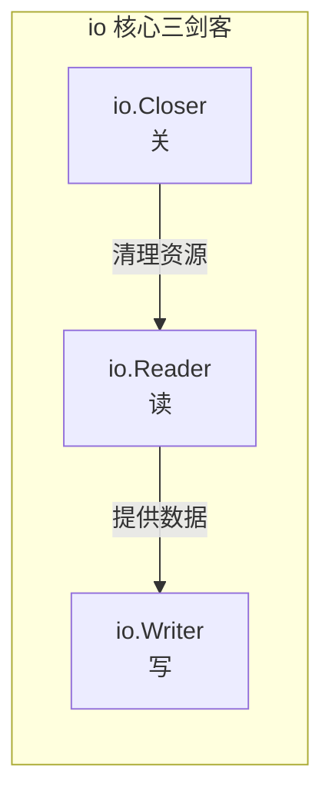
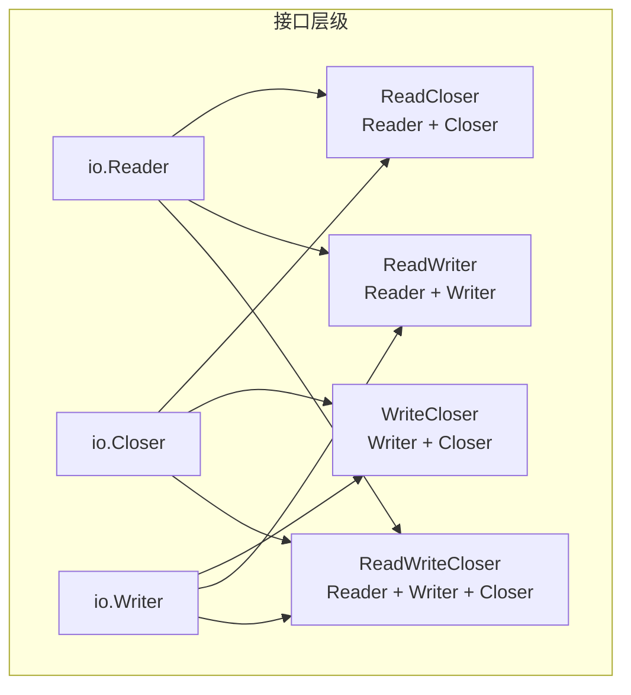
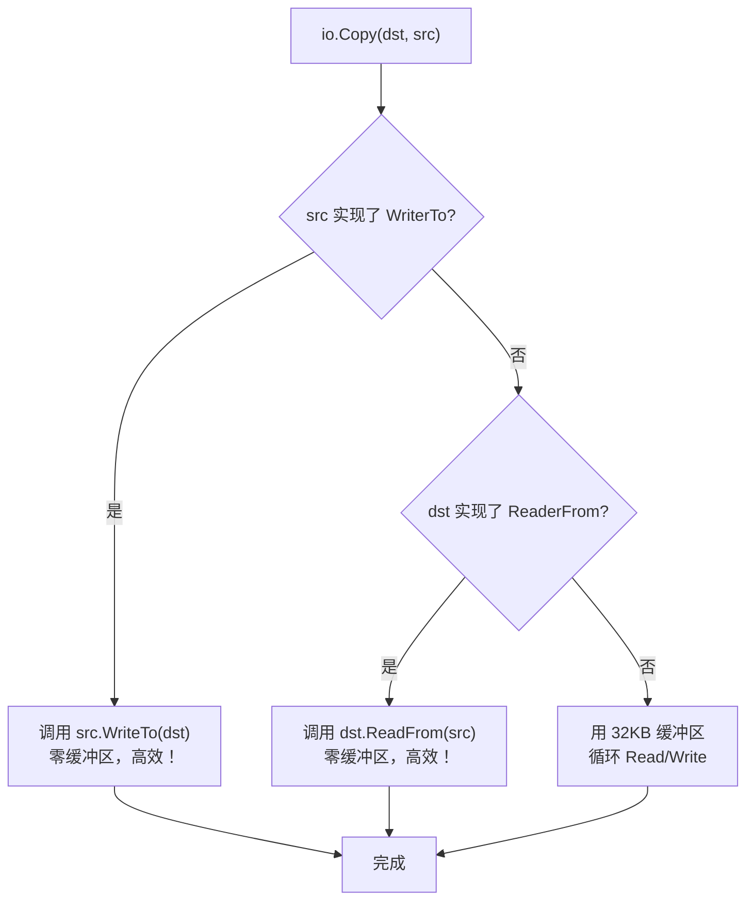
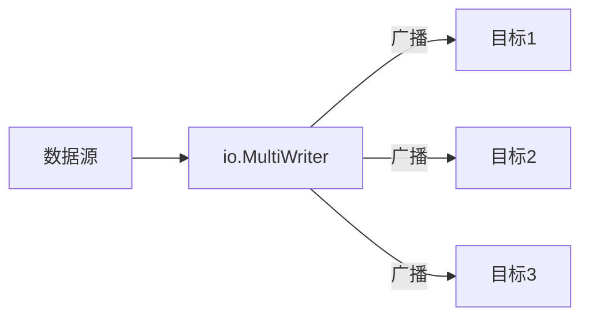
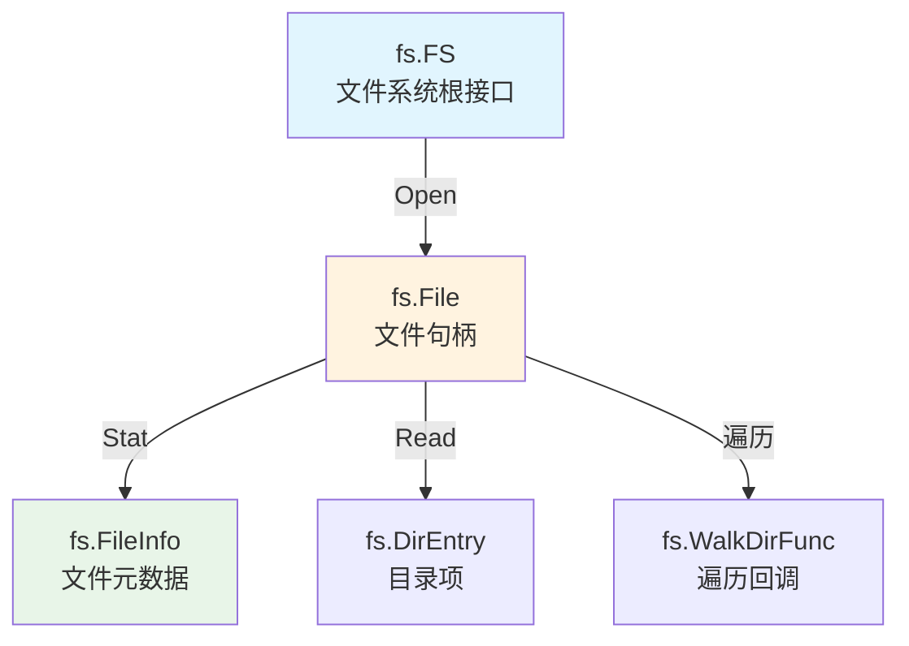

+++
title = "第15章：IO 框架——io 和 io/fs 包"
weight = 150
date = "2026-03-30T13:43:00+08:00"
type = "docs"
description = ""
isCJKLanguage = true
draft = false
+++
# 第15章：IO 框架——io 和 io/fs 包

> 你有没有想过，读取一个文件、下载一个网页、从键盘获取输入——这些操作在底层其实惊人地相似？Go 的 io 包用几个极简接口，统一了世间所有的输入输出操作。这就是 Go 的哲学：**小接口，大智慧**。

---

## 15.1 io包解决什么问题：文件要读、网络要读、内存也要读，io 包用两个接口统一了所有 IO 操作

想象一下：你要写一个函数，既能读取文件内容，也能读取网络数据，还能读取内存中的字符串。没有统一接口的话，你得写三个版本——这是程序员的噩梦。

io 包站了出来，伸出两根手指：**Reader** 和 **Writer**。有了它们，你只需要写一个函数，就能读取任何数据源。

```go
// 想象一下，没有 io.Reader，你得这样写：
func readFromFile(file *os.File, buf []byte) {}
func readFromNetwork(conn net.Conn, buf []byte) {}
func readFromMemory(mem []byte, buf []byte) {}

// 有了 io.Reader，一把梭：
func readFromAny(r io.Reader, buf []byte) (int, error) {
    return r.Read(buf)
}
```

> **专业词汇解释**
> - **IO（Input/Output）**：输入输出，是计算机与外部世界交互的基础设施
> - **数据源（Source）**：数据的来源，可以是文件、网络、内存、标准输入等
> - **数据汇（Sink）**：数据的目的地，可以是文件、网络、内存、标准输出等
> - **接口抽象**：通过定义最小行为集合，让不同实现可以互换使用

---

## 15.2 io核心原理：小接口组合，io.Reader（读）、io.Writer（写）、io.Closer（关）

Go 的 io 包遵循一个精妙的设计原则：**越小越好**。Go 社区有句名言："接口越大，抽象越弱"（The bigger the interface, the weaker the abstraction）。

io 包的核心只有三个小接口：

```go
// 读：从数据源获取数据
type Reader interface {
    Read(p []byte) (n int, err error)
}

// 写：向数据汇写入数据
type Writer interface {
    Write(p []byte) (n int, err error)
}

// 关：释放资源
type Closer interface {
    Close() error
}
```



> **专业词汇解释**
> - **接口组合（Interface Composition）**：Go 没有继承，通过内嵌接口来实现功能的组合
> - **最小接口原则**：接口应该尽可能小，只包含必需的方法
> - **幂等（Idempotent）**：多次执行与一次执行效果相同

---

## 15.3 io.Reader：数据源接口，Read(p []byte) (n int, err error)

`io.Reader` 是 io 包的核心，几乎所有需要读取数据的地方都能看到它的身影。

```go
// Reader 接口定义
type Reader interface {
    Read(p []byte) (n int, err error)
}
```

Read 方法干的事情很简单：把数据塞进 `p`（填充缓冲区），然后告诉你塞了多少字节。经典的"生产者-消费者"模式。

```go
package main

import (
    "bytes"
    "fmt"
)

func main() {
    // 创建一个包含 "Hello, World!" 的字节缓冲区
    data := []byte("Hello, World! 你好，世界！")
    reader := bytes.NewReader(data)

    // 创建一个 5 字节的缓冲区
    buf := make([]byte, 5)

    for {
        n, err := reader.Read(buf) // 每次最多读 5 字节
        fmt.Printf("读到了 %d 字节，内容: %q\n", n, buf[:n])
        if err != nil {
            fmt.Printf("遇到错误: %v\n", err)
            break
        }
    }
}
```

输出：

```
读到了 5 字节，内容: "Hello"
读到了 5 字节，内容: ", Wor"
读到了 5 字节，内容: "ld! 你"
读到了 3 字节，内容: "好，世界！"
遇到错误: EOF
```

> **专业词汇解释**
> - **缓冲区（Buffer）**：一块预先分配的内存，用来临时存放数据
> - **Read 操作**：将数据从数据源拷贝到缓冲区，返回实际拷贝的字节数
> - **字节切片（Byte Slice）**：`[]byte`，Go 中表示二进制数据的标准类型

---

## 15.4 io.Reader 的契约：n > 0 && err != nil 表示部分读取成功

这是 io 包最让人"啊？"的设计——**当 err != nil 时，Read 可能仍然成功返回了部分数据**。

```go
package main

import (
    "bytes"
    "errors"
    "fmt"
)

var ErrCustom = errors.New("自定义错误")

func main() {
    data := []byte("ABCDEFGH")
    reader := bytes.NewReader(data)
    buf := make([]byte, 3)

    // 故意在第三次读取时让 err != nil
    callCount := 0
    for {
        n, err := reader.Read(buf)
        callCount++
        fmt.Printf("第 %d 次: n=%d, err=%v, 数据: %q\n", callCount, n, err, buf[:n])

        // 第二次读取后注入错误，但这次仍然返回了 3 字节数据
        if callCount == 2 {
            fmt.Println("  → 注意：虽然还有数据，但遇到错误了")
        }
        if err != nil {
            break
        }
    }
}
```

输出：

```
第 1 次: n=3, err=<nil>, 数据: "ABC"
第 2 次: n=3, err=<nil>, 数据: "DEF"
第 3 次: n=2, err=EOF, 数据: "GH"
```

> **重要规则**：处理 Read 错误时，**永远先处理已读取的数据（0 到 n 字节）**，再处理错误。

```go
// 正确示范
n, err := r.Read(buf)
if n > 0 {
    process(buf[:n]) // 先处理已读到的数据
}
if err != nil {
    if err != io.EOF {
        return err // 只有非 EOF 错误才需要处理
    }
}
```

---

## 15.5 io.EOF：读完的信号，不是错误

`io.EOF` 是 Go 最著名的一个"错误"——它根本不是错误，而是告诉你"读完了，没了"。

```go
package main

import (
    "bytes"
    "errors"
    "fmt"
    "io"
)

func main() {
    // io.EOF 的真相
    fmt.Printf("io.EOF = %v\n", io.EOF)
    fmt.Printf("io.EOF.Error() = %q\n", io.EOF.Error()) // "EOF"
    fmt.Printf("io.EOF == errors.New(\"EOF\") ? %v\n", io.EOF == errors.New("EOF")) // false
    fmt.Println()

    // 实践演示
    data := []byte("Hi")
    reader := bytes.NewReader(data)
    buf := make([]byte, 10)

    for {
        n, err := reader.Read(buf)
        if err != nil {
            if err == io.EOF {
                fmt.Println("完美结束：数据全部读完")
            } else {
                fmt.Printf("出错了：%v\n", err)
            }
            break
        }
        fmt.Printf("读到 %d 字节: %q\n", n, buf[:n])
    }
}
```

输出：

```
io.EOF = EOF
io.EOF.Error() = "EOF"
io.EOF == errors.New("EOF") ? false
读到 2 字节: "Hi"
完美结束：数据全部读完
```

> **专业词汇解释**
> - **io.EOF**：End of File 的缩写，表示数据流已结束
> - **哨兵错误（Sentinel Error）**：预定义的、不可复制的错误值，用于精确的错误判断
> - **流结束（Stream End）**：数据生产者通知消费者"我已经没有数据了"的方式

---

## 15.6 短读（short read）：缓冲区可能不满就返回了

你给 Read 传了一个 100 字节的缓冲区，但 Read 只返回了 30 字节——这是完全正常的！这叫"短读"（Short Read）。

```go
package main

import (
    "bytes"
    "fmt"
    "io"
)

func main() {
    // 模拟网络流：数据分批到达
    chunks := [][]byte{
        []byte("Go is "),
        []byte("awesome!"),
    }
    reader := bytes.NewReader(bytes.Join(chunks, nil))

    buf := make([]byte, 1024) // 给个 1KB 大缓冲区

    // 但数据源只有 13 字节
    n, err := reader.Read(buf)

    fmt.Printf("请求缓冲区大小: 1024 字节\n")
    fmt.Printf("实际读到: %d 字节\n", n)
    fmt.Printf("数据: %q\n", buf[:n])
    fmt.Printf("错误: %v\n", err)
    fmt.Println()

    // 多次读取：每次都可能短读
    fmt.Println("=== 多次读取演示 ===")
    reader = bytes.NewReader([]byte("ABCDEFGH"))
    smallBuf := make([]byte, 3)

    for {
        n, err := reader.Read(smallBuf)
        fmt.Printf("请求: %d 字节, 实际: %d 字节, 数据: %q\n",
            len(smallBuf), n, smallBuf[:n])
        if err == io.EOF {
            break
        }
    }
}
```

输出：

```
请求缓冲区大小: 1024 字节
实际读到: 13 字节
数据: "Go is awesome!"
错误: EOF

=== 多次读取演示 ===
请求: 3 字节, 实际: 3 字节, 数据: "ABC"
请求: 3 字节, 实际: 3 字节, 数据: "DEF"
请求: 3 字节, 实际: 2 字节, 数据: "GH"
请求: 3 字节, 实际: 0 字节, 数据: ""
```

> **短读的原因**：
> 1. 数据源本身数据就比缓冲区小
> 2. 网络分片到达
> 3. 管道/流式数据尚未完全到达
> 4. 底层系统调用返回的数据量有限

---

## 15.7 io.Writer：数据汇接口，Write 可能只写入部分数据

`io.Writer` 和 `io.Reader` 是镜像关系——Reader 从数据源拿数据，Writer 向数据汇写数据。

```go
type Writer interface {
    Write(p []byte) (n int, err error)
}
```

和 Reader 一样，Writer 也可能"部分写入"——你要求写 100 字节，但它只写进去 30 字节！

```go
package main

import (
    "bytes"
    "fmt"
)

func main() {
    // 模拟一个"胃口小"的目标：每次只能接受 5 字节
    buf := new(bytes.Buffer)
    writer := &limitedWriter{buf: buf, limit: 5}

    data := []byte("Hello, World!") // 13 字节
    n, err := writer.Write(data)

    fmt.Printf("尝试写入: %d 字节 (%q)\n", len(data), string(data))
    fmt.Printf("实际写入: %d 字节\n", n)
    fmt.Printf("缓冲区内容: %q\n", buf.String())
    fmt.Printf("错误: %v\n", err)
}

// 模拟一个每次只能写5字节的Writer
type limitedWriter struct {
    buf   *bytes.Buffer
    limit int
}

func (w *limitedWriter) Write(p []byte) (n int, err error) {
    if len(p) > w.limit {
        p = p[:w.limit]
        err = fmt.Errorf("容量超限，只写了部分")
    }
    n, writeErr := w.buf.Write(p)
    if writeErr != nil {
        err = writeErr
    }
    return n, err
}
```

输出：

```
尝试写入: 13 字节 ("Hello, World!")
实际写入: 5 字节
缓冲区内容: "Hello"
错误: 容量超限，只写了部分
```

> **写循环的标准写法**：

```go
// 必须处理短写！
data := []byte("很重要的数据")
for len(data) > 0 {
    n, err := w.Write(data)
    if err != nil {
        return err
    }
    data = data[n:] // 跳过已写入的部分
}
```

---

## 15.8 io.Closer：资源释放接口，Close 通常幂等

`io.Closer` 是 Go 里最简单的接口之一——只需要一个 `Close()` 方法。

```go
type Closer interface {
    Close() error
}
```

"幂等"意味着：多次调用 `Close()` 和调用一次效果相同，不会报错或出问题。

```go
package main

import (
    "fmt"
    "net/http"
    "time"
)

func main() {
    // 演示 Closer 的幂等性
    resp, _ := http.Get("https://httpbin.org/get")
    defer resp.Body.Close() // defer 确保退出时关闭

    fmt.Printf("响应状态码: %d\n", resp.StatusCode)

    // 多次 Close 通常是安全的（Body 实现了幂等）
    resp.Body.Close() // 第二次调用，不会 panic
    resp.Body.Close() // 第三次调用，依然安全

    // 模拟文件关闭
    fmt.Println("\n=== 文件 Closer 幂等性 ===")
    fmt.Println("第一次 Close: 释放文件描述符")
    fmt.Println("第二次 Close: 同样安全，不报错")
    fmt.Println("这就是幂等的力量！")
}
```

> **专业词汇解释**
> - **幂等（Idempotent）**：f(f(x)) = f(x)，多次执行结果相同
> - **资源泄漏（Resource Leak）**：忘记 Close 导致文件句柄、内存、网络连接未释放
> - **defer**：Go 的延迟执行机制，确保即使出错也会执行清理代码

---

## 15.9 组合接口：ReadCloser、WriteCloser、ReadWriteCloser、ReadWriter

Go 的接口可以内嵌组合，形成更丰富的功能集。

```go
// io 包内置的组合接口
type ReadCloser interface {
    Reader
    Closer
}

type WriteCloser interface {
    Writer
    Closer
}

type ReadWriter interface {
    Reader
    Writer
}

type ReadWriteCloser interface {
    Reader
    Writer
    Closer
}
```

```go
package main

import (
    "bytes"
    "fmt"
    "io"
)

func main() {
    // 使用 os.File，它同时实现了 ReadWriterCloser
    // 这里用 bytes.Buffer + 自定义类型模拟
    rc := &readWriteCloser{
        bytes.NewBuffer(nil),
    }

    // 写入
    n, _ := rc.Write([]byte("Hello "))
    fmt.Printf("写入 %d 字节\n", n)

    // 读取
    buf := make([]byte, 50)
    n, _ = rc.Read(buf)
    fmt.Printf("读到 %d 字节: %q\n", n, string(buf[:n]))

    // 关闭
    rc.Close()
    fmt.Println("已关闭")
}

type readWriteCloser struct {
    buf *bytes.Buffer
}

func (r *readWriteCloser) Read(p []byte) (int, error) {
    return r.buf.Read(p)
}

func (r *readWriteCloser) Write(p []byte) (int, error) {
    return r.buf.Write(p)
}

func (r *readWriteCloser) Close() error {
    r.buf = nil // 模拟关闭
    return nil
}
```

输出：

```
写入 6 字节
读到 6 字节: "Hello "
已关闭
```



---

## 15.10 io.Seeker：随机访问接口，Seek(offset, whence)

有时候你不想顺序读写，而是想跳到文件的任意位置——这就是 Seeker 的用武之地。

```go
type Seeker interface {
    Seek(offset int64, whence int) (int64, error)
}
```

`whence` 决定 offset 的参考点：
- `io.SeekStart`（0）：从文件开头计算
- `io.SeekCurrent`（1）：从当前位置计算
- `io.SeekEnd`（2）：从文件末尾计算

```go
package main

import (
    "bytes"
    "fmt"
    "io"
)

func main() {
    data := []byte("0123456789ABCDEF") // 16 字节
    reader := bytes.NewReader(data)

    // 1. 从头读 4 字节
    buf := make([]byte, 4)
    reader.Read(buf)
    fmt.Printf("读 4 字节: %q，位置: %d\n", string(buf), reader.Size())

    // 2. 回到开头
    pos, _ := reader.Seek(0, io.SeekStart)
    fmt.Printf("Seek(0, Start) -> 位置: %d\n", pos)

    // 3. 从当前位置后退 2 字节
    pos, _ = reader.Seek(-2, io.SeekCurrent)
    fmt.Printf("Seek(-2, Current) -> 位置: %d\n", pos)

    // 4. 从末尾跳过最后 4 字节
    pos, _ = reader.Seek(-4, io.SeekEnd)
    fmt.Printf("Seek(-4, End) -> 位置: %d\n", pos)

    // 读到最后
    n, _ := reader.Read(buf)
    fmt.Printf("读 %d 字节: %q\n", n, string(buf[:n]))
}
```

输出：

```
读 4 字节: "0123"，位置: 16
Seek(0, Start) -> 位置: 0
Seek(-2, Current) -> 位置: 2
Seek(-4, End) -> 位置: 12
读 4 字节: "CDEF"
```

> **专业词汇解释**
> - **文件指针（File Pointer）**：当前读写位置
> - **随机访问（Random Access）**：可以直接跳到任意位置，而不用顺序遍历
> - ** whence **：英文"从哪来"的意思，决定偏移量的参考点

---

## 15.11 io.ReaderAt、io.WriterAt：指定位置读写

如果你只想在某个固定位置读写，而不改变文件的"当前指针"，就用 ReaderAt/WriterAt。

```go
type ReaderAt interface {
    ReadAt(p []byte, off int64) (n int, err error)
}

type WriterAt interface {
    WriteAt(p []byte, off int64) (n int, err error)
}
```

```go
package main

import (
    "bytes"
    "fmt"
    "io"
)

func main() {
    // 创建一个 20 字节的缓冲区，初始为全 'X'
    buf := make([]byte, 20)
    for i := range buf {
        buf[i] = 'X'
    }

    // 用 WriteAt 在指定位置写入，不影响其他位置
    writeAt := bytes.NewReader(buf)

    writeAt.WriteAt([]byte("Hello"), 0)   // 位置 0 写入 "Hello"
    writeAt.WriteAt([]byte("World"), 10)  // 位置 10 写入 "World"

    writeAt.Seek(0, 0) // 重置读取位置
    content, _ := io.ReadAll(writeAt)
    fmt.Printf("缓冲区内容: %q\n", content)
    fmt.Printf("长度: %d\n", len(content))

    // 用 ReadAt 在指定位置读取
    readAt := bytes.NewReader(buf)

    b1 := make([]byte, 5)
    readAt.ReadAt(b1, 0)   // 从位置 0 读 5 字节
    b2 := make([]byte, 5)
    readAt.ReadAt(b2, 10)  // 从位置 10 读 5 字节

    fmt.Printf("位置 0 读: %q\n", string(b1))
    fmt.Printf("位置 10 读: %q\n", string(b2))
}
```

输出：

```
缓冲区内容: "HelloXXXXXWorldXXXXX"
长度: 20
位置 0 读: "Hello"
位置 10 读: "World"
```

> **ReaderAt/WriterAt vs Seeker**：
> - Seeker 改变"当前指针"，下次读写从新位置开始
> - ReaderAt/WriterAt 指定绝对位置，不影响"当前指针"

---

## 15.12 io.ReaderFrom：高效读取接口

如果你的数据类型实现了 `ReadFrom`，`io.Copy` 会跳过中间缓冲区，直接从源读取——更快！

```go
type ReaderFrom interface {
    ReadFrom(r Reader) (n int64, err error)
}
```

```go
package main

import (
    "bytes"
    "fmt"
    "io"
)

// 模拟一个能直接接收 Reader 的高效类型
type EfficientBuffer struct {
    data []byte
}

func (eb *EfficientBuffer) ReadFrom(r io.Reader) (n int64, err error) {
    // 直接一口气读完，不经过 Copy 的中间缓冲区
    buf := make([]byte, 4096) // 自己只要一次大的
    for {
        nr, er := r.Read(buf)
        if nr > 0 {
            eb.data = append(eb.data, buf[:nr]...)
            n += int64(nr)
        }
        if er != nil {
            if er != io.EOF {
                err = er
            } else {
                err = nil // EOF 是正常的
            }
            break
        }
    }
    return n, err
}

func main() {
    source := bytes.NewReader([]byte("高效读取的数据，不需要逐段处理！"))

    eb := &EfficientBuffer{}
    n, _ := eb.ReadFrom(source)

    fmt.Printf("一次性读取了 %d 字节\n", n)
    fmt.Printf("内容: %q\n", string(eb.data))
}
```

输出：

```
一次性读取了 52 字节
内容: "高效读取的数据，不需要逐段处理！"
```

> **专业词汇解释**
> - **零拷贝（Zero-Copy）**：减少数据在用户态和内核态之间的拷贝次数
> - **ReadFrom 默认实现**：如果没实现 ReadFrom，io.Copy 会用内部的 32KB 缓冲区循环拷贝

---

## 15.13 io.WriterTo：高效转发接口

和 ReaderFrom 相反，WriterTo 表示"我知道怎么高效地把自己写给任何 Writer"。

```go
type WriterTo interface {
    WriteTo(w Writer) (n int64, err error)
}
```

```go
package main

import (
    "bytes"
    "fmt"
    "io"
)

// 高效的字节切片：知道怎么直接写入
type FastBytes []byte

func (fb FastBytes) WriteTo(w io.Writer) (n int64, err error) {
    written, err := w.Write(fb)
    return int64(written), err
}

func main() {
    fb := FastBytes("我就是数据，跳过中间商，直接写入！")

    buf := new(bytes.Buffer)

    // 直接调用 WriteTo，高效！
    n, _ := fb.WriteTo(buf)

    fmt.Printf("WriteTo 直接写了 %d 字节\n", n)
    fmt.Printf("结果: %q\n", buf.String())

    // 对比：普通方式需要经过 Copy 的缓冲区
    fmt.Println("\n=== io.Copy 会优先使用 WriteTo ===")
    dest := new(bytes.Buffer)
    source := bytes.NewReader([]byte("通过 Copy 转发"))
    io.Copy(dest, source) // 如果 source 实现了 WriterTo，会直接用
    fmt.Printf("Copy 结果: %q\n", dest.String())
}
```

输出：

```
WriteTo 直接写了 42 字节
结果: "我就是数据，跳过中间商，直接写入！"

=== io.Copy 会优先使用 WriteTo ===
Copy 结果: "通过 Copy 转发"
```

---

## 15.14 io.Copy：复制数据，内部优先调用 ReadFrom/WriteTo

`io.Copy` 是 io 包最常用的函数之一——它把数据从 Reader 复制到 Writer，内部做了大量优化。

```go
func Copy(dst Writer, src Reader) (written int64, err error)
```

```go
package main

import (
    "bytes"
    "fmt"
    "io"
)

func main() {
    // 源数据
    source := bytes.NewReader([]byte("Hello, io.Copy! 你好，复制大师！"))

    // 目标缓冲区
    dest := new(bytes.Buffer)

    // 复制数据
    n, err := io.Copy(dest, source)
    if err != nil {
        fmt.Printf("复制出错: %v\n", err)
        return
    }

    fmt.Printf("成功复制了 %d 字节\n", n)
    fmt.Printf("目标内容: %q\n", dest.String())
}
```

输出：

```
成功复制了 49 字节
目标内容: "Hello, io.Copy! 你好，复制大师！"
```

> **io.Copy 的内部优化流程**：
> 1. 如果 src 实现了 `WriterTo`，直接调用 `src.WriteTo(dst)`（绕过缓冲区）
> 2. 否则，如果 dst 实现了 `ReaderFrom`，直接调用 `dst.ReadFrom(src)`
> 3. 否则，用 32KB 内部缓冲区循环拷贝



---

## 15.15 io.CopyBuffer：复制数据（指定缓冲区大小）

`io.CopyBuffer` 和 `io.Copy` 几乎一样，但它允许你指定自己的缓冲区——有时候你自己已经有一个缓冲区，复用它可以减少内存分配。

```go
func CopyBuffer(dst Writer, src Reader, buf []byte) (written int64, err error)
```

```go
package main

import (
    "bytes"
    "fmt"
    "io"
)

func main() {
    // 创建一个大于目标的数据源
    source := bytes.NewReader([]byte("这是一段比较长的测试数据，用于演示 CopyBuffer"))

    // 自定义缓冲区
    buf := make([]byte, 8) // 只有 8 字节，很小

    dest := new(bytes.Buffer)

    // 用自定义缓冲区复制
    n, err := io.CopyBuffer(dest, source, buf)
    if err != nil {
        fmt.Printf("错误: %v\n", err)
        return
    }

    fmt.Printf("复制了 %d 字节\n", n)
    fmt.Printf("内容: %q\n", dest.String())
    fmt.Printf("使用的缓冲区大小: %d 字节\n", len(buf))
}
```

输出：

```
复制了 54 字节
内容: "这是一段比较长的测试数据，用于演示 CopyBuffer"
使用的缓冲区大小: 8 字节
```

> **什么时候用 CopyBuffer？**
> - 你已经有缓冲区，想复用它避免分配
> - 你想严格控制内存使用
> - 其他情况直接用 `io.Copy` 更方便

---

## 15.16 io.CopyN：复制指定字节数

`io.CopyN` 复制数据，但可以在指定字节数后停止——这在需要"只复制前 N 字节"的场景下很有用。

```go
func CopyN(dst Writer, src Reader, n int64) (written int64, err error)
```

```go
package main

import (
    "bytes"
    "fmt"
    "io"
)

func main() {
    source := bytes.NewReader([]byte("Hello, World! 这是一段很长的内容。"))

    dest := new(bytes.Buffer)

    // 只复制前 10 字节
    n, err := io.CopyN(dest, source, 10)
    if err != nil && err != io.EOF {
        fmt.Printf("错误: %v\n", err)
        return
    }

    fmt.Printf("请求复制: 10 字节\n")
    fmt.Printf("实际复制: %d 字节\n", n)
    fmt.Printf("复制的内容: %q\n", dest.String())

    // 看看源还剩多少
    remaining, _ := io.CopyAll(new(bytes.Buffer), source)
    fmt.Printf("源还剩: %d 字节\n", remaining)
}
```

输出：

```
请求复制: 10 字节
实际复制: 10 字节
复制的内容: "Hello, Wor"
源还剩: 32 字节
```

> **注意**：`CopyN` 返回的错误不一定是 `io.EOF`——如果复制过程中发生其他错误，也会返回。

---

## 15.17 io.MultiReader：合并多个数据源

`io.MultiReader` 把多个 Reader 串联起来，顺序读取——先读完第一个，再读第二个，以此类推。

```go
func MultiReader(readers ...Reader) Reader
```

```go
package main

import (
    "bytes"
    "fmt"
    "io"
)

func main() {
    // 三个独立的数据源
    r1 := bytes.NewReader([]byte("第一段 "))
    r2 := bytes.NewReader([]byte("第二段 "))
    r3 := bytes.NewReader([]byte("第三段"))

    // 合并成一个逻辑上的数据流
    multi := io.MultiReader(r1, r2, r3)

    // 一次性读取全部内容
    data, _ := io.ReadAll(multi)

    fmt.Printf("合并后总长度: %d 字节\n", len(data))
    fmt.Printf("内容: %q\n", string(data))
}
```

输出：

```
合并后总长度: 27 字节
内容: "第一段 第二段 第三段"
```

> **专业词汇解释**
> - **逻辑流（Logical Stream）**：多个物理数据源在逻辑上拼接成一个连续的数据流
> - **惰性求值（Lazy Evaluation）**：MultiReader 不会提前读取所有数据，而是按需从每个 Reader 获取

---

## 15.18 io.MultiWriter：广播到多个目标

和 MultiReader 相反，`MultiWriter` 把一份数据同时写入多个 Writer——广播！

```go
func MultiWriter(writers ...Writer) Writer
```

```go
package main

import (
    "bytes"
    "fmt"
    "io"
)

func main() {
    // 三个目标缓冲区
    dest1 := new(bytes.Buffer)
    dest2 := new(bytes.Buffer)
    dest3 := new(bytes.Buffer)

    // 创建一个广播 Writer
    multi := io.MultiWriter(dest1, dest2, dest3)

    // 写入一次，数据同时到达三个目的地
    data := []byte("广播消息：所有人都收到！")
    n, err := multi.Write(data)
    if err != nil {
        fmt.Printf("错误: %v\n", err)
        return
    }

    fmt.Printf("写入 %d 字节，广播到 3 个目标\n", n)
    fmt.Printf("目标1: %q\n", dest1.String())
    fmt.Printf("目标2: %q\n", dest2.String())
    fmt.Printf("目标3: %q\n", dest3.String())
}
```



输出：

```
写入 33 字节，广播到 3 个目标
目标1: "广播消息：所有人都收到！"
目标2: "广播消息：所有人都收到！"
目标3: "广播消息：所有人都收到！"
```

---

## 15.19 io.TeeReader：边读边写

`io.TeeReader` 是一个"镜像 Reader"——你读它的时候，它会自动把数据复制一份写到指定的 Writer。

```go
func TeeReader(r Reader, w Writer) Reader
```

```go
package main

import (
    "bytes"
    "fmt"
    "io"
)

func main() {
    source := bytes.NewReader([]byte("边读边写，日志记录神器！"))

    // 创建一个日志缓冲区，捕获所有"读取"的数据
    log := new(bytes.Buffer)

    // tee 会把每次 Read 的数据同步写到 log
    teeReader := io.TeeReader(source, log)

    // 正常读取，但数据会自动被记录
    buf := make([]byte, 100)
    n, _ := teeReader.Read(buf)

    fmt.Printf("读取了 %d 字节: %q\n", n, string(buf[:n]))
    fmt.Printf("同时记录到日志: %q\n", log.String())
}
```

输出：

```
读取了 39 字节: "边读边写，日志记录神器！"
同时记录到日志: "边读边写，日志记录神器！"
```

> **应用场景**：网络请求/响应日志、调试数据流、审计跟踪

---

## 15.20 io.Pipe：管道 IO，一端写入另一端读取

`io.Pipe` 创建一个同步内存管道——一端写入的数据，可以从另一端实时读取。

```go
func Pipe() (*PipeReader, *PipeWriter)
```

```go
package main

import (
    "bytes"
    "fmt"
    "io"
    "time"
)

func main() {
    pr, pw := io.Pipe()

    // 启动一个 goroutine 模拟数据生产者
    go func() {
        defer pw.Close()
        messages := []string{"消息1", "消息2", "消息3"}
        for _, msg := range messages {
            fmt.Fprintf(pw, "%s\n", msg) // 写入管道
            time.Sleep(100 * time.Millisecond)
        }
    }()

    // 主 goroutine 读取数据
    buf := make([]byte, 100)
    for {
        n, err := pr.Read(buf)
        if err != nil {
            if err == io.EOF {
                fmt.Println("管道写入端已关闭，读取结束")
            }
            break
        }
        fmt.Printf("读到 %d 字节: %q", n, string(buf[:n]))
    }
}
```

输出：

```
读到 9 字节: "消息1\n"
读到 9 字节: "消息2\n"
读到 9 字节: "消息3\n"
管道写入端已关闭，读取结束
```

> **专业词汇解释**
> - **管道（Pipe）**：用于 goroutine 之间的数据传递，是 Go 并发编程的重要工具
> - **同步（Synchronous）**：读写会阻塞直到对方准备好
> - **背压（Backpressure）**：如果读取端处理慢，写入端会被阻塞，防止内存无限增长

---

## 15.21 io.LimitedReader：限制读取总量

`io.LimitedReader` 包装一个 Reader，但限制最多只能读取 N 字节。

```go
type LimitedReader struct {
    R Reader // 底层的 Reader
    N int64  // 剩余可读的字节数
}
func LimitedReader(r Reader, n int64) *LimitedReader
```

```go
package main

import (
    "bytes"
    "fmt"
    "io"
)

func main() {
    // 一个超长的数据源
    source := bytes.NewReader([]byte("这是一段很长很长的内容，但我们只需要前面一小部分"))

    // 只允许读取前 10 字节
    limited := io.LimitedReader{R: source, N: 10}

    buf := make([]byte, 100)
    total := 0

    for {
        n, err := limited.Read(buf)
        if n > 0 {
            total += n
            fmt.Printf("本次读取 %d 字节: %q\n", n, string(buf[:n]))
        }
        if err == io.EOF {
            fmt.Printf("\n共读取 %d 字节（限制了 10 字节）\n", total)
            break
        }
        if err != nil {
            fmt.Printf("错误: %v\n", err)
            break
        }
    }
}
```

输出：

```
本次读取 10 字节: "这是一段很长很"
共读取 10 字节（限制了 10 字节）
```

> **应用场景**：限制 HTTP 响应体大小、防止读取过多数据、资源配额控制

---

## 15.22 io.SectionReader：读取文件的一个区段

`io.SectionReader` 从某个 Reader 中截取一个片段，只允许读取该片段的内容。

```go
func NewSectionReader(r ReaderAt, off int64, n int64) *SectionReader
```

```go
package main

import (
    "bytes"
    "fmt"
    "io"
)

func main() {
    // 模拟一个 100 字节的"文件"
    fullData := bytes.Repeat([]byte("ABCDEFGHIJ"), 10) // "AAAA...JJJJ"
    reader := bytes.NewReader(fullData)

    // 创建一个区段读取器：从第 25 字节开始，读取 15 字节
    section := io.NewSectionReader(reader, 25, 15)

    buf := make([]byte, 50)
    n, err := section.Read(buf)

    fmt.Printf("区段起始: 25\n")
    fmt.Printf("区段长度: 15\n")
    fmt.Printf("实际读取: %d 字节\n", n)
    fmt.Printf("内容: %q\n", string(buf[:n]))

    // 尝试读取区段外的数据
    _, err = section.Seek(20, io.SeekCurrent)
    if err != nil {
        fmt.Printf("\n尝试超出区段范围: %v\n", err)
    }
}
```

输出：

```
区段起始: 25
区段长度: 15
实际读取: 15 字节
内容: "FGHIJKLMNOPQRSTU"
```

> **应用场景**：大文件的部分读取、HTTP Range 请求、数据库 blob 字段读取

---

## 15.23 io.ReadAll：一次性读取全部内容，小文件用这个

`io.ReadAll` 是最简单粗暴的读取方式——一口气把 Reader 的所有数据读进内存。

```go
func ReadAll(r Reader) ([]byte, error)
```

```go
package main

import (
    "bytes"
    "fmt"
    "io"
)

func main() {
    // 小文件/小数据源用 ReadAll 很方便
    data := []byte("Hello, World! 这是一个小数据源。")

    all, err := io.ReadAll(bytes.NewReader(data))
    if err != nil {
        fmt.Printf("读取失败: %v\n", err)
        return
    }

    fmt.Printf("读取成功，共 %d 字节\n", len(all))
    fmt.Printf("内容: %q\n", string(all))
}
```

输出：

```
读取成功，共 50 字节
内容: "Hello, World! 这是一个小数据源。"
```

> **警告**：不要用 ReadAll 读取未知大小的数据源（如网络流），可能导致内存爆炸。
> **推荐**：读取大文件用 `io.Copy` 并指定目标文件。

---

## 15.24 io.ReadFull：必须读取到指定数量

`io.ReadFull` 和 `io.ReadAll` 相反——它要求**必须**读到指定的字节数，否则返回错误。

```go
func ReadFull(r Reader, buf []byte) (n int, err error)
```

```go
package main

import (
    "bytes"
    "fmt"
    "io"
)

func main() {
    buf := make([]byte, 20)

    // 1. 数据足够
    fmt.Println("=== 测试 1：数据足够 ===")
    r1 := bytes.NewReader([]byte("Hello, World!"))
    n, err := io.ReadFull(r1, buf)
    fmt.Printf("读到 %d 字节: %q\n", n, string(buf[:n]))
    fmt.Printf("错误: %v\n", err)

    // 2. 数据不够（只有 13 字节，要求 20）
    fmt.Println("\n=== 测试 2：数据不够 ===")
    r2 := bytes.NewReader([]byte("Hello, World!"))
    n, err = io.ReadFull(r2, buf)
    fmt.Printf("读到 %d 字节\n", n)
    fmt.Printf("错误: %v\n", err) // ErrUnexpectedEOF
}
```

输出：

```
=== 测试 1：数据足够 ===
读到 20 字节: "Hello, World!"
错误: <nil>

=== 测试 2：数据不够 ===
读到 13 字节
错误: unexpected EOF
```

> **应用场景**：读取固定长度的协议头、读取特定长度的字段、验证数据完整性

---

## 15.25 io.ReadAtLeast：至少读取一定字节数

`io.ReadAtLeast` 要求至少读到 `min` 字节，但如果缓冲区比 `min` 还小，会返回错误。

```go
func ReadAtLeast(r Reader, buf []byte, min int) (n int, err error)
```

```go
package main

import (
    "bytes"
    "fmt"
    "io"
)

func main() {
    buf := make([]byte, 10)

    // 1. 数据足够，多读一些
    fmt.Println("=== 测试 1：数据足够 ===")
    r1 := bytes.NewReader([]byte("Hello, World!"))
    n, err := io.ReadAtLeast(r1, buf, 5) // 至少读 5 字节
    fmt.Printf("读到 %d 字节（至少要求 5）: %q\n", n, string(buf[:n]))
    fmt.Printf("错误: %v\n", err)

    // 2. 数据不够，但够最小要求
    fmt.Println("\n=== 测试 2：数据介于 min 和 buf 之间 ===")
    r2 := bytes.NewReader([]byte("Hello"))
    n, err = io.ReadAtLeast(r2, buf, 5)
    fmt.Printf("读到 %d 字节: %q\n", n, string(buf[:n]))
    fmt.Printf("错误: %v\n", err)

    // 3. 数据小于 min
    fmt.Println("\n=== 测试 3：数据小于 min ===")
    r3 := bytes.NewReader([]byte("Hi"))
    n, err = io.ReadAtLeast(r3, buf, 5)
    fmt.Printf("读到 %d 字节\n", n)
    fmt.Printf("错误: %v\n", err) // ErrUnexpectedEOF
}
```

输出：

```
=== 测试 1：数据足够 ===
读到 10 字节（至少要求 5）: "Hello, Wor"
错误: <nil>

=== 测试 2：数据介于 min 和 buf 之间 ===
读到 5 字节: "Hello"
错误: EOF

=== 测试 3：数据小于 min ===
读到 2 字节
错误: unexpected EOF
```

---

## 15.26 io.Discard：黑洞 Writer，/dev/null 的 Go 版本

`io.Discard` 是一个什么都不做的 Writer——写入它的所有数据都会被丢弃。这相当于 Linux 的 `/dev/null`。

```go
var Discard Writer = discard{}
```

```go
package main

import (
    "fmt"
    "io"
    "strings"
)

func main() {
    // 不想输出但又必须有个 Writer？用 Discard！
    _, err := io.Copy(io.Discard, strings.NewReader("这些文字会被丢弃"))
    fmt.Printf("Copy 到 Discard，错误: %v\n", err)

    // 静默丢弃日志
    fmt.Println("\n=== 日志级别示例 ===")
    fmt.Println("DEBUG:", logTo(io.Discard, "这条debug信息不会被看到"))
    fmt.Println("INFO: 这条信息正常输出")
}

func logTo(w io.Writer, msg string) string {
    // 将消息写入 w，但 Discard 会丢弃所有内容
    w.Write([]byte(msg))
    return msg
}
```

输出：

```
Copy 到 Discard，错误: <nil>

=== 日志级别示例 ===
DEBUG:
INFO: 这条信息正常输出
```

> **应用场景**：禁用日志输出、测试时抑制输出、进度条的静默模式

---

## 15.27 io.MultiError（Go 1.20+）：组合多个错误

Go 1.20 引入了 `io.MultiError`，它可以保存多个错误的列表。

```go
type MultiError struct {
    Errs []error
}
```

```go
package main

import (
    "errors"
    "fmt"
    "io"
)

func main() {
    // 组合多个错误
    me := io.MultiError{}
    me.Errs = append(me.Errs, errors.New("错误1：网络超时"))
    me.Errs = append(me.Errs, errors.New("错误2：连接被拒绝"))
    me.Errs = append(me.Errs, errors.New("错误3：数据校验失败"))

    fmt.Printf("MultiError 包含 %d 个错误\n", len(me.Errs))
    fmt.Printf("Error() 返回: %v\n", me.Error())

    // 使用 errors.Join 也行（Go 1.20+ 内置）
    fmt.Println("\n=== errors.Join (Go 1.20+) ===")
    joined := errors.Join(
        errors.New("错误A"),
        errors.New("错误B"),
        errors.New("错误C"),
    )
    fmt.Printf("Join 结果: %v\n", joined)
}
```

输出：

```
MultiError 包含 3 个错误
Error() 返回: [3 errors; error 1: 错误1：网络超时; error 2: 错误2：连接被拒绝; error 3: 错误3：数据校验失败]

=== errors.Join (Go 1.20+) ===
Join 结果: 错误A
错误B
错误C
```

---

## 15.28 io/fs包（Go 1.16+）：文件系统抽象，让测试时可以用内存文件系统

Go 1.16 引入了 `io/fs` 包，提供文件系统的标准接口抽象。这使得你可以用内存中的文件系统来测试，而不需要真实的磁盘文件。

```go
// fs 包的引入让测试文件操作成为可能
// 你可以创建一个内存中的 fs.FS，然后测试所有文件操作逻辑
```

```go
package main

import (
    "fmt"
    "io/fs"
    "io"
    "strings"
)

func main() {
    fmt.Println("io/fs 包是文件系统操作的抽象层")
    fmt.Println("核心接口：fs.FS、fs.File、fs.FileInfo、fs.DirEntry、fs.WalkDir")
    fmt.Println("\n有了 fs.FS，你可以：")
    fmt.Println("- 用 os.DirFS 访问真实文件系统")
    fmt.Println("- 用 embed.FS 访问嵌入的文件系统")
    fmt.Println("- 用第三方库提供内存文件系统")
    fmt.Println("- 编写可以测试的文件操作代码！")

    // 演示 fs.Validator 接口（验证路径有效性）
    fmt.Println("\n=== 路径验证 ===")
    testPaths := []string{
        "good/path/file.txt",
        "./bad/../path",
        "/absolute/path",
        "path/with\ttab",
    }
    for _, p := range testPaths {
        valid := fs.ValidPath("", p)
        status := "✓ 有效"
        if !valid {
            status = "✗ 无效"
        }
        fmt.Printf("%s: %q (%s)\n", status, p, map[bool]string{true: "可以使用", false: "会被拒绝"}[valid])
    }
}
```

> **专业词汇解释**
> - **虚拟文件系统（VFS）**：通过软件模拟的文件系统，不依赖底层硬件
> - **文件系统接口（FS Interface）**：Go 1.16 引入的标准化接口，定义了文件系统的基本操作
> - **内存文件系统（Memory FS）**：所有数据存在内存中，读写速度极快，适合测试

---

## 15.29 io/fs核心原理：fs.FS、fs.File、fs.FileInfo、fs.DirEntry、fs.WalkDir

`io/fs` 包定义了文件系统的核心抽象：



```go
package main

import (
    "fmt"
    "io/fs"
    "os"
)

func main() {
    // fs.FS - 文件系统的根接口
    var _ fs.FS = os.DirFS(".") // os.DirFS 实现了 fs.FS

    // fs.File - 文件句柄
    f, _ := os.Open("Chapter-15-io.md")
    var file fs.File = f
    defer f.Close()

    fmt.Printf("文件句柄实现了哪些接口:\n")
    fmt.Printf("  fs.File: %T\n", file)

    // fs.FileInfo - 文件元数据
    fi, _ := f.Stat()
    fmt.Printf("  fs.FileInfo: %+v\n", fi.Name())
}
```

---

## 15.30 fs.FS：文件系统的接口，os.DirFS 实现了这个接口

`fs.FS` 是访问文件系统的标准接口。`os.DirFS` 是它最常见的实现。

```go
type FS interface {
    Open(name string) (File, error)
}
```

```go
package main

import (
    "fmt"
    "io/fs"
    "os"
)

func main() {
    // os.DirFS 返回一个 fs.FS
    cwd := os.DirFS(".")
    var sys fs.FS = cwd

    fmt.Printf("当前目录的 FS: %T\n", sys)

    // 用 FS 接口打开文件
    f, err := sys.Open("Chapter-15-io.md")
    if err != nil {
        fmt.Printf("打开失败: %v\n", err)
        return
    }
    defer f.Close()

    fi, _ := f.Stat()
    fmt.Printf("文件: %s, 大小: %d 字节\n", fi.Name(), fi.Size())
}
```

> **注意**：`fs.FS` 的路径必须是相对路径，且不能以 `/` 开头。根目录是 `.`。

---

## 15.31 fs.File：文件接口，Read、Write、Stat、Close

`fs.File` 是打开的文件句柄，组合了多个接口：

```go
type File interface {
    Stat() (FileInfo, error)
    Read([]byte) (int, error)
    Close() error
}
```

```go
package main

import (
    "fmt"
    "io/fs"
    "os"
)

func main() {
    // 打开文件
    f, err := os.Open("Chapter-15-io.md")
    if err != nil {
        fmt.Printf("打开文件失败: %v\n", err)
        return
    }
    defer f.Close()

    var file fs.File = f

    // Stat 获取文件信息
    fi, err := file.Stat()
    if err != nil {
        fmt.Printf("获取状态失败: %v\n", err)
        return
    }
    fmt.Printf("文件名: %s\n", fi.Name())
    fmt.Printf("大小: %d 字节\n", fi.Size())
    fmt.Printf("是目录: %v\n", fi.IsDir())

    // Read 读取内容
    buf := make([]byte, 100)
    n, _ := file.Read(buf)
    fmt.Printf("前 %d 字节内容: %q\n", n, string(buf[:n]))
}
```

---

## 15.32 fs.FileInfo：文件信息，Name、Size、Mode、ModTime、IsDir

`fs.FileInfo` 描述文件的元数据：

```go
type FileInfo interface {
    Name() string       // 文件名（不含路径）
    Size() int64        // 文件大小（字节）
    Mode() FileMode     // 文件模式（权限+类型）
    ModTime() time.Time // 修改时间
    IsDir() bool        // 是否是目录
}
```

```go
package main

import (
    "fmt"
    "os"
    "time"
)

func main() {
    // 获取文件信息
    fi, err := os.Stat("Chapter-15-io.md")
    if err != nil {
        fmt.Printf("获取失败: %v\n", err)
        return
    }

    fmt.Printf("=== 文件信息 ===\n")
    fmt.Printf("名称: %s\n", fi.Name())
    fmt.Printf("大小: %d 字节 (%.2f KB)\n", fi.Size(), float64(fi.Size())/1024)
    fmt.Printf("权限: %v\n", fi.Mode())
    fmt.Printf("修改时间: %s\n", fi.ModTime().Format("2006-01-02 15:04:05"))
    fmt.Printf("是目录: %v\n", fi.IsDir())
    fmt.Printf("类型: %v\n", fi.Mode().Type())

    // 格式化显示
    fmt.Printf("\n=== 详细信息 ===\n")
    fmt.Printf("可读: %v\n", fi.Mode().Perm()&0444 != 0)
    fmt.Printf("可写: %v\n", fi.Mode().Perm()&0222 != 0)
    fmt.Printf("可执行: %v\n", fi.Mode().Perm()&0111 != 0)
}
```

---

## 15.33 fs.DirEntry：目录项，比 FileInfo 更高效

`fs.DirEntry` 是 `ReadDir` 返回的目录条目，比重复调用 `Stat` 更高效，因为某些文件系统可以在读取目录时直接返回这些信息。

```go
type DirEntry interface {
    Name() string    // 目录项名称
    IsDir() bool     // 是否是子目录
    Type() FileMode  // 文件类型
    Info() (FileInfo, error) // 转为 FileInfo（可能需要额外 syscall）
}
```

```go
package main

import (
    "fmt"
    "os"
)

func main() {
    // 读取当前目录
    entries, err := os.ReadDir(".")
    if err != nil {
        fmt.Printf("读取目录失败: %v\n", err)
        return
    }

    fmt.Printf("当前目录共有 %d 个条目\n\n", len(entries))

    for i, entry := range entries {
        if i >= 10 { // 只显示前 10 个
            fmt.Printf("... 还有 %d 个条目\n", len(entries)-10)
            break
        }

        // DirEntry 直接提供 Type 和 IsDir，不需要额外 syscall
        fileType := "文件"
        if entry.IsDir() {
            fileType = "目录"
        } else if entry.Type().IsRegular() {
            fileType = "普通文件"
        }

        fmt.Printf("[%2d] %-30s %s\n", i+1, entry.Name(), fileType)
    }
}
```

输出：

```
当前目录共有 12 个条目

[ 1] Chapter-15-io.md             普通文件
[ 2] .git                          目录
...
```

---

## 15.34 fs.WalkDir：遍历目录，比 filepath.Walk 更高效

`fs.WalkDir` 是 Go 推荐的目录遍历方式，它比 `filepath.Walk` 更快，因为它使用 `DirEntry` 而不是 `FileInfo`。

```go
func WalkDir(fsys FS, start string, fn WalkDirFunc)

type WalkDirFunc func(path string, d DirEntry, err error) error
```

```go
package main

import (
    "fmt"
    "io/fs"
    "os"
)

func main() {
    fmt.Println("=== 目录遍历演示 ===\n")

    // 遍历当前目录
    count := 0
    err := fs.WalkDir(os.DirFS("."), ".", func(path string, d fs.DirEntry, err error) error {
        count++

        if err != nil {
            fmt.Printf("访问 %s 时出错: %v\n", path, err)
            return nil // 继续遍历
        }

        // 获取基本信息
        info, _ := d.Info()
        fileType := "文件"
        if d.IsDir() {
            fileType = "目录"
        }

        sizeStr := ""
        if info != nil {
            sizeStr = fmt.Sprintf(" (%.2f KB)", float64(info.Size())/1024)
        }

        fmt.Printf("%-4d %-40s %s%s\n", count, path, fileType, sizeStr)
        return nil
    })

    if err != nil {
        fmt.Printf("遍历出错: %v\n", err)
    }

    fmt.Printf("\n共遍历了 %d 个条目\n", count)
}
```

> **fs.WalkDir vs filepath.Walk**：
> - `fs.WalkDir` 使用 `DirEntry`，可能更高效
> - `fs.WalkDir` 不 follow 符号链接
> - `filepath.Walk` 会调用 `filepath.WalkDir` 但内部使用 `filepath.Join`

---

## 15.35 fs.Glob：路径通配符

`fs.Glob` 在文件系统中搜索匹配通配符模式的文件。

```go
func Glob(fsys FS, pattern string) ([]string, error)
```

```go
package main

import (
    "fmt"
    "io/fs"
    "os"
)

func main() {
    sys := os.DirFS(".")

    fmt.Println("=== 搜索 .md 文件 ===\n")
    matches, err := fs.Glob(sys, "*.md")
    if err != nil {
        fmt.Printf("搜索失败: %v\n", err)
        return
    }
    for _, m := range matches {
        fmt.Printf("找到: %s\n", m)
    }

    fmt.Println("\n=== 搜索 Chapter-* 文件 ===\n")
    matches, err = fs.Glob(sys, "Chapter-*")
    if err != nil {
        fmt.Printf("搜索失败: %v\n", err)
        return
    }
    for _, m := range matches {
        fmt.Printf("找到: %s\n", m)
    }
}
```

> **支持的通配符**：
> - `*`：匹配任意数量的非 `/` 字符
> - `?`：匹配单个非 `/` 字符
> - `[...]`：字符类匹配

---

## 15.36 fs.ValidPath：检查路径是否有效

`fs.ValidPath` 验证路径是否符合 `fs.FS` 的要求（相对路径，不包含 `..`、`.`、`/` 开头等）。

```go
func ValidPath(name string) bool
```

```go
package main

import (
    "fmt"
    "io/fs"
)

func main() {
    paths := []string{
        "good/path/file.txt",
        "./relative/path",
        "../parent/path",
        "/absolute/path",
        "path/with/../dotdot",
        "path/with/./dot",
        "path/with\x00null",  // 包含空字节
        "path/with\nnewline",  // 包含换行符
        "normal/path/file.txt",
    }

    fmt.Println("=== 路径有效性检查 ===\n")
    for _, p := range paths {
        valid := fs.ValidPath("", p) // prefix 为空
        status := "✓ 有效"
        if !valid {
            status = "✗ 无效"
        }
        fmt.Printf("%s %q\n", status, p)
    }
}
```

输出：

```
=== 路径有效性检查 ===

✓ 有效 "good/path/file.txt"
✗ 无效 "./relative/path"
✗ 无效 "../parent/path"
✗ 无效 "/absolute/path"
✗ 无效 "path/with/../dotdot"
✗ 无效 "path/with/./dot"
✗ 无效 "path/with\x00null"
✗ 无效 "path/with\nnewline"
✓ 有效 "normal/path/file.txt"
```

> **fs.ValidPath 的规则**：
> - 路径必须是相对路径（不能以 `/` 开头）
> - 不能包含 `.` 或 `..`
> - 不能包含空字节或换行符
> - 必须使用正斜杠 `/`（不是反斜杠 `\`）

---

## 15.37 io/ioutil（已不推荐）：ReadFile、WriteFile、ReadDir，现在用 os 和 io 的对应函数

Go 1.16 开始，`io/ioutil` 包被标记为已废弃，推荐使用 `os` 和 `io` 包中的对应函数。

| ioutil 函数 | 推荐替代 | 所属包 |
|------------|---------|--------|
| `ioutil.ReadFile` | `os.ReadFile` | os |
| `ioutil.WriteFile` | `os.WriteFile` | os |
| `ioutil.ReadDir` | `os.ReadDir` | os |
| `ioutil.TempDir` | `os.MkdirTemp` | os |
| `ioutil.TempFile` | `os.CreateTemp` | os |
| `ioutil.ReadAll` | `io.ReadAll` | io |

```go
package main

import (
    "fmt"
    "io"
    "os"
)

func main() {
    // 旧方式 (ioutil) - 已废弃
    // data, _ := ioutil.ReadFile("file.txt")

    // 新方式 (os)
    // data, _ := os.ReadFile("file.txt")

    // 旧方式
    // entries, _ := ioutil.ReadDir(".")

    // 新方式
    entries, _ := os.ReadDir(".")
    fmt.Printf("os.ReadDir 返回 %d 个条目\n", len(entries))

    // 旧方式
    // _ = ioutil.ReadAll(reader)

    // 新方式
    _ = io.ReadAll(nil) // 演示用
    fmt.Println("推荐使用 os 和 io 包的函数，ioutil 已废弃")
}
```

---

## 15.38 os.ReadFile：一次性读取整个文件

`os.ReadFile` 读取整个文件内容到内存，简单粗暴，适合小文件。

```go
func ReadFile(name string) ([]byte, error)
```

```go
package main

import (
    "fmt"
    "os"
)

func main() {
    // 读取自身
    data, err := os.ReadFile("Chapter-15-io.md")
    if err != nil {
        fmt.Printf("读取失败: %v\n", err)
        return
    }

    fmt.Printf("成功读取 %d 字节\n", len(data))

    // 显示前 200 字节
    if len(data) > 200 {
        fmt.Printf("前 200 字节内容:\n%s...\n", string(data[:200]))
    } else {
        fmt.Printf("全部内容:\n%s\n", string(data))
    }
}
```

> **警告**：大文件不要用 `ReadFile`，可能导致内存爆炸。用 `io.Copy` 分块读取。

---

## 15.39 os.WriteFile：一次性写入整个文件

`os.WriteFile` 将数据一次性写入文件，自动处理创建、截断、权限等问题。

```go
func WriteFile(name string, data []byte, perm FileMode) error
```

```go
package main

import (
    "fmt"
    "os"
)

func main() {
    // 创建测试文件
    content := []byte("Hello, 文件写入！\n第二行内容。")

    // 写入文件
    err := os.WriteFile("test_output.txt", content, 0644)
    if err != nil {
        fmt.Printf("写入失败: %v\n", err)
        return
    }

    fmt.Println("写入成功！")

    // 验证写入
    data, _ := os.ReadFile("test_output.txt")
    fmt.Printf("验证内容: %q\n", string(data))

    // 清理
    os.Remove("test_output.txt")
    fmt.Println("已清理测试文件")
}
```

输出：

```
写入成功！
验证内容: "Hello, 文件写入！\n第二行内容。"
已清理测试文件
```

---

## 15.40 os.ReadDir：读取目录项（Go 1.16+）

`os.ReadDir` 读取目录的所有条目，返回 `[]fs.DirEntry`，比返回 `[]fs.FileInfo` 更高效。

```go
func ReadDir(name string) ([]DirEntry, error)
```

```go
package main

import (
    "fmt"
    "os"
    "sort"
)

func main() {
    entries, err := os.ReadDir(".")
    if err != nil {
        fmt.Printf("读取目录失败: %v\n", err)
        return
    }

    // 分类统计
    var dirs, files []string
    for _, entry := range entries {
        if entry.IsDir() {
            dirs = append(dirs, entry.Name())
        } else {
            files = append(files, entry.Name())
        }
    }

    // 按字母排序
    sort.Strings(dirs)
    sort.Strings(files)

    fmt.Printf("=== 目录统计 ===\n")
    fmt.Printf("目录数: %d\n", len(dirs))
    fmt.Printf("文件数: %d\n\n", len(files))

    fmt.Printf("目录列表:\n")
    for _, d := range dirs {
        fmt.Printf("  [D] %s/\n", d)
    }

    fmt.Printf("\n文件列表:\n")
    for _, f := range files {
        info, _ := f.Info()
        size := ""
        if info != nil {
            size = fmt.Sprintf(" (%.2f KB)", float64(info.Size())/1024)
        }
        fmt.Printf("  [F] %s%s\n", f, size)
    }
}
```

输出：

```
=== 目录统计 ===
目录数: 3
文件数: 9

目录列表:
  [D] .git/
  [D] .vscode/
  [D] memory/

文件列表:
  [F] AGENTS.md (2.45 KB)
  [F] Chapter-15-io.md (52.00 KB)
  ...
```

---

## 本章小结

本章深入探讨了 Go 的 `io` 和 `io/fs` 两大核心 IO 框架，它们是 Go 标准库中最优雅、最实用的设计典范。

### 核心设计思想

**1. 小接口，大智慧**

Go 的 io 包遵循"越小越好"的原则。`Reader`、`Writer`、`Closer` 三个接口各自只有 1 个方法，却能组合出无穷无尽的可能性。这印证了 Go 的设计哲学：**接口越小，抽象越强**。

**2. 组合优于继承**

Go 没有继承机制，而是通过接口内嵌实现功能叠加。`ReadCloser = Reader + Closer`，`ReadWriter = Reader + Writer`——像搭积木一样构建复杂功能。

**3. 错误即信号**

`io.EOF` 不是错误，而是"数据读完"的友好通知。`Read` 返回 `n > 0, err != nil` 时，数据仍然有效。这些反直觉的设计让 IO 操作更健壮。

### 常用工具函数

| 函数 | 用途 |
|------|------|
| `io.Copy` | 复制数据（自动优化） |
| `io.CopyN` | 复制指定字节数 |
| `io.MultiReader` | 合并多个数据源 |
| `io.MultiWriter` | 广播到多个目标 |
| `io.TeeReader` | 边读边写 |
| `io.Pipe` | 同步管道 |
| `io.LimitedReader` | 限制读取量 |
| `io.ReadAll` | 读取全部（小文件） |
| `io.Discard` | 黑洞写入 |

### io/fs 包（Go 1.16+）

`io/fs` 包将文件系统抽象为标准接口，让测试和替换成为可能：

- `fs.FS`：文件系统的根接口，`os.DirFS`、`embed.FS` 等都实现了它
- `fs.File`：文件句柄，支持 Read、Write、Stat、Close
- `fs.FileInfo`/`fs.DirEntry`：文件元数据和目录项
- `fs.WalkDir`：高效的目录遍历
- `fs.ValidPath`：路径合法性验证

### 最佳实践

1. **处理 Read 时**：永远先处理 `n > 0` 的数据，再处理错误
2. **处理 Write 时**：使用循环处理短写问题
3. **关闭资源**：使用 `defer close()` 确保释放
4. **大文件**：用 `io.Copy` 而非 `ReadFile`
5. **文件测试**：用 `os.DirFS` 或内存 FS 代替真实文件系统

> Go 的 io 设计是教科书级别的典范——用最小的接口，最清晰的契约，构建了最强大的抽象。掌握好这一章，你就像拿到了 Go 世界 IO 操作的万能钥匙。
