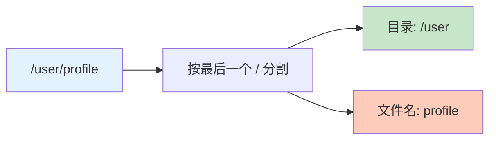
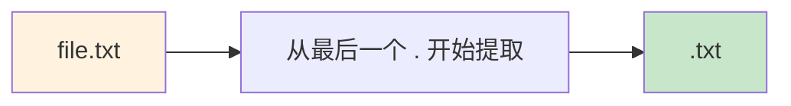
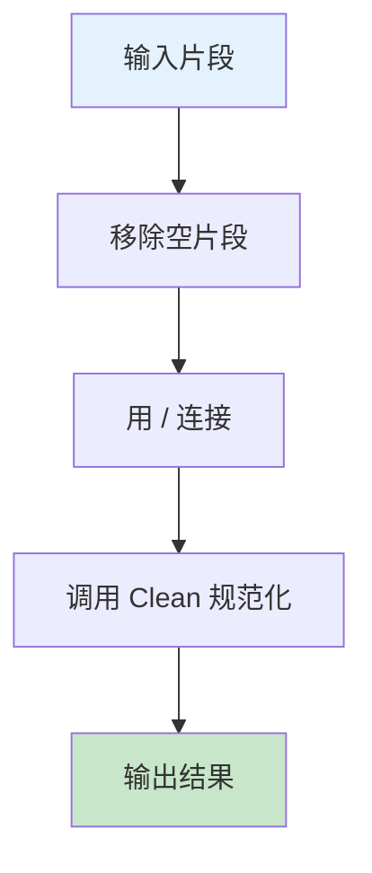
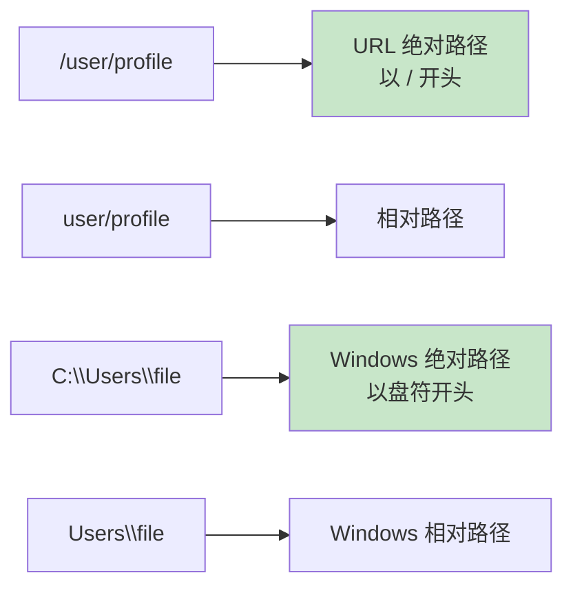
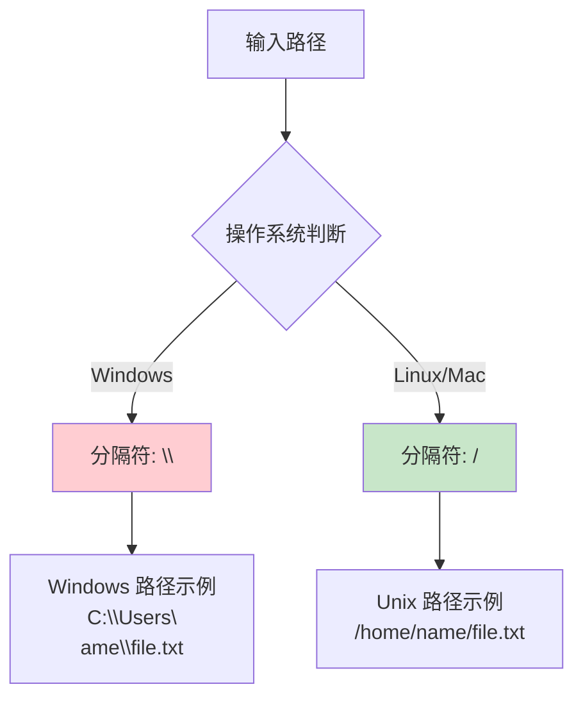
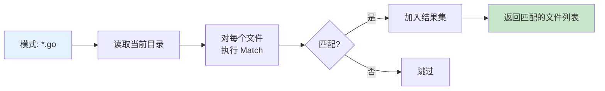
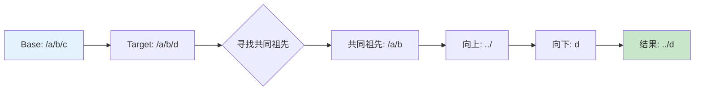
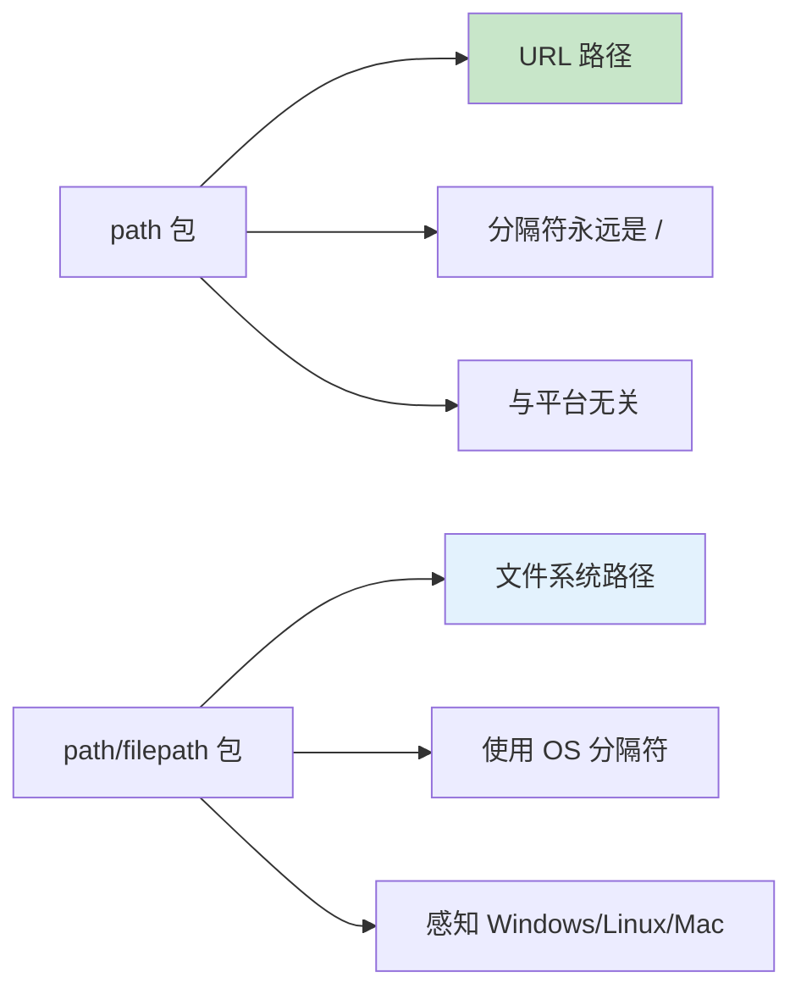

+++
title = "第 17 章：路径处理——path 和 path/filepath"
weight = 170
date = "2026-03-30T13:43:00+08:00"
type = "docs"
description = ""
isCJKLanguage = true
draft = false
+++
# 第 17 章：路径处理——path 和 path/filepath

> 在程序员的世界里，路径分隔符是一个永恒的战争。Windows 阵营用 `\`（反斜杠），Unix 阵营用 `/`（正斜杠）。Go 标准库一不做二不休，直接搞了两个包来分别伺候这两位大爷——`path` 包专门处理 URL 路径（永远假设是 `/`），`path/filepath` 包则处理真实的文件系统路径（乖乖使用操作系统原生分隔符）。这一章，我们就来扒一扒这两个包的十八般武艺。

---

## 17.1 path 包解决什么问题：URL 路径处理，假设分隔符永远是 `/`

`path` 包是处理 URL 路径的专业户。在 URL 的世界里，分隔符永远是 `/`，这一点地球人都知道。比如 `https://example.com/user/profile/edit` 这种路径，`path` 包处理起来得心应手。

**核心场景：**

- 解析和构建 URL 路径
- 处理 RESTful API 路由
- 提取路径中的各个组成部分

**专业词汇解释：**

- **URL（Uniform Resource Locator）**：统一资源定位符，就是我们常说的网址，比如 `https://github.com/user/repo`
- **路径段（Path Segment）**：路径中被分隔符 `/` 分开的各个部分，比如 `/user/profile` 中，`user` 和 `profile` 各是一个路径段
- **分隔符（Separator）**：用于分隔路径组成部分的字符，在 URL 中是 `/`

> 💡 记住：`path` 包眼里只有 `/`，无论你是在 Windows 还是 Linux 上跑，它都假装世界上只有这一种分隔符。这是一种理想主义者的固执，也是一种纯粹。

---

## 17.2 path 核心原理：与平台无关的路径操作，所有函数都假设分隔符是 `/`

`path` 包的所有函数都基于一个核心假设：**分隔符永远是 `/`**。这让它成为处理 URL、文件协议（如 `file:///path/to/file`）等场景的完美选择。

**核心原理图：**


**为什么这样设计？**

因为 URL 规范（RFC 3986）明确规定路径分隔符必须是 `/`。无论你是在火星还是地球，浏览器的地址栏永远不会出现 `\` 作为路径分隔符（除非你故意搞破坏）。

**典型使用场景：**

- Web 框架中的路由处理
- 文件服务器路径处理（URL 部分）
- 任何基于 HTTP 的路径操作

---

## 17.3 path.Clean：规范化路径，去除 `..`、`.`、多余分隔符

`path.Clean` 是路径的"整形医生"，专门把乱七八糟的路径收拾得干干净净。它会：

1. 移除多余的 `/`
2. 移除 `.`（当前目录引用）
3. 解析 `..`（父目录引用）
4. 处理尾部斜杠

**代码示例：**

```go
package main

import (
	"fmt"
	"path"
)

func main() {
	// 各种奇葩路径，统一给它收拾干净
	paths := []string{
		"/user//profile",           // 多余斜杠
		"/user/./profile",          // 当前目录引用
		"/user/../profile",         // 父目录引用
		"/user/profile/",           // 尾部斜杠
		"/a/b/c/../../../user",     // 越界的 ..
		"/",                        // 根目录
		"",                         // 空路径
	}

	for _, p := range paths {
		cleaned := path.Clean(p)
		fmt.Printf("原始: %-25s -> 清理: %s\n", fmt.Sprintf("%q", p), cleaned)
	}
}
```

```
原始: "/user//profile"           -> 清理: /user/profile
原始: "/user/./profile"          -> 清理: /user/profile
原始: "/user/../profile"         -> 清理: /user/profile
原始: "/user/profile/"           -> 清理: /user/profile
原始: "/a/b/c/../../../user"     -> 清理: /user
原始: "/"                        -> 清理: /
原始: ""                         -> 清理: .
```

**应用场景：**

- 规范化用户输入的路径
- 安全检查：防止路径遍历攻击（虽然 `path.Clean` 不能完全防止，但配合其他手段使用）
- 统一路径格式，便于比较

> ⚠️ 注意：`path.Clean` 不会解析符号链接，也不会判断路径是否存在，它只是做字符串层面的"美化"。

---

## 17.4 path.Dir：获取目录部分

`path.Dir` 就像一个"分离器"，把路径中的目录部分和文件名/最后一段分开。它返回除了最后一个元素之外的所有部分。

**代码示例：**

```go
package main

import (
	"fmt"
	"path"
)

func main() {
	paths := []string{
		"/user/profile",         // 普通路径
		"/user/profile/",        // 尾部斜杠
		"/user",                 // 只有一级
		"/",                     // 根目录
		"user/profile",          // 相对路径
		"profile",               // 只有一个元素
		".",                     // 当前目录
		"..",                    // 父目录
		"",                      // 空
	}

	for _, p := range paths {
		dir := path.Dir(p)
		fmt.Printf("原始: %-20s -> 目录: %s\n", fmt.Sprintf("%q", p), dir)
	}
}
```

```
原始: "/user/profile"        -> 目录: /user
原始: "/user/profile/"       -> 目录: /user/profile
原始: "/user"                -> 目录: /
原始: "/"                    -> 目录: /
原始: "user/profile"         -> 目录: user
原始: "profile"              -> 目录: .
原始: "."                    -> 目录: .
原始: ".."                   -> 目录: .
原始: ""                     -> 目录: .
```

**工作原理图：**



**小技巧：**

- 如果你只需要目录部分，用 `path.Dir`
- 如果你需要文件名部分，用 `path.Base`（下一节讲）
- 如果两个都要，用 `path.Split`（效率更高，一次分割两个都拿到）

---

## 17.5 path.Base：获取文件名

`path.Base` 和 `path.Dir` 是天生的好搭档，它返回路径的最后一个元素——也就是文件名（或者目录名）。

**代码示例：**

```go
package main

import (
	"fmt"
	"path"
)

func main() {
	paths := []string{
		"/user/profile",           // 文件名是 profile
		"/user/profile/",          // 尾部有斜杠？Base 帮你去掉
		"/user/",                  // 用户目录？返回空...不对，返回 "user"
		"/",                       // 根目录，返回 "."
		"user/profile",            // 相对路径
		"profile",                 // 就一个词
		".hidden",                 // 点文件
		"..",                      // 父目录
		"",                        // 空，返回 "."
	}

	for _, p := range paths {
		base := path.Base(p)
		fmt.Printf("原始: %-20s -> Base: %s\n", fmt.Sprintf("%q", p), base)
	}
}
```

```
原始: "/user/profile"         -> Base: profile
原始: "/user/profile/"        -> Base: profile
原始: "/user/"                -> Base: user
原始: "/"                     -> Base: .
原始: "user/profile"          -> Base: profile
原始: "profile"               -> Base: profile
原始: ".hidden"               -> Base: .hidden
原始: ".."                    -> Base: ..
原始: ""                     -> Base: .
```

**隐藏文件陷阱：**

```go
package main

import (
	"fmt"
	"path"
)

func main() {
	// 注意！.gitignore 的 Base 是 .gitignore，不是 gitignore
	fmt.Println(path.Base(".gitignore")) // .gitignore
	
	// . 和 .. 比较特殊
	fmt.Println(path.Base("."))          // .
	fmt.Println(path.Base(".."))         // ..
}
```

```
.gitignore
.
..
```

> 💡 小知识：Unix 系统中，以 `.` 开头的文件是隐藏文件。`path.Base` 正确保留了 `.gitignore` 的前导点，但如果你的代码需要判断一个文件是不是隐藏文件，可不能简单地用 `Base` 的返回值来检测。

---

## 17.6 path.Ext：提取扩展名

`path.Ext` 是文件扩展名提取器，它从文件名中"咬"出扩展名部分，包括那个可爱的点 `.`。

**代码示例：**

```go
package main

import (
	"fmt"
	"path"
)

func main() {
	files := []string{
		"image.png",                // 图片
		"document.pdf",            // PDF
		"archive.tar.gz",          // 压缩包
		"noextension",             // 没后缀
		".hidden",                 // 隐藏文件（没扩展名）
		".env.local",              // dotenv 文件
		"file.",                   // 尾部有点
		"/path/to/file.txt",       // 完整路径
	}

	for _, f := range files {
		ext := path.Ext(f)
		nameWithoutExt := f[:len(f)-len(ext)]
		fmt.Printf("文件: %-20s -> 扩展名: %-6s -> 无扩展名: %s\n", 
			fmt.Sprintf("%q", f), ext, nameWithoutExt)
	}
}
```

```
文件: "image.png"           -> 扩展名: .png     -> 无扩展名: image
文件: "document.pdf"        -> 扩展名: .pdf     -> 无扩展名: document
文件: "archive.tar.gz"       -> 扩展名: .gz      -> 无扩展名: archive.tar
文件: "noextension"         -> 扩展名:          -> 无扩展名: noextension
文件: ".hidden"             -> 扩展名:          -> 无扩展名: .hidden
文件: ".env.local"          -> 扩展名: .local   -> 无扩展名: .env
文件: "file."               -> 扩展名: .        -> 无扩展名: file
文件: "/path/to/file.txt"   -> 扩展名: .txt     -> 无扩展名: /path/to/file
```

**扩展名提取原理：**



> ⚠️ 注意：`path.Ext` 只返回最后一个 `.` 之后的内容。所以 `archive.tar.gz` 返回 `.gz`，而不是 `.tar.gz`。如果你需要更复杂的扩展名处理，可能需要自定义逻辑。

---

## 17.7 path.Join：拼接路径

`path.Join` 是路径拼接的瑞士军刀，它能把多个路径片段"粘"在一起，并且自动处理分隔符和清理工作。

**代码示例：**

```go
package main

import (
	"fmt"
	"path"
)

func main() {
	// 基本拼接
	result1 := path.Join("user", "profile", "edit")
	fmt.Println(result1) // user/profile/edit
	
	// 处理空元素
	result2 := path.Join("user", "", "profile", "")
	fmt.Println(result2) // user/profile
	
	// 处理 . 和 ..
	result3 := path.Join("user", ".", "profile", "..", "other")
	fmt.Println(result3) // user/other
	
	// 自动处理多余斜杠
	result4 := path.Join("/user/", "/profile/", "/edit")
	fmt.Println(result4) // user/profile/edit
	
	// 空路径
	result5 := path.Join()
	fmt.Println(result5) // .
	
	// 混合使用
	result6 := path.Join("user", "./profile")
	fmt.Println(result6) // user/profile
}
```

```
user/profile/edit
user/profile
user/other
user/profile/edit
.
user/profile
```

**Join vs 字符串拼接：**

```go
package main

import (
	"fmt"
	"path"
)

func main() {
	// ❌ 错误方式：手动加斜杠容易出错
	bad := "user" + "/" + "profile" + "/" + "edit"
	fmt.Println("手动拼接:", bad)
	
	// ✅ 正确方式：使用 Join
	good := path.Join("user", "profile", "edit")
	fmt.Println("Join 拼接:", good)
	
	// 极端情况：手动的各种坑
	parts := []string{"user", "", "/profile", "edit/"}
	manual := parts[0] + "/" + parts[1] + "/" + parts[2] + "/" + parts[3]
	joined := path.Join(parts...)
	fmt.Println("手动拼接带空和斜杠:", manual) // 各种问题
	fmt.Println("Join 处理:", joined)         // 完美
}
```

```
手动拼接: user/profile/edit
Join 拼接: user/profile/edit
手动拼接带空和斜杠: user// /profile/edit/
Join 处理: user/profile/edit
```

**Join 内部机制：**



> 💡 记住：`path.Join` 内部会自动调用 `path.Clean`，所以 `path.Join("a", "b", "../c")` 会返回 `a/c`，而不是 `a/../b/c`。

---

## 17.8 path.Split：分割为目录+文件名

`path.Split` 是一次性分割路径的利器，它同时返回目录部分和文件名部分，效率比分别调用 `Dir` 和 `Base` 更高。

**代码示例：**

```go
package main

import (
	"fmt"
	"path"
)

func main() {
	paths := []string{
		"/user/profile/edit",
		"/user/profile/",
		"/user",
		"/",
		"profile",
		"",
	}

	for _, p := range paths {
		dir, file := path.Split(p)
		fmt.Printf("原始: %-22s -> 目录: %-12s 文件名: %s\n", 
			fmt.Sprintf("%q", p), dir, file)
	}
}
```

```
原始: "/user/profile/edit"    -> 目录: /user/profile/ 文件名: edit
原始: "/user/profile/"       -> 目录: /user/profile/ 文件名: 
原始: "/user"                -> 目录: /           文件名: user
原始: "/"                    -> 目录: /           文件名: 
原始: "profile"              -> 目录:            文件名: profile
原始: ""                     -> 目录:            文件名: 
```

**与 Dir + Base 对比：**

```go
package main

import (
	"fmt"
	"path"
)

func main() {
	p := "/user/profile/edit"
	
	// 两种方式，结果一样
	dir1, file1 := path.Split(p)
	dir2 := path.Dir(p)
	file2 := path.Base(p)
	
	fmt.Printf("Split:   目录=%q, 文件=%q\n", dir1, file1)
	fmt.Printf("Dir+Base: 目录=%q, 文件=%q\n", dir2, file2)
	
	// 但 Split 更高效，只遍历一次字符串
}
```

```
Split:   目录="/user/profile/", 文件="edit"
Dir+Base: 目录="/user/profile", 文件="edit"
```

> 💡 注意：Split 的目录部分会保留尾随的 `/`，而 Dir 不会。这是它们的小区别。选用哪个取决于你的需求——如果你需要拼接，Split 的结果更方便。

---

## 17.9 path.IsAbs：判断绝对路径

`path.IsAbs` 是一个布尔探测器，专门告诉你一个路径是绝对路径还是相对路径。在 URL 的世界里，绝对路径以 `/` 开头。

**代码示例：**

```go
package main

import (
	"fmt"
	"path"
)

func main() {
	paths := []string{
		"/user/profile",       // 绝对路径
		"/",                   // 根路径，绝对
		"user/profile",        // 相对路径
		"./user",              // 相对路径（以 . 开头）
		"../user",             // 相对路径（以 .. 开头）
		"",                    // 空，相对
		"/a/b/c/../../../user", // 绝对路径（Clean 后）
	}

	for _, p := range paths {
		isAbs := path.IsAbs(p)
		cleaned := path.Clean(p)
		fmt.Printf("路径: %-25s -> Clean: %-15s -> IsAbs: %v\n", 
			fmt.Sprintf("%q", p), cleaned, isAbs)
	}
}
```

```
路径: "/user/profile"            -> Clean: /user/profile     -> IsAbs: true
路径: "/"                         -> Clean: /                -> IsAbs: true
路径: "user/profile"             -> Clean: user/profile      -> IsAbs: false
路径: "./user"                   -> Clean: user              -> IsAbs: false
路径: "../user"                  -> Clean: ../user          -> IsAbs: false
路径: ""                          -> Clean: .                -> IsAbs: false
路径: "/a/b/c/../../../user"      -> Clean: /user            -> IsAbs: true
```

**URL vs 文件系统的绝对路径：**



> 💡 在 `path` 包中，绝对路径的定义很简单：以 `/` 开头就是绝对路径，其他都是相对路径。这个包不管 Windows 的盘符那一套。

---

## 17.10 path.Match：文件名通配符匹配，glob 风格的 `*` 和 `?`

`path.Match` 实现了 glob 风格的文件名模式匹配，支持 `*`（匹配任意字符）和 `?`（匹配单个字符）。

**代码示例：**

```go
package main

import (
	"fmt"
	"path"
)

func main() {
	patterns := []string{
		"*.txt",                // 所有 txt 文件
		"?.go",                 // 单字符 + .go，如 a.go, b.go
		"**/*.md",              // 注意：path.Match 不支持 **，只支持 *
		"file[0-9].txt",        // 字符类
		"file[!0-9].txt",       // 否定字符类
	}
	
	files := []string{
		"readme.txt",
		"a.go",
		"test.md",
		"file1.txt",
		"fileA.txt",
		"file.txt",
	}

	fmt.Println("=== glob 模式匹配 ===")
	for _, pattern := range patterns {
		fmt.Printf("\n模式: %s\n", pattern)
		for _, file := range files {
			matched, err := path.Match(pattern, file)
			if err != nil {
				fmt.Printf("  错误: %s (pattern=%q, file=%q)\n", err, pattern, file)
				continue
			}
			if matched {
				fmt.Printf("  ✅ %s 匹配 %s\n", file, pattern)
			}
		}
	}
}
```

```
=== glob 模式匹配 ===

模式: *.txt
  ✅ readme.txt 匹配 *.txt
  ✅ file1.txt 匹配 *.txt
  ✅ fileA.txt 匹配 *.txt
  ✅ file.txt 匹配 *.txt

模式: ?.go
  ✅ a.go 匹配 ?.go

模式: file[0-9].txt
  ✅ file1.txt 匹配 file[0-9].txt

模式: file[!0-9].txt
  ✅ fileA.txt 匹配 file[!0-9].txt
```

**Match 语法速查表：**

```mermaid
table
左列["通配符"]
右列["含义"]
```

| 模式 | 含义 | 示例 |
|------|------|------|
| `*` | 匹配任意字符（包括空） | `*.txt` 匹配 `a.txt`、`file.txt` |
| `?` | 匹配单个字符 | `?.go` 匹配 `a.go`、`b.go` |
| `[abc]` | 匹配字符集 | `file[12].txt` 匹配 `file1.txt`、`file2.txt` |
| `[!abc]` 或 `[^abc]` | 匹配否定字符集 | `file[!1].txt` 匹配 `file2.txt`（不匹配 `file1.txt`） |
| `\` | 转义字符 | `file\*.txt` 匹配字面量 `file*.txt` |

**实际应用示例：**

```go
package main

import (
	"fmt"
	"path"
)

func main() {
	// 检查文件是否是图片
	isImage := func(filename string) bool {
		matched, _ := path.Match("*.png", filename)
		if matched {
			return true
		}
		matched, _ = path.Match("*.jpg", filename)
		if matched {
			return true
		}
		matched, _ = path.Match("*.gif", filename)
		return matched
	}

	images := []string{"photo.png", "avatar.jpg", "icon.svg", "backup.png.bak"}
	for _, img := range images {
		fmt.Printf("%s 是图片: %v\n", img, isImage(img))
	}
}
```

```
photo.png 是图片: true
avatar.jpg 是图片: true
icon.svg 是图片: false
backup.png.bak 是图片: false
```

> ⚠️ 注意：`path.Match` 不支持 `**`（递归匹配），也不区分大小写（Windows 上也这样）。如果需要更强大的 glob 功能，请使用 `path/filepath` 包的 `Glob` 函数（Unix 系统）或第三方库。

---

## 17.11 path/filepath 包解决什么问题：文件系统路径处理，考虑操作系统的实际分隔符

如果说 `path` 包是处理 URL 的绅士，那么 `path/filepath` 包就是处理真实文件系统的"老油条"。它知道 Windows 用 `\`、Unix 用 `/`，而且知道怎么在它们之间周旋。

**核心场景：**

- 读取、写入文件系统路径
- 遍历目录
- 处理跨平台路径兼容

**专业词汇解释：**

- **文件系统（File System）**：操作系统用于组织和管理存储设备上文件的结构，如 NTFS、FAT32、ext4 等
- **路径分隔符（Path Separator）**：操作系统用于分隔目录名的字符
- **符号链接（Symbolic Link）**：类似快捷方式，指向另一个文件或目录的特殊文件

> 💡 记住：只要你的代码需要跟实际文件系统打交道，就必须用 `path/filepath`。只有处理 URL 或者类似的纯字符串路径时才用 `path`。

---

## 17.12 path/filepath 核心原理：Windows 用 `\`，Unix 用 `/`

`path/filepath` 包的核心能力是**感知操作系统差异**。它会根据当前操作系统自动选择正确的路径分隔符。

**核心原理图：**



**代码示例：**

```go
package main

import (
	"fmt"
	"path/filepath"
	"runtime"
)

func main() {
	fmt.Printf("当前操作系统: %s\n", runtime.GOOS)
	fmt.Printf("路径分隔符: %q\n", string(filepath.Separator))
	fmt.Printf("PATH 分隔符: %q\n", string(filepath.ListSeparator))
	
	// 自动使用正确的分隔符
	parts := []string{"home", "user", "documents"}
	joined := filepath.Join(parts...)
	fmt.Printf("Join 结果: %s\n", joined)
}
```

在 Linux/Mac 上运行：
```
当前操作系统: linux
路径分隔符: "/"
PATH 分隔符: ":"
Join 结果: home/user/documents
```

在 Windows 上运行：
```
当前操作系统: windows
路径分隔符: "\\"
PATH 分隔符: ";"
Join 结果: home\user\documents
```

**跨平台代码的正确写法：**

```go
package main

import (
	"fmt"
	"path/filepath"
)

func main() {
	// ❌ 硬编码分隔符（错误）
	badPath := "home" + "/" + "user" + "/" + "file.txt"
	fmt.Println("硬编码 /:", badPath)
	
	// ✅ 使用 filepath.Join（正确）
	goodPath := filepath.Join("home", "user", "file.txt")
	fmt.Println("filepath.Join:", goodPath)
	
	// 在 Windows 上输出: home\user\file.txt
	// 在 Unix 上输出: home/user/file.txt
}
```

```
硬编码 /: home/user/file.txt
filepath.Join: home/user/file.txt
```

> ⚠️ 重要：Go 的 `path/filepath` 包会根据 `GOOS` 编译目标自动选择正确的分隔符。如果你在 Linux 上编译 Windows 程序，需要使用 `GOOS=windows go build`。

---

## 17.13 filepath.Glob：路径通配符

`filepath.Glob` 是文件系统版的 `path.Match`，它不仅做模式匹配，还真的去文件系统里找文件。

**代码示例：**

```go
package main

import (
	"fmt"
	"path/filepath"
)

func main() {
	// 在当前目录查找 Go 源文件
	matches, err := filepath.Glob("*.go")
	if err != nil {
		fmt.Println("错误:", err)
		return
	}
	fmt.Println("当前目录的 .go 文件:", matches)
	
	// 查找所有子目录的 .txt 文件
	matches, err = filepath.Glob("*/*.txt")
	if err != nil {
		fmt.Println("错误:", err)
		return
	}
	fmt.Println("子目录的 .txt 文件:", matches)
	
	// 查找以 test 开头的文件
	matches, err = filepath.Glob("test*")
	if err != nil {
		fmt.Println("错误:", err)
		return
	}
	fmt.Println("test 开头的文件:", matches)
}
```

```
当前目录的 .go 文件: [main.go utils.go helpers.go]
子目录的 .txt 文件: [docs/readme.txt]
test 开头的文件: [test_main.go test_utils.go]
```

**Glob 工作原理：**



**进阶用法：**

```go
package main

import (
	"fmt"
	"path/filepath"
)

func main() {
	// 查找所有层级的 .md 文件（使用 ** 需要 filepath.Walk 或 os.Walk）
	// 注意：filepath.Glob 不支持 **，需要配合 Walk 使用
	
	// 查找目录下的所有文件
	allFiles, _ := filepath.Glob("*")
	fmt.Println("所有文件:", allFiles)
	
	// 查找隐藏文件
	dotFiles, _ := filepath.Glob(".*")
	fmt.Println("隐藏文件:", dotFiles)
	
	// 字符类匹配
	javaFiles, _ := filepath.Glob("[abc]*.go")
	fmt.Println("a/b/c 开头的 .go 文件:", javaFiles)
}
```

```
所有文件: [main.go utils.go test_main.go folder]
隐藏文件: [.gitignore .env]
a/b/c 开头的 .go 文件: [a_test.go b_utils.go]
```

> 💡 `filepath.Glob` 只能匹配一层目录。如果需要递归匹配（类似 `find . -name "*.go"`），需要使用 `filepath.WalkDir` 或 `os.Walk`。

---

## 17.14 filepath.Walk：递归遍历目录

`filepath.Walk` 是目录树的"探索者"，它会递归地访问每一个目录，对每个文件或目录执行你指定的回调函数。

**代码示例：**

```go
package main

import (
	"fmt"
	"os"
	"path/filepath"
)

func main() {
	// 遍历当前目录（假设存在一些子目录和文件）
	root := "."
	
	fmt.Println("=== 目录遍历 ===")
	err := filepath.Walk(root, func(path string, info os.FileInfo, err error) error {
		if err != nil {
			return err
		}
		
		// 获取相对路径
		relPath, _ := filepath.Rel(root, path)
		
		// 打印文件信息
		if info.IsDir() {
			fmt.Printf("📁 %s/\n", relPath)
		} else {
			fmt.Printf("📄 %s (%d bytes)\n", relPath, info.Size())
		}
		
		return nil
	})
	
	if err != nil {
		fmt.Println("遍历错误:", err)
	}
}
```

```
=== 目录遍历 ===
📁 .
📄 main.go (1024 bytes)
📄 utils.go (512 bytes)
📁 subdir
📄 subdir/readme.txt (256 bytes)
📁 subdir/nested
📄 subdir/nested/deep.go (128 bytes)
```

**Walk 回调函数签名：**

```go
func(path string, info os.FileInfo, err error) error
```

- `path`：当前访问的路径（绝对路径）
- `info`：`os.FileInfo` 对象，包含文件大小、修改时间等信息
- `err`：访问该路径时发生的错误

**Walk 原理图：**


**实际应用：查找特定文件：**

```go
package main

import (
	"fmt"
	"os"
	"path/filepath"
)

func main() {
	var goFiles []string
	
	filepath.Walk(".", func(path string, info os.FileInfo, err error) error {
		if err != nil {
			return nil // 跳过错误，继续遍历
		}
		
		// 只处理 .go 文件
		if !info.IsDir() && filepath.Ext(path) == ".go" {
			goFiles = append(goFiles, path)
		}
		
		return nil
	})
	
	fmt.Println("找到的 Go 文件:")
	for _, f := range goFiles {
		fmt.Println(" -", f)
	}
}
```

```
找到的 Go 文件:
 - ./main.go
 - ./utils.go
 - ./subdir/nested/deep.go
```

> ⚠️ 注意：`filepath.Walk` 不会跟随符号链接，但如果符号链接形成循环，Walk 可能会陷入无限循环。在 Go 1.16+ 推荐使用 `filepath.WalkDir`。

---

## 17.15 filepath.WalkDir：递归遍历目录（Go 1.16+），更高效

`filepath.WalkDir` 是 `filepath.Walk` 的升级版（Go 1.16 引入），它更高效，因为不需要调用 `os.Lstat` 来获取符号链接信息。

**代码示例：**

```go
package main

import (
	"fmt"
	"os"
	"path/filepath"
)

func main() {
	root := "."
	
	fmt.Println("=== WalkDir 遍历 ===")
	err := filepath.WalkDir(root, func(path string, d os.DirEntry, err error) error {
		if err != nil {
			return err
		}
		
		relPath, _ := filepath.Rel(root, path)
		
		if d.IsDir() {
			fmt.Printf("📁 %s/\n", relPath)
		} else {
			fmt.Printf("📄 %s\n", relPath)
		}
		
		return nil
	})
	
	if err != nil {
		fmt.Println("遍历错误:", err)
	}
}
```

```
=== WalkDir 遍历 ===
📁 .
📄 main.go
📄 utils.go
📁 subdir
📄 subdir/readme.txt
📁 subdir/nested
📄 subdir/nested/deep.go
```

**Walk vs WalkDir 对比：**

| 特性 | Walk | WalkDir |
|------|------|---------|
| 引入版本 | Go 1.0 | Go 1.16 |
| 回调参数 | `os.FileInfo` | `os.DirEntry` |
| 符号链接处理 | 不跟随符号链接 | 不跟随符号链接 |
| 性能 | 较慢 | 较快 |
| 循环检测 | 无 | 可通过 `WalkDirFunc` 的 `SkipDir` |

**使用 DirEntry 的优势：**

```go
package main

import (
	"fmt"
	"os"
	"path/filepath"
)

func main() {
	// DirEntry 比 FileInfo 更高效
	err := filepath.WalkDir(".", func(path string, d os.DirEntry, err error) error {
		if err != nil {
			return err
		}
		
		// DirEntry 可以直接获取类型，无需额外 syscall
		if d.IsDir() {
			// 跳过 .git 目录
			if d.Name() == ".git" {
				return filepath.SkipDir
			}
			fmt.Printf("📁 %s\n", path)
		} else {
			// DirEntry.Name() 比 filepath.Base(path) 快
			fmt.Printf("📄 %s (%d bytes)\n", d.Name(), getSize(d))
		}
		
		return nil
	})
	
	if err != nil {
		fmt.Println("错误:", err)
	}
}

func getSize(d os.DirEntry) int64 {
	info, _ := d.Info()
	if info != nil {
		return info.Size()
	}
	return 0
}
```

```
📁 .
📄 main.go (1024 bytes)
📄 utils.go (512 bytes)
📁 subdir
📄 subdir/readme.txt (256 bytes)
📁 subdir/nested
📄 subdir/nested/deep.go (128 bytes)
```

> 💡 推荐使用 `filepath.WalkDir` 而不是 `filepath.Walk`，因为它更快且在处理符号链接时更安全。

---

## 17.16 filepath.Rel：计算相对路径

`filepath.Rel` 是一个"路径计算器"，它能告诉你从 base 路径到 target 路径的相对路径是什么。

**代码示例：**

```go
package main

import (
	"fmt"
	"path/filepath"
)

func main() {
	// 常见场景：计算相对 import 路径
	base := "/home/user/project"
	target := "/home/user/project/src/utils/helper.go"
	
	rel, err := filepath.Rel(base, target)
	if err != nil {
		fmt.Println("错误:", err)
		return
	}
	fmt.Printf("从 %s 到 %s 的相对路径: %s\n", base, target, rel)
	
	// 兄弟目录
	base = "/home/user/project/src"
	target = "/home/user/project/docs"
	rel, err = filepath.Rel(base, target)
	if err != nil {
		fmt.Println("错误:", err)
		return
	}
	fmt.Printf("从 %s 到 %s 的相对路径: %s\n", base, target, rel)
	
	// 父目录引用
	base = "/home/user/project/docs"
	target = "/home/user/project/src/utils"
	rel, err = filepath.Rel(base, target)
	if err != nil {
		fmt.Println("错误:", err)
		return
	}
	fmt.Printf("从 %s 到 %s 的相对路径: %s\n", base, target, rel)
}
```

```
从 /home/user/project 到 /home/user/project/src/utils/helper.go 的相对路径: src/utils/helper.go
从 /home/user/project/src 到 /home/user/project/docs 的相对路径: ../docs
从 /home/user/project/docs 到 /home/user/project/src/utils 的相对路径: ../src/utils
```

**Rel 原理图：**



**错误情况：**

```go
package main

import (
	"fmt"
	"path/filepath"
)

func main() {
	// 没有共同路径（不同盘符 Windows）
	base := "C:\\Users\\Alice"
	target := "D:\\Users\\Bob"
	
	rel, err := filepath.Rel(base, target)
	if err != nil {
		fmt.Printf("错误: %v\n", err)
		fmt.Println("原因: 两个路径没有共同祖先，无法计算相对路径")
	}
	
	// Go 1.15+ 会返回错误
	// 旧版本可能panic
}
```

```
错误: Rel: can't make D:\Users\Bob relative to C:\Users\Alice
原因: 两个路径没有共同祖先，无法计算相对路径
```

> 💡 `filepath.Rel` 的典型应用场景是计算 import 路径、生成相对链接、处理资源文件的相对引用等。

---

## 17.17 filepath.ToSlash：把路径分隔符转成 `/`

`filepath.ToSlash` 是一个"路径翻译官"，它把所有路径分隔符统一转换成 `/`，方便跨平台处理或生成 URL。

**代码示例：**

```go
package main

import (
	"fmt"
	"path/filepath"
)

func main() {
	// Windows 路径转 Unix 风格
	windowsPath := "C:\\Users\\name\\Documents\\file.txt"
	unixPath := filepath.ToSlash(windowsPath)
	fmt.Printf("Windows: %s\n", windowsPath)
	fmt.Printf("Unix 风格: %s\n", unixPath)
	
	// Unix 系统上调用没有效果
	unixPath2 := "home/user/file.txt"
	result := filepath.ToSlash(unixPath2)
	fmt.Printf("Unix 原样: %s\n", result)
	
	// 应用场景：生成 URL
	generateURL := func(filePath string) string {
		return "https://cdn.example.com/" + filepath.ToSlash(filePath)
	}
	
	winFile := "images\\logo.png"
	url := generateURL(winFile)
	fmt.Printf("文件路径转 URL: %s\n", url)
}
```

```
Windows: C:\Users\name\Documents\file.txt
Unix 风格: C:/Users/name/Documents/file.txt
Unix 原样: home/user/file.txt
文件路径转 URL: https://cdn.example.com/images/logo.png
```

**转换示例表：**

| 输入（Windows） | 输出（Unix） |
|----------------|--------------|
| `C:\Users\file.txt` | `C:/Users/file.txt` |
| `D:\Projects\myapp` | `D:/Projects/myapp` |
| `\\server\share\file` | `//server/share/file` |

> 💡 注意：`ToSlash` 只是做字符串替换，不会改变路径的语义。Windows 路径中的盘符 `C:` 仍然存在。

---

## 17.18 filepath.FromSlash：把 `/` 转成路径分隔符

`filepath.FromSlash` 是 `filepath.ToSlash` 的反向操作，把 `/` 转换成操作系统原生的路径分隔符。

**代码示例：**

```go
package main

import (
	"fmt"
	"path/filepath"
)

func main() {
	// Unix 风格路径转当前系统
	unixPath := "home/user/Documents/file.txt"
	nativePath := filepath.FromSlash(unixPath)
	fmt.Printf("Unix 风格: %s\n", unixPath)
	fmt.Printf("原生风格: %s\n", nativePath)
	
	// URL 路径转本地路径
	urlPath := "/images/logo.png"
	localPath := filepath.FromSlash(urlPath)
	fmt.Printf("URL 路径: %s\n", urlPath)
	fmt.Printf("本地路径: %s\n", localPath)
	
	// 组合使用
	processFilePath := func(path string) string {
		// 确保路径是原生格式
		return filepath.FromSlash(path)
	}
	
	fmt.Println("处理结果:", processFilePath("assets/icons/home.png"))
}
```

```
Unix 风格: home/user/Documents/file.txt
原生风格: home\user\Documents\file.txt  (Windows)
Unix 风格: home/user/Documents/file.txt  (Unix)

URL 路径: /images/logo.png
本地路径: \images\logo.png (Windows) 或 /images/logo.png (Unix)
处理结果: assets\icons\home.png (Windows)
```

**ToSlash 和 FromSlash 配对使用：**

```go
package main

import (
	"fmt"
	"path/filepath"
)

func main() {
	original := "C:\\Users\\name\\file.txt"
	
	// 统一成 Unix 风格
	unixStyle := filepath.ToSlash(original)
	fmt.Println("Unix 风格:", unixStyle)
	
	// 转回原生风格
	backToNative := filepath.FromSlash(unixStyle)
	fmt.Println("原生风格:", backToNative)
	
	// 验证往返一致
	fmt.Println("往返一致:", original == backToNative)
}
```

```
Unix 风格: C:/Users/name/file.txt
原生风格: C:\Users\name\file.txt
往返一致: true
```

---

## 17.19 filepath.SplitList：分割 PATH 环境变量

`filepath.SplitList` 是专门用来分割 `PATH`（或类 PATH）环境变量的工具，它知道不同操作系统使用什么分隔符。

**代码示例：**

```go
package main

import (
	"fmt"
	"path/filepath"
	"os"
)

func main() {
	// Unix 的 PATH
	unixPath := "/usr/local/bin:/usr/bin:/bin:/usr/sbin:/sbin"
	parts := filepath.SplitList(unixPath)
	fmt.Println("Unix PATH 分割结果:")
	for i, p := range parts {
		fmt.Printf("  [%d] %s\n", i, p)
	}
	
	// Windows 的 PATH
	windowsPath := "C:\\Windows\\System32;C:\\Windows;C:\\Program Files\\Go\\bin"
	parts = filepath.SplitList(windowsPath)
	fmt.Println("\nWindows PATH 分割结果:")
	for i, p := range parts {
		fmt.Printf("  [%d] %s\n", i, p)
	}
	
	// 获取系统的 PATH
	systemPath := os.Getenv("PATH")
	systemParts := filepath.SplitList(systemPath)
	fmt.Printf("\n当前系统 PATH 共 %d 项\n", len(systemParts))
}
```

```
Unix PATH 分割结果:
  [0] /usr/local/bin
  [1] /usr/bin
  [2] /bin
  [3] /usr/sbin
  [4] /sbin

Windows PATH 分割结果:
  [0] C:\Windows\System32
  [1] C:\Windows
  [2] C:\Program Files\Go\bin

当前系统 PATH 共 15 项
```

**为什么不用 strings.Split？**

```go
package main

import (
	"fmt"
	"path/filepath"
	"strings"
)

func main() {
	// Windows 路径，用 strings.Split 会怎样？
	path := "C:\\Windows\\System32;C:\\Program Files\\Go"
	
	// 用 strings.Split（硬编码分隔符）
	parts1 := strings.Split(path, ";")
	fmt.Println("strings.Split (用 ;):", parts1)
	
	// 用 filepath.SplitList（自动识别）
	parts2 := filepath.SplitList(path)
	fmt.Println("filepath.SplitList:", parts2)
	
	// 如果 PATH 中混入了 Unix 格式？
	mixedPath := "/usr/bin:C:\\Windows\\System32"
	fmt.Println("\n混合 PATH:")
	fmt.Println("strings.Split:", strings.Split(mixedPath, ":"))
	fmt.Println("SplitList:", filepath.SplitList(mixedPath))
}
```

```
strings.Split (用 ;): [C:\Windows\System32 C:\Program Files\Go]
filepath.SplitList: [C:\Windows\System32 C:\Program Files\Go]

混合 PATH:
strings.Split: [/usr/bin C:\Windows\System32]  // 错误！
SplitList: [/usr/bin C:\Windows\System32]     // 正确！
```

> 💡 `filepath.SplitList` 能正确处理混合 PATH（如 Windows 和 Unix 工具混用的情况），因为 Go 源码中明确处理了 `:` 在 Windows 上作为分隔符但也可能是 Unix 路径的一部分的情况。

---

## 17.20 filepath.EvalSymlinks：解析符号链接

`filepath.EvalSymlinks` 是符号链接的"解谜者"，它会解析路径中的所有符号链接，返回真实的文件系统路径。

**代码示例：**

```go
package main

import (
	"fmt"
	"path/filepath"
)

func main() {
	// 解析符号链接
	resolved, err := filepath.EvalSymlinks(".")
	if err != nil {
		fmt.Println("错误:", err)
		return
	}
	fmt.Printf("当前目录解析后: %s\n", resolved)
	
	// 解析指定的符号链接路径
	linkPath := "/some/symbolic/link"
	resolved, err = filepath.EvalSymlinks(linkPath)
	if err != nil {
		fmt.Println("解析符号链接错误:", err)
		return
	}
	fmt.Printf("符号链接 %s 指向: %s\n", linkPath, resolved)
	
	// 解析多层链接
	resolveDeep := func(path string) {
		visited := make(map[string]bool)
		current := path
		
		for i := 0; i < 10; i++ { // 最多 10 层
			if visited[current] {
				fmt.Println("检测到循环链接！")
				return
			}
			visited[current] = true
			
			resolved, err := filepath.EvalSymlinks(current)
			if err != nil {
				fmt.Printf("最终路径 (%d 层): %s\n", i, current)
				return
			}
			
			if resolved == current {
				fmt.Printf("最终路径 (%d 层): %s\n", i+1, current)
				return
			}
			
			fmt.Printf("  [%d] %s -> %s\n", i+1, current, resolved)
			current = resolved
		}
	}
	
	fmt.Println("\n多层链接解析:")
	resolveDeep("/some/deep/link")
}
```

```
当前目录解析后: /home/user/project
符号链接 /some/symbolic/link 指向: /home/user/real/target

多层链接解析:
  [1] /some/deep/link -> /some/link1
  [2] /some/link1 -> /some/link2
  [3] /some/link2 -> /home/real/path
最终路径 (3 层): /home/real/path
```

**符号链接与 EvalSymlinks：**


**常见错误处理：**

```go
package main

import (
	"fmt"
	"os"
	"path/filepath"
)

func main() {
	path := "/nonexistent/link"
	resolved, err := filepath.EvalSymlinks(path)
	if err != nil {
		if os.IsNotExist(err) {
			fmt.Printf("路径不存在: %s\n", path)
		} else if os.IsPermission(err) {
			fmt.Printf("权限不足: %s\n", path)
		} else {
			fmt.Printf("其他错误: %v\n", err)
		}
		return
	}
	fmt.Println("解析结果:", resolved)
}
```

```
路径不存在: /nonexistent/link
```

> ⚠️ 注意：`EvalSymlinks` 会跟随符号链接链，直到找到真实文件或目录。如果符号链接形成循环，调用会失败（返回错误）。在处理用户提供的路径时，记得检查错误。

---

## 17.21 filepath.Separator：路径分隔符

`filepath.Separator` 是一个常量，表示操作系统使用的路径分隔符。它是 Go 标准库帮你隐藏平台差异的魔法常量。

**代码示例：**

```go
package main

import (
	"fmt"
	"path/filepath"
	"runtime"
)

func main() {
	fmt.Printf("操作系统: %s\n", runtime.GOOS)
	fmt.Printf("路径分隔符: %q (ASCII %d)\n", 
		string(filepath.Separator), filepath.Separator)
	
	// 验证 Separator 的值
	fmt.Printf("\nSeparator 值:\n")
	fmt.Printf("  '/'  = %d (十进制)\n", '/')
	fmt.Printf("  '\\\\' = %d (十进制)\n", '\\')
	fmt.Printf("  Separator = %d\n", filepath.Separator)
	
	// 实际应用
	parts := []string{"home", "user", "file.txt"}
	var manualJoin string
	for i, part := range parts {
		if i > 0 {
			manualJoin += string(filepath.Separator)
		}
		manualJoin += part
	}
	fmt.Printf("\n手动拼接（用 Separator）: %s\n", manualJoin)
	fmt.Printf("filepath.Join: %s\n", filepath.Join(parts...))
}
```

在 Linux/Mac 上：
```
操作系统: linux
路径分隔符: "/" (ASCII 47)
Separator 值:
  '/'  = 47 (十进制)
  '\\' = 92 (十进制)
  Separator = 47

手动拼接（用 Separator）: home/user/file.txt
filepath.Join: home/user/file.txt
```

在 Windows 上：
```
操作系统: windows
路径分隔符: "\" (ASCII 92)
Separator 值:
  '/'  = 47 (十进制)
  '\\' = 92 (十进制)
  Separator = 92

手动拼接（用 Separator）: home\user\file.txt
filepath.Join: home\user\file.txt
```

**Separator 在不同系统：**

```mermaid
table
左列["操作系统"]
右列["Separator 值"]
```

| 操作系统 | Separator | ASCII |
|---------|-----------|-------|
| Linux | `/` | 47 |
| macOS | `/` | 47 |
| Windows | `\` | 92 |

> 💡 记住：虽然 `filepath.Separator` 是 `rune` 类型（int32），但它实际上就是单个字符。在大多数情况下，你不需要直接使用它——用 `filepath.Join` 更安全、更省心。

---

## 17.22 filepath.ListSeparator：PATH 分隔符

`filepath.ListSeparator` 是专门用来分割环境变量（如 `PATH`、`CLASSPATH` 等）的分隔符。它在不同操作系统上有不同的值。

**代码示例：**

```go
package main

import (
	"fmt"
	"path/filepath"
	"runtime"
)

func main() {
	fmt.Printf("操作系统: %s\n", runtime.GOOS)
	fmt.Printf("ListSeparator: %q (ASCII %d)\n", 
		string(filepath.ListSeparator), filepath.ListSeparator)
	
	// PATH 的实际分割
	unixPATH := "/usr/local/bin:/usr/bin:/bin"
	windowsPATH := "C:\\Windows\\System32;C:\\Windows;C:\\Program Files\\Go\\bin"
	
	fmt.Printf("\nUnix PATH: %s\n", unixPATH)
	fmt.Printf("Windows PATH: %s\n", windowsPATH)
	
	// 用 ListSeparator 分割（正确方式）
	parts := filepath.SplitList(unixPATH)
	fmt.Printf("分割 Unix PATH: %v\n", parts)
	
	parts = filepath.SplitList(windowsPATH)
	fmt.Printf("分割 Windows PATH: %v\n", parts)
}
```

在 Linux/Mac 上：
```
操作系统: linux
ListSeparator: ":" (ASCII 58)
Unix PATH: /usr/local/bin:/usr/bin:/bin
Windows PATH: C:\Windows\System32;C:\Windows;C:\Program Files\Go\bin
分割 Unix PATH: [/usr/local/bin /usr/bin /bin]
分割 Windows PATH: [C:\Windows\System32;C:\Windows;C:\Program Files\Go\bin]
```

在 Windows 上：
```
操作系统: windows
ListSeparator: ";" (ASCII 59)
Unix PATH: /usr/local/bin:/usr/bin:/bin
Windows PATH: C:\Windows\System32;C:\Windows;C:\Program Files\Go\bin
分割 Unix PATH: [/usr/local/bin /usr/bin /bin]
分割 Windows PATH: [C:\Windows\System32 C:\Windows C:\Program Files\Go\bin]
```

**ListSeparator 在不同系统：**

| 操作系统 | ListSeparator | ASCII | 用途 |
|---------|---------------|-------|------|
| Linux | `:` | 58 | PATH, CLASSPATH |
| macOS | `:` | 58 | PATH, CLASSPATH |
| Windows | `;` | 59 | PATH, CLASSPATH |

> 💡 永远用 `filepath.SplitList` 来分割 PATH，不要自己写 `strings.Split(path, ":")` 或者 `strings.Split(path, ";")`。

---

## 17.23 filepath.Match：文件名通配符匹配

`filepath.Match` 和 `path.Match` 功能几乎一样，但它是文件系统版本的——分隔符使用操作系统的原生分隔符。

**代码示例：**

```go
package main

import (
	"fmt"
	"path/filepath"
)

func main() {
	patterns := []string{
		"*.go",                  // Go 文件
		"test?.go",              // test 开头 + 单字符 + .go
		"[abc]*.txt",            // a/b/c 开头的 txt 文件
		"file[!0-9].txt",        // file 后面不是数字的
	}
	
	files := []string{
		"main.go",
		"test1.go",
		"test.go",
		"a_file.txt",
		"file1.txt",
		"fileA.txt",
	}

	fmt.Println("=== filepath.Match 模式匹配 ===")
	for _, pattern := range patterns {
		fmt.Printf("\n模式: %s\n", pattern)
		for _, file := range files {
			matched, err := filepath.Match(pattern, file)
			if err != nil {
				fmt.Printf("  错误: %v\n", err)
				continue
			}
			if matched {
				fmt.Printf("  ✅ %s\n", file)
			}
		}
	}
}
```

```
=== filepath.Match 模式匹配 ===

模式: *.go
  ✅ main.go
  ✅ test1.go
  ✅ test.go

模式: test?.go
  ✅ test1.go
  ✅ test.go

模式: [abc]*.txt
  ✅ a_file.txt

模式: file[!0-9].txt
  ✅ fileA.txt
```

**path.Match vs filepath.Match：**

| 特性 | path.Match | filepath.Match |
|------|-----------|---------------|
| 分隔符假设 | `/` | 操作系统原生 |
| 使用场景 | URL 路径 | 文件系统路径 |
| Windows 兼容 | ❌ | ✅ |

**实际应用：过滤文件列表：**

```go
package main

import (
	"fmt"
	"path/filepath"
)

func main() {
	// 模拟文件列表（可以是 os.ReadDir 的结果）
	files := []string{
		"index.html",
		"style.css",
		"app.js",
		"image.png",
		"data.json",
		"README.md",
		"config.yml",
	}
	
	// 只保留静态资源文件
	patterns := []string{"*.html", "*.css", "*.js", "*.png", "*.jpg", "*.gif"}
	
	fmt.Println("静态资源文件:")
	for _, file := range files {
		for _, pattern := range patterns {
			if matched, _ := filepath.Match(pattern, file); matched {
				fmt.Printf("  ✅ %s\n", file)
				break
			}
		}
	}
}
```

```
静态资源文件:
  ✅ index.html
  ✅ style.css
  ✅ app.js
  ✅ image.png
```

> 💡 `filepath.Match` 底层调用的是 `path.Match`，只是把操作系统的路径分隔符作为模式的一部分来处理。在 Windows 上，`\` 和 `/` 通常被视为等价。

---

## 17.24 path vs path/filepath：处理 URL 路径用 path，处理文件系统路径用 path/filepath

这一节我们来个大总结，聊聊 `path` 和 `path/filepath` 这对"表兄弟"的区别和选用指南。

**核心区别：**



**对比表：**

| 特性 | path | path/filepath |
|------|------|---------------|
| 分隔符 | 永远是 `/` | 操作系统原生 |
| 适用场景 | URL、文件 URI | 真实文件系统 |
| Windows 支持 | ❌ 忽略 `\` | ✅ 原生支持 |
| 符号链接 | ❌ 不解析 | ✅ 可解析 |
| 绝对路径判断 | `path.IsAbs("/...")` | `filepath.IsAbs("C:\\...")` |

**选用指南：**

```go
package main

import (
	"fmt"
	"path"
	"path/filepath"
)

func main() {
	// ✅ 场景 1：处理 URL
	url := "https://api.example.com/v1/users/profile/edit"
	urlDir := path.Dir(url)
	urlBase := path.Base(url)
	fmt.Printf("URL Dir: %s, Base: %s\n", urlDir, urlBase)
	// URL Dir: /v1/users/profile, Base: edit
	
	// ✅ 场景 2：处理文件系统路径
	filePath := filepath.Join("home", "user", "documents", "readme.txt")
	fileDir := filepath.Dir(filePath)
	fileBase := filepath.Base(filePath)
	fmt.Printf("文件 Dir: %s, Base: %s\n", fileDir, fileBase)
	// Windows: 文件 Dir: home\user\documents, Base: readme.txt
	
	// ✅ 场景 3：从 URL 提取路径用于文件系统操作
	// 先用 path 处理 URL，再用 filepath 处理本地路径
	resourcePath := "/static/images/logo.png"
	// 假设这映射到本地
	localPath := "static" + filepath.FromSlash(resourcePath)
	fmt.Printf("本地路径: %s\n", localPath)
}
```

```
URL Dir: /v1/users/profile, Base: edit
文件 Dir: home\user\documents, Base: readme.txt
本地路径: static\static/images/logo.png
```

**常见错误：**

```go
package main

import (
	"fmt"
	"path"
	"path/filepath"
)

func main() {
	// ❌ 错误：用 path 处理 Windows 文件系统路径
	winPath := "C:\\Users\\name\\file.txt"
	fmt.Println("path.Dir:", path.Dir(winPath))    // C:\Users\name\file.txt (错误!)
	fmt.Println("path.Base:", path.Base(winPath))  // C:\Users\name\file.txt (错误!)
	
	// ✅ 正确：用 filepath 处理文件系统路径
	fmt.Println("filepath.Dir:", filepath.Dir(winPath))    // C:\Users\name
	fmt.Println("filepath.Base:", filepath.Base(winPath))  // file.txt
	
	// ❌ 错误：用 filepath 处理 URL
	url := "https://example.com/user/profile"
	fmt.Println("filepath.Join:", filepath.Join("https://example.com", "user")) // 错误!
	fmt.Println("path.Join:", path.Join("https://example.com", "user")) // https://example.com/user ✅
}
```

```
path.Dir: C:\Users\name\file.txt
path.Base: C:\Users\name\file.txt
filepath.Dir: C:\Users\name
filepath.Base: file.txt
filepath.Join: https:\example.com\user
path.Join: https://example.com/user
```

**口诀：**

> **URL 用 path，文件用 filepath！**
> 
> URL 是洋气的世界公民，全宇宙都说 `/`。
> 文件系统是本地土著，各有各的方言（Windows 说 `\`，Unix 说 `/`）。

---

## 本章小结

本章我们深入探索了 Go 标准库中处理路径的两个重要包——`path` 和 `path/filepath`。

### 核心要点

1. **`path` 包**：专为 URL 和类似路径设计，假设分隔符永远是 `/`。适用于 Web 开发、API 路由处理、URI 解析等场景。

2. **`path/filepath` 包**：专为真实文件系统设计，会根据操作系统自动选择正确的分隔符（Windows 用 `\`，Unix 用 `/`）。

3. **常用函数速查**：

| 函数 | path | filepath | 用途 |
|------|------|----------|------|
| Clean | ✅ | ✅ | 规范化路径 |
| Dir | ✅ | ✅ | 获取目录部分 |
| Base | ✅ | ✅ | 获取文件名 |
| Ext | ✅ | ✅ | 提取扩展名 |
| Join | ✅ | ✅ | 拼接路径 |
| Split | ✅ | ✅ | 分割目录+文件 |
| IsAbs | ✅ | ✅ | 判断绝对路径 |
| Match | ✅ | ✅ | 通配符匹配 |
| Glob | ❌ | ✅ | 路径通配符（文件系统） |
| Walk | ❌ | ✅ | 递归遍历目录 |
| WalkDir | ❌ | ✅ | 高效递归遍历 |
| Rel | ❌ | ✅ | 计算相对路径 |
| ToSlash | ❌ | ✅ | 转成 `/` |
| FromSlash | ❌ | ✅ | 转成原生分隔符 |
| SplitList | ❌ | ✅ | 分割 PATH |
| EvalSymlinks | ❌ | ✅ | 解析符号链接 |

4. **Separator vs ListSeparator**：
   - `Separator`：路径分隔符（Unix `/`，Windows `\`）
   - `ListSeparator`：PATH 环境变量分隔符（Unix `:`，Windows `;`）

### 实战建议

- **跨平台代码**：始终使用 `path/filepath`，永远不要硬编码路径分隔符
- **Web 开发**：URL 处理用 `path`，文件操作仍用 `path/filepath`
- **路径拼接**：用 `filepath.Join` 而不是字符串拼接
- **目录遍历**：优先使用 `filepath.WalkDir`（Go 1.16+）
- **PATH 处理**：用 `filepath.SplitList` 而不是 `strings.Split`

### 一句话总结

> URL 路径用 `path`，文件系统用 `path/filepath`——让专业的包做专业的事！
