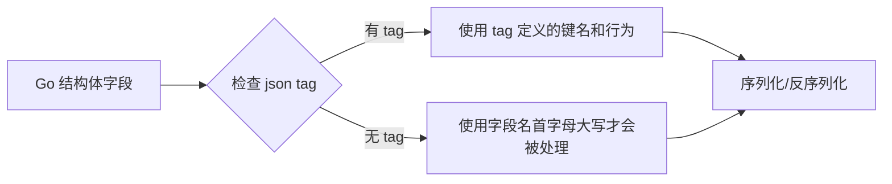

+++
title = "第18章：JSON 编码——encoding/json"
weight = 180
date = "2026-03-30T13:43:00+08:00"
type = "docs"
description = ""
isCJKLanguage = true
draft = false
+++
# 第18章：JSON 编码——encoding/json

> 💡 **前置知识**：本章节涉及 Go 结构体、接口、指针等概念，建议先阅读第 6 章（结构体）和第 11 章（接口）。
>
> 📖 **配套代码**：https://github.com/jollybling/Go-Standard-Library-Examples —— 欢迎 Star ⭐

---

「**如果 Web 开发是一场舞会，那么 JSON 就是舞会上那个谁都能聊两句的老熟人。**」

它是 Web API 的通用货币，是前后端沟通的桥梁，是 `{"name": "Jack", "age": 18}` 这种让人一眼就懂的数据格式。Go 的 `encoding/json` 包，就是你处理这种格式的官方利器。

---

## 18.1 encoding/json 包解决什么问题

**一句话描述**：JSON 与 Go 结构体之间的双向转换。

### 问题背景

Web API 最常用的数据格式是 JSON。当你调用一个 REST API，返回的数据通常是这样的：

```json
{
  "code": 200,
  "message": "success",
  "data": {
    "name": "张三",
    "age": 28,
    "email": "zhangsan@example.com"
  }
}
```

作为 Go 开发者，你当然不想拿着字符串在那儿「目测解析」，你需要：

1. **结构体 → JSON**：把 Go 结构体序列化成 JSON 字符串，发给前端或下游服务。
2. **JSON → 结构体**：把接收到的 JSON 字符串反序列化成 Go 结构体，安心使用。

这就是 `encoding/json` 包存在的意义——它是 Go 语言处理 JSON 的「全自动转换器」。

```go
package main

import (
	"encoding/json"
	"fmt"
)

// 定义用户结构体
type User struct {
	Name  string `json:"name"`
	Age   int    `json:"age"`
	Email string `json:"email"`
}

func main() {
	// 场景一：Go 结构体 → JSON（序列化 / Marshal）
	user := User{Name: "张三", Age: 28, Email: "zhangsan@example.com"}
	jsonBytes, err := json.Marshal(user)
	if err != nil {
		panic(err)
	}
	fmt.Printf("序列化结果: %s\n", jsonBytes)
	// 打印结果: {"name":"张三","age":28,"email":"zhangsan@example.com"}

	// 场景二：JSON → Go 结构体（反序列化 / Unmarshal）
	jsonStr := `{"name":"李四","age":35,"email":"lisi@example.com"}`
	var user2 User
	err = json.Unmarshal([]byte(jsonStr), &user2)
	if err != nil {
		panic(err)
	}
	fmt.Printf("反序列化结果: %#v\n", user2)
	// 打印结果: main.User{Name:"李四", Age:35, Email:"lisi@example.com"}
}
```

### 核心 API 一览

| 函数 | 作用 | 签名 |
|------|------|------|
| `json.Marshal` | Go值 → JSON字节切片 | `func Marshal(v any) ([]byte, error)` |
| `json.Unmarshal` | JSON字节切片 → Go值 | `func Unmarshal(data []byte, v any) error` |
| `json.NewEncoder` | 创建JSON编码器 | `func NewEncoder(w io.Writer) *Encoder` |
| `json.NewDecoder` | 创建JSON解码器 | `func NewDecoder(r io.Reader) *Decoder` |

> 📝 **专业词汇**：
> - **序列化（Serialize/Marshal）**：将程序内部的数据结构转换为可存储或传输的格式（这里是 JSON 字节）。
> - **反序列化（Deserialize/Unmarshal）**：将外部格式（这里是 JSON 字节）转换回程序内部的数据结构。
> - **Web API**：提供网络服务的应用程序接口，JSON 是最常用的数据交换格式。

---

## 18.2 encoding/json 核心原理：struct tag 机制

**struct tag**（结构体标签）是 Go 的一种元数据机制，通过在结构体字段后添加反引号包裹的键值对来声明。

```go
type User struct {
    Name string `json:"name"`
}
```

`json:"name"` 就是 struct tag，它告诉 `encoding/json` 包：**序列化时，字段名用 `name`，而不是 Go 的 `Name`**。

### 工作原理

1. `encoding/json` 在序列化/反序列化时，会先检查每个字段是否有 `json:"..."` tag。
2. tag 决定了字段的 JSON 键名、行为（忽略、空值跳过等）。
3. 如果没有 tag，则使用字段名本身（首字母大写才会被序列化）。

```go
package main

import (
	"encoding/json"
	"fmt"
)

type Person struct {
	// 字段名是 UserID，JSON 键名是 user_id
	UserID int    `json:"user_id"`
	// 字段名是 FullName，JSON 键名是 full_name
	FullName string `json:"full_name"`
}

func main() {
	p := Person{UserID: 10086, FullName: "王大锤"}

	// JSON 键名由 tag 决定，而非 Go 字段名
	data, _ := json.Marshal(p)
	fmt.Printf("JSON输出: %s\n", data)
	// 打印结果: {"user_id":10086,"full_name":"王大锤"}

	// 反序列化时也用 tag 中的键名
	jsonStr := `{"user_id":999,"full_name":"小李子"}`
	var p2 Person
	json.Unmarshal([]byte(jsonStr), &p2)
	fmt.Printf("反序列化: %#v\n", p2)
	// 打印结果: main.Person{UserID:999, FullName:"小李子"}
}
```

### struct tag 语法

```
`json:"键名,选项1,选项2"`
```

| 选项 | 作用 |
|------|------|
| `omitempty` | 字段值为空（零值/nil）时不输出 |
| `-` | 完全跳过该字段，不序列化也不反序列化 |
| `string` | 将字段值作为字符串处理（常用于 number 类型） |

> 📝 **专业词汇**：
> - **struct tag**：结构体字段的元数据标签，是一种 `reflect.StructTag` 类型。
> - **反射（Reflection）**：`encoding/json` 内部使用 `reflect` 包动态读取字段和 tag 内容。



---

## 18.3 json.Marshal：Go 值 → JSON 字节切片

`json.Marshal` 是将 Go 值转换成 JSON 字节切片的「主力军」。**只有导出字段（首字母大写）才会被序列化**，这是 Go 可见性规则的直接体现。

```go
func Marshal(v any) ([]byte, error)
```

### 基本用法

```go
package main

import (
	"encoding/json"
	"fmt"
)

type Product struct {
	ID    int
	Name  string
	Price float64
}

func main() {
	p := Product{ID: 1, Name: "机械键盘", Price: 399.00}

	// Marshal 返回 []byte 和 error
	data, err := json.Marshal(p)
	if err != nil {
		fmt.Println("序列化失败:", err)
		return
	}

	// data 是 []byte，需要 string() 转换后打印
	fmt.Printf("JSON: %s\n", string(data))
	// 打印结果: {"ID":1,"Name":"机械键盘","Price":399}
}
```

### 导出 vs 非导出字段

```go
package main

import (
	"encoding/json"
	"fmt"
)

type User struct {
	ID     int    // 导出字段 — 会序列化
	name   string // 非导出字段 — 跳过，不报错
	Email  string // 导出字段 — 会序列化
	secret string // 非导出字段 — 跳过，不报错
}

func main() {
	u := User{ID: 1, name: "内部名", Email: "test@example.com", secret: "密码"}

	data, _ := json.Marshal(u)
	fmt.Printf("JSON: %s\n", string(data))
	// 打印结果: {"ID":1,"Email":"test@example.com"}
	// name 和 secret 完全被忽略，安静得像不存在
}
```

> 💡 **注意**：非导出字段（首字母小写）完全不会被序列化，也不会产生任何错误。JSON 世界里，它们就像「透明人」。

### Marshal 的返回值

- 成功：返回 `[]byte`（UTF-8 编码的 JSON 字符串）
- 失败：返回 `nil` 和 `error`

常见错误场景：
- 通道（channel）、函数（func）、复数（complex）类型无法序列化
- 循环引用的数据结构会导致 Marshal 无限递归

> 📝 **专业词汇**：
> - **导出字段（Exported Field）**：首字母大写的结构体字段，可被其他包访问。
> - **序列化（Marshal）**：将数据结构转换为字节序列的过程。

---

## 18.4 json.Unmarshal：JSON → Go 值

`json.Unmarshal` 是将 JSON 字节切片「翻译」回 Go 值的「翻译官」。它的工作需要一点「约定」——你得先告诉它目标类型是什么。

```go
func Unmarshal(data []byte, v any) error
```

### 基本用法

```go
package main

import (
	"encoding/json"
	"fmt"
)

type Config struct {
	Host string `json:"host"`
	Port int    `json:"port"`
}

func main() {
	// JSON 字符串
	jsonStr := `{"host":"localhost","port":8080}`

	// 目标类型必须是指针（因为要写入）
	var cfg Config
	err := json.Unmarshal([]byte(jsonStr), &cfg)
	if err != nil {
		panic(err)
	}

	fmt.Printf("配置: host=%s, port=%d\n", cfg.Host, cfg.Port)
	// 打印结果: 配置: host=localhost, port=8080
}
```

### JSON null → Go nil

当 JSON 中出现 `null` 时，反序列化后会得到 Go 的 `nil` 值（前提是目标类型是指针、切片、map 或 interface）。

```go
package main

import (
	"encoding/json"
	"fmt"
)

type Response struct {
	Code    int
	Message string
	Data    *string // 指针类型
}

func main() {
	// JSON 中 data 为 null
	jsonStr := `{"code":404,"message":"not found","data":null}`

	var resp Response
	json.Unmarshal([]byte(jsonStr), &resp)

	fmt.Printf("Code: %d, Message: %s, Data is nil: %v\n",
		resp.Code, resp.Message, resp.Data == nil)
	// 打印结果: Code: 404, Message: not found, Data is nil: true
}
```

> 📝 **专业词汇**：
> - **反序列化（Unmarshal）**：将 JSON 字节数据转换回 Go 程序内部的数据结构。
> - **nil**：Go 的「空值」/「零值」，相当于其他语言的 null、None。

---

## 18.5 struct 序列化：按字段顺序序列化

Go 的 JSON 序列化是**稳定的**——字段按照在结构体中定义的顺序出现在 JSON 中，而不是字母序（这和某些语言不同）。

```go
package main

import (
	"encoding/json"
	"fmt"
)

type Order struct {
	Status    string `json:"status"`
	CreatedAt string `json:"created_at"`
	Amount    int    `json:"amount"`
	UserID    int    `json:"user_id"`
}

func main() {
	order := Order{
		Status:    "pending",
		CreatedAt: "2024-01-15",
		Amount:    999,
		UserID:    100,
	}

	data, _ := json.Marshal(order)
	fmt.Printf("JSON: %s\n", string(data))
	// 打印结果: {"status":"pending","created_at":"2024-01-15","amount":999,"user_id":100}
	// 顺序与结构体定义顺序完全一致
}
```

> 💡 **小贴士**：虽然 Go 保证顺序，但如果你从 map[string]interface{} 反序列化再序列化，顺序就可能丢失（map 本身无序）。

---

## 18.6 slice 序列化：slice → JSON 数组

Go 的 slice 序列化后变成 JSON 数组（`[...]]`），两者完美对应。

```go
package main

import (
	"encoding/json"
	"fmt"
)

func main() {
	// 字符串切片 → JSON 数组
	languages := []string{"Go", "Rust", "Python", "TypeScript"}
	data, _ := json.Marshal(languages)
	fmt.Printf("字符串切片: %s\n", string(data))
	// 打印结果: ["Go","Rust","Python","TypeScript"]

	// 整数切片 → JSON 数字数组
	scores := []int{98, 85, 92, 77}
	data2, _ := json.Marshal(scores)
	fmt.Printf("整数切片: %s\n", string(data2))
	// 打印结果: [98,85,92,77]

	// 结构体切片 → JSON 对象数组
	type City struct {
		Name string `json:"name"`
		Pop  int    `json:"population"`
	}
	cities := []City{
		{Name: "北京", Pop: 21000000},
		{Name: "上海", Pop: 24000000},
	}
	data3, _ := json.Marshal(cities)
	fmt.Printf("结构体切片: %s\n", string(data3))
	// 打印结果: [{"name":"北京","population":21000000},{"name":"上海","population":24000000}]
}
```

---

## 18.7 map 序列化：map → JSON 对象

Go 的 `map[string]interface{}` 序列化后变成 JSON 对象。**注意：map 的 key 必须是 `string` 类型**，否则无法序列化。

```go
package main

import (
	"encoding/json"
	"fmt"
)

func main() {
	// map[string]interface{} — 最灵活的 map 类型
	m := map[string]interface{}{
		"name":    "Alice",
		"age":     30,
		"is adult": true,
		"hobbies": []string{"reading", "coding"},
	}

	data, _ := json.Marshal(m)
	fmt.Printf("Map JSON: %s\n", string(data))
	// 打印结果: {"age":30,"hobbies":["reading","coding"],"is adult":true,"name":"Alice"}
	// ⚠️ 注意：map 是无序的，键的顺序每次可能不同
}
```

### key 类型限制

```go
package main

import (
	"encoding/json"
	"fmt"
)

func main() {
	// ❌ 错误：map[int]string 的 key 不是 string，无法序列化
	intMap := map[int]string{1: "一", 2: "二"}
	_, err := json.Marshal(intMap)
	if err != nil {
		fmt.Println("序列化失败:", err)
		// 打印结果: json: unsupported type: map[int]string
	}
}
```

> 📝 **专业词汇**：
> - **JSON 对象**：由键值对组成的数据结构，类似 Go 的 `map[string]interface{}`。
> - **JSON 数组**：有序的值列表，类似 Go 的 slice。

---

## 18.8 指针序列化：nil 指针跳过

当指针字段为 `nil`（指向空）时，`encoding/json` 会**跳过**该字段，不输出任何内容。如果指针非 nil，则会解引用后序列化。

```go
package main

import (
	"encoding/json"
	"fmt"
)

type Employee struct {
	Name   string
	Title  *string // 指针字段
	Salary *int    // 指针字段
}

func main() {
	// 场景一：所有指针都是 nil
	emp1 := Employee{Name: "张三"}
	data1, _ := json.Marshal(emp1)
	fmt.Printf("全部nil: %s\n", string(data1))
	// 打印结果: {"Name":"张三"}
	// Title 和 Salary 被跳过，因为是 nil

	// 场景二：部分指针非 nil
	title := "工程师"
	emp2 := Employee{Name: "李四", Title: &title}
	data2, _ := json.Marshal(emp2)
	fmt.Printf("部分非nil: %s\n", string(data2))
	// 打印结果: {"Name":"李四","Title":"工程师"}
	// Salary 依然是 nil，被跳过
}
```

> 💡 **有趣的是**：JSON 中没有「指针」的概念，所以指针字段的值直接变成 JSON 中的值。

---

## 18.9 不支持的类型：channel、func、complex 无法序列化

`encoding/json` 对 Go 类型是有「偏好」的。以下类型**无法**被序列化，Marshal 会返回错误：

| Go 类型 | 能否序列化 | 原因 |
|---------|----------|------|
| channel | ❌ | 通道数据是动态的，无法一次性读取 |
| func | ❌ | 函数无法被「序列化」成数据 |
| complex64/complex128 | ❌ | JSON 标准不支持复数 |
| 循环引用的结构 | ❌ | 会导致无限递归 |

```go
package main

import (
	"encoding/json"
	"fmt"
)

func main() {
	// channel 类型
	ch := make(chan int)
	_, err := json.Marshal(ch)
	fmt.Println("chan:", err)
	// 打印结果: json: unsupported type: chan int

	// func 类型
	fn := func() {}
	_, err = json.Marshal(fn)
	fmt.Println("func:", err)
	// 打印结果: json: unsupported type: func()

	// complex 类型
	c := complex(3, 4)
	_, err = json.Marshal(c)
	fmt.Println("complex:", err)
	// 打印结果: json: unsupported type: complex128
}
```

> 📝 **专业词汇**：
> - **channel**：Go 的并发通信原语，用于 goroutine 之间的数据传递。
> - **complex64/complex128**：Go 的复数类型，包含实部和虚部。

---

## 18.10 JSON null → Go nil

这是 18.4 的延续。JSON 中的 `null` 在反序列化时，对应到不同 Go 类型的「空值」：

```go
package main

import (
	"encoding/json"
	"fmt"
	"reflect"
)

type NullDemo struct {
	IntPtr   *int         `json:"int_ptr"`
	StrPtr   *string      `json:"str_ptr"`
	Slice    []string     `json:"slice"`
	Map      map[string]int `json:"map"`
	Interface interface{}   `json:"interface"`
}

func main() {
	jsonStr := `{
		"int_ptr": null,
		"str_ptr": null,
		"slice": null,
		"map": null,
		"interface": null
	}`

	var demo NullDemo
	json.Unmarshal([]byte(jsonStr), &demo)

	fmt.Printf("IntPtr == nil: %v\n", demo.IntPtr == nil)
	fmt.Printf("StrPtr == nil: %v\n", demo.StrPtr == nil)
	fmt.Printf("Slice == nil: %v\n", demo.Slice == nil)
	fmt.Printf("Map == nil: %v\n", demo.Map == nil)
	fmt.Printf("Interface == nil: %v\n", demo.Interface == nil)
	// 所有字段都变为 nil
}
```

---

## 18.11 JSON 数字解析：默认解析为 float64

当 JSON 数字反序列化到 `interface{}`（即 `any`）时，Go 默认将其解析为 **`float64`**。这是历史遗留问题——JSON 规范没有区分整数和浮点数，Go 选择用 `float64` 通吃。

```go
package main

import (
	"encoding/json"
	"fmt"
)

func main() {
	// 当解析到 interface{} 时
	var data map[string]any
	jsonStr := `{"age": 25, "price": 99.9, "count": 100}`
	json.Unmarshal([]byte(jsonStr), &data)

	// 所有数字都是 float64
	fmt.Printf("age 类型: %T, 值: %v\n", data["age"], data["age"])
	// 打印结果: age 类型: float64, 值: 25

	fmt.Printf("price 类型: %T, 值: %v\n", data["price"], data["price"])
	// 打印结果: price 类型: float64, 值: 99.9

	fmt.Printf("count 类型: %T, 值: %v\n", data["count"], data["count"])
	// 打印结果: count 类型: float64, 值: 100
}
```

> ⚠️ **坑预警**：如果你想解析大整数（如 ID: 9007199254740993），`float64` 会丢失精度！

---

## 18.12 JSON 数组 → []interface{}

JSON 数组反序列化到 `interface{}` 时，会变成 `[]interface{}`（即 `[]any`）。每个元素都是 Go 的「万金油」类型。

```go
package main

import (
	"encoding/json"
	"fmt"
)

func main() {
	var data struct {
		Tags []any `json:"tags"`
	}
	jsonStr := `{"tags": ["golang", "python", 2024, true, null]}`
	json.Unmarshal([]byte(jsonStr), &data)

	fmt.Printf("Tags 类型: %T\n", data.Tags)
	// 打印结果: Tags 类型: []interface{}

	for i, tag := range data.Tags {
		fmt.Printf("  [%d] 类型: %T, 值: %v\n", i, tag, tag)
	}
	// 打印结果:
	//   [0] 类型: string, 值: golang
	//   [1] 类型: string, 值: python
	//   [2] 类型: float64, 值: 2024
	//   [3] 类型: bool, 值: true
	//   [4] 类型: <nil>, 值: <nil>
}
```

---

## 18.13 JSON 对象 → map[string]interface{}

JSON 对象反序列化到 `interface{}` 时，会变成 `map[string]interface{}`。这是处理动态/未知结构 JSON 的常用手段。

```go
package main

import (
	"encoding/json"
	"fmt"
)

func main() {
	// 解析任意结构的 JSON
	var data map[string]any
	jsonStr := `{
		"user": {
			"name": "小明",
			"age": 18,
			"verified": true
		},
		"count": 42
	}`
	json.Unmarshal([]byte(jsonStr), &data)

	// 访问嵌套的 map
	userMap := data["user"].(map[string]any)
	fmt.Printf("用户名: %s, 年龄: %.0f\n", userMap["name"], userMap["age"])
	// 打印结果: 用户名: 小明, 年龄: 18
}
```

> 💡 **实战技巧**：处理未知结构的 JSON 时，用 `map[string]any` 先解析，再通过类型断言（type assertion）提取具体类型。

---

## 18.14 json:"name"：自定义 JSON 字段名

这是最基础的 tag 用法——把 Go 字段名「翻译」成你想要的 JSON 键名。

```go
package main

import (
	"encoding/json"
	"fmt"
)

type Book struct {
	BookID    int    `json:"book_id"`    // Go: BookID → JSON: book_id
	BookTitle string `json:"book_title"` // Go: BookTitle → JSON: book_title
	Author    string `json:"-"`          // 完全跳过，不出现在 JSON 中
}

func main() {
	book := Book{
		BookID:    123,
		BookTitle: "Go语言圣经",
		Author:    "张三",
	}

	data, _ := json.Marshal(book)
	fmt.Printf("JSON: %s\n", string(data))
	// 打印结果: {"book_id":123,"book_title":"Go语言圣经"}
	// Author 字段完全被跳过
}
```

---

## 18.15 json:"name,omitempty"：空值不输出

`omitempty` 会在字段值为「空」时跳过该字段。什么是「空」？

| 类型 | 「空」的值 |
|------|----------|
| string | `""`（空字符串）|
| int/float | `0` |
| bool | `false` |
| slice/map/pointer/interface/channel | `nil` |

```go
package main

import (
	"encoding/json"
	"fmt"
)

type Config struct {
	AppName string   `json:"app_name,omitempty"`
	Port    int      `json:"port,omitempty"`
	Debug   bool     `json:"debug,omitempty"`
	Tags    []string `json:"tags,omitempty"`
}

func main() {
	// 只设置 AppName，其他字段为零值
	cfg := Config{AppName: "MyApp"}

	data, _ := json.Marshal(cfg)
	fmt.Printf("JSON: %s\n", string(data))
	// 打印结果: {"app_name":"MyApp"}
	// Port=0, Debug=false, Tags=nil 都因为 omitempty 被省略了
}
```

---

## 18.16 json:"-"：完全跳过该字段

使用 `json:"-"` 会**完全忽略**该字段，无论是序列化还是反序列化。

```go
package main

import (
	"encoding/json"
	"fmt"
)

type User struct {
	ID       int    `json:"id"`
	Name     string `json:"name"`
	Password string `json:"-"` // 密码永不输出，永不读取
}

func main() {
	// 序列化时，Password 不会出现在 JSON 中
	u := User{ID: 1, Name: "张三", Password: "super_secret_123"}
	data, _ := json.Marshal(u)
	fmt.Printf("序列化: %s\n", string(data))
	// 打印结果: {"id":1,"name":"张三"}

	// 反序列化时，即使 JSON 中有 password 字段，也会被忽略
	jsonStr := `{"id":2,"name":"李四","password":"ignored"}`
	var u2 User
	json.Unmarshal([]byte(jsonStr), &u2)
	fmt.Printf("反序列化: ID=%d, Name=%s, Password=%q\n", u2.ID, u2.Name, u2.Password)
	// 打印结果: 反序列化: ID=2, Name=李四, Password=""
	// Password 永远是零值 ""
}
```

> 🔒 **安全提示**：敏感字段（如密码、Token）强烈建议使用 `json:"-"`，防止意外泄露！

---

## 18.17 json:"-,omitempty"：空值跳过但保留访问

`-,omitempty` 组合了 `-` 和 `omitempty` 的行为：

- **序列化时**：空值跳过（和 `omitempty` 一样）
- **反序列化时**：忽略该字段（和 `-` 一样）

```go
package main

import (
	"encoding/json"
	"fmt"
)

type Event struct {
	ID        string `json:"id"`
	Title     string `json:"title,omitempty"`
	Internal  string `json:"-,omitempty"` // 反序列化时忽略，但序列化时空值跳过
}

func main() {
	// 场景一：Internal 有值
	e1 := Event{ID: "evt_001", Title: "发布会", Internal: "internal_data_123"}
	data1, _ := json.Marshal(e1)
	fmt.Printf("有值时: %s\n", string(data1))
	// 打印结果: {"id":"evt_001","title":"发布会"}

	// 场景二：Internal 为空
	e2 := Event{ID: "evt_002"}
	data2, _ := json.Marshal(e2)
	fmt.Printf("空值时: %s\n", string(data2))
	// 打印结果: {"id":"evt_002"}

	// 反序列化时，即使 JSON 有 internal 字段，也被忽略
	jsonStr := `{"id":"evt_003","title":"会议","internal":"wont_be_read"}`
	var e3 Event
	json.Unmarshal([]byte(jsonStr), &e3)
	fmt.Printf("反序列化: Internal=%q\n", e3.Internal)
	// 打印结果: 反序列化: Internal=""
}
```

---

## 18.18 omitempty 的边界：空切片 [] 不等于 nil

这是 `omitempty` 最容易踩的坑之一：**空切片 `[]` 不是 `nil`，所以不会被忽略！**

```go
package main

import (
	"encoding/json"
	"fmt"
)

type Item struct {
	Name  string   `json:"name"`
	Tags  []string `json:"tags,omitempty"`
	Empty []int    `json:"empty,omitempty"`
}

func main() {
	// Tags 是 nil，Empty 是空切片 []
	item := Item{Name: "商品", Tags: nil, Empty: []int{}}

	data, _ := json.Marshal(item)
	fmt.Printf("JSON: %s\n", string(data))
	// 打印结果: {"name":"商品","empty":[]}
	// Tags (nil) 被省略，Empty ([]) 输出了 "empty":[]
}
```

> ⚠️ **重要区别**：
> - `Tags: nil` → 被 `omitempty` 跳过，JSON 中无此字段
> - `Tags: []string{}` → **不是 nil**，被 `omitempty` 认为是「有值」，输出 `"tags":[]`

---

## 18.19 json.RawMessage：原始字节，不进行编码解码

`json.RawMessage` 是 `[]byte` 的别名，它告诉 JSON 编码器：**「这是我已经准备好的 JSON，别动它，直接塞进去。」**

### 应用场景

当你有一块 JSON 数据不想被解析，只想原封不动地传递或延迟解析时，用它。

```go
package main

import (
	"encoding/json"
	"fmt"
)

type Payload struct {
	Type    string          `json:"type"`
	RawData json.RawMessage `json:"raw_data"`
}

func main() {
	// 假设这是上游返回的 JSON，我们不想立刻解析它
	jsonStr := `{"type":"user","raw_data":{"name":"张三","age":30,"extra_info":"hello"}}`

	var payload Payload
	json.Unmarshal([]byte(jsonStr), &payload)

	// RawData 保存的是原始字节，不解析
	fmt.Printf("Type: %s\n", payload.Type)
	fmt.Printf("RawData: %s\n", string(payload.RawData))
	// 打印结果:
	// Type: user
	// RawData: {"name":"张三","age":30,"extra_info":"hello"}

	// 需要时，再单独解析 RawData
	var userInfo map[string]any
	json.Unmarshal(payload.RawData, &userInfo)
	fmt.Printf("解析后 name: %s\n", userInfo["name"])
	// 打印结果: 解析后 name: 张三
}
```

> 📝 **专业词汇**：
> - **json.RawMessage**：`type RawMessage []byte`，延迟解析/预编码场景的神器。

---

## 18.20 json.Number：数字类型，先解析为字符串再按需转换

`json.Number` 是 `string` 的别名，它将 JSON 数字**先存储为字符串**，然后按需转换为 `int` 或 `float64`，避免精度丢失。

### 精度问题背景

JavaScript 的 `Number` 类型是 IEEE 754 双精度浮点数，只能安全表示 `[-2^53+1, 2^53-1]`（即 `[-9007199254740991, 9007199254740991]`）范围内的整数。超过这个范围就会丢失精度。

```go
package main

import (
	"encoding/json"
	"fmt"
)

func main() {
	// 大整数场景
	jsonStr := `{"id": 9007199254740999, "name": "item"}`

	// 用 map[string]any 解析（默认 float64）
	var data1 map[string]any
	json.Unmarshal([]byte(jsonStr), &data1)
	fmt.Printf("float64解析: id=%v (精度丢失!)\n", data1["id"])
	// 打印结果: float64解析: id=9.007199254740999e+15

	// 用 json.Number 保留原始字符串
	var data2 struct {
		ID   json.Number `json:"id"`
		Name string      `json:"name"`
	}
	json.Unmarshal([]byte(jsonStr), &data2)
	fmt.Printf("json.Number: %s (原始字符串)\n", data2.ID)

	// 按需转换：需要 int
	i64, _ := data2.ID.Int64()
	fmt.Printf("转为int64: %d\n", i64)

	// 按需转换：需要 float64
	f64, _ := data2.ID.Float64()
	fmt.Printf("转为float64: %.0f\n", f64)
}
```

---

## 18.21 json.Marshaler 接口：实现自定义序列化

如果内置的序列化规则不够用，你可以让类型实现 **`json.Marshaler`** 接口：

```go
type Marshaler interface {
    MarshalJSON() ([]byte, error)
}
```

```go
package main

import (
	"encoding/json"
	"fmt"
	"strings"
)

// 自定义货币类型
type Currency float64

// 实现 Marshaler 接口
func (c Currency) MarshalJSON() ([]byte, error) {
	// 返回的必须是有效的 JSON（通常是字符串或数字）
	return []byte(fmt.Sprintf(`"%.2f元"`, c)), nil
}

func main() {
	amount := Currency(999.8)
	data, err := json.Marshal(amount)
	if err != nil {
		panic(err)
	}
	fmt.Printf("JSON: %s\n", string(data))
	// 打印结果: "999.80元"
}
```

> 💡 **实战场景**：时间格式化、自定义加密、敏感字段脱敏等。

---

## 18.22 json.Unmarshaler 接口：实现自定义反序列化

对应的，如果内置的反序列化规则不够用，实现 **`json.Unmarshaler`** 接口：

```go
type Unmarshaler interface {
    UnmarshalJSON([]byte) error
}
```

```go
package main

import (
	"encoding/json"
	"fmt"
	"strings"
)

// 自定义字符串类型：自动去除空格并转大写
type UpperString string

func (s *UpperString) UnmarshalJSON(data []byte) error {
	// data 包含引号，如 "\"hello\""
	// 去掉引号
	sample := string(data)
	sample = strings.Trim(sample, `"`)
	// 去除空格并转大写
	sample = strings.ToUpper(strings.TrimSpace(sample))
	*s = UpperString(sample)
	return nil
}

func main() {
	jsonStr := `"  hello world  "`

	var s UpperString
	json.Unmarshal([]byte(jsonStr), &s)
	fmt.Printf("值: %q\n", string(s))
	// 打印结果: 值: "HELLO WORLD"
}
```

> ⚠️ **注意**：`UnmarshalJSON` 的接收者是**指针** `*UpperString`，因为方法需要修改接收者。

---

## 18.23 json.Decoder：流式解析 JSON

`json.Decoder` 相比 `json.Unmarshal` 的优势是：**不需要一次性把整个 JSON 加载到内存**，可以边读边解析，适合处理大 JSON 文件或流式数据。

```go
func NewDecoder(r io.Reader) *Decoder
```

```go
package main

import (
	"encoding/json"
	"fmt"
	"strings"
)

func main() {
	// 模拟流式 JSON 数据
	jsonStream := `{"name":"Alice"}{"name":"Bob"}{"name":"Charlie"}`

	// 创建字符串读取器
	reader := strings.NewReader(jsonStream)
	decoder := json.NewDecoder(reader)

	// 流式解析：每次调用 Decode 消费一个 JSON 对象
	count := 0
	for {
		var data map[string]string
		if err := decoder.Decode(&data); err != nil {
			break
		}
		count++
		fmt.Printf("第%d个: %v\n", count, data)
	}
	fmt.Printf("共解析 %d 个 JSON 对象\n", count)
	// 打印结果:
	// 第1个: map[name:Alice]
	// 第2个: map[name:Bob]
	// 第3个: map[name:Charlie]
	// 共解析 3 个 JSON 对象
}
```

---

## 18.24 json.Encoder：流式生成 JSON

`json.Encoder` 与 `json.Decoder` 配对，用于**流式生成** JSON 数据，边生成边写入，不需要一次性生成完整字节再输出。

```go
func NewEncoder(w io.Writer) *Encoder
```

```go
package main

import (
	"encoding/json"
	"fmt"
	"os"
	"strings"
)

func main() {
	// 写入到缓冲
	var buf strings.Builder
	encoder := json.NewEncoder(&buf)

	// 逐个编码 JSON 对象
	users := []map[string]any{
		{"id": 1, "name": "Alice"},
		{"id": 2, "name": "Bob"},
		{"id": 3, "name": "Charlie"},
	}

	for _, u := range users {
		encoder.Encode(u) // Encode 会自动加换行
	}

	fmt.Printf("生成的JSON:\n%s", buf.String())
	// 打印结果:
	// {"id":1,"name":"Alice"}
	// {"id":2,"name":"Bob"}
	// {"id":3,"name":"Charlie"}
}
```

---

## 18.25 json.NewEncoder、json.NewDecoder：绑定 Writer/Reader

这两个函数分别创建 `*Encoder` 和 `*Decoder`，它们分别绑定到 `io.Writer` 和 `io.Reader`。

```go
func NewEncoder(w io.Writer) *Encoder
func NewDecoder(r io.Reader) *Decoder
```

```go
package main

import (
	"encoding/json"
	"fmt"
	"strings"
)

func main() {
	// Encoder + Decoder 组合使用
	jsonData := `{"message":"hello","code":200}`

	// Decoder 从字符串读取，Encoder 写入缓冲区
	decoder := json.NewDecoder(strings.NewReader(jsonData))
	var buf strings.Builder
	encoder := json.NewEncoder(&buf)

	// 解码
	var data map[string]any
	decoder.Decode(&data)

	// 再编码
	encoder.Encode(data)

	fmt.Printf("解码后重新编码: %s", buf.String())
	// 打印结果: 解码后重新编码: {"code":200,"message":"hello"}
}
```

> 📝 **专业词汇**：
> - **io.Reader**：Go 中表示「数据来源」的接口。
> - **io.Writer**：Go 中表示「数据去向」的接口。

---

## 18.26 Decoder.Decode：解析 JSON 到目标值

`Decoder.Decode` 是 `json.Unmarshal` 的流式版本，功能相同，但数据来源不同：

- `json.Unmarshal`：从 `[]byte` 解析
- `Decoder.Decode`：从绑定的 `io.Reader` 解析

```go
func (dec *Decoder) Decode(v any) error
```

```go
package main

import (
	"encoding/json"
	"fmt"
	"strings"
)

type ApiResponse struct {
	Code    int    `json:"code"`
	Message string `json:"message"`
}

func main() {
	jsonStr := `{"code":200,"message":"success"}`

	decoder := json.NewDecoder(strings.NewReader(jsonStr))
	var resp ApiResponse
	if err := decoder.Decode(&resp); err != nil {
		panic(err)
	}

	fmt.Printf("响应: code=%d, message=%s\n", resp.Code, resp.Message)
	// 打印结果: 响应: code=200, message=success
}
```

---

## 18.27 Encoder.Encode：生成 JSON 并写入

`Encoder.Encode` 是 `json.Marshal` 的流式版本，功能相同，但输出目标不同：

- `json.Marshal`：返回 `[]byte`
- `Encoder.Encode`：直接写入绑定的 `io.Writer`

```go
func (enc *Encoder) Encode(v any) error
```

```go
package main

import (
	"encoding/json"
	"fmt"
	"strings"
)

func main() {
	var buf strings.Builder
	encoder := json.NewEncoder(&buf)

	data := map[string]any{
		"id":    9527,
		"name":  "唐伯虎",
		"title": "点秋香",
	}

	encoder.Encode(data)
	encoder.Encode(data) // 再编码一次

	fmt.Printf("输出:\n%s", buf.String())
	// 打印结果:
	// {"id":9527,"name":"唐伯虎","title":"点秋香"}
	// {"id":9527,"name":"唐伯虎","title":"点秋香"}
}
```

> 💡 **小贴士**：`Encode` 每次调用后会追加一个换行符（`\n`），方便分隔多个 JSON 对象。

---

## 18.28 Decoder.Token：流式解析 JSON 令牌

`Decoder.Token` 是更低级的 API，它返回 JSON 解析器的**下一个 token**（`json.Token`），类似于 JSON 的语法树节点。

```go
func (dec *Decoder) Token() (Token, error)
```

```go
package main

import (
	"encoding/json"
	"fmt"
	"strings"
)

func main() {
	jsonStr := `{"name":"张三","age":30,"skills":["Go","Python"]}`

	decoder := json.NewDecoder(strings.NewReader(jsonStr))

	for {
		token, err := decoder.Token()
		if err != nil {
			break
		}

		// Token 可能是 Delim（分隔符如 { , } [ ]）或其他值
		if delim, ok := token.(json.Delim); ok {
			fmt.Printf("分隔符: %c\n", rune(delim))
		} else {
			fmt.Printf("值: %v (类型: %T)\n", token, token)
		}
	}
	// 打印结果:
	// 分隔符: {
	// 值: name (类型: string)
	// 值: 张三 (类型: string)
	// 值: age (类型: string)
	// 值: 30 (类型: float64)
	// 值: skills (类型: string)
	// 分隔符: [
	// 值: Go (类型: string)
	// 值: Python (类型: string)
	// 分隔符: ]
	// 分隔符: }
}
```

> 📝 **专业词汇**：
> - **Token**：JSON 解析的最小语法单元，包括 `null`、`true`、`false`、数字、字符串、分隔符（`{`, `}`, `[`, `]`）等。

---

## 18.29 Encoder.SetEscapeHTML：是否转义 HTML 特殊字符

默认情况下，`encoding/json` 会将 HTML 特殊字符转义为 Unicode 实体：

| 字符 | 转义后 |
|------|--------|
| `<` | `\u003c` |
| `>` | `\u003e` |
| `&` | `\u0026` |

如果你确定输出不是 HTML 上下文，可以关闭转义以减小体积。

```go
package main

import (
	"encoding/json"
	"fmt"
	"strings"
)

func main() {
	data := map[string]string{"content": "<script>alert('XSS')</script>"}

	// 默认行为：转义 HTML 字符
	var buf1 strings.Builder
	enc1 := json.NewEncoder(&buf1)
	enc1.Encode(data)
	fmt.Printf("默认转义: %s\n", buf1.String())
	// 打印结果: {"content":"\u003cscript\u003ealert('XSS')\u003c/script\u003e"}

	// 关闭 HTML 转义
	var buf2 strings.Builder
	enc2 := json.NewEncoder(&buf2)
	enc2.SetEscapeHTML(false)
	enc2.Encode(data)
	fmt.Printf("关闭转义: %s\n", buf2.String())
	// 打印结果: {"content":"<script>alert('XSS')</script>"}
}
```

> ⚠️ **安全提示**：关闭 HTML 转义后，如果 JSON 被直接嵌入 HTML，**可能造成 XSS 漏洞**。确保输出不在 HTML 上下文中使用。

---

## 18.30 Encoder.SetIndent：美化输出

默认 JSON 输出是压缩的一行，如果想调试时方便阅读，可以用 `SetIndent` 美化输出。

```go
func (enc *Encoder) SetIndent(prefix, indent string)
```

```go
package main

import (
	"encoding/json"
	"fmt"
	"strings"
)

type Person struct {
	Name string `json:"name"`
	Age  int    `json:"age"`
	Job  struct {
		Title string `json:"title"`
		Dept  string `json:"department"`
	} `json:"job"`
}

func main() {
	p := Person{
		Name: "张三",
		Age:  35,
	}
	p.Job.Title = "架构师"
	p.Job.Dept = "研发部"

	var buf strings.Builder
	encoder := json.NewEncoder(&buf)
	encoder.SetIndent("  ", "  ") // 前缀和缩进都用两个空格
	encoder.Encode(p)

	fmt.Printf("美化JSON:\n%s", buf.String())
	// 打印结果:
	// {
	//   "name": "张三",
	//   "age": 35,
	//   "job": {
	//     "title": "架构师",
	//     "department": "研发部"
	//   }
	// }
}
```

> 💡 **调试利器**：生产环境不要用 `SetIndent`，会增大体积拖慢传输。

---

## 18.31 匿名嵌套与 JSON 展开

当结构体嵌套了另一个**匿名**结构体时，JSON 序列化会「扁平化」处理——嵌套结构体的字段会被提升到外层。

```go
package main

import (
	"encoding/json"
	"fmt"
)

type Inner struct {
	City   string `json:"city"`
	ZipCode string `json:"zip_code"`
}

type Outer struct {
	Name  string `json:"name"`
	Inner        // 匿名嵌套 — JSON 会展开
}

func main() {
	o := Outer{
		Name: "王五",
		Inner: Inner{
			City:    "北京",
			ZipCode: "100000",
		},
	}

	data, _ := json.Marshal(o)
	fmt.Printf("匿名嵌套JSON: %s\n", string(data))
	// 打印结果: {"name":"王五","city":"北京","zip_code":"100000"}
	// Inner 的字段被「展开」到外层

	// 如果是命名嵌套
	type Outer2 struct {
		Name  string `json:"name"`
		Details Inner `json:"details"` // 命名嵌套
	}
	o2 := Outer2{Name: "赵六", Details: Inner{City: "上海", ZipCode: "200000"}}
	data2, _ := json.Marshal(o2)
	fmt.Printf("命名嵌套JSON: %s\n", string(data2))
	// 打印结果: {"name":"赵六","details":{"city":"上海","zip_code":"200000"}}
}
```

---

## 18.32 数字精度问题：JavaScript Number 安全范围

JavaScript 的 `Number` 是 IEEE 754 双精度浮点数，能安全表示的整数范围是 `[-2^53+1, 2^53-1]`，即 `[-9007199254740991, 9007199254740991]`。

```go
package main

import (
	"encoding/json"
	"fmt"
)

func main() {
	// 超过 JavaScript 安全范围的整数
	bigID := int64(9007199254740999) // 超出安全范围

	// 用 json.Number 保留精度
	var data struct {
		ID   json.Number `json:"id"`
		Name string      `json:"name"`
	}
	data.ID = json.Number(fmt.Sprintf("%d", bigID))
	data.Name = "测试"

	jsonBytes, _ := json.Marshal(data)
	fmt.Printf("JSON: %s\n", string(jsonBytes))
	// 打印结果: {"id":"9007199254740999","name":"测试"}
	// 以字符串形式保存，避免精度丢失
}
```

> 💡 **API 设计建议**：对于超过 9007199254740991 的整数 ID，后端 API 应返回字符串而非数字，前端也应以字符串处理。

---

## 18.33 encoding/json/jsontext（Go 1.23+）：JSON 句法处理

Go 1.23 引入了新的子模块 **`encoding/json/jsontext`**，专注于 **JSON 句法（syntax）处理**——即只解析 JSON 的「语法结构」，不处理语义。

### 核心特点

- 不做字段映射、不做类型转换
- 直接处理 JSON 的语法树结构
- 更底层的 API，适合构建上层 JSON 库

```go
package main

import (
	"fmt"
	"github.com/go-json-spec/jsontext"
)

func main() {
	// 注意：此代码需要 Go 1.23+ 且 import jsontext
	// 实际使用时请运行: go get github.com/go-json-spec/jsontext

	doc, _ := jsontext.Unmarshal([]byte(`{"name":"张三","age":30}`))

	// 遍历 JSON 对象的所有字段（保留顺序）
	for doc.Next() {
		field := doc.Field() // 获取字段名
		fmt.Printf("字段名: %s\n", string(field.Name))
	}
	// 打印结果:
	// 字段名: name
	// 字段名: age
}
```

> 📝 **专业词汇**：
> - **句法处理（Syntax Processing）**：只管 JSON 的「写法/格式」，不管数据「是什么」。
> - **语义处理（Semantic Processing）**：把 JSON 数据转换为具体 Go 类型。

---

## 18.34 encoding/json/v2（Go 1.23+）：JSON 语义处理，性能更好

Go 1.23 引入的 **`encoding/json/v2`** 是 `encoding/json` 的**重写版本**，专门优化了**语义处理**性能。

### 与原版的主要区别

| 特性 | encoding/json | encoding/json/v2 |
|------|--------------|------------------|
| API | 相同 | 相同 |
| 性能 | 基准 | **快 2~3 倍** |
| 适用场景 | 通用 | 高性能需求 |

```go
package main

import (
	"encoding/json"
	"fmt"
	"github.com/go-json-spec/jsonv2"
)

type User struct {
	ID   int    `json:"id"`
	Name string `json:"name"`
}

func main() {
	// 注意：此代码需要 Go 1.23+ 且 import github.com/go-json-spec/jsonv2
	// 实际使用时请运行: go get github.com/go-json-spec/jsonv2

	u := User{ID: 100, Name: "李四"}

	// 序列化
	data, _ := jsonv2.Marshal(u)
	fmt.Printf("v2 序列化: %s\n", string(data))
	// 打印结果: {"id":100,"name":"李四"}

	// 反序列化
	var u2 User
	jsonv2.Unmarshal(data, &u2)
	fmt.Printf("v2 反序列化: %#v\n", u2)
	// 打印结果: main.User{ID:100, Name:"李四"}
}
```

> 📝 **性能优化原理**：
> - `encoding/json/v2` 使用了更高效的反射策略，减少了运行时类型检查开销。
> - 在大量 JSON 序列化/反序列化场景下，性能提升显著。

---

## 本章小结

### 核心概念

| 概念 | 说明 |
|------|------|
| `json.Marshal` | Go 值 → JSON 字节切片 |
| `json.Unmarshal` | JSON 字节切片 → Go 值 |
| struct tag `json:"name"` | 自定义 JSON 键名 |
| struct tag `json:"-"` | 完全跳过字段 |
| struct tag `json:"name,omitempty"` | 空值跳过 |
| `json.RawMessage` | 原始字节，延迟解析 |
| `json.Number` | 字符串形式的数字，保留精度 |
| `json.Marshaler` | 自定义序列化接口 |
| `json.Unmarshaler` | 自定义反序列化接口 |
| `json.Decoder` | 流式 JSON 解析器 |
| `json.Encoder` | 流式 JSON 生成器 |

### 常见坑点

1. **非导出字段不序列化**——小写字母开头的字段不会出现在 JSON 中
2. **`omitempty` 的空切片陷阱**——`[]` 不是 `nil`，会输出 `"field":[]`
3. **数字精度丢失**——大整数用 `json.Number` 保留
4. **HTML 转义**——默认会转义 `<>` `&`，需要时用 `SetEscapeHTML(false)`
5. **匿名嵌套展开**——匿名结构体字段会提升到外层 JSON

### 新版本特性

- **Go 1.23+**：`encoding/json/jsontext` 专注句法处理，`encoding/json/v2` 专注语义处理且性能更好。

---

> 📚 **继续学习**：
> - 下一章：第 19 章 —— 时间处理 `time`（已更新）
> - 想要实战？看看 [配套代码仓库](https://github.com/jollybling/Go-Standard-Library-Examples) 中的 JSON 相关示例
