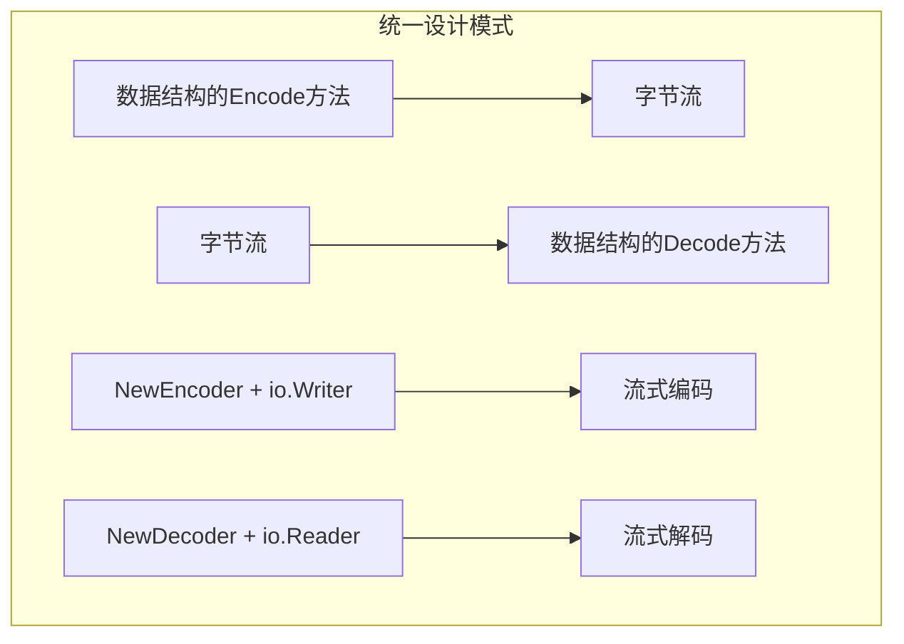
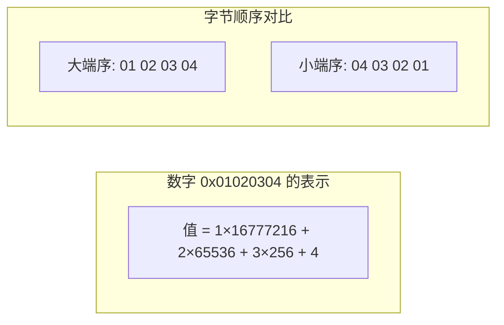
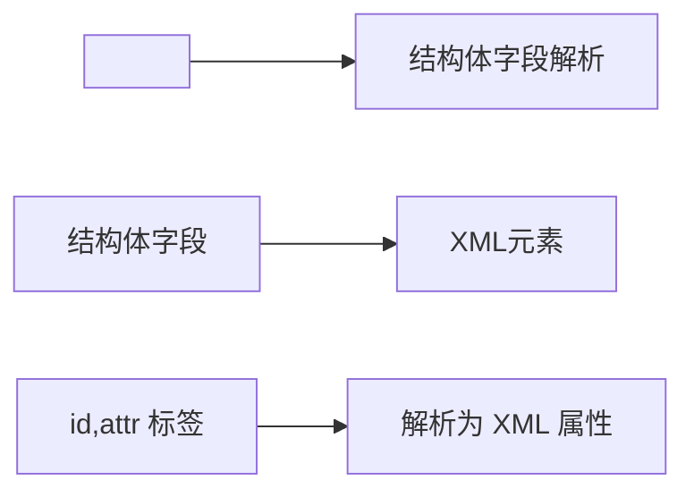
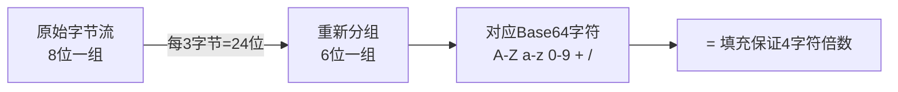
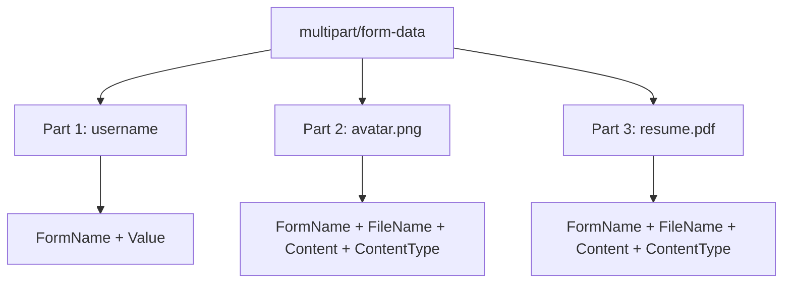

+++
title = "第 19 章：其他数据格式——encoding 包全系列"
weight = 190
date = "2026-03-30T13:43:00+08:00"
type = "docs"
description = ""
isCJKLanguage = true
draft = false
+++
# 第 19 章：其他数据格式——encoding 包全系列

> 💡 本章导读
>
> 数据在内存中花样百出，传输时却只能变成一串字节流。encoding 包就是那个"变形金刚工厂"，把各种数据结构变成字节，或者把字节变回各种数据结构。本章将带你玩转 Go 标准库中所有的序列化与反序列化工具。

---

## 19.1 encoding 包解决什么问题

你有没有想过，当你把一个 `struct` 塞进网络请求里，或者写入文件时，这些数据是怎么"变身"成字节的？

**数据在内存中**以 Go 的运行时结构存储——有指针、有引用、有复杂的嵌套关系。

**数据在传输时**（网络、文件、数据库）只能是一串连续的字节序列。

这中间需要一个"翻译官"——就是 encoding 包家族。

```go
// 内存中的数据结构 vs 传输时的字节流
package main

import (
	"encoding/json"
	"fmt"
)

type Person struct {
	Name string
	Age  int
}

func main() {
	// 内存中的结构体，有血有肉有灵魂
	p := Person{Name: "阿宝", Age: 18}

	// 序列化：变成字节流（JSON格式）
	bytes, _ := json.Marshal(p)
	fmt.Printf("序列化后: %s\n", string(bytes))
	// 输出: 序列化后: {"Name":"阿宝","Age":18}

	// 反序列化：从字节流变回结构体
	var p2 Person
	json.Unmarshal(bytes, &p2)
	fmt.Printf("反序列化后: %+v\n", p2)
	// 输出: 反序列化后: {Name:阿宝 Age:18}
}
```

> **专业词汇解释**
>
> - **序列化（Serialization）**：将数据结构转换为字节流的过程，也叫编码（Encode）或封送（Marshal）
> - **反序列化（Deserialization）**：将字节流转换回数据结构的过程，也叫解码（Decode）或解封送（Unmarshal）
> - **字节流（Byte Stream）**：连续的字节序列，可用于网络传输或文件存储

```mermaid
graph LR
    A[内存中的数据结构<br/>struct Person] -->|序列化| B[字节流<br/>{"Name":"阿宝"...}]
    B -->|反序列化| C[内存中的数据结构<br/>struct Person]
```

---

## 19.2 encoding 核心原理：每种格式都有 Encoder/Decoder

Go 的 encoding 包遵循一个统一的设计哲学：**每种格式都提供 Encoder 和 Decoder**。

- `Encode`/`Decode` 或 `Marshal`/`Unmarshal` 用于整个数据
- `NewEncoder`/`NewDecoder` 返回流式编解码器，适合大数据或渐进式处理

```go
// 核心接口设计哲学
package main

import (
	"encoding/json"
	"fmt"
	"io"
	"strings"
)

func main() {
	// 方式1：直接编解码（适合小数据）
	data := map[string]int{"a": 1, "b": 2}
	bytes, _ := json.Marshal(data)
	fmt.Printf("直接编码: %s\n", string(bytes))

	var result map[string]int
	json.Unmarshal(bytes, &result)
	fmt.Printf("直接解码: %v\n", result)

	// 方式2：流式编解码（适合大数据或 io 操作）
	reader := strings.NewReader(`{"x":100,"y":200}`)
	dec := json.NewDecoder(reader)
	var pos struct{ X, Y int }
	dec.Decode(&pos)
	fmt.Printf("流式解码: %+v\n", pos)
	// 输出: 流式解码: {X:100 Y:200}

	// 流式编码到 io.Writer
	var buf strings.Builder
	enc := json.NewEncoder(&buf)
	enc.Encode(map[string]string{"key": "value"})
	fmt.Printf("流式编码结果: %s", buf.String())
}
```

> **专业词汇解释**
>
> - **Encoder（编码器）**：将数据结构转换为特定格式的字节输出
> - **Decoder（解码器）**：将特定格式的字节解析为数据结构
> - **io.Reader/io.Writer**：Go 的流式 I/O 接口，适合处理大数据或渐进式数据



---

## 19.3 encoding/binary：二进制序列化，高效紧凑

相比于人类可读的 JSON，二进制格式的体积小得让人窒息，速度快得让人上瘾。

`encoding/binary` 提供了最底层的二进制打包能力——直接按字节顺序写入各种数据类型。

```go
package main

import (
	"bytes"
	"encoding/binary"
	"fmt"
)

func main() {
	buf := new(bytes.Buffer)

	// 写入各种类型，注意没有字段名，只有原始字节
	var intVal int32 = 0x12345678
	var floatVal float64 = 3.14159
	var str = "Hi"

	// 小端序写入
	binary.Write(buf, binary.LittleEndian, intVal)
	binary.Write(buf, binary.LittleEndian, floatVal)

	// 先写入字符串长度，再写入字符串内容
	binary.Write(buf, binary.LittleEndian, uint8(len(str)))
	buf.WriteString(str)

	fmt.Printf("写入的字节数: %d\n", buf.Len())
	fmt.Printf("十六进制内容: %x\n", buf.Bytes())

	// 反向读取
	buf.Reset()
	buf.Write(buf.Bytes()) // 重新填充以便演示

	// 重新读取
	var intRead int32
	var floatRead float64
	var strLen uint8
	var strRead [10]byte

	rd := bytes.NewReader(buf.Bytes())
	binary.Read(rd, binary.LittleEndian, &intRead)
	binary.Read(rd, binary.LittleEndian, &floatRead)
	binary.Read(rd, binary.LittleEndian, &strLen)
	rd.Read(strRead[:strLen])

	fmt.Printf("读取的整数: %d\n", intRead)
	fmt.Printf("读取的浮点: %f\n", floatRead)
	fmt.Printf("读取的字符串: %s\n", strRead[:strLen])
}
```

> **专业词汇解释**
>
> - **二进制序列化（Binary Serialization）**：将数据直接转换为原始字节表示，没有字段名等元数据
> - **紧凑格式（Compact Format）**：没有人类可读的文本，体积最小化
> - **字节序（Byte Order）**：多字节数值的字节排列顺序

---

## 19.4 binary.BigEndian、binary.LittleEndian：字节序

字节序是个有趣的话题——不同架构的 CPU 对多字节整数的"看法"不同。

**大端序（Big Endian）**：高位字节在前，像我们读数字的习惯（最左边的数字最重要）。网络协议钟爱大端序。

**小端序（Little Endian）**：低位字节在前，Intel/AMD 的 x86 架构用这个。

```go
package main

import (
	"bytes"
	"encoding/binary"
	"fmt"
)

func main() {
	value := uint32(0x01020304)

	// 大端序：01 02 03 04（高位在前）
	buf := new(bytes.Buffer)
	binary.Write(buf, binary.BigEndian, value)
	fmt.Printf("大端序: %x\n", buf.Bytes())
	// 输出: 大端序: 01020304

	// 小端序：04 03 02 01（低位在前）
	buf.Reset()
	binary.Write(buf, binary.LittleEndian, value)
	fmt.Printf("小端序: %x\n", buf.Bytes())
	// 输出: 小端序: 04030201

	// 网络字节序统一用大端序
	fmt.Printf("网络字节序就是大端序: %v\n", binary.BigEndian)
	// 输出: 网络字节序就是大端序: bigEndian
}
```



> **专业词汇解释**
>
> - **大端序（Big Endian）**：Most Significant Byte 在前，网络协议标准
> - **小端序（Little Endian）**：Least Significant Byte 在前，x86 架构使用
> - **主机字节序（Host Byte Order）**：本地 CPU 使用的字节序，可能因架构而异
> - **网络字节序（Network Byte Order）**：RFC 1700 定义为大端序

---

## 19.5 binary.PutUvarint、binary.Uvarint：变长整数编码

有时候数字很小，有时候很大。变长整数编码（Varint）让小数字用少字节，大数字用多字节。

Google 的 Protocol Buffers 就用了这套编码。

```go
package main

import (
	"bytes"
	"encoding/binary"
	"fmt"
)

func main() {
	buf := make([]byte, 10)

	// 编码变长整数
	n1 := binary.PutUvarint(buf, 300)   // 300 需要 2 字节
	n2 := binary.PutUvarint(buf[n1:], 1) // 1 只需要 1 字节
	n3 := binary.PutUvarint(buf[n1+n2:], 1000) // 1000 需要 2 字节

	fmt.Printf("编码后总字节数: %d\n", n1+n2+n3)
	fmt.Printf("实际内容: %x\n", buf[:n1+n2+n3])

	// 解码
	rd := bytes.NewReader(buf[:n1+n2+n3])
	val1, _ := binary.ReadUvarint(rd)
	val2, _ := binary.ReadUvarint(rd)
	val3, _ := binary.ReadUvarint(rd)

	fmt.Printf("解码结果: %d, %d, %d\n", val1, val2, val3)
	// 输出: 解码结果: 300, 1, 1000

	// 对比固定长度编码
	fmt.Printf("\n对比：300 的固定编码 vs 变长编码\n")
	fmt.Printf("固定 uint32: %d 字节\n", 4)
	fmt.Printf("变长 varint: %d 字节\n", n1)
}
```

> **专业词汇解释**
>
> - **Varint（Variable-length Integer）**：使用 1-10 个字节表示整数，小值短、大值长
> - **LEB128（Little Endian Base 128）**：变长整数编码的一种，WebAssembly 和 ARM 用
> - **ZigZag 编码**：将有符号整数映射到无符号变长整数，用于处理负数更高效

---

## 19.6 binary.Write：自动序列化

`binary.Write` 是二进制序列化的瑞士军刀——它会自动把各种 Go 类型写入字节缓冲区。

```go
package main

import (
	"bytes"
	"encoding/binary"
	"fmt"
)

func main() {
	buf := new(bytes.Buffer)

	// binary.Write 能自动序列化各种类型
	var intVal int16 = 12345
	var uintVal uint32 = 0xDEADBEEF
	var floatVal float32 = 2.71828
	var boolVal bool = true
	var strVal string = "Go"

	// 按顺序写入
	binary.Write(buf, binary.LittleEndian, intVal)
	binary.Write(buf, binary.LittleEndian, uintVal)
	binary.Write(buf, binary.LittleEndian, floatVal)
	binary.Write(buf, binary.LittleEndian, boolVal)

	// 字符串需要手动处理长度和内容
	binary.Write(buf, binary.LittleEndian, uint8(len(strVal)))
	binary.Write(buf, binary.LittleEndian, []byte(strVal))

	fmt.Printf("总写入字节数: %d\n", buf.Len())
	fmt.Printf("内容: %x\n", buf.Bytes())

	// 类型信息丢失了！——这是二进制格式的代价
	fmt.Printf("\n小端序的 12345: %x\n", intVal)
	fmt.Printf("大端序的 12345: %x\n", swap16(uint16(intVal)))
}

func swap16(v uint16) uint16 {
	return (v&0xFF)<<8 | v>>8
}
```

> **专业词汇解释**
>
> - **自动序列化（Automatic Serialization）**：通过反射自动处理各种类型的编解码
> - **类型安全（Type Safety）**：Go 在编译时保证类型正确，但二进制格式本身不存储类型信息
> - **模式演化（Schema Evolution）**：二进制格式通常需要预定义 schema 来解析

---

## 19.7 binary.Read：自动反序列化

与 `binary.Write` 配对使用，`binary.Read` 从字节流中自动重建各种类型。

```go
package main

import (
	"bytes"
	"encoding/binary"
	"fmt"
)

func main() {
	// 模拟已序列化的数据
	data := []byte{
		0x39, 0x30, // int16 = 12345 (小端)
		0xEF, 0xBE, 0xAD, 0xDE, // uint32 = 0xDEADBEEF (小端)
		0x63, 0x49, 0x18, 0x40, // float32 = 2.71828 (小端)
		0x01, // bool = true
		0x02, 'G', 'o', // string = "Go"
	}

	rd := bytes.NewReader(data)

	var intVal int16
	var uintVal uint32
	var floatVal float32
	var boolVal bool
	var strLen uint8
	var strBytes [20]byte

	binary.Read(rd, binary.LittleEndian, &intVal)
	binary.Read(rd, binary.LittleEndian, &uintVal)
	binary.Read(rd, binary.LittleEndian, &floatVal)
	binary.Read(rd, binary.LittleEndian, &boolVal)
	binary.Read(rd, binary.LittleEndian, &strLen)
	rd.Read(strBytes[:strLen])

	fmt.Printf("int16: %d\n", intVal)
	fmt.Printf("uint32: 0x%x\n", uintVal)
	fmt.Printf("float32: %f\n", floatVal)
	fmt.Printf("bool: %v\n", boolVal)
	fmt.Printf("string: %s\n", strBytes[:strLen])
}
```

> **警告**：二进制格式没有类型边界，读取时必须严格按照写入顺序解析。顺序或类型搞错一位，结果就全乱了。

---

## 19.8 encoding/xml：XML 解析与生成

XML——可扩展标记语言，祖传格式之一。虽然 JSON 抢走了它的半壁江山，但在配置文件、SOAP  webservice、Office 文档等领域，XML 依然坚挺。

Go 的 `encoding/xml` 提供了完整的 XML 解析和生成能力。

```go
package main

import (
	"encoding/xml"
	"fmt"
	"strings"
)

func main() {
	// 解析 XML 字符串
	xmlData := `
	<person id="1001">
		<name>张三</name>
		<email>zhang@example.com</email>
	</person>
	`

	type Person struct {
		Name  string `xml:"name"`
		Email string `xml:"email"`
	}

	type PersonWithAttr struct {
		ID    int    `xml:"id,attr"`
		Name  string `xml:"name"`
		Email string `xml:"email"`
	}

	// 解析为带属性的结构体
	var p PersonWithAttr
	xml.Unmarshal([]byte(xmlData), &p)
	fmt.Printf("解析结果: ID=%d, Name=%s, Email=%s\n", p.ID, p.Name, p.Email)

	// 生成 XML
	output, _ := xml.MarshalIndent(p, "", "  ")
	fmt.Printf("\n生成的XML:\n%s\n", string(output))
}
```



> **专业词汇解释**
>
> - **XML（eXtensible Markup Language）**：可扩展标记语言，层级结构明确
> - **元素（Element）**：XML 的基本单元，如 `<name>value</name>`
> - **属性（Attribute）**：元素的修饰信息，如 `id="1001"`
> - **命名空间（Namespace）**：避免元素名冲突的机制

---

## 19.9 xml.Marshal、xml.Unmarshal：结构体映射

XML 和 JSON 一样，都是通过结构体标签来建立映射关系。学会了 JSON，XML 几乎可以无师自通。

```go
package main

import (
	"encoding/xml"
	"fmt"
)

func main() {
	// 定义结构体 —— XML 标签就是映射规则
	type Config struct {
		XMLName xml.Name `xml:"config"`      // 根元素名
		Version string   `xml:"version,attr"` // 属性
		Server  Server   `xml:"server"`      // 子元素
		Clients []Client `xml:"clients>client"` // 嵌套路径
	}

	type Server struct {
		Host string `xml:"host"`
		Port int    `xml:"port"`
	}

	type Client struct {
		ID   int    `xml:"id,attr"`
		Name string `xml:"name"`
	}

	// 准备数据
	cfg := Config{
		Version: "1.0",
		Server:  Server{Host: "localhost", Port: 8080},
		Clients: []Client{
			{ID: 1, Name: "客户端A"},
			{ID: 2, Name: "客户端B"},
		},
	}

	// 序列化为 XML
	output, err := xml.MarshalIndent(cfg, "", "  ")
	if err != nil {
		panic(err)
	}
	fmt.Printf("生成的XML:\n%s\n", string(output))

	// 解析 XML 回结构体
	xmlStr := `<?xml version="1.0" encoding="UTF-8"?>
<config version="2.0">
  <server>
    <host>127.0.0.1</host>
    <port>9090</port>
  </server>
</config>`

	var cfg2 Config
	xml.Unmarshal([]byte(xmlStr), &cfg2)
	fmt.Printf("\n解析结果: Version=%s, Host=%s, Port=%d\n",
		cfg2.Version, cfg2.Server.Host, cfg2.Server.Port)
}
```

> **专业词汇解释**
>
> - **Marshal（封送）**：将结构体转换为 XML 字节流
> - **Unmarshal（解封送）**：将 XML 字节流解析为结构体
> - **XML Name**：通过 `xml.Name` 字段指定元素名称

---

## 19.10 xml 标签详解：name、attr、chardata、innerxml

XML 标签是 Go 与 XML 之间的"翻译字典"，每个字段的标签都有不同含义。

```go
package main

import (
	"encoding/xml"
	"fmt"
	"strings"
)

func main() {
	type Demo struct {
		// name: 指定元素名
		// 没有 name 时，默认用字段名作为元素名
		Name string `xml:"custom-name"`

		// attr: 将字段解析为属性而非子元素
		ID int `xml:"id,attr"`

		// chardata: 捕获元素内的文本内容
		Content string `xml:",chardata"`

		// innerxml: 保留原始内部 XML
		RawXML string `xml:",innerxml"`

		// 嵌套路径：使用 > 分隔层级
		// 跳过中间层级用 -
		Nested string `xml:"outer>inner>value"`

		// 直接作为字符数据（无包裹元素）
		Direct string `xml:",cdata"`
	}

	xmlData := `
	<demo id="123">
		<custom-name>阿宝</custom-name>
		<outer><inner><value>嵌套值</value></inner></outer>
		<raw><child>原始内容</child></raw>
		直接内容
	</demo>`

	var d Demo
	xml.Unmarshal([]byte(xmlData), &d)

	fmt.Printf("Name: %s\n", d.Name)
	fmt.Printf("ID: %d\n", d.ID)
	fmt.Printf("Content: %s\n", strings.TrimSpace(d.Content))
	fmt.Printf("Nested: %s\n", d.Nested)
	fmt.Printf("RawXML: %s\n", d.RawXML)
}
```

> **标签语法汇总**
>
> | 标签形式 | 含义 |
> |---------|------|
> | `xml:"name"` | 映射到指定名称的元素 |
> | `xml:"name,attr"` | 映射为父元素的属性 |
> | `xml:",chardata"` | 捕获元素内的纯文本 |
> | `xml:",innerxml"` | 保留原始内部 XML |
> | `xml:"a>b>c"` | 嵌套路径映射 |
> | `xml:"-"` | 忽略该字段 |

---

## 19.11 encoding/csv：CSV 文件读写

CSV（Comma-Separated Values）——逗号分隔值，最朴素的数据交换格式。Excel 能打开，文本编辑器能编辑，数据库能导入导出。

```go
package main

import (
	"encoding/csv"
	"fmt"
	"strings"
)

func main() {
	// 读取 CSV 数据
	csvData := `姓名,年龄,城市
张三,25,北京
李四,30,上海
王五,28,深圳
`

	rd := csv.NewReader(strings.NewReader(csvData))
	records, err := rd.ReadAll()
	if err != nil {
		panic(err)
	}

	fmt.Println("读取的 CSV 数据:")
	for i, row := range records {
		fmt.Printf("行 %d: %v\n", i, row)
	}

	// 写入 CSV
	var buf strings.Builder
	wr := csv.NewWriter(&buf)

	// 写入表头
	wr.Write([]string{"商品", "价格", "数量"})
	// 写入数据行
	wr.Write([]string{"苹果", "5.00", "100"})
	wr.Write([]string{"香蕉", "3.50", "50"})

	wr.Flush() // 重要：刷新缓冲区
	fmt.Printf("\n生成的 CSV:\n%s", buf.String())
}
```

> **专业词汇解释**
>
> - **CSV（Comma-Separated Values）**：用逗号分隔的纯文本表格数据
> - **RFC 4180**：CSV 格式的事实标准
> - **字段引用**：包含逗号或换行的字段需要用引号包裹

---

## 19.12 csv.NewReader、csv.NewWriter：创建读写器

与 encoding 包的设计一致，CSV 也提供了流式的 Reader 和 Writer。

```go
package main

import (
	"bytes"
	"encoding/csv"
	"fmt"
)

func main() {
	// 创建 CSV 读取器
	readerData := `"姓 名","年 龄","职 业"
"张三","28","工程师"
"李四",,"设计师"
`

	rd := csv.NewReader(bytes.NewReader([]byte(readerData)))
	rd.Comma = ','       // 分隔符，默认为逗号
	rd.LazyQuotes = true // 宽松引号处理

	// 读取全部
	records, _ := rd.ReadAll()
	fmt.Println("读取器配置演示:")
	for i, r := range records {
		fmt.Printf("  行 %d: %q\n", i, r)
	}

	// 创建 CSV 写入器
	var buf bytes.Buffer
	wr := csv.NewWriter(&buf)

	wr.Comma = ',' // 分隔符

	fmt.Printf("\n写入器就绪，分隔符: %q\n", wr.Comma)

	// 实际写入
	wr.Write([]string{"A", "B", "C"})
	wr.Flush()

	fmt.Printf("写入结果: %s\n", buf.String())
}
```

> **Reader 配置选项**
>
> - `Comma`：分隔符字符
> - `Comment`：注释字符，以该字符开头的行被忽略
> - `FieldsPerRecord`：每行的字段数，-1 表示不检查
> - `LazyQuotes`：允许不规范的引号

---

## 19.13 csv.Reader.Read：读取一行

`Read()` 方法一次读取一行数据，返回字符串切片。

```go
package main

import (
	"encoding/csv"
	"fmt"
	"strings"
)

func main() {
	data := `姓名,数学,语文,英语
张三,95,88,92
李四,78,95,88
王五,82,76,90`

	rd := csv.NewReader(strings.NewReader(data))

	// 跳过表头
	header, _ := rd.Read()
	fmt.Printf("表头: %v\n", header)

	// 逐行读取数据
	fmt.Println("\n成绩单:")
	for {
		record, err := rd.Read()
		if err != nil {
			break // 读到文件末尾
		}
		fmt.Printf("  %s: 数学=%s, 语文=%s, 英语=%s\n",
			record[0], record[1], record[2], record[3])
	}
}
```

> **注意**：`Read()` 在文件末尾会返回 `io.EOF`，这是正常行为，不是错误。

---

## 19.14 csv.Reader.ReadAll：一次性读取所有行

`ReadAll()` 适合小文件，一次性把整个 CSV 读入内存。

```go
package main

import (
	"encoding/csv"
	"fmt"
	"strings"
)

func main() {
	data := `水果,颜色,价格
苹果,红色,5.00
香蕉,黄色,3.00
葡萄,紫色,8.50
草莓,红色,12.00`

	rd := csv.NewReader(strings.NewReader(data))
	records, err := rd.ReadAll()
	if err != nil {
		panic(err)
	}

	// 计算水果总价
	var total float64
	for i, row := range records[1:] { // 跳过表头
		price := row[2]
		var p float64
		fmt.Sscanf(price, "%f", &p)
		total += p
		fmt.Printf("  %s (%s): ¥%s\n", row[0], row[1], row[2])
	}

	fmt.Printf("\n总计: ¥%.2f\n", total)
}
```

> **何时用 Read vs ReadAll**
>
> - `ReadAll`：文件小、内存充足、一次性处理
> - `Read` 循环：文件大、需要流式处理、提前终止

---

## 19.15 csv.Writer.Write：写入一行

`Write()` 写入一行，`WriteAll()` 写入多行。别忘了 `Flush()`！

```go
package main

import (
	"bytes"
	"encoding/csv"
	"fmt"
)

func main() {
	var buf bytes.Buffer
	wr := csv.NewWriter(&buf)

	// 单行写入
	err := wr.Write([]string{"序号", "产品", "销量"})
	fmt.Printf("写入单行，错误: %v\n", err)

	// 多行写入
	rows := [][]string{
		{"1", "手机", "1000"},
		{"2", "电脑", "500"},
		{"3", "平板", "300"},
	}
	err = wr.WriteAll(rows)
	fmt.Printf("写入多行，错误: %v\n", err)

	// 必须 Flush 才能确保写入
	wr.Flush()
	fmt.Printf("\n最终 CSV:\n%s", buf.String())

	// 检查 Flush 后的错误
	if err := wr.Error(); err != nil {
		fmt.Printf("写入错误: %v\n", err)
	}
}
```

---

## 19.16 encoding/gob：Go 专用二进制序列化

gob 是 Go 的"私房菜"——专门为 Go 设计的高效二进制序列化格式。

为什么不用 JSON？因为 gob 能序列化 Go 特有的类型，如 `chan`、函数、接口等（只要注册过）。

```go
package main

import (
	"bytes"
	"encoding/gob"
	"fmt"
)

func main() {
	// 准备一个包含各种类型的结构体
	type Person struct {
		Name   string
		Age    int
		Emails []string // Go 特有的切片类型
	}

	p := Person{
		Name:   "阿宝",
		Age:    18,
		Emails: []string{"a@bao.com", "bao@go.dev"},
	}

	// 序列化
	buf := new(bytes.Buffer)
	enc := gob.NewEncoder(buf)
	enc.Encode(p) // 简单直接！

	// 反序列化
	dec := gob.NewDecoder(buf)
	var p2 Person
	dec.Decode(&p2)

	fmt.Printf("原对象: %+v\n", p)
	fmt.Printf("解码对象: %+v\n", p2)
	fmt.Printf("二进制大小: %d 字节\n", len(buf.Bytes()))
	fmt.Printf("内容预览: %x\n", buf.Bytes()[:min(20, len(buf.Bytes()))])
}

func min(a, b int) int {
	if a < b {
		return a
	}
	return b
}
```

> **gob vs JSON**
>
> | 特性 | gob | JSON |
> |-----|-----|------|
> | 跨语言 | ❌ Go 专用 | ✅ 万能通用 |
> | 体积 | 小（二进制） | 大（文本） |
> | 速度 | 快 | 较慢 |
> | 可读性 | ❌ 二进制 | ✅ 人类可读 |
> | Go 特有类型 | ✅ 支持 | ❌ 不支持 |

---

## 19.17 gob.NewEncoder、gob.NewDecoder：创建编解码器

与 `encoding/json` 类似，gob 也提供流式编解码接口。

```go
package main

import (
	"bytes"
	"encoding/gob"
	"fmt"
)

func main() {
	type Point struct {
		X, Y int
	}

	// 模拟网络流：分多次写入，一次读取
	var networkBuf bytes.Buffer

	// 发送端：分批编码
	encoder := gob.NewEncoder(&networkBuf)

	encoder.Encode(Point{1, 2})
	encoder.Encode(Point{3, 4})
	encoder.Encode(Point{5, 6})

	// 接收端：完整解码（需要知道类型）
	decoder := gob.NewDecoder(&networkBuf)

	for {
		var p Point
		err := decoder.Decode(&p)
		if err != nil {
			break
		}
		fmt.Printf("解码点: %+v\n", p)
	}
}
```

---

## 19.18 gob.Register：注册自定义类型

gob 默认只支持基础类型。对于自定义类型，需要"登记报备"。

```go
package main

import (
	"bytes"
	"encoding/gob"
	"fmt"
)

// 定义一个自定义类型
type Address struct {
	City    string
	ZipCode string
}

// 另一种类型
type Employee struct {
	Name    string
	Salary  float64
	Address // 匿名嵌套
}

func main() {
	// ⚠️ 必须注册！否则解码会失败
	gob.Register(Address{})

	emp := Employee{
		Name:   "张三",
		Salary: 15000.50,
		Address: Address{
			City:    "北京",
			ZipCode: "100000",
		},
	}

	// 编码
	buf := new(bytes.Buffer)
	enc := gob.NewEncoder(buf)
	enc.Encode(emp)

	// 解码
	dec := gob.NewDecoder(buf)
	var emp2 Employee
	dec.Decode(&emp2)

	fmt.Printf("解码结果: %+v\n", emp2)
	fmt.Printf("城市: %s, 邮编: %s\n", emp2.City, emp2.ZipCode)
}
```

> **Register 的规则**
>
> - 注册时需要传入一个**类型的零值实例**作为"模板"
> - 每个具体类型只需注册一次
> - 接口类型不需要注册，但实现接口的具体类型需要

---

## 19.19 encoding/base64：Base64 编码

Base64——将二进制数据用 64 个可打印 ASCII 字符表示的编码方式。

为什么是 64？因为 2^6 = 64，每 6 位对应一个字符。电子邮件附件、HTTP Basic 认证、API 返回的图片数据，都靠它。

```go
package main

import (
	"encoding/base64"
	"fmt"
)

func main() {
	// 原始二进制数据
	data := []byte("Hello, 世界! 你好 Go!")

	// 标准 Base64 编码
	encoded := base64.StdEncoding.EncodeToString(data)
	fmt.Printf("标准 Base64: %s\n", encoded)

	// 解码
	decoded, _ := base64.StdEncoding.DecodeString(encoded)
	fmt.Printf("解码结果: %s\n", string(decoded))

	// URL 安全 Base64（把 +/= 换成 -_.）
	urlEncoded := base64.URLEncoding.EncodeToString(data)
	fmt.Printf("URL安全 Base64: %s\n", urlEncoded)

	// Raw URL 安全（不带填充 =）
	rawEncoded := base64.RawURLEncoding.EncodeToString(data)
	fmt.Printf("Raw URL Base64: %s\n", rawEncoded)

	fmt.Printf("\n对比大小:\n")
	fmt.Printf("原文: %d 字节\n", len(data))
	fmt.Printf("标准Base64: %d 字符\n", len(encoded))
	fmt.Printf("Base64膨胀率: %.1f%%\n", float64(len(encoded))/float64(len(data))*100-100)
}
```



> **专业词汇解释**
>
> - **Base64**：用 64 个可打印 ASCII 字符表示任意二进制数据的编码
> - **填充（Padding）**：用 `=` 补足 4 字符倍数
> - **URL 安全 Base64**：将 `+` 换成 `-`，`/` 换成 `_`，用于 URL 和文件名

---

## 19.20 base64.NewEncoding、base64.NewEncoder、base64.NewDecoder：编解码器

base64 提供了灵活的编解码器创建方式——可以用标准字符集，也可以自定义字符集。

```go
package main

import (
	"encoding/base64"
	"fmt"
	"io"
	"os"
	"strings"
)

func main() {
	data := []byte("Binary data with \x00 null bytes!")

	// NewEncoding：使用自定义字符集创建编码器
	// 标准字符集：ABCDEFGHIJKLMNOPQRSTUVWXYZabcdefghijklmnopqrstuvwxyz0123456789+/
	customStd := base64.NewEncoding("ABCDEFGHIJKLMNOPQRSTUVWXYZabcdefghijklmnopqrstuvwxyz0123456789+/")
	encoded := customStd.EncodeToString(data)
	fmt.Printf("标准字符集编码: %s\n", encoded)

	// NewEncoder：流式编码到 io.Writer
	src := strings.NewReader("Stream encoding demo")
	encoder := base64.NewEncoder(base64.StdEncoding, os.Stdout)
	encoder.Write([]byte("Hello, "))
	encoder.Write([]byte("Gopher!"))
	encoder.Close()
	fmt.Println()

	// NewDecoder：流式解码
	reader := strings.NewReader(encoded)
	decoder := base64.NewDecoder(base64.StdEncoding, reader)
	decoded, _ := io.ReadAll(decoder)
	fmt.Printf("\n流式解码结果: %s\n", string(decoded))
}
```

> **三种编解码方式**
>
> - `EncodeToString`/`DecodeString`：一次性编解码字符串
> - `NewEncoder`/`NewDecoder`：流式编解码，内存友好
> - `NewEncoding`：创建自定义字符集的编码器

---

## 19.21 base64.RawURLEncoding：URL 安全的 Base64

当 Base64 字符串要放进 URL 或文件名时，标准的 `+/=` 会出问题——`/` 可能是路径分隔符，`+` 在查询参数中另有含义，`=` 更是 URL 编码的保留字符。

`RawURLEncoding` 就是解决方案。

```go
package main

import (
	"encoding/base64"
	"fmt"
)

func main() {
	// 模拟一个 URL 安全的 token
	data := []byte("user=123&token=abc/def+ghi")

	// 标准 Base64（不适合 URL）
	std := base64.StdEncoding.EncodeToString(data)
	fmt.Printf("标准 Base64: %s\n", std)

	// URL 安全（替换特殊字符）
	url := base64.URLEncoding.EncodeToString(data)
	fmt.Printf("URL Base64: %s\n", url)

	// Raw URL 安全（无填充）
	raw := base64.RawURLEncoding.EncodeToString(data)
	fmt.Printf("Raw URL Base64: %s\n", raw)

	// 解码
	decoded, _ := base64.RawURLEncoding.DecodeString(raw)
	fmt.Printf("解码结果: %s\n", string(decoded))

	// 实际应用：编码 URL 参数
	params := "name=张三&age=18"
	encoded := base64.RawURLEncoding.EncodeToString([]byte(params))
	fmt.Printf("\n编码后的URL参数: %s\n", encoded)
	fmt.Printf("可以安全用于: /api/data/%s\n", encoded)
}
```

---

## 19.22 base64.StdEncoding、base64.URLEncoding：标准和 URL 安全

Go 预置了多种编码变体，方便不同场景直接取用。

```go
package main

import (
	"encoding/base64"
	"fmt"
)

func main() {
	data := []byte("Test data for encoding comparison")

	fmt.Println("=== Base64 编码变体对比 ===\n")

	// StdEncoding：标准 Base64（RFC 4648）
	std := base64.StdEncoding.EncodeToString(data)
	fmt.Printf("StdEncoding:    %s\n", std)
	fmt.Printf("  字符集: A-Za-z0-9+/\n")

	// URLEncoding：URL 安全 Base64
	url := base64.URLEncoding.EncodeToString(data)
	fmt.Printf("\nURLEncoding:   %s\n", url)
	fmt.Printf("  字符集: A-Za-z0-9-_\n")
	fmt.Printf("  用途: URL、文件名、JSON 字段\n")

	// RawStdEncoding：无填充的标准 Base64
	rawStd := base64.RawStdEncoding.EncodeToString(data)
	fmt.Printf("\nRawStdEncoding: %s\n", rawStd)
	fmt.Printf("  特点: 无 = 填充\n")

	// RawURLEncoding：无填充的 URL 安全 Base64
	rawURL := base64.RawURLEncoding.EncodeToString(data)
	fmt.Printf("\nRawURLEncoding: %s\n", rawURL)
	fmt.Printf("  特点: 无填充 + URL 安全\n")

	// 新增：Discord 用的 Base76（大小写敏感）
	// Go 标准库没有提供，可以通过 NewEncoding 自定义
}
```

| 编码变体 | 特点 | 适用场景 |
|---------|------|---------|
| `StdEncoding` | 标准 + 填充 | 通用场景、Email MIME |
| `URLEncoding` | URL 安全 + 填充 | URL query parameter |
| `RawStdEncoding` | 标准，无填充 | 紧凑场景 |
| `RawURLEncoding` | URL 安全，无填充 | JWT、URL 路径 |

---

## 19.23 encoding/hex：十六进制编码

十六进制编码是最直观的二进制表示——每个字节用两个十六进制字符（0-9, a-f）表示。

调试日志、MD5/SHA 哈希输出、MAC 地址、IPv6……到处都能看到十六进制的身影。

```go
package main

import (
	"encoding/hex"
	"fmt"
)

func main() {
	data := []byte("Hello, Hex!")

	// 一次性编码
	encoded := hex.EncodeToString(data)
	fmt.Printf("十六进制: %s\n", encoded)
	// 输出: 48656c6c6f2c2048657821

	// 一次性解码
	decoded, err := hex.DecodeString(encoded)
	if err != nil {
		panic(err)
	}
	fmt.Printf("解码结果: %s\n", string(decoded))

	// 转换后的长度对比
	fmt.Printf("\n原始长度: %d 字节\n", len(data))
	fmt.Printf("十六进制: %d 字符\n", len(encoded))
	fmt.Printf("膨胀率: %.0f%%\n", float64(len(encoded))/float64(len(data))*100)

	// 哈希示例
	hash := []byte{0xDE, 0xAD, 0xBE, 0xEF}
	fmt.Printf("\nMAC地址示例: %s\n", hex.EncodeToString(hash))
}
```

---

## 19.24 hex.EncodeToString、hex.DecodeString：一次性编解码

```go
package main

import (
	"encoding/hex"
	"fmt"
)

func main() {
	// 编码：字节切片 → 十六进制字符串
	bytes := []byte{0x48, 0x65, 0x6c, 0x6c, 0x6f}
	hexStr := hex.EncodeToString(bytes)
	fmt.Printf("编码: %v → %q\n", bytes, hexStr)

	// 解码：十六进制字符串 → 字节切片
	decoded, err := hex.DecodeString(hexStr)
	if err != nil {
		fmt.Printf("解码错误: %v\n", err)
	} else {
		fmt.Printf("解码: %q → %v\n", hexStr, decoded)
	}

	// 错误处理示例
	_, err = hex.DecodeString("GGGG") // 非法的十六进制字符
	fmt.Printf("\n非法字符解码错误: %v\n", err)

	_, err = hex.DecodeString("ABC") // 长度为奇数
	fmt.Printf("奇数长度解码错误: %v\n", err)

	// 内存友好版本：Encode/Decode（写入到目标切片）
	src := []byte{0x01, 0xAB, 0xFF}
	dst := make([]byte, hex.EncodedLen(len(src)))
	hex.Encode(dst, src)
	fmt.Printf("\n内存友好编码: %s\n", dst)

	// 解码到预分配的目标切片
	result := make([]byte, hex.DecodedLen(len(dst)))
	n, _ := hex.Decode(result, dst)
	fmt.Printf("解码结果: %v (有效 %d 字节)\n", result[:n], n)
}
```

---

## 19.25 encoding/asn1：ASN.1 DER 格式解析

ASN.1（Abstract Syntax Notation One）是密码学和电信领域的"上古语言"——X.509 证书、LDAP、SNMP、S/MIME 这些老前辈都用它。

DER（Distinguished Encoding Rules）是 ASN.1 的一种编码规则，特点是确定性（同样数据编码结果唯一）。

```go
package main

import (
	"encoding/asn1"
	"fmt"
	"math/big"
	"time"
)

func main() {
	// ASN.1 结构通常用于处理 X.509 证书等
	// 这里演示基本的 ASN.1 编解码

	// DER 编码的时间戳（作为简单示例）
	now := time.Now()

	// ASN.1 的 TIME 类型
	derData, err := asn1.Marshal(now)
	if err != nil {
		panic(err)
	}
	fmt.Printf("ASN.1 DER 编码 (%d 字节): %x\n", len(derData), derData)

	// 解码
	var decoded time.Time
	_, err = asn1.Unmarshal(derData, &decoded)
	if err != nil {
		panic(err)
	}
	fmt.Printf("解码后时间: %v\n", decoded)

	// 数字的 ASN.1 编码
	bigNum := big.NewInt(12345678901234567890)
	bigDer, _ := asn1.Marshal(bigNum)
	fmt.Printf("\n大数 DER 编码: %x\n", bigDer)

	var bigDec big.Int
	asn1.Unmarshal(bigDer, &bigDec)
	fmt.Printf("解码大数: %d\n", &bigDec)
}
```

> **专业词汇解释**
>
> - **ASN.1（Abstract Syntax Notation One）**：抽象语法标记，用于定义数据结构
> - **DER（Distinguished Encoding Rules）**：确定性编码规则，用于 PKI 领域
> - **BER（Basic Encoding Rules）**：基础编码规则，允许同一数据多种编码方式
> - **OID（Object Identifier）**：ASN.1 中的对象标识符，如 1.2.840.113549 表示 RSA

---

## 19.26 encoding/pem：PEM 格式，Base64 + 头尾分隔线

PEM（Privacy-Enhanced Mail）格式把 Base64 编码的数据用头尾行包裹起来。

```
-----BEGIN TYPE-----
Base64编码的数据...
-----END TYPE-----
```

OpenSSL 生成的证书、密钥都用这个格式。`-----BEGIN CERTIFICATE-----` 你一定见过吧？

```go
package main

import (
	"crypto/rsa"
	"crypto/rand"
	"crypto/x509"
	"encoding/pem"
	"fmt"
	"os"
)

func main() {
	// 生成一个 RSA 私钥（仅演示用，生产别这样！）
	privateKey, _ := rsa.GenerateKey(rand.Reader, 2048)

	// PKCS#1 格式的 PEM 编码
	pkcs1PEM := pem.EncodeToMemory(&pem.Block{
		Type:  "RSA PRIVATE KEY",
		Bytes: x509.MarshalPKCS1PrivateKey(privateKey),
	})
	fmt.Printf("PKCS#1 PEM:\n%s\n", string(pkcs1PEM))

	// PKCS#8 格式（更通用）
	pkcs8Bytes, _ := x509.MarshalPKCS8PrivateKey(privateKey)
	pkcs8PEM := pem.EncodeToMemory(&pem.Block{
		Type:  "PRIVATE KEY",
		Bytes: pkcs8Bytes,
	})
	fmt.Printf("PKCS#8 PEM:\n%s\n", string(pkcs8PEM))

	// 解析 PEM
	block, _ := pem.Decode(pkcs8PEM)
	fmt.Printf("解析的 PEM 类型: %s\n", block.Type)
	fmt.Printf("PEM 头: -----BEGIN %s-----\n", block.Type)
	fmt.Printf("数据长度: %d 字节\n", len(block.Bytes))
}
```

> **PEM Block 结构**
>
> - `Type`：类型标识，如 `CERTIFICATE`、`PRIVATE KEY`、`RSA PUBLIC KEY`
> - `Headers`：可选的头部信息（如 X.509 的 Subject）
> - `Bytes`：Base64 编码的实际数据

---

## 19.27 pem.Encode、pem.Decode：PEM 块的编码和解码

```go
package main

import (
	"encoding/pem"
	"fmt"
	"strings"
)

func main() {
	// 编码单个 PEM 块
	block := &pem.Block{
		Type: "MESSAGE",
		Headers: map[string]string{
			"Version": "1",
			"Author":  "Gopher",
		},
		Bytes: []byte("这是原始数据内容"),
	}

	// 编码到内存
	pemData := pem.EncodeToMemory(block)
	fmt.Printf("PEM 编码结果:\n%s\n", string(pemData))

	// 解码 PEM 字符串
	pemString := `-----BEGIN TEST DATA-----
SGVsbG8gV29ybGQhIFRoaXMgaXMgYmFzZTY0IGVuY29kZWQgZGF0YS4=
-----END TEST DATA-----
`

	// Decode 只能解码一个块
	decoded, rest := pem.Decode([]byte(pemString))
	fmt.Printf("解码类型: %s\n", decoded.Type)
	fmt.Printf("解码内容: %s\n", string(decoded.Bytes))
	fmt.Printf("剩余未解码: %d 字节\n", len(rest))

	// 解码多个块（循环）
	multiPEM := `-----BEGIN A-----
YWJj
-----END A-----
-----BEGIN B-----
ZGVm
-----END B-----
`

	fmt.Println("\n多块解码:")
	for {
		block, next := pem.Decode([]byte(multiPEM))
		if block == nil {
			break
		}
		fmt.Printf("  类型: %s, 内容: %s\n", block.Type, string(block.Bytes))
		multiPEM = string(next)
	}
}
```

---

## 19.28 encoding/base32、encoding/ascii85：其他 Base 编码格式

Go 还提供了其他 Base 编码格式，适用于不同场景。

```go
package main

import (
	"encoding/base32"
	"encoding/base64"
	"fmt"
)

func main() {
	data := []byte("Base encoding families!")

	// Base32：32个字符（A-Z, 2-7），常用于 DNS、TOTP
	b32 := base32.StdEncoding.EncodeToString(data)
	fmt.Printf("Base32: %s\n", b32)

	// Base32 URL 安全变体
	b32URL := base32.URLEncoding.EncodeToString(data)
	fmt.Printf("Base32 URL: %s\n", b32URL)

	// Base64 对比
	b64 := base64.StdEncoding.EncodeToString(data)
	fmt.Printf("Base64: %s\n", b64)

	// Raw 变体（无填充）
	b64Raw := base64.RawStdEncoding.EncodeToString(data)
	fmt.Printf("Base64 Raw: %s\n", b64Raw)

	// 编码效率对比
	fmt.Printf("\n编码长度对比:\n")
	fmt.Printf("  原始: %d 字节\n", len(data))
	fmt.Printf("  Base32: %d 字符\n", len(b32))
	fmt.Printf("  Base64: %d 字符\n", len(b64))
	fmt.Printf("  Base64 膨胀率: %.0f%%\n", float64(len(b64))/float64(len(data))*100)
}
```

> **Base 编码家族**
>
> | 格式 | 字符集大小 | 字符数 | 典型用途 |
> |-----|-----------|-------|---------|
> | Base16 | 16 (0-9, A-F) | 2/字节 | 调试输出、哈希 |
> | Base32 | 32 (A-Z, 2-7) | 8/5字节 | DNS、TOTP |
> | Base64 | 64 | 4/3字节 | Email、API |
> | Base85 | 85 | ~5/4字节 | Git 二进制 diff |

---

## 19.29 mime：MIME 类型嗅探

MIME（Multipurpose Internet Mail Extensions）类型，aka Content-Type，浏览器用它决定怎么显示文件。

Go 的 `mime` 包提供了 MIME 类型相关的工具函数。

```go
package main

import (
	"fmt"
	"mime"
)

func main() {
	// 常见扩展名对应的 MIME 类型
	files := []string{
		"document.pdf",
		"image.png",
		"script.js",
		"style.css",
		"video.mp4",
		"data.json",
		"archive.zip",
	}

	fmt.Println("=== 扩展名 → MIME 类型 ===")
	for _, f := range files {
		ext := mime.TypeByExtension(f)
		if ext == "" {
			ext = "application/octet-stream"
		}
		fmt.Printf("  %s → %s\n", f, ext)
	}
}
```

---

## 19.30 mime.TypeByExtension：根据扩展名找 MIME 类型

```go
package main

import (
	"fmt"
	"mime"
)

func main() {
	// 根据文件扩展名获取 MIME 类型
	testCases := []string{
		".html",
		".htm",
		".jpg",
		".jpeg",
		".gif",
		".bmp",
		".ico",
		".svg",
		".webp",
		".woff",
		".woff2",
		".ttf",
		".otf",
		".eot",
	}

	fmt.Println("常用文件类型 MIME 对照:")
	for _, ext := range testCases {
		mimeType := mime.TypeByExtension(ext)
		if mimeType == "" {
			mimeType = "(未知)"
		}
		fmt.Printf("  %-8s → %s\n", ext, mimeType)
	}

	// 注册自定义 MIME 类型
	mime.AddExtensionType(".blade", "text/html; charset=utf-8")
	mime.AddExtensionType(".vue", "text/html; charset=utf-8")
	fmt.Printf("\n自定义注册后 .blade → %s\n", mime.TypeByExtension(".blade"))
}
```

---

## 19.31 mime.ParseMediaType：解析 Content-Type 头

HTTP 的 `Content-Type` 头不只是一个 MIME 类型，还可能有参数（如 `charset=utf-8`）。`ParseMediaType` 就是解析它的工具。

```go
package main

import (
	"fmt"
	"mime"
)

func main() {
	// 解析各种 Content-Type 格式
	headers := []string{
		"text/html; charset=utf-8",
		"application/json",
		"multipart/form-data; boundary=----WebKitFormBoundary",
		"text/plain; charset=GB2312",
		"application/octet-stream",
	}

	fmt.Println("=== Content-Type 解析 ===")
	for _, h := range headers {
		mediaType, params, err := mime.ParseMediaType(h)
		if err != nil {
			fmt.Printf("  %q → 错误: %v\n", h, err)
			continue
		}
		fmt.Printf("  %q\n", h)
		fmt.Printf("    类型: %s\n", mediaType)
		if len(params) > 0 {
			fmt.Printf("    参数: %v\n", params)
		}
		fmt.Println()
	}

	// 构建 Content-Type
	mediaType, params, _ := mime.ParseMediaType("text/html; charset=utf-8")
	fmt.Printf("解析后重新构建:\n")
	fmt.Printf("  MediaType: %s\n", mediaType)
	fmt.Printf("  Charset: %s\n", params["charset"])
}
```

---

## 19.32 mime/multipart：多部分 MIME 消息解析

HTTP 文件上传使用 `multipart/form-data`，Go 的 `mime/multipart` 包负责解析这种格式。

```go
package main

import (
	"bytes"
	"fmt"
	"io"
	"mime"
	"mime/multipart"
)

func main() {
	// 构造一个 multipart body
	body := &bytes.Buffer{}
	writer := multipart.NewWriter(body)

	// 添加文本字段
	writer.WriteField("username", "gopher")
	writer.WriteField("description", "一个可爱的 Go 程序员")

	// 添加文件
	part, _ := writer.CreateFormFile("avatar", "avatar.png")
	io.WriteString(part, "PNG file data here...")

	// 添加另一个文件
	part2, _ := writer.CreateFormFile("resume", "resume.pdf")
	io.WriteString(part2, "PDF file data here...")

	writer.Close()

	// 解析 multipart body
	reader := multipart.NewReader(bytes.NewReader(body.Bytes()), writer.Boundary())

	fmt.Printf("表单边界: %s\n\n", writer.Boundary())

	fmt.Println("=== 表单字段 ===")
	for {
		part, err := reader.NextPart()
		if err == io.EOF {
			break
		}
		if err != nil {
			panic(err)
		}

		name := part.FormName()
		filename := part.FileName()

		if filename != "" {
			fmt.Printf("文件字段: %s, 文件名: %s\n", name, filename)
			contentType := part.Header.Get("Content-Type")
			if contentType != "" {
				fmt.Printf("  Content-Type: %s\n", contentType)
			}
		} else {
			value, _ := io.ReadAll(part)
			fmt.Printf("文本字段: %s = %s\n", name, string(value))
		}
	}
}
```



---

## 19.33 mime/quotedprintable：引号可打印编码

`quotedprintable`（QP 编码）是 Email 邮件格式的一种编码方式，用于传输非 ASCII 字符。

```go
package main

import (
	"fmt"
	"io"
	"mime/quotedprintable"
	"strings"
)

func main() {
	// QP 编码用于 Email 邮件体
	original := "你好世界！Hello World! 你好 Gopher!"

	// 编码
	var buf strings.Builder
	wr := quotedprintable.NewWriter(&buf)
	wr.Write([]byte(original))
	wr.Close()

	fmt.Printf("原文:\n%s\n\n", original)
	fmt.Printf("QP 编码结果:\n%s\n\n", buf.String())

	// 解码
	decoded, _ := quotedprintable.DecodeString(buf.String())
	fmt.Printf("解码结果:\n%s\n", decoded)

	// 流式编码示例
	rd := strings.NewReader("这是需要QP编码的中文内容，含特殊字符：@#$%^&*()")
	encoder := quotedprintable.NewReader(rd)
	decoded2, _ := io.ReadAll(encoder)
	fmt.Printf("\n流式解码结果: %s\n", string(decoded2))
}
```

> **QP 编码规则**
>
> - ASCII 可打印字符（33-126，除 = 外）直接保持
> - 非 ASCII 字符和特殊字符用 `=XX` 形式编码（XX 是十六进制字节值）
> - 行长度超过 76 字符时分软换行（`=\r\n`）

---

## 本章小结

本章系统介绍了 Go 标准库 `encoding` 包家族的核心成员：

### 序列化/反序列化格式

| 包 | 用途 | 特点 |
|---|------|------|
| `encoding/json` | JSON | 通用、跨语言、可读性好 |
| `encoding/xml` | XML | 配置文件、SOAP、结构化文档 |
| `encoding/gob` | Gob | Go 专用、高效、二进制 |
| `encoding/binary` | Binary | 最低层、自定义格式、高性能 |

### 字符编码

| 包 | 用途 |
|---|------|
| `encoding/base64` | Base64 编码（Email、API、Token） |
| `encoding/base32` | Base32 编码（DNS、TOTP） |
| `encoding/hex` | 十六进制（调试、哈希、地址） |
| `encoding/ascii85` | Ascii85（Git diff） |

### 协议格式

| 包 | 用途 |
|---|------|
| `encoding/pem` | PEM 格式（证书、密钥） |
| `encoding/asn1` | ASN.1 DER（X.509、PKI） |

### MIME 相关

| 包 | 用途 |
|---|------|
| `mime` | MIME 类型嗅探、Content-Type 解析 |
| `mime/multipart` | 多部分消息解析（文件上传） |
| `mime/quotedprintable` | Email QP 编码 |

### 核心设计模式

Go 的 encoding 包遵循统一的设计哲学：**Encoder/Decoder + Marshal/Unmarshal** 两种接口层次，分别适用于流式处理和直接编解码。理解了这一模式，任何新的 encoding 子包都能快速上手。

> 📚 延伸学习
>
> - `encoding/json` 的高级用法：`RawMessage`、`Number`、流式编解码
> - `golang.org/x/net/html`：HTML/HTML5 解析
> - `golang.org/x/net/html/charset`：字符集检测与转换
> - Protocol Buffers（`github.com/golang/protobuf`）：更高效的跨语言序列化
