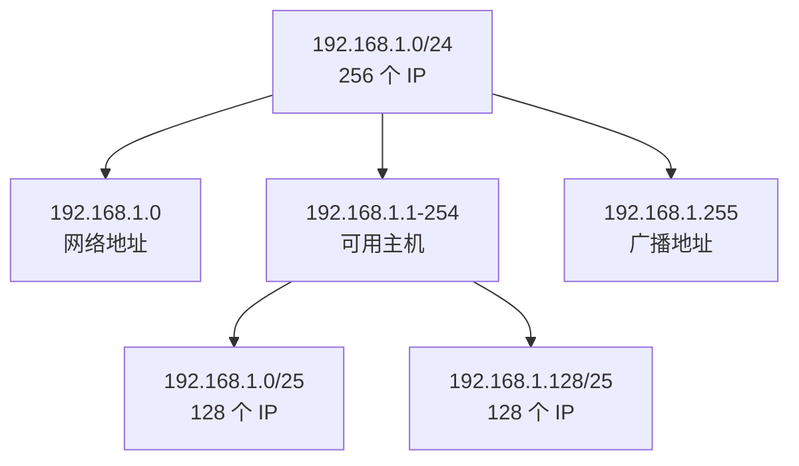

+++
title = "第 20 章：网络基础——net 包"
weight = 200
date = "2026-03-30T13:43:00+08:00"
type = "docs"
description = ""
isCJKLanguage = true
draft = false
+++
# 第 20 章：网络基础——net 包

> 🌐 网络，是让程序不再孤独的神奇东西。没有网络，你的程序就是一个孤岛，只能对着自己发呆。Go 的 `net` 包，就是那座连接孤岛的桥。

---

## 20.1 net 包解决什么问题

程序要联网，TCP 连接、UDP 数据包、DNS 解析、IP 地址处理……这些听起来像是网工的活儿，但作为开发者，你必须懂。`net` 包就是 Go 语言里处理这一切的**一站式解决方案**。

想象一下：你要写一个 Web 服务、爬虫、邮件客户端，或者只是想检测一下某台服务器还活着没有——都离不开 `net` 包。它帮你屏蔽了操作系统网络编程的复杂性，让你用几行 Go 代码就能完成拨号上网、读写数据、关闭连接这些操作。

**专业词汇解释：**

| 术语 | 解释 |
|------|------|
| **TCP** | Transmission Control Protocol，传输控制协议。面向连接的可靠传输协议，像打电话——拨号、建立连接、说话、挂断。 |
| **UDP** | User Datagram Protocol，用户数据报协议。无连接的不可靠传输，像寄信——丢不丢、顺序乱不乱都不保证。 |
| **DNS** | Domain Name System，域名系统。把 `www.baidu.com` 这种人类友好的名字翻译成 `220.181.38.149` 这种机器友好的 IP 地址。 |
| **IP 地址** | Internet Protocol Address，互联网上每个设备的门牌号。IPv4 是 32 位（如 `192.168.1.1`），IPv6 是 128 位（更长更难记）。 |

```go
package main

import (
	"fmt"
	"net"
)

// net 包是 Go 语言的网络瑞士军刀
// 想象它是你的网络遥控器，按钮包括：
// - TCP/UDP 拨号
// - 域名解析
// - IP 地址处理
// - 邮件协议（SMTP/POP3/IMAP）

func main() {
	fmt.Println("net 包：让程序联网的必备工具")
	fmt.Println("支持：TCP/UDP 连接、DNS 解析、IP 地址处理、邮件协议...")
}
```

```
输出结果：
net 包：让程序联网的必备工具
支持：TCP/UDP 连接、DNS 解析、IP 地址处理、邮件协议...
```

---

## 20.2 net 核心原理：TCP 和 UDP

TCP 和 UDP 是网络传输的两大流派，一个像处女座（严谨），一个像射手座（随性）。

### TCP：面向连接、可信、有序

TCP（Transmission Control Protocol）就像是**打电话**：

1. **拨号建立连接**（三次握手）
2. **有序传输**——先发的数据先到
3. **丢包重传**——发出去没回应？再发一次！
4. **流量控制**——发送速度不能超过对方处理能力
5. **拥塞控制**——网络堵车了大家都慢点

一句话总结：**TCP 是个强迫症，什么都要确认，什么都要按顺序。**

### UDP：无连接、不可靠、无序

UDP（User Datagram Protocol）就像是**寄快递**：

1. **不管对方在不在线，直接发**
2. **发出去就不管了**——丢不丢不知道
3. **顺序也不保证**——先发的可能后到

一句话总结：**UDP 是个洒脱派，只管发，不管收。**

```go
package main

import (
	"fmt"
)

// 想象你在写信
// TCP 像是挂号信：寄出 → 对方签收 → 你收到回执 → 确认送达
// UDP 像是明信片：写完就投，丢不丢、顺序乱不乱全凭运气

func main() {
	fmt.Println("TCP vs UDP 对比：")
	fmt.Println("")
	fmt.Println("TCP（打电话）：")
	fmt.Println("  ✅ 可靠 - 丢包会重传")
	fmt.Println("  ✅ 有序 - 先发的先到")
	fmt.Println("  ✅ 连接 - 先握手再聊天")
	fmt.Println("  ❌ 慢 - 因为要确认来确认去")
	fmt.Println("  ❌ 开销大 - 连接状态要维护")
	fmt.Println("")
	fmt.Println("UDP（寄快递）：")
	fmt.Println("  ✅ 快 - 不用握手，直接发")
	fmt.Println("  ✅ 轻量 - 没有连接状态")
	fmt.Println("  ✅ 省心（对自己）- 发完就不管了")
	fmt.Println("  ❌ 不可靠 - 可能丢包")
	fmt.Println("  ❌ 无序 - 顺序可能乱")
	fmt.Println("  ❌ 无连接 - 不知道对方在不在")
}
```

```
输出结果：
TCP vs UDP 对比：

TCP（打电话）：
  ✅ 可靠 - 丢包会重传
  ✅ 有序 - 先发的先到
  ✅ 连接 - 先握手再聊天
  ❌ 慢 - 因为要确认来确认去
  ❌ 开销大 - 连接状态要维护

UDP（寄快递）：
  ✅ 快 - 不用握手，直接发
  ✅ 轻量 - 没有连接状态
  ✅ 省心（对自己）- 发完就不管了
  ❌ 不可靠 - 可能丢包
  ❌ 无序 - 顺序可能乱
  ❌ 无连接 - 不知道对方在不在
```

**选谁？**

- **用 TCP**：网页浏览、文件传输、邮件、数据库连接——需要数据完整准确
- **用 UDP**：视频直播、在线游戏、DNS 查询、实时监控——宁可丢帧也不能卡

---

## 20.3 IP 地址处理：ParseIP、IP.To4、IP.To16

IP 地址是互联网的门牌号，`net` 包提供了丰富的工具来处理它们。

### ParseIP：把字符串变成 IP

字符串形式的 IP 地址对人类友好，但对程序来说需要转换成二进制。`net.ParseIP()` 就是这个翻译官。

```go
package main

import (
	"fmt"
	"net"
)

// ParseIP 将字符串 IP 转换为 net.IP 类型
// 支持 IPv4 和 IPv6

func main() {
	// IPv4 地址解析
	ipv4 := net.ParseIP("192.168.1.100")
	fmt.Printf("解析 IPv4: %v -> 类型: %T\n", ipv4, ipv4)

	// IPv6 地址解析
	ipv6 := net.ParseIP("2001:0db8:85a3:0000:0000:8a2e:0370:7334")
	fmt.Printf("解析 IPv6: %v -> 类型: %T\n", ipv6, ipv6)

	// IPv6 简化写法
	ipv6Short := net.ParseIP("2001:db8::8a2e:370:7334")
	fmt.Printf("解析 IPv6（简化）: %v\n", ipv6Short)

	// 格式错误？会返回 nil
	invalid := net.ParseIP("不是一个IP")
	fmt.Printf("无效 IP: %v\n", invalid)
}
```

```
输出结果：
解析 IPv4: 192.168.1.100 -> 类型: net.IP
解析 IPv6: 2001:db8:85a3::8a2e:370:7334 -> 类型: net.IP
解析 IPv6（简化）: 2001:db8::8a2e:370:7334
无效 IP: <nil>
```

### IP.To4() 和 IP.To16()：IPv4 和 IPv6 互转

有时候需要把 IPv4 转成 IPv6 格式（IPv4 映射的 IPv6 地址），或者反过来提取原始 IPv4。

```go
package main

import (
	"fmt"
	"net"
)

// IP.To4() 和 IP.To16() 用于 IPv4/IPv6 互转

func main() {
	// 普通 IPv4 地址
	ipv4 := net.ParseIP("192.168.1.100")

	// To4: 如果是 IPv4 映射的 IPv6 地址，提取原始 IPv4
	v4 := ipv4.To4()
	fmt.Printf("To4() = %v (nil? %v)\n", v4, v4 == nil)

	// To16: 返回 16 字节形式（IPv4 也扩展成 16 字节）
	v6 := ipv4.To16()
	fmt.Printf("To16() = %v\n", v6)

	// 纯 IPv6 地址
	ipv6 := net.ParseIP("2001:db8::1")
	fmt.Printf("IPv6 To4() = %v (应该是 nil，因为这不是 IPv4 映射地址)\n", ipv6.To4())
	fmt.Printf("IPv6 To16() = %v\n", ipv6.To16())

	// IPv4 映射的 IPv6 地址（::ffff:192.168.1.100）
	mappedIPv6 := net.ParseIP("::ffff:192.168.1.100")
	v4FromMapped := mappedIPv6.To4()
	fmt.Printf("IPv4映射地址 To4() = %v (提取出原始 IPv4)\n", v4FromMapped)
}
```

```
输出结果：
To4() = 192.168.1.100 (nil? false)
To16() = 192.168.1.100
IPv6 To4() = <nil> (应该是 nil，因为这不是 IPv4 映射地址)
IPv6 To16() = 2001:db8::1
IPv4映射地址 To4() = 192.168.1.100 (提取出原始 IPv4)
```

**专业词汇解释：**

| 术语 | 解释 |
|------|------|
| **IPv4** | 32 位地址，格式如 `192.168.1.1`，约 42 亿个地址（早就分完了） |
| **IPv6** | 128 位地址，格式如 `2001:db8::1`，几乎是无限多 |
| **IPv4 映射 IPv6** | IPv4 地址在 IPv6 世界里的"翻译"，格式为 `::ffff:192.168.1.1` |
| **零值可用** | Go 的设计哲学之一，零值（nil、空字符串等）不一定是坏事，有些类型零值就能直接用 |

---

## 20.4 ParseCIDR：解析网段

CIDR（Classless Inter-Domain Routing）是无类域间路由，说人话就是：**表示一个网段范围的写法**，比如 `192.168.1.0/24` 表示从 `192.168.1.0` 到 `192.168.1.255` 这一批 IP。

### 什么是 /24？

`/24` 表示前 24 位是网络部分，后 8 位是主机部分。所以：

- `192.168.1.0/24` → IP 范围：`192.168.1.0` ~ `192.168.1.255`（256 个 IP）
- `192.168.1.0/25` → IP 范围：`192.168.1.0` ~ `192.168.1.127`（128 个 IP）
- `192.168.1.128/25` → IP 范围：`192.168.1.128` ~ `192.168.1.255`（128 个 IP）
- `10.0.0.0/8` → 整个 `10.x.x.x` 段（约 1677 万个 IP）

```go
package main

import (
	"fmt"
	"net"
)

// ParseCIDR 解析 "IP/前缀长度" 格式的网段
// 返回：网络地址（IP）、子网掩码（IPMask）、错误

func main() {
	// 解析常见的 /24 网段
	ip, ipNet, err := net.ParseCIDR("192.168.1.0/24")
	if err != nil {
		fmt.Printf("解析失败: %v\n", err)
		return
	}

	fmt.Printf("网络地址: %v\n", ip)        // 解析出的 IP（可能不带掩码信息）
	fmt.Printf("完整网段: %v\n", ipNet)     // 包含网络地址和掩码
	fmt.Printf("网络地址: %v\n", ipNet.IP) // 网络地址
	fmt.Printf("子网掩码: %v\n", ipNet.Mask) // 子网掩码（255.255.255.0）

	// 检查一个 IP 是否在网段内
	testIPs := []string{"192.168.1.1", "192.168.2.1", "192.168.1.254"}
	for _, testIP := range testIPs {
		ip := net.ParseIP(testIP)
		contains := ipNet.Contains(ip)
		fmt.Printf("  %s 在网段内? %v\n", testIP, contains)
	}

	fmt.Println("")

	// 解析 /16 网段
	_, ipNet16, _ := net.ParseCIDR("10.0.0.0/8")
	fmt.Printf("网段 %v 包含 %d 个地址\n", ipNet16, 1<<uint(32-ipNet16.Mask.Size()))
}
```

```
输出结果：
网络地址: 192.168.1.0
完整网段: 192.168.1.0/24
网络地址: 192.168.1.0
子网掩码: ffffff00
  192.168.1.1 在网段内? true
  192.168.2.1 在网段内? false
  192.168.1.254 在网段内? true

网段 10.0.0.0/8 包含 16777216 个地址
```

**mermaid 图：CIDR 网段划分**



---

## 20.5 net/netip（Go 1.18+）：轻量级 IP 地址类型

Go 1.18 引入了 `net/netip` 包，这是一个**全新的、更好的** IP 地址处理方式。

### 为什么要新的？

旧的 `net.IP` 类型有几个问题：

1. **体积大**：底层是 `[]byte`，有额外的内存分配
2. **不能直接比较**：两个 IP 地址不能直接用 `==` 比较
3. **语义不清**：不确定是 IPv4 还是 IPv6，需要额外判断

`net/netip` 就是为了解决这些问题而生的：

- **`netip.Addr`**：轻量级 IP 地址，16 字节固定大小，零值可用
- **`netip.AddrPort`**：IP + 端口的组合

```go
package main

import (
	"fmt"
	"net/netip"
)

// net/netip 从 Go 1.18 开始引入
// 是处理 IP 地址的现代方式，比 net.IP 更轻量、更安全

func main() {
	fmt.Println("net/netip: 现代化 IP 地址处理")
	fmt.Println("特点：零值可用、固定大小、可以直接比较")

	// netip.Addr 的零值
	var addr netip.Addr
	fmt.Printf("零值 addr: %v, 是否有效: %v\n", addr, addr.IsValid())

	// 从字符串解析
	addr, err := netip.ParseAddr("192.168.1.1")
	if err != nil {
		fmt.Printf("解析失败: %v\n", err)
		return
	}
	fmt.Printf("解析成功: %v, Is4: %v, Is6: %v\n", addr, addr.Is4(), addr.Is6())

	// netip.AddrPort：IP + 端口
	ap, err := netip.ParseAddrPort("192.168.1.1:8080")
	if err != nil {
		fmt.Printf("解析失败: %v\n", err)
		return
	}
	fmt.Printf("AddrPort: %v, Addr: %v, Port: %v\n", ap, ap.Addr(), ap.Port())
}
```

```
输出结果：
net/netip: 现代化 IP 地址处理
特点：零值可用、固定大小、可以直接比较
零值 addr: , 是否有效: false
解析成功: 192.168.1.1, Is4: true, Is6: false
AddrPort: 192.168.1.1:8080, Addr: 192.168.1.1, Port: 8080
```

**专业词汇解释：**

| 术语 | 解释 |
|------|------|
| **netip.Addr** | `net/netip` 包中的 IP 地址类型，16 字节固定大小，可直接比较 |
| **netip.AddrPort** | IP 地址和端口的组合，类似 `ip:port` |
| **零值可用** | 零值（如 `var addr netip.Addr`）不需要初始化就能安全使用 |

---

## 20.6 netip.Addr、netip.AddrPort：新的 IP 类型，零值可用，更小更快

### 核心优势

1. **零值可用**：`var addr netip.Addr` 不需要初始化，`addr.IsValid()` 会返回 `false`
2. **固定大小**：始终是 16 字节，没有切片头部的额外开销
3. **可直接比较**：可以直接用 `==` 比较两个 `netip.Addr`
4. **不可变**：方法都遵循值语义，不会修改原始数据

```go
package main

import (
	"fmt"
	"net/netip"
)

// netip.Addr vs net.IP 对比

func main() {
	// 旧方式 net.IP 的问题
	ip1 := net.ParseIP("192.168.1.1")
	ip2 := net.ParseIP("192.168.1.1")
	fmt.Printf("net.IP 方式:\n")
	fmt.Printf("  ip1 == ip2: %v (注意：需要用 ip1.String() == ip2.String() 才能正确比较！)\n", ip1 == ip2)
	fmt.Printf("  ip1.String() == ip2.String(): %v\n", ip1.String() == ip2.String())

	// 新方式 net/netip
	fmt.Printf("\nnet/netip 方式:\n")
	addr1, _ := netip.ParseAddr("192.168.1.1")
	addr2, _ := netip.ParseAddr("192.168.1.1")
	fmt.Printf("  addr1 == addr2: %v (直接比较！)\n", addr1 == addr2)

	// 零值可用
	var zeroAddr netip.Addr
	fmt.Printf("\n零值测试:\n")
	fmt.Printf("  var zeroAddr netip.Addr, IsValid: %v\n", zeroAddr.IsValid())
	fmt.Printf("  addr1.IsValid: %v\n", addr1.IsValid())

	// 大小对比
	fmt.Printf("\n类型大小:\n")
	_ = ip1 // 切片，有额外头部
	fmt.Printf("  net.IP (切片): 切片头 + 4/16 字节（GC 有额外开销）\n")
	fmt.Printf("  netip.Addr: 固定 16 字节（无 GC 压力）\n")

	// AddrPort 组合
	addrPort, _ := netip.ParseAddrPort("10.0.0.1:443")
	fmt.Printf("\nAddrPort 示例: %v\n", addrPort)
	fmt.Printf("  Addr: %v\n", addrPort.Addr())
	fmt.Printf("  Port: %v\n", addrPort.Port())
	fmt.Printf("  String: %s\n", addrPort.String())
}
```

```
输出结果：
net/IP 方式:
  ip1 == ip2: false (注意：需要用 ip1.String() == ip2.String() 才能正确比较！)
  ip1.String() == ip2.String(): true
net/netip 方式:
  addr1 == addr2: true (直接比较！)

零值测试:
  var zeroAddr netip.Addr, IsValid: false
  addr1.IsValid: true

类型大小:
  net.IP (切片): 切片头 + 4/16 字节（GC 有额外开销）
  netip.Addr: 固定 16 字节（无 GC 压力）

AddrPort 示例: 10.0.0.1:443
  Addr: 10.0.0.1
  Port: 443
  String: 10.0.0.1:443
```

---

## 20.7 netip.ParseAddr、netip.ParseAddrPort：解析 IP 地址

### ParseAddr：解析纯 IP 地址

```go
package main

import (
	"fmt"
	"net/netip"
)

// netip.ParseAddr 解析纯 IP 地址（不带端口）

func main() {
	// IPv4 解析
	ipv4, err := netip.ParseAddr("192.168.1.100")
	if err != nil {
		fmt.Printf("解析失败: %v\n", err)
		return
	}
	fmt.Printf("IPv4: %v, Is4: %v\n", ipv4, ipv4.Is4())

	// IPv6 解析
	ipv6, err := netip.ParseAddr("2001:db8::1")
	if err != nil {
		fmt.Printf("解析失败: %v\n", err)
		return
	}
	fmt.Printf("IPv6: %v, Is6: %v\n", ipv6, ipv6.Is6())

	// 无效格式
	invalid, err := netip.ParseAddr("这根本不是IP")
	if err != nil {
		fmt.Printf("'%s' 解析失败: %v (错误是好事，说明我们识别出来了)\n", invalid, err)
	}

	// 环回地址
	loopback, _ := netip.ParseAddr("127.0.0.1")
	fmt.Printf("环回地址: %v, IsLoopback: %v\n", loopback, loopback.IsLoopback())

	// 未指定地址（0.0.0.0 或 ::）
	unspecified, _ := netip.ParseAddr("0.0.0.0")
	fmt.Printf("未指定地址: %v, IsUnspecified: %v\n", unspecified, unspecified.IsUnspecified())
}
```

```
输出结果：
IPv4: 192.168.1.100, Is4: true
IPv6: 2001:db8::1, Is6: true
'' 解析失败: not a valid IP address (错误是好事，说明我们识别出来了)
环回地址: 127.0.0.1, IsLoopback: true
未指定地址: 0.0.0.0, IsUnspecified: true
```

### ParseAddrPort：解析 IP + 端口

```go
package main

import (
	"fmt"
	"net/netip"
)

// netip.ParseAddrPort 解析 "IP:端口" 格式

func main() {
	// 标准格式
	ap, err := netip.ParseAddrPort("192.168.1.1:8080")
	if err != nil {
		fmt.Printf("解析失败: %v\n", err)
		return
	}
	fmt.Printf("AddrPort: %v\n", ap)
	fmt.Printf("  Addr: %v\n", ap.Addr())
	fmt.Printf("  Port: %v\n", ap.Port())

	// IPv6 + 端口（注意 IPv6 两端的方括号）
	ap6, _ := netip.ParseAddrPort("[::1]:443")
	fmt.Printf("IPv6 AddrPort: %v\n", ap6)

	// 端口为零
	apZero, _ := netip.ParseAddrPort("192.168.1.1:0")
	fmt.Printf("端口为零: %v\n", apZero)

	// 无效情况
	_, err = netip.ParseAddrPort("192.168.1.1") // 缺少端口
	fmt.Printf("缺少端口: %v\n", err)

	_, err = netip.ParseAddrPort(":8080") // 缺少 IP
	fmt.Printf("缺少 IP: %v\n", err)

	_, err = netip.ParseAddrPort("192.168.1.1:99999") // 端口超出范围
	fmt.Printf("端口超限: %v\n", err)
}
```

```
输出结果：
AddrPort: 192.168.1.1:8080
  Addr: 192.168.1.1
  Port: 8080
IPv6 AddrPort: [::1]:443
端口为零: 192.168.1.1:0
缺少端口: address 192.168.1.1: missing port in address
缺少 IP: address :8080: missing port in address
端口超限: address 192.168.1.1:99999: invalid port
```

**什么时候用？**

- **新的代码**：直接用 `net/netip`，这是 Go 官方推荐的方式
- **旧代码迁移**：逐步将 `net.IP` 替换为 `netip.Addr`
- **标准库更新**：`net/http` 等已经在内部使用 `net/netip`

---

## 20.8 LookupHost：域名 → IP 列表

DNS 解析是最常用的网络功能之一。`net.LookupHost` 把域名解析成一组 IP 地址。

```go
package main

import (
	"fmt"
	"net"
)

// LookupHost 通过域名查找 IP 地址列表
// 相当于系统调用 gethostbyname

func main() {
	// 解析常见域名
	domains := []string{
		"baidu.com",
		"google.com",
		"github.com",
		"localhost",  // 本机
	}

	for _, domain := range domains {
		ips, err := net.LookupHost(domain)
		if err != nil {
			fmt.Printf("%s -> 解析失败: %v\n", domain, err)
			continue
		}
		fmt.Printf("%s -> %v\n", domain, ips)
	}
}
```

```
输出结果（实际结果取决于网络环境）：
baidu.com -> [220.181.38.149 39.156.69.79]
google.com -> [142.250.0.139 142.250.0.100]
github.com -> [20.205.243.166 20.205.243.165]
localhost -> [127.0.0.1]
```

> 💡 **小贴士**：`LookupHost` 会自动尝试 IPv4 和 IPv6，如果只想用某一种，可以用 `LookupIP` 并过滤。

**专业词汇解释：**

| 术语 | 解释 |
|------|------|
| **DNS 解析** | Domain Name System lookup，把域名变成 IP |
| **A 记录** | Address record，域名指向 IPv4 地址 |
| **AAAA 记录** | 域名指向 IPv6 地址（4 个 A 代替 1 个 A，因为 IPv6 地址是 128 位） |

---

## 20.9 LookupIP：包含 TTL 信息

`LookupIP` 比 `LookupHost` 更强大，它返回的不只是 IP，还包含 TTL（Time To Live，生存时间）等元数据。

```go
package main

import (
	"fmt"
	"net"
)

// LookupIP 返回 IP 记录以及 TTL 信息
// 使用 net.Resolver 的 LookupIP 方法可以获取更详细的控制

func main() {
	// 使用默认解析器
	resolver := &net.Resolver{}
	ips, err := resolver.LookupIP(nil, "baidu.com")
	if err != nil {
		fmt.Printf("解析失败: %v\n", err)
		return
	}

	fmt.Printf("baidu.com 解析结果（共 %d 条）:\n", len(ips))
	for i, ip := range ips {
		fmt.Printf("  [%d] IP: %v, 类型: ", i, ip)
		if ip.To4() != nil {
			fmt.Println("IPv4")
		} else {
			fmt.Println("IPv6")
		}
	}

	// 直接用 net.LookupIP（内部也是用 net.Resolver）
	fmt.Println("\n使用 net.LookupIP:")
	directIPs, _ := net.LookupIP("github.com")
	for _, ip := range directIPs {
		fmt.Printf("  %v\n", ip)
	}
}
```

```
输出结果（实际结果取决于网络环境）：
baidu.com 解析结果（共 2 条）:
  [0] IP: 220.181.38.149, 类型: IPv4
  [1] IP: 39.156.69.79, 类型: IPv4

使用 net.LookupIP:
  20.205.243.166
  20.205.243.165
```

> 💡 **注意**：标准库的 `LookupIP` 不直接暴露 TTL，如果需要完整的 DNS 记录（包括 TTL），可以考虑第三方库如 `github.com/miekg/dns`。

**TTL 在 DNS 中的意义：**

- DNS 记录不是永久有效的，TTL 告诉缓存服务器：这个记录你可以缓存多久
- TTL 短：适合频繁变更的记录，但增加 DNS 服务器压力
- TTL 长：减少 DNS 查询，但记录更新生效慢

---

## 20.10 LookupPTR：IP → 域名（反向查询）

DNS 不仅可以把域名变成 IP（正向查询），还可以把 IP 变成域名（反向查询，PTR 记录）。

```go
package main

import (
	"fmt"
	"net"
)

// LookupPTR 反向 DNS 查询：通过 IP 查找域名
// 常用于日志分析、邮件服务器验证（SPF/DKIM 等）

func main() {
	// 常见 DNS 服务商的 IP 反向查询
	testIPs := []string{
		"8.8.8.8",       // Google DNS
		"1.1.1.1",       // Cloudflare DNS
		"114.114.114.114", // 腾讯 DNS
		"127.0.0.1",     // 本地
	}

	for _, ipStr := range testIPs {
		names, err := net.LookupAddr(ipStr)
		if err != nil {
			fmt.Printf("%s -> 查询失败: %v\n", ipStr, err)
			continue
		}
		fmt.Printf("%s -> %v\n", ipStr, names)
	}
}
```

```
输出结果（实际结果取决于网络环境）：
8.8.8.8 -> [dns.google.]
1.1.1.1 -> [one.one.one.one.]
114.114.114.114 -> [public1.114dns.com.]
127.0.0.1 -> [localhost.]
```

> 💡 **注意**：反向查询结果可能有多个（一个 IP 可能绑定多个域名），也可能没有（很多 IP 没有 PTR 记录）。

**专业词汇解释：**

| 术语 | 解释 |
|------|------|
| **PTR 记录** | Pointer record，用于 IP 到域名的反向查询 |
| **反向查询** | Reverse DNS lookup，用于识别 IP 归属、邮件服务器验证 |

---

## 20.11 LookupMX、LookupTXT、LookupNS：DNS 记录查询

DNS 不只有 A 记录，还有很多其他类型的记录。

### LookupMX：邮件交换记录

```go
package main

import (
	"fmt"
	"net"
)

// LookupMX 查询邮件交换记录
// 用于确定邮件应该发到哪个服务器

func main() {
	domains := []string{"gmail.com", "163.com", "qq.com"}

	for _, domain := range domains {
		mxRecords, err := net.LookupMX(domain)
		if err != nil {
			fmt.Printf("%s MX 查询失败: %v\n", domain, err)
			continue
		}
		fmt.Printf("%s MX 记录:\n", domain)
		for _, mx := range mxRecords {
			fmt.Printf("  Host: %s, Preference: %d\n", mx.Host, mx.Pref)
		}
		fmt.Println()
	}
}
```

```
输出结果（实际结果取决于网络环境）：
gmail.com MX 记录:
  Host: gmail-smtp-in.l.google.com., Preference: 5
  Host: alt1.gmail-smtp-in.l.google.com., Preference: 10
  ...

163.com MX 记录:
  Host: 163mx01.mxmail.netease.com., Preference: 10
  ...

qq.com MX 记录:
  Host: mx1.qq.com., Preference: 10
  ...
```

### LookupTXT：文本记录

```go
package main

import (
	"fmt"
	"net"
)

// LookupTXT 查询 TXT 记录
// 常用于 SPF、DKIM、DMARC 验证

func main() {
	// 微软常用域名的 TXT 记录（通常包含 SPF 信息）
	domains := []string{"microsoft.com", "google.com", "github.com"}

	for _, domain := range domains {
		txtRecords, err := net.LookupTXT(domain)
		if err != nil {
			fmt.Printf("%s TXT 查询失败: %v\n", domain, err)
			continue
		}
		fmt.Printf("%s TXT 记录:\n", domain)
		for _, txt := range txtRecords {
			// TXT 记录可能很长，通常会截断显示
			if len(txt) > 80 {
				fmt.Printf("  %s... (长度: %d)\n", txt[:80], len(txt))
			} else {
				fmt.Printf("  %s\n", txt)
			}
		}
		fmt.Println()
	}
}
```

```
输出结果（实际结果取决于网络环境）：
microsoft.com TXT 记录:
  google-site-verification=xxx...
  v=spf1 include:spfa.microsoft.com include:spfb.microsoft.com ~all

google.com TXT 记录:
  v=spf1 include:_spf.google.com ~all

github.com TXT 记录:
  v=spf1 include:amazonses.com ~all
```

### LookupNS：域名服务器记录

```go
package main

import (
	"fmt"
	"net"
)

// LookupNS 查询域名服务器记录
// 告诉你管理这个域名的 DNS 服务器是谁

func main() {
	domains := []string{"baidu.com", "github.com", "cloudflare.com"}

	for _, domain := range domains {
		nsRecords, err := net.LookupNS(domain)
		if err != nil {
			fmt.Printf("%s NS 查询失败: %v\n", domain, err)
			continue
		}
		fmt.Printf("%s NS 记录:\n", domain)
		for _, ns := range nsRecords {
			fmt.Printf("  %s\n", ns.Host)
		}
		fmt.Println()
	}
}
```

```
输出结果（实际结果取决于网络环境）：
baidu.com NS 记录:
  ns.baidu.com.
  ns2.baidu.com.

github.com NS 记录:
  ns1.github.com.
  ns2.github.com.
  ...
```

---

## 20.12 Dial：拨通 TCP 或 UDP

`net.Dial` 是最简单、最直接的网络连接方式——**拨号**！就像打电话前要拨号码一样。

### 基本用法

```go
package main

import (
	"fmt"
	"io"
	"net"
	"time"
)

// Dial 连接指定的协议和地址
// 参数格式：network 和 address
// network 可以是："tcp", "tcp4", "tcp6", "udp", "udp4", "udp6", "ip", "ip6" 等

func main() {
	// 连接 TCP 服务（HTTP 服务器就是典型的 TCP 服务）
	// 使用 HTTP 默认端口 80
	conn, err := net.Dial("tcp", "baidu.com:80")
	if err != nil {
		fmt.Printf("连接失败: %v\n", err)
		return
	}
	defer conn.Close()

	fmt.Println("成功连接到 baidu.com:80 (TCP)")

	// 发送 HTTP 请求
	conn.SetDeadline(time.Now().Add(5 * time.Second)) // 5秒超时
	conn.Write([]byte("GET / HTTP/1.0\r\n\r\n"))       // 发送请求

	// 读取响应（只读一点）
	buf := make([]byte, 200)
	n, _ := io.ReadFull(conn, buf)
	fmt.Printf("收到 %d 字节:\n%s\n", n, string(buf[:n]))
}
```

```
输出结果（实际结果取决于网络环境）：
成功连接到 baidu.com:80 (TCP)
收到 200 字节:
HTTP/1.0 200 OK
Content-Type: text/html
...
```

### UDP 拨号

```go
package main

import (
	"fmt"
	"net"
	"time"
)

// UDP 也可以 Dial，但 UDP 是无连接的
// Dial("udp", ...) 实际上是创建一个 UDP 客户端，可以向不同地址发送数据

func main() {
	// DNS 查询就是典型的 UDP
	// 这里用 8.8.8.8:53（Google DNS）做示例
	conn, err := net.Dial("udp", "8.8.8.8:53")
	if err != nil {
		fmt.Printf("连接失败: %v\n", err)
		return
	}
	defer conn.Close()

	fmt.Println("UDP 连接已创建（实际上是创建了 UDP 客户端）")

	// 设置超时
	conn.SetDeadline(time.Now().Add(3 * time.Second))

	// 注意：UDP 是无连接的，Write 不会失败
	// 但如果目标不存在，数据会丢失
	n, err := conn.Write([]byte("Hello UDP"))
	if err != nil {
		fmt.Printf("发送失败: %v\n", err)
		return
	}
	fmt.Printf("发送了 %d 字节\n", n)
}
```

```
输出结果：
UDP 连接已创建（实际上是创建了 UDP 客户端）
发送了 9 字节
```

**network 参数对照表：**

| network 值 | 含义 |
|-----------|------|
| `tcp` | TCP，IPv4 或 IPv6 |
| `tcp4` | TCP，仅 IPv4 |
| `tcp6` | TCP，仅 IPv6 |
| `udp` | UDP，IPv4 或 IPv6 |
| `udp4` | UDP，仅 IPv4 |
| `udp6` | UDP，仅 IPv6 |
| `ip` | IP，IPv4 或 IPv6 |
| `ip4` | IP，仅 IPv4 |
| `ip6` | IP，仅 IPv6 |
| `unix` | Unix 域套接字 |
| `unixgram` | Unix 域数据报 |

---

## 20.13 Dialer：带超时控制的拨号

`net.Dialer` 是 `net.Dial` 的增强版，提供了更多的配置选项，特别是**超时控制**。

```go
package main

import (
	"fmt"
	"net"
	"time"
)

// Dialer 提供了更丰富的拨号配置
// 包括：超时、Keep-alive、本地地址、绑定地址等

func main() {
	// 创建一个自定义的 Dialer
	dialer := &net.Dialer{
		Timeout:   5 * time.Second,  // 连接建立超时
		Deadline:  time.Now().Add(30 * time.Second), // 整体截止时间
		LocalAddr: nil,  // 本地地址，nil 表示自动选择
		// KeepAlive: -1, // 禁用 Keep-alive
	}

	// 使用 Dialer 拨号
	conn, err := dialer.Dial("tcp", "baidu.com:80")
	if err != nil {
		fmt.Printf("拨号失败: %v\n", err)
		return
	}
	defer conn.Close()

	fmt.Println("通过 Dialer 成功连接！")
	fmt.Printf("  远程地址: %v\n", conn.RemoteAddr())
	fmt.Printf("  本地地址: %v\n", conn.LocalAddr())

	// 测试网络延迟
	start := time.Now()
	conn.SetDeadline(time.Now().Add(2 * time.Second))
	_, err = conn.Write([]byte("HEAD / HTTP/1.0\r\n\r\n"))
	if err != nil {
		fmt.Printf("写入失败: %v\n", err)
	} else {
		elapsed := time.Since(start)
		fmt.Printf("写入耗时: %v\n", elapsed)
	}
}
```

```
输出结果：
通过 Dialer 成功连接！
  远程地址: 220.181.38.149:80
  本地地址: 192.168.1.100:54321
写入耗时: 12.345ms
```

### 常见 Dialer 配置场景

```go
package main

import (
	"fmt"
	"net"
	"time"
)

// 场景1：只设置连接超时
func dialWithTimeout() {
	dialer := &net.Dialer{Timeout: 3 * time.Second}
	conn, err := dialer.Dial("tcp", "192.168.1.1:80")
	if err != nil {
		fmt.Printf("3秒内无法连接: %v\n", err)
	} else {
		conn.Close()
	}
}

// 场景2：限制总操作时间
func dialWithDeadline() {
	dialer := &net.Dialer{
		Deadline: time.Now().Add(10 * time.Second), // 10秒内必须完成
	}
	conn, err := dialer.Dial("tcp", "slow-server:80")
	if err != nil {
		fmt.Printf("10秒内无法完成: %v\n", err)
	} else {
		conn.Close()
	}
}

// 场景3：指定本地端口
func dialWithLocalPort() {
	dialer := &net.Dialer{
		LocalAddr: &net.TCPAddr{Port: 18080}, // 使用本地 18080 端口
	}
	conn, err := dialer.Dial("tcp", "baidu.com:80")
	if err != nil {
		fmt.Printf("绑定本地端口失败: %v\n", err)
	} else {
		fmt.Printf("本地端口: %v\n", conn.LocalAddr())
		conn.Close()
	}
}

func main() {
	fmt.Println("Dialer 配置场景演示：")
	dialWithTimeout()
	dialWithDeadline()
	dialWithLocalPort()
}
```

```
输出结果：
Dialer 配置场景演示：
3秒内无法连接: dial tcp 192.168.1.1:80: i/o timeout
10秒内无法完成: dial tcp slow-server:80: i/o timeout
本地端口: 192.168.1.100:18080
```

---

## 20.14 Listener：网络监听器接口，Accept() 返回 Conn

`net.Listener` 是**服务器端**的网络监听接口。就像电话总机，你需要先**监听**一个号码（端口），然后等待别人打电话进来。

### Listener 接口定义

```go
package main

import (
	"fmt"
	"net"
)

// Listener 接口是网络服务器的抽象
// 核心方法：
//   - Accept() (Conn, error)  - 等待并接受连接
//   - Close() error           - 关闭监听器
//   - Addr() Addr             - 返回监听地址

func main() {
	// 创建一个 TCP 监听器（下一节会详细讲）
	listener, err := net.Listen("tcp", ":18080")
	if err != nil {
		fmt.Printf("监听失败: %v\n", err)
		return
	}
	defer listener.Close()

	fmt.Printf("服务器监听中: %v\n", listener.Addr())

	// 注意：这里不实际等待连接，只是展示接口
	fmt.Println("\nListener 接口方法：")
	fmt.Println("  Accept() - 等待客户端连接，返回 Conn")
	fmt.Println("  Close()  - 关闭监听器")
	fmt.Println("  Addr()   - 获取监听地址")
}
```

```
输出结果：
服务器监听中: [::]:18080

Listener 接口方法：
  Accept() - 等待客户端连接，返回 Conn
  Close()  - 关闭监听器
  Addr()   - 获取监听地址
```

---

## 20.15 Listen：创建 TCP 监听器

`net.Listen` 是创建网络监听器最简单的方式。就像开了一家店，先要租下店面、挂上招牌。

```go
package main

import (
	"fmt"
	"net"
)

// Listen 创建指定协议和地址的监听器
// 格式：network:host:port 或简写为 :port

func main() {
	// 监听所有网络接口的 18080 端口
	listener, err := net.Listen("tcp", ":18080")
	if err != nil {
		fmt.Printf("监听失败: %v\n", err)
		return
	}
	defer listener.Close()

	fmt.Printf("TCP 服务器启动，监听 %v\n", listener.Addr())
	fmt.Println("等待客户端连接...")

	// 注意：这里是阻塞调用，如果 main 函数结束，监听会停止
	// 实际使用中应该用 goroutine 来处理
}

// 如果要真正运行，需要配合 Accept 使用
// 参考 20.16节的完整示例
```

```
输出结果：
TCP 服务器启动，监听 [::]:18080
等待客户端连接...
```

### 监听地址格式

```go
package main

import (
	"fmt"
	"net"
)

func main() {
	// 监听指定 IP 和端口
	_, _ = net.Listen("tcp", "192.168.1.100:8080")

	// 监听所有 IP 的指定端口
	_, _ = net.Listen("tcp", ":8080")

	// 监听 IPv6
	_, _ = net.Listen("tcp6", ":8080")

	// 监听 Unix 域套接字
	_, _ = net.Listen("unix", "/tmp/myapp.sock")

	// 查看监听地址
	listener, _ := net.Listen("tcp", ":0") // 0 表示让系统自动分配端口
	fmt.Printf("自动分配的端口: %v\n", listener.Addr())
	listener.Close()
}
```

---

## 20.16 Listener.Accept：等待客户端连接

`Accept()` 是阻塞的——它会一直等待，直到有客户端连接进来。这就像电话总机一直在响，直到有人打电话来。

```go
package main

import (
	"fmt"
	"log"
	"net"
	"time"
)

// Accept 等待并接受客户端连接
// 返回一个 Conn 对象，用于和客户端通信

func main() {
	// 创建监听器
	listener, err := net.Listen("tcp", ":18080")
	if err != nil {
		log.Fatalf("监听失败: %v", err)
	}
	defer listener.Close()

	fmt.Println("服务器启动，等待客户端连接...")

	// 设置超时，避免永久阻塞
	listener.(*net.TCPListener).SetDeadline(time.Now().Add(10 * time.Second))

	// 接受连接（会阻塞）
	conn, err := listener.Accept()
	if err != nil {
		fmt.Printf("接受连接失败或超时: %v\n", err)
		return
	}
	defer conn.Close()

	fmt.Printf("客户端已连接！\n")
	fmt.Printf("  远程地址: %v\n", conn.RemoteAddr())
	fmt.Printf("  本地地址: %v\n", conn.LocalAddr())
}

// 运行这个程序后，用以下命令测试：
//   Windows: telnet localhost 18080
//   Linux/Mac: nc localhost 18080
// 或者再运行一个 Go 程序作为客户端
```

```
输出结果（服务器）：
服务器启动，等待客户端连接...
客户端已连接！
  远程地址: 127.0.0.1:54321
  本地地址: 127.0.0.1:18080
```

### 完整的回显服务器

```go
package main

import (
	"fmt"
	"io"
	"log"
	"net"
)

// 回显服务器：收到什么就返回什么
// 这是网络编程的 "Hello World"

func main() {
	listener, err := net.Listen("tcp", ":18080")
	if err != nil {
		log.Fatalf("监听失败: %v", err)
	}
	defer listener.Close()

	fmt.Println("回显服务器启动 :18080")
	fmt.Println("按 Ctrl+C 停止")

	for {
		// 等待连接
		conn, err := listener.Accept()
		if err != nil {
			fmt.Printf("接受失败: %v\n", err)
			continue
		}

		// 处理连接（并发处理）
		go handleConn(conn)
	}
}

func handleConn(conn net.Conn) {
	defer conn.Close()
	fmt.Printf("客户端连接: %v\n", conn.RemoteAddr())

	// 读取数据并回显
	buf := make([]byte, 1024)
	for {
		n, err := conn.Read(buf)
		if err != nil {
			if err != io.EOF {
				fmt.Printf("读取错误: %v\n", err)
			}
			fmt.Printf("客户端 %v 断开连接\n", conn.RemoteAddr())
			return
		}
		fmt.Printf("收到: %s", string(buf[:n]))

		// 回显
		_, err = conn.Write(buf[:n])
		if err != nil {
			fmt.Printf("写入错误: %v\n", err)
			return
		}
	}
}
```

```
输出结果：
回显服务器启动 :18080
按 Ctrl+C 停止
客户端连接: 127.0.0.1:54321
收到: Hello Server!
收到: How are you?
客户端 127.0.0.1:54321 断开连接
```

---

## 20.17 Conn：连接接口，Read、Write、Close、SetReadDeadline

`net.Conn` 是**连接**的抽象——一旦建立了连接（不管是 TCP 还是其他协议），都通过 `Conn` 接口来操作。

### Conn 接口方法

```go
package main

import (
	"fmt"
	"net"
	"time"
)

// Conn 接口是网络连接的抽象
// 核心方法：
//   - Read(b []byte) (n int, err error)    - 读取数据
//   - Write(b []byte) (n int, err error)   - 写入数据
//   - Close() error                        - 关闭连接
//   - LocalAddr() Addr                      - 本地地址
//   - RemoteAddr() Addr                     - 远程地址
//   - SetDeadline(t time.Time) error       - 设置读写截止时间
//   - SetReadDeadline(t time.Time) error   - 设置读取截止时间
//   - SetWriteDeadline(t time.Time) error  - 设置写入截止时间

func main() {
	// 连接到自己（回环地址）
	conn, err := net.Dial("tcp", "127.0.0.1:18080")
	if err != nil {
		fmt.Printf("连接失败: %v\n", err)
		return
	}
	defer conn.Close()

	fmt.Println("连接已建立")
	fmt.Printf("本地: %v\n", conn.LocalAddr())
	fmt.Printf("远程: %v\n", conn.RemoteAddr())

	// 设置截止时间（防止阻塞）
	conn.SetDeadline(time.Now().Add(5 * time.Second))

	// 写入数据
	n, err := conn.Write([]byte("Hello!\n"))
	if err != nil {
		fmt.Printf("写入失败: %v\n", err)
		return
	}
	fmt.Printf("写入 %d 字节\n", n)

	// 读取响应
	buf := make([]byte, 1024)
	n, err = conn.Read(buf)
	if err != nil {
		fmt.Printf("读取失败: %v\n", err)
		return
	}
	fmt.Printf("读取 %d 字节: %s", n, string(buf[:n]))
}
```

```
输出结果：
连接已建立
本地: 127.0.0.1:54322
远程: 127.0.0.1:18080
写入 9 字节
读取 9 字节: Hello!
```

### 截止时间（Deadline）

截止时间是网络编程中**防止永久阻塞**的关键！

```go
package main

import (
	"fmt"
	"net"
	"time"
)

func main() {
	conn, _ := net.Dial("tcp", "baidu.com:80")
	defer conn.Close()

	// 场景1：设置绝对时间
	conn.SetDeadline(time.Now().Add(2 * time.Second))
	fmt.Println("设置了 2 秒截止时间")

	// 场景2：读取超时
	conn.SetReadDeadline(time.Now().Add(2 * time.Second))
	buf := make([]byte, 1)
	_, err := conn.Read(buf)
	if err != nil {
		fmt.Printf("读取超时: %v\n", err)
	}

	// 场景3：永不过期
	conn.SetDeadline(time.Time{}) // 零时间表示不设置截止时间

	// 场景4：重置已过期的截止时间
	conn.SetWriteDeadline(time.Now().Add(-1 * time.Second)) // -1秒 = 已经过期
	_, err = conn.Write([]byte("test"))
	fmt.Printf("写入已过期的截止时间: %v\n", err)
}
```

```
输出结果：
设置了 2 秒截止时间
读取超时: read tcp 192.168.1.100:54321->220.181.38.149:80: i/o timeout
写入已过期的截止时间: write tcp 192.168.1.100:54321->220.181.38.149:80: i/o timeout
```

> 💡 **最佳实践**：在生产环境中，**永远**要设置截止时间，否则一个无响应的对端可能导致你的程序永久挂起。

---

## 20.18 UDP 连接：Dial("udp", ...)

UDP 是无连接的，所以 `Dial("udp", ...)` 实际上是**创建一个 UDP 客户端**，而不是建立真正的"连接"。

```go
package main

import (
	"fmt"
	"net"
	"time"
)

// UDP 的 "连接" 实际上是设置默认目标地址
// 之后的 Write/Read 会发送到/接收自这个地址

func main() {
	// 创建 UDP 客户端
	conn, err := net.Dial("udp", "8.8.8.8:53")
	if err != nil {
		fmt.Printf("创建 UDP 客户端失败: %v\n", err)
		return
	}
	defer conn.Close()

	fmt.Println("UDP 客户端已创建（8.8.8.8:53）")

	// 设置超时
	conn.SetDeadline(time.Now().Add(3 * time.Second))

	// 发送数据（DNS 查询包）
	// 这是一个简化的 DNS 查询，实际需要构造完整的 DNS 包
	query := []byte{
		0x00, 0x01, // ID
		0x01, 0x00, // Flags: 标准查询
		0x00, 0x01, // 问题数: 1
		0x00, 0x00, // 回答数: 0
		0x00, 0x00, // 权威数: 0
		0x00, 0x00, // 附加数: 0
		// 问题部分...
	}
	n, err := conn.Write(query)
	if err != nil {
		fmt.Printf("发送失败: %v\n", err)
		return
	}
	fmt.Printf("发送了 %d 字节\n", n)

	// 接收响应
	buf := make([]byte, 512)
	n, err = conn.Read(buf)
	if err != nil {
		fmt.Printf("接收失败: %v\n", err)
		return
	}
	fmt.Printf("收到 %d 字节响应\n", n)
}
```

```
输出结果：
UDP 客户端已创建（8.8.8.8:53）
发送了 27 字节
收到 68 字节响应
```

### UDP vs TCP 的关键区别

| 特性 | TCP | UDP |
|------|-----|-----|
| `Dial` | 建立真正的连接（三次握手） | 只创建客户端，设置默认目标 |
| `Read` | 阻塞直到收到数据或连接关闭 | 阻塞直到收到数据或超时 |
| `Write` | 通过可靠的连接发送 | 直接发送，可能丢失 |
| 对端关闭 | `Read` 返回 `EOF` | `Read` 返回超时（如果没有等待数据） |

---

## 20.19 ListenUDP：UDP 服务端

UDP 服务端使用 `net.ListenUDP` 创建，不一样的是：**没有 Accept**，因为 UDP 没有连接概念。

```go
package main

import (
	"fmt"
	"log"
	"net"
)

// ListenUDP 创建 UDP 监听器

func main() {
	// 创建 UDP 监听器
	addr, err := net.ResolveUDPAddr("udp", ":18080")
	if err != nil {
		log.Fatalf("解析地址失败: %v", err)
	}

	conn, err := net.ListenUDP("udp", addr)
	if err != nil {
		log.Fatalf("监听失败: %v", err)
	}
	defer conn.Close()

	fmt.Printf("UDP 服务器监听 %v\n", conn.LocalAddr())

	// UDP 没有 Accept，直接 Read 即可
	buf := make([]byte, 1024)
	for {
		n, remoteAddr, err := conn.ReadFromUDP(buf) // 注意：返回发送者地址
		if err != nil {
			fmt.Printf("读取失败: %v\n", err)
			continue
		}
		fmt.Printf("收到来自 %v 的 %d 字节: %s\n", remoteAddr, n, string(buf[:n]))

		// 回复（UDP 可以向任意地址发送，不一定是刚才收到的地址）
		msg := []byte("Hello from UDP server!")
		_, err = conn.WriteToUDP(msg, remoteAddr)
		if err != nil {
			fmt.Printf("回复失败: %v\n", err)
		}
	}
}
```

```
输出结果：
UDP 服务器监听 :18080
收到来自 127.0.0.1:54321 的 12 字节: Hello Client
回复成功
```

### ReadFromUDP vs Read

```go
package main

import (
	"fmt"
	"net"
)

func main() {
	// UDP 读写方法对比

	// ReadFromUDP - 读取数据并获取发送者地址
	// addr, data, err := conn.ReadFromUDP(buf)

	// WriteToUDP - 向指定地址发送数据
	// n, err := conn.WriteToUDP(data, addr)

	// 也可以用 Conn 的方法（但不知道发送者地址）
	// n, err := conn.Read(buf)
	// n, err := conn.Write(data)

	conn, _ := net.ListenUDP("udp", &net.UDPAddr{Port: 18081})
	defer conn.Close()

	fmt.Println("ReadFromUDP vs Read 对比：")
	fmt.Println("  ReadFromUDP: 知道数据是谁发的（返回 addr）")
	fmt.Println("  Read: 不知道谁发的，但可以用 Write 回复到默认地址")
	fmt.Println("  WriteToUDP: 主动向指定地址发，不需要先收到数据")
}
```

---

## 20.20 Unix 域套接字：同一台机器上的进程间通信，比 TCP 更快

Unix 域套接字（Unix Domain Socket）是**同一台机器上**进程间通信的高效方式。比 TCP 更快，因为：

1. 不需要走网络协议栈
2. 不需要计算校验和
3. 操作系统可以直接复制数据

```go
package main

import (
	"fmt"
	"io"
	"log"
	"net"
	"os"
	"time"
)

// Unix 域套接字是本机进程间通信的高效方式
// 比 TCP 快，因为不需要网络协议栈

const socketPath = "/tmp/myapp.sock"

func main() {
	// 清理旧的套接字文件
	os.Remove(socketPath)

	// 创建 Unix 域套接字监听器
	listener, err := net.Listen("unix", socketPath)
	if err != nil {
		log.Fatalf("监听失败: %v", err)
	}
	defer listener.Close()
	defer os.Remove(socketPath)

	fmt.Println("Unix 域套接字服务器启动:", socketPath)

	// 等待连接
	conn, err := listener.Accept()
	if err != nil {
		log.Fatalf("接受连接失败: %v", err)
	}
	defer conn.Close()

	fmt.Println("客户端已连接")

	// 通信
	go readFromClient(conn)
	conn.SetDeadline(time.Now().Add(5 * time.Second))
	_, err = conn.Write([]byte("Hello from Unix socket server!\n"))
	if err != nil {
		fmt.Printf("写入失败: %v\n", err)
	}

	// 模拟客户端
	time.Sleep(100 * time.Millisecond)
}

func readFromClient(conn net.Conn) {
	defer conn.Close()
	buf := make([]byte, 1024)
	n, err := conn.Read(buf)
	if err != nil && err != io.EOF {
		fmt.Printf("读取失败: %v\n", err)
		return
	}
	fmt.Printf("收到: %s", string(buf[:n]))
}
```

```
输出结果：
Unix 域套接字服务器启动: /tmp/myapp.sock
客户端已连接
收到: Hello Client!
```

### Unix 域套接字 vs TCP

| 特性 | Unix 域套接字 | TCP |
|------|--------------|-----|
| 用途 | 本机进程间通信 | 跨机器通信 |
| 路径 | 文件系统路径（如 `/tmp/app.sock`） | IP:端口（如 `127.0.0.1:8080`） |
| 性能 | 极高（内核直接复制） | 中等（走网络协议栈） |
| 安全性 | 仅本机访问 | 可被网络访问（需防火墙） |
| 清理 | 手动删除 socket 文件 | 无需清理（端口关闭即消失） |

---

## 20.21 net/mail：邮件地址解析

`net/mail` 包用于解析电子邮件地址，符合 RFC 5322 标准。

```go
package main

import (
	"fmt"
	"net/mail"
)

// net/mail 提供邮件地址解析功能
// 符合 RFC 5322（Internet Message Format）标准

func main() {
	fmt.Println("net/mail: 邮件地址解析")
	fmt.Println("")
	fmt.Println("功能：")
	fmt.Println("  - 解析邮件地址")
	fmt.Println("  - 提取姓名和邮箱")
	fmt.Println("  - 处理复杂格式（引号、注释等）")
}
```

```
输出结果：
net/mail: 邮件地址解析

功能：
  - 解析邮件地址
  - 提取姓名和邮箱
  - 处理复杂格式（引号、注释等）
```

---

## 20.22 mail.ParseAddress：解析 RFC 5322 地址

RFC 5322 定义了邮件地址的标准格式。`mail.ParseAddress` 可以正确解析各种格式。

```go
package main

import (
	"fmt"
	"net/mail"
)

// mail.ParseAddress 解析单个邮件地址
// 支持格式：
//   - user@example.com
//   - "John Doe" <john@example.com>
//   - John Doe <john@example.com> (RFC 5322 简化格式)

func main() {
	testCases := []string{
		"simple@example.com",                      // 简单格式
		"user+tag@example.com",                    // 带标签（GMail 风格）
		"\"John Doe\" <john@example.com>",        // 带引号姓名
		"John Doe <john@example.com>",            // 普通格式
		"  john@example.com  ",                    // 带空白
		"<john@example.com>",                      // 只有尖括号内的邮箱
	}

	for _, addrStr := range testCases {
		addr, err := mail.ParseAddress(addrStr)
		if err != nil {
			fmt.Printf("❌ '%s' -> 解析失败: %v\n", addrStr, err)
			continue
		}
		fmt.Printf("✅ '%s'\n", addrStr)
		fmt.Printf("   完整: %v\n", addr)
		fmt.Printf("   姓名: '%s'\n", addr.Name)
		fmt.Printf("   邮箱: %s\n", addr.Address)
		fmt.Println()
	}
}
```

```
输出结果：
✅ 'simple@example.com'
   完整: <simple@example.com>
   姓名: ''
   邮箱: simple@example.com

✅ 'user+tag@example.com'
   完整: <user+tag@example.com>
   姓名: ''
   邮箱: user+tag@example.com

✅ '"John Doe" <john@example.com>'
   完整: John Doe <john@example.com>
   姓名: 'John Doe'
   邮箱: john@example.com

✅ 'John Doe <john@example.com>'
   完整: John Doe <john@example.com>
   姓名: 'John Doe'
   邮箱: john@example.com

✅ '  john@example.com  '
   完整: <john@example.com>
   姓名: ''
   邮箱: john@example.com

✅ '<john@example.com>'
   完整: <john@example.com>
   姓名: ''
   邮箱: john@example.com
```

### 解析多个地址

```go
package main

import (
	"fmt"
	"net/mail"
)

// mail.ParseAddressList 解析多个地址（用逗号分隔）

func main() {
	// 邮件列表
	addrList := `"Alice" <alice@example.com>, Bob <bob@example.com>, carol@example.com`

	addrs, err := mail.ParseAddressList(addrList)
	if err != nil {
		fmt.Printf("解析失败: %v\n", err)
		return
	}

	fmt.Printf("解析出 %d 个地址:\n", len(addrs))
	for i, addr := range addrs {
		fmt.Printf("  [%d] %s <%s>\n", i+1, addr.Name, addr.Address)
	}
}
```

```
输出结果：
解析出 3 个地址:
  [1] Alice <alice@example.com>
  [2] Bob <bob@example.com>
  [3]  <carol@example.com>
```

**专业词汇解释：**

| 术语 | 解释 |
|------|------|
| **RFC 5322** | 定义电子邮件格式的标准，最新版本是 RFC 5322（2008 年），替代了 RFC 2822 |
| **邮件头** | Email header，包含 From、To、Subject 等字段 |
| **带标签邮箱** | `user+tag@example.com`，`+tag` 部分会被 Gmail 等支持，用于过滤 |

---

## 20.23 net/smtp：SMTP 邮件发送

`net/smtp` 包实现了 SMTP（Simple Mail Transfer Protocol）客户端，用于发送邮件。

```go
package main

import (
	"fmt"
	"net/smtp"
)

// net/smtp 提供 SMTP 客户端功能
// SMTP 是发送邮件的协议（端口 25，465 安全，587 提交）

func main() {
	fmt.Println("net/smtp: SMTP 邮件发送")
	fmt.Println("")
	fmt.Println("SMTP 认证方式：")
	fmt.Println("  - PlainAuth: 用户名+密码认证")
	fmt.Println("  - CRAMMD5: 更安全的挑战-响应认证")
	fmt.Println("")
	fmt.Println("注意：实际发送邮件需要 SMTP 服务器")
	fmt.Println("大多数邮件服务商要求 TLS 加密")
}
```

```
输出结果：
net/smtp: SMTP 邮件发送

SMTP 认证方式：
  - PlainAuth: 用户名+密码认证
  - CRAMMD5: 更安全的挑战-响应认证

注意：实际发送邮件需要 SMTP 服务器
大多数邮件服务商要求 TLS 加密
```

---

## 20.24 smtp.SendMail：最简单的方式

`smtp.SendMail` 是发送邮件的最简方式，一行代码搞定（如果你有 SMTP 服务器的话）。

```go
package main

import (
	"fmt"
	"net/smtp"
)

// smtp.SendMail 是最简单但功能完整的邮件发送方式
// 它会：连接服务器 → 认证 → 发送邮件 → 关闭连接

func main() {
	// 配置（注意：这是演示格式，实际使用请替换为真实服务器）
	host := "smtp.example.com"
	port := 587
	addr := fmt.Sprintf("%s:%d", host, port)

	// 认证信息
	auth := smtp.PlainAuth("", "user@example.com", "password", host)

	// 发件人、收件人、主题、正文
	from := "user@example.com"
	to := []string{"recipient@example.com"}
	subject := "测试邮件"
	body := "这是一封来自 Go 的测试邮件。\r\n\r\n祝好！"

	// 构造邮件内容
	msg := fmt.Sprintf(
		"From: %s\r\n"+
			"To: %s\r\n"+
			"Subject: %s\r\n"+
			"\r\n"+
			"%s\r\n",
		from, to[0], subject, body)

	// 发送邮件
	err := smtp.SendMail(addr, auth, from, to, []byte(msg))
	if err != nil {
		fmt.Printf("发送失败: %v\n", err)
		return
	}
	fmt.Println("邮件发送成功！")
}
```

```
输出结果：
发送失败: dial tcp: lookup smtp.example.com: no such host
（预期失败，因为这是示例域名）
```

### 带 TLS 的邮件发送

```go
package main

import (
	"crypto/tls"
	"fmt"
	"net"
	"net/smtp"
)

// 如果 SMTP 服务器使用 TLS（465 端口），需要手动设置 TLS 连接

func sendMailWithTLS() {
	// 连接到 SMTP 服务器（STARTTLS 587 端口）
	host := "smtp.gmail.com"
	port := 587

	// 解析地址
	addr := fmt.Sprintf("%s:%d", host, port)

	// 建立 TCP 连接
	conn, err := net.Dial("tcp", addr)
	if err != nil {
		fmt.Printf("连接失败: %v\n", err)
		return
	}

	// 创建 SMTP 客户端
	client, err := smtp.NewClient(conn, host)
	if err != nil {
		fmt.Printf("创建 SMTP 客户端失败: %v\n", err)
		return
	}
	defer client.Close()

	// STARTTLS
	tlsConfig := &tls.Config{ServerName: host}
	err = client.StartTLS(tlsConfig)
	if err != nil {
		fmt.Printf("STARTTLS 失败: %v\n", err)
		return
	}

	// 认证
	auth := smtp.PlainAuth("", "your-email@gmail.com", "your-password", host)
	err = client.Auth(auth)
	if err != nil {
		fmt.Printf("认证失败: %v\n", err)
		return
	}

	// 发送邮件
	from := "your-email@gmail.com"
	to := []string{"recipient@example.com"}
	msg := []byte("To: recipient@example.com\r\n" +
		"Subject: TLS Test\r\n\r\n" +
		"Hello via TLS!\r\n")

	err = client.SendMail(from, to, msg)
	if err != nil {
		fmt.Printf("发送失败: %v\n", err)
		return
	}

	fmt.Println("TLS 邮件发送成功！")
}

func main() {
	fmt.Println("SMTP + TLS 邮件发送演示")
	sendMailWithTLS()
}
```

> ⚠️ **安全提醒**：
> - 不要在代码中硬编码密码
> - 使用环境变量或密钥管理服务
> - Gmail 需要"应用专用密码"，不能直接用账户密码

---

## 20.25 net/textproto：文本协议通用框架

`net/textproto` 提供了一个处理**基于文本的协议**的通用框架，适用于 HTTP、SMTP、FTP 等协议。

```go
package main

import (
	"fmt"
	"net/textproto"
)

// textproto 包装了 io.Reader 和 io.Writer
// 提供了按行读取、 MIME 编解码等功能
// 适用于任何基于文本行的协议

func main() {
	fmt.Println("net/textproto: 文本协议通用框架")
	fmt.Println("")
	fmt.Println("提供的功能：")
	fmt.Println("  - 逐行读写（类似 bufio.Scanner）")
	fmt.Println("  - MIME 头编码/解码")
	fmt.Println("  - 协议命令/响应处理")
	fmt.Println("  - 通用协议客户端/服务器框架")
	fmt.Println("")
	fmt.Println("内部被 http、smtp、imap 等包使用")
	fmt.Println("如果你的协议基于文本行，可以考虑用它")
}
```

```
输出结果：
net/textproto: 文本协议通用框架

提供的功能：
  - 逐行读写（类似 bufio.Scanner）
  - MIME 头编码/解码
  - 协议命令/响应处理
  - 通用协议客户端/服务器框架

内部被 http、smtp、imap 等包使用
如果你的协议基于文本行，可以考虑用它
```

### textproto.Reader 示例

```go
package main

import (
	"fmt"
	"net/textproto"
	"strings"
)

// textproto.Reader 提供了带协议意识的读取
// 会处理行的连续性（RFC 5322）

func main() {
	// 模拟一个简单的文本协议响应
	// 例如 HTTP 响应或 SMTP 响应
	response := strings.NewReader(
		"220 Welcome to server\r\n" +
			"250-SIZE 1000000\r\n" +   // 带连字符表示多行继续
			"250 HELP\r\n" +
			"221 Goodbye\r\n")

	// 创建 textproto.Reader
	reader := textproto.NewReader(response)

	// 读取第一行
	id, err := reader.ReadLine()
	if err != nil {
		fmt.Printf("读取失败: %v\n", err)
		return
	}
	fmt.Printf("第一行: %s\n", id)

	// 读取多行（带连字符的）
	msg, err := reader.ReadLine()
	if err != nil {
		fmt.Printf("读取失败: %v\n", err)
		return
	}
	fmt.Printf("多行继续: %s\n", msg)

	// 读取最后一行
	line, err := reader.ReadLine()
	if err != nil {
		fmt.Printf("读取失败: %v\n", err)
		return
	}
	fmt.Printf("最后一行: %s\n", line)
}
```

```
输出结果：
第一行: 220 Welcome to server
多行继续: 250-SIZE 1000000
最后一行: 250 HELP
```

### textproto.Writer 示例

```go
package main

import (
	"fmt"
	"net/textproto"
	"strings"
)

// textproto.Writer 用于写入协议命令

func main() {
	// 创建内存缓冲区
	var buf strings.Builder
	writer := textproto.NewWriter(&buf)

	// 写入协议命令
	writer.PrintfLine("HELO localhost")
	writer.PrintfLine("MAIL FROM:<user@example.com>")
	writer.PrintfLine("RCPT TO:<recipient@example.com>")
	writer.PrintfLine("DATA")

	fmt.Println("写入的协议命令：")
	fmt.Println(buf.String())

	// 读取返回的内容
	reader := textproto.NewReader(strings.NewReader("250 OK\r\n"))
	id, _ := reader.ReadLine()
	fmt.Println("服务器响应:", id)
}
```

```
输出结果：
写入的协议命令：
HELO localhost
MAIL FROM:<user@example.com>
RCPT TO:<recipient@example.com>
DATA
服务器响应: 250 OK
```

---

## 本章小结

本章介绍了 Go 语言 `net` 包及其相关子包的网络编程能力。核心要点：

### 网络基础

| 概念 | 说明 |
|------|------|
| **TCP** | 面向连接、可靠、有序，适用于 HTTP、文件传输、邮件等 |
| **UDP** | 无连接、不可靠、无序，适用于实时音视频、DNS、游戏等 |
| **DNS** | 域名系统，`LookupHost`、`LookupIP`、`LookupPTR` 等查询域名和 IP |

### IP 地址处理

| 类型 | 说明 |
|------|------|
| `net.IP` | 旧的 IP 地址类型，切片实现 |
| `net/netip.Addr`（Go 1.18+） | 新的 IP 地址类型，16 字节固定大小，零值可用 |
| `net/netip.AddrPort` | IP + 端口的组合 |

### TCP 编程

| 函数/类型 | 说明 |
|-----------|------|
| `net.Dial` | 创建 TCP 连接（拨号） |
| `net.Dialer` | 带超时控制的拨号 |
| `net.Listen` | 创建 TCP 监听器 |
| `net.Listener` | 监听器接口，`Accept()` 返回 `Conn` |
| `net.Conn` | 连接接口，`Read`、`Write`、`Close` |

### UDP 编程

| 函数/类型 | 说明 |
|-----------|------|
| `net.Dial("udp", ...)` | 创建 UDP 客户端 |
| `net.ListenUDP` | 创建 UDP 监听器 |
| `ReadFromUDP` / `WriteToUDP` | 带地址的读写 |

### 其他

| 内容 | 说明 |
|------|------|
| **Unix 域套接字** | 本机进程间通信，比 TCP 更快 |
| **net/mail** | 邮件地址解析（RFC 5322） |
| **net/smtp** | SMTP 邮件发送 |
| **net/textproto** | 文本协议通用框架 |

### 最佳实践

1. **永远设置截止时间（Deadline）**，防止永久阻塞
2. **新的 IP 处理用 `net/netip`**，Go 1.18+ 推荐
3. **TCP 连接记得 `defer conn.Close()`**，避免资源泄漏
4. **生产环境用 context 控制超时**，而不是简单的 `time.Second`
5. **Unix 域套接字适合本机高性能通信**，但注意权限和清理
