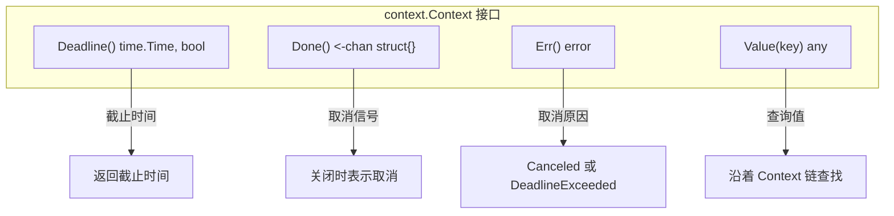
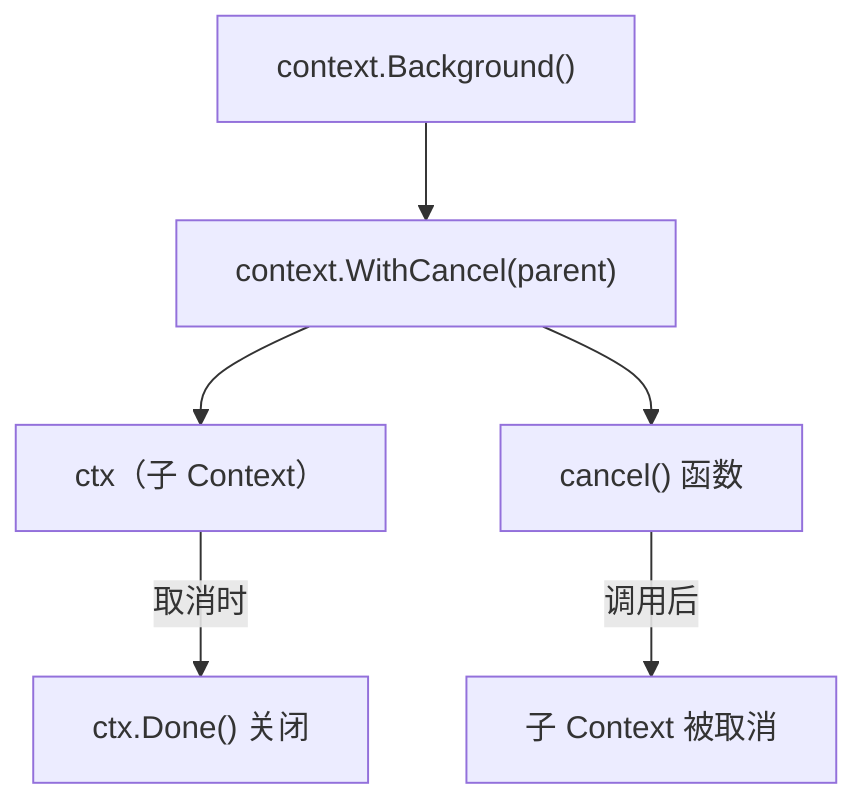
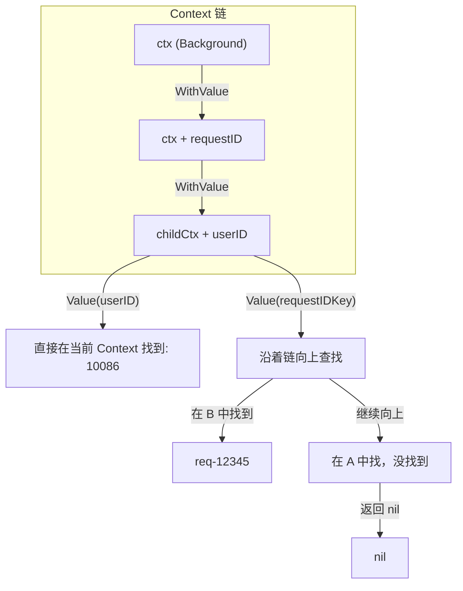
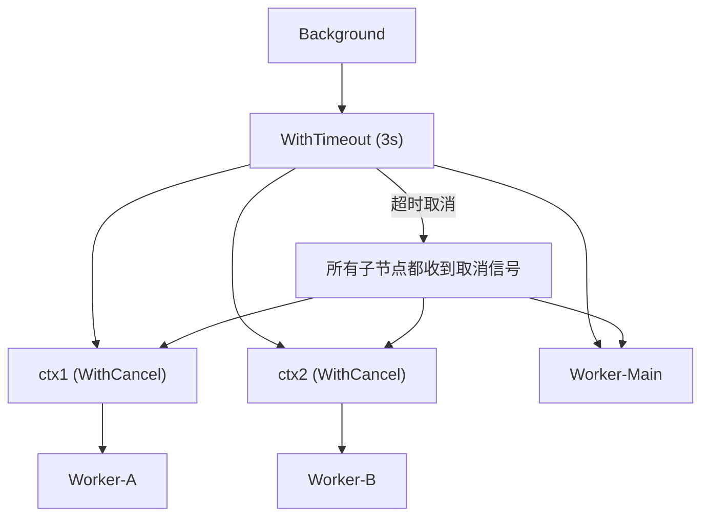

+++
title = "第 24 章：上下文管理——context 包"
weight = 240
date = "2026-03-30T13:43:00+08:00"
type = "docs"
description = ""
isCJKLanguage = true
draft = false
+++
# 第 24 章：上下文管理——context 包

> 想象一个场景：你点了一份外卖，骑手正在路上，但突然你不想要了——这时候你需要一种机制，能够让骑手停止配送。在 Go 的世界里，`context` 包就是那个「外卖取消按钮」，让你能够在合适的时机优雅地停止正在进行的操作。
>
> context 包是 Go 语言中最容易被低估的包之一。它不仅仅是一个传递数据的容器，更是一套完善的取消信号传播机制。掌握它，你就能写出更健壮、更可控的 Go 程序。

---

## 24.1 context 包解决什么问题

在真实的系统开发中，我们经常会遇到这样的困境：

- **Web 请求可能超时需要取消**：用户发起了一个请求，后端需要调用多个微服务，但如果用户等不及了关闭了页面，这些正在进行的调用应该被取消，否则就是浪费资源。
- **数据库查询可能需要截止时间**：一个 SQL 查询如果超过 5 秒还没返回结果，大概率是出问题了，应该果断放弃。
- **请求 ID 需要传递**：一个请求从网关到微服务到数据库，日志里需要串联起整个链路，这就需要传递请求级别的元数据。

如果没有 context，我们可能需要：

1. 在每个函数里加一个 `cancel` 频道参数
2. 在每个层级手动传递 `deadline`
3. 用全局 map 存储请求级别的数据

这样做的结果是：**每个函数签名都变得又臭又长，而且取消逻辑散落得到处都是**。

context 包就是来解决这个问题的——它提供了一种**统一的方式**来传递取消信号、截止时间和请求级别的数据，而且这一切都可以通过一个简单的 `context.Context` 接口来完成。

```go
// 没有 context 的世界，每个函数都要加一堆参数
func QueryUser(userID string, cancel chan struct{}, deadline time.Time, requestID string) {
    // 参数列表长得让人窒息
}

// 有 context 的世界，一切都很优雅
func QueryUser(ctx context.Context, userID string) {
    // 简洁、清晰、可组合
}
```

**核心概念**：`context` 包的核心思想是**将取消信号和元数据绑定到一个「上下文」对象上**，然后让这个对象在调用链中流动。每个函数都能从这个对象中获取自己需要的信息，同时也能感知到「外面」是否要求取消。

---

## 24.2 context 核心原理：Context 接口

`context.Context` 是整个 context 包的核心，它是一个接口，定义了四个方法：

```go
type Context interface {
    // Deadline 返回这个 Context 的截止时间
    // 如果没有设置截止时间，ok 返回 false
    Deadline() (deadline time.Time, ok bool)

    // Done 返回一个关闭的频道，当 Context 被取消时会关闭
    // 如果这个 Context 永远不会被取消，返回 nil
    Done() <-chan struct{}

    // Err 返回 Context 被取消的原因
    // 如果 Done() 还没关闭，返回 nil
    Err() error

    // Value 返回这个 Context 中存储的值
    // 如果没有这个值，返回 nil
    Value(key any) any
}
```

### 方法详解

| 方法 | 返回值 | 作用 |
|------|--------|------|
| `Deadline()` | `(time.Time, bool)` | 返回截止时间，bool 表示是否设置了截止时间 |
| `Done()` | `<-chan struct{}` | 返回一个频道，当 Context 被取消时关闭 |
| `Err()` | `error` | 返回取消原因：`Canceled` 或 `DeadlineExceeded` |
| `Value()` | `any` | 根据 key 查询存储的值 |

### 接口方法对应的 Mermaid 图



**为什么 Done() 返回的是 `<-chan struct{}` 而不是 `<-chan bool>`？**

因为 `struct{}` 是 Go 中最节省内存的类型，不占用任何实际空间（0 字节）。用它来做信号量再合适不过了——我们只关心频道是否关闭，不关心里面有什么值。

---

## 24.3 context.Background：创建根 Context

`context.Background()` 是最常用的创建根 Context 的方式。它是一个**空的、永远不会被取消的 Context**。

```go
func main() {
    // context.Background() 返回一个 nil 错误的 Context
    // 它是整个 Context 树的根，通常作为请求的入口点
    ctx := context.Background()

    fmt.Println("Context:", ctx)
    fmt.Println("Deadline:", ctx.Deadline())
    // 输出: Deadline: 0001-01-01 00:00:00 +0000 UTC, false
    fmt.Println("Done 通道:", ctx.Done())  // 输出: nil（永远不会被取消）
    fmt.Println("Err:", ctx.Err())  // 输出: nil
}
```

**什么时候用 Background？**

- 程序的入口点（如 `main` 函数）
- 最高层的请求处理器
- 单元测试
- 任何需要作为根节点的地方

**记住**：Background 永远不会取消，你可以在它基础上派生出可取消的子 Context。

---

## 24.4 context.TODO：临时占位 Context

`context.TODO()` 和 `context.Background()` 长得几乎一模一样，但用途完全不同。顾名思义，**TODO 就是「还没想好用什么 Context」的占位符**。

```go
func main() {
    // TODO 和 Background 在功能上几乎一样
    // 但语义不同：TODO 表示"将来会替换成合适的 Context"
    ctx := context.TODO()

    fmt.Println("Context:", ctx)
    fmt.Println("Done 通道:", ctx.Done())
}
```

**使用场景**：

```go
// 假设这个函数还没确定如何获取 Context
func processData(data string) error {
    // 这里还不知道该用 Background 还是从参数传入
    // 所以先用 TODO 占位，后续重构时会改成正确的 Context
    ctx := context.TODO()

    return fetchFromDB(ctx, data)
}
```

**最佳实践**：在代码中搜索 `TODO()`，确保它们最终都被替换成正确的 Context 来源。如果代码里有太多 `TODO()`，说明你的架构设计还需要改进。

---

## 24.5 context.WithCancel：创建可取消 Context

`context.WithCancel(parent)` 从父 Context 创建一个**可取消的子 Context**。当你调用返回的 `cancel` 函数时，这个子 Context 就会被取消。

```go
func main() {
    // 从 Background 创建可取消 Context
    ctx, cancel := context.WithCancel(context.Background())

    // 在另一个 goroutine 中模拟工作
    go func() {
        for {
            select {
            case <-ctx.Done():
                fmt.Println("工作被取消，退出")
                return
            default:
                fmt.Println("工作中...")
                time.Sleep(500 * time.Millisecond)
            }
        }
    }()

    // 主函数等待 2 秒后取消
    time.Sleep(2 * time.Second)
    fmt.Println("调用取消函数")
    cancel()

    // 等待一下让 goroutine 收到信号
    time.Sleep(500 * time.Millisecond)
}
```

**输出**：

```
工作中...
工作中...
工作中...
工作中...
工作中...
工作中...
工作中...
工作中...
调用取消函数
工作被取消，退出
```

### WithCancel 的 Mermaid 图



**cancel 函数**：一个 `cancel` 函数可以取消多个 Context。合理使用可以减少资源泄漏。

---

## 24.6 context.WithDeadline：创建带截止时间的 Context

`context.WithDeadline(parent, time)` 创建一个**在指定时间自动取消**的 Context。当系统时间到达截止时间时，Context 会自动取消。

```go
func main() {
    // 创建一个 3 秒后截止的 Context
    deadline := time.Now().Add(3 * time.Second)
    ctx, cancel := context.WithDeadline(context.Background(), deadline)
    defer cancel()  // 别忘了清理资源

    fmt.Printf("当前时间: %v\n", time.Now().Format("15:04:05.000"))
    fmt.Printf("截止时间: %v\n", deadline.Format("15:04:05.000"))

    i := 0
    for {
        i++
        select {
        case <-ctx.Done():
            fmt.Printf("Context 已取消: %v（第 %d 次循环后）\n", ctx.Err(), i)
            return
        default:
            fmt.Printf("执行任务 %d...\n", i)
            time.Sleep(1 * time.Second)
        }
    }
}
```

**输出**：

```
当前时间: 14:30:00.000
截止时间: 14:30:03.000
执行任务 1...
执行任务 2...
执行任务 3...
Context 已取消: context deadline exceeded（第 3 次循环后）
```

**适用场景**：

- 数据库查询的最长时间限制
- 外部 API 调用的超时
- 批处理任务的整体时间限制

---

## 24.7 context.WithTimeout：创建带超时的 Context

`context.WithTimeout(parent, duration)` 实际上是 `WithDeadline` 的语法糖。它接受一个**时间间隔**而不是绝对时间，内部会自动计算截止时间。

```go
func main() {
    // 创建一个 5 秒超时的 Context
    // WithTimeout(parent, duration) 等价于 WithDeadline(parent, time.Now().Add(duration))
    ctx, cancel := context.WithTimeout(context.Background(), 5*time.Second)
    defer cancel()

    fmt.Println("超时 Context 已创建，5 秒后将自动取消")

    for {
        select {
        case <-ctx.Done():
            fmt.Printf("超时触发: %v\n", ctx.Err())
            return
        default:
            fmt.Println("处理中...")
            time.Sleep(1 * time.Second)
        }
    }
}
```

**WithTimeout vs WithDeadline 选择指南**：

| 函数 | 参数类型 | 适用场景 |
|------|----------|----------|
| `WithTimeout` | `time.Duration` | 相对时间，如「5 秒后」 |
| `WithDeadline` | `time.Time` | 绝对时间，如「下午 3 点」 |

**实际使用**：

```go
// HTTP 服务中设置请求超时
func handler(w http.ResponseWriter, r *http.Request) {
    // 创建 10 秒超时的 Context
    ctx, cancel := context.WithTimeout(r.Context(), 10*time.Second)
    defer cancel()

    // 将 Context 传递给实际处理逻辑
    result, err := doHeavyWork(ctx)
    if err != nil {
        http.Error(w, err.Error(), 500)
        return
    }

    w.Write(result)
}
```

---

## 24.8 context.WithCancelCause（Go 1.21+）：支持传递取消原因的 WithCancel

Go 1.21 引入了 `context.WithCancelCause` 和 `Cause()` 方法，这让取消原因的传递变得轻而易举。

```go
func main() {
    ctx, cancel := context.WithCancelCause(context.Background())

    go func() {
        // 模拟一个操作失败
        time.Sleep(2 * time.Second)
        // 传递具体的取消原因
        cancel(errors.New("数据库连接失败：connection refused"))
    }()

    <-ctx.Done()

    // Cause() 返回传递给 cancel 的具体错误
    fmt.Printf("取消原因: %v\n", context.Cause(ctx))
}
```

**输出**：

```
取消原因: 数据库连接失败：connection refused
```

### WithCancel vs WithCancelCause 对比

```go
// WithCancel：只能知道「被取消了」，不知道为什么
ctx1, cancel1 := context.WithCancel(context.Background())
// ...
cancel1()  // 只能取消，无法传递原因

// WithCancelCause：不仅能取消，还能传递一个错误作为原因
ctx2, cancel2 := context.WithCancelCause(context.Background())
// ...
cancel2(errors.New("操作失败的具体原因"))  // 取消并附带原因
```

**使用场景**：当你不只是要取消一个操作，还需要知道**为什么取消**的时候，用 `WithCancelCause`。

---

## 24.9 context.WithValue：创建带值的 Context

`context.WithValue(parent, key, value)` 创建一个**携带键值对的子 Context**。子 Context 可以从父 Context 继承值，也可以覆盖父 Context 的值。

```go
// 定义一个非导出的 key 类型（这是最佳实践，后面会详细讲）
type requestIDKey struct{}

func main() {
    ctx := context.Background()

    // 存储请求 ID
    ctx = context.WithValue(ctx, requestIDKey{}, "req-12345")

    // 在子 Context 中存储用户 ID
    childCtx := context.WithValue(ctx, "userID", 10086)

    // 读取值
    reqID := childCtx.Value(requestIDKey{})
    userID := childCtx.Value("userID")

    fmt.Printf("请求 ID: %v\n", reqID)
    fmt.Printf("用户 ID: %v\n", userID)

    // 从父 Context 也能读取到值
    fmt.Printf("从父 Context 读取请求 ID: %v\n", ctx.Value(requestIDKey{}))
}
```

**输出**：

```
请求 ID: req-12345
用户 ID: 10086
从父 Context 读取请求 ID: req-12345
```

### Value 查找的 Mermaid 图



---

## 24.10 Context.Done()：返回取消信号频道

`Done()` 方法返回一个**只读的频道**。当 Context 被取消（主动取消或超时）时，这个频道会被关闭。

```go
func simulateTask(ctx context.Context, name string) {
    for {
        select {
        case <-ctx.Done():
            fmt.Printf("[%s] 收到取消信号，退出: %v\n", name, ctx.Err())
            return
        default:
            fmt.Printf("[%s] 工作中...\n", name)
            time.Sleep(500 * time.Millisecond)
        }
    }
}

func main() {
    ctx, cancel := context.WithTimeout(context.Background(), 2*time.Second)
    defer cancel()

    go simulateTask(ctx, "任务A")
    go simulateTask(ctx, "任务B")

    <-ctx.Done()
    fmt.Printf("主流程结束: %v\n", ctx.Err())
}
```

**输出**：

```
[任务A] 工作中...
[任务B] 工作中...
[任务A] 工作中...
[任务B] 工作中...
[任务A] 工作中...
[任务B] 工作中...
[任务A] 工作中...
[任务B] 工作中...
[任务A] 收到取消信号，退出: context deadline exceeded
[任务B] 收到取消信号，退出: context deadline exceeded
主流程结束: context deadline exceeded
```

**核心模式**：`select { case <-ctx.Done(): ... }` 是检测 Context 取消的标准方式。

---

## 24.11 Context.Err()：返回取消原因

`Err()` 方法返回 Context 被取消的原因。如果 Context 没有被取消，返回 `nil`。

```go
func main() {
    // 测试主动取消
    ctx1, cancel1 := context.WithCancel(context.Background())
    cancel1()
    fmt.Printf("主动取消: %v\n", ctx1.Err())
    // 输出: 主动取消: context canceled

    // 测试超时取消
    ctx2, cancel2 := context.WithTimeout(context.Background(), 1*time.Millisecond)
    defer cancel2()
    time.Sleep(10 * time.Millisecond)
    fmt.Printf("超时取消: %v\n", ctx2.Err())
    // 输出: 超时取消: context deadline exceeded

    // 未取消的 Context
    ctx3 := context.Background()
    fmt.Printf("未取消: %v\n", ctx3.Err())
    // 输出: 未取消: <nil>
}
```

**两个标准的取消原因**：

| 常量 | 含义 | 触发场景 |
|------|------|----------|
| `context.Canceled` | 主动取消 | 调用了 `cancel()` 函数 |
| `context.DeadlineExceeded` | 超时取消 | 超过了截止时间 |

---

## 24.12 Context.Deadline()：返回截止时间

`Deadline()` 返回 Context 的截止时间。如果未设置截止时间，返回 `(time.Time{}, false)`。

```go
func main() {
    // 无截止时间的 Context
    ctx1 := context.Background()
    deadline, ok := ctx1.Deadline()
    fmt.Printf("Background - 截止时间: %v, 已设置: %v\n", deadline, ok)
    // 输出: Background - 截止时间: 0001-01-01 00:00:00 +0000 UTC, 已设置: false

    // 有截止时间的 Context
    ctx2, _ := context.WithDeadline(context.Background(), time.Now().Add(5*time.Second))
    deadline, ok = ctx2.Deadline()
    fmt.Printf("WithDeadline - 截止时间: %v, 已设置: %v\n", deadline.Format(time.RFC3339), ok)
    // 输出: WithDeadline - 截止时间: 2024-01-15T10:30:00+08:00, 已设置: true
}
```

**使用场景**：当你需要知道操作的最晚完成时间时，可以从 Context 中获取。比如定时任务调度、缓存过期判断等。

---

## 24.13 Context.Value：获取存储的值

`Value(key)` 方法用于从 Context 中获取值。它会沿着 Context 链**从当前节点向父节点递归查找**。

```go
func main() {
    // 构建一个 Context 链
    level1 := context.WithValue(context.Background(), "level", 1)
    level2 := context.WithValue(level1, "level", 2)
    level3 := context.WithValue(level2, "level", 3)

    // 当前 Context 有值，直接返回
    fmt.Printf("level3.Value('level') = %v\n", level3.Value("level"))
    // 输出: 3

    // 当前 Context 没有，往上找
    fmt.Printf("level3.Value('name') = %v\n", level3.Value("name"))
    // 输出: <nil>

    // 从父节点查找
    fmt.Printf("level2.Value('level') = %v\n", level2.Value("level"))
    // 输出: 1
}
```

**查找规则**：先在当前 Context 查找，如果没有找到，继续在父 Context 中查找，递归向上，直到找到或者到达根节点（返回 `nil`）。

---

## 24.14 取消传播机制：Context 最重要的特性

Context 的取消机制具有**树形传播**特性：**当父 Context 被取消时，所有派生的子 Context 都会被取消**。这是 Context 最强大的特性。

```go
func worker(ctx context.Context, name string) {
    for {
        select {
        case <-ctx.Done():
            fmt.Printf("[%s] 被取消了: %v\n", name, ctx.Err())
            return
        default:
            fmt.Printf("[%s] 工作中...\n", name)
            time.Sleep(300 * time.Millisecond)
        }
    }
}

func main() {
    // 创建父 Context，超时 3 秒
    ctx, cancel := context.WithTimeout(context.Background(), 3*time.Second)
    defer cancel()

    // 创建两个子 Context
    ctx1, _ := context.WithCancel(ctx)
    ctx2, _ := context.WithCancel(ctx)

    // 启动多个 worker
    go worker(ctx1, "Worker-A")
    go worker(ctx2, "Worker-B")
    go worker(ctx, "Worker-Main")

    // 等待 Context 取消
    <-ctx.Done()
    fmt.Println("父 Context 已超时，所有子 Context 都会被取消")
    time.Sleep(1 * time.Second)
}
```

### 取消传播的 Mermaid 图



**取消传播的威力**：想象一个复杂的微服务调用链：

1. 网关接收请求，创建一个带超时的 Context
2. 调用 Service A，Service A 创建子 Context
3. Service A 调用 Service B，Service B 创建子 Context
4. 如果网关超时取消，所有正在进行的 Service 调用都会被自动取消

这就是 Context 的「取消信号沿着树向上传播」机制。

---

## 24.15 key 的设计规范：非导出类型作为 key

Context 的 `Value()` 是**按指针相等（`==`）来比较 key 的**。这意味着，如果两个不同的包都使用字符串 `"requestID"` 作为 key，它们实际上会冲突！

### 错误示例：不同包的 key 冲突

```go
// package A
ctx := context.WithValue(ctx, "requestID", "123")

// package B（假设也用了 "requestID" 作为 key）
// 在 package A 的 Context 上调用 package B 的方法
// B 也想通过 "requestID" 存自己的值
ctx2 := context.WithValue(ctx, "requestID", "456") // 覆盖了 A 的值！
```

### 正确示例：使用非导出的类型作为 key

```go
// 在你的包里定义一个非导出的 key 类型
type contextKey string

// 或者更推荐：使用 struct{} 作为 key，定义多个常量
type key int

const (
    requestIDKey key = iota
    userIDKey
    traceIDKey
)

// 使用时
ctx := context.WithValue(ctx, requestIDKey, "req-123")
```

### 完整的最佳实践示例

```go
package mypkg

// 定义非导出的 key 类型
type contextKey string

// 定义包级别的 key 常量
const (
    requestIDKey contextKey = "request-id"
    userIDKey    contextKey = "user-id"
)

// GetRequestID 安全地获取请求 ID
func GetRequestID(ctx context.Context) string {
    if v := ctx.Value(requestIDKey); v != nil {
        return v.(string)
    }
    return ""
}

// WithRequestID 存储请求 ID
func WithRequestID(ctx context.Context, requestID string) context.Context {
    return context.WithValue(ctx, requestIDKey, requestID)
}
```

**核心原则**：永远不要用字符串、int 等内建类型作为 Context 的 key，因为它们可能被不同的库覆盖。创建一个**非导出的自定义类型**作为 key，是避免冲突的最佳方式。

---

## 24.16 错误用法：用 WithValue 传递可选参数

**WithValue 不是用来传递可选参数的！** 这是一个常见的误解。

### 错误示例：把 Context 当成「可选参数包」

```go
// 错误的做法
func fetchUser(ctx context.Context, id int) (*User, error) {
    // 错误：把 userID 当作可选参数存在 Context 里
    if userID := ctx.Value("currentUserID"); userID != nil {
        fmt.Printf("操作者: %v\n", userID)
    }
    return db.QueryUser(id)
}
```

**为什么这是错的？**

1. **类型不安全**：所有值都是 `any`，编译器无法检查类型
2. **难以调试**：值的来源不明确，容易产生困惑
3. **语义混乱**：Context 应该代表「请求的上下文」，而不是「参数容器」

### 正确做法：明确传递参数

```go
// 正确的做法
func fetchUser(ctx context.Context, id int, operatorID string) (*User, error) {
    fmt.Printf("操作者: %s\n", operatorID)  // 明确传递，类型安全
    return db.QueryUser(ctx, id)
}
```

### WithValue 的正确使用场景

`WithValue` 只应该用于传递**请求级别的、多个函数都需要访问的、不应该作为显式参数的元数据**：

```go
// 正确的使用场景
ctx := context.WithValue(ctx, requestIDKey, "req-123")
ctx = context.WithValue(ctx, traceIDKey, "trace-abc")

// 日志、监控、数据库等基础设施可以自动从 Context 读取
log.Info("处理请求", "requestID", ctx.Value(requestIDKey))
```

---

## 24.17 context 的使用规范

Go 官方博客和 Effective Go 中都有专门的 context 规范说明。以下是必须遵循的规则：

### 规范一：作为第一个参数传递

```go
// ✅ 正确：Context 作为第一个参数
func FetchUser(ctx context.Context, userID int) (*User, error) {
    // ...
}

// ❌ 错误：Context 作为最后一个参数
func FetchUser(userID int, ctx context.Context) (*User, error) {
    // ...
}
```

### 规范二：只在必要时传递

```go
func main() {
    ctx := context.Background()

    // ❌ 错误：每个函数都传 Context，即使它不需要
    result := process(ctx, data)

    // ✅ 正确：只在需要取消信号、截止时间或元数据时传递
    result = processWithTimeout(ctx, data)
}
```

### 规范三：不要用于可选参数

```go
// ❌ 错误
func Query(ctx context.Context, id int, trace bool) { ... }

// ✅ 正确
func Query(ctx context.Context, id int) { ... }
func QueryWithTrace(ctx context.Context, id int, traceID string) { ... }
```

### 规范四：及时取消

```go
func handler(w http.ResponseWriter, r *http.Request) {
    ctx, cancel := context.WithTimeout(r.Context(), 5*time.Second)
    defer cancel()  // 防止资源泄漏

    // 使用 ctx 处理请求
}
```

---

## 24.18 标准库中的 Context

Go 标准库大量使用了 Context，以下是几个最常见的场景：

### net/http.Request.Context()

HTTP 请求自带 Context，可以从中获取请求级别的数据和取消信号：

```go
func handleRequest(w http.ResponseWriter, r *http.Request) {
    ctx := r.Context()

    // 从 Context 中提取数据
    requestID := ctx.Value("requestID")
    fmt.Printf("处理请求: %v\n", requestID)

    select {
    case <-time.After(5 * time.Second):
        w.Write([]byte("OK"))
    case <-ctx.Done():
        fmt.Printf("请求被取消: %v\n", ctx.Err())
    }
}

func main() {
    http.HandleFunc("/", handleRequest)
    http.ListenAndServe(":8080", nil)
}
```

### database/sql.QueryContext

数据库操作支持 Context，可以设置超时和取消：

```go
func queryWithTimeout() {
    ctx, cancel := context.WithTimeout(context.Background(), 2*time.Second)
    defer cancel()

    // QueryContext 支持 Context 参数
    rows, err := db.QueryContext(ctx, "SELECT * FROM users WHERE id = ?", 1)
    if err != nil {
        if err == context.DeadlineExceeded {
            fmt.Println("查询超时！")
        }
        return
    }
    defer rows.Close()

    // 处理结果
}
```

### os/exec.CommandContext

执行外部命令时可以用 Context 控制超时：

```go
func runCommandWithTimeout() {
    ctx, cancel := context.WithTimeout(context.Background(), 3*time.Second)
    defer cancel()

    // CommandContext 会在 Context 取消时杀死进程
    cmd := exec.CommandContext(ctx, "ping", "-n", "10", "localhost")
    output, err := cmd.CombinedOutput()

    if err != nil {
        if ctx.Err() == context.DeadlineExceeded {
            fmt.Println("命令执行超时！")
        }
        return
    }

    fmt.Printf("输出: %s\n", output)
}
```

---

## 24.19 context 的最佳实践：定期检查 Done()

最标准的 Context 使用模式是**在长操作中定期检查 `Done()` 频道**：

```go
func longRunningTask(ctx context.Context) error {
    for i := 0; i < 100; i++ {
        // 每一步都检查 Context 是否被取消
        select {
        case <-ctx.Done():
            return ctx.Err()  // 快速退出，释放资源
        default:
            // 继续执行
        }

        // 执行一些工作
        fmt.Printf("执行第 %d 步...\n", i)
        time.Sleep(200 * time.Millisecond)
    }
    return nil
}
```

### 完整示例：HTTP 服务中的 Context 使用

```go
package main

import (
    "context"
    "fmt"
    "net/http"
    "time"
)

type contextKey string

const requestIDKey contextKey = "request-id"

func middleware(next http.Handler) http.Handler {
    return http.HandlerFunc(func(w http.ResponseWriter, r *http.Request) {
        // 生成请求 ID 并存入 Context
        requestID := fmt.Sprintf("req-%d", time.Now().UnixNano())
        ctx := context.WithValue(r.Context(), requestIDKey, requestID)

        w.Header().Set("X-Request-ID", requestID)
        next.ServeHTTP(w, r.WithContext(ctx))
    })
}

func handler(w http.ResponseWriter, r *http.Request) {
    ctx := r.Context()

    // 模拟处理逻辑，定期检查取消
    for i := 0; i < 5; i++ {
        select {
        case <-ctx.Done():
            fmt.Printf("请求被取消: %v\n", ctx.Err())
            return
        case <-time.After(1 * time.Second):
            fmt.Printf("[%s] 处理中...\n", ctx.Value(requestIDKey))
        }
    }

    w.Write([]byte("处理完成"))
}

func main() {
    mux := http.NewServeMux()
    mux.HandleFunc("/", handler)

    server := &http.Server{
        Addr:    ":8080",
        Handler: middleware(mux),
    }

    fmt.Println("服务器启动在 :8080")
    server.ListenAndServe()
}
```

---

## 本章小结

本章我们深入探讨了 Go 标准库中的 `context` 包，它是 Go 并发编程中不可或缺的重要组成部分。

### 核心要点回顾

| 概念 | 说明 |
|------|------|
| **Context 接口** | 提供 `Deadline()`、`Done()`、`Err()`、`Value()` 四个方法 |
| **Background vs TODO** | Background 是真正的根 Context；TODO 是占位符 |
| **WithCancel** | 创建可手动取消的 Context |
| **WithDeadline** | 创建带绝对截止时间的 Context |
| **WithTimeout** | 创建带相对超时的 Context，是 WithDeadline 的语法糖 |
| **WithCancelCause** | Go 1.21+ 支持，可传递取消原因 |
| **WithValue** | 存储请求级别的元数据 |
| **取消传播** | 父 Context 取消，子 Context 全部取消 |
| **Key 设计** | 使用非导出类型避免不同包的 key 冲突 |

### 黄金法则

1. **把 Context 当作「取消信号 + 元数据容器」**，而不是「可选参数包」
2. **永远用非导出类型作为 WithValue 的 key**
3. **在长操作中定期检查 `Done()`**
4. **Context 应该作为第一个参数传递**
5. **及时调用 `cancel()` 或使用 `defer cancel()` 避免资源泄漏**

### Context 使用场景速查

```
┌─────────────────────────────────────────────────────────────┐
│                    何时使用 Context                          │
├─────────────────────────────────────────────────────────────┤
│ ✅ Web 请求处理和超时控制                                    │
│ ✅ 数据库查询超时                                            │
│ ✅ 外部 API 调用超时                                         │
│ ✅ 微服务调用链的取消传播                                     │
│ ✅ 传递请求 ID、trace ID 等链路追踪数据                        │
│ ❌ 不要用来传递业务可选参数                                   │
│ ❌ 不要用来替换函数返回值                                     │
└─────────────────────────────────────────────────────────────┘
```

Context 是 Go 语言「**简单、实用、可组合**」哲学的完美体现。掌握它，你就能写出更健壮、更优雅的 Go 程序。记住：**在 Go 的世界里，让取消信号流动起来，让资源及时释放，这是每个 Go 程序员的必修课**。
