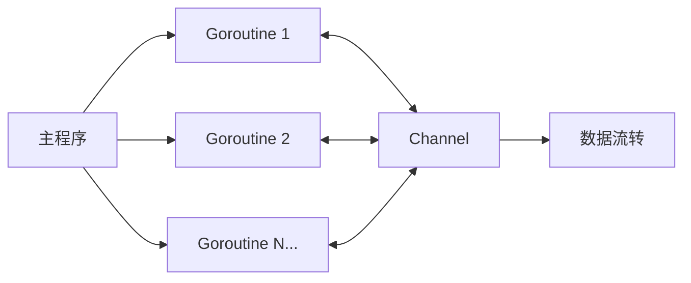
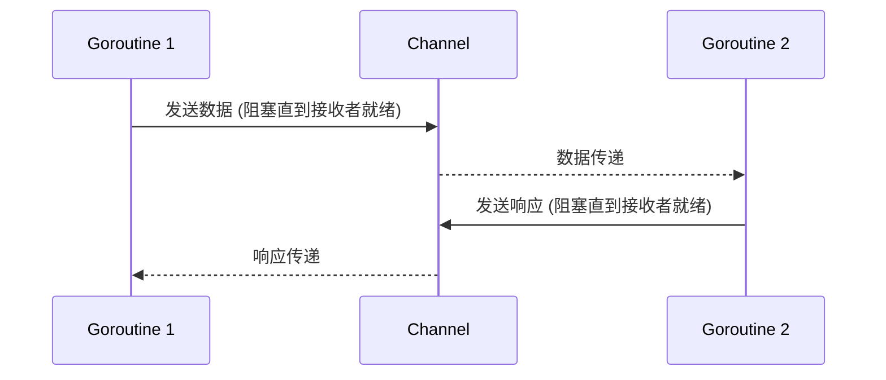
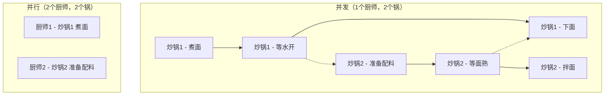
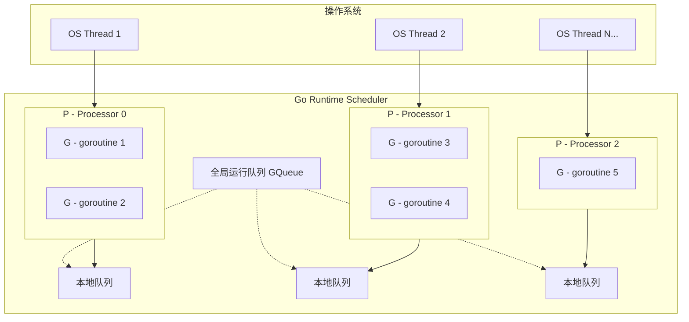
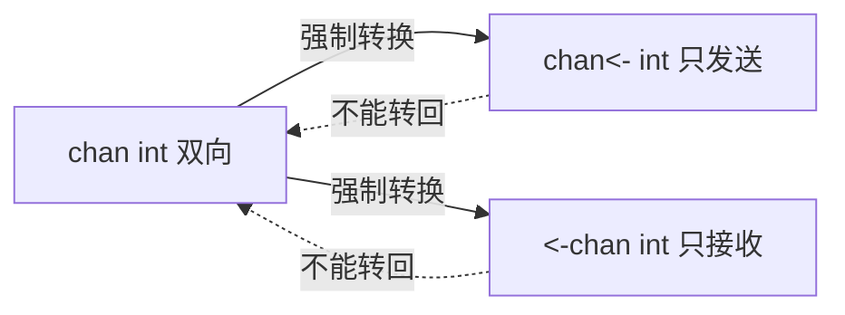
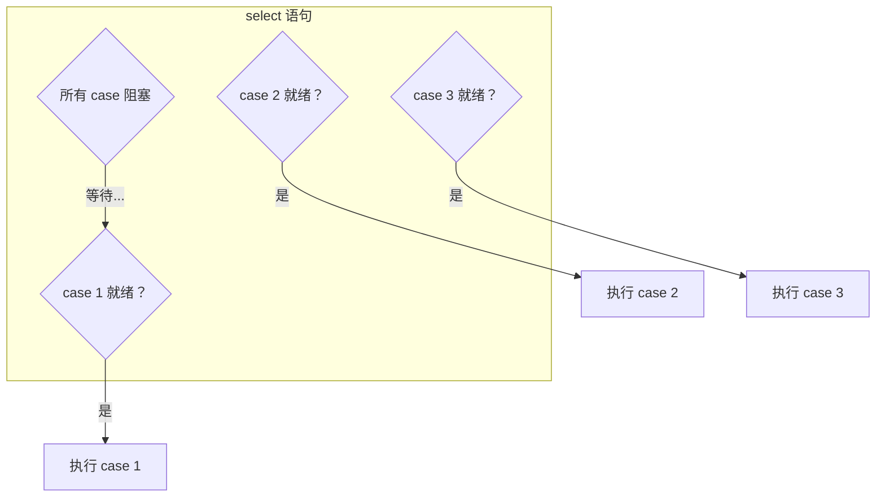
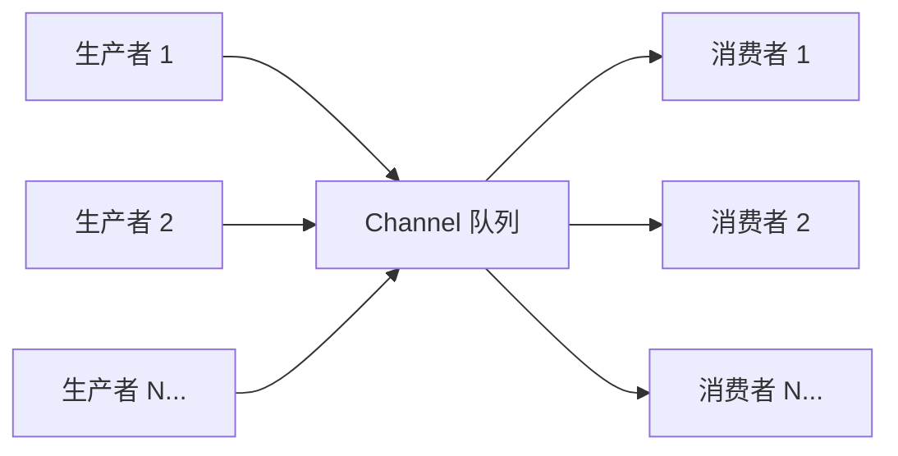
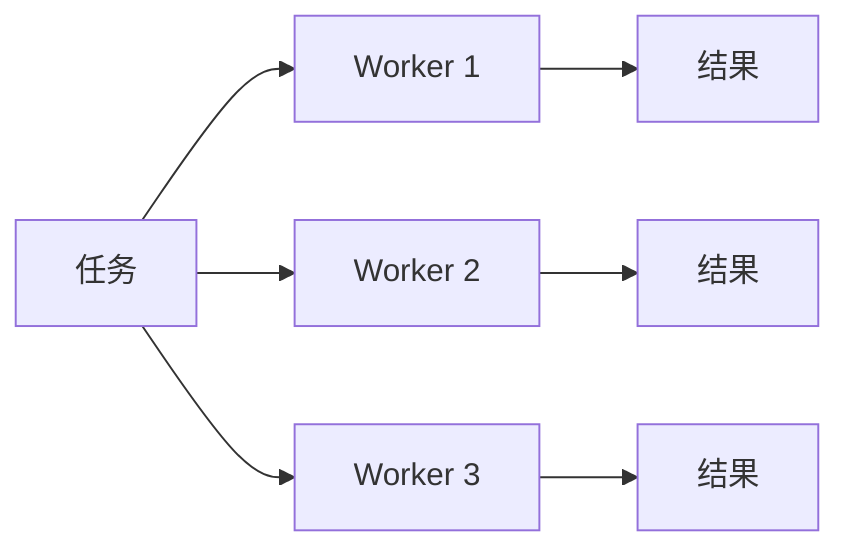
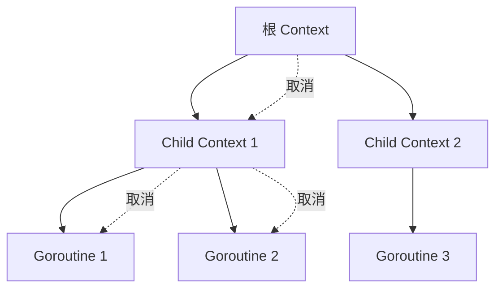
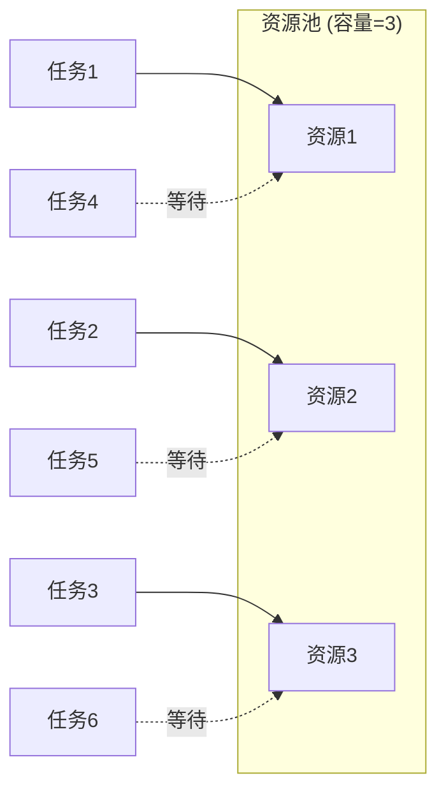

+++
title = "第 25 章：Goroutine 与 Channel ⭐"
weight = 250
date = "2026-03-30T13:43:00+08:00"
type = "docs"
description = ""
isCJKLanguage = true
draft = false
+++
# 第 25 章：Goroutine 与 Channel ⭐

> 想象一下，你是一个餐厅老板，以前只能雇一个服务员（线程），一次只能端一盘菜。但现在你可以雇无数个"小精灵"（goroutine），它们会魔法（channel）互相传递菜品，并发上菜，效率飞起！
>
> 本章将带你走进 Go 语言最酷的部分——goroutine 和 channel，让你的程序像开了挂一样，同时做 N 件事，优雅又高效！

---

## 25.1 goroutine/channel 包解决什么问题

### 🎯 问题：现代程序需要同时做很多事

你的手机 App 同时下载文件、播放音乐、响应用户点击——这些事情如果排队做，用户早就砸手机了。传统编程里，我们用线程（thread）来实现并发，但线程有几个致命缺点：

- **创建成本高**：创建一个线程要消耗 1MB 左右的内存，CPU 上下文切换也慢
- **通信复杂**：线程之间共享内存，要用锁、信号量、条件变量……代码写得像迷宫
- **容易出错**：死锁、竞态条件，debug 到怀疑人生

### 💡 Go 的答案：goroutine + channel

Go 语言说："别慌，我给你 goroutine——轻量到可以创建百万个；再给你 channel——让它们通过通信来共享数据，而不是抢同一块内存。"

简单来说，goroutine 是**并发执行单元**，channel 是它们之间的**通信桥梁**。

### 📊 一图胜千言



### 🔧 专业词汇解释

| 词汇 | 解释 |
|------|------|
| **并发（Concurrency）** | 让多个任务交替执行，在一段时间内看起来像"同时"在做 |
| **并行（Parallelism）** | 真正的同时执行，需要多个 CPU 核心 |
| **goroutine** | Go 轻量级线程，由 Go runtime 管理，创建成本极低 |
| **channel** | goroutine 之间的通信管道，类型安全 |

### 💻 代码示例

```go
package main

import (
    "fmt"
    "time"
)

func main() {
    // 启动一个 goroutine
    go sayHello() // 告诉 Go："异步执行这个函数！"

    // 主 goroutine 继续执行
    fmt.Println("主函数：我先干点别的...")
    time.Sleep(time.Second) // 等一秒，不然主函数退出会把其他 goroutine 也带走
}

func sayHello() {
    fmt.Println("你好！我是另一个 goroutine！")
}
```

```
主函数：我先干点别的...
你好！我是另一个 goroutine！
```

### 🎭 幽默一刻

> 小明问："goroutine 和线程有什么区别？"
>
> 老司机答："线程像公交车，必须按站停车；goroutine 像滴滴，随叫随走，轻便灵活！"
>
> 小明又问："那 channel 呢？"
>
> 老司机答："channel 就是滴滴司机和乘客之间的电话——告诉对方我在哪，你要什么，安全又高效！"

---

## 25.2 goroutine/channel 核心原理：CSP 模型

### 🧠 CSP 是什么

**CSP（Communicating Sequential Processes）**，即通信顺序进程，是一种并发编程模型，由 Tony Hoare 大佬在 1978 年提出。其核心思想只有一句话：

> **"不要通过共享内存来通信，而是通过通信来共享内存。"**
>
> — CSP 之父 Tony Hoare

翻译成人话：**不要一群人抢同一份文件（共享内存 + 锁），而是每人复印一份，通过快递（channel）传递。**

### 🔑 核心原则

1. **每个 goroutine 有自己的内存空间**，不共享
2. **通过 channel 发送/接收消息**来协作
3. **发送和接收是同步的**（对于无缓冲 channel），发送者阻塞直到接收者就绪

### 📊 CSP 工作流程



### 💻 代码示例

```go
package main

import "fmt"

func main() {
    // 创建一个整数类型的 channel
    ch := make(chan string)

    // goroutine 发送数据
    go func() {
        msg := "你好，主函数！"
        fmt.Println("Goroutine: 我要发送消息了！")
        ch <- msg // 发送，阻塞直到主函数接收
        fmt.Println("Goroutine: 消息发送完成！")
    }()

    // 主函数接收数据
    fmt.Println("主函数: 等待接收消息...")
    received := <-ch // 接收，阻塞直到 goroutine 发送
    fmt.Println("主函数: 收到了:", received)
}
```

```
主函数: 等待接收消息...
Goroutine: 我要发送消息了！
Goroutine: 消息发送完成！
主函数: 收到了: 你好，主函数！
```

> **注意**：输出顺序可能略有不同，因为 goroutine 调度是 Go runtime 决定的。

### 🎭 幽默一刻

> 共享内存模型就像：**一群人在同一个纸上写字，必须轮流，还得用锁防止别人写的时候你也在写。**
>
> CSP 模型就像：**每人发一张纸，写完快递给对方。不用抢，不用等，快递到了自然就同步了！**

---

## 25.3 并发 vs 并行

### 🤔 傻傻分不清？

很多人以为并发和并行是一回事，其实差别大了！

### 📊 经典比喻：厨师做饭



- **并发**：一个 CPU 核心，交替执行多个任务（看起来"同时"在做）
- **并行**：多个 CPU 核心，真正同时执行多个任务

### 🍜 经典例子：做饭

- **单核 CPU（串行）**：先煮面，面煮好了再准备配料，等死人
- **单核 CPU（并发）**：烧水的时候切菜，切换着来，总时间变短
- **多核 CPU（并行）**：一个核煮面，一个核切菜，同时进行，效率最高

### 💻 代码示例

```go
package main

import (
    "fmt"
    "runtime"
    "sync"
    "time"
)

func main() {
    // 查看 CPU 核心数
    fmt.Printf("CPU 核心数: %d\n", runtime.NumCPU())
    fmt.Printf("当前 GOMAXPROCS: %d\n", runtime.Gomaxprocs(0))

    // 并发：交替执行
    fmt.Println("\n=== 并发执行 ===")
    var wg sync.WaitGroup
    for i := 1; i <= 3; i++ {
        wg.Add(1)
        go func(id int) {
            defer wg.Done()
            for j := 1; j <= 3; j++ {
                fmt.Printf("Goroutine %d: 第 %d 次执行\n", id, j)
                time.Sleep(10 * time.Millisecond)
            }
        }(i)
    }
    wg.Wait()

    // 并行：设置 GOMAXPROCS = CPU 核心数
    fmt.Println("\n=== 并行执行（利用多核）===")
    runtime.Gomaxprocs(runtime.NumCPU()) // 设置为 CPU 核心数
    for i := 1; i <= 3; i++ {
        wg.Add(1)
        go func(id int) {
            defer wg.Done()
            for j := 1; j <= 3; j++ {
                fmt.Printf("Goroutine %d: 第 %d 次执行\n", id, j)
                time.Sleep(10 * time.Millisecond)
            }
        }(i)
    }
    wg.Wait()
}
```

```
CPU 核心数: 8
当前 GOMAXPROCS: 8

=== 并发执行 ===
Goroutine 1: 第 1 次执行
Goroutine 2: 第 1 次执行
Goroutine 3: 第 1 次执行
Goroutine 1: 第 2 次执行
Goroutine 2: 第 2 次执行
Goroutine 3: 第 2 次执行
...（交替执行）

=== 并行执行（利用多核）===
（多个核心同时执行，输出更混乱）
```

### 🎭 幽默一刻

> 面试官问："并发和并行的区别是什么？"
>
> 求职者答："并发是一个人同时吃三个馒头，并行是三个人同时吃三个馒头！"
>
> 面试官："那你解释一下 goroutine？"
>
> 求职者："goroutine 就是叫外卖，三个菜同时做，送餐员按最优路线送，你感觉三道菜同时好了！"

---

## 25.4 goroutine 的创建

### 🚀 go 语句：启动并发的大门

在 Go 中，创建 goroutine 简单到令人发指——只需要在函数调用前加一个 `go` 关键字！

### 💻 三种创建方式

```go
package main

import (
    "fmt"
    "time"
)

func main() {
    // 方式1：调用普通函数
    go sayHello()

    // 方式2：调用匿名函数
    go func() {
        fmt.Println("我是匿名 goroutine！")
    }()

    // 方式3：调用带参数的函数
    name := "Go语言"
    go sayName(name)

    // 等等，别让主函数跑太快！
    time.Sleep(time.Second)
    fmt.Println("主函数结束")
}

func sayHello() {
    fmt.Println("你好！")
}

func sayName(name string) {
    fmt.Printf("我是 %s\n", name)
}
```

```
你好！
我是匿名 goroutine！
我是 Go语言
主函数结束
```

### 🎯 关键点

1. `go` 关键字后面必须是**函数调用**
2. goroutine 启动后**立即返回**，不会等待函数执行完成
3. 主函数退出时，所有 goroutine 会被强制终止（所以上面的例子用了 `time.Sleep`）

### 🎭 幽默一刻

> 新手问："为什么我的 goroutine 没执行？"
>
> 老鸟答："因为你的主函数跑完了，你的 goroutine 还没来得及穿上裤子！"
>
> 新手："那怎么办？"
>
> 老鸟："用 `sync.WaitGroup`，或者让主函数等等它！"

---

## 25.5 GMP 模型：Go Runtime 的调度核心

### 🏭 GMP 是什么

Go 的并发哲学很美好，但总得有人来安排这些 goroutine 吧？这就是 **GMP 模型**——Go runtime 的调度器。

| 字母 | 全称 | 角色 |
|------|------|------|
| **G** | Goroutine | 你写的并发函数，轻量级执行单元 |
| **M** | Machine（OS Thread） | 真正的系统线程，由 OS 管理 |
| **P** | Processor | 逻辑处理器，掌管运行队列 |

### 📊 GMP 架构图



### 🔑 工作原理

1. **P（Processor）** 有自己的**本地运行队列**，存着等待执行的 G（goroutine）
2. **M（Machine）** 是真正的线程，绑定到 P，从 P 的队列里拿 G 执行
3. **G（goroutine）** 执行时会创建 M，M 会从其他 P 偷任务（**work stealing**）
4. 如果 P 的队列空了，M 会从全局队列或其他 P 偷 goroutine 来执行

### 💻 代码示例：观察 GOMAXPROCS

```go
package main

import (
    "fmt"
    "runtime"
    "sync"
    "time"
)

func main() {
    // GOMAXPROCS 默认等于 CPU 核心数
    fmt.Printf("GOMAXPROCS: %d\n", runtime.Gomaxprocs(0))

    // 创建一个 channel 来同步
    done := make(chan bool)

    for i := 0; i < 3; i++ {
        go func(id int) {
            fmt.Printf("Goroutine %d 正在执行\n", id)
            time.Sleep(100 * time.Millisecond)
            done <- true
        }(i)
    }

    // 等待所有 goroutine 完成
    for i := 0; i < 3; i++ {
        <-done
    }
    fmt.Println("所有 goroutine 完成！")
}
```

```
GOMAXPROCS: 8
Goroutine 0 正在执行
Goroutine 1 正在执行
Goroutine 2 正在执行
所有 goroutine 完成！
```

### 🎭 幽默一刻

> GMP 模型就像一个**现代化的快递公司**：
>
> - **G** 是**包裹**（你的任务）
> - **M** 是**快递员**（干活的线程）
> - **P** 是**电动车**（处理器，有自己的送货路线）
>
> 快递公司根据订单量动态调配快递员和电动车，保证效率最大化！

---

## 25.6 goroutine 的栈：从小身材到大胃王

### 📦 初始大小：2KB

goroutine 的栈不是固定大小的！它像一个**弹性气球**，开始只有 2KB 小巧玲珑，但随着函数调用层级加深，它会自动"吹大"。

### 🔬 专业术语

| 术语 | 解释 |
|------|------|
| **栈（Stack）** | 函数调用时存放局部变量、返回地址的内存区域 |
| **栈帧（Stack Frame）** | 一次函数调用在栈上占用的空间 |
| **栈扩容（Stack Split）** | 栈不够用时，Go runtime 自动分配更大的栈 |

### 💻 代码示例：观察栈扩容

```go
package main

import (
    "fmt"
    "runtime"
)

// 使用闭包递归，大量函数调用
func main() {
    // 打印初始栈大小（对用户不直接可见，用 GODEBUG 看）
    fmt.Println("程序运行中，goroutine 栈会动态增长...")

    // 创建一个会递归调用的 goroutine
    go deepRecursion(1)

    // 防止主函数退出
    select {}
}

func deepRecursion(n int) {
    if n%1000 == 0 {
        fmt.Printf("递归深度: %d, 当前 goroutine 数量: %d\n", n, runtime.NumGoroutine())
    }
    deepRecursion(n + 1) // 无限递归，栈会不断增长
}
```

```
递归深度: 1000, 当前 goroutine 数量: 2
递归深度: 2000, 当前 goroutine 数量: 2
递归深度: 3000, 当前 goroutine 数量: 2
...
```

> **注意**：这个程序会无限增长直到内存耗尽！仅用于演示，正常不要这么写。

### 📊 栈增长示意图

```
初始栈（2KB）
┌─────────────────┐
│  main()         │
│  ├─ f1()        │
│  │  └─ f2()     │
│  │     └─ ...  │
└─────────────────┘

扩容后（可能 4KB, 8KB...最大 1GB）
┌─────────────────────────────────┐
│  main()                         │
│  ├─ f1()                        │
│  │  └─ f2()                     │
│  │     └─ ...（更深的递归）     │
└─────────────────────────────────┘
```

### 🆚 对比：goroutine vs 线程栈

| 特性 | goroutine 栈 | 线程栈 |
|------|-------------|--------|
| 初始大小 | 2KB | 1MB（通常） |
| 最大大小 | 1GB（可动态增长） | 固定 |
| 创建数量 | 轻松创建百万个 | 受内存限制，几千个就顶天 |
| 管理方 | Go runtime | 操作系统 |

### 🎭 幽默一刻

> 线程的栈像**买房**：一开始就要买一大块（1MB），不管你用不用。
>
> goroutine 的栈像**租房**：先租个小房子（2KB），不够住了再换大的（动态扩容），灵活又省钱！

---

## 25.7 goroutine 的退出：优雅退场还是意外离场

### 👋 三种退出方式

goroutine 的退出方式有三种，各有各的脾气：

1. **自然结束**：函数执行完毕，正常返回
2. **`runtime.Goexit()`**：主动喊停，干净利落
3. **`panic`**：出了大事，同归于尽（但只炸自己，不炸别人）

### 💻 代码示例

```go
package main

import (
    "fmt"
    "runtime"
    "sync"
    "time"
)

func main() {
    var wg sync.WaitGroup

    // 方式1：自然结束
    wg.Add(1)
    go func() {
        defer wg.Done()
        fmt.Println("Goroutine 1: 我正常执行完就退出了～")
    }()

    // 方式2：runtime.Goexit()
    wg.Add(1)
    go func() {
        defer wg.Done()
        fmt.Println("Goroutine 2: 收到退出信号，准备离场...")
        runtime.Goexit() // 立即退出
        fmt.Println("Goroutine 2: 这行不会执行！")
    }()

    // 方式3：panic（只会影响自己，不会传播）
    wg.Add(1)
    go func() {
        defer wg.Done()
        defer func() {
            if r := recover(); r != nil {
                fmt.Printf("Goroutine 3: 捕获到 panic: %v，已恢复！\n", r)
            }
        }()
        fmt.Println("Goroutine 3: 啊，我要 panic 了！")
        panic("炸了炸了！")
    }()

    wg.Wait()
    fmt.Println("主函数：大家都退出了，我也收工！")
}
```

```
Goroutine 1: 我正常执行完就退出了～
Goroutine 2: 收到退出信号，准备离场...
Goroutine 3: 啊，我要 panic 了！
Goroutine 3: 捕获到 panic: 炸了炸了！，已恢复！
主函数：大家都退出了，我也收工！
```

### 🔑 关键点：panic 不传染

这是 Go 设计的一个安全特性：**goroutine 里的 panic 不会传播到其他 goroutine**。每个 goroutine 都是独立的"炸弹"，自己炸了自己收拾，不会拉着别人一起陪葬。

### 🎭 幽默一刻

> Go 语言的 panic 像**新冠**：传染性很强（在同一个 goroutine 内传播）。
>
> 但每个 goroutine 都是独立的"隔离区"，一个隔离区炸了不影响其他隔离区。Go runtime 会负责收拾隔离区内的残局（如果没有 recover 就会波及整个程序）。

---

## 25.8 goroutine 泄漏：隐形的内存杀手

### 🕳️ 什么是泄漏

**goroutine 泄漏**（Goroutine Leak）：goroutine 创建后，因为某种原因永久阻塞或死循环，既不退出也不释放资源，就像一个永远不关的水龙头，内存持续流失。

### 💻 代码示例：故意泄漏

```go
package main

import (
    "fmt"
    "runtime"
    "time"
)

func main() {
    // 泄漏的 goroutine：往 nil channel 发送，永远阻塞
    leak := func() {
        ch := make(chan int)
        go func() {
            <-ch // 从 nil channel 接收，永远阻塞
        }()
    }

    // 创建一些泄漏的 goroutine
    for i := 0; i < 5; i++ {
        go leak()
    }

    // 观察 goroutine 数量
    fmt.Printf("初始 goroutine 数量: %d\n", runtime.NumGoroutine())

    time.Sleep(2 * time.Second)
    fmt.Printf("2秒后 goroutine 数量: %d（应该有明显增长）\n", runtime.NumGoroutine())

    // 正常应该只有主 goroutine + timer goroutine
    // 但我们创建了泄漏的，这里会显示更多
}
```

```
初始 goroutine 数量: 3
2秒后 goroutine 数量: 8（应该有明显增长）
```

### 🛡️ 避免泄漏的技巧

1. **使用 context 取消**：通过 `ctx.Done()` 通知 goroutine 退出
2. **使用 channel 关闭**：关闭 channel 会让所有阻塞的接收操作返回零值
3. **使用 sync.WaitGroup**：确保所有 goroutine 完成后再退出

### 💻 正确做法：context 取消

```go
package main

import (
    "context"
    "fmt"
    "time"
)

func main() {
    ctx, cancel := context.WithCancel(context.Background())

    // 启动 goroutine，它会监听 context 取消
    go func() {
        for {
            select {
            case <-ctx.Done():
                fmt.Println("Goroutine: 收到取消信号，优雅退出！")
                return
            default:
                fmt.Println("Goroutine: 工作中...")
                time.Sleep(500 * time.Millisecond)
            }
        }
    }()

    time.Sleep(2 * time.Second)
    fmt.Println("主函数: 够了，让 goroutine 停下来！")
    cancel() // 发送取消信号

    time.Sleep(500 * time.Millisecond)
}
```

```
Goroutine: 工作中...
Goroutine: 工作中...
Goroutine: 工作中...
Goroutine: 工作中...
主函数: 够了，让 goroutine 停下来！
Goroutine: 收到取消信号，优雅退出！
```

### 🎭 幽默一刻

> goroutine 泄漏就像**不冲的厕所**：你以为冲了（创建了），结果堵了（永远阻塞），臭味（内存）越来越重。
>
> 所以，记得给你的 goroutine 装一个**"冲水按钮"**（context 取消或 channel 关闭）！

---

## 25.9 channel 的创建：万水千山总是情，给个 channel 行不行

### 🏗️ make(chan Type, N)

channel 用 `make` 关键字创建，基本语法：

```go
ch := make(chan 元素类型, 缓冲区大小)
```

- **N = 0**：无缓冲 channel（同步通信）
- **N > 0**：有缓冲 channel（异步通信）

### 💻 代码示例

```go
package main

import "fmt"

func main() {
    // 无缓冲 channel
    unbuffered := make(chan int)      // 等价于 make(chan int, 0)
    fmt.Printf("无缓冲 channel: %v\n", unbuffered)

    // 有缓冲 channel
    buffered := make(chan string, 3)  // 缓冲区大小为 3
    fmt.Printf("有缓冲 channel: %v\n", buffered)

    // 查看 channel 容量和长度
    fmt.Printf("缓冲 channel 容量: %d\n", cap(buffered))
    fmt.Printf("缓冲 channel 当前长度: %d\n", len(buffered))
}
```

```
无缓冲 channel: 0xc0000120a0
有缓冲 channel: 0xc000012100
缓冲 channel 容量: 3
缓冲 channel 当前长度: 0
```

### 📊 有缓冲 vs 无缓冲

```mermaid
flowchart LR
    subgraph 无缓冲["无缓冲 channel (unbuffered)"]
        A1[发送者] <-->|阻塞直到接收者就绪| B1[接收者]
    end
    
    subgraph 有缓冲["有缓冲 channel (buffered, cap=3)"]
        A2[发送者] -->|缓冲区| C1[■][■][■]
        C1 -->|取数据| B2[接收者]
    end
```

### 🎭 幽默一刻

> channel 就像**水管**：
>
> - **无缓冲**：`A 说 "我把球给你" → 一直等 B 接住才走`
> - **有缓冲**：`A 把球扔进筐里就走，B 什么时候来取都行`

---

## 25.10 无缓冲 channel：约会必须同时到场

### 💑 同步通信原理

无缓冲 channel 就像**约会**：发送者和接收者必须**同时出现**，否则一方必须等待另一方。

### 📊 约会模型

```
发送者: "我把数据准备好了！"
        ↓ 阻塞等待
接收者: "我来了，数据给我！"
        ↓ 数据传递
发送者: "给你，我走了！"
```

### 💻 代码示例

```go
package main

import (
    "fmt"
    "sync"
    "time"
)

func main() {
    ch := make(chan int) // 无缓冲 channel
    var wg sync.WaitGroup

    // 接收者 goroutine
    wg.Add(1)
    go func() {
        defer wg.Done()
        fmt.Println("接收者: 我准备好了，等待数据...")
        value := <-ch // 阻塞，直到发送者发送
        fmt.Printf("接收者: 收到数据了！值是 %d\n", value)
    }()

    // 发送者 goroutine
    time.Sleep(1 * time.Second) // 故意等一秒，让接收者先跑
    fmt.Println("发送者: 我要发送数据了！")
    ch <- 42 // 阻塞，直到接收者接收
    fmt.Println("发送者: 数据已发送，任务完成！")

    wg.Wait()
}
```

```
接收者: 我准备好了，等待数据...
发送者: 我要发送数据了！
接收者: 收到数据了！值是 42
发送者: 数据已发送，任务完成！
```

### 🔑 关键特性

- 发送和接收必须**同时就绪**才能完成
- 如果只有发送者先到，它会**阻塞等待接收者**
- 如果只有接收者先到，它会**阻塞等待发送者**

### 🎭 幽默一刻

> 无缓冲 channel 像**打电话**：
>
> - 你拨号码，必须等对方接听
> - 对方不接，你就一直等（阻塞）
> - 对方接了，你们才能聊天（通信完成）
>
> 这就是传说中的**"同步浪漫"**！

---

## 25.11 有缓冲 channel：快递柜的智慧

### 📦 异步通信原理

有缓冲 channel 就像**快递柜**：

- 发送者把数据放进快递柜（缓冲区），放满就等
- 接收者从快递柜取数据，取空就等

### 📊 快递柜模型

```
发送者 → [柜子1][柜子2][柜子3] → 接收者
         (缓冲区已满时发送者等待)
```

### 💻 代码示例

```go
package main

import (
    "fmt"
    "time"
)

func main() {
    ch := make(chan int, 3) // 缓冲区大小为 3

    // 查看初始状态
    fmt.Printf("容量: %d, 长度: %d\n", cap(ch), len(ch))

    // 发送数据（不阻塞，因为有空位）
    ch <- 1
    ch <- 2
    ch <- 3
    fmt.Printf("发送3个后 - 容量: %d, 长度: %d\n", cap(ch), len(ch))

    // 再发送会阻塞（缓冲区满）
    go func() {
        fmt.Println("Goroutine: 缓冲区有位置了，我进来了！")
        ch <- 4
        fmt.Println("Goroutine: 4 发送成功！")
    }()

    time.Sleep(100 * time.Millisecond) // 让 goroutine 开始执行
    fmt.Println("主函数: 取出一个数据:", <-ch)
    fmt.Printf("取出一个后 - 容量: %d, 长度: %d\n", cap(ch), len(ch))

    time.Sleep(100 * time.Millisecond) // 给 goroutine 机会完成
}
```

```
容量: 3, 长度: 0
发送3个后 - 容量: 3, 长度: 3
Goroutine: 缓冲区有位置了，我进来了！
主函数: 取出一个数据: 1
取出一个后 - 容量: 3, 长度: 2
Goroutine: 4 发送成功！
```

### 🔑 关键特性

| 状态 | 发送 | 接收 |
|------|------|------|
| 缓冲区有空间 | 不阻塞 | - |
| 缓冲区满 | 阻塞等待 | - |
| 缓冲区空 | - | 阻塞等待 |
| 缓冲区有数据 | - | 不阻塞 |

### 🎭 幽默一刻

> 有缓冲 channel 像**有密码锁的快递柜**：
>
> - 快递员放快递，不用等你，取件码一输就走人
> - 你什么时候有空，什么时候去取
> - 柜子满了，快递员就等（阻塞）
> - 柜子空了，你就等（阻塞）
>
> **完美异步，皆大欢喜！**

---

## 25.12 channel 的发送：数据驶向远方

### 🚢 ch <- value

发送操作使用 `<-` 运算符，把数据"驶入" channel。

### 💻 代码示例

```go
package main

import "fmt"

func main() {
    ch := make(chan string, 2)

    // 发送字符串到 channel
    ch <- "第一封信"
    fmt.Println("主函数: 已发送 '第一封信'")

    ch <- "第二封信"
    fmt.Println("主函数: 已发送 '第二封信'")

    // 缓冲区满了再发送会阻塞（这里会 deadlock，因为没有接收者）
    // ch <- "第三封信" // 如果取消注释，这段代码会 panic
    // fmt.Println("主函数: 已发送 '第三封信'") // 不会执行到

    // 接收数据（释放缓冲区空间）
    msg1 := <-ch
    fmt.Printf("收到: %s\n", msg1)

    msg2 := <-ch
    fmt.Printf("收到: %s\n", msg2)
}
```

```
主函数: 已发送 '第一封信'
主函数: 已发送 '第二封信'
收到: 第一封信
收到: 第二封信
```

### ⚠️ 注意：向已关闭的 channel 发送会 panic

```go
package main

func main() {
    ch := make(chan int)
    close(ch)
    ch <- 42 // panic: send on closed channel
}
```

### 🎭 幽默一刻

> 发送数据到 channel 像**寄快递**：
>
> - 往快递柜放东西，放得进去就成功
> - 快递柜满了？等一下（阻塞）
> - 快递柜门关了？塞不进去（panic）！
>
> **发货有风险，操作需谨慎！**

---

## 25.13 channel 的接收：数据到手

### 📥 value := <-ch

接收操作同样使用 `<-` 运算符，从 channel 中"取出"数据。

### 💻 代码示例

```go
package main

import (
    "fmt"
    "time"
)

func main() {
    ch := make(chan int, 1)

    // 接收者必须等待发送者（或者有缓冲空间）
    // 这里因为有缓冲，所以发送者不会阻塞

    go func() {
        for i := 1; i <= 3; i++ {
            fmt.Printf("发送者: 发送 %d\n", i)
            ch <- i
            time.Sleep(500 * time.Millisecond)
        }
        close(ch) // 发送完毕后关闭 channel
    }()

    // 接收所有数据
    fmt.Println("接收者: 开始接收...")
    for v := range ch { // 使用 range 遍历，直到 channel 关闭
        fmt.Printf("接收者: 收到 %d\n", v)
    }
    fmt.Println("接收者: channel 已关闭，接收完毕！")
}
```

```
接收者: 开始接收...
发送者: 发送 1
接收者: 收到 1
发送者: 发送 2
接收者: 收到 2
发送者: 发送 3
接收者: 收到 3
接收者: channel 已关闭，接收完毕！
```

### 🔑 两种接收方式

```go
// 方式1：ok-idom，接收值的同时判断 channel 是否关闭
value, ok := <-ch
if !ok {
    fmt.Println("Channel 已关闭")
}

// 方式2：只接收值，不判断
value := <-ch
```

### 🎭 幽默一刻

> 从 channel 接收数据像**收快递**：
>
> - 有快递的时候拿走（收到值）
> - 没快递的时候在快递柜前等（阻塞）
> - 快递柜被拆了（closed），你再来取只会拿到空盒子（零值 + false）
>
> **认准 ok 模式，远离空盒子！**

---

## 25.14 channel 的关闭：优雅收场

### 🔒 close(ch)

使用 `close()` 函数关闭 channel，表示"不再发送数据"。

### 💻 代码示例

```go
package main

import (
    "fmt"
    "time"
)

func main() {
    ch := make(chan int, 3)

    // 发送一些数据
    ch <- 10
    ch <- 20
    ch <- 30

    // 关闭 channel
    close(ch)
    fmt.Println("Channel 已关闭！")

    // 接收所有剩余数据
    for {
        value, ok := <-ch
        if !ok {
            fmt.Println("接收完成，channel 已关闭，ok = false")
            break
        }
        fmt.Printf("收到: %d\n", value)
    }

    // 关闭后再接收，返回零值和 false
    value, ok := <-ch
    fmt.Printf("关闭后接收 - 值: %d, ok: %v\n", value, ok)
}
```

```
Channel 已关闭！
收到: 10
收到: 20
收到: 30
接收完成，channel 已关闭，ok = false
关闭后接收 - 值: 0, ok: false
```

### 📊 关闭后的行为

| 操作 | 结果 |
|------|------|
| 发送 `ch <- x` | **panic** |
| 接收 `v, ok := <-ch` | `v` 是零值，`ok` 是 `false` |
| `for range ch` | 遍历完毕，自动退出 |

### 🎭 幽默一刻

> 关闭 channel 像**关店**：
>
> - 门上贴告示（close）
> - 店里还有存货（缓冲区数据），顾客可以继续买
> - 库存卖完（缓冲区空），顾客再来（接收）只能看到空货架（零值 + false）
> - 关门了还硬要补货（发送）？**老板报警了（panic）！**

---

## 25.15 range 遍历 channel：自动等待的艺术

### 🔄 for v := range ch

使用 `range` 遍历 channel，会自动阻塞，直到 channel 关闭。

### 💻 代码示例

```go
package main

import (
    "fmt"
    "time"
)

func main() {
    ch := make(chan string, 2)

    // 启动一个 goroutine 发送数据
    go func() {
        messages := []string{"苹果", "香蕉", "橙子", "葡萄"}
        for _, msg := range messages {
            fmt.Printf("发送: %s\n", msg)
            ch <- msg
            time.Sleep(300 * time.Millisecond)
        }
        close(ch) // 发送完毕，关闭 channel
        fmt.Println("发送者: 数据发送完毕，channel 已关闭！")
    }()

    // 使用 range 接收，自动阻塞直到 channel 关闭
    fmt.Println("接收者: 开始接收...")
    for msg := range ch {
        fmt.Printf("收到: %s\n", msg)
    }
    fmt.Println("接收者: 接收完毕！")
}
```

```
接收者: 开始接收...
发送: 苹果
收到: 苹果
发送: 香蕉
收到: 香蕉
发送: 橙子
收到: 橙子
发送: 葡萄
收到: 葡萄
发送者: 数据发送完毕，channel 已关闭！
接收者: 接收完毕！
```

### 🔑 等价写法

```go
// range 写法（简洁）
for v := range ch {
    fmt.Println(v)
}

// 等价的传统写法
for {
    v, ok := <-ch
    if !ok {
        break
    }
    fmt.Println(v)
}
```

### 🎭 幽默一刻

> `for range ch` 像**等外卖**：
>
> - 你坐在家里（阻塞）刷新配送进度
> - 外卖到了（收到数据），你去拿
> - 店家打烊（close），你刷新一看"商家已休息"（ok=false），收拾回家（退出循环）
>
> **智能等待，省心省力！**

---

## 25.16 单向 channel：只进不出，或只出不进

### 🎭 chan<- 和 <-chan

Go 允许声明**只发送**或**只接收**的 channel，通常用于函数参数，表示"我只用这个 channel 来发"或"我只用这个 channel 来收"。

### 💻 代码示例

```go
package main

import "fmt"

// producer 只发送，不能接收
func producer(ch chan<- int) {
    for i := 1; i <= 3; i++ {
        fmt.Printf("生产者: 发送 %d\n", i)
        ch <- i // 合法：发送
        // v := <-ch // 非法：编译错误
    }
}

// consumer 只接收，不能发送
func consumer(ch <-chan int) {
    for {
        v, ok := <-ch // 合法：接收
        if !ok {
            fmt.Println("消费者: channel 已关闭，退出")
            return
        }
        fmt.Printf("消费者: 收到 %d\n", v)
    }
}

func main() {
    ch := make(chan int, 2)

    go producer(ch)
    go consumer(ch)

    // 阻塞等待
    select {}
}
```

```
生产者: 发送 1
消费者: 收到 1
生产者: 发送 2
消费者: 收到 2
生产者: 发送 3
消费者: 收到 3
消费者: channel 已关闭，退出
```

### 🔑 关键特性

| 声明 | 名称 | 允许操作 |
|------|------|---------|
| `chan T` | 双向 channel | 发送 + 接收 |
| `chan<- T` | 只发送 channel | 发送 |
| `<-chan T` | 只接收 channel | 接收 |

### 📊 转换关系



### 🎭 幽默一刻

> 单向 channel 像**单向闸机**：
>
> - `chan<- int` 像**出口闸机**：只能出去（发送），不能进来
> - `<-chan int` 像**入口闸机**：只能进来（接收），不能出去
>
> **各司其职，井井有条！**

---

## 25.17 nil channel：永久阻塞的黑洞

### 🕳️ nil channel 的特性

- 对 nil channel 发送或接收会**永久阻塞**
- nil channel 不会进入 select 的就绪状态

### 💻 代码示例

```go
package main

import (
    "fmt"
    "time"
)

func main() {
    var nilCh chan int // 默认是 nil

    fmt.Println("nil channel:", nilCh)

    // 尝试从 nil channel 接收（永久阻塞）
    go func() {
        fmt.Println("Goroutine: 尝试从 nil channel 接收...")
        v := <-nilCh // 永久阻塞，永远不会执行到这里
        fmt.Println("Goroutine: 收到:", v) // 不会打印
    }()

    // 尝试向 nil channel 发送（永久阻塞）
    go func() {
        fmt.Println("Goroutine: 尝试向 nil channel 发送...")
        nilCh <- 42 // 永久阻塞，永远不会执行到这里
        fmt.Println("Goroutine: 发送成功") // 不会打印
    }()

    // select 也会跳过 nil channel
    go func() {
        select {
        case v := <-nilCh:
            fmt.Println("收到:", v) // 永远不会执行
        case <-time.After(1 * time.Second):
            fmt.Println("1秒后检测：nil channel 仍然阻塞！")
        }
    }()

    time.Sleep(2 * time.Second)
    fmt.Println("主函数: 程序结束")
}
```

```
nil channel: <nil>
Goroutine: 尝试从 nil channel 接收...
Goroutine: 尝试向 nil channel 发送...
1秒后检测：nil channel 仍然阻塞！
主函数: 程序结束
```

### ⚠️ 警惕：未初始化的 channel 是 nil

```go
var ch chan int // ch == nil
ch = make(chan int) // ch != nil
```

### 🎭 幽默一刻

> nil channel 像**黑洞**：
>
> - 光（数据）进去了就出不来（阻塞）
> - 你在黑洞旁边等（select），光永远不会到达（跳过）
>
> **珍爱生命，远离 nil channel！**

---

## 25.18 select：多路复用的艺术

### 🎯 select 的作用

`select` 语句让你可以**同时监听多个 channel**，任意一个就绪（发送或接收完成）就处理它。就像一个**多选项的 switch**，但开关是 channel。

### 💻 代码示例

```go
package main

import (
    "fmt"
    "time"
)

func main() {
    ch1 := make(chan string, 1)
    ch2 := make(chan string, 1)

    // 启动两个 goroutine
    go func() {
        time.Sleep(1 * time.Second)
        ch1 <- "来自通道1的消息"
    }()

    go func() {
        time.Sleep(2 * time.Second)
        ch2 <- "来自通道2的消息"
    }()

    // select 监听两个 channel
    for i := 0; i < 2; i++ {
        select {
        case msg1 := <-ch1:
            fmt.Println("收到:", msg1)
        case msg2 := <-ch2:
            fmt.Println("收到:", msg2)
        case <-time.After(3 * time.Second):
            fmt.Println("超时！")
        }
    }
}
```

```
收到: 来自通道1的消息
收到: 来自通道2的消息
```

### 📊 select 工作原理



### 🎭 幽默一刻

> select 像**酒店前台电话**：
>
> - 三个客人同时打电话
> - 前台随机接一个："您好，有什么可以帮您？"
> - 其他两个继续等待
>
> **多路复用，公平接待！**

---

## 25.19 select 的随机选择：公平性的艺术

### 🎲 多个就绪时随机选

当多个 case 同时就绪时，`select` 会**随机选择一个**执行。这保证了公平性，防止某个 channel 总是被选中。

### 💻 代码示例

```go
package main

import (
    "fmt"
    "sync"
)

func main() {
    // 两个 channel，都已经就绪（有数据）
    ch1 := make(chan int, 1)
    ch2 := make(chan int, 1)

    ch1 <- 1
    ch2 <- 2

    // 统计两个 case 被选中的次数
    count1, count2 := 0, 0
    iterations := 10000

    for i := 0; i < iterations; i++ {
        select {
        case <-ch1:
            count1++
            ch1 <- 1 // 再次放入数据，保持就绪状态
        case <-ch2:
            count2++
            ch2 <- 2 // 再次放入数据，保持就绪状态
        }
    }

    fmt.Printf("case1 被选中: %d 次\n", count1)
    fmt.Printf("case2 被选中: %d 次\n", count2)
    fmt.Printf("比例接近 1:1（随机公平）\n")
}
```

```
case1 被选中: 5023 次
case2 被选中: 4977 次
比例接近 1:1（随机公平）
```

### 🔑 关键特性

- Go 官方明确说明：**如果多个 case 同时就绪，随机选择**
- 这保证了调度的公平性，防止饥饿

### 🎭 幽默一刻

> select 的随机选择像**抽奖转盘**：
>
> - 10个人同时举手说"我！选我！"
> - 主持人随手一指："好，就是你！"
> - 其他人："哼，下次一定是我！"
>
> **公平公正，随机选人！**

---

## 25.20 select + default：非阻塞选择

### 🚦 没有就绪？执行 default！

如果所有 case 都没有就绪，有 `default` 分支就会执行它，没有就阻塞等待。

### 💻 代码示例

```go
package main

import (
    "fmt"
    "time"
)

func main() {
    ch := make(chan int, 1)

    // channel 目前是空的
    fmt.Println("=== 非阻塞接收 ===")

    // 没有 default，select 会阻塞等待
    // select {
    // case v := <-ch:
    //     fmt.Println("收到:", v)
    // }

    // 有 default，立即执行
    select {
    case v := <-ch:
        fmt.Println("收到:", v)
    default:
        fmt.Println("通道暂时没有数据，执行 default 分支！")
    }

    // 放入数据
    ch <- 42
    fmt.Println("\n=== 放入数据后再试 ===")

    select {
    case v := <-ch:
        fmt.Println("收到:", v)
    default:
        fmt.Println("通道暂时没有数据，执行 default 分支！")
    }

    // 模拟非阻塞轮询
    fmt.Println("\n=== 非阻塞轮询 ===")
    for i := 0; i < 5; i++ {
        select {
        case v := <-ch:
            fmt.Printf("第 %d 次轮询: 收到 %d\n", i, v)
            ch <- i * 10 // 继续放入数据
        default:
            fmt.Printf("第 %d 次轮询: 暂无数据\n", i)
        }
        time.Sleep(100 * time.Millisecond)
    }
}
```

```
=== 非阻塞接收 ===
通道暂时没有数据，执行 default 分支！

=== 放入数据后再试 ===
收到: 42

=== 非阻塞轮询 ===
第 0 次轮询: 收到 42
第 1 次轮询: 收到 0
第 2 次轮询: 收到 10
第 3 次轮询: 暂无数据
第 4 次轮询: 暂无数据
```

### 🎭 幽默一刻

> select + default 像**高铁检票**：
>
> - 正常检票：排队等（阻塞）
> - 有急事？走绿色通道（default）！
> - 没急事但非要走绿色通道？那就"对不起，请走普通通道"（继续阻塞）
>
> **非阻塞操作，效率神器！**

---

## 25.21 select + nil channel：永远跳过

### 🚫 nil channel 不会就绪

在 select 中，nil channel 的 case 会被**跳过**，永远不会执行。

### 💻 代码示例

```go
package main

import (
    "fmt"
    "time"
)

func main() {
    ch1 := make(chan int, 1)
    var nilCh chan int // nil channel

    ch1 <- 100

    fmt.Println("=== 测试 nil channel 在 select 中的行为 ===")

    select {
    case v := <-ch1:
        fmt.Println("收到 ch1 的数据:", v)
    case <-nilCh:
        // 这个 case 永远不会被选中！
        fmt.Println("收到 nil channel 的数据")
    case v := <-ch1: // 同一个 channel 可以有多个 case
        fmt.Println("另一个 ch1 case:", v)
    default:
        fmt.Println("所有 channel 都不可用，执行 default")
    }

    // nil channel case 被静默跳过
    fmt.Println("\n=== nil channel case 被跳过 ===")
    go func() {
        for i := 0; i < 5; i++ {
            select {
            case v := <-ch1:
                fmt.Printf("收到 ch1: %d\n", v)
            case <-nilCh: // 永远不会就绪，被跳过
                fmt.Println("nil channel")
            case <-time.After(500 * time.Millisecond):
                fmt.Println("超时...")
                return
            }
            time.Sleep(200 * time.Millisecond)
        }
    }()

    time.Sleep(2 * time.Second)
}
```

```
=== 测试 nil channel 在 select 中的行为 ===
收到 ch1 的数据: 100

=== nil channel case 被跳过 ===
收到 ch1: 100
超时...
```

### 🎭 幽默一刻

> nil channel 在 select 中像**隐形人**：
>
> - 参加聚会，但不占座（不阻塞）
> - 点名的时候直接跳过（case 被忽略）
> - 永远不会轮到你发言
>
> **低调到不存在！**

---

## 25.22 select + timeout：超时控制

### ⏱️ 防止永久阻塞

超时控制是 Go 并发编程中非常重要的模式：用 `time.After()` 或 `ctx.Done()` 实现超时。

### 💻 代码示例

```go
package main

import (
    "context"
    "fmt"
    "time"
)

func main() {
    // 模拟一个慢请求
    slowTask := func() chan string {
        ch := make(chan string, 1)
        go func() {
            time.Sleep(3 * time.Second) // 模拟耗时操作
            ch <- "任务完成"
        }()
        return ch
    }

    // 方式1：使用 time.After 实现超时
    fmt.Println("=== 方式1: time.After 超时 ===")
    ch1 := slowTask()
    select {
    case result := <-ch1:
        fmt.Println("收到结果:", result)
    case <-time.After(2 * time.Second):
        fmt.Println("超时了！（2秒）")
    }

    // 方式2：使用 context 实现超时
    fmt.Println("\n=== 方式2: context 超时 ===")
    ctx, cancel := context.WithTimeout(context.Background(), 2*time.Second)
    defer cancel()

    ch2 := make(chan string, 1)
    go func() {
        time.Sleep(3 * time.Second)
        ch2 <- "任务完成"
    }()

    select {
    case result := <-ch2:
        fmt.Println("收到结果:", result)
    case <-ctx.Done():
        fmt.Println("超时！（ctx）")
    }
}
```

```
=== 方式1: time.After 超时 ===
超时了！（2秒）

=== 方式2: context 超时 ===
超时！（ctx）
```

### 🔑 两种超时方式对比

| 方式 | 优点 | 缺点 |
|------|------|------|
| `time.After` | 简单直接 | 超时 channel 需要被 GC 回收（minor 问题） |
| `context` | 可传递、可组合 | 需要传递 ctx 参数 |

### 🎭 幽默一刻

> 超时控制像**泡方便面**：
>
> - 你设置了 3 分钟闹钟（time.After）
> - 3 分钟内面好了（收到数据）→ 取消闹钟，吃面
> - 3 分钟到了面没好（超时）→ "面不要了，吃外卖！"
>
> **超时是保险，免得干等饿死！**

---

## 25.23 channel 死锁（deadlock）：goroutine 的困兽之斗

### 🔒 什么是死锁

**死锁（Deadlock）**：所有 goroutine 都在等待对方释放资源，形成一个环，谁也跑不掉。Go runtime 很聪明，会检测这种情况并 panic。

### 💻 代码示例：经典的死锁四种场景

```go
package main

import "fmt"

func main() {
    fmt.Println("=== 单 goroutine 死锁 ===")
    ch := make(chan int)
    <-ch // 主 goroutine 从空 channel 接收，永久阻塞
    fmt.Println("不会执行到这里")
}
```

```
fatal error: all goroutines are asleep - deadlock!

goroutine 1 [chan receive]:
main.main()
        .../main.go:6 +0x...
```

### 💻 示例2：自己把自己堵死

```go
package main

func main() {
    ch := make(chan int)
    ch <- 1 // 往无缓冲 channel 发送，没有接收者，永久阻塞
}
```

```
fatal error: all goroutines are asleep - deadlock!
```

### 📊 死锁的四个必要条件（Coffer 条件）

| 条件 | 说明 | Go 中如何破坏 |
|------|------|--------------|
| 互斥 | 资源只能被一个 goroutine 持有 | channel 本身是同步的 |
| 占有并等待 | goroutine 持有资源同时等待其他资源 | 使用有序获取 |
| 不可抢占 | 资源不能被强制释放 | channel 可以关闭 |
| 循环等待 | 形成等待环 | 重新设计结构 |

### 🎭 幽默一刻

> 死锁像**厕所堵了**：
>
> - A 堵了 B 的门去上厕所
> - B 堵了 C 的门去上厕所
> - C 堵了 A 的门去上厕所
> - 三个人互相等，谁也上不了
> - Go runtime 来了："都给我让开！"（panic）
>
> **死锁是并发程序员的心头大患！**

---

## 25.24 for-select 模式：循环中的监听哨兵

### 🔄 for + select = 永不停歇的监听

`for-select` 是 Go 中最常用的模式之一：在循环中用 select 监听多个 channel，实现持续的、非阻塞的事件处理。

### 💻 代码示例

```go
package main

import (
    "context"
    "fmt"
    "time"
)

func main() {
    ctx, cancel := context.WithCancel(context.Background())
    dataCh := make(chan int, 1)
    quitCh := make(chan struct{})

    // 模拟数据生产者
    go func() {
        for i := 1; i <= 5; i++ {
            time.Sleep(300 * time.Millisecond)
            select {
            case <-ctx.Done():
                fmt.Println("生产者: context 取消，退出")
                return
            case dataCh <- i:
                fmt.Printf("生产者: 发送数据 %d\n", i)
            }
        }
        close(quitCh)
    }()

    // for-select 模式：监听多个 channel
    fmt.Println("消费者: 开始监听...")
    for {
        select {
        case v := <-dataCh:
            fmt.Printf("消费者: 收到数据 %d\n", v)
        case <-quitCh:
            fmt.Println("消费者: quitCh 关闭，退出循环")
            return
        }
    }

    cancel()
}
```

```
消费者: 开始监听...
生产者: 发送数据 1
消费者: 收到数据 1
生产者: 发送数据 2
消费者: 收到数据 2
生产者: 发送数据 3
消费者: 收到数据 3
生产者: 发送数据 4
消费者: 收到数据 4
生产者: 发送数据 5
消费者: 收到数据 5
生产者: context 取消，退出
消费者: quitCh 关闭，退出循环
```

### 🔑 for-select 的典型场景

1. **优雅关闭**：监听 quit channel 和 context.Done()
2. **多来源数据处理**：同时监听多个数据源
3. **心跳检测**：定期执行某些任务

### 🎭 幽默一刻

> for-select 像**安保监控室**：
>
> - 屏幕 1：大门（dataCh）
> - 屏幕 2：后门（quitCh）
> - 屏幕 3：紧急按钮（ctx.Done()）
> - 监控员（for 循环）24 小时盯着
> - 任何屏幕有动静，立刻响应
>
> **循环监听，永不放松！**

---

## 25.25 生产者-消费者模型：经典的队列模式

### 🏭 模型介绍

**生产者-消费者（Producer-Consumer）** 是最经典的并发模式之一：

- **生产者**：产生数据，放入队列
- **消费者**：从队列取数据，处理
- **队列（channel）**：解耦生产者和消费者

### 📊 工作流程



### 💻 代码示例

```go
package main

import (
    "fmt"
    "sync"
    "time"
)

func main() {
    // 任务队列
    jobs := make(chan int, 10)
    results := make(chan int, 10)

    // 启动 3 个消费者
    var wg sync.WaitGroup
    for w := 1; w <= 3; w++ {
        wg.Add(1)
        go consumer(w, jobs, results, &wg)
    }

    // 启动 2 个生产者
    for p := 1; p <= 2; p++ {
        go producer(p, jobs)
    }

    // 启动一个收集结果的 goroutine
    go func() {
        wg.Wait()
        close(results)
    }()

    // 打印结果
    for result := range results {
        fmt.Printf("最终结果: %d\n", result)
    }

    close(jobs)
    time.Sleep(500 * time.Millisecond)
    fmt.Println("主函数: 全部完成！")
}

func producer(id int, jobs chan<- int) {
    for j := 1; j <= 3; j++ {
        task := id*100 + j
        fmt.Printf("生产者 %d: 生产任务 %d\n", id, task)
        jobs <- task
    }
}

func consumer(id int, jobs <-chan int, results chan<- int, wg *sync.WaitGroup) {
    defer wg.Done()
    for job := range jobs {
        // 模拟处理
        time.Sleep(100 * time.Millisecond)
        result := job * 2
        fmt.Printf("消费者 %d: 处理任务 %d -> 结果 %d\n", id, job, result)
        results <- result
    }
}
```

```
生产者 1: 生产任务 101
生产者 2: 生产任务 201
生产者 1: 生产任务 102
生产者 2: 生产任务 202
生产者 1: 生产任务 103
消费者 2: 处理任务 201 -> 结果 402
消费者 1: 处理任务 101 -> 结果 202
消费者 3: 处理任务 102 -> 结果 204
消费者 2: 处理任务 202 -> 结果 404
...
最终结果: 202
最终结果: 402
...
```

### 🎭 幽默一刻

> 生产者-消费者像**餐厅厨房**：
>
> - 生产者是**厨师**，做菜放盘子里
> - channel 是**取餐窗口**，有缓冲区
> - 消费者是**服务员**，从窗口取菜端给客人
> - 厨师和服务员不直接对话，通过窗口协作
>
> **解耦设计，各干各的！**

---

## 25.26 fan-out 模式：一个人干活太累，多找几个帮手

### 🔀 什么是 fan-out

**Fan-out（扇出）**：将一个任务分发到多个 worker（goroutine）并行处理，提高吞吐量。

### 📊 工作流程



### 💻 代码示例

```go
package main

import (
    "fmt"
    "sync"
    "time"
)

func main() {
    tasks := make(chan int, 10)
    results := make(chan int, 10)

    // 启动多个 worker（fan-out）
    numWorkers := 4
    var wg sync.WaitGroup

    fmt.Printf("启动 %d 个 worker...\n", numWorkers)
    for w := 1; w <= numWorkers; w++ {
        wg.Add(1)
        go func(id int) {
            defer wg.Done()
            for task := range tasks {
                // 模拟耗时处理
                time.Sleep(100 * time.Millisecond)
                result := task * task
                fmt.Printf("Worker %d: 处理任务 %d -> 结果 %d\n", id, task, result)
                results <- result
            }
            fmt.Printf("Worker %d: 任务队列已空，退出\n", id)
        }(w)
    }

    // 发送任务
    go func() {
        for i := 1; i <= 8; i++ {
            tasks <- i
            fmt.Printf("主函数: 发送任务 %d\n", i)
        }
        close(tasks)
    }()

    // 收集结果
    go func() {
        wg.Wait()
        close(results)
    }()

    count := 0
    for result := range results {
        fmt.Printf("收到结果: %d\n", result)
        count++
    }

    fmt.Printf("共收到 %d 个结果\n", count)
}
```

```
启动 4 个 worker...
主函数: 发送任务 1
Worker 1: 处理任务 1 -> 结果 1
主函数: 发送任务 2
Worker 2: 处理任务 2 -> 结果 4
主函数: 发送任务 3
Worker 3: 处理任务 3 -> 结果 9
主函数: 发送任务 4
Worker 4: 处理任务 4 -> 结果 16
主函数: 发送任务 5
...
```

### 🔑 Fan-out 的特点

- **并发处理**：多个 worker 同时工作
- **负载均衡**：任务均匀分配
- **可扩展性**：增加 worker 数量可以提高吞吐量（直到 CPU 瓶颈）

### 🎭 幽默一刻

> fan-out 像**派发传单**：
>
> - 一堆传单（任务），一个人发太慢
> - 叫来 10 个兼职（worker）
> - 每人分一叠，同时开干
> - 发完收工
>
> **人多力量大，效率翻倍！**

---

## 25.27 pipeline 模式：流水线作业，效率翻倍

### 🏭 什么是 pipeline

**Pipeline（流水线）**：将一个复杂任务拆分成多个阶段，每个阶段用 channel 连接，形成处理流水线。

### 📊 流水线模型


### 💻 代码示例

```go
package main

import (
    "fmt"
    "time"
)

// Pipeline 三个阶段
func generate(nums ...int) <-chan int {
    out := make(chan int)
    go func() {
        for _, n := range nums {
            out <- n
        }
        close(out)
    }()
    return out
}

func square(in <-chan int) <-chan int {
    out := make(chan int)
    go func() {
        for n := range in {
            out <- n * n
        }
        close(out)
    }()
    return out
}

func double(in <-chan int) <-chan int {
    out := make(chan int)
    go func() {
        for n := range in {
            out <- n * 2
        }
        close(out)
    }()
    return out
}

func main() {
    // 构建 pipeline: generate -> square -> double -> square
    pipeline := double(square(generate(1, 2, 3, 4, 5)))

    fmt.Println("Pipeline 处理结果:")
    for v := range pipeline {
        fmt.Printf("%d ", v)
        time.Sleep(100 * time.Millisecond) // 模拟处理时间
    }
    fmt.Println("\nPipeline 完成！")
}
```

```
Pipeline 处理结果:
2 8 18 32 50 
Pipeline 完成！
```

### 🔑 Pipeline 的优势

1. **模块化**：每个阶段独立，易于测试
2. **并行化**：阶段之间可以并行执行
3. **可组合**：可以灵活组合不同阶段

### 🎭 幽默一刻

> pipeline 像**汽车生产线**：
>
> - 车身进来（输入）
> - 阶段1：装发动机
> - 阶段2：装轮子
> - 阶段3：喷漆
> - 成品车出去（输出）
>
> 每个工位只干一件事，但组合起来造出整辆车！**专业的人做专业的事！**

---

## 25.28 context 取消 channel：优雅取消的艺术

### 🎯 context 与 channel 的完美结合

Go 的 `context` 包提供了一种**标准化的取消机制**，可以结合 channel 实现优雅取消。

### 💻 代码示例：多 goroutine 优雅取消

```go
package main

import (
    "context"
    "fmt"
    "sync"
    "time"
)

func worker(ctx context.Context, id int, wg *sync.WaitGroup) {
    defer wg.Done()
    for {
        select {
        case <-ctx.Done():
            fmt.Printf("Worker %d: 收到取消信号，优雅退出（reason: %s）\n", id, ctx.Err())
            return
        default:
            fmt.Printf("Worker %d: 工作中...\n", id)
            time.Sleep(200 * time.Millisecond)
        }
    }
}

func main() {
    ctx, cancel := context.WithCancel(context.Background())

    var wg sync.WaitGroup
    for i := 1; i <= 3; i++ {
        wg.Add(1)
        go worker(ctx, i, &wg)
    }

    time.Sleep(1 * time.Second)
    fmt.Println("主函数: 发送取消信号！")
    cancel() // 取消所有 worker

    wg.Wait()
    fmt.Println("主函数: 所有 worker 已退出！")
}
```

```
Worker 2: 工作中...
Worker 1: 工作中...
Worker 3: 工作中...
Worker 2: 工作中...
Worker 1: 工作中...
Worker 3: 工作中...
Worker 2: 工作中...
Worker 1: 工作中...
Worker 3: 工作中...
主函数: 发送取消信号！
Worker 1: 收到取消信号，优雅退出（reason: context canceled）
Worker 3: 收到取消信号，优雅退出（reason: context canceled）
Worker 2: 收到取消信号，优雅退出（reason: context canceled）
主函数: 所有 worker 已退出！
```

### 📊 context 取消的层级



### 🎭 幽默一刻

> context 取消像**公司群发通知**：
>
> - 老板（根 context）发消息
> - 部门经理（子 context）收到后转发给下属
> - 员工（goroutine）收到消息后收拾东西下班
> - 所有人都收到通知，同时停止工作
>
> **一键取消，整齐划一！**

---

## 25.29 buffered channel 作为信号量：控制并发数

### 🚦 信号量模式

**信号量（Semaphore）**：一种计数器，用来控制对共享资源的访问数量。Go 中可以用 buffered channel 实现。

### 💻 代码示例：限制并发数

```go
package main

import (
    "context"
    "fmt"
    "sync"
    "time"
)

func main() {
    // 信号量：用 buffered channel 实现
    maxConcurrency := 3
    semaphore := make(chan struct{}, maxConcurrency)

    var wg sync.WaitGroup
    tasks := []int{1, 2, 3, 4, 5, 6, 7, 8, 9, 10}

    fmt.Printf("最多同时执行 %d 个任务\n", maxConcurrency)

    for _, task := range tasks {
        wg.Add(1)
        // 获取信号量（阻塞直到有空位）
        semaphore <- struct{}{}

        go func(id int) {
            defer wg.Done()
            fmt.Printf("任务 %d: 开始执行\n", id)

            // 模拟耗时操作
            time.Sleep(500 * time.Millisecond)

            fmt.Printf("任务 %d: 执行完成\n", id)

            // 释放信号量
            <-semaphore
        }(task)
    }

    wg.Wait()
    fmt.Println("所有任务完成！")
}
```

```
最多同时执行 3 个任务
任务 1: 开始执行
任务 2: 开始执行
任务 3: 开始执行
任务 1: 执行完成
任务 4: 开始执行
任务 2: 执行完成
任务 5: 开始执行
任务 3: 执行完成
任务 6: 开始执行
任务 4: 执行完成
任务 7: 开始执行
任务 5: 执行完成
任务 8: 开始执行
任务 6: 执行完成
任务 9: 开始执行
任务 7: 执行完成
任务 10: 开始执行
任务 8: 执行完成
任务 9: 执行完成
任务 10: 执行完成
所有任务完成！
```

### 📊 信号量工作原理



### 🎭 幽默一刻

> 信号量像**餐厅取号**：
>
> - 餐厅只有 3 张桌子（最大并发数）
> - 叫号机（信号量）一次只放 3 个人进来
> - 有人吃完了（释放），下一位才能进去
> - 其他人只能在门口等
>
> **控制人流，皆大欢喜！**

---

## 本章小结

### 🎯 核心概念回顾

| 概念 | 说明 |
|------|------|
| **Goroutine** | Go 轻量级并发执行单元，由 Go runtime 调度，创建成本极低 |
| **Channel** | goroutine 之间的通信管道，支持同步和异步通信 |
| **CSP 模型** | "通过通信来共享内存"，而不是"通过共享内存来通信" |
| **GMP 模型** | Go runtime 的调度核心：Goroutine、Machine、Processor |

### 🔑 关键语法速查

```go
// 创建 goroutine
go func() { /* ... */ }()
go functionName(args)

// 创建 channel
ch := make(chan T)        // 无缓冲
ch := make(chan T, n)     // 有缓冲，容量 n

// 发送和接收
ch <- value               // 发送
value := <-ch             // 接收
value, ok := <-ch         // 带 ok 判断

// 关闭
close(ch)

// select 多路复用
select {
case v := <-ch1:
    // 处理 ch1
case v := <-ch2:
    // 处理 ch2
case <-time.After(d):
    // 超时
default:
    // 非阻塞
}

// 遍历 channel
for v := range ch {
    // 直到 channel 关闭
}
```

### 🏆 经典并发模式

1. **生产者-消费者**：解耦生产者和消费者
2. **Fan-out**：一个任务分发到多个 worker 并行处理
3. **Pipeline**：多阶段处理流水线
4. **信号量**：用 buffered channel 控制并发数
5. **Context 取消**：优雅地取消多个 goroutine

### ⚠️ 常见陷阱

1. **goroutine 泄漏**：创建后不退出，导致内存持续增长
2. **死锁**：所有 goroutine 互相等待，Go runtime 会 panic
3. **向已关闭 channel 发送**：panic
4. **nil channel**：永久阻塞，永远不会就绪

### 🎓 学习建议

1. **多写代码**：并发编程是实践性很强的技能
2. **画图理解**：用流程图理解 goroutine 和 channel 的交互
3. **工具辅助**：用 `go run -race` 检测竞态条件
4. **循序渐进**：从简单例子开始，逐步复杂化

---

> **下章预告**：Go 的并发哲学一句话概括——"不要用共享内存来通信，要用通信来共享内存"。第 26 章我们将探索 `sync` 包中的更多并发原语：`Mutex`、`RWMutex`、`WaitGroup`、`Once`、`Cond`...
