+++
title = "第26章：同步原语——sync 包"
weight = 260
date = "2026-03-30T13:43:00+08:00"
type = "docs"
description = ""
isCJKLanguage = true
draft = false
+++
# 第26章：同步原语——sync 包

> 如果说 goroutine 是 Go 的高并发精髓，那 sync 包就是让这股"并发之力"不至于变成"并发灾难"的定海神针。本章我们来聊聊那些让多个 goroutine 和平共处、共同完成大业的同步原语。

---

## 26.1 sync 包解决什么问题：多个 goroutine 共享数据时需要同步，否则会有数据竞争（data race）

想象一下，两个小学生同时在一张纸上写名字，一个写"小明"，另一个写"小红"。结果纸上可能是"小红明"——这不是艺术，这是**数据竞争（data race）**。

```go
package main

import (
    "fmt"
    "time"
)

// 全局变量，多个 goroutine 共享
var counter = 0

func increment() {
    // 模拟每个 goroutine 执行 1000 次自增
    for i := 0; i < 1000; i++ {
        counter++ // 读取、+1、写回，三步操作不是原子的！
        time.Sleep(time.Microsecond) // 故意加点料，让竞争更明显
    }
}

func main() {
    // 启动 10 个 goroutine 同时自增
    for i := 0; i < 10; i++ {
        go increment()
    }

    // 等待一会儿（虽然不是最佳实践，但这里为了演示）
    time.Sleep(2 * time.Second)

    fmt.Println("最终计数器值:", counter) // 很可能不是 10000！这就是 data race 的威力
    // 期望输出: 10000
    // 实际输出: 往往是 9000 多，因为 race 丢失了某些自增
}
```

运行这个程序，你会发现最终结果往往是 9000 多，而不是期望的 10000。这就是 data race 的威力——`counter++` 在 CPU 层面是三条指令（读、改、写），多个 goroutine 同时执行时，会互相覆盖彼此的结果。

**专业词汇解释：**

- **数据竞争（Data Race）**：两个或多个 goroutine 同时访问同一块内存，且至少有一个是写操作，这时候竞争就发生了
- **原子操作（Atomic Operation）**：不可中断的操作，要么完全执行，要么完全不执行，不存在中间状态

> 温馨提示：可以用 `go run -race main.go` 来检测 data race，Go 内置的 race detector 超级好用！

---

## 26.2 sync 核心原理：锁、信号量、等待组、条件变量

sync 包的核心就是四大天王：

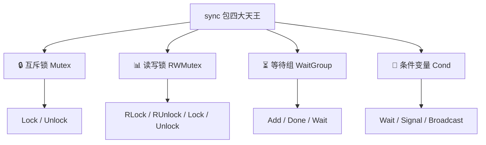

- **锁（Mutex/RWMutex）**：保证同一时刻只有一个 goroutine 能访问共享资源
- **信号量（Semaphore）**：控制并发数量的高级工具
- **等待组（WaitGroup）**：等待一群 goroutine 全部完成
- **条件变量（Cond）**：基于特定条件的等待和唤醒机制

---

## 26.3 sync.Mutex：互斥锁，Mutex.Lock、Mutex.Unlock

互斥锁是 sync 包最基础也最常用的组件。就像厕所的门锁——一个人进去后锁上，用完出来别人才能进。

```go
package main

import (
    "fmt"
    "sync"
)

var counter = 0
var mu sync.Mutex // 互斥锁

func increment() {
    mu.Lock()   // 加锁，其他 goroutine 只能在外面等
    counter++   // 临界区：同一时刻只有一个 goroutine 能执行这里
    mu.Unlock() // 解锁，让其他 goroutine 有机会进来
}

func main() {
    var wg sync.WaitGroup
    
    for i := 0; i < 10; i++ {
        wg.Add(1)
        go func() {
            defer wg.Done()
            for j := 0; j < 1000; j++ {
                increment()
            }
        }()
    }
    
    wg.Wait()
    fmt.Println("最终计数器值:", counter) // 稳定输出 10000
    // 输出: 最终计数器值: 10000
}
```

**工作原理图：**

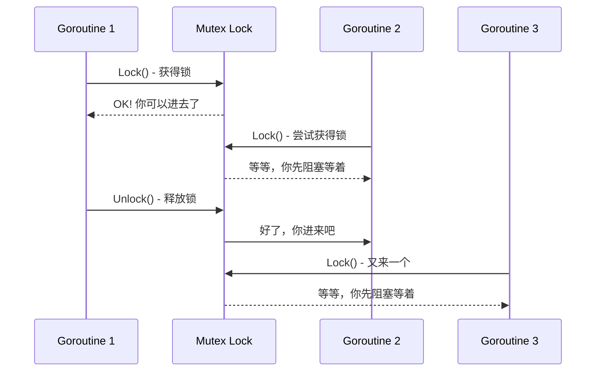

---

## 26.4 Mutex.TryLock：尝试加锁，不阻塞

有时候我们不想傻等，想"试试看"能不能拿到锁，能就干，不能就算了。`TryLock` 就是这么个"佛系"操作。

```go
package main

import (
    "fmt"
    "sync"
    "time"
)

var resource = ""
var mu sync.Mutex

func doSomething() {
    // 尝试获取锁
    if mu.TryLock() {
        fmt.Println("成功获取锁，正在处理资源...")
        time.Sleep(100 * time.Millisecond) // 模拟处理
        resource = "处理完成"
        mu.Unlock()
    } else {
        fmt.Println("没拿到锁，我先干点别的...")
        // 可以去做其他事情
    }
}

func main() {
    // 启动两个 goroutine，它们会竞争锁
    go doSomething()
    time.Sleep(10 * time.Millisecond) // 确保第一个先启动
    go doSomething()
    
    time.Sleep(200 * time.Millisecond)
    fmt.Println("最终资源:", resource)
    // 输出: 成功获取锁，正在处理资源...
    //       没拿到锁，我先干点别的...
    //       最终资源: 处理完成
}
```

**专业词汇解释：**

- **TryLock**：尝试获取锁，如果锁不可用立即返回 false，不会阻塞等待

---

## 26.5 defer unlock：最佳实践

写代码最怕什么？忘记 Unlock！一个 `defer` 可以拯救你于水火之中。

```go
package main

import (
    "fmt"
    "sync"
)

var counter = 0
var mu sync.Mutex

func increment() {
    mu.Lock()
    defer mu.Unlock() // 无论函数怎么返回，都会执行 Unlock
    counter++
    
    // 假设这里有很多代码...
    // 可能有多个 return
    // 可能有 panic
    // 都不怕！defer 保证 Unlock 一定会执行
}

func main() {
    var wg sync.WaitGroup
    
    for i := 0; i < 100; i++ {
        wg.Add(1)
        go func() {
            defer wg.Done()
            increment()
        }()
    }
    
    wg.Wait()
    fmt.Println("计数器:", counter) // 100，稳稳当当
    // 输出: 计数器: 100
}
```

**为什么用 defer？**

1. 不会忘记 Unlock
2. 即使代码提前 return 或 panic，锁也会释放
3. 代码更清晰，锁的范围一目了然

> 最佳实践：**永远使用 `defer mu.Unlock()`**，除非你有极其特殊的理由。

---

## 26.6 Mutex 不可重入：同一个 goroutine 两次 Lock 会死锁

Go 的 Mutex 是**不可重入（non-reentrant）**的。这点和 Java 的 synchronized 不同哦！

```go
package main

import (
    "fmt"
    "sync"
)

var mu sync.Mutex

func doSomething() {
    mu.Lock()
    fmt.Println("第一层获取锁")
    doOtherThing() // 调用另一个函数，它也要获取同一把锁！
    mu.Unlock()
}

func doOtherThing() {
    mu.Lock() // 同一个 goroutine 再次 Lock，会死锁！
    fmt.Println("第二层获取锁")
    mu.Unlock()
}

func main() {
    // 运行这个程序，你会发现它卡住了（死锁）
    // 因为同一个 goroutine 不能重入同一个 Mutex
    
    go doSomething()
    
    // 等待一下看看会不会输出
    // 实际上会永远阻塞，因为 doOtherThing 永远拿不到锁
    <-make(chan struct{})
}
```

**运行结果：程序会卡住，需要强制终止（Ctrl+C）**

**专业词汇解释：**

- **可重入锁（Reentrant Lock）**：同一线程可以多次获得同一把锁
- **不可重入锁（Non-reentrant Lock）**：同一线程不能多次获得同一把锁，否则会死锁

> 为什么 Go 要设计成不可重入？主要是为了性能——不可重入锁实现更简单，开销更小。如果需要重入行为，可以用 `sync.RWMutex` 或者自己封装。

---

## 26.7 sync.RWMutex：读写锁，RLock/RUnlock（读锁）、Lock/Unlock（写锁）

读写锁是个聪明的设计：读操作可以并发进行，写操作才需要独占。

```go
package main

import (
    "fmt"
    "sync"
    "time"
)

var (
    data   string
    rwMu   sync.RWMutex
)

func readData() string {
    rwMu.RLock()         // 获取读锁
    defer rwMu.RUnlock()
    time.Sleep(10 * time.Millisecond) // 模拟读取耗时
    return data
}

func writeData(newData string) {
    rwMu.Lock()          // 获取写锁
    defer rwMu.Unlock()
    time.Sleep(10 * time.Millisecond) // 模拟写入耗时
    data = newData
}

func main() {
    var wg sync.WaitGroup
    
    // 同时启动 5 个读 goroutine
    for i := 0; i < 5; i++ {
        wg.Add(1)
        go func(id int) {
            defer wg.Done()
            result := readData()
            fmt.Printf("Reader %d 读取到: %s\n", id, result)
        }(i)
    }
    
    // 启动 1 个写 goroutine
    wg.Add(1)
    go func() {
        defer wg.Done()
        writeData("Hello, World!")
        fmt.Println("Writer 写入完成")
    }()
    
    wg.Wait()
    // 读操作会并发执行（因为是 RLock）
    // 写操作会等所有读操作完成后再执行
}
```

**工作原理图：**

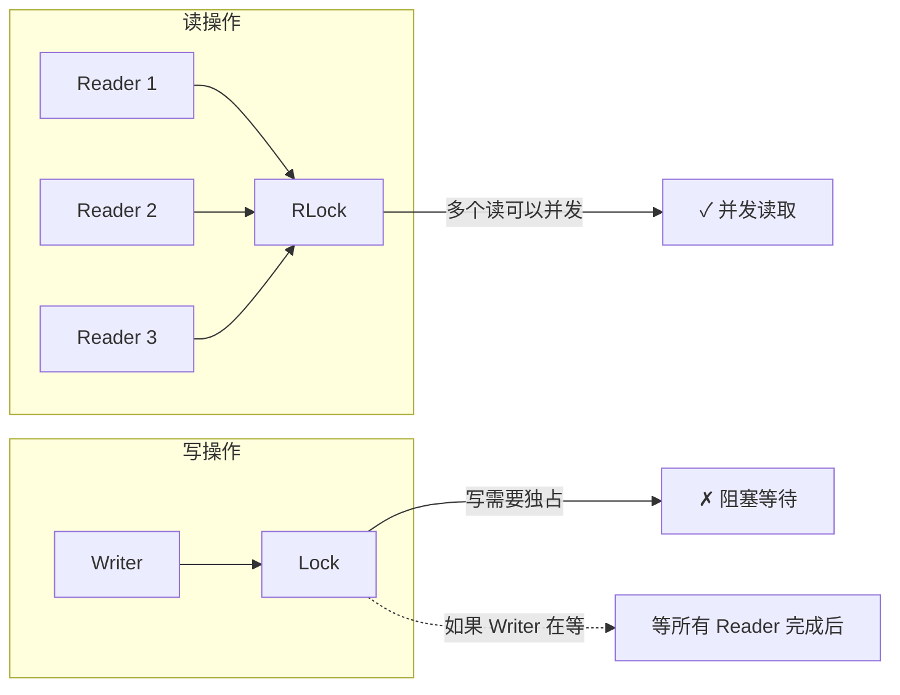

**专业词汇解释：**

- **RWMutex**：读写锁，通过 RLock/RUnlock 管理读锁，Lock/Unlock 管理写锁
- **读锁（Read Lock）**：也称为共享锁，多个读者可以同时持有
- **写锁（Write Lock）**：也称为排他锁，写者持有时其他读者和写者都不能访问

---

## 26.8 写优先策略：防止写饥饿

读写锁的默认策略是**写优先（write-preferring）**的。这意味着当有写者在等待时，新的读者会被阻塞，防止写者饿死的。

```go
package main

import (
    "fmt"
    "sync"
    "time"
)

var (
    data  = "初始值"
    rwMu  sync.RWMutex
)

func reader(id int) {
    rwMu.RLock()
    defer rwMu.RUnlock()
    fmt.Printf("Reader %d 正在读取: %s\n", id, data)
    time.Sleep(50 * time.Millisecond)
}

func writer(id int, value string) {
    rwMu.Lock()
    defer rwMu.Unlock()
    fmt.Printf("Writer %d 正在写入: %s\n", id, value)
    data = value
    time.Sleep(50 * time.Millisecond)
}

func main() {
    // 场景：2个读者正在读，这时来了1个写者，然后又来2个读者
    // 期望：写者优先，等前2个读者读完，写者写，然后新来的2个读者再读
    
    var wg sync.WaitGroup
    
    // 第一个读者开始读
    wg.Add(1)
    go func() {
        defer wg.Done()
        reader(1)
    }()
    
    time.Sleep(10 * time.Millisecond) // 确保第一个读者先拿到读锁
    
    // 写者来了
    wg.Add(1)
    go func() {
        defer wg.Done()
        writer(1, "写入的值")
    }()
    
    time.Sleep(10 * time.Millisecond) // 确保写者在第一个读者之后申请锁
    
    // 第二个读者来了
    wg.Add(1)
    go func() {
        defer wg.Done()
        reader(2)
    }()
    
    // 第三个读者来了
    wg.Add(1)
    go func() {
        defer wg.Done()
        reader(3)
    }()
    
    wg.Wait()
    
    fmt.Println("最终 data:", data)
}
```

**执行顺序（理想情况）：**

1. Reader 1 获取读锁，开始读取
2. Writer 1 尝试获取写锁，但因为 Reader 1 持有读锁，被阻塞
3. Reader 2、Reader 3 尝试获取读锁，但因为 Writer 1 在等待，被阻塞（写优先！）
4. Reader 1 读完，释放读锁
5. Writer 1 获得写锁，开始写入
6. Writer 1 写完，释放写锁
7. Reader 2、Reader 3 获得读锁，开始读取

> 注意：Go 的 RWMutex 写优先策略并不能 100% 保证写者不被饿死（starvation），但在大多数情况下能有效防止。

---

## 26.9 sync.WaitGroup：等待一组任务完成，Add/Done/Wait

WaitGroup 就像一个计数器——每启动一个任务就加 1，任务完成就减 1，主 goroutine 可以等待计数器归零。

```go
package main

import (
    "fmt"
    "sync"
    "time"
)

func worker(id int, wg *sync.WaitGroup) {
    defer wg.Done() // 任务完成，计数器减 1
    fmt.Printf("Worker %d 开始工作\n", id)
    time.Sleep(time.Duration(id) * 100 * time.Millisecond)
    fmt.Printf("Worker %d 完成工作\n", id)
}

func main() {
    var wg sync.WaitGroup
    
    fmt.Println("主 goroutine 启动 5 个 worker...")
    
    // 启动 5 个 worker
    for i := 1; i <= 5; i++ {
        wg.Add(1) // 计数器加 1
        go worker(i, &wg)
    }
    
    fmt.Println("主 goroutine 等待所有 worker 完成...")
    wg.Wait() // 阻塞，直到计数器归零
    fmt.Println("所有 worker 完成！主 goroutine 继续执行")
    
    // 输出：
    // 主 goroutine 启动 5 个 worker...
    // 主 goroutine 等待所有 worker 完成...
    // Worker 1 开始工作
    // Worker 2 开始工作
    // Worker 3 开始工作
    // Worker 4 开始工作
    // Worker 5 开始工作
    // Worker 1 完成工作
    // Worker 2 完成工作
    // Worker 3 完成工作
    // Worker 4 完成工作
    // Worker 5 完成工作
    // 所有 worker 完成！主 goroutine 继续执行
}
```

**工作流程图：**

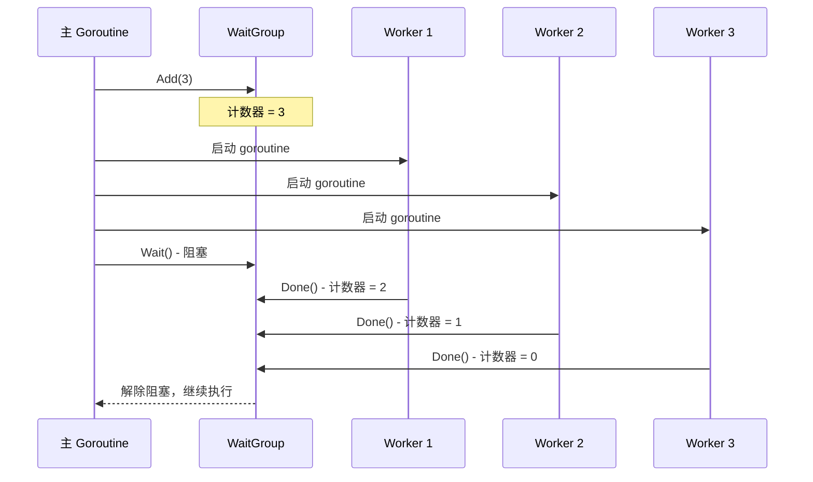

**专业词汇解释：**

- **Add(delta int)**：增加计数器，可以是正数或负数
- **Done()**：将计数器减 1，相当于 `Add(-1)`
- **Wait()**：阻塞直到计数器归零

---

## 26.10 goroutine 泄漏：忘记 Done 会导致 Wait 永久阻塞

WaitGroup 的天敌是什么？**忘记调用 Done()！** 一旦忘记，你的程序会永远等下去，就像等一个永远不会回来的人。

```go
package main

import (
    "fmt"
    "sync"
    "time"
)

func leakyTask(wg *sync.WaitGroup) {
    // 哎呀，忘记调用 wg.Done() 了！
    fmt.Println("任务执行中...")
    time.Sleep(time.Second)
    fmt.Println("任务执行完毕，但忘了 Done()")
    // return 时没有调用 wg.Done()
    // 这会导致 Wait() 永久阻塞！
}

func main() {
    var wg sync.WaitGroup
    
    wg.Add(1)
    go leakyTask(&wg)
    
    fmt.Println("等待任务完成...")
    
    // 设置一个超时，防止真的永久等待
    done := make(chan struct{})
    go func() {
        wg.Wait()
        close(done)
    }()
    
    select {
    case <-done:
        fmt.Println("任务完成了！")
    case <-time.After(3 * time.Second):
        fmt.Println("超时了！任务可能泄漏了！")
    }
    
    // 实际运行你会看到：
    // 等待任务完成...
    // 任务执行中...
    // 任务执行完毕，但忘了 Done()
    // 超时了！任务可能泄漏了！
}
```

**泄漏示意图：**

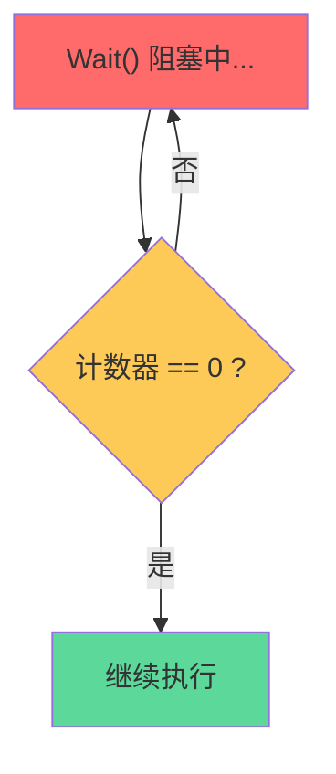

> 最佳实践：使用 `defer wg.Done()`，就像 `defer mu.Unlock()` 一样，让编译器帮你擦屁股。

---

## 26.11 sync.Once：一次性初始化，Once.Do(f) 只执行一次

sync.Once 保证某个函数**只会被执行一次**，即使在多个 goroutine 同时调用的情况下。堪称"单实例模式"的最佳伴侣。

```go
package main

import (
    "fmt"
    "sync"
)

var (
    once     sync.Once
    resource string
)

func initResource() {
    fmt.Println("初始化资源...（只会执行一次）")
    resource = "已初始化的资源"
}

func getResource() string {
    once.Do(initResource) // 无论调用多少次，只执行一次
    return resource
}

func main() {
    var wg sync.WaitGroup
    
    // 启动 10 个 goroutine 同时获取资源
    for i := 0; i < 10; i++ {
        wg.Add(1)
        go func(id int) {
            defer wg.Done()
            result := getResource()
            fmt.Printf("Goroutine %d 获取到: %s\n", id, result)
        }(i)
    }
    
    wg.Wait()
    
    // 输出：
    // 初始化资源...（只会执行一次）
    // Goroutine 0 获取到: 已初始化的资源
    // Goroutine 1 获取到: 已初始化的资源
    // ...（所有 goroutine 都获取到同一个资源）
}
```

**工作原理图：**

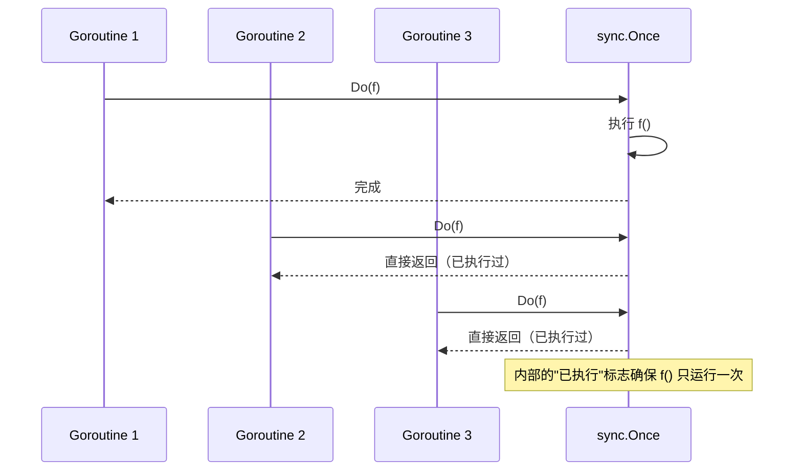

**专业词汇解释：**

- **Once**：一个同步原语，保证给定函数只会执行一次
- **Do(f func())**：执行函数 f，如果已经执行过则直接返回

> 经典应用场景：配置文件读取、数据库连接初始化、Logger 初始化等只需要执行一次的操作。

---

## 26.12 sync.OnceFunc、sync.OnceValue（Go 1.21+）：更便捷的封装

Go 1.21 引入了更方便的封装，让 Once 的使用更加直观。

```go
package main

import (
    "fmt"
    "sync"
    "time"
)

// Go 1.21+ 示例
func main() {
    // sync.OnceFunc: 返回一个只执行一次的函数
    getConfigOnce := sync.OnceFunc(func() string {
        fmt.Println("正在加载配置...")
        time.Sleep(100 * time.Millisecond)
        return "配置内容"
    })
    
    // sync.OnceValue: 返回一个函数，调用时返回Once执行的结果
    getDatabaseDSNOnce := sync.OnceValue(func() string {
        fmt.Println("正在连接数据库...")
        time.Sleep(100 * time.Millisecond)
        return "postgres://localhost:5432/mydb"
    })
    
    var wg sync.WaitGroup
    
    // 测试 OnceFunc
    for i := 0; i < 3; i++ {
        wg.Add(1)
        go func(id int) {
            defer wg.Done()
            config := getConfigOnce()
            fmt.Printf("Goroutine %d 获取配置: %s\n", id, config)
        }(i)
    }
    
    // 测试 OnceValue
    for i := 0; i < 3; i++ {
        wg.Add(1)
        go func(id int) {
            defer wg.Done()
            dsn := getDatabaseDSNOnce()
            fmt.Printf("Goroutine %d 获取 DSN: %s\n", id, dsn)
        }(i)
    }
    
    wg.Wait()
    
    // 输出（注意配置和数据库只初始化一次）：
    // 正在加载配置...
    // Goroutine 0 获取配置: 配置内容
    // Goroutine 1 获取配置: 配置内容
    // Goroutine 2 获取配置: 配置内容
    // 正在连接数据库...
    // Goroutine 0 获取 DSN: postgres://localhost:5432/mydb
    // Goroutine 1 获取 DSN: postgres://localhost:5432/mydb
    // Goroutine 2 获取 DSN: postgres://localhost:5432/mydb
}
```

**专业词汇解释：**

- **OnceFunc(f func()) func()**：返回一个函数，该函数调用时执行 f 且仅执行一次
- **OnceValue(f func() T) func() T**：返回一个函数，调用时返回 f() 的结果，且 f 仅执行一次

> 这两个函数是 Go 1.21 新增的，比传统的 `sync.Once` + 闭包更简洁！

---

## 26.13 sync.Cond：条件变量，Cond.Wait 自动释放锁并阻塞

Cond（Condition Variable）是 Go 中实现**等待-通知**模式的神器。`Wait()` 会自动释放锁并阻塞当前 goroutine，直到被唤醒。

```go
package main

import (
    "fmt"
    "sync"
    "time"
)

var (
    mu    sync.Mutex
    cond  = sync.NewCond(&mu)
    ready bool
)

func waiter(id int) {
    mu.Lock()
    for !ready { // 注意：必须用 for 循环，见 26.16
        fmt.Printf("Worker %d: 还没准备好，我等着...\n", id)
        cond.Wait() // 自动释放锁，并阻塞等待
        // 被唤醒后，Wait() 会重新获取锁，goroutine 醒来继续执行
    }
    fmt.Printf("Worker %d: 准备好了！开始工作！\n", id)
    mu.Unlock()
}

func main() {
    var wg sync.WaitGroup
    
    // 启动 3 个等待者
    for i := 1; i <= 3; i++ {
        wg.Add(1)
        go func(id int) {
            defer wg.Done()
            waiter(id)
        }(i)
    }
    
    time.Sleep(1 * time.Second) // 确保所有 waiter 都开始等待
    
    fmt.Println("主 goroutine: 准备好了，通知所有等待者")
    
    mu.Lock()
    ready = true
    mu.Unlock()
    
    cond.Broadcast() // 唤醒所有等待者
    
    time.Sleep(500 * time.Millisecond)
    wg.Wait()
    
    // 输出顺序可能不同，但大致是：
    // Worker 1: 还没准备好，我等着...
    // Worker 2: 还没准备好，我等着...
    // Worker 3: 还没准备好，我等着...
    // 主 goroutine: 准备好了，通知所有等待者
    // Worker 1: 准备好了！开始工作！
    // Worker 2: 准备好了！开始工作！
    // Worker 3: 准备好了！开始工作！
}
```

**Wait() 的工作原理：**

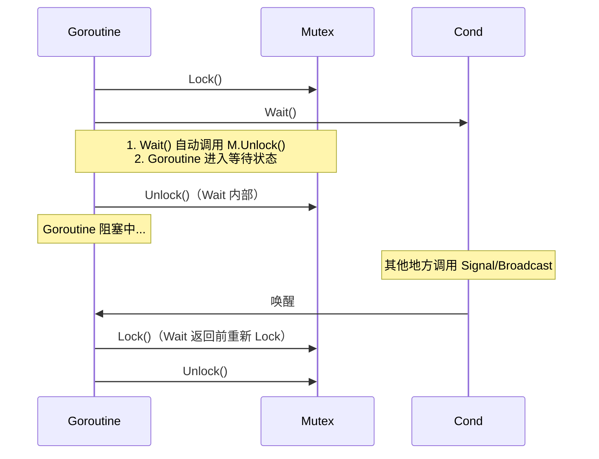

**专业词汇解释：**

- **Cond**：条件变量，基于某个条件进行等待和通知的同步原语
- **Wait()**：阻塞当前 goroutine，自动释放关联的锁，等待 Signal 或 Broadcast 唤醒

---

## 26.14 Cond.Signal：唤醒一个等待者

Signal 唤醒**其中一个**正在等待的 goroutine（通常是等待时间最长的那个）。

```go
package main

import (
    "fmt"
    "sync"
    "time"
)

var (
    mu    sync.Mutex
    cond  = sync.NewCond(&mu)
    tasks = make(chan string, 10)
)

func worker(id int) {
    for {
        mu.Lock()
        for len(tasks) == 0 { // 队列为空，等待
            cond.Wait()
        }
        task := <-tasks
        mu.Unlock()
        
        fmt.Printf("Worker %d 收到任务: %s\n", id, task)
        time.Sleep(100 * time.Millisecond) // 模拟工作
    }
}

func main() {
    // 启动 3 个 worker
    for i := 1; i <= 3; i++ {
        go worker(i)
    }
    
    time.Sleep(100 * time.Millisecond) // 确保 worker 们都开始等待
    
    // 逐个添加任务并通知
    for i := 1; i <= 5; i++ {
        mu.Lock()
        tasks <- fmt.Sprintf("任务-%d", i)
        mu.Unlock()
        cond.Signal() // 只唤醒一个等待者
        
        time.Sleep(200 * time.Millisecond)
    }
    
    // 输出（每次 Signal 只唤醒一个 worker）：
    // Worker 1 收到任务: 任务-1
    // Worker 2 收到任务: 任务-2
    // Worker 3 收到任务: 任务-3
    // Worker 1 收到任务: 任务-4
    // Worker 2 收到任务: 任务-5
}
```

**Signal vs Broadcast：**

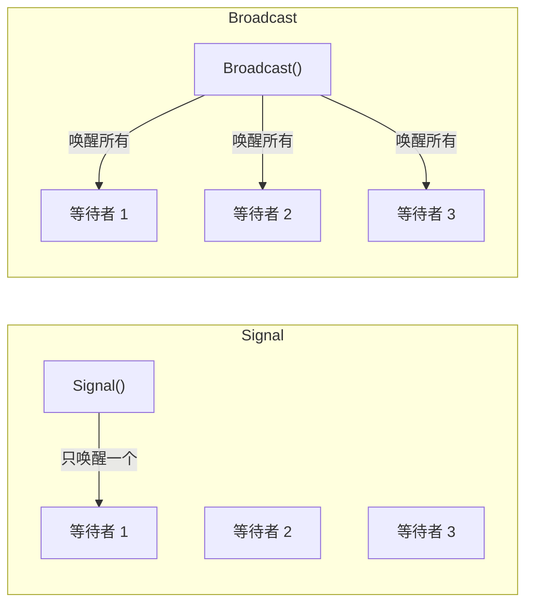

---

## 26.15 Cond.Broadcast：唤醒所有等待者

Broadcast 会唤醒**所有**正在等待的 goroutine。

```go
package main

import (
    "fmt"
    "sync"
    "time"
)

var (
    mu       sync.Mutex
    cond     = sync.NewCond(&mu)
    progress int
)

func monitor(id int) {
    mu.Lock()
    defer mu.Unlock()
    
    for progress < 100 {
        cond.Wait()
        fmt.Printf("Monitor %d: 收到通知，当前进度 %d%%\n", id, progress)
    }
}

func main() {
    // 启动 3 个监控 goroutine
    for i := 1; i <= 3; i++ {
        go monitor(i)
    }
    
    time.Sleep(100 * time.Millisecond)
    
    // 主 goroutine 更新进度并通知所有监控者
    for i := 10; i <= 100; i += 10 {
        mu.Lock()
        progress = i
        mu.Unlock()
        
        fmt.Printf("主 goroutine: 更新进度到 %d%%，广播通知\n", i)
        cond.Broadcast() // 唤醒所有等待者
        
        time.Sleep(200 * time.Millisecond)
    }
    
    // 输出：
    // 主 goroutine: 更新进度到 10%，广播通知
    // Monitor 1: 收到通知，当前进度 10%
    // Monitor 2: 收到通知，当前进度 10%
    // Monitor 3: 收到通知，当前进度 10%
    // 主 goroutine: 更新进度到 20%，广播通知
    // Monitor 1: 收到通知，当前进度 20%
    // ...
}
```

---

## 26.16 虚假唤醒：必须用 for 循环而不是 if 判断条件

这是 sync.Cond 最容易踩的坑！**Go 的实现允许虚假唤醒（spurious wakeup）**，即 Wait() 可能在没有调用 Signal/Broadcast 的情况下返回。所以必须用 **for 循环** 而不是 **if** 来判断条件。

```go
package main

import (
    "fmt"
    "sync"
    "time"
)

// 错误示范：使用 if 判断
func wrongWay() {
    var mu sync.Mutex
    cond := sync.NewCond(&mu)
    ready := false
    
    go func() {
        time.Sleep(2 * time.Second)
        mu.Lock()
        ready = true
        mu.Unlock()
        cond.Signal() // 只唤醒一个
    }()
    
    mu.Lock()
    if !ready { // ❌ 错误！应该用 for
        fmt.Println("错误方式: 准备等待...")
        cond.Wait()
    }
    fmt.Println("错误方式: 继续执行")
    mu.Unlock()
}

// 正确示范：使用 for 循环
func rightWay() {
    var mu sync.Mutex
    cond := sync.NewCond(&mu)
    ready := false
    
    go func() {
        time.Sleep(2 * time.Second)
        mu.Lock()
        ready = true
        mu.Unlock()
        cond.Broadcast() // 唤醒所有
    }()
    
    mu.Lock()
    for !ready { // ✅ 正确！循环检查条件
        fmt.Println("正确方式: 准备等待...")
        cond.Wait()
    }
    fmt.Println("正确方式: 继续执行")
    mu.Unlock()
}

func main() {
    fmt.Println("=== 测试错误方式 ===")
    wrongWay()
    
    time.Sleep(500 * time.Millisecond)
    
    fmt.Println("\n=== 测试正确方式 ===")
    rightWay()
}
```

**为什么需要 for 循环？**

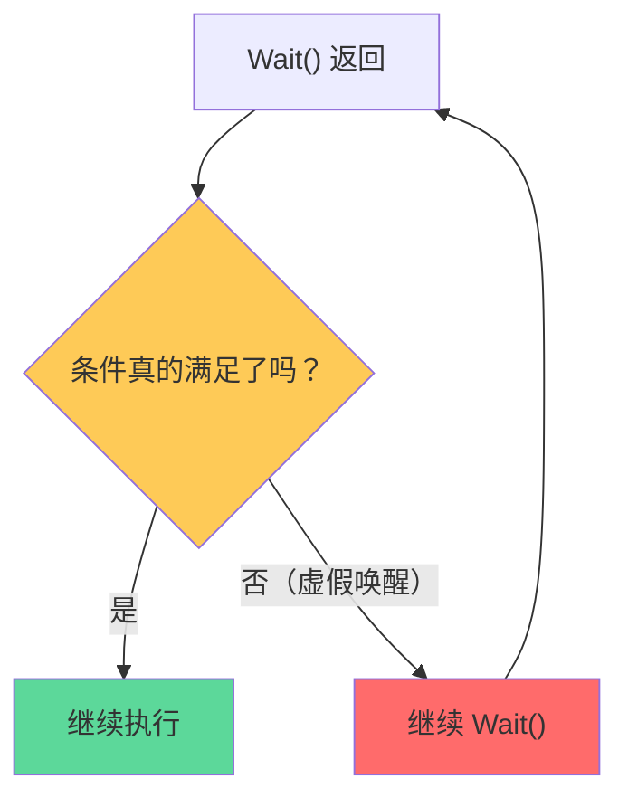

> 记住：**永远用 `for` 而不是 `if` 来检查条件**，即使你确定不会有虚假唤醒。这也是防御性编程的体现。

---

## 26.17 sync.Map：并发安全 Map，read + dirty 双层结构

sync.Map 是 Go 专门为并发场景设计的 Map，采用了 **read + dirty 双层结构** 来优化读性能。

```go
package main

import (
    "fmt"
    "sync"
)

func main() {
    var m sync.Map
    
    // Store: 存储键值对
    m.Store("name", "小明")
    m.Store("age", 18)
    m.Store("city", "北京")
    
    // Load: 读取值
    if value, ok := m.Load("name"); ok {
        fmt.Printf("读取到 name: %v\n", value)
    }
    
    // LoadOrStore: 读取或存储（如果不存在）
    if value, loaded := m.LoadOrStore("country", "中国"); loaded {
        fmt.Printf("country 已存在: %v\n", value)
    } else {
        fmt.Println("country 是新插入的")
    }
    
    // Delete: 删除
    m.Delete("city")
    
    // Range: 遍历
    fmt.Println("\n遍历所有键值对:")
    m.Range(func(key, value interface{}) bool {
        fmt.Printf("  %s = %v\n", key, value)
        return true // 返回 true 继续遍历，false 停止遍历
    })
    
    // 输出：
    // 读取到 name: 小明
    // country 是新插入的
    // 遍历所有键值对:
    //   name = 小明
    //   age = 18
    //   country = 中国
}
```

**sync.Map 内部结构：**

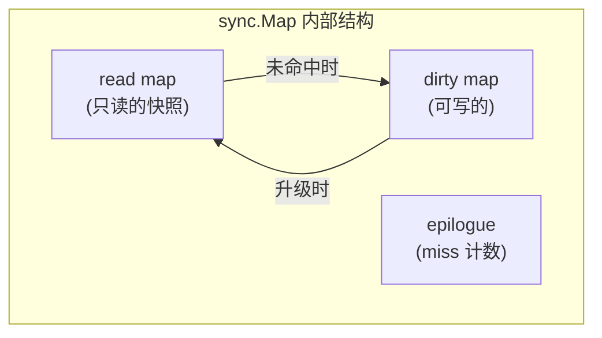

**专业词汇解释：**

- **read map**：存储所有数据（大部分是只读的），读取不需要加锁
- **dirty map**：存储新写入的、尚未同步到 read 的数据
- **miss 计数**：当 read 中找不到时，会到 dirty 中找，找不到则 miss + 1

---

## 26.18 Map.Store、Map.Load、Map.Delete、Map.Range：基本操作

sync.Map 提供了与普通 Map 类似的操作，但都是并发安全的。

```go
package main

import (
    "fmt"
    "sync"
)

func main() {
    var m sync.Map
    
    // ========== Store ==========
    // 存储键值对，类似 map[key] = value
    m.Store("apple", "苹果")
    m.Store("banana", "香蕉")
    m.Store(123, "数字键也行")
    
    // ========== Load ==========
    // 读取指定 key 的值
    value, ok := m.Load("apple")
    if ok {
        fmt.Printf("Load 苹果: %s\n", value)
    }
    
    // 不存在的 key
    _, ok = m.Load("grape")
    if !ok {
        fmt.Println("Load 葡萄: 不存在")
    }
    
    // ========== Delete ==========
    // 删除指定 key
    m.Store("temp", "临时数据")
    fmt.Printf("Delete 前: ")
    if v, _ := m.Load("temp"); v != nil {
        fmt.Printf("temp = %s\n", v)
    }
    
    m.Delete("temp")
    fmt.Printf("Delete 后: ")
    if _, ok := m.Load("temp"); !ok {
        fmt.Println("temp 已被删除")
    }
    
    // ========== Range ==========
    // 遍历所有键值对
    fmt.Println("\nRange 遍历:")
    m.Store("x", 1)
    m.Store("y", 2)
    m.Store("z", 3)
    m.Range(func(key, value interface{}) bool {
        fmt.Printf("  %v -> %v\n", key, value)
        return true
    })
    
    // 输出：
    // Load 苹果: 苹果
    // Load 葡萄: 不存在
    // Delete 前: temp = 临时数据
    // Delete 后: temp 已被删除
    // Range 遍历:
    //   apple -> 苹果
    //   banana -> 香蕉
    //   123 -> 数字键也行
    //   x -> 1
    //   y -> 2
    //   z -> 3
}
```

---

## 26.19 Map.LoadOrStore、Map.LoadAndDelete、Map.Swap：原子操作

这些是 sync.Map 提供的高级原子操作，可以让读取、删除、替换操作一步完成。

```go
package main

import (
    "fmt"
    "sync"
)

func main() {
    var m sync.Map
    
    // ========== LoadOrStore ==========
    // 如果 key 存在，返回现有值；不存在则存入并返回
    value, loaded := m.LoadOrStore("name", "小明")
    fmt.Printf("第一次 LoadOrStore: value=%s, loaded=%v\n", value, loaded)
    // loaded = false，因为是新插入
    
    value, loaded = m.LoadOrStore("name", "小红")
    fmt.Printf("第二次 LoadOrStore: value=%s, loaded=%v\n", value, loaded)
    // loaded = true，返回的是原来的"小明"
    
    // ========== LoadAndDelete ==========
    // 读取并删除，如果 key 存在返回原值，不存在返回 nil
    m.Store("toDelete", "待删除的值")
    
    value, loaded = m.LoadAndDelete("toDelete")
    fmt.Printf("LoadAndDelete: value=%s, loaded=%v\n", value, loaded)
    
    _, loaded = m.Load("toDelete")
    fmt.Printf("确认删除: loaded=%v\n", loaded)
    
    // ========== Swap ==========
    // 交换新的值，并返回旧的值
    m.Store("swapKey", "旧值")
    
    oldValue, loaded := m.Swap("swapKey", "新值")
    fmt.Printf("Swap: oldValue=%s, loaded=%v\n", oldValue, loaded)
    
    newValue, _ := m.Load("swapKey")
    fmt.Printf("Swap 后新值: %s\n", newValue)
    
    // Swap 一个不存在的 key
    oldValue, loaded = m.Swap("newKey", "全新值")
    fmt.Printf("Swap 新 key: oldValue=%v, loaded=%v\n", oldValue, loaded)
    
    // 输出：
    // 第一次 LoadOrStore: value=小明, loaded=false
    // 第二次 LoadOrStore: value=小明, loaded=true
    // LoadAndDelete: value=待删除的值, loaded=true
    // 确认删除: loaded=false
    // Swap: oldValue=旧值, loaded=true
    // Swap 后新值: 新值
    // Swap 新 key: oldValue=<nil>, loaded=false
}
```

**专业词汇解释：**

- **LoadOrStore**：原子地加载或存储，返回是否已存在
- **LoadAndDelete**：原子地加载并删除（也叫"pop"操作）
- **Swap**：原子地交换新值并返回旧值

---

## 26.20 sync.Map vs sync.RWMutex + map：Map 适合"写少读多且 key 集合相对稳定"的场景

不是所有场景都需要 sync.Map！普通 map + RWMutex 在某些场景下可能更高效。

```go
package main

import (
    "fmt"
    "sync"
    "time"
)

// 场景对比：10 个读 goroutine，1 个写 goroutine
func benchmark(name string, fn func()) {
    start := time.Now()
    fn()
    fmt.Printf("%s 耗时: %v\n", name, time.Since(start))
}

func main() {
    const goroutines = 10
    const iterations = 100000
    
    // ========== sync.Map 版本 ==========
    var syncMap sync.Map
    for i := 0; i < 100; i++ {
        syncMap.Store(i, i*i)
    }
    
    benchmark("sync.Map", func() {
        var wg sync.WaitGroup
        wg.Add(goroutines)
        
        for g := 0; g < goroutines; g++ {
            go func(id int) {
                defer wg.Done()
                for i := 0; i < iterations; i++ {
                    syncMap.Load(id % 100)
                }
            }(g)
        }
        
        wg.Wait()
    })
    
    // ========== RWMutex + map 版本 ==========
    var (
        rwMu sync.RWMutex
        m    = make(map[int]int)
    )
    for i := 0; i < 100; i++ {
        m[i] = i*i
    }
    
    benchmark("RWMutex+map", func() {
        var wg sync.WaitGroup
        wg.Add(goroutines)
        
        for g := 0; g < goroutines; g++ {
            go func(id int) {
                defer wg.Done()
                for i := 0; i < iterations; i++ {
                    rwMu.RLock()
                    _ = m[id%100]
                    rwMu.RUnlock()
                }
            }(g)
        }
        
        wg.Wait()
    })
    
    fmt.Println("\n何时用 sync.Map？")
    fmt.Println("✅ 写少读多（读多写少时 sync.Map 的 read 缓存命中率高）")
    fmt.Println("✅ key 集合相对稳定（不会频繁增删）")
    fmt.Println("✅ 多个 goroutine 独立读写不同的 key（减少竞争）")
    fmt.Println()
    fmt.Println("何时用 RWMutex + map？")
    fmt.Println("✅ 需要对 map 进行复杂操作（计数、过滤等）")
    fmt.Println("✅ key 集合经常变化")
    fmt.Println("✅ 需要 Map 的所有功能（如 len()）")
}
```

**选择决策图：**

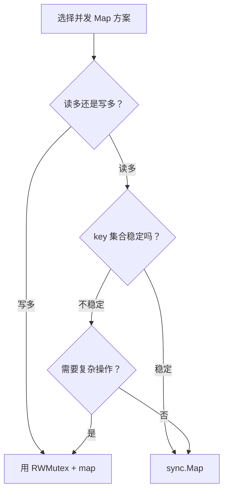

---

## 26.21 sync.Pool：对象池，Pool.Get 可能返回 nil

sync.Pool 是 Go 的临时对象池，用于缓存使用频繁但创建成本高的对象。`Get()` 返回的对象可能是之前 `Put()` 进去的，也可能是 nil（需要你新建）。

```go
package main

import (
    "fmt"
    "sync"
)

var (
    // 创建成本较高的对象（比如数据库连接）
    pool = &sync.Pool{
        New: func() interface{} {
            fmt.Println("创建新对象（成本高）...")
            return &MyObject{name: "新对象"}
        },
    }
)

type MyObject struct {
    name string
    data [1024]byte // 模拟一些内存占用
}

func main() {
    fmt.Println("=== 第一次 Get ===")
    obj := pool.Get()
    fmt.Printf("获取到对象: %v\n", obj)
    
    fmt.Println("\n=== 放回去 ===")
    pool.Put(obj)
    fmt.Println("对象已放回池中")
    
    fmt.Println("\n=== 第二次 Get（应该复用） ===")
    obj2 := pool.Get()
    fmt.Printf("获取到对象: %v\n", obj2)
    
    fmt.Println("\n=== 第三次 Get（池已空） ===")
    obj3 := pool.Get()
    fmt.Printf("获取到对象: %v\n", obj3)
    
    // 输出：
    // === 第一次 Get ===
    // 创建新对象（成本高）...
    // 获取到对象: &{新对象}
    // === 放回去 ===
    // 对象已放回池中
    // === 第二次 Get（应该复用） ===
    // 获取到对象: &{新对象}（没有打印"创建新对象"，说明复用了）
    // === 第三次 Get（池已空） ===
    // 创建新对象（成本高）...
    // 获取到对象: &{新对象}
}
```

**专业词汇解释：**

- **Pool**：临时对象池，用于减少 GC 压力和对象分配开销
- **Get()**：从池中获取对象，如果池为空则调用 New() 创建
- **Put(x)**：将对象放回池中，供后续 Get() 使用

---

## 26.22 Pool.New：对象创建函数，当 Pool 为空时调用

`New` 是 Pool 的创建函数，当调用 `Get()` 但池为空时会调用它来创建新对象。

```go
package main

import (
    "fmt"
    "sync"
)

// 模拟一个创建成本较高的对象
type ExpensiveObject struct {
    ID   int
    data []byte
}

func main() {
    createCount := 0
    
    pool := &sync.Pool{
        New: func() interface{} {
            createCount++
            id := createCount
            fmt.Printf("    [创建 #%d] 创建新对象，ID=%d\n", id, id)
            return &ExpensiveObject{
                ID:   id,
                data: make([]byte, 1024), // 模拟内存分配
            }
        },
    }
    
    fmt.Println("=== 第一次 Get（池空，创建 #1）===")
    obj1 := pool.Get()
    fmt.Printf("获取到对象 ID=%d\n", obj1.(*ExpensiveObject).ID)
    
    fmt.Println("\n=== 放回去 ===")
    pool.Put(obj1)
    
    fmt.Println("\n=== 第二次 Get（复用对象）===")
    obj2 := pool.Get()
    fmt.Printf("获取到对象 ID=%d\n", obj2.(*ExpensiveObject).ID)
    
    fmt.Println("\n=== 第三次 Get（池空了，创建 #2）===")
    obj3 := pool.Get()
    fmt.Printf("获取到对象 ID=%d\n", obj3.(*ExpensiveObject).ID)
    
    fmt.Printf("\n总共创建了 %d 个对象\n", createCount)
    
    // 输出：
    // === 第一次 Get（池空，创建 #1）===
    //     [创建 #1] 创建新对象，ID=1
    // 获取到对象 ID=1
    // === 放回去 ===
    // === 第二次 Get（复用对象）===
    // 获取到对象 ID=1（没有创建新对象！）
    // === 第三次 Get（池空了，创建 #2）===
    //     [创建 #2] 创建新对象，ID=2
    // 获取到对象 ID=2
    // 总共创建了 2 个对象
}
```

---

## 26.23 Pool 的 GC 行为：Pool 在 GC 之前会清空，不能用 Pool 保存持久数据

sync.Pool 的一个重要特性：**它在 GC 时会被清空**！这是设计上的权衡，意味着 Pool 不能用来存储持久数据。

```go
package main

import (
    "fmt"
    "runtime"
    "sync"
    "time"
)

func main() {
    pool := &sync.Pool{
        New: func() interface{} {
            return "新对象"
        },
    }
    
    // 放入一个对象
    pool.Put("持久数据-来自用户")
    
    fmt.Println("=== GC 前 ===")
    if v := pool.Get(); v != nil {
        fmt.Printf("Get: %v\n", v)
    }
    
    // 强制 GC
    fmt.Println("\n=== 强制 GC ===")
    runtime.GC()
    time.Sleep(100 * time.Millisecond) // 给 GC 一点时间
    
    fmt.Println("\n=== GC 后 ===")
    // GC 后池被清空，Get 会调用 New 创建新对象
    if v := pool.Get(); v != nil {
        fmt.Printf("Get: %v（不再是'持久数据'了）\n", v)
    }
    
    // 输出：
    // === GC 前 ===
    // Get: 持久数据-来自用户
    // === 强制 GC ===
    // === GC 后 ===
    // Get: 新对象（不再是'持久数据'了）
    
    fmt.Println("\n⚠️ Pool 不适合存储持久数据！")
    fmt.Println("Pool 的设计目标：")
    fmt.Println("1. 减少内存分配和 GC 压力")
    fmt.Println("2. 临时对象复用")
    fmt.Println("3. 不保证数据一定会被复用（GC 会清空）")
}
```

**Pool 的生命周期图：**

```mermaid
graph LR
    subgraph Pool 生命周期
        P1["Put(obj)"] -->|"GC 发生"| C["清空 Pool"]
        C -->|"Get() 时"| P2["New() 创建"]
        P2 --> P1
    end
    
    style C fill:#ff6b6b
    Note right of C: GC 会清空所有 Pool<br/>数据可能丢失！
```

> **记住**：sync.Pool 是用来复用的，不是用来存储的。每次 GC 后，池里的东西可能全没了。

---

## 26.24 sync.SeqLock（Go 1.19+）：序列锁，读多写少的无锁同步

SeqLock（Sequence Lock）是一种特殊的多读者、单写者的无锁同步机制。通过递增的序列号来检测冲突。

```go
package main

import (
    "fmt"
    "sync"
    "sync/atomic"
    "time"
)

type SeqLock struct {
    seq uint64
}

func (sl *SeqLock) Lock() {
    atomic.AddUint64(&sl.seq, 1) // 写入前序列号 +1（变成奇数）
}

func (sl *SeqLock) Unlock() {
    atomic.AddUint64(&sl.seq, 1) // 写入后序列号再 +1（变成偶数）
}

// 读开始：返回读取时的序列号
func (sl *SeqLock) RLock() uint64 {
    return atomic.LoadUint64(&sl.seq)
}

// 读结束：检查序列号是否变化
func (sl *SeqLock) RUnlock(startSeq uint64) bool {
    return atomic.LoadUint64(&sl.seq) == startSeq
}

var (
    seqlock SeqLock
    counter int64
)

func writer() {
    for i := 0; i < 1000; i++ {
        seqlock.Lock()
        counter++
        seqlock.Unlock()
    }
}

func reader() int64 {
    var sum int64
    for i := 0; i < 1000; i++ {
        startSeq := seqlock.RLock()
        sum += counter
        if !seqlock.RUnlock(startSeq) {
            // 序列号变了，说明读取期间有写入，重试
            i-- // 这次不算
        }
    }
    return sum
}

func main() {
    var wg sync.WaitGroup
    
    // 5 个写 goroutine
    for i := 0; i < 5; i++ {
        wg.Add(1)
        go func() {
            defer wg.Done()
            writer()
        }()
    }
    
    // 5 个读 goroutine
    for i := 0; i < 5; i++ {
        wg.Add(1)
        go func(id int) {
            defer wg.Done()
            sum := reader()
            fmt.Printf("Reader %d sum: %d\n", id, sum)
        }(i)
    }
    
    wg.Wait()
    fmt.Printf("最终 counter: %d (期望: 5000)\n", counter)
}
```

**SeqLock 原理图：**

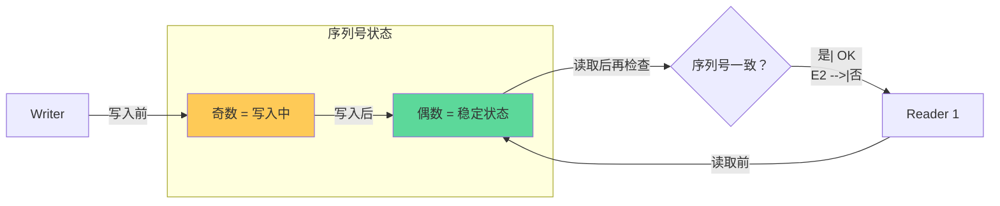

**专业词汇解释：**

- **SeqLock**：序列锁，通过递增的序列号来检测读写冲突
- **写锁**：写入前后序列号各 +1，保证序列号为奇数时表示正在写入
- **读锁**：读取前后检查序列号，如果一致说明没有写入冲突

> SeqLock 适合**读多写少**的场景，写操作不会阻塞读操作（除非检测到冲突需要重试）。

---

## 26.25 sync.Map、sync.WaitGroup、sync.Once：不可复制，使用指针传递

Go 的 sync 包中有些类型**不能被复制**！这是因为它们内部包含了隐藏的同步状态，复制后会导致奇怪的行为。

```go
package main

import (
    "fmt"
    "sync"
)

// 这个函数错误地按值传递了 sync.WaitGroup
func wrongFunction(wg sync.WaitGroup) {
    wg.Add(1)
    // ...
    wg.Done()
}

// 正确做法：使用指针传递
func correctFunction(wg *sync.WaitGroup) {
    wg.Add(1)
    // ...
    wg.Done()
}

func main() {
    var wg sync.WaitGroup
    
    // 错误做法会编译警告（或错误，取决于 Go 版本）
    // go vet 会检测出这个问题
    // wrongFunction(wg) // 不要这样做！
    
    // 正确做法
    correctFunction(&wg)
    
    wg.Wait()
    fmt.Println("完成")
    
    // ========== 同样问题也适用于其他 sync 类型 ==========
    // 错误
    // m1 := sync.Map{}
    // m2 := m1 // 复制！
    
    // 正确
    // m1 := &sync.Map{} // 使用指针
}
```

**为什么不能复制？**

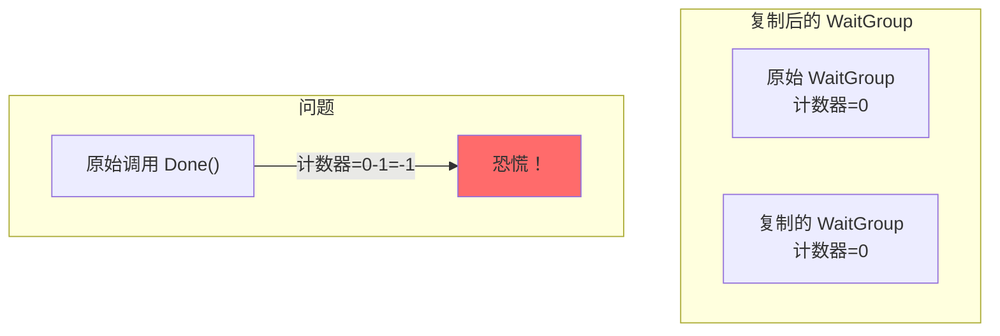

| 类型 | 能否复制 | 正确用法 |
|------|----------|----------|
| sync.Mutex | ❌ | `var mu sync.Mutex` 或 `mu := &sync.Mutex{}` |
| sync.RWMutex | ❌ | 使用指针 |
| sync.WaitGroup | ❌ | 使用指针 `&wg` |
| sync.Once | ❌ | 使用指针 |
| sync.Map | ❌ | 使用指针 |
| sync.Cond | ❌ | 使用指针 |
| sync.Pool | ❌ | 使用指针 |

> **重要**：Go 1.21+，`go vet` 默认会检测这些问题。强烈建议使用 `go vet ./...` 检查代码。

---

## 本章小结

sync 包是 Go 并发编程的基础设施，本章我们详细介绍了以下内容：

### 核心概念

- **数据竞争（Data Race）**：多个 goroutine 同时访问共享数据，且至少有一个是写操作
- **同步原语**：用于协调多个 goroutine 执行顺序的工具

### 锁家族

| 类型 | 用途 | 特点 |
|------|------|------|
| `sync.Mutex` | 互斥锁 | 最基础，保证同一时刻只有一个 goroutine 进入临界区 |
| `sync.RWMutex` | 读写锁 | 读多写少场景，读操作可并发，写操作独占 |
| `Mutex.TryLock` | 尝试锁 | 不阻塞，立即返回是否成功获取锁 |

### 等待与通知

- **`sync.WaitGroup`**：等待一组 goroutine 完成，Add/Done/Wait 三板斧
- **`sync.Cond`**：条件变量，Wait/Signal/Broadcast 实现等待-通知模式

### 一次性执行

- **`sync.Once`**：保证函数只执行一次
- **`sync.OnceFunc/OnceValue`**（Go 1.21+）：更便捷的封装

### 并发安全容器

- **`sync.Map`**：read + dirty 双层结构，适合写少读多、key 集合稳定的场景
- **`sync.Pool`**：临时对象池，注意 GC 会清空，不能存储持久数据

### 无锁同步

- **`sync.SeqLock`**（Go 1.19+）：序列锁，适合读多写少的无锁场景

### 最佳实践

1. **永远使用 `defer mu.Unlock()`**——防止忘记释放锁
2. **永远使用 `defer wg.Done()`**——防止 WaitGroup 泄漏
3. **永远用 `for` 而不是 `if` 检查 Cond 条件**——防止虚假唤醒
4. **sync 类型使用指针传递**——防止复制导致状态丢失
5. **使用 `go run -race`**——检测数据竞争

### 何时选择何种工具？

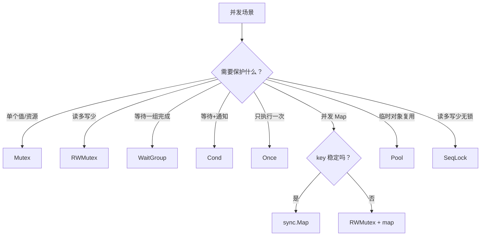

> 掌握 sync 包，就掌握了 Go 并发编程的"内功心法"。下一章我们将介绍 context 包，学习如何优雅地取消 goroutine 和传递请求作用域的数据。
