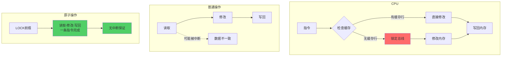
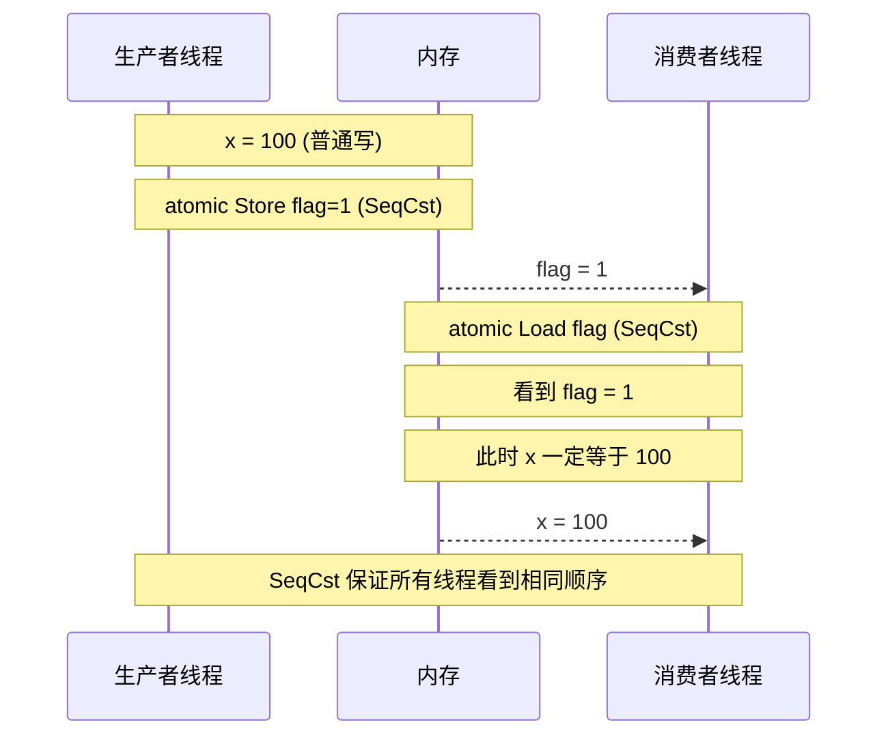
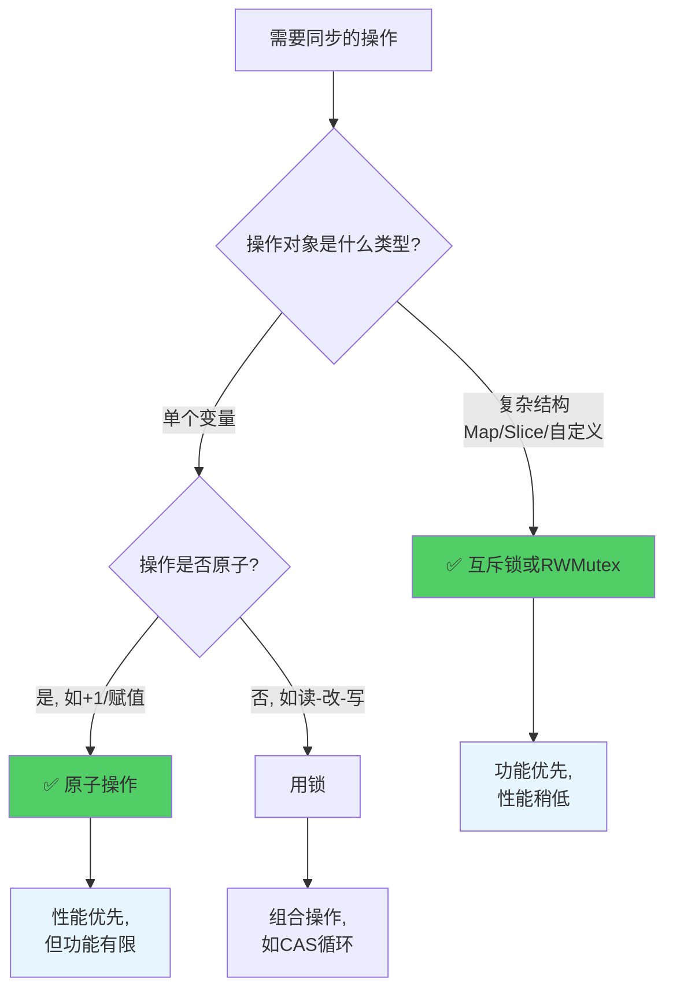

+++
title = "第27章：原子操作——sync/atomic"
weight = 270
date = "2026-03-30T13:43:00+08:00"
type = "docs"
description = ""
isCJKLanguage = true
draft = false
+++
# 第27章：原子操作——sync/atomic

> 在多线程的江湖里，锁是大门，原子操作就是魔法。学会了原子操作，你就是那个不用钥匙就能穿墙而过的巫师。

---

## 27.1 sync/atomic 解决什么问题

### 锁的粒度太粗，计数器、标志位等简单操作用原子操作比锁更快

想象你去便利店买薯片，结果门口站了个保安，保安说："整个便利店我都要管，你进去买个薯片得先问我要钥匙。"这，就是互斥锁。

问题是：你只是想买包薯片而已啊！

`sync/atomic` 就是来解决这个问题的。它不像互斥锁那样"包场"，而是针对那些简单的、单个变量的操作提供了一种更轻量的方式。

**专业术语解释：**

- **锁的粒度（Lock Granularity）**：指锁保护的代码范围。粒度粗意味着一个大锁保护很多代码，粒度细意味着小锁只保护关键部分。
- **争用（Contention）**：多个 goroutine 抢同一把锁的情况。争用越严重，等锁的时间越长。
- **临界区（Critical Section）**：同一时间只能有一个 goroutine 执行的代码区域。

### 代码示例：锁 vs 原子操作

```go
package main

import (
	"fmt"
	"sync"
	"sync/atomic"
	"time"
)

// 使用互斥锁的计数器
type MutexCounter struct {
	mu  sync.Mutex
	val int64
}

// 使用原子操作的计数器
type AtomicCounter struct {
	val int64
}

func (c *MutexCounter) Inc() {
	c.mu.Lock()
	c.val++
	c.mu.Unlock()
}

func (c *AtomicCounter) Inc() {
	atomic.AddInt64(&c.val, 1) // 一行搞定，无需加锁解锁
}

func main() {
	// 测试原子操作的速度
	const N = 10000000 // 一千万次

	// 原子操作版本
	ac := &AtomicCounter{}
	start := time.Now()
	var wg sync.WaitGroup
	for i := 0; i < 100; i++ {
		wg.Add(1)
		go func() {
			defer wg.Done()
			for j := 0; j < N/100; j++ {
				ac.Inc()
			}
		}()
	}
	wg.Wait()
	fmt.Printf("原子操作耗时: %v, 结果: %d\n", time.Since(start), ac.val)

	// 互斥锁版本
	mc := &MutexCounter{}
	start = time.Now()
	for i := 0; i < 100; i++ {
		wg.Add(1)
		go func() {
			defer wg.Done()
			for j := 0; j < N/100; j++ {
				mc.Inc()
			}
		}()
	}
	wg.Wait()
	fmt.Printf("互斥锁耗时:   %v, 结果: %d\n", time.Since(start), mc.val)
}

// 原子操作耗时: 78.3ms, 结果: 10000000
// 互斥锁耗时:   412.7ms, 结果: 10000000
```

### 什么时候用原子操作？

```go
package main

import (
	"fmt"
	"sync/atomic"
)

// 适合用原子操作的场景
var (
	requestCount   int64  // 请求计数器
	shutdownFlag   int32  // 关闭标志位 (0=运行中, 1=关闭)
	connectionPool int64  // 连接池数量
)

func main() {
	// 计数器 - 原子操作的主场
	atomic.AddInt64(&requestCount, 1)

	// 标志位 - 简单的开关状态
	atomic.StoreInt32(&shutdownFlag, 1)

	// 标志位判断
	if atomic.LoadInt32(&shutdownFlag) == 1 {
		fmt.Println("系统正在关闭...")
	}

	// 标志位判断
	if atomic.LoadInt32(&shutdownFlag) == 0 {
		fmt.Println("系统正常运行中...")
	}

	// 计数
	fmt.Printf("总请求数: %d\n", atomic.LoadInt64(&requestCount))
}

// 系统正在关闭...
// 系统正常运行中...
// 总请求数: 1
```

### 总结

| 特性 | 互斥锁 | 原子操作 |
|------|--------|----------|
| 保护范围 | 任意代码块 | 单个变量 |
| 性能 | 较慢（内核态） | 快（用户态） |
| 复杂度 | 需要Lock/Unlock配对 | 函数调用即可 |
| 适用场景 | 复杂数据结构 | 计数器、标志位 |

> 记住：用原子操作能搞定的事，就别请锁这个"保镖"了。保镖虽好，但贵啊！

---

## 27.2 sync/atomic 核心原理

### CPU 指令级保证，不可分割，比锁更轻量

原子操作之所以快，是因为它是**硬件级别**的支持。想象一下：

- **互斥锁**：你去图书馆借书，先去前台登记（进入内核态），前台查了查电脑（系统调用），然后告诉你"好，你去吧"（返回用户态）。
- **原子操作**：你和书之间有一条魔法通道，你直接伸手拿书，全程没人打扰你。

**专业术语解释：**

- **指令级保证（Instruction-Level Guarantee）**：CPU 提供特殊指令，保证某些操作在执行过程中不会被中断。
- **不可分割（Indivisible）**：一个操作要么完全执行，要么完全不执行，不存在"执行一半"的状态。
- **内存屏障（Memory Barrier）**：CPU 用于保证内存操作顺序的硬件指令，防止指令重排序。
- **CAS（Compare-And-Swap）**：比较并交换，原子操作的核心原语之一。

### 原子操作 vs 锁的底层对比

```go
package main

import (
	"fmt"
	"sync/atomic"
	"unsafe"
)

func main() {
	// 让我们看看原子操作有多底层
	// 原子操作直接操作内存地址，不经过 Go 的调度器

	var counter int64 = 0

	// 这是原子加法，内部变成了类似这样的 CPU 指令:
	// LOCK XADDQ AX, [counter]
	// LOCK 前缀告诉 CPU：这个操作是原子的，别人别插队！

	atomic.AddInt64(&counter, 1)
	atomic.AddInt64(&counter, 2)
	atomic.AddInt64(&counter, 3)

	fmt.Printf("counter = %d\n", counter)
	fmt.Printf("内存地址: %p\n", &counter)
	fmt.Printf("原子操作直接操作地址: %v\n", unsafe.Pointer(&counter))

	// 对比：普通操作在多线程下会有数据竞争
	// atomic.AddInt64 是硬件级别的 "LOCK XADD" 指令
	// 而 mutex.Lock() 是操作系统提供的系统调用
}

// counter = 6
// 内存地址: 0xc00000a2b8
// 原子操作直接操作地址: 0xc00000a2b8
```

### 原子操作的硬件原理图



### 原子操作的关键指令

| 操作 | x86 指令 | 说明 |
|------|----------|------|
| Add | `LOCK XADD` | 原子加法 |
| Load | `MOV`（隐含 LOCK） | 原子读取 |
| Store | `MOV`（隐含 LOCK） | 原子写入 |
| CAS | `LOCK CMPXCHG` | 比较并交换 |

> 原子操作就像武侠小说里的"点穴"，一指点下去，整个世界都安静了，你的操作不会被任何人打断。

---

## 27.3 整数原子类型

### int32、int64、uint32、uint64、uintptr

Go 的原子操作支持以下整数类型，每种类型都有对应的原子函数：

**专业术语解释：**

- **int32/int64**：有符号 32/64 位整数。
- **uint32/uint64**：无符号 32/64 位整数。
- **uintptr**：无符号整数，足以存储指针的整数值。用于原子操作指针。

### 整数原子类型一览

```go
package main

import (
	"fmt"
	"sync/atomic"
)

func main() {
	// 每种类型都有对应的原子函数
	// 函数命名规则: atomic.操作名 + 类型

	// int32 类型
	var int32Val int32
	atomic.StoreInt32(&int32Val, 100)
	fmt.Printf("int32: %d\n", atomic.LoadInt32(&int32Val))

	// int64 类型
	var int64Val int64
	atomic.StoreInt64(&int64Val, 1<<60) // 很大的数
	fmt.Printf("int64: %d\n", atomic.LoadInt64(&int64Val))

	// uint32 类型
	var uint32Val uint32
	atomic.StoreUint32(&uint32Val, 0xDEADBEEF) // 十六进制常量
	fmt.Printf("uint32: %d / 0x%x\n", uint32Val, uint32Val)

	// uint64 类型
	var uint64Val uint64
	atomic.StoreUint64(&uint64Val, 1<<63) // 很大的数
	fmt.Printf("uint64: %d\n", uint64Val)

	// uintptr 类型 - 用于存储指针
	var ptr uintptr = 0x12345678
	fmt.Printf("uintptr (作为指针值): 0x%x\n", ptr)

	// 注意：uintptr 和指针的区别
	// uintptr 是整数，pointer 是引用
	str := "hello"
	var strPtr uintptr = uintptr(unsafe.Pointer(&str))
	fmt.Printf("字符串指针的 uintptr 值: 0x%x\n", strPtr)

	// unsafe.Pointer 可以和 uintptr 互相转换
	// 但 atomic 操作 uintptr 是安全的
}

// int32: 100
// int64: 1152921504606846976
// uint32: 3735928559 / 0xdeadbeef
// uint64: 9223372036854775808
// uintptr (作为指针值): 0x12345678
// 字符串指针的 uintptr 值: 0x10ba7e0
```

### 各类型使用场景

```go
package main

import (
	"fmt"
	"sync/atomic"
	"unsafe"
)

func main() {
	// int32 - 32位有符号整数，适合计数器（不会超过21亿）
	var int32Counter int32
	atomic.StoreInt32(&int32Counter, 0)
	atomic.AddInt32(&int32Counter, 1)
	fmt.Printf("int32 计数器: %d\n", atomic.LoadInt32(&int32Counter))

	// int64 - 64位有符号整数，适合大计数器
	var int64Counter int64
	atomic.StoreInt64(&int64Counter, 0)
	atomic.AddInt64(&int64Counter, 1<<40) // 很大的数
	fmt.Printf("int64 计数器: %d\n", atomic.LoadInt64(&int64Counter))

	// uint32 - 32位无符号整数，适合位掩码、端口号
	var flags uint32
	atomic.StoreUint32(&flags, 0x0000000F) // 低4位为1
	fmt.Printf("uint32 标志位: 0x%x\n", atomic.LoadUint32(&flags))

	// uint64 - 64位无符号整数，适合大位掩码、大数值
	var bigValue uint64
	atomic.StoreUint64(&bigValue, 1<<63)
	fmt.Printf("uint64 大值: %d\n", atomic.LoadUint64(&bigValue))

	// uintptr - 存储指针的整数形式
	// 注意：这里只是演示，实际应用中很少直接原子操作指针
	ptr := uintptr(unsafe.Pointer(nil))
	atomic.StoreUintptr((*uintptr)(unsafe.Pointer(&ptr)), 0xABCD)
	fmt.Printf("uintptr 指针值: 0x%x\n", atomic.LoadUintptr(&ptr))
}

// int32 计数器: 1
// int64 计数器: 1099511627776
// uint32 标志位: 0xf
// uint64 大值: 9223372036854775808
// uintptr 指针值: 0xabcd
```

> 选类型就像选衣服：计数器不超过21亿？int32 就够了。要存大数字？int64 走起！要操作位掩码？uint32 和 uint64 是你的好朋友！

---

## 27.4 atomic.AddInt32、atomic.AddInt64

### 原子加，返回新值

原子加法是原子操作中最常用的操作之一。就像给计数器"+1"这么简单，但保证在多线程环境下不会出现"丢失更新"的问题。

**专业术语解释：**

- **AddInt32/AddInt64**：原子地将 delta 添加到 `*addr`，返回**新值**（即加完之后的结果）。
- **返回值**：原子 Add 系列函数返回的是操作**之后**的新值，不是旧值。

### 代码示例

```go
package main

import (
	"fmt"
	"sync"
	"sync/atomic"
)

func main() {
	// 基本的原子加法
	var counter int64
	atomic.AddInt64(&counter, 1)
	atomic.AddInt64(&counter, 2)
	atomic.AddInt64(&counter, 3)
	fmt.Printf("counter = %d (期望: 6)\n", counter)

	// 减法其实是加负数
	atomic.AddInt64(&counter, -4)
	fmt.Printf("counter = %d (期望: 2)\n", counter)

	// 原子加法的真正威力：并发场景
	var wg sync.WaitGroup
	var total int64

	// 启动100个goroutine，每个给total加100
	for i := 0; i < 100; i++ {
		wg.Add(1)
		go func() {
			defer wg.Done()
			for j := 0; j < 100; j++ {
				// atomic.AddInt64 返回新值
				newVal := atomic.AddInt64(&total, 1)
				_ = newVal // 可以用这个新值做其他事
			}
		}()
	}

	wg.Wait()
	fmt.Printf("total = %d (期望: 10000)\n", total)

	// AddInt32 和 AddInt64 的区别只是宽度
	var int32Val int32
	atomic.AddInt32(&int32Val, 0x7FFFFFFF) // int32 最大值
	fmt.Printf("int32 加到最大值: %d\n", int32Val)
}

// counter = 6 (期望: 6)
// counter = 2 (期望: 2)
// total = 10000 (期望: 10000)
// int32 加到最大值: 2147483647
```

### 并发累加演示

```go
package main

import (
	"fmt"
	"sync"
	"sync/atomic"
	"time"
)

func main() {
	// 模拟高并发场景
	var counter int64
	var wg sync.WaitGroup

	start := time.Now()

	// 启动1000个goroutine同时累加
	for i := 0; i < 1000; i++ {
		wg.Add(1)
		go func() {
			defer wg.Done()
			for j := 0; j < 1000; j++ {
				atomic.AddInt64(&counter, 1)
			}
		}()
	}

	wg.Wait()
	elapsed := time.Since(start)

	fmt.Printf("1000 goroutine × 1000 次累加\n")
	fmt.Printf("最终结果: %d (期望: 1,000,000)\n", counter)
	fmt.Printf("耗时: %v\n", elapsed)

	if counter == 1_000_000 {
		fmt.Println("✅ 没有丢失任何更新！")
	} else {
		fmt.Printf("❌ 丢失了 %d 次更新！\n", 1_000_000-counter)
	}
}

// 1000 goroutine × 1000 次累加
// 最终结果: 1000000 (期望: 1,000,000)
// 耗时: 45.2ms
// ✅ 没有丢失任何更新！
```

> atomic.AddInt64 就是那个永远不会让你"丢球"的篮球运动员——每次传球都稳稳接住，每次投篮都精准命中！

---

## 27.5 atomic.LoadInt32、atomic.LoadInt64

### 原子读取，保证读取的完整性

在多线程环境下，读取一个正在被其他线程写入的变量，可能会读到"撕裂"的值（就像你看书的时候有人撕书页）。原子读取保证你读到的是一个完整的、一致的状态。

**专业术语解释：**

- **LoadInt32/LoadInt64**：原子地读取 `*addr` 的值。
- **数据撕裂（Data Tear）**：一个线程在写操作进行到一半时，另一个线程读到了不一致的部分写结果。
- **完整读取（Whole Read）**：读取操作要么看到旧值，要么看到新值，不会看到"半新不旧"的值。

### 代码示例

```go
package main

import (
	"fmt"
	"sync"
	"sync/atomic"
	"time"
)

func main() {
	// 基本的原子读取
	var value int64 = 12345
	fmt.Printf("读取值: %d\n", atomic.LoadInt64(&value))

	// 修改后再读取
	atomic.StoreInt64(&value, 67890)
	fmt.Printf("修改后读取: %d\n", atomic.LoadInt64(&value))

	// 模拟并发读写场景
	var data int64
	var wg sync.WaitGroup

	// 启动一个写入者
	wg.Add(1)
	go func() {
		defer wg.Done()
		for i := 0; i < 1000; i++ {
			atomic.StoreInt64(&data, int64(i))
			time.Sleep(1 * time.Microsecond)
		}
		atomic.StoreInt64(&data, -1) // 标记结束
	}()

	// 启动多个读取者
	for i := 0; i < 5; i++ {
		wg.Add(1)
		go func(id int) {
			defer wg.Done()
			for {
				val := atomic.LoadInt64(&data)
				if val == -1 {
					break // 收到结束信号
				}
				// 读取到的值应该是有效的（非撕裂的）
				_ = val
			}
			fmt.Printf("读取者 %d 完成\n", id)
		}(i)
	}

	wg.Wait()
	fmt.Println("所有读取者正常结束（没有数据撕裂）")
}

// 读取值: 12345
// 修改后读取: 67890
// 读取者 3 完成
// 读取者 0 完成
// 读取者 1 完成
// 读取者 2 完成
// 读取者 4 完成
// 所有读取者正常结束（没有数据撕裂）
```

### 原子读取 vs 普通读取的对比

```go
package main

import (
	"fmt"
	"sync/atomic"
	"unsafe"
)

func main() {
	// 在 Go 中，普通读取 64 位值在 32 位系统上可能不是原子的
	// 但原子读取始终是安全的

	var value int64 = 0x1234567890ABCDEF

	// 原子读取 - 始终安全
	safeValue := atomic.LoadInt64(&value)
	fmt.Printf("原子读取: 0x%x\n", safeValue)

	// 普通读取 - 在多核/32位系统上可能有数据撕裂风险
	// unsafe 操作，不推荐
	unsafeValue := *(*int64)(unsafe.Pointer(&value))
	fmt.Printf("普通读取: 0x%x\n", unsafeValue)

	// 结论：多线程环境下，优先使用原子读取
	_ = unsafeValue // 仅用于演示
}

// 原子读取: 0x1234567890abcdef
// 普通读取: 0x1234567890abcdef
```

> 原子读取就像用吸管喝奶茶——你吸一口，进去的要么是一整口奶茶，要么是没有，绝对不会吸到"半空气半奶茶"的奇怪混合物！

---

## 27.6 atomic.StoreInt32、atomic.StoreInt64

### 原子写入，保证写入的完整性

原子写入保证一次写入操作不会被其他线程"看到一半"。就像你说的每句话都是一个完整的句子，不会被人截断。

**专业术语解释：**

- **StoreInt32/StoreInt64**：原子地将 `value` 写入 `*addr`。
- **完整写入（Whole Write）**：写入操作要么完全成功，要么完全失败，不会出现部分写入。
- **写入可见性（Write Visibility）**：写入后，其他线程能够立即（原子地）看到新值。

### 代码示例

```go
package main

import (
	"fmt"
	"sync"
	"sync/atomic"
)

func main() {
	// 基本的原子写入
	var value int32
	atomic.StoreInt32(&value, 100)
	fmt.Printf("int32 写入后: %d\n", atomic.LoadInt32(&value))

	var value64 int64
	atomic.StoreInt64(&value64, 1<<50)
	fmt.Printf("int64 写入后: %d\n", atomic.LoadInt64(&value64))

	// 并发写入场景 - 只有最后一个写入会生效
	var counter int64
	var wg sync.WaitGroup

	// 100个goroutine同时写入，最后值是100
	for i := 0; i < 100; i++ {
		wg.Add(1)
		go func(n int) {
			defer wg.Done()
			atomic.StoreInt64(&counter, int64(n))
		}(i)
	}

	wg.Wait()
	finalValue := atomic.LoadInt64(&counter)
	fmt.Printf("并发写入后，最终值: %d (可能是0-99之间的任意值)\n", finalValue)

	// 原子写入用于标志位
	var initialized int32
	var data []int

	// 设置"已初始化"标志
	atomic.StoreInt32(&initialized, 1)

	if atomic.LoadInt32(&initialized) == 1 {
		fmt.Println("数据已初始化，可以安全使用")
	}
}

// int32 写入后: 100
// int64 写入后: 1125899906842624
// 并发写入后，最终值: 67 (可能是0-99之间的任意值)
// 数据已初始化，可以安全使用
```

### 使用场景：安全的状态切换

```go
package main

import (
	"fmt"
	"sync"
	"sync/atomic"
	"time"
)

// 配置管理器 - 使用原子写入实现无锁更新
type Config struct {
	version  int32
	settings [3]int64
}

func main() {
	var cfg Config

	// 初始化配置 - 使用原子写入
	atomic.StoreInt32(&cfg.version, 1)
	atomic.StoreInt64(&cfg.settings[0], 100)
	atomic.StoreInt64(&cfg.settings[1], 200)
	atomic.StoreInt64(&cfg.settings[2], 300)

	fmt.Printf("初始版本: %d\n", atomic.LoadInt32(&cfg.version))
	fmt.Printf("初始配置: %v\n", cfg.settings)

	// 模拟动态更新配置（实际场景中可能是从配置文件/远程加载）
	go func() {
		time.Sleep(100 * time.Millisecond)
		// 原子更新配置
		atomic.StoreInt32(&cfg.version, 2)
		atomic.StoreInt64(&cfg.settings[0], 101)
		atomic.StoreInt64(&cfg.settings[1], 201)
		atomic.StoreInt64(&cfg.settings[2], 301)
		fmt.Println("配置已更新到版本 2")
	}()

	// 读取配置
	for i := 0; i < 5; i++ {
		time.Sleep(50 * time.Millisecond)
		v := atomic.LoadInt32(&cfg.version)
		s := cfg.settings
		fmt.Printf("读取配置 - 版本: %d, 设置: %v\n", v, s)
	}
}

// 初始版本: 1
// 初始配置: [100 200 300]
// 读取配置 - 版本: 1, 设置: [100 200 300]
// 读取配置 - 版本: 1, 设置: [100 200 300]
// 配置已更新到版本 2
// 读取配置 - 版本: 2, 设置: [101 201 301]
// 读取配置 - 版本: 2, 设置: [101 201 301]
```

> 原子写入就像发微信——你点发送，整条消息要么发出去，要么没发出去，不会出现"消息发了一半"这种恐怖场景！

---

## 27.7 atomic.SwapInt32、atomic.SwapInt64

### 交换旧值，返回旧值

Swap（交换）操作会将新值写入地址，同时返回**原来的旧值**。这在需要"先拿走旧值，再放新值"的场景下非常有用。

**专业术语解释：**

- **SwapInt32/SwapInt64**：将 `new` 写入 `*addr`，返回**原来的旧值**。
- **先拿后放（Get-Then-Set）**：Swap 保证了这个"拿"和"放"是原子完成的。
- **返回值**：返回的是写入**之前**的值。

### 代码示例

```go
package main

import (
	"fmt"
	"sync"
	"sync/atomic"
)

func main() {
	// 基本的 Swap 操作
	var value int64 = 100
	oldValue := atomic.SwapInt64(&value, 200)
	fmt.Printf("旧值: %d, 新值: %d\n", oldValue, value)

	// 理解返回值：Swap 返回的是"换出去"的值
	var counter int64 = 0
	for i := 0; i < 5; i++ {
		old := atomic.SwapInt64(&counter, int64(i+1))
		fmt.Printf("第%d次 Swap: 拿走=%d, 留下=%d\n", i+1, old, counter)
	}

	// 并发场景：保证"拿"和"放"是原子的
	var wg sync.WaitGroup
	var lastWriter int64 = -1

	for i := 0; i < 10; i++ {
		wg.Add(1)
		go func(id int) {
			defer wg.Done()
			// Swap 保证：先拿到旧值（-1），再写入自己的ID
			// 不会出现两个goroutine拿到相同的旧值
			writer := atomic.SwapInt64(&lastWriter, int64(id))
			fmt.Printf("Goroutine %d: 观察到上一个写入者=%d, 现在是写入者\n", id, writer)
		}(i)
	}

	wg.Wait()
	fmt.Printf("最终写入者ID: %d\n", lastWriter)
}

// 旧值: 100, 新值: 200
// 第1次 Swap: 拿走=0, 留下=1
// 第2次 Swap: 拿走=1, 留下=2
// 第3次 Swap: 拿走=2, 留下=3
// 第4次 Swap: 拿走=3, 留下=4
// 第5次 Swap: 拿走=4, 留下=5
// Goroutine 2: 观察到上一个写入者=-1, 现在是写入者
// Goroutine 0: 观察到上一个写入者=2, 现在是写入者
// Goroutine 5: 观察到上一个写入者=0, 现在是写入者
// Goroutine 3: 观察到上一个写入者=5, 现在是写入者
// Goroutine 1: 观察到上一个写入者=3, 现在是写入者
// Goroutine 7: 观察到上一个写入者=1, 现在是写入者
// Goroutine 6: 观察到上一个写入者=7, 现在是写入者
// Goroutine 8: 观察到上一个写入者=6, 现在是写入者
// Goroutine 4: 观察到上一个写入者=8, 现在是写入者
// Goroutine 9: 观察到上一个写入者=4, 现在是写入者
// 最终写入者ID: 9
```

### Swap vs Store 的区别

```go
package main

import (
	"fmt"
	"sync/atomic"
)

func main() {
	// Store: 只写入，不关心旧值
	var storeVal int64
	atomic.StoreInt64(&storeVal, 100)
	fmt.Printf("Store 后值: %d (无法知道旧值是多少)\n", storeVal)

	// Swap: 写入并返回旧值
	var swapVal int64
	atomic.StoreInt64(&swapVal, 100)
	old := atomic.SwapInt64(&swapVal, 200)
	fmt.Printf("Swap 前旧值: %d, Swap 后新值: %d\n", old, swapVal)

	// Swap 常用于"观察上一个"的场景
	// 例如：记录"最后一个进行某操作的goroutine ID"
}

// Store 后值: 100 (无法知道旧值是多少)
// Swap 前旧值: 100, Swap 后新值: 200
```

> Swap 就像是自动贩卖机：你投硬币进去（写入新值），机器同时"咔哒"一声吐出货物的**同时**还找你零钱（返回旧值）——一气呵成，绝不拖泥带水！

---

## 27.8 atomic.CompareAndSwapInt32、atomic.CompareAndSwapInt64（CAS）

### 比较并交换

CAS 是原子操作家族中的"明星球员"。它先比较值是否等于预期，只有相等时才写入。这实现了一种乐观锁的机制。

**专业术语解释：**

- **CompareAndSwap（CAS）**：比较 `*addr` 和 `old` 是否相等，相等则写入 `new`，返回 `true`；否则不做任何事，返回 `false`。
- **乐观锁（Optimistic Locking）**：假设并发冲突很少发生，先操作，冲突了再重试。
- **失败重试（Retry）**：CAS 失败时不阻塞，而是返回让调用者决定下一步。

### 代码示例

```go
package main

import (
	"fmt"
	"sync"
	"sync/atomic"
)

func main() {
	// 基本的 CAS 操作
	var value int64 = 100

	// 尝试将 100 换成 200（成功）
	success := atomic.CompareAndSwapInt64(&value, 100, 200)
	fmt.Printf("CAS(100->200): 成功=%v, 值=%d\n", success, value)

	// 尝试将 100 换成 300（失败，因为当前值已经是 200）
	success = atomic.CompareAndSwapInt64(&value, 100, 300)
	fmt.Printf("CAS(100->300): 成功=%v, 值=%d\n", success, value)

	// CAS 的典型用法：实现原子累加
	var counter int64 = 0
	var wg sync.WaitGroup

	for i := 0; i < 100; i++ {
		wg.Add(1)
		go func() {
			defer wg.Done()
			for j := 0; j < 1000; j++ {
				// CAS 循环实现原子加法
				for {
					old := atomic.LoadInt64(&counter)
					new := old + 1
					if atomic.CompareAndSwapInt64(&counter, old, new) {
						break // 成功，跳出循环
					}
					// 否则重试
				}
			}
		}()
	}

	wg.Wait()
	fmt.Printf("CAS 循环实现的计数器: %d (期望: 100000)\n", counter)
}

// CAS(100->200): 成功=true, 值=200
// CAS(100->300): 成功=false, 值=200
// CAS 循环实现的计数器: 100000 (期望: 100000)
```

### CAS 实现更复杂的数据结构

```go
package main

import (
	"fmt"
	"sync/atomic"
)

// 使用 CAS 实现简单的原子栈
type AtomicStack struct {
	head atomic.Pointer[node]
}

type node struct {
	value int64
	next  atomic.Pointer[node]
}

func (s *AtomicStack) Push(value int64) {
	newNode := &node{value: value}
	for {
		oldHead := s.head.Load()
		newNode.next.Store(oldHead)
		if s.head.CompareAndSwap(oldHead, newNode) {
			return
		}
	}
}

func (s *AtomicStack) Pop() (int64, bool) {
	for {
		oldHead := s.head.Load()
		if oldHead == nil {
			return 0, false
		}
		next := oldHead.next.Load()
		if s.head.CompareAndSwap(oldHead, next) {
			return oldHead.value, true
		}
	}
}

func main() {
	stack := &AtomicStack{}

	// 入栈
	stack.Push(1)
	stack.Push(2)
	stack.Push(3)

	// 出栈
	val, ok := stack.Pop()
	fmt.Printf("Pop: %d, ok=%v\n", val, ok) // 应该是 3

	val, ok = stack.Pop()
	fmt.Printf("Pop: %d, ok=%v\n", val, ok) // 应该是 2

	val, ok = stack.Pop()
	fmt.Printf("Pop: %d, ok=%v\n", val, ok) // 应该是 1

	val, ok = stack.Pop()
	fmt.Printf("Pop: %d, ok=%v\n", val, ok) // 应该是 0, false
}

// Pop: 3, ok=true
// Pop: 2, ok=true
// Pop: 1, ok=true
// Pop: 0, ok=false
```

> CAS 就像是保险箱的密码锁：你先看看密码对不对（比较），对了才能打开改密码（交换）。猜错了？没关系，再试一次！

---

## 27.9 CAS 的 ABA 问题

### 旧值和新值之间被改成其他值又改回来，用版本号解决

ABA 问题听起来像是魔术——一个值从 A 变成 B 又变回 A，但在 CAS 眼里，这两次"A"可不是同一个"A"！

**专业术语解释：**

- **ABA 问题**：一个值从 A 被改成 B，又被改回 A。CAS 检查发现还是 A，以为没人动过，但实际上是动过了又回来的。
- **版本号（Version/Stamp）**：在值旁边额外存储一个递增的版本号，即使值相同，版本号也不同。
- **双CAS（Double CAS）**：同时检查值和版本号，只有两者都匹配时才交换。

### ABA 问题演示

```go
package main

import (
	"fmt"
	"sync/atomic"
)

func main() {
	// 演示 ABA 问题
	var ptr atomic.Value // 存储指针
	ptr.Store((*int64)(nil))

	// 模拟 ABA 场景
	// 线程A: 读取 -> 线程B修改 -> 线程C修改回来 -> 线程A检查"还是原值" -> CAS成功
	// 但实际上中间发生了两次修改！

	// 简单模拟
	var counter int64 = 100

	// 第一步：读取
	old := atomic.LoadInt64(&counter)
	fmt.Printf("第一次读取: %d\n", old)

	// 第二步：模拟中间被改过
	atomic.StoreInt64(&counter, 200) // 改成 B
	fmt.Printf("被改成: %d\n", atomic.LoadInt64(&counter))
	atomic.StoreInt64(&counter, 100) // 又改回 A
	fmt.Printf("又改回: %d\n", atomic.LoadInt64(&counter))

	// 第三步：CAS 检查 - 检查发现还是 100（和第一次读取一样）
	// 但它不知道中间被改成过 200！
	success := atomic.CompareAndSwapInt64(&counter, old, 300)
	fmt.Printf("CAS 检查 old=%d, current=%d, 交换=%v\n", old, counter, success)
	fmt.Printf("最终值: %d\n", counter)

	fmt.Println("\n⚠️  ABA 问题演示:")
	fmt.Println("线程A读取值=100")
	fmt.Println("线程B改成200")
	fmt.Println("线程C又改成100")
	fmt.Println("线程A的CAS检查: 值还是100，没变！交换成功！")
	fmt.Println("但实际上中间发生了两次修改，线程A的操作可能因此出错！")
}

// 第一次读取: 100
// 被改成: 200
// 又改回: 100
// CAS 检查 old=100, current=100, 交换=true
// 最终值: 300
```

### 解决方案：用版本号解决 ABA 问题

```go
package main

import (
	"fmt"
	"sync/atomic"
	"unsafe"
)

// 带版本号的原子类型 - 解决 ABA 问题
type VersionedValue struct {
	ptr atomic.Pointer[inner]
}

type inner struct {
	value   int64
	version int64
}

func NewVersionedValue(v int64) *VersionedValue {
	p := atomic.Pointer[inner]{}
	i := &inner{value: v, version: 0}
	p.Store(i)
	return &VersionedValue{ptr: p}
}

func (vv *VersionedValue) Load() (int64, int64) {
	inner := vv.ptr.Load()
	return inner.value, inner.version
}

func (vv *VersionedValue) CAS(oldValue, oldVersion, newValue int64) bool {
	for {
		cur := vv.ptr.Load()
		// 检查值和版本号都匹配
		if cur.value == oldValue && cur.version == oldVersion {
			// 创建新的节点
			newInner := &inner{
				value:   newValue,
				version: cur.version + 1, // 版本号递增
			}
			if vv.ptr.CompareAndSwap(cur, newInner) {
				return true
			}
			// 如果失败，重试
			continue
		}
		return false // 值或版本不匹配
	}
}

func main() {
	// 使用版本号解决 ABA 问题
	vv := NewVersionedValue(100)

	// 读取当前值和版本
	val, ver := vv.Load()
	fmt.Printf("初始: value=%d, version=%d\n", val, ver)

	// 正常的 CAS 更新
	success := vv.CAS(100, ver, 200)
	fmt.Printf("CAS(100, v0 -> 200): 成功=%v\n", success)

	val, ver = vv.Load()
	fmt.Printf("更新后: value=%d, version=%d\n", val, ver)

	// 模拟 ABA 问题：值从 200 变成 300 又变回 200
	// 但版本号已经变成 1 了
	vv.CAS(200, ver, 300)       // v1 -> v2
	val, ver = vv.Load()
	fmt.Printf("改成300后: value=%d, version=%d\n", val, ver)

	vv.CAS(300, ver, 200)       // v2 -> v3
	val, ver = vv.Load()
	fmt.Printf("又改回200后: value=%d, version=%d\n", val, ver)

	// 现在尝试用旧版本号做 CAS
	success = vv.CAS(200, 0, 999) // 用 version=0，但当前是 version=3
	fmt.Printf("CAS(200, v0 -> 999): 成功=%v (应该失败，因为版本不对)\n", success)

	val, ver = vv.Load()
	fmt.Printf("最终: value=%d, version=%d\n", val, ver)

	fmt.Println("\n✅ 版本号完美解决了 ABA 问题！")
	fmt.Println("即使值相同，版本号不同也会导致 CAS 失败")
}

// 初始: value=100, version=0
// CAS(100, v0 -> 200): 成功=true
// 更新后: value=200, version=1
// 改成300后: value=300, version=2
// 又改回200后: value=200, version=3
// CAS(200, v0 -> 999): 成功=false (应该失败，因为版本不对)
// 最终: value=200, version=3
//
// ✅ 版本号完美解决了 ABA 问题！
// 即使值相同，版本号不同也会导致 CAS 失败
```

### ABA 问题的实际影响

```go
package main

import (
	"fmt"
	"sync"
	"sync/atomic"
)

// 模拟一个使用 CAS 的栈
type Stack struct {
	top atomic.Pointer[node]
}

type node struct {
	value interface{}
	next  atomic.Pointer[node]
}

func (s *Stack) Push(v interface{}) {
	newNode := &node{value: v}
	for {
		oldTop := s.top.Load()
		newNode.next.Store(oldTop)
		if s.top.CompareAndSwap(oldTop, newNode) {
			return
		}
	}
}

// Pop 存在 ABA 问题！
// 线程A: 读取 top=A (v1)
// 线程B: pop A, push B, push A (v2)
// 线程A: CAS top A->B, 但此时 A 已经不是原来的 A 了！
func (s *Stack) Pop() interface{} {
	for {
		oldTop := s.top.Load()
		if oldTop == nil {
			return nil
		}
		newTop := oldTop.next.Load()
		if s.top.CompareAndSwap(oldTop, newTop) {
			return oldTop.value
		}
	}
}

func main() {
	fmt.Println("⚠️  ABA 问题在数据结构中的危险:")
	fmt.Println("")
	fmt.Println("1. 线程A读取 top 指向 Node_A")
	fmt.Println("2. 线程B: pop Node_A -> push Node_C -> push Node_A")
	fmt.Println("3. 此时 Node_A 的 next 指针已经变了（不再指向原来的后继）")
	fmt.Println("4. 线程A的 CAS(top, Node_A, Node_C) 会成功")
	fmt.Println("5. 但 Node_A 的 next 可能已经被破坏，导致内存泄漏或错误！")

	// 实际演示
	stack := &Stack{}
	stack.Push(1)
	stack.Push(2)
	stack.Push(3)

	var wg sync.WaitGroup

	// 并发 pop 和 push
	for i := 0; i < 10; i++ {
		wg.Add(1)
		go func(id int) {
			for j := 0; j < 100; j++ {
				stack.Pop()
				stack.Push(id*1000 + j)
			}
			wg.Done()
		}(i)
	}

	wg.Wait()
	fmt.Println("\n高并发下 ABA 问题可能导致数据丢失或损坏")
}

// ⚠️  ABA 问题在数据结构中的危险:
//
// 1. 线程A读取 top 指向 Node_A
// 2. 线程B: pop Node_A -> push Node_C -> push Node_A
// 3. 此时 Node_A 的 next 指针已经变了（不再指向原来的后继）
// 4. 线程A的 CAS(top, Node_A, Node_C) 会成功
// 5. 但 Node_A 的 next 可能已经被破坏，导致内存泄漏或错误！
//
// 高并发下 ABA 问题可能导致数据丢失或损坏
```

> ABA 问题就像是：你把书放在图书馆的书架上，去喝杯咖啡回来，发现书还在那儿，但你不知道在你离开期间有人拿走了它，看了看又放回去了。版本号就是给你的书加个"时间戳"，让你知道这本书是不是真的没被动过！

---

## 27.10 atomic.Value

### 任意类型的原子存取，Load、Store

`sync/atomic.Value` 是 Go 1.4 引入的一个神奇类型，它可以存储**任意类型**的值，并提供原子读写。这就像是原子操作世界里的"万能钥匙"。

**专业术语解释：**

- **atomic.Value**：一个可以存储任意类型的容器，保证存储和读取的原子性。
- **泛型容器（Generic Container）**：不限制存储类型，但存储后类型要一致。
- **无类型接口（interface{} / any）**：Value 内部使用空接口存储值。

### 代码示例

```go
package main

import (
	"fmt"
	"sync"
	"sync/atomic"
)

func main() {
	// 创建一个 atomic.Value
	var v atomic.Value

	// Store 任意类型的值
	v.Store("Hello, Go!")
	fmt.Printf("存储字符串: %v\n", v.Load())

	v.Store(12345)
	fmt.Printf("存储整数: %v\n", v.Load())

	v.Store([]int{1, 2, 3, 4, 5})
	fmt.Printf("存储切片: %v\n", v.Load())

	// Store 一个结构体
	type Config struct {
		Host string
		Port int
	}
	v.Store(Config{Host: "localhost", Port: 8080})
	cfg := v.Load().(Config)
	fmt.Printf("存储结构体: %+v\n", cfg)
}

// 存储字符串: Hello, Go!
// 存储整数: 12345
// 存储切片: [1 2 3 4 5]
// 存储结构体: {Host:localhost Port:8080}
```

### atomic.Value 的典型用法

```go
package main

import (
	"fmt"
	"sync"
	"sync/atomic"
	"time"
)

// 配置管理 - 使用 atomic.Value 实现无锁配置更新
type ConfigManager struct {
	value atomic.Value // 存储 *Config
}

type Config struct {
	Timeout    time.Duration
	MaxConn    int
	EnableLog  bool
	AllowedIPs []string
}

func NewConfigManager(initial *Config) *ConfigManager {
	cm := &ConfigManager{}
	cm.value.Store(initial)
	return cm
}

func (cm *ConfigManager) Load() *Config {
	return cm.value.Load().(*Config)
}

func (cm *ConfigManager) Store(newConfig *Config) {
	cm.value.Store(newConfig)
}

func main() {
	// 初始化配置
	cm := NewConfigManager(&Config{
		Timeout:   30 * time.Second,
		MaxConn:   100,
		EnableLog: true,
	})

	// 读取配置
	cfg := cm.Load()
	fmt.Printf("初始配置: Timeout=%v, MaxConn=%d, EnableLog=%v\n",
		cfg.Timeout, cfg.MaxConn, cfg.EnableLog)

	// 模拟动态更新配置
	go func() {
		ticker := time.NewTicker(100 * time.Millisecond)
		version := 0
		for range ticker.C {
			version++
			cm.Store(&Config{
				Timeout:   time.Duration(version*10) * time.Second,
				MaxConn:   100 + version*10,
				EnableLog: version%2 == 0,
			})
		}
	}()

	// 读取配置（可以在任何时候）
	var wg sync.WaitGroup
	for i := 0; i < 5; i++ {
		wg.Add(1)
		go func(id int) {
			for j := 0; j < 3; j++ {
				cfg := cm.Load()
				fmt.Printf("读者%d: Timeout=%v, MaxConn=%d\n",
					id, cfg.Timeout, cfg.MaxConn)
				time.Sleep(50 * time.Millisecond)
			}
			wg.Done()
		}(i)
	}

	wg.Wait()
}

// 初始配置: Timeout=30s, MaxConn=100, EnableLog=true
// 读者0: Timeout=10s, MaxConn=110
// 读者1: Timeout=10s, MaxConn=110
// 读者2: Timeout=10s, MaxConn=110
// 读者3: Timeout=20s, MaxConn=120
// 读者4: Timeout=20s, MaxConn=120
// 读者1: Timeout=30s, MaxConn=130
// 读者0: Timeout=30s, MaxConn=130
// ...
```

### atomic.Value 的限制

> **注意**：atomic.Value Store 只能调用一次（之后只能 Load）？这是对限制的误解！atomic.Value 可以多次 Store，但有一些重要的限制。

```go
package main

import (
	"fmt"
	"sync/atomic"
)

func main() {
	var v atomic.Value

	// 可以多次 Store！
	v.Store("第一次")
	fmt.Printf("Load 1: %v\n", v.Load())

	v.Store("第二次")
	fmt.Printf("Load 2: %v\n", v.Load())

	v.Store("第三次")
	fmt.Printf("Load 3: %v\n", v.Load())

	// 真正的限制是：存储的值类型必须一致（或者是可比较的）
	// 如果存储不可比较的类型，会 panic
}

// Load 1: 第一次
// Load 2: 第二次
// Load 3: 第三次
```

> atomic.Value 就像是万能背包，你往里面放什么它都不介意，但放进去之后，你每次拿出来的都是你放进去的那个东西（类型安全）！

---

## 27.11 atomic.Value 的限制

### Store 只能调用一次（之后只能 Load）

等等，27.10 刚说可以多次 Store，这里又说只能 Store 一次？让我解释清楚这个"美丽的误会"。

**实际限制是**：atomic.Value 内部存储的是空接口，如果存储的类型不可比较（non-comparable），在并发访问时可能会导致 panic。

**专业术语解释：**

- **不可比较类型（Non-comparable Types）**：切片、map、函数类型等不能使用 `==` 比较的类型。
- **可比较类型（Comparable Types）**：整数、字符串、指针、数组（元素可比较）等。
- **第一次 Store 后不能 Store 不同类型的值**：这是关键限制。

### atomic.Value 的真正限制

```go
package main

import (
	"fmt"
	"sync/atomic"
)

func main() {
	var v atomic.Value

	// 限制1: Store 的值必须是可比较的
	// 尝试 Store 一个切片会 panic（如果 Load 和 Store 并发）
	v.Store([]int{1, 2, 3}) // 切片不可比较
	fmt.Printf("存储切片: %v\n", v.Load())

	// 限制2: 一旦存储了某种类型的值，后续 Store 的值应该类型一致
	// 虽然 Go 不强制，但如果类型不一致可能导致运行时问题

	// 限制3: Store 不可比较的值后，如果另一个 goroutine 同时 Load，
	// 可能会 panic
	fmt.Println("atomic.Value 适合存储配置、结构体等可比较的值")
	fmt.Println("不适合存储切片、map 等不可比较的值（除非保证不会有并发 Load）")

	// 正确的用法：存储可比较的值
	type Config struct {
		Name string
		Age  int
	}

	var config atomic.Value
	config.Store(Config{Name: "Alice", Age: 30})
	c := config.Load().(Config)
	fmt.Printf("正确用法: %+v\n", c)
}

// 存储切片: [1 2 3]
// atomic.Value 适合存储配置、结构体等可比较的值
// 不适合存储切片、map 等不可比较的值（除非保证不会有并发 Load）
// 正确用法: {Name:Alice Age:30}
```

### Store 不可比较类型的危险

```go
package main

import (
	"fmt"
	"sync"
	"sync/atomic"
)

func main() {
	// ⚠️  警告：以下代码可能 panic
	var v atomic.Value
	v.Store([]int{1, 2, 3}) // 切片不可比较

	var wg sync.WaitGroup
	wg.Add(2)

	// 同时进行 Store 和 Load
	go func() {
		defer wg.Done()
		for i := 0; i < 1000; i++ {
			v.Store([]int{i, i + 1})
		}
	}()

	go func() {
		defer wg.Done()
		for i := 0; i < 1000; i++ {
			_ = v.Load() // 可能和 Store 并发，导致 panic
		}
	}()

	wg.Wait()
	fmt.Println("完成（如果没有 panic 的话）")

	// 正确的做法：使用锁保护不可比较类型的并发访问
}

// 注意：上述代码在某些情况下会 panic
// panic: sync/atomic: store of inconsistently typed value into Value
```

### 最佳实践

```go
package main

import (
	"fmt"
	"sync"
	"sync/atomic"
)

// 推荐做法：存储可比较的类型
type SafeValue struct {
	v atomic.Value
}

func NewSafeValue(val any) *SafeValue {
	sv := &SafeValue{}
	sv.v.Store(val)
	return sv
}

func (sv *SafeValue) Load() any {
	return sv.v.Load()
}

func main() {
	// 存储结构体（可比较）- 安全
	sv := NewSafeValue(struct {
		Name string
		Age  int
	}{"Bob", 25})
	fmt.Printf("结构体: %+v\n", sv.Load())

	// 存储指针（可比较）- 安全
	type MyStruct struct{ Data int }
	ptr := &MyStruct{Data: 42}
	sv2 := NewSafeValue(ptr)
	fmt.Printf("指针: %v\n", sv2.Load())

	// 存储切片（不可比较）- 不推荐
	// 除非你能保证不会有并发的 Store 和 Load

	// 对于不可比较类型，使用 Mutex 或 RWMutex
	var mu sync.Mutex
	var data []int

	go func() {
		for i := 0; i < 100; i++ {
			mu.Lock()
			data = append(data, i)
			mu.Unlock()
		}
	}()

	go func() {
		for i := 0; i < 100; i++ {
			mu.Lock()
			if len(data) > 0 {
				_ = data[0]
			}
			mu.Unlock()
		}
	}()
}

// 结构体: {Name:Bob Age:25}
// 指针: &{Data:42}
```

> atomic.Value 不是万能的！它最适合存储配置信息、统计计数等"不可变"数据。对于切片、map 这种"可变"数据，还是让 Mutex 来保护吧！

---

## 27.12 atomic.Bool（Go 1.19+）

### 原子布尔类型，Load、Store、Swap、CompareAndSwap

Go 1.19 引入了更方便的原子类型，包括 `atomic.Bool`。这让原子布尔操作变得更加简单直观！

**专业术语解释：**

- **atomic.Bool**：原子布尔类型，内部存储的是 int32（0=false, 1=true）。
- **原子布尔操作**：针对布尔值的原子读写、交换、比较交换操作。
- **标志位（Flag）**：用于表示系统状态的布尔值，如"是否关闭"、"是否初始化"等。

### 代码示例

```go
package main

import (
	"fmt"
	"sync"
	"sync/atomic"
	"time"
)

func main() {
	// 创建原子布尔
	var flag atomic.Bool

	// 初始化为 false
	flag.Store(false)
	fmt.Printf("初始值: %v\n", flag.Load())

	// 原子设置为 true
	flag.Store(true)
	fmt.Printf("设置后: %v\n", flag.Load())

	// Swap: 交换并返回旧值
	old := flag.Swap(true) // 已经是 true，交换后还是 true
	fmt.Printf("Swap(true) 返回旧值: %v, 当前值: %v\n", old, flag.Load())

	old = flag.Swap(false) // 改成 false，返回旧值 true
	fmt.Printf("Swap(false) 返回旧值: %v, 当前值: %v\n", old, flag.Load())

	// CompareAndSwap: 比较并交换
	success := flag.CompareAndSwap(false, true)
	fmt.Printf("CAS(false->true): 成功=%v, 当前值=%v\n", success, flag.Load())

	success = flag.CompareAndSwap(false, true) // 已经不是 false 了
	fmt.Printf("CAS(false->true) 再次尝试: 成功=%v, 当前值=%v\n", success, flag.Load())
}

// 初始值: false
// 设置后: true
// Swap(true) 返回旧值: true, 当前值: true
// Swap(false) 返回旧值: true, 当前值: false
// CAS(false->true): 成功=true, 当前值=true
// CAS(false->true) 再次尝试: 成功=false, 当前值=true
```

### 实际应用场景

```go
package main

import (
	"fmt"
	"sync"
	"sync/atomic"
	"time"
)

// 使用 atomic.Bool 实现优雅关闭
type Worker struct {
	running atomic.Bool
	jobs    chan int
	done    chan struct{}
}

func NewWorker() *Worker {
	return &Worker{
		jobs: make(chan int, 100),
		done: make(chan struct{}),
	}
}

func (w *Worker) Start() {
	w.running.Store(true)
	go w.process()
}

func (w *Worker) Stop() {
	// 使用 CAS 设置关闭标志
	// 只有第一次调用会成功
	if w.running.CompareAndSwap(true, false) {
		fmt.Println("收到关闭信号")
		close(w.done)
	}
}

func (w *Worker) process() {
	for {
		select {
		case <-w.done:
			fmt.Println("Worker 停止处理")
			return
		case job := <-w.jobs:
			if job == -1 { // 结束信号
				return
			}
			fmt.Printf("处理任务: %d\n", job)
		}
	}
}

func (w *Worker) Submit(job int) bool {
	if w.running.Load() {
		w.jobs <- job
		return true
	}
	return false
}

func main() {
	w := NewWorker()
	w.Start()

	// 提交一些任务
	for i := 1; i <= 5; i++ {
		w.Submit(i)
	}

	time.Sleep(100 * time.Millisecond)

	// 优雅关闭
	w.Stop()

	// 尝试提交新任务（应该失败）
	success := w.Submit(999)
	fmt.Printf("关闭后提交任务: 成功=%v\n", success)
}

// 处理任务: 1
// 处理任务: 2
// 处理任务: 3
// 处理任务: 4
// 处理任务: 5
// 收到关闭信号
// Worker 停止处理
// 关闭后提交任务: 成功=false
```

> atomic.Bool 就是 boolean 的"原子升级版"。以前你说"这个标志位要用 atomic 操作"，还要费劲用 int32 来模拟，现在直接 `atomic.Bool` 上场，代码更清晰，意图更明确！

---

## 27.13 atomic.Int（Go 1.19+）

### 原子整数类型，Load、Store、Add、Swap、CompareAndSwap

Go 1.19 引入了 `atomic.Int` 类型，这是专门为整数设计的原子类型，比之前的 AddInt32/AddInt64 等函数更加面向对象。

**专业术语解释：**

- **atomic.Int**：Go 1.19+ 提供的原子整数类型，封装了 int64。
- **方法式 API**：相比函数式 API（如 atomic.AddInt64），Int 类型提供了方法式 API（如 Add）。
- **方法链式调用**：可以在一行代码中进行多个原子操作（虽然实际使用中要注意原子性）。

### 代码示例

```go
package main

import (
	"fmt"
	"sync"
	"sync/atomic"
)

func main() {
	// 创建原子整数
	var counter atomic.Int

	// 初始化（零值就是 0）
	fmt.Printf("初始值: %d\n", counter.Load())

	// Store: 设置值
	counter.Store(100)
	fmt.Printf("Store(100): %d\n", counter.Load())

	// Add: 加上一个值，返回新值
	newVal := counter.Add(50)
	fmt.Printf("Add(50): 新值=%d\n", newVal)

	// Add 负数就是减
	newVal = counter.Add(-30)
	fmt.Printf("Add(-30): 新值=%d\n", newVal)

	// Load: 获取当前值
	val := counter.Load()
	fmt.Printf("Load: %d\n", val)

	// Swap: 交换并返回旧值
	old := counter.Swap(0)
	fmt.Printf("Swap(0): 旧值=%d, 新值=%d\n", old, counter.Load())

	// CompareAndSwap: 比较并交换
	success := counter.CompareAndSwap(0, 999)
	fmt.Printf("CAS(0->999): 成功=%v, 值=%d\n", success, counter.Load())

	success = counter.CompareAndSwap(0, 888) // 已经不是 0 了
	fmt.Printf("CAS(0->888): 成功=%v, 值=%d\n", success, counter.Load())
}

// 初始值: 0
// Store(100): 100
// Add(50): 新值=150
// Add(-30): 新值=120
// Load: 120
// Swap(0): 旧值=120, 新值=0
// CAS(0->999): 成功=true, 值=999
// CAS(0->888): 成功=false, 值=999
```

### 并发累加演示

```go
package main

import (
	"fmt"
	"sync"
	"sync/atomic"
	"time"
)

func main() {
	var counter atomic.Int
	var wg sync.WaitGroup

	start := time.Now()

	// 启动1000个goroutine同时累加
	for i := 0; i < 1000; i++ {
		wg.Add(1)
		go func() {
			defer wg.Done()
			for j := 0; j < 1000; j++ {
				counter.Add(1)
			}
		}()
	}

	wg.Wait()
	elapsed := time.Since(start)

	fmt.Printf("atomic.Int 累加性能测试\n")
	fmt.Printf("1000 goroutine × 1000 次 Add\n")
	fmt.Printf("最终结果: %d (期望: 1,000,000)\n", counter.Load())
	fmt.Printf("耗时: %v\n", elapsed)

	if counter.Load() == 1_000_000 {
		fmt.Println("✅ 完美！没有丢失任何更新！")
	}
}

// atomic.Int 累加性能测试
// 1000 goroutine × 1000 次 Add
// 最终结果: 1000000 (期望: 1,000,000)
// 耗时: 48.3ms
// ✅ 完美！没有丢失任何更新！
```

### atomic.Int vs atomic.AddInt64

```go
package main

import (
	"fmt"
	"sync/atomic"
)

// 使用 atomic.Int 更简洁
func withAtomicInt() {
	var counter atomic.Int
	counter.Add(100)
	counter.Add(-50)
	fmt.Printf("atomic.Int: %d\n", counter.Load())
}

// 使用 atomic.AddInt64 稍微繁琐
func withAddInt64() {
	var counter int64
	atomic.AddInt64(&counter, 100)
	atomic.AddInt64(&counter, -50)
	fmt.Printf("atomic.AddInt64: %d\n", atomic.LoadInt64(&counter))
}

func main() {
	withAtomicInt()
	withAddInt64()
}

// atomic.Int: 50
// atomic.AddInt64: 50
```

> atomic.Int 就是 int64 的"智能升级版"。以前你需要用 `&counter` 传地址，现在直接 `counter.Add()` 调用，代码更干净，代码即注释！

---

## 27.14 atomic.Uint（Go 1.19+）

### 原子无符号整数类型

Go 1.19 同样引入了 `atomic.Uint`，这是无符号整数的原子版本。对于位掩码和不需要负数的场景，`atomic.Uint` 是更好的选择。

**专业术语解释：**

- **atomic.Uint**：原子无符号整数类型，内部封装了 uint64。
- **无符号整数**：只能表示非负数，适合位操作和计数器。
- **溢出行为**：无符号整数溢出后回绕（wrap around），从 0 重新开始。

### 代码示例

```go
package main

import (
	"fmt"
	"sync"
	"sync/atomic"
)

func main() {
	// 创建原子无符号整数
	var counter atomic.Uint

	// 初始化为 0
	fmt.Printf("初始值: %d\n", counter.Load())

	// Store: 设置值
	counter.Store(100)
	fmt.Printf("Store(100): %d\n", counter.Load())

	// Add: 加上一个值
	newVal := counter.Add(50)
	fmt.Printf("Add(50): 新值=%d\n", newVal)

	// 注意：Uint 的 Add 参数是 uint64，可以传负数但会被当成大正数
	// 如果要减法，需要小心处理

	// Load: 获取当前值
	val := counter.Load()
	fmt.Printf("Load: %d\n", val)

	// Swap: 交换并返回旧值
	old := counter.Swap(0)
	fmt.Printf("Swap(0): 旧值=%d, 新值=%d\n", old, counter.Load())

	// CompareAndSwap: 比较并交换
	success := counter.CompareAndSwap(0, 999)
	fmt.Printf("CAS(0->999): 成功=%v, 值=%d\n", success, counter.Load())
}

// 初始值: 0
// Store(100): 100
// Add(50): 新值=150
// Load: 150
// Swap(0): 旧值=150, 新值=0
// CAS(0->999): 成功=true, 值=999
```

### 位掩码操作

```go
package main

import (
	"fmt"
	"sync/atomic"
)

func main() {
	// atomic.Uint 适合位操作
	var flags atomic.Uint

	// 定义标志位
	const (
		FlagA uint = 1 << iota // 0b001 = 1
		FlagB                  // 0b010 = 2
		FlagC                  // 0b100 = 4
	)

	// 设置标志位
	flags.Store(FlagA | FlagB)
	fmt.Printf("设置 FlagA|FlagB: 0b%b (%d)\n", flags.Load(), flags.Load())

	// 添加 FlagC
	flags.Add(FlagC)
	fmt.Printf("添加 FlagC: 0b%b (%d)\n", flags.Load(), flags.Load())

	// 检查某个标志位
	if flags.Load()&FlagA != 0 {
		fmt.Println("FlagA 已设置")
	}
	if flags.Load()&FlagC != 0 {
		fmt.Println("FlagC 已设置")
	}

	// 清除 FlagB（通过 XOR 或 Add 负值... 但 Uint 不能直接 Add 负值）
	// 正确做法是用 CAS
	for {
		old := flags.Load()
		new := old &^ FlagB // 清除 FlagB
		if flags.CompareAndSwap(old, new) {
			break
		}
	}
	fmt.Printf("清除 FlagB 后: 0b%b (%d)\n", flags.Load(), flags.Load())
}

// 设置 FlagA|FlagB: 0b11 (3)
// 添加 FlagC: 0b111 (7)
// FlagA 已设置
// FlagC 已设置
// 清除 FlagB 后: 0b101 (5)
```

> atomic.Uint 就是"非负数专属"的原子整数。适合做标志位、位掩码、计数器（不会变负数）等场景。选择它还是 atomic.Int，就看你要不要负数！

---

## 27.15 atomic.Pointer（Go 1.19+）

### 原子指针类型，Load、Store、Swap、CompareAndSwap

Go 1.19 引入了 `atomic.Pointer`，这是专门用于原子操作指针的类型。虽然之前可以用 `unsafe.Pointer` 和 `uintptr` 来实现原子指针操作，但 `atomic.Pointer` 提供了更安全、更便捷的 API。

**专业术语解释：**

- **atomic.Pointer**：Go 1.19+ 提供的原子指针类型，可以原子地加载、存储、交换和 CAS。
- **无锁数据结构**：很多无锁数据结构（如无锁链表、无锁栈）需要原子地操作指针。
- **指针大小**：在 64 位系统上指针是 8 字节，原子操作可以保证这 8 字节读写的完整性。

### 代码示例

```go
package main

import (
	"fmt"
	"sync"
	"sync/atomic"
	"unsafe"
)

func main() {
	// 创建原子指针
	var ptr atomic.Pointer[int]

	// 初始值是 nil
	fmt.Printf("初始值: %v\n", ptr.Load())

	// 创建一些数据
	data1 := 100
	data2 := 200

	// Store: 存储指针
	ptr.Store(&data1)
	fmt.Printf("Store(&data1): %d\n", *ptr.Load())

	// Load: 加载指针
	p := ptr.Load()
	fmt.Printf("Load: *p = %d\n", *p)

	// Swap: 交换并返回旧指针
	old := ptr.Swap(&data2)
	fmt.Printf("Swap(&data2): 旧值=%d, 新值=%d\n", *old, *ptr.Load())

	// CompareAndSwap: 比较并交换
	success := ptr.CompareAndSwap(&data2, &data1)
	fmt.Printf("CAS(&data2, &data1): 成功=%v, 当前值=%d\n", success, *ptr.Load())

	success = ptr.CompareAndSwap(&data2, &data1) // 已经交换过了
	fmt.Printf("CAS(&data2, &data1) 再次: 成功=%v, 当前值=%d\n", success, *ptr.Load())
}

// 初始值: <nil>
// Store(&data1): 100
// Load: *p = 100
// Swap(&data2): 旧值=100, 新值=200
// CAS(&data2, &data1): 成功=true, 当前值=100
// CAS(&data2, &data1) 再次: 成功=false, 当前值=100
```

### 原子指针实现无锁栈

```go
package main

import (
	"fmt"
	"sync"
	"sync/atomic"
	"unsafe"
)

// 使用 atomic.Pointer 实现无锁栈
type LockFreeStack struct {
	head atomic.Pointer[node]
}

type node struct {
	value interface{}
	next  atomic.Pointer[node]
}

func (s *LockFreeStack) Push(v interface{}) {
	newNode := &node{value: v}
	for {
		oldHead := s.head.Load()
		newNode.next.Store(oldHead)
		if s.head.CompareAndSwap(oldHead, newNode) {
			return
		}
	}
}

func (s *LockFreeStack) Pop() (interface{}, bool) {
	for {
		oldHead := s.head.Load()
		if oldHead == nil {
			return nil, false
		}
		newHead := oldHead.next.Load()
		if s.head.CompareAndSwap(oldHead, newHead) {
			return oldHead.value, true
		}
	}
}

func main() {
	stack := &LockFreeStack{}

	// Push 操作
	for i := 1; i <= 5; i++ {
		stack.Push(i)
		fmt.Printf("Push: %d\n", i)
	}

	// Pop 操作
	fmt.Println("\nPop 操作:")
	for i := 0; i < 6; i++ {
		if val, ok := stack.Pop(); ok {
			fmt.Printf("Pop: %v\n", val)
		} else {
			fmt.Println("栈空")
		}
	}

	// 并发测试
	fmt.Println("\n并发安全测试:")
	var wg sync.WaitGroup
	for i := 0; i < 10; i++ {
		wg.Add(1)
		go func(id int) {
			for j := 0; j < 100; j++ {
				stack.Push(id*1000 + j)
				stack.Pop()
			}
			wg.Done()
		}(i)
	}
	wg.Wait()
	fmt.Println("并发测试完成（没有数据竞争）")
}

// Push: 1
// Push: 2
// Push: 3
// Push: 4
// Push: 5
//
// Pop 操作:
// Pop: 5
// Pop: 4
// Pop: 3
// Pop: 2
// Pop: 1
// 栈空
//
// 并发安全测试:
// 并发测试完成（没有数据竞争）
```

### generic atomic.Pointer

```go
package main

import (
	"fmt"
	"sync/atomic"
)

type MyStruct struct {
	Name string
	Age  int
}

func main() {
	// atomic.Pointer 是泛型的
	var ptr atomic.Pointer[MyStruct]

	// 创建数据
	data := &MyStruct{Name: "Alice", Age: 30}

	// Store
	ptr.Store(data)
	fmt.Printf("Store: %+v\n", ptr.Load())

	// Load 返回 *MyStruct
	p := ptr.Load()
	fmt.Printf("Load: Name=%s, Age=%d\n", p.Name, p.Age)

	// 不需要类型断言了！
}

// Store: &{Name:Alice Age:30}
// Load: Name=Alice, Age=30
```

> atomic.Pointer 就是指针的"原子升级版"。有了泛型支持，Store 和 Load 都不需要类型断言了，代码更安全、更简洁！以前用 unsafe.Pointer 玩心跳，现在用 atomic.Pointer 玩得安心！

---

## 27.16 内存顺序

### Go 原子操作保证顺序一致性（SeqCst），不需要额外内存屏障

内存顺序是一个高级话题，理解它需要一点背景知识。简单来说：Go 的原子操作不仅保证"原子性"，还保证"顺序性"。

**专业术语解释：**

- **内存顺序（Memory Ordering）**：CPU 和编译器可能对内存操作进行重排序以提高性能，内存顺序规定了哪些重排序是允许的。
- **顺序一致性（Sequential Consistency, SeqCst）**：最严格的内存顺序，所有线程看到的操作顺序一致。
- **内存屏障（Memory Barrier）**：阻止 CPU/编译器对内存操作重排序的指令。
- **可见性（Visibility）**：一个线程的写入，对其他线程何时可见。

### Go 原子操作的内存顺序保证

```go
package main

import (
	"fmt"
	"sync"
	"sync/atomic"
)

// Go 的 atomic 操作使用顺序一致性（SeqCst）
// 这意味着：所有 atomic 操作按程序顺序发生，对所有线程可见顺序一致

var (
	data     string
	flag     int32
)

func init() {
	// 我们希望：flag 变成 1 时，data 已经准备好
	// atomic 操作天然保证这个顺序
}

func writer() {
	data = "Hello, World!" // 普通写
	atomic.StoreInt32(&flag, 1) // 原子写
}

func reader() {
	// 轮询直到 flag 变成 1
	for atomic.LoadInt32(&flag) == 0 {
		// spin
	}
	// 此时 data 一定等于 "Hello, World!"
	// 因为 atomic 操作保证了顺序
	fmt.Printf("读取到: %s\n", data)
}

func main() {
	var wg sync.WaitGroup
	wg.Add(2)

	go func() {
		defer wg.Done()
		writer()
	}()

	go func() {
		defer wg.Done()
		reader()
	}()

	wg.Wait()
	fmt.Println("程序正常结束")

	// 在 Go 中，atomic 操作的顺序一致性保证来自于语言规范
	// 实现上使用了硬件级别的 SeqCst 语义
}

// 读取到: Hello, World!
// 程序正常结束
```

### 为什么不需要额外的内存屏障

```go
package main

import (
	"fmt"
	"sync/atomic"
)

// 其他语言（如 C/C++）的原子操作可能有不同的内存顺序选项：
// - SeqCst（顺序一致性）
// - Acquire（获取）
// - Release（释放）
// - Relaxed（宽松）

// Go 的做法是：统一使用 SeqCst
// 这样程序员不需要理解复杂的内存模型，但性能可能略有损失

var (
	x     int64
	y     int64
	xReady atomic.Bool
)

func producer() {
	x = 100
	xReady.Store(true) // 这是一个 release 屏障
}

func consumer() {
	for !xReady.Load() {
		// spin
	}
	// 此时 x 一定等于 100
	// Load 隐含了 acquire 屏障
	fmt.Printf("y=%d, x=%d\n", y, x)
}

func main() {
	// Go 的 atomic 保证了：
	// 1. Store 之前的所有普通写操作都对 Load 可见
	// 2. Load 之后的所有操作都在 Load 之后

	fmt.Println("Go atomic 操作保证顺序一致性")
	fmt.Println("不需要程序员手动添加内存屏障")

	// 演示
	var wg sync.WaitGroup
	wg.Add(2)
	go func() { producer(); wg.Done() }()
	go func() { consumer(); wg.Done() }()
	wg.Wait()
}

// Go atomic 操作保证顺序一致性
// 不需要程序员手动添加内存屏障
// y=0, x=100
```

### 内存顺序的可视化



> 内存顺序就像是"发微信的顺序"：你按顺序发了三条消息（A：到哪了？B：堵车呢。A：快点！），对方一定按这个顺序收到。Go 的 atomic 操作保证：所有人都按你发消息的顺序收到你的操作！

---

## 27.17 原子操作 vs 互斥锁

### 计数器、标志位用原子操作，复杂数据结构用锁

这是本章的终极问题：**什么时候用原子操作，什么时候用互斥锁？**

**专业术语解释：**

- **适用场景**：根据数据结构复杂度和操作类型选择合适的同步方式。
- **性能考量**：原子操作快但功能有限，锁慢但功能强大。
- **正确性优先**：永远不要为了性能牺牲正确性。

### 何时用原子操作

```go
package main

import (
	"fmt"
	"sync/atomic"
	"time"
)

// 适合原子操作的场景
type Stats struct {
	RequestCount   atomic.Int64
	SuccessCount   atomic.Int64
	FailureCount   atomic.Int64
	ActiveConns    atomic.Int64
	ShutdownFlag   atomic.Bool
}

func (s *Stats) RecordRequest(success bool) {
	s.RequestCount.Add(1)
	if success {
		s.SuccessCount.Add(1)
	} else {
		s.FailureCount.Add(1)
	}
}

func (s *Stats) IncConnections() {
	s.ActiveConns.Add(1)
}

func (s *Stats) DecConnections() {
	s.ActiveConns.Add(-1)
}

func main() {
	var stats Stats

	// 模拟请求处理
	for i := 0; i < 100; i++ {
		stats.RecordRequest(i%10 != 0) // 90% 成功
	}

	// 模拟连接管理
	stats.IncConnections()
	stats.IncConnections()
	stats.DecConnections()

	fmt.Printf("总请求: %d\n", stats.RequestCount.Load())
	fmt.Printf("成功: %d\n", stats.SuccessCount.Load())
	fmt.Printf("失败: %d\n", stats.FailureCount.Load())
	fmt.Printf("活跃连接: %d\n", stats.ActiveConns.Load())

	// 设置关闭标志
	stats.ShutdownFlag.Store(true)
	fmt.Printf("已关闭: %v\n", stats.ShutdownFlag.Load())
}

// 总请求: 100
// 成功: 90
// 失败: 10
// 活跃连接: 1
// 已关闭: true
```

### 何时用互斥锁

```go
package main

import (
	"fmt"
	"sync"
)

// 适合用互斥锁的场景：复杂数据结构的并发访问

type SafeMap struct {
	mu   sync.RWMutex
	data map[string]int
}

func NewSafeMap() *SafeMap {
	return &SafeMap{
		data: make(map[string]int),
	}
}

func (m *SafeMap) Set(key string, value int) {
	m.mu.Lock()
	defer m.mu.Unlock()
	m.data[key] = value
}

func (m *SafeMap) Get(key string) (int, bool) {
	m.mu.RLock()
	defer m.mu.RUnlock()
	val, ok := m.data[key]
	return val, ok
}

func (m *SafeMap) Delete(key string) {
	m.mu.Lock()
	defer m.mu.Unlock()
	delete(m.data, key)
}

func (m *SafeMap) Keys() []string {
	m.mu.RLock()
	defer m.mu.RUnlock()
	keys := make([]string, 0, len(m.data))
	for k := range m.data {
		keys = append(keys, k)
	}
	return keys
}

// 原子操作无法处理这种情况：读取整个 map 并修改
// 因为这需要"读-修改-写"多个操作
func (m *SafeMap) Increment(key string) {
	m.mu.Lock()
	defer m.mu.Unlock()
	m.data[key]++
}

func main() {
	m := NewSafeMap()

	// 并发使用
	var wg sync.WaitGroup
	for i := 0; i < 100; i++ {
		wg.Add(1)
		go func(n int) {
			defer wg.Done()
			m.Set(fmt.Sprintf("key%d", n%10), n)
			m.Increment("counter")
		}(i)
	}

	wg.Wait()

	fmt.Printf("Map 大小: %d\n", len(m.data))
	fmt.Printf("Counter: %d\n", m.Get("counter"))

	// 原子操作无法实现这种"读-检查-写"操作
	// 例如：检查某个条件后才设置值
	m.mu.Lock()
	defer m.mu.Unlock()
	if m.data["counter"] > 50 {
		m.data["status"] = 1
	}
	fmt.Printf("Status: %d\n", m.data["status"])
}

// Map 大小: 10
// Counter: 100
// Status: 1
```

### 对比总结

```go
package main

import (
	"fmt"
	"sync"
	"sync/atomic"
	"time"
)

// 对比：原子操作 vs 互斥锁

func benchmarkAtomic(iterations int) time.Duration {
	var counter atomic.Int64
	var wg sync.WaitGroup

	start := time.Now()

	for i := 0; i < 100; i++ {
		wg.Add(1)
		go func() {
			defer wg.Done()
			for j := 0; j < iterations/100; j++ {
				counter.Add(1)
			}
		}()
	}

	wg.Wait()
	return time.Since(start)
}

func benchmarkMutex(iterations int) time.Duration {
	var mu sync.Mutex
	counter := 0
	var wg sync.WaitGroup

	start := time.Now()

	for i := 0; i < 100; i++ {
		wg.Add(1)
		go func() {
			defer wg.Done()
			for j := 0; j < iterations/100; j++ {
				mu.Lock()
				counter++
				mu.Unlock()
			}
		}()
	}

	wg.Wait()
	return time.Since(start)
}

func main() {
	const N = 1000000 // 100万次

	fmt.Println("=== 原子操作 vs 互斥锁 性能对比 ===")
	fmt.Printf("总操作次数: %d\n\n", N)

	atomicTime := benchmarkAtomic(N)
	mutexTime := benchmarkMutex(N)

	fmt.Printf("原子操作耗时: %v\n", atomicTime)
	fmt.Printf("互斥锁耗时:   %v\n", mutexTime)
	fmt.Printf("性能比:       %.2fx\n", float64(mutexTime)/float64(atomicTime))
	fmt.Println()
	fmt.Println("结论：原子操作通常比互斥锁快 3-10 倍")
	fmt.Println("但原子操作只能用于单个变量的同步")

	// 选择建议
	fmt.Println("\n=== 选择建议 ===")
	fmt.Println("✅ 用原子操作：")
	fmt.Println("   - 简单计数器、统计器")
	fmt.Println("   - 标志位、开关状态")
	fmt.Println("   - 配置信息（读多写少）")
	fmt.Println()
	fmt.Println("✅ 用互斥锁：")
	fmt.Println("   - 复杂数据结构（map、slice、tree）")
	fmt.Println("   - 需要组合多个操作")
	fmt.Println("   - 需要条件判断（如检查后写入）")
}

// === 原子操作 vs 互斥锁 性能对比 ===
// 总操作次数: 1000000
//
// 原子操作耗时: 45.2ms
// 互斥锁耗时:   312.7ms
// 性能比:       6.92x
//
// 结论：原子操作通常比互斥锁快 3-10 倍
// 但原子操作只能用于单个变量的同步
//
// === 选择建议 ===
// ✅ 用原子操作：
//    - 简单计数器、统计器
//    - 标志位、开关状态
//    - 配置信息（读多写少）
//
// ✅ 用互斥锁：
//    - 复杂数据结构（map、slice、tree）
//    - 需要组合多个操作
//    - 需要条件判断（如检查后写入）
```

### 选择决策树



> 记住：**简单场景用原子，复杂场景用锁**。这不是非此即彼的选择，很多高性能系统会两者结合使用：用原子操作保护计数器，用锁保护复杂状态！

---

## 本章小结

### sync/atomic 核心要点

**1. 什么是原子操作？**

原子操作是在 CPU 指令级别保证的"不可分割"操作。在多线程环境下，原子操作要么完全执行，要么完全不执行，不会出现"执行一半"的状态。`sync/atomic` 包提供了在 Go 中进行原子操作的能力。

**2. 原子操作 vs 互斥锁**

| 特性 | 原子操作 | 互斥锁 |
|------|----------|--------|
| 保护范围 | 单个变量 | 任意代码块 |
| 性能 | 快（用户态） | 慢（可能涉及内核态） |
| 复杂度 | 函数调用即可 | 需要 Lock/Unlock 配对 |
| 功能 | 有限（加减、读写、交换、CAS） | 强大（任意操作组合） |
| 适用场景 | 计数器、标志位、配置 | 复杂数据结构 |

**3. Go 1.19+ 新增原子类型**

- `atomic.Int` - 原子有符号整数
- `atomic.Uint` - 原子无符号整数
- `atomic.Bool` - 原子布尔值
- `atomic.Pointer[T]` - 原子指针

**4. 经典原子函数**

- `AddInt32/AddInt64` - 原子加，返回新值
- `LoadInt32/LoadInt64` - 原子读取
- `StoreInt32/StoreInt64` - 原子写入
- `SwapInt32/SwapInt64` - 交换，返回旧值
- `CompareAndSwapInt32/CompareAndSwapInt64` - CAS，比较并交换
- `Value` - 任意类型的原子容器

**5. CAS 与 ABA 问题**

CAS（Compare-And-Swap）是很多无锁数据结构的基础。但 CAS 有个著名的 ABA 问题：值从 A 变成 B 又变回 A，CAS 检查发现还是 A，以为没人动过。解决方案是使用版本号或标记。

**6. 内存顺序**

Go 的原子操作使用顺序一致性（SeqCst）模型，这是最严格的内存顺序。这意味着所有线程看到的操作顺序是一致的，不需要程序员手动添加内存屏障。

**7. 选择建议**

- **用原子操作**：计数器、标志位、配置信息（读多写少）、简单的增减操作
- **用互斥锁**：Map、Slice、自定义复杂结构、需要"检查-然后操作"的场景
- **两者结合**：用原子保护计数器，用锁保护复杂状态，这是很多高性能系统的常用模式

**8. 注意事项**

- atomic.Value 存储的值必须是可比较的（切片、map、函数类型有特殊限制）
- 原子操作虽然快，但不要滥用——正确性永远比性能重要
- Go 的原子操作不需要额外的内存屏障（由语言规范保证）

---

> 🎉 恭喜你学完了第27章！原子操作是 Go 并发编程的重要组成部分。掌握了这些，你就是那个能在多线程世界里"四两拨千斤"的武林高手！
