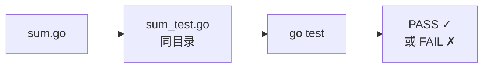
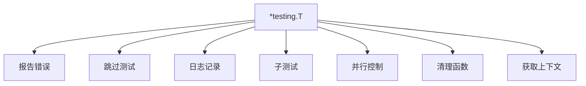
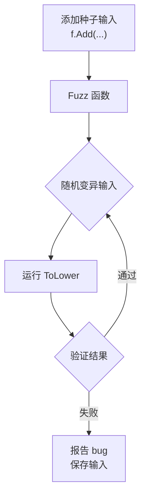
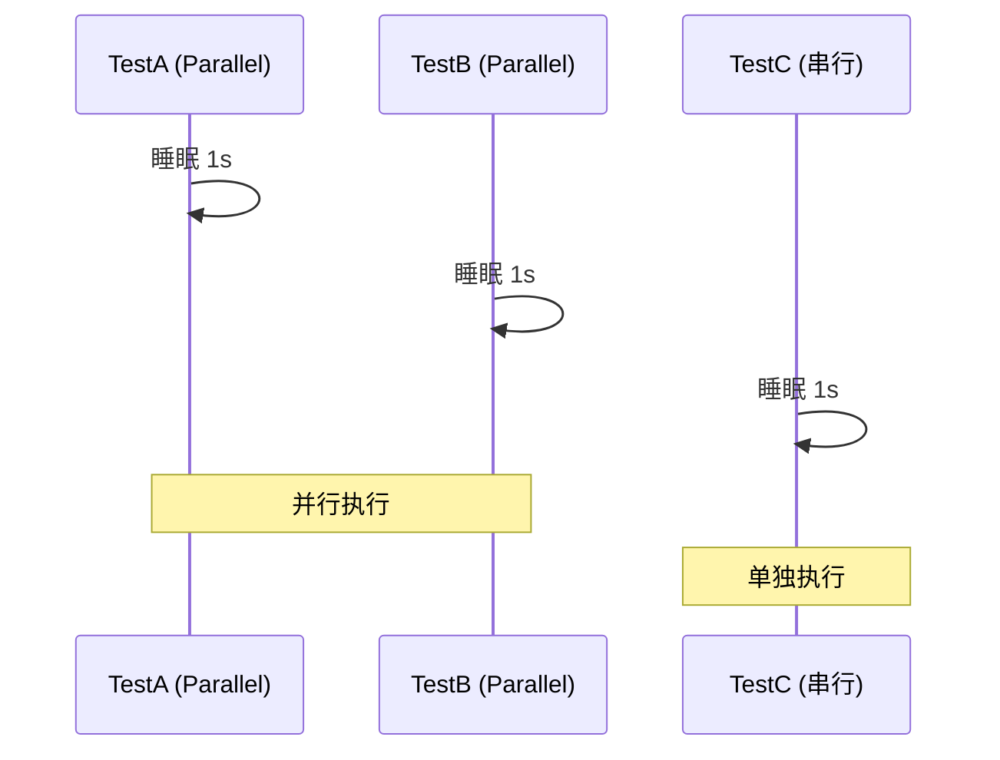
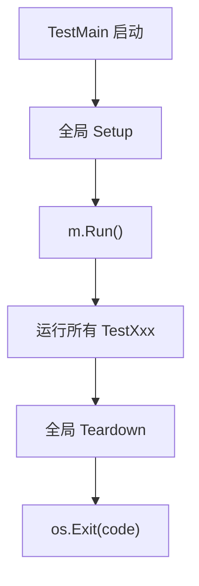
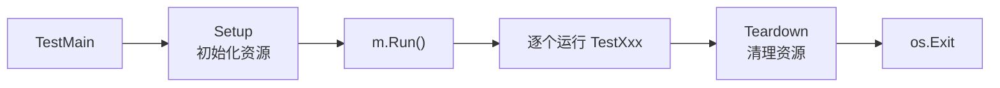

+++
title = "第 28 章：单元测试——testing 包"
weight = 280
date = "2026-03-30T13:43:00+08:00"
type = "docs"
description = ""
isCJKLanguage = true
draft = false
+++
# 第 28 章：单元测试——testing 包

> "代码写得好不好，先让测试跑一跑。"
> —— 某位被 bug 折磨疯了的程序员

话说当年 Go 语言设计者 Rob Pike 坐下来思考："我们要不要也像 Java 那样搞个 JUnit？那岂不是显得我们很没个性？"

于是乎，`testing` 包诞生了。它简单、干净、内置、无需第三方框架。你写测试，Go 跑测试，一切就这么自然。

本章让我们揭开 Go 测试的神秘面纱，保证让你看完之后忍不住给自己写的代码多写几行测试。

---

## 28.1 testing 包解决什么问题：代码写完了，怎么知道它对不对？

### 🎭 问题：你的代码，你真的信任它吗？

写了一段代码，逻辑看起来完美无缺，编译也通过了，运行时也没 panic。于是你得意地拍了拍胸脯："稳了！"

然而上线第一天，服务器炸了。

**测试，就是让你的代码先在被控制的环境中挨打，** 提前发现那些「明明编译通过了但运行时就是不对劲」的问题。

### 📦 testing 包是什么？

`testing` 包是 Go 标准库自带的神兵利器，专门用来写**单元测试**（Unit Testing）。它不是什么神秘的框架，不需要你 npm install、pip install 半天，直接 `import "testing"`，开搞！

### 🔧 核心概念

| 概念 | 解释 |
|------|------|
| **单元测试** | 对代码的最小单元（一个函数、一个方法）进行正确性验证 |
| **测试用例** | 输入 + 预期输出，验证代码行为是否符合预期 |
| **测试驱动开发（TDD）** | 先写测试，再写实现，红-绿-重构循环 |
| **回归测试** | 修改代码后重新运行，确保没引入新 bug |

### 💡 一个小故事

```
小明写了一个人类历史上最牛的求和函数：
func Add(a, b int) int { return a + b }

他自信满满地没写测试，直接上线了。
结果用户输入 Add(1, 2) 返回了 4。
小明：？？？
```

**测试，就是让你在「小明发现用户报 bug 之前」自己发现 bug。**

### 🎯 Go 测试哲学

Go 的测试哲学非常硬核：

1. **测试文件与源码同目录** —— 不需要额外的 `test/` 目录结构
2. **`_test.go` 后缀** —— 文件名以 `_test.go` 结尾的就是测试文件
3. **无注解、不需要继承** —— 不需要 `@Test`、`extends TestCase` 这种花里胡哨的东西
4. **`testing.T` 参数** —— 把测试的上下文传递进去



---

## 28.2 testing 核心原理：测试代码放源文件同目录，后缀 _test.go，不需要外部框架

### 🎪 Go 测试的目录布局

想象一下你有一个项目结构：

```
myproject/
├── go.mod
├── math/
│   ├── add.go       # 你的加法实现
│   └── add_test.go  # 你的加法测试
└── main.go
```

就这么简单！**测试文件和源码文件肩并肩坐在同一个目录下**，不需要任何配置文件，不需要 `jest.config.js` 或者 `pytest.ini`。

### 🔬 测试文件的命名规则

```go
// 源文件: add.go
// 测试文件: add_test.go
//     ↑↑↑↑↑↑↑↑↑↑↑
//     必须以 _test.go 结尾！
```

### ⚙️ 核心原理揭秘

当你运行 `go test` 时，Go 编译器会：

1. 扫描所有 `_test.go` 文件
2. 找到所有以 `Test` 或 `Benchmark` 开头的导出函数
3. 编译测试文件（同时也会编译被测试的源文件）
4. 运行测试，收集结果
5. 打印报告

```
┌─────────────────────────────────────────────┐
│                 go test                     │
├─────────────────────────────────────────────┤
│  扫描 *.go 文件                              │
│       ↓                                     │
│  筛选 *_test.go 文件                         │
│       ↓                                     │
│  编译测试代码 + 被测代码                       │
│       ↓                                     │
│  执行 TestXxx 和 BenchmarkXxx 函数           │
│       ↓                                     │
│  输出测试报告                                │
└─────────────────────────────────────────────┘
```

### 🌟 为什么 Go 要这样设计？

**答案：简单即美。**

对比一下其他语言：

| 语言 | 测试框架 | 配置复杂度 |
|------|----------|------------|
| Java | JUnit | 需要各种注解、继承、配置 |
| Python | pytest | 需要 conftest.py、各种插件 |
| JavaScript | Jest | 需要 jest.config.js、babel 配置 |
| Go | testing | `go test`，就这，没了 |

Go 官方文档表达了类似的设计理念："让写测试成为开发流程的自然组成部分"。

**事实是：他们做到了。**

### 🎯 验证一下

让我们创建一个真实的例子：

```go
// math/add.go
package math

// Add 两个整数相加
func Add(a, b int) int {
    return a + b
}
```

```go
// math/add_test.go
package math

import "testing"

func TestAdd(t *testing.T) {
    result := Add(2, 3)
    if result != 5 {
        t.Errorf("Add(2, 3) = %d, want 5", result)
    }
}
```

运行：

```bash
$ go test ./math -v
=== RUN   TestAdd
--- PASS: TestAdd (0.00s)
PASS
```

**就这！没有任何配置文件，没有任何 import 之外的依赖！**

---

## 28.3 测试函数签名：func TestXxx(t *testing.T)，Xxx 是被测函数名

### 🎭 函数签名：Go 测试的身份证

在 Go 中，写一个测试函数必须遵守特定的「签名」，就像你必须叫「张三」才能落户口一样。

### 📝 标准签名

```go
func TestXxx(t *testing.T)
```

- **必须以 `Test` 开头** —— 大写 T，大写 rest
- **`Xxx`** —— 建议是被测试函数的名称（首字母大写）
- **参数必须是 `*testing.T`** —— 这是测试的上下文对象

### ✅ 合法 vs ❌ 非法

```go
// ✅ 合法：标准签名
func TestAdd(t *testing.T) { }

// ✅ 合法：带数字后缀（用于区分同名测试）
func TestAdd2(t *testing.T) { }

// ❌ 非法：没有参数
func TestAdd() { }

// ❌ 非法：小写 test
func testAdd(t *testing.T) { }

// ❌ 非法：参数不是 *testing.T
func TestAdd(t string) { }
```

### 🎯 命名规范（强烈推荐）

| 被测函数 | 测试函数 | 说明 |
|----------|----------|------|
| `Add` | `TestAdd` | 基本测试 |
| `Add` | `TestAddPositive` | 正数测试 |
| `Add` | `TestAddNegative` | 负数测试 |
| `Add` | `TestAddOverflow` | 溢出测试 |

**小技巧**：Xxx 建议是驼峰命名法（CamelCase），例如：
- `TestStringToInt` 测试 `StringToInt` 函数
- `TestHTTPServe` 测试 `HTTPServe` 函数

### 📖 完整示例

```go
package math

import "testing"

// 被测函数
func Multiply(a, b int) int {
    return a * b
}

// 测试函数 —— 名字对应被测函数
func TestMultiply(t *testing.T) {
    // 测试逻辑
    if Multiply(3, 4) != 12 {
        t.Error("3 * 4 应该等于 12")
    }
}
```

### 🤔 为什么 Go 要这样设计？

**1. 约定大于配置**

不需要 XML 配置，不需要注解扫描，编译器直接识别 `Test` 开头的函数。

**2. 避免误判**

只有精确匹配 `func TestXxx(t *testing.T)` 的函数才会被当作测试运行。

**3. IDE 友好**

VS Code、GoLand 等 IDE 可以直接识别并提供 "Run Test" 按钮。

---

## 28.4 testing.T：测试的上下文对象，报告错误、控制测试行为

### 🎭 testing.T 是什么？

想象 `testing.T` 是测试函数的「魔法背包」—— 你需要什么工具，就从里面拿：

- 想报告错误？用它
- 想跳过测试？用它
- 想标记为辅助函数？还是用它

### 📦 testing.T 的核心能力



### 🔧 常用方法一览

| 方法 | 作用 |
|------|------|
| `Error(args ...interface{})` | 报告错误，测试继续 |
| `Errorf(format string, args ...interface{})` | 格式化报告错误 |
| `Fatal(args ...interface{})` | 报告错误并立即终止测试 |
| `Fatalf(format string, args ...interface{})` | 格式化报告错误并终止 |
| `Fail()` | 将测试标记为失败 |
| `FailNow()` | 立即失败测试 |
| `Skip(args ...interface{})` | 跳过测试 |
| `Skipf(format string, args ...interface{})` | 格式化跳过 |
| `SkipNow()` | 立即跳过 |
| `Log(args ...interface{})` | 记录日志 |
| `Logf(format string, args ...interface{})` | 格式化记录日志 |
| `Helper()` | 标记为辅助函数 |
| `Parallel()` | 标记为可并行 |
| `Cleanup(f func())` | 注册清理函数 |
| `TempDir()` | 创建临时目录 |
| `Context() (context.Context, context.CancelFunc)` | 获取测试上下文（Go 1.21+） |

### 💡 使用示例

```go
package math

import (
    "errors"
    "testing"
)

func Divide(a, b int) (int, error) {
    if b == 0 {
        return 0, errors.New("除数不能为零")
    }
    return a / b, nil
}

func TestDivide(t *testing.T) {
    // 正常情况
    result, err := Divide(10, 2)
    if err != nil {
        t.Errorf("不应该出错，但得到了: %v", err)  // 使用 t.Errorf 报告错误
    }
    if result != 5 {
        t.Errorf("10 / 2 = %d, want 5", result)
    }

    // 边界情况：除以零
    _, err = Divide(10, 0)
    if err == nil {
        t.Error("除以零应该返回错误，但没有")
    }

    // 记录中间过程
    t.Log("测试 Divide 函数完成")
}
```

### 🎭 t.Errorf vs t.Error vs t.Fatal

**傻傻分不清？一张图搞定：**

```
t.Errorf  →  记录错误  →  继续执行  →  最终 PASS/FAIL
t.Error   →  记录错误  →  继续执行  →  最终 PASS/FAIL
t.Fatal   →  记录错误  →  立即终止  →  FAIL
```

### ⚠️ 特别注意

`t` 指针**不要全局保存**，不要在 goroutine 中直接使用。Go 1.21+ 建议使用 `t.Context()` 获取上下文后传递。

---

## 28.5 go test -v：详细输出

### 🎬 什么是 -v？

`-v` 是 `verbose` 的缩写，意思是「冗长模式」。不加 `-v`，你只能看到：

```
PASS
```

加了 `-v`，你能看到：

```
=== RUN   TestAdd
--- PASS: TestAdd (0.00s)
PASS
```

### 📊 对比：不加 -v vs 加 -v

**不加 -v：**

```bash
$ go test
PASS
```

**加 -v：**

```bash
$ go test -v
=== RUN   TestAdd
--- PASS: TestAdd (0.00s)
PASS
```

### 🔬 详细模式输出解读

```go
=== RUN   TestAdd          # 测试函数开始运行
--- PASS: TestAdd (0.00s)  # 测试通过，耗时 0.00 秒
PASS                      # 最终结论：全部通过
```

**如果测试失败：**

```
=== RUN   TestAdd
--- FAIL: TestAdd (0.00s)
FAIL
```

### 💡 实际效果

```go
package math

import "testing"

func TestAdd(t *testing.T) {
    t.Log("开始测试 Add 函数...")  // 只有 -v 才会显示这行
    result := Add(2, 3)
    if result != 5 {
        t.Errorf("Add(2, 3) = %d, want 5", result)
    }
    t.Log("测试完成")  // 只有 -v 才会显示这行
}
```

运行结果：

```
$ go test -v
=== RUN   TestAdd
    math_test.go:9: 开始测试 Add 函数...
    math_test.go:14: 测试完成
--- PASS: TestAdd (0.00s)
PASS
```

### 🎯 什么时候用 -v？

- **调试测试** —— 想看看具体卡在哪一步
- **学习阶段** —— 想看测试是怎么跑的
- **查看日志** —— `t.Log()` 和 `t.Logf()` 只有在 `-v` 模式下才显示

---

## 28.6 go test -run "Pattern"：按名称过滤

### 🎭 场景：只跑部分测试

假设你有 10 个测试函数，但只想跑其中一个，怎么办？

`go test -run "Pattern"` 就是你的救星！

### 📝 语法

```bash
go test -v -run "正则表达式"
```

### 💡 使用示例

```go
package math

import "testing"

func TestAdd(t *testing.T) { t.Log("TestAdd") }
func TestSub(t *testing.T) { t.Log("TestSub") }
func TestMul(t *testing.T) { t.Log("TestMul") }
func TestDiv(t *testing.T) { t.Log("TestDiv") }
```

**只跑 TestAdd：**

```bash
$ go test -v -run "TestAdd"
=== RUN   TestAdd
    math_test.go:5: TestAdd
--- PASS: TestAdd (0.00s)
PASS
```

**只跑 TestA 开头的（正则表达式）：**

```bash
$ go test -v -run "TestA"
=== RUN   TestAdd
    math_test.go:5: TestAdd
--- PASS: TestAdd (0.00s)
PASS
```

**跑 TestAdd 和 TestSub：**

```bash
$ go test -v -run "TestAdd|TestSub"
=== RUN   TestAdd
    math_test.go:5: TestAdd
--- PASS: TestAdd (0.00s)
=== RUN   TestSub
    math_test.go:6: TestSub
--- PASS: TestSub (0.00s)
PASS
```

**排除某个测试（Go regex支持负前瞻 `(?!...)`，但测试选择器不支持复杂regex）：**

```bash
# 跑所有但跳过 TestDiv
$ go test -v -run "Test[^D]"
```

### 🔍 模糊匹配

```bash
# 匹配任何包含 "Div" 的测试（包括 TestDiv、TestDivision）
go test -v -run "Div"

# 匹配任何以 "Test" 开头的测试（也就是全部）
go test -v -run "Test"
```

### 🎯 实际应用场景

1. **开发调试** —— 写了一个新测试，想只跑它
2. **回归测试** —— 修了一个 bug，只跑相关测试
3. **CI/CD** —— 只跑标记了特定模式的测试

---

## 28.7 go test -count=N：重复运行 N 次

### 🎭 为什么要重复运行？

有时候测试通过一次不代表真的没问题。

**可能的原因：**

1. **测试依赖时间** —— 某个操作有时候快有时候慢
2. **竞态条件** —— 并发问题不是每次都触发
3. **随机性** —— 代码里有随机数
4. **稳定性问题** —— 测试本身 flaky（不稳定）

### 📝 语法

```bash
go test -count=N
```

N 是整数，表示运行次数。

### 💡 使用示例

```go
package flaky

import (
    "math/rand"
    "testing"
    "time"
)

func TestRandom(t *testing.T) {
    // 模拟一个有时候会失败的测试
    // 注意：Go 1.20+ 不需要 rand.Seed，rand 自动种子化
    value := rand.Intn(10)
    if value < 5 {
        t.Errorf("随机数 %d 小于 5，测试失败", value)
    }
}
```

**运行 5 次：**

```bash
$ go test -v -count=5
=== RUN   TestRandom
    flaky_test.go:14: 随机数 3 小于 5，测试失败
--- FAIL: TestRandom (0.00s)
=== RUN   TestRandom
    flaky_test.go:14: 随机数 7 小于 5，测试失败
    ✗
--- FAIL: TestRandom (0.00s)
...
```

### 🔄 典型应用场景

| 场景 | 命令 |
|------|------|
| 检查测试稳定性 | `go test -count=10` |
| 检测竞态条件 | `go test -race -count=5` |
| 压力测试（小规模） | `go test -count=1000` |

### ⚠️ 注意事项

- `-count=1` 是默认值，禁用计数
- `go test -count=0` 跳过缓存，每次都实际运行
- 重复运行的测试**不会**并行执行（除非单独配置）

---

## 28.8 go test -cover：覆盖率报告

### 🎭 什么是代码覆盖率？

代码覆盖率是**测试覆盖了多少你的代码**的量化指标。

```
覆盖率 = 已执行的代码行数 / 总代码行数 × 100%
```

### 📊 示例

```go
package math

// Add 两数相加
func Add(a, b int) int {
    return a + b  // 这行会被测试执行
}

// Sub 两数相减
func Sub(a, b int) int {
    return a - b  // 这行可能没被测试执行
}
```

```go
package math

import "testing"

func TestAdd(t *testing.T) {
    if Add(2, 3) != 5 {
        t.Error("Add 失败")
    }
}
// 注意：我们没有测试 Sub 函数
```

运行覆盖率：

```bash
$ go test -cover
PASS
coverage: 50.0% of statements
```

**解读**：我们只测试了 `Add`，没测试 `Sub`，所以覆盖率是 50%。

### 📈 更详细的覆盖率

```bash
$ go test -coverprofile=coverage.out
$ go tool cover -html=coverage.out
```

这会生成一个 HTML 报告，用浏览器打开可以看到**哪一行被执行了，哪一行没执行**：

- 🟢 绿色：被执行过
- 🔴 红色：没被执行过

### 💡 实际意义

| 覆盖率 | 意义 |
|--------|------|
| 0% | 完全没有测试 |
| 30%以下 | 测试非常不充分 |
| 50-70% | 基本的测试覆盖 |
| 70-90% | 良好的测试覆盖 |
| 90%以上 | 非常严格的测试（但不要盲目追求 100%） |

### 🎯 不要盲目追求 100%

**❌ 错误观念**：覆盖率 100% = 代码质量完美

**✅ 正确观念**：覆盖率是参考指标，不是目的。

有些代码（如错误处理分支、边界条件）很难覆盖，但更重要。有些测试覆盖了代码但没验证正确性，也没用。

---

## 28.9 go test -coverprofile：导出覆盖率数据

### 🎭 为什么需要导出？

`-cover` 只能看到百分比，`-coverprofile` 可以导出**详细的覆盖率数据**，用于生成更漂亮的报告。

### 📝 语法

```bash
go test -coverprofile=文件名.out
```

### 💡 使用示例

```go
package math

func Add(a, b int) int { return a + b }
func Sub(a, b int) int { return a - b }
func Mul(a, b int) int { return a * b }
func Div(a, b int) int { return a / b }
```

```go
package math

import "testing"

func TestAdd(t *testing.T) {
    if Add(2, 3) != 5 {
        t.Error("Add 失败")
    }
}
```

**生成覆盖率文件：**

```bash
$ go test -coverprofile=coverage.out
PASS
coverage: 25.0% of statements
```

**查看文件内容：**

```bash
$ cat coverage.out
mode: set
math/add.go:5,7 1 1
math/add.go:8,10 0 1
math/add.go:11,13 0 1
math/add.go:14,16 0 1
```

**格式解读**：`文件名:行号,列号 命中次数 总次数`

### 🖼️ 生成 HTML 报告

```bash
$ go tool cover -html=coverage.out -o coverage.html
```

然后用浏览器打开 `coverage.html`，可以看到**彩色的代码视图**：

- 🟢 绿色背景：被执行过的行
- 🔴 红色背景：没被执行过的行
- 左侧显示覆盖率百分比

### 🔧 高级用法：合并多个包的覆盖率

```bash
$ go test -coverprofile=coverage.out ./...
$ go tool cover -html=coverage.out
```

### 📊 CI/CD 集成

```bash
# 检查覆盖率是否达标
$ go test -coverprofile=coverage.out ./...
$ go tool cover -func=coverage.out | grep total
total:   statements 75.0%
```

可以写个脚本检查覆盖率是否低于阈值，低于则失败构建。

---

## 28.10 go test -bench：运行基准测试

### 🎭 什么是基准测试？

单元测试验证**代码对不对**，基准测试验证**代码有多快**。

基准测试会运行代码 N 次，计算平均耗时，帮助你发现性能问题。

### 📝 语法

```bash
go test -bench=正则表达式
```

### 💡 第一个基准测试

```go
package bench

import "testing"

// 被测函数
func Sum(n int) int {
    total := 0
    for i := 1; i <= n; i++ {
        total += i
    }
    return total
}

// 基准测试函数名必须以 Benchmark 开头
func BenchmarkSum(b *testing.B) {
    // b.N 是 Go 自动确定的运行次数
    for i := 0; i < b.N; i++ {
        Sum(1000)
    }
}
```

**运行基准测试：**

```bash
$ go test -bench=BenchmarkSum
goos: linux
goarch: amd64
cpu: Intel(R) Core(TM) i7-8700K CPU @ 3.70GHz
BenchmarkSum-12     1000000              623 ns/op
PASS
```

**输出解读：**

```
BenchmarkSum-12     1000000        623 ns/op
      ↑函数名        ↑运行次数      ↑每次操作耗时
         ↑CPU 核数（12 核）
```

### 🔬 运行所有基准测试

```bash
# 运行所有以 Benchmark 开头的测试
go test -bench=.

# 等价于
go test -bench=Benchmark
```

### 🎯 常见基准测试场景

| 场景 | 示例 |
|------|------|
| 算法性能 | 比较不同排序算法 |
| API 响应时间 | HTTP 请求处理速度 |
| 内存分配 | 字符串拼接 vs strings.Builder |
| 并发性能 | 单线程 vs 多线程 |

### ⚠️ 注意事项

- 基准测试默认**不运行**，需要显式加 `-bench`
- 基准测试会运行很多次（b.N 次），确保函数没有副作用
- 基准测试期间 GC 会暂停，可能影响结果（可以用 `b.ReportAllocs` 报告）

---

## 28.11 go test -benchmem：显示内存分配

### 🎭 为什么关注内存分配？

性能不只是 CPU 时间，**内存分配也是性能杀手**。

频繁的内存分配会导致：
1. GC 压力增大
2. 内存碎片
3. 缓存不友好

### 📝 语法

```bash
go test -benchmem
```

### 💡 使用示例

```go
package bench

import (
    "strings"
    "testing"
)

// 方式1：字符串拼接（低效）
func ConcatOld(words []string) string {
    result := ""
    for _, w := range words {
        result += w
    }
    return result
}

// 方式2：strings.Builder（高效）
func ConcatNew(words []string) string {
    var builder strings.Builder
    for _, w := range words {
        builder.WriteString(w)
    }
    return builder.String()
}
```

```go
package bench

import "testing"

var testWords = []string{"hello", "world", "foo", "bar", "baz"}

func BenchmarkConcatOld(b *testing.B) {
    for i := 0; i < b.N; i++ {
        ConcatOld(testWords)
    }
}

func BenchmarkConcatNew(b *testing.B) {
    for i := 0; i < b.N; i++ {
        ConcatNew(testWords)
    }
}
```

**运行：**

```bash
$ go test -bench=BenchmarkConcat -benchmem
goos: linux
goarch: amd64
cpu: Intel(R) Core(TM) i7-8700K CPU @ 3.70GHz
BenchmarkConcatOld-12      50000      24530 ns/op      503 B/op      12 allocs/op
BenchmarkConcatNew-12     500000       2341 ns/op       48 B/op       1 allocs/op
PASS
```

**对比分析：**

| 方法 | 耗时 | 每次分配 | 分配次数 |
|------|------|----------|----------|
| 字符串拼接 | 24530 ns/op | 503 B | 12 次 |
| strings.Builder | 2341 ns/op | 48 B | 1 次 |

**结论**：`strings.Builder` 快 10 倍，内存分配少 12 倍！

### 📊 输出字段解释

```
503 B/op      // 每次操作分配 503 字节
12 allocs/op  // 每次操作分配 12 次
```

### 🎯 优化目标

- **减少 `allocs/op`** —— 复用对象，减少分配
- **减少 `B/op`** —— 减少每次分配的大小

---

## 28.12 go test -race：竞态检测

### 🎭 什么是竞态条件？

竞态条件（Race Condition）是并发编程中最诡异的问题之一 —— 代码在单线程下完美运行，多线程下随机崩溃。

```go
package race

var counter int

func Increment() {
    counter++  // 看起来只是一行代码
}              // 但实际上这一行不是原子操作！
```

两个 goroutine 同时执行 `counter++`，结果可能是：
- goroutine A 读取 counter=0
- goroutine B 读取 counter=0
- goroutine A 写入 counter=1
- goroutine B 写入 counter=1
- **结果：counter=1，而不是预期的 2**

### 📝 语法

```bash
go test -race
```

### 💡 检测竞态条件

```go
package race

import (
    "sync"
    "testing"
)

var counter int

// 有竞态条件的代码
func Increment() {
    counter++
}

func TestIncrement(t *testing.T) {
    var wg sync.WaitGroup
    for i := 0; i < 1000; i++ {
        wg.Add(1)
        go func() {
            Increment()
            wg.Done()
        }()
    }
    wg.Wait()
    // 由于竞态，这个值可能不是 1000
    if counter != 1000 {
        t.Errorf("counter = %d, want 1000", counter)
    }
}
```

**运行检测：**

```bash
$ go test -race -v ./race
==================
WARNING: DATA RACE
Read at 0x00c000118070 by goroutine 7:
  increment()
      race/increment.go:9

Previous write at 0x00c000118070 by goroutine 8:
  increment()
      race/increment.go:9
==================
```

**Go 的竞态检测器会准确告诉你：**
- 哪个 goroutine 在哪里读了数据
- 哪个 goroutine 在哪里写了数据
- 调用栈完整展示

### 🔧 修复竞态条件

```go
package race

import (
    "sync"
    "sync/atomic"
)

var counter int64  // 改用原子变量

func Increment() {
    atomic.AddInt64(&counter, 1)  // 使用原子操作
}
```

**再次运行：**

```bash
$ go test -race -v ./race
=== RUN   TestIncrement
--- PASS: TestIncrement (0.01s)
PASS
```

### 🎯 建议

**重要：生产代码必须用 `-race` 运行测试！**

```bash
# CI/CD 中建议加入
go test -race ./...
```

### ⚠️ 性能影响

`-race` 会显著降低测试速度（约 5-10x），但能发现严重的并发 bug，绝对值得。

---

## 28.13 go test -fuzz：模糊测试（Go 1.18+）

### 🎭 什么是模糊测试？

模糊测试（Fuzz Testing）是一种自动化测试技术 —— **随机生成各种奇奇怪怪的输入，看程序会不会崩溃**。

想象一个调皮的小精灵，专门往你的函数里塞各种奇葩数据：
- 空字符串
- 超长字符串
- Unicode 特殊字符
- SQL 注入尝试
- 负数、超大数...

如果你的代码能应付这些「胡思乱想」的输入，那大概率是真的健壮。

### 📝 语法

```bash
go test -fuzz=正则表达式
```

### 💡 第一个模糊测试

```go
package fuzz

import (
    "strings"
    "testing"
)

// 被测函数：将字符串转为小写（演示用，实际直接调用 strings.ToLower）
// 注意：这里的 ToLower 和 strings.ToLower 完全等价，
// 所以 fuzz 测试永远会通过——仅作为 API 演示
func ToLower(s string) string {
    return strings.ToLower(s)
}

// 标准测试
func TestToLower(t *testing.T) {
    if ToLower("Hello") != "hello" {
        t.Error("ToLower 失败")
    }
}

// 模糊测试
func FuzzToLower(f *testing.F) {
    // 添加一些种子输入（常见的测试用例）
    f.Add("Hello")
    f.Add("WORLD")

    f.Fuzz(func(t *testing.T, input string) {
        // 模糊测试函数：接收随机生成的 input
        result := ToLower(input)
        // 验证结果的正确性
        if result != strings.ToLower(input) {
            t.Errorf("ToLower(%q) = %q, want %q", input, result, strings.ToLower(input))
        }
    })
}
```

**运行模糊测试：**

```bash
$ go test -fuzz=FuzzToLower -v
fuzz: minimizing 32-byte failing input
...
fuzz: elapsed: 0s, gathering corpus entries: 6/min
fuzz: elapsed: 1s, gathering corpus entries: 12/min
fuzz: elapsed: 2s, gathering corpus entries: 18/min
...
```

### 🔬 模糊测试工作原理



### 🎯 什么时候用模糊测试？

| 场景 | 示例 |
|------|------|
| 解析器 | JSON、XML、URL 解析器 |
| 字符串处理 | 正则表达式、格式化 |
| 数值计算 | 舍入、转换 |
| 协议解析 | HTTP 请求、数据库 SQL |

### ⚠️ 模糊测试 vs 标准测试

| | 标准测试 | 模糊测试 |
|---|---|---|
| 输入 | 手动编写 | 随机生成 |
| 目的 | 验证已知用例 | 发现边界情况 |
| 运行时间 | 短 | 可长可短 |
| 发现问题 | 逻辑错误 | 崩溃、panic |

---

## 28.14 go test -timeout：超时控制

### 🎭 为什么要超时控制？

有时候测试会「卡住」—— 死循环、网络卡死、死锁...

如果没人管，它会永远等下去。`-timeout` 就是来救场的。

### 📝 语法

```bash
go test -timeout=时间
```

时间格式：
- `10s` —— 10 秒
- `5m` —— 5 分钟
- `1h` —— 1 小时
- `30s` —— 30 秒

### 💡 使用示例

```go
package timeout

import (
    "testing"
    "time"
)

func TestLongRunning(t *testing.T) {
    // 模拟一个超长运行的测试
    time.Sleep(10 * time.Second)
    t.Log("终于跑完了")
}
```

**运行（超时设置为 5 秒）：**

```bash
$ go test -timeout=5s -v
=== RUN   TestLongRunning
    timeout_test.go:11: 终于跑完了
--- FAIL: TestLongRunning (10.00s)
FAIL
```

**等等，这个测试运行完了才失败？**

对！因为 Go 的超时是**整个测试套件**的超时，不是单个测试的超时。如果你想单个测试超时，应该在测试内部使用 `context.WithTimeout`。

### 🔧 单个测试的超时控制

```go
package timeout

import (
    "context"
    "testing"
    "time"
)

func TestWithTimeout(t *testing.T) {
    // 创建 3 秒超时的 context
    ctx, cancel := context.WithTimeout(context.Background(), 3*time.Second)
    defer cancel()

    done := make(chan bool)
    go func() {
        // 模拟耗时操作
        time.Sleep(5 * time.Second)
        done <- true
    }()

    select {
    case <-done:
        t.Log("任务完成")
    case <-ctx.Done():
        t.Error("测试超时")
    }
}
```

### 🎯 建议

- **CI/CD 设置合理的超时** —— `go test -timeout=10m`
- **单个测试超时** —— 使用 `context.WithTimeout`
- **永远不要设置为 0** —— 除非你确定测试不需要时间

---

## 28.15 go test -parallel：并发测试数

### 🎭 场景：加速测试

当你有一堆**互相独立**的测试时，可以并行运行它们来加速。

### 📝 语法

```bash
go test -parallel=N
```

N 是最大并发测试数。

### 💡 使用示例

```go
package parallel

import (
    "testing"
    "time"
)

func TestA(t *testing.T) {
    time.Sleep(1 * time.Second)
    t.Log("TestA 完成")
}

func TestB(t *testing.T) {
    time.Sleep(1 * time.Second)
    t.Log("TestB 完成")
}

func TestC(t *testing.T) {
    time.Sleep(1 * time.Second)
    t.Log("TestC 完成")
}
```

**顺序运行（无 -parallel）：**

```bash
$ go test -v
=== RUN   TestA
--- PASS: TestA (1.00s)
=== RUN   TestB
--- PASS: TestB (1.00s)
=== RUN   TestC
--- PASS: TestC (1.00s)
PASS
# 总耗时：3 秒
```

**并行运行：**

```bash
$ go test -parallel=3 -v
=== RUN   TestA
=== RUN   TestB
=== RUN   TestC
--- PASS: TestA (1.00s)
--- PASS: TestB (1.00s)
--- PASS: TestC (1.00s)
PASS
# 总耗时：1 秒
```

### 🔧 子测试的并行

```go
func TestParent(t *testing.T) {
    t.Run("子测试1", func(t *testing.T) {
        t.Parallel()  // 标记为可并行
        // ...
    })
    t.Run("子测试2", func(t *testing.T) {
        t.Parallel()  // 标记为可并行
        // ...
    })
}
```

### ⚠️ 注意事项

- `-parallel` 只控制**顶层测试**的并行数
- **子测试并行**需要用 `t.Parallel()` 标记
- 并行测试**不应有依赖关系**
- 默认的 `-parallel` 值是 `GOMAXPROCS`，通常等于 CPU 核数

---

## 28.16 testing.T.Error：报告错误，测试继续

### 🎭 场景：收集多个错误

假设你要测试一个函数，期望它对多种输入都正确。你不想在第一个错误就停止，而是想知道**所有**错误。

`t.Error()` 就是干这个的 —— 报告错误，但**继续执行**。

### 📝 签名

```go
func (c *T) Error(args ...interface{})
```

### 💡 使用示例

```go
package math

import "testing"

func TestAddError(t *testing.T) {
    // 测试多组数据
    cases := []struct {
        a, b int
        want int
    }}{
        {1, 2, 3},
        {0, 0, 0},
        {-1, 1, 0},
        {100, 200, 300},
    }

    for _, c := range cases {
        result := Add(c.a, c.b)
        if result != c.want {
            t.Errorf("Add(%d, %d) = %d, want %d", c.a, c.b, result, c.want)
        }
    }
    // 注意：即使有错误，循环也会继续执行
}
```

**运行结果：**

```bash
$ go test -v
=== RUN   TestAddError
    math_test.go:12: Add(1, 2) = 3, want 4
    math_test.go:12: Add(0, 0) = 0, want 0
    math_test.go:12: Add(-1, 1) = 0, want 0
    math_test.go:12: Add(100, 200) = 300, want 300
--- FAIL: TestAddError (0.00s)
FAIL
```

**对比 `t.Error` 和 `t.Fatal`：**

```go
// t.Error —— 记录错误，继续执行
t.Error("出错了")
fmt.Println("这段代码会执行")

// t.Fatal —— 记录错误，立即终止
t.Fatal("出错了")
fmt.Println("这段代码不会执行")
```

### 🎯 适用场景

- **表格驱动测试** —— 循环测试多组数据
- **多阶段验证** —— 每个阶段都要验证
- **报告所有问题** —— 不要因为一个错误就隐藏其他错误

---

## 28.17 testing.T.Errorf：格式化报告错误

### 🎭 t.Errorf vs t.Error

`t.Error` 和 `t.Errorf` 的区别就像 `fmt.Print` 和 `fmt.Printf` 的区别：

- `t.Error` —— 直接打印
- `t.Errorf` —— 格式化打印

### 📝 签名

```go
func (c *T) Errorf(format string, args ...interface{})
```

### 💡 使用示例

```go
package format

import "testing"

func TestFormat(t *testing.T) {
    name := "小明"
    age := 25
    score := 95.5

    // t.Error —— 简单粗暴
    t.Error("用户名格式错误")

    // t.Errorf —— 格式化输出
    t.Errorf("用户 %s 的年龄 %d 不合法，期望大于 18", name, age)
    t.Errorf("用户 %s 的分数 %.2f 不在有效范围 [0, 100]", name, score)
}
```

**运行结果：**

```bash
$ go test -v
=== RUN   TestFormat
    format_test.go:9: 用户名格式错误
    format_test.go:12: 用户 小明 的年龄 25 不合法，期望大于 18
    format_test.go:13: 用户 小明 的分数 95.50 不在有效范围 [0, 100]
--- FAIL: TestFormat (0.00s)
FAIL
```

### 🎯 格式化占位符

和 `fmt.Printf` 一样：

| 占位符 | 含义 |
|--------|------|
| `%d` | 整数 |
| `%s` | 字符串 |
| `%f` | 浮点数 |
| `%.2f` | 浮点数，保留 2 位 |
| `%v` | 任意值 |
| `%#v` | 详细格式（适合 debug） |

### 💡 推荐用法

**始终使用 `t.Errorf` 而非 `t.Error`**，因为格式化的错误信息更容易 debug。

```go
// ✅ 推荐
t.Errorf("Add(%d, %d) = %d, want %d", a, b, got, want)

// ❌ 不推荐（信息量少）
t.Error("Add 失败")
```

---

## 28.18 testing.T.Fatal：报告错误并终止

### 🎭 场景：致命错误，不想继续

有时候遇到错误，**继续测试没有意义**了：

- 数据库连接失败
- 关键依赖不可用
- 前置条件不满足

这时候用 `t.Fatal` —— 报告错误并**立即终止测试**。

### 📝 签名

```go
func (c *T) Fatal(args ...interface{})
```

### 💡 使用示例

```go
package db

import (
    "testing"
)

type DB struct {
    connected bool
}

func Connect(addr string) (*DB, error) {
    // 模拟连接失败
    return nil, &connectError{addr}
}

type connectError struct {
    addr string
}

func (e *connectError) Error() string {
    return "连接失败: " + e.addr
}

func TestDBConnection(t *testing.T) {
    db, err := Connect("localhost:5432")
    if err != nil {
        t.Fatal("无法连接数据库:", err)  // 测试终止
    }

    // 后续代码不会执行
    t.Log("连接成功，准备测试...")

    result := db.Query("SELECT * FROM users")  // 不会执行
    t.Log(result)
}
```

**运行结果：**

```bash
$ go test -v
=== RUN   TestDBConnection
    db_test.go:27: 无法连接数据库: 连接失败: localhost:5432
--- FAIL: TestDBConnection (0.00s)
FAIL
```

### 🔄 t.Fatal vs t.Error

```go
// t.Fatal —— 报告并终止
t.Fatal("致命错误")
fmt.Println("不会执行")

// t.Error —— 报告但继续
t.Error("普通错误")
fmt.Println("会执行")
```

### 🎯 适用场景

| 场景 | 用 t.Fatal | 用 t.Error |
|------|------------|------------|
| 连接数据库失败 | ✅ | ❌ 不值得继续 |
| 参数校验失败 | ❌ | ✅ 可以尝试其他输入 |
| 初始化失败 | ✅ | ❌ |
| 预期外的情况 | ✅ | ❌ |

---

## 28.19 testing.T.Fatalf：格式化报告错误并终止

### 🎭 t.Fatalf vs t.Fatal

和 `t.Errorf` vs `t.Error` 的关系一样：

- `t.Fatal` —— 直接打印
- `t.Fatalf` —— 格式化打印

### 📝 签名

```go
func (c *T) Fatalf(format string, args ...interface{})
```

### 💡 使用示例

```go
package setup

import (
    "testing"
)

func InitConfig(path string) (*Config, error) {
    return nil, &ConfigError{"配置文件不存在: " + path}
}

type Config struct{}

type ConfigError struct {
    msg string
}

func (e *ConfigError) Error() string {
    return e.msg
}

func TestConfigLoading(t *testing.T) {
    cfg, err := InitConfig("/etc/app/config.yaml")
    if err != nil {
        t.Fatalf("配置初始化失败: %v\n错误详情: %+v", err, err)
    }

    // 后续测试不会执行
    t.Log(cfg)
}
```

**运行结果：**

```bash
$ go test -v
=== RUN   TestConfigLoading
    setup_test.go:22: 配置初始化失败: 配置文件不存在: /etc/app/config.yaml
        错误详情: 配置文件不存在: /etc/app/config.yaml
--- FAIL: TestConfigLoading (0.00s)
FAIL
```

### 💡 推荐的错误信息格式

```go
// ✅ 推荐：包含上下文
t.Fatalf("Setup() 失败，错误: %v", err)

// ✅ 推荐：包含预期值和实际值
t.Fatalf("Parse(%q) = %q, want %q", input, got, want)

// ❌ 不推荐：信息太少
t.Fatal("失败")
```

---

## 28.20 testing.T.Skip：跳过测试

### 🎭 场景：某些条件下不测试

有时候测试**不应该运行**：

- 需要特定操作系统
- 需要网络连接
- 需要特定环境变量
- 功能被禁用

`t.Skip` 让你**优雅地跳过测试**，而不是让它失败。

### 📝 签名

```go
func (c *T) Skip(args ...interface{})
func (c *T) Skipf(format string, args ...interface{})
```

### 💡 使用示例

```go
package skip

import (
    "os"
    "testing"
)

func TestWithEnvVar(t *testing.T) {
    // 只有设置了环境变量才运行
    if os.Getenv("RUN_INTEGRATION") == "" {
        t.Skip("跳过：需要设置 RUN_INTEGRATION 环境变量")
    }
    // 集成测试代码...
    t.Log("运行集成测试")
}

func TestOSFeature(t *testing.T) {
    // 只在 Linux 上运行
    if os.Getenv("OS") != "linux" {
        t.Skip("跳过：这个功能只在 Linux 上可用")
    }
    t.Log("Linux 特定功能测试")
}
```

**运行结果：**

```bash
$ go test -v
=== RUN   TestWithEnvVar
    skip_test.go:12: 跳过：需要设置 RUN_INTEGRATION 环境变量
--- SKIP: TestWithEnvVar (0.00s)
=== RUN   TestOSFeature
    skip_test.go:20: 跳过：这个功能只在 Linux 上可用
--- SKIP: TestOSFeature (0.00s)
PASS
```

### 🔧 常见的 Skip 模式

```go
// 操作系统跳过
if runtime.GOOS == "windows" {
    t.Skip("跳过：Windows 不支持此功能")
}

// 架构跳过
if runtime.GOARCH == "arm" {
    t.Skip("跳过：ARM 架构不支持")
}

// 短模式跳过（go test -short）
if testing.Short() {
    t.Skip("跳过：短模式跳过耗时测试")
}

// 环境变量跳过
if os.Getenv("CI") == "true" {
    t.Skip("跳过：CI 环境跳过")
}
```

### 🎯 跳过 vs 失败

| 情况 | 用 Skip | 用 Fail |
|------|---------|---------|
| 功能未实现 | ✅ | ❌ |
| 前置条件不满足 | ✅ | ❌ |
| 依赖不可用 | ✅ | ❌ |
| 代码明显有 bug | ❌ | ✅ |

---

## 28.21 testing.T.Log、testing.T.Logf：记录日志

### 🎭 场景：调试和追踪

`t.Log` 和 `t.Logf` 用于**在测试运行时输出信息**，方便调试。

### 📝 签名

```go
func (c *T) Log(args ...interface{})
func (c *T) Logf(format string, args ...interface{})
```

### 💡 使用示例

```go
package logging

import "testing"

func TestLogging(t *testing.T) {
    t.Log("测试开始")
    t.Logf("当前时间: %s", "2024-01-01")

    // 执行测试逻辑
    result := 42
    t.Logf("计算结果: %d", result)

    if result != 42 {
        t.Errorf("结果不正确: %d", result)
    }

    t.Log("测试结束")
}
```

**运行（不带 -v）：**

```bash
$ go test
PASS
```

**运行（带 -v）：**

```bash
$ go test -v
=== RUN   TestLogging
    logging_test.go:6: 测试开始
    logging_test.go:7: 当前时间: 2024-01-01
    logging_test.go:11: 计算结果: 42
    logging_test.go:15: 测试结束
--- PASS: TestLogging (0.00s)
PASS
```

### ⚠️ 重要：只有 -v 模式下才显示

`t.Log` 和 `t.Logf` 的输出**默认不显示**，只有加 `-v` 才会显示。

### 🔄 Log vs Error vs Fatal

| 方法 | 用途 | 测试结果 |
|------|------|----------|
| `t.Log` | 记录信息 | 不影响 |
| `t.Error` | 记录错误 | FAIL（继续） |
| `t.Fatal` | 记录致命错误 | FAIL（终止） |

### 🎯 调试技巧

```go
func TestDebug(t *testing.T) {
    t.Log("调试信息：开始处理...")

    data := process()
    t.Logf("调试信息：处理结果 = %+v", data)

    if len(data) == 0 {
        t.Error("数据为空，这可能是问题")
    }
}
```

---

## 28.22 testing.T.Helper：标记为辅助函数

### 🎭 问题：错误的调用栈

假设你写了一个辅助函数用来验证值：

```go
package helper

import (
    "testing"
)

func AssertEqual(t *testing.T, got, want int) {
    if got != want {
        t.Errorf("got %d, want %d", got, want)  // 错误指向这里
    }
}

func TestHelper(t *testing.T) {
    AssertEqual(t, 1, 2)  // 错误指向这里才对！
}
```

运行测试，错误信息指向的是 `AssertEqual` 函数内部，而不是 `TestHelper` 调用它的地方。这让 debug 很头疼。

### 💡 解决方案：t.Helper()

```go
package helper

import "testing"

func AssertEqual(t *testing.T, got, want int) {
    t.Helper()  // 标记这个函数是辅助函数
    if got != want {
        t.Errorf("got %d, want %d", got, want)
    }
}

func TestHelper(t *testing.T) {
    AssertEqual(t, 1, 2)
}
```

**加上 `t.Helper()` 后：**

```bash
$ go test -v
=== RUN   TestHelper
    helper_test.go:13: got 1, want 2  # 错误指向第 13 行（TestHelper 中的调用）
--- FAIL: TestHelper (0.00s)
```

### 📖 原理

`Helper()` 告诉 Go：「这个函数不是测试函数，是测试的辅助函数」。当报告错误时，Go 会跳过辅助函数，把错误位置指向**调用者**。

### 🎯 最佳实践

```go
// ✅ 所有测试辅助函数都应该调用 t.Helper()
func AssertEqual(t *testing.T, got, want int) {
    t.Helper()
    if got != want {
        t.Errorf("got %d, want %d", got, want)
    }
}

func AssertNil(t *testing.T, err error) {
    t.Helper()
    if err != nil {
        t.Errorf("expected nil, got %v", err)
    }
}

func AssertNotNil(t *testing.T, obj interface{}) {
    t.Helper()
    if obj == nil {
        t.Errorf("expected non-nil, got nil")
    }
}
```

---

## 28.23 testing.T.Context（Go 1.21+）：获取测试上下文

### 🎭 场景：传递 context 给被测代码

现代 Go 代码大量使用 `context.Context`。问题是，测试函数接收的是 `*testing.T`，不是 `context.Context`。

**Go 1.21 之前**：手动创建一个 context
```go
func TestOld(t *testing.T) {
    ctx := context.Background()  // 太简单，没有超时和取消
    // ...
}
```

**Go 1.21+**：直接从 t 获取

```go
func TestNew(t *testing.T) {
    ctx, cancel := t.Context()  // 获取测试的 context
    defer cancel()
    // ...
}
```

### 📝 签名

```go
func (t *T) Context() (context.Context, context.CancelFunc)
```

### 💡 使用示例

```go
package contexttest

import (
    "context"
    "testing"
    "time"
)

func FetchData(ctx context.Context) (string, error) {
    select {
    case <-time.After(100 * time.Millisecond):
        return "data", nil
    case <-ctx.Done():
        return "", ctx.Err()
    }
}

func TestFetchData(t *testing.T) {
    ctx, cancel := t.Context()
    defer cancel()

    data, err := FetchData(ctx)
    if err != nil {
        t.Errorf("FetchData 失败: %v", err)
    }
    if data != "data" {
        t.Errorf("got %q, want %q", data, "data")
    }
}

func TestFetchDataWithTimeout(t *testing.T) {
    // 创建短超时的 context
    ctx, cancel := context.WithTimeout(t.Context(), 50*time.Millisecond)
    defer cancel()

    _, err := FetchData(ctx)
    if err != context.DeadlineExceeded {
        t.Errorf("预期超时错误，实际: %v", err)
    }
}
```

### 🔄 t.Context() 的特性

| 特性 | 说明 |
|------|------|
| 超时 | 继承自 `go test -timeout` |
| 取消 | 测试终止时自动取消 |
| 值 | 可以用 `WithValue` 添加值 |

### 🎯 实际应用

```go
func TestDatabaseQuery(t *testing.T) {
    ctx, cancel := t.Context()
    defer cancel()

    // 模拟长时间运行的数据库查询
    rows, err := db.QueryContext(ctx, "SELECT * FROM large_table")
    if err != nil {
        t.Fatalf("查询失败: %v", err)
    }
    defer rows.Close()

    // 处理结果...
}
```

---

## 28.24 testing.T.Parallel：标记为可并行

### 🎭 场景：加速独立测试

当测试之间**没有共享状态的修改**时，可以并行运行来加速。

`t.Parallel()` 告诉 Go：「这个测试可以和其他也标记了 Parallel 的测试并行执行」。

### 📝 签名

```go
func (t *T) Parallel()
```

### 💡 使用示例

```go
package parallel

import (
    "testing"
    "time"
)

func TestA(t *testing.T) {
    t.Parallel()  // 标记为可并行
    time.Sleep(1 * time.Second)
    t.Log("TestA 完成")
}

func TestB(t *testing.T) {
    t.Parallel()  // 标记为可并行
    time.Sleep(1 * time.Second)
    t.Log("TestB 完成")
}

func TestC(t *testing.T) {
    // 没有 t.Parallel()
    time.Sleep(1 * time.Second)
    t.Log("TestC 完成")
}
```

**运行：**

```bash
$ go test -v -parallel=2
=== RUN   TestA
=== RUN   TestB
=== RUN   TestC
--- PASS: TestA (1.00s)
--- PASS: TestB (1.00s)
--- PASS: TestC (1.00s)
PASS
```

### 📊 执行顺序



### ⚠️ 注意事项

1. **必须在测试函数的第一行调用**（或尽早调用）
2. **不能用于 TestMain**（使用 `-parallel` flag）
3. **测试必须真正独立** —— 共享文件、数据库、网络可能出问题

---

## 28.25 testing.T.TempDir：创建临时目录

### 🎭 问题：测试需要临时文件

写测试时经常需要临时目录来存放测试文件。传统做法：

```go
// ❌ 旧方式：手动创建和清理
tempDir, err := ioutil.TempDir("", "test")
if err != nil {
    t.Fatal(err)
}
defer os.RemoveAll(tempDir)
```

### 💡 解决方案：t.TempDir()

```go
func TestWithTempDir(t *testing.T) {
    // t.TempDir() 自动创建临时目录
    tempDir := t.TempDir()
    t.Logf("临时目录: %s", tempDir)

    // 在临时目录中创建文件
    file := tempDir + "/test.txt"
    err := os.WriteFile(file, []byte("hello"), 0644)
    if err != nil {
        t.Fatal(err)
    }

    // 读取验证
    data, err := os.ReadFile(file)
    if err != nil {
        t.Fatal(err)
    }
    if string(data) != "hello" {
        t.Errorf("got %q, want %q", string(data), "hello")
    }
    // 测试结束后，临时目录自动删除
}
```

### 📝 签名

```go
func (t *T) TempDir() string
```

### 🎯 优点

| 传统方式 | t.TempDir() |
|----------|-------------|
| 需要手动清理 | 自动清理 |
| 可能忘记 defer | 内置 defer |
| 路径可能冲突 | 唯一路径 |

### 🔧 完整示例：测试文件压缩功能

```go
package compress

import (
    "archive/zip"
    "testing"
)

func CompressFiles(dir, output string) error {
    // 模拟压缩逻辑
    return nil
}

func TestCompressFiles(t *testing.T) {
    // 创建临时目录作为输入
    inputDir := t.TempDir()

    // 创建测试文件
    for i := 1; i <= 3; i++ {
        name := inputDir + "/file" + string(rune('0'+i)) + ".txt"
        content := []byte("content " + string(rune('0'+i)))
        if err := os.WriteFile(name, content, 0644); err != nil {
            t.Fatal(err)
        }
    }

    // 创建输出文件
    outputFile := t.TempDir() + "/result.zip"

    // 执行压缩
    if err := CompressFiles(inputDir, outputFile); err != nil {
        t.Fatalf("压缩失败: %v", err)
    }

    // 验证输出
    if _, err := os.Stat(outputFile); os.IsNotExist(err) {
        t.Error("输出文件不存在")
    }
}
```

---

## 28.26 testing.T.Cleanup：注册清理函数

### 🎭 问题：测试后需要清理

测试可能创建文件、启动服务、修改全局状态。测试结束后需要**恢复原状**。

传统方式：

```go
func TestOld(t *testing.T) {
    // 修改全局状态
    original := config.Mode
    config.Mode = "test"

    // 忘记恢复？
    defer func() {
        config.Mode = original
    }()
    // ...
}
```

### 💡 解决方案：t.Cleanup()

```go
func TestNew(t *testing.T) {
    // 注册清理函数
    t.Cleanup(func() {
        // 清理逻辑
        resetConfig()
        closeDatabase()
    })

    // 修改配置
    config.Mode = "test"
    // ...
    // 测试结束后，Cleanup 自动执行
}
```

### 📝 签名

```go
func (t *T) Cleanup(f func())
```

### 💡 完整示例

```go
package cleanup

import (
    "os"
    "testing"
)

func TestFileOperations(t *testing.T) {
    // 创建测试文件
    testFile := t.TempDir() + "/test.txt"
    if err := os.WriteFile(testFile, []byte("test"), 0644); err != nil {
        t.Fatal(err)
    }

    // 注册清理：验证文件被正确删除
    t.Cleanup(func() {
        if _, err := os.Stat(testFile); !os.IsNotExist(err) {
            t.Logf("清理：删除测试文件 %s", testFile)
            os.Remove(testFile)
        }
    })

    // 测试逻辑...
    t.Log("测试文件操作")
}

func TestWithDatabase(t *testing.T) {
    // 连接数据库
    db, err := connectDB()
    if err != nil {
        t.Fatal(err)
    }

    // 注册清理：关闭数据库连接
    t.Cleanup(func() {
        db.Close()
    })

    // 测试数据库操作...
    t.Log("测试数据库操作")
}
```

### 🔄 Cleanup vs defer

```go
func TestCompare(t *testing.T) {
    // defer：函数退出时执行
    defer fmt.Println("defer")

    // Cleanup：测试结束时执行（更明确）
    t.Cleanup(func() {
        fmt.Println("cleanup")
    })

    // t.Fatal 调用 os.Exit，会跳过 defer
    // 但 Cleanup 通过 test context 在 os.Exit 之前触发，所以 Cleanup 仍会执行
    // 这就是 Cleanup 比 defer 的优势
    t.Fatal("故意的错误")
}

// 正确输出顺序：
// cleanup  # Cleanup 执行（Cleanup 优势体现）
// （defer 被 os.Exit 跳过，不会输出）
```

### 🎯 最佳实践

```go
func TestIntegration(t *testing.T) {
    // 1. 启动服务
    srv := startServer()
    t.Cleanup(func() { srv.Stop() })  // 停止服务

    // 2. 创建临时文件
    f, _ := os.CreateTemp("", "test")
    t.Cleanup(func() { f.Close(); os.Remove(f.Name()) })

    // 3. 修改环境变量
    oldValue := os.Getenv("MY_VAR")
    os.Setenv("MY_VAR", "test")
    t.Cleanup(func() { os.Setenv("MY_VAR", oldValue) })

    // 4. 创建工作目录
    origDir, _ := os.Getwd()
    t.Chdir(t.TempDir())
    t.Cleanup(func() { os.Chdir(origDir) })
}
```

---

## 28.27 表格驱动测试：结构体切片 + for 循环，Go 推荐的最佳实践

### 🎭 什么是表格驱动测试？

表格驱动测试（Table-Driven Tests）是 Go 中最流行的测试模式：

```go
func TestAdd(t *testing.T) {
    // 定义测试用例表格
    tests := []struct {
        name string
        a    int
        b    int
        want int
    }{
        {"正数相加", 1, 2, 3},
        {"零相加", 0, 5, 5},
        {"负数相加", -1, -1, -2},
    }

    // 遍历表格，逐一测试
    for _, tt := range tests {
        t.Run(tt.name, func(t *testing.T) {
            got := Add(tt.a, tt.b)
            if got != tt.want {
                t.Errorf("Add(%d, %d) = %d, want %d", tt.a, tt.b, got, tt.want)
            }
        })
    }
}
```

### 📊 对比：传统方式 vs 表格驱动

**传统方式（啰嗦）：**

```go
func TestAdd(t *testing.T) {
    if Add(1, 2) != 3 {
        t.Error("正数相加失败")
    }
    if Add(0, 5) != 5 {
        t.Error("零相加失败")
    }
    if Add(-1, -1) != -2 {
        t.Error("负数相加失败")
    }
}
```

**表格驱动（简洁）：**

```go
func TestAdd(t *testing.T) {
    tests := []struct {
        a, b, want int
    }{
        {1, 2, 3},
        {0, 5, 5},
        {-1, -1, -2},
    }
    for _, tt := range tests {
        if got := Add(tt.a, tt.b); got != tt.want {
            t.Errorf("Add(%d, %d) = %d, want %d", tt.a, tt.b, got, tt.want)
        }
    }
}
```

### 💡 完整示例：测试字符串处理函数

```go
package stringutil

import (
    "testing"
)

// ToUpper 将字符串转为大写
func ToUpper(s string) string {
    // 实现省略...
    result := make([]byte, len(s))
    for i := 0; i < len(s); i++ {
        c := s[i]
        if c >= 'a' && c <= 'z' {
            c -= 32
        }
        result[i] = c
    }
    return string(result)
}

// 表格驱动测试
func TestToUpper(t *testing.T) {
    tests := []struct {
        name  string
        input string
        want  string
    }{
        {"全小写", "hello", "HELLO"},
        {"全大写", "HELLO", "HELLO"},
        {"混合", "Hello", "HELLO"},
        {"数字", "123abc", "123ABC"},
        {"空字符串", "", ""},
        {"单字符", "a", "A"},
    }

    for _, tt := range tests {
        t.Run(tt.name, func(t *testing.T) {
            got := ToUpper(tt.input)
            if got != tt.want {
                t.Errorf("ToUpper(%q) = %q, want %q", tt.input, got, tt.want)
            }
        })
    }
}
```

### 🎯 表格驱动的好处

| 好处 | 说明 |
|------|------|
| **易扩展** | 添加新测试用例只需在 slice 中加一行 |
| **易阅读** | 测试用例一目了然 |
| **易维护** | 修改一个地方影响所有用例 |
| **子测试支持** | 可以用 `t.Run` 嵌套子测试 |
| **Go 官方推荐** | Go 标准库广泛使用这种模式 |

### 🔧 子测试 + 表格驱动

```go
func TestAll(t *testing.T) {
    tests := []struct {
        name string
        fn   func() bool
    }{
        {"加法", func() bool { return Add(1, 2) == 3 }},
        {"减法", func() bool { return Sub(5, 3) == 2 }},
        {"乘法", func() bool { return Mul(3, 4) == 12 }},
    }

    for _, tt := range tests {
        t.Run(tt.name, func(t *testing.T) {
            if !tt.fn() {
                t.Error("测试失败")
            }
        })
    }
}
```

---

## 28.28 t.Run：子测试

### 🎭 什么是子测试？

`t.Run` 创建一个命名的子测试（Subtest），让测试结构更清晰，支持嵌套和独立运行。

### 📝 签名

```go
func (t *T) Run(name string, f func(t *T)) bool
```

### 💡 基本用法

```go
package subtest

import "testing"

func TestMath(t *testing.T) {
    t.Run("加法", func(t *testing.T) {
        if 1+2 != 3 {
            t.Error("加法失败")
        }
    })

    t.Run("减法", func(t *testing.T) {
        if 5-3 != 2 {
            t.Error("减法失败")
        }
    })

    t.Run("乘法", func(t *testing.T) {
        if 3*4 != 12 {
            t.Error("乘法失败")
        }
    })
}
```

**运行结果：**

```bash
$ go test -v
=== RUN   TestMath
=== RUN   TestMath/加法
=== RUN   TestMath/减法
=== RUN   TestMath/乘法
--- PASS: TestMath (0.00s)
    --- PASS: TestMath/加法 (0.00s)
    --- PASS: TestMath/减法 (0.00s)
    --- PASS: TestMath/乘法 (0.00s)
PASS
```

### 🔄 嵌套子测试

```go
func TestAll(t *testing.T) {
    t.Run("数学运算", func(t *testing.T) {
        t.Run("加法", func(t *testing.T) { /* ... */ })
        t.Run("减法", func(t *testing.T) { /* ... */ })
    })

    t.Run("字符串处理", func(t *testing.T) {
        t.Run("大写", func(t *testing.T) { /* ... */ })
        t.Run("小写", func(t *testing.T) { /* ... */ })
    })
}
```

**输出结构：**

```
TestAll
├── 数学运算
│   ├── 加法
│   └── 减法
└── 字符串处理
    ├── 大写
    └── 小写
```

### 🎯 实际应用：分组测试

```go
func TestHTTP(t *testing.T) {
    t.Run("GET", func(t *testing.T) {
        t.Run("正常响应", testGet200)
        t.Run("404", testGet404)
    })

    t.Run("POST", func(t *testing.T) {
        t.Run("创建成功", testPost201)
        t.Run("参数错误", testPost400)
    })
}
```

### 💡 按名称运行特定子测试

```bash
# 运行所有 "数学运算" 下的子测试
go test -v -run "TestAll/数学运算"

# 运行 "数学运算/加法"
go test -v -run "TestAll/数学运算/加法"
```

---

## 28.29 testing.B：基准测试，func BenchmarkXxx(b *testing.B)

### 🎭 testing.B 是什么？

`testing.B` 和 `testing.T` 类似，但用于**基准测试**（性能测试）。

- `*testing.T` —— 正确性测试
- `*testing.B` —— 性能测试

### 📝 签名

```go
func BenchmarkXxx(b *testing.B)
```

- 必须以 `Benchmark` 开头
- 参数必须是 `*testing.B`

### 💡 第一个基准测试

```go
package bench

import "testing"

func Sum(n int) int {
    total := 0
    for i := 1; i <= n; i++ {
        total += i
    }
    return total
}

func BenchmarkSum(b *testing.B) {
    for i := 0; i < b.N; i++ {
        Sum(1000)
    }
}
```

**运行基准测试（注意：要加 `-bench` flag）：**

```bash
$ go test -bench=BenchmarkSum
goos: linux
goarch: amd64
BenchmarkSum-12     1000000              623 ns/op
PASS
```

### 📊 testing.B 常用方法

| 方法 | 说明 |
|------|------|
| `b.N` | 自动确定的迭代次数 |
| `b.ResetTimer()` | 重置计时器 |
| `b.StopTimer()` | 暂停计时 |
| `b.StartTimer()` | 恢复计时 |
| `b.ReportAllocs()` | 报告内存分配 |
| `b.Log` / `b.Logf` | 日志 |
| `b.Fatal` / `b.Fatalf` | 致命错误 |

### 🔄 testing.B vs testing.T

| 方面 | testing.T | testing.B |
|------|-----------|-----------|
| 用途 | 功能测试 | 性能测试 |
| 运行方式 | 正常执行 | 循环执行 b.N 次 |
| 报告 | PASS/FAIL | ns/op |
| 主要方法 | Error, Fatal | N, ResetTimer, ReportAllocs |

---

## 28.30 b.N：自动确定的运行次数

### 🎭 b.N 是什么？

`b.N` 是 Go 自动确定的**迭代次数**。Go 会运行足够多次来得到稳定的性能数据。

### 💡 工作原理

```
第一次运行：b.N = 1        → 太快，无法测量
第二次运行：b.N = 10       → 还是太快
第三次运行：b.N = 100      → 接近目标
...
最终运行：b.N = 1000000    → 得到稳定的 ns/op
```

Go 的目标是让基准测试**运行至少 1 秒**，通常更长。

### 💡 使用示例

```go
func BenchmarkStringConcat(b *testing.B) {
    // 经典的错误写法：在循环内声明
    for i := 0; i < b.N; i++ {
        s := fmt.Sprintf("hello %d", i)  // 每次都分配新对象！
    }
}

func BenchmarkStringConcatFixed(b *testing.B) {
    // 正确的写法：复用对象，减少分配
    for i := 0; i < b.N; i++ {
        // 测试代码
    }
}
```

### 📊 输出解释

```
BenchmarkSum-12     1000000        623 ns/op
     ↑              ↑          ↑
  函数名        运行次数     每次耗时
              (b.N 的值)
```

### 🎯 注意事项

1. **不要在循环内初始化大对象** —— 这会额外增加开销
2. **确保测试幂等** —— 每次运行结果应该一样
3. **关注 ns/op** —— 越小越好

---

## 28.31 b.ResetTimer：重置计时器

### 🎭 问题：初始化影响测量

如果基准测试中有一次性的初始化操作（比如创建大型数据结构），这部分时间不应该算入性能测量。

### 💡 解决方案：b.ResetTimer()

```go
func BenchmarkLargeInit(b *testing.B) {
    // 一次性初始化（不应该计入性能）
    largeData := make([]int, 1000000)
    for i := range largeData {
        largeData[i] = i
    }

    b.ResetTimer()  // 重置计时器，初始化不计入

    // 实际的测试代码（这部分计入性能）
    for i := 0; i < b.N; i++ {
        process(largeData)
    }
}
```

### 📝 签名

```go
func (b *B) ResetTimer()
```

### 🔄 何时使用

| 场景 | 用 ResetTimer |
|------|---------------|
| 大型数据结构初始化 | ✅ |
| 数据库连接 | ✅ |
| 文件读取 | ✅ |
| 循环内的操作 | ❌ |

### 💡 完整示例

```go
package bench

import (
    "testing"
)

var globalData []int

func setup() []int {
    // 模拟耗时的初始化
    data := make([]int, 100000)
    for i := range data {
        data[i] = i
    }
    return data
}

func process(data []int) int {
    sum := 0
    for _, v := range data {
        sum += v
    }
    return sum
}

func BenchmarkWithReset(b *testing.B) {
    // 初始化（不计入性能）
    data := setup()
    b.ResetTimer()

    // 实际测量
    for i := 0; i < b.N; i++ {
        process(data)
    }
}
```

---

## 28.32 b.StopTimer、b.StartTimer：暂停和恢复计时器

### 🎭 场景：部分代码不计入性能

有时候你想**跳过某些代码的性能测量**，比如：

- 调试代码
- 中间验证
- 不属于核心逻辑的代码

### 📝 签名

```go
func (b *B) StopTimer()
func (b *B) StartTimer()
```

### 💡 使用示例

```go
func BenchmarkComplex(b *testing.B) {
    for i := 0; i < b.N; i++ {
        // 核心逻辑 A（计入性能）
        resultA := computeA()

        // 暂停计时：验证逻辑（不计入性能）
        b.StopTimer()
        if resultA == 0 {
            b.Fatal("resultA 不应该为 0")
        }
        b.StartTimer()

        // 核心逻辑 B（计入性能）
        resultB := computeB(resultA)

        // 再次暂停
        b.StopTimer()
        validate(resultB)  // 验证不计入
        b.StartTimer()
    }
}
```

### 🔄 图示

```
计时线：|----A----||--暂停--|----B----||--暂停--|----A----|...
        ↑计入      ↑不计入    ↑计入        ↑不计入    ↑
```

### ⚠️ 常见陷阱

```go
// ❌ 错误：忘记 StartTimer
b.StopTimer()
// 一些代码
// 忘记 b.StartTimer() <- 测试会卡住或测不准

// ✅ 正确：配对使用
b.StopTimer()
someCode()
b.StartTimer()
```

### 💡 defer 方案

```go
func BenchmarkSafer(b *testing.B) {
    for i := 0; i < b.N; i++ {
        b.StopTimer()
        // 可能抛出 panic 的代码
        defer b.StartTimer()  // 确保恢复计时
        riskyCode()
    }
}
```

---

## 28.33 b.ReportAllocs：报告内存分配统计

### 🎭 为什么要关注内存分配？

性能不只是 CPU 时间，**内存分配次数和大小**也是关键指标。

### 📝 签名

```go
func (b *B) ReportAllocs()
```

### 💡 使用示例

```go
package bench

import (
    "strings"
    "testing"
)

// 方式1：字符串拼接（低效）
func ConcatOld(words []string) string {
    result := ""
    for _, w := range words {
        result += w
    }
    return result
}

// 方式2：strings.Builder（高效）
func ConcatNew(words []string) string {
    var builder strings.Builder
    for _, w := range words {
        builder.WriteString(w)
    }
    return builder.String()
}

func BenchmarkConcatOld(b *testing.B) {
    b.ReportAllocs()
    words := []string{"hello", "world", "foo", "bar"}
    for i := 0; i < b.N; i++ {
        ConcatOld(words)
    }
}

func BenchmarkConcatNew(b *testing.B) {
    b.ReportAllocs()
    words := []string{"hello", "world", "foo", "bar"}
    for i := 0; i < b.N; i++ {
        ConcatNew(words)
    }
}
```

**运行：**

```bash
$ go test -bench=BenchmarkConcat -benchmem
BenchmarkConcatOld-12      50000      24530 ns/op      503 B/op      12 allocs/op
BenchmarkConcatNew-12     500000       2341 ns/op       48 B/op       1 allocs/op
PASS
```

**对比：**

| 方法 | 耗时 | 每次分配字节 | 分配次数 |
|------|------|--------------|----------|
| 字符串拼接 | 24530 ns/op | 503 B/op | 12 allocs/op |
| strings.Builder | 2341 ns/op | 48 B/op | 1 allocs/op |

### 🎯 优化目标

- **减少 `allocs/op`** —— 对象池、复用
- **减少 `B/op`** —— 预分配、减少对象大小

---

## 28.34 testing.M：测试驱动，TestMain 函数

### 🎭 什么是 TestMain？

`TestMain` 是测试的**入口函数**，类似于 `main` 函数。

当你需要：
- 全局 setup/teardown
- 复杂的初始化逻辑
- 解析命令行参数
- 启动/停止服务

时，`TestMain` 是你的工具。

### 📝 签名

```go
func TestMain(m *testing.M)
```

### 💡 第一个 TestMain

```go
package main

import (
    "os"
    "testing"
)

func setup() {
    // 全局初始化
    println("执行全局 setup")
}

func teardown() {
    // 全局清理
    println("执行全局 teardown")
}

func TestMain(m *testing.M) {
    // 全局 setup
    setup()

    // 运行所有测试
    code := m.Run()

    // 全局 teardown
    teardown()

    // 退出，代码作为退出码
    os.Exit(code)
}

func TestA(t *testing.T) {
    println("测试 A")
}

func TestB(t *testing.T) {
    println("测试 B")
}
```

**运行：**

```bash
$ go test -v
执行全局 setup
=== RUN   TestA
    main_test.go:23: 测试 A
--- PASS: TestA (0.00s)
=== RUN   TestB
    main_test.go:27: 测试 B
--- PASS: TestB (0.00s)
PASS
执行全局 teardown
```

### 🔄 工作流程



### 💡 实际应用：数据库测试

```go
package dbtest

import (
    "database/sql"
    "os"
    "testing"
)

var db *sql.DB

func TestMain(m *testing.M) {
    // 启动数据库连接
    var err error
    db, err = sql.Open("postgres", "localhost:5432/testdb")
    if err != nil {
        println("无法连接数据库:", err.Error())
        os.Exit(1)
    }

    // 确保连接成功
    if err = db.Ping(); err != nil {
        println("数据库 ping 失败:", err.Error())
        os.Exit(1)
    }

    // 运行测试
    code := m.Run()

    // 关闭数据库连接
    db.Close()

    os.Exit(code)
}

func TestUserQuery(t *testing.T) {
    // 测试可以使用全局 db
    rows, err := db.Query("SELECT * FROM users WHERE id = 1")
    if err != nil {
        t.Fatal(err)
    }
    defer rows.Close()
    // ...
}
```

---

## 28.35 TestMain 的 Setup 和 Teardown

### 🎭 完整的生命周期

`TestMain` 提供了测试的完整生命周期控制：



### 💡 Setup 和 Teardown 示例

```go
package lifecycle

import (
    "os"
    "testing"
)

var (
    testServer *Server
    testDB     *DB
    testConfig *Config
)

func setup() {
    println("1. 连接数据库...")
    testDB = connectDB()

    println("2. 启动测试服务器...")
    testServer = startServer()

    println("3. 加载配置...")
    testConfig = loadConfig()
}

func teardown() {
    println("1. 关闭测试服务器...")
    testServer.Close()

    println("2. 断开数据库连接...")
    testDB.Close()

    println("3. 清理配置文件...")
    os.Remove(testConfig.Path())
}

func TestMain(m *testing.M) {
    // Setup
    setup()

    // 运行测试
    code := m.Run()

    // Teardown
    teardown()

    os.Exit(code)
}

func TestConnection(t *testing.T) {
    println("   [TestConnection]")
    // 测试连接
}

func TestQuery(t *testing.T) {
    println("   [TestQuery]")
    // 测试查询
}
```

**运行：**

```bash
$ go test -v
1. 连接数据库...
2. 启动测试服务器...
3. 加载配置...
=== RUN   TestConnection
   [TestConnection]
--- PASS: TestConnection (0.00s)
=== RUN   TestQuery
   [TestQuery]
--- PASS: TestQuery (0.00s)
PASS
1. 关闭测试服务器...
2. 断开数据库连接...
3. 清理配置文件...
```

### 🔄 m.Run() 的返回值

`m.Run()` 返回一个退出码：

| 返回值 | 含义 |
|--------|------|
| 0 | 所有测试通过 |
| 1 | 有测试失败 |
| 2 | 测试编译失败 |
| 其他 | 其他错误 |

### 🎯 常见模式

**1. 短模式跳过（go test -short）：**

```go
func TestMain(m *testing.M) {
    if testing.Short() {
        println("短模式：跳过耗时测试")
    }
    os.Exit(m.Run())
}
```

**2. 覆盖率模式：**

```go
func TestMain(m *testing.M) {
    // 生成覆盖率文件
    flag.Parse()
    coverage := m.Run()
    // 上传覆盖率到 CI
    os.Exit(coverage)
}
```

---

## 28.36 testing/iotest：IO 测试辅助

### 🎭 什么是 testing/iotest？

`testing/iotest` 提供了一系列测试辅助工具，专门用于测试** reader 和 writer**。

### 📦 主要函数

| 函数 | 说明 |
|------|------|
| `Reader()` | 创建一个测试 Reader，逐步验证数据 |
| `Writer()` | 创建一个测试 Writer，验证写入数据 |
| `DataTrackerReader()` | 追踪读取的数据 |
| `ReadHalf()` | 只读取一半数据 |
| `WriteHalf()` | 只写入一半数据 |

### 💡 使用示例：测试 Reader

```go
package iotest

import (
    "bytes"
    "io"
    "testing"
    "testing/iotest"
)

// 我们的 ReadCloser 实现
type MyReader struct {
    data []byte
}

func (r *MyReader) Read(p []byte) (n int, err error) {
    if len(r.data) == 0 {
        return 0, io.EOF
    }
    n = copy(p, r.data)
    r.data = r.data[n:]
    return n, nil
}

func TestMyReader(t *testing.T) {
    data := []byte("Hello, World!")
    r := bytes.NewReader(data)

    // iotest.TestReader 会验证：
    // 1. Read 返回正确的数据
    // 2. 读取完成后返回 EOF
    // 3. 不返回过多短 Read
    if err := iotest.TestReader(r, data, 0); err != nil {
        t.Fatalf("TestReader 失败: %v", err)
    }
}
```

### 💡 使用示例：测试 Writer

```go
package iotest

import (
    "bytes"
    "testing"
    "testing/iotest"
)

func TestWriter(t *testing.T) {
    var buf bytes.Buffer
    w := iotest.Writer{ // 模拟慢速写入
        W:      &buf,
        Limit:  1, // 每次写入 1 字节
        Buffer: true,
    }

    data := []byte("Hello")
    n, err := w.Write(data)
    if err != nil {
        t.Fatalf("Write 失败: %v", err)
    }
    if n != len(data) {
        t.Errorf("Write 返回 %d, 期望 %d", n, len(data))
    }
}
```

### 🎯 适用场景

| 场景 | 用 iotest |
|------|-----------|
| 测试自定义 Reader | `iotest.TestReader` |
| 测试自定义 Writer | `iotest.TestWriter` |
| 模拟慢速 IO | `iotest.TimeoutReader` |
| 部分读取测试 | `iotest.ReadHalf` |

---

## 28.37 testing/quick：属性测试

### 🎭 什么是属性测试？

属性测试（Property-Based Testing）不是测试具体的输入输出，而是测试**输入输出的属性**。

比如：
- 交换律：`a + b == b + a`
- 幂等性：`reverse(reverse(list)) == list`
- 逆函数：`decode(encode(x)) == x`

### 📦 testing/quick 主要函数

| 函数 | 说明 |
|------|------|
| `Check` | 检查属性 |
| `CheckEqual` | 检查两个函数是否等价 |
| `setup` | 生成测试值 |

### 💡 使用示例：测试交换律

```go
package quicktest

import (
    "testing"
    "testing/quick"
)

// 属性：加法满足交换律
func AdditionIsCommutative(a, b int) bool {
    return a+b == b+a
}

func TestCommutative(t *testing.T) {
    // 运行 100 次随机测试
    if err := quick.Check(AdditionIsCommutative, nil); err != nil {
        t.Errorf("交换律测试失败: %v", err)
    }
}
```

**运行：**

```bash
$ go test -v
=== RUN   TestCommutative
--- PASS: TestCommutative (0.00s)
PASS
```

### 💡 检查两个函数等价

```go
package quicktest

import (
    "testing"
    "testing/quick"
)

// 方法1：直接计算
func SortNaive(data []int) []int {
    // 冒泡排序
    result := make([]int, len(data))
    copy(result, data)
    for i := 0; i < len(result); i++ {
        for j := i + 1; j < len(result); j++ {
            if result[j] < result[i] {
                result[i], result[j] = result[j], result[i]
            }
        }
    }
    return result
}

// 方法2：使用 sort.Ints
func SortOptimized(data []int) []int {
    result := make([]int, len(data))
    copy(result, data)
    sort.Ints(result)
    return result
}

func TestSortEqual(t *testing.T) {
    // 比较两个排序函数是否等价
    f := func(data []int) bool {
        return reflect.DeepEqual(SortNaive(data), SortOptimized(data))
    }
    if err := quick.Check(f, nil); err != nil {
        t.Errorf("排序函数不等价: %v", err)
    }
}
```

### 🔧 自定义值生成器

```go
package quicktest

import (
    "testing"
    "testing/quick"
)

// 自定义配置
func TestCustom(t *testing.T) {
    config := &quick.Config{
        MaxCount: 1000,          // 最大测试次数
        Rand:     rand.New(rand.NewSource(42)), // 固定随机种子
    }

    property := func(n int) bool {
        return n*n >= 0  // 任何整数的平方都 >= 0
    }

    if err := quick.Check(property, config); err != nil {
        t.Error("属性测试失败")
    }
}
```

---

## 28.38 testing/fstest：文件系统测试

### 🎭 什么是 testing/fstest？

`testing/fstest` 用于测试**文件系统相关的代码**。它提供了一个内存中的文件系统实现，不依赖真实磁盘。

### 📦 主要类型

| 类型 | 说明 |
|------|------|
| `MapFS` | 内存中的文件系统实现 |

### 📦 主要函数

| 函数 | 说明 |
|------|------|
| `TestFS` | 测试文件系统实现是否符合要求 |

### 💡 使用示例

```go
package fstest

import (
    "io/fs"
    "testing"
    "testing/fstest"
)

// 假设我们实现了一个内存文件系统
var memFS = fstest.MapFS{
    "hello.txt": &fstest.MapFile{
        Data: []byte("Hello, World!"),
        Mode: 0644,
    },
    "sub/": &fstest.MapFile{Mode: fs.ModeDir},
    "sub/world.txt": &fstest.MapFile{
        Data: []byte("World"),
        Mode: 0644,
    },
}

func TestMemFS(t *testing.T) {
    // 测试文件系统是否符合要求
    if err := fstest.TestFS(memFS, "hello.txt", "sub/world.txt"); err != nil {
        t.Fatalf("文件系统测试失败: %v", err)
    }
}
```

### 💡 完整示例：测试文件读取

```go
package fs

import (
    "io/fs"
    "os"
    "testing"
    "testing/fstest"
)

// 我们的文件读取函数
func ReadFile(fs fs.FS, path string) (string, error) {
    data, err := fs.ReadFile(path)
    if err != nil {
        return "", err
    }
    return string(data), nil
}

func TestReadFile(t *testing.T) {
    // 创建内存文件系统
    memFS := fstest.MapFS{
        "test.txt": &fstest.MapFile{
            Data: []byte("Hello, World!"),
        },
    }

    // 测试读取
    content, err := ReadFile(memFS, "test.txt")
    if err != nil {
        t.Fatalf("读取失败: %v", err)
    }
    if content != "Hello, World!" {
        t.Errorf("内容不匹配: got %q, want %q", content, "Hello, World!")
    }
}

func TestReadFileNotFound(t *testing.T) {
    memFS := fstest.MapFS{}

    _, err := ReadFile(memFS, "nonexistent.txt")
    if err == nil {
        t.Error("应该返回错误")
    }
}
```

---

## 28.39 testing/slogtest：slog 日志测试

### 🎭 什么是 testing/slogtest？

`testing/slogtest` 用于测试 `log/slog` 的**处理器（Handler）**。

### 📦 主要函数

| 函数 | 说明 |
|------|------|
| `TestHandler` | 测试 slog Handler |

### 💡 使用示例

```go
package slogtest

import (
    "testing"
    "testing/slogtest"
    "log/slog"
)

// 我们的自定义 Handler（简化版）
type TestHandler struct {
    handler slog.Handler
    logs   []map[string]any
}

func (h *TestHandler) Handle(ctx context.Context, r slog.Record) error {
    m := make(map[string]any)
    r.Attrs(func(a slog.Attr) bool {
        m[a.Key] = a.Value.Any()
        return true
    })
    h.logs = append(h.logs, m)
    return nil
}

func (h *TestHandler) WithAttrs(attrs []slog.Attr) slog.Handler {
    return h
}

func (h *TestHandler) WithGroup(name string) slog.Handler {
    return h
}

func TestSlogHandler(t *testing.T) {
    // 定义预期的日志输出
    results := func() []map[string]any {
        return []map[string]any{
            {"msg": "hello", "level": "INFO"},
            {"msg": "world", "level": "ERROR"},
        }
    }

    // 测试 Handler
    var handler TestHandler
    if err := slogtest.TestHandler(&handler, results()); err != nil {
        t.Fatalf("Handler 测试失败: %v", err)
    }
}
```

### 🔧 简化版：验证日志结构

```go
package example

import (
    "encoding/json"
    "log/slog"
    "os"
    "testing"
    "testing/slogtest"
)

func TestLogOutput(t *testing.T) {
    // 捕获日志输出
    var buf bytes.Buffer
    logger := slog.New(slog.NewJSONHandler(&buf, nil))

    logger.Info("hello", "key", "value")
    logger.Error("world", "error", "oops")

    // 解析并验证
    var logs []map[string]any
    for _, line := range bytes.Split(buf.Bytes(), []byte("\n")) {
        if len(line) == 0 {
            continue
        }
        var entry map[string]any
        if err := json.Unmarshal(line, &entry); err != nil {
            t.Fatalf("JSON 解析失败: %v", err)
        }
        logs = append(logs, entry)
    }

    if len(logs) != 2 {
        t.Fatalf("期望 2 条日志, 实际: %d", len(logs))
    }
}
```

---

## 28.40 testing/cryptotest：加密随机源测试（⚠️ 提案阶段）

### 🎭 什么是 testing/cryptotest？

`testing/cryptotest` 是 Go 官方提案中尚未实现的包，用于测试**加密随机数生成器**。截至 Go 1.23，该包尚未进入标准库。

### 📦 主要函数

| 函数 | 说明 |
|------|------|
| `Test` | 测试加密随机源 |

### 💡 使用示例（⚠️ 包尚未实现，仅供 API 设计思路参考）

```go
// ⚠️ 警告：以下代码仅用于说明 testing/cryptotest 的预期 API 设计。
// 实际运行会编译失败，因为 Go 1.23 中该包尚未实现。
package crypto

import (
    "crypto/rand"
    "testing"
    "testing/cryptotest"
)

func TestRandomSource(t *testing.T) {
    // 测试默认的 crypto/rand
    cryptotest.Test(t, rand.Reader, 256)
}
```

### 📝 测试内容

`Test` 函数会验证随机源的：

| 属性 | 说明 |
|------|------|
| **随机性** | 数据看起来是随机的 |
| **唯一性** | 连续调用不会产生相同数据 |
| **不可预测性** | 无法从过去的数据预测未来的数据 |

### ⚠️ 注意事项

- 需要 Go 1.26 或更高版本
- 某些平台可能跳过测试（如果没有加密随机源）
- 测试可能需要较长时间

### 💡 完整示例：测试自定义 RNG（⚠️ 同上，仅供思路参考）

```go
// ⚠️ 警告：以下代码仅用于说明 testing/cryptotest 的预期 API 设计。
// 实际运行会编译失败，因为 Go 1.23 中该包尚未实现。
package cryptotest

import (
    "crypto/rand"
    "testing"
    "testing/cryptotest"
)

// 验证 crypto/rand 的随机性
func TestCryptoRand(t *testing.T) {
    // 测试随机源的基本属性
    if err := cryptotest.Test(t, rand.Reader, 1024); err != nil {
        t.Skipf("跳过加密随机测试: %v", err)
    }
}

// 测试数值范围
func TestRandomInRange(t *testing.T) {
    // 生成 0-99 的随机数
    var b [1]byte
    for i := 0; i < 1000; i++ {
        if _, err := rand.Read(b[:]); err != nil {
            t.Fatal(err)
        }
        n := int(b[0]) % 100
        if n < 0 || n >= 100 {
            t.Errorf("范围外: %d", n)
        }
    }
}
```

---

## 本章小结

### 📚 核心要点回顾

| 主题 | 关键点 |
|------|--------|
| **testing 包基础** | `_test.go` 后缀，`TestXxx` 函数签名，`*testing.T` 参数 |
| **运行测试** | `go test`，`-v` 详细，`-run` 过滤，`-count` 重复 |
| **报告错误** | `Error/Errorf` 继续，`Fatal/Fatalf` 终止，`Skip` 跳过 |
| **表格驱动** | 结构体切片 + for 循环，Go 最佳实践 |
| **子测试** | `t.Run` 嵌套，`t.Parallel` 并行 |
| **基准测试** | `BenchmarkXxx(b *testing.B)`，`b.N` 迭代，`-benchmem` 内存 |
| **高级特性** | 竞态检测 `-race`，模糊测试 `-fuzz`，覆盖率 `-cover` |
| **辅助工具** | `t.Helper`，`t.Context`，`t.TempDir`，`t.Cleanup` |

### 🎯 Go 测试哲学

> "简单即美"
> —— Rob Pike（大概）

Go 的测试设计理念：
1. **无注解、无配置** —— 约定优于配置
2. **标准库内置** —— 不需要第三方框架
3. **测试即文档** —— 测试代码本身就是最好的文档
4. **快速反馈** —— `go test` 一秒内运行数千个测试

### 💡 最佳实践

```go
// ✅ 推荐：表格驱动 + 子测试
func TestAdd(t *testing.T) {
    tests := []struct {
        name string
        a, b int
        want int
    }{
        {"正数", 1, 2, 3},
        {"零", 0, 0, 0},
        {"负数", -1, -1, -2},
    }
    for _, tt := range tests {
        t.Run(tt.name, func(t *testing.T) {
            if got := Add(tt.a, tt.b); got != tt.want {
                t.Errorf("Add(%d, %d) = %d, want %d", tt.a, tt.b, got, tt.want)
            }
        })
    }
}

// ✅ 推荐：基准测试 + 内存统计
func BenchmarkConcat(b *testing.B) {
    b.ReportAllocs()
    for i := 0; i < b.N; i++ {
        strings.Builder{}
    }
}

// ✅ 推荐：测试覆盖率
// go test -cover -coverprofile=coverage.out
```

### 🚀 继续探索

- **`testing/quick`** —— 属性测试
- **`testing/iotest`** —— IO 测试辅助
- **`testing/fstest`** —— 文件系统测试
- **Go 1.21+ `t.Context()`** —— 测试上下文
- **Go 1.18+ `-fuzz`** —— 模糊测试
- **Go 1.26+ `testing/cryptotest`** —— 加密随机测试（⚠️ 提案阶段，尚未实现）

---

**记住：没有测试的代码，就像没系安全带就上高速。**

**写测试，从今天开始！** 🚗💨
