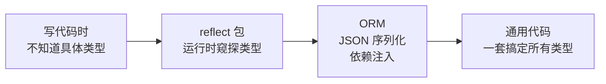
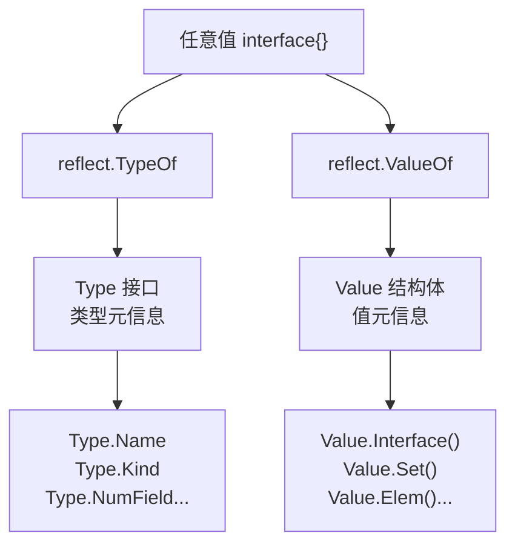
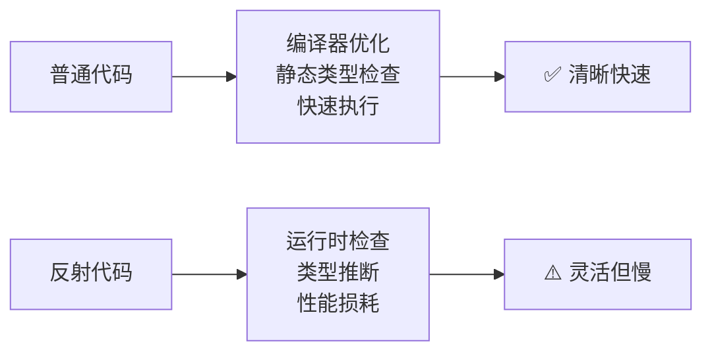

+++
title = "第 29 章：反射——reflect 包"
weight = 290
date = "2026-03-30T13:43:00+08:00"
type = "docs"
description = ""
isCJKLanguage = true
draft = false
+++
# 第 29 章：反射——reflect 包

> "当你凝视深渊时，深渊也在凝视你。当你凝视 reflect 包时，Go 编译器笑了——因为你放弃了一眼就能看懂的代码。" ——一位不愿透露姓名的 Gopher

## 29.1 reflect 包解决什么问题

写代码的时候，我们大多数时候都知道变量的类型：

```go
var name string = "阿斗"
fmt.Println(name) // 一眼就知道是 string，简单！
```

但是，总有一些"万能代码"需要对**任意类型**进行操作，此时编译器在编译期是盲的，它根本不知道你传进来的是啥。典型场景有哪些？

- **ORM**：数据库的字段可能是 `string`、`int`、`bool`，但代码只有一套，这时候该怎么办？
- **JSON 序列化/反序列化**：`json.Unmarshal` 怎么知道该把 `"123"` 塞进 `int` 还是 `float64`？
- **依赖注入容器**：只知道"我要一个 Logger 接口"，但不知道具体是 `logrus.Logger` 还是 `zap.Sugar`。
- **通用格式化、克隆、比较**：对任意结构做深拷贝，却不知道字段有哪些。

这时，**反射（Reflection）** 就登场了。反射让你在**程序运行时**去"窥探"类型、修改值——即使编译器对此一无所知。

```go
package main

import (
    "fmt"
    "reflect"
)

// 想象这是一个 ORM 框架，从数据库读了一行记录
func printFieldNames(v interface{}) {
    // 编译期我们什么都不知道，reflect 来帮忙
    t := reflect.TypeOf(v)
    if t.Kind() == reflect.Struct {
        for i := 0; i < t.NumField(); i++ {
            fmt.Printf("字段名: %s, 类型: %s\n", t.Field(i).Name, t.Field(i).Type)
        }
    }
}

type User struct {
    Name   string
    Age    int
    Email  string
}

func main() {
    user := User{Name: "阿斗", Age: 18, Email: "adou@example.com"}
    printFieldNames(user)
    // 字段名: Name, 类型: string
    // 字段名: Age, 类型: int
    // 字段名: Email, 类型: string
}
```

> **专业词汇解释**
> - **反射（Reflection）**：程序在运行时检查和操作自身结构的能力，包括类型信息和值信息。
> - **类型元信息（Type Metadata）**：描述类型本身的数据，如字段列表、方法列表等。
> - **运行时（Runtime）**：程序执行期间的阶段，与"编译时"相对应。



---

## 29.2 reflect 核心原理

reflect 包的精髓在于两个函数：**`reflect.TypeOf`** 和 **`reflect.ValueOf`**。

- **`reflect.TypeOf`** —— 返回值的**类型元信息**，类似一面镜子，告诉你"这玩意儿是啥"。
- **`reflect.ValueOf`** —— 返回值的**值元信息**，类似一面镜子，告诉你"这玩意儿存的是啥"。

```go
package main

import (
    "fmt"
    "reflect"
)

func main() {
    x := 42

    t := reflect.TypeOf(x) // TypeOf 返回 Type 接口
    v := reflect.ValueOf(x) // ValueOf 返回 Value 结构体

    fmt.Printf("类型: %v\n", t)   // 类型: int
    fmt.Printf("值:   %v\n", v)   // 值:   42
    fmt.Printf("种类: %v\n", v.Kind()) // 种类: int
}
```

> **专业词汇解释**
> - **Type 接口**：表示 Go 语言的类型，定义了类型名、字段、方法等元信息。
> - **Value 结构体**：表示 Go 语言的值，包含了实际数据以及操作数据的方法。
> - **Kind**：类型的底层种类，比如 `int`、`string`、`struct` 等原始类型分类。



---

## 29.3 reflect.TypeOf：获取任意值的类型

`reflect.TypeOf` 是 reflect 包的入口函数。它接受一个 `interface{}`，然后返回该值的**类型信息**。

**注意**：传入 `TypeOf` 的值会先被存到一个空接口里，所以即使你传 `int` 类型的变量，函数签名也是 `TypeOf(interface{})`。

```go
package main

import (
    "fmt"
    "reflect"
)

func main() {
    // 各种类型，统统拿下
    a := "Hello, reflect!"
    b := 1024
    c := 3.14
    d := true
    e := []int{1, 2, 3}
    f := map[string]int{"go": 1, "rust": 2}

    values := []interface{}{a, b, c, d, e, f}

    for _, v := range values {
        t := reflect.TypeOf(v)
        fmt.Printf("值 = %-20v  类型 = %-10s  种类 = %-10s\n",
            v, t, t.Kind())
    }
    // 值 = Hello, reflect!        类型 = string     种类 = string
    // 值 = 1024                    类型 = int        种类 = int
    // 值 = 3.14                    类型 = float64    种类 = float64
    // 值 = true                    类型 = bool       种类 = bool
    // 值 = [1 2 3]                 类型 = []int      种类 = slice
    // 值 = map[go:1 rust:2]        类型 = map[string]int 种类 = map
}
```

> **专业词汇解释**
> - **`interface{}`**：Go 的空接口，可以装任意类型的值，类似其他语言的 `Object` 或 `variant`。

---

## 29.4 reflect.ValueOf：获取任意值的 Value

如果说 `TypeOf` 是告诉你"这是什么牌子的车"，那 `ValueOf` 就是告诉你"这辆车现在装了多少油"。它返回的 `Value` 对象可以用来**读取或修改**这个值。

```go
package main

import (
    "fmt"
    "reflect"
)

func main() {
    name := "阿斗"
    v := reflect.ValueOf(name)

    fmt.Printf("值的种类: %v\n", v.Kind())   // 种类: string
    fmt.Printf("值的字符串: %v\n", v.String()) // 字符串: 阿斗
    fmt.Printf("值的地址: %p (原始变量)\n", &name) // 注意：ValueOf 创建副本，地址不同
}
```

> **专业词汇解释**
> - **Value 对象**：reflect 包中表示值的结构体，包含了值的副本而非原始引用。
> - **种类（Kind）**：Go 语言的底层类型分类，如 `int`、`string`、`struct` 等。

---

## 29.5 Type 和 Value 的关系

`Type` 是类型的"蓝图"（静态信息），`Value` 是值的"快照"（动态信息）。

打个比方：`Type` 是建筑图纸，`Value` 是已经盖好的房子。你可以有多栋相同的房子（多个 Value），但图纸只有一份（一个 Type）。

```go
package main

import (
    "fmt"
    "reflect"
)

type Person struct {
    Name string
    Age  int
}

func main() {
    p := Person{Name: "阿斗", Age: 28}

    t := reflect.TypeOf(p) // 获取类型信息（图纸）
    v := reflect.ValueOf(p) // 获取值信息（房子）

    fmt.Printf("Type:  %s (字段数: %d)\n", t.Name(), t.NumField())
    fmt.Printf("Value: %+v\n", v.Interface())
    // Type:  Person (字段数: 2)
    // Value: {Name:阿斗 Age:28}
}
```

> **专业词汇解释**
> - **Type（类型元信息）**：描述类型的结构，包含字段、方法、包路径等，不随值变化。
> - **Value（值元信息）**：描述具体的值，包含实际数据，可以通过 Value 的方法修改（如果可设置）。

---

## 29.6 Type.Name：类型名称

`Type.Name()` 返回类型的基本名称（不含包路径）。这是你写代码时用的名字，比如 `int`、`string`、`Person`。

```go
package main

import (
    "fmt"
    "reflect"
)

type User struct{}         // 名称: User
type OrderItem struct{}    // 名称: OrderItem

func main() {
    values := []interface{}{
        User{},
        OrderItem{},
        42,
        "hello",
        new(User), // *User
    }

    for _, v := range values {
        t := reflect.TypeOf(v)
        fmt.Printf("TypeOf(%T) => Name: %q, String: %s\n", v, t.Name(), t.String())
    }
    // TypeOf(main.User) => Name: "User", String: main.User
    // TypeOf(main.OrderItem) => Name: "OrderItem", String: main.OrderItem
    // TypeOf(int) => Name: "int", String: int
    // TypeOf(string) => Name: "string", String: string
    // TypeOf(*main.User) => Name: "User", String: *main.User
}
```

> **专业词汇解释**
> - **`Name()`**：返回类型的基本名称，不包含包路径。
> - **`String()`**：返回类型的完整名称，包含包路径（如 `main.User`）。

---

## 29.7 Type.Kind：基础种类

`Kind` 是类型的"底层材质"，告诉你这个类型的"真面目"。不管你是 `int` 还是 `int32` 还是自定义的 `MyInt`，它们的 Kind 都是 `int`。

Go 语言支持的 Kind 种类包括：

| Kind | 含义 |
|------|------|
| `Int` | 有符号整型 |
| `String` | 字符串 |
| `Struct` | 结构体 |
| `Slice` | 切片 |
| `Map` | 映射 |
| `Chan` | 通道 |
| `Func` | 函数 |
| `Ptr` | 指针 |
| `Interface` | 接口 |
| `Array` | 数组 |
| `Bool` | 布尔 |
| `Float64` | 浮点数 |
| `Uint` | 无符号整型 |

```go
package main

import (
    "fmt"
    "reflect"
)

type MyInt int // 自定义类型，但 Kind 依然是 int

func main() {
    values := []interface{}{
        42,
        "hello",
        MyInt(42),
        struct{}{},
        []int{1, 2},
        map[string]int{},
        make(chan int),
        func() {},
        new(int),
        interface{}(nil),
        [3]int{1, 2, 3},
        true,
        3.14,
    }

    for _, v := range values {
        t := reflect.TypeOf(v)
        if t != nil {
            fmt.Printf("%-20T => Kind: %-10s\n", v, t.Kind())
        } else {
            fmt.Printf("%-20T => Kind: <nil>\n", v)
        }
    }
    // int                  => Kind: int
    // string               => Kind: string
    // main.MyInt            => Kind: int         ← 自定义类型 Kind 不变
    // struct {}             => Kind: struct
    // []int                 => Kind: slice
    // map[string]int        => Kind: map
    // chan int              => Kind: chan
    // func()                => Kind: func
    // *int                  => Kind: ptr
    // <nil>                 => Kind: <nil>
    // [3]int                => Kind: array
    // bool                  => Kind: bool
    // float64               => Kind: float64
}
```

> **专业词汇解释**
> - **`Kind`**：Go 语言的底层类型分类，是所有类型的"原子类型"，反映的是最原始的数据组织形式。

---

## 29.8 Kind 和 Type 的区别

这是新手最容易混淆的点：`Type` 是**具体类型**（带包名），`Kind` 是**底层种类**（原始分类）。

就像"不锈钢保温杯"——`Type` 是"不锈钢保温杯"（具体），`Kind` 是"容器"（笼统）。

```go
package main

import (
    "fmt"
    "reflect"
)

type Animal struct {
    Name string
}

func main() {
    a := Animal{Name: "旺财"}

    t := reflect.TypeOf(a)

    fmt.Printf("Type.Name()  = %q (具体类型名)\n", t.Name())    // "Animal"
    fmt.Printf("Type.Kind() = %v (底层种类)\n", t.Kind())      // struct

    // 再看指针类型
    p := &a
    tp := reflect.TypeOf(p)
    fmt.Printf("指针 Type.Name()  = %q\n", tp.Name())           // "" ← 指针类型没有名字
    fmt.Printf("指针 Type.Kind() = %v\n", tp.Kind())            // ptr
    fmt.Printf("指针 Elem().Kind() = %v (解引用后)\n", tp.Elem().Kind()) // struct
}
```

> **专业词汇解释**
> - **`Kind`（种类）**：描述类型的底层分类，类似于其他语言的"基础类型"概念。
> - **`Type`（类型）**：描述具体的 Go 类型，包含包路径、字段、方法等完整信息。

---

## 29.9 Type.NumField、Type.Field(i)：结构体字段信息

想遍历结构体的所有字段？`NumField()` 告诉你有多少个字段，`Field(i)` 获取第 `i` 个字段的信息（类型、名称、标签等）。

```go
package main

import (
    "fmt"
    "reflect"
)

type Order struct {
    ID      string `json:"order_id" db:"id"`
    Amount  float64 `json:"amount" db:"amount"`
    Paid    bool   `json:"paid" db:"paid"`
}

func main() {
    t := reflect.TypeOf(Order{})

    fmt.Printf("结构体 %s 有 %d 个字段:\n", t.Name(), t.NumField())
    for i := 0; i < t.NumField(); i++ {
        f := t.Field(i)
        fmt.Printf("  字段[%d]: 名称=%-8s 类型=%-15s 标签=%s\n",
            i, f.Name, f.Type.String(), f.Tag.Get("json"))
    }
    // 结构体 Order 有 3 个字段:
    //   字段[0]: 名称=ID       类型=string          标签=order_id
    //   字段[1]: 名称=Amount    类型=float64         标签=amount
    //   字段[2]: 名称=Paid      类型=bool            标签=paid
}
```

> **专业词汇解释**
> - **`NumField()`**：返回结构体字段的数量。
> - **`Field(i)`**：返回索引 `i` 处的字段信息（类型 `StructField`），包含 Name、Type、Tag 等。
> - **`StructTag`**：结构体字段的标签，用于存储元信息（如 `json:"order_id"`）。

---

## 29.10 Type.FieldByName、Type.FieldByIndex：按名称和索引访问字段

有时候你不想遍历，而是直接按名字或嵌套路径取字段：

- **`FieldByName`**：按名称查找，找不到返回零值。
- **`FieldByIndex`**：按索引链查找，适合嵌套结构，比如 `User.Address.City`。

```go
package main

import (
    "fmt"
    "reflect"
)

type Address struct {
    City    string
    Country string
}

type User struct {
    Name    string
    Address Address
}

func main() {
    t := reflect.TypeOf(User{})

    // 按名称查找
    if f, ok := t.FieldByName("Name"); ok {
        fmt.Printf("找到字段 Name: 类型=%s\n", f.Type)
    }
    if f, ok := t.FieldByName("NotExist"); !ok {
        fmt.Println("字段 NotExist 不存在")
    }

    // 按嵌套索引查找：User.Address.City
    f := t.FieldByIndex([]int{1, 0}) // 第1个字段(Address)的第0个子字段(City)
    fmt.Printf("FieldByIndex([1,0]) = %s (%s)\n", f.Name, f.Type)
    // FieldByIndex([1,0]) = City (string)
}
```

> **专业词汇解释**
> - **`FieldByName(name string)`**：按字段名查找，返回 `StructField` 和是否找到的布尔值。
> - **`FieldByIndex(index []int)`**：按嵌套索引路径查找，用于访问嵌套结构体的字段。

---

## 29.11 Type.Implements：判断是否实现某接口

想要知道某个类型是否实现了某个接口？`Implements()` 帮你判断。

```go
package main

import (
    "fmt"
    "reflect"
)

type Writer interface {
    Write([]byte) (int, error)
}

type Person struct{}

func (Person) Speak() {}

// 注意：Person 没有实现 Writer
func (Person) Write([]byte) (int, error) {
    return 0, nil
}

type Logger struct{}

func (Logger) Log(msg string) {}

func main() {
    var (
        p Person
        l Logger
    )

    writerType := reflect.TypeOf((*Writer)(nil)).Elem()

    tP := reflect.TypeOf(p)
    tL := reflect.TypeOf(l)

    fmt.Printf("Person 实现了 Writer? %v\n", tP.Implements(writerType))
    fmt.Printf("Logger 实现了 Writer? %v\n", tL.Implements(writerType))
    // Person 实现了 Writer? true
    // Logger 实现了 Writer? false
}
```

> **专业词汇解释**
> - **`Implements(u Type)`**：判断该类型是否实现了接口 `u`。接口类型通过 `reflect.TypeOf((*Interface)(nil)).Elem()` 获取。
> - **`reflect.TypeOf((*Writer)(nil)).Elem()`**：这是获取接口类型元信息的常用技巧。

---

## 29.12 Type.AssignableTo、Type.ConvertibleTo：赋值兼容和类型转换兼容

- **`AssignableTo`**：判断类型的值能否直接赋值给某类型。
- **`ConvertibleTo`**：判断类型的值能否通过显式类型转换得到某类型。

```go
package main

import (
    "fmt"
    "reflect"
)

func main() {
    intType := reflect.TypeOf(0)
    int64Type := reflect.TypeOf(int64(0))
    stringType := reflect.TypeOf("")
    runeType := reflect.TypeOf(rune(0))

    // int 和 int64 能否互相赋值？
    fmt.Printf("int -> int    赋值兼容? %v\n", intType.AssignableTo(intType))
    fmt.Printf("int -> int64  赋值兼容? %v\n", intType.AssignableTo(int64Type))
    fmt.Printf("int -> int64  转换兼容? %v\n", intType.ConvertibleTo(int64Type))
    fmt.Printf("int -> string 转换兼容? %v\n", intType.ConvertibleTo(stringType))
    fmt.Printf("int -> rune   转换兼容? %v\n", intType.ConvertibleTo(runeType))
    // int -> int    赋值兼容? true
    // int -> int64  赋值兼容? false
    // int -> int64  转换兼容? true   ← 可以强制转换
    // int -> string 转换兼容? false
    // int -> rune   转换兼容? true
}
```

> **专业词汇解释**
> - **`AssignableTo`**：检查赋值兼容性，`int` 类型的值不能直接赋值给 `int64` 变量（需要显式转换）。
> - **`ConvertibleTo`**：检查类型转换兼容性，即使 `int` 不能直接赋值给 `string`，但 `int` 可以转换为 `rune`。

---

## 29.13 Value.Interface()：Value → interface{}

`Value` 是 reflect 包内部使用的，想要把 `Value` 变回普通的 `interface{}`，就用 `Interface()` 方法。它相当于一面"反向镜子"，把运行时的东西重新带回编译器的视野。

```go
package main

import (
    "fmt"
    "reflect"
)

func main() {
    x := 42
    v := reflect.ValueOf(x)

    // Value → interface{}
    i := v.Interface()
    fmt.Printf("原始类型: %T, 值: %v\n", i, i)
    // 原始类型: int, 值: 42

    y := i.(int) // 再转回 int（需要断言）
    fmt.Printf("断言回 int: %d\n", y)
}
```

> **专业词汇解释**
> - **`Interface()`**：将 `reflect.Value` 转换回 `interface{}`，本质上是从运行时把值"还"给编译器。

---

## 29.14 Value.CanSet：是否可设置，未导出的字段不可设置

**重要！** 通过 `reflect.ValueOf` 获取的 Value 是**值的副本**，默认情况下是**不可设置**的。就像你拿到了建筑图纸的复印件，你不能拆墙改结构。

只有以下情况 `CanSet()` 才返回 `true`：
- 原始变量是指针，且用了 `Value.Elem()` 解引用。

```go
package main

import (
    "fmt"
    "reflect"
)

type Config struct {
    Name  string // 大写导出字段
    token string // 小写未导出字段
}

func main() {
    c := Config{Name: "阿斗", token: "secret123"}

    v := reflect.ValueOf(c)
    vName := v.FieldByName("Name")
    vToken := v.FieldByName("token")

    fmt.Printf("Name 字段 CanSet? %v\n", vName.CanSet())
    fmt.Printf("token 字段 CanSet? %v\n", vToken.CanSet())

    // 正确姿势：传指针，才能修改
    vp := reflect.ValueOf(&c)
    vp.Elem().FieldByName("Name").SetString("阿斗改")
    fmt.Printf("修改后: %+v\n", c)
    // 修改后: {Name:阿斗改 token:secret123}

    // 注意：未导出字段即使解引用也改不了（Go 的保护机制）
    fmt.Printf("token 字段（解引用后）CanSet? %v\n", vp.Elem().FieldByName("token").CanSet())
    // token 字段（解引用后）CanSet? false
}
```

> **专业词汇解释**
> - **`CanSet()`**：返回该 Value 是否可以被设置。只有通过指针解引用获取的 Value 才是可设置的。
> - **未导出字段（unexported field）**：小写字母开头的字段，Go 的可见性规则禁止跨包修改，反射也无法突破这道墙。

---

## 29.15 Value.Set、Value.SetInt、Value.SetString：设置值

设置值的方法取决于值的类型：
- `Set(value Value)`：设置任意类型的值。
- `SetInt(int64)`：设置整型值。
- `SetString(string)`：设置字符串值。

**前提**：必须通过指针 + `Elem()` 获取可设置的 Value。

```go
package main

import (
    "fmt"
    "reflect"
)

func main() {
    var (
        age    int
        name   string
        score  float64
    )

    vpAge := reflect.ValueOf(&age)
    vpName := reflect.ValueOf(&name)
    vpScore := reflect.ValueOf(&score)

    // 设置整型
    vpAge.Elem().SetInt(28)
    fmt.Printf("age = %d\n", age) // age = 28

    // 设置字符串
    vpName.Elem().SetString("阿斗")
    fmt.Printf("name = %s\n", name) // name = 阿斗

    // 设置浮点
    vpScore.Elem().SetFloat(99.5)
    fmt.Printf("score = %.1f\n", score) // score = 99.5

    // 用通用 Set
    vpAge.Elem().Set(reflect.ValueOf(30))
    fmt.Printf("age (via Set) = %d\n", age) // age (via Set) = 30
}
```

> **专业词汇解释**
> - **`SetInt(int64)`**：设置有符号整型值（所有有符号整型都用 int64 传递）。
> - **`SetString(string)`**：设置字符串值。
> - **`Set(Value)`**：通用设置方法，接收另一个 Value 作为来源。

---

## 29.16 Value.Elem()：解引用指针

`Value.Elem()` 有两个用途：
1. **解引用指针**：拿到指针指向的实际值。
2. **解引用接口**：拿到接口中存储的具体值。

如果 Value 不是指针也不是接口，调用 `Elem()` 会 panic。

```go
package main

import (
    "fmt"
    "reflect"
)

func main() {
    // 场景1：解引用指针
    num := 100
    p := &num

    vp := reflect.ValueOf(p)
    fmt.Printf("指针 Kind: %v, 解引用后: %v\n",
        vp.Kind(), vp.Elem().Int())
    // 指针 Kind: ptr, 解引用后: 100

    // 通过 Elem 修改指针指向的值
    vp.Elem().SetInt(200)
    fmt.Printf("修改后 num = %d\n", num) // 修改后 num = 200

    // 场景2：解引用接口
    var i interface{} = "hello world"
    vi := reflect.ValueOf(i)
    fmt.Printf("接口解引用: %q\n", vi.Elem().String())
    // 接口解引用: "hello world"
}
```

> **专业词汇解释**
> - **`Elem()`**：返回 Value 所指向的值（解引用），是修改指针指向值的关键方法。

---

## 29.17 Value.MapIndex、Value.MapKeys：访问 Map

想用反射操作 Map？需要用到这两个方法：
- **`MapKeys()`**：返回 Map 的所有 Key（以 Value 切片形式）。
- **`MapIndex(key Value)`**：根据 Key 获取对应的 Value。

```go
package main

import (
    "fmt"
    "reflect"
)

func main() {
    m := map[string]int{
        "Go":     2009,
        "Rust":   2010,
        "Zig":    2015,
    }

    v := reflect.ValueOf(m)

    // 获取所有 key
    keys := v.MapKeys()
    fmt.Println("所有语言:")
    for _, k := range keys {
        val := v.MapIndex(k)
        fmt.Printf("  %s: %d\n", k.String(), val.Int())
    }
    // Go: 2009
    // Rust: 2010
    // Zig: 2015

    // 按 key 查找
    goYear := v.MapIndex(reflect.ValueOf("Go"))
    fmt.Printf("Go 诞生年份: %d\n", goYear.Int())
    // Go 诞生年份: 2009
}
```

> **专业词汇解释**
> - **`MapKeys()`**：返回 map 中所有 key 的 Value 切片，顺序是随机的。
> - **`MapIndex(key Value)`**：根据 key 返回对应的 value，如果 key 不存在返回零值 Value。

---

## 29.18 Value.Call：调用函数

`Value.Call()` 让你在运行时调用函数！传入 `[]Value` 作为参数，返回 `[]Value` 作为结果。

```go
package main

import (
    "fmt"
    "reflect"
)

func Add(a, b int) int {
    return a + b
}

func Greet(name string) string {
    return "Hello, " + name + "!"
}

func main() {
    // 调用 Add
    addFn := reflect.ValueOf(Add)
    args := []reflect.Value{
        reflect.ValueOf(3),
        reflect.ValueOf(4),
    }
    results := addFn.Call(args)
    fmt.Printf("Add(3, 4) = %d\n", results[0].Int())
    // Add(3, 4) = 7

    // 调用 Greet
    greetFn := reflect.ValueOf(Greet)
    greetArgs := []reflect.Value{reflect.ValueOf("阿斗")}
    greetResult := greetFn.Call(greetArgs)
    fmt.Printf("Greet(\"阿斗\") = %s\n", greetResult[0].String())
    // Greet("阿斗") = Hello, 阿斗!
}
```

> **专业词汇解释**
> - **`Call([]Value)`**：调用函数或方法，参数和返回值都是 `[]Value`。这是反射中最接近"动态代码执行"的能力。

---

## 29.19 StructTag：结构体标签，StructTag.Get、StructTag.Lookup

结构体标签是写在字段后面反引号里的元信息，格式为 `key:"value"`，常见的如 `json:"field_name"`、`db:"column_name"`、`validate:"required"`。

Go 提供了两种解析方式：
- **`Get(key)`**：直接获取指定 key 的值，找不到返回空字符串。
- **`Lookup(key)`**：更严谨的查找，返回 (value, ok) 两元组。

```go
package main

import (
    "fmt"
    "reflect"
)

type User struct {
    ID    int    `json:"id"        db:"id"        validate:"required"`
    Name  string `json:"name"      db:"user_name" validate:"min=2"`
    Email string `json:"email"     db:"-"         validate:"email"`
    Age   int    `json:"age,omitempty" db:"-" validate:"gte=0"`
}

func main() {
    t := reflect.TypeOf(User{})

    for i := 0; i < t.NumField(); i++ {
        f := t.Field(i)
        tag := f.Tag

        jsonVal := tag.Get("json")
        dbVal := tag.Get("db")
        validateVal, _ := tag.Lookup("validate")

        fmt.Printf("字段: %-6s | json: %-20s | db: %-12s | validate: %s\n",
            f.Name, jsonVal, dbVal, validateVal)
    }
    // 字段: ID     | json: id                  | db: id         | validate: required
    // 字段: Name   | json: name                | db: user_name   | validate: min=2
    // 字段: Email  | json: email                | db: -           | validate: email
    // 字段: Age    | json: age,omitempty       | db: -           | validate: gte=0
}
```

> **专业词汇解释**
> - **`StructTag`**：结构体字段的标签，是一个字符串，格式为 `key:"value"`。
> - **`Get(key)`**：从 StructTag 中提取指定 key 的值，找不到返回空字符串。
> - **`Lookup(key)`**：从 StructTag 中提取值，返回 (value, found) 两元组，比 Get 更安全。
> - **`db:"-"`**：横杠表示忽略该字段，不映射到数据库列。

---

## 29.20 反射的典型应用：encoding/json、ORM 字段映射、依赖注入容器

反射在 Go 标准库和框架中被广泛使用，以下是三个最典型的场景：

### encoding/json：自动序列化任意结构

`json.Marshal` 内部通过反射遍历结构体的字段，读取 StructTag 中的 `json` 键来决定序列化后的字段名。

```go
package main

import (
    "encoding/json"
    "fmt"
)

type Product struct {
    Name  string  `json:"product_name"`
    Price float64 `json:"price"`
}

func main() {
    p := Product{Name: "机械键盘", Price: 599.00}
    data, _ := json.Marshal(p)
    fmt.Printf("JSON: %s\n", data)
    // JSON: {"product_name":"机械键盘","price":599}
}
```

### ORM 字段映射：根据 StructTag 映射数据库列

```go
package main

import (
    "fmt"
    "reflect"
)

// 模拟 ORM 根据 db tag 做字段映射
func mapToDBFields(v interface{}) {
    t := reflect.TypeOf(v)
    for i := 0; i < t.NumField(); i++ {
        f := t.Field(i)
        dbCol := f.Tag.Get("db")
        if dbCol != "" && dbCol != "-" {
            fmt.Printf("字段 %s → DB 列 %s\n", f.Name, dbCol)
        }
    }
}

type User struct {
    ID    int    `db:"users_id"`
    Name  string `db:"users_name"`
    token string `db:"-"` // 忽略
}

func main() {
    mapToDBFields(User{})
    // 字段 ID → DB 列 users_id
    // 字段 Name → DB 列 users_name
}
```

### 依赖注入容器：根据接口类型实例化

```go
package main

import (
    "fmt"
    "reflect"
)

type Logger interface {
    Log(msg string)
}

type ConsoleLogger struct{}

func (ConsoleLogger) Log(msg string) {
    fmt.Println("LOG:", msg)
}

// 简化版 DI 容器
func resolve(loggerType reflect.Type) interface{} {
    // 反射创建一个新实例（需要指针类型）
    ptr := reflect.New(loggerType)
    return ptr.Interface()
}

func main() {
    var logger Logger = ConsoleLogger{}
    loggerType := reflect.TypeOf(&logger).Elem()

    resolved := resolve(loggerType)
    resolved.(Logger).Log("容器成功解析！")
    // LOG: 容器成功解析！
}
```

> **专业词汇解释**
> - **ORM（Object-Relational Mapping）**：对象-关系映射，将数据库表映射为代码中的结构体。
> - **依赖注入（Dependency Injection）**：通过外部注入依赖而非内部创建，容器通过反射实例化具体实现。

---

## 29.21 反射的反面：性能开销大，Go 的哲学是"清晰优于力量"

反射虽好，但它有三大原罪：

1. **性能开销大**：反射涉及大量的运行时类型检查和内存分配，比直接调用慢 10～100 倍。
2. **编译器无法优化**：编译器看到的是 `interface{}`，它没法提前知道你的代码要做什么。
3. **类型不安全**：你可能在运行时因为类型不匹配而 panic，编译器救不了你。

Go 官方一直强调：**"清晰优于力量"（Clear is better than clever）**。如果你能用普通代码解决的问题，就不要用反射。

```go
package main

import (
    "fmt"
    "reflect"
    "time"
)

// 普通调用 vs 反射调用
func add(a, b int) int { return a + b }

func main() {
    const N = 1000000

    // 普通调用
    start := time.Now()
    for i := 0; i < N; i++ {
        _ = add(1, 2)
    }
    plain := time.Since(start)

    // 反射调用
    fn := reflect.ValueOf(add)
    args := []reflect.Value{reflect.ValueOf(1), reflect.ValueOf(2)}
    start = time.Now()
    for i := 0; i < N; i++ {
        _ = fn.Call(args)
    }
    viaReflect := time.Since(start)

    fmt.Printf("普通调用: %v\n", plain)    // ~1-5ms
    fmt.Printf("反射调用: %v\n", viaReflect) // ~500-2000ms（慢 100-500 倍！）
}
```



> **专业词汇解释**
> - **性能开销**：反射需要在运行时进行类型解析、方法查找等操作，额外消耗 CPU 时间和内存。
> - **Go 哲学**：Go 语言推崇显式优于隐式，简单代码的运行效率和维护成本都更低。

---

## 29.22 reflect.TypeOf(nil)：返回 nil

当你传入 `nil` 给 `TypeOf` 时，返回值是 `nil`。因为 `nil` 没有类型信息——编译器不知道它是 `*int` 还是 `string`，运行时它就是一片虚无。

```go
package main

import (
    "fmt"
    "reflect"
)

func main() {
    var nilPtr *int = nil

    // 传入 nil interface{}
    var nilInterface interface{} = nil
    t1 := reflect.TypeOf(nilInterface)
    fmt.Printf("reflect.TypeOf(nil) = %v (nil? %v)\n", t1, t1 == nil)
    // reflect.TypeOf(nil) = <nil> (nil? true)

    // 传入具体类型的 nil
    t2 := reflect.TypeOf(nilPtr)
    fmt.Printf("reflect.TypeOf((*int)(nil)) = %v\n", t2)
    // reflect.TypeOf((*int)(nil)) = *int ← nil 指针也有类型！
}
```

> **专业词汇解释**
> - **`nil` 值**：Go 中的"零值"，表示指针、通道、接口、切片、映射、函数未初始化时的状态。`interface{}` 类型的 nil 值调用 `TypeOf` 返回 `nil`。

---

## 29.23 reflect.ValueOf(nil)：返回零值 Value，IsValid() = false

`reflect.ValueOf(nil)` 不会 panic，它返回一个**零值的 Value**。零值 Value 的 `IsValid()` 返回 `false`，表示这个 Value 背后没有真实的值。

```go
package main

import (
    "fmt"
    "reflect"
)

func main() {
    var nilPtr *int = nil

    // 传入 nil interface{}
    v1 := reflect.ValueOf(nil)
    fmt.Printf("reflect.ValueOf(nil).IsValid() = %v\n", v1.IsValid())
    // reflect.ValueOf(nil).IsValid() = false

    // 传入具体类型的 nil 指针
    v2 := reflect.ValueOf(nilPtr)
    fmt.Printf("reflect.ValueOf((*int)(nil)).IsValid() = %v\n", v2.IsValid())
    fmt.Printf("reflect.ValueOf((*int)(nil)).Kind() = %v\n", v2.Kind())
    // reflect.ValueOf((*int)(nil)).IsValid() = true
    // reflect.ValueOf((*int)(nil)).Kind() = ptr

    // 零值 Value 无法调用大多数方法
    // 下面这行会 panic！
    // v1.Interface() // panic: reflect: call of reflect.Value.Interface on zero Value
    _ = v1.Interface // 注释掉以避免 panic
}
```

> **专业词汇解释**
> - **`IsValid()`**：返回 Value 是否代表一个有效的值。零值 Value（来自 `reflect.ValueOf(nil)`）的 `IsValid()` 返回 `false`。
> - **零值 Value**：所有字段都是零值的 Value 结构体，不代表任何实际的 Go 值。

---

## 本章小结

本章我们深入探索了 Go 语言的**反射（reflection）**机制，由 `reflect` 包提供。反射让程序在**运行时**能够检查和操作任意值的类型信息与值信息，打破了编译器的"盲区"。

### 核心概念

| 概念 | 说明 |
|------|------|
| **`reflect.TypeOf`** | 获取值的**类型元信息**，返回 `Type` 接口 |
| **`reflect.ValueOf`** | 获取值的**值元信息**，返回 `Value` 结构体 |
| **`Type.Kind`** | 底层类型种类（`int`、`struct`、`slice` 等） |
| **`Type.Name`** | 具体类型名称（不含包路径） |
| **`Value.Interface()`** | 将 Value 转换回 `interface{}` |
| **`Value.CanSet`** | 标记 Value 是否可修改（需通过指针解引用） |
| **`Value.Elem()`** | 解引用指针或接口 |
| **`StructTag`** | 结构体字段标签，ORM/JSON 序列化的基础 |
| **`Value.Call`** | 动态调用函数 |

### 反射的典型应用

- **`encoding/json`**：遍历结构体字段，按 StructTag 中的 `json` 键序列化。
- **ORM 框架**：按 `db` 标签映射数据库列，实现结构体 → 数据库表的转换。
- **依赖注入容器**：根据接口类型动态实例化具体实现。

### 反射的代价

反射的核心问题是**性能**和**类型安全**。Go 官方推崇的哲学是**"清晰优于力量"**——如果普通代码能搞定，就不要用反射。在 benchmark 敏感或极致性能要求的路径上，反射通常是第一个被优化的目标。

> "反射是 Go 里的万能钥匙——能开所有锁，但每次开门你都得付钱。" ——某位被反射性能坑过的 Gopher
