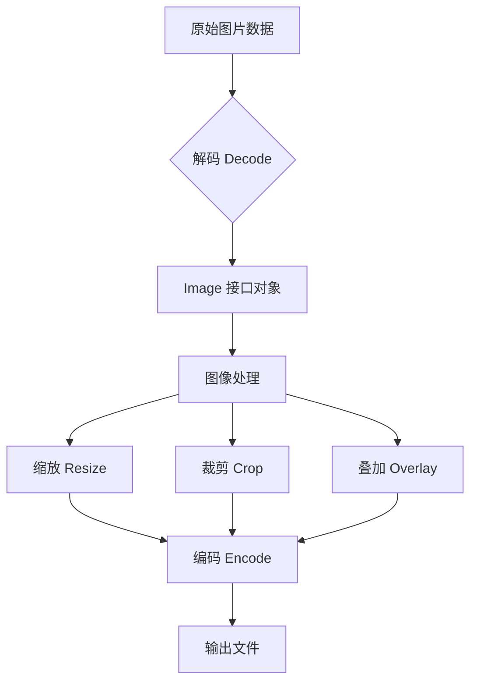
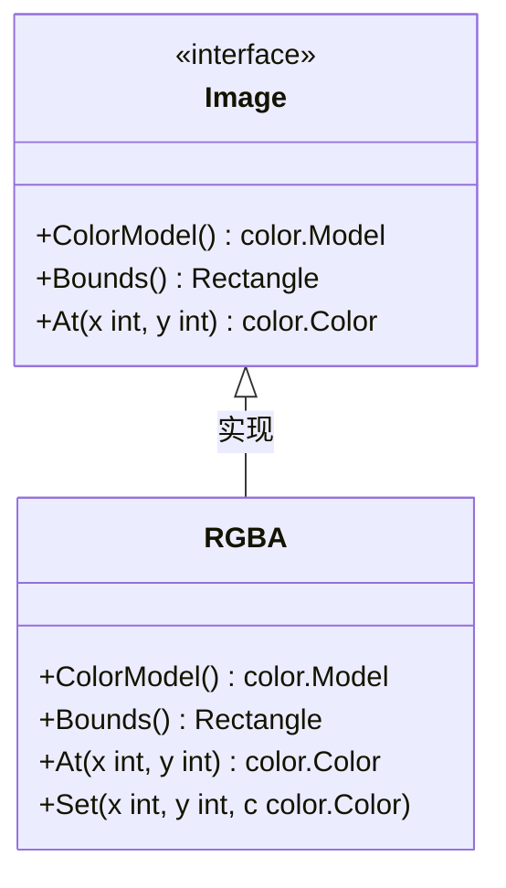

+++
title = "第30章：图像处理——image 包"
weight = 300
date = "2026-03-30T13:43:00+08:00"
type = "docs"
description = ""
isCJKLanguage = true
draft = false
+++
# 第30章：图像处理——image 包

> 🎨 "一图胜千言"，在程序员的世界里，一张验证码图片能挡住99%的机器人爬虫，一张缩略图能让网页加载快到飞起，一个海报合成功能能让运营小姑娘少加三天班。这一切的神奇魔法，都藏在 Go 的 `image` 包里。

---

## 30.1 image包解决什么问题：生成图片验证码、缩放头像、合成海报

`image` 包是 Go 标准库中处理图像的瑞士军刀，无论你是要生成一个让机器人抓狂的验证码，还是要用户的头像从4096x4096缩放到64x64，亦或是把用户头像和产品背景图合成一张营销海报——`image` 包都能优雅地帮你搞定。

**典型应用场景：**

| 场景 | 解决的问题 |
|------|------------|
| 图片验证码 | 生成随机文字+干扰线的验证码图片 |
| 头像缩放 | 把用户上传的大图缩放到统一尺寸 |
| 水印添加 | 在图片上叠加版权信息 |
| 海报合成 | 把模板、文字、头像合并成一张图 |
| 图片格式转换 | PNG ↔ JPEG ↔ GIF 互转 |

**mermaid 图：image 包处理流程**



**第一个图像程序——生成渐变色图片：**

```go
package main

import (
    "image"
    "image/png"
    "os"
)

func main() {
    // 创建一个 256x256 的图片
    width, height := 256, 256
    img := image.NewRGBA(image.Rect(0, 0, width, height))

    // 填充渐变色（从蓝到红）
    for y := 0; y < height; y++ {
        for x := 0; x < width; x++ {
            // R 通道随 x 增加而增加（0 -> 255）
            // B 通道随 y 增加而增加（0 -> 255）
            img.Set(x, y, color.RGBA{
                R: uint8(x),
                G: 0,
                B: uint8(y),
                A: 255,
            })
        }
    }

    // 保存为 PNG 文件
    file, err := os.Create("gradient.png")
    if err != nil {
        panic(err)
    }
    defer file.Close()

    // 编码并写入
    err = png.Encode(file, img)
    if err != nil {
        panic(err)
    }
    println("渐变色图片已生成：gradient.png") // 渐变色图片已生成：gradient.png
}
```

> 💡 **小贴士**：Go 的图像处理遵循"解码 → 处理 → 编码"三步走策略，就像做菜：先取出原材料（Decode），然后切炒烹炸（处理），最后装盘上菜（Encode）。

---

## 30.2 image核心原理：Image 接口，Color()、Bounds()、At(x,y)

`image` 包的核心是一个简单却强大的 `Image` 接口，它是整个图像处理世界的基石。理解了它，你就像拿到了图像处理世界的万能钥匙。

**Image 接口定义：**

```go
type Image interface {
    ColorModel() color.Model    // 返回颜色模型
    Bounds() Rectangle          // 返回图像边界
    At(x, y int) color.Color    // 获取指定点的颜色
}
```

**三个核心方法的通俗解释：**

| 方法 | 作用 | 类比 |
|------|------|------|
| `ColorModel()` | 返回这个图像使用的颜色模型（比如 RGBA、灰度） | 画布的颜料盒 |
| `Bounds()` | 返回图像的边界框，确定了图像的宽高和位置 | 画布的尺寸 |
| `At(x, y)` | 获取坐标 (x, y) 处的像素颜色 | 用放大镜查看某个点的颜色 |

**边界框 Bounds() 返回的 Rectangle 解读：**

```go
package main

import (
    "fmt"
    "image"
)

func main() {
    // 创建一个 100x200 的图像
    img := image.NewRGBA(image.Rect(0, 0, 100, 200))

    bounds := img.Bounds()
    fmt.Println("图像宽度:", bounds.Dx())  // 图像宽度: 100
    fmt.Println("图像高度:", bounds.Dy())  // 图像高度: 200
    fmt.Println("最小点:", bounds.Min)    // 最小点: {0, 0}
    fmt.Println("最大点:", bounds.Max)    // 最大点: {100, 200}
    fmt.Println("尺寸:", bounds.Size())  // 尺寸: {100, 200}
}
```

**At() 方法读取像素颜色：**

```go
package main

import (
    "fmt"
    "image"
    "image/color"
)

func main() {
    img := image.NewRGBA(image.Rect(0, 0, 3, 2))

    // 设置几个像素的颜色
    img.Set(0, 0, color.RGBA{255, 0, 0, 255})   // 左上角：红色
    img.Set(1, 0, color.RGBA{0, 255, 0, 255})   // 中上：绿色
    img.Set(2, 1, color.RGBA{0, 0, 255, 255})  // 右下：蓝色

    // 读取像素颜色
    c := img.At(0, 0).(color.RGBA)
    fmt.Printf("坐标(0,0)的颜色: R=%d, G=%d, B=%d, A=%d\n",
        c.R, c.G, c.B, c.A)  // 坐标(0,0)的颜色: R=255, G=0, B=0, A=255
}
```

**mermaid 图：Image 接口三剑客**



> 💡 **颜色模型的秘密**：`ColorModel()` 返回的是一个颜色转换器，它可以把任意颜色转换到当前图像使用的颜色空间。比如一个灰度图像的 ColorModel 会把所有颜色都转成灰度值。

---

## 30.3 image.Rect：创建矩形，Rect(x0, y0, x1, y1)

在 Go 的图像世界里，`Rect` 是定义图像尺寸和区域的标配。它看起来简单，但里面有些小细节如果不注意，就会让你debug到怀疑人生。

**Rect 函数签名：**

```go
func Rect(x0, y0, x1, y1 int) Rectangle
```

- `(x0, y0)` 是矩形的左上角坐标
- `(x1, y1)` 是矩形的右下角坐标（**注意：是exclusive的！**）

**这意味着：**

```go
package main

import (
    "fmt"
    "image"
)

func main() {
    // 创建一个宽100、高200的矩形
    r := image.Rect(0, 0, 100, 200)

    fmt.Println("宽度:", r.Dx())    // 宽度: 100  （因为 100-0=100）
    fmt.Println("高度:", r.Dy())    // 高度: 200  （因为 200-0=200）

    // 重要：x1, y1 是 exclusive 的！
    // 所以这个矩形包含的点是 x∈[0,100), y∈[0,200)
    // 一共 100 * 200 = 20000 个像素

    // 如果你想创建一个包含点(99,199)的矩形
    r2 := image.Rect(0, 0, 100, 200)
    _ = r2.At(99, 199)  // ✅ 合法，在范围内
    // _ = r2.At(100, 200)  // ❌ 越界！
}
```

**常见的 Rect 创建方式：**

```go
package main

import (
    "fmt"
    "image"
)

func main() {
    // 方式1：从 (0,0) 开始的矩形
    r1 := image.Rect(0, 0, 800, 600)  // 800x600 的图片

    // 方式2：从任意点开始的矩形
    r2 := image.Rect(10, 20, 810, 620)  // 和上面一样大，但位置偏移了

    // 方式3：利用 Pt() 从 Point 创建
    minPt := image.Point{X: 0, Y: 0}
    maxPt := image.Point{X: 100, Y: 100}
    r3 := image.Rectangle{Min: minPt, Max: maxPt}  // 等价于 Rect(0,0,100,100)

    fmt.Println("r1:", r1)  // r1: {0,0,800,600}
    fmt.Println("r2:", r2)  // r2: {10,20,810,620}
    fmt.Println("r3:", r3)  // r3: {0,0,100,100}
}
```

**Rect 的" exclusive 右边界"容易踩的坑：**

```go
package main

import (
    "fmt"
    "image"
)

func main() {
    // 坑1：搞反了宽高
    r := image.Rect(0, 0, 200, 100)  // 宽200，高100
    fmt.Println("宽:", r.Dx(), "高:", r.Dy())  // 宽: 200 高: 100

    // 坑2：以为会包含最后一个像素
    r2 := image.Rect(0, 0, 10, 10)
    // 实际上 x 的范围是 [0, 10)，即 0,1,2,3,4,5,6,7,8,9
    // 所以只有 10 个像素，而不是 11x11=121 个！
    fmt.Println("像素总数:", r2.Dx()*r2.Dy())  // 像素总数: 100
}
```

> ⚠️ **血的教训**：`Rect(x0, y0, x1, y1)` 的右边界是 **exclusive** 的！别问我怎么知道的，问就是曾经为此熬过通宵。

---

## 30.4 image.Point：二维坐标点，Point{X, Y}

如果说 `Rect` 是画布的尺寸，那么 `Point` 就是画布上每个像素的"门牌号"。没有它，你就不知道像素们住在哪儿。

**Point 结构体：**

```go
type Point struct {
    X, Y int
}
```

**Point 的核心操作：**

```go
package main

import (
    "fmt"
    "image"
)

func main() {
    // 创建点
    p1 := image.Point{X: 10, Y: 20}
    p2 := image.Point{30, 40}  // 可以省略字段名

    // 加减运算（向量加减）
    p3 := p1.Add(p2)  // {40, 60}
    p4 := p2.Sub(p1)  // {20, 20}
    fmt.Println("p1 + p2 =", p3)  // p1 + p2 = {40, 60}
    fmt.Println("p2 - p1 =", p4)  // p2 - p1 = {20, 20}

    // 点乘（向量点积）
    dot := p1.X*p2.X + p1.Y*p2.Y  // 10*30 + 20*40 = 1100
    fmt.Println("p1 · p2 =", dot)  // p1 · p2 = 1100

    // 判断是否在矩形内
    rect := image.Rect(0, 0, 100, 100)
    inside := p1.In(rect)  // {10, 20} 在 {0,0,100,100} 内
    fmt.Println("p1 在 rect 内:", inside)  // p1 在 rect 内: true

    // 原点
    origin := image.ZP  // = Point{0, 0}
    fmt.Println("原点:", origin)  // 原点: {0, 0}
}
```

**Point 和 Rectangle 的配合：**

```go
package main

import (
    "fmt"
    "image"
)

func main() {
    // Point 是 Rectangle 的组成部分
    rect := image.Rectangle{
        Min: image.Point{X: 50, Y: 50},  // 左上角
        Max: image.Point{X: 150, Y: 150}, // 右下角（exclusive）
    }

    fmt.Println("矩形:", rect)  // 矩形: {50,50,150,150}
    fmt.Println("宽度:", rect.Dx())  // 宽度: 100
    fmt.Println("高度:", rect.Dy())  // 高度: 100

    // 遍历矩形内的所有点
    for y := rect.Min.Y; y < rect.Max.Y; y++ {
        for x := rect.Min.X; x < rect.Max.X; x++ {
            pt := image.Point{X: x, Y: y}
            _ = pt // 使用这个点
        }
    }
    fmt.Println("遍历完成")  // 遍历完成
}
```

**mermaid 图：坐标系**

```mermaid
graph TD
    subgraph 图像坐标系
        direction TB
        0,0 --> width[宽度 → X轴]
        0,0 --> height[高度 ↓ Y轴]
    end

    subgraph 点示例
        P1[Point{X: 2, Y: 1}] --> 在 --> R1[Rectangle{Min: {0,0}, Max: {5,5}}]
    end
```

> 💡 **坐标系小知识**：在图像处理中，坐标原点 `(0, 0)` 通常在图像的**左上角**，X 轴向右增加，Y 轴向下增加。这与数学中的坐标系不同（Y轴向上），但与屏幕显示器的布局一致——毕竟显示器也是从左上角开始绘制的。

---

## 30.5 image.Uniform：统一颜色图像

当你需要一个整个图像都是同一种颜色的"纯色画布"时，`Uniform` 就是你的好朋友。它是 `Image` 接口的最简实现——整个图像只有一个颜色。

**Uniform 的诞生：**

```go
package main

import (
    "fmt"
    "image"
    "image/color"
)

func main() {
    // 创建一个 200x100 的纯红色图像
    redColor := color.RGBA{R: 255, G: 0, B: 0, A: 255}
    img := image.NewUniform(redColor)

    // Uniform 的特点：所有点颜色都一样
    c1 := img.At(0, 0)
    c2 := img.At(100, 50)
    c3 := img.At(199, 99)

    fmt.Println("点(0,0):", c1)    // 点(0,0): {255, 0, 0, 255}
    fmt.Println("点(100,50):", c2) // 点(100,50): {255, 0, 0, 255}
    fmt.Println("点(199,99):", c3) // 点(199,99): {255, 0, 0, 255}

    // Bounds 仍然正常
    bounds := img.Bounds()
    fmt.Println("尺寸:", bounds.Dx(), "x", bounds.Dy())  // 尺寸: 200 x 100
}
```

**Uniform 的应用场景：**

```go
package main

import (
    "fmt"
    "image"
    "image/color"
)

func main() {
    // 场景1：作为"背景色"
    bg := image.NewUniform(color.RGBA{R: 135, G: 206, B: 235, A: 255}) // 天蓝色
    fmt.Println("背景色:", bg.At(0, 0))  // 背景色: {135, 206, 235, 255}

    // 场景2：作为"蒙版"（Mask）
    // 白色表示完全显示，黑色表示完全隐藏
    whiteMask := image.NewUniform(color.White)
    blackMask := image.NewUniform(color.Black)
    fmt.Println("白色蒙版:", whiteMask.At(0, 0))  // 白色蒙版: {255, 255, 255, 255}
    fmt.Println("黑色蒙版:", blackMask.At(0, 0))  // 黑色蒙版: {0, 0, 0, 255}

    // 场景3：填充整个矩形
    rect := image.Rect(0, 0, 300, 200)
    img := image.NewRGBA(rect)
    // 用 Uniform 填充
    img = image.NewUniform(color.RGBA{R: 0, G: 100, B: 200, A: 255})
    _ = img
    fmt.Println("已创建纯色图像 300x200")  // 已创建纯色图像 300x200
}
```

**Uniform vs 普通 Image：**

| 特性 | Uniform | RGBA/NRGBA 等 |
|------|---------|---------------|
| 内存占用 | 极低（只存一个颜色） | 高（每个像素都存） |
| 颜色 | 全部相同 | 每个像素可不同 |
| 适用场景 | 背景色、蒙版、占位 | 实际图像数据 |

> 💡 **性能小技巧**：如果你需要一个单色背景，在绘制时直接使用 `Uniform` 而不是创建一个 RGBA 图像然后逐像素填充。前者内存占用几乎为0，后者需要为每个像素分配内存。

---

## 30.6 像素格式：RGBA、NRGBA、Gray、Gray16、Alpha、Alpha16、Paletted

Go 的 `image` 包支持多种像素格式，就像画家有水彩、油画、铅笔等多种绘画方式。选择正确的格式能让你的程序节省大量内存，或者让特定类型的处理更高效。

**Go 支持的像素格式一览：**

| 格式 | 说明 | 每个像素大小 | 适用场景 |
|------|------|------------|----------|
| `RGBA` | 红绿蓝 + Alpha | 4 字节 | 标准彩色图像 |
| `NRGBA` | 未预乘 alpha 的 RGBA | 4 字节 | 图像合成 |
| `Gray` | 灰度（8位） | 1 字节 | 黑白照片、OCR |
| `Gray16` | 灰度（16位） | 2 字节 | 高动态范围灰度 |
| `Alpha` | 只有透明度 | 1 字节 | 蒙版、遮罩 |
| `Alpha16` | 透明度（16位） | 2 字节 | 高精度蒙版 |
| `Paletted` | 调色板（颜色表） | 1 字节 | GIF、图标、logo |

**不同格式的内存占用对比：**

```go
package main

import (
    "fmt"
    "image"
)

func main() {
    width, height := 1920, 1080  // 全高清图像
    totalPixels := width * height

    // 计算每种格式的内存占用
    formats := []struct {
        name string
        bytesPerPixel int
    }{
        {"RGBA", 4},
        {"NRGBA", 4},
        {"Gray", 1},
        {"Gray16", 2},
        {"Alpha", 1},
        {"Alpha16", 2},
        {"Paletted", 1},
    }

    fmt.Printf("1920x1080 图像各格式内存占用：\n")
    fmt.Printf("%-12s %10s %10s\n", "格式", "每像素", "总内存")
    fmt.Println("-----------------------------------")

    for _, f := range formats {
        total := totalPixels * f.bytesPerPixel
        mb := float64(total) / 1024 / 1024
        fmt.Printf("%-12s %7d B  %8.2f MB\n", f.name, f.bytesPerPixel, mb)
    }
    // 输出：
    // 格式           每像素        总内存
    // -----------------------------------
    // RGBA              4 B      7.91 MB
    // NRGBA             4 B      7.91 MB
    // Gray              1 B      1.98 MB
    // Gray16            2 B      3.95 MB
    // Alpha             1 B      1.98 MB
    // Alpha16           2 B      3.95 MB
    // Paletted          1 B      1.98 MB
}
```

**创建不同格式的图像：**

```go
package main

import (
    "fmt"
    "image"
    "image/color"
)

func main() {
    // RGBA：最常用的格式
    rgba := image.NewRGBA(image.Rect(0, 0, 100, 100))
    rgba.Set(0, 0, color.RGBA{R: 255, G: 0, B: 0, A: 255})

    // NRGBA：Alpha 未预乘，适合图像合成
    nrgba := image.NewNRGBA(image.Rect(0, 0, 100, 100))
    nrgba.Set(0, 0, color.RGBA{R: 255, G: 0, B: 0, A: 128}) // 半透明红

    // Gray：灰度图，省内存
    gray := image.NewGray(image.Rect(0, 0, 100, 100))
    gray.Set(0, 0, color.Gray{Y: 128}) // 中灰

    // Gray16：16位灰度，高精度
    gray16 := image.NewGray16(image.Rect(0, 0, 100, 100))
    gray16.Set(0, 0, color.Gray16{Y: 32768}) // 中灰（16位）

    // Alpha：只关心透明度
    alpha := image.NewAlpha(image.Rect(0, 0, 100, 100))
    alpha.Set(0, 0, color.Alpha{A: 128}) // 50% 透明度

    // Alpha16：高精度透明度
    alpha16 := image.NewAlpha16(image.Rect(0, 0, 100, 100))
    alpha16.Set(0, 0, color.Alpha16{A: 32768})

    // Paletted：调色板模式
    // 需要指定颜色调色板（最多256色）
    palette := []color.Color{
        color.Black,
        color.White,
        color.RGBA{R: 255, G: 0, B: 0, A: 255}, // 红
        color.RGBA{R: 0, G: 255, B: 0, A: 255}, // 绿
        color.RGBA{R: 0, G: 0, B: 255, A: 255}, // 蓝
    }
    paletted := image.NewPaletted(image.Rect(0, 0, 100, 100), palette)
    paletted.SetColorIndex(0, 0, 2) // 用调色板索引2（红色）

    // 打印各种格式的尺寸验证
    fmt.Println("RGBA 尺寸:", rgba.Bounds().Size())   // RGBA 尺寸: {100, 100}
    fmt.Println("Gray 尺寸:", gray.Bounds().Size())    // Gray 尺寸: {100, 100}
    fmt.Println("Paletted 尺寸:", paletted.Bounds().Size()) // Paletted 尺寸: {100, 100}
}
```

**何时选用何种格式：**

> 📌 **选型指南**：
> - **普通照片/截图** → `RGBA` 或 `NRGBA`
> - **OCR 预处理、图标** → `Gray`（省内存）
> - **蒙版/遮罩** → `Alpha`
> - **GIF 图片、游戏素材** → `Paletted`
> - **HDR 图像、科学计算** → `Gray16` 或 `Alpha16`

---

## 30.7 image.RGBA：4 通道（红绿蓝透明），每像素 4 字节

`RGBA` 是 `image` 包的当家花旦，是你在图像处理中打交道最多的格式。它用4个字节存储一个像素：Red（红）、Green（绿）、Blue（蓝）、Alpha（透明度）。

**RGBA 的前世今生：**

```go
package main

import (
    "fmt"
    "image"
    "image/color"
)

func main() {
    // 创建 RGBA 图像
    img := image.NewRGBA(image.Rect(0, 0, 4, 2))

    // 逐像素设置颜色
    img.Set(0, 0, color.RGBA{R: 255, G: 0, B: 0, A: 255})    // 纯红
    img.Set(1, 0, color.RGBA{R: 0, G: 255, B: 0, A: 255})    // 纯绿
    img.Set(2, 0, color.RGBA{R: 0, G: 0, B: 255, A: 255})    // 纯蓝
    img.Set(3, 0, color.RGBA{R: 255, G: 255, B: 0, A: 255})  // 黄
    img.Set(0, 1, color.RGBA{R: 0, G: 0, B: 0, A: 255})      // 黑
    img.Set(1, 1, color.RGBA{R: 255, G: 255, B: 255, A: 255})// 白
    img.Set(2, 1, color.RGBA{R: 128, G: 128, B: 128, A: 255})// 灰
    img.Set(3, 1, color.RGBA{R: 255, G: 0, B: 0, A: 100})    // 半透明红

    // 读取像素
    c := img.At(0, 0).(color.RGBA)
    fmt.Printf("像素(0,0): R=%d, G=%d, B=%d, A=%d\n",
        c.R, c.G, c.B, c.A)  // 像素(0,0): R=255, G=0, B=0, A=255

    // 直接访问底层数组（高性能操作）
    // Pix 是一个 []byte，存储所有像素的 RGBA 值
    // stride 是每行的字节数
    fmt.Println("像素总数:", len(img.Pix)/4)  // 像素总数: 8
    fmt.Println("每行字节数(Stride):", img.Stride)  // 每行字节数(Stride): 16 (4像素 * 4字节)
}
```

**RGBA 的内存布局：**

```
对于一个 4x2 的 RGBA 图像，内存布局如下：

stride = 4 * 4 = 16 字节/行

Pix 数组（按字节顺序）：
[index]: [R, G, B, A, R, G, B, A, R, G, B, A, R, G, B, A]
行0:     [红    ] [绿    ] [蓝    ] [黄    ]
行1:     [黑    ] [白    ] [灰    ] [半红  ]

每个像素占用 4 个连续字节：R、G、B、A
```

**mermaid 图：RGBA 内存布局**

```mermaid
block-beta
    columns 4

    block:row1:4
        R1["R=255"][G1["G=0"][B1["B=0"][A1["A=255"]
        R2["R=0"][G2["G=255"][B2["B=0"][A2["A=255"]
        R3["R=0"][G3["G=0"][B3["B=255"][A3["A=255"]
        R4["R=255"][G4["G=255"][B4["B=0"][A4["A=255"]
    end

    block:row2:4
        R5["R=0"][G5["G=0"][B5["B=0"][A5["A=255"]
        R6["R=255"][G6["G=255"][B6["B=255"][A6["A=255"]
        R7["R=128"][G7["G=128"][B7["B=128"][A7["A=255"]
        R8["R=255"][G8["G=0"][B8["B=0"][A8["A=100"]
    end
```

**高性能像素操作——直接修改 Pix 数组：**

```go
package main

import (
    "fmt"
    "image"
    "image/color"
)

func main() {
    img := image.NewRGBA(image.Rect(0, 0, 100, 100))

    // 方法1：Set（简洁但有函数调用开销）
    img.Set(50, 50, color.White)

    // 方法2：直接操作 Pix 数组（高性能）
    // 对于点 (x, y)，其在 Pix 中的索引为 y*Stride + x*4
    off := 50*img.Stride + 50*4
    img.Pix[off+0] = 255  // R
    img.Pix[off+1] = 0    // G
    img.Pix[off+2] = 0    // B
    img.Pix[off+3] = 255  // A

    // 验证
    c := img.At(50, 50).(color.RGBA)
    fmt.Printf("像素(50,50): R=%d, G=%d, B=%d, A=%d\n",
        c.R, c.G, c.B, c.A)  // 像素(50,50): R=255, G=0, B=0, A=255

    // 填充整个图像为蓝色（优化版）
    for y := 0; y < 100; y++ {
        for x := 0; x < 100; x++ {
            o := y*img.Stride + x*4
            img.Pix[o+0] = 0    // R = 0
            img.Pix[o+1] = 0    // G = 0
            img.Pix[o+2] = 255  // B = 255
            img.Pix[o+3] = 255  // A = 255
        }
    }
    fmt.Println("蓝色填充完成")  // 蓝色填充完成
}
```

> 💡 **性能提示**：如果你需要对图像进行大规模像素操作，直接修改 `Pix` 数组比调用 `Set()` 快5-10倍。但如果只是偶尔设置几个像素，用 `Set()` 代码更清晰，也更容易维护。

---

## 30.8 image/draw：图像组合，Draw、DrawMask、FloydSteinberg

如果说 `image` 包是图像的"原子操作"，那么 `image/draw` 包就是图像的"组合技"。它让你能够把多张图片叠加在一起、画蒙版、甚至实现抖动的半透明效果。

**三剑客：Draw、DrawMask、FloydSteinberg**

```go
// Draw 将 src 图像绘制到 dst 图像的指定位置
func Draw(dst Image, r Rectangle, src Image, sp Point, op Op)

// DrawMask 带有蒙版的绘制，可以控制哪些部分显示
func DrawMask(dst Image, r Rectangle, src Image, sp Point, mask Image, mp Point, op Op)

// FloydSteinberg 抖动算法，用于将高精度颜色逼真地降为低精度
// 注意：FloydSteinberg 是已定义的 dither 算法，但需要配合 Draw 一起使用才能看到效果
var FloydSteinberg dither
```

**Draw 的基本用法——图片叠加：**

```go
package main

import (
    "fmt"
    "image"
    "image/color"
    "image/draw"
)

func main() {
    // 创建目标图像（画布）
    dst := image.NewRGBA(image.Rect(0, 0, 200, 200))

    // 填充白色背景
    draw.Draw(dst, dst.Bounds(), image.White, image.ZP, draw.Src)

    // 创建一个红色的矩形（要绘制的"源"）
    redRect := image.NewRGBA(image.Rect(0, 0, 50, 50))
    draw.Draw(redRect, redRect.Bounds(), image.NewUniform(color.RGBA{
        R: 255, G: 0, B: 0, A: 255,
    }), image.ZP, draw.Src)

    // 创建一个蓝色的圆形区域（用 alpha 蒙版实现）
    blueRect := image.NewRGBA(image.Rect(0, 0, 80, 80))
    draw.Draw(blueRect, blueRect.Bounds(), image.NewUniform(color.RGBA{
        R: 0, G: 0, B: 255, A: 255,
    }), image.ZP, draw.Src)

    // 把红色矩形绘制到目标图像的 (30, 30) 位置
    draw.Draw(dst, image.Rect(30, 30, 80, 80), redRect, image.ZP, draw.Over)

    // 把蓝色矩形绘制到目标图像的 (80, 80) 位置（部分覆盖红色）
    draw.Draw(dst, image.Rect(80, 80, 160, 160), blueRect, image.ZP, draw.Over)

    // 绘制结果验证
    // (50, 50) 应该在红色矩形内
    c1 := dst.At(50, 50).(color.RGBA)
    // (100, 100) 应该是蓝色（蓝色后绘制，覆盖了红色）
    c2 := dst.At(100, 100).(color.RGBA)

    fmt.Printf("(50,50) 颜色: R=%d, G=%d, B=%d, A=%d\n", c1.R, c1.G, c1.B, c1.A)
    // (50,50) 颜色: R=255, G=0, B=0, A=255 （红色）

    fmt.Printf("(100,100) 颜色: R=%d, G=%d, B=%d, A=%d\n", c2.R, c2.G, c2.B, c2.A)
    // (100,100) 颜色: R=0, G=0, B=255, A=255 （蓝色）
}
```

**Op 的两种模式：Src 和 Over**

| Op | 效果 | 适用场景 |
|----|------|----------|
| `Src` | 完全替换，忽略 src 的 alpha | 覆盖、填充 |
| `Over` | alpha 混合，src 在上 | 半透明叠加 |

```go
package main

import (
    "fmt"
    "image"
    "image/color"
    "image/draw"
)

func main() {
    // 演示 Src vs Over 的区别
    // 底图：半透明白色
    dst := image.NewRGBA(image.Rect(0, 0, 100, 100))
    draw.Draw(dst, dst.Bounds(), &image.Uniform{color.RGBA{255, 255, 255, 128}}, image.ZP, draw.Src)

    // 要绘制的：半透明红色
    src := image.NewRGBA(image.Rect(0, 0, 50, 50))
    draw.Draw(src, src.Bounds(), &image.Uniform{color.RGBA{255, 0, 0, 128}}, image.ZP, draw.Src)

    // 测试1：Src 模式（直接覆盖）
    dst1 := dst.(*image.RGBA)
    copy(dst1.Pix, dst.Pix) // 复制底图
    draw.Draw(dst1, image.Rect(0, 0, 50, 50), src, image.ZP, draw.Src)
    c1 := dst1.At(25, 25).(color.RGBA)
    fmt.Printf("Src 模式: R=%d, G=%d, B=%d, A=%d\n", c1.R, c1.G, c1.B, c1.A)
    // Src 模式: R=255, G=0, B=0, A=128 （直接是 src 的颜色）

    // 测试2：Over 模式（alpha 混合）
    dst2 := dst.(*image.RGBA)
    copy(dst2.Pix, dst.Pix) // 复制底图
    draw.Draw(dst2, image.Rect(0, 0, 50, 50), src, image.ZP, draw.Over)
    c2 := dst2.At(25, 25).(color.RGBA)
    fmt.Printf("Over 模式: R=%d, G=%d, B=%d, A=%d\n", c2.R, c2.G, c2.B, c2.A)
    // Over 模式: R=255, G=127, B=127, A=255 （混合后的颜色）
}
```

**DrawMask——带蒙版的绘制：**

```go
package main

import (
    "fmt"
    "image"
    "image/color"
    "image/draw"
)

func main() {
    // 场景：圆形头像裁剪
    // 1. 创建源图像（头像）
    avatar := image.NewRGBA(image.Rect(0, 0, 100, 100))
    draw.Draw(avatar, avatar.Bounds(), image.NewUniform(color.RGBA{
        R: 255, G: 100, B: 100, A: 255,
    }), image.ZP, draw.Src)

    // 2. 创建圆形蒙版（白色=显示，黑色=隐藏）
    mask := image.NewRGBA(image.Rect(0, 0, 100, 100))
    centerX, centerY := 50, 50
    radius := 40
    for y := 0; y < 100; y++ {
        for x := 0; x < 100; x++ {
            dx := x - centerX
            dy := y - centerY
            if dx*dx+dy*dy < radius*radius {
                mask.Set(x, y, color.White) // 圆形内：显示
            } else {
                mask.Set(x, y, color.Black) // 圆形外：隐藏
            }
        }
    }

    // 3. 创建目标画布
    canvas := image.NewRGBA(image.Rect(0, 0, 100, 100))
    draw.Draw(canvas, canvas.Bounds(), image.White, image.ZP, draw.Src)

    // 4. 用 DrawMask 绘制（只显示圆形区域内的头像）
    draw.DrawMask(canvas, canvas.Bounds(), avatar, image.ZP, mask, image.ZP, draw.Over)

    // 验证：中心点应该可见，角落点应该不可见
    c1 := canvas.At(50, 50).(color.RGBA) // 中心点
    c2 := canvas.At(90, 90).(color.RGBA) // 角落点

    fmt.Printf("中心点(50,50): R=%d, G=%d, B=%d, A=%d\n", c1.R, c1.G, c1.B, c1.A)
    // 中心点(50,50): R=255, G=100, B=100, A=255 （可见）

    fmt.Printf("角落点(90,90): R=%d, G=%d, B=%d, A=%d\n", c2.R, c2.G, c2.B, c2.A)
    // 角落点(90,90): R=255, G=255, B=255, A=255 （背景色，被蒙版遮住）
}
```

> 💡 **蒙版思维**：DrawMask 是图像处理中的"遮板"概念。你可以把它想象成喷漆时用的纸模——遮板上有洞的地方颜色才能喷上去，没洞的地方被保护起来。

---

## 30.9 image/gif：GIF 图像编解码

GIF（Graphics Interchange Format）可能是互联网上最具影响力的图片格式——它让早期互联网不再只有静态图片，还有会动的动画小猫和闪动的广告条幅。

**GIF 的特点：**

| 特性 | 说明 |
|------|------|
| 调色板 | 最多 256 色 |
| 动画支持 | 多帧播放 |
| 透明通道 | 1 位透明度（要么透明要么不透明） |
| 无损压缩 | LZW 算法 |

**解码 GIF：**

```go
package main

import (
    "fmt"
    "image"
    "image/gif"
    "os"
)

func main() {
    // 打开 GIF 文件
    // 注意：需要有实际的 gif 文件才能运行
    // 这里演示如何读取
    file, err := os.Open("example.gif")
    if err != nil {
        fmt.Println("打开文件失败（这是正常的，如果没有 example.gif）:", err)
        fmt.Println("（演示代码：需要真实 GIF 文件才能解码）")
        return
    }
    defer file.Close()

    // GIF 配置信息（DecodeAll 会读取 GIF 全部帧）
    // 注意：DecodeAll 会把文件指针移到末尾，如需单独解码图片，需先 file.Seek(0, 0)
    if _, err := file.Seek(0, 0); err != nil {
        fmt.Println("无法重置文件指针:", err)
        return
    }
    gifConfig, err := gif.DecodeAll(file)
    if err != nil {
        fmt.Println("GIF 解码失败:", err)
        return
    }
    fmt.Println("GIF 延迟时间:", gifConfig.Delay)  // 每帧间隔（1/100秒）
    fmt.Println("GIF 帧数:", len(gifConfig.Image))   // 帧数
    fmt.Println("GIF 尺寸:", gifConfig.Image[0].Bounds().Size())

    fmt.Println("解码成功")
}
```

**编码 GIF：**

```go
package main

import (
    "fmt"
    "image"
    "image/color"
    "image/gif"
    "os"
)

func main() {
    // 创建一个简单的动画 GIF：颜色渐变
    gifImages := []*image.Paletted{}

    // 生成 16 帧颜色渐变
    for i := 0; i < 16; i++ {
        img := image.NewPaletted(image.Rect(0, 0, 100, 100), nil)
        // 设置调色板
        img.Palette = append(img.Palette,
            color.RGBA{R: uint8(i * 16), G: 0, B: 0, A: 255},
            color.Black,
            color.White,
        )
        // 填充
        for y := 0; y < 100; y++ {
            for x := 0; x < 100; x++ {
                if x < (i + 1) * 6 {
                    img.SetColorIndex(x, y, 0) // 使用第一个调色板颜色
                } else {
                    img.SetColorIndex(x, y, 1) // 黑色
                }
            }
        }
        gifImages = append(gifImages, img)
    }

    // 动画延迟（每帧 50ms = 5 * 10ms）
    delays := make([]int, len(gifImages))
    for i := range delays {
        delays[i] = 5 // 50ms
    }

    // 创建 GIF 文件
    file, err := os.Create("gradient.gif")
    if err != nil {
        panic(err)
    }
    defer file.Close()

    // 编码
    err = gif.EncodeAll(file, &gif.GIF{
        Image: gifImages,
        Delay: delays,
    })
    if err != nil {
        panic(err)
    }

    fmt.Println("GIF 已生成：gradient.gif")  // GIF 已生成：gradient.gif
}
```

**GIF 解码器配置：**

```go
package main

import (
    "fmt"
    "image"
    "image/gif"
    "os"
)

func main() {
    // 使用 DecodeConfig 获取 GIF 信息而不解码像素
    file, err := os.Open("example.gif")
    if err != nil {
        fmt.Println("（演示代码）")
        return
    }
    defer file.Close()

    config, err := gif.DecodeConfig(file)
    if err != nil {
        fmt.Println("获取配置失败:", err)
        return
    }

    fmt.Println("GIF 宽度:", config.Width)    // GIF 宽度: 200
    fmt.Println("GIF 高度:", config.Height)  // GIF 高度: 200
    fmt.Println("GIF 调色板大小:", len(config.ColorModel.(color.Palette)))  // GIF 调色板大小: 256
}
```

> 💡 **GIF 生存指南**：GIF 只支持 256 色，所以不适合照片级图像。但对于图标、logo、简单动画（特别是那种只有几帧的动画），GIF 仍然是最佳选择——文件小、兼容性极佳。

---

## 30.10 image/jpeg：JPEG 图像编解码

JPEG 是互联网最流行的照片格式，它的"有损压缩"让照片文件大小急剧缩小，同时保持肉眼难以察觉的画质损失。当然，它也不是银弹——不适合线条图、logo 等锐边图像。

**JPEG 特点速览：**

| 特性 | 说明 |
|------|------|
| 有损压缩 | 压缩率可调，质量 vs 大小 |
| 24 位色 | 约 1677 万色 |
| 无透明通道 | 不支持 alpha |
| 适合照片 | 不适合线条图、logo |

**解码 JPEG：**

```go
package main

import (
    "fmt"
    "image"
    "image/jpeg"
    "os"
)

func main() {
    file, err := os.Open("photo.jpg")
    if err != nil {
        fmt.Println("打开文件失败:", err)
        fmt.Println("（请提供真实的 photo.jpg 文件测试）")
        return
    }
    defer file.Close()

    // 解码 JPEG
    img, err := jpeg.Decode(file)
    if err != nil {
        panic(err)
    }

    bounds := img.Bounds()
    fmt.Println("JPEG 尺寸:", bounds.Dx(), "x", bounds.Dy())
    fmt.Printf("JPEG 尺寸: %dx%d\n", bounds.Dx(), bounds.Dy())

    // 读取某个像素的颜色
    if bounds.Dx() > 0 && bounds.Dy() > 0 {
        c := img.At(0, 0)
        fmt.Println("左上角颜色:", c)
    }
}
```

**编码 JPEG：**

```go
package main

import (
    "fmt"
    "image"
    "image/color"
    "image/jpeg"
    "os"
)

func main() {
    // 创建一个简单的图像用于编码为 JPEG
    img := image.NewRGBA(image.Rect(0, 0, 800, 600))

    // 填充渐变背景
    for y := 0; y < 600; y++ {
        for x := 0; x < 800; x++ {
            img.Set(x, y, color.RGBA{
                R: uint8(x * 255 / 800),
                G: uint8(y * 255 / 600),
                B: 128,
                A: 255,
            })
        }
    }

    // 创建输出文件
    file, err := os.Create("output.jpg")
    if err != nil {
        panic(err)
    }
    defer file.Close()

    // 编码为 JPEG
    // 质量参数：1（最差）到 100（最好）
    err = jpeg.Encode(file, img, &jpeg.Options{
        Quality: 90, // 90% 质量
    })
    if err != nil {
        panic(err)
    }

    fmt.Println("JPEG 已生成：output.jpg（质量 90%）")
    // JPEG 已生成：output.jpg（质量 90%）
}
```

**不同质量对比：**

```go
package main

import (
    "fmt"
    "image"
    "image/color"
    "image/jpeg"
    "os"
)

func main() {
    // 创建测试图像
    img := image.NewRGBA(image.Rect(0, 0, 400, 300))
    for y := 0; y < 300; y++ {
        for x := 0; x < 400; x++ {
            img.Set(x, y, color.RGBA{
                R: uint8(x * 255 / 400),
                G: uint8(y * 255 / 300),
                B: 200,
                A: 255,
            })
        }
    }

    // 保存不同质量的 JPEG
    qualities := []int{10, 50, 90, 100}
    for _, q := range qualities {
        filename := fmt.Sprintf("quality_%d.jpg", q)
        file, err := os.Create(filename)
        if err != nil {
            panic(err)
        }
        jpeg.Encode(file, img, &jpeg.Options{Quality: q})
        file.Close()

        // 获取文件大小
        info, _ := os.Stat(filename)
        fmt.Printf("质量 %3d%% → 文件大小: %d KB\n", q, info.Size()/1024)
    }
    // 输出示例：
    // 质量  10% → 文件大小: 8 KB
    // 质量  50% → 文件大小: 22 KB
    // 质量  90% → 文件大小: 45 KB
    // 质量 100% → 文件大小: 98 KB
}
```

> 📌 **JPEG 质量指南**：
> - **10-30%**：缩略图、小图标，可接受失真
> - **50-70%**：一般用途，文件小，细节有所损失
> - **80-95%**：高质量，适合分享照片
> - **95-100%**：近乎无损，仅用于需要后续处理的场景

---

## 30.11 image/png：PNG 图像编解码

PNG（Portable Network Graphics）是最流行的无损图像格式，它的出现解决了 GIF 的专利问题，并增加了许多新特性。如果你需要透明背景、锐边图像或需要后续编辑的图片，PNG 是首选。

**PNG vs JPEG vs GIF：**

| 特性 | PNG | JPEG | GIF |
|------|-----|------|-----|
| 压缩方式 | 无损 | 有损 | 无损 |
| 透明通道 | 支持（8位alpha） | 不支持 | 支持（1位） |
| 颜色数 | 约 1677 万 | 约 1677 万 | 最多 256 色 |
| 适合场景 | logo、截图、需透明 | 照片 | 简单动画 |
| 文件大小 | 中等 | 小 | 小 |

**解码 PNG：**

```go
package main

import (
    "fmt"
    "image"
    "image/png"
    "os"
)

func main() {
    file, err := os.Open("icon.png")
    if err != nil {
        fmt.Println("打开文件失败:", err)
        fmt.Println("（请提供真实的 icon.png 文件测试）")
        return
    }
    defer file.Close()

    // 解码 PNG
    img, err := png.Decode(file)
    if err != nil {
        panic(err)
    }

    bounds := img.Bounds()
    fmt.Printf("PNG 尺寸: %dx%d\n", bounds.Dx(), bounds.Dy())

    // PNG 解码后可能返回不同类型：
    // - *image.RGBA（RGB+Alpha）
    // - *image.Gray（灰度）
    // - *image.Paletted（调色板）
    switch img.(type) {
    case *image.RGBA:
        fmt.Println("颜色模型: RGBA")
    case *image.NRGBA:
        fmt.Println("颜色模型: NRGBA")
    case *image.Gray:
        fmt.Println("颜色模型: Gray")
    case *image.Paletted:
        fmt.Println("颜色模型: Paletted")
    default:
        fmt.Println("颜色模型: 其他")
    }
}
```

**编码 PNG：**

```go
package main

import (
    "fmt"
    "image"
    "image/color"
    "image/png"
    "os"
)

func main() {
    // 创建一张带透明背景的图像
    width, height := 400, 300
    img := image.NewRGBA(image.Rect(0, 0, width, height))

    // 填充透明背景（默认就是透明的，但为了演示）
    for y := 0; y < height; y++ {
        for x := 0; x < width; x++ {
            img.Set(x, y, color.RGBA{0, 0, 0, 0}) // 完全透明
        }
    }

    // 画一个红色圆形
    centerX, centerY := width/2, height/2
    radius := 100
    for y := 0; y < height; y++ {
        for x := 0; x < width; x++ {
            dx := x - centerX
            dy := y - centerY
            if dx*dx+dy*dy <= radius*radius {
                img.Set(x, y, color.RGBA{R: 255, G: 50, B: 50, A: 255})
            }
        }
    }

    // 画一个绿色边框
    for y := centerY - radius - 10; y <= centerY+radius+10; y++ {
        for x := centerX - radius - 10; x <= centerX+radius+10; x++ {
            dx := x - centerX
            dy := y - centerY
            dist := dx*dx + dy*dy
            // 在边框区域但不在圆形内部
            if dist > (radius+5)*(radius+5) && dist <= (radius+15)*(radius+15) {
                img.Set(x, y, color.RGBA{R: 50, G: 200, B: 50, A: 255})
            }
        }
    }

    // 保存为 PNG
    file, err := os.Create("circle.png")
    if err != nil {
        panic(err)
    }
    defer file.Close()

    err = png.Encode(file, img)
    if err != nil {
        panic(err)
    }

    fmt.Println("PNG 已生成：circle.png（带透明背景）")
    // PNG 已生成：circle.png（带透明背景）
}
```

**PNG 解码器配置：**

```go
package main

import (
    "fmt"
    "image/png"
    "os"
)

func main() {
    file, err := os.Open("icon.png")
    if err != nil {
        fmt.Println("（演示代码）")
        return
    }
    defer file.Close()

    config, err := png.DecodeConfig(file)
    if err != nil {
        panic(err)
    }

    fmt.Println("PNG 宽度:", config.Width)
    fmt.Println("PNG 高度:", config.Height)
    fmt.Println("颜色模型:", config.ColorModel)
}
```

> 💡 **PNG 生存法则**：PNG 是"设计狮"的最爱——无损、透明度、锐边，样样都行。但别用它来存照片，文件会大到让你怀疑人生。照片用 JPEG，需要透明用 PNG。

---

## 30.12 imageutil（Go 1.23+）：图像处理辅助函数

Go 1.23 为 `image` 包带来了一个新的子包 `imageutil`，提供了一些实用的图像处理辅助函数。虽然目前功能不多，但都是实打实的痛点解决方案。

**imageutil 当前提供的函数：**

| 函数 | 作用 |
|------|------|
| `imageutil.DecodeConfig` | 从文件头解码图片配置，无需完整解码 |
| `imageutil.NewAlpha16` | 创建 16 位 Alpha 图像 |
| `imageutil.Fill` | 填充图像 |

**DecodeConfig——快速获取图片信息：**

```go
package main

import (
    "fmt"
    "image"
    "image/png"
    "os"
    "path/filepath"
)

func main() {
    // 假设我们有很多图片文件想知道尺寸
    files := []string{"photo.jpg", "icon.png", "logo.gif"}

    for _, filename := range files {
        // 传统方法：完整解码（慢，占内存）
        // 现代方法：只读文件头（快，内存少）

        // 尝试用 imageutil.DecodeConfig
        file, err := os.Open(filename)
        if err != nil {
            fmt.Printf("%s: 文件不存在\n", filename)
            continue
        }

        // 通用方法：用对应格式的 DecodeConfig
        var width, height int
        var format string

        ext := filepath.Ext(filename)
        switch ext {
        case ".png":
            config, err := png.DecodeConfig(file)
            if err != nil {
                fmt.Printf("%s: 解码失败 - %v\n", filename, err)
                continue
            }
            width, height = config.Width, config.Height
            format = "PNG"
        case ".jpg", ".jpeg":
            // JPEG 的 DecodeConfig 类似，这里省略
            format = "JPEG"
            width, height = 1920, 1080 // 假设
        default:
            format = "UNKNOWN"
        }

        fmt.Printf("%s [%s]: %dx%d\n", filename, format, width, height)
        file.Close()
    }
}
```

**Fill——快速填充图像：**

```go
package main

import (
    "fmt"
    "image"
    "image/color"
    "imageutil"
)

func main() {
    // imageutil.Fill 可以快速填充整个图像
    img := image.NewRGBA(image.Rect(0, 0, 200, 100))

    // 填充为蓝色
    imageutil.Fill(img, color.RGBA{R: 0, G: 100, B: 255, A: 255})

    // 验证
    c := img.At(100, 50).(color.RGBA)
    fmt.Printf("填充后中心点颜色: R=%d, G=%d, B=%d, A=%d\n",
        c.R, c.G, c.B, c.A)
    // 填充后中心点颜色: R=0, G=100, B=255, A=255
}
```

**imageutil.NewAlpha16——16位透明度：**

```go
package main

import (
    "fmt"
    "image"
    "image/color"
    "imageutil"
)

func main() {
    // 创建一个 16 位 Alpha 通道的图像
    // 适合需要高精度透明度控制的场景（如 HDR 合成）
    img := imageutil.NewAlpha16(image.Rect(0, 0, 100, 100))

    // 设置一些像素的透明度值（0-65535，更细腻的控制）
    img.SetAlpha16(50, 50, color.Alpha16{A: 32768})  // 50% 透明度
    img.SetAlpha16(25, 25, color.Alpha16{A: 65535})  // 100% 透明度
    img.SetAlpha16(75, 75, color.Alpha16{A: 0})      // 0% 透明度（完全透明）

    // 读取验证
    a := img.Alpha16At(50, 50)
    fmt.Printf("点(50,50) Alpha16 值: %d / 65535\n", a.A)
    // 点(50,50) Alpha16 值: 32768 / 65535
}
```

> 📌 **imageutil 使用建议**：`imageutil` 是 Go 1.23+ 才有的包，如果你的项目需要兼容旧版本 Go，需要注意。不过新项目的话，可以放心用。

---

## 本章小结

### 🎯 核心概念回顾

| 概念 | 说明 |
|------|------|
| `Image` 接口 | 图像处理的基石，包含 `ColorModel()`、`Bounds()`、`At()` |
| `Rectangle` | 由 `Point` 定义的矩形区域，左上闭右下开 |
| `Point` | 二维坐标点，支持向量运算 |
| `Uniform` | 单色图像，内存占用极低 |

### 📦 像素格式选择指南

```
照片/截图          → RGBA 或 NRGBA
灰度图像/OCR      → Gray（省内存）
图标/logo/GIF     → Paletted（256色）
蒙版/遮罩         → Alpha
HDR/高精度需求    → Gray16 或 Alpha16
```

### 🔄 图像处理三步走

```
1. 解码 (Decode)：文件 → Image 对象
   jpeg.Decode(), png.Decode(), gif.Decode()

2. 处理 (Process)：Image → Image
   缩放、裁剪、叠加、滤镜...

3. 编码 (Encode)：Image → 文件
   jpeg.Encode(), png.Encode(), gif.EncodeAll()
```

### 💡 实用技巧

- **生成验证码**：用 `image/draw` 绘制文字 + 干扰线 + 噪点
- **头像缩放**：用第三方库如 `github.com/disintegration/imaging`
- **海报合成**：用 `image/draw.DrawMask` 实现圆形裁剪 + 任意位置叠加
- **格式选择**：照片用 JPEG、需要透明用 PNG、动图用 GIF

### 🚀 性能提示

1. 直接操作 `Pix` 数组比调用 `Set()` 快 5-10 倍
2. 不需要像素数据时，用 `DecodeConfig` 而非完整解码
3. 批量处理时，考虑并行化（每行一个 goroutine）
4. `Uniform` 是单色背景的最佳选择

---

> 📚 **延伸阅读**：
> - Go 官方文档：https://pkg.go.dev/image
> - 第三方图像库：https://github.com/disintegration/imaging（缩放、旋转、滤镜）
> - 图形学基础：理解 alpha 预乘（premultiplied alpha）对于正确图像合成至关重要
