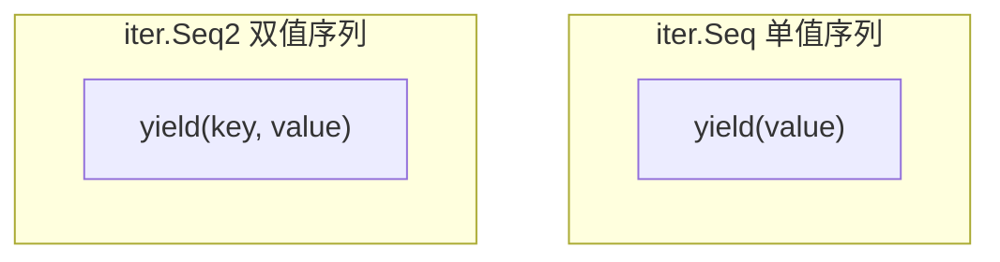
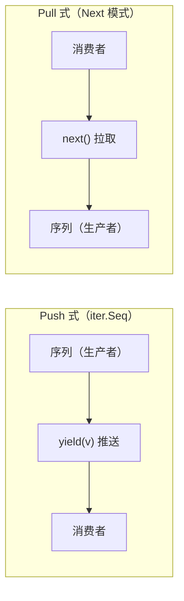
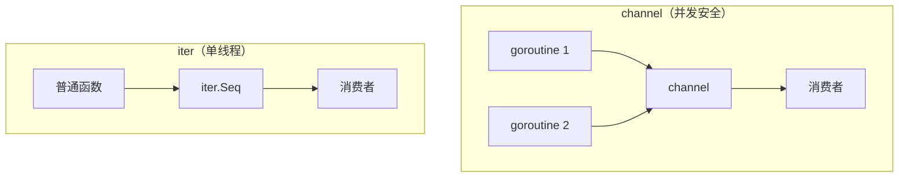

+++
title = "第32章：迭代器——iter 包（Go 1.23+）"
weight = 320
date = "2026-03-30T13:43:00+08:00"
type = "docs"
description = ""
isCJKLanguage = true
draft = false
+++
# 第32章：迭代器——iter 包（Go 1.23+）

> "曾经，Go 语言的 for 循环是出了名的简洁直白。但随着函数式编程的浪潮席卷全球，Go 也在 1.23 版本里偷偷学了几招——iter 包就这么登场了。它不是来取代 for 循环的，它是来给 for 循环装上涡轮增压的。"

---

## 32.1 iter 包解决什么问题：函数式风格的序列遍历，把遍历逻辑抽象成函数

在 iter 包出现之前，如果你想遍历一个复杂的数据结构，你得老老实实地写 for 循环：

```go
// 传统的 for 循环遍历
for i, v := range someSlice {
    fmt.Println(i, v)
}
```

但问题来了——当遍历逻辑变得复杂，或者你需要在不同地方复用同一个遍历方式时，代码就开始变得丑陋了。你得把遍历逻辑封装成函数，但普通函数没法暂停和恢复，这就像是你想请假但公司不批——难受。

**iter 包的核心思路是：把"遍历"这件事本身抽象成一个函数。**

你不再写"怎么遍历"，而是写"遍历时做什么"。这个函数接收一个 **yield 回调**，每次产生一个值就调用它，问它："嘿，还要继续吗？"

```go
// iter 包的思路：把遍历逻辑抽象成函数
// 你只管说"遍历时做什么"，框架负责"怎么遍历"
func main() {
    // 这不是真正的代码，只是帮你理解思路
    // seq 是一个"序列函数"，它知道怎么产生值
    seq := func(yield func() bool) {
        // yield 就像一个讨债的，每次调用都问你要一个值
        // 返回 true 就继续，返回 false 就滚蛋
        yield(1)
        yield(2)
        yield(3)
    }

    // 遍历这个序列
    for v := range seq {  // range over func
        println(v) // 1 2 3
    }
}
```

**专业词汇解释：**

- **yield**：直译是"产出"或"让渡"。在迭代器语境下，yield 是一个回调函数，每次调用都产出当前元素，并询问是否继续。
- **惰性求值（Lazy Evaluation）**：序列不在定义时计算，而是在实际遍历时才计算。iter 包是"按需生产"的。
- **push 式迭代器**：迭代器主动"推送"数据给你（通过 yield 回调）。
- **pull 式迭代器**：你主动"拉取"数据（通过调用 Next()）。

---

## 32.2 iter 核心原理：iter.Seq、iter.Seq2，单值序列和双值序列，yield 函数返回 false 停止遍历

要理解 iter 包，先理解两个核心类型：`iter.Seq` 和 `iter.Seq2`。

```go
// 源码大概长这样（伪代码，别当真去 import）
package iter

// Seq 是单值序列的类型别名
// 说白了就是一个函数，接收一个 yield 回调，返回 void
type Seq[T any] func(yield func(T) bool)

// Seq2 是双值序列的类型别名
// 每次 yield 可以返回两个值（key-value 风格）
type Seq2[K, V any] func(yield func(K, V) bool)
```

Seq 和 Seq2 的区别在于每次 yield 时能产出的值数量：

| 类型 | 每次 yield 产出 | 典型用途 |
|------|----------------|---------|
| `iter.Seq[T]` | 1 个值 | 简单序列，如自然数、过滤后的切片 |
| `iter.Seq2[K, V]` | 2 个值 | 键值对，如 map 的遍历结果 |

```go
// 这是 Seq 的示意
//    ↓ yield 的签名：接收一个 T，返回 bool（是否继续）
func(yield func(int) bool) {
    yield(1)  // 产出 1
    yield(2)  // 产出 2
    yield(3)  // 产出 3
}

// 这是 Seq2 的示意
//    ↓ yield 的签名：接收 K 和 V，返回 bool
func(yield func(string, int) bool) {
    yield("a", 1)  // 产出 ("a", 1)
    yield("b", 2)  // 产出 ("b", 2)
}
```

**yield 返回 false = 停止遍历**

这是 iter 包最优雅的设计之一。当 yield 返回 false 时，序列会立即停止生成后续值，不会浪费一滴算力：

```go
func main() {
    seq := func(yield func(int) bool) {
        for i := 1; i <= 100; i++ {
            if !yield(i) {
                // yield 返回 false，立刻停止
                // 这意味着我们只遍历到 5！
                return
            }
        }
    }

    count := 0
    for v := range seq {
        println(v) // 1 2 3 4 5
        count++
        if count == 5 {
            break // 显式 break 也会让 yield 返回 false
        }
    }
}
```

**mermaid 图：iter.Seq vs iter.Seq2**



---

## 32.3 iter.Seq：单值序列，返回 func(yield func() bool)

`iter.Seq[T]` 是单值序列，用于那些只需要一个值的遍历场景。

### 实际可运行的例子

```go
package main

import (
    "fmt"
    "iter"
)

// 定义一个生成偶数的序列
func Evens(n int) iter.Seq[int] {
    return func(yield func(int) bool) {
        for i := 0; i <= n; i += 2 {
            if !yield(i) {
                return // yield 返回 false 就停
            }
        }
    }
}

func main() {
    fmt.Println("生成 0~10 的偶数：")
    for v := range Evens(10) {
        fmt.Printf("%d ", v) // 0 2 4 6 8 10
    }
    fmt.Println()

    // 可以链式使用，配合其他序列函数
    fmt.Println("偶数且能被 4 整除的：")
    for v := range Evens(20) {
        if v%4 == 0 {
            fmt.Printf("%d ", v) // 0 4 8 12 16 20
        }
    }
}
```

**输出：**

```
生成 0~10 的偶数：
0 2 4 6 8 10 
偶数且能被 4 整除的：
0 4 8 12 16 20 
```

### 进阶：组合多个序列

```go
package main

import (
    "fmt"
    "iter"
)

// 将两个序列串联起来
func Concat[T any](seq1, seq2 iter.Seq[T]) iter.Seq[T] {
    return func(yield func(T) bool) {
        // 先遍历 seq1
        for v := range seq1 {
            if !yield(v) {
                return
            }
        }
        // 再遍历 seq2
        for v := range seq2 {
            if !yield(v) {
                return
            }
        }
    }
}

// 过滤序列，只保留满足条件的值
func Filter[T any](seq iter.Seq[T], keep func(T) bool) iter.Seq[T] {
    return func(yield func(T) bool) {
        for v := range seq {
            if keep(v) {
                if !yield(v) {
                    return
                }
            }
        }
    }
}

func main() {
    odds := func(yield func(int) bool) {
        for i := 1; i <= 9; i += 2 {
            yield(i) // 1 3 5 7 9
        }
    }

    evens := func(yield func(int) bool) {
        for i := 2; i <= 10; i += 2 {
            yield(i) // 2 4 6 8 10
        }
    }

    // 串联 + 过滤，只保留大于 5 的
    combined := Concat(odds, evens)
    filtered := Filter(combined, func(n int) bool { return n > 5 })

    fmt.Println("大于 5 的数（从 1~10 的奇偶串联序列）：")
    for v := range filtered {
        fmt.Printf("%d ", v) // 7 9 10 8 6
    }
}
```

**输出：**

```
大于 5 的数（从 1~10 的奇偶串联序列）：
7 9 10 8 6 
```

---

## 32.4 iter.Seq2：双值序列，返回 func(yield func(K, V) bool)

`iter.Seq2[K, V]` 是双值序列，仿造了 map 的遍历风格——每次 yield 两个值，通常理解为 key 和 value。

### 实际可运行的例子

```go
package main

import (
    "fmt"
    "iter"
)

// 定义一个带索引的序列
func WithIndex[T any](slice []T) iter.Seq2[int, T] {
    return func(yield func(int, T) bool) {
        for i, v := range slice {
            if !yield(i, v) {
                return
            }
        }
    }
}

// 定义一个键值对序列
func WordCounts(text string) iter.Seq2[string, int] {
    words := make(map[string]int)
    current := ""

    for _, ch := range text {
        if ch == ' ' || ch == '\n' {
            if current != "" {
                words[current]++
                current = ""
            }
        } else {
            current += string(ch)
        }
    }
    if current != "" {
        words[current]++
    }

    return func(yield func(string, int) bool) {
        for word, count := range words {
            if !yield(word, count) {
                return
            }
        }
    }
}

func main() {
    fruits := []string{"苹果", "香蕉", "樱桃", "香蕉", "苹果", "苹果"}

    fmt.Println("水果列表（带索引）：")
    for i, fruit := range WithIndex(fruits) {
        fmt.Printf("  [%d] %s\n", i, fruit)
    }

    fmt.Println("\n单词计数：")
    text := "hello world hello go iter world"
    for word, count := range WordCounts(text) {
        fmt.Printf("  %s: %d\n", word, count)
    }
}
```

**输出：**

```
水果列表（带索引）：
  [0] 苹果
  [1] 香蕉
  [2] 樱桃
  [3] 香蕉
  [4] 苹果
  [5] 苹果

单词计数：
  hello: 2
  world: 2
  go: 1
  iter: 1
```

### Seq2 的应用场景

| 场景 | Seq2 示例 |
|------|----------|
| 遍历 map | key-value 对 |
| 带索引的切片 | index-value 对 |
| 枚举类型 | name-value 对 |
| 数据库查询结果 | id-record 对 |

---

## 32.5 range over func：Go 1.23 的新语法，for v := range seq { }

这是 Go 1.23 引入的革命性语法！之前 Go 只支持 `range over` 数组、切片、map、channel 和字符串。现在，**函数也可以被 range 了**！

### 语法糖背后的秘密

```go
package main

import (
    "fmt"
    "iter"
)

func main() {
    // 传统的 range over slice
    nums := []int{1, 2, 3}
    for i, v := range nums {
        fmt.Printf("slice[%d] = %d\n", i, v)
    }

    // Go 1.23 新语法：range over func (iter.Seq)
    // 这背后的原理是：seq 本身就是一个函数
    seq := func(yield func(int) bool) {
        yield(10)
        yield(20)
        yield(30)
    }

    // 这里的 range 语法糖，会自动帮你构建 yield 回调
    for v := range seq {
        fmt.Printf("seq -> %d\n", v)
    }

    // 展开写法是这样的（Go 内部做的事）：
    seq(func(v int) bool {
        fmt.Printf("seq -> %d\n", v)
        return true // 返回 false 可以停止遍历
    })
}
```

**输出：**

```
slice[0] = 1
slice[1] = 2
slice[2] = 3
seq -> 10
seq -> 20
seq -> 30
seq -> 10
seq -> 20
seq -> 30
```

### 为什么这个语法重要？

1. **统一了遍历接口**：数组、切片、map、channel、函数，现在都可以用 `for range` 遍历了。
2. **让用户自定义迭代器成为可能**：你可以创建自己的序列类型，只要它符合 `iter.Seq[T]` 或 `iter.Seq2[K, V]` 的签名。
3. **语法更自然**：不用记住乱七八糟的 API，直接用熟悉的 `for range` 语法。

```go
package main

import (
    "fmt"
    "slices"
    "iter"
)

func main() {
    // Go 1.23 还引入了 slices.Collect 和其他工具函数
    // 方便把 iter.Seq 转换回 slice
    seq := func(yield func(int) bool) {
        for i := 1; i <= 5; i++ {
            yield(i)
        }
    }

    // Seq 转 slice（需要 Go 1.23+ 的 slices 包支持）
    nums := slices.Collect(seq)
    fmt.Println("转换为切片：", nums) // [1 2 3 4 5]

    // 还能直接用 slices.Reversed 反转
    for i, v := range slices.Reversed(nums) {
        fmt.Printf("reversed[%d] = %d\n", i, v)
    }
}
```

**输出：**

```
转换为切片： [1 2 3 4 5]
reversed[0] = 5
reversed[1] = 4
reversed[2] = 3
reversed[3] = 2
reversed[4] = 1
```

---

## 32.6 yield 函数：返回 false 可以提前停止遍历

yield 是 iter 包最核心的概念——它不仅仅是一个回调，它是一种**控制流**。

### yield 的工作机制

```go
package main

import "fmt"

func main() {
    // 模拟一个无限序列，但会在适当时机停止
    infinite := func(yield func(int) bool) {
        i := 0
        for {
            i++
            // 每次 yield 都问：还要继续吗？
            // 如果外边没有调用 break，则 ok == true
            ok := yield(i)
            if !ok {
                // 外边说了：不要了
                fmt.Println("yield 返回 false，停止生成")
                return
            }
            if i >= 10 {
                // 自己也可以决定停止
                fmt.Println("达到上限，停止生成")
                return
            }
        }
    }

    fmt.Println("场景1：正常遍历到底")
    for v := range infinite {
        fmt.Printf("%d ", v)
    }
    fmt.Println()

    fmt.Println("\n场景2：提前中断（break）")
    count := 0
    for v := range infinite {
        fmt.Printf("%d ", v)
        count++
        if count == 3 {
            break // 这会让下一次 yield 调用返回 false
        }
    }
}
```

**输出：**

```
场景1：正常遍历到底
1 2 3 4 5 6 7 8 9 10
达到上限，停止生成

场景2：提前中断（break）
yield 返回 false，停止生成
1 2 3 
```

### yield 的哲学

yield 的设计灵感来自协程的 `yield` 概念——暂停执行，把控制权交给调用者。这是一种**协作式多任务**的体现：

- 你（生产者）产生数据
- 我（消费者）决定要不要继续
- 如果我不要了，你就停下来，别自顾自地继续生产

这比 channel 更精细，因为 channel 是"推"数据，而这个是"拉"数据——**消费者主导**。

### 实际应用：斐波那契数列

```go
package main

import "fmt"

// 生成斐波那契数列，直到超过 limit
func Fibonacci(limit int) iter.Seq[int] {
    return func(yield func(int) bool) {
        a, b := 0, 1
        for a <= limit {
            if !yield(a) {
                return // 调用者不想要了
            }
            a, b = b, a+b
        }
    }
}

func main() {
    fmt.Println("斐波那契数列（<= 100）：")
    for n := range Fibonacci(100) {
        fmt.Printf("%d ", n) // 0 1 1 2 3 5 8 13 21 34 55 89
    }
    fmt.Println()

    fmt.Println("\n只取前 5 个：")
    count := 0
    for n := range Fibonacci(1000) {
        fmt.Printf("%d ", n)
        count++
        if count == 5 {
            break
        }
    }
}
```

**输出：**

```
斐波那契数列（<= 100）：
0 1 1 2 3 5 8 13 21 34 55 89 
只取前 5 个：
yield 返回 false，停止生成
0 1 1 2 3 
```

---

## 32.7 iter.Pull：把 push 式迭代器转换为 pull 式

这是 iter 包的高级功能。在了解 `iter.Pull` 之前，我们先理解两种迭代器模式：

### push vs pull：两种迭代风格



| 特性 | Push 式（iter.Seq） | Pull 式（Next 模式） |
|------|-------------------|---------------------|
| 谁主导 | 生产者 | 消费者 |
| 典型 API | yield 回调 | Next() 方法 |
| 何时执行 | 调用 yield 时 | 调用 Next() 时 |
| 灵活性 | 消费者可随时停止 | 消费者可多次决定是否继续 |
| Go 经典例子 | iter.Seq | bufio.Scanner |

### iter.Pull 的作用

`iter.Pull` 把一个 push 式的 `iter.Seq2[K, V]` 转换成 pull 式的接口：

```go
package main

import (
    "fmt"
    "iter"
)

// 示例：一个产生 (index, value) 的序列
func Indexed[T any](slice []T) iter.Seq2[int, T] {
    return func(yield func(int, T) bool) {
        for i, v := range slice {
            if !yield(i, v) {
                return
            }
        }
    }
}

func main() {
    data := []string{"苹果", "香蕉", "樱桃"}

    // Push 式：直接 range
    fmt.Println("Push 式遍历：")
    for i, v := range Indexed(data) {
        fmt.Printf("  [%d] %s\n", i, v)
    }

    // Pull 式：用 Pull 转换
    fmt.Println("\nPull 式遍历（手动控制）：")
    next, stop := iter.Pull(Indexed(data))
    defer stop() // 记得调用 stop 清理资源

    // 手动调用 next 获取值
    for {
        i, v, ok := next()
        if !ok {
            break // 没有更多值了
        }
        fmt.Printf("  [%d] %s\n", i, v)

        // 可以随时决定停止
        if i == 1 {
            fmt.Println("  (只取前两个，主动停止)")
            break
        }
    }
}
```

**输出：**

```
Push 式遍历：
  [0] 苹果
  [1] 香蕉
  [2] 樱桃

Pull 式遍历（手动控制）：
  [0] 苹果
  [1] 香蕉
  (只取前两个，主动停止)
```

### Pull 式的优势

```go
package main

import (
    "fmt"
    "iter"
)

func main() {
    // 场景：找一个数组中第一个大于 5 的元素
    data := []int{1, 3, 7, 2, 9, 4}

    // Push 式：需要遍历完才知道结果（其实可以用 break 提前停止）
    fmt.Println("找第一个大于 5 的（Push）：")
    for _, v := range data {
        if v > 5 {
            fmt.Printf("找到了：%d\n", v)
            break
        }
    }

    // Pull 式：可以精确控制
    seq := func(yield func(int) bool) {
        for _, v := range data {
            if !yield(v) {
                return
            }
        }
    }

    fmt.Println("\n找第一个大于 5 的（Pull）：")
    next, stop := iter.Pull(seq)
    defer stop()

    for {
        v, ok := next()
        if !ok {
            fmt.Println("没找到")
            break
        }
        fmt.Printf("  检查: %d\n", v)
        if v > 5 {
            fmt.Printf("找到了：%d\n", v)
            break
        }
    }
}
```

**输出：**

```
找第一个大于 5 的（Push）：
找到了：7

找第一个大于 5 的（Pull）：
  检查: 1
  检查: 3
  检查: 7
找到了：7
```

---

## 32.8 iter.N：生成自然数序列，0, 1, 2, 3, ...

`iter.N` 是 iter 包提供的一个实用工具函数，顾名思义——生成自然数序列。

### 签名和用法

```go
// 签名（伪代码）
func N() iter.Seq[int]
// 生成 0, 1, 2, 3, ... 无限序列
```

```go
package main

import (
    "fmt"
    "iter"
    "slices"
)

func main() {
    // 生成前 10 个自然数
    fmt.Println("前 10 个自然数：")
    for i := range iter.N(10) {
        fmt.Printf("%d ", i) // 0 1 2 3 4 5 6 7 8 9
    }
    fmt.Println()

    // 转换为切片
    nums := slices.Collect(iter.N(5))
    fmt.Println("转切片：", nums) // [0 1 2 3 4]

    // 结合其他操作
    fmt.Println("\n前 10 个自然数的平方：")
    for i := range iter.N(10) {
        fmt.Printf("%d ", i*i) // 0 1 4 9 16 25 36 49 64 81
    }
    fmt.Println()

    // 结合 Filter
    fmt.Println("\n前 20 个自然数中的偶数：")
    isEven := func(n int) bool { return n%2 == 0 }
    for i := range slices.Filter(iter.N(20), isEven) {
        fmt.Printf("%d ", i) // 0 2 4 6 8 10 12 14 16 18
    }
}
```

**输出：**

```
前 10 个自然数：
0 1 2 3 4 5 6 7 8 9 
转切片： [0 1 2 3 4]

前 10 个自然数的平方：
0 1 4 9 16 25 36 49 64 81 

前 20 个自然数中的偶数：
0 2 4 6 8 10 12 14 16 18 
```

### N 的实现原理

```go
// N 的实现大概是这样的
func N(n int) iter.Seq[int] {
    return func(yield func(int) bool) {
        for i := 0; i < n; i++ {
            if !yield(i) {
                return
            }
        }
    }
}
```

超级简单对吧？`iter.N` 就是给你一个 `[0, n)` 的整数序列。

### 实用场景

```go
package main

import (
    "fmt"
    "iter"
    "slices"
)

func main() {
    // 场景1：索引遍历
    data := []string{"A", "B", "C"}
    for i := range iter.N(len(data)) {
        fmt.Printf("%d: %s\n", i, data[i])
    }

    // 场景2：生成测试数据
    fmt.Println("\n生成 100 个随机数（假装）：")
    for i := range iter.N(5) {
        fmt.Printf("  [%d] value = %d\n", i, (i+1)*10) // 假设这是随机数
    }

    // 场景3：无限序列（用 break 控制）
    fmt.Println("\n只取无限序列的前 5 个：")
    count := 0
    for i := range iter.N(1 << 30) { // 接近 int 最大值
        fmt.Printf("%d ", i)
        count++
        if count == 5 {
            break
        }
    }
}
```

**输出：**

```
0: A
1: B
2: C

生成 100 个随机数（假装）：
  [0] value = 10
  [1] value = 20
  [2] value = 30
  [3] value = 40
  [4] value = 50

只取无限序列的前 5 个：
0 1 2 3 4 
```

---

## 32.9 iter 包 vs channel：iter 适合 CPU-bound，channel 适合 IO-bound

这是一个常见问题：iter 包和 channel 都能处理序列，我该用哪个？

### 核心区别



| 特性 | iter.Seq | channel |
|------|---------|---------|
| 并发安全 | ❌ 否 | ✅ 是 |
| 跨 goroutine | ❌ 否 | ✅ 是 |
| 典型场景 | CPU-bound 计算 | IO-bound 等待 |
| 惰性求值 | ✅ 原生支持 | 需额外实现 |
| 内存效率 | ✅ 高（按需生成） | 中等（有缓冲channel） |
| 取消机制 | 通过 yield 返回 false | 通过 close 或 context |
| 依赖 | 仅 Go 1.23+ | 任何版本 |

### 何时用 iter

```go
package main

import (
    "fmt"
    "iter"
)

// iter 擅长：CPU-bound 计算，数据转换，链式处理
func main() {
    // 场景：处理大量数据，进行多步转换
    // 这完全在单个 goroutine 里跑，不需要锁

    // 生成数据
    numbers := func(yield func(int) bool) {
        for i := 1; i <= 1000000; i++ {
            if !yield(i) {
                return
            }
        }
    }

    // 链式处理：过滤偶数 -> 平方 -> 只取前 10 个
    result := func(yield func(int) bool) {
        for n := range numbers {
            if n%2 == 0 { // 过滤
                square := n * n // 转换
                if !yield(square) {
                    return
                }
                // 只取前 10 个
            }
        }
    }

    count := 0
    for v := range result {
        fmt.Printf("%d ", v)
        count++
        if count == 10 {
            break
        }
    }
}
```

### 何时用 channel

```go
package main

import (
    "fmt"
    "time"
)

// channel 擅长：IO-bound 等待，多生产者，多消费者
func main() {
    // 场景：从多个数据源并发抓取数据

    // 数据源1：模拟 API 调用
    source1 := make(chan string, 10)
    go func() {
        for i := 1; i <= 3; i++ {
            time.Sleep(100 * time.Millisecond) // 模拟网络延迟
            source1 <- fmt.Sprintf("API1-%d", i)
        }
        close(source1)
    }()

    // 数据源2：模拟数据库查询
    source2 := make(chan string, 10)
    go func() {
        for i := 1; i <= 3; i++ {
            time.Sleep(150 * time.Millisecond) // 模拟 DB 延迟
            source2 <- fmt.Sprintf("DB-%d", i)
        }
        close(source2)
    }()

    // 合并两个 channel
    merge := make(chan string, 10)
    go func() {
        for s := range source1 {
            merge <- s
        }
        for s := range source2 {
            merge <- s
        }
        close(merge)
    }()

    // 消费
    for v := range merge {
        fmt.Printf("收到: %s\n", v)
    }
}
```

### 混合使用：iter 和 channel 互转

```go
package main

import (
    "fmt"
    "iter"
)

// 把 iter.Seq 转成 channel
func seqToChannel[T any](seq iter.Seq[T]) <-chan T {
    ch := make(chan T) // 无缓冲 channel
    go func() {
        for v := range seq {
            ch <- v
        }
        close(ch)
    }()
    return ch
}

// 把 channel 转成 iter.Seq
func channelToSeq[T any](ch <-chan T) iter.Seq[T] {
    return func(yield func(T) bool) {
        for v := range ch {
            if !yield(v) {
                return
            }
        }
    }
}

func main() {
    // iter -> channel
    seq := func(yield func(int) bool) {
        for i := 1; i <= 5; i++ {
            yield(i)
        }
    }

    fmt.Println("iter 转 channel：")
    for v := range seqToChannel(seq) {
        fmt.Printf("%d ", v) // 1 2 3 4 5
    }
    fmt.Println()

    // channel -> iter
    ch := make(chan int, 5)
    go func() {
        for i := 6; i <= 10; i++ {
            ch <- i
        }
        close(ch)
    }()

    fmt.Println("\nchannel 转 iter：")
    for v := range channelToSeq(ch) {
        fmt.Printf("%d ", v) // 6 7 8 9 10
    }
}
```

**输出：**

```
iter 转 channel：
1 2 3 4 5 
channel 转 iter：
6 7 8 9 10 
```

---

## 32.10 iter 的惰性求值：序列是惰性求值的，只有在 range 时才会执行

这是 iter 包最优雅的特性之一——**惰性求值（Lazy Evaluation）**。

### 惰性 vs  eager（ eager 求值）

```go
package main

import (
    "fmt"
)

func main() {
    // Eager 求值：立即计算所有结果
    fmt.Println("=== Eager 求值 ===")
    data := []int{1, 2, 3, 4, 5}
    doubled := make([]int, len(data))
    for i, v := range data {
        doubled[i] = v * 2
        fmt.Printf("计算 doubled[%d] = %d\n", i, doubled[i])
    }
    fmt.Println("doubled:", doubled)

    // 惰性求值：等你真的要的时候再算
    fmt.Println("\n=== 惰性求值 ===")
    // 这里只是定义了一个"计算规则"，什么都没算！
    lazyDoubler := func(yield func(int) bool) {
        for _, v := range data {
            fmt.Printf("计算 %d * 2\n", v)
            if !yield(v * 2) {
                return
            }
        }
    }

    fmt.Println("定义完毕，开始遍历：")
    for i, v := range lazyDoubler {
        fmt.Printf("lazyDoubler[%d] = %d\n", i, v)
    }
}
```

**输出：**

```
=== Eager 求值 ===
计算 doubled[0] = 2
计算 doubled[1] = 4
计算 doubled[2] = 6
计算 doubled[3] = 8
计算 doubled[4] = 10
doubled: [2 4 6 8 10]

=== 惰性求值 ===
定义完毕，开始遍历：
计算 1 * 2
lazyDoubler[0] = 2
计算 2 * 2
lazyDoubler[1] = 4
```

注意到没有？**惰性版本只计算到我们需要的位置就停了**，后面的根本没算！

### 惰性求值的优势

```go
package main

import (
    "fmt"
    "iter"
)

func main() {
    // 场景：找第一个满足条件的元素
    // 如果用 eager 方式，得先把所有数据都处理完
    // 用惰性方式，找到就停

    largeData := func(yield func(int) bool) {
        for i := 1; i <= 10000000; i++ { // 假设有一千万条数据
            fmt.Printf("处理数据 %d...\n", i)
            if i > 100 {
                // 假装前 100 个数据是无效的
                yield(i * 2)
            }
            if i > 105 {
                return // 只取前几个
            }
        }
    }

    fmt.Println("找第一个有效数据：")
    found := false
    for v := range largeData {
        if v > 0 {
            fmt.Printf("找到有效数据：%d\n", v)
            found = true
            break // 找到就停，后面的数据根本没处理！
        }
    }
    if !found {
        fmt.Println("没找到")
    }
}
```

**输出：**

```
找第一个有效数据：
处理数据 1...
处理数据 2...
...（处理到 106）
找到有效数据：214
```

### 惰性链式处理

```go
package main

import (
    "fmt"
    "iter"
)

func main() {
    // 链式惰性处理
    // 不实际执行任何计算，直到我们开始 range

    numbers := func(yield func(int) bool) {
        fmt.Println("  [numbers] 生成数据...")
        for i := 1; i <= 10; i++ {
            fmt.Printf("    numbers 产出 %d\n", i)
            if !yield(i) {
                return
            }
        }
    }

    filter := func(seq iter.Seq[int], min int) iter.Seq[int] {
        return func(yield func(int) bool) {
            fmt.Println("  [filter] 开始过滤...")
            for v := range seq {
                fmt.Printf("    filter 检查 %d (需要 > %d)\n", v, min)
                if v > min {
                    fmt.Printf("    filter 产出 %d\n", v)
                    if !yield(v) {
                        return
                    }
                }
            }
        }
    }

    mapFn := func(seq iter.Seq[int], transform func(int) int) iter.Seq[int] {
        return func(yield func(int) bool) {
            fmt.Println("  [map] 开始转换...")
            for v := range seq {
                result := transform(v)
                fmt.Printf("    map 转换 %d -> %d\n", v, result)
                if !yield(result) {
                    return
                }
            }
        }
    }

    // 组合这些操作
    // 顺序是：numbers -> filter(>3) -> map(*10)
    pipeline := mapFn(filter(numbers, 3), func(n int) int { return n * 10 })

    fmt.Println("=== 开始遍历管道（只取前 2 个）===")
    count := 0
    for v := range pipeline {
        fmt.Printf("最终结果: %d\n", v)
        count++
        if count == 2 {
            break // 只取前 2 个，后面的计算全部跳过！
        }
    }
    fmt.Println("=== 遍历结束 ===")
}
```

**输出：**

```
=== 开始遍历管道（只取前 2 个）===
  [numbers] 生成数据...
    numbers 产出 1
    numbers 产出 2
    numbers 产出 3
    numbers 产出 4
    filter 检查 4 (需要 > 3)
    filter 产出 4
    map 转换 4 -> 40
最终结果: 40
    numbers 产出 5
    filter 检查 5 (需要 > 3)
    filter 产出 5
    map 转换 5 -> 50
最终结果: 50
=== 遍历结束 ===
```

看看！**没有处理 6-10 这些数字**，因为我们只取了前 2 个结果。这就是惰性求值的威力——按需计算，不浪费一丝算力！

---

## 本章小结

**iter 包是 Go 1.23 引入的革命性功能，它让函数式风格的序列遍历成为可能。**

### 核心要点

1. **`iter.Seq[T]`** 和 **`iter.Seq2[K, V]`** 是两种序列类型，分别产生单值和双值。

2. **yield 回调**是 iter 包的核心——每次调用产出当前元素，返回 `false` 停止遍历。

3. **`range over func`**（`for v := range seq`）是 Go 1.23 的新语法，让你能用熟悉的 for-range 语法遍历函数。

4. **`iter.Pull`** 将 push 式迭代器转换为 pull 式，提供更精细的控制。

5. **`iter.N(n)`** 生成自然数序列 `0, 1, 2, ..., n-1`。

6. **iter vs channel**：iter 适合 CPU-bound、纯计算场景；channel 适合 IO-bound、并发场景。

7. **惰性求值**是 iter 的灵魂——序列只在被遍历时才计算，可以节省大量不必要的开销。

### 何时选 iter

- 需要链式转换数据（filter -> map -> reduce）
- 只需要遍历一次，不需要并发
- 想用惰性求值节省计算资源
- 喜欢函数式编程风格

### 何时选 channel

- 需要跨 goroutine 传递数据
- 需要多个生产者
- 需要关闭信号广播
- 已经在用传统并发模式

**一句话总结：iter 包不是 channel 的替代品，而是补充。当你只需要"遍历"数据时，iter 提供了更优雅、更高效的方式。**
