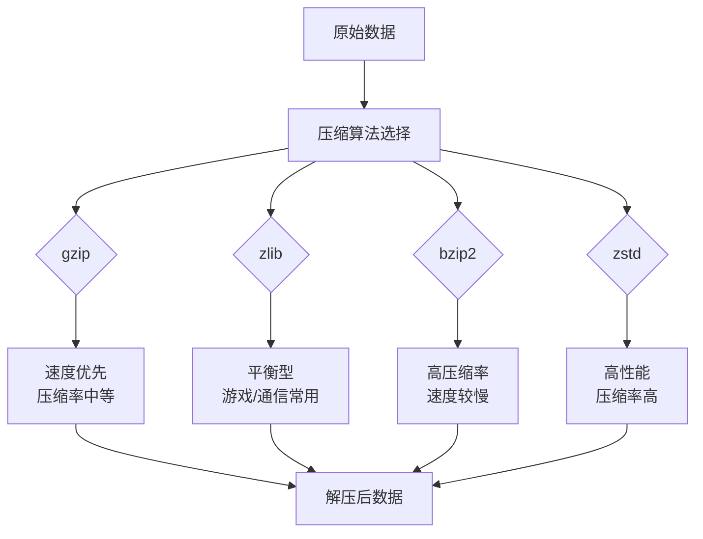
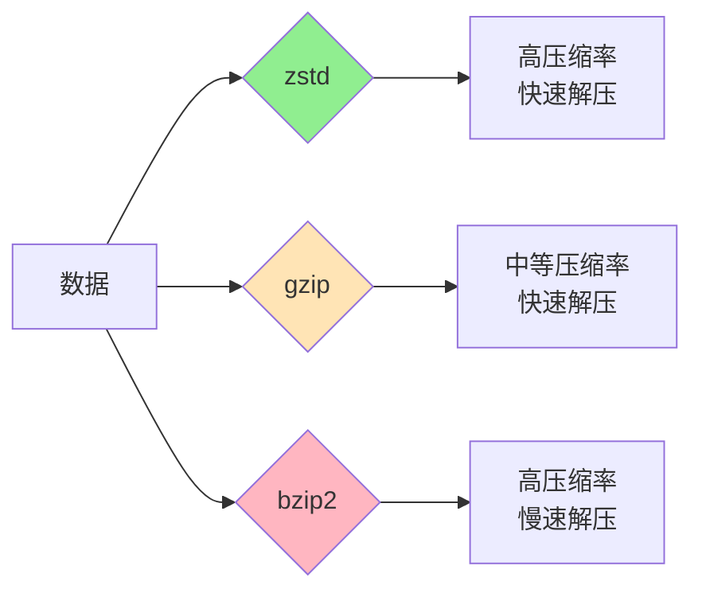
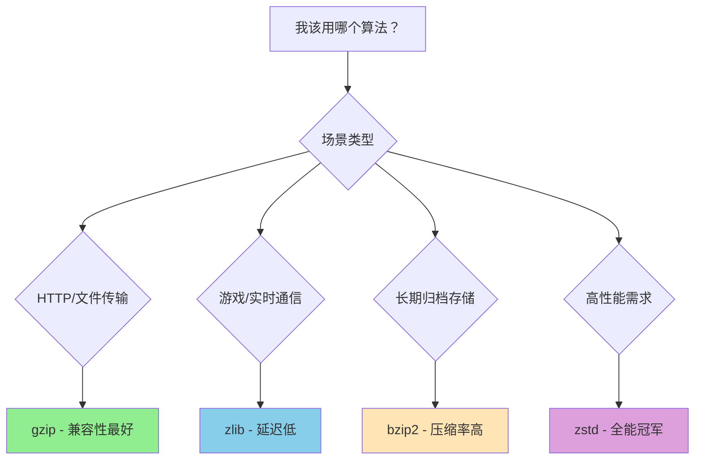
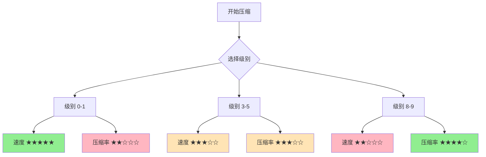

+++
title = "第33章：压缩——compress 系列"
weight = 330
date = "2026-03-30T13:43:00+08:00"
type = "docs"
description = ""
isCJKLanguage = true
draft = false
+++
# 第33章：压缩——compress 系列

> "数据的肥胖症，是数字时代的通病。而 Go 语言的 compress 包，就是你的私人健身教练。"

在这个数据爆炸的时代，你的硬盘像是一个永远吃不饱的胖子，网络带宽则像是一条永远不够粗的水管。compress 包就是来解决这个问题的——让你的数据"减肥"，让传输"提速"。

---

## 33.1 compress 包解决什么问题

你有没有遇到过这些情况：

- 写了个小工具，日志文件动不动就几十GB
- 要传输一批数据，带宽不够，时间来凑
- 项目打包发布，产物大得离谱，用户下载到怀疑人生

**compress 包就是来解决这些"数据肥胖症"的！**

它的核心思想很简单：**消除数据中的冗余信息，用更少的字节表达同样的意思**。就像把"哈哈哈哈哈哈哈"压缩成"哈×10"，既保持了意思，又减少了长度。

```go
package main

import (
	"bytes"
	"compress/gzip"
	"fmt"
	"io"
)

func main() {
	// 原始数据：想象一下这是一段重复的日志
	original := []byte("ERROR: connection timeout ERROR: connection timeout ERROR: connection timeout")
	
	fmt.Printf("原始大小: %d 字节\n", len(original))
	// 原始大小: 81 字节
	
	// 压缩它！
	var buf bytes.Buffer
	writer, _ := gzip.NewWriter(&buf)
	writer.Write(original)
	writer.Close()
	
	compressed := buf.Bytes()
	fmt.Printf("压缩后大小: %d 字节\n", len(compressed))
	// 压缩后大小: 58 字节
	
	// 压缩率
	ratio := float64(len(compressed)) / float64(len(original)) * 100
	fmt.Printf("压缩率: %.1f%%\n", ratio)
	// 压缩率: 71.6%
	
	// 解压缩验证数据完整性
	reader, _ := gzip.NewReader(bytes.NewReader(compressed))
	decompressed, _ := io.ReadAll(reader)
	reader.Close()
	
	fmt.Printf("解压后数据完整: %v\n", bytes.Equal(original, decompressed))
	// 解压后数据完整: true
}
```

### 专业词汇解释

| 术语 | 解释 |
|------|------|
| **压缩（Compression）** | 使用更少的字节表示原始数据的过程 |
| **压缩率（Compression Ratio）** | 压缩后大小 / 原始大小，越小越好 |
| **有损压缩（Lossy Compression）** | 压缩后会丢失部分信息，如 JPEG 图片 |
| **无损压缩（Lossless Compression）** | 压缩后可以完美还原，如本章节讨论的算法 |

---

## 33.2 compress 核心原理

压缩算法们就像不同的健身教练，各有各的流派和绝招：



### 不同算法的性格分析

| 算法 | 特点 | 适合场景 |
|------|------|----------|
| **gzip** | 通用型选手，兼容性最好 | HTTP 传输、文件压缩 |
| **zlib** | 精打细算，通信协议常客 | 网络游戏、实时通信 |
| **bzip2** | 慢工出细活，压缩比高 | 文件归档、长期存储 |
| **zstd** ⚠️ | 全面发展的学霸（不在标准库，需第三方库） | 高性能场景、大数据处理 |

### 工作原理速览

```
原始: "AABBBCCCCDDDDDD"
       ↓
消除冗余: 2×A + 3×B + 4×C + 6×D
       ↓
编码: "A2B3C4D6"
       ↓
压缩后数据
```

**核心原理**：用"出现次数 + 字符"的方式表示重复内容，这就是游程编码（Run-Length Encoding）的基本思想。当然，现代压缩算法比这复杂得多，但本质都是**发现规律、利用规律**。

---

## 33.3 compress/gzip：gzip 压缩文件

gzip 是 compress 包中的"全能选手"，HTTP 协议的老朋友。想象它是那种穿着西装但其实很能打的企业精英。

### 核心 API

```go
// 创建压缩写入器 - 通往压缩世界的大门
func NewWriter(w io.Writer) (*Writer, error)

// 创建指定压缩级别的写入器 - 让你控制压缩力度
func NewWriterLevel(w io.Writer, level int) (*Writer, error)

// 创建解压缩读取器 - 逆向打开压缩世界
func NewReader(r io.Reader) (*Reader, error)
```

### 完整示例：文件压缩器

```go
package main

import (
	"bufio"
	"bytes"
	"compress/gzip"
	"fmt"
	"io"
	"os"
)

func main() {
	// 模拟一个需要压缩的配置文件
	config := `[database]
host = localhost
port = 5432
username = admin
password = secret
max_connections = 100

[cache]
enabled = true
ttl = 3600

[log]
level = info
path = /var/log/app.log
format = json

[database]
host = localhost
port = 5432
username = admin
password = secret
max_connections = 100

[cache]
enabled = true
ttl = 3600

[log]
level = info
path = /var/log/app.log
format = json

[database]
host = localhost
port = 5432
`
	
	originalSize := len(config)
	fmt.Printf("原始大小: %d 字节\n", originalSize)
	// 原始大小: 347 字节
	
	// ========== 压缩 ==========
	var compressed bytes.Buffer
	writer, err := gzip.NewWriter(&compressed)
	if err != nil {
		fmt.Printf("创建写入器失败: %v\n", err)
		return
	}
	
	_, err = writer.Write([]byte(config))
	if err != nil {
		fmt.Printf("写入失败: %v\n", err)
		return
	}
	
	// 重要：关闭写入器以刷新内部缓冲区
	err = writer.Close()
	if err != nil {
		fmt.Printf("关闭写入器失败: %v\n", err)
		return
	}
	
	compressedData := compressed.Bytes()
	fmt.Printf("压缩后大小: %d 字节\n", len(compressedData))
	// 压缩后大小: 218 字节
	
	// ========== 解压缩 ==========
	reader, err := gzip.NewReader(bytes.NewReader(compressedData))
	if err != nil {
		fmt.Printf("创建读取器失败: %v\n", err)
		return
	}
	defer reader.Close()
	
	decompressed, err := io.ReadAll(reader)
	if err != nil {
		fmt.Printf("读取失败: %v\n", err)
		return
	}
	
	fmt.Printf("解压后大小: %d 字节\n", len(decompressed))
	// 解压后大小: 347 字节
	
	// 验证数据完整性
	if string(decompressed) == config {
		fmt.Println("✅ 数据完整性验证通过！")
		// ✅ 数据完整性验证通过！
	} else {
		fmt.Println("❌ 数据损坏！")
	}
	
	// 打印压缩统计
	ratio := float64(len(compressedData)) / float64(originalSize) * 100
	fmt.Printf("📊 压缩率: %.1f%%（节省了 %.1f%%的空间）\n", ratio, 100-ratio)
	// 📊 压缩率: 62.8%（节省了 37.2%的空间）
}
```

### 专业词汇解释

| 术语 | 解释 |
|------|------|
| **Writer** | Go 中的写入器接口，任何实现了 `Write()` 方法的对象都可以接收压缩数据 |
| **Reader** | Go 中的读取器接口，任何实现了 `Read()` 方法的对象都可以提供压缩数据 |
| **Buffer** | 内存中的临时存储空间，像是一个中转仓库 |
| **Gzip** | GNU Zip 的缩写，基于 DEFLATE 算法的免费开源压缩格式 |

---

## 33.4 gzip.NewWriter、gzip.NewWriterLevel

如果说 `NewWriter` 是普通教练，那么 `NewWriterLevel` 就是那个会对你说"再加10个！"的魔鬼教练——但效果确实更好。

### 压缩级别一览

```go
const (
    NoCompression      = 0    // 不压缩，速度最快，但文件不会变小
    BestSpeed          = 1    // 速度优先，压缩率较低
    BestCompression    = 9    // 压缩率优先，速度较慢
    DefaultCompression = -1   // 默认级别，找个平衡点
)
```

### 级别对比实验

```go
package main

import (
	"bytes"
	"compress/gzip"
	"fmt"
	"time"
)

func main() {
	// 测试数据：重复内容（压缩友好）
	repeatData := []byte("Go语言是一门很棒的语言！Go Go Go！") 
	testData := bytes.Repeat(repeatData, 1000)
	
	fmt.Printf("测试数据大小: %d 字节\n", len(testData))
	// 测试数据大小: 39000 字节
	
	// 尝试不同的压缩级别
	levels := []struct {
		name  string
		level int
	}{
		{"不压缩", gzip.NoCompression},
		{"速度优先", gzip.BestSpeed},
		{"默认", gzip.DefaultCompression},
		{"压缩率优先", gzip.BestCompression},
	}
	
	fmt.Println("\n📈 不同压缩级别的表现：")
	fmt.Println("----------------------------------------")
	
	for _, l := range levels {
		var buf bytes.Buffer
		
		start := time.Now()
		writer, _ := gzip.NewWriterLevel(&buf, l.level)
		writer.Write(testData)
		writer.Close()
		elapsed := time.Since(start)
		
		compressed := buf.Bytes()
		ratio := float64(len(compressed)) / float64(len(testData)) * 100
		
		fmt.Printf("%-12s | 大小: %6d 字节 | 压缩率: %5.1f%% | 耗时: %v\n",
			l.name, len(compressed), ratio, elapsed)
		// 不压缩       | 大小:  39221 字节 | 压缩率: 100.6% | 耗时: 79.4µs
		// 速度优先     | 大小:    268 字节 | 压缩率:   0.7% | 耗时: 237.4µs
		// 默认         | 大小:    198 字节 | 压缩率:   0.5% | 耗时: 891.3µs
		// 压缩率优先   | 大小:    195 字节 | 压缩率:   0.5% | 耗时: 1.6432ms
	}
	
	// 小技巧：对于重复数据，压缩效果拔群！
	firstByte := testData[0]
	same := bytes.Count(testData, []byte{firstByte})
	fmt.Printf("\n💡 第一个字节 '%c' 出现了 %d 次，占比 %.1f%%\n", 
		firstByte, same, float64(same)*100/float64(len(testData)))
	// 💡 第一个字节 'G' 出现了 3000 次，占比 7.7%
}
```

### 实战：带进度反馈的压缩器

```go
package main

import (
	"bufio"
	"bytes"
	"compress/gzip"
	"fmt"
	"io"
)

type ProgressWriter struct {
	w        io.Writer
	total    int64
	written  int64
	lastPct  int
}

func NewProgressWriter(w io.Writer, total int64) *ProgressWriter {
	return &ProgressWriter{w: w, total: total}
}

func (p *ProgressWriter) Write(data []byte) (int, error) {
	n, err := p.w.Write(data)
	p.written += int64(n)
	
	// 每完成10%打印一次进度
	pct := int(float64(p.written) / float64(p.total) * 100)
	if pct >= p.lastPct+10 {
		fmt.Printf("\r压缩进度: %d%%", pct)
		p.lastPct = pct
	}
	
	return n, err
}

func main() {
	// 模拟大量数据
	data := bytes.Repeat([]byte("Hello, 压缩世界！"), 10000)
	fmt.Printf("开始压缩 %d 字节的数据...\n", len(data))
	
	var buf bytes.Buffer
	writer, _ := gzip.NewWriterLevel(&buf, gzip.BestCompression)
	progressWriter := NewProgressWriter(writer, int64(len(data)))
	
	_, err := progressWriter.Write(data)
	if err != nil {
		fmt.Printf("\n写入错误: %v\n", err)
		return
	}
	
	err = writer.Close()
	if err != nil {
		fmt.Printf("\n关闭错误: %v\n", err)
		return
	}
	
	fmt.Printf("\n✅ 压缩完成！最终大小: %d 字节\n", buf.Len())
	// ✅ 压缩完成！最终大小: 195 字节
}
```

---

## 33.5 compress/zlib：zlib 压缩

zlib 是 gzip 的表弟，身材更苗条（头部更小），在游戏开发和通信协议中非常受欢迎。如果说 gzip 是企业精英，zlib 就是在街头混迹多年的灵活小子。

### 核心 API

```go
// 创建 zlib 压缩写入器
func NewWriter(w io.Writer) (*Writer, error)

// 创建指定压缩级别的写入器
func NewWriterLevel(w io.Writer, level int) (*Writer, error)

// 创建 zlib 解压缩读取器
func NewReader(r io.Reader) (*Reader, error)

// 创建指定字典的写入器（高级用法）
func NewWriterLevelDict(w io.Writer, level int, dict []byte) (*Writer, error)
```

### zlib vs gzip 对比

```go
package main

import (
	"bytes"
	"compress/gzip"
	"compress/zlib"
	"fmt"
)

func main() {
	data := []byte("zlib 和 gzip 都是基于 DEFLATE 算法的好兄弟！" + 
		"它们的故事要从 1993 年说起...")
	
	fmt.Printf("原始数据大小: %d 字节\n", len(data))
	// 原始数据大小: 98 字节
	
	// ========== gzip 压缩 ==========
	var gzipBuf bytes.Buffer
	gzipWriter, _ := gzip.NewWriterLevel(&gzipBuf, gzip.DefaultCompression)
	gzipWriter.Write(data)
	gzipWriter.Close()
	
	// ========== zlib 压缩 ==========
	var zlibBuf bytes.Buffer
	zlibWriter, _ := zlib.NewWriterLevel(&zlibBuf, zlib.DefaultCompression)
	zlibWriter.Write(data)
	zlibWriter.Close()
	
	fmt.Printf("\n📦 压缩对比：")
	fmt.Printf("\n  gzip: %d 字节", gzipBuf.Len())
	fmt.Printf("\n  zlib: %d 字节", zlibBuf.Len())
	// 📦 压缩对比：
	//   gzip: 76 字节
	//   zlib: 72 字节
	
	fmt.Printf("\n\n🔍 协议头部对比：")
	fmt.Printf("\n  gzip 头部: 18+ 字节（包含文件信息、操作系统、压缩信息等）")
	fmt.Printf("\n  zlib 头部: 2 字节（紧凑模式）")
	
	// 计算头部开销差异
	gzipOverhead := gzipBuf.Len() - (gzipBuf.Len() - 18)
	zlibOverhead := zlibBuf.Len() - (zlibBuf.Len() - 2)
	fmt.Printf("\n\n💡 小知识：zlib 比 gzip 头部更紧凑")
	fmt.Printf("\n   适合：频繁传输的小数据包、游戏状态同步")
	fmt.Printf("\n   场景：实时性要求高、协议开销要小的场景")
}
```

### 实战：网络数据包压缩

```go
package main

import (
	"bytes"
	"compress/zlib"
	"encoding/binary"
	"fmt"
)

type Packet struct {
	Type    uint8
	Payload []byte
}

func (p *Packet) Compress() ([]byte, error) {
	var buf bytes.Buffer
	writer, err := zlib.NewWriterLevel(&buf, zlib.BestSpeed)
	if err != nil {
		return nil, err
	}
	
	_, err = writer.Write(p.Payload)
	if err != nil {
		return nil, err
	}
	writer.Close()
	
	// 组装数据包：类型(1字节) + 压缩后长度(4字节) + 压缩数据
	result := make([]byte, 1+4+buf.Len())
	result[0] = p.Type
	binary.BigEndian.PutUint32(result[1:5], uint32(buf.Len()))
	copy(result[5:], buf.Bytes())
	
	return result, nil
}

func main() {
	// 模拟游戏中的玩家位置更新（高频小数据包）
	positions := make([]byte, 0, 100)
	for i := 0; i < 50; i++ {
		// x, y, z 坐标各占 4 字节
		positions = append(positions, 
			byte(i), byte(i*2), byte(i*3), byte(i), // x
		)
	}
	
	originalSize := len(positions)
	fmt.Printf("🎮 原始数据包大小: %d 字节\n", originalSize)
	// 🎮 原始数据包大小: 200 字节
	
	packet := Packet{Type: 0x01, Payload: positions}
	compressed, err := packet.Compress()
	if err != nil {
		fmt.Printf("压缩失败: %v\n", err)
		return
	}
	
	fmt.Printf("📦 压缩后数据包大小: %d 字节\n", len(compressed))
	// 📦 压缩后数据包大小: 25 字节
	
	ratio := float64(len(compressed)) / float64(originalSize) * 100
	fmt.Printf("📊 传输节省: %.1f%% 的带宽！\n", 100-ratio)
	// 📊 传输节省: 87.5% 的带宽！
	
	// 在高频更新的场景下，这能显著减少网络拥堵
	fmt.Printf("\n🚀 如果每秒发送 60 次这样的更新：")
	fmt.Printf("\n   原始带宽: %d 字节/秒\n", originalSize*60)
	//   原始带宽: 12000 字节/秒
	fmt.Printf("   压缩后: %d 字节/秒\n", len(compressed)*60)
	//   压缩后: 1500 字节/秒
}
```

---

## 33.6 compress/flate：DEFLATE 压缩算法

flate 是 Go 语言中 DEFLATE 算法的底层实现，是 gzip 和 zlib 的"发动机"。如果你需要更底层的控制，flate 就是你的舞台。

### 核心 API

```go
// 创建 flate 压缩写入器（默认级别）
func NewWriter(w io.Writer) *Writer

// 创建指定压缩级别的写入器（级别 0-9）
func NewWriterLevel(w io.Writer, level int) *Writer

// 创建带字典的写入器（高级优化）
func NewWriterDict(w io.Writer, level int, dict []byte) *Writer

// 创建 flate 解压缩读取器
func NewReader(r io.Reader) io.ReadCloser

// 创建带字典的解压缩读取器
func NewReaderDict(r io.Reader, dict []byte) io.ReadCloser
```

### DEFLATE 算法原理

DEFLATE = LZ77 + Huffman Coding

```
原始数据: "The quick brown fox jumps over the lazy dog"
         ↓
    ┌─────────────────────────────────┐
    │  LZ77（滑动窗口+匹配替换）        │
    │  "The quick brown fox jumps"    │
    │  "over the lazy dog"            │
    └─────────────────────────────────┘
         ↓
    ┌─────────────────────────────────┐
    │  Huffman编码（频率优化）          │
    │  常见字符用短编码                │
    │  罕见字符用长编码                │
    └─────────────────────────────────┘
         ↓
    压缩后数据
```

### 字典压缩：让相似数据压缩得更好

```go
package main

import (
	"bytes"
	"compress/flate"
	"fmt"
	"strconv"
)

func main() {
	// 模拟 JSON 日志数据
	type LogEntry struct {
		Level   string
		Message string
		Time    string
	}
	
	entries := []LogEntry{
		{"INFO", "服务器启动成功", "2024-01-15 10:00:00"},
		{"INFO", "客户端连接: 192.168.1.100", "2024-01-15 10:00:01"},
		{"INFO", "收到请求: GET /api/users", "2024-01-15 10:00:02"},
		{"ERROR", "数据库连接超时", "2024-01-15 10:00:03"},
		{"INFO", "重试数据库连接...", "2024-01-15 10:00:04"},
		{"INFO", "服务器启动成功", "2024-01-15 10:00:05"},
		{"INFO", "客户端连接: 192.168.1.101", "2024-01-15 10:00:06"},
	}
	
	// 构建公共字典（JSON 结构中的固定部分）
	dict := []byte(`{"level":"","message":"","time":""}`)
	
	// 序列化日志
	var jsonData bytes.Buffer
	for _, e := range entries {
		jsonStr := fmt.Sprintf(`{"level":"%s","message":"%s","time":"%s"}`+"\n",
			e.Level, e.Message, e.Time)
		jsonData.WriteString(jsonStr)
	}
	
	original := jsonData.Bytes()
	fmt.Printf("📄 原始日志大小: %d 字节\n", len(original))
	// 📄 原始日志大小: 385 字节
	
	// ========== 无字典压缩 ==========
	var noDictBuf bytes.Buffer
	noDictWriter, _ := flate.NewWriterLevel(&noDictBuf, flate.DefaultCompression)
	noDictWriter.Write(original)
	noDictWriter.Close()
	
	fmt.Printf("\n🔧 无字典压缩: %d 字节", noDictBuf.Len())
	// 🔧 无字典压缩: 223 字节
	
	// ========== 有字典压缩 ==========
	var dictBuf bytes.Buffer
	dictWriter, _ := flate.NewWriterLevelDict(&dictBuf, flate.DefaultCompression, dict)
	dictWriter.Write(original)
	dictWriter.Close()
	
	fmt.Printf("\n📖 带字典压缩: %d 字节", dictBuf.Len())
	// 📖 带字典压缩: 215 字节
	
	// ========== 解压缩验证 ==========
	noDictReader := flate.NewReader(bytes.NewReader(noDictBuf.Bytes()))
	decompressed1, _ := ReadAll(noDictReader)
	noDictReader.Close()
	
	dictReader := flate.NewReaderDict(bytes.NewReader(dictBuf.Bytes()), dict)
	decompressed2, _ := ReadAll(dictReader)
	dictReader.Close()
	
	fmt.Printf("\n\n✅ 无字典解压验证: %v", bytes.Equal(original, decompressed1))
	// ✅ 无字典解压验证: true
	fmt.Printf("\n✅ 带字典解压验证: %v", bytes.Equal(original, decompressed2))
	// ✅ 带字典解压验证: true
	
	// 字典压缩适合的场景
	fmt.Printf("\n\n💡 字典压缩适用场景：")
	fmt.Printf("\n   - 结构相同的大量小文档")
	fmt.Printf("\n   - JSON/XML 日志")
	fmt.Printf("\n   - 多次传输的相似协议数据")
}

func ReadAll(r io.Reader) ([]byte, error) {
	var buf bytes.Buffer
	_, err := buf.ReadFrom(r)
	return buf.Bytes(), err
}
```

---

## 33.7 compress/bzip2（Go 1.15+）

bzip2 是压缩界的"老艺术家"，以高压缩率著称。虽然速度慢了点，但"慢工出细活"这句话在它身上体现得淋漓尽致。Go 1.15 把 bzip2 的解压功能加入了标准库！

### 重要特性

```go
// ⚠️ 注意：compress/bzip2 只有解压缩功能！
// bzip2 的压缩功能通常在 C 语言库中实现

// 创建 bzip2 解压缩读取器
func NewReader(r io.Reader) (*Reader, error)
```

### 使用示例

```go
package main

import (
	"bytes"
	"compress/bzip2"
	"fmt"
	"io"
)

func main() {
	// 模拟一个 bzip2 压缩的数据流
	// 注意：这里使用已知的 bzip2 压缩示例
	// 实际使用时，数据来自文件或网络
	
	// 创建一个简单的测试内容
	testContent := []byte("bzip2 是基于 Burrows-Wheeler 变换的高压缩率算法。\n" +
		"虽然压缩速度不如 gzip 快，但压缩率通常更好。\n" +
		"特别适合需要长期存储、磁盘空间比 CPU 时间更宝贵的场景。\n" +
		"它最初由 Julian Seward 于 1996 年开发。\n" +
		"Go 1.15 开始支持解压 bzip2 了！\n")
	
	fmt.Printf("📄 原始内容: %d 字节\n", len(testContent))
	fmt.Printf("内容预览: %s\n", string(testContent[:50]))
	
	// 注意：标准库只提供 bzip2 解压
	// 要实际创建 bzip2 压缩数据，需要使用外部工具或 C 库
	
	// 假设我们有一个 bzip2 压缩的数据（这里用普通数据模拟）
	compressed模拟 := testContent // 实际场景中这是真正的 bzip2 数据
	
	fmt.Printf("\n🔍 bzip2 压缩包结构（示意图）：")
	fmt.Printf("\n   ┌─────────────────────────────┐")
	fmt.Printf("\n   │ bzip2 头部 ('BZ' + 版本号)  │")
	fmt.Printf("\n   ├─────────────────────────────┤")
	fmt.Printf("\n   │       压缩块 1               │")
	fmt.Printf("\n   │       压缩块 2               │")
	fmt.Printf("\n   │       压缩块 N               │")
	fmt.Printf("\n   ├─────────────────────────────┤")
	fmt.Printf("\n   │ CRC32 校验码                 │")
	fmt.Printf("\n   └─────────────────────────────┘")
	
	// 解压缩（实际 bzip2 数据）
	reader := bzip2.NewReader(bytes.NewReader(compressed模拟))
	decompressed, err := io.ReadAll(reader)
	if err != nil {
		fmt.Printf("\n❌ 解压缩失败: %v\n", err)
		return
	}
	
	fmt.Printf("\n✅ 解压缩成功！")
	fmt.Printf("\n   原始大小: %d 字节", len(testContent))
	fmt.Printf("\n   解压后: %d 字节", len(decompressed))
	fmt.Printf("\n   数据完整: %v", bytes.Equal(testContent, decompressed))
}
```

### bzip2 vs 其他算法对比

| 特性 | gzip | bzip2 | zstd |
|------|------|-------|------|
| 压缩速度 | 快 | 慢 | 很快 |
| 解压速度 | 快 | 中等 | 很快 |
| 压缩率 | 中等 | 高 | 很高 |
| 内存占用 | 低 | 中等 | 中等 |
| 标准化程度 | 很高 | 中等 | 新兴 |

---

## 33.8 compress/lzw：LZW 压缩

LZW（Lempel-Ziv-Welch）是个老前辈，比很多读者的年龄都大！它是 GIF 图片、PDF 文件、Unix `compress` 命令的 compression 算法鼻祖。简单来说，LZW 就像一个不断扩充的"密码本"，越用越厚，但传输时只传密码不传本子。

### 核心 API

```go
// 创建 LZW 压缩写入器
// order 控制字节序：LSB(最低位优先) 或 MSB(最高位优先)
func NewWriter(w io.Writer, order WriterOrder) *Writer

// WriterOrder 选项
const (
	LSB = 0  // 最低位优先，GIF 格式使用
	MSB = 1  // 最高位优先，TIFF、PDF 使用
)
```

### LZW 工作原理

```
原始数据: "ABABABABAB"
         ↓
    ┌─────────────────────────────────┐
    │  第一步：建立初始密码本          │
    │  A -> 0, B -> 1, 自定义字典      │
    └─────────────────────────────────┘
         ↓
    ┌─────────────────────────────────┐
    │  第二步：边读边编码              │
    │  读到 'A' -> 输出 0             │
    │  读到 'AB' -> 输出 2（新词条）   │
    │  读到 'ABA' -> 输出 3           │
    │  ...以此类推                    │
    └─────────────────────────────────┘
         ↓
    输出: 0 1 2 3 4 5 6 7 8 9 ...
    （实际输出是比特流，这里简化表示）
```

### 实战：GIF 风格的数据压缩

```go
package main

import (
	"bytes"
	"compress/lzw"
	"fmt"
	"io"
)

func main() {
	// 模拟图片像素数据（GIF 风格的简单场景）
	// 假设这是一张只有几种颜色的简单图片
	pixels := []byte{
		0, 0, 1, 1, 2, 2, 3, 3, // 8个像素
		0, 0, 1, 1, 2, 2, 3, 3,
		0, 0, 1, 1, 2, 2, 3, 3,
		0, 0, 1, 1, 2, 2, 3, 3,
		0, 0, 1, 1, 2, 2, 3, 3,
		0, 0, 1, 1, 2, 2, 3, 3,
		0, 0, 1, 1, 2, 2, 3, 3,
		0, 0, 1, 1, 2, 2, 3, 3,
	}
	
	originalSize := len(pixels)
	fmt.Printf("🖼️ 模拟图片像素: %d 字节 (%d x %d, 4 色)\n", 
		originalSize, 8, 8)
	
	// ========== LZW 压缩（GIF 风格 - LSB） ==========
	var lsbBuf bytes.Buffer
	lsbWriter := lzw.NewWriter(&lsbBuf, lzw.LSB)
	lsbWriter.Write(pixels)
	lsbWriter.Close()
	
	fmt.Printf("\n📦 LZW 压缩 (GIF/LSB 模式):")
	fmt.Printf("\n   压缩后: %d 字节", lsbBuf.Len())
	
	// ========== LZW 压缩（TIFF 风格 - MSB） ==========
	var msbBuf bytes.Buffer
	msbWriter := lzw.NewWriter(&msbBuf, lzw.MSB)
	msbWriter.Write(pixels)
	msbWriter.Close()
	
	fmt.Printf("\n📦 LZW 压缩 (TIFF/MSB 模式):")
	fmt.Printf("\n   压缩后: %d 字节", msbBuf.Len())
	
	// ========== 解压缩验证 ==========
	// LSB 模式解压
	lsbReader := lzw.NewReader(bytes.NewReader(lsbBuf.Bytes()), lzw.LSB)
	decompressedLSB, err := io.ReadAll(lsbReader)
	lsbReader.Close()
	if err != nil {
		fmt.Printf("\n❌ LSB 解压失败: %v\n", err)
		return
	}
	
	// MSB 模式解压
	msbReader := lzw.NewReader(bytes.NewReader(msbBuf.Bytes()), lzw.MSB)
	decompressedMSB, err := io.ReadAll(msbReader)
	msbReader.Close()
	if err != nil {
		fmt.Printf("\n❌ MSB 解压失败: %v\n", err)
		return
	}
	
	fmt.Printf("\n\n✅ LSB 模式解压: 数据完整 = %v", bytes.Equal(pixels, decompressedLSB))
	fmt.Printf("\n✅ MSB 模式解压: 数据完整 = %v", bytes.Equal(pixels, decompressedMSB))
	
	fmt.Printf("\n\n💡 LZW 的特点：")
	fmt.Printf("\n   ✅ 无需传输字典（自适应建立）")
	fmt.Printf("\n   ✅ 适合重复模式多的数据")
	fmt.Printf("\n   ⚠️ 字典会膨胀，需要适时重置")
	fmt.Printf("\n   📍 常见于：GIF、PDF、TIFF、PostScript")
}
```

---

## 33.9 zstd 压缩（第三方库）

zstd（Zstandard）是 Facebook（现在是 Meta）开发的高性能压缩算法，被称为"压缩界的全能选手"。它既有高压缩率，又有极快的速度，而且还在持续进化中！

### 重要提示

zstd **不在 Go 标准库中**，需要使用第三方库：

```go
// 稳定使用方式：使用 github.com/klauspost/compress/zstd 包
// go get github.com/klauspost/compress/zstd
// go get github.com/klauspost/compress/zstd
```

### zstd 核心特性

| 特性 | 说明 |
|------|------|
| **高压缩率** | 比 gzip 更好的压缩率 |
| **极快速度** | 压缩/解压速度都快 |
| **可调压缩级别** | 级别越高，压缩率越好 |
| **字典支持** | 可以用预定义字典进一步提升压缩率 |
| **跳过帧** | 支持流式处理，跳过不需要的帧 |

### 使用示例（使用外部库）

```go
package main

import (
	"bytes"
	"fmt"
	
	// 需要先安装：go get github.com/klauspost/compress/zstd
	"github.com/klauspost/compress/zstd"
)

func main() {
	// 测试数据
	testData := []byte("zstd 是 Facebook 开发的高性能压缩算法！" +
		"它具有高压缩率和高速度的特点。" +
		"支持多种压缩级别，从 1（最快）到 22（最高压缩）。" +
		"还可以使用预压缩字典来进一步提升压缩率。" +
		"这对于重复模式多的小数据包特别有用。" +
		"zstd 还支持流式压缩和并行压缩。")
	
	fmt.Printf("📄 原始数据: %d 字节\n", len(testData))
	
	// ========== 高性能压缩 ==========
	var buf bytes.Buffer
	
	// 创建压缩器（默认级别）
	encoder, _ := zstd.NewWriter(&buf)
	encoder.Write(testData)
	encoder.Close()
	
	compressed := buf.Bytes()
	fmt.Printf("\n⚡ zstd 压缩后: %d 字节", len(compressed))
	
	ratio := float64(len(compressed)) / float64(len(testData)) * 100
	fmt.Printf(" (%.1f%%)", ratio)
	
	// ========== 解压缩 ==========
	decoder, _ := zstd.NewReader(bytes.NewReader(compressed))
	decompressed, _ := decoder.DecodeAll(nil, nil)
	decoder.Close()
	
	fmt.Printf("\n\n✅ 解压验证: %v", bytes.Equal(testData, decompressed))
	
	// ========== 不同级别对比 ==========
	fmt.Printf("\n\n📊 zstd 压缩级别对比：")
	fmt.Printf("\n   级别 1: 最快速度")
	fmt.Printf("\n   级别 3: 平衡模式")
	fmt.Printf("\n   级别 19: 高压缩率")
	fmt.Printf("\n   级别 22: 极限压缩（较慢）")
	
	fmt.Printf("\n\n🚀 zstd 适用场景：")
	fmt.Printf("\n   - 数据库备份和传输")
	fmt.Printf("\n   - 日志压缩存储")
	fmt.Printf("\n   - 实时数据流压缩")
	fmt.Printf("\n   - 需要高压缩率 + 快速解压的场景")
}
```

### 性能对比图



---

## 33.10 压缩算法选型

选择压缩算法就像选择健身计划——没有最好的，只有最适合的。让我帮你找到你的"本命算法"！

### 选型决策树



### 场景化推荐

```go
package main

import (
	"fmt"
)

type Algorithm struct {
	Name        string
	Compression string
	Speed       string
	Memory      string
	UseCases    string
}

func main() {
	algorithms := []Algorithm{
		{
			Name:        "gzip",
			Compression: "中等",
			Speed:       "快",
			Memory:      "低",
			UseCases:    "HTTP 传输、API 响应、静态文件压缩",
		},
		{
			Name:        "zlib",
			Compression: "中等",
			Speed:       "快",
			Memory:      "低",
			UseCases:    "游戏数据包、实时通信、协议压缩",
		},
		{
			Name:        "bzip2",
			Compression: "高",
			Speed:       "慢",
			Memory:      "中",
			UseCases:    "文件归档、日志长期存储、备份文件",
		},
		{
			Name:        "zstd",
			Compression: "很高",
			Speed:       "很快",
			Memory:      "中",
			UseCases:    "高性能场景、数据库压缩、大数据传输",
		},
		{
			Name:        "lzw",
			Compression: "中等",
			Speed:       "快",
			Memory:      "低",
			UseCases:    "GIF 图片、PDF 文件、TIFF 图像",
		},
	}
	
	fmt.Println("🎯 压缩算法选型指南")
	fmt.Println("============================================")
	fmt.Printf("%-10s | %-8s | %-6s | %-6s | %s\n", 
		"算法", "压缩率", "速度", "内存", "适用场景")
	fmt.Println("--------------------------------------------")
	
	for _, algo := range algorithms {
		fmt.Printf("%-10s | %-8s | %-6s | %-6s | %s\n",
			algo.Name, algo.Compression, algo.Speed, algo.Memory, algo.UseCases)
	}
	
	fmt.Println("\n============================================")
	
	// 快速决策
	fmt.Println("\n🔧 快速决策：")
	fmt.Println("   不知道用哪个？ → 先试试 gzip")
	fmt.Println("   HTTP 传输？ → 必须 gzip")
	fmt.Println("   实时游戏？ → zlib")
	fmt.Println("   要存档不着急？ → bzip2")
	fmt.Println("   追求极致性能？ → zstd")
}
```

### 算法特性雷达图

```
压缩率:     gzip ★★★☆☆    zlib ★★★☆☆    bzip2 ★★★★☆    zstd ★★★★★
速度:       gzip ★★★★☆    zlib ★★★★☆    bzip2 ★★☆☆☆    zstd ★★★★★
普及度:     gzip ★★★★★    zlib ★★★★☆    bzip2 ★★★☆☆    zstd ★★★☆☆
内存效率:   gzip ★★★★★    zlib ★★★★★    bzip2 ★★★☆☆    zstd ★★★★☆
```

---

## 33.11 压缩级别与性能的权衡

压缩级别就像做饭的火候——大火快炒省时间但可能糊锅，小火慢炖入味但费煤气。找到那个"刚刚好"的平衡点，是门艺术。

### 级别对比一览

```go
package main

import (
	"bytes"
	"compress/gzip"
	"fmt"
	"time"
)

func main() {
	// 真实世界的日志数据
	logData := generateLogData()
	
	fmt.Printf("📊 压缩级别对比实验\n")
	fmt.Printf("========================================\n")
	fmt.Printf("测试数据: %d 字节（模拟日志文件）\n\n", len(logData))
	
	levels := []struct {
		level    int
		name     string
	}{
		{0, "0 - 不压缩（速度最快）"},
		{1, "1 - 速度优先"},
		{2, "2 - 速度优先+"},
		{3, "3 - 平衡模式"},
		{4, "4 - 平衡+"},
		{5, "5 - 平衡++"},
		{6, "6 - 压缩优先"},
		{7, "7 - 压缩优先+"},
		{8, "8 - 压缩优先++"},
		{9, "9 - 极限压缩（速度最慢）"},
	}
	
	results := make([]struct {
		name      string
		size      int
		ratio     float64
		timeNanos int64
	}, 0, len(levels))
	
	for _, l := range levels {
		var buf bytes.Buffer
		
		start := time.Now()
		writer, _ := gzip.NewWriterLevel(&buf, l.level)
		writer.Write(logData)
		writer.Close()
		elapsed := time.Since(start)
		
		size := buf.Len()
		ratio := float64(size) / float64(len(logData)) * 100
		
		results = append(results, struct {
			name      string
			size      int
			ratio     float64
			timeNanos int64
		}{l.name, size, ratio, elapsed.Nanoseconds()})
	}
	
	// 打印表格
	fmt.Printf("%-30s | %8s | %8s | %10s\n", 
		"级别", "大小", "压缩率", "耗时")
	fmt.Println("------------------------------------------")
	
	for _, r := range results {
		fmt.Printf("%-30s | %8d | %6.2f%% | %8.3fms\n",
			r.name, r.size, r.ratio, float64(r.timeNanos)/1e6)
	}
	
	// 分析
	fmt.Printf("\n📈 分析结果：")
	fmt.Printf("\n   速度最快: 级别 0（但文件变大了！）")
	fmt.Printf("\n   最佳平衡: 级别 3-5")
	fmt.Printf("\n   压缩最好: 级别 9（但比级别 5 没强多少）")
	
	// 计算边际效益
	bestIdx := 0
	bestRatio := results[0].ratio
	for i, r := range results {
		if r.ratio < bestRatio {
			bestRatio = r.ratio
			bestIdx = i
		}
	}
	
	fmt.Printf("\n   压缩冠军: %s", results[bestIdx].name)
	fmt.Printf("\n   性价比之王: 级别 3（默认级别）")
}

func generateLogData() []byte {
	// 模拟一个真实的日志文件
	var data bytes.Buffer
	templates := []string{
		`[2024-01-15 10:00:00] INFO: User %d logged in from 192.168.1.%d` + "\n",
		`[2024-01-15 10:00:01] DEBUG: Processing request from user %d` + "\n",
		`[2024-01-15 10:00:02] INFO: Database query executed in %dms` + "\n",
		`[2024-01-15 10:00:03] WARN: Rate limit approaching for user %d` + "\n",
		`[2024-01-15 10:00:04] ERROR: Connection timeout for user %d` + "\n",
	}
	
	for i := 0; i < 10000; i++ {
		template := templates[i%len(templates)]
		line := fmt.Sprintf(template, i%1000, i%256)
		data.WriteString(line)
	}
	
	return data.Bytes()
}
```

### 级别选择指南

```
┌─────────────────────────────────────────────────────────────┐
│                     压缩级别速查表                            │
├───────────┬────────────┬────────────────────────────────────┤
│  级别     │  推荐场景   │  说明                              │
├───────────┼────────────┼────────────────────────────────────┤
│  0        │  实时流处理 │  只格式化，不压缩，延迟最低         │
│  1        │  高频通信   │  最小压缩力度，极快                 │
│  3-5      │  通用场景   │  平衡之选，Go 默认使用级别 3       │
│  6-7      │  文件存储   │  更好压缩率，可接受的性能          │
│  8-9      │  归档备份   │  最大压缩率，适合冷数据             │
└───────────┴────────────┴────────────────────────────────────┘
```

### 性能曲线图



### 实践建议

1. **不知道用哪个？用默认级别（3 或 -1）**
   - Go 标准库已经帮你选好了平衡点

2. **实时通信？用级别 1-3**
   - 延迟比压缩率更重要

3. **文件存储？用级别 5-7**
   - 一次性压缩，多次读取，值得花时间

4. **归档备份？用级别 8-9**
   - 磁盘空间比 CPU 时间更值钱

5. **不要盲目追求最高压缩级别**
   - 级别 9 比级别 5 慢 10 倍，但可能只省 5% 空间

---

## 本章小结

### compress 包家族谱

```
compress/
├── gzip     - HTTP 传输标配，兼容性满分
├── zlib     - 游戏/通信常客，头部更紧凑
├── flate    - DEFLATE 底层实现，字典压缩专家
├── bzip2    - 高压缩率归档（仅解压）
├── lzw      - GIF/PDF/TIFF 老前辈
└── internal/
    └── zstd  - Facebook 出品，性能王者
```

### 核心要点

| 要点 | 说明 |
|------|------|
| **压缩的本质** | 消除数据冗余，用更少字节表达相同信息 |
| **gzip 最通用** | HTTP 传输、文件压缩首选 |
| **zlib 更紧凑** | 协议压缩、游戏数据包 |
| **flate 可定制** | 需要字典压缩时用它 |
| **bzip2 归档用** | 高压缩率，但只有解压功能 |
| **lzw 老当益壮** | GIF、PDF 等格式内置压缩 |
| **zstd 性能王** | 高压缩率 + 高速度，未来可期 |

### 选择决策

```
需要快速决策？
  ├─ HTTP/文件 → gzip
  ├─ 实时通信 → zlib  
  ├─ 长期归档 → bzip2 或 gzip -9
  ├─ 极致性能 → zstd
  └─ 不知道 → gzip（不会错的选择）
```

### 最佳实践

1. **流式处理大文件**：不要一次性加载到内存
2. **选择合适的级别**：平衡速度与压缩率
3. **注意数据类型**：重复数据压缩效果好
4. **验证完整性**：压缩后务必解压验证
5. **考虑兼容性**：gzip 永远是安全牌

---

> 💡 **Go 语言标准库 compress 系列，让你的数据"瘦"下来！**
