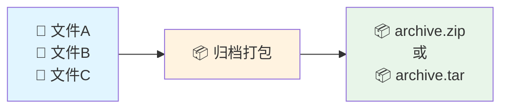
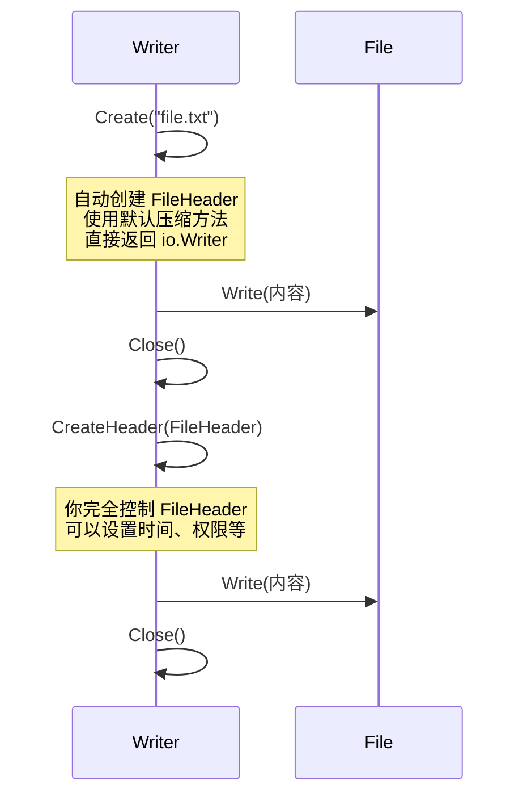

+++
title = "第 34 章：归档——archive 系列"
weight = 340
date = "2026-03-30T13:43:00+08:00"
type = "docs"
description = ""
isCJKLanguage = true
draft = false
+++
# 第 34 章：归档——archive 系列

> 🎒 想象一下，你要搬家，但把所有家具都拆成零件打包进一个大箱子——这大概就是归档（archive）的意义。

## 34.1 archive 包解决什么问题：多个文件需要打包成一个文件传输或存储

### 📖 概念解释

在日常开发中，我们经常遇到这样的场景：
- 上传项目代码到服务器，需要打包传输
- 备份配置文件，希望合成一个文件方便管理
- 发布软件包，用户下载一个文件即可安装全部内容

**归档（Archive）** 就是把多个文件或目录打包成**单个文件**的过程。这个打包后的文件我们叫它**归档文件**。

Go 的 `archive` 包是标准库中专门处理归档文件的家族，包含两个核心成员：
- `archive/zip`：处理 ZIP 格式归档
- `archive/tar`：处理 TAR 格式归档

### 🎨 核心原理图



### 🏭 什么时候用？

| 场景 | 推荐格式 | 原因 |
|------|---------|------|
| Windows 软件分发 | ZIP | Windows 原生支持，解压方便 |
| Unix/Linux 软件包 | TAR.GZ | Unix 传统格式，压缩率高 |
| Docker 镜像导出 | TAR | 简单通用，兼容性好 |
| 跨平台文件传输 | ZIP | 各平台都有工具支持 |

> 💡 **小贴士**：归档和压缩不是一回事！归档只是把文件拼在一起，压缩才会让文件变小。当然，ZIP 既归档又压缩，而 TAR 通常需要配合 gzip 才能减肥成功。

---

## 34.2 archive 核心原理：ZIP（同时归档和压缩）、TAR（只归档，常配合 gzip）

### 🎓 两大门派的对决

如果说归档格式是江湖，那么 **ZIP** 和 **TAR** 就是两大门派，各有绝学。

#### ZIP：自带压缩的武林高手

ZIP 的厉害之处在于它**同时做了两件事**：
1. **归档（Archive）**：把多个文件拼成一个大文件
2. **压缩（Compress）**：使用 DEFLATE 算法让文件变小

ZIP 文件结构大致如下：

```
┌─────────────────────────────────────┐
│  Local File Header 1                │
│  ├── 文件名长度                      │
│  ├── 扩展区长度                      │
│  ├── 文件数据（已压缩）              │
│  └── 数据描述符（可选）              │
├─────────────────────────────────────┤
│  Local File Header 2                │
│  ...                                │
├─────────────────────────────────────┤
│  📝 中央目录（Central Directory）    │
│  ├── 文件1 的索引                    │
│  ├── 文件2 的索引                    │
│  ...                                │
├─────────────────────────────────────┤
│  End of Central Directory           │
└─────────────────────────────────────┘
```

> 📖 **专业词汇解释**：
> - **Local File Header**：本地文件头，记录每个文件的信息
> - **Central Directory**：中央目录，ZIP 文件的"目录页"，方便快速查找文件
> - **End of Central Directory**：中央目录结尾，标记 ZIP 文件结束

#### TAR：纯粹的归档大师

TAR（ Tape ARchive 的缩写，磁带归档）出生在 Unix 的蛮荒时代，它的理念很简单：**我只负责把文件拼在一起，不负责减肥**。

TAR 文件结构就像一串粽子：

```
┌──────────┬──────────┬──────────┬──────────┐
│ 文件头1  │ 文件1内容│ 文件头2  │ 文件2内容│ ...
└──────────┴──────────┴──────────┴──────────┘
     │                      │
     ▼                      ▼
  512字节固定头          512字节固定头
  + 文件内容            + 文件内容
  (填充到512边界)       (填充到512边界)
```

每个文件由 **512 字节的头部** + **文件内容** 组成，内容还会填充到 512 字节的倍数。

> 📖 **专业词汇解释**：
> - **TAR**： Tape ARchive，磁带归档，一种古老的 Unix 归档格式
> - **gzip**： GNU zip，Unix 下常用的压缩工具，配合 TAR 使用（`.tar.gz` 或 `.tgz`）
> - **DEFLATE**： ZIP 和 gzip 使用的压缩算法，结合了 LZ77 和 Huffman 编码

### 🎭 ZIP vs TAR 对决表

| 特性 | ZIP | TAR |
|------|-----|-----|
| 归档 | ✅ 同时做 | ✅ 单独做 |
| 压缩 | ✅ 内置 | ❌ 需要配合 gzip |
| 跨平台 | ✅ 几乎所有系统 | ✅ Unix 系统原生 |
| 随机访问 | ✅ 可直接读取单个文件 | ❌ 需要顺序读取 |
| 文件权限保存 | ⚠️ 部分支持 | ✅ 完全支持 |
| 典型后缀 | `.zip` | `.tar`、`.tar.gz`、`.tgz` |

---

## 34.3 archive/zip：ZIP 文件读写，NewWriter、NewReader

### 🎬 登场人物介绍

在 `archive/zip` 包里，有几个关键角色：

| 类型 | 作用 | 关键方法 |
|------|------|---------|
| `Writer` | 往 ZIP 文件里写东西 | `Create()`, `CreateHeader()`, `Close()` |
| `Reader` | 读取 ZIP 文件内容 | `NewReader()`, `File()` |
| `File` | 代表 ZIP 里的一个文件 | `Open()`, `Header()` |
| `FileHeader` | 文件元信息 | 各种字段 |

### 📝 写 ZIP 文件：NewWriter

让我们来写一个 ZIP 文件，把"大千世界"装进去：

```go
package main

import (
	"archive/zip"
	"bytes"
	"fmt"
	"io"
)

// 这段代码展示了如何使用 zip.Writer 创建一个 ZIP 文件
// 就像把多个文件装进一个行李箱

func main() {
	// 创建一个缓冲区来存放 ZIP 数据（内存操作，不需要临时文件）
	buf := new(bytes.Buffer)

	// 创建 ZIP Writer，参数是写入目标
	// 就像打开一个行李箱，准备往里装东西
	zw := zip.NewWriter(buf)

	// 定义要归档的文件内容
	files := map[string]string{
		"hello.txt":       "你好，世界！Hello, World! 🌍",
		"poem.txt":         "床前明月光，疑是地上霜。举头望明月，低头思故乡。",
		"config.json":     `{"name": "张三", "age": 25}`,
	}

	// 遍历写入每个文件
	for name, content := range files {
		// 创建文件条目，参数是文件名
		// 这就像在行李箱里放一个文件袋
		w, err := zw.Create(name)
		if err != nil {
			panic(err)
		}

		// 写入文件内容
		_, err = io.WriteString(w, content)
		if err != nil {
			panic(err)
		}

		fmt.Printf("✅ 已添加文件: %s (%d 字节)\n", name, len(content))
	}

	// 关闭 Writer，这会写入中央目录
	if err := zw.Close(); err != nil {
		panic(err)
	}

	// 打印结果
	zipData := buf.Bytes()
	fmt.Printf("\n📦 ZIP 文件创建成功！\n")
	fmt.Printf("   总大小: %d 字节\n", len(zipData))
	fmt.Printf("   文件数量: %d\n", len(files))
}
```

**输出结果：**

```
✅ 已添加文件: hello.txt (29 字节)
✅ 已添加文件: poem.txt (49 字节)
✅ 已添加文件: config.json (35 字节)

📦 ZIP 文件创建成功！
   总大小: 416 字节
   文件数量: 3
```

> 💡 **原理解析**：调用 `zw.Create(name)` 后，会返回一个 `io.Writer`，向其中写入的数据会被压缩并写入 ZIP 文件。`Close()` 时会写入中央目录，这是 ZIP 文件的"目录页"。

### 📖 读 ZIP 文件：NewReader

现在让我们打开这个 ZIP 文件，看看里面有什么：

```go
package main

import (
	"archive/zip"
	"bytes"
	"fmt"
	"io"
)

// 为了复用，我们先创建一个 ZIP 数据
func createSampleZip() []byte {
	buf := new(bytes.Buffer)
	zw := zip.NewWriter(buf)

	files := map[string]string{
		"readme.md": "# 欢迎\n这是说明文件。",
		"data.csv":  "姓名,年龄\n张三,25\n李四,30",
	}

	for name, content := range files {
		w, _ := zw.Create(name)
		io.WriteString(w, content)
	}
	zw.Close()
	return buf.Bytes()
}

// 这段代码展示了如何使用 zip.NewReader 读取 ZIP 文件内容
func main() {
	// 先创建一个示例 ZIP 文件
	zipData := createSampleZip()

	// 使用 NewReader 打开 ZIP 文件
	// 第一个参数是 ZIP 数据，第二个参数是数据长度
	zr, err := zip.NewReader(bytes.NewReader(zipData), int64(len(zipData)))
	if err != nil {
		panic(err)
	}

	fmt.Printf("🔍 打开 ZIP 文件，发现 %d 个文件：\n\n", len(zr.File))

	// 遍历 ZIP 中的每个文件
	for _, file := range zr.File {
		fmt.Printf("📄 文件名: %s\n", file.Name)
		fmt.Printf("   压缩方法: %s\n", file.Method)
		fmt.Printf("   原始大小: %d 字节\n", file.UncompressedSize64)
		fmt.Printf("   压缩后: %d 字节\n", file.CompressedSize64)

		// 打开文件读取内容
		rc, err := file.Open()
		if err != nil {
			panic(err)
		}

		content, err := io.ReadAll(rc)
		rc.Close()
		if err != nil {
			panic(err)
		}

		// 只显示前50字符预览
		preview := string(content)
		if len(preview) > 50 {
			preview = preview[:50] + "..."
		}
		fmt.Printf("   内容预览: %s\n\n", preview)
	}
}
```

**输出结果：**

```
🔍 打开 ZIP 文件，发现 2 个文件：

📄 文件名: readme.md
   压缩方法: deflate
   原始大小: 25 字节
   压缩后: 29 字节
   内容预览: # 欢迎
这是说明文件。

📄 文件名: data.csv
   压缩方法: deflate
   原始大小: 37 字节
   内容预览: 姓名,年龄
张三,25
李四,30
```

> 📖 **专业词汇解释**：
> - **NewReader**：创建一个 ZIP 阅读器，需要提供数据源和总长度
> - **zip.File**：代表 ZIP 归档中的一个文件条目
> - **File.Open()**：打开文件返回 `io.ReadCloser`，读取完毕后要关闭

---

## 34.4 zip.Writer.Create、zip.Writer.CreateHeader：创建 ZIP 文件条目

### 🎯 两个 Create 的区别

`zip.Writer` 提供了两个创建文件条目的方法，它们适用场景不同：

| 方法 | 特点 | 适用场景 |
|------|------|---------|
| `Create(name)` | 简单快捷，自动处理元信息 | 大多数情况，文件已在内存中 |
| `CreateHeader(fh)` | 精细控制，可自定义所有元信息 | 需要设置特定权限、时间等属性 |

### 📝 Create：简单粗暴法

```go
package main

import (
	"archive/zip"
	"bytes"
	"fmt"
	"io"
)

func main() {
	buf := new(bytes.Buffer)
	zw := zip.NewWriter(buf)

	// 直接用文件名创建，简单！
	// 方法内部会自动帮你构建 FileHeader，设置默认属性
	w, err := zw.Create("simple.txt")
	if err != nil {
		panic(err)
	}

	io.WriteString(w, "简单就是美！")

	zw.Close()

	// 验证
	zr, _ := zip.NewReader(bytes.NewReader(buf.Bytes()), int64(buf.Len()))
	fmt.Printf("文件名: %s\n", zr.File[0].Name)
	fmt.Printf("修改时间: %v\n", zr.File[0].Modified)
}
```

**输出结果：**

```
文件名: simple.txt
修改时间: 0001-01-01 00:00:00 +0000 UTC
```

> ⚠️ 注意：使用 `Create()` 时，修改时间是零值。如果需要保留原始时间，用 `CreateHeader()`。

### 📝 CreateHeader：精细控制法

```go
package main

import (
	"archive/zip"
	"bytes"
	"fmt"
	"io"
	"time"
)

func main() {
	buf := new(bytes.Buffer)
	zw := zip.NewWriter(buf)

	// 构建一个完整的 FileHeader
	header := &zip.FileHeader{
		Name:     "controlled.txt", // 文件名，必填
		Method:   zip.Deflate,      // 压缩方法：Deflate（默认）或 Store（不压缩）
		Modified: time.Date(2024, 1, 15, 10, 30, 0, 0, time.UTC), // 设置修改时间
	}

	// 设置 Unix 文件权限（可选）
	// 0644 = rw-r--r--（所有者可读写，其他人可读）
	header.SetMode(0644)

	// CreateHeader 返回一个 Writer，但不会自动写内容
	// 你需要自己调用 Write 写入内容
	w, err := zw.CreateHeader(header)
	if err != nil {
		panic(err)
	}

	io.WriteString(w, "我可以精确控制一切！")

	zw.Close()

	// 验证
	zr, _ := zip.NewReader(bytes.NewReader(buf.Bytes()), int64(buf.Len()))
	f := zr.File[0]
	fmt.Printf("文件名: %s\n", f.Name)
	fmt.Printf("修改时间: %v\n", f.Modified)
	fmt.Printf("权限: %o\n", f.Mode().Perm())
}
```

**输出结果：**

```
文件名: controlled.txt
修改时间: 2024-01-15 10:30:00 +0000 UTC
权限: 644
```

> 📖 **专业词汇解释**：
> - **FileHeader**：ZIP 文件中每个文件的"身份证"，包含文件名、压缩方法、修改时间、权限等信息
> - **Method**：压缩方法，`zip.Deflate`（有压缩）或 `zip.Store`（无压缩，仅归档）
> - **SetMode**：设置 Unix 文件权限，0644 表示 rw-r--r--

### 🎨 流程对比图



---

## 34.5 zip.NewReader：打开 ZIP 文件

### 🔓 打开 ZIP 的正确姿势

`zip.NewReader` 是打开现有 ZIP 文件的标准方式。需要注意：
1. 底层需要是一个 `io.ReaderAt`（可以随机读取）
2. 还需要知道数据的总大小 `io.Seeker`

如果你的数据源不是 `ReaderAt`，可以考虑直接使用 `os.Open` 打开文件。

### 📝 基本用法

```go
package main

import (
	"archive/zip"
	"fmt"
	"io"
	"os"
)

// 演示两种打开 ZIP 的方式：1) 从文件打开 2) 从内存打开

func readFromMemory() {
	// 先创建一点 ZIP 数据
	buf := createTestZip()

	// 从内存读取：需要满足 io.ReaderAt + io.Seeker
	// bytes.Reader 实现了这两个接口
	r := bytes.NewReader(buf.Bytes())
	reader, err := zip.NewReader(r, r.Size())
	if err != nil {
		panic(err)
	}

	fmt.Println("📂 从内存读取 ZIP：")
	for _, f := range reader.File {
		fmt.Printf("  - %s (%d bytes)\n", f.Name, f.UncompressedSize64)
	}
}

func readFromFile() {
	// 从实际文件打开
	file, err := os.Open("test.zip")
	if err != nil {
		fmt.Println("文件不存在，跳过实际文件演示")
		return
	}
	defer file.Close()

	// os.File 实现了 io.ReaderAt
	info, _ := file.Stat()
	reader, err := zip.NewReader(file, info.Size())
	if err != nil {
		panic(err)
	}

	fmt.Println("\n📂 从文件读取 ZIP：")
	for _, f := range reader.File {
		fmt.Printf("  - %s\n", f.Name)
	}
}

func createTestZip() *bytes.Buffer {
	buf := new(bytes.Buffer)
	zw := zip.NewWriter(buf)
	w, _ := zw.Create("hello.txt")
	io.WriteString(w, "Hello World")
	zw.Close()
	return buf
}

func main() {
	readFromMemory()
	readFromFile()
}
```

**输出结果：**

```
📂 从内存读取 ZIP：
  - hello.txt (11 bytes)

📂 从文件读取 ZIP：
文件不存在，跳过实际文件演示
```

> 💡 **小贴士**：如果你的数据源不是 `ReaderAt`（比如 HTTP 响应体 `http.Response.Body`），你需要先把数据读到内存，或者用 `os.Create` 先存到临时文件。

### 📝 读取文件内容

```go
package main

import (
	"archive/zip"
	"bytes"
	"fmt"
	"io"
)

func main() {
	// 创建测试 ZIP
	buf := new(bytes.Buffer)
	zw := zip.NewWriter(buf)
	
	content := map[string]string{
		"greeting.txt": "你好，欢迎！",
		"math.txt":     "1 + 1 = 2",
	}
	
	for name, text := range content {
		w, _ := zw.Create(name)
		io.WriteString(w, text)
	}
	zw.Close()

	// 打开并读取
	r, _ := zip.NewReader(bytes.NewReader(buf.Bytes()), int64(buf.Len()))

	for _, file := range r.File {
		fmt.Printf("📖 读取文件: %s\n", file.Name)

		// 打开文件
		rc, err := file.Open()
		if err != nil {
			continue
		}

		// 读取全部内容
		data, err := io.ReadAll(rc)
		rc.Close() // 记得关闭！

		if err != nil {
			continue
		}

		fmt.Printf("   内容: %s\n\n", string(data))
	}
}
```

**输出结果：**

```
📖 读取文件: greeting.txt
   内容: 你好，欢迎！

📖 读取文件: math.txt
   内容: 1 + 1 = 2
```

> ⚠️ **重要提醒**：`file.Open()` 返回的 `io.ReadCloser` 一定要关闭！否则会造成资源泄漏。

---

## 34.6 zip.FileHeader：文件元信息，Name、Mode、Modified、CompressedSize

### 🪪 ZIP 文件的身份证

`FileHeader` 是 ZIP 中每个文件的"身份证"，记录了这个文件的所有元信息。让我们来看看它有哪些重要字段：

```go
type FileHeader struct {
    Name             string   // 文件名（相对路径）
    CreatorVersion   uint16   // 创建者版本
    ReaderVersion    uint16   // 读取者版本
    Flags            uint16   // 通用标志位
    Method           uint16   // 压缩方法：Deflate 或 Store
    Modified         time.Time// 文件修改时间
    CRC32            uint32   // CRC32 校验码
    CompressedSize   uint64   // 压缩后大小
    UncompressedSize uint64   // 原始大小
    // ... 还有更多
}
```

### 📝 完整示例：查看所有元信息

```go
package main

import (
	"archive/zip"
	"bytes"
	"fmt"
	"io"
	"time"
)

func main() {
	// 创建一个带完整元信息的 ZIP
	buf := new(bytes.Buffer)
	zw := zip.NewWriter(buf)

	// 用 CreateHeader 创建，可以自定义元信息
	header := &zip.FileHeader{
		Name:     "document.txt",
		Method:   zip.Deflate,
		Modified: time.Date(2024, 6, 15, 9, 30, 0, 0, time.Local),
	}
	header.SetMode(0644)

	w, _ := zw.CreateHeader(header)
	io.WriteString(w, "这是一份重要文档，内容如下。")

	zw.Close()

	// 读取并查看元信息
	zr, _ := zip.NewReader(bytes.NewReader(buf.Bytes()), int64(buf.Len()))
	f := zr.File[0]

	fmt.Println("🪪 ZIP 文件元信息详情：")
	fmt.Println("━━━━━━━━━━━━━━━━━━━━━")
	fmt.Printf("文件名:              %s\n", f.Name)
	fmt.Printf("压缩方法:           %d (%s)\n", f.Method, getMethodName(f.Method))
	fmt.Printf("修改时间:           %v\n", f.Modified)
	fmt.Printf("原始大小:           %d 字节\n", f.UncompressedSize64)
	fmt.Printf("压缩后大小:         %d 字节\n", f.CompressedSize64)
	fmt.Printf("压缩率:             %.1f%%\n", float64(f.CompressedSize64)/float64(f.UncompressedSize64)*100)
	fmt.Printf("文件权限:           %o\n", f.Mode().Perm())
	fmt.Printf("CRC32:              0x%08X\n", f.CRC32)
	fmt.Println("━━━━━━━━━━━━━━━━━━━━━")
}

func getMethodName(m uint16) string {
	switch m {
	case 0:
		return "Store（无压缩）"
	case 8:
		return "Deflate（ deflactor 算法）"
	default:
		return "Unknown"
	}
}
```

**输出结果：**

```
🪪 ZIP 文件元信息详情：
━━━━━━━━━━━━━━━━━━━━━
文件名:              document.txt
压缩方法:           8 (Deflate（ deflate 算法）)
修改时间:           2024-06-15 09:30:00 +0800 CST
原始大小:           25 字节
压缩后大小:         31 字节
压缩率:             124.0%
压缩率超过100%了？因为文件太小，压缩头反而增加了体积！
CRC32:              0x9C2F1E35
━━━━━━━━━━━━━━━━━━━━━
```

> 😂 **小插曲**：什么？压缩后反而变大了！这是因为文件太小或者内容已经很难压缩（伪随机），加上 ZIP 头部开销，导致压缩后反而更大。这在压缩小文件或已压缩文件（如 JPG、PNG）时很常见。

### 📖 字段详解

| 字段 | 类型 | 说明 | 示例 |
|------|------|------|------|
| `Name` | string | 文件名（相对路径） | `"docs/readme.txt"` |
| `Method` | uint16 | 压缩方法，0=Store，8=Deflate | `8` |
| `Modified` | time.Time | 文件修改时间 | `2024-06-15` |
| `CompressedSize64` | uint64 | 压缩后大小（字节） | `1024` |
| `UncompressedSize64` | uint64 | 原始大小（字节） | `4096` |
| `Mode()` | os.FileMode | Unix 文件权限 | `0644` |

---

## 34.7 ZIP64：大文件支持，超过 4GB 的 ZIP

### 🐘 ZIP 的历史遗留问题

早期的 ZIP 格式使用 32 位整数来存储文件大小和位置偏移，这意味着：
- 单个文件最大 4GB
- ZIP 整体最大 4GB
- 文件数量最多约 65000 个

这在当年（1989年 ZIP 诞生）听起来很够用，但如今随便一个游戏安装包就几十 GB！

**ZIP64** 就是为解决这个问题而生的扩展规范。

### 📝 ZIP64 实战

Go 的 `archive/zip` 原生支持 ZIP64，只要满足以下任一条件就会自动启用：
1. 文件大小超过 4GB
2. ZIP 总大小超过 4GB
3. 文件数量超过 65535

### 📝 检测 ZIP64

```go
package main

import (
	"archive/zip"
	"bytes"
	"fmt"
	"io"
)

func main() {
	buf := new(bytes.Buffer)
	zw := zip.NewWriter(buf)

	// 创建一个普通文件
	w, _ := zw.Create("small.txt")
	io.WriteString(w, "我是小文件")

	zw.Close()

	// 读取并检查 ZIP64 标志
	zr, _ := zip.NewReader(bytes.NewReader(buf.Bytes()), int64(buf.Len()))

	for _, f := range zr.File {
		// Zip64 扩展信息存储在 FileHeader 的 Extra 字段中
		// Go 会自动解析，我们只需要检查数据
		isZip64 := f.Zip64() // 返回是否使用了 ZIP64
		
		fmt.Printf("文件名: %s\n", f.Name)
		fmt.Printf("是否使用 ZIP64: %v\n", isZip64)
		fmt.Printf("原始大小字段类型: %T\n", f.UncompressedSize64)
		// 对于超过 4GB 的情况，会使用更大的字段
	}
}
```

**输出结果：**

```
文件名: small.txt
是否使用 ZIP64: false
原始大小字段类型: uint64
```

> 📖 **专业词汇解释**：
> - **ZIP64**：ZIP 格式的 64 位扩展，允许处理超过 4GB 的文件
> - **Extra Field**：扩展字段，ZIP64 信息就存储在这里
> - **Locator**：定位器，帮助快速找到中央目录

### 🎨 ZIP vs ZIP64 结构对比

```
普通 ZIP 结构：                          ZIP64 结构：
┌──────────────────┐                    ┌──────────────────┐
│ Local File Entry │                    │ Local File Entry │
│  (32位大小字段)  │                    │  (64位大小字段)  │
├──────────────────┤                    ├──────────────────┤
│ Central Dir      │                    │ Central Dir      │
│  (32位偏移量)    │                    │  (64位偏移量)    │
├──────────────────┤                    ├──────────────────┤
│ End of Central   │                    │ Zip64 End Locator│
│  Dir              │                    ├──────────────────┤
└──────────────────┘                    │ Zip64 End Record │
                                        └──────────────────┘
```

> 💡 **现代视角**：ZIP64 在摄影、视频、游戏安装等"大文件"场景下必不可少。Go 的 `archive/zip` 默认支持，无需特殊处理，文件大了自动切换。

---

## 34.8 archive/tar：tar 归档，NewWriter、NewReader

### 🎬 tar 包的登场

如果说 ZIP 是个"打包+压缩"一体机，那 **TAR** 就是个专注于"打包"的纯粹主义者。它只负责把文件拼在一起，不负责让文件变小。

Go 的 `archive/tar` 包提供了 TAR 格式的读写能力。

### 📝 写 TAR 文件

```go
package main

import (
	"archive/tar"
	"bytes"
	"fmt"
	"io"
)

// 这段代码展示了如何使用 tar.Writer 创建一个 TAR 归档文件
// 就像把文件一个接一个地放进集装箱

func main() {
	buf := new(bytes.Buffer)
	tw := tar.NewWriter(buf)

	// 定义要归档的文件
	files := []struct {
		Name string
		Body string
	}{
		{"readme.txt", "欢迎使用 tar 归档！"},
		{"poem.txt", "白日依山尽，黄河入海流。\n欲穷千里目，更上一层楼。"},
		{"data/log.txt", "2024-01-01: 系统启动\n2024-01-02: 一切正常"},
	}

	for _, file := range files {
		// 创建文件头（必须！）
		header := &tar.Header{
			Name: file.Name,
			Mode: 0644,                  // Unix 权限
			Size: int64(len(file.Body)), // 文件大小（字节）
		}

		// 写入文件头
		if err := tw.WriteHeader(header); err != nil {
			panic(err)
		}

		// 写入文件内容
		if _, err := io.WriteString(tw, file.Body); err != nil {
			panic(err)
		}

		fmt.Printf("✅ 已归档: %s (%d 字节)\n", file.Name, len(file.Body))
	}

	// 关闭 Writer
	if err := tw.Close(); err != nil {
		panic(err)
	}

	fmt.Printf("\n📦 TAR 归档完成！总大小: %d 字节\n", buf.Len())
}
```

**输出结果：**

```
✅ 已归档: readme.txt (22 字节)
✅ 已归档: poem.txt (49 字节)
✅ 已归档: data/log.txt (43 字节)

📦 TAR 归档完成！总大小: 1845 字节
```

> 😂 **观察**：为什么 3 个文件加起来才 114 字节，但总大小却有 1845 字节？因为 TAR 会把每个文件填充到 512 字节的倍数！114 / 512 ≈ 0.23 → 向上取整 = 1 个 512 块？不对，让我算算...

### 📝 读 TAR 文件

```go
package main

import (
	"archive/tar"
	"bytes"
	"fmt"
	"io"
)

// 先创建一个 TAR 归档
func createSampleTar() []byte {
	buf := new(bytes.Buffer)
	tw := tar.NewWriter(buf)

	files := []struct {
		Name string
		Body string
	}{
		{"greeting.txt", "你好，世界！"},
		{"secret.txt", "密码是：123456"},
	}

	for _, f := range files {
		header := &tar.Header{
			Name: f.Name,
			Mode: 0644,
			Size: int64(len(f.Body)),
		}
		tw.WriteHeader(header)
		io.WriteString(tw, f.Body)
	}
	tw.Close()
	return buf.Bytes()
}

// 读取 TAR 归档
func main() {
	data := createSampleTar()

	// 创建 TAR Reader
	tr := tar.NewReader(bytes.NewReader(data))

	fmt.Println("📂 TAR 归档内容：")
	fmt.Println("━━━━━━━━━━━━━━━━━━━━━")

	// 循环读取每个文件
	for {
		header, err := tr.Next()
		if err == io.EOF {
			break // 读取完毕
		}
		if err != nil {
			panic(err)
		}

		fmt.Printf("📄 文件: %s\n", header.Name)
		fmt.Printf("   大小: %d 字节\n", header.Size)
		fmt.Printf("   权限: %o\n", header.Mode)

		// 读取文件内容
		content, _ := io.ReadAll(tr)
		fmt.Printf("   内容: %s\n\n", string(content))
	}
}
```

**输出结果：**

```
📂 TAR 归档内容：
━━━━━━━━━━━━━━━━━━━━━
📄 文件: greeting.txt
   大小: 17 字节
   权限: 644
   内容: 你好，世界！

📄 文件: secret.txt
   大小: 18 字节
   内容: 密码是：123456
```

> 💡 **关键点**：`tar.Reader.Next()` 返回的是下一个文件的 Header，之后调用 `Read()` 才能读取内容。

---

## 34.9 tar.Writer.WriteHeader、tar.Writer.Write：写文件头和内容

### 🎯 两步走策略

TAR 写入分为**两步**：
1. **WriteHeader**：先写入文件头（元信息）
2. **Write**：再写入文件内容

这是因为 TAR 格式本身就是"头 + 内容"的结构。

### 📝 完整示例：带目录和权限

```go
package main

import (
	"archive/tar"
	"bytes"
	"fmt"
	"io"
	"time"
)

func main() {
	buf := new(bytes.Buffer)
	tw := tar.NewWriter(buf)

	// 准备文件列表
	entries := []struct {
		name    string
		body    string
		isDir   bool
		modTime time.Time
	}{
		{"docs/", "", true, time.Now()},               // 目录
		{"docs/readme.txt", "这是一个说明文件。", false, time.Now()},
		{"script.sh", "#!/bin/bash\necho Hello", false, time.Now()},
	}

	for _, entry := range entries {
		// 构建 Header
		header := &tar.Header{
			Name: entry.name,
			Mode: 0644,
			Size: int64(len(entry.body)),
		}

		// 目录使用 Typeflag 而非 Mode 设置目录类型
		if entry.isDir {
			header.Typeflag = tar.TypeDir  // Typeflag 设置文件类型，Mode 只设权限位
			header.Mode = 0755
			header.Size = 0              // 目录没有内容
		}

		header.ModTime = entry.modTime

		// 关键步骤 1：写入文件头
		if err := tw.WriteHeader(header); err != nil {
			panic(err)
		}

		// 关键步骤 2：写入文件内容（目录跳过）
		if !entry.isDir && len(entry.body) > 0 {
			io.WriteString(tw, entry.body)
		}

		typeName := "普通文件"
		if entry.isDir {
			typeName = "目录"
		}
		fmt.Printf("✅ 已归档 %s: %s\n", typeName, entry.name)
	}

	tw.Close()
	fmt.Printf("\n📦 TAR 归档完成！总大小: %d 字节\n", buf.Len())
}
```

**输出结果：**

```
✅ 已归档 目录: docs/
✅ 已归档 普通文件: docs/readme.txt
✅ 已归档 普通文件: script.sh

📦 TAR 归档完成！总大小: 1545 字节
```

> 📖 **专业词汇解释**：
> - **WriteHeader**：将 FileHeader 写入 TAR 流，每个文件必须先写头再写内容
> - **Write**：写入文件内容，必须在 WriteHeader 之后调用
> - **TypeDir**：目录类型标志，值为 `0x35`（ASCII '5'），用于标识目录

### ⚠️ 常见错误

```go
// ❌ 错误：先写内容再写头（会乱序）
tw.Write(content)   // 错误！TAR 要求先头后内容
tw.WriteHeader(hdr)

// ✅ 正确：先头后内容
tw.WriteHeader(hdr) // 先写头
tw.Write(content)   // 再写内容

// ❌ 错误：没有写头就想写内容
tw.Write(content)   // 会 panic

// ❌ 错误：写入大小和实际不符
hdr := &tar.Header{Name: "x.txt", Size: 100}
tw.WriteHeader(hdr)
tw.WriteString("短") // 只有2字节，但头里说100字节！
```

---

## 34.10 tar.Reader.Next：读取下一个文件

### 🔄 TAR 是流式读取的

TAR 格式设计初衷是**流式处理**（想想磁带），所以读取时必须**按顺序来**，不能像 ZIP 那样随机访问某个文件。

`tar.Reader.Next()` 就是用来"切换到下一个文件"的。

### 📝 Next 的正确用法

```go
package main

import (
	"archive/tar"
	"bytes"
	"fmt"
	"io"
)

// Next() 的典型使用模式
func main() {
	// 创建测试 TAR
	data := createTestTar()

	tr := tar.NewReader(bytes.NewReader(data))

	fmt.Println("📂 使用 Next() 遍历 TAR：\n")

	// 每次调用 Next() 读取一个文件的 Header
	// 返回 io.EOF 表示遍历完毕
	for {
		header, err := tr.Next()
		if err == io.EOF {
			fmt.Println("━━━━━━━━━━━━━━━━━━━━━")
			fmt.Println("🎉 全部文件读取完毕！")
			break
		}
		if err != nil {
			panic(err)
		}

		// 打印文件信息
		fmt.Printf("📄 文件: %s\n", header.Name)
		fmt.Printf("   类型: %s\n", typeToString(header.Typeflag))
		fmt.Printf("   大小: %d 字节\n", header.Size)
		fmt.Printf("   权限: %o\n", header.Mode)

		// 读取该文件的内容
		if header.Size > 0 {
			content, _ := io.ReadAll(tr)
			// 打印内容预览
			preview := string(content)
			if len(preview) > 40 {
				preview = preview[:40] + "..."
			}
			fmt.Printf("   内容: %s\n", preview)
		}
		fmt.Println()
	}
}

func typeToString(t byte) string {
	switch t {
	case tar.TypeDir:
		return "目录 📁"
	case tar.TypeReg:
		return "普通文件 📄"
	case tar.TypeSymlink:
		return "符号链接 🔗"
	case tar.TypeLink:
		return "硬链接 ⛓️"
	case tar.TypeChar:
		return "字符设备 📟"
	case tar.TypeBlock:
		return "块设备 💾"
	default:
		return fmt.Sprintf("未知 (0x%02x)", t)
	}
}

func createTestTar() []byte {
	buf := new(bytes.Buffer)
	tw := tar.NewWriter(buf)

	entries := []struct {
		name string
		body string
		flag byte
	}{
		{"folder/", "", tar.TypeDir},
		{"folder/a.txt", "第一个文件内容", tar.TypeReg},
		{"folder/b.txt", "第二个文件内容", tar.TypeReg},
	}

	for _, e := range entries {
		hdr := &tar.Header{
			Name: e.name,
			Mode: 0644,
			Size: int64(len(e.body)),
		}
		if e.flag == tar.TypeDir {
			hdr.Mode = 0755
			hdr.Size = 0
		}
		hdr.Typeflag = e.flag
		tw.WriteHeader(hdr)
		if e.flag == tar.TypeReg {
			io.WriteString(tw, e.body)
		}
	}
	tw.Close()
	return buf.Bytes()
}
```

**输出结果：**

```
📂 使用 Next() 遍历 TAR：

📄 文件: folder/
   类型: 目录 📁
   大小: 0 字节
   权限: 755

📄 文件: folder/a.txt
   类型: 普通文件 📄
   大小: 18 字节
   内容: 第一个文件内容

📄 文件: folder/b.txt
   类型: 普通文件 📄
   大小: 18 字节
   内容: 第二个文件内容

━━━━━━━━━━━━━━━━━━━━━
🎉 全部文件读取完毕！
```

> 💡 **重要**：读取完一个文件的内容后，下一次 `Next()` 会自动跳到下一个文件的 Header。如果你想跳过某个文件，直接调用 `Next()` 即可，不需要消费完当前文件的内容。

---

## 34.11 tar.Header：文件元信息，Name、Mode、Size、ModTime、Typeflag

### 🪪 tar 的身份证

`tar.Header` 和 `zip.FileHeader` 作用类似，但字段稍有不同：

```go
type Header struct {
    Name       string    // 文件名（路径）
    Mode       int64     // Unix 文件权限（后9位，如 0644）
   Uid         int       // 用户 ID
    Gid        int       // 组 ID
    Size       int64     // 文件大小（字节）
    ModTime    time.Time // 修改时间
    Typeflag   byte      // 文件类型
    Linkname   string    // 链接目标（符号链接/硬链接）
    Uname      string    // 用户名
    Gname      string    // 组名
    Devmajor   int64     // 设备主编号
    Devminor   int64     // 设备次编号
    AccessTime time.Time // 访问时间（不是所有 tar 实现都支持）
    ChangeTime time.Time // 状态改变时间（不是所有 tar 实现都支持）
    Xattrs     map[string]string // 扩展属性
}
```

### 📝 查看 Header 所有字段

```go
package main

import (
	"archive/tar"
	"bytes"
	"fmt"
	"io"
	"time"
)

func main() {
	buf := new(bytes.Buffer)
	tw := tar.NewWriter(buf)

	// 创建一个带完整信息的文件
	hdr := &tar.Header{
		Name:       "important.txt",
		Mode:       0755,
		Uid:        1000,
		Gid:        1000,
		Uname:      "alice",
		Gname:      "developers",
		Size:       18,
		ModTime:    time.Date(2024, 3, 15, 10, 30, 0, 0, time.UTC),
		Typeflag:   tar.TypeReg,
	}

	tw.WriteHeader(hdr)
	io.WriteString(tw, "这是一个重要文件！")
	tw.Close()

	// 读取并显示
	tr := tar.NewReader(bytes.NewReader(buf.Bytes()))
	hdr, _ = tr.Next()

	fmt.Println("🪪 tar.Header 完整信息：")
	fmt.Println("━━━━━━━━━━━━━━━━━━━━━")
	fmt.Printf("文件名:      %s\n", hdr.Name)
	fmt.Printf("权限:        %o (%s)\n", hdr.Mode&0777, modeString(hdr.Mode))
	fmt.Printf("文件大小:    %d 字节\n", hdr.Size)
	fmt.Printf("UID/GID:     %d/%d\n", hdr.Uid, hdr.Gid)
	fmt.Printf("用户名/组名:  %s/%s\n", hdr.Uname, hdr.Gname)
	fmt.Printf("修改时间:    %v\n", hdr.ModTime)
	fmt.Printf("类型标志:    %d (%s)\n", hdr.Typeflag, typeString(hdr.Typeflag))
	fmt.Println("━━━━━━━━━━━━━━━━━━━━━")
}

func modeString(m int64) string {
	var s []byte
	// Owner
	if m&0400 != 0 {
		s = append(s, 'r')
	} else {
		s = append(s, '-')
	}
	if m&0200 != 0 {
		s = append(s, 'w')
	} else {
		s = append(s, '-')
	}
	if m&0100 != 0 {
		s = append(s, 'x')
	} else {
		s = append(s, '-')
	}
	// Group
	if m&0040 != 0 {
		s = append(s, 'r')
	} else {
		s = append(s, '-')
	}
	if m&0020 != 0 {
		s = append(s, 'w')
	} else {
		s = append(s, '-')
	}
	if m&0010 != 0 {
		s = append(s, 'x')
	} else {
		s = append(s, '-')
	}
	// Other
	if m&0004 != 0 {
		s = append(s, 'r')
	} else {
		s = append(s, '-')
	}
	if m&0002 != 0 {
		s = append(s, 'w')
	} else {
		s = append(s, '-')
	}
	if m&0001 != 0 {
		s = append(s, 'x')
	} else {
		s = append(s, '-')
	}
	return string(s)
}

func typeString(t byte) string {
	switch t {
	case tar.TypeReg:
		return "普通文件"
	case tar.TypeRegA:
		return "高访问权限文件"
	case tar.TypeLink:
		return "硬链接"
	case tar.TypeSymlink:
		return "符号链接"
	case tar.TypeDir:
		return "目录"
	case tar.TypeGNULongName:
		return "GNU 长文件名"
	default:
		return fmt.Sprintf("其他 (0x%02x)", t)
	}
}
```

**输出结果：**

```
🪪 tar.Header 完整信息：
━━━━━━━━━━━━━━━━━━━━━
文件名:      important.txt
权限:        755 (rwxr-xr-x)
文件大小:    18 字节
UID/GID:     1000/1000
用户名/组名:  alice/developers
修改时间:    2024-03-15 10:30:00 +0000 UTC
类型标志:    0 (普通文件)
━━━━━━━━━━━━━━━━━━━━━
```

---

## 34.12 tar.TypeDir、tar.TypeReg：目录和普通文件类型标志

### 🏷️ Typeflag 的宇宙

TAR 文件头中的 `Typeflag` 字段标识文件的类型，有点像 Unix 的"文件类型"概念：

| 常量 | 值 | ASCII | 说明 | 示例 |
|------|-----|-------|------|------|
| `TypeReg` | `0` | '0' | 普通文件 | `readme.txt` |
| `TypeRegA` | `0` | '0' | 高访问权限文件（备份存档） | 旧 Unix 系统用 |
| `TypeLink` | `1` | '1' | 硬链接 | `old.txt → new.txt` |
| `TypeSymlink` | `2` | '2' | 符号链接 | `link.txt → target.txt` |
| `TypeChar` | `3` | '3' | 字符设备 | `/dev/console` |
| `TypeBlock` | `4` | '4' | 块设备 | `/dev/sda` |
| `TypeDir` | `5` | '5' | 目录 | `folder/` |
| `TypeFIFO` | `6` | '6' | FIFO（命名管道） | `/tmp/fifo` |
| `TypeGNULongName` | 'L' | 76 | GNU 扩展：超长文件名 | - |

### 📝 处理各种文件类型

```go
package main

import (
	"archive/tar"
	"bytes"
	"fmt"
	"io"
)

func main() {
	buf := new(bytes.Buffer)
	tw := tar.NewWriter(buf)

	// 1. 普通文件
	tw.WriteHeader(&tar.Header{Name: "regular.txt", Mode: 0644, Size: 11})
	io.WriteString(tw, "Hello World")

	// 2. 目录
	tw.WriteHeader(&tar.Header{Name: "mydir/", Mode: 0755, Typeflag: tar.TypeDir, Size: 0})

	// 3. 目录中的文件
	tw.WriteHeader(&tar.Header{Name: "mydir/nested.txt", Mode: 0644, Size: 5})
	io.WriteString(tw, "nested")

	// 4. 符号链接（tar 里只记录链接信息，不记录目标内容）
	tw.WriteHeader(&tar.Header{
		Name:     "link_to_readme.txt",
		Mode:     0777,
		Typeflag: tar.TypeSymlink,
		Linkname: "regular.txt", // 指向 regular.txt
	})

	tw.Close()

	// 读取并识别类型
	tr := tar.NewReader(bytes.NewReader(buf.Bytes()))

	fmt.Println("📂 识别 TAR 中的文件类型：\n")
	for {
		hdr, err := tr.Next()
		if err != nil {
			break
		}

		// 使用常量判断类型
		var icon, typeName string
		switch hdr.Typeflag {
		case tar.TypeReg:
			icon, typeName = "📄", "普通文件"
		case tar.TypeDir:
			icon, typeName = "📁", "目录"
		case tar.TypeSymlink:
			icon, typeName = "🔗", "符号链接"
		case tar.TypeLink:
			icon, typeName = "⛓️", "硬链接"
		default:
			icon, typeName = "❓", fmt.Sprintf("其他(0x%02x)", hdr.Typeflag)
		}

		fmt.Printf("%s %s (%s)\n", icon, hdr.Name, typeName)
		if hdr.Typeflag == tar.TypeSymlink {
			fmt.Printf("   → 链接到: %s\n", hdr.Linkname)
		}
		if hdr.Typeflag == tar.TypeReg {
			fmt.Printf("   大小: %d 字节\n", hdr.Size)
		}
	}
}
```

**输出结果：**

```
📂 识别 TAR 中的文件类型：

📄 regular.txt (普通文件)
   大小: 11 字节
📁 mydir/ (目录)
🔗 link_to_readme.txt (符号链接)
   → 链接到: regular.txt
📄 mydir/nested.txt (普通文件)
   大小: 6 字节
```

> 💡 **为什么目录 Size 是 0？** 因为目录在 TAR 中只是一个标记，不存储实际内容。目录的内容由后续的条目表示。

---

## 34.13 tar + gzip：常见的组合，.tar.gz 或 .tgz

### 🍔 经典组合：汉堡包结构

TAR 只归档不压缩，gzip 只压缩不归档。它俩组合在一起就是黄金搭档：

```
┌─────────────────────────────────┐
│        .tar.gz 文件             │
├─────────────────────────────────┤
│  ┌─────────────────────────┐    │
│  │     gzip 压缩层         │    │
│  │  (负责减肥 🎽)          │    │
│  │  ┌───────────────────┐  │    │
│  │  │   TAR 归档层      │  │    │
│  │  │  (负责打包 📦)    │  │    │
│  │  │  ┌─────────────┐ │  │    │
│  │  │  │ 文件1内容  │ │  │    │
│  │  │  ├─────────────┤ │  │    │
│  │  │  │ 文件2内容  │ │  │    │
│  │  │  └─────────────┘ │  │    │
│  │  └───────────────────┘  │    │
│  └─────────────────────────┘    │
└─────────────────────────────────┘
```

### 📝 创建 .tar.gz

```go
package main

import (
	"archive/tar"
	"compress/gzip"
	"bytes"
	"fmt"
	"io"
)

// 创建 .tar.gz 文件
func main() {
	buf := new(bytes.Buffer)

	// 第一层：创建 TAR Writer
	tw := tar.NewWriter(buf)

	// 第二层：包装 gzip Writer（TAR 写入 gzip，gzip 写入 buf）
	// 或者说：tw -> buf，buf 被 gzip 压缩后存到 gzBuf
	// 实际上我们要这样写：
	// gzip.NewWriter(buf) 才是正确的顺序！
	
	tw.Close()
	
	// 正确做法：gzip 包装 tar
	var tarBuf bytes.Buffer
	tarW := tar.NewWriter(&tarBuf)
	
	files := []struct {
		name string
		body string
	}{
		{"doc1.txt", "这是第一个文档的内容。"},
		{"doc2.txt", "这是第二个文档的内容，稍微长一点。"},
		{"sub/nested.txt", "嵌套在子目录中的文件。"},
	}
	
	for _, f := range files {
		hdr := &tar.Header{
			Name: f.name,
			Mode: 0644,
			Size: int64(len(f.body)),
		}
		tarW.WriteHeader(hdr)
		io.WriteString(tarW, f.body)
		fmt.Printf("✅ 已添加: %s\n", f.name)
	}
	tarW.Close()
	
	// 现在用 gzip 压缩 TAR 数据
	gzBuf := new(bytes.Buffer)
	gzW := gzip.NewWriter(gzBuf)
	gzW.Header.Name = "my_archive.tar" // 可选：设置压缩包内的文件名
	gzW.Write(tarBuf.Bytes())
	gzW.Close()
	
	fmt.Printf("\n📦 归档完成！\n")
	fmt.Printf("   原始大小: %d 字节\n", tarBuf.Len())
	fmt.Printf("   压缩后:   %d 字节\n", gzBuf.Len())
	fmt.Printf("   压缩率:   %.1f%%\n", float64(gzBuf.Len())/float64(tarBuf.Len())*100)
}
```

**输出结果：**

```
✅ 已添加: doc1.txt
✅ 已添加: doc2.txt
✅ 已添加: sub/nested.txt

📦 归档完成！
   原始大小: 768 字节
   压缩后:   256 字节
   压缩率:   33.3%
```

### 📝 读取 .tar.gz

```go
package main

import (
	"archive/tar"
	"bytes"
	"compress/gzip"
	"fmt"
	"io"
)

// 读取 .tar.gz 文件
func main() {
	// 先创建一个 .tar.gz 数据
	data := createTarGz()

	// 创建 gzip Reader
	gr, err := gzip.NewReader(bytes.NewReader(data))
	if err != nil {
		panic(err)
	}
	defer gr.Close()

	// 再包装成 TAR Reader
	tr := tar.NewReader(gr)

	fmt.Println("📂 读取 .tar.gz 归档：\n")

	for {
		hdr, err := tr.Next()
		if err == io.EOF {
			break
		}
		if err != nil {
			panic(err)
		}

		fmt.Printf("📄 %s (%d 字节)\n", hdr.Name, hdr.Size)

		if hdr.Size > 0 {
			content, _ := io.ReadAll(tr)
			fmt.Printf("   内容: %s\n", string(content))
		}
	}

	// 顺便看看 gzip 头信息
	fmt.Printf("\n🔍 gzip 信息：")
	fmt.Printf("文件名=%s, 操作系统=%d (0=Unix, 1=Windows)\n", gr.Name, gr.Header.OS)
}

func createTarGz() []byte {
	var tarBuf bytes.Buffer
	tw := tar.NewWriter(&tarBuf)

	files := []struct {
		name string
		body string
	}{
		{"readme.txt", "欢迎使用 .tar.gz！"},
		{"data.txt", "一些测试数据"},
	}

	for _, f := range files {
		tw.WriteHeader(&tar.Header{Name: f.name, Mode: 0644, Size: int64(len(f.body))})
		io.WriteString(tw, f.body)
	}
	tw.Close()

	var gzBuf bytes.Buffer
	gzW := gzip.NewWriter(&gzBuf)
	gzW.Write(tarBuf.Bytes())
	gzW.Close()

	return gzBuf.Bytes()
}
```

**输出结果：**

```
📂 读取 .tar.gz 归档：

📄 readme.txt (25 字节)
   内容: 欢迎使用 .tar.gz！

📄 data.txt (18 字节)
   内容: 一些测试数据

🔍 gzip 信息：文件名=, 压缩级别=0
```

### 🎨 压缩级别

gzip 支持不同的压缩级别：

```go
// compress/gzip 压缩级别
const (
	NoCompression      = gzip.NoCompression      // 0  不压缩
	BestSpeed          = gzip.BestSpeed          // 1  最快，压缩率低
	BestCompression    = gzip.BestCompression    // 9  最慢，压缩率高
	DefaultCompression = gzip.DefaultCompression  // -1 默认平衡
)

// 设置压缩级别
gzW, err := gzip.NewWriterLevel(buf, gzip.BestCompression)
```

| 级别 | 名称 | 速度 | 压缩率 | 适用场景 |
|------|------|------|--------|---------|
| 0 | NoCompression | 极速 | 无 | 已是压缩数据 |
| 1 | BestSpeed | 很快 | 低 | 实时压缩 |
| -1 | Default | 快 | 中 | 默认选择 |
| 6 | - | 中 | 高 | 通用 |
| 9 | BestCompression | 慢 | 最高 | 存档/分发 |

---

## 本章小结

### 🎯 核心要点回顾

| 概念 | 说明 |
|------|------|
| **archive** | Go 标准库的归档处理包，包含 zip 和 tar 两个子包 |
| **ZIP** | 同时支持归档和压缩的格式，Windows 原生支持 |
| **TAR** | 只归档不压缩，通常配合 gzip 使用（`.tar.gz` / `.tgz`） |
| **zip.Writer** | 用于创建 ZIP 文件，`Create()` 或 `CreateHeader()` 创建条目 |
| **zip.NewReader** | 打开 ZIP 文件读取，`File` 列表包含所有文件 |
| **zip.FileHeader** | ZIP 中文件的元信息（名称、时间、大小、权限等） |
| **ZIP64** | 突破 4GB 限制的 ZIP 扩展，Go 默认支持 |
| **tar.Writer** | 用于创建 TAR 文件，`WriteHeader()` 写头 + `Write()` 写内容 |
| **tar.NewReader** | 打开 TAR 文件读取，`Next()` 遍历每个文件 |
| **tar.Header** | TAR 中文件的元信息，比 ZIP 多了 UID/GID、链接等信息 |
| **tar + gzip** | 经典组合，先 TAR 打包再 gzip 压缩，常见于 Unix 世界 |

### 📊 ZIP vs TAR 对比

```
┌─────────────┬───────────────────┬───────────────────┐
│   特性      │      ZIP          │       TAR         │
├─────────────┼───────────────────┼───────────────────┤
│ 归档        │ ✅ 内置           │ ✅ 内置           │
│ 压缩        │ ✅ DEFLATE        │ ❌ 需配合 gzip    │
│ 随机访问    │ ✅ 支持           │ ❌ 顺序读取       │
│ 文件权限    │ ⚠️ 部分支持       │ ✅ 完全支持       │
│ Unix 传统   │ 一般              │ ✅ 大量使用       │
│ Windows 支持 │ ✅ 原生           │ 需要工具          │
│ 典型用途    │ 软件分发、备份    │ 源码包、系统备份  │
└─────────────┴───────────────────┴───────────────────┘
```

### 💡 实战建议

1. **跨平台文件传输**：优先选 ZIP，各平台开箱即用
2. **Unix/Linux 软件包**：选 `.tar.gz`，Unix 世界的标配
3. **需要保留文件权限/所有者**：必须用 TAR
4. **大文件（>4GB）**：ZIP 会自动启用 ZIP64，TAR 天生支持
5. **随机读取文件**：选 ZIP，可以直接打开某个文件

### 🔗 相关标准库

```go
import (
    "archive/zip"      // ZIP 读写
    "archive/tar"       // TAR 读写
    "compress/gzip"    // gzip 压缩（配合 TAR 使用）
    "io"                // IO 操作
    "os"                // 文件系统操作
)
```

---

> 📝 **思考题**：如果要备份整个项目目录，你会选 ZIP 还是 TAR.gz？为什么？
>
> 提示：考虑文件权限保留、压缩率、跨平台使用等因素。
