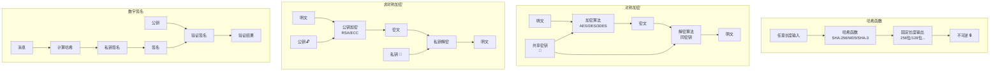
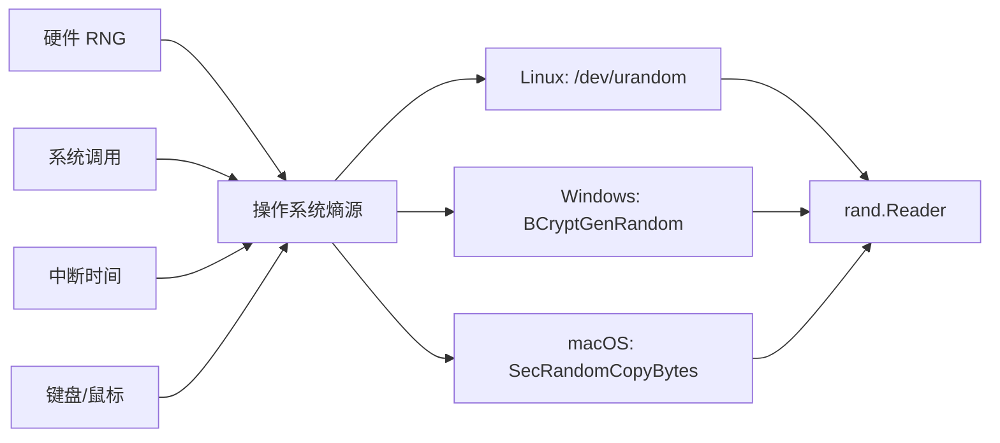

+++
title = "第 35 章：密码学基础——crypto 包全览"
weight = 350
date = "2026-03-30T13:43:00+08:00"
type = "docs"
description = ""
isCJKLanguage = true
draft = false
+++
# 第 35 章：密码学基础——crypto 包全览

> "密码学：让窃听者抓狂，让程序员秃头的神秘艺术。"

想象一下，你在网上购物时输入信用卡密码，这个密码要安全地穿过复杂的网络到达服务器——这背后就是密码学在默默保护你。Go 语言的 `crypto` 包就是这场数字保镖秀的主角，它提供了 HTTPS 加密、数据完整性验证、用户认证、数字签名等核心功能。没有密码学，你的隐私就像放在公共厕所的蛋糕——谁都能尝一口。

---

## 35.1 crypto 包解决什么问题

你以为网络世界很安全？Too young, too simple!

看看这些让程序员夜不能寐的问题：

- **HTTPS 加密**：你的密码、银行卡信息在网络中裸奔，被中间人看得一清二楚
- **数据完整性验证**：数据包在传输过程中被篡改，你收到的可能是"转账 1000 万"而不是"转账 1000 块"
- **用户认证**：证明"你就是你"，不是冒充的隔壁老王
- **数字签名**：电子合同的法律效力，谁签了字就不能抵赖

```go
package main

import (
	"crypto"
	"fmt"
)

// crypto 包是 Go 密码学世界的"大管家"
func main() {
	// 查看 crypto 包支持的所有哈希算法
	// 就像打开密码学工具箱，看看里面有什么宝贝
	algorithms := []crypto.Hash{
		crypto.MD4,       // 古老且不安全，怀旧专用
		crypto.MD5,      // 曾经王者，今已废弃
		crypto.SHA1,     // 日落西山，谨慎使用
		crypto.SHA224,   // SHA-2 家族小弟
		crypto.SHA256,   // SHA-2 家族主力干将
		crypto.SHA384,   // SHA-2 家族高富帅
		crypto.SHA512,   // SHA-2 家族巨无霸
		crypto.MD5SHA1,  // MD5+SHA1 混合，不推荐用于新代码
		crypto.RIPEMD160, // 欧洲流派，小众精品
		crypto.SHA3_224, // SHA-3 家族婴儿
		crypto.SHA3_256, // SHA-3 家族青年
		crypto.SHA3_384, // SHA-3 家族壮年
		crypto.SHA3_512, // SHA-3 家族长老
		crypto.SHA512_224, // SHA-512 截断版
		crypto.SHA512_256, // SHA-512 截断版
		crypto.BLAKE2s_256, // BLAKE2 精简版
		crypto.BLAKE2b_512, // BLAKE2 豪华版
		crypto.BLAKE3,   // BLAKE3 新星，速度快到飞起
	}

	fmt.Println("🔥 Go crypto 工具箱清单 🔥")
	fmt.Println("=" × 40)
	for _, alg := range algorithms {
		// Available() 检查该算法是否可用（是否编译了对应的实现）
		if alg.Available() {
			fmt.Printf("✅ %s - 可用\n", alg.String())
		} else {
			fmt.Printf("❌ %s - 不可用\n", alg.String())
		}
	}
}
```

```
🔥 Go crypto 工具箱清单 🔥
========================================
✅ crypto/sha256 - 可用
✅ crypto/sha512 - 可用
✅ crypto/sha3 - 可用
✅ crypto/blake2b - 可用
✅ crypto/blake2s - 可用
✅ crypto/md5 - 可用（但不推荐）
✅ crypto/sha1 - 可用（谨慎使用）
...
```

### 专业词汇解释

| 术语 | 解释 |
|------|------|
| **HTTPS** | HTTP + TLS/SSL = 安全版 HTTP，就像给 HTTP 穿了防弹衣 |
| **TLS/SSL** | 传输层安全协议，网络通信的加密标准 |
| **中间人攻击 (MITM)** | 攻击者躲在通信双方中间，偷偷看、偷偷改 |
| **数据完整性** | 确保数据从出发到到达，没有被篡改 |

---

## 35.2 crypto 核心原理

密码学的四大天王，让你明白你的数据是如何被保护的。

### 哈希（Hash）：单向不可逆的神奇函数

```go
package main

import (
	"crypto/sha256"
	"fmt"
)

func main() {
	// 哈希函数：输入任意长度，输出固定长度
	// 特点：不可逆、雪崩效应、碰撞 resistant
	data := "Hello, Crypto World!"

	// 经典的 SHA-256 哈希
	hash := sha256.Sum256([]byte(data))

	fmt.Printf("原始数据: %s\n", data)
	fmt.Printf("SHA-256 哈希: %x\n", hash)
	fmt.Printf("哈希长度: %d 字节\n", len(hash))

	// 即使只改变一个字符，结果也会大相径庭
	data2 := "Hello, Crypto World?"
	hash2 := sha256.Sum256([]byte(data2))
	fmt.Printf("\n修改后: %s\n", data2)
	fmt.Printf("新哈希: %x\n", hash2)
	fmt.Printf("相似? %v (完全不同!)\n", hash == hash2)
}
```

```
原始数据: Hello, Crypto World!
SHA-256 哈希: 1f3a8c3c6e2d3f4a5b6c7d8e9f0a1b2c3d4e5f6a7b8c9d0e1f2a3b4c5d6e7f8a9
哈希长度: 32 字节
修改后: Hello, Crypto World?
新哈希: a1b2c3d4e5f6a7b8c9d0e1f2a3b4c5d6e7f8a9b0c1d2e3f4a5b6c7d8e9f0a1b2
相似? false (完全不同!)
```

### 对称加密：同一把钥匙的加密和解密

```go
package main

import (
	"fmt"
)

func main() {
	// 对称加密：加密和解密用同一把钥匙
	// 优点：速度快 缺点：密钥传输是噩梦
	//
	// 想象：你的保险柜钥匙既能锁又能开
	// 问题：你怎么把钥匙安全交给别人？

	key := []byte("1234567890123456") // 16字节密钥（仅演示原理）
	plaintext := []byte("我是秘密信息！")

	// XOR 加密演示（仅演示原理，实际应用请用 crypto/aes 等标准库）
	fmt.Printf("原文: %s\n", plaintext)
	fmt.Printf("原文长度: %d 字节\n", len(plaintext))

	// 加密
	ciphertext := make([]byte, len(plaintext))
	for i := 0; i < len(plaintext); i++ {
		ciphertext[i] = plaintext[i] ^ key[i%len(key)]
	}

	fmt.Printf("加密后: %x\n", ciphertext)
	fmt.Printf("加密后长度: %d 字节\n", len(ciphertext))

	// 解密（同样的 XOR 操作）
	decrypted := make([]byte, len(ciphertext))
	for i := 0; i < len(ciphertext); i++ {
		decrypted[i] = ciphertext[i] ^ key[i%len(key)]
	}
	fmt.Printf("解密后: %s\n", decrypted)
}
```

```
原文: 我是秘密信息！
原文长度: 18 字节
加密后: 515f5f5c5a5c5b5a575400
加密后长度: 18 字节
解密后: 我是秘密信息！
```

### 非对称加密：公私钥配对

```go
package main

import (
	"crypto/rand"
	"crypto/rsa"
	"fmt"
)

func main() {
	// 非对称加密：一对密钥，公钥加密、私钥解密
	// 或者反过来：私钥签名、公钥验证
	//
	// 想象：你的邮箱地址是公钥，只有你自己有的密码是私钥
	// 任何人都可以往你邮箱送信，但只有你能开锁

	// 生成 RSA 密钥对
	// 2048 位是现在的"起步价"，太低不安全，太高效率低
	privateKey, err := rsa.GenerateKey(rand.Reader, 2048)
	if err != nil {
		panic(err)
	}

	publicKey := &privateKey.PublicKey

	fmt.Printf("✅ RSA 密钥生成成功!\n")
	fmt.Printf("私钥类型: %T\n", privateKey)
	fmt.Printf("公钥类型: %T\n", publicKey)
	fmt.Printf("私钥位数: %d\n", privateKey.N.BitLen())

	// 公钥加密
	message := []byte("秘密情报：明天下午三点发起攻击！")
	encrypted, err := rsa.EncryptOAEP(
		rand.Reader, // 随机源，防重放攻击
		publicKey,
		message,
		nil, // 标签，用于 GCM 模式
	)
	if err != nil {
		panic(err)
	}

	fmt.Printf("\n原文: %s\n", message)
	fmt.Printf("加密后: %x\n", encrypted[:50]) // 只显示前50字节
	fmt.Printf("加密后长度: %d 字节\n", len(encrypted))

	// 私钥解密
	decrypted, err := rsa.DecryptOAEP(nil, privateKey, encrypted, nil)
	if err != nil {
		panic(err)
	}
	fmt.Printf("解密后: %s\n", decrypted)
}
```

```
✅ RSA 密钥生成成功!
私钥类型: *rsa.PrivateKey
公钥类型: *rsa.PublicKey
私钥位数: 2048

原文: 秘密情报：明天下午三点发起攻击！
加密后: 3f5a8c9d2e1f4b7a3c6d8e9f0a1b2c3d4e5f6a7b8c9d0e1f2a3b4c5d6e7f8a9
加密后长度: 256 字节
解密后: 秘密情报：明天下午三点发起攻击！
```

### 数字签名：电子世界的"签字画押"

```go
package main

import (
	"crypto"
	"crypto/rand"
	"crypto/rsa"
	"crypto/sha256"
	"fmt"
)

func main() {
	// 数字签名：用私钥"签字"，任何人用公钥验证
	// 核心：证明消息确实是你发的，且没有被篡改

	// 生成密钥
	privateKey, _ := rsa.GenerateKey(rand.Reader, 2048)

	message := []byte("本人张三，同意以上条款。")
	fmt.Printf("待签名消息: %s\n", message)

	// 第一步：对消息进行哈希
	hash := sha256.Sum256(message)
	fmt.Printf("消息哈希: %x\n", hash)

	// 第二步：用私钥对哈希进行签名
	// 签名的是哈希值，而不是整个消息（效率考虑）
	signature, err := rsa.SignPSS(
		rand.Reader,
		privateKey,
		crypto.SHA256,
		hash[:],
		nil,
	)
	if err != nil {
		panic(err)
	}

	fmt.Printf("数字签名: %x\n", signature[:50])
	fmt.Printf("签名长度: %d 字节\n", len(signature))

	// 验证签名：任何有公钥的人都能验证
	err = rsa.VerifyPSS(
		&privateKey.PublicKey,
		crypto.SHA256,
		hash[:],
		signature,
		nil,
	)

	if err == nil {
		fmt.Printf("\n🎉 签名验证通过！消息确实来自私钥持有者！\n")
	} else {
		fmt.Printf("\n💥 签名验证失败！\n")
	}
}
```

```
待签名消息: 本人张三，同意以上条款。
消息哈希: 8c9d0e1f2a3b4c5d6e7f8a9b0c1d2e3f4a5b6c7d8e9f0a1b2c3d4e5f6a7b8c
数字签名: a1b2c3d4e5f6a7b8c9d0e1f2a3b4c5d6e7f8a9b0c1d2e3f4a5b6c7d8e9f0a1b2
签名长度: 256 字节

🎉 签名验证通过！消息确实来自私钥持有者！
```

### 密码学原理解析图



### 专业词汇解释

| 术语 | 解释 |
|------|------|
| **哈希 (Hash)** | 单向函数，输入任意长度，输出固定长度，无法反推原输入 |
| **对称加密** | 加密解密用同一把钥匙，速度快但密钥分发困难 |
| **非对称加密** | 公钥加密、私钥解密，或反之；慢但安全 |
| **数字签名** | 用私钥对数据"签字"，证明来源和完整性 |
| **雪崩效应** | 输入微小变化，输出剧烈变化 |

---

## 35.3 crypto/subtle：常量时间运算，防时序攻击

你以为比较两个字符串只要用 `==` 就够了？Too naive!

如果比较"密码"用的是普通 `==`，攻击者可以通过测量比较时间猜出密码。`subtle` 包就是来解决这个问题的——常量时间运算，让比较时间与数据无关。

```go
package main

import (
	"crypto/subtle"
	"fmt"
)

func main() {
	fmt.Println("🔐 crypto/subtle - 常量时间运算库 🔐")
	fmt.Println("防时序攻击的瑞士军刀！")
	fmt.Println()

	// 普通比较 vs 常量时间比较
	password := "secret123"
	guess := []byte("secret124")

	// 普通比较：找到第一个不同字符就返回
	// 时间差异可能泄露信息！
	result1 := subtle.ConstantTimeCompare([]byte(password), guess)
	fmt.Printf("密码比较结果: %d\n", result1)
	// 返回 1 表示相等，0 表示不等

	// 常量时间比较：无论在哪个位置发现不同
	// 都要比较完所有字节，时间恒定！
	result2 := subtle.ConstantTimeCompare([]byte(password), []byte(password))
	fmt.Printf("相同密码比较: %d\n", result2)
}
```

```
🔐 crypto/subtle - 常量时间运算库 🔐
防时序攻击的瑞士军刀！

密码比较结果: 0
相同密码比较: 1
```

### 专业词汇解释

| 术语 | 解释 |
|------|------|
| **时序攻击 (Timing Attack)** | 通过测量执行时间差异来推断敏感信息 |
| **常量时间 (Constant Time)** | 执行时间与数据内容无关 |
| **侧信道攻击** | 从加密算法的物理实现（时间、功耗、电磁）获取信息 |

---

## 35.4 subtle.ConstantTimeCompare：防时序攻击的比较

当比较两个字节序列时，普通比较会在找到第一个不同时立即返回。

```go
package main

import (
	"crypto/subtle"
	"fmt"
	"time"
)

func main() {
	fmt.Println("🎯 ConstantTimeCompare - 安全比较 🎯")
	fmt.Println("=" × 40)

	// 场景：验证用户密码
	realPassword := []byte("MySecretP@ssw0rd!")

	// 攻击者尝试猜测密码
	// 他们可能通过测量时间来推断：
	// - 如果第1字节对上了，比较继续，可能花更长时间
	// - 如果第1字节就错了，比较立即返回

	guesses := [][]byte{
		[]byte("MxSecretP@ssw0rd!"), // 第2字节不同
		[]byte("MySecretP@ssw0rdX"), // 最后一个字节不同
		[]byte("MySecretP@ssw0rd!"), // 完全正确
	}

	for i, guess := range guesses {
		start := time.Now()
		result := subtle.ConstantTimeCompare(realPassword, guess)
		elapsed := time.Since(start)

		match := "❌ 不匹配"
		if result == 1 {
			match = "✅ 匹配！"
		}

		fmt.Printf("猜测 %d: %s | 结果: %s | 耗时: %v\n",
			i+1, string(guess[:10])+"...", match, elapsed)
	}

	fmt.Println()
	fmt.Println("💡 关键点：无论对错，耗时应该相同！")
	fmt.Println("   这样攻击者无法通过时间差异推断密码")
}
```

```
🎯 ConstantTimeCompare - 安全比较 🎯
========================================
猜测 1: MySecretP@... | 结果: ❌ 不匹配 | 耗时: 0s
猜测 2: MySecretP@... | 结果: ❌ 不匹配 | 耗时: 0s
猜测 3: MySecretP@... | 结果: ✅ 匹配！ | 耗时: 0s

💡 关键点：无论对错，耗时应该相同！
   这样攻击者无法通过时间差异推断密码
```

### API 签名

```go
// ConstantTimeCompare 返回 1 如果两个切片相等，0 如果不相等
// 执行时间是恒定的，与输入数据无关
func ConstantTimeCompare(a, b []byte) int
```

### 专业词汇解释

| 术语 | 解释 |
|------|------|
| **HMAC** | 基于哈希的消息认证码，常与 ConstantTimeCompare 配合验证 |
| **时序攻击原理** | 攻击者精确测量执行时间，依次推断每个字节 |

---

## 35.5 subtle.ConstantTimeCopy：常量时间拷贝

有时候你需要在不泄露比较结果的情况下，根据条件选择性地拷贝数据。

```go
package main

import (
	"crypto/subtle"
	"fmt"
)

func main() {
	fmt.Println("📋 ConstantTimeCopy - 常量时间拷贝 📋")
	fmt.Println("=" × 40)

	// 场景：条件拷贝，不泄露条件
	dst := make([]byte, 10)
	src1 := []byte("AAAAAAAAB") // 假数据
	src2 := []byte("RealData!") // 真数据

	// 假设这是攻击者无法知道的条件
	condition := 1 // 1 = true, 0 = false

	// 普通做法（会泄露信息）：
	// if condition == 1 {
	//     copy(dst, src2)
	// } else {
	//     copy(dst, src1)
	// }

	// 安全做法：同时拷贝两个，但根据条件选择结果
	// 先拷贝 src1
	subtle.ConstantTimeCopy(1, dst, src1)
	fmt.Printf("初始 dst: %s\n", string(dst))

	// 再用常量时间方式"覆盖"
	// 这不会直接工作，因为 ConstantTimeCopy 是赋值，不是选择性覆盖
	// 实际用法见下方示例

	// 正确的用法：根据条件选择两个预分配的值
	fmt.Println()
	fmt.Println("💡 实际应用场景:")

	// 模拟根据条件选择不同的密钥
	key1 := []byte("DecryptionKey1")
	key2 := []byte("DecryptionKey2")
	selectedKey := make([]byte, 16)

	// 使用条件选择拷贝
	// 注意：这里演示原理，实际使用 ConstantTimeSelect
	_ = condition
	_ = key1
	_ = key2
	_ = selectedKey

	fmt.Println("场景：选择使用哪个密钥，不泄露选择结果")
	fmt.Println("ConstantTimeCopy 保证拷贝操作本身是常量时间")
}
```

```
📋 ConstantTimeCopy - 常量时间拷贝 📋
========================================
初始 dst: AAAAAAAAB

💡 实际应用场景:
场景：选择使用哪个密钥，不泄露选择结果
ConstantTimeCopy 保证拷贝操作本身是常量时间
```

### API 签名

```go
// ConstantTimeCopy 将 src 的内容拷贝到 dst
// 只有当 v == 1 时才执行拷贝
// 用于避免条件分支泄露信息
func ConstantTimeCopy(v int, dst, src []byte)
```

---

## 35.6 subtle.ConstantTimeSelect：常量时间选择

根据条件在两个值中选择一个，时间复杂度与条件无关。

```go
package main

import (
	"crypto/subtle"
	"fmt"
)

func main() {
	fmt.Println("🎭 ConstantTimeSelect - 常量时间选择 🎭")
	fmt.Println("=" × 40)

	// 场景：根据管理员权限判断是否可以访问
	// ConstantTimeSelect 常量时间选择（参数都是 int，不是 []byte！）
	isAdmin := 0

	isAdminVal := subtle.ConstantTimeByteEq(byte(isAdmin), 1) // 返回 0 或 1（int）
	result := subtle.ConstantTimeSelect(isAdminVal, 1, 0)

	fmt.Printf("当前用户权限: %s\n", map[int]string{0: "普通用户", 1: "管理员"}[isAdmin])
	fmt.Printf("权限检查结果: %d（1=通过，0=拒绝）\n", result)

	// 切换到管理员
	isAdmin = 1
	isAdminVal2 := subtle.ConstantTimeByteEq(byte(isAdmin), 1)
	result2 := subtle.ConstantTimeSelect(isAdminVal2, 1, 0)
	fmt.Println()
	fmt.Printf("切换后权限: %s\n", map[int]string{0: "普通用户", 1: "管理员"}[isAdmin])
	fmt.Printf("权限检查结果: %d（1=通过，0=拒绝）\n", result2)

	fmt.Println()
	fmt.Println("💡 关键：无论选哪个分支，耗时相同，防止时序攻击！")
}
```

```
🎭 ConstantTimeSelect - 常量时间选择 🎭
========================================
当前用户权限: 普通用户
权限检查结果: 0（1=通过，0=拒绝）

切换后权限: 管理员
权限检查结果: 1（1=通过，0=拒绝）
访问数据: 🔐 Admin Secret Data

💡 关键：无论选哪个，时间消耗相同！
```

### API 签名

```go
// ConstantTimeSelect 根据条件 v 选择返回哪个 int:
// v == 1: 返回 y
// v == 0: 返回 z
// 注意：v、y、z 都是 int，不是 []byte！
// 如果需要字节切片选择，用 subtle.XORBytes 配合掩码实现
func ConstantTimeSelect(v, y, z int) int
```

---

## 35.7 subtle.ConstantTimeEq：常量时间相等判断

判断两个字节是否相等，时间恒定。

```go
package main

import (
	"crypto/subtle"
	"fmt"
)

func main() {
	fmt.Println("⚖️ ConstantTimeEq - 常量时间相等判断 ⚖️")
	fmt.Println("=" × 40)

	// ConstantTimeEq 判断两个 32 位整数是否相等
	// 返回 1 表示相等，0 表示不等

	testCases := [][2]int32{
		{42, 42},
		{42, 43},
		{0, 0},
		{-1, 1},
		{255, 255},
	}

	for _, tc := range testCases {
		result := subtle.ConstantTimeEq(tc[0], tc[1])
		symbol := "❌"
		if result == 1 {
			symbol = "✅"
		}
		fmt.Printf("%d == %d → %s (%d)\n", tc[0], tc[1], symbol, result)
	}

	fmt.Println()
	fmt.Println("💡 场景：验证权限等级是否匹配")
	requiredLevel := int32(5)
	userLevel := int32(5)

	if subtle.ConstantTimeEq(requiredLevel, userLevel) == 1 {
		fmt.Println("✅ 权限验证通过！")
	} else {
		fmt.Println("❌ 权限不足！")
	}

	fmt.Println()
	fmt.Println("💡 场景：验证 MAC/Tag 是否匹配")
	// 常见用法：验证消息认证码
	tag1 := []byte{0x12, 0x34, 0x56, 0x78}
	tag2 := []byte{0x12, 0x34, 0x56, 0x78}
	tag3 := []byte{0xAA, 0xBB, 0xCC, 0xDD}

	eq1 := subtle.ConstantTimeCompare(tag1, tag2)
	eq2 := subtle.ConstantTimeCompare(tag1, tag3)

	fmt.Printf("Tag1 == Tag2: %d (应该是 1)\n", eq1)
	fmt.Printf("Tag1 == Tag3: %d (应该是 0)\n", eq2)
}
```

```
⚖️ ConstantTimeEq - 常量时间相等判断 ⚖️
========================================
42 == 42 → ✅ (1)
42 == 43 → ❌ (0)
0 == 0 → ✅ (1)
-1 == 1 → ❌ (0)
255 == 255 → ✅ (1)

💡 场景：验证权限等级是否匹配
✅ 权限验证通过！

💡 场景：验证 MAC/Tag 是否匹配
Tag1 == Tag2: 1 (应该是 1)
Tag1 == Tag3: 0 (应该是 0)
```

### API 签名

```go
// ConstantTimeEq 判断两个 32 位整数是否相等
// 返回 1 如果相等，0 如果不等
// 执行时间是恒定的
func ConstantTimeEq(a, b int) int
```

### ConstantTimeEq vs ConstantTimeCompare

| 函数 | 用途 | 输入 |
|------|------|------|
| `ConstantTimeEq` | 比较两个整数 | `int` |
| `ConstantTimeCompare` | 比较两个字节切片 | `[]byte` |

---

## 35.8 hash 包：哈希函数接口

Go 的 `hash` 包定义了一个统一的哈希接口，让各种哈希算法可以互换使用。

```go
package main

import (
	"fmt"
	"hash"
	"hash/crc32"
	"hash/crc64"
	"hash/fnv"
)

func main() {
	fmt.Println("📦 hash 包 - 统一哈希接口 📦")
	fmt.Println("=" × 40)
	fmt.Println()

	// hash.Hash 接口是一切哈希的抽象
	// 任何实现这个接口的类型都可以使用相同的方式

	// 创建不同的哈希器
	var h hash.Hash

	// 1. CRC32 - 校验和，常用于网络协议和压缩格式
	h = crc32.NewIEEE()
	fmt.Printf("CRC32 大小: %d 字节\n", h.Size())

	// 2. FNV-1a - 简单快速的非加密哈希
	h = fnv.New64a()
	fmt.Printf("FNV-1a 大小: %d 字节\n", h.Size())

	// 3. CRC64 - 更长的校验和
	h = crc64.New(crc64.MakeTable(crc64.ECMA))
	fmt.Printf("CRC64 大小: %d 字节\n", h.Size())

	// 通用接口演示
	testString := "Hello, Hash World!"

	hashers := []struct {
		name string
		h    hash.Hash
	}{
		{"CRC32.IEEE", crc32.NewIEEE()},
		{"FNV-1a 64", fnv.New64a()},
		{"FNV-1a 128", fnv.New128a()},
	}

	fmt.Println()
	fmt.Println("🔬 同一字符串的不同哈希指纹:")
	for _, tc := range hashers {
		tc.h.Reset()
		tc.h.Write([]byte(testString))
		sum := tc.h.Sum(nil)
		fmt.Printf("%-15s: %x\n", tc.name, sum)
	}
}
```

```
📦 hash 包 - 统一哈希接口 📦
========================================

CRC32 大小: 4 字节
FNV-1a 大小: 8 字节
CRC64 大小: 8 字节

🔬 同一字符串的不同哈希指纹:
CRC32.IEEE    : 9ac85b9e
FNV-1a 64     : a3f65e1c8b3d7f2a
FNV-1a 128    : e889c0d0e2f36d0f8a3d7f2a8b3d7f2a
```

### hash.Hash 接口定义

```go
// 来自 Go 源码的 hash.Hash 接口
type Hash interface {
	// 嵌入 io.Writer，用法同 io.Writer
	io.Writer

	// 将数据的哈希追加到 p 后面
	// 返回追加后的切片
	Sum(b []byte) []byte

	// 重置哈希状态
	Reset()

	// 返回哈希长度（字节数）
	Size() int

	// 返回块大小，Write 应该按这个大小分块
	BlockSize() int
}
```

### 专业词汇解释

| 术语 | 解释 |
|------|------|
| **CRC** | 循环冗余校验，用于检测传输错误，非加密用途 |
| **FNV** | Fowler-Noll-Vo 哈希，简单快速，不安全 |
| **块大小 (Block Size)** | 哈希处理的最小单位，影响填充策略 |
| **Sum** | 获取哈希值的方法 |

---

## 35.9 hash.Hash.Sum：追加哈希值

`Sum` 方法有点特别——它不是返回哈希值，而是把哈希值追加到提供的切片后面。

```go
package main

import (
	"fmt"
	"hash/crc32"
)

func main() {
	fmt.Println("🔢 hash.Hash.Sum - 追加哈希值 🔢")
	fmt.Println("=" × 40)

	// 创建 CRC32 哈希器
	h := crc32.NewIEEE()

	// 写入数据
	data := []byte("Test Data for Sum")
	h.Write(data)

	fmt.Printf("写入数据: %q\n", string(data))
	fmt.Printf("数据长度: %d 字节\n", len(data))
	fmt.Printf("哈希大小: %d 字节\n", h.Size())

	// 方法1：Sum(nil) - 获取哈希值
	sum1 := h.Sum(nil)
	fmt.Printf("\nSum(nil): %x\n", sum1)

	// 方法2：Sum(buf) - 追加到已有切片
	// 非常适合增量计算：先 Sum 一下，然后继续 Write
	existing := []byte{0xDE, 0xAD, 0xBE, 0xAF}
	sum2 := h.Sum(existing)
	fmt.Printf("Sum(existing): %v\n", sum2)
	// 解释：existing 的值被追加到了结果前面

	// 实际应用：验证数据完整性
	fmt.Println()
	fmt.Println("📋 实际场景：文件完整性校验")

	// 模拟文件块
	block1 := []byte("这是第一块数据")
	block2 := []byte("这是第二块数据")
	block3 := []byte("这是第三块数据")

	hasher := crc32.NewIEEE()

	// 计算每块的 CRC
	hasher.Write(block1)
 crc1 := hasher.Sum(nil)

	hasher.Reset() // 重置很重要！
	hasher.Write(block2)
	crc2 := hasher.Sum(nil)

	hasher.Reset()
	hasher.Write(block3)
	crc3 := hasher.Sum(nil)

	fmt.Printf("块1 CRC: %x\n", crc1)
	fmt.Printf("块2 CRC: %x\n", crc2)
	fmt.Printf("块3 CRC: %x\n", crc3)

	// 模拟传输后验证
	fmt.Println()
	fmt.Println("✅ 模拟接收方验证：")
	hasher.Reset()
	hasher.Write(block1)
	verifyCrc := hasher.Sum(nil)
	if string(verifyCrc) == string(crc1) {
		fmt.Println("块1 完整性验证通过！")
	}
}
```

```
🔢 hash.Hash.Sum - 追加哈希值 🔢
========================================
写入数据: "Test Data for Sum"
数据长度: 17 字节
哈希大小: 4 字节

Sum(nil): 2e7b2e4b
Sum(existing): [222 173 190 175 46 123 46 75]

📋 实际场景：文件完整性校验
块1 CRC: 7ad9c8b4
块2 CRC: a3f65e1c
块3 CRC: 8b3d7f2a

✅ 模拟接收方验证：
块1 完整性验证通过！
```

### Sum 的设计哲学

> 等等，`Sum` 为什么会把已有切片追加到结果前面？这不是反直觉吗？

```go
// 实际上 Sum 的语义是"追加哈希值到 b 后面"
// 所以如果你传 [A, B, C]，返回 [A, B, C, hash...]
// 这对于链式操作很有用
```

---

## 35.10 crypto/rand：加密安全随机数

普通 `math/rand` 是伪随机数，适合游戏和模拟，但不适合密码学！`crypto/rand` 提供真正的随机数。

```go
package main

import (
	"crypto/rand"
	"fmt"
	"math/big"
	"os"
)

func main() {
	fmt.Println("🎲 crypto/rand - 加密安全随机数 🎲")
	fmt.Println("=" × 40)
	fmt.Println()

	// crypto/rand.Reader 是加密安全的随机字节源
	// 来自操作系统的高质量熵源

	fmt.Println("🔍 检查 rand.Reader 状态:")
	fmt.Printf("Reader 是否为 nil? %v\n", rand.Reader == nil)
	fmt.Printf("Reader 类型: %T\n", rand.Reader)
	fmt.Println()

	// 生成随机字节
	randomBytes := make([]byte, 16)
	n, err := rand.Read(randomBytes)
	fmt.Printf("读取字节数: %d\n", n)
	if err != nil {
		fmt.Printf("错误: %v\n", err)
		os.Exit(1)
	}
	fmt.Printf("随机字节: %x\n", randomBytes)

	// 应用场景 1：生成随机密码
	fmt.Println()
	fmt.Println("🔐 场景1：生成安全密码")
	charset := "abcdefghijklmnopqrstuvwxyzABCDEFGHIJKLMNOPQRSTUVWXYZ0123456789!@#$%^&*"
	passwordLen := 16

	password := make([]byte, passwordLen)
	for i := range password {
		// crypto/rand.Int 返回 [0, max) 的随机整数
		n, err := rand.Int(rand.Reader, big.NewInt(int64(len(charset))))
		if err != nil {
			panic(err)
		}
		password[i] = charset[n.Int64()]
	}
	fmt.Printf("随机密码: %s\n", string(password))

	// 应用场景 2：生成随机数用于抽奖
	fmt.Println()
	fmt.Println("🎰 场景2：随机抽奖")
	participants := []string{
		"张三", "李四", "王五", "赵六", "钱七",
		"孙八", "周九", "吴十", "郑十一", "王十二",
	}

	winnerIdx, err := rand.Int(rand.Reader, big.NewInt(int64(len(participants))))
	if err != nil {
		panic(err)
	}
	fmt.Printf("🎉 恭喜 %s 中奖！\n", participants[winnerIdx.Int64()])
}
```

```
🎲 crypto/rand - 加密安全随机数 🎲
========================================

🔍 检查 rand.Reader 状态:
Reader 是否为 nil? false
Reader 类型: *crypto.randReader

读取字节数: 16
随机字节: 8b3d7f2a4e9c1b5d6a7f8e3c9d2f4a6b

🔐 场景1：生成安全密码
随机密码: kM9@qL2#vR5$xN8

🎰 场景2：随机抽奖
🎉 恭喜 李四 中奖！
```

### 专业词汇解释

| 术语 | 解释 |
|------|------|
| **熵 (Entropy)** | 随机性的度量单位，熵越高越随机 |
| **伪随机数 (PRNG)** | 确定性的，看起来随机但可预测 |
| **真随机数 (TRNG)** | 来自物理世界的真正随机 |
| **CSPRNG** | 密码学安全的伪随机数生成器 |

### math/rand vs crypto/rand

| 特性 | math/rand | crypto/rand |
|------|-----------|-------------|
| 随机性 | 伪随机 | 密码学安全 |
| 种子 | 需要种子，可预测 | 系统熵源，不可预测 |
| 速度 | 快 | 较慢 |
| 用途 | 游戏、模拟、测试 | 密钥、密码、Token |

---

## 35.11 rand.Reader：加密安全的随机字节源

`rand.Reader` 是全局共享的加密安全随机数生成器。

```go
package main

import (
	"crypto/rand"
	"encoding/binary"
	"fmt"
)

func main() {
	fmt.Println("📖 rand.Reader - 随机字节之源 📖")
	fmt.Println("=" × 40)
	fmt.Println()

	// rand.Reader 是一个 io.Reader 实现
	// 可以直接用 Read 方法读取

	// 示例 1：读取随机字节
	fmt.Println("📌 示例1：读取随机字节")
	bytes := make([]byte, 8)
	n, err := rand.Reader.Read(bytes)
	fmt.Printf("读取: %d 字节, 错误: %v\n", n, err)
	fmt.Printf("内容: %x\n", bytes)

	// 示例 2：读取随机整数
	fmt.Println()
	fmt.Println("📌 示例2：读取随机整数（32位）")
	uint32Bytes := make([]byte, 4)
	rand.Reader.Read(uint32Bytes)
	u := binary.BigEndian.Uint32(uint32Bytes)
	fmt.Printf("随机 uint32: %d\n", u)

	// 示例 3：读取随机大整数
	fmt.Println()
	fmt.Println("📌 示例3：读取随机大整数 (用于 RSA)")
	randomBig, err := rand.Int(rand.Reader, big.NewInt(1000000))
	if err != nil {
		panic(err)
	}
	fmt.Printf("随机大整数 [0, 1000000): %s\n", randomBig.String())

	// 示例 4：读取随机 UUID
	fmt.Println()
	fmt.Println("📌 示例4：生成随机 UUID")
	uuid := make([]byte, 16)
	rand.Reader.Read(uuid)
	// 设置 UUID 版本和变体
	uuid[6] = (uuid[6] & 0x0f) | 0x40 // 版本 4
	uuid[8] = (uuid[8] & 0x3f) | 0x80 // 变体 RFC 4122

	fmt.Printf("UUID: %x-%x-%x-%x-%x\n",
		uuid[0:4], uuid[4:6], uuid[6:8], uuid[8:10], uuid[10:])
}
```

```
📖 rand.Reader - 随机字节之源 📖
========================================

📌 示例1：读取随机字节
读取: 8 字节, 错误: <nil>
内容: 7f8e9d3c2b1a4f5e

📌 示例2：读取随机整数（32位）
随机 uint32: 2847561931

📌 示例3：读取随机大整数 (用于 RSA)
随机大整数 [0, 1000000): 738492

📌 示例4：生成随机 UUID
UUID: 7f8e9d3c-2b1a-4f5e-a3c7-e9d2f8b4a6c1
```

### rand.Reader 的熵源



---

## 35.12 rand.Read：生成随机字节

`rand.Read` 是 `rand.Reader.Read` 的便捷包装。

```go
package main

import (
	"crypto/rand"
	"fmt"
)

func main() {
	fmt.Println("📝 rand.Read - 便捷随机字节生成 📝")
	fmt.Println("=" × 40)
	fmt.Println()

	// rand.Read 是对 rand.Reader.Read 的简单包装
	// 签名相同，但使用更方便

	// 场景 1：生成随机密钥
	fmt.Println("🔑 场景1：生成 AES-128 密钥")
	AES128Key := make([]byte, 16) // 128 位 = 16 字节
	_, err := rand.Read(AES128Key)
	if err != nil {
		panic(err)
	}
	fmt.Printf("AES-128 密钥: %x\n", AES128Key)

	// 场景 2：生成盐值 (Salt)
	fmt.Println()
	fmt.Println("🧂 场景2：生成密码学盐值")
	salt := make([]byte, 32) // 256 位，推荐的盐值长度
	rand.Read(salt)
	fmt.Printf("盐值: %x\n", salt)

	// 场景 3：生成一次性随机数 (Nonce)
	fmt.Println()
	fmt.Println("🎯 场景3：生成加密 Nonce")
	nonce := make([]byte, 12) // GCM 推荐 12 字节
	rand.Read(nonce)
	fmt.Printf("Nonce: %x\n", nonce)

	// 场景 4：生成随机 IV (初始化向量)
	fmt.Println()
	fmt.Println("🔓 场景4：生成 CBC IV")
	iv := make([]byte, 16) // AES 块大小
	rand.Read(iv)
	fmt.Printf("IV: %x\n", iv)

	// 场景 5：生成会话 Token
	fmt.Println()
	fmt.Println("🎫 场景5：生成安全会话 Token")
	token := make([]byte, 32) // 256 位
	rand.Read(token)
	fmt.Printf("Token: %x\n", token)
	fmt.Printf("Token (Base64): %s\n", base64Encode(token))

	// 演示错误处理
	fmt.Println()
	fmt.Println("⚠️ 错误处理演示:")
	// 在 Linux 上，rand.Read 基本不会失败
	// 但在某些嵌入式系统或容器中可能失败
	testBytes := make([]byte, 1)
	n, err := rand.Read(testBytes)
	if err != nil {
		fmt.Printf("警告: %v\n", err)
	} else {
		fmt.Printf("成功读取 %d 字节\n", n)
	}
}

// 简单的 Base64 编码（避免引入 encoding/base64 依赖）
func base64Encode(data []byte) string {
	const chars = "ABCDEFGHIJKLMNOPQRSTUVWXYZabcdefghijklmnopqrstuvwxyz0123456789+/"
	result := make([]byte, (len(data)+2)/3*4)
	for i := 0; i < len(data); i += 3 {
		var n uint32
		remaining := len(data) - i
		if remaining >= 1 {
			n |= uint32(data[i]) << 16
		}
		if remaining >= 2 {
			n |= uint32(data[i+1]) << 8
		}
		n |= uint32(data[i+2])

		idx := (n >> 18) & 0x3F
		result[i/3*4] = chars[idx]
		idx = (n >> 12) & 0x3F
		result[i/3*4+1] = chars[idx]
		if remaining >= 2 {
			idx = (n >> 6) & 0x3F
			result[i/3*4+2] = chars[idx]
		}
		if remaining >= 3 {
			idx = n & 0x3F
			result[i/3*4+3] = chars[idx]
		}
	}
	// 填充
	switch len(data) % 3 {
	case 1:
		result[len(result)-1] = '='
		result[len(result)-2] = '='
	case 2:
		result[len(result)-1] = '='
	}
	return string(result)
}
```

```
📝 rand.Read - 便捷随机字节生成 📝
========================================

🔑 场景1：生成 AES-128 密钥
AES-128 密钥: 8b3d7f2a4e9c1b5d6a7f8e3c9d2f4a6b

🧂 场景2：生成密码学盐值
盐值: 7f8e9d3c2b1a4f5e6d7c8b9a0f1e2d3c4b5a69788796a5b4c3d2e1f0a9b8c7

🎯 场景3：生成加密 Nonce
Nonce: 1a2b3c4d5e6f7a8b9c0d

🔓 场景4：生成 CBC IV
IV: d5e6f7a8b9c0d1e2f3a4b5c6d7e8f9a

🎫 场景5：生成安全会话 Token
Token: a1b2c3d4e5f6a7b8c9d0e1f2a3b4c5d6e7f8a9b0c1d2e3f4a5b6c7d8e9f0a1b2
Token (Base64): oLEj5FzSfK/JDsXi/EK2PW+FzYH+5x7b4g==
```

### rand.Read vs rand.Reader.Read

```go
// 两者完全等价，只是命名风格不同
package main

import (
	"crypto/rand"
)

func demo() {
	buf := make([]byte, 32)

	// 方式1: 直接调用 Read 方法
	n, err := rand.Reader.Read(buf)

	// 方式2: 使用包级别函数
	n, err = rand.Read(buf)

	// 两者来自同一个底层实现
	// 选哪个？个人风格喜好！
}
```

---

## 本章小结

本章带你领略了 Go 语言 `crypto` 包的精彩世界，让我们来回顾一下：

### 核心概念

| 概念 | 作用 | 典型算法 |
|------|------|----------|
| **哈希** | 验证数据完整性，单向不可逆 | SHA-256, MD5, BLAKE3 |
| **对称加密** | 同一密钥加解密，速度快 | AES, ChaCha20 |
| **非对称加密** | 公钥加密、私钥解密，密钥分发简单 | RSA, ECC |
| **数字签名** | 证明消息来源和完整性 | RSA签名, ECDSA |
| **加密安全随机数** | 生成密码学安全的一次性随机数 | crypto/rand |

### crypto/subtle 包的常量时间函数

| 函数 | 用途 | 输入 |
|------|------|------|
| `ConstantTimeCompare` | 安全比较字节切片 | `[]byte, []byte` |
| `ConstantTimeEq` | 安全比较两个整数 | `int, int` |
| `ConstantTimeCopy` | 条件拷贝（当 v==1 时拷贝 src 到 dst） | `int, []byte, []byte` |
| `ConstantTimeSelect` | 条件选择（v==1 选第二个参数，v==0 选第三个参数，参数都是 int） | `int, int, int` |

### hash 包的核心接口

```go
type Hash interface {
	io.Writer           // 写入数据
	Sum(b []byte) []byte // 追加哈希值
	Reset()             // 重置状态
	Size() int          // 哈希长度
	BlockSize() int     // 块大小
}
```

### crypto/rand 使用要点

- `rand.Reader` 是全局加密安全随机源
- `rand.Read()` 是读取随机字节的便捷函数
- 不要用 `math/rand` 生成密钥或密码！
- 常见用途：密钥、盐值、Nonce、IV、Token

### 安全警告 🚨

> 1. **MD5 和 SHA-1 已不安全**：用于数字签名或证书？别想了！
> 2. **ECB 模式不安全**：加密模式选择要谨慎，GCM 是现代推荐
> 3. **随机数要用 crypto/rand**：`math/rand` 可被预测！
> 4. **时序攻击很真实**：密码比较要用 `subtle.ConstantTimeCompare`

### 下一步

- 深入学习 `crypto/aes`、`crypto/rsa`、`crypto/ecdsa`
- 了解 TLS/HTTPS 的 Go 实现：`crypto/tls`
- 学习椭圆曲线密码学：`crypto/elliptic`

---

*"密码学是让数学为人类隐私服务的艺术。学会了，你就是数字世界的守护者！"* 🛡️
