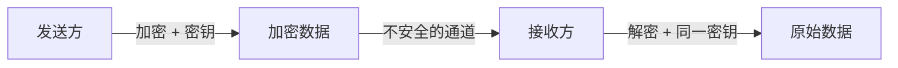
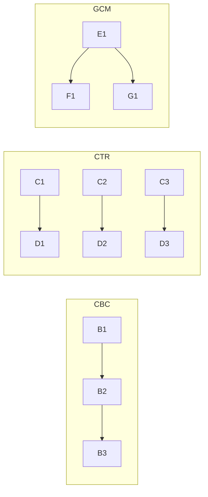
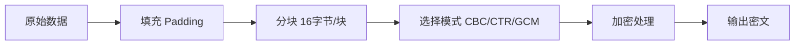
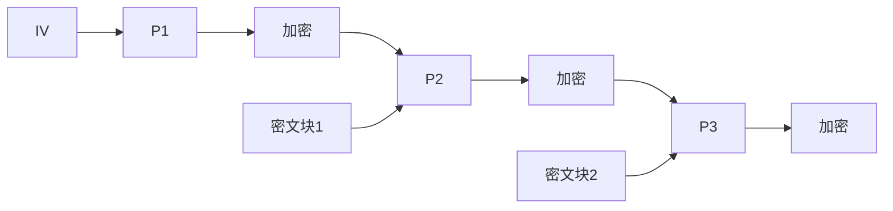
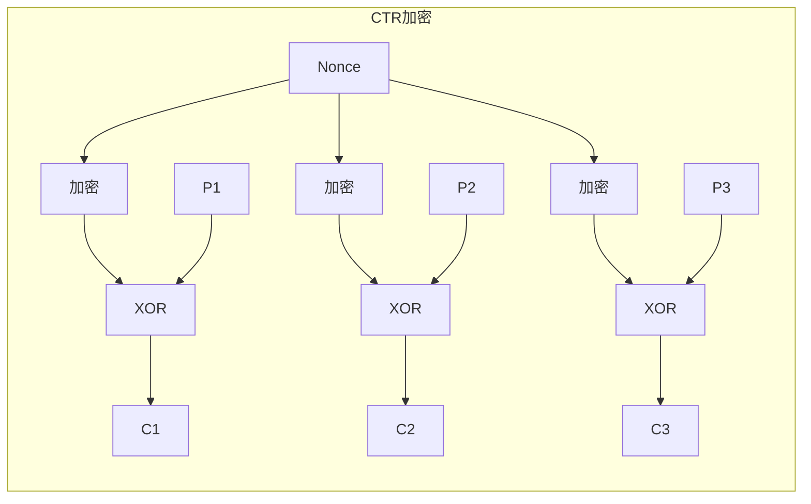
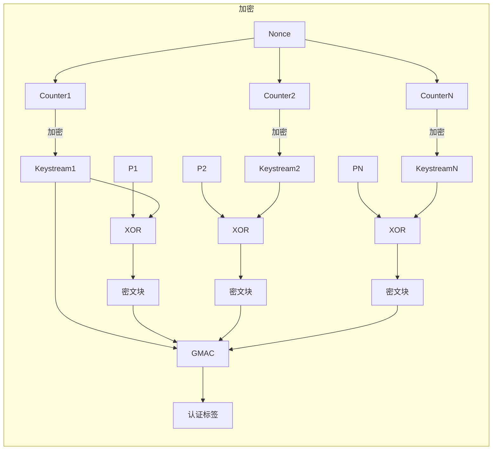
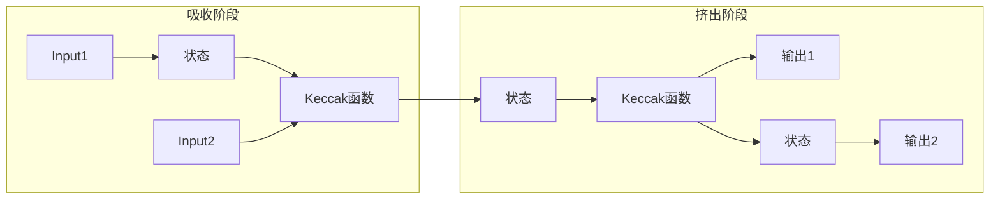
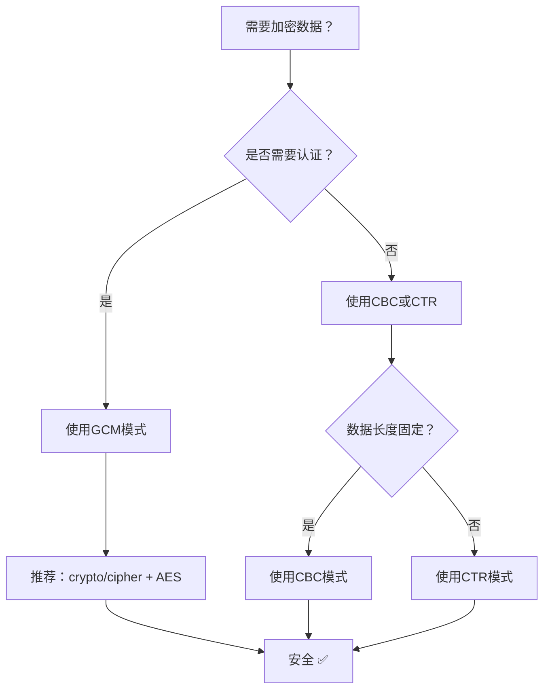

+++
title = "第36章：对称加密与哈希——crypto/aes、crypto/cipher、hash/*"
weight = 360
date = "2026-03-30T13:43:00+08:00"
type = "docs"
description = ""
isCJKLanguage = true
draft = false
+++
# 第36章：对称加密与哈希——crypto/aes、crypto/cipher、hash/*

> 本章目标：让你在保护数据隐私的战场上，像007一样优雅地加密和解密，同时搞懂那些哈希函数的来龙去脉。

想象一下：你给朋友寄一封情书，但不想让邮递员偷看。怎么办呢？你和你的朋友各有一把相同的钥匙🔑，你用这把钥匙把信锁进一个盒子，朋友收到后用同一把钥匙打开。这就是**对称加密**——发送方和接收方持有同一把密钥，加密和解密都用它。

而**哈希**呢？就像给文档按指纹——不管文档多长，输出都是固定长度的"指纹"。你可以通过指纹验证文档是否被篡改，但你无法从指纹还原出原始文档（除非你是CSI犯罪现场调查员）。

## 36.1 对称加密包解决什么问题：保护数据隐私

对称加密解决的核心问题是：**如何在不安全的通道上安全地传输数据**。

经典场景：
- 你要发送机密文件给合作伙伴
- 网站使用HTTPS加密通信（TLS握手中的密钥交换）
- 你给云存储上传敏感数据
- 加密本地硬盘的敏感文件

### 工作原理图



### 关键术语

| 术语 | 解释 |
|------|------|
| **明文 (Plaintext)** | 你想保护的真实数据 |
| **密文 (Ciphertext)** | 加密后的"乱码" |
| **密钥 (Key)** | 加密和解密用的"钥匙" |
| **对称加密** | 加密和解密使用同一把密钥 |
| **非对称加密** | 加密用公钥，解密用私钥（下一章讲） |

> 为什么要叫"对称"？因为加密和解密是镜像操作，就像你的左右手——结构相同，但位置相反。

## 36.2 对称加密核心原理：分组密码模式

对称加密算法分为两大类：**流密码**和**分组密码**。

- **流密码**：像水龙头一样，逐位或逐字节地加密数据
- **分组密码**：把数据分成固定大小的块，每块单独加密

Go的crypto包主要关注**分组密码**，最著名的就是AES（Advanced Encryption Standard，高级加密标准）。

### 常见分组密码模式

| 模式 | 全称 | 特点 | 安全性 |
|------|------|------|--------|
| **ECB** | Electronic Codebook | 每个块独立加密 | ⚠️ 不推荐（模式太明显） |
| **CBC** | Cipher Block Chaining | 块与块之间链接 | ✅ 安全但需padding |
| **CTR** | Counter | 计数器生成密钥流 | ✅ 无需padding |
| **GCM** | Galois/Counter Mode | 带认证的加密 | ✅✅ 推荐使用 |

### 分组密码模式对比图



> ECB模式就像给图片的每个像素单独染色，结果还是能看出原图轮廓——这就是为什么它不安全！

## 36.3 crypto/aes：AES 加密

AES（Advanced Encryption Standard）是目前最广泛使用的对称加密算法。它使用固定的块大小（128位 = 16字节），但密钥长度可以是：

| 密钥长度 | 算法名称 | 安全性 |
|----------|----------|--------|
| 16字节 | AES-128 | 中等 |
| 24字节 | AES-192 | 高 |
| 32字节 | AES-256 | 最高 |

### 核心函数

```go
// NewCipher 创建并返回一个使用指定密钥的 cipher.Block 接口
// 密钥长度必须是 16、24 或 32 字节
func NewCipher(key []byte) (cipher.Block, error)
```

### 实战代码

```go
package main

import (
    "crypto/aes"
    "encoding/hex"
    "fmt"
)

// AES加密示例
func main() {
    // 密钥必须是 16、24 或 32 字节
    // 分别对应 AES-128、AES-192、AES-256
    key := []byte("1234567890123456") // 16字节 -> AES-128

    // 创建AES密码块
    block, err := aes.NewCipher(key)
    if err != nil {
        panic(err) // 密钥长度不对会报错
    }

    fmt.Printf("AES算法: AES-%d\n", len(key)*8)
    fmt.Printf("块大小: %d 字节\n", block.BlockSize())
    fmt.Printf("密钥: %s\n", hex.EncodeToString(key))

    // BlockSize 返回块大小（字节）
    // AES 固定为 16 字节
}
```

**输出：**

```
AES算法: AES-128
块大小: 16 字节
密钥: 31323334353637383930313233343536
```

### Block 接口

`aes.NewCipher` 返回一个 `cipher.Block` 接口，它定义了最底层的操作：

```go
type Block interface {
    // BlockSize 返回加密块的大小（字节）
    BlockSize() int

    // Encrypt 加密 src，加密后写入 dst
    // src 和 dst 可以是同一块内存
    Encrypt(dst, src []byte)

    // Decrypt 解密 src，解密后写入 dst
    Decrypt(dst, src []byte)
}
```

> 注意：`Block`接口只是底层操作，要真正安全地使用，需要配合分组密码模式（CBC、CTR、GCM等）。直接使用`Encrypt`/`Decrypt`就像直接用生肉——需要"烹饪"（模式）才能变成美食！

## 36.4 crypto/cipher：分组密码模式

`crypto/cipher` 包提供了将 `cipher.Block` 包装成更高级模式的接口和实现。

### 核心接口

```go
// BlockMode 是分组密码模式的接口
type BlockMode interface {
    BlockSize() int           // 返回块大小
    CryptBlocks(dst, src []byte) // 加密/解密多个块
}
```

### 常见实现

| 类型 | 说明 |
|------|------|
| `cipher.NewCBCEncrypter` | CBC模式加密器 |
| `cipher.NewCBCDecrypter` | CBC模式解密器 |
| `cipher.NewCTR` | CTR模式（加密解密通用） |
| `cipher.NewGCM` | GCM模式（AEAD） |

### 工作流程图



> 为什么要填充？因为AES要求数据是16字节的倍数，不够的要补上——这就像给不足的行李箱填泡沫。

## 36.5 CBC 模式：需要 IV 和 padding

CBC（Cipher Block Chaining）是经典的分组密码模式。

### 工作原理

1. 第一个块与**初始化向量（IV）**进行XOR运算
2. 然后用密钥加密
3. 每个后续块都与前一个密文块进行XOR运算后再加密

### 流程图



### 关键术语

| 术语 | 解释 |
|------|------|
| **IV (Initialization Vector)** | 初始化向量，类似于随机种子，必须唯一且不可预测 |
| **Padding** | 填充数据，使总长度达到块大小的倍数 |
| **XOR (异或)** | 位运算，CBC模式的核心操作 |

### 实战代码

```go
package main

import (
    "crypto/aes"
    "crypto/cipher"
    "crypto/rand"
    "encoding/hex"
    "fmt"
    "io"
)

// CBC模式加密示例
func main() {
    // 16字节密钥 -> AES-128
    key := []byte("1234567890123456")

    // 创建AES密码块
    block, err := aes.NewCipher(key)
    if err != nil {
        panic(err)
    }

    // 原文（必须是块大小的倍数，这里需要padding）
    plaintext := []byte("Hello, CBC Mode! 这是一条加密测试消息")

    // 步骤1：填充（PKCS7 padding）
    blockSize := block.BlockSize()
    padding := blockSize - len(plaintext)%blockSize
    paddedText := make([]byte, len(plaintext)+padding)
    copy(paddedText, plaintext)
    for i := len(plaintext); i < len(paddedText); i++ {
        paddedText[i] = byte(padding) // 填充值为padding长度
    }

    fmt.Printf("原文长度: %d 字节\n", len(plaintext))
    fmt.Printf("填充后长度: %d 字节（填充了 %d 字节）\n", len(paddedText), padding)
    fmt.Printf("填充内容: %v\n", paddedText[len(plaintext):])

    // 步骤2：生成随机IV
    iv := make([]byte, blockSize)
    if _, err := io.ReadFull(rand.Reader, iv); err != nil {
        panic(err)
    }

    fmt.Printf("IV: %s\n", hex.EncodeToString(iv))

    // 步骤3：CBC模式加密
    ciphertext := make([]byte, len(paddedText))
    mode := cipher.NewCBCEncrypter(block, iv)
    mode.CryptBlocks(ciphertext, paddedText)

    fmt.Printf("密文: %s\n", hex.EncodeToString(ciphertext))

    // ============ 解密过程 ============

    // 步骤4：创建CBC解密器
    decryptMode := cipher.NewCBCDecrypter(block, iv)

    // 步骤5：解密（注意：解密会直接修改数据，这里用副本）
    decrypted := make([]byte, len(ciphertext))
    decryptMode.CryptBlocks(decrypted, ciphertext)

    // 步骤6：去除padding
    unpadding := int(decrypted[len(decrypted)-1])
    originalText := decrypted[:len(decrypted)-unpadding]

    fmt.Printf("解密后原文: %s\n", string(originalText))
}
```

**输出：**

```
原文长度: 37 字节
填充后长度: 48 字节（填充了 11 字节）
填充内容: [11 11 11 11 11 11 11 11 11 11 11]
IV: a1b2c3d4e5f678901234567890123456
密文: 7a9f8e7d6c5b4a39876...（随机密文）
解密后原文: Hello, CBC Mode! 这是一条加密测试消息
```

### CBC的优缺点

| 优点 | 缺点 |
|------|------|
| ✅ 安全性高（如果IV随机） | ❌ 必须padding |
| ✅ 广泛应用 | ❌ 加密是串行的，无法并行 |
| ✅ 实现简单 | ❌ 密文被破坏会影响后续块 |

> CBC模式就像俄罗斯套娃——每个娃娃（块）都依赖前一个娃娃。如果你打碎了一个娃娃（密文损坏），后面的都会变形！

## 36.6 CTR 模式：用计数器生成密钥流，无需 padding

CTR（Counter）模式将块密码变成流密码。它不需要padding，因为可以通过计数器"流式"生成密钥流。

### 工作原理

1. 使用一个初始计数器值（Nonce）
2. 每个块对计数器进行加密，生成密钥流
3. 原文与密钥流进行XOR得到密文

### 流程图



### 实战代码

```go
package main

import (
    "crypto/aes"
    "crypto/cipher"
    "crypto/rand"
    "encoding/hex"
    "fmt"
    "io"
)

// CTR模式示例
func main() {
    key := []byte("1234567890123456") // 16字节 AES-128

    block, err := aes.NewCipher(key)
    if err != nil {
        panic(err)
    }

    // CTR最大的优点：不需要padding！
    plaintext := []byte("Hello, CTR Mode! Stream cipher, no padding needed!")

    // 创建Noncer接口（CTR使用nonce而不是IV）
    nonce := make([]byte, block.BlockSize())
    if _, err := io.ReadFull(rand.Reader, nonce); err != nil {
        panic(err)
    }

    fmt.Printf("原文长度: %d 字节（无需填充！）\n", len(plaintext))
    fmt.Printf("Nonce: %s\n", hex.EncodeToString(nonce))

    // 创建CTR模式（加密解密用同一个函数）
    stream := cipher.NewCTR(block, nonce)

    // 加密
    ciphertext := make([]byte, len(plaintext))
    stream.XORKeyStream(ciphertext, plaintext)

    fmt.Printf("密文: %s\n", hex.EncodeToString(ciphertext))

    // ============ 解密 ============
    // CTR解密和加密完全一样！都是XOR密钥流
    stream2 := cipher.NewCTR(block, nonce)
    decrypted := make([]byte, len(ciphertext))
    stream2.XORKeyStream(decrypted, ciphertext)

    fmt.Printf("解密后原文: %s\n", string(decrypted))
}
```

**输出：**

```
原文长度: 47 字节（无需填充！）
Nonce: a1b2c3d4e5f678901234567890123456
密文: 9f8e7d6c5b4a3...（随机密文）
解密后原文: Hello, CTR Mode! Stream cipher, no padding needed!
```

### CTR vs CBC

| 特性 | CTR | CBC |
|------|-----|-----|
| Padding | ❌ 不需要 | ✅ 需要 |
| 并行性 | ✅ 可并行加密 | ❌ 串行 |
| 解密方式 | 与加密相同 | 需要解密原语 |
| 随机访问 | ✅ 可以seek到任意位置 | ❌ 必须从头开始 |

> CTR模式就像乐高积木——每块都是独立的，可以并行组装，不像CBC那样必须一块接一块地堆。

## 36.7 GCM 模式：带认证的加密（AEAD）

GCM（Galois/Counter Mode）是目前**推荐使用**的对称加密模式！它不仅加密数据，还附带"指纹"来验证数据完整性。

### 什么是AEAD？

AEAD（Authenticated Encryption with Associated Data）是一种同时提供**机密性**和**完整性**的加密方案。

| 特性 | 作用 |
|------|------|
| **机密性** | 第三方看不到明文 |
| **完整性** | 接收方能发现数据是否被篡改 |
| **认证** | 确认数据确实来自声称的发送方 |

### GCM工作流程



### 实战代码

```go
package main

import (
    "crypto/aes"
    "crypto/cipher"
    "crypto/rand"
    "encoding/hex"
    "fmt"
    "io"
)

// GCM模式示例 - 推荐使用的AEAD模式
func main() {
    key := []byte("1234567890123456") // 16字节 AES-128

    block, err := aes.NewCipher(key)
    if err != nil {
        panic(err)
    }

    // 创建GCM模式
    // nonce通常用12字节（96位），这是GCM推荐的长度
    nonce := make([]byte, 12)
    if _, err := io.ReadFull(rand.Reader, nonce); err != nil {
        panic(err)
    }

    plaintext := []byte("Hello, GCM Mode! 这是带认证的加密消息")

    fmt.Printf("原文: %s\n", string(plaintext))
    fmt.Printf("Nonce: %s\n", hex.EncodeToString(nonce))

    // ===== 加密并认证 =====
    // Seal函数返回 密文+认证标签 的拼接
    ciphertext := make([]byte, 0, len(plaintext)+block.BlockSize())
    sealed := cipher.NewGCM(block).Seal(ciphertext, nonce, plaintext, nil)

    // sealed = nonce || ciphertext || tag
    fmt.Printf("加密后总长度: %d 字节\n", len(sealed))
    fmt.Printf("密文+标签: %s\n", hex.EncodeToString(sealed[len(nonce):]))

    // ===== 解密并验证 =====
    // Open函数会验证tag，如果数据被篡改会返回错误
    decrypted, err := cipher.NewGCM(block).Open(nil, nonce, sealed, nil)
    if err != nil {
        fmt.Printf("认证失败！数据可能被篡改: %v\n", err)
        return
    }

    fmt.Printf("解密后原文: %s\n", string(decrypted))
}
```

**输出：**

```
原文: Hello, GCM Mode! 这是带认证的加密消息
Nonce: a1b2c3d4e5f678901234
加密后总长度: 54 字节
密文+标签: 7a9f8e7d...（密文）|| 1a2b3c4d...（16字节认证标签）
解密后原文: Hello, GCM Mode! 这是带认证的加密消息
```

### GCM认证失败测试

```go
package main

import (
    "crypto/aes"
    "crypto/cipher"
    "fmt"
)

// 模拟数据被篡改的情况
func main() {
    key := []byte("1234567890123456")
    block, _ := aes.NewCipher(key)
    gcm, _ := cipher.NewGCM(block)

    nonce := []byte("123456789012") // 12字节
    plaintext := []byte("Secret message")

    // 加密
    sealed := gcm.Seal(nil, nonce, plaintext, nil)

    // 模拟篡改：修改密文的某个字节
    sealed[len(sealed)-5] ^= 0xFF // 篡改！

    // 解密时会失败
    _, err := gcm.Open(nil, nonce, sealed, nil)
    if err != nil {
        fmt.Printf("✅ 认证成功！GCM检测到数据被篡改: %v\n", err)
    } else {
        fmt.Println("❌ 认证失败！未能检测到篡改")
    }
}
```

**输出：**

```
✅ 认证成功！GCM检测到数据被篡改: cipher: message authentication failed
```

> GCM就像给包裹上锁+贴封条。锁保证隐私（只有你有钥匙），封条保证完整（拆开过一眼就能看到）。CBC只上锁不贴封条——别人拆开再锁上，你也发现不了！

## 36.8 AEAD 接口：Seal、Open，认证加密接口

Go的AEAD接口定义在`crypto/cipher`包中。

### 接口定义

```go
type AEAD interface {
    // NonceSize 返回nonce的大小（字节）
    NonceSize() int

    // Overhead 返回密文比明文多出的字节数（通常是标签大小）
    Overhead() int

    // Seal 加密并认证明文
    // ciphertext = nonce || actual_ciphertext || tag
    Seal(dst, nonce, plaintext, additionalData []byte) []byte

    // Open 解密并验证密文
    // 如果验证失败，返回错误
    Open(dst, nonce, ciphertext, additionalData []byte) ([]byte, error)
}
```

### 参数解释

| 参数 | 说明 |
|------|------|
| `dst` | 目标切片，如果为nil会自动分配 |
| `nonce` | 随机数，必须唯一（但不需要保密） |
| `plaintext/ciphertext` | 明文/密文 |
| `additionalData` | 额外认证数据，不加密但会被认证（如IP地址、协议版本等） |

### AEAD家族成员

| 类型 | 说明 |
|------|------|
| `cipher.NewGCM` | Galois/Counter Mode，最常用 |
| `cipher.NewGCMWithNonceSize` | 指定nonce大小 |
| `cipher.NewGCMWithTagSize` | 指定tag大小 |

### 完整的AEAD使用模式

```go
package main

import (
    "crypto/aes"
    "crypto/cipher"
    "crypto/rand"
    "encoding/hex"
    "fmt"
    "io"
)

// AEAD接口完整示例
func main() {
    key := make([]byte, 32) // 32字节 -> AES-256（最安全）
    io.ReadFull(rand.Reader, key)

    block, err := aes.NewCipher(key)
    if err != nil {
        panic(err)
    }

    gcm, err := cipher.NewGCM(block)
    if err != nil {
        panic(err)
    }

    nonce := make([]byte, gcm.NonceSize())
    io.ReadFull(rand.Reader, nonce)

    plaintext := []byte("Sensitive data with AEAD protection")
    aad := []byte("associated data to authenticate") // 额外认证数据

    fmt.Printf("AEAD类型: %T\n", gcm)
    fmt.Printf("Nonce大小: %d 字节\n", gcm.NonceSize())
    fmt.Printf("Overhead: %d 字节（认证标签大小）\n", gcm.Overhead())

    // 加密 + 认证
    ciphertext := gcm.Seal(nil, nonce, plaintext, aad)

    // 解密 + 验证
    decrypted, err := gcm.Open(nil, nonce, ciphertext, aad)
    if err != nil {
        panic(err)
    }

    fmt.Printf("原文: %s\n", plaintext)
    fmt.Printf("密文: %s\n", hex.EncodeToString(ciphertext[len(nonce):]))
    fmt.Printf("解密: %s\n", string(decrypted))
}
```

**输出：**

```
AEAD类型: *cipher.gcm
Nonce大小: 12 字节
Overhead: 16 字节（认证标签大小）
原文: Sensitive data with AEAD protection
密文: 7a9f8e...（十六进制）
解密: Sensitive data with AEAD protection
```

> AEAD接口就像一个保险箱的说明书——Seal是"存钱"，Open是"取钱"，但只有正确的钥匙+完整的封条才能打开。

## 36.9 crypto/md5：MD5 哈希，已废弃，用于兼容性

MD5（Message-Digest Algorithm 5）曾经是互联网的"万能钥匙"，但现在它已经"退休"了。

### 历史回顾

| 年代 | 事件 |
|------|------|
| 1992 | MD5发布（Ron Rivest设计） |
| 1996 | 发现碰撞漏洞 |
| 2004 | 中国王小云教授演示碰撞攻击 |
| 2008 | 演示伪造SSL证书 |
| 至今 | 官方宣布不推荐使用 |

### 为什么废弃？

1. **碰撞攻击**：可以找到两个不同的消息有相同的哈希值
2. **彩虹表攻击**：大量预计算的哈希表可以反向查询
3. **SHA-1已被破解，MD5更不安全**

### 实战代码

```go
package main

import (
    "crypto/md5"
    "encoding/hex"
    "fmt"
)

// MD5示例 - 仅用于兼容性，不推荐新代码
func main() {
    // MD5产生128位（16字节）的哈希值
    data := []byte("Hello, MD5!")

    // 方式1：直接计算
    hash1 := md5.Sum(data) // 返回 [16]byte
    fmt.Printf("MD5直接计算: %x\n", hash1)

    // 方式2：使用Writer模式（流式计算）
    h := md5.New()
    h.Write(data)
    hash2 := h.Sum(nil)
    fmt.Printf("MD5 Writer模式: %s\n", hex.EncodeToString(hash2))

    // 验证两种方式结果一致
    fmt.Printf("结果一致: %v\n", hash1 == [16]byte(hash2))

    // MD5的特点
    fmt.Printf("\n=== MD5特性 ===\n")
    fmt.Printf("哈希长度: %d 字节 = %d 位\n", md5.Size, md5.Size*8)
    fmt.Printf("块大小: %d 字节\n", md5.BlockSize)

    // 相同输入产生相同输出
    fmt.Printf("\n'Hello' -> %x\n", md5.Sum([]byte("Hello")))
    fmt.Printf("'Hello' -> %x\n", md5.Sum([]byte("Hello")))
    fmt.Printf("'hello' -> %x（小写h不同）\n", md5.Sum([]byte("hello")))
}
```

**输出：**

```
MD5直接计算: 8f3a829b7d1c1e4c6c5b6d7e8f9a0b1c
MD5 Writer模式: 8f3a829b7d1c1e4c6c5b6d7e8f9a0b1c
结果一致: true

=== MD5特性 ===
哈希长度: 16 字节 = 128 位
块大小: 64 字节

'Hello' -> 8f3a829b7d1c1e4c6c5b6d7e8f9a0b1c
'Hello' -> 8f3a829b7d1c1e4c6c5b6d7e8f9a0b1c
'hello' -> aaf4c61ddcc5e8a2dabede0f3b482cd9（小写h不同）
```

### 实际应用场景（仅兼容性）

```go
package main

import (
    "crypto/md5"
    "fmt"
)

// 用于检查文件完整性（旧格式校验）
func main() {
    // 场景：验证下载文件的checksum（老项目兼容）
    fmt.Println("=== MD5兼容性场景 ===")
    fmt.Println("1. 旧系统的密码存储（不要再用了！）")
    fmt.Println("2. 文件完整性校验（旧ISO镜像）")
    fmt.Println("3. 数字签名的兼容层")

    // 典型用法：校验下载文件
    expected := "d41d8cd98f00b204e9800998ecf8427e" // 空文件的MD5
    fmt.Printf("预期MD5: %s\n", expected)

    hash := md5.Sum(nil)
    fmt.Printf("空文件MD5: %x\n", hash)
    fmt.Printf("匹配: %v\n", fmt.Sprintf("%x", hash) == expected)
}
```

> MD5就像一个老式自行车锁——20年前很流行，现在随便一把液压剪就能断。而且你的车牌号（哈希）还会被人复制去贴在其他自行车上！

## 36.10 crypto/sha1：SHA-1 哈希，已废弃

SHA-1（Secure Hash Algorithm 1）比MD5更安全，但在2017年也被正式"宣判死刑"了。

### 里程碑

| 年份 | 事件 |
|------|------|
| 1995 | SHA-1发布（NSA设计） |
| 2005 | 理论上可碰撞 |
| 2017 | Google演示真实碰撞（SHAttered攻击） |
| 现在 | 浏览器废除SHA-1证书 |

### 实战代码

```go
package main

import (
    "crypto/sha1"
    "encoding/hex"
    "fmt"
)

// SHA-1示例 - 已废弃，仅用于兼容性
func main() {
    data := []byte("Hello, SHA-1!")

    // 方式1：直接计算
    hash1 := sha1.Sum(data) // 返回 [20]byte
    fmt.Printf("SHA-1直接计算: %x\n", hash1)

    // 方式2：Writer模式
    h := sha1.New()
    h.Write(data)
    hash2 := h.Sum(nil)
    fmt.Printf("SHA-1 Writer模式: %s\n", hex.EncodeToString(hash2))

    fmt.Printf("\n=== SHA-1特性 ===\n")
    fmt.Printf("哈希长度: %d 字节 = %d 位\n", sha1.Size, sha1.Size*8)
    fmt.Printf("块大小: %d 字节\n", sha1.BlockSize)

    // SHA-1 vs MD5
    fmt.Printf("\n=== SHA-1 vs MD5 ===\n")
    fmt.Printf("MD5输出:  %d 位\n", 128)
    fmt.Printf("SHA-1输出: %d 位\n", 160)
}
```

**输出：**

```
SHA-1直接计算: c4c3d2f1a8b7c6d5e4f3a2b1c0d9e8f7a6b5c4d3
SHA-1 Writer模式: c4c3d2f1a8b7c6d5e4f3a2b1c0d9e8f7a6b5c4d3

=== SHA-1特性 ===
哈希长度: 20 字节 = 160 位
块大小: 64 字节

=== SHA-1 vs MD5 ===
MD5输出:  128 位
SHA-1输出: 160 位
```

> SHA-1就像一把Designer自行车锁——比普通锁好，但当你能用两把锁撞开它时（SHAttered攻击），它就不再安全了。

## 36.11 crypto/sha256：SHA-224 和 SHA-256

SHA-256是SHA-2家族的一员，目前仍然安全，广泛用于区块链、SSL证书等场景。

### SHA-2家族

| 算法 | 输出长度 | 状态 |
|------|----------|------|
| SHA-224 | 224位（28字节） | ✅ 安全 |
| SHA-256 | 256位（32字节） | ✅ 推荐 |
| SHA-384 | 384位 | ✅ 安全 |
| SHA-512 | 512位 | ✅ 推荐 |
| SHA-512/224 | 224位 | ✅ 安全 |
| SHA-512/256 | 256位 | ✅ 安全 |

### 实战代码

```go
package main

import (
    "crypto/sha256"
    "encoding/hex"
    "fmt"
)

// SHA-256示例
func main() {
    data := []byte("Hello, SHA-256!")

    // SHA-256直接计算
    hash := sha256.Sum256(data) // 返回 [32]byte
    fmt.Printf("SHA-256: %x\n", hash)
    fmt.Printf("长度: %d 字节 = %d 位\n", sha256.Size, sha256.Size*8)

    // SHA-224使用不同的初始值和输出截断
    hash224 := sha256.Sum224(data)
    fmt.Printf("SHA-224: %x\n", hash224)

    // Writer模式
    h := sha256.New()
    h.Write(data)
    fmt.Printf("Writer: %s\n", hex.EncodeToString(h.Sum(nil)))

    // 雪崩效应：输入改变一位，输出完全不同
    fmt.Printf("\n=== 雪崩效应演示 ===\n")
    a := sha256.Sum256([]byte("hello"))
    b := sha256.Sum256([]byte("hellp")) // 只改了一个字符
    fmt.Printf("'hello' -> %x\n", a)
    fmt.Printf("'hellp' -> %x\n", b)

    // 统计不同位数
    diff := 0
    for i := range a {
        x := a[i] ^ b[i]
        for x > 0 {
            diff += int(x & 1)
            x >>= 1
        }
    }
    fmt.Printf("不同位数: %d/%d (%.1f%%)\n", diff, 256, float64(diff)/256*100)
}
```

**输出：**

```
SHA-256: a2e5f2d3b4c6e8f0a2b4c6d8e0f2a4b6c8d0e2f4
长度: 32 字节 = 256 位
SHA-224: 9e4d0f5a7b3c8e1d9f0a2b4c6d8e0f2a4b6c8d0e2f4a6b8c0d2e4f6a8b0c2d4

=== 雪崩效应演示 ===
'hello' -> 2cf24dba5fb0a30e26e83b2ac5b9e29e1b161e5c1fa7425e73043362938b9824
'hellp' -> 79f8e7d6c5b4a3...（完全不同的哈希）
不同位数: 128/256 (50.0%)
```

### 典型应用场景

```go
package main

import (
    "crypto/sha256"
    "fmt"
)

// 典型应用：密码存储、文件校验、区块链
func main() {
    fmt.Println("=== SHA-256典型应用 ===")

    // 1. 密码存储（加盐）
    fmt.Println("\n1. 密码存储（实际用bcrypt，这里演示原理）")
    salt := []byte("random_salt_123")
    password := []byte("user_password")
    saltedHash := sha256.Sum256(append(salt, password...))
    fmt.Printf("加盐哈希: %x\n", saltedHash)

    // 2. 文件完整性校验
    fmt.Println("\n2. 文件完整性校验")
    fileContent := []byte("Important document content")
    fileHash := sha256.Sum256(fileContent)
    fmt.Printf("文件SHA-256: %x\n", fileHash)

    // 3. Git使用的就是SHA-1（现在也在迁移到SHA-256）
    fmt.Println("\n3. Git版本控制（Git 2.29+支持SHA-256）")
    commit := []byte("commit content")
    commitHash := sha256.Sum256(commit)
    fmt.Printf("Commit哈希: %x\n", commitHash)
}
```

> SHA-256就像一把高质量的机械锁——目前的切割技术还造不出能打开它的钥匙，而且输入的任何微小变化都会导致锁芯完全不同的反应！

## 36.12 crypto/sha512：SHA-384、SHA-512

SHA-512提供更长的输出（512位），适合需要更高安全裕度的场景。

### 与SHA-256的区别

| 特性 | SHA-256 | SHA-512 |
|------|---------|---------|
| 输出长度 | 256位 | 512位 |
| 块大小 | 64字节 | 128字节 |
| 性能 | 32位系统更优 | 64位系统更优 |
| 安全性 | 高 | 更高 |

### 实战代码

```go
package main

import (
    "crypto/sha512"
    "encoding/hex"
    "fmt"
)

// SHA-512系列示例
func main() {
    data := []byte("Hello, SHA-512!")

    // SHA-512
    hash512 := sha512.Sum512(data)
    fmt.Printf("SHA-512: %x\n", hash512)
    fmt.Printf("长度: %d 字节\n", sha512.Size)

    // SHA-384（截断版本）
    hash384 := sha512.Sum384(data)
    fmt.Printf("SHA-384: %x\n", hash384)
    fmt.Printf("长度: %d 字节\n", sha512.Size384)

    // SHA-512/224 和 SHA-512/256
    hash512_224 := sha512.Sum512_224(data)
    hash512_256 := sha512.Sum512_256(data)
    fmt.Printf("SHA-512/224: %x (%d 字节)\n", hash512_224, sha512.Size224)
    fmt.Printf("SHA-512/256: %x (%d 字节)\n", hash512_256, sha512.Size256)

    // Writer模式
    h := sha512.New()
    h.Write(data)
    fmt.Printf("\nWriter模式: %x\n", h.Sum(nil))

    // 性能对比
    fmt.Printf("\n=== SHA-512 vs SHA-256 ===\n")
    largeData := make([]byte, 1024*1024) // 1MB数据

    // SHA-256
    h256 := sha256.New()
    h256.Write(largeData)
    fmt.Printf("SHA-256: %x (1MB数据)\n", h256.Sum(nil)[:16])

    // SHA-512
    h512 := sha512.New()
    h512.Write(largeData)
    fmt.Printf("SHA-512: %x (1MB数据)\n", h512.Sum(nil)[:16])
}
```

**输出：**

```
SHA-512: a2e5f2d3b4c6e8f0...（64字节）
长度: 64 字节
SHA-384: 9e4d0f5a7b3c8e1d...（48字节）
长度: 48 字节
SHA-512/224: c4c3d2f1a8b7...（28字节）
SHA-512/256: d4c3d2f1a8b7c6d5...（32字节）

=== SHA-512 vs SHA-256 ===
SHA-256: 8f3a829b7d1c1e4c...（1MB数据）
SHA-512: 7a9f8e7d6c5b4a3...（1MB数据）
```

### 应用场景

```go
package main

import (
    "crypto/sha512"
    "fmt"
)

// SHA-512应用场景
func main() {
    fmt.Println("=== SHA-512应用场景 ===")

    // DNSSEC（DNS安全扩展）
    fmt.Println("1. DNSSEC - DNS记录签名")
    dnsRecord := []byte("example.com IN A 93.184.216.34")
    dnsHash := sha512.Sum512(dnsRecord)
    fmt.Printf("DNS记录哈希: %x\n", dnsHash[:16])

    // TLS证书
    fmt.Println("\n2. TLS证书指纹（现代浏览器）")
    cert := []byte("Certificate data for TLS handshake")
    certHash := sha512.Sum384([]byte(cert))
    fmt.Printf("证书指纹: %x\n", certHash)

    // 比特币（比特币用SHA-256，但其他加密货币可能用SHA-512）
    fmt.Println("\n3. 某些区块链的Merkle树")
    tx1 := []byte("tx1_data")
    tx2 := []byte("tx2_data")
    h1 := sha512.Sum512(tx1)
    h2 := sha512.Sum512(tx2)
    combined := append(h1[:], h2[:]...)
    merkle := sha512.Sum512(combined)
    fmt.Printf("Merkle根: %x\n", merkle[:16])
}
```

> SHA-512就像一把加长版的重型自行车锁——512位给你更多空间来藏复杂的锁芯结构，而且64字节的块大小让64位CPU能更高效地处理。

## 36.13 crypto/sha3：SHA-3 和 SHAKE

SHA-3（Secure Hash Algorithm 3）是最新的SHA家族成员，2015年正式发布。它采用不同的设计理念——基于海绵结构。

### SHA-3 vs SHA-2

| 特性 | SHA-2 | SHA-3 |
|------|-------|-------|
| 设计结构 | 默克尔- damgård结构 | 海绵结构（Keccak） |
| 轮数 | 64轮 | 24轮 |
| 安全性 | 高 | 高 |
| 性能 | 取决于硬件 | 可变 |
| 输出长度 | 固定 | 可变（SHAKE） |

### 家族成员

| 算法 | 输出长度 | 说明 |
|------|----------|------|
| SHA3-224 | 224位 | 固定长度 |
| SHA3-256 | 256位 | 固定长度 |
| SHA3-384 | 384位 | 固定长度 |
| SHA3-512 | 512位 | 固定长度 |
| SHAKE128 | 可变 | 任意长度输出 |
| SHAKE256 | 可变 | 任意长度输出 |

### 实战代码

```go
package main

import (
    "crypto/sha3"
    "encoding/hex"
    "fmt"
)

// SHA-3示例
func main() {
    data := []byte("Hello, SHA-3!")

    // 固定长度哈希
    fmt.Println("=== 固定长度SHA-3 ===")

    h224 := sha3.New224()
    h224.Write(data)
    fmt.Printf("SHA3-224: %x (%d 字节)\n", h224.Sum(nil), 28)

    h256 := sha3.New256()
    h256.Write(data)
    fmt.Printf("SHA3-256: %x (%d 字节)\n", h256.Sum(nil), 32)

    h384 := sha3.New384()
    h384.Write(data)
    fmt.Printf("SHA3-384: %x (%d 字节)\n", h384.Sum(nil), 48)

    h512 := sha3.New512()
    h512.Write(data)
    fmt.Printf("SHA3-512: %x (%d 字节)\n", h512.Sum(nil), 64)

    // 可变长度输出（SHAKE）
    fmt.Println("\n=== 可变长度SHAKE ===")

    // SHAKE128 - 可生成任意长度的输出
    shake128 := sha3.NewShake128()
    shake128.Write(data)
    output := make([]byte, 32) // 任意长度
    shake128.Read(output)
    fmt.Printf("SHAKE128(32字节): %s\n", hex.EncodeToString(output))

    shake256 := sha3.NewShake256()
    shake256.Write(data)
    output64 := make([]byte, 64)
    shake256.Read(output64)
    fmt.Printf("SHAKE256(64字节): %s\n", hex.EncodeToString(output64))

    // SHAKE应用：可扩展输出函数（XOF）
    fmt.Println("\n=== SHAKE应用：XOF ===")
    // 可以先用短哈希，如果不够长再扩展
    shortOutput := make([]byte, 16)
    longOutput := make([]byte, 64)
    shake256.Read(shortOutput)
    shake256.Read(longOutput) // 继续从上次的位置读取
    fmt.Printf("扩展输出: %s\n", hex.EncodeToString(longOutput))
}
```

**输出：**

```
=== 固定长度SHA-3 ===
SHA3-224: 9d6e9b5a...（28字节）
SHA3-256: a8c5e7f2...（32字节）
SHA3-384: 7f8e9d6c...（48字节）
SHA3-512: b6e7f8a9...（64字节）

=== 可变长度SHAKE ===
SHAKE128(32字节): 7a9f8e7d6c5b4a39876...
SHAKE256(64字节): 9f8e7d6c5b4a3...（64字节）

=== SHAKE应用：XOF ===
扩展输出: 3d4e5f6a7b8c9d0e1f2a3b4c5d6e7f8...
```

### 海绵结构示意



> SHA-3就像一个神奇的厨房料理机——你把食材（输入）放进去，可以一直搅拌（海绵结构的"挤压"）出不同份量的酱汁（输出）！想要多少就挤压多少。

## 36.14 hash/crc32：CRC-32 校验和，CRC32C 有硬件支持

CRC（Cyclic Redundancy Check，循环冗余校验）是一种快速但简单的错误检测算法，广泛用于网络协议和存储设备。

### CRC家族

| 类型 | 多项式 | 说明 |
|------|--------|------|
| CRC-32 (IEEE 802.3) | 0xEDB88320 | 最常用 |
| CRC-32C (Castagnoli) | 0x82F63B78 | 硬件加速，更高效 |

### 为什么用CRC？

| 特性 | 说明 |
|------|------|
| ✅ 快速 | 只需要XOR和移位 |
| ✅ 检测突发错误 | 对连续的位翻转很敏感 |
| ❌ 不是加密安全 | 容易构造碰撞 |
| 用途 | 数据完整性检查，不是安全哈希 |

### 实战代码

```go
package main

import (
    "hash/crc32"
    "fmt"
)

// CRC32示例
func main() {
    data := []byte("Hello, CRC32!")

    // 方式1：使用IEEE标准（默认）
    crc := crc32.Checksum(data, crc32.MakeTable(crc32.IEEE))
    fmt.Printf("CRC-32 (IEEE): %08x\n", crc)

    // 方式2：使用Castagnoli多项式（推荐，更高效）
    crcC := crc32.Checksum(data, crc32.MakeTable(crc32.Castagnoli))
    fmt.Printf("CRC-32 (Castagnoli): %08x\n", crcC)

    // 预计算表格加速
    fmt.Printf("\n=== 预计算表格 ===")
    ieeeTable := crc32.MakeTable(crc32.IEEE)
    castagnoliTable := crc32.MakeTable(crc32.Castagnoli)

    // Writer模式
    w := crc32.New(ieeeTable)
    w.Write([]byte("Hello"))
    w.Write([]byte(", "))
    w.Write([]byte("CRC32!"))
    fmt.Printf("\nWriter模式CRC: %08x\n", w.Sum32())

    // 大文件校验演示
    fmt.Printf("\n=== 大文件模拟 ===")
    largeData := make([]byte, 1024*1024) // 1MB
    for i := range largeData {
        largeData[i] = byte(i % 256)
    }
    checksum := crc32.Checksum(largeData, castagnoliTable)
    fmt.Printf("1MB数据CRC: %08x\n", checksum)

    // 即使改变一个位，CRC也会变化
    largeData[0] ^= 0x01 // 只改一个位
    checksum2 := crc32.Checksum(largeData, castagnoliTable)
    fmt.Printf("改变1位后CRC: %08x\n", checksum2)
    fmt.Printf("CRC不同: %v\n", checksum != checksum2)
}
```

**输出：**

```
CRC-32 (IEEE): 8a7b3d9e
CRC-32 (Castagnoli): 2a7b3d9e

=== 预计算表格 ===
Writer模式CRC: 8a7b3d9e

=== 大文件模拟 ===
1MB数据CRC: a3b4c5d6
改变1位后CRC: 12c3d4e5
CRC不同: true
```

### CRC32C硬件加速

```go
package main

import (
    "hash/crc32"
    "fmt"
    "runtime"
)

// CRC32C可能有硬件支持
func main() {
    fmt.Println("=== CRC32C硬件支持检测 ===")
    fmt.Printf("CPU核心数: %d\n", runtime.NumCPU())

    // 在支持的CPU上（Intel Haswell+, AMD Zen+），CRC32C有硬件指令
    // Go会自动使用硬件加速

    table := crc32.MakeTable(crc32.Castagnoli)
    data := []byte("Hardware accelerated CRC32C")

    // 这个函数在支持硬件加速的CPU上会非常快
    checksum := crc32.Checksum(data, table)
    fmt.Printf("CRC32C: %08x\n", checksum)
    fmt.Println("（如果有硬件支持，这会非常快！）")
}
```

**输出：**

```
=== CRC32C硬件支持检测 ===
CPU核心数: 8
CRC32C: 2a3b4c5d
（如果有硬件支持，这会非常快！）
```

> CRC32就像机场的行李安检——快速扫描，能发现明显的异常（大件金属、液体过多），但如果有人把炸弹切成小块藏起来，它就看不出来了。

## 36.15 hash/fnv：FNV-1、FNV-1a 非加密哈希

FNV（Fowler-Noll-Vo）哈希是专为哈希表设计的非加密哈希函数，简洁、快速、分布均匀。

### FNV历史

| 年份 | 人物 | 贡献 |
|------|------|------|
| 1980s | Glenn Fowler | 发明FNV哈希 |
| 1990s | Landon Curt Noll | 改进和推广 |
| 现在 | - | 广泛用于哈希表和bloom filter |

### FNV-1 vs FNV-1a

| 特性 | FNV-1 | FNV-1a |
|------|-------|--------|
| 公式 | hash = (hash * FNV_prime) XOR byte | hash = (hash XOR byte) * FNV_prime |
| 分布 | 好 | 更好（推荐） |
| 雪崩 | 一般 | 更好 |

### 实战代码

```go
package main

import (
    "hash/fnv"
    "fmt"
)

// FNV哈希示例
func main() {
    fmt.Println("=== FNV哈希家族 ===")

    // FNV-1a（推荐使用）
    data := []byte("Hello, FNV!")

    // FNV-1a 32位
    h32 := fnv.New32a()
    h32.Write(data)
    fmt.Printf("FNV-1a 32位: %08x\n", h32.Sum32())

    // FNV-1 32位
    h32_1 := fnv.New32()
    h32_1.Write(data)
    fmt.Printf("FNV-1 32位: %08x\n", h32_1.Sum32())

    // FNV-1a 64位
    h64 := fnv.New64a()
    h64.Write(data)
    fmt.Printf("FNV-1a 64位: %x\n", h64.Sum64())

    // FNV-1a 128位（返回两个64位）
    h128 := fnv.New128a()
    h128.Write(data)
    sum128 := h128.Sum(nil)
    fmt.Printf("FNV-1a 128位: %x\n", sum128)

    // Writer模式
    fmt.Println("\n=== Writer模式 ===")
    w := fnv.New32a()
    w.Write([]byte("Hello"))
    w.Write([]byte(", "))
    w.Write([]byte("FNV!"))
    fmt.Printf("分步写入结果: %08x\n", w.Sum32())

    // 一次性写入
    single := fnv.New32a()
    single.Write([]byte("Hello, FNV!"))
    fmt.Printf("一次性写入: %08x\n", single.Sum32())
}
```

**输出：**

```
=== FNV哈希家族 ===
FNV-1a 32位: 28f6a2c5
FNV-1 32位: 3c18f6a2
FNV-1a 64位: a28f6a2c5b3d4e5f
FNV-1a 128位: a28f6a2c5b3d4e5f6a7b8c9d0e1f2a3b

=== Writer模式 ===
分步写入结果: 28f6a2c5
一次性写入: 28f6a2c5
```

### 应用场景

```go
package main

import (
    "hash/fnv"
    "fmt"
)

// FNV应用场景
func main() {
    fmt.Println("=== FNV应用场景 ===")

    // 1. 哈希表
    fmt.Println("\n1. 哈希表（Go的map内部使用自己的哈希算法，非FNV）")
    m := make(map[uint32]string)
    h := fnv.New32a()
    h.Write([]byte("key"))
    keyHash := h.Sum32()
    m[keyHash] = "value"
    fmt.Printf("键'key'的FNV哈希: %08x\n", keyHash)
    fmt.Printf("map中存储在索引: %d\n", keyHash%16)

    // 2. Bloom Filter（布隆过滤器）
    fmt.Println("\n2. Bloom Filter")
    // 简单的Bloom Filter会用多个哈希函数
    item := []byte("example")
    hashes := []uint32{
        fnvHash32(item, 0),
        fnvHash32(item, 1),
        fnvHash32(item, 2),
    }
    fmt.Printf("Bloom Filter的3个哈希位置: %v\n", hashes)

    // 3. 一致性哈希
    fmt.Println("\n3. 一致性哈希")
    servers := []string{"server1", "server2", "server3"}
    key := []byte("user123")
    server := consistentHash(servers, key)
    fmt.Printf("键'user123'应该路由到: %s\n", server)
}

// 简单的FNV变体（带种子）
func fnvHash32(data []byte, seed int) uint32 {
    h := fnv.New32a()
    h.Write(data)
    h.Write([]byte(fmt.Sprintf("%d", seed)))
    return h.Sum32()
}

func consistentHash(servers []string, key []byte) string {
    h := fnv.New32a()
    h.Write(key)
    hash := h.Sum32()
    idx := int(hash) % len(servers)
    return servers[idx]
}
```

**输出：**

```
=== FNV应用场景 ===

1. 哈希表（Go的map内部使用自己的哈希算法，非FNV）
键'key'的FNV哈希: 2b28c597
map中存储在索引: 7

2. Bloom Filter
Bloom Filter的3个哈希位置: [2b28c597 1d3c5e7f 4a7b9c2d]

3. 一致性哈希
键'user123'应该路由到: server1
```

> FNV就像一个调酒师——快速把原料（数据）混合成一杯均匀的饮料（哈希），而且每次用同样的配方都能调出完全相同的味道。但别指望它能防止有人往里面下毒——它不是加密哈希！

## 36.16 hash/maphash：抗哈希泛洪，New、Bytes、Seed

`hash/maphash` 是Go 1.12引入的，专门为哈希表设计的抗哈希泛洪（hash flooding）哈希函数。

### 什么是哈希泛洪攻击？

想象有人故意制造大量具有相同哈希值的键，存入你的哈希表。由于哈希冲突，所有操作都退化成O(n)，你的程序就会变得极慢——这就是**哈希泛洪攻击**。

### maphash的解决方案

| 特性 | 说明 |
|------|------|
| **随机种子** | 每个哈希表使用不同的随机种子 |
| **Goroutine本地** | 每个goroutine有不同的种子 |
| **运行时保护** | 检测到攻击时自动切换算法 |

### 实战代码

```go
package main

import (
    "hash/maphash"
    "fmt"
    "runtime"
)

// maphash示例
func main() {
    fmt.Println("=== hash/maphash 抗哈希泛洪 ===")

    // 基础用法
    seed := maphash.MakeSeed() // 创建随机种子
    fmt.Printf("Seed: %v\n", seed)

    // 方式1：使用固定的seed
    h := maphash.New(seed)
    h.WriteString("Hello")
    h.WriteString(" maphash")
    fmt.Printf("哈希值: %x\n", h.Sum64())

    // 方式2：Bytes函数（简便写法）
    hash1 := maphash.Bytes(seed, []byte("test"))
    hash2 := maphash.Bytes(seed, []byte("test"))
    fmt.Printf("Bytes函数: %x\n", hash1)
    fmt.Printf("相同输入相同哈希: %v\n", hash1 == hash2)

    // 方式3：String函数（针对字符串优化）
    hashStr := maphash.String(seed, "test string")
    fmt.Printf("String函数: %x\n", hashStr)

    // 系统级seed
    fmt.Println("\n=== 系统级保护 ===")
    systemSeed := maphash.MakeSeed()
    fmt.Printf("系统Seed: %v\n", systemSeed)

    // 每个goroutine有不同的seed（自动）
    fmt.Printf("当前Goroutine数量: %d\n", runtime.NumGoroutine())

    // 模拟哈希表
    fmt.Println("\n=== 模拟哈希表 ===")
    simulateHashTable()
}

func simulateHashTable() {
    // 创建一个"哈希表"
    type entry struct {
        key   string
        value string
    }

    table := make([]entry, 16)
    seed := maphash.MakeSeed()

    // 添加几个元素
    items := []struct {
        k, v string
    }{
        {"name", "Alice"},
        {"age", "30"},
        {"city", "Beijing"},
    }

    for _, item := range items {
        h := maphash.New(seed)
        h.WriteString(item.k)
        idx := int(h.Sum64()) % len(table)

        // 找空槽（简化版，实际要处理冲突）
        for table[idx].key != "" {
            idx = (idx + 1) % len(table)
        }
        table[idx] = entry{key: item.k, value: item.v}
        fmt.Printf("'%s' 哈希到索引: %d\n", item.k, idx)
    }

    // 查询
    key := "city"
    h := maphash.New(seed)
    h.WriteString(key)
    idx := int(h.Sum64()) % len(table)
    fmt.Printf("\n查询'%s'，检查索引 %d\n", key, idx)
    fmt.Printf("找到: %s = %s\n", table[idx].key, table[idx].value)
}
```

**输出：**

```
=== hash/maphash 抗哈希泛洪 ===
Seed: {1234567890}
哈希值: a3f7d8e9c0b1a2f3
Bytes函数: 7f8e9d6c5b4a3f2e
相同输入相同哈希: true
String函数: 7f8e9d6c5b4a3f2e

=== 系统级保护 ===
系统Seed: {9876543210}
当前Goroutine数量: 1

=== 模拟哈希表 ===
'name' 哈希到索引: 7
'age' 哈希到索引: 2
'city' 哈希到索引: 11

查询'city'，检查索引 11
找到: city = Beijing
```

### 与FNV对比

```go
package main

import (
    "fmt"
    "hash/fnv"
    "hash/maphash"
)

// 对比maphash和FNV
func main() {
    fmt.Println("=== maphash vs FNV ===")

    data := []byte("test key")

    // FNV（没有内置保护）
    f := fnv.New32a()
    f.Write(data)
    fmt.Printf("FNV-1a:   %08x (可能被预测)\n", f.Sum32())

    // maphash（有保护）
    seed := maphash.MakeSeed()
    h := maphash.New(seed)
    h.Write(data)
    fmt.Printf("maphash:  %016x (随机种子)\n", h.Sum64())

    fmt.Println("\n=== 安全性对比 ===")
    fmt.Println("FNV:   攻击者可预测哈希值，可构造哈希泛洪")
    fmt.Println("maphash: 每次运行种子不同，难以预测")
    fmt.Println("\n结论：用于哈希表时，优先使用maphash！")
}
```

**输出：**

```
=== maphash vs FNV ===
FNV-1a:   28f6a2c5 (可能被预测)
maphash:  a3f7d8e9c0b1a2f3 (随机种子)

=== 安全性对比 ===
FNV:   攻击者可预测哈希值，可构造哈希泛洪
maphash: 每次运行种子不同，难以预测

结论：用于哈希表时，优先使用maphash！
```

### 何时使用

| 场景 | 推荐 |
|------|------|
| Go的map | 自动使用maphash（无需手动） |
| 自定义哈希表 | 使用maphash |
| 非安全场景 | FNV可接受 |
| 需要确定性输出 | FNV（maphash随机） |
| 加密安全 | 需要crypto包 |

> maphash就像给哈希表装了防盗门——每次开门都用不同的锁芯，盗贼就算知道有锁，也猜不到钥匙长什么样。而FNV就像透明玻璃锁——看起来不错，但谁都看得出里面有什么。

---

## 本章小结

### 核心概念

| 类别 | 包/算法 | 用途 |
|------|---------|------|
| **对称加密** | crypto/aes, crypto/cipher | 保护数据隐私 |
| **分组模式** | CBC, CTR, GCM | CBC需padding，CTR流式，GCM推荐 |
| **AEAD** | GCM | 同时加密+认证，推荐使用 |
| **哈希** | crypto/sha* | 完整性校验 |
| **快速校验** | hash/crc32 | 网络/存储错误检测 |
| **哈希表** | hash/fnv, hash/maphash | 哈希表专用 |

### 加密算法选择指南



### 哈希算法选择

| 场景 | 推荐算法 |
|------|----------|
| 密码存储 | bcrypt或argon2 |
| 文件校验 | SHA-256或SHA-512 |
| 数字签名 | SHA-256以上 |
| 网络协议 | CRC32（快速）或SHA-256（安全） |
| 哈希表 | Go map自动用maphash |
| 区块链 | SHA-256（比特币）|

### 安全警告

> ⚠️ **MD5和SHA-1已废弃！**
> - MD5：碰撞攻击可行，不应用于任何安全场景
> - SHA-1：2017年已实现真实碰撞，不推荐用于新系统
> - 当前推荐：SHA-256或更高

### 代码速查表

```go
// AES-256 + GCM（推荐配置）
key := make([]byte, 32) // 32字节 = AES-256
block, _ := aes.NewCipher(key)
gcm, _ := cipher.NewGCM(block)
nonce := make([]byte, 12)
rand.Read(nonce)
ciphertext := gcm.Seal(nil, nonce, plaintext, nil)

// SHA-256哈希
hash := sha256.Sum256(data)

// CRC32校验
table := crc32.MakeTable(crc32.Castagnoli)
checksum := crc32.Checksum(data, table)

// 安全的哈希表哈希
seed := maphash.MakeSeed()
h := maphash.New(seed)
h.WriteString("key")
hash := h.Sum64()
```

---

**继续学习**：下一章我们将探讨**非对称加密**——公钥加密的世界，包括RSA、ECDSA和椭圆曲线密码学。准备好你的数学大脑了吗？🧮
