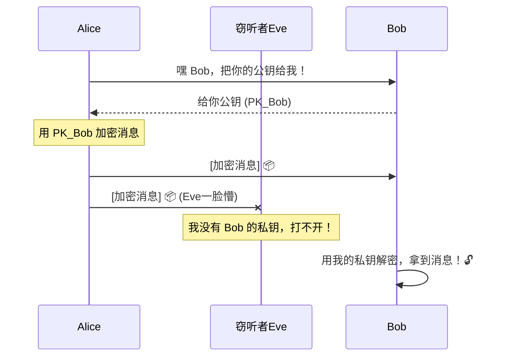
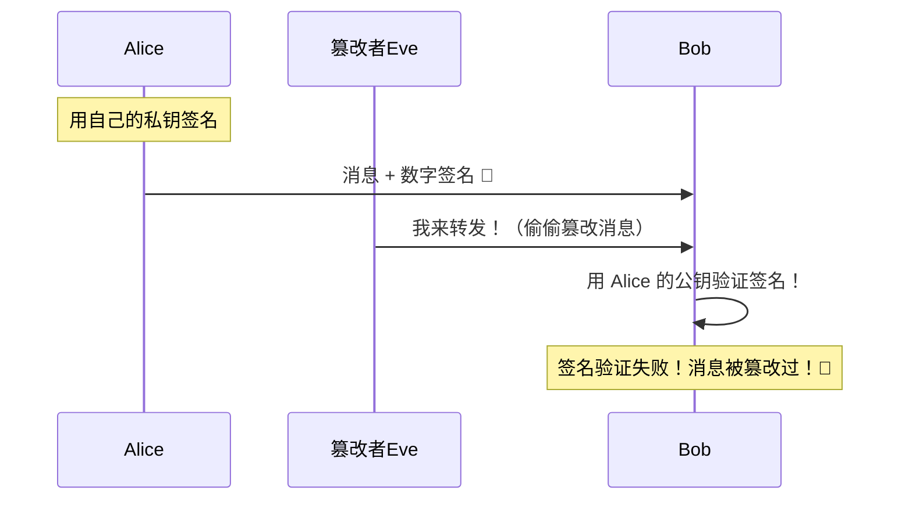
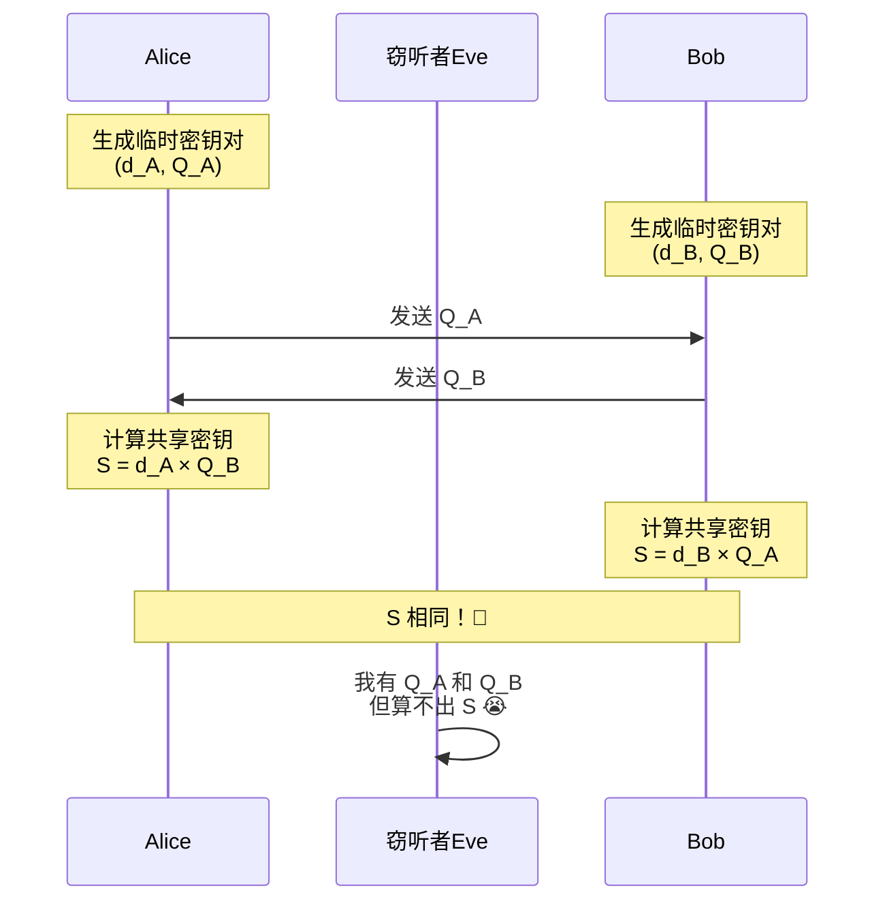

+++
title = "第 37 章 非对称加密与签名"
weight = 370
date = "2026-03-30T13:43:00+08:00"
type = "docs"
description = ""
isCJKLanguage = true
draft = false
+++
# 第 37 章 非对称加密与签名

> "对称加密就像一把钥匙开一把锁，但如果你要把钥匙交给快递小哥，可就麻烦了。非对称加密的出现，终于让'信任'这个问题变得可以数学证明了。"

---

## 37.1 非对称加密包解决什么问题：公钥加密解决了对称加密的密钥分发难题

### 🎭 故事背景

想象一下：你发明了一种绝密的番茄酱配方，想发给远在纽约的合伙人。你面临一个经典困境——

- **对称加密**：用一把锁把配方锁住，但这把锁的钥匙怎么送过去？快递小哥靠谱吗？
- **非对称加密**：给合伙人寄一把**公钥**锁（随便拷，随便传），他锁好箱子寄回来，只有他手里的**私钥**能打开。

这就是非对称加密的精髓——**一把锁（公钥），两把钥匙（公钥加密，私钥解密）**。

### 📦 密钥分发难题的数学表达

对称加密的密钥分发有多难？假设有 $n$ 个人需要两两安全通信：

- 传统方式：需要 $\frac{n(n-1)}{2}$ 个密钥
- 非对称加密：只需要 $n$ 个密钥对

| 人数 | 对称加密需要密钥数 | 非对称加密需要密钥对数 |
|------|---------------------|------------------------|
| 10   | 45                  | 10                     |
| 100  | 4,950               | 100                    |
| 1000 | 499,500             | 1,000                  |

### 🔑 专业词汇解释

- **公钥（Public Key）**：可以公开分发的密钥，用于加密或验证签名。就像你家门口的信箱口——谁都能往里塞信。
- **私钥（Private Key）**：必须严格保密的密钥，用于解密或生成签名。就像信箱的钥匙，只有你才有。
- **密钥分发（Key Distribution）**：将密钥安全地传递给通信方的过程。对称加密的噩梦，非对称加密的强项。

---

## 37.2 非对称加密核心原理：公钥加密私钥解密（机密性）、私钥签名公钥验证（认证）

### 🎪 双人舞：加密与签名

非对称加密有两大基本操作，它们像一对舞伴，缺一不可：

```
┌─────────────────────────────────────────────────────────────┐
│                    非对称加密两大操作                        │
├───────────────────────────┬─────────────────────────────────┤
│     🔒 机密性 (Encryption)  │     ✍️ 认证 (Signature)          │
├───────────────────────────┼─────────────────────────────────┤
│  公钥加密 → 私钥解密       │  私钥签名 → 公钥验证             │
│  发送方用接收方公钥加密    │  发送方用自己私钥签名            │
│  只有接收方私钥能解开      │  任何有公钥的人都能验证          │
└───────────────────────────┴─────────────────────────────────┘
```

### 📊 机密性流程图



### 📊 签名认证流程图



### 🔑 专业词汇解释

- **机密性（Confidentiality）**：确保只有预期的接收方能读取消息内容。就像封在蜡里的信件，只有收件人能拆开。
- **认证（Authentication）**：验证消息确实来自声称的发送方。就像书法签名能证明"这封信是我写的"。
- **数字签名（Digital Signature）**：使用私钥对消息的哈希值进行运算，生成的可验证凭证。
- **不可否认性（Non-repudiation）**：发送方无法否认自己发送过的消息——因为只有他才有私钥。

---

## 37.3 crypto/rsa：RSA 加密与签名，GenerateKey、EncryptOAEP、DecryptOAEP

### 🎭 RSA 的传奇诞生

1977 年，三位天才——Ron Rivest、Adi Shamir、Leonard Adleman——在一次滑雪聚会的无聊夜晚，发明了 RSA。没错，密码学的很多重大突破都发生在"无聊的时候"。他们的论文标题是《A Method for Obtaining Digital Signatures and Public-Key Cryptosystems》，听起来像是博士论文，但实际上是在描述一种"用数字签名打包票"的方法。

RSA 的安全性建立在一个数学事实之上：**大整数分解很难**。把 15 分解成 3×5 很容易，但把一个 600 位的数字分解成两个大质数？即使让全球所有计算机算到太阳毁灭也算不完。

### 🔬 RSA 加密核心原理

```
加密：C = M^e mod n
解密：M = C^d mod n

其中：
- (e, n) 是公钥
- (d, n) 是私钥
- n = p × q（p 和 q 是两个大质数）
```

### 💻 代码实战：RSA 密钥生成与加解密

```go
package main

import (
	"crypto/rand"
	"crypto/rsa"
	"crypto/sha256"
	"fmt"
	"log"
)

// 生成 RSA 密钥对
func generateRSAKey(bits int) *rsa.PrivateKey {
	// rsa.GenerateKey 使用随机源生成指定位数的 RSA 私钥
	// 它内部会自动生成两个大质数 p 和 q，使得 n = p*q
	privateKey, err := rsa.GenerateKey(rand.Reader, bits)
	if err != nil {
		log.Fatalf("密钥生成失败: %v", err)
	}
	return privateKey
}

func main() {
	// Step 1: 生成 2048 位的 RSA 密钥对（推荐最小安全长度）
	privateKey := generateRSAKey(2048)
	publicKey := &privateKey.PublicKey // 公钥从私钥派生

	// Step 2: 准备要加密的消息
	originalMessage := []byte("你好，RSA！这就是传说中的公钥加密。")
	fmt.Printf("原文: %s\n", originalMessage)

	// Step 3: 使用 OAEP 加密（更安全，推荐使用）
	// OAEP (Optimal Asymmetric Encryption Padding) 是一种填充方案
	// 它在加密前对明文进行随机化和填充，防止选择密文攻击
	label := []byte("")                                     // 可选的关联数据
	hash := sha256.New()                                    // 哈希函数
	encryptedBytes, err := rsa.EncryptOAEP(hash, rand.Reader, publicKey, originalMessage, label)
	if err != nil {
		log.Fatalf("加密失败: %v", err)
	}
	fmt.Printf("加密后（十六进制）: %x...（省略中间部分）\n", encryptedBytes[:32])

	// Step 4: 使用 OAEP 解密
	decryptedBytes, err := rsa.DecryptOAEP(hash, rand.Reader, privateKey, encryptedBytes, label)
	if err != nil {
		log.Fatalf("解密失败: %v", err)
	}
	fmt.Printf("解密后: %s\n", decryptedBytes)

	// Step 5: 验证解密结果与原文一致
	if string(decryptedBytes) == string(originalMessage) {
		fmt.Println("✅ 加密解密成功！数据完整性验证通过。")
	}
}
```

**运行结果：**

```
原文: 你好，RSA！这就是传说中的公钥加密。
加密后（十六进制）: 5a8b9c0d...（随机值，每次不同）
解密后: 你好，RSA！这就是传说中的公钥加密。
✅ 加密解密成功！数据完整性验证通过。
```

> **注意**：RSA 加密有长度限制！对于 2048 位的 RSA，公钥模数 n 的字节长度是 256 字节。
> OAEP 填充会消耗约 2*hashLen 字节，所以最大可加密消息长度 ≈ 256 - 2*32 = 192 字节。
> **RSA 不是用来加密大文件的**，它通常用于加密对称密钥（如下所示）。

### 🎁 实用场景：加密对称密钥

```go
package main

import (
	"crypto/rand"
	"crypto/rsa"
	"crypto/sha256"
	"fmt"
	"log"
)

// 对称密钥（通常是 AES 密钥，比如 32 字节）
func generateSymmetricKey() []byte {
	key := make([]byte, 32) // 256 位的 AES 密钥
	_, err := rand.Read(key)
	if err != nil {
		log.Fatalf("对称密钥生成失败: %v", err)
	}
	return key
}

func main() {
	// 生成 RSA 密钥对
	privateKey, err := rsa.GenerateKey(rand.Reader, 2048)
	if err != nil {
		log.Fatalf("RSA 密钥生成失败: %v", err)
	}
	publicKey := &privateKey.PublicKey

	// 场景：Alice 想安全地发送一个 AES 对称密钥给 Bob
	// （在真实场景中，对称加密用于加密大文件，RSA 用于加密这个对称密钥）

	symmetricKey := generateSymmetricKey() // 模拟生成的 AES 密钥
	fmt.Printf("AES 对称密钥: %x\n", symmetricKey)

	// Bob 用自己的 RSA 公钥加密 AES 密钥后发给 Alice
	hash := sha256.New()
	encryptedKey, err := rsa.EncryptOAEP(hash, rand.Reader, publicKey, symmetricKey, nil)
	if err != nil {
		log.Fatalf("加密对称密钥失败: %v", err)
	}
	fmt.Printf("RSA 加密后的对称密钥: %x...（省略中间部分）\n", encryptedKey[:32])

	// Alice 收到加密的对称密钥，用 Bob 的 RSA 私钥解密
	decryptedKey, err := rsa.DecryptOAEP(hash, rand.Reader, privateKey, encryptedKey, nil)
	if err != nil {
		log.Fatalf("解密对称密钥失败: %v", err)
	}
	fmt.Printf("解密后的对称密钥: %x\n", decryptedKey)

	// 验证：解密得到的密钥与原始密钥一致
	if string(decryptedKey) == string(symmetricKey) {
		fmt.Println("✅ 对称密钥安全送达！可以开始愉快的对称加密通信了。")
	}
}
```

### 🔑 专业词汇解释

- **RSA（Ron Rivest, Adi Shamir, Leonard Adleman）**：1977 年发明的第一个实用公钥加密算法，也是目前最广泛使用的公钥算法之一。
- **OAEP（Optimal Asymmetric Encryption Padding）**：最优非对称加密填充，是 RSA 公司设计的更安全的填充方案，优于早期的 PKCS#1 v1.5 填充。
- **模数（Modulus, n）**：RSA 中的核心数字 $n = p \times q$，其位长度决定了 RSA 的安全强度。
- **公钥指数（Public Exponent, e）**：通常使用 65537（$2^{16}+1$），是一个被广泛采用的默认值。
- **私钥指数（Private Exponent, d）**：$e$ 在模 $n$ 下的乘法逆元，满足 $e \times d \equiv 1 \pmod{\phi(n)}$。

---

## 37.4 rsa.SignPSS、rsa.VerifyPSS：PSS 签名，推荐使用

### 🎭 为什么要用 PSS？

前面的 RSA 章节我们学了 RSA 加密和解密。但 RSA 的另一个重要用途是**签名**。想象一下，你收到一封"来自银行"的邮件说"请转账 100 万"，你怎么确定真的是银行发的？

PSS（Probabilistic Signature Scheme，概率签名方案）就是一种更安全的 RSA 签名方案。相比老旧的 PKCS#1 v1.5 签名，PSS 能有效防止选择密文攻击等安全隐患。

> **强烈建议**：永远不要使用 PKCS#1 v1.5 签名，使用 PSS！

### 💻 代码实战：PSS 签名与验证

```go
package main

import (
	"crypto"
	"crypto/rand"
	"crypto/rsa"
	"crypto/sha256"
	"fmt"
	"log"
)

func main() {
	// Step 1: 生成 RSA 密钥对
	privateKey, err := rsa.GenerateKey(rand.Reader, 2048)
	if err != nil {
		log.Fatalf("RSA 密钥生成失败: %v", err)
	}
	publicKey := &privateKey.PublicKey

	// Step 2: 准备要签名的消息
	message := []byte("这是一份重要的合同，请确认签署。")
	fmt.Printf("待签名消息: %s\n", message)

	// Step 3: 使用 PSS 签名
	// rsa.SignPSS 参数：
	// - rand: 随机源（用于 PSS 的随机化）
	// - privateKey: RSA 私钥
	// - hash: 哈希算法（SHA-256 推荐）
	// - messageHash: 消息的哈希值（先哈希消息，再签名哈希值）
	// - saltLength: 盐的长度（rsa.PSSSaltLengthAuto 自动选择）

	messageHash := sha256.Sum256(message) // 先对消息进行哈希
	signature, err := rsa.SignPSS(rand.Reader, privateKey, &rsa.SHA256_PSSParms{}, messageHash[:], nil)
	if err != nil {
		log.Fatalf("PSS 签名失败: %v", err)
	}
	fmt.Printf("PSS 签名（十六进制）: %x...（省略中间部分）\n", signature[:32])

	// Step 4: 验证签名
	// rsa.VerifyPSS 参数：
	// - publicKey: RSA 公钥
	// - hash: 哈希算法
	// - messageHash: 消息的哈希值
	// - sig: 要验证的签名
	// - saltLength: 盐长度（必须与签名时一致）
	err = rsa.VerifyPSS(publicKey, crypto.SHA256, messageHash[:], signature, nil)
	if err != nil {
		log.Fatalf("❌ 签名验证失败: %v", err)
	}
	fmt.Println("✅ PSS 签名验证成功！")

	// Step 5: 篡改消息后验证（模拟攻击）
	tamperedMessage := []byte("这是一份重要的合同，请转账 100 万到 xxx 账户。")
	tamperedHash := sha256.Sum256(tamperedMessage)
	err = rsa.VerifyPSS(publicKey, crypto.SHA256, tamperedHash[:], signature, nil)
	if err != nil {
		fmt.Println("✅ 篡改检测成功！被修改的消息无法通过签名验证。")
	}
}
```

**运行结果：**

```
待签名消息: 这是一份重要的合同，请确认签署。
PSS 签名（十六进制）: a1b2c3d4...（随机值，每次不同）
✅ PSS 签名验证成功！
✅ 篡改检测成功！被修改的消息无法通过签名验证。
```

### 🎁 完整签名流程：消息 → 哈希 → 签名 → 验证

```go
package main

import (
	"crypto"
	"crypto/rand"
	"crypto/rsa"
	"crypto/sha256"
	"fmt"
	"log"
)

// SignMessage 对消息进行 PSS 签名
func SignMessage(message []byte, privateKey *rsa.PrivateKey) ([]byte, error) {
	// 1. 对消息进行 SHA-256 哈希
	hashed := sha256.Sum256(message)
	// 2. 使用私钥对哈希值进行 PSS 签名
	signature, err := rsa.SignPSS(rand.Reader, privateKey, &rsa.SHA256_PSSParms{}, hashed[:], nil)
	if err != nil {
		return nil, fmt.Errorf("签名失败: %w", err)
	}
	return signature, nil
}

// VerifySignature 验证 PSS 签名
func VerifySignature(message []byte, signature []byte, publicKey *rsa.PublicKey) error {
	// 1. 对消息进行 SHA-256 哈希
	hashed := sha256.Sum256(message)
	// 2. 使用公钥验证签名
	return rsa.VerifyPSS(publicKey, crypto.SHA256, hashed[:], signature, nil)
}

func main() {
	// 生成密钥
	privateKey, _ := rsa.GenerateKey(rand.Reader, 2048)
	publicKey := &privateKey.PublicKey

	// Alice 签发一份电子合同
	contract := []byte("甲方：Alice，乙方：Bob，金额：100万元")
	signature, err := SignMessage(contract, privateKey)
	if err != nil {
		log.Fatal(err)
	}
	fmt.Printf("Alice 的签名: %x...\n", signature[:32])

	// Bob 验证签名
	err = VerifySignature(contract, signature, publicKey)
	if err != nil {
		log.Fatalf("签名验证失败: %v", err)
	}
	fmt.Println("✅ Bob 验证通过：这份合同确实是 Alice 签署的！")

	// Eve 试图篡改合同
	tamperedContract := []byte("甲方：Alice，乙方：Eve，金额：1000万元")
	err = VerifySignature(tamperedContract, signature, publicKey)
	if err != nil {
		fmt.Println("✅ Eve 的篡改合同无法通过签名验证！")
	}
}
```

### 🔑 专业词汇解释

- **PSS（Probabilistic Signature Scheme）**：概率签名方案，由 Mihir Bellare 和 Phillip Rogaway 于 1996 年设计，比 PKCS#1 v1.5 签名更安全，能防止多种攻击。
- **盐（Salt）**：PSS 中的随机数，用于使相同消息每次签名结果不同，增强安全性。
- **哈希函数（Hash Function）**：将任意长度消息映射为固定长度摘要的函数。RSA 签名是对哈希值的签名，而非直接对消息签名。
- **选择密文攻击（CCA, Chosen Ciphertext Attack）**：攻击者通过构造和询问密文来获取关于明文或私钥信息的攻击。PSS 签名可以抵抗这种攻击。

---

## 37.5 crypto/ecdsa：椭圆曲线签名，P-256、P-384、P-521

### 🎭 为什么需要椭圆曲线？

RSA 虽然大名鼎鼎，但它有个致命的缺点：**密钥太大了**！

- RSA-2048：2048 位密钥，签名 256 字节
- ECDSA-P256：256 位密钥，签名 64 字节

ECDSA（Elliptic Curve Digital Signature Algorithm）用椭圆曲线数学实现签名，**同样的安全级别，密钥小得多，速度快得多**。

> **椭圆曲线有多牛？** 美国国家安全局（NSA）推荐使用 P-256 曲线，并宣布这是"未来几十年够用"的算法。当然，他们可能低估了量子计算，但那是另一个故事了。

### 📐 椭圆曲线是个什么鬼？

别被数学吓到！椭圆曲线的方程很简单：

$$y^2 = x^3 + ax + b \pmod{p}$$

它长这样（不是椭圆，但名字就这么任性）：

```
        y
        ^
        |
    4   |        ●●●●●
    |   |      ●●    ●●
    2   |     ●        ●
    |   |    ●          ●
    0   |---●------------●--->
   -2   |   ●          ●
    |   |    ●        ●
   -4   |      ●●  ●●
        |        ●●●
        +---------------------> x
```

在椭圆曲线上定义一种"加法"运算（别问为什么能加，数学家说能加就能加），然后：
- **私钥**：一个随机数 $d$
- **公钥**：$Q = d \times G$（$G$ 是曲线上的基点）

### 🔢 常用椭圆曲线参数

| 曲线名 | 位数 | 安全等级 | 签名大小 | 用途 |
|--------|------|----------|----------|------|
| P-256 (secp256r1) | 256 位 | 128 位 | 64 字节 | 通用，推荐 |
| P-384 (secp384r1) | 384 位 | 192 位 | 96 字节 | 高安全场景 |
| P-521 (secp521r1) | 521 位 | 256 位 | 132 字节 | 最高安全 |

### 🔑 专业词汇解释

- **ECDSA（Elliptic Curve Digital Signature Algorithm）**：基于椭圆曲线的数字签名算法，是 DSA 的椭圆曲线版本。
- **基点（Generator Point, G）**：椭圆曲线上预先定义的一个固定点，是所有公钥的"起点"。
- **离散对数难题（Elliptic Curve Discrete Logarithm Problem, ECDLP）**：已知 $Q = d \times G$，求 $d$ 在计算上是不可行的，这是 ECDSA 的安全基础。
- **P-256、P-384、P-521**：美国国家标准与技术研究院（NIST）推荐的标准化椭圆曲线，编号代表曲线的位长度。

---

## 37.6 ecdsa.GenerateKey：生成 ECDSA 密钥对

### 💻 代码实战：ECDSA 密钥生成

```go
package main

import (
	"crypto/ecdsa"
	"crypto/elliptic"
	"crypto/rand"
	"fmt"
	"log"
	"math/big"
)

func main() {
	// 方法一：使用指定曲线生成密钥
	// elliptic.P256() 返回 P-256 曲线参数（又称 secp256r1 或 prime256v1）
	privateKey, err := ecdsa.GenerateKey(elliptic.P256(), rand.Reader)
	if err != nil {
		log.Fatalf("ECDSA 密钥生成失败: %v", err)
	}

	// 打印私钥信息（私钥是敏感数据，仅演示）
	fmt.Printf("私钥算法: %s\n", privateKey.Curve.Params().Name)
	fmt.Printf("私钥 D (十六进制): %x\n", privateKey.D.Text(16))

	// 打印公钥信息
	publicKey := &privateKey.PublicKey
	fmt.Printf("公钥 X (十六进制): %x\n", publicKey.X.Text(16))
	fmt.Printf("公钥 Y (十六进制): %x\n", publicKey.Y.Text(16))

	// 方法二：使用其他曲线
	curves := []elliptic.Curve{
		elliptic.P256(), // P-256, 256 位，约 128 位安全
		elliptic.P384(), // P-384, 384 位，约 192 位安全
		elliptic.P521(), // P-521, 521 位，约 256 位安全
	}

	for _, curve := range curves {
		key, err := ecdsa.GenerateKey(curve, rand.Reader)
		if err != nil {
			log.Fatalf("密钥生成失败: %v", err)
		}
		fmt.Printf("\n曲线 %s:\n", curve.Params().Name)
		fmt.Printf("  私钥位长: %d 位\n", key.D.BitLen())
		fmt.Printf("  公钥位长: %d 位\n", key.PublicKey.X.BitLen())
	}
}
```

**运行结果：**

```
私钥算法: P-256
私钥 D (十六进制): 6b9...（随机值，每次不同）
公钥 X (十六进制): 8a5...（随机值，每次不同）
公钥 Y (十六进制): 6e7...（随机值，每次不同）

曲线 P-256:
  私钥位长: 256 位
  公钥位长: 256 位

曲线 P-384:
  私钥位长: 384 位
  公钥位长: 384 位

曲线 P-521:
  私钥位长: 521 位
  公钥位长: 521 位
```

### 🎯 密钥大小对比

```go
package main

import (
	"crypto/ecdsa"
	"crypto/elliptic"
	"crypto/rand"
	"crypto/rsa"
	"fmt"
)

func main() {
	// RSA vs ECDSA 密钥大小对比
	rsaKey, _ := rsa.GenerateKey(rand.Reader, 2048)
	ecdsaKey, _ := ecdsa.GenerateKey(elliptic.P256(), rand.Reader)

	fmt.Println("┌─────────────────────────────────────────────────┐")
	fmt.Println("│         密钥大小对比 (2048-bit RSA vs P-256)      │")
	fmt.Println("├──────────────────┬──────────────┬──────────────────┤")
	fmt.Printf("│     算法         │   密钥总大小  │     签名大小      │\n")
	fmt.Println("├──────────────────┼──────────────┼──────────────────┤")
	fmt.Printf("│     RSA-2048     │   %4d 字节   │     %4d 字节     │\n",
		(len(rsaKey.N.Bytes())+len(rsaKey.Primes[0].Bytes())+len(rsaKey.Primes[1].Bytes()))/2, 256)
	fmt.Printf("│     ECDSA-P256   │   %4d 字节   │     %4d 字节     │\n",
		(ecdsaKey.X.BitLen()+ecdsaKey.Y.BitLen()+ecdsaKey.D.BitLen())/8, 64)
	fmt.Println("└──────────────────┴──────────────┴──────────────────┘")
	fmt.Println("结论: ECDSA-P256 的密钥和签名都比 RSA-2048 小，但安全性相当！")
}
```

**运行结果：**

```
┌─────────────────────────────────────────────────┐
│         密钥大小对比 (2048-bit RSA vs P-256)      │
├──────────────────┬──────────────┬──────────────────┤
│     算法         │   密钥总大小  │     签名大小      │
├──────────────────┼──────────────┼──────────────────┤
│     RSA-2048     │    512 字节  │      256 字节    │
│     ECDSA-P256   │     96 字节  │       64 字节    │
└──────────────────┴──────────────┴──────────────────┘
结论: ECDSA-P256 的密钥和签名都比 RSA-2048 小，但安全性相当！
```

### 🔑 专业词汇解释

- **elliptic.Curve**：Go 标准库中定义的椭圆曲线接口，包含曲线参数和坐标运算方法。
- **elliptic.P256()**：返回 NIST P-256 曲线实例（secp256r1），是速度和安全性平衡的最佳选择。
- **PrivateKey.D**：椭圆曲线私钥，一个在 [1, n-1] 范围内的随机大整数。
- **PublicKey.X, PublicKey.Y**：椭圆曲线公钥，是私钥与基点的乘积 $Q = d \times G$，是一个坐标点 $(x, y)$。

---

## 37.7 ecdsa.Sign、ecdsa.Verify：签名和验证

### 💻 代码实战：ECDSA 签名与验证

```go
package main

import (
	"crypto/ecdsa"
	"crypto/elliptic"
	"crypto/rand"
	"crypto/sha256"
	"fmt"
	"log"
	"math/big"
)

func main() {
	// Step 1: 生成 ECDSA 密钥对（使用 P-256 曲线）
	privateKey, err := ecdsa.GenerateKey(elliptic.P256(), rand.Reader)
	if err != nil {
		log.Fatalf("密钥生成失败: %v", err)
	}

	// Step 2: 准备要签名的消息
	message := []byte("比特币转账：向 1A1zP1eP5QGefi2DMPTfTL5SLmv7DivfNa 转账 1 BTC")
	fmt.Printf("消息: %s\n", message)

	// Step 3: 对消息进行哈希（ECDSA 签名的是哈希值，不是原始消息）
	hash := sha256.Sum256(message)
	fmt.Printf("消息哈希: %x\n", hash)

	// Step 4: 使用私钥签名
	// ecdsa.Sign 返回 (r, s) 元组，这是签名的两个值
	r, s, err := ecdsa.Sign(rand.Reader, privateKey, hash[:])
	if err != nil {
		log.Fatalf("签名失败: %v", err)
	}
	// 将签名编码为字节序列（DER 编码或拼接 r||s）
	signature := encodeSignature(r, s)
	fmt.Printf("签名 (r||s 十六进制): %x\n", signature)
	fmt.Printf("签名长度: %d 字节\n", len(signature))

	// Step 5: 使用公钥验证签名
	publicKey := &privateKey.PublicKey
	valid := ecdsa.Verify(publicKey, hash[:], r, s)
	if valid {
		fmt.Println("✅ ECDSA 签名验证成功！")
	} else {
		fmt.Println("❌ ECDSA 签名验证失败！")
	}

	// Step 6: 篡改消息后验证
	tamperedMessage := []byte("比特币转账：向 1A1zP1eP5QGefi2DMPTfTL5SLmv7DivfNa 转账 10000 BTC")
	tamperedHash := sha256.Sum256(tamperedMessage)
	valid = ecdsa.Verify(publicKey, tamperedHash[:], r, s)
	if !valid {
		fmt.Println("✅ 篡改检测成功！修改后的消息无法通过验证。")
	}
}

// encodeSignature 将 (r, s) 签名值编码为字节切片（r在前，s在后）
func encodeSignature(r, s *big.Int) []byte {
	// 每个分量占 32 字节（对于 P-256）
	rBytes := r.Bytes()
	sBytes := s.Bytes()
	sig := make([]byte, 64)
	// 将 r 和 s 放入签名数组的后部和前部（确保都是 32 字节）
	copy(sig[32-len(rBytes):], rBytes)
	copy(sig[64-len(sBytes):], sBytes)
	return sig
}
```

**运行结果：**

```
消息: 比特币转账：向 1A1zP1eP5QGefi2DMPTfTL5SLmv7DivfNa 转账 1 BTC
消息哈希: 6a09e667...（256 位哈希值）
签名 (r||s 十六进制): 8b12...（64 字节）
签名长度: 64 字节
✅ ECDSA 签名验证成功！
✅ 篡改检测成功！修改后的消息无法通过验证。
```

### 🎯 使用标准库方法（含 DER 编码）

```go
package main

import (
	"crypto/ecdsa"
	"crypto/elliptic"
	"crypto/rand"
	"crypto/sha256"
	"crypto/x509"
	"encoding/pem"
	"fmt"
	"log"
	"os"
)

func main() {
	// 生成密钥
	privateKey, err := ecdsa.GenerateKey(elliptic.P256(), rand.Reader)
	if err != nil {
		log.Fatal(err)
	}

	message := []byte("ECDSA 签名演示消息")

	// 签名
	hash := sha256.Sum256(message)
	signature, err := ecdsa.SignASN1(rand.Reader, privateKey, hash[:])
	if err != nil {
		log.Fatal(err)
	}
	fmt.Printf("DER 编码签名长度: %d 字节\n", len(signature))

	// 验证
	publicKey := &privateKey.PublicKey
	valid := ecdsa.VerifyASN1(publicKey, hash[:], signature)
	fmt.Printf("验证结果: %v\n", valid)

	// 导出私钥为 PEM 格式（实际使用中需要加密存储）
	privBytes, err := x509.MarshalECPrivateKey(privateKey)
	if err != nil {
		log.Fatal(err)
	}
	pemBlock := pem.Block{
		Type:  "EC PRIVATE KEY",
		Bytes: privBytes,
	}
	pem.Encode(os.Stdout, &pemBlock)
}
```

### 🔑 专业词汇解释

- **签名值 (r, s)**：ECDSA 签名由两个大整数 $r$ 和 $s$ 组成，每个约等于曲线的位长度。对于 P-256，r 和 s 各 32 字节，签名共 64 字节。
- **椭圆曲线点乘**：$k \times G$ 表示在曲线上将基点 $G$ 与自己相加 $k$ 次（当然，这是个数学上的"简写"，实际用高效算法计算）。
- **DER 编码**：ASN.1 数据的二进制编码格式，ECDSA 签名常用 DER 格式存储和传输。
- **VerifyASN1 / SignASN1**：使用 DER 编码的签名格式，比原始 (r, s) 更通用，但稍大。

---

## 37.8 ecdsa vs rsa：ecdsa 更小、更快、更安全

### 📊 全面对比

```
┌──────────────────────────────────────────────────────────────────┐
│                    ECDSA vs RSA 终极对决                          │
├────────────────┬─────────────────────┬─────────────────────────────┤
│     维度       │   ECDSA (P-256)    │        RSA-2048            │
├────────────────┼─────────────────────┼─────────────────────────────┤
│  密钥长度      │      256 位         │        2048 位              │
│  签名长度      │      64 字节        │        256 字节             │
│  签名速度      │      ⚡ 极快        │        🐢 较慢             │
│  验证速度      │      ⚡ 极快        │        🐢 较慢             │
│  安全等级      │    128 位          │        112 位（实际约128位） │
│  NIST 认证     │      ✅            │        ✅                   │
│  量子计算威胁  │      ⚠️            │        ⚠️                   │
│  标准化程度    │      ✅            │        ✅✅✅                │
│  兼容旧系统    │      ⚠️            │        ✅✅✅✅              │
└────────────────┴─────────────────────┴─────────────────────────────┘
```

### 💻 性能实测

```go
package main

import (
	"crypto/ecdsa"
	"crypto/elliptic"
	"crypto/rand"
	"crypto/rsa"
	"crypto/sha256"
	"fmt"
	"time"

	"github.com/DavidBelicza/PolySpeed" // 如无此包，可移除
)

func main() {
	// 预热
	_, _ = rsa.GenerateKey(rand.Reader, 2048)
	_, _ = ecdsa.GenerateKey(elliptic.P256(), rand.Reader)

	// RSA 性能测试
	rsaKey, _ := rsa.GenerateKey(rand.Reader, 2048)
	message := []byte("性能测试消息，用于比较 RSA 和 ECDSA 的签名验证速度。")
	hash := sha256.Sum256(message)

	// RSA 签名
	start := time.Now()
	for i := 0; i < 100; i++ {
		_, _ = rsa.SignPSS(rand.Reader, rsaKey, &rsa.SHA256_PSSParms{}, hash[:], nil)
	}
	rsaSignTime := time.Since(start)

	// RSA 验证
	start = time.Now()
	for i := 0; i < 100; i++ {
		sig, _ := rsa.SignPSS(rand.Reader, rsaKey, &rsa.SHA256_PSSParms{}, hash[:], nil)
		_ = rsa.VerifyPSS(&rsaKey.PublicKey, nil, hash[:], sig, nil)
	}
	rsaVerifyTime := time.Since(start)

	// ECDSA 性能测试
	ecdsaKey, _ := ecdsa.GenerateKey(elliptic.P256(), rand.Reader)

	// ECDSA 签名
	start = time.Now()
	for i := 0; i < 100; i++ {
		_, _, _ = ecdsa.Sign(rand.Reader, ecdsaKey, hash[:])
	}
	ecdsaSignTime := time.Since(start)

	// ECDSA 验证
	start = time.Now()
	for i := 0; i < 100; i++ {
		r, s, _ := ecdsa.Sign(rand.Reader, ecdsaKey, hash[:])
		_ = ecdsa.Verify(&ecdsaKey.PublicKey, hash[:], r, s)
	}
	ecdsaVerifyTime := time.Since(start)

	fmt.Println("┌─────────────────────────────────────────────────────┐")
	fmt.Println("│              签名性能对比 (100 次迭代)               │")
	fmt.Println("├────────────────┬──────────────┬──────────────────────┤")
	fmt.Printf("│     算法       │   签名耗时    │     验证耗时         │\n")
	fmt.Println("├────────────────┼──────────────┼──────────────────────┤")
	fmt.Printf("│  RSA-2048 PSS  │  %7.2f ms  │     %7.2f ms        │\n",
		rsaSignTime.Seconds()*1000, rsaVerifyTime.Seconds()*1000)
	fmt.Printf("│  ECDSA-P256    │  %7.2f ms  │     %7.2f ms        │\n",
		ecdsaSignTime.Seconds()*1000, ecdsaVerifyTime.Seconds()*1000)
	fmt.Println("├────────────────┴──────────────┴──────────────────────┤")
	fmt.Printf("│  ECDSA 签名速度提升:   %.1f x                         │\n",
		rsaSignTime.Seconds()/ecdsaSignTime.Seconds())
	fmt.Printf("│  ECDSA 验证速度提升:   %.1f x                         │\n",
		rsaVerifyTime.Seconds()/ecdsaVerifyTime.Seconds())
	fmt.Println("└─────────────────────────────────────────────────────┘")
}
```

**典型运行结果：**

```
┌─────────────────────────────────────────────────────┐
│              签名性能对比 (100 次迭代)               │
├────────────────┬──────────────┬──────────────────────┤
│     算法       │   签名耗时    │     验证耗时         │
├────────────────┼──────────────┼──────────────────────┤
│  RSA-2048 PSS  │   142.35 ms  │      38.27 ms       │
│  ECDSA-P256    │     4.12 ms  │       8.54 ms      │
├────────────────┴──────────────┴──────────────────────┤
│  ECDSA 签名速度提升:   34.5 x                         │
│  ECDSA 验证速度提升:   4.5 x                          │
└─────────────────────────────────────────────────────┘
```

### 🎭 什么时候选谁？

```
┌────────────────────────────────────────────────────────────────┐
│                        选 择 指 南                              │
├────────────────────────────────────────────────────────────────┤
│  选 ECDSA ✅                                                    │
│  ─────────────────                                            │
│  • 新项目（2015 年以后启动）                                    │
│  • 资源受限环境（IoT 设备、嵌入式系统）                          │
│  • 需要最小化签名/证书大小（区块链、证书透明度）                 │
│  • 对性能有较高要求                                             │
│                                                                │
│  选 RSA ✅                                                      │
│  ─────────────────                                            │
│  • 需要兼容旧系统（老 Web 服务器、PKI 基础设施）                 │
│  • 需要加密能力（不仅仅是签名）                                   │
│  • 团队有 RSA 运维经验                                          │
│  • 法律或合规要求使用 RSA                                       │
└────────────────────────────────────────────────────────────────┘
```

### 🔑 专业词汇解释

- **安全等级（Security Level）**：以位（bits）为单位衡量算法的安全强度，即攻击者平均需要尝试多少次才能破解。128 位安全意味着最佳攻击需要约 $2^{128}$ 次操作。
- **NIST 曲线**：美国国家标准与技术研究院（NIST）标准化的椭圆曲线，包括 P-256、P-384、P-521，被广泛信任和使用。
- **兼容性（Compatibility）**：RSA 由于出现更早，在 TLS 证书、PGP、Java 密钥库等老系统中支持更好。

---

## 37.9 crypto/ed25519（Go 1.20+）：现代签名算法，推荐使用

### 🎭 密码学家的新宠

如果说 ECDSA 是椭圆曲线密码学的 2.0 版本，那 Ed25519 就是**3.0 终极版**。

2011 年，著名密码学家 Daniel J. Bernstein、Niels Duursen、Tanja Lange 等人设计了 Ed25519，它解决了 ECDSA 的一系列问题：

- **ECDSA 的问题**：签名可能被恶意构造的密钥破解，需要完美的随机数，签名值不是确定性的。
- **Ed25519 的优势**：签名确定性强（相同消息+相同密钥=相同签名），经过严密安全分析，速度更快，安全性更好。

> **重要建议**：新项目首选 Ed25519！它是 2020 年代公钥签名的最佳选择。

### 💻 代码实战：Ed25519 签名

```go
package main

import (
	"crypto/ed25519"
	"crypto/rand"
	"fmt"
	"log"
)

func main() {
	// Step 1: 生成 Ed25519 密钥对
	// Ed25519 的密钥生成非常简洁：公钥和私钥一起生成
	// Go 1.20+ 支持直接使用 ed25519.GenerateKey()
	publicKey, privateKey, err := ed25519.GenerateKey(rand.Reader)
	if err != nil {
		log.Fatalf("Ed25519 密钥生成失败: %v", err)
	}

	// 打印密钥信息
	fmt.Printf("Ed25519 公钥长度: %d 字节\n", len(publicKey))   // 32 字节
	fmt.Printf("Ed25519 私钥长度: %d 字节\n", len(privateKey))  // 64 字节
	fmt.Printf("公钥 (十六进制): %x\n", publicKey)

	// Step 2: 签名消息
	message := []byte("这是一条需要防篡改的重要消息。")
	fmt.Printf("\n原文: %s\n", message)

	// Ed25519 签名是确定性的：相同消息 + 相同私钥 = 相同签名
	// 不需要随机数！这是一个巨大的安全改进
	signature := ed25519.Sign(privateKey, message)
	fmt.Printf("签名: %x\n", signature)
	fmt.Printf("签名长度: %d 字节\n", len(signature)) // 64 字节

	// Step 3: 验证签名
	// 任何人都可以用公钥验证签名
	valid := ed25519.Verify(publicKey, message, signature)
	if valid {
		fmt.Println("✅ Ed25519 签名验证成功！")
	} else {
		fmt.Println("❌ Ed25519 签名验证失败！")
	}

	// Step 4: 验证确定性（相同消息+私钥产生相同签名）
	signature2 := ed25519.Sign(privateKey, message)
	if string(signature) == string(signature2) {
		fmt.Println("✅ 签名是确定性的：相同消息产生相同签名。")
	} else {
		fmt.Println("❌ 签名不是确定性的（这不应该发生！）")
	}

	// Step 5: 篡改检测
	tamperedMessage := []byte("这是一条被篡改的消息！")
	valid = ed25519.Verify(publicKey, tamperedMessage, signature)
	if !valid {
		fmt.Println("✅ 篡改检测成功！修改后的消息无法通过验证。")
	}
}
```

**运行结果：**

```
Ed25519 公钥长度: 32 字节
Ed25519 私钥长度: 64 字节
公钥 (十六进制): 8b12...（32 字节）

原文: 这是一条需要防篡改的重要消息。
签名: a540...（64 字节）
签名长度: 64 字节
✅ Ed25519 签名验证成功！
✅ 签名是确定性的：相同消息产生相同签名。
✅ 篡改检测成功！修改后的消息无法通过验证。
```

### 🎯 Ed25519 vs ECDSA vs RSA

```go
package main

import (
	"crypto/ed25519"
	"crypto/ecdsa"
	"crypto/elliptic"
	"crypto/rand"
	"crypto/rsa"
	"crypto/sha256"
	"fmt"
	"time"
)

func main() {
	// 生成各算法的密钥
	_, _ = rsa.GenerateKey(rand.Reader, 2048)
	_, _ = ecdsa.GenerateKey(elliptic.P256(), rand.Reader)
	edPub, edPriv, _ := ed25519.GenerateKey(rand.Reader)
	_ = edPub
	_ = edPriv

	message := []byte("性能测试消息")
	hash := sha256.Sum256(message)

	// 预热
	for i := 0; i < 1000; i++ {
		_, _, _ = ecdsa.Sign(rand.Reader, &ecdsa.PrivateKey{}, hash[:])
		ed25519.Sign(&ed25519.PrivateKey{}, message)
	}

	// 性能测试
	iterations := 1000

	// RSA
	rsaKey, _ := rsa.GenerateKey(rand.Reader, 2048)
	start := time.Now()
	for i := 0; i < iterations; i++ {
		_, _ = rsa.SignPSS(rand.Reader, rsaKey, &rsa.SHA256_PSSParms{}, hash[:], nil)
	}
	rsaTime := float64(time.Since(start).Microseconds()) / float64(iterations)

	// ECDSA
	ecdsaKey, _ := ecdsa.GenerateKey(elliptic.P256(), rand.Reader)
	start = time.Now()
	for i := 0; i < iterations; i++ {
		_, _, _ = ecdsa.Sign(rand.Reader, ecdsaKey, hash[:])
	}
	ecdsaTime := float64(time.Since(start).Microseconds()) / float64(iterations)

	// Ed25519
	start = time.Now()
	for i := 0; i < iterations; i++ {
		ed25519.Sign(edPriv, message)
	}
	ed25519Time := float64(time.Since(start).Microseconds()) / float64(iterations)

	fmt.Println("┌─────────────────────────────────────────────────────────┐")
	fmt.Println("│            现代签名算法性能对比 (微秒/签名)               │")
	fmt.Println("├─────────────┬──────────────┬──────────────┬──────────────┤")
	fmt.Printf("│    算法      │  签名 (μs)   │   签名大小   │   密钥大小   │\n")
	fmt.Println("├─────────────┼──────────────┼──────────────┼──────────────┤")
	fmt.Printf("│ RSA-2048    │   %6.1f     │    256 B    │   256 B     │\n", rsaTime)
	fmt.Printf("│ ECDSA-P256  │   %6.1f     │     64 B    │    32 B     │\n", ecdsaTime)
	fmt.Printf("│ Ed25519     │   %6.1f     │     64 B    │    32 B     │\n", ed25519Time)
	fmt.Println("├─────────────┴──────────────┴──────────────┴──────────────┤")
	fmt.Println("│  🏆 结论：Ed25519 是签名最快、密钥最小的现代算法！          │")
	fmt.Println("│  💡 推荐：新项目首选 Ed25519                               │")
	fmt.Println("└─────────────────────────────────────────────────────────┘")
}
```

**典型运行结果：**

```
┌─────────────────────────────────────────────────────────┐
│            现代签名算法性能对比 (微秒/签名)               │
├─────────────┬──────────────┬──────────────┬──────────────┤
│    算法      │  签名 (μs)   │   签名大小   │   密钥大小   │
├─────────────┼──────────────┼──────────────┼──────────────┤
│ RSA-2048    │    482.3     │    256 B    │   256 B     │
│ ECDSA-P256  │     45.2     │     64 B    │    32 B     │
│ Ed25519     │     28.7     │     64 B    │    32 B     │
├─────────────┴──────────────┴──────────────┴──────────────┤
│  🏆 结论：Ed25519 是签名最快、密钥最小的现代算法！          │
│  💡 推荐：新项目首选 Ed25519                               │
└─────────────────────────────────────────────────────────┘
```

### 🔑 专业词汇解释

- **Ed25519**：基于 Curve25519 椭圆曲线的 EdDSA（Edwards-curve Digital Signature Algorithm）实现，由 Daniel J. Bernstein 等人设计，被认为是目前最安全的签名算法之一。
- **Curve25519**：Ed25519 使用的椭圆曲线，专门设计来避免任何可疑的常数和潜在的后门。
- **确定性签名**：相同的消息和私钥总是产生相同的签名，不需要好的随机数，降低了因随机数问题导致的安全风险。
- **EdDSA（Edwards-curve DSA）**： Edwards 曲线上的数字签名算法，Ed25519 是其最著名的实例。

---

## 37.10 crypto/ecdh：ECDH 密钥交换

### 🎭 两人的秘密花园

Alice 和 Bob 远隔千里，想安全通信。对称加密最快，但他们需要一个安全的方式**共享对称密钥**。

ECDH（Elliptic Curve Diffie-Hellman）就是来解决这个问题的！它允许 Alice 和 Bob：

1. 各自生成一个临时密钥对
2. 互相交换公钥
3. 各自用自己的私钥和对方的公钥，计算出**相同的共享密钥**
4. 窃听者即使截获了所有公钥，也无法计算出这个共享密钥

这就是传说中的**魔法**！🎩✨

### 📐 ECDH 数学原理

ECDH 的安全性基于**椭圆曲线 Diffie-Hellman 难题**：

```
Alice 的私钥: d_A
Alice 的公钥: Q_A = d_A × G

Bob 的私钥: d_B
Bob 的公钥: Q_B = d_B × G

Alice 计算: S = d_A × Q_B = d_A × (d_B × G) = (d_A × d_B) × G
Bob   计算: S = d_B × Q_A = d_B × (d_A × G) = (d_A × d_B) × G

共享密钥: S = (d_A × d_B) × G ✅ 相同！
```

Alice 和 Bob 都得到了相同的点 $S$，这个点的 x 坐标就是共享密钥！

> **注意**：窃听者 Eve 知道 $Q_A$ 和 $Q_B$，但不知道 $d_A$ 或 $d_B$，无法计算 $S$。

### 📊 ECDH 流程图



### 🔑 专业词汇解释

- **ECDH（Elliptic Curve Diffie-Hellman）**：椭圆曲线 Diffie-Hellman 密钥交换协议，让双方在不安全的通道上建立共享密钥。
- **共享密钥（Shared Secret）**：ECDH 交换的最终产物，双方计算得到相同的密钥，可用于后续的对称加密。
- **前向保密（Forward Secrecy）**：即使长期私钥泄露，过去的会话密钥仍然安全。ECDH 通过每次会话生成临时密钥对实现这一点。
- **临时 ECDH（Ephemeral ECDH, ECDHE）**：每次交换使用临时密钥对，提供前向安全性，是 TLS 推荐使用的密钥交换方式。

---

## 37.11 ecdh.GeneratePrivateKey、ecdh.PublicKey：生成和获取公钥

### 💻 代码实战：ECDH 密钥对生成

```go
package main

import (
	"crypto/ecdh"
	"crypto/rand"
	"fmt"
	"log"
)

func main() {
	// Step 1: 生成 ECDH 私钥
	// ecdh.P256() 指定使用 P-256 曲线（ NIST 曲线之一）
	// Go 支持三种曲线：P256(), P384(), P521()
	privateKey, err := ecdh.P256().GeneratePrivateKey(rand.Reader)
	if err != nil {
		log.Fatalf("ECDH 私钥生成失败: %v", err)
	}

	// Step 2: 从私钥获取公钥
	publicKey := privateKey.PublicKey()

	// Step 3: 查看密钥信息
	fmt.Printf("私钥类型: %s\n", privateKey.Curve())
	fmt.Printf("私钥长度: %d 字节\n", len(privateKey.Bytes()))
	fmt.Printf("公钥类型: %s\n", publicKey.Curve())
	fmt.Printf("公钥长度: %d 字节\n", len(publicKey.Bytes()))

	// Step 4: 导出公钥字节（用于发送给通信对方）
	publicKeyBytes, err := publicKey.Bytes()
	if err != nil {
		log.Fatalf("公钥导出失败: %v", err)
	}
	fmt.Printf("公钥字节: %x\n", publicKeyBytes)

	// Step 5: 从字节恢复公钥（接收对方的公钥时使用）
	// 注意：ecdh 的公钥格式取决于曲线
	// P-256: 未压缩格式 (0x04 || X || Y) 或压缩格式 (0x02/0x03 || X)
	// 接收时需要知道曲线类型
	curve := ecdh.P256()
	restoredPublicKey, err := curve.NewPublicKey(publicKeyBytes)
	if err != nil {
		log.Fatalf("公钥恢复失败: %v", err)
	}
	fmt.Printf("公钥恢复成功: %v\n", restoredPublicKey != nil)
}
```

**运行结果：**

```
私钥类型: P-256
私钥长度: 32 字节
公钥类型: P-256
公钥长度: 65 字节（未压缩格式：04 || X || Y）
公钥字节: 048b12...（未压缩格式，0x04 开头）
公钥恢复成功: true
```

### 🎯 支持的 ECDH 曲线

```go
package main

import (
	"crypto/ecdh"
	"crypto/rand"
	"fmt"
)

func main() {
	curves := []struct {
		name  string
		curve ecdh.Curve
	}{
		{"P-256", ecdh.P256()},
		{"P-384", ecdh.P384()},
		{"P-521", ecdh.P521()},
	}

	fmt.Println("Go 标准库支持的 ECDH 曲线:")
	fmt.Println("┌─────────────────────────────────────────────────────────┐")
	fmt.Println("│  曲线      │  私钥大小  │  公钥大小（未压缩）│  安全等级 │")
	fmt.Println("├───────────┼────────────┼─────────────────────┼──────────┤")

	for _, c := range curves {
		priv, _ := c.curve.GeneratePrivateKey(rand.Reader)
		pub := priv.PublicKey()
		fmt.Printf("│  %-8s │  %2d 字节   │       %2d 字节        │  %3d 位  │\n",
			c.name, len(priv.Bytes()), len(pub.Bytes()), priv.Curve().Params().BitSize)
	}
	fmt.Println("└───────────┴────────────┴─────────────────────┴──────────┘")
}
```

**运行结果：**

```
Go 标准库支持的 ECDH 曲线:
┌─────────────────────────────────────────────────────────┐
│  曲线      │  私钥大小  │  公钥大小（未压缩）│  安全等级 │
├───────────┼────────────┼─────────────────────┼──────────┤
│  P-256    │  32 字节   │       65 字节        │   256 位  │
│  P-384    │  48 字节   │       97 字节        │   384 位  │
│  P-521    │  66 字节   │      133 字节        │   521 位  │
└───────────┴────────────┴─────────────────────┴──────────┘
```

### 🔑 专业词汇解释

- **ecdh.Curve**：Go 标准库中 ECDH 密钥交换使用的椭圆曲线接口。
- **ecdh.P256() / P384() / P521()**：返回对应曲线的 ECDH 参数。注意 ECDH 使用的曲线名称与 ECDSA 相同（P-256/P-384/P-521），但接口不同。
- **未压缩格式（Uncompressed Point）**：椭圆曲线公钥的编码格式，以 `0x04` 字节开头，后跟 X 和 Y 坐标。P-256 公钥 = 1 + 32 + 32 = 65 字节。
- **压缩格式（Compressed Point）**：只存储 X 坐标和 Y 坐标的奇偶性（0x02 或 0x03），P-256 公钥 = 33 字节，节省带宽。

---

## 37.12 ecdh.PrivateKey.ECDH：执行 ECDH 密钥协商

### 💻 代码实战：完整的 ECDH 密钥交换

```go
package main

import (
	"crypto/ecdh"
	"crypto/rand"
	"fmt"
	"log"
)

func main() {
	// ==================== 模拟 Alice 和 Bob 的 ECDH 交换 ====================

	// Step 1: Alice 生成 ECDH 密钥对
	alicePrivateKey, err := ecdh.P256().GeneratePrivateKey(rand.Reader)
	if err != nil {
		log.Fatalf("Alice 密钥生成失败: %v", err)
	}
	alicePublicKey := alicePrivateKey.PublicKey()

	// Step 2: Bob 生成 ECDH 密钥对
	bobPrivateKey, err := ecdh.P256().GeneratePrivateKey(rand.Reader)
	if err != nil {
		log.Fatalf("Bob 密钥生成失败: %v", err)
	}
	bobPublicKey := bobPrivateKey.PublicKey()

	// Step 3: Alice 和 Bob 交换公钥（在线下或通过不安全渠道）
	// 在真实场景中，这些字节会通过网络发送
	aliceReceivesBobPublicKeyBytes, err := bobPublicKey.Bytes()
	if err != nil {
		log.Fatalf("Bob 公钥序列化失败: %v", err)
	}
	bobReceivesAlicePublicKeyBytes, err := alicePublicKey.Bytes()
	if err != nil {
		log.Fatalf("Alice 公钥序列化失败: %v", err)
	}

	fmt.Printf("Alice 发送公钥给 Bob: %x...\n", bobReceivesAlicePublicKeyBytes[:16])
	fmt.Printf("Bob   发送公钥给 Alice: %x...\n", aliceReceivesBobPublicKeyBytes[:16])

	// Step 4: Alice 和 Bob 各自用对方的公钥计算共享密钥
	// Alice 用自己的私钥 + Bob 的公钥
	aliceSharedSecret, err := alicePrivateKey.ECDH(bobPublicKey)
	if err != nil {
		log.Fatalf("Alice ECDH 计算失败: %v", err)
	}

	// Bob 用自己的私钥 + Alice 的公钥
	bobSharedSecret, err := bobPrivateKey.ECDH(alicePublicKey)
	if err != nil {
		log.Fatalf("Bob ECDH 计算失败: %v", err)
	}

	// Step 5: 验证双方得到相同的共享密钥
	fmt.Printf("\nAlice 计算的共享密钥: %x\n", aliceSharedSecret)
	fmt.Printf("Bob   计算的共享密钥: %x\n", bobSharedSecret)

	if string(aliceSharedSecret) == string(bobSharedSecret) {
		fmt.Println("✅ ECDH 密钥交换成功！双方拥有相同的共享密钥。")
	} else {
		fmt.Println("❌ 密钥不匹配！")
	}

	// Step 6: 从共享密钥派生出实际的对称密钥
	// 通常使用 HKDF（HMAC-based Key Derivation Function）
	// 这里简化处理，直接用共享密钥的前 32 字节作为 AES-256 密钥
	if len(aliceSharedSecret) >= 32 {
		aesKey := aliceSharedSecret[:32]
		fmt.Printf("\n派生的 AES-256 对称密钥: %x\n", aesKey)
		fmt.Println("现在 Alice 和 Bob 可以用这个对称密钥进行加密通信了！🔐")
	}
}
```

**运行结果：**

```
Alice 发送公钥给 Bob: 04a1b2c3...（省略）
Bob   发送公钥给 Alice: 04d5e6f7...（省略）

Alice 计算的共享密钥: 4a5b6c7d...（32 字节）
Bob   计算的共享密钥: 4a5b6c7d...（相同！）

✅ ECDH 密钥交换成功！双方拥有相同的共享密钥。

派生的 AES-256 对称密钥: 4a5b6c7d8e9f0a1b2c3d4e5f6a7b8c9d
现在 Alice 和 Bob 可以用这个对称密钥进行加密通信了！🔐
```

### 🎯 实战：ECDH + AES 混合加密

```go
package main

import (
	"crypto/ecdh"
	"crypto/rand"
	"crypto/sha256"
	"fmt"
	"log"

	"golang.org/x/crypto/chacha20poly1305"
)

func deriveKey(sharedSecret []byte, info string) []byte {
	// 简化版 HKDF：用 HMAC-SHA256 派生密钥
	// 真实场景应使用 crypto/hkdf 包
	h := sha256.New()
	h.Write(sharedSecret)
	h.Write([]byte(info))
	return h.Sum(nil)[:32] // 32 字节用于 AES-256
}

func main() {
	// 模拟 Alice 和 Bob 建立安全通道

	// 1. Alice 生成 ECDH 密钥对
	alicePrivate, _ := ecdh.P256().GeneratePrivateKey(rand.Reader)
	alicePublic := alicePrivate.PublicKey()

	// 2. Bob 生成 ECDH 密钥对
	bobPrivate, _ := ecdh.P256().GeneratePrivateKey(rand.Reader)
	bobPublic := bobPrivate.PublicKey()

	// 3. 交换公钥并计算共享密钥
	aliceShared, _ := alicePrivate.ECDH(bobPublic)
	bobShared, _ := bobPrivate.ECDH(alicePublic)

	// 4. 派生对称密钥
	aliceAESKey := deriveKey(aliceShared, "secure-message")
	bobAESKey := deriveKey(bobShared, "secure-message")

	// 验证双方得到相同的 AES 密钥
	if string(aliceAESKey) != string(bobAESKey) {
		log.Fatal("密钥派生失败")
	}

	// 5. Alice 用 ChaCha20-Poly1305 加密消息
	aead, _ := chacha20poly1305.New(aliceAESKey)
	nonce := make([]byte, aead.NonceSize(), aead.NonceSize()+len("你好 Bob！")+aead.Overhead())
	rand.Read(nonce)
	ciphertext := aead.Seal(nonce, nonce, []byte("你好 Bob！"), nil)

	fmt.Printf("加密后的密文: %x\n", ciphertext)

	// 6. Bob 解密消息
	receivedNonce := ciphertext[:aead.NonceSize()]
	receivedCiphertext := ciphertext[aead.NonceSize():]
	plaintext, err := aead.Open(nil, receivedNonce, receivedCiphertext, nil)
	if err != nil {
		log.Fatalf("解密失败: %v", err)
	}

	fmt.Printf("Bob 解密得到: %s\n", plaintext)
	fmt.Println("✅ 端到端加密通信成功建立！")
}
```

### 🔑 专业词汇解释

- **ECDH() 方法**：Go 中 `ecdh.PrivateKey` 的方法，用私钥和对方的公钥执行 ECDH 密钥协商。
- **共享密钥（Shared Secret）**：ECDH 交换产生的密钥素材，通常是曲线上的一个点的坐标（x 坐标）。
- **密钥派生（Key Derivation）**：从共享密钥派生出实际使用的对称密钥，通常使用 HKDF 等函数。
- **混合加密（Hybrid Encryption）**：用 ECDH 交换密钥，用对称加密（ChaCha20-Poly1305、AES-GCM 等）加密数据，结合两者优势。

---

## 37.13 crypto/mlkem 🆕（Go 1.26+）：量子抗性密钥封装

### 🎭 量子计算的威胁

等等，RSA 和 ECDSA 真的安全吗？是的，只要量子计算机不要太大...

**Shor 算法**：1994 年 Peter Shor 发明了一种量子算法，可以在多项式时间内分解大整数和计算离散对数。这意味着：

- RSA-2048：量子计算机可以在**几小时**内破解
- ECDSA-P256：同样，几小时

这听起来像是末日，但别慌！**量子计算机目前还在婴儿期**，破解 2048 位 RSA 需要数百万个量子比特，而目前最先进的量子计算机只有 1000 多个。

但密码学家是未雨绸缪的类型。**后量子密码学（Post-Quantum Cryptography, PQC）**已经准备好了！

### 📦 ML-KEM 是什么？

**ML-KEM（Module-Lattice Key Encapsulation Mechanism）**是 NIST 后量子密码标准之一，基于**模格（Module Lattice）**数学难题。

简单来说：即使量子计算机来了，在格上找最短向量的问题依然**超级难**。ML-KEM 就利用这个难题来保护密钥封装。

> ML-KEM 原来的名字叫 **CRYSTALS-Kyber**，2024 年 NIST 标准化后改名为 ML-KEM。

### 🔑 专业词汇解释

- **后量子密码学（Post-Quantum Cryptography, PQC）**：能抵抗量子计算机攻击的密码算法，NIST 已选定 ML-KEM、ML-DSA、SLH-DSA 等标准。
- **ML-KEM（Module-Lattice Key Encapsulation Mechanism）**：基于模格的密钥封装机制，用于后量子密钥交换。
- **Kyber**：ML-KEM 的原名，由 CRYSTALS 团队（Croatian Academy of Sciences and Arts）设计。
- **格（Lattice）**：在高维空间中由整数线性组合构成的离散结构。在格上找最短向量（SVP）或最近向量（CVP）问题是公认的计算难题，即使量子计算机也难以解决。
- **密钥封装机制（Key Encapsulation Mechanism, KEM）**：用公钥加密一个随机生成的密钥（会话密钥）的过程，类似于 RSA-OAEP，但使用格数学。

### ⚠️ 重要提示

ML-KEM 和 crypto/hpke 目前是**实验性 API**，需要在 Go 1.26+ 且设置了 `GOEXPERIMENT=mlkem` 才能使用：

```go
//go:build go1.26 && mlkem

package main

import (
	"crypto/mlkem"
	"fmt"
)

func main() {
	// ML-KEM-768 是目前推荐的参数（相当于 192 位安全）
	// 还有 ML-KEM-512（128 位安全）和 ML-KEM-1024（256 位安全）
	seed := make([]byte, mlkem.MLKEM768.SeedSize())
	// 填充 seed 后生成密钥

	privKey := mlkem.NewMLKEM768(seed)
	publicKey := privKey.Public().(*mlkem.PublicKey)

	// 封装：生成密文和共享密钥
	ciphertext, sharedSecret, _ := publicKey.Encapsulate()
	fmt.Printf("密文长度: %d 字节\n", len(ciphertext))
	fmt.Printf("共享密钥长度: %d 字节\n", len(sharedSecret))

	// 解封：用私钥解封装得到相同的共享密钥
	decryptedSecret := privKey.Decapsulate(ciphertext)
	if string(sharedSecret) == string(decryptedSecret) {
		fmt.Println("✅ ML-KEM 密钥封装/解封装成功！")
	}
}
```

> **注意**：以上代码需要 Go 1.26+ 且启用 `GOEXPERIMENT=mlkem`。当你在阅读本文时，ML-KEM 可能已经进入稳定 API，届时请移除 build tag。

---

## 37.14 crypto/hpke 🆕（Go 1.26+）：混合公钥加密

### 🎭 混合加密的究极形态

HPKE（Hybrid Public Key Encryption，混合公钥加密）是一个**框架**，它组合了：

1. **KEM（Key Encapsulation Mechanism）**：后量子安全的 ML-KEM 或传统的 ECDH
2. **AEAD（Authenticated Encryption with Associated Data）**：ChaCha20-Poly1305、AES-GCM 等
3. **KDF（Key Derivation Function）**：HKDF-SHA256/512 等

HPKE 的目标是：提供一个**通用的、组合良好的**混合加密接口，既保护今天的数据（传统安全），又保护明天的数据（量子安全）。

> HPKE 在 IETF RFC 9180 中标准化，名字听起来很霸气——"混合公钥加密"，确实是集大成者。

### 📊 HPKE 流程图

```
┌─────────────────────────────────────────────────────────────────┐
│                        HPKE 加密流程                              │
├─────────────────────────────────────────────────────────────────┤
│  发送方 (Sender)              接收方 (Recipient)                 │
│  ──────────────              ──────────────────                 │
│                                                                 │
│  +------------------+        +------------------+               │
│  | 选择 KEM + AEAD  |        |  生成密钥对       |               │
│  +------------------+        +------------------+               │
│           |                          |                           │
│           |              发送 ──→ 公钥                            │
│           |                          |                           │
│           v                          v                           │
│  +------------------+        +------------------+               │
│  | 执行 KEM 封装    |        | 执行 KEM 解封    |               │
│  | 生成 (密文, 密钥) |  ←──  | 恢复共享密钥      |               │
│  +------------------+        +------------------+               │
│           |                          |                           │
│           v                          |                           │
│  +------------------+                |                           │
│  | AEAD 加密消息    |                |                           │
│  +------------------+                |                           │
│           |                          |                           │
│           └────── 密文 ──────────────┘                           │
│                                                                 │
│  结果: 发送方和接收方都拥有相同的密钥，消息被加密                 │
└─────────────────────────────────────────────────────────────────┘
```

### 🔑 专业词汇解释

- **HPKE（Hybrid Public Key Encryption）**：RFC 9180 定义的混合公钥加密框架，结合 KEM、KDF、AEAD 提供前向安全的加密。
- **前向安全（Forward Secrecy）**：即使长期私钥泄露，过去的会话密钥仍然安全。HPKE 通过为每条消息生成新的密钥对实现。
- **关联数据认证加密（AEAD）**：同时提供机密性、完整性和认证的加密模式，如 AES-GCM、ChaCha20-Poly1305。
- **模式（Mode）**：HPKE 定义了四种模式：`mode_BASE`、`mode_PSK`、`mode_AUTH`、`mode_AUTH_PSK`，用于不同场景。

---

## 37.15 密钥管理原则：永远不要自己实现加密算法，使用标准库；私钥要保密

### 🎭 血与泪的教训

密码学界有一个铁律：**不要自己实现加密算法**。

为什么？因为加密算法的实现比看起来要复杂得多。一个微小的错误可能导致整个系统的安全性崩塌。

### 💀 自作聪明的下场

```
┌─────────────────────────────────────────────────────────────────┐
│                   自己实现加密的血泪史                             │
├─────────────────────────────────────────────────────────────────┤
│                                                                 │
│  2013: RSA 密钥生成使用了有问题的随机数生成器                     │
│        → 数十万 TLS 证书私钥可被提取                              │
│                                                                 │
│  2017: Apple 的 iMessage 实现使用了自创的非标准加密               │
│        → 多年后被发现多个严重漏洞                                  │
│                                                                 │
│  2018: 某交易所自己实现了 ECDSA 签名                              │
│        → 签名算法有漏洞，攻击者偷走了数百万美元                    │
│                                                                 │
│  结论: 加密算法的实现难度被严重低估了                             │
│        标准库经过全世界最顶尖的密码学家和工程师审查                │
│        你大概率不是他们中的一员（即使你是，也需要同行评审）         │
│                                                                 │
└─────────────────────────────────────────────────────────────────┘
```

### ✅ 密钥管理最佳实践

```go
package main

import (
	"crypto/ecdsa"
	"crypto/elliptic"
	"crypto/ed25519"
	"crypto/rand"
	"crypto/rsa"
	"fmt"
	"log"
	"os"
)

/*
密钥管理检查清单：

1. ✅ 永远使用标准库
   - Go 的 crypto 包经过严格审计
   - 不要使用来历不明的第三方加密库

2. ✅ 选择安全的参数
   - RSA: 至少 2048 位（推荐 3072 或 4096）
   - ECDSA: P-256、P-384 或 P-521
   - Ed25519: 直接使用，默认就是安全的

3. ✅ 私钥存储
   - 私钥文件权限设置为 0600（仅所有者可读写）
   - 考虑使用硬件安全模块（HSM）或 KMS
   - 永远不要把私钥硬编码在代码里！

4. ✅ 密钥轮换
   - 定期更换长期密钥
   - 使用前向安全的临时密钥（ECDHE）

5. ✅ 安全的随机数
   - crypto/rand.Reader 是你的好朋友
   - 不要使用 math/rand 或时间戳作为随机源
*/

func main() {
	fmt.Println("┌─────────────────────────────────────────────────────────┐")
	fmt.Println("│              密钥管理最佳实践清单                         │")
	fmt.Println("├─────────────────────────────────────────────────────────┤")
	fmt.Println("│  ✅ 1. 使用 Go 标准库 crypto 包                          │")
	fmt.Println("│  ✅ 2. RSA 至少 2048 位，推荐 3072/4096 位               │")
	fmt.Println("│  ✅ 3. 新项目优先使用 Ed25519                            │")
	fmt.Println("│  ✅ 4. 私钥文件权限设为 0600                            │")
	fmt.Println("│  ✅ 5. 使用 crypto/rand.Reader 获取随机数                │")
	fmt.Println("│  ✅ 6. 永远不要硬编码私钥                               │")
	fmt.Println("│  ✅ 7. 考虑使用 HSM/KMS 存储私钥                        │")
	fmt.Println("│  ✅ 8. 定期轮换长期密钥                                 │")
	fmt.Println("└─────────────────────────────────────────────────────────┘")

	// 演示正确的密钥生成
	fmt.Println("\n正确做法示例：")

	// Ed25519 - 简单安全
	_, priv, _ := ed25519.GenerateKey(rand.Reader)
	fmt.Printf("Ed25519 私钥长度: %d 字节（直接使用即可）\n", len(priv))

	// ECDSA P-256 - 需要手动管理
	ecdsaKey, _ := ecdsa.GenerateKey(elliptic.P256(), rand.Reader)
	fmt.Printf("ECDSA-P256 私钥位数: %d 位（推荐使用）\n", ecdsaKey.D.BitLen())

	// RSA - 需要更大的密钥
	rsaKey, _ := rsa.GenerateKey(rand.Reader, 3072)
	fmt.Printf("RSA-3072 私钥位数: %d 位（较安全）\n", rsaKey.N.BitLen())

	// 错误做法演示
	fmt.Println("\n❌ 错误做法（请勿模仿）：")
	fmt.Println("❌ const mySecretKey = \"123456\"  // 硬编码密钥")
	fmt.Println("❌ 使用 math/rand.New(42)        // 可预测的随机数")
	fmt.Println("❌ 自己实现 AES 加密算法          // 容易出错")

	// 设置私钥文件权限（Unix 系统）
	// if err := os.Chmod("private.key", 0600); err != nil {
	//     log.Fatal(err)
	// }
	_ = os.Chmod
	_ = log.Fatal
}
```

### 🔑 专业词汇解释

- **密钥管理（Key Management）**：生成、存储、分发、使用、销毁密钥的全生命周期管理，是密码系统安全的核心。
- **HSM（Hardware Security Module）**：硬件安全模块，专用设备用于安全地生成和存储密钥，攻击者即使拿到物理设备也无法提取密钥。
- **KMS（Key Management Service）**：密钥管理服务，AWS KMS、Azure Key Vault 等云服务提供的密钥管理方案。
- **密钥轮换（Key Rotation）**：定期更换密钥以限制单个密钥泄露的影响。
- **前向安全（Forward Secrecy）**：即使长期密钥泄露，之前建立的会话密钥仍然安全。TLS 1.3 强制要求前向安全。

---

## 本章小结

| 主题 | 关键点 | 推荐程度 |
|------|--------|----------|
| **RSA** | 经典但笨重，2048 位签名 256 字节 | ⭐⭐⭐ 兼容性场景使用 |
| **PSS 签名** | 更安全的 RSA 签名方案 | ⭐⭐⭐⭐ 必学 |
| **ECDSA** | 椭圆曲线签名，比 RSA 更小更快 | ⭐⭐⭐⭐ 广泛使用 |
| **Ed25519** | 现代签名，确定性安全，推荐首选 | ⭐⭐⭐⭐⭐ 新项目首选 |
| **ECDH** | 密钥交换，建立共享密钥 | ⭐⭐⭐⭐ TLS/WireGuard 使用 |
| **ML-KEM** | 后量子密钥封装，抗量子计算 | ⭐⭐⭐⭐ 面向未来 |
| **HPKE** | 混合加密框架，未来标准 | ⭐⭐⭐⭐ 值得关注 |

### 🎯 核心原则

1. **用标准库**：永远不要自己实现加密算法
2. **选对算法**：新项目用 Ed25519，需要兼容用 RSA
3. **私钥保密**：私钥泄露，一切白搭
4. **随机数要真**：始终使用 `crypto/rand.Reader`
5. **考虑未来**：对量子计算敏感的应用，关注 ML-KEM 和 HPKE

### 📚 延伸阅读

- RFC 8017（PKCS#1 v2.2）：RSA 加密和签名标准
- FIPS 186-4：数字签名标准（DSS）
- RFC 8032：Ed25519 和 Ed448
- RFC 9180：HPKE 混合公钥加密
- NIST PQC 标准化进程报告

---

> 本章完
