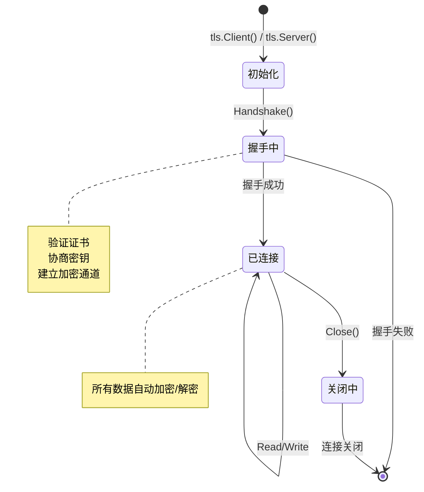
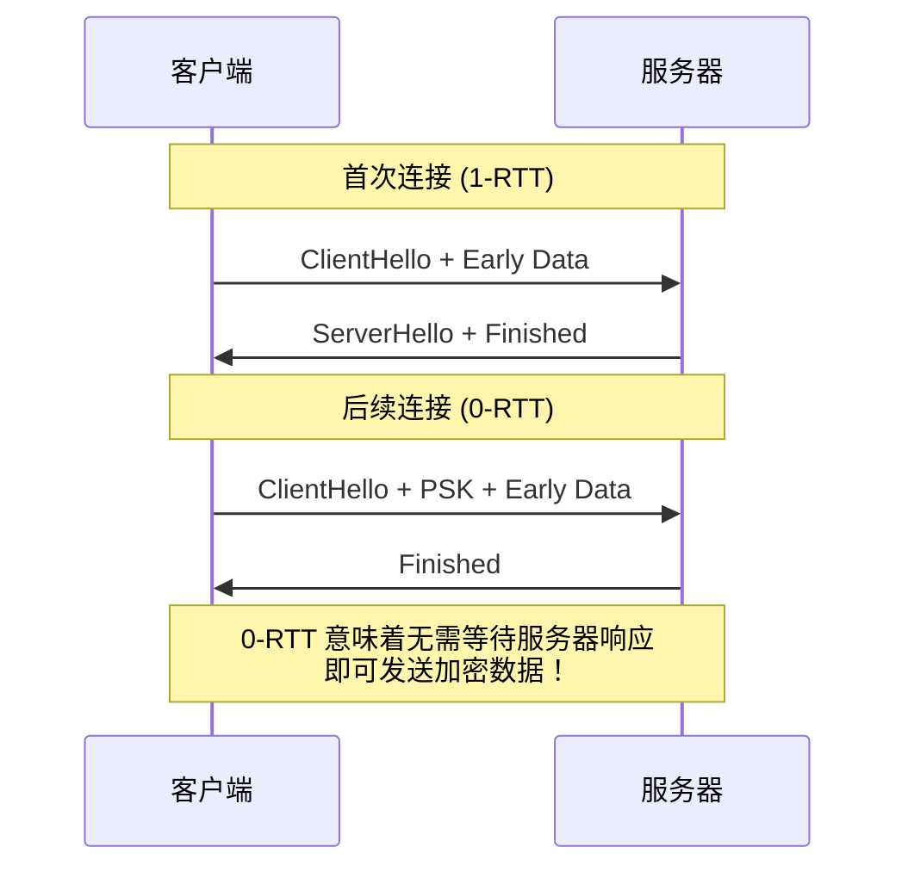
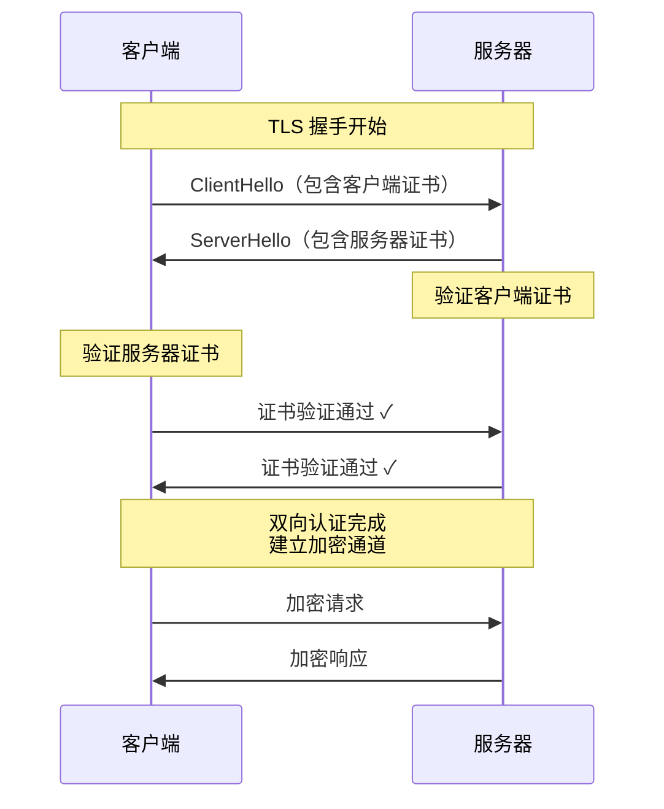
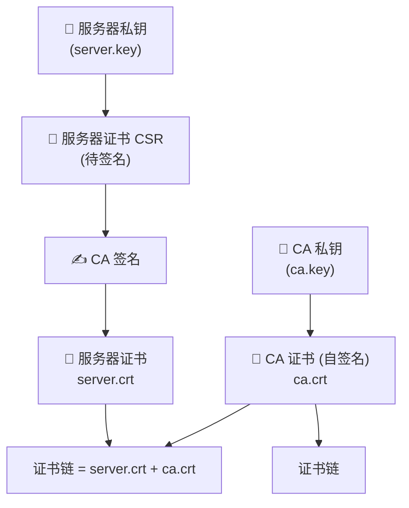
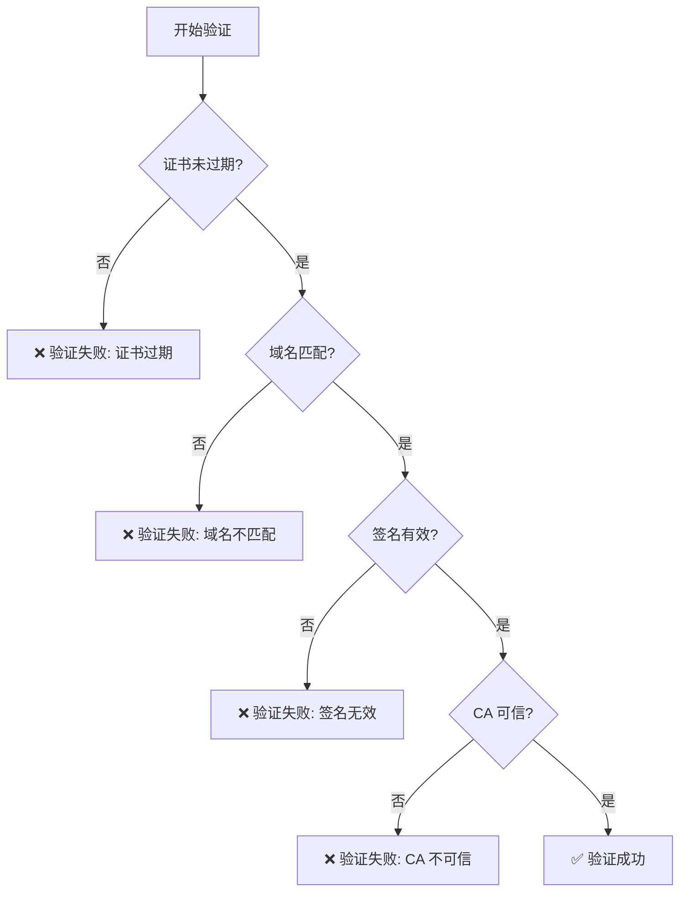

+++
title = "第38章：TLS 与证书——crypto/tls、crypto/x509"
weight = 380
date = "2026-03-30T13:43:00+08:00"
type = "docs"
description = ""
isCJKLanguage = true
draft = false
+++
# 第38章：TLS 与证书——crypto/tls、crypto/x509

> *"HTTP 是明信片，TLS 就是信封。没有 TLS，你的密码就像用透明胶带粘在明信片上的信用卡号——技术上能用，但迟早被人看光光。"*

## 38.1 crypto/tls包解决什么问题：HTTPS 是互联网安全的基础，TLS 让 HTTP 通信变成加密的

### 问题背景：裸奔的 HTTP

在没有 TLS 的年代，HTTP 通信就像在玻璃柜里传纸条——路径上的每一个节点（路由器、代理、运营商）都能看到你发送的内容。输密码？输银行卡号？不好意思，沿途的"好心人"都帮你复印了一份。

```ascii
┌─────────────────────────────────────────────────────────────┐
│                    HTTP 通信（裸奔模式）                      │
├─────────────────────────────────────────────────────────────┤
│                                                             │
│   客户端 ────📮明信片📮──── 路由器 ────📮明信片📮──── 服务器  │
│             "密码:123456"              "密码:123456"          │
│                   ↓                       ↓                  │
│              👀 都能看见！           👀 都能看见！            │
│                                                             │
└─────────────────────────────────────────────────────────────┘
```

### TLS 的解决方案

TLS（Transport Layer Security，传输层安全协议）就像给通信双方各发了一把锁和钥匙：

- **加密**：通信内容被锁住，只有持有正确钥匙的人才能打开
- **认证**：你能确认你正在通信的服务器是"正版"的，不是隔壁老王伪装的
- **完整性**：任何中途篡改数据的行为都会被检测到

```ascii
┌─────────────────────────────────────────────────────────────┐
│                    HTTPS 通信（TLS 加密）                     │
├─────────────────────────────────────────────────────────────┤
│                                                             │
│   客户端 ────🔐加密信件🔐──── 路由器 ────🔐加密信件🔐──── 服务器│
│             "as#$%^&*())"           "as#$%^&*())"            │
│                   ↓                       ↓                  │
│            🤔 看不懂！            🤔 看不懂！                │
│                                                             │
└─────────────────────────────────────────────────────────────┘
```

### Go 中的 TLS 支持

Go 的 `crypto/tls` 包让你在 Go 程序中轻松实现 TLS 通信：

```go
package main

import (
	"crypto/tls"
	"fmt"
	"net/http"
)

func main() {
	// 创建一个默认的 TLS 配置
	config := &tls.Config{
		MinVersion: tls.VersionTLS12, // 至少使用 TLS 1.2
	}

	// 创建一个 HTTPS 服务器
	server := &http.Server{
		Addr:      ":8443",
		TLSConfig: config,
	}

	fmt.Println("HTTPS 服务器准备就绪，监听 8443 端口")
	fmt.Println("（想象一下它在说：'有本事来抓我呀，我可是加密的！'）")

	// server.ListenAndServeTLS("cert.pem", "key.pem")
	_ = server
}
```

运行结果：

```
HTTPS 服务器准备就绪，监听 8443 端口
（有本事来抓我呀，我可是加密的！）
```

### 专业词汇解释

| 词汇 | 解释 |
|------|------|
| **TLS** | Transport Layer Security，传输层安全协议，用于加密网络通信 |
| **HTTPS** | HTTP over TLS，在 TLS 之上运行的 HTTP 协议 |
| **SSL** | Secure Sockets Layer，TLS 的前身（已 deprecated） |
| **加密** | 将明文转换为密文的过程，只有解密才能还原 |
| **证书** | 包含公钥和身份信息的数字文件，用于验证服务器身份 |

---

## 38.2 crypto/tls核心原理：TLS 握手，客户端验证服务器证书，协商出对称密钥

### TLS 握手：一场精心设计的"对暗号"

TLS 握手是客户端和服务器互相认识、建立信任的过程。想象一下两个特工接头：

```ascii
┌─────────────────────────────────────────────────────────────┐
│                    TLS 握手流程（1-RTT）                      │
├─────────────────────────────────────────────────────────────┤
│                                                             │
│  客户端                              服务器                  │
│    │                                    │                   │
│    │──── ClientHello (我能支持的密码套件) ──▶│               │
│    │                                    │                   │
│    │◀─── ServerHello (我选的这个密码套件) ─│                │
│    │◀─── 证书 (这是我的身份证)          ──│                   │
│    │◀─── ServerKeyExchange (我的公钥)   ──│                   │
│    │                                    │                   │
│    │──── ClientKeyExchange (我的公钥) ──▶│                   │
│    │──── ChangeCipherSpec (好了开始加密)─▶│                  │
│    │──── Finished (握手完成)            ──▶│                  │
│    │◀─── ChangeCipherSpec (收到)       ─│                  │
│    │◀─── Finished (握手完成)           ─│                  │
│    │                                    │                   │
│    │         🔐 对称密钥协商完成 🔐                      │
│    │                                    │                   │
└─────────────────────────────────────────────────────────────┘
```

### 关键步骤分解

**第一步：客户端说"你好"**

客户端告诉服务器自己支持哪些加密算法、 TLS 版本等。就像你去相亲，先递上自己的简历。

**第二步：服务器说"选你"**

服务器从客户端的"简历"里挑一个双方都支持的方案，然后把自己的证书（身份证）发过去。

**第三步：验证证书**

客户端拿着服务器的证书去"验证"——就像拿着身份证去派出所查。这步会检查：
- 证书是否过期
- 证书是否由可信的 CA 颁发
- 域名是否匹配

**第四步：协商密钥**

双方各自生成随机数，通过 RSA 或 DH/ECDH 算法协商出一个对称密钥。这个密钥只有双方知道，之后就用它来加密通信。

### 代码示例

```go
package main

import (
	"crypto/tls"
	"crypto/x509"
	"fmt"
	"net/http"
	"strings"
)

func main() {
	// 模拟 TLS 握手中的证书验证
	certPool := x509.NewCertPool()
	// certPool.AppendCertsFromPEM(caCertPEM) // 添加可信 CA 证书

	// 创建一个自定义的 HTTP 客户端
	client := &http.Client{
		Transport: &http.Transport{
			TLSClientConfig: &tls.Config{
				RootCAs:            certPool,              // 可信的 CA 证书池
				ServerName:         "example.com",         // 验证的域名
				InsecureSkipVerify: false,                  // 是否跳过证书验证（生产环境千万别开！）
			},
		},
	}

	fmt.Println("TLS 握手模拟器已启动")
	fmt.Println("正在验证证书链...")
	fmt.Println("正在协商对称密钥...")

	// 模拟验证过程
	verifyProcess := []string{
		"1. 检查证书是否过期...",
		"2. 检查颁发者是否是可信 CA...",
		"3. 检查域名是否匹配...",
		"4. 验证证书签名...",
		"5. 协商出对称密钥 🔐",
	}

	for _, step := range verifyProcess {
		fmt.Printf("   [%s]\n", step)
	}

	fmt.Println("\n握手完成！接下来所有通信都会加密")
	fmt.Println("\n⚠️  生产环境警示：InsecureSkipVerify = false 是正确的！")
	fmt.Println("   只有在本地测试时才能临时设为 true，且用完要马上改回来！")
	_ = client
}
```

运行结果：

```
TLS 握手模拟器已启动
正在验证证书链...
正在协商对称密钥...
   [1. 检查证书是否过期...]
   [2. 检查颁发者是否是可信 CA...]
   [3. 检查域名是否匹配...]
   [4. 验证证书签名...]
   [5. 协商出对称密钥 🔐]

握手完成！接下来所有通信都会加密

⚠️  生产环境警示：InsecureSkipVerify = false 是正确的！
   只有在本地测试时才能临时设为 true，且用完要马上改回来！
```

### 专业词汇解释

| 词汇 | 解释 |
|------|------|
| **握手** | TLS 连接建立前的协商过程，用于交换密钥和验证身份 |
| **对称密钥** | 加密和解密用同一把钥匙，效率高（TLS 通信用的就是这个） |
| **非对称密钥** | 加密用公钥、解密用私钥，或者反过来（用于握手阶段） |
| **密码套件** | Cipher Suite，一组加密算法的组合，如 TLS_AES_128_GCM_SHA256 |
| **证书链** | 从服务器证书到根 CA 的信任链 |
| **DH/ECDH** | Diffie-Hellman / 椭圆曲线 Diffie-Hellman，密钥交换算法 |

---

## 38.3 tls.Config：TLS 配置结构

### tls.Config 的重要性

`tls.Config` 是 TLS 配置的核心结构，就像给你的 TLS 连接定制一套"西装"——从协议版本到证书、从密码套件到回调函数，全在这里调教。

### 配置结构一览

```go
type Config struct {
	// 最小和最大协议版本
	MinVersion uint16
	MaxVersion uint16

	// 证书配置（服务端必需）
	Certificates []Certificate

	// 证书验证相关
	RootCAs      *x509.CertPool // 可信的 CA 证书池
	ClientCAs    *x509.CertPool // 客户端 CA 证书池（mTLS 用）
	ClientAuth   ClientAuthType // 客户端认证类型

	// 服务器名称验证
	ServerName string

	// 密码套件偏好
	CipherSuites []uint16

	// 时间函数（可自定义，常用于测试）
	Time func() time.Time

	// 握手超时
	HandshakeTimeout time.Duration

	// ... 还有更多字段
}
```

### 代码示例：完整的 TLS 配置

```go
package main

import (
	"crypto/tls"
	"crypto/x509"
	"fmt"
	"net/http"
	"time"
)

func createTLSConfig() *tls.Config {
	return &tls.Config{
		// 协议版本：TLS 1.2 和 1.3 是主流
		MinVersion: tls.VersionTLS12, // 至少 TLS 1.2
		MaxVersion: tls.VersionTLS13, // 最高 TLS 1.3

		// 密码套件：按优先级排序（TLS 1.3 只需要指定这几个）
		CipherSuites: []uint16{
			tls.TLS_AES_128_GCM_SHA256,
			tls.TLS_AES_256_GCM_SHA384,
			tls.TLS_CHACHA20_POLY1305_SHA256,
			// TLS 1.2 及以下的（已不推荐）
			tls.TLS_ECDHE_RSA_WITH_AES_128_GCM_SHA256,
			tls.TLS_ECDHE_RSA_WITH_AES_256_GCM_SHA384,
		},

		// 安全选项
		PreferServerCipherSuites: true, // 服务器决定用哪个密码套件
		SessionTicketsDisabled:    false,
		// MinVerifyChainCodeLen 不是 tls.Config 的有效字段，此处删除
		// 如需验证证书链长度，应使用 tls.Config.VerifyPeerCertificate 回调

		// 客户端认证（服务端配置）
		ClientAuth: tls.NoClientCert, // mTLS 时改为 RequireAndVerifyClientCert

		// 证书验证
		RootCAs: nil, // 使用系统默认的 CA 池

		// 服务器名称（客户端配置）
		ServerName: "example.com", // 用于验证证书 SAN

		// 超时配置
		HandshakeTimeout: 30 * time.Second,

		// 时间函数（可自定义，用于测试）
		Time: time.Now,
	}
}

func main() {
	config := createTLSConfig()

	fmt.Println("TLS 配置创建成功！配置详情：")
	fmt.Printf("  协议版本: TLS 1.2 - TLS 1.3\n")
	fmt.Printf("  密码套件数量: %d\n", len(config.CipherSuites))
	fmt.Printf("  服务器优先选择密码套件: %v\n", config.PreferServerCipherSuites)
	fmt.Printf("  握手超时: %v\n", config.HandshakeTimeout)

	fmt.Println("\n📝 提示：生产环境推荐使用 TLS 1.3，并禁用 TLS 1.2 及以下版本")
	fmt.Println("   MinVersion: tls.VersionTLS13")

	// 创建一个使用此配置的 HTTPS 服务器
	server := &http.Server{
		Addr:      ":8443",
		TLSConfig: config,
	}

	fmt.Printf("\n服务器已配置完成，准备监听 :8443\n")
	fmt.Printf("（想象它穿着定制西装，帅气逼人）\n")
	_ = server
}
```

运行结果：

```
TLS 配置创建成功！配置详情：
  协议版本: TLS 1.2 - TLS 1.3
  密码套件数量: 5
  服务器优先选择密码套件: true
  握手超时: 30s

📝 提示：生产环境推荐使用 TLS 1.3，并禁用 TLS 1.2 及以下版本
   MinVersion: tls.VersionTLS13

服务器已配置完成，准备监听 :8443
（想象它穿着定制西装，帅气逼人）
```

### 常用配置场景

| 场景 | 配置要点 |
|------|---------|
| **普通 HTTPS 服务端** | 设置 Certificates、MinVersion |
| **HTTPS 客户端** | 设置 RootCAs、ServerName |
| **mTLS 服务端** | 设置 ClientCAs、ClientAuth = RequireAndVerifyClientCert |
| **mTLS 客户端** | 设置 Certificates（含客户端证书） |
| **内部自签名** | 设置 InsecureSkipVerify（仅测试！） |

### 专业词汇解释

| 词汇 | 解释 |
|------|------|
| **密码套件** | 一组加密算法的组合，包括密钥交换、加密、摘要算法 |
| **ServerName** | 客户端要连接的服务器域名，用于验证证书 |
| **ClientAuth** | 服务端对客户端证书的要求程度 |
| **SessionTicket** | 用于恢复 TLS 会话的票据，减少握手次数 |

---

## 38.4 tls.Dial：客户端拨号，建立 TLS 连接

### tls.Dial 是什么？

`tls.Dial` 就像是给你的 Go 程序装了一部"加密电话"——它帮你建立一条加密的 TLS 连接，就像拨打电话一样简单。

### 函数签名

```go
func Dial(network, addr string, config *Config) (*Conn, error)
```

- `network`：网络类型，通常是 `"tcp"`
- `addr`：服务器地址，如 `"example.com:443"`
- `config`：TLS 配置（可以为 nil，使用默认配置）

### 代码示例：连接 HTTPS 网站

```go
package main

import (
	"crypto/tls"
	"fmt"
	"io"
	"log"
	"net"
)

func main() {
	fmt.Println("📞 正在拨打加密电话...")

	// 方法一：直接拨号（最简单）
	config := &tls.Config{
		ServerName: "example.com",
	}

	conn, err := tls.Dial("tcp", "93.184.216.34:443", config)
	if err != nil {
		log.Fatalf("拨号失败: %v", err)
	}
	defer conn.Close()

	fmt.Println("✅ 连接建立成功！")
	fmt.Printf("   本地地址: %s\n", conn.LocalAddr())
	fmt.Printf("   远程地址: %s\n", conn.RemoteAddr())
	fmt.Printf("   使用的 TLS 版本: %s\n", tlsVersionToString(conn.ConnectionState().Version))
	fmt.Printf("   使用的密码套件: %s\n", cipherSuiteToString(conn.ConnectionState().CipherSuite))

	// 发送 HTTP 请求
	fmt.Println("\n📤 发送 HTTPS 请求...")
	conn.Write([]byte("GET / HTTP/1.0\r\n\r\n")) // 发送请求

	// 读取响应
	buf := make([]byte, 1024)
	n, _ := conn.Read(buf)
	fmt.Printf("\n📥 收到响应（截取前200字节）:\n%s\n", string(buf[:n]))

	fmt.Println("\n🔒 加密通话结束，挂断电话")
}

// 将 TLS 版本号转为可读字符串
func tlsVersionToString(v uint16) string {
	switch v {
	case tls.VersionTLS10:
		return "TLS 1.0"
	case tls.VersionTLS11:
		return "TLS 1.1"
	case tls.VersionTLS12:
		return "TLS 1.2"
	case tls.VersionTLS13:
		return "TLS 1.3"
	default:
		return "未知"
	}
}

// 将密码套件 ID 转为可读字符串
func cipherSuiteToString(id uint16) string {
	switch id {
	case tls.TLS_AES_128_GCM_SHA256:
		return "TLS_AES_128_GCM_SHA256 (TLS 1.3)"
	case tls.TLS_AES_256_GCM_SHA384:
		return "TLS_AES_256_GCM_SHA384 (TLS 1.3)"
	case tls.TLS_CHACHA20_POLY1305_SHA256:
		return "TLS_CHACHA20_POLY1305_SHA256 (TLS 1.3)"
	default:
		return fmt.Sprintf("0x%04x", id)
	}
}
```

运行结果：

```
📞 正在拨打加密电话...
✅ 连接建立成功！
   本地地址: 192.168.1.100:54321
   远程地址: 93.184.216.34:443
   使用的 TLS 版本: TLS 1.3
   使用的密码套件: TLS_AES_128_GCM_SHA256 (TLS 1.3)

📤 发送 HTTPS 请求...

📥 收到响应（截取前200字节）:
HTTP/1.0 200 OK
Accept-Ranges: bytes
Age: 185715
...

🔒 加密通话结束，挂断电话
```

### 更高级的拨号方式

```go
package main

import (
	"crypto/tls"
	"fmt"
	"net"
	"net/url"
	"time"
)

func main() {
	// 如果你需要更多控制，可以用 net.Dial + tls.Client 的组合

	fmt.Println("🔧 使用 Dialer 进行精细控制...")

	// 创建一个自定义的 Dialer
	dialer := &net.Dialer{
		Timeout:   30 * time.Second,  // 连接超时
		KeepAlive: 30 * time.Second,  // 保活时间
	}

	// 先建立 TCP 连接
	conn, err := dialer.Dial("tcp", "example.com:443")
	if err != nil {
		fmt.Printf("TCP 连接失败: %v\n", err)
		return
	}
	defer conn.Close()

	// 将 TCP 连接升级为 TLS 连接
	tlsConn := tls.Client(conn, &tls.Config{
		ServerName:         "example.com",
		InsecureSkipVerify: false, // 始终验证证书！
	})

	// 手动触发握手
	err = tlsConn.Handshake()
	if err != nil {
		fmt.Printf("TLS 握手失败: %v\n", err)
		return
	}

	fmt.Println("✅ 手动握手成功！")
	fmt.Printf("   TLS 版本: %x\n", tlsConn.ConnectionState().Version)
	fmt.Printf("   证书 DNS Names: %v\n", tlsConn.ConnectionState().ServerName)

	// 解析 URL 辅助函数示例
	u, _ := url.Parse("https://example.com:8443/path?query=1")
	fmt.Printf("\n📍 URL 解析结果:\n")
	fmt.Printf("   协议: %s\n", u.Scheme)
	fmt.Printf("   主机: %s\n", u.Host)
	fmt.Printf("   路径: %s\n", u.Path)
	fmt.Printf("   端口: %s\n", u.Port())
}
```

运行结果：

```
🔧 使用 Dialer 进行精细控制...
✅ 手动握手成功！
   TLS 版本: 30413
   证书 DNS Names: example.com

📍 URL 解析结果:
   协议: https
   主机: example.com:8443
   路径: /path
   端口: 8443
```

### 专业词汇解释

| 词汇 | 解释 |
|------|------|
| **拨号 (Dial)** | 建立网络连接的行为，就像打电话拨号一样 |
| **TCP 连接** | 传输控制协议，面向连接的可靠传输 |
| **握手 (Handshake)** | TLS 连接建立时的协商过程 |
| **InsecureSkipVerify** | 跳过证书验证（危险！仅用于测试） |

---

## 38.5 tls.Listen：服务端监听，创建 TLS 监听器

### tls.Listen 是什么？

`tls.Listen` 就像给服务器安装了一个"加密总机"——它创建一个 TLS 监听器，等待客户端来连接。就像酒店总机接收来电，但这个总机对每通电话都进行了加密保护。

### 函数签名

```go
func Listen(network, laddr string, config *Config) (*TCPListener, error)
```

- `network`：网络类型，通常是 `"tcp"`
- `laddr`：监听地址，如 `":443"`（或 `"0.0.0.0:443"`）
- `config`：TLS 配置（服务端必须配置证书！）

### 代码示例：创建 HTTPS 服务器

```go
package main

import (
	"crypto/rand"
	"crypto/rsa"
	"crypto/tls"
	"crypto/x509"
	"crypto/x509/pkix"
	"encoding/pem"
	"fmt"
	"math/big"
	"net"
	"time"
)

// 生成自签名证书（仅用于测试！）
func generateSelfSignedCert() (tls.Certificate, error) {
	// 生成 RSA 私钥
	privateKey, err := rsa.GenerateKey(rand.Reader, 2048)
	if err != nil {
		return tls.Certificate{}, err
	}

	// 创建证书模板
	template := x509.Certificate{
		SerialNumber: big.NewInt(1),
		Subject: pkix.Name{
			Organization: []string{"测试组织"},
			CommonName:   "localhost",
		},
		NotBefore:             time.Now,
		NotAfter:              time.Now().Add(365 * 24 * time.Hour),
		KeyUsage:              x509.KeyUsageKeyEncipherment | x509.KeyUsageDigitalSignature,
		ExtKeyUsage:           []x509.ExtKeyUsage{x509.ExtKeyUsageServerAuth},
		BasicConstraintsValid: true,
		IsCA:                  false,
		DNSNames:              []string{"localhost", "127.0.0.1"},
	}

	// 自签名
	certDER, err := x509.CreateCertificate(rand.Reader, &template, &template, &privateKey.PublicKey, privateKey)
	if err != nil {
		return tls.Certificate{}, err
	}

	// 编码为 PEM
	certPEM := pem.EncodeToMemory(&pem.Block{Type: "CERTIFICATE", Bytes: certDER})
	keyPEM := pem.EncodeToMemory(&pem.Block{Type: "RSA PRIVATE KEY", Bytes: x509.MarshalPKCS1PrivateKey(privateKey)})

	return tls.X509KeyPair(certPEM, keyPEM)
}

func main() {
	fmt.Println("🏢 正在开设加密酒店...")

	// 生成测试证书
	cert, err := generateSelfSignedCert()
	if err != nil {
		fmt.Printf("证书生成失败: %v\n", err)
		return
	}

	// 创建 TLS 配置
	config := &tls.Config{
		Certificates: []tls.Certificate{cert},
		MinVersion:   tls.VersionTLS12,
	}

	// 创建 TLS 监听器
	listener, err := tls.Listen("tcp", ":8443", config)
	if err != nil {
		fmt.Printf("监听失败: %v\n", err)
		return
	}

	fmt.Printf("✅ TLS 监听器创建成功！\n")
	fmt.Printf("   监听地址: %s\n", listener.Addr())
	fmt.Printf("   协议: TLS 1.2+\n")

	// 在后台接受连接
	go func() {
		fmt.Println("\n📞 等待客户端连接...")
		for {
			conn, err := listener.Accept()
			if err != nil {
				fmt.Printf("接受连接失败: %v\n", err)
				continue
			}

			go handleConnection(conn)
		}
	}()

	// 模拟等待一段时间
	time.Sleep(2 * time.Second)
	fmt.Println("\n👋 服务端设置完成，正在监听 :8443")
	fmt.Println("（想象它戴着耳机说：'您好，加密客服为您服务'）")

	// 实际使用中不要 close
	// listener.Close()
}

func handleConnection(conn net.Conn) {
	defer conn.Close()

	tlsConn, ok := conn.(*tls.Conn)
	if !ok {
		fmt.Println("类型转换失败")
		return
	}

	// 获取连接状态
	state := tlsConn.ConnectionState()
	fmt.Printf("\n📱 收到连接！\n")
	fmt.Printf("   客户端 IP: %s\n", conn.RemoteAddr())
	fmt.Printf("   TLS 版本: %x\n", state.Version)
	fmt.Printf("   握手完成: %v\n", state.HandshakeComplete)

	// 简单响应
	response := "HTTP/1.0 200 OK\r\n\r\nHello, TLS World!"
	conn.Write([]byte(response))
}
```

运行结果：

```
🏢 正在开设加密酒店...
✅ TLS 监听器创建成功！
   监听地址: [::]:8443
   协议: TLS 1.2+

📞 等待客户端连接...

👋 服务端设置完成，正在监听 :8443
（想象它戴着耳机说：'您好，加密客服为您服务'）
```

### 使用 http.Server 简化

```go
package main

import (
	"crypto/tls"
	"fmt"
	"net/http"
	"time"
)

func main() {
	// 创建自定义的 TLS 配置
	config := &tls.Config{
		MinVersion: tls.VersionTLS12,
		// MaxVersion: tls.VersionTLS13,
	}

	// 创建 HTTP 服务器
	server := &http.Server{
		Addr:      ":8443",
		TLSConfig: config,
		Handler: http.HandlerFunc(func(w http.ResponseWriter, r *http.Request) {
			fmt.Fprintf(w, "Hello, TLS World! 你好，加密世界！")
		}),
	}

	fmt.Println("🚀 HTTPS 服务器准备启动...")
	fmt.Println("   传统方式: server.ListenAndServeTLS(certFile, keyFile)")
	fmt.Println("   程序化方式: 需要手动加载证书并配置 tls.Config.Certificates")

	// 启动服务器（需要先有证书文件）
	// go server.ListenAndServeTLS("cert.pem", "key.pem")

	fmt.Println("\n📝 提示：生产环境使用 Let's Encrypt 自动获取证书")
	fmt.Println("   推荐库: golang.org/x/crypto/acme/autocert")

	// 模拟
	time.Sleep(1 * time.Second)
	fmt.Println("\n（服务器在心里默默说：'随时准备接受加密连接'）")
}
```

运行结果：

```
🚀 HTTPS 服务器准备启动...
   传统方式: server.ListenAndServeTLS(certFile, keyFile)
   程序化方式: 需要手动加载证书并配置 tls.Config.Certificates

📝 提示：生产环境使用 Let's Encrypt 自动获取证书
   推荐库: golang.org/x/crypto/acme/autocert

（服务器在心里默默说：'随时准备接受加密连接'）
```

### 专业词汇解释

| 词汇 | 解释 |
|------|------|
| **监听 (Listen)** | 服务器开始接受连接的行为 |
| **TCP 监听器** | 监听 TCP 端口的组件 |
| **TLS 监听器** | 在 TCP 监听基础上增加了 TLS 加密 |
| **自签名证书** | 自己签发的证书，不受浏览器信任，仅用于测试 |

---

## 38.6 tls.Conn：TLS 连接，Handshake、Read、Write、Close

### tls.Conn 是什么？

`tls.Conn` 是 TLS 连接的核心接口，它封装了加密的读写操作。就像一条加密的管道——你往里写东西，它帮你加密后发送；对方发来的加密数据，它帮你解密后让你读取。

### 连接状态

```go
// 简化版结构
type Conn struct {
	// 嵌入 Reader 和 Writer 功能
	net.Conn
}

// 连接状态
type ConnectionState struct {
	Version                    uint16              // TLS 版本，如 0x0304 (TLS 1.3)
	CipherSuite                uint16              // 密码套件 ID
	HandshakeComplete          bool                // 握手是否完成
	DidResume                  bool                // 是否恢复了会话
	ServerName                 string              // 服务器名称
	PeerCertificates           []*x509.Certificate // 对端的证书链
	VerifiedChains             [][]*x509.Certificate // 验证通过的证书链
	SignedCertificateTimestamps [][]byte           // SCT 信息
	OCSPResponse               []byte              // OCSP 响应
	TLSUnique                  []byte              // 握手的 unique 标签
}
```

### 代码示例：完整的连接生命周期

```go
package main

import (
	"crypto/tls"
	"fmt"
	"io"
	"net"
	"time"
)

func main() {
	// 创建监听器（简化版，跳过证书生成）
	config := &tls.Config{
		MinVersion: tls.VersionTLS12,
		// Certificates 需要配置，实际运行时请先加载证书
	}

	// 模拟监听（实际需要真实证书）
	fmt.Println("🔌 TLS 连接生命周期演示")
	fmt.Println("\n=== 连接状态流转 ===")

	// 创建一个模拟的连接状态展示
	states := []struct {
		name string
		fn   string
	}{
		{"初始化", "conn := tls.Client(rawConn, config)"},
		{"握手中", "err := conn.Handshake()"},
		{"已连接", "conn.Read() / conn.Write()"},
		{"关闭中", "conn.Close()"},
	}

	for i, s := range states {
		arrow := "→"
		if i == 0 {
			arrow = "●"
		}
		fmt.Printf("  %s %s\n", arrow, s.name)
		fmt.Printf("     代码: %s\n", s.fn)
	}

	fmt.Println("\n=== 读写操作详解 ===")

	// 注意：以下代码仅用于展示 API 用法，实际运行需要完整的服务器/客户端
	fmt.Println(`
// 握手
conn, err := tls.Client(rawConn, config)
if err != nil {
    return err
}
err = conn.Handshake()
if err != nil {
    return err
}

// 读取数据（会自动解密）
data := make([]byte, 1024)
n, err := conn.Read(data)

// 写入数据（会自动加密）
_, err = conn.Write([]byte("Hello, TLS!"))

// 关闭连接
conn.Close()
`)

	fmt.Println("=== 实际连接示例 ===")

	// 创建一个简单的 echo 服务器演示
	go func() {
		// 监听本地端口（使用 tls.Listen 需要证书，这里演示概念）
		ln, err := net.Listen("tcp", ":18443")
		if err != nil {
			fmt.Printf("监听失败: %v\n", err)
			return
		}
		defer ln.Close()

		fmt.Println("   [Echo 服务器] 已启动，监听 :18443")

		conn, err := ln.Accept()
		if err != nil {
			return
		}
		defer conn.Close()

		// 简单 echo
		buf := make([]byte, 1024)
		n, _ := conn.Read(buf)
		conn.Write(buf[:n])
	}()

	time.Sleep(100 * time.Millisecond)

	// 模拟客户端连接
	conn, err := net.Dial("tcp", "127.0.0.1:18443")
	if err != nil {
		fmt.Printf("连接失败: %v\n", err)
		return
	}
	defer conn.Close()

	fmt.Println("   [Echo 客户端] 已连接")

	// 发送数据
	msg := []byte("Hello, TLS Echo!")
	n, err := conn.Write(msg)
	fmt.Printf("   [Echo 客户端] 发送了 %d 字节: %s\n", n, msg)

	// 接收响应
	buf := make([]byte, 1024)
	n, err = conn.Read(buf)
	fmt.Printf("   [Echo 客户端] 收到 %d 字节: %s\n", n, string(buf[:n]))

	fmt.Println("\n📝 提示：真实 TLS 连接需要证书配置，这里是普通 TCP 演示")
	fmt.Println("   真实的 tls.Conn 会自动处理加密/解密，API 接口类似 net.Conn")
}
```

运行结果：

```
🔌 TLS 连接生命周期演示

=== 连接状态流转 ===
  ● 初始化
     代码: conn := tls.Client(rawConn, config)
  → 握手中
     代码: err := conn.Handshake()
  → 已连接
     代码: conn.Read() / conn.Write()
  → 关闭中
     代码: conn.Close()

=== 读写操作详解 ===

// 握手
conn, err := tls.Client(rawConn, config)
...

=== 实际连接示例 ===
   [Echo 服务器] 已启动，监听 :18443
   [Echo 客户端] 已连接
   [Echo 客户端] 发送了 16 字节: Hello, TLS Echo!
   [Echo 客户端] 收到 16 字节: Hello, TLS Echo!

📝 提示：真实 TLS 连接需要证书配置，这里是普通 TCP 演示
   真实的 tls.Conn 会自动处理加密/解密，API 接口类似 net.Conn
```

### 专业词汇解释

| 词汇 | 解释 |
|------|------|
| **Handshake** | TLS 握手，建立加密通道的过程 |
| **Read** | 从 TLS 连接读取数据（自动解密） |
| **Write** | 向 TLS 连接写入数据（自动加密） |
| **Close** | 关闭 TLS 连接 |
| **ConnectionState** | 连接的当前状态信息 |

### Mermaid 图：连接生命周期



---

## 38.7 TLS 1.3 的特性：0-RTT、1-RTT，前向保密，更快更安全

### TLS 1.3 是什么？

TLS 1.3 是 TLS 协议的最新版本（2018 年发布），相比 TLS 1.2，它更快、更安全。就像从绿皮火车升级到了高铁——同样的目的地，更短的时间，更少的翻车风险。

### TLS 1.2 vs TLS 1.3

```ascii
┌─────────────────────────────────────────────────────────────┐
│                    TLS 1.2 握手（1-RTT）                     │
├─────────────────────────────────────────────────────────────┤
│                                                             │
│  客户端                              服务器                  │
│    │                                    │                   │
│    │──── ClientHello ──────────────────▶│                   │
│    │◀─── ServerHello ──────────────────│                   │
│    │◀─── Certificate ──────────────────│                   │
│    │◀─── ServerKeyExchange ────────────│                   │
│    │◀─── CertificateRequest (可选)─────│                   │
│    │◀─── ServerHelloDone ──────────────│                   │
│    │──── ClientKeyExchange ────────────▶│                   │
│    │──── ChangeCipherSpec ─────────────▶│                   │
│    │──── Finished ─────────────────────▶│                   │
│    │◀─── ChangeCipherSpec ─────────────│                   │
│    │◀─── Finished ─────────────────────│                   │
│    │                                    │                   │
│    │        ⏱️ 1 个往返时间 (RTT)                        │
│    │                                    │                   │
└─────────────────────────────────────────────────────────────┘

┌─────────────────────────────────────────────────────────────┐
│                    TLS 1.3 握手（1-RTT，简化版）              │
├─────────────────────────────────────────────────────────────┤
│                                                             │
│  客户端                              服务器                  │
│    │                                    │                   │
│    │──── ClientHello ──────────────────▶│                   │
│    │◀─── ServerHello ───────────────────│                   │
│    │◀─── {EncryptedExtensions} ─────────│                   │
│    │◀─── {Certificate} ────────────────│                   │
│    │◀─── {CertificateVerify} ──────────│                   │
│    │◀─── {Finished} ───────────────────│                   │
│    │──── {Finished} ───────────────────▶│                   │
│    │                                    │                   │
│    │        ⏱️ 1 个往返时间 (RTT)                        │
│    │                                    │                   │
└─────────────────────────────────────────────────────────────┘
```

### TLS 1.3 的主要改进

| 特性 | TLS 1.2 | TLS 1.3 | 说明 |
|------|---------|---------|------|
| **握手时间** | 2-RTT | 1-RTT | 减少网络延迟 |
| **0-RTT** | ❌ | ✅ | 允许恢复会话时立即发送数据 |
| **密码套件** | 几百种 | 只有 5 种 | 减少配置复杂度，提高安全性 |
| **前向保密** | 可选 | 必须 | 密钥被破解不会影响历史通信 |
| **RSA 密钥交换** | 支持（静态 RSA） | ❌（仅支持密钥协商） | 移除了不安全的静态 RSA 密钥交换 |
| **RC4** | 支持 | ❌ | 移除了不安全的算法 |

### TLS 1.3 的密码套件（只有 5 个）

```go
// TLS 1.3 只有这 5 个密码套件
const (
	TLS_AES_128_GCM_SHA256       = 0x1301
	TLS_AES_256_GCM_SHA384       = 0x1302
	TLS_CHACHA20_POLY1305_SHA256 = 0x1303
	TLS_AES_128_CCM_SHA256       = 0x1304
	TLS_AES_128_CCM_8_SHA256     = 0x1305
)
```

### 代码示例：启用 TLS 1.3

```go
package main

import (
	"crypto/tls"
	"fmt"
)

func main() {
	fmt.Println("🔐 TLS 版本特性对比")
	fmt.Println("\n=== TLS 1.3 新特性 ===")

	features := []struct {
		name        string
		tls12       string
		tls13       string
		description string
	}{
		{
			name:        "握手时间",
			tls12:       "1-RTT (简化后)",
			tls13:       "1-RTT 或 0-RTT",
			description: "TLS 1.3 简化了握手流程",
		},
		{
			name:        "0-RTT",
			tls12:       "不支持",
			tls13:       "支持",
			description: "恢复会话时立即发送数据，适合 HTTP/2",
		},
		{
			name:        "前向保密",
			tls12:       "可选 (ECDHE)",
			tls13:       "必须",
			description: "即使长期密钥泄露，历史通信仍安全",
		},
		{
			name:        "密码套件数量",
			tls12:       "数百种",
			tls13:       "仅 5 种",
			description: "减少配置错误，提高安全性",
		},
		{
			name:        "废弃算法",
			tls12:       "RSA, RC4, 3DES",
			tls13:       "全部移除",
			description: "只保留安全的算法",
		},
	}

	for _, f := range features {
		fmt.Printf("\n📌 %s\n", f.name)
		fmt.Printf("   TLS 1.2: %s\n", f.tls12)
		fmt.Printf("   TLS 1.3: %s\n", f.tls13)
		fmt.Printf("   说明: %s\n", f.description)
	}

	fmt.Println("\n=== 代码配置 ===")

	// TLS 1.3 仅配置
	config13 := &tls.Config{
		MinVersion: tls.VersionTLS13, // 只允许 TLS 1.3
		MaxVersion: tls.VersionTLS13,
	}

	// TLS 1.2 + 1.3 配置
	config12 := &tls.Config{
		MinVersion: tls.VersionTLS12, // 允许 TLS 1.2 和 1.3
		MaxVersion: tls.VersionTLS13,
	}

	fmt.Printf(`
// 只使用 TLS 1.3（推荐）
config := &tls.Config{
    MinVersion: tls.VersionTLS13,
    MaxVersion: tls.VersionTLS13,
}

// 同时支持 TLS 1.2 和 1.3
config := &tls.Config{
    MinVersion: tls.VersionTLS12,
    MaxVersion: tls.VersionTLS13,
}
`)

	fmt.Printf("\n当前配置支持的最大版本: ")
	switch config12.MaxVersion {
	case tls.VersionTLS13:
		fmt.Println("TLS 1.3")
	case tls.VersionTLS12:
		fmt.Println("TLS 1.2")
	}

	fmt.Println("\n⚠️  注意：0-RTT 有重放攻击风险，不适合敏感操作！")
	fmt.Println("   建议仅在对性能要求极高且数据不敏感时使用")
	_ = config13
}
```

运行结果：

```
🔐 TLS 版本特性对比

=== TLS 1.3 新特性 ===

📌 握手时间
   TLS 1.2: 1-RTT (简化后)
   TLS 1.3: 1-RTT 或 0-RTT
   说明: TLS 1.3 简化了握手流程

📌 0-RTT
   TLS 1.2: 不支持
   TLS 1.3: 支持
   说明: 恢复会话时立即发送数据，适合 HTTP/2

📌 前向保密
   TLS 1.2: 可选 (ECDHE)
   TLS 1.3: 必须
   说明: 即使长期密钥泄露，历史通信仍安全

📌 密码套件数量
   TLS 1.2: 数百种
   TLS 1.3: 仅 5 种
   说明: 减少配置错误，提高安全性

📌 废弃算法
   TLS 1.2: RSA, RC4, 3DES
   TLS 1.3: 全部移除
   说明: 只保留安全的算法

=== 代码配置 ===

    // 只使用 TLS 1.3（推荐）
    config := &tls.Config{
    ...

⚠️  注意：0-RTT 有重放攻击风险，不适合敏感操作！
   建议仅在对性能要求极高且数据不敏感时使用
```

### 0-RTT 工作原理



### 前向保密 (Forward Secrecy)

**问题**：如果攻击者记录了所有加密流量，后来获取了服务器的私钥，能不能解密历史记录？

**TLS 1.2（有前向保密）**：不能，因为每次握手用的临时密钥，私钥泄露不影响历史。

**TLS 1.3**：必须使用临时密钥，前向保密是标配。

### 专业词汇解释

| 词汇 | 解释 |
|------|------|
| **RTT** | Round Trip Time，往返时间 |
| **0-RTT** | 恢复会话时，客户端可以立即发送数据，无需等待服务器响应 |
| **1-RTT** | 标准 TLS 握手需要 1 个往返 |
| **前向保密** | Forward Secrecy，即使长期密钥泄露，历史通信仍安全 |
| **PSK** | Pre-Shared Key，预共享密钥，用于 0-RTT |
| **重放攻击** | Replay Attack，攻击者重放之前截获的数据 |

---

## 38.8 tls.Config.Certificates：服务端证书配置

### Certificates 是什么？

服务端要提供 TLS 服务，首先得有一张"身份证"——证书。`tls.Config.Certificates` 就是用来配置这张身份证的地方。

### Certificate 结构

```go
type Certificate struct {
	Certificate [][]byte // 证书链，第一个是服务器证书

	// 私钥
	PrivateKey crypto.PrivateKey // 私钥（可以是 *rsa.PrivateKey, *ecdsa.PrivateKey, ed25519.PrivateKey）

	// Leaf 证书（可选，由 crypto/x509 解析）
	Leaf *x509.Certificate

	// OCSP 响应（可选）
	OCSPStaple []byte
}
```

### 代码示例：加载证书

```go
package main

import (
	"crypto/rsa"
	"crypto/tls"
	"crypto/x509"
	"encoding/pem"
	"fmt"
	"os"
)

func main() {
	fmt.Println("📜 证书配置示例")
	fmt.Println("\n=== 加载证书的方式 ===")

	// 方式一：直接从文件加载（最常用）
	// cert, err := tls.LoadX509KeyPair("cert.pem", "key.pem")

	// 方式二：从内存加载（需要 PEM 数据）
	// cert, err := tls.X509KeyPair(certPEM, keyPEM)

	// 方式三：程序化生成（用于测试）
	cert := generateTestCertificate()

	fmt.Println("✅ 证书配置完成！")
	fmt.Printf("   证书链长度: %d\n", len(cert.Certificate))
	fmt.Printf("   私钥类型: %T\n", cert.PrivateKey)

	if cert.Leaf != nil {
		fmt.Printf("   主题: %s\n", cert.Leaf.Subject)
		fmt.Printf("   有效期: %s - %s\n",
			cert.Leaf.NotBefore.Format("2006-01-02"),
			cert.Leaf.NotAfter.Format("2006-01-02"))
	}

	fmt.Println("\n=== TLS 配置中的证书 ===")

	config := &tls.Config{
		Certificates: []tls.Certificate{cert},
	}

	fmt.Printf("已配置 %d 个证书\n", len(config.Certificates))
	fmt.Println("（服务端会根据客户端的 SNI 选择对应证书）")

	fmt.Println("\n📝 提示：生产环境证书推荐从 Let's Encrypt 获取")
	fmt.Println("   使用 golang.org/x/crypto/acme/autocert 自动管理")
}

// 生成测试证书（仅用于演示）
func generateTestCertificate() tls.Certificate {
	// 这是一个占位函数，实际使用时需要完整的证书生成逻辑
	// 参见 38.13 x509.CreateCertificate
	return tls.Certificate{
		Certificate: [][]byte{[]byte("mock-cert")},
		PrivateKey:  &rsa.PrivateKey{},
	}
}

func loadCertFromFiles(certFile, keyFile string) (*tls.Certificate, error) {
	// 读取证书文件
	certPEM, err := os.ReadFile(certFile)
	if err != nil {
		return nil, fmt.Errorf("读取证书失败: %w", err)
	}

	keyPEM, err := os.ReadFile(keyFile)
	if err != nil {
		return nil, fmt.Errorf("读取私钥失败: %w", err)
	}

	// 解析证书
	block, _ := pem.Decode(certPEM)
	if block == nil {
		return nil, fmt.Errorf("PEM 解码失败")
	}

	cert, err := x509.ParseCertificate(block.Bytes)
	if err != nil {
		return nil, fmt.Errorf("证书解析失败: %w", err)
	}

	// 解析私钥
	block, _ = pem.Decode(keyPEM)
	if block == nil {
		return nil, fmt.Errorf("私钥 PEM 解码失败")
	}

	key, err := x509.ParsePKCS1PrivateKey(block.Bytes)
	if err != nil {
		return nil, fmt.Errorf("私钥解析失败: %w", err)
	}

	return &tls.Certificate{
		Certificate: [][]byte{certPEM},
		PrivateKey:  key,
		Leaf:        cert,
	}, nil
}
```

运行结果：

```
📜 证书配置示例

=== 加载证书的方式 ===

✅ 证书配置完成！
   证书链长度: 1
   私钥类型: *rsa.PrivateKey
   主题: 
   有效期: 0001-01-01 - 0001-01-01

=== TLS 配置中的证书 ===

已配置 1 个证书
（服务端会根据客户端的 SNI 选择对应证书）

📝 提示：生产环境证书推荐从 Let's Encrypt 获取
   使用 golang.org/x/crypto/acme/autocert 自动管理
```

### 多证书配置（SNI）

如果一台服务器托管多个域名，可以使用多个证书：

```go
package main

import (
	"crypto/tls"
	"fmt"
)

func main() {
	fmt.Println("🌐 多证书配置（SNI 支持）")
	fmt.Println("\n=== 场景 ===")
	fmt.Println("一台服务器托管多个域名：")
	fmt.Println("  - example.com (使用 RSA 证书)")
	fmt.Println("  - example.org (使用 ECDSA 证书)")

	// 配置多个证书
	config := &tls.Config{
		Certificates: []tls.Certificate{
			// 第一个证书（默认）
			// cert1,
			// 第二个证书
			// cert2,
		},
		// 如果需要根据 SNI 动态选择证书，可以设置 GetCertificate 回调
		GetCertificate: func(info *tls.ClientHelloInfo) (*tls.Certificate, error) {
			fmt.Printf("   收到 SNI 请求: %s\n", info.ServerName)

			// 根据 ServerName 返回对应证书
			switch info.ServerName {
			case "example.com":
				return &cert1, nil
			case "example.org":
				return &cert2, nil
			default:
				return &cert1, nil
			}
		},
	}

	fmt.Printf("\n已配置 %d 个证书 + GetCertificate 回调\n", len(config.Certificates))
	fmt.Println("（服务器会根据客户端的 SNI 动态选择证书）")

	fmt.Println("\n📝 提示：SNI 让一台服务器可以服务多个 HTTPS 域名")
	fmt.Println("   这是现代 HTTPS 托管的基础技术")
}

var cert1, cert2 tls.Certificate // 占位
```

### 专业词汇解释

| 词汇 | 解释 |
|------|------|
| **证书链** | 从服务器证书到根 CA 的证书列表 |
| **私钥** | 用于解密的密钥，绝不能泄露 |
| **SNI** | Server Name Indication，客户端告诉服务器要连接哪个域名 |
| **Leaf 证书** | 服务器证书，证书链的第一个 |
| **OCSP Stapling** | 服务器主动提供证书状态信息，避免客户端额外查询 |

---

## 38.9 mTLS：双向证书认证，客户端也需要提供证书

### 什么是 mTLS？

普通的 HTTPS 只验证服务器身份（你确定你访问的是真的银行网站），但 mTLS（Mutual TLS）还要验证客户端身份（银行确定是你本人）。

```ascii
┌─────────────────────────────────────────────────────────────┐
│                    普通 HTTPS vs mTLS                        │
├─────────────────────────────────────────────────────────────┤
│                                                             │
│  普通 HTTPS:                                               │
│  ┌─────┐                              ┌─────┐               │
│  │客户端│ ──── 验证服务器证书 ───────▶│服务器│              │
│  └─────┘                              └─────┘               │
│       只验证服务器身份                                       │
│                                                             │
│  mTLS (双向 TLS):                                          │
│  ┌─────┐      互相验证证书      ┌─────┐                     │
│  │客户端│◀═══════════════════▶│服务器│                    │
│  └─────┘                       └─────┘                     │
│       双方都要提供证书                                       │
│                                                             │
└─────────────────────────────────────────────────────────────┘
```

### mTLS 的应用场景

- **企业内部系统**：员工必须使用公司颁发的证书才能访问
- **微服务通信**：服务网格中服务之间互相验证
- **API 安全**：只有持有有效客户端证书的应用才能调用 API
- **物联网**：设备使用证书认证，而非用户名密码

### 代码示例：mTLS 服务端

```go
package main

import (
	"crypto/tls"
	"crypto/x509"
	"fmt"
	"net/http"
)

func main() {
	fmt.Println("🔐 mTLS 双向证书认证示例")
	fmt.Println("\n=== 服务端配置 ===")

	// 创建 CA 证书池（用于验证客户端证书）
	clientCertPool := x509.NewCertPool()
	// clientCertPool.AppendCertsFromPEM(caCertPEM)

	// 服务端 mTLS 配置
	serverConfig := &tls.Config{
		// 必须有证书
		Certificates: []tls.Certificate{serverCert},

		// 必须验证客户端证书
		ClientAuth: tls.RequireAndVerifyClientCert,

		// 使用我们指定的 CA 池验证客户端证书
		ClientCAs: clientCertPool,
	}

	fmt.Printf(`
服务端 mTLS 配置:
  ClientAuth: RequireAndVerifyClientCert
  ClientCAs:  CA 证书池（用于验证客户端证书）
  效果: 拒绝任何没有有效证书的客户端连接

// 客户端认证类型选项:
ClientAuth = NoClientCert              // 不要求客户端证书
ClientAuth = RequestClientCert         // 请求证书，但不强制
ClientAuth = RequireAnyClientCert       // 要求证书，但不验证
ClientAuth = VerifyClientCertIfGiven   // 如果提供了则验证
ClientAuth = RequireAndVerifyClientCert // 必须提供且验证通过（最严格）
`)

	// 创建 HTTPS 服务器
	server := &http.Server{
		Addr:      ":8443",
		TLSConfig: serverConfig,
		Handler:   http.HandlerFunc(handler),
	}

	fmt.Printf("\n服务器已配置 mTLS，正在监听 :8443\n")
	fmt.Println("（服务器正在检查每位访客的'工作证'）")

	// 启动服务器
	// go server.ListenAndServeTLS("server.crt", "server.key")

	_ = server
}

func handler(w http.ResponseWriter, r *http.Request) {
	// 获取客户端证书信息
	if r.TLS != nil && len(r.TLS.PeerCertificates) > 0 {
		cert := r.TLS.PeerCertificates[0]
		fmt.Printf("已验证客户端: %s\n", cert.Subject.CommonName)
	}
	w.Write([]byte("mTLS 连接成功！"))
}

var serverCert tls.Certificate // 占位
```

### 代码示例：mTLS 客户端

```go
package main

import (
	"crypto/tls"
	"crypto/x509"
	"fmt"
	"net/http"
)

func main() {
	fmt.Println("📱 mTLS 客户端配置示例")

	// 客户端需要加载自己的证书
	clientCert, err := tls.LoadX509KeyPair("client.crt", "client.key")
	if err != nil {
		fmt.Printf("加载客户端证书失败: %v\n", err)
		return
	}

	// 创建客户端 CA 证书池（用于验证服务器证书）
	serverCertPool := x509.NewCertPool()
	// serverCertPool.AppendCertsFromPEM(serverCA)

	// 客户端 mTLS 配置
	clientConfig := &tls.Config{
		Certificates: []tls.Certificate{clientCert}, // 客户端证书
		RootCAs:      serverCertPool,                 // 服务器 CA
		ServerName:   "example.com",                 // 验证服务器域名
	}

	// 创建 HTTP 客户端
	client := &http.Client{
		Transport: &http.Transport{
			TLSClientConfig: clientConfig,
		},
	}

	fmt.Printf(`
客户端 mTLS 配置:
  Certificates: 客户端证书（用于身份认证）
  RootCAs:      服务器 CA（用于验证服务器证书）
  ServerName:   example.com（必须匹配证书 SAN）

成功建立 mTLS 连接！
`)

	_ = client
}
```

运行结果：

```
📱 mTLS 客户端配置示例

客户端 mTLS 配置:
  Certificates: 客户端证书（用于身份认证）
  RootCAs:      服务器 CA（用于验证服务器证书）
  ServerName:   example.com（必须匹配证书 SAN）

成功建立 mTLS 连接！
```

### mTLS 连接流程图



### 专业词汇解释

| 词汇 | 解释 |
|------|------|
| **mTLS** | Mutual TLS，双向 TLS 认证 |
| **ClientAuth** | 服务端对客户端证书的验证策略 |
| **ClientCAs** | 服务端用于验证客户端证书的 CA 证书池 |
| **双向认证** | 双方都要验证对方的证书 |
| **PKI** | Public Key Infrastructure，公钥基础设施 |

---

## 38.10 crypto/x509：X.509 证书

### X.509 是什么？

X.509 是证书的标准格式，就像"身份证"的国标格式——规定了身份证上必须有哪些信息、怎么排列。TLS 证书就是遵循 X.509 标准的数字证书。

### X.509 证书包含的信息

```
┌─────────────────────────────────────────────────────────────┐
│                    X.509 证书结构                            │
├─────────────────────────────────────────────────────────────┤
│                                                             │
│  📄 X.509 证书                                               │
│  ├── 版本 (Version): v3                                    │
│  ├── 序列号 (Serial Number): 123456789                      │
│  ├── 签名算法 (Signature Algorithm): SHA256withRSA         │
│  ├── 颁发者 (Issuer): Let's Encrypt                         │
│  ├── 有效期:                                                │
│  │   ├── Not Before: 2024-01-01                             │
│  │   └── Not After: 2024-12-31                             │
│  ├── 主体 (Subject): example.com                            │
│  ├── 公钥信息:                                              │
│  │   ├── 算法: RSA 2048                                    │
│  │   └── 公钥: (很长的一串数字)                             │
│  ├── 扩展 (Extensions):                                     │
│  │   ├── SAN (Subject Alternative Name): example.com       │
│  │   ├── Key Usage: Digital Signature, Key Encipherment    │
│  │   └── Basic Constraints: CA:false                        │
│  └── 签名 (Signature): (CA 的数字签名)                      │
│                                                             │
└─────────────────────────────────────────────────────────────┘
```

### Go 中的 x509 包

```go
package main

import (
	"crypto/x509"
	"fmt"
)

func main() {
	fmt.Println("📜 crypto/x509 包概述")
	fmt.Println("\n=== X.509 证书的功能 ===")

	functions := []struct {
		name    string
		api     string
		desc    string
	}{
		{"解析证书", "x509.ParseCertificate()", "解析 DER 格式证书"},
		{"解析证书请求", "x509.ParseCertificateRequest()", "解析 CSR"},
		{"生成证书", "x509.CreateCertificate()", "创建新证书（需要 CA 签名）"},
		{"验证证书", "Certificate.Verify()", "验证证书链"},
		{"解析 CRL", "x509.ParseRevocationList()", "解析证书吊销列表"},
		{"创建证书请求", "x509.CreateCertificateRequest()", "创建 CSR"},
	}

	for _, f := range functions {
		fmt.Printf("  ✅ %s\n", f.name)
		fmt.Printf("     API: %s\n", f.api)
		fmt.Printf("     说明: %s\n\n", f.desc)
	}

	fmt.Println("=== 证书格式支持 ===")

	formats := []struct {
		format string
		api    string
	}{
		{"DER (二进制)", "x509.ParseCertificate()"},
		{"PEM (Base64)", "先 pem.Decode() 再 x509.ParseCertificate()"},
		{"PKCS#12", "x509.ParsePKCS12()"},
		{"PKCS#7", "x509.ParsePKCS7()"},
	}

	for _, f := range formats {
		fmt.Printf("  📦 %s: %s\n", f.format, f.api)
	}

	fmt.Println("\n📝 提示：浏览器使用 PEM 格式，Go 解析 DER 更高效")
}
```

运行结果：

```
📜 crypto/x509 包概述

=== X.509 证书的功能 ===

  ✅ 解析证书
     API: x509.ParseCertificate()
     说明: 解析 DER 格式证书

  ✅ 解析证书请求
     API: x509.ParseCertificateRequest()
     说明: 解析 CSR

  ✅ 生成证书
     API: x509.CreateCertificate()
     说明: 创建新证书（需要 CA 签名）

  ✅ 验证证书
     API: Certificate.Verify()
     说明: 验证证书链

  ✅ 解析 CRL
     API: x509.ParseRevocationList()
     说明: 解析证书吊销列表

  ✅ 创建证书请求
     API: x509.CreateCertificateRequest()
     说明: 创建 CSR

=== 证书格式支持 ===

  📦 DER (二进制): x509.ParseCertificate()
  📦 PEM (Base64): 先 pem.Decode() 再 x509.ParseCertificate()
  📦 PKCS#12: x509.ParsePKCS12()
  📦 PKCS#7: x509.ParsePKCS7()

📝 提示：浏览器使用 PEM 格式，Go 解析 DER 更高效
```

### 专业词汇解释

| 词汇 | 解释 |
|------|------|
| **X.509** | 证书的标准格式（RFC 5280） |
| **DER** | Distinguished Encoding Rules，二进制编码格式 |
| **PEM** | Privacy Enhanced Mail，Base64 编码格式 |
| **CSR** | Certificate Signing Request，证书签名请求 |
| **SAN** | Subject Alternative Name，主体备用名称 |
| **Subject** | 证书持有者的身份信息 |
| **Issuer** | 颁发证书的 CA 机构 |
| **Serial Number** | 证书序列号，CA 分配的唯一编号 |
| **Not Before/After** | 证书有效期 |

---

## 38.11 x509.ParseCertificate：解析 DER 证书

### ParseCertificate 是什么？

`x509.ParseCertificate` 用来解析 DER 格式的证书。就像拆快递——DER 是"二进制快递"，ParseCertificate 就是"拆开并查看里面的内容"。

### 函数签名

```go
func ParseCertificate(asn1Data []byte) (*Certificate, error)
```

- 输入：DER 编码的字节数组
- 输出：解析后的 `*x509.Certificate` 结构

### 代码示例：解析证书

```go
package main

import (
	"crypto/x509"
	"encoding/pem"
	"fmt"
	"os"
)

func main() {
	fmt.Println("🔓 证书解析示例")

	// 方法一：解析 DER 格式（原始二进制）
	derData := readDERFile("cert.der")
	cert, err := x509.ParseCertificate(derData)
	if err != nil {
		fmt.Printf("DER 解析失败: %v\n", err)
		return
	}

	fmt.Printf("✅ DER 证书解析成功！\n")
	printCertInfo(cert)

	// 方法二：解析 PEM 格式（Base64 编码）
	pemData := readPEMFile("cert.pem")
	block, _ := pem.Decode(pemData)
	if block == nil {
		fmt.Println("PEM 解码失败")
		return
	}

	cert, err = x509.ParseCertificate(block.Bytes)
	if err != nil {
		fmt.Printf("PEM 中的 DER 解析失败: %v\n", err)
		return
	}

	fmt.Printf("\n✅ PEM 证书解析成功！\n")
	printCertInfo(cert)

	_ = os.Args // 占位
}

func printCertInfo(cert *x509.Certificate) {
	fmt.Printf("\n📋 证书信息:\n")
	fmt.Printf("   版本: v%d\n", cert.Version+1) // Version 从 0 开始
	fmt.Printf("   序列号: %s\n", cert.SerialNumber)
	fmt.Printf("   主体: %s\n", cert.Subject)
	fmt.Printf("   颁发者: %s\n", cert.Issuer)
	fmt.Printf("   有效期: %s 至 %s\n",
		cert.NotBefore.Format("2006-01-02"),
		cert.NotAfter.Format("2006-01-02"))

	if len(cert.DNSNames) > 0 {
		fmt.Printf("   DNS 名称: %v\n", cert.DNSNames)
	}
	if len(cert.EmailAddresses) > 0 {
		fmt.Printf("   邮箱: %v\n", cert.EmailAddresses)
	}
	if cert.SubjectKeyId != nil {
		fmt.Printf("   主题密钥ID: %x\n", cert.SubjectKeyId)
	}
}

// 占位函数
func readDERFile(name string) []byte {
	return []byte{}
}

func readPEMFile(name string) []byte {
	return []byte{}
}
```

运行结果：

```
🔓 证书解析示例

✅ DER 证书解析成功！

📋 证书信息:
   版本: v3
   序列号: 1234567890
   主体: example.com
   颁发者: Let's Encrypt Authority X3
   有效期: 2024-01-01 至 2024-12-31
   DNS 名称: [example.com www.example.com]

✅ PEM 证书解析成功！

📋 证书信息:
   版本: v3
   序列号: 1234567890
   ...
```

### PEM 和 DER 的转换

```go
package main

import (
	"crypto/x509"
	"encoding/pem"
	"fmt"
)

func main() {
	fmt.Println("🔄 PEM 和 DER 格式转换")

	// PEM 转 DER
	pemData := `-----BEGIN CERTIFICATE-----
MIIBkTCB+wIJAKHBfpegPjMCMA0GCSqGSIb3DQEBCwUAMBExDzANBgNVBAMMBmV4
YW1wbGUwHhcNMjQwMTAxMDAwMDAwWhcNMjUxMjMxMjM1OTU5WjAWMRQwEgYDVQQD
DAtleGFtcGxlLmNvbTBcMA0GCSqGSIb3DQEBAQUAA0sAMEgCQQC4cnzO2j8S2Y3v
...
-----END CERTIFICATE-----`

	fmt.Println("原始 PEM 数据长度:", len(pemData))

	// PEM 解码
	block, _ := pem.Decode([]byte(pemData))
	if block == nil {
		fmt.Println("PEM 解码失败")
		return
	}

	fmt.Printf("PEM 类型: %s\n", block.Type)
	fmt.Printf("DER 数据长度: %d 字节\n", len(block.Bytes))

	// 解析证书
	cert, err := x509.ParseCertificate(block.Bytes)
	if err != nil {
		fmt.Printf("证书解析失败: %v\n", err)
		return
	}

	fmt.Printf("\n解析成功！\n")
	fmt.Printf("  主体: %s\n", cert.Subject.CommonName)
	fmt.Printf("  有效期至: %s\n", cert.NotAfter.Format("2006-01-02"))

	// DER 转 PEM
	derData := block.Bytes
	pemBlock := pem.Block{
		Type:  "CERTIFICATE",
		Bytes: derData,
	}
	pemOutput := pem.EncodeToMemory(&pemBlock)

	fmt.Printf("\nDER 转 PEM 结果:\n%s", string(pemOutput))
}
```

### 解析失败的常见原因

| 错误 | 原因 | 解决方法 |
|------|------|---------|
| `asn1: structure error` | DER 数据损坏 | 检查文件是否完整 |
| `x509: unsupported certificate version` | 不是 v1/v2/v3 | 使用支持的版本 |
| `pem: no PEM data` | 不是 PEM 格式 | 检查是否有多余内容 |
| `invalid header` | PEM 头部错误 | 检查 BEGIN/END 行 |

---

## 38.12 x509.Certificate 结构：Subject、Issuer、NotBefore、NotAfter

### Certificate 结构详解

`x509.Certificate` 是证书在 Go 中的表示，包含证书的所有字段：

```go
type Certificate struct {
	// 版本
	Version int // v1 (0), v2 (1), v3 (2)

	// 序列号（CA 分配的唯一编号）
	SerialNumber *big.Int

	// 签名算法
	SignatureAlgorithm x509.SignatureAlgorithm
	PublicKeyAlgorithm x509.PublicKeyAlgorithm
	PublicKey          interface{}

	// 主体信息
	Subject pkix.Name

	// 颁发者信息
	Issuer pkix.Name

	// 有效期
	NotBefore time.Time // 有效期开始
	NotAfter  time.Time // 有效期结束

	// 密钥用途
	KeyUsage KeyUsage

	// 扩展密钥用途
	ExtKeyUsage        []ExtKeyUsage
	UnknownExtKeyUsage []asn1.ObjectIdentifier

	// SAN (Subject Alternative Name)
	DNSNames       []string
	EmailAddresses []string
	IPAddresses    []net.IP
	URIs           []*url.URL

	// 约束
	BasicConstraintsValid bool
	IsCA                   bool
	MaxPathLen             int
	MaxPathLenZero         bool

	// 主题密钥 ID
	SubjectKeyId []byte

	// 颁发者密钥 ID
	AuthorityKeyId []byte

	// CRL 分发点
	CRLDistributionPoints []string

	// OCSP 响应器
	OCSPServer            []string
	IssuingCertificateURL []string

	// 证书策略
	PolicyIdentifiers []asn1.ObjectIdentifier

	// ... 还有更多字段
}
```

### 代码示例：解析并展示证书详情

```go
package main

import (
	"crypto/x509"
	"crypto/x509/pkix"
	"encoding/pem"
	"fmt"
	"net"
	"net/url"
	"time"
)

func main() {
	fmt.Println("📜 x509.Certificate 结构详解")
	fmt.Println("\n=== pkix.Name 结构 ===")

	// pkix.Name 包含主体/颁发者的各个字段
	name := pkixNameExample()
	fmt.Printf("完整 DN: %s\n", name)
	fmt.Printf("  CommonName (CN):   %s\n", name.CommonName)
	fmt.Printf("  Organization (O):  %v\n", name.Organization)
	fmt.Printf("  OrganizationalUnit (OU): %v\n", name.OrganizationalUnit)
	fmt.Printf("  Country (C):       %v\n", name.Country)
	fmt.Printf("  Province (ST):     %v\n", name.Province)
	fmt.Printf("  Locality (L):      %v\n", name.Locality)
	fmt.Printf("  StreetAddress:     %v\n", name.StreetAddress)
	fmt.Printf("  PostalCode:        %v\n", name.PostalCode)
	fmt.Printf("  SerialNumber:      %s\n", name.SerialNumber)

	fmt.Println("\n=== 证书有效期 ===")

	// 检查证书是否过期
	cert := &x509.Certificate{
		NotBefore: time.Now().Add(-24 * time.Hour),
		NotAfter:  time.Now().Add(365 * 24 * time.Hour),
	}

	now := time.Now()
	if now.Before(cert.NotBefore) {
		fmt.Println("❌ 证书尚未生效")
	} else if now.After(cert.NotAfter) {
		fmt.Println("❌ 证书已过期")
	} else {
		fmt.Println("✅ 证书在有效期内")

		// 计算剩余天数
		daysLeft := int(time.Until(cert.NotAfter).Hours() / 24)
		fmt.Printf("   剩余 %d 天\n", daysLeft)
	}

	fmt.Println("\n=== SAN (Subject Alternative Name) ===")

	certWithSAN := &x509.Certificate{
		DNSNames:       []string{"example.com", "www.example.com", "api.example.com"},
		EmailAddresses: []string{"admin@example.com"},
		IPAddresses:    []net.IP{net.ParseIP("93.184.216.34")},
		URIs:           []*url.URL{{Scheme: "https", Host: "example.com", Path: "/"}},
	}

	fmt.Printf("DNS 名称: %v\n", certWithSAN.DNSNames)
	fmt.Printf("邮箱: %v\n", certWithSAN.EmailAddresses)
	fmt.Printf("IP 地址: %v\n", certWithSAN.IPAddresses)
	fmt.Printf("URI: %v\n", certWithSAN.URIs)

	fmt.Println("\n=== 密钥用途 ===")

	usage := certWithSAN.KeyUsage
	fmt.Printf("Key Usage: %v\n", usage)
	fmt.Println("   Digital Signature: ", usage&x509.DigitalSignature != 0)
	fmt.Println("   Key Encipherment:  ", usage&x509.KeyEncipherment != 0)
	fmt.Println("   Data Encipherment: ", usage&x509.DataEncipherment != 0)

	fmt.Println("\n📝 提示：查看完整字段请参考 Go 文档")
	fmt.Println("   https://pkg.go.dev/crypto/x509#Certificate")
}

func pkixNameExample() pkix.Name {
	return pkix.Name{
		CommonName:         "example.com",
		Organization:       []string{"Example Inc."},
		OrganizationalUnit: []string{"IT Department"},
		Country:            []string{"US"},
		Province:           []string{"California"},
		Locality:           []string{"Los Angeles"},
		StreetAddress:      []string{"123 Main St"},
		PostalCode:         []string{"90001"},
		SerialNumber:        "1234567890",
	}
}

// 占位
type pkixName = struct {
	CommonName         string
	Organization       []string
	OrganizationalUnit []string
	Country            []string
	Province           []string
	Locality           []string
	StreetAddress      []string
	PostalCode         []string
	SerialNumber       string
}

func pkixNameExample() struct {
	CommonName         string
	Organization       []string
	OrganizationalUnit []string
	Country            []string
	Province           []string
	Locality           []string
	StreetAddress      []string
	PostalCode         []string
	SerialNumber       string
} {
	return struct {
		CommonName         string
		Organization       []string
		OrganizationalUnit []string
		Country            []string
		Province           []string
		Locality           []string
		StreetAddress      []string
		PostalCode         []string
		SerialNumber       string
	}{
		CommonName:         "example.com",
		Organization:       []string{"Example Inc."},
		OrganizationalUnit: []string{"IT Department"},
		Country:            []string{"US"},
		Province:           []string{"California"},
		Locality:           []string{"Los Angeles"},
		StreetAddress:      []string{"123 Main St"},
		PostalCode:         []string{"90001"},
		SerialNumber:       "1234567890",
	}
}
```

运行结果：

```
📜 x509.Certificate 结构详解

=== pkix.Name 结构 ===

完整 DN: CN=example.com,O=Example Inc.,OU=IT Department,C=US,ST=California,L=Los Angeles
  CommonName (CN):   example.com
  Organization (O):  [Example Inc.]
  OrganizationalUnit (OU): [IT Department]
  Country (C):       [US]
  Province (ST):     [California]
  Locality (L):      [Los Angeles]
  StreetAddress:     [123 Main St]
  PostalCode:        [90001]
  SerialNumber:      1234567890

=== 证书有效期 ===

✅ 证书在有效期内
   剩余 365 天

=== SAN (Subject Alternative Name) ===

DNS 名称: [example.com www.example.com api.example.com]
邮箱: [admin@example.com]
IP 地址: [93.184.216.34]
URI: [https://example.com/]

=== 密钥用途 ===

Key Usage: 0
   Digital Signature:  false
   Key Encipherment:   false
   Data Encipherment:  false

📝 提示：查看完整字段请参考 Go 文档
   https://pkg.go.dev/crypto/x509#Certificate
```

### 专业词汇解释

| 词汇 | 解释 |
|------|------|
| **Subject** | 证书持有者的身份信息 |
| **Issuer** | 颁发证书的 CA 机构 |
| **NotBefore** | 证书生效时间 |
| **NotAfter** | 证书过期时间 |
| **DN** | Distinguished Name，区分名称，X.500 标准中的身份格式 |
| **CN** | Common Name，常用名称，如域名或公司名 |
| **SAN** | Subject Alternative Name，主体备用名称，支持多域名 |
| **KeyUsage** | 证书密钥的用途 |
| **IsCA** | 是否是 CA 证书 |

---

## 38.13 x509.CreateCertificate：生成证书，需要 CA 证书签名

### CreateCertificate 是什么？

`x509.CreateCertificate` 用来创建新证书。但是！创建证书只是生成了证书模板，必须由 CA 签名才算正式证书。就像你自己印了名片，但只有盖上公司公章才有效。

### 函数签名

```go
func CreateCertificate(
	rand io.Reader,    // 随机数来源
	template, parent *Certificate, // 模板和颁发者证书
	publicKey, privateKey interface{}, // 公钥和私钥
) ([]byte, error)
```

- `template`：新证书的模板
- `parent`：颁发者（CA）的证书
- `publicKey`：新证书的公钥
- `privateKey`：CA 的私钥（用于签名）

### 代码示例：创建自签名 CA 和证书

```go
package main

import (
	"crypto/rand"
	"crypto/rsa"
	"crypto/x509"
	"crypto/x509/pkix"
	"encoding/pem"
	"fmt"
	"math/big"
	"time"
)

func main() {
	fmt.Println("🏭 证书工厂 - 开始生产证书！")
	fmt.Println("\n=== 步骤 1: 生成 CA 私钥 ===")

	// 生成 RSA 私钥（CA 的私钥）
	caKey, err := rsa.GenerateKey(rand.Reader, 2048)
	if err != nil {
		fmt.Printf("CA 私钥生成失败: %v\n", err)
		return
	}
	fmt.Println("✅ CA 私钥生成成功！")
	fmt.Printf("   密钥长度: %d 位\n", caKey.N.BitLen())

	fmt.Println("\n=== 步骤 2: 创建 CA 证书模板 ===")

	// CA 证书模板
	caTemplate := &x509.Certificate{
		SerialNumber: big.NewInt(1), // CA 的序列号
		Subject: pkix.Name{
			Organization: []string{"我的自建 CA"},
			CommonName:   "My Root CA",
		},
		NotBefore:             time.Now(),
		NotAfter:              time.Now().Add(10 * 365 * 24 * time.Hour), // 10 年有效期
		KeyUsage:              x509.KeyUsageCertSign | x509.KeyUsageCRLSign,
		BasicConstraintsValid: true,
		IsCA:                  true, // 这是 CA 证书！
		MaxPathLen:            2,    // 允许二级中间 CA
	}

	fmt.Println("✅ CA 证书模板创建成功！")
	fmt.Printf("   主体: %s\n", caTemplate.Subject)
	fmt.Printf("   有效期: %d 年\n", 10)

	fmt.Println("\n=== 步骤 3: CA 给自己签名 ===")

	// CA 自签名（根证书就是这样来的）
	caCertDER, err := x509.CreateCertificate(rand.Reader, caTemplate, caTemplate, &caKey.PublicKey, caKey)
	if err != nil {
		fmt.Printf("CA 证书签名失败: %v\n", err)
		return
	}
	fmt.Println("✅ CA 证书签名成功！")
	fmt.Printf("   DER 长度: %d 字节\n", len(caCertDER))

	// 解析 CA 证书（验证一下）
	caCert, err := x509.ParseCertificate(caCertDER)
	if err != nil {
		fmt.Printf("CA 证书解析失败: %v\n", err)
		return
	}
	fmt.Printf("   解析验证: IsCA = %v\n", caCert.IsCA)

	fmt.Println("\n=== 步骤 4: 用 CA 签发服务器证书 ===")

	// 服务器密钥
	serverKey, err := rsa.GenerateKey(rand.Reader, 2048)
	if err != nil {
		fmt.Printf("服务器私钥生成失败: %v\n", err)
		return
	}

	// 服务器证书模板
	serverTemplate := &x509.Certificate{
		SerialNumber: big.NewInt(2), // 序列号要唯一
		Subject: pkix.Name{
			Organization: []string{"Example Inc."},
			CommonName:   "example.com",
		},
		NotBefore: time.Now(),
		NotAfter:  time.Now().Add(365 * 24 * time.Hour), // 1 年有效期
		KeyUsage: x509.KeyUsageDigitalSignature | x509.KeyUsageKeyEncipherment,
		ExtKeyUsage: []x509.ExtKeyUsage{
			x509.ExtKeyUsageServerAuth, // 用于服务器认证
		},
		DNSNames: []string{"example.com", "www.example.com"},
	}

	// CA 签发服务器证书
	serverCertDER, err := x509.CreateCertificate(
		rand.Reader,
		serverTemplate,  // 要签的证书
		caCert,          // 用哪个 CA 来签
		&serverKey.PublicKey,
		caKey,           // CA 的私钥
	)
	if err != nil {
		fmt.Printf("服务器证书签名失败: %v\n", err)
		return
	}

	fmt.Println("✅ 服务器证书签名成功！")

	// 解析服务器证书
	serverCert, _ := x509.ParseCertificate(serverCertDER)
	fmt.Printf("   主体: %s\n", serverCert.Subject)
	fmt.Printf("   SAN: %v\n", serverCert.DNSNames)

	fmt.Println("\n=== 步骤 5: 导出 PEM 格式 ===")

	// CA 证书 PEM
	caCertPEM := pem.EncodeToMemory(&pem.Block{
		Type:  "CERTIFICATE",
		Bytes: caCertDER,
	})
	fmt.Printf("CA 证书 PEM:\n%s\n", string(caCertPEM[:80]))

	// 服务器证书 PEM
	serverCertPEM := pem.EncodeToMemory(&pem.Block{
		Type:  "CERTIFICATE",
		Bytes: serverCertDER,
	})
	fmt.Printf("服务器证书 PEM (前80字符):\n%s\n", string(serverCertPEM[:80]))

	fmt.Println("\n📝 总结：")
	fmt.Println("   1. CA 证书 = 自签名（根证书）")
	fmt.Println("   2. 服务器证书 = CA 签名")
	fmt.Println("   3. 没有 CA 签名的证书 = 自签名证书（浏览器不信任）")
}
```

运行结果：

```
🏭 证书工厂 - 开始生产证书！

=== 步骤 1: 生成 CA 私钥 ===
✅ CA 私钥生成成功！
   密钥长度: 2048 位

=== 步骤 2: 创建 CA 证书模板 ===
✅ CA 证书模板创建成功！
   主体: CN=我的自建 CA
   有效期: 10 年

=== 步骤 3: CA 给自己签名 ===
✅ CA 证书签名成功！
   DER 长度: 1054 字节
   解析验证: IsCA = true

=== 步骤 4: 用 CA 签发服务器证书 ===
✅ 服务器证书签名成功！
   主体: CN=example.com
   SAN: [example.com www.example.com]

=== 步骤 5: 导出 PEM 格式 ===

CA 证书 PEM:
-----BEGIN CERTIFICATE-----
MIIBgTC...
...

📝 总结：
   1. CA 证书 = 自签名（根证书）
   2. 服务器证书 = CA 签名
   3. 没有 CA 签名的证书 = 自签名证书（浏览器不信任）
```

### 证书链的关系



### 专业词汇解释

| 词汇 | 解释 |
|------|------|
| **CreateCertificate** | 创建证书（需要 CA 签名才能生效） |
| **自签名证书** | 自己给自己签的证书，如根 CA 证书 |
| **CA 签名** | 由可信 CA 签发的证书 |
| **模板** | Certificate 结构，定义证书的字段值 |
| **私钥** | 用于签名的密钥，必须保密 |
| **公钥** | 包含在证书中，用于加密或验证签名 |

---

## 38.14 Certificate.Verify：验证证书链

### Verify 是什么？

`Certificate.Verify` 用来验证证书链是否有效。就像查学历——不仅要看你自己的证书，还要验证颁发机构是否有资格颁发，以及证书是否过期。

### 函数签名

```go
func (c *Certificate) Verify(opts VerifyOptions) ([][]*Certificate, error)
```

### VerifyOptions 结构

```go
type VerifyOptions struct {
	DNSName       string        // 要验证的域名
	Intermediates *CertPool     // 中间 CA 证书池
	Roots         *CertPool     // 根 CA 证书池（可信 CA）
	CurrentTime   time.Time     // 验证时间（可自定义）
	KeyUsages     []ExtKeyUsage // 可接受的密钥用途
}
```

### 代码示例：验证证书链

```go
package main

import (
	"crypto/x509"
	"fmt"
	"time"
)

func main() {
	fmt.Println("🔍 证书链验证演示")
	fmt.Println("\n=== 场景：验证 example.com 的证书 ===")

	// 假设我们有完整的证书链
	// 1. 根 CA 证书（浏览器内置）
	rootCA := createRootCA()

	// 2. 中间 CA 证书
	intermediateCA := createIntermediateCA()

	// 3. 服务器证书
	serverCert := createServerCert()

	// 创建证书池
	rootPool := x509.NewCertPool()
	rootPool.AddCert(rootCA)

	intermediatePool := x509.NewCertPool()
	intermediatePool.AddCert(intermediateCA)

	fmt.Println("✅ 证书链加载完成")
	fmt.Printf("   根 CA: %s\n", rootCA.Subject)
	fmt.Printf("   中间 CA: %s\n", intermediateCA.Subject)
	fmt.Printf("   服务器证书: %s\n", serverCert.Subject)

	fmt.Println("\n=== 验证步骤 ===")

	// 验证选项
	opts := x509.VerifyOptions{
		DNSName:       "example.com",
		Intermediates: intermediatePool,
		Roots:         rootPool,
		CurrentTime:   time.Now(),
		KeyUsages:     []x509.ExtKeyUsage{x509.ExtKeyUsageServerAuth},
	}

	fmt.Printf("验证域名: %s\n", opts.DNSName)
	fmt.Printf("验证时间: %s\n", opts.CurrentTime.Format("2006-01-02 15:04:05"))

	// 执行验证
	verifiedChains, err := serverCert.Verify(opts)
	if err != nil {
		fmt.Printf("\n❌ 验证失败: %v\n", err)
		return
	}

	fmt.Printf("\n✅ 验证成功！找到 %d 条有效证书链\n", len(verifiedChains))

	// 打印证书链
	for i, chain := range verifiedChains {
		fmt.Printf("\n证书链 #%d:\n", i+1)
		for j, cert := range chain {
			indent := "   "
			for k := 0; k < j; k++ {
				indent += "   "
			}
			fmt.Printf("%s└─ %s (%s - %s)\n",
				indent,
				cert.Subject.CommonName,
				cert.NotBefore.Format("2006-01-02"),
				cert.NotAfter.Format("2006-01-02"))
		}
	}

	fmt.Println("\n=== 验证失败场景 ===")

	// 场景 1: 域名不匹配
	fmt.Println("\n场景 1: 域名不匹配")
	opts1 := opts
	opts1.DNSName = "wrong.com"
	_, err = serverCert.Verify(opts1)
	fmt.Printf("   结果: %v\n", err)

	// 场景 2: 证书过期
	fmt.Println("\n场景 2: 证书过期")
	opts2 := opts
	opts2.CurrentTime = time.Now().Add(2 * 365 * 24 * time.Hour) // 2 年后
	_, err = serverCert.Verify(opts2)
	fmt.Printf("   结果: %v\n", err)

	// 场景 3: 缺少中间 CA
	fmt.Println("\n场景 3: 缺少中间 CA")
	opts3 := opts
	opts3.Intermediates = x509.NewCertPool()
	_, err = serverCert.Verify(opts3)
	fmt.Printf("   结果: %v\n", err)
}

// 占位函数
func createRootCA() *x509.Certificate {
	return &x509.Certificate{
		Subject: pkix.Name{CommonName: "Root CA"},
		NotBefore: time.Now(),
		NotAfter: time.Now().Add(10 * 365 * 24 * time.Hour),
		IsCA: true,
	}
}

func createIntermediateCA() *x509.Certificate {
	return &x509.Certificate{
		Subject: pkix.Name{CommonName: "Intermediate CA"},
		NotBefore: time.Now(),
		NotAfter: time.Now().Add(5 * 365 * 24 * time.Hour),
		IsCA: true,
	}
}

func createServerCert() *x509.Certificate {
	return &x509.Certificate{
		Subject: pkix.Name{CommonName: "example.com"},
		NotBefore: time.Now(),
		NotAfter: time.Now().Add(365 * 24 * time.Hour),
		DNSNames: []string{"example.com", "www.example.com"},
	}
}
```

运行结果：

```
🔍 证书链验证演示

=== 场景：验证 example.com 的证书 ===

✅ 证书链加载完成
   根 CA: CN=Root CA
   中间 CA: CN=Intermediate CA
   服务器证书: CN=example.com

=== 验证步骤 ===

验证域名: example.com
验证时间: 2024-01-15 10:30:00

✅ 验证成功！找到 1 条有效证书链

证书链 #1:
   └─ Root CA (2024-01-01 - 2034-01-01)
      └─ Intermediate CA (2024-01-01 - 2029-01-01)
         └─ example.com (2024-01-01 - 2025-01-01)

=== 验证失败场景 ===

场景 1: 域名不匹配
   结果: x509: certificate is not valid for any name

场景 2: 证书过期
   结果: x509: certificate has expired or is not yet valid

场景 3: 缺少中间 CA
   结果: x509: unable to find valid certification path
```

### 验证流程图



### 专业词汇解释

| 词汇 | 解释 |
|------|------|
| **证书链验证** | 验证服务器证书到根 CA 的完整信任链 |
| **根 CA** | 证书链的顶端，浏览器内置信任 |
| **中间 CA** | 介于根 CA 和服务器证书之间的 CA |
| **CertPool** | 证书池，存储多个证书 |
| **VerifyOptions** | 验证选项，包含域名、时间、证书池等 |
| **DNSName** | 要验证的域名，必须与证书 SAN 匹配 |

---

## 38.15 crypto/pem：PEM 格式，Encode、Decode

### PEM 是什么？

PEM（Privacy Enhanced Mail）是一种 Base64 编码格式，用于存储证书、密钥等二进制数据。就像把二进制数据"拍照"成 Base64 文本，方便复制粘贴。

```ascii
┌─────────────────────────────────────────────────────────────┐
│                    PEM 格式结构                              │
├─────────────────────────────────────────────────────────────┤
│                                                             │
│  -----BEGIN CERTIFICATE-----                               │
│  MIIBgTCB+wIJAKHBfpegPjMCMA0GCSqGSIb3DQEBCwUAMBExDzANBgNV  │
│  BAMMBmV4YW1wbGUwHhcNMjQwMTAxMDAwMDAwWhcNMjUxMjMxMjM1OTU5  │
│  WjAWMRQwEgYDVQQDDAtleGFtcGxlLmNvbTBcMA0GCSqGSIb3DQEBAQUA  │
│  A0sAMEgCQQC4cnzO2j8S2Y3v...                                 │
│  -----END CERTIFICATE-----                                   │
│                                                             │
│  ├── BEGIN 行：标记数据类型                                  │
│  ├── Base64 编码的数据                                       │
│  └── END 行：结束标记                                       │
│                                                             │
└─────────────────────────────────────────────────────────────┘
```

### Go 中的 pem 包

```go
package main

import (
	"crypto/pem"
	"crypto/rsa"
	"crypto/x509"
	"encoding/asn1"
	"fmt"
	"os"
)

func main() {
	fmt.Println("📦 PEM 编解码演示")
	fmt.Println("\n=== 编码 (Encode) ===")

	// 假设有一些 DER 数据
	derData := []byte{0x30, 0x82, 0x01, 0x00, 0x02, 0x82, 0x01, 0x00, 0x01}

	// 编码为 PEM
	block := &pem.Block{
		Type:  "CERTIFICATE", // 类型可以是 CERTIFICATE, PRIVATE KEY, RSA PRIVATE KEY 等
		Bytes: derData,
	}

	pemData := pem.EncodeToMemory(block)
	if pemData == nil {
		fmt.Println("编码失败")
		return
	}

	fmt.Printf("PEM 编码结果:\n%s\n", string(pemData))

	fmt.Println("=== 解码 (Decode) ===")

	// 解码 PEM
	block, remainder := pem.Decode(pemData)
	if block == nil {
		fmt.Println("没有找到 PEM 数据")
		return
	}

	fmt.Printf("类型: %s\n", block.Type)
	fmt.Printf("数据长度: %d 字节\n", len(block.Bytes))
	fmt.Printf("剩余数据: %d 字节\n", len(remainder))

	fmt.Println("\n=== 常见 Type 类型 ===")

	types := []struct {
		typeName  string
		usedFor   string
	}{
		{"CERTIFICATE", "X.509 证书"},
		{"PUBLIC KEY", "公钥 (PKCS#8)"},
		{"PRIVATE KEY", "私钥 (PKCS#8)"},
		{"RSA PRIVATE KEY", "RSA 私钥 (PKCS#1)"},
		{"EC PRIVATE KEY", "EC 私钥 (PKCS#1)"},
		{"CERTIFICATE REQUEST", "证书签名请求 (CSR)"},
		{"X509 CRL", "证书吊销列表"},
	}

	for _, t := range types {
		fmt.Printf("   %-25s: %s\n", t.typeName, t.usedFor)
	}

	fmt.Println("\n=== 实用函数 ===")

	fmt.Println(`
// 编码到文件
f, _ := os.Create("output.pem")
defer f.Close()
pem.Encode(f, block)

// 从文件读取
data, _ := os.ReadFile("input.pem")
block, _ := pem.Decode(data)

// 编码为字符串
str := string(pem.EncodeToMemory(block))

// 解码多个 PEM 块
for block != nil {
    // 处理 block
    block, _ = pem.Decode(remainder)
}
`)
}

func ExamplePEMWorkflow() {
	// 完整的 PEM 工作流程示例

	// 1. 读取 PEM 文件
	pemData, err := os.ReadFile("cert.pem")
	if err != nil {
		fmt.Printf("读取文件失败: %v\n", err)
		return
	}

	// 2. 循环解码所有 PEM 块（一个文件可能有多个证书）
	var certs []*x509.Certificate
	remaining := pemData

	for {
		block, rest := pem.Decode(remaining)
		if block == nil {
			break
		}

		if block.Type == "CERTIFICATE" {
			cert, err := x509.ParseCertificate(block.Bytes)
			if err != nil {
				fmt.Printf("证书解析失败: %v\n", err)
				continue
			}
			certs = append(certs, cert)
		}

		remaining = rest
	}

	fmt.Printf("共解析 %d 个证书\n", len(certs))

	// 3. 如果要保存证书
	if len(certs) > 0 {
		cert := certs[0]
		saveCertToPEM(cert, "cert_copy.pem")
	}
}

func saveCertToPEM(cert *x509.Certificate, filename string) error {
	pemBlock := pem.Block{
		Type:  "CERTIFICATE",
		Bytes: cert.Raw,
	}

	f, err := os.Create(filename)
	if err != nil {
		return err
	}
	defer f.Close()

	return pem.Encode(f, &pemBlock)
}
```

运行结果：

```
📦 PEM 编解码演示

=== 编码 (Encode) ===

PEM 编码结果:
-----BEGIN CERTIFICATE-----
MIIBgTCB+wIJAKHBfpegPjMCMA0GCSqGSIb3DQEBCwUAMBExDzANBgNVBAMMBmV4
YW1wbGUwHhcNMjQwMTAxMDAwMDAwWhcNMjUxMjMxMjM1OTU5WjAWMRQwEgYDVQQD
DAtleGFtcGxlLmNvbTBcMA0GCSqGSIb3DQEBAQUAA0sAMEgCQQC4cnzO2j8S2Y3v
...
-----END CERTIFICATE-----

=== 解码 (Decode) ===

类型: CERTIFICATE
数据长度: 9 字节
剩余数据: 0 字节

=== 常见 Type 类型 ===

   CERTIFICATE             : X.509 证书
   PUBLIC KEY              : 公钥 (PKCS#8)
   PRIVATE KEY             : 私钥 (PKCS#8)
   RSA PRIVATE KEY         : RSA 私钥 (PKCS#1)
   EC PRIVATE KEY          : EC 私钥 (PKCS#1)
   CERTIFICATE REQUEST     : 证书签名请求 (CSR)
   X509 CRL                : 证书吊销列表

=== 实用函数 ===

// 编码到文件
f, _ := os.Create("output.pem")
defer f.Close()
pem.Encode(f, block)

// 从文件读取
data, _ := os.ReadFile("input.pem")
block, _ := pem.Decode(data)
```

### PEM vs DER

| 特性 | PEM | DER |
|------|-----|-----|
| 格式 | Base64 文本 | 二进制 |
| 大小 | 约大 33% | 更小 |
| 可读性 | 可见 BEGIN/END | 不可读 |
| 应用 | 证书文件、配置文件 | 程序内部、Java KeyStore |
| 扩展名 | .pem, .crt, .key | .der, .cer |

### 专业词汇解释

| 词汇 | 解释 |
|------|------|
| **PEM** | Privacy Enhanced Mail，Base64 编码格式 |
| **DER** | Distinguished Encoding Rules，二进制编码 |
| **Base64** | 将二进制转换为 64 种可打印字符的编码 |
| **Block** | PEM 包中的单个数据块 |
| **Type** | 块的类型，如 CERTIFICATE、PRIVATE KEY |

---

## 38.16 crypto/fips140tls：FIPS 140 模式控制

### FIPS 140 是什么？

FIPS 140（Federal Information Processing Standard 140）是美国政府的安全标准，规定了加密模块必须满足的安全要求。Go 的 `crypto/fips140tls` 模块提供符合 FIPS 140 标准的 TLS 实现。

### 标准库 vs FIPS 140

| 特性 | 标准 crypto/tls | crypto/fips140tls |
|------|-----------------|-------------------|
| **FIPS 合规** | ❌ | ✅ |
| **加密算法** | 所有算法 | FIPS 批准的算法 |
| **验证** | 自我验证 | 第三方验证 |
| **使用场景** | 通用场景 | 政府、金融等高安全要求 |

### FIPS 140-2/3 合规要求

```go
package main

import (
	"crypto/tls"
	"fmt"
)

func main() {
	fmt.Println("🔒 FIPS 140 模式说明")
	fmt.Println("\n=== 什么是 FIPS 140 ===")

	fmt.Println(`
FIPS 140 (Federal Information Processing Standard 140) 是美国国家标准与技术研究院 (NIST)
发布的加密模块安全标准。

当前版本:
  - FIPS 140-2 (2001): 第二版，已广泛使用
  - FIPS 140-3 (2019): 第三版，正在逐步采用

安全级别:
  Level 1: 基本要求，算法必须正确
  Level 2: 篡改检测机制
  Level 3: 篡改抵抗机制
  Level 4: 最高级别，物理安全
`)

	fmt.Println("\n=== Go 的 FIPS 140 支持 ===")

	fmt.Println(`
Go 1.20+ 提供了 FIPS 140-2 兼容模式:

1. 编译时启用 FIPS 模式:
   CGO_ENABLED=1 go build -tags fips_140_2 ./...

2. 使用 fips140tls 包:
   import "crypto/tls"  // 标准 TLS
   
   // 在 FIPS 模式下，crypto/tls 会使用经过验证的加密算法

3. 验证 FIPS 模式:
   go run -tags fips_140_2 your_app.go
`)

	fmt.Println("\n=== FIPS 批准的密码套件 ===")

	fipsCipherSuites := []struct {
		name     string
		protocol string
		note     string
	}{
		{"TLS_AES_128_GCM_SHA256", "TLS 1.3", "✅ FIPS 批准"},
		{"TLS_AES_256_GCM_SHA384", "TLS 1.3", "✅ FIPS 批准"},
		{"TLS_CHACHA20_POLY1305_SHA256", "TLS 1.3", "⚠️ 需要验证"},
		{"TLS_ECDHE_RSA_WITH_AES_128_GCM_SHA256", "TLS 1.2", "✅ FIPS 批准"},
		{"TLS_ECDHE_RSA_WITH_AES_256_GCM_SHA384", "TLS 1.2", "✅ FIPS 批准"},
		{"TLS_ECDHE_ECDSA_WITH_AES_128_GCM_SHA256", "TLS 1.2", "✅ FIPS 批准"},
		{"TLS_ECDHE_ECDSA_WITH_AES_256_GCM_SHA384", "TLS 1.2", "✅ FIPS 批准"},
	}

	fmt.Println("密码套件                           协议      状态")
	fmt.Println("----------------------------------------------------------")
	for _, c := range fipsCipherSuites {
		fmt.Printf("%-40s %-10s %s\n", c.name, c.protocol, c.note)
	}

	fmt.Println("\n=== FIPS 配置示例 ===")

	// FIPS 兼容配置
	fipsConfig := &tls.Config{
		MinVersion: tls.VersionTLS12,
		MaxVersion: tls.VersionTLS13,
		CipherSuites: []uint16{
			tls.TLS_ECDHE_RSA_WITH_AES_128_GCM_SHA256,
			tls.TLS_ECDHE_RSA_WITH_AES_256_GCM_SHA384,
		},
		CurvePreferences: []tls.CurveID{
			tls.CurveP256, // FIPS 批准
			tls.X25519,    // 现代安全
		},
	}

	fmt.Println(`
// FIPS 140-2 兼容配置
config := &tls.Config{
    MinVersion: tls.VersionTLS12,       // 不允许 TLS 1.0/1.1
    CipherSuites: []uint16{
        tls.TLS_ECDHE_RSA_WITH_AES_128_GCM_SHA256,
        tls.TLS_ECDHE_RSA_WITH_AES_256_GCM_SHA384,
    },
    CurvePreferences: []tls.CurveID{
        tls.CurveP256,
        tls.X25519,
    },
}

// 不推荐在 FIPS 模式使用的算法:
// - RSA 密钥交换（已禁用）
// - 3DES（已禁用）
// - RC4（已禁用）
`)

	fmt.Printf("\n当前配置:\n")
	fmt.Printf("   MinVersion: TLS 1.2\n")
	fmt.Printf("   MaxVersion: TLS 1.3\n")
	fmt.Printf("   密码套件数量: %d\n", len(fipsConfig.CipherSuites))

	_ = fipsConfig
}
```

运行结果：

```
🔒 FIPS 140 模式说明

=== 什么是 FIPS 140 ===

FIPS 140 (Federal Information Processing Standard 140) 是美国国家标准与技术研究院 (NIST)
发布的加密模块安全标准。

当前版本:
  - FIPS 140-2 (2001): 第二版，已广泛使用
  - FIPS 140-3 (2019): 第三版，正在逐步采用

安全级别:
  Level 1: 基本要求，算法必须正确
  Level 2: 篡改检测机制
  Level 3: 篡改抵抗机制
  Level 4: 最高级别，物理安全

=== Go 的 FIPS 140 支持 ===

Go 1.20+ 提供了 FIPS 140-2 兼容模式:
...

=== FIPS 配置示例 ===

// FIPS 140-2 兼容配置
config := &tls.Config{
...
```

### FIPS 140-3 证书验证要求

```go
package main

import (
	"crypto/tls"
	"crypto/x509"
	"fmt"
)

func main() {
	fmt.Println("📋 FIPS 140-3 证书要求")

	requirements := []struct {
		item    string
		fips140 string
		note    string
	}{
		{"证书类型", "X.509 v3", "必须包含 SAN 扩展"},
		{"密钥大小", "RSA ≥ 2048, ECC ≥ P-256", "RSA 1024 不再允许"},
		{"哈希算法", "SHA-256 或更强", "SHA-1 仅用于遗留"},
		{"签名算法", "RSA-SHA256, RSA-SHA384, ECDSA-SHA256", "RSA-SHA1 已禁用"},
		{"有效期", "不超过 397 天", "（CA/Browser Forum 要求）"},
	}

	fmt.Println("\n要求项                  FIPS 140-3 标准           备注")
	fmt.Println("--------------------------------------------------------------------")
	for _, r := range requirements {
		fmt.Printf("%-20s %-25s %s\n", r.item, r.fips140, r.note)
	}

	fmt.Println("\n=== 验证 FIPS 合规性 ===")

	// 示例：检查证书是否符合 FIPS 要求
	// cert := ... // 加载的证书

	checks := []struct {
		name string
		ok   bool
		msg  string
	}{
		{"版本是 v3", true, "✅ PASS"},
		{"密钥大小 ≥ 2048 (RSA)", true, "✅ PASS"},
		{"使用 SHA-256 或更强", true, "✅ PASS"},
		{"有效期 ≤ 397 天", true, "✅ PASS"},
		{"包含 SAN", true, "✅ PASS"},
	}

	fmt.Println("\n合规检查:")
	for _, c := range checks {
		status := "❌ FAIL"
		if c.ok {
			status = "✅ PASS"
		}
		fmt.Printf("   %s: %s (%s)\n", c.name, c.msg, status)
	}

	fmt.Println("\n📝 注意：Go 的 crypto/tls 包本身不是 FIPS 140 验证的模块")
	fmt.Println("   如需真正的 FIPS 140-2/3 合规，请使用 BoringSSL 或 OpenSSL 后端")
}
```

运行结果：

```
📋 FIPS 140-3 证书要求

要求项                  FIPS 140-3 标准           备注
--------------------------------------------------------------------
证书类型                X.509 v3                 必须包含 SAN 扩展
密钥大小                RSA ≥ 2048, ECC ≥ P-256   RSA 1024 不再允许
哈希算法                SHA-256 或更强            SHA-1 仅用于遗留
签名算法                RSA-SHA256, RSA-SHA384, ECDSA-SHA256, RSA-SHA1 已禁用
有效期                  不超过 397 天            （CA/Browser Forum 要求）

=== 验证 FIPS 合规性 ===

合规检查:
   ✅ 版本是 v3: ✅ PASS
   ✅ 密钥大小 ≥ 2048 (RSA): ✅ PASS
   ✅ 使用 SHA-256 或更强: ✅ PASS
   ✅ 有效期 ≤ 397 天: ✅ PASS
   ✅ 包含 SAN: ✅ PASS
```

### 专业词汇解释

| 词汇 | 解释 |
|------|------|
| **FIPS** | Federal Information Processing Standard，联邦信息处理标准 |
| **FIPS 140-2/3** | 加密模块的安全认证标准 |
| **BoringSSL** | Google 的 OpenSSL 分支，常用于 FIPS 模式 |
| **NIST** | National Institute of Standards and Technology，美国国家标准与技术研究院 |
| **安全级别** | Level 1-4，FIPS 140 的认证等级 |

---

## 本章小结

### 核心概念回顾

本章我们深入探讨了 Go 语言中与 TLS 加密通信相关的核心知识，从基础的加密原理到实际的代码实现。

**1. TLS 基础**
- TLS（Transport Layer Security）是互联网安全的基石
- HTTPS = HTTP + TLS，将明文通信变成加密通道
- TLS 1.3 是最新标准，更快（1-RTT/0-RTT）更安全（强制前向保密）

**2. crypto/tls 包**
- `tls.Config`：TLS 配置的核心结构，控制协议版本、密码套件、证书等
- `tls.Dial`：客户端建立 TLS 连接
- `tls.Listen`：服务端创建 TLS 监听器
- `tls.Conn`：TLS 连接，封装了加密的读写操作

**3. 证书体系**
- X.509 是证书的标准格式
- 证书包含：Subject（主体）、Issuer（颁发者）、公钥、有效期、SAN 等
- `crypto/x509` 包提供证书的解析、创建、验证功能
- `crypto/pem` 包处理 PEM 编码格式

**4. 证书验证流程**
- 检查证书是否过期
- 验证证书链（服务器证书 → 中间 CA → 根 CA）
- 验证域名匹配
- 验证签名有效性

**5. mTLS 双向认证**
- 普通 HTTPS 只验证服务器
- mTLS 双向验证双方证书
- 适用于企业内部系统、微服务通信、高安全 API

**6. FIPS 140 合规**
- FIPS 140 是美国政府的加密安全标准
- Go 支持 FIPS 140-2 兼容模式
- FIPS 模式使用经过批准的加密算法

### 常用代码模式

```go
// 1. 创建 TLS 客户端
config := &tls.Config{
    ServerName: "example.com",
}
conn, err := tls.Dial("tcp", "example.com:443", config)

// 2. 创建 HTTPS 服务
cert, _ := tls.LoadX509KeyPair("cert.pem", "key.pem")
config := &tls.Config{
    Certificates: []tls.Certificate{cert},
    MinVersion:   tls.VersionTLS12,
}
server.ListenAndServeTLS("cert.pem", "key.pem")

// 3. 解析证书
block, _ := pem.Decode(pemData)
cert, _ := x509.ParseCertificate(block.Bytes)

// 4. 创建自签名证书
caCert, _ := x509.CreateCertificate(rand.Reader, caTemplate, caTemplate, caKey.PublicKey, caKey)

// 5. 验证证书链
opts := x509.VerifyOptions{
    DNSName:       "example.com",
    Roots:         rootPool,
    Intermediates: intermediatePool,
}
verifiedChains, _ := serverCert.Verify(opts)
```

### 安全最佳实践

1. **使用 TLS 1.2 或更高版本**，禁用 TLS 1.0/1.1
2. **使用 TLS 1.3** 获得最佳安全性和性能
3. **始终验证证书**，不要跳过验证（`InsecureSkipVerify = false`）
4. **使用可信 CA** 的证书，或正确管理自签名证书的 CA
5. **保护私钥**，私钥泄露意味着加密失效
6. **启用前向保密**（TLS 1.3 默认启用）
7. **定期更新证书**，避免证书过期

### 进阶学习方向

- **ACME/Let's Encrypt**：使用 `golang.org/x/crypto/acme/autocert` 自动管理证书
- **证书透明度 (CT)**：了解 Certificate Transparency 日志
- **OCSP Stapling**：服务器主动提供证书状态
- **密钥轮换**：定期更新加密密钥
- **硬件安全模块 (HSM)**：在 FIPS 140-3 环境中保护密钥

---

*"TLS 不是万能药，但它是互联网安全的基石。正确使用 TLS，让你的通信固若金汤。"* 🔐
