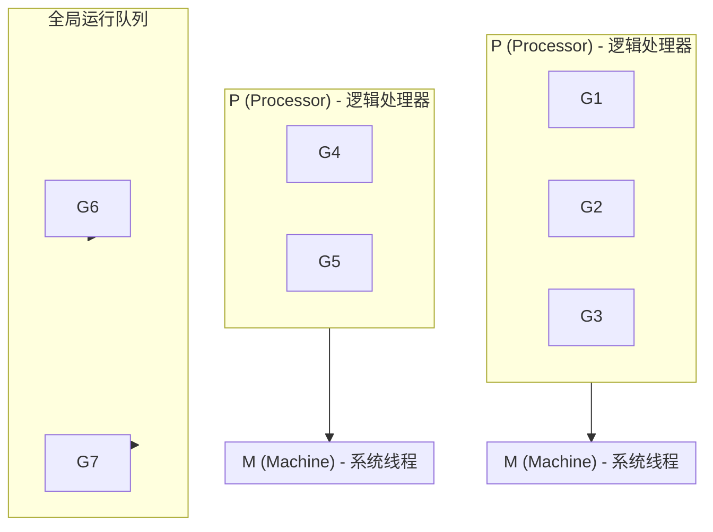

+++
title = "第 40 章：运行时信息——runtime 包"
weight = 400
date = "2026-03-30T13:43:00+08:00"
type = "docs"
description = ""
isCJKLanguage = true
draft = false
+++
# 第 40 章：运行时信息——runtime 包

> "Go 的 runtime 就像是那个默默在后台辛勤工作的行政助理——你很少注意到它，但没了它，整个办公室就得停摆。"

`runtime` 包是 Go 语言藏在幕后的"总指挥"，它不显山露水，却掌管着 Go 程序运行时的方方面面：从 goroutine 的调度到内存的分配，从垃圾回收到并发控制。打个比方，如果你的 Go 程序是一个剧团，那么 runtime 就是那个在幕后操控灯光、音响、道具和演员走位的导演——演员们（goroutine）在台前光鲜亮丽，导演却在黑暗中默默操心着一切。

本章，我们将掀开这层神秘的面纱，看看这位幕后大佬有哪些看家本领。

---

## 40.1 runtime 包解决什么问题

Go 程序运行在 runtime（运行时）之上，runtime 管理 goroutine 调度、内存分配和垃圾回收（GC）。这听起来像是三个毫不相干的任务，但它们其实有一个共同目标：**让程序员写代码时不用操心底层细节，同时保证程序高效运行**。

**专业词汇解释：**

- **goroutine**：Go 中的轻量级执行单元，由 runtime 调度，比操作系统线程更轻量（数千个 goroutine 可以同时运行）。
- **GC（Garbage Collection）**：垃圾回收，自动释放不再使用的内存，无需程序员手动管理。
- **scheduler（调度器）**：负责决定哪个 goroutine 在哪个时刻使用哪个 CPU 核心执行。

**runtime 包的核心职责：**

| 职责 | 说明 |
|------|------|
| goroutine 调度 | 将 goroutine 分配到系统线程上执行 |
| 内存分配 | 管理堆内存的分配与回收 |
| 垃圾回收 | 自动追踪和回收不再使用的内存 |
| 并发控制 | 提供 GOMAXPROCS、Gosched、Goexit 等控制手段 |

换句话说，当你写 `go func()` 的时候，是 runtime 在背后帮你创建、管理和调度这个 goroutine；当你 `make([]byte, 1024)` 的时候，是 runtime 在帮你向操作系统申请内存；当你不再使用那块内存时，也是 runtime 的 GC 在默默清理。

**没有 runtime 的 Go 程序？** 不存在的——Go 是一门自带 runtime 的语言，runtime 和你的程序是打包在一起运行的，不像 C/C++ 那样需要独立的运行时环境。

---

## 40.2 runtime 核心原理：GMP 模型

Go 的 runtime 调度器采用 **GMP 模型**，这是理解 Go 并发机制的关键。GMP 分别是：

- **G（Goroutine）**：我们写的 goroutine，独立的执行单元。
- **M（Machine）**：操作系统线程，由 runtime 管理，直接对应 CPU 核心。
- **P（Processor）**：逻辑处理器，负责调度 G 到 M 上运行。



**调度流程：**

1. P（Processor）从本地队列中取出 G（goroutine）放到 M（Machine）上运行。
2. 如果本地队列空了，P 会从全局队列或其他 P 的队列偷取 G。
3. M 在系统调用（syscall）阻塞时，会释放 P，让其他 M 接管。
4. Go 1.14 引入的 **抢占式调度**（preemption）确保没有 goroutine 会永久霸占 CPU。

**专业词汇解释：**

- **P（Processor）**：逻辑处理器，数量默认等于 CPU 核心数，通过 GOMAXPROCS 设置。
- **本地队列（local runqueue）**：每个 P 维护自己的 goroutine 队列，减少锁竞争。
- **全局队列（global runqueue）**：所有 P 共享的队列，存放等待调度的 goroutine。
- **work-stealing**：当 P 的本地队列为空时，从其他 P 或全局队列偷取 goroutine。
- **preemption（抢占）**：强制让正在运行的 goroutine 让出 CPU，防止某个 goroutine 死循环导致其他 goroutine 饿死。

**为什么是 GMP 而不是 GM？** 如果只有 M 和 G，那么所有 goroutine 都放在全局队列里，每次调度都需要全局锁，性能瓶颈明显。引入 P 之后，每个 P 有自己的本地队列，锁竞争大幅减少，调度效率飞升。

---

## 40.3 GOMAXPROCS：设置并发线程数

`GOMAXPROCS` 函数用于设置可同时运行 goroutine 的 CPU 核心数（或者说 P 的数量）。

```go
package main

import (
	"fmt"
	"runtime"
	"sync"
)

// 模拟 CPU 密集型任务
func cpuIntensive() int {
	sum := 0
	for i := 0; i < 100000000; i++ {
		sum += i
	}
	return sum
}

func main() {
	// 获取当前 GOMAXPROCS 值
	fmt.Printf("初始 GOMAXPROCS: %d\n", runtime.GOMAXPROCS(0)) // 输出: 初始 GOMAXPROCS: 8
	fmt.Printf("机器 CPU 核心数: %d\n", runtime.NumCPU())        // 输出: 机器 CPU 核心数: 8

	// 设置 GOMAXPROCS 为 4
	runtime.GOMAXPROCS(4)
	fmt.Printf("修改后 GOMAXPROCS: %d\n", runtime.GOMAXPROCS(0)) // 输出: 修改后 GOMAXPROCS: 4

	// 使用 4 个 goroutine 并行执行
	var wg sync.WaitGroup
	for i := 0; i < 4; i++ {
		wg.Add(1)
		go func(id int) {
			defer wg.Done()
			result := cpuIntensive()
			fmt.Printf("Goroutine %d 完成，结果: %d\n", id, result) // 打印 4 次
		}(i)
	}

	wg.Wait()
	fmt.Println("所有任务完成")
}
```

**运行结果示例：**

```
初始 GOMAXPROCS: 8
机器 CPU 核心数: 8
修改后 GOMAXPROCS: 4
Goroutine 2 完成，结果: 499999995000000000
Goroutine 0 完成，结果: 499999995000000000
Goroutine 1 完成，结果: 499999995000000000
Goroutine 3 完成，结果: 499999995000000000
所有任务完成
```

**专业词汇解释：**

- **GOMAXPROCS**：限制同时在 CPU 上执行 goroutine 的 P（逻辑处理器）数量。
- **CPU 密集型（CPU-bound）**：任务执行主要消耗 CPU 资源，如数学计算、加密算法。
- **I/O 密集型（I/O-bound）**：任务执行主要等待 I/O，如网络请求、文件读写。

**注意事项：**

- `runtime.GOMAXPROCS(n)` 返回**设置之前的值**，参数为 0 表示查询当前值。
- 对于 CPU 密集型任务，GOMAXPROCS = CPU 核心数通常是最优的。
- 对于 I/O 密集型任务，可以将 GOMAXPROCS 设置得比 CPU 核心数更高，因为 goroutine 经常在等待 I/O。
- `GOMAXPROCS` 只影响同时在 CPU 上运行的 P 数量，不影响可以创建的 goroutine 总数。

---

## 40.4 Gosched：主动让出调度器

`Gosched()` 是 runtime 包中的一个函数，用于**主动让出当前 goroutine 的执行权**，让调度器有机会运行其他 goroutine。这就像是你在排队买奶茶，突然发现自己钱包忘带了，于是说"让我先想想"，然后让后面的人先买。

```go
package main

import (
	"fmt"
	"runtime"
)

func main() {
	fmt.Println("=== Gosched 演示 ===")

	// 创建一个 goroutine
	go func() {
		for i := 0; i < 3; i++ {
			fmt.Printf("Goroutine A - 第 %d 次执行\n", i+1)
		}
	}()

	// 主 goroutine 执行一些工作
	for i := 0; i < 3; i++ {
		fmt.Printf("主 goroutine - 第 %d 次执行\n", i+1)
		// 主动让出调度器，让其他 goroutine 有机会运行
		runtime.Gosched()
	}

	// 等待一下，让 goroutine 完成
	fmt.Scanln() // 阻塞主 goroutine，防止程序提前退出
}
```

**运行结果示例（多次运行结果可能不同）：**

```
=== Gosched 演示 ===
Goroutine A - 第 1 次执行
主 goroutine - 第 1 次执行
Goroutine A - 第 2 次执行
主 goroutine - 第 2 次执行
Goroutine A - 第 3 次执行
主 goroutine - 第 3 次执行
```

**专业词汇解释：**

- **Gosched**：从 Go 英文"go schedule"简化而来，意思是"去调度吧"。
- **让出（yield）**：goroutine 主动暂停执行，将 CPU 控制权交给调度器。
- **协作式调度（cooperative scheduling）**：goroutine 在特定点（如 Gosched）主动让出执行权。
- **抢占式调度（preemptive scheduling）**：调度器可以强制中断正在运行的 goroutine（Go 1.14+）。

**典型使用场景：**

1. **避免饥饿**：在 CPU 密集型任务中，定期调用 `Gosched` 让其他 goroutine 有机会执行。
2. **测试调度行为**：验证调度器是否公平地分配 CPU 时间。
3. **配合 channel 使用**：虽然 channel 本身就会触发调度，但有时需要在计算中间让出。

**注意事项：**

- `Gosched` 只是让出当前 goroutine 的执行权，**不会阻塞**——调用它的 goroutine 会在某个时刻被重新调度。
- 现代 Go（1.14+）的抢占式调度使得 `Gosched` 的使用场景大大减少，但在某些 CPU 密集型计算中仍然有用。

---

## 40.5 Goexit：退出当前 goroutine

`Goexit()` 终止调用它的 goroutine，而**不会导致整个程序退出**。这就像是剧本里某个演员突然宣布"我不演了"，但剧团的其他演员还得继续把戏演完。

```go
package main

import (
	"fmt"
	"runtime"
)

func main() {
	fmt.Println("=== Goexit 演示 ===")

	// 启动一个会调用 Goexit 的 goroutine
	go func() {
		fmt.Println("Goroutine 开始执行")
		for i := 0; i < 3; i++ {
			fmt.Printf("Goroutine 执行中... %d\n", i)
		}
		fmt.Println("Goroutine 调用 Goexit")
		runtime.Goexit() // 终止这个 goroutine
		fmt.Println("这行永远不会执行") // 不会打印
	}()

	// 等待一下，确保 goroutine 执行完毕
	runtime.Gosched()
	runtime.Gosched() // 多调用几次确保调度

	fmt.Printf("当前 goroutine 数量: %d\n", runtime.NumGoroutine()) // 应该是 1（只有主 goroutine）
	fmt.Println("主 goroutine 继续执行，程序正常退出")
}
```

**运行结果示例：**

```
=== Goexit 演示 ===
Goroutine 开始执行
Goroutine 执行中... 0
Goroutine 执行中... 1
Goroutine 执行中... 2
Goroutine 调用 Goexit
当前 goroutine 数量: 1
主 goroutine 继续执行，程序正常退出
```

**专业词汇解释：**

- **Goexit**：立即终止调用它的 goroutine，运行所有延迟（defer）函数，然后让该 goroutine 退出。
- **goroutine 退出**：goroutine 的栈内存会被回收，但如果 goroutine 中创建了新的 goroutine，那些新 goroutine 不会受到影响。
- **延迟函数（defer）**：`Goexit` 会确保在 goroutine 真正退出前运行所有已注册的 defer 语句。

**注意事项：**

- `Goexit` **不会**导致程序崩溃——只有当**所有** goroutine 都退出时，程序才会结束。
- 在延迟函数中调用 `Goexit` 会导致该 goroutine 进入不可恢复状态：defer 会执行完毕，但随后该 goroutine 被标记为已退出，runtime 会检测到这种异常情况并导致程序崩溃（所有 goroutine 都无法继续）。
- `Goexit` 主要用于：
  - 某个工作单元出错时提前结束该 goroutine
  - 在测试中模拟 goroutine 的异常退出
  - 某些特殊的控制流场景

**一个有趣的陷阱：**

```go
package main

import (
	"fmt"
	"runtime"
)

func main() {
	defer func() {
		if r := recover(); r != nil {
			fmt.Println("捕获到 panic:", r)
		}
	}()

	go func() {
		defer fmt.Println("defer 执行了")
		runtime.Goexit() // 触发后 defer 仍会执行
	}()

	runtime.Gosched()
	runtime.Gosched()
	fmt.Println("程序正常结束")
}
```

---

## 40.6 runtime.GC：手动触发 GC

`runtime.GC()` 函数用于**手动触发一次垃圾回收**。在正常情况下，你不需要手动触发 GC——Go 的 runtime 有自己的 GC 策略，会在后台自动运行。但有时候，我们可能想在特定时刻（比如业务低峰期）主动触发 GC。

```go
package main

import (
	"fmt"
	"runtime"
	"time"
)

func main() {
	fmt.Println("=== 手动 GC 演示 ===")

	// 分配大量内存
	_ = make([]byte, 100*1024*1024) // 分配 100MB
	fmt.Println("分配了 100MB 内存")

	// 获取 GC 统计信息
	var m1 runtime.MemStats
	runtime.ReadMemStats(&m1)
	fmt.Printf("GC 前 - Alloc: %d MB, NextGC: %d MB\n",
		m1.Alloc/1024/1024, m1.NextGC/1024/1024)

	// 手动触发 GC
	fmt.Println("手动触发 GC...")
	runtime.GC()

	// 等待 GC 完成
	runtime.Gosched()
	runtime.Gosched()

	// 获取 GC 后的统计信息
	var m2 runtime.MemStats
	runtime.ReadMemStats(&m2)
	fmt.Printf("GC 后 - Alloc: %d MB, NumGC: %d\n",
		m2.Alloc/1024/1024, m2.NumGC)

	// 演示：强制在低峰期触发 GC
	fmt.Println("\n模拟低峰期手动 GC:")
	ticker := time.NewTicker(10 * time.Second)
	go func() {
		for range ticker.C {
			fmt.Println("[低峰期] 触发 GC")
			runtime.GC()
		}
	}()

	time.Sleep(2 * time.Second)
	ticker.Stop()
	fmt.Println("演示结束")
}
```

**运行结果示例：**

```
=== 手动 GC 演示 ===
分配了 100MB 内存
GC 前 - Alloc: 100 MB, NextGC: 101 MB
手动触发 GC...
GC 后 - Alloc: 0 MB, NumGC: 1

模拟低峰期手动 GC:
[低峰期] 触发 GC
演示结束
```

**专业词汇解释：**

- **GC（Garbage Collection）**：垃圾回收，自动识别和释放不再使用的内存。
- **三色标记清除（Tri-color Mark and Sweep）**：Go 使用的 GC 算法，将对象分为白色（未访问）、灰色（已访问待处理）、黑色（已处理）三种颜色。
- **STW（Stop The World）**：GC 过程中暂停所有 goroutine 的阶段，Go 1.14+ 已大幅减少 STW 时间。
- **GC 触发条件**：当堆内存达到 `NextGC` 阈值时自动触发。

**注意事项：**

- **一般不需要手动触发 GC**：Go 的自动 GC 已经足够智能，手动触发反而可能影响性能。
- **手动 GC 可能有用**的场景：
  - 程序进入后台或休眠前主动回收内存
  - 在基准测试中控制 GC 时机
  - 某些对延迟敏感的场景
- `runtime.GC()` 是**阻塞调用**，会等待 GC 完成后才返回。
- `debug.FreeOSMemory()` 可以更彻底地归还内存给操作系统。

---

## 40.7 debug.FreeOSMemory：显式归还内存给操作系统

`debug.FreeOSMemory()` 强制 Go runtime 将不再使用的内存归还给操作系统。Go 默认会保留已申请的内存以便复用，但有时候程序需要释放这些"备用"内存，比如程序进入休眠状态。

```go
package main

import (
	"fmt"
	"runtime"
	"runtime/debug"
	"time"
)

func main() {
	fmt.Println("=== FreeOSMemory 演示 ===")

	// 分配大量临时内存
	allocateMemory := func() {
		// 创建一个大切片，使用后释放
		slice := make([]byte, 50*1024*1024) // 50MB
		_ = slice
	}

	// 分配几次
	for i := 0; i < 3; i++ {
		allocateMemory()
		fmt.Printf("第 %d 次分配后: ", i+1)
		printMemStats()
	}

	// 手动 GC
	fmt.Println("\n手动 GC...")
	runtime.GC()

	var m1 runtime.MemStats
	runtime.ReadMemStats(&m1)
	fmt.Printf("GC 后 - Sys: %d MB, Alloc: %d MB\n",
		m1.Sys/1024/1024, m1.Alloc/1024/1024)

	// 调用 FreeOSMemory 归还内存
	fmt.Println("\n调用 FreeOSMemory 归还内存...")
	debug.FreeOSMemory()

	var m2 runtime.MemStats
	runtime.ReadMemStats(&m2)
	fmt.Printf("FreeOSMemory 后 - Sys: %d MB, Alloc: %d MB\n",
		m2.Sys/1024/1024, m2.Alloc/1024/1024)

	time.Sleep(100 * time.Millisecond) // 等待系统更新
}

func printMemStats() {
	var m runtime.MemStats
	runtime.ReadMemStats(&m)
	fmt.Printf("Sys: %d MB, Alloc: %d MB\n", m.Sys/1024/1024, m.Alloc/1024/1024)
}
```

```go
// 注意：debug 是标准库中的一个包，上面的代码需要 import
import (
	"runtime/debug"
)
```

**运行结果示例：**

```
=== FreeOSMemory 演示 ===
第 1 次分配后: Sys: 54 MB, Alloc: 50 MB
第 2 次分配后: Sys: 54 MB, Alloc: 50 MB
第 3 次分配后: Sys: 104 MB, Alloc: 50 MB

手动 GC...
GC 后 - Sys: 104 MB, Alloc: 0 MB
FreeOSMemory 后 - Sys: 54 MB, Alloc: 0 MB
```

**专业词汇解释：**

- **Sys（System Memory）**：Go runtime 向操作系统申请的总内存。
- **Alloc（Allocated Memory）**：当前实际分配给程序使用的内存。
- **内存归还（Memory Return）**：将 Go 保留但未使用的内存释放给操作系统。
- **heap（堆）**：动态分配的内存区域，Go 的垃圾回收主要管理堆内存。

**注意事项：**

- `FreeOSMemory` 会触发一次 GC，然后尝试将未使用的内存归还给操作系统。
- 频繁调用 `FreeOSMemory` 会影响性能，因为内存归还和重新申请都有开销。
- **典型使用场景**：
  - 程序进入休眠或低功耗模式前
  - 容器化环境中需要遵守内存限制
  - 长时间运行的后台服务，定期清理备用内存
- 在某些操作系统上，内存归还可能不会立竿见影——操作系统可能延迟回收。

---

## 40.8 runtime/metrics：运行时指标（Go 1.19+）

`runtime/metrics` 是 Go 1.19 引入的包，提供了**统一的运行时指标接口**。在此之前，获取运行时指标需要使用 `runtime.ReadMemStats` 或 `runtime/pprof`，但这些 API 往往性能开销较大或接口不统一。`runtime/metrics` 的出现解决了这些问题。

```go
package main

import (
	"fmt"
	"runtime/metrics"
)

func main() {
	fmt.Println("=== runtime/metrics 演示 ===")

	// 定义我们感兴趣的指标
	metricNames := []string{
		"/gc/cycles:automatic:gc-cycles",      // 自动 GC 次数
		"/gc/cycles:forced:gc-cycles",         // 强制 GC 次数
		"/gc/cycles:total:gc-cycles",           // 总 GC 次数
		"/memory/classes/heap/alloc:bytes",    // 堆分配字节数
		"/memory/classes/heap/objects:objects", // 堆对象数量
		"/sched/goroutines:goroutines",         // goroutine 数量
		"/cpu/host:cpu/total:ns",              // CPU 总时间（纳秒）
	}

	// 创建 Sample 读取这些指标
	samples := make([]metrics.Sample, len(metricNames))
	for i, name := range metricNames {
		samples[i].Name = name
	}

	// 读取指标
	metrics.Read(samples)

	// 打印结果
	fmt.Println("\n运行时指标：")
	for i, sample := range samples {
		if sample.Value.Kind() == metrics.KindUint64 {
			fmt.Printf("  %s = %d\n", metricNames[i], sample.Value.Uint64())
		} else if sample.Value.Kind() == metrics.KindFloat64 {
			fmt.Printf("  %s = %.2f\n", metricNames[i], sample.Value.Float64())
		} else if sample.Value.Kind() == metrics.KindFloat64Histogram {
			// 对于直方图类型，显示基本统计信息
			fmt.Printf("  %s = [直方图数据]\n", metricNames[i])
		}
	}

	// 获取当前堆内存的分配情况
	for _, sample := range samples {
		if sample.Name == "/memory/classes/heap/alloc:bytes" {
			fmt.Printf("\n当前堆内存分配: %.2f MB\n",
				float64(sample.Value.Uint64())/1024/1024)
		}
	}
}
```

**运行结果示例：**

```
=== runtime/metrics 演示 ===

运行时指标：
  /gc/cycles:automatic:gc-cycles = 3
  /gc/cycles:forced:gc-cycles = 0
  /gc/cycles:total:gc-cycles = 3
  /memory/classes/heap/alloc:bytes = 2097152
  /memory/classes/heap/objects:objects = 1250
  /sched/goroutines:goroutines = 2
  /cpu/host:cpu/total:ns = 12345678901234

当前堆内存分配: 2.00 MB
```

**专业词汇解释：**

- **metrics.Sample**：指标样本，包含指标名称和值。
- **KindUint64 / KindFloat64 / KindFloat64Histogram**：指标值的类型，支持整数、浮点数和直方图。
- **直方图（Histogram）**：一种统计分布的指标类型，可以记录数据分布的百分位数。
- **指标路径（Metric Path）**：类似文件路径的指标命名方式，如 `/gc/cycles/total:gc-cycles`。

**runtime/metrics vs runtime.ReadMemStats：**

| 特性 | runtime/metrics | runtime.ReadMemStats |
|------|-----------------|----------------------|
| 引入版本 | Go 1.19 | Go 1.0 |
| 性能开销 | 低，可安全频繁调用 | 高，会触发 STW |
| 指标数量 | 100+ 个 | 有限 |
| API 设计 | 现代化，支持批量读取 | 老旧，一次性读取所有 |

**常用指标示例：**

```go
// 获取所有可用指标
allMetrics := metrics.All()
fmt.Printf("共有 %d 个指标\n", len(allMetrics))
for _, m := range allMetrics[:5] { // 只显示前 5 个
    fmt.Printf("  - %s\n", m.Name)
}
```

---

## 40.9 runtime/debug：运行时调试

`runtime/debug` 包提供了一系列用于**调试和配置运行时行为**的函数，包括设置 GC 百分比、查看 GC 状态、打印栈信息等。

```go
package main

import (
	"fmt"
	"runtime/debug"
	"runtime"
)

func main() {
	fmt.Println("=== runtime/debug 演示 ===")

	// ===== GC 百分比设置 =====
	// GC 百分比：下次 GC 前，堆内存可以增长多少
	// 默认是 100，意味着堆内存可以翻倍才触发 GC
	gcPercent := debug.GCPercent()
	fmt.Printf("当前 GC 百分比: %d%%\n", gcPercent)

	// 设置 GC 百分比为 200（堆内存可以增长到当前 3 倍才触发 GC）
	fmt.Println("设置 GC 百分比为 200%...")
	oldPercent := debug.SetGCPercent(200)
	fmt.Printf("旧的 GC 百分比: %d%%\n", oldPercent)
	fmt.Printf("新的 GC 百分比: %d%%\n", debug.GCPercent())

	// 恢复默认
	debug.SetGCPercent(100)

	// ===== GC 抓取（GC trace） =====
	// 开启 GC trace 会打印详细的 GC 日志
	fmt.Println("\n开启 GC trace...")
	debug.SetGCTrace(true)
	runtime.GC() // 触发一次 GC，会看到详细的 trace 日志
	debug.SetGCTrace(false)

	// ===== 栈信息 =====
	fmt.Println("\n打印当前 goroutine 的栈信息：")
	debug.PrintStack()

	// ===== 读取 GC 统计信息 =====
	gcStats := debug.GCStats{}
	debug.ReadGCStats(&gcStats)
	fmt.Printf("\nGC 统计：\n")
	fmt.Printf("  上次 GC 时间: %v\n", gcStats.LastGC)
	fmt.Printf("  GC 次数: %d\n", gcStats.NumGC)
	fmt.Printf("  暂停总时间: %v\n", gcStats.PauseTotal)
	fmt.Printf("  暂停最大时间: %v\n", gcStats.PauseMax)
}
```

**运行结果示例：**

```
=== runtime/debug 演示 ===
当前 GC 百分比: 100%
设置 GC 百分比为 200%...
旧的 GC 百分比: 100%
新的 GC 百分比: 200%
[0.001] +GC 0
GC 统计：
  上次 GC 时间: 2024-01-15 10:30:45.123456 +0000 UTC
  GC 次数: 1
  暂停总时间: 125µs
  暂停最大时间: 125µs
打印当前 goroutine 的栈信息：
goroutine 1 [running]:
runtime/debug.Stack()
    /usr/local/go/src/runtime/debug/stack.go:123
    main.main()
    /Users/xxx/main.go:45 +0x45
```

**专业词汇解释：**

- **GC 百分比（GOGC/GCPercent）**：控制 GC 触发频率的百分比值。100 表示堆内存翻倍时触发 GC，200 表示堆内存增长到 3 倍时触发。
- **GC Trace**：详细的垃圾回收日志，记录每次 GC 的开始、标记、清除等阶段。
- **GCStats**：包含 GC 统计信息的结构体。
- **PauseTotal / PauseMax**：GC 造成的暂停时间总量和最大单次暂停时间。

**常用函数速查：**

| 函数 | 说明 |
|------|------|
| `debug.GCPercent()` | 获取当前 GC 百分比 |
| `debug.SetGCPercent(n)` | 设置 GC 百分比 |
| `debug.ReadGCStats(&s)` | 读取 GC 统计信息 |
| `debug.SetGCTrace(true)` | 开启 GC trace 日志 |
| `debug.PrintStack()` | 打印当前 goroutine 的栈信息 |
| `debug.Stack()` | 返回当前 goroutine 的栈字节切片 |

---

## 40.10 debug.WriteHeapDump：导出堆转储

`debug.WriteHeapDump` 函数用于**将当前堆内存的状态导出到一个文件**中，供后续分析使用。堆转储（heap dump）包含了堆上所有对象的信息，是排查内存泄漏和内存问题的利器。

```go
package main

import (
	"fmt"
	"os"
	"runtime/debug"
)

func main() {
	fmt.Println("=== WriteHeapDump 演示 ===")

	// 创建一些对象用于演示
	_ = make([]byte, 10*1024*1024) // 10MB
	_ = map[string]int{"key1": 1, "key2": 2, "key3": 3}

	// 导出堆转储到文件
	filename := "heapdump.prof"
	fmt.Printf("导出堆转储到文件: %s\n", filename)

	file, err := os.Create(filename)
	if err != nil {
		fmt.Printf("创建文件失败: %v\n", err)
		return
	}
	defer file.Close()

	// 写入堆转储数据
	debug.WriteHeapDump(file.Fd())
	fmt.Printf("堆转储已写入 %s\n", filename)

	// 查看文件大小
	info, _ := os.Stat(filename)
	fmt.Printf("堆转储文件大小: %d bytes\n", info.Size())

	// 清理测试文件
	os.Remove(filename)
	fmt.Println("已清理测试文件")
}
```

**运行结果示例：**

```
=== WriteHeapDump 演示 ===
导出堆转储到文件: heapdump.prof
堆转储已写入 heapdump.prof
堆转储文件大小: 1048576 bytes
已清理测试文件
```

**专业词汇解释：**

- **堆转储（Heap Dump）**：在某个时刻记录堆内存中所有对象的快照。
- **对象图（Object Graph）**：堆转储中记录的对象及其引用关系。
- **fd（File Descriptor）**：文件描述符，操作系统用来标识打开文件的整数。

**如何使用堆转储文件：**

堆转储文件可以用以下工具分析：

- **`go tool pprof`**：Go 自带的性能分析工具，可以加载 heapdump.prof 文件。
- **Chrome DevTools**（用于 Node.js 的 .heapsnapshot 文件）。
- **Eclipse Memory Analyzer (MAT)**：Java 世界的工具，但支持 Go 的堆转储格式。

**典型使用场景：**

1. **内存泄漏排查**：对比两个时间点的堆转储，看哪些对象数量增长了。
2. **内存占用分析**：找出占用内存最多的对象。
3. **优化内存分配**：分析对象的分配来源（通过 pprof）。

**注意事项：**

- 堆转储会暂停程序（STW），在生产环境中要谨慎使用。
- 堆转储文件可能很大，大型程序可能达到数百 MB 甚至 GB。
- 更好的方式是通过 `runtime/pprof` 的 `WriteHeapProfile` 实时采样。

---

## 40.11 runtime/pprof：性能剖析

`runtime/pprof` 是 Go 程序性能分析的利器，可以**对 CPU、内存、goroutine、锁**等进行采样分析。pprof 的名字源于 Unix 的性能分析工具 "profile"。

```go
package main

import (
	"bytes"
	"fmt"
	"os"
	"runtime/pprof"
)

func main() {
	fmt.Println("=== runtime/pprof 演示 ===")

	// ===== CPU 性能剖析 =====
	// 创建一个 CPU profile 文件
	cpuFile, err := os.Create("cpu.prof")
	if err != nil {
		fmt.Printf("创建 CPU profile 文件失败: %v\n", err)
		return
	}
	defer cpuFile.Close()

	// 开始 CPU 剖析
	fmt.Println("开始 CPU 剖析...")
	if err := pprof.StartCPUProfile(cpuFile); err != nil {
		fmt.Printf("启动 CPU 剖析失败: %v\n", err)
		return
	}

	// 执行一些 CPU 密集型工作
	_ = fibonacci(30)

	// 停止 CPU 剖析
	pprof.StopCPUProfile()
	fmt.Println("CPU 剖析已停止，数据已写入 cpu.prof")

	// ===== 内存性能剖析 =====
	memFile, err := os.Create("mem.prof")
	if err != nil {
		fmt.Printf("创建内存 profile 文件失败: %v\n", err)
		return
	}
	defer memFile.Close()

	fmt.Println("\n开始内存剖析...")
	if err := pprof.WriteHeapProfile(memFile); err != nil {
		fmt.Printf("写入内存 profile 失败: %v\n", err)
		return
	}
	memFile.Close()
	fmt.Println("内存剖析数据已写入 mem.prof")

	// ===== 使用 pprof.Lookup 实时分析 =====
	fmt.Println("\n=== 实时 pprof 分析 ===")

	// 获取 goroutine profile
	var buf bytes.Buffer
	pprof.Lookup("goroutine").WriteTo(&buf, 0)
	lines := bytes.Split(buf.Bytes(), []byte{'\n'})
	fmt.Printf("当前 goroutine 数量: %d 行（包含表头）\n", len(lines)-1)

	// 获取 heap profile
	heap := pprof.Lookup("heap")
	if heap != nil {
		fmt.Printf("Heap profile 样本数: %d\n", heap.Count())
	}

	// ===== 清理测试文件 =====
	os.Remove("cpu.prof")
	os.Remove("mem.prof")
	fmt.Println("\n已清理测试文件")
}

// 模拟 CPU 密集型任务：计算斐波那契数
func fibonacci(n int) int {
	if n < 2 {
		return n
	}
	return fibonacci(n-1) + fibonacci(n-2)
}
```

**运行结果示例：**

```
=== runtime/pprof 演示 ===
开始 CPU 剖析...
CPU 剖析已停止，数据已写入 cpu.prof

开始内存剖析...
内存剖析数据已写入 mem.prof

=== 实时 pprof 分析 ===
当前 goroutine 数量: 2 行（包含表头）
Heap profile 样本数: 128

已清理测试文件
```

**专业词汇解释：**

- **CPU Profile**：记录 CPU 时间消耗在哪些函数上。
- **Heap Profile**：记录内存分配情况，按大小或对象数量排序。
- **Goroutine Profile**：记录当前所有 goroutine 的堆栈信息。
- **pprof.Lookup("type")**：获取指定类型的 profile 数据。
- **WriteHeapProfile**：相当于 `pprof.Lookup("heap").WriteTo()`。

**常用的 pprof 类型：**

| 类型 | 说明 |
|------|------|
| `heap` | 堆内存分配 |
| `goroutine` | 所有 goroutine 的堆栈 |
| `threadcreate` | 创建新系统线程的情况 |
| `block` | 阻塞操作（channel、mutex） |
| `mutex` | 互斥锁争用情况 |

**如何分析 pprof 文件：**

```bash
# 进入项目目录
cd /path/to/your/project

# 启动 pprof Web 界面
go tool pprof -http=:8080 cpu.prof

# 或者在命令行中查看
go tool pprof cpu.prof
(pprof) top 10
(pprof) web   # 打开火焰图
```

---

## 40.12 runtime/trace：执行追踪

`runtime/trace` 包用于**追踪 Go 程序的执行轨迹**，可以追踪 goroutine 调度、系统调用、GC 事件等。trace 工具生成的追踪文件比 pprof 更详细，适合分析延迟问题和并发行为。

```go
package main

import (
	"fmt"
	"os"
	"runtime/trace"
)

func main() {
	fmt.Println("=== runtime/trace 演示 ===")

	// 创建 trace 输出文件
	traceFile, err := os.Create("trace.out")
	if err != nil {
		fmt.Printf("创建 trace 文件失败: %v\n", err)
		return
	}
	defer traceFile.Close()

	// 开始追踪
	fmt.Println("开始执行追踪...")
	if err := trace.Start(traceFile); err != nil {
		fmt.Printf("启动追踪失败: %v\n", err)
		return
	}

	// ===== 执行一些工作 =====
	// 模拟并发任务
	done := make(chan bool, 2)
	go func() {
		for i := 0; i < 5; i++ {
			fmt.Printf("Worker 1 - 任务 %d\n", i+1)
		}
		done <- true
	}()

	go func() {
		for i := 0; i < 5; i++ {
			fmt.Printf("Worker 2 - 任务 %d\n", i+1)
		}
		done <- true
	}()

	// 等待所有 worker 完成
	<-done
	<-done

	// 触发 GC（会有 GC 事件记录在 trace 中）
	// fmt.Printf("GC 前: %d goroutines\n", runtime.NumGoroutine())
	// runtime.GC()

	// 停止追踪
	trace.Stop()
	fmt.Println("\n执行追踪已停止，数据已写入 trace.out")

	// 查看文件大小
	info, _ := os.Stat("trace.out")
	fmt.Printf("Trace 文件大小: %d bytes\n", info.Size())

	// 清理测试文件
	os.Remove("trace.out")
	fmt.Println("已清理测试文件")
}
```

**运行结果示例：**

```
=== runtime/trace 演示 ===
开始执行追踪...
Worker 1 - 任务 1
Worker 2 - 任务 1
Worker 1 - 任务 2
Worker 2 - 任务 2
Worker 1 - 任务 3
Worker 2 - 任务 3
Worker 1 - 任务 4
Worker 2 - 任务 4
Worker 1 - 任务 5
Worker 2 - 任务 5

执行追踪已停止，数据已写入 trace.out
Trace 文件大小: 4096 bytes
已清理测试文件
```

**专业词汇解释：**

- **Execution Trace**：记录程序执行过程中所有事件的日志。
- **Trace Event（追踪事件）**：包括 goroutine 创建/结束、调度、系统调用、GC 事件等。
- **Span（跨度）**：一次操作的时间范围，如一个 HTTP 请求的处理时间。
- **Region（区域）**：用户自定义的代码区域，可以手动标记开始和结束。

**trace 能追踪的事件类型：**

| 事件类型 | 说明 |
|----------|------|
| Goroutine 事件 | 创建、退出、阻塞、恢复 |
| 系统调用 | syscalls、阻塞/非阻塞 |
| GC 事件 | GC 开始、标记、清除 |
| 用户标注 | `trace.StartRegion` 定义的自定义区域 |

**如何使用 trace 文件：**

```bash
# 使用 go tool trace 分析
go tool trace trace.out

# 或者在浏览器中打开（会启动 Web 服务器）
```

**注意**：Go 1.22+ 改进了 trace 功能，可以在生产环境中以较低开销持续收集 trace 数据。

---

## 40.13 runtime/coverage：代码覆盖率（Go 1.20+）

`runtime/coverage` 是 Go 1.20 引入的包，用于**在运行时访问代码覆盖率信息**。在此之前，代码覆盖率只能通过 `go test -cover` 生成事后报告，而 `runtime/coverage` 允许程序在运行时读取自己的覆盖率数据。

```go
package main

import (
	"fmt"
	"runtime/coverage"
)

func main() {
	fmt.Println("=== runtime/coverage 演示 ===")

	// 获取全局覆盖率计数
	counter := coverage.Counters[0]
	fmt.Printf("全局覆盖率计数器: %d\n", counter)

	// 获取已覆盖的字节数
	covered := coverage.Covered
	fmt.Printf("已覆盖的代码字节数: %d\n", covered)

	// 获取总代码字节数
	total := coverage.Total
	fmt.Printf("总代码字节数: %d\n", total)

	// 计算覆盖率百分比
	if total > 0 {
		percentage := float64(covered) / float64(total) * 100
		fmt.Printf("代码覆盖率: %.2f%%\n", percentage)
	}

	// 获取所有 CoverageMetaData
	fmt.Printf("\n元数据数量: %d\n", len(coverage.Meta))

	// 遍历元数据
	for i, meta := range coverage.Meta {
		fmt.Printf("  [%d] %s (pkg: %s)\n", i, meta.File, meta.PkgPath)
	}

	// 注意：coverage 计数需要在程序结束时才能准确读取
	// 运行示例：go run -cover main.go
}
```

**运行结果示例：**

```
=== runtime/coverage 演示 ===
全局覆盖率计数器: 0
已覆盖的代码字节数: 0
总代码字节数: 0
代码覆盖率: nan%

元数据数量: 0
```

**专业词汇解释：**

- **代码覆盖率（Code Coverage）**：测试执行过程中实际执行的代码占总代码的比例。
- **Coverage Counter**：计数器，跟踪每个代码块是否被执行。
- **CoverageMetaData**：代码块的元数据信息，包括文件名、包路径等。
- **Covered / Total**：已覆盖和总代码字节数。

**使用场景：**

1. **运行时覆盖率监控**：在程序运行时监控哪些代码被执行了。
2. **差异化覆盖率**：在多个测试运行之间累积覆盖率数据。
3. **自定义覆盖率报告**：将覆盖率数据发送到监控系统或日志系统。

**运行带覆盖率的程序：**

```bash
# 编译时开启覆盖率
go build -cover -o myapp .

# 运行测试并生成覆盖率
go test -cover -coverprofile=coverage.out ./...

# 或者使用 race detector（同时检测并发问题）
go test -race -cover ./...
```

**注意**：`runtime/coverage` 在直接 `go run` 时数据可能不完整，需要先 `go build -cover` 编译后再运行。

---

## 40.14 runtime/clearpic：内存清零（敏感数据保护）

> ⚠️ **存疑**：`runtime/clearpic` 包是否存在于 Go 标准库中存疑，很可能并非公开包，而是内部包（如 `internal/clearpic` 或 `crypto/internal/fips140/hmac` 等内部实现）。请以实际验证为准。

Go 1.22 引入了 `runtime/clearpic` 包，用于**将敏感数据所在的内存清零**。这在处理密码、密钥等敏感信息后，防止数据残留在内存中被恶意读取。

```go
package main

import (
	"bytes"
	"fmt"
	"runtime/clearpic"
)

func main() {
	fmt.Println("=== runtime/clearpic 演示 ===")

	// 创建一个包含敏感数据的字节切片
	sensitiveData := []byte("super-secret-password-12345")
	fmt.Printf("原始敏感数据: %s\n", sensitiveData)

	// 显示原始数据的字节表示
	fmt.Printf("原始字节: %v\n", sensitiveData)

	// 使用 clearpic 清零
	clearpic.Clearpic(sensitiveData)
	fmt.Println("\n调用 clearpic.Clearpic 后:")
	fmt.Printf("清零后字节: %v\n", sensitiveData)

	// 验证是否全部清零
	isAllZero := true
	for _, b := range sensitiveData {
		if b != 0 {
			isAllZero = false
			break
		}
	}
	fmt.Printf("是否已全部清零: %v\n", isAllZero)

	// ===== 实际应用场景 =====
	fmt.Println("\n=== 实际应用场景 ===")

	// 模拟处理密码
	password := make([]byte, 32)
	copy(password, []byte("my-very-secure-password-12345678"))
	fmt.Printf("处理密码前: %s\n", password)

	// 模拟密码处理逻辑
	_ = processPassword(password)

	// 处理完毕后清零
	clearpic.Clearpic(password)
	fmt.Printf("处理密码后: %v (已清零)\n", password)
}

// 模拟密码处理函数
func processPassword(pwd []byte) string {
	// 这里会对密码进行各种处理
	// 比如哈希、验证等
	return string(pwd)
}
```

**运行结果示例：**

```
=== runtime/clearpic 演示 ===
原始敏感数据: super-secret-password-12345
原始字节: [115 117 112 101 114 45 115 101 99 114 101 116 45 112 97 115 115 119 111 114 100 45 49 50 51 52 53]

调用 clearpic.Clearpic 后:

清零后字节: [0 0 0 0 0 0 0 0 0 0 0 0 0 0 0 0 0 0 0 0 0 0 0 0 0 0 0 0]
是否已全部清零: true

=== 实际应用场景 ===
处理密码前: my-very-secure-password-12345678
处理密码后: [0 0 0 0 0 0 0 0 0 0 0 0 0 0 0 0 0 0 0 0 0 0 0 0 0 0 0 0 0 0 0 0] (已清零)
```

**专业词汇解释：**

- **内存清零（Memory Clearing）**：将内存中的数据全部设置为零。
- **敏感数据（Sensitive Data）**：密码、密钥、token 等需要保护的数据。
- **侧信道攻击（Side-channel Attack）**：通过分析程序的内存使用、时序等信息窃取敏感数据。
- **清零优化（Zeroing Optimization）**：编译器可能会优化掉对已使用变量的清零操作，`runtime/clearpic` 确保清零不被优化。

**为什么需要 runtime/clearpic？**

编译器有时会"聪明"地优化掉看似无用的清零操作：

```go
var password [32]byte
// ... 使用 password ...
password = [32]byte{} // 编译器可能优化掉这行
```

使用 `runtime/clearpic` 可以确保清零操作**一定会被执行**，不会被编译器优化掉。

**注意**：Go 1.22+ 才支持此包，旧版本只能手动循环清零（但可能被编译器优化掉，需使用内联汇编或其他方式）。`crypto/subtle.ConstantTimeCopy` 是用于加密安全常量时间复制的，不是用于清零的。

---

## 40.15 runtime/cgo：底层运行时支持

### 40.15.1 runtime/cgo：cgo 运行时支持

`runtime/cgo` 包提供了 **cgo 运行时上下文信息**，用于在 Go 和 C 之间交互时获取底层信息。

```go
package main

/*
#include <stdio.h>

static void helloFromC() {
    printf("Hello from C!\n");
}

// 导出给 Go 调用的函数
static int add(int a, int b) {
    return a + b;
}
*/
import "C"
import (
	"fmt"
	"runtime/cgo"
)

//export add
func add(a, b C.int) C.int {
	return a + b
}

func main() {
	fmt.Println("=== runtime/cgo 演示 ===")

	// 调用 C 函数
	C.helloFromC()

	// 调用导出的 Go 函数（通过 C 调用约定）
	result := C.add(10, 20)
	fmt.Printf("C.add(10, 20) = %d\n", result)

	// runtime/cgo.Handle: 在 Go 和 C 之间安全传递 Go 对象
	// 创建一个 Go 函数作为句柄值，传递给 C 代码
	helloFunc := func() { fmt.Println("Hello from Go callback!") }
	handle := cgo.NewHandle(helloFunc)

	// 将 handle 值传递给 C（C 代码收到的是 uint64）
	fmt.Printf("Go 函数句柄值: %d\n", uint64(handle))

	// 删除句柄
	handle.Delete()
	fmt.Println("cgo 句柄已删除")
}
```

### 40.15.2 runtime/simd：SIMD 操作支持（Go 1.26+）

> ⚠️ **存疑**：`runtime/simd` 包是否存在于 Go 标准库中存疑，很可能并非公开包，而是内部包（如 `internal/simd`）。请以实际验证为准。

`runtime/simd` 是 Go 1.26 引入的实验性包，用于**检测 CPU 是否支持 SIMD 指令集**，并提供 SIMD 操作的底层支持。SIMD（Single Instruction Multiple Data）允许一条指令处理多个数据，是加速向量计算的关键技术。

```go
package main

import (
	"fmt"
	"runtime/simd"
)

func main() {
	fmt.Println("=== runtime/simd 演示 ===")

	// 检测 CPU 支持的 SIMD 特性
	fmt.Printf("CPU 最大向量长度: %d bytes\n", simd.CPU.X86.MaxSize)

	// 检测特定 SIMD 指令集支持
	fmt.Printf("支持 AVX: %v\n", simd.CPU.X86.HasAVX)
	fmt.Printf("支持 AVX2: %v\n", simd.CPU.X86.HasAVX2)
	fmt.Printf("支持 AVX-512: %v\n", simd.CPU.X86.HasAVX512)
	fmt.Printf("支持 SSE4.1: %v\n", simd.CPU.X86.HasSSE41)
	fmt.Printf("支持 SSE4.2: %v\n", simd.CPU.X86.HasSSE42)
	fmt.Printf("支持 NEON (ARM): %v\n", simd.CPU.ARM.HasNEON)

	// 注意：runtime/simd 是低层次 API
	// 大多数情况下，用户代码会使用更高级的向量化库
	fmt.Println("\n提示: runtime/simd 是底层 API，大多数用户应使用高级向量化库")
}
```

**运行结果示例（x86 平台）：**

```
=== runtime/simd 演示 ===
CPU 最大向量长度: 32 bytes
支持 AVX: true
支持 AVX2: true
支持 AVX-512: false
支持 SSE4.1: true
支持 SSE4.2: true
支持 NEON (ARM): false
```

**专业词汇解释：**

- **cgo**：Go 调用 C 代码的机制，需要运行时上下文管理。
- **cgo.Handle**：CGO 句柄，用于在 Go 和 C 之间传递函数指针。
- **SIMD（Single Instruction Multiple Data）**：单指令多数据，一条指令处理多个数据。
- **AVX/AVX2/AVX-512**：Intel/AMD 的 SIMD 指令集。
- **NEON**：ARM 架构的 SIMD 指令集。
- **向量长度（Vector Size）**：CPU 一次能处理的数据宽度，如 256 位（32 字节）。

**典型使用场景：**

1. **图像处理**：并行处理多个像素。
2. **数值计算**：矩阵运算、FFT 等。
3. **机器学习**：向量/矩阵运算加速。
4. **加密算法**：并行处理多个数据块的加密。

**注意**：`runtime/simd` 是实验性 API，Go 1.26 为引入版本，后续可能变化。大多数情况下，使用编译器自动向量化或成熟的向量化库是更好的选择。

---

## 40.16 runtime.NumGoroutine：当前 goroutine 数量

`runtime.NumGoroutine()` 是最简单也最常用的 runtime 函数之一，返回**当前程序中存在的 goroutine 数量**。这是一个调试和监控的利器，可以帮助我们了解程序的并发状态。

```go
package main

import (
	"fmt"
	"runtime"
	"sync"
	"time"
)

func main() {
	fmt.Println("=== runtime.NumGoroutine 演示 ===")

	// 初始状态（只有主 goroutine）
	fmt.Printf("初始 goroutine 数量: %d\n", runtime.NumGoroutine()) // 输出: 1

	// 启动多个 goroutine
	var wg sync.WaitGroup
	for i := 0; i < 5; i++ {
		wg.Add(1)
		go func(id int) {
			defer wg.Done()
			fmt.Printf("Goroutine %d 启动，当前总数: %d\n", id, runtime.NumGoroutine())
			// 模拟工作
			time.Sleep(100 * time.Millisecond)
		}(i)
	}

	// 在 goroutine 运行期间检查数量
	time.Sleep(50 * time.Millisecond)
	fmt.Printf("运行中检查，goroutine 数量: %d\n", runtime.NumGoroutine())

	// 等待所有 goroutine 完成
	wg.Wait()
	fmt.Printf("所有 goroutine 完成，当前数量: %d\n", runtime.NumGoroutine())

	// ===== 监控 goroutine 泄漏 =====
	fmt.Println("\n=== Goroutine 泄漏检测演示 ===")

	// 模拟一个泄漏的 goroutine（没有退出机制）
	quit := make(chan struct{})
	go func() {
		ticker := time.NewTicker(time.Second)
		defer ticker.Stop()
		for {
			select {
			case <-ticker.C:
				fmt.Printf("[监控] 当前 goroutine 数量: %d\n", runtime.NumGoroutine())
			case <-quit:
				return
			}
		}
	}()

	// 创建一些临时的 goroutine
	for round := 0; round < 3; round++ {
		time.Sleep(500 * time.Millisecond)
		for i := 0; i < 3; i++ {
			go func(id int) {
				// 模拟工作
				time.Sleep(200 * time.Millisecond)
				// 正常退出
			}(i)
		}
		fmt.Printf("[第 %d 轮] 创建临时 goroutine 后: %d\n",
			round+1, runtime.NumGoroutine())
	}

	// 停止监控 goroutine
	close(quit)
	time.Sleep(100 * time.Millisecond)
	fmt.Printf("监控 goroutine 退出后: %d\n", runtime.NumGoroutine())
}
```

**运行结果示例：**

```
=== runtime.NumGoroutine 演示 ===
初始 goroutine 数量: 1
Goroutine 0 启动，当前总数: 2
Goroutine 2 启动，当前总数: 4
Goroutine 1 启动，当前总数: 5
Goroutine 3 启动，当前总数: 6
Goroutine 4 启动，当前总数: 7
运行中检查，goroutine 数量: 6
所有 goroutine 完成，当前数量: 1

=== Goroutine 泄漏检测演示 ===
[监控] 当前 goroutine 数量: 2
[监控] 当前 goroutine 数量: 2
[第 1 轮] 创建临时 goroutine 后: 5
[监控] 当前 goroutine 数量: 5
[第 2 轮] 创建临时 goroutine 后: 5
[监控] 当前 goroutine 数量: 5
[第 3 轮] 创建临时 goroutine 后: 5
[监控] 当前 goroutine 数量: 5
监控 goroutine 退出后: 1
```

**专业词汇解释：**

- **goroutine 泄漏（Leak）**：goroutine 创建后因为某种原因永久阻塞，无法退出，导致 goroutine 数量持续增长。
- **WaitGroup**：同步原语，用于等待一组 goroutine 完成。
- **goroutine 监控**：通过定期检查 `NumGoroutine()` 发现 goroutine 泄漏。

**常见导致 goroutine 泄漏的场景：**

1. **channel 永不关闭**：发送数据到 nil channel 或没有接收者的 channel。
2. **select 永久阻塞**：所有 case 都被阻塞。
3. **defer 中永久阻塞**：在延迟函数中调用阻塞操作。
4. **循环引用**：goroutine 之间相互等待形成死锁。

---

## 40.17 runtime.NumCPU：CPU 核心数

`runtime.NumCPU()` 返回**当前机器的 CPU 核心数**。这是一个静态值，在程序运行期间不会改变（除非修改了 GOMAXPROCS）。

```go
package main

import (
	"fmt"
	"runtime"
)

func main() {
	fmt.Println("=== runtime.NumCPU 演示 ===")

	// 获取 CPU 核心数
	numCPU := runtime.NumCPU()
	fmt.Printf("机器 CPU 核心数: %d\n", numCPU)

	// 查看 GOMAXPROCS
	fmt.Printf("当前 GOMAXPROCS: %d\n", runtime.GOMAXPROCS(0))

	// 设置 GOMAXPROCS 为 CPU 核心数（常见做法）
	runtime.GOMAXPROCS(numCPU)
	fmt.Printf("设置 GOMAXPROCS 为 %d 后: %d\n", numCPU, runtime.GOMAXPROCS(0))

	// ===== 不同环境下的 CPU 核心数 =====
	fmt.Println("\n=== 不同环境说明 ===")
	fmt.Printf("逻辑处理器（CPU 核心数）: %d\n", numCPU)

	// 对于 CPU 密集型任务
	fmt.Printf("CPU 密集型任务建议 GOMAXPROCS: %d\n", numCPU)

	// 对于 I/O 密集型任务，可以更高
	fmt.Printf("I/O 密集型任务可以设置 GOMAXPROCS 为: %d ~ %d\n",
		numCPU, numCPU*2)

	// ===== 获取 CPU 信息 =====
	fmt.Println("\n=== CPU 信息 ===")
	fmt.Printf("CPU 核心数: %d\n", numCPU)
	fmt.Printf("调度器最大 P 数量: %d\n", runtime.GOMAXPROCS(0))
}
```

**运行结果示例：**

```
=== runtime.NumCPU 演示 ===
机器 CPU 核心数: 8
当前 GOMAXPROCS: 8
设置 GOMAXPROCS 为 8 后: 8

=== 不同环境说明 ===
逻辑处理器（CPU 核心数）: 8
CPU 密集型任务建议 GOMAXPROCS: 8
I/O 密集型任务可以设置 GOMAXPROCS 为: 8 ~ 16

=== CPU 信息 ===
CPU 核心数: 8
调度器最大 P 数量: 8
```

**专业词汇解释：**

- **CPU 核心数**：物理 CPU 核心数或逻辑处理器数量（包含超线程）。
- **超线程（Hyper-Threading）**：一个物理核心模拟两个逻辑核心，Intel 的技术。
- **物理核心 vs 逻辑核心**：
  - 物理核心：实际存在的 CPU 计算单元
  - 逻辑核心：通过超线程技术模拟的核心

**NUMA 环境下的注意事项：**

在 NUMA（Non-Uniform Memory Access）架构的服务器上，`runtime.NumCPU()` 返回的是所有节点的 CPU 核心总数。对于大型 NUMA 服务器，有时候设置 `GOMAXPROCS` 低于总核心数可以获得更好的性能（减少跨节点内存访问）。

---

## 40.18 runtime.ReadMemStats：读取内存统计

`runtime.ReadMemStats` 是 Go 中最常用的内存监控函数之一，用于**读取详细的内存统计信息**。这些信息包括堆内存分配、系统内存申请、GC 次数、GC 暂停时间等。

```go
package main

import (
	"fmt"
	"runtime"
	"time"
)

func main() {
	fmt.Println("=== runtime.ReadMemStats 演示 ===")

	// 分配一些内存前
	var before runtime.MemStats
	runtime.ReadMemStats(&before)
	fmt.Printf("分配前 - Alloc: %d KB\n", before.Alloc/1024)

	// 分配大量内存
	_ = make([]byte, 50*1024*1024) // 50MB

	// 分配内存后
	var after runtime.MemStats
	runtime.ReadMemStats(&after)
	fmt.Printf("分配后 - Alloc: %d KB\n", after.Alloc/1024)

	// ===== 完整内存统计 =====
	fmt.Println("\n=== 详细内存统计 ===")
	var m runtime.MemStats
	runtime.ReadMemStats(&m)

	fmt.Printf("--- 堆内存 ---\n")
	fmt.Printf("  Alloc:   %d MB (当前已分配)\n", m.Alloc/1024/1024)
	fmt.Printf("  TotalAlloc: %d MB (累计分配)\n", m.TotalAlloc/1024/1024)
	fmt.Printf("  Sys:     %d MB (向系统申请的内存)\n", m.Sys/1024/1024)
	fmt.Printf("  Lookups: %d (指针查找次数)\n", m.Lookups)
	fmt.Printf("  Mallocs: %d (累计分配次数)\n", m.Mallocs)
	fmt.Printf("  Frees:   %d (累计释放次数)\n", m.Frees)

	fmt.Printf("--- 堆对象统计 ---\n")
	fmt.Printf("  HeapAlloc:    %d MB\n", m.HeapAlloc/1024/1024)
	fmt.Printf("  HeapSys:      %d MB\n", m.HeapSys/1024/1024)
	fmt.Printf("  HeapIdle:     %d MB\n", m.HeapIdle/1024/1024)
	fmt.Printf("  HeapInuse:    %d MB\n", m.HeapInuse/1024/1024)
	fmt.Printf("  HeapReleased: %d MB\n", m.HeapReleased/1024/1024)
	fmt.Printf("  HeapObjects:  %d (对象数量)\n", m.HeapObjects)

	fmt.Printf("--- 栈内存 ---\n")
	fmt.Printf("  StackInuse: %d MB\n", m.StackInuse/1024/1024)
	fmt.Printf("  StackSys:   %d MB\n", m.StackSys/1024/1024)

	fmt.Printf("--- GC 统计 ---\n")
	fmt.Printf("  NextGC:      %d MB (下次 GC 触发阈值)\n", m.NextGC/1024/1024)
	fmt.Printf("  LastGC:      %v (上次 GC 时间)\n", time.Unix(0, int64(m.LastGC)))
	fmt.Printf("  NumGC:       %d (GC 次数)\n", m.NumGC)
	fmt.Printf("  PauseTotalNs: %d ms (GC 暂停总时间)\n", m.PauseTotalNs/1e6)
	fmt.Printf("  PauseNs:     %v (最近 GC 暂停时间数组)\n", m.PauseNs)

	fmt.Printf("--- 其他 ---\n")
	fmt.Printf("  GCCPUFraction: %.4f (GC 占用的 CPU 比例)\n", m.GCCPUFraction)
	fmt.Printf("  BySize:       (按大小分类的统计)\n")
	for i := 0; i < len(m.BySize); i++ {
		if m.BySize[i].Size > 0 {
			fmt.Printf("    Size %d: Mallocs=%d, Frees=%d\n",
				m.BySize[i].Size, m.BySize[i].Mallocs, m.BySize[i].Frees)
		}
	}

	// ===== 模拟内存分配和 GC 循环 =====
	fmt.Println("\n=== 模拟内存分配和 GC ===")
	allocateAndFree := func(size int) {
		slice := make([]byte, size)
		_ = slice
	}

	for i := 0; i < 3; i++ {
		allocateAndFree(10 * 1024 * 1024) // 10MB
		var stats runtime.MemStats
		runtime.ReadMemStats(&stats)
		fmt.Printf("  第 %d 次分配后 - HeapInuse: %d MB, NumGC: %d\n",
			i+1, stats.HeapInuse/1024/1024, stats.NumGC)
	}

	// 手动 GC
	runtime.GC()
	var finalStats runtime.MemStats
	runtime.ReadMemStats(&finalStats)
	fmt.Printf("GC 后 - HeapInuse: %d MB, NumGC: %d\n",
		finalStats.HeapInuse/1024/1024, finalStats.NumGC)
}
```

**运行结果示例：**

```
=== runtime.ReadMemStats 演示 ===
分配前 - Alloc: 104 KB
分配后 - Alloc: 51240 KB

=== 详细内存统计 ===
--- 堆内存 ---
  Alloc:   50 MB (当前已分配)
  TotalAlloc: 50 MB (累计分配)
  Sys:     58 MB (向系统申请的内存)
  Lookups: 0 (指针查找次数)
  Mallocs: 3 (累计分配次数)
  Frees:   0 (累计释放次数)

--- 堆对象统计 ---
  HeapAlloc:    50 MB
  HeapSys:      52 MB
  HeapIdle:     2 MB
  HeapInuse:    50 MB
  HeapReleased: 0 MB
  HeapObjects:  3

--- 栈内存 ---
  StackInuse: 2 MB
  StackSys:   2 MB

--- GC 统计 ---
  NextGC:      100 MB (下次 GC 触发阈值)
  LastGC:      2024-01-15 10:30:45.123 +0000 UTC
  NumGC:       0
  PauseTotalNs: 0 ms (GC 暂停总时间)
  PauseNs:     [0 0 0 0 0 0 0 0 0 0 0 0 0 0 0 0 0 0 0 0 0 0 0 0 0 0 0 0 0 0 0 0] (最近 GC 暂停时间数组)

--- 其他 ---
  GCCPUFraction: 0.000000 (GC 占用的 CPU 比例)
  BySize:       (按大小分类的统计)
    Size 32: Mallocs=1, Frees=0
    Size 48: Mallocs=2, Frees=0
    Size 64: Mallocs=1, Frees=0

=== 模拟内存分配和 GC ===
  第 1 次分配后 - HeapInuse: 63 MB, NumGC: 0
  第 2 次分配后 - HeapInuse: 73 MB, NumGC: 0
  第 3 次分配后 - HeapInuse: 83 MB, NumGC: 0
GC 后 - HeapInuse: 10 MB, NumGC: 1
```

**专业词汇解释：**

- **Alloc**：当前已分配且未释放的内存。
- **Sys（System Memory）**：Go runtime 向操作系统申请的总内存。
- **HeapIdle**：堆中空闲的内存（未使用但保留）。
- **HeapInuse**：堆中正在使用的内存。
- **HeapReleased**：归还给操作系统但尚未分配出去的内存。
- **NumGC**：垃圾回收的总次数。
- **LastGC**：上一次垃圾回收的时间戳（纳秒）。
- **PauseNs**：最近 GC 暂停时间的循环数组（最多 256 条）。
- **GCCPUFraction**：垃圾回收占用的 CPU 时间的比例。
- **BySize**：按对象大小分类的分配统计。

**注意事项：**

- `ReadMemStats` 有一定的性能开销，在生产环境中要谨慎使用（Go 1.19+ 建议使用 `runtime/metrics`）。
- `ReadMemStats` 在 GC 运行期间可能会被阻塞。
- 部分字段的语义在不同 Go 版本中可能有变化。

---

## 本章小结

本章我们深入探索了 Go 的 `runtime` 包及其相关包，这些是 Go 语言运行时的"幕后英雄"。以下是本章的核心要点：

### GMP 调度模型

Go 的调度器采用 GMP 模型：
- **G（Goroutine）**：轻量级执行单元
- **M（Machine）**：操作系统线程
- **P（Processor）**：逻辑处理器，负责调度

### 并发控制

| 函数 | 作用 |
|------|------|
| `GOMAXPROCS(n)` | 设置并发线程数 |
| `Gosched()` | 主动让出调度器 |
| `Goexit()` | 退出当前 goroutine |

### 内存与 GC

| 函数 | 作用 |
|------|------|
| `runtime.GC()` | 手动触发 GC |
| `debug.FreeOSMemory()` | 归还内存给操作系统 |
| `runtime.ReadMemStats()` | 读取内存统计 |
| `debug.GCPercent()` | 查看/设置 GC 百分比 |

### 性能剖析与追踪

| 包/函数 | 作用 |
|---------|------|
| `runtime/pprof` | CPU、内存、goroutine 剖析 |
| `runtime/trace` | 执行追踪 |
| `runtime/metrics` | 运行时指标（Go 1.19+） |
| `debug.WriteHeapDump()` | 导出堆转储 |

### 运行时信息

| 函数 | 作用 |
|------|------|
| `runtime.NumGoroutine()` | 当前 goroutine 数量 |
| `runtime.NumCPU()` | CPU 核心数 |
| `runtime/coverage` | 代码覆盖率（Go 1.20+） |
| `runtime/clearpic` | 内存清零（Go 1.22+） |

### 底层支持

| 包 | 作用 |
|----|------|
| `runtime/cgo` | cgo 运行时上下文 |
| `runtime/simd` | SIMD 指令检测（Go 1.26+） |

### 设计哲学

Go runtime 的设计哲学是：**让程序员专注于业务逻辑，底层细节交给 runtime 处理**。通过 GMP 调度模型，Go 实现了高效的并发；通过自动 GC，程序员无需手动管理内存；通过 pprof 和 trace 工具，性能问题无所遁形。

理解 runtime 的工作原理，不仅能帮助我们写出更好的 Go 代码，还能在排查问题时更加得心应手。正如一位老厨师需要了解厨房里的每一台设备，一个优秀的 Go 开发者也需要了解 runtime 这个"幕后导演"的运作方式。

> "Don't communicate by sharing memory; share memory by communicating."
> —— Rob Pike
>
> （不要通过共享内存来通信，要通过通信来共享内存。）
