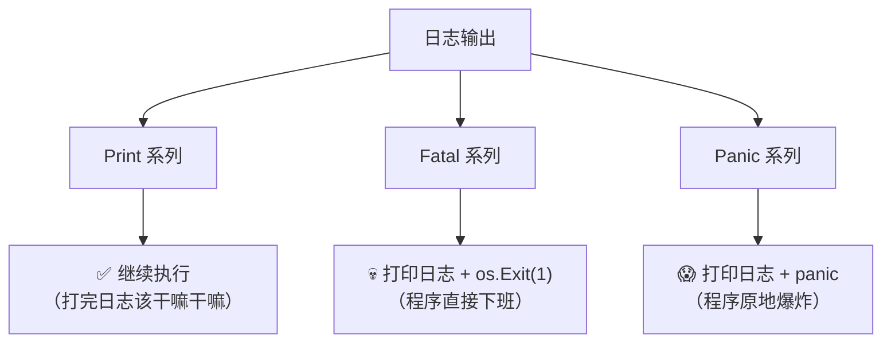
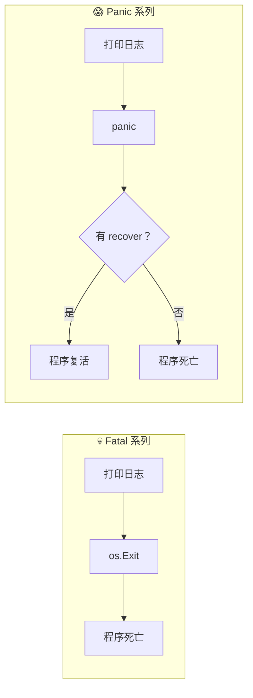
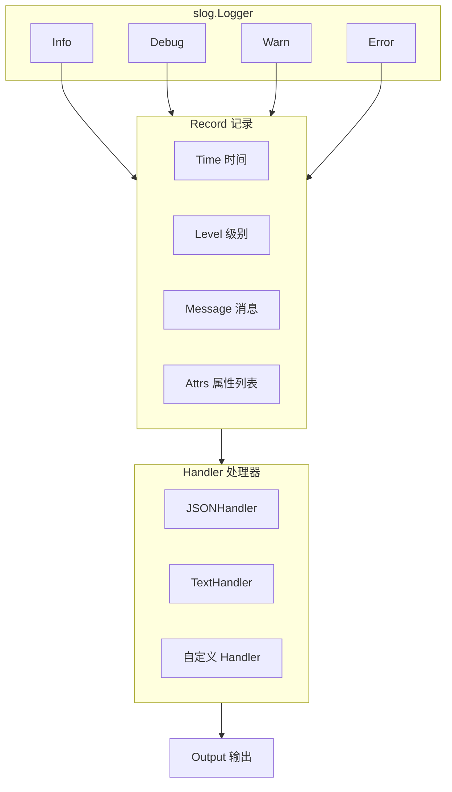
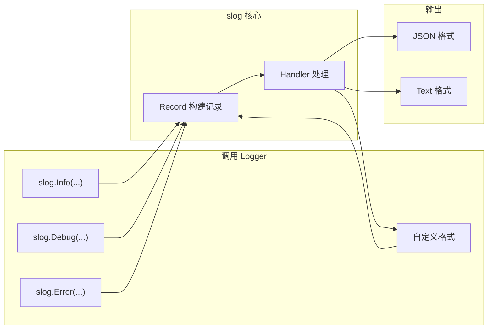
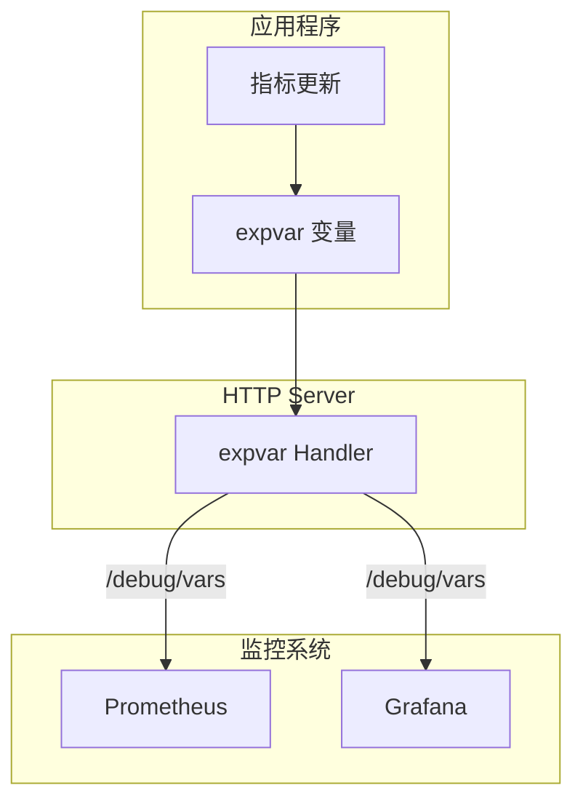
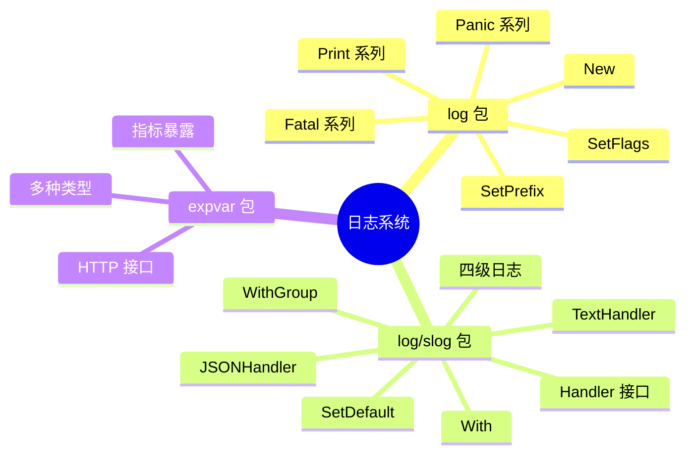

+++
title = "第41章：日志系统——log 和 log/slog"
weight = 410
date = "2026-03-30T13:43:00+08:00"
type = "docs"
description = ""
isCJKLanguage = true
draft = false
+++
# 第41章：日志系统——log 和 log/slog

> 💡 **章节导航**
> - 41.1-41.8：`log` 包（古老但经典的日志选手）
> - 41.9-41.18：`log/slog` 包（Go 1.21+ 结构化日志新贵）
> - 41.19-41.20：`expvar` 包（默默奉献的指标暴露小能手）
> - 本章小结：知识点大复盘

---

## 41.1 log包解决什么问题

想象一下这个场景：你写了一个 Web 服务，凌晨3点挂了。用户投诉电话打爆了你的手机，你却一脸懵逼——程序怎么挂的？最后一刻发生了什么？

这时，**日志**就是你的"程序黑匣子"。

### 📸 log包的角色

Go 的 `log` 包是标准库中的元老级选手，从 Go 诞生之初就伴随着我们。它的核心使命很简单：

> **把程序的"遗言"记录下来，让你在调试器够不着的地方，依然能看清程序的心路历程。**

### 🎯 什么时候用 log 包？

| 场景 | 推荐度 |
|------|--------|
| 快速脚本/工具 | ⭐⭐⭐⭐⭐ |
| 短时程序 | ⭐⭐⭐⭐⭐ |
| 简单服务 | ⭐⭐⭐ |
| 生产级服务（需要结构化日志） | ⭐⭐ |

> ⚠️ **注意**：对于生产环境，Go 1.21+ 引入了 `log/slog`，更适合结构化日志需求。

### 第一个日志程序

```go
package main

import "log"

func main() {
    // 程序员的第一条日志，比 "Hello, World!" 更有意义
    log.Println("程序启动了，老铁！")        // 2026/03/29 16:29:00 程序启动了，老铁！
    log.Printf("当前时间：%s", "2026-03-29") // 2026/03/29 16:29:00 当前时间：2026-03-29
}
```

### 核心专业词汇解释

| 词汇 | 解释 |
|------|------|
| **Logger（日志记录器）** | 负责产生日志输出的对象或组件 |
| **Log Level（日志级别）** | 日志的重要性等级，如 DEBUG、INFO、WARN、ERROR |
| **Handler（处理器）** | 处理日志输出的组件，决定日志去哪里、怎么格式化 |
| **Prefix（前缀）** | 日志行开头的固定文字，如"[INFO]" |

---

## 41.2 log核心原理：Print/Fatal/Panic 系列

`log` 包的灵魂可以归结为一个词：**三剑客**。

### 🗡️ 三种日志"死法"



### 📊 三剑客对比表

| 系列 | 函数 | 行为 | 类比 |
|------|------|------|------|
| **Print** | `Print`/`Printf`/`Println` | 打印后继续执行 | 贴个告示，然后继续干活 |
| **Fatal** | `Fatal`/`Fatalf`/`Fatalln` | 打印后程序退出 | 发现致命问题，直接拉闸 |
| **Panic** | `Panic`/`Panicf`/`Panicln` | 打印后触发 panic | 发现大问题，喊一声然后躺平 |

### 代码演示

```go
package main

import "log"

func main() {
    log.Println("=== 三剑客演示开始 ===")
    
    // Print 系列：温和型
    log.Print("我是 Print，打完日志我们还是朋友 ")
    log.Printf("我是 Printf，格式我最在行: %d", 42)
    log.Println("我是 Println，每行结束我自动换行")
    
    // 这时候程序还在跑，说明 Print 系列真的只是"说说而已"
    log.Println("看吧，程序还活着！")
}
```

```
2026/03/29 16:29:00 === 三剑客演示开始 ===
2026/03/29 16:29:00 我是 Print，打完日志我们还是朋友 
2026/03/29 16:29:00 我是 Printf，格式我最在行: 42
2026/03/29 16:29:00 我是 Println，每行结束我自动换行
2026/03/29 16:29:00 看吧，程序还活着！
```

---

## 41.3 log.Print、log.Printf、log.Println：普通日志

这是 `log` 包中最温和的三个函数，它们就像公司里贴通知的行政小姐姐——贴完就走，绝不添乱。

### 🎭 三兄弟的性格差异

```go
package main

import "log"

func main() {
    name := "小明"
    age := 18
    
    // Print：不格式化，原样输出
    log.Print("用户信息: name=", name, " age=", age)
    // 输出：2026/03/29 16:29:00 用户信息: name=小明 age=18
    
    // Println：自动在末尾加换行，参数之间加空格
    log.Println("用户信息:", name, age)
    // 输出：2026/03/29 16:29:00 用户信息: 小明 18
    
    // Printf：C风格格式化，最灵活
    log.Printf("用户 %s 今年 %d 岁了", name, age)
    // 输出：2026/03/29 16:29:00 用户 小明 今年 18 岁了
}
```

### 📝 输出结果

```
2026/03/29 16:29:00 用户信息: name=小明 age=18
2026/03/29 16:29:00 用户信息: 小明 18
2026/03/29 16:29:00 用户 小明 今年 18 岁了
```

### 🎯 使用场景

| 函数 | 适用场景 | 例子 |
|------|----------|------|
| `Print` | 多字符串拼接，无格式要求 | `log.Print("开始", "处理", "数据")` |
| `Println` | 简单一行日志，各参数天然分隔 | `log.Println("处理完成")` |
| `Printf` | 需要格式化输出 | `log.Printf("用户 %s 登录成功", username)` |

### 💡 小技巧

```go
package main

import "log"

func main() {
    // 多参数拼接时，Print 的表现
    log.Print("a", "b", "c")      // 无分隔符：abc
    log.Println("a", "b", "c")   // 空格分隔：a b c
    
    // 如果你要精确控制格式，还是得用 Printf
    log.Printf("%-10s %d", "hello", 123)  // 左对齐，宽10：hello      123
}
```

---

## 41.4 log.Fatal、log.Fatalf、log.Fatalln：致命错误日志

`Fatal` 系列是 log 包中的"狠人"。一旦被调用，程序就会**立即终止**，不会再多看你一眼。

### ⚠️ 它的使用场景

> 遇到不可恢复的错误时使用，比如：
> - 配置文件缺失
> - 必需的数据库连接失败
> - 端口被占用无法启动

### 🚨 致命错误示例

```go
package main

import (
    "log"
    "net/http"
)

func main() {
    // 假设这是启动 Web 服务器
    port := ":8080"
    
    // 检查端口是否被占用（模拟）
    isPortBusy := false
    
    if isPortBusy {
        log.Fatal("端口 8080 被占用了，臣妾无能为力啊！")
        // 这行之后的代码永远不会执行
        log.Println("这条永远不会打印")  // ❌ 不会执行
    }
    
    // 正常启动
    log.Printf("服务器启动中，监听端口 %s", port)
    
    // 如果 Fatal 被调用，这行不会打印
    err := http.ListenAndServe(port, nil)
    if err != nil {
        log.Fatalf("服务器启动失败：%v", err)
    }
}
```

### ⚡ Fatal 的内部原理

```go
// Fatal 系列等价于以下操作：
func myFatal(v ...interface{}) {
    log.Print(v...)    // 先打印日志
    log.SetOutput(os.Stderr)  // 确保输出到错误流
    os.Exit(1)        // 然后拉闸
}
```

### 🎭 对比：Fatal vs Print

```go
package main

import "log"

func main() {
    log.Println("===== Print vs Fatal 对比 =====")
    
    log.Print("Print: 我只是打一行日志而已 ")
    log.Println("Print: 说完我就走，程序继续嗨")
    
    log.Println("Fatal: 准备拉闸...")
    log.Fatalln("Fatal: 这是我的遗言...")
    
    // 下面的代码不会执行！
    log.Println("你看不到我！")  // ❌
}
```

**输出：**

```
2026/03/29 16:29:00 ===== Print vs Fatal 对比 =====
2026/03/29 16:29:00 Print: 我只是打一行日志而已 
2026/03/29 16:29:00 Print: 说完我就走，程序继续嗨
2026/03/29 16:29:00 Fatal: 准备拉闸...
2026/03/29 16:29:00 Fatal: 这是我的遗言...
```

程序到此结束，不会打印"你看不到我！"。

### 📌 注意事项

> ⚠️ `Fatal` 会调用 `os.Exit(1)`，这意味着：
> 1. `defer` 语句**不会**执行
> 2. 程序立即退出，不会优雅关闭
> 3. 如果需要优雅关闭，用 `panic` 或自定义错误处理

---

## 41.5 log.Panic、log.Panicf、log.Panicln：恐慌日志

`Panic` 系列是 Go 中的"搅局者"。它不仅打印日志，还会**触发 panic**，让程序进入恐慌状态。

### 😱 Panic vs Fatal：谁更狠？



### 🎬 Panic 演示

```go
package main

import (
    "log"
    "fmt"
)

func safeCall() {
    // defer + recover 可以捕获 panic
    defer func() {
        if r := recover(); r != nil {
            fmt.Printf("捕获到 panic：%v\n", r)
            fmt.Println("程序还活着！")
        }
    }()
    
    log.Println("准备触发 panic...")
    log.Panicln("我不行了，程序要爆炸了！")
    log.Println("你看不到这句")  // 不会执行
}

func main() {
    safeCall()
    log.Println("panic 被 recovery 了，程序继续运行")
}
```

**输出：**

```
2026/03/29 16:29:00 准备触发 panic...
2026/03/29 16:29:00 我不行了，程序要爆炸了！
捕获到 panic：我不行了，程序要爆炸了！
程序还活着！
2026/03/29 16:29:00 panic 被 recovery 了，程序继续运行
```

### 📊 Panic 家族对比

| 函数 | 用法 | 说明 |
|------|------|------|
| `Panic` | `log.Panic(v...)` | 相当于 `Print` + `panic` |
| `Panicf` | `log.Panicf(format, v...)` | 相当于 `Printf` + `panic` |
| `Panicln` | `log.Panicln(v...)` | 相当于 `Println` + `panic` |

### 🎯 使用场景

| 场景 | 推荐使用 |
|------|----------|
| 数组越界访问 | `panic("索引越界")` |
| 解引用 nil 指针 | `panic("nil pointer")` |
| 编程错误（不应该发生） | `panic("impossible state")` |
| 初始化失败（可恢复） | `log.Fatal` 更好 |

### 💡 什么时候用 Panic？

> 大多数情况下，你不需要 `panic`。只有当程序遇到了**完全不应该发生的错误**（比如程序 bug 导致的）时才用 panic。
>
> 对于业务错误（如"用户余额不足"），用普通错误返回值。

```go
package main

import "log"

// 业务错误 → 用 error 返回
func withdraw(amount, balance int) (int, error) {
    if amount > balance {
        return balance, fmt.Errorf("余额不足：需要 %d，账户只有 %d", amount, balance)
    }
    return balance - amount, nil
}

// 编程错误 → 可以 panic
func unsafeAccess(arr []int, idx int) int {
    if idx < 0 || idx >= len(arr) {
        panic(fmt.Sprintf("数组索引越界：%d not in [0, %d)", idx, len(arr)))
    }
    return arr[idx]
}
```

---

## 41.6 log.SetFlags：设置日志格式

默认的 log 输出长这样：

```
2026/03/29 16:29:00 程序启动了
```

但你可以自定义！`SetFlags` 让你决定日志前面显示什么"装饰"。

### 🎛️ 可用的 Flags

| Flag | 效果 | 示例 |
|------|------|------|
| `Ldate` | 显示日期 | `2026/03/29` |
| `Ltime` | 显示时间 | `16:29:00` |
| `Lmicroseconds` | 显示微秒 | `16:29:00.123456` |
| `Llongfile` | 显示完整文件路径+行号 | `/home/user/main.go:42` |
| `Lshortfile` | 显示短文件路径+行号 | `main.go:42` |
| `LUTC` | 使用 UTC 时间 | （配合其他 flags） |
| `LstdFlags` | 标准格式（日期+时间） | 默认值 |

### 🎨 自定义格式

```go
package main

import (
    "log"
    "os"
)

func main() {
    // 默认格式（标准格式）
    log.SetFlags(log.LstdFlags)
    log.Println("默认格式：日期 + 时间")
    
    // 只显示时间
    log.SetFlags(0)  // 清除所有 flags
    log.SetFlags(log.Ltime)
    log.Println("只有时间")
    
    // 时间 + 微秒（更精确）
    log.SetFlags(log.Ltime | log.Lmicroseconds)
    log.Println("时间 + 微秒")
    
    // 时间 + 短文件
    log.SetFlags(log.Ltime | log.Lshortfile)
    log.Println("时间 + 短文件名")
    
    // 完整版：日期 + 时间 + 微秒 + 完整文件路径
    log.SetFlags(log.Ldate | log.Ltime | log.Lmicroseconds | log.Llongfile)
    log.Println("完整豪华版")
}
```

**输出：**

```
2026/03/29 16:29:00 默认格式：日期 + 时间
16:29:00 只有时间
16:29:00.123456 时间 + 微秒
16:29:00 main.go:42 时间 + 短文件名
2026/03/29 16:29:00.123456 /path/to/main.go:42 完整豪华版
```

### 🔧 设置输出到文件

```go
package main

import (
    "log"
    "os"
)

func main() {
    // 打开日志文件
    file, err := os.OpenFile("app.log", os.O_CREATE|os.O_WRONLY|os.O_APPEND, 0666)
    if err != nil {
        log.Fatal("打开日志文件失败：", err)
    }
    defer file.Close()
    
    // 设置日志输出到文件
    log.SetOutput(file)
    log.SetFlags(log.Ldate | log.Ltime | log.Lshortfile)
    
    log.Println("这条日志会写到文件里")
}
```

### 💡 常用组合推荐

```go
// 开发环境：详细但易读
log.SetFlags(log.Ldate | log.Ltime | log.Lshortfile)

// 生产环境：简化版
log.SetFlags(0)

// 调试环境：最详细
log.SetFlags(log.Ldate | log.Ltime | log.Lmicroseconds | log.Llongfile)
```

---

## 41.7 log.SetPrefix：设置日志前缀

前缀就像是日志的"标签"，让你一眼看出这条日志是哪个模块产生的。

### 🏷️ 前缀的作用

```go
package main

import "log"

func main() {
    // 设置不同的前缀，区分不同模块
    log.SetPrefix("[INFO] ")
    log.Println("这条是信息日志")
    
    log.SetPrefix("[WARN] ")
    log.Println("这条是警告日志")
    
    log.SetPrefix("[ERROR] ")
    log.Println("这条是错误日志")
}
```

**输出：**

```
[INFO] 2026/03/29 16:29:00 这条是信息日志
[WARN] 2026/03/29 16:29:00 这条是警告日志
[ERROR] 2026/03/29 16:29:00 这条是错误日志
```

### 🎭 实际应用场景

```go
package main

import (
    "log"
    "net/http"
)

func main() {
    // 数据库模块的日志
    log.SetPrefix("[DB] ")
    log.Println("连接数据库...")
    log.Println("查询用户表")
    
    // HTTP 模块的日志
    log.SetPrefix("[HTTP] ")
    log.Printf("收到请求: GET /users")
    
    // 认证模块的日志
    log.SetPrefix("[AUTH] ")
    log.Println("验证 token...")
}
```

**输出：**

```
[DB] 2026/03/29 16:29:00 连接数据库...
[DB] 2026/03/29 16:29:00 查询用户表
[HTTP] 2026/03/29 16:29:00 收到请求: GET /users
[AUTH] 2026/03/29 16:29:00 验证 token...
```

### 📌 注意

> 前缀是**全局的**。如果你在多协程环境下频繁切换前缀，可能会导致日志顺序混乱。建议在生产环境使用 `log.New` 创建多个 Logger 实例。

---

## 41.8 log.New：创建 Logger

默认的 `log` 包使用全局 Logger，但有时候你需要**多个独立logger**，比如给不同模块用不同的输出。

### 🏭 New 函数签名

```go
func New(out io.Writer, prefix string, flag int) *Logger
```

| 参数 | 说明 |
|------|------|
| `out` | 日志输出目标（stdout、文件等）|
| `prefix` | 日志前缀 |
| `flag` | 日志格式 flags |

### 🎯 创建自定义 Logger

```go
package main

import (
    "log"
    "os"
)

func main() {
    // 创建一个输出到 stdout 的 logger，前缀是 [INFO]
    infoLogger := log.New(os.Stdout, "[INFO] ", log.Ldate|log.Ltime)
    
    // 创建一个输出到 stderr 的 logger，前缀是 [ERROR]
    errorLogger := log.New(os.Stderr, "[ERROR] ", log.Ldate|log.Ltime|log.Lshortfile)
    
    // 使用不同的 logger
    infoLogger.Println("程序启动成功")
    infoLogger.Printf("正在处理 %d 个任务", 10)
    
    errorLogger.Println("连接数据库失败")
    errorLogger.Fatalf("无法启动服务：%v", "端口被占用")
}
```

**输出：**

```
[INFO] 2026/03/29 16:29:00 程序启动成功
[INFO] 2026/03/29 16:29:00 正在处理 10 个任务
[ERROR] 2026/03/29 16:29:00 main.go:23 连接数据库失败
[ERROR] 2026/03/29 16:29:00 main.go:24 无法启动服务：端口被占用
```

### 🎨 同时输出到文件和控制台

```go
package main

import (
    "io"
    "log"
    "os"
)

func main() {
    // 打开日志文件
    file, err := os.OpenFile("app.log", os.O_CREATE|os.O_WRONLY|os.O_APPEND, 0666)
    if err != nil {
        log.Fatal("无法打开日志文件：", err)
    }
    defer file.Close()
    
    // 同时输出到文件和控制台（stdout）
    multiWriter := io.MultiWriter(file, os.Stdout)
    
    logger := log.New(multiWriter, "[APP] ", log.Ldate|log.Ltime|log.Lshortfile)
    
    logger.Println("这条日志会同时出现在文件和控制台")
}
```

### 📦 典型应用：模块化日志

```go
package main

import (
    "log"
    "os"
)

var (
    // 全局 logger
    Info  *log.Logger
    Warn  *log.Logger
    Error *log.Logger
)

func init() {
    // 初始化各模块的 logger
    Info  = log.New(os.Stdout, "[INFO]  ", log.Ldate|log.Ltime)
    Warn  = log.New(os.Stdout, "[WARN]  ", log.Ldate|log.Ltime)
    Error = log.New(os.Stderr, "[ERROR] ", log.Ldate|log.Ltime|log.Lshortfile)
}

func main() {
    Info.Println("应用启动")
    Warn.Println("这是一个警告")
    Error.Println("这是一个错误")
}
```

---

## 41.9 log/slog（Go 1.21+）解决什么问题

好了，`log` 包聊完了。现在欢迎来到**21世纪的结构化日志时代**！

### 🤔 旧 log 包的问题

```go
// 传统日志：一条字符串
log.Printf("用户 %s 登录成功，IP: %s, 时间: %s", name, ip, time)
// 输出：2026/03/29 16:29:00 用户 小明 登录成功，IP: 192.168.1.1, 时间: 2026-03-29
```

问题来了：
1. **难以机器解析** - 日志是字符串，grep 还好，但想让程序自动分析？
2. **缺少级别控制** - 你没法只看 ERROR 级别，忽略 DEBUG
3. **没有结构化属性** - 没办法附加 key-value 上下文
4. **JSON 格式不友好** - 旧 log 包不支持 JSON 输出

### 🎉 slog 来拯救

`slog` = **Structured Logging**（结构化日志）

```go
// slog：结构化日志，机器可读
slog.Info("用户登录",
    "username", "小明",
    "ip", "192.168.1.1",
    "duration_ms", 42,
)
// 输出 JSON：{"time":"2026-03-29T16:29:00Z","level":"INFO","msg":"用户登录","username":"小明","ip":"192.168.1.1","duration_ms":42}
```

### 🎯 slog vs log 对比

| 特性 | log | slog |
|------|-----|------|
| 日志级别 | ❌ 无 | ✅ DEBUG/INFO/WARN/ERROR |
| 结构化属性 | ❌ 无 | ✅ key-value |
| JSON 输出 | ❌ 无 | ✅ 原生支持 |
| 上下文属性 | ❌ 无 | ✅ With/WithGroup |
| Go 版本 | 1.0+ | 1.21+ |

### 📊 slog 核心概念图



---

## 41.10 log/slog核心原理

`slog` 的设计非常优雅，核心由三个组件构成：**Logger**、**Handler**、**Record**。

### 🏗️ 架构详解



### 📝 Record（日志记录）

每一条日志都是一个 `Record`，包含：

| 字段 | 说明 |
|------|------|
| `Time` | 时间戳 |
| `Level` | 日志级别 |
| `Message` | 日志消息 |
| `Attrs` | 属性列表（key-value 对）|

### 🔧 Handler（处理器）

Handler 负责把 Record 输出到目的地：

| Handler | 说明 |
|---------|------|
| `JSONHandler` | 输出 JSON 格式日志 |
| `TextHandler` | 输出人类可读的文本格式日志 |
| 自定义 Handler | 实现 `Handler` 接口 |

### 📌 四个日志级别

```go
// 从低到高排序
const (
    LevelDebug Level = -4  // 调试信息
    LevelInfo  Level = 0   // 一般信息
    LevelWarn  Level = 4   // 警告
    LevelError Level = 8   // 错误
)
```

> 💡 级别越高，数字越大。你可以通过设置**最小级别**来过滤日志。

### 🎬 第一次 slog

```go
package main

import "log/slog"

func main() {
    slog.Info("你好，世界！")
    slog.Debug("这是一条调试信息")
    slog.Warn("这是一条警告")
    slog.Error("这是一条错误")
}
```

**输出（默认 TextHandler）：**

```
2026/03/29 16:29:00 INFO 你好，世界！
2026/03/29 16:29:00 WARN 这是一条警告
2026/03/29 16:29:00 ERROR 这是一条错误
```

> 注意：`Debug` 默认不显示，因为默认级别是 `Info`。只有比 `Info` 级别高（或相等）的日志才会显示。

---

## 41.11 slog.Info、slog.Debug、slog.Warn、slog.Error

这是 slog 的四个核心日志函数，对应四个级别。

### 🎛️ 级别说明

| 函数 | 级别 | 数值 | 何时使用 |
|------|------|------|----------|
| `Debug` | DEBUG | -4 | 开发和调试时 |
| `Info` | INFO | 0 | 一般信息 |
| `Warn` | WARN | 4 | 警告，但不影响运行 |
| `Error` | ERROR | 8 | 错误，需要关注 |

### 🎭 四兄弟演示

```go
package main

import "log/slog"

func main() {
    // Debug - 默认不显示（因为默认级别是 Info）
    slog.Debug("这是一条调试信息", "key", "value")
    
    // Info - 默认显示
    slog.Info("用户登录成功", 
        "username", "小明",
        "ip", "192.168.1.100",
    )
    
    // Warn - 默认显示
    slog.Warn("磁盘空间不足",
        "free_gb", 2,
        "threshold_gb", 10,
    )
    
    // Error - 默认显示
    slog.Error("数据库连接失败",
        "error", "connection refused",
        "host", "localhost:5432",
    )
}
```

**输出：**

```
2026/03/29 16:29:00 INFO 用户登录成功 username=小明 ip=192.168.1.100
2026/03/29 16:29:00 WARN 磁盘空间不足 free_gb=2 threshold_gb=10
2026/03/29 16:29:00 ERROR 数据库连接失败 error="connection refused" host=localhost:5432
```

### 🔧 设置日志级别显示 Debug

```go
package main

import (
    "log/slog"
    "os"
)

func main() {
    // 设置日志级别为 Debug，这样 Debug 日志也会显示
    slog.SetDefault(slog.New(slog.NewTextHandler(os.Stdout, &slog.HandlerOptions{
        Level: slog.LevelDebug,
    })))
    
    slog.Debug("现在能看到我了！")
    slog.Info("这是信息")
}
```

### 💡 带格式的变体

```go
package main

import "log/slog"

func main() {
    // slog.Info 是基础版
    slog.Info("简单消息")
    
    // slog.Log 支持自定义级别
    slog.Log(nil, slog.LevelWarn, "自定义级别消息")
    
    // slog.InfoContext 支持带 context
    // slog.InfoContext(ctx, "带上下文的日志")
}
```

---

## 41.12 slog.Logger：Logger 类型

`slog.Logger` 是 slog 的核心类型。你可以创建**多个独立的 Logger**，每个有自己的配置。

### 🏭 创建 Logger

```go
package main

import (
    "log/slog"
    "os"
)

func main() {
    // 创建一个输出到 stdout 的 TextHandler
    textHandler := slog.NewTextHandler(os.Stdout, &slog.HandlerOptions{
        Level: slog.LevelDebug,
    })
    
    // 创建 Logger
    logger := slog.New(textHandler)
    
    // 使用这个 Logger
    logger.Info("使用自定义 logger")
    logger.Debug("调试信息")
}
```

**输出：**

```
time=2026-03-29T16:29:00+08:00 level=INFO msg=使用自定义 logger
time=2026-03-29T16:29:00+08:00 level=DEBUG msg=调试信息
```

### 🎯 使用 Logger 的方法

```go
package main

import (
    "log/slog"
    "os"
)

func main() {
    logger := slog.New(slog.NewTextHandler(os.Stdout, nil))
    
    // 四个级别方法
    logger.Debug("调试信息", "key", "value")
    logger.Info("信息", "key", "value")
    logger.Warn("警告", "key", "value")
    logger.Error("错误", "key", "value")
    
    // 通用的 Log 方法
    logger.Log(nil, slog.LevelInfo, "通用日志")
}
```

### 🌳 Logger 继承链：With/WithGroup

Logger 最强大的地方在于可以**派生**——创建一个带有预设上下文的子 Logger。

```go
package main

import (
    "log/slog"
    "os"
)

func main() {
    // 创建基础 Logger
    base := slog.New(slog.NewTextHandler(os.Stdout, nil))
    
    // 派生出带属性的子 Logger
    dbLogger := base.With("module", "database")
    httpLogger := base.With("module", "http")
    
    // 使用子 Logger
    base.Info("基础 logger")
    dbLogger.Info("查询用户")      // 自动带上 module=database
    httpLogger.Info("处理请求")    // 自动带上 module=http
}
```

**输出：**

```
time=2026-03-29T16:29:00+08:00 level=INFO msg=基础 logger
time=2026-03-29T16:29:00+08:00 level=INFO msg=查询用户 module=database
time=2026-03-29T16:29:00+08:00 level=INFO msg=处理请求 module=http
```

### 💡 实际应用：模块化日志

```go
package main

import (
    "log/slog"
    "os"
)

func main() {
    // 创建根 logger
    root := slog.New(slog.NewJSONHandler(os.Stdout, nil))
    
    // 为不同模块创建子 logger
    db := root.With("service", "database")
    api := root.With("service", "api")
    auth := root.With("service", "auth")
    
    // 数据库操作
    db.Info("连接数据库")
    db.Debug("执行查询", "sql", "SELECT * FROM users")
    db.Warn("慢查询", "duration_ms", 1500)
    
    // API 操作
    api.Info("收到请求", "method", "GET", "path", "/users")
    api.Error("请求失败", "status", 500)
    
    // 认证
    auth.Info("用户登录", "user_id", 12345)
    auth.Warn("登录失败", "reason", "密码错误")
}
```

---

## 41.13 Logger.With：添加上下文属性

`With` 是 slog 的一大杀器——它能让你创建一个**预设了属性的 Logger**，所有用这个 Logger 打的日志都会自动带上这些属性。

### 🎯 With 的使用

```go
package main

import (
    "log/slog"
    "os"
)

func main() {
    // 基础 logger
    base := slog.New(slog.NewTextHandler(os.Stdout, nil))
    
    // 添加上下文属性
    logger := base.With(
        "service", "user-service",
        "version", "1.0.0",
        "env", "production",
    )
    
    // 所有日志都会带上这三个属性
    logger.Info("服务启动")
    logger.Info("用户注册", "user_id", 123)
    logger.Info("用户登录", "user_id", 123, "ip", "192.168.1.1")
}
```

**输出：**

```
time=2026-03-29T16:29:00+08:00 level=INFO msg=服务启动 service=user-service version=1.0.0 env=production
time=2026-03-29T16:29:00+08:00 level=INFO msg=用户注册 service=user-service version=1.0.0 env=production user_id=123
time=2026-03-29T16:29:00+08:00 level=INFO msg=用户登录 service=user-service version=1.0.0 env=production user_id=123 ip=192.168.1.1
```

### 🆚 对比：不使用 With vs 使用 With

```go
package main

import (
    "log/slog"
    "os"
)

func main() {
    // ❌ 不使用 With：每次都要重复写属性
    slog.Info("服务启动", "service", "user-service", "env", "production")
    slog.Info("处理请求", "service", "user-service", "env", "production", "request_id", "abc123")
    
    // ✅ 使用 With：一劳永逸
    logger := slog.Default().With("service", "user-service", "env", "production")
    logger.Info("服务启动")  // 自动带上 service 和 env
    logger.Info("处理请求", "request_id", "abc123")  // 自动带上 service 和 env
}
```

### 🔗 With 的链式调用

```go
package main

import (
    "log/slog"
    "os"
)

func main() {
    base := slog.New(slog.NewTextHandler(os.Stdout, nil))
    
    // With 可以链式调用
    logger := base.With("env", "prod").With("service", "order")
    
    logger.Info("订单创建成功")
}
```

### 💡 实际场景：请求追踪

```go
package main

import (
    "log/slog"
    "os"
    "context"
)

func main() {
    logger := slog.New(slog.NewTextHandler(os.Stdout, nil))
    
    // 模拟处理请求
    processRequest(logger, "req-123", map[string]any{
        "user_id": 42,
        "action": "create_order",
    })
}

func processRequest(logger *slog.Logger, requestID string, data map[string]any) {
    // 为这个请求创建一个专属 logger
    reqLogger := logger.With(
        "request_id", requestID,
        "user_id", data["user_id"],
    )
    
    reqLogger.Info("开始处理请求")
    
    // 调用下游服务
    callDownstream(reqLogger)
    
    reqLogger.Info("请求处理完成")
}

func callDownstream(logger *slog.Logger) {
    // 这个 logger 自动带有 request_id 和 user_id
    logger.Info("调用下游服务 A")
}
```

---

## 41.14 Logger.WithGroup：添加属性组

`WithGroup` 是 `With` 的升级版——它把一组属性打包成一个**命名组**，让日志结构更清晰。

### 🎯 WithGroup 使用

```go
package main

import (
    "log/slog"
    "os"
)

func main() {
    logger := slog.New(slog.NewTextHandler(os.Stdout, nil))
    
    // 添加属性组
    withGroup := logger.WithGroup("user")
    
    withGroup.Info("用户登录",
        "id", 123,
        "name", "小明",
        "email", "xiaoming@example.com",
    )
}
```

**输出：**

```
time=2026-03-29T16:29:00+08:00 level=INFO msg=用户登录 user.id=123 user.name=小明 user.email=xiaoming@example.com
```

### 📊 With vs WithGroup 对比

```go
package main

import (
    "log/slog"
    "os"
)

func main() {
    logger := slog.New(slog.NewTextHandler(os.Stdout, nil))
    
    // With：属性直接展开
    logger.Info("使用 With",
        "user_id", 123,
        "user_name", "小明",
    )
    
    // WithGroup：属性归入组
    logger.WithGroup("user").Info("使用 WithGroup",
        "id", 123,
        "name", "小明",
    )
}
```

**输出：**

```
time=2026-03-29T16:29:00+08:00 level=INFO msg=使用 With user_id=123 user_name=小明
time=2026-03-29T16:29:00+08:00 level=INFO msg=使用 WithGroup user.id=123 user.name=小明
```

### 🏗️ 实际应用：嵌套结构

```go
package main

import (
    "log/slog"
    "os"
)

func main() {
    logger := slog.New(slog.NewJSONHandler(os.Stdout, &slog.HandlerOptions{
        Level: slog.LevelDebug,
    }))
    
    // 创建多级嵌套的 logger（WithGroup 只建组，With 传属性）
    requestLogger := logger.
        WithGroup("request").
        With("id", 12345).
        WithGroup("user").
        With("id", 42, "name", "小明").
        WithGroup("context").
        With("trace_id", "abc-123")
    
    requestLogger.Info("处理请求")
}
```

**JSON 输出：**

```json
{
  "time": "2026-03-29T16:29:00+08:00",
  "level": "INFO",
  "msg": "处理请求",
  "request": {"id": 12345},
  "user": {"id": 42, "name": "小明"},
  "context": {"trace_id": "abc-123"}
}
```

> 💡 在 JSON 格式下，`WithGroup` 的优势更加明显——它产生的是**嵌套的 JSON 对象**，而不是扁平化的 key。

### 💡 何时使用 With vs WithGroup

| 场景 | 推荐 |
|------|------|
| 属性简单，层级不深 | `With` |
| 需要清晰分组，结构化输出 | `WithGroup` |
| 输出 JSON，需要嵌套对象 | `WithGroup` |
| 多处复用同一组属性 | `WithGroup` |

---

## 41.15 slog.Handler：处理器接口

`slog.Handler` 是一个接口，定义了日志处理的规范。如果你想要自定义日志输出格式，实现这个接口就行了。

### 📜 Handler 接口定义

```go
type Handler interface {
    // Handle 处理一条日志记录
    Handle(ctx context.Context, r Record) error
    
    // Enabled 判断指定级别是否启用
    Enabled(ctx context.Context, level Level) bool
    
    // WithAttrs 返回带有属性的新 Handler
    WithAttrs(attrs []Attr) Handler
    
    // WithGroup 返回带有组的新 Handler
    WithGroup(name string) Handler
}
```

### 🏗️ 内置 Handler 类型

| Handler | 说明 |
|---------|------|
| `JSONHandler` | 输出 JSON 格式 |
| `TextHandler` | 输出人类可读文本格式 |
| 自定义 Handler | 实现 `Handler` 接口 |

### 🎨 创建自定义 Handler 示例

```go
package main

import (
    "context"
    "log/slog"
    "os"
)

// CustomHandler 自定义的 Handler
type CustomHandler struct {
    handler slog.Handler
}

func (h *CustomHandler) Enabled(ctx context.Context, level slog.Level) bool {
    return h.handler.Enabled(ctx, level)
}

func (h *CustomHandler) Handle(ctx context.Context, r slog.Record) error {
    // 在消息前加上自定义前缀
    r.Msg = "[CUSTOM] " + r.Msg
    return h.handler.Handle(ctx, r)
}

func (h *CustomHandler) WithAttrs(attrs []slog.Attr) slog.Handler {
    return &CustomHandler{handler: h.handler.WithAttrs(attrs)}
}

func (h *CustomHandler) WithGroup(name string) slog.Handler {
    return &CustomHandler{handler: h.handler.WithGroup(name)}
}

func main() {
    // 使用自定义 Handler
    baseHandler := slog.NewTextHandler(os.Stdout, nil)
    customHandler := &CustomHandler{handler: baseHandler}
    
    logger := slog.New(customHandler)
    logger.Info("这是一条自定义日志")
}
```

**输出：**

```
time=2026-03-29T16:29:00+08:00 level=INFO msg=[CUSTOM] 这是一条自定义日志
```

### 🔧 Handler 选项

```go
package main

import (
    "log/slog"
    "os"
)

func main() {
    // 配置 Handler 选项
    opts := &slog.HandlerOptions{
        Level:     slog.LevelDebug,    // 最小日志级别
        AddSource: true,                // 添加源代码位置
        ReplaceAttr: func(groups string, a slog.Attr) slog.Attr {
            // 可以自定义属性转换
            if a.Key == "time" {
                // 自定义时间格式
                return slog.Attr{Key: "timestamp", Value: a.Value}
            }
            return a
        },
    }
    
    logger := slog.New(slog.NewJSONHandler(os.Stdout, opts))
    logger.Info("配置了选项的 logger")
}
```

---

## 41.16 slog.JSONHandler：JSON 格式处理器

`JSONHandler` 是 slog 自带的 JSON 格式输出器，专为**机器解析**设计。在生产环境中，这是日志收集系统（如 ELK、Loki）的最爱。

### 🎯 基本使用

```go
package main

import (
    "log/slog"
    "os"
)

func main() {
    // 创建 JSON Handler
    handler := slog.NewJSONHandler(os.Stdout, nil)
    logger := slog.New(handler)
    
    logger.Info("用户登录",
        "username", "小明",
        "ip", "192.168.1.100",
    )
}
```

**输出：**

```json
{"time":"2026-03-29T16:29:00+08:00","level":"INFO","msg":"用户登录","username":"小明","ip":"192.168.1.100"}
```

### 🎨 格式化输出

```go
package main

import (
    "encoding/json"
    "log/slog"
    "os"
    "time"
)

func main() {
    // 使用缩进格式（方便调试）
    handler := slog.NewJSONHandler(os.Stdout, &slog.HandlerOptions{
        ReplaceAttr: func(groups string, a slog.Attr) slog.Attr {
            // 自定义时间格式
            if a.Key == "time" {
                return slog.Attr{Key: "timestamp", Value: a.Value}
            }
            return a
        },
    })
    logger := slog.New(handler)
    
    // 手动格式化输出
    logger.Handler().Handle(nil, slog.Record{
        Time:    now(),
        Level:   slog.LevelInfo,
        Message: "格式化示例",
    })
    
    logger.Info("这是一条漂亮的 JSON 日志")
}

func now() time.Time {
    return time.Now()
}
```

### 📊 JSON vs Text 对比

| 特性 | JSONHandler | TextHandler |
|------|-------------|-------------|
| 人类可读性 | ⭐⭐ | ⭐⭐⭐⭐⭐ |
| 机器可解析 | ⭐⭐⭐⭐⭐ | ⭐⭐ |
| 日志收集系统兼容 | ✅ | ❌ |
| 输出体积 | 较大 | 较小 |

### 💡 生产环境推荐配置

```go
package main

import (
    "log/slog"
    "os"
)

func main() {
    // 生产环境推荐配置
    opts := &slog.HandlerOptions{
        Level:     slog.LevelInfo,   // 只记录 Info 及以上
        AddSource: false,             // 生产环境关闭源码位置（减小体积）
    }
    
    // 输出到文件（而不是 stdout）
    file, _ := os.OpenFile("app.json.log", os.O_CREATE|os.O_WRONLY|os.O_APPEND, 0666)
    defer file.Close()
    
    logger := slog.New(slog.NewJSONHandler(file, opts))
    
    logger.Info("服务启动", "port", 8080)
    logger.Error("连接失败", "error", "timeout")
}
```

---

## 41.17 slog.TextHandler：文本格式处理器

`TextHandler` 输出的是人类可读的**文本格式**日志。适合开发阶段使用，调试时一目了然。

### 🎯 基本使用

```go
package main

import (
    "log/slog"
    "os"
)

func main() {
    // 创建 Text Handler
    handler := slog.NewTextHandler(os.Stdout, nil)
    logger := slog.New(handler)
    
    logger.Info("用户登录",
        "username", "小明",
        "ip", "192.168.1.100",
    )
}
```

**输出：**

```
time=2026-03-29T16:29:00+08:00 level=INFO msg=用户登录 username=小明 ip=192.168.1.100
```

### 🔧 与 JSONHandler 对比

```go
package main

import (
    "log/slog"
    "os"
)

func main() {
    textHandler := slog.NewTextHandler(os.Stdout, nil)
    jsonHandler := slog.NewJSONHandler(os.Stdout, nil)
    
    textLogger := slog.New(textHandler)
    jsonLogger := slog.New(jsonHandler)
    
    textLogger.Info("TextHandler 输出", "key", "value")
    jsonLogger.Info("JSONHandler 输出", "key", "value")
}
```

**输出：**

```
time=2026-03-29T16:29:00+08:00 level=INFO msg=TextHandler 输出 key=value
{"time":"2026-03-29T16:29:00+08:00","level":"INFO","msg":"JSONHandler 输出","key":"value"}
```

### 💡 嵌套属性的 TextHandler 表现

```go
package main

import (
    "log/slog"
    "os"
)

func main() {
    logger := slog.New(slog.NewTextHandler(os.Stdout, nil))
    
    // 带组的日志
    logger.WithGroup("user").Info("用户信息",
        "id", 123,
        "name", "小明",
    )
}
```

**输出：**

```
time=2026-03-29T16:29:00+08:00 level=INFO msg=用户信息 user.id=123 user.name=小明
```

> 💡 在 TextHandler 中，`WithGroup` 会把属性用 `group.key` 的形式展示。

### 🎛️ TextHandler 选项

```go
package main

import (
    "log/slog"
    "os"
)

func main() {
    opts := &slog.HandlerOptions{
        Level:     slog.LevelDebug,
        AddSource: true,  // 显示源码位置
    }
    
    logger := slog.New(slog.NewTextHandler(os.Stdout, opts))
    logger.Info("带源码位置的日志")
}
```

**输出：**

```
/path/to/main.go:42 time=2026-03-29T16:29:00+08:00 level=INFO msg=带源码位置的日志
```

---

## 41.18 slog.SetDefault：设置默认 Logger

`slog` 包有一个默认的全局 Logger。`SetDefault` 让你可以替换这个全局 Logger。

### 🎯 设置默认 Logger

```go
package main

import (
    "log/slog"
    "os"
)

func main() {
    // 创建一个自定义 logger
    customLogger := slog.New(slog.NewJSONHandler(os.Stdout, nil))
    
    // 设置为默认 logger
    slog.SetDefault(customLogger)
    
    // 现在 slog.Info 等函数都会使用这个 logger
    slog.Info("使用默认 logger")
}
```

**输出：**

```json
{"time":"2026-03-29T16:29:00+08:00","level":"INFO","msg":"使用默认 logger"}
```

### 🆚 对比：slog.Info vs logger.Info

```go
package main

import (
    "log/slog"
    "os"
)

func main() {
    // 设置默认 logger 为 JSON 格式
    slog.SetDefault(slog.New(slog.NewJSONHandler(os.Stdout, nil)))
    
    // 调用全局函数（使用默认 logger）
    slog.Info("通过 slog.Info 调用")
    
    // 创建自己的 logger（默认的 TextHandler）
    myLogger := slog.New(slog.NewTextHandler(os.Stdout, nil))
    myLogger.Info("通过 myLogger.Info 调用")
}
```

**输出：**

```
{"time":"2026-03-29T16:29:00+08:00","level":"INFO","msg":"通过 slog.Info 调用"}
time=2026-03-29T16:29:00+08:00 level=INFO msg=通过 myLogger.Info 调用
```

### 💡 初始化全局配置

```go
package main

import (
    "log/slog"
    "os"
)

func init() {
    // 在 init 中配置全局 logger
    slog.SetDefault(slog.New(slog.NewJSONHandler(os.Stdout, &slog.HandlerOptions{
        Level: slog.LevelInfo,
    })))
}

func main() {
    // 整个程序都使用这个配置
    slog.Info("服务启动")
}
```

### 📌 注意事项

> ⚠️ `SetDefault` 是全局操作，在多协程环境下是安全的。但要注意：
> 1. 尽早设置（在 `init` 或程序开始时）
> 2. 避免在运行过程中反复修改
> 3. 考虑使用依赖注入（传递 Logger）代替全局 Logger

---

## 41.19 expvar包：将程序内部指标发布为 HTTP 接口

`expvar` 是 Go 标准库中的一个"低调明星"。它能把程序的内部指标以 **HTTP 接口**的形式暴露出来，供监控系统（如 Prometheus）抓取。

### 🎯 expvar 能做什么？

```go
package main

import (
    "expvar"
    "net/http"
    _ "net/http/pprof"  // 顺便引入 pprof
)

func main() {
    // 注册 expvar handler
    // 访问 /debug/vars 会看到所有公开的变量
    
    // 添加自定义指标
    requestCount := expvar.NewInt("http_requests_total")
    requestCount.Add(1)
    
    // 启动 HTTP 服务器
    http.ListenAndServe(":8080", nil)
}
```

访问 `http://localhost:8080/debug/vars` 会看到：

```json
{
  "http_requests_total": 1,
  "memstats": {...},
  "cmdline": [...],
  "memprofile": "",
  "goinfo": {...}
}
```

### 🏗️ 工作原理



### 🎬 基本使用

```go
package main

import (
    "expvar"
    "net/http"
)

func main() {
    // 创建公开整数变量
    requestCount := expvar.NewInt("http_requests_total")
    
    // 模拟请求
    requestCount.Add(1)
    requestCount.Add(1)
    requestCount.Add(1)
    
    // 创建公开字符串变量
    version := expvar.NewString("app_version")
    version.Set("1.0.0")
    
    // 创建公开 Map 变量
    statusCounts := expvar.NewMap("http_status_codes")
    statusCounts.Add("200", 100)
    statusCounts.Add("404", 5)
    statusCounts.Add("500", 1)
    
    // 启动 HTTP 服务器
    http.ListenAndServe(":8080", nil)
}
```

### 📊 内置公开变量

`expvar` 默认公开以下变量：

| 变量名 | 类型 | 说明 |
|--------|------|------|
| `cmdline` | String | 命令行参数 |
| `memstats` | Map | 内存统计 |
| `goinfo` | Map | Go 版本信息 |

### 💡 与 Prometheus 配合

```go
package main

import (
    "expvar"
    "github.com/prometheus/client_golang/prometheus/promhttp"
    "net/http"
)

func main() {
    // 公开自定义指标
    requestCount := expvar.NewInt("http_requests_total")
    
    // 同时暴露 Prometheus 格式
    http.Handle("/metrics", promhttp.Handler())
    
    // 原始 expvar
    http.HandleFunc("/debug/vars", expvar.Handler().ServeHTTP)
    
    http.ListenAndServe(":8080", nil)
}
```

---

## 41.20 expvar.NewInt、expvar.NewFloat：创建公开整数/浮点数变量

`expvar` 包提供了多种类型来存储和公开指标，最常用的是 `Int` 和 `Float`。

### 🎯 NewInt：整数变量

```go
package main

import (
    "expvar"
    "net/http"
)

func main() {
    // 创建整数变量
    httpRequests := expvar.NewInt("http_requests_total")
    
    // 设置值
    httpRequests.Set(0)
    
    // 递增
    httpRequests.Add(1)
    httpRequests.Add(1)
    httpRequests.Add(5)
    
    // 当前值：7
    println("HTTP requests:", httpRequests.Value())  // 7
    
    http.ListenAndServe(":8080", nil)
}
```

**访问 `/debug/vars`：**

```json
{
  "http_requests_total": 7
}
```

### 🎯 NewFloat：浮点数变量

```go
package main

import (
    "expvar"
    "net/http"
)

func main() {
    // 创建浮点数变量
    cpuUsage := expvar.NewFloat("cpu_usage_percent")
    memUsage := expvar.NewFloat("memory_usage_percent")
    
    // 设置值
    cpuUsage.Set(45.5)
    memUsage.Set(72.3)
    
    // 浮点运算
    cpuUsage.Add(10.5)  // 变成 56.0
    
    // 也可以用 SetFloat
    cpuUsage.SetFloat(60.0)
    
    println("CPU:", cpuUsage.Value())   // 60
    println("Mem:", memUsage.Value())   // 72.3
    
    http.ListenAndServe(":8080", nil)
}
```

**访问 `/debug/vars`：**

```json
{
  "cpu_usage_percent": 60,
  "memory_usage_percent": 72.3
}
```

### 🎯 NewMap：复合变量

```go
package main

import (
    "expvar"
    "net/http"
)

func main() {
    // 创建 Map 类型变量
    requestDuration := expvar.NewMap("http_request_duration_ms")
    
    // 添加子项
    requestDuration.Add("GET /home", 120)
    requestDuration.Add("GET /home", 80)
    requestDuration.Add("POST /api", 250)
    requestDuration.Add("POST /api", 300)
    
    println("GET /home total:", requestDuration.Get("GET /home").Value())  // 200
    println("POST /api total:", requestDuration.Get("POST /api").Value())  // 550
    
    http.ListenAndServe(":8080", nil)
}
```

### 🎯 NewString：字符串变量

```go
package main

import (
    "expvar"
    "net/http"
)

func main() {
    // 创建字符串变量
    version := expvar.NewString("app_version")
    buildTime := expvar.NewString("build_time")
    gitCommit := expvar.NewString("git_commit")
    
    version.Set("1.2.3")
    buildTime.Set("2026-03-29T16:29:00Z")
    gitCommit.Set("abc123def456")
    
    http.ListenAndServe(":8080", nil)
}
```

### 📊 expvar 类型汇总

| 类型 | 创建函数 | 说明 |
|------|----------|------|
| `*Int` | `NewInt(name)` | 64位整数 |
| `*Float` | `NewFloat(name)` | 64位浮点数 |
| `*String` | `NewString(name)` | 字符串 |
| `*Map` | `NewMap(name)` | 键值对 Map |
| `*Func` | `NewFunc(name, fn)` | 动态值函数 |

### 💡 NewFunc：动态值

```go
package main

import (
    "expvar"
    "net/http"
    "runtime"
)

func main() {
    // 创建一个函数变量，动态返回指标
    expvar.NewFunc("goroutine_count", func() interface{} {
        return runtime.NumGoroutine()
    })
    
    // 每次访问 /debug/vars 时都会调用这个函数
    // 返回当前 goroutine 数量
    
    http.ListenAndServe(":8080", nil)
}
```

### 🎯 实际应用：请求计数

```go
package main

import (
    "expvar"
    "net/http"
)

var (
    // 全局请求计数器
    requestCount = expvar.NewInt("http_requests_total")
    
    // 按路径统计
    pathCounts = expvar.NewMap("http_requests_by_path")
    
    // 按方法统计
    methodCounts = expvar.NewMap("http_requests_by_method")
)

func main() {
    // 中间件：统计每个请求
    http.HandleFunc("/", func(w http.ResponseWriter, r *http.Request) {
        requestCount.Add(1)
        pathCounts.Add(r.URL.Path, 1)
        methodCounts.Add(r.Method, 1)
        w.Write([]byte("OK"))
    })
    
    http.ListenAndServe(":8080", nil)
}
```

访问 `/debug/vars`：

```json
{
  "http_requests_total": 42,
  "http_requests_by_path": {
    "/": 30,
    "/api": 10,
    "/health": 2
  },
  "http_requests_by_method": {
    "GET": 40,
    "POST": 2
  }
}
```

---

## 本章小结

### 🎯 核心知识点回顾

#### log 包（古老但可靠）

| 知识点 | 说明 |
|--------|------|
| `log.Print/Printf/Println` | 普通日志，不中断程序 |
| `log.Fatal/Fatalf/Fatalln` | 打印后 `os.Exit(1)` |
| `log.Panic/Panicf/Panicln` | 打印后 `panic()` |
| `log.SetFlags` | 设置日志格式标志 |
| `log.SetPrefix` | 设置日志前缀 |
| `log.New` | 创建自定义 Logger |

#### log/slog 包（Go 1.21+，结构化日志）

| 知识点 | 说明 |
|--------|------|
| 四个日志级别 | DEBUG < INFO < WARN < ERROR |
| `Logger.Info/Debug/Warn/Error` | 带级别的日志方法 |
| `Logger.With` | 添加上下文属性 |
| `Logger.WithGroup` | 添加属性组 |
| `JSONHandler` | JSON 格式输出 |
| `TextHandler` | 文本格式输出 |
| `slog.SetDefault` | 设置全局默认 Logger |

#### expvar 包（指标暴露）

| 知识点 | 说明 |
|--------|------|
| `expvar.NewInt` | 创建公开整数变量 |
| `expvar.NewFloat` | 创建公开浮点数变量 |
| `expvar.NewString` | 创建公开字符串变量 |
| `expvar.NewMap` | 创建公开 Map 变量 |
| `expvar.NewFunc` | 创建动态值变量 |
| `/debug/vars` | HTTP 端点，暴露所有指标 |

### 💡 选型建议

| 场景 | 推荐方案 |
|------|----------|
| 快速脚本/工具 | `log` 包 |
| 短时程序 | `log` 包 |
| 开发调试 | `log` 包 或 `slog.TextHandler` |
| 生产服务 | `slog` + `JSONHandler` |
| 需要指标监控 | `expvar` 包 |
| 日志收集系统 | `slog` + `JSONHandler` |

### 🔑 关键概念图



---

> 📚 **继续学习**
> - 第42章：`context` - 上下文管理
> - 第43章：`testing` - 单元测试
> - 第44章：`reflect` - 反射机制
