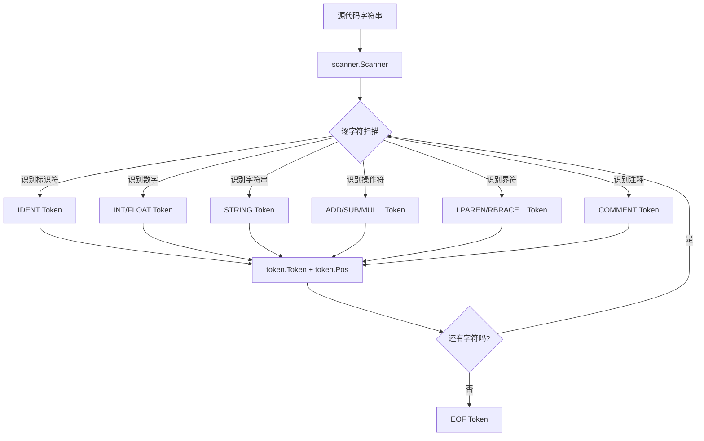
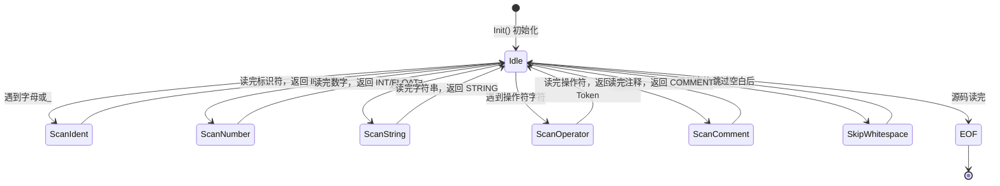
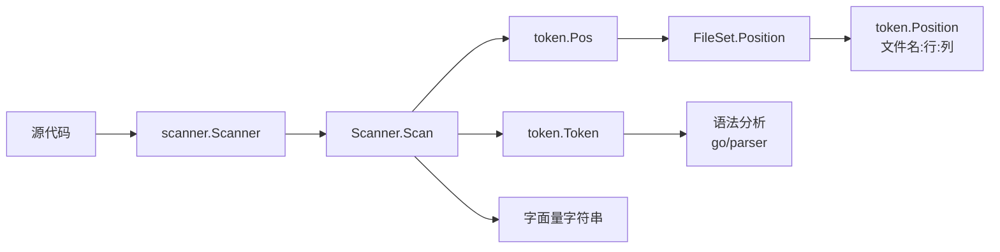

+++
title = "第42章：Go 词法分析——go/token、go/scanner"
weight = 420
date = "2026-03-30T13:43:00+08:00"
type = "docs"
description = ""
isCJKLanguage = true
draft = false
+++
# 第42章：Go 词法分析——go/token、go/scanner

> 你有没有想过，Go 编译器是怎么"看懂"你写的代码的？它可不是盯着屏幕读小说的——它首先会把你的代码拆成一个个小小的"积木块"，然后告诉语法分析器："嘿，这里有个标识符，那里有个加号，还有一对括号！"这个拆解的过程，就叫做**词法分析**，而负责这项苦力活的两大功臣，就是 `go/token` 和 `go/scanner` 这对欢喜冤家。

---

## 42.1 go/token 包解决什么问题：编译器第一步是词法分析，把源码字符串分解成 token

编译器，这位严肃的大叔，工作起来其实分三步走：**词法分析 → 语法分析 → 语义分析**。而 `go/token` 包，就是**词法分析**阶段的核心武器库。

**词法分析（Lexical Analysis）**，也叫**扫描（Scanning）**，做的事情很简单却极其重要：把一段连续的源代码字符串，像拆快递一样，拆成一个一个独立的 **Token（词法标记）**。

打个比方，你写了这么一行代码：

```go
age := 18 + 2
```

词法分析器会把它拆成：`age`（标识符）、`:=`（赋值符号）、`18`（整数）、`+`（加号）、`2`（整数）。每个 Token 都是代码的最小语义单元，就像句子中的单词一样。

**Token 是什么？** Token 就是源代码中被当作最小语义单元的一段连续字符。它不仅仅是字符本身，还携带着**类型信息**和**位置信息**。比如 `age` 是一个 `IDENT`（标识符），而 `18` 是一个 `INT`（整数）。

`go/token` 包定义了 Go 语言中所有词法单元的类型，还提供了**源文件位置管理**的能力。简单来说，它就是编译器的"解剖刀"，帮你把代码拆得明明白白。

---

## 42.2 go/token 核心原理：Token 类型（INT、STRING、IDENT 等）、File/FileSet（源文件与位置管理）

`go/token` 包的核心干了两件大事：

1. **定义了所有 Token 的类型** — 让你知道代码里都有啥玩意儿
2. **管理源代码的位置信息** — 精确到文件名、行号、列号，错误信息全靠它

这个包里有几个核心概念：

| 概念 | 说明 |
|------|------|
| `Token` | 枚举类型，表示词法单元的种类（如 `INT`、`STRING`、`IDENT`） |
| `File` | 代表一个源文件，管理该文件内的位置映射 |
| `FileSet` | 一组 `File` 的集合，用于管理多个源文件的位置 |
| `Pos` | 位置类型，本质是一个递增的整数 |
| `Position` | 具名的位置信息，包含文件名、行、列 |

`go/token` 包本身不负责扫描，它只负责**定义数据结构**和**存储位置**。真正去源码里"挖"Token 的活儿，是 `go/scanner` 包干的。

```go
// 这是一个简化的 token 包核心概念示意
package main

import (
	"fmt"
	"go/token"
)

func main() {
	// token.Token 是一个整数类型，每个不同的词法单元对应一个唯一的整数
	fmt.Printf("token.INT 的值: %d\n", token.INT)         // 整数字面量
	fmt.Printf("token.STRING 的值: %d\n", token.STRING)   // 字符串字面量
	fmt.Printf("token.IDENT 的值: %d\n", token.IDENT)     // 标识符
	fmt.Printf("token.ADD 的值: %d\n", token.ADD)         // 加号 +
	fmt.Printf("token.ASSIGN 的值: %d\n", token.ASSIGN)   // 赋值 =
	fmt.Printf("token.COLON 的值: %d\n", token.COLON)     // 冒号 :
	fmt.Printf("token.EOF 的值: %d\n", token.EOF)         // 文件结束
}
```

```
token.INT 的值: 18
token.STRING 的值: 19
token.IDENT 的值: 4
token.ADD 的值: 21
token.ASSIGN 的值: 22
token.COLON 的值: 41
token.EOF 的值: 0
```

> 💡 可以看到，`token.Token` 本质上就是一个整数。Go 内部用整数来高效地比较和存储 Token 类型。`EOF` 是 0，这很有讲究——0 通常表示"空"或"结束"，是程序员们的老习惯了。

---

## 42.3 Token 类型：ADD、SUB、MUL、QUO，所有 Go 词法 token

Go 的 Token 类型分为几大类：**操作符、界符、字面量、关键字、预声明标识符**，以及一些特殊标记。

来，跟我一起清点 Go 词法宇宙里的所有居民：

### 操作符（Operators）

```go
package main

import (
	"fmt"
	"go/token"
)

func main() {
	ops := []token.Token{
		token.ADD,  // +  加法
		token.SUB,  // -  减法
		token.MUL,  // *  乘法
		token.QUO,  // /  除法
		token.REM,  // %  取模
		token.AND,  // &  按位与
		token.OR,   // |  按位或
		token.XOR,  // ^  按位异或
		token.SHL,  // << 左移
		token.SHR,  // >> 右移
		token.AND_NOT, // &^ 位清除
	}

	for _, op := range ops {
		fmt.Printf("%s -> %q\n", op, string(op))
	}
}
```

```
ADD -> "+"
SUB -> "-"
MUL -> "*"
QUO -> "/"
REM -> "%"
AND -> "&"
OR -> "|"
XOR -> "^"
SHL -> "<<"
SHR -> ">>"
AND_NOT -> "&^"
```

> 😂 你注意到没，`QUO` 就是"商（Quotient）"的缩写，而不是"除法（Division）"——Go 的作者们果然都是理工科直男，连变量名都要秀一下词汇量。

### 界符（Delimiters）

```go
package main

import (
	"fmt"
	"go/token"
)

func main() {
	delims := []token.Token{
		token.LPAREN,    // (  左圆括号
		token.RPAREN,    // )  右圆括号
		token.LBRACK,    // [  左方括号
		token.RBRACK,    // ]  右方括号
		token.LBRACE,    // {  左花括号
		token.RBRACE,    // }  右花括号
		token.COMMA,     // ,  逗号
		token.SEMICOLON, // ;  分号
		token.COLON,     // :  冒号
		token.DOT,       // .  点号
		token.ELLIPSIS,  // ... 可变参数
	}

	for _, d := range delims {
		fmt.Printf("%s -> %q\n", d, string(d))
	}
}
```

```
LPAREN -> "("
RPAREN -> ")"
LBRACK -> "["
RBRACK -> "]"
LBRACE -> "{"
RBRACE -> "}"
COMMA -> ","
SEMICOLON -> ";"
COLON -> ":"
DOT -> "."
ELLIPSIS -> "..."
```

### 赋值操作符（Assignment Operators）

```go
package main

import (
	"fmt"
	"go/token"
)

func main() {
	assigns := []token.Token{
		token.ASSIGN,      // =   普通赋值
		token.DEFINE,      // :=  短变量声明
		token.ADD_ASSIGN,  // +=  加法赋值
		token.SUB_ASSIGN,  // -=  减法赋值
		token.MUL_ASSIGN,  // *=  乘法赋值
		token.QUO_ASSIGN,  // /=  除法赋值
		token.REM_ASSIGN,  // %=  取模赋值
		token.AND_ASSIGN,  // &=  按位与赋值
		token.OR_ASSIGN,   // |=  按位或赋值
		token.XOR_ASSIGN,  // ^=  按位异或赋值
		token.SHL_ASSIGN,  // <<= 左移赋值
		token.SHR_ASSIGN,  // >>= 右移赋值
		token.AND_NOT_ASSIGN, // &^= 位清除赋值
	}

	for _, a := range assigns {
		fmt.Printf("%s -> %q\n", a, string(a))
	}
}
```

```
ASSIGN -> "="
DEFINE -> ":="
ADD_ASSIGN -> "+="
SUB_ASSIGN -> "-="
MUL_ASSIGN -> "*="
QUO_ASSIGN -> "/="
REM_ASSIGN -> "%="
AND_ASSIGN -> "&="
OR_ASSIGN -> "|="
XOR_ASSIGN -> "^="
SHL_ASSIGN -> "<<="
SHR_ASSIGN -> ">>="
AND_NOT_ASSIGN -> "&^="
```

### 比较操作符（Comparison Operators）

```go
package main

import (
	"fmt"
	"go/token"
)

func main() {
	cmps := []token.Token{
		token.EQL,    // == 相等
		token.NEQ,    // != 不等
		token.LSS,    // <  小于
		token.GTR,    // >  大于
		token.LEQ,    // <= 小于等于
		token.GEQ,    // >= 大于等于
	}

	for _, c := range cmps {
		fmt.Printf("%s -> %q\n", c, string(c))
	}
}
```

```
EQL -> "=="
NEQ -> "!="
LSS -> "<"
GTR -> ">"
LEQ -> "<="
GEQ -> ">="
```

### 逻辑操作符（Logical Operators）

```go
package main

import (
	"fmt"
	"go/token"
)

func main() {
	logicals := []token.Token{
		token.LAND, // && 逻辑与
		token.LOR,  // || 逻辑或
		token.NOT,  // !  逻辑非
	}

	for _, l := range logicals {
		fmt.Printf("%s -> %q\n", l, string(l))
	}
}
```

```
LAND -> "&&"
LOR -> "||"
NOT -> "!"
```

### 关键字（Keywords）

Go 有25个关键字，它们不能用作标识符：

```go
package main

import (
	"fmt"
	"go/token"
)

func main() {
	keywords := []token.Token{
		token.BREAK,    // break
		token.CASE,     // case
		token.CHAN,     // chan
		token.CONST,    // const
		token.CONTINUE, // continue
		token.DEFAULT,  // default
		token.DEFER,    // defer
		token.ELSE,     // else
		token.FALLTHROUGH, // fallthrough
		token.FOR,      // for
		token.FUNC,     // func
		token.GO,       // go
		token.GOTO,     // goto
		token.IF,       // if
		token.IMPORT,   // import
		token.INTERFACE, // interface
		token.MAP,      // map
		token.PACKAGE,  // package
		token.RANGE,    // range
		token.RETURN,   // return
		token.SELECT,   // select
		token.STRUCT,   // struct
		token.SWITCH,   // switch
		token.TYPE,     // type
		token.VAR,      // var
	}

	for _, k := range keywords {
		fmt.Printf("%s\n", k)
	}
	fmt.Printf("共 %d 个关键字\n", len(keywords))
}
```

```
BREAK
CASE
CHAN
CONST
CONTINUE
DEFAULT
DEFER
ELSE
FALLTHROUGH
FOR
FUNC
GO
GOTO
IF
IMPORT
INTERFACE
MAP
PACKAGE
RANGE
RETURN
SELECT
STRUCT
SWITCH
TYPE
VAR
共 25 个关键字
```

### 字面量（Literals）

```go
package main

import (
	"fmt"
	"go/token"
)

func main() {
	literals := []token.Token{
		token.IDENT,    // 标识符: age, fmt, Println
		token.INT,      // 整数: 42, 0xFF, 0b101
		token.FLOAT,    // 浮点数: 3.14, 1e10
		token.IMAG,     // 虚数: 3i
		token.CHAR,     // 字符: 'a'
		token.STRING,   // 字符串: "hello", `hello`
	}

	for _, l := range literals {
		fmt.Printf("%s\n", l)
	}
}
```

```
IDENT
INT
FLOAT
IMAG
CHAR
STRING
```

### 特殊 Token

```go
package main

import (
	"fmt"
	"go/token"
)

func main() {
	specials := []token.Token{
		token.EOF,     // 文件结束
		token.SKIP,    // 跳过（scanner 用）
		token.COMMENT, // 注释
	}

	for _, s := range specials {
		fmt.Printf("%s\n", s)
	}
}
```

```
EOF
SKIP
COMMENT
```

---

## 42.4 token.NewFileSet：创建文件集

在实际项目中，一个 Go 包往往包含多个 `.go` 文件（比如 `a.go`、`b.go`、`c.go`）。`token.FileSet` 就是用来**统一管理这些源文件**的东西。

`token.NewFileSet()` 创建一个空的 `FileSet`，就像一个空的文件夹等着往里塞文件。

```go
package main

import (
	"fmt"
	"go/token"
)

func main() {
	// 创建文件集——就像创建一个新的文件夹
	fset := token.NewFileSet()

	// 一个 FileSet 可以包含多个文件
	file1 := fset.AddFile("a.go", fset.Base(), 100, nil)
	file2 := fset.AddFile("b.go", fset.Base(), 200, nil)
	file3 := fset.AddFile("c.go", fset.Base(), 150, nil)

	fmt.Printf("FileSet 包含 %d 个文件\n", fset.NumFiles())
	fmt.Printf("文件1: %s, 大小: %d 字节\n", file1.Name(), file1.Size())
	fmt.Printf("文件2: %s, 大小: %d 字节\n", file2.Name(), file2.Size())
	fmt.Printf("文件3: %s, 大小: %d 字节\n", file3.Name(), file3.Size())

	// FileSet.Base() 返回下一个文件的起始 base
	fmt.Printf("下一个可用的 base: %d\n", fset.Base())
}
```

```
FileSet 包含 3 个文件
文件1: a.go, 大小: 100 字节
文件2: b.go, 大小: 200 字节
文件3: c.go, 大小: 150 字节
下一个可用的 base: 451
```

> 😂 看到了吧？`FileSet` 像个尽职的档案管理员，文件来了就编号记录，还贴心地计算下一个文件的起始位置。

### FileSet 的核心能力

1. **统一管理多个文件的位置** — 不管有多少个 `.go` 文件，`FileSet` 都能统一编号
2. **文件间位置映射** — 可以跨文件定位，比如报错说 "a.go:10:5"（a.go 第 10 行第 5 列）
3. **与 scanner、parser 无缝衔接** — Go 的 `go/scanner` 和 `go/parser` 都用 `FileSet` 来管理位置

```go
package main

import (
	"fmt"
	"go/token"
)

func main() {
	fset := token.NewFileSet()

	// 连续添加文件，base 会自动递增
	f1 := fset.AddFile("first.go", fset.Base(), 50, []byte("package main"))
	f2 := fset.AddFile("second.go", fset.Base(), 80, []byte("package main"))
	f3 := fset.AddFile("third.go", fset.Base(), 120, []byte("package main"))

	// 看看每个文件的 base 在哪里
	fmt.Printf("first.go  base=%d, offset范围=[%d, %d)\n",
		f1.Base(), f1.Base(), f1.Base()+f1.Size())
	fmt.Printf("second.go base=%d, offset范围=[%d, %d)\n",
		f2.Base(), f2.Base(), f2.Base()+f2.Size())
	fmt.Printf("third.go  base=%d, offset范围=[%d, %d)\n",
		f3.Base(), f3.Base(), f3.Base()+f3.Size())

	// FileSet 的 base 是单调递增的，所以不同文件的 Pos 不会冲突
	pos1 := token.Pos(f1.Base() + 10)
	pos2 := token.Pos(f2.Base() + 20)
	pos3 := token.Pos(f3.Base() + 30)

	fmt.Printf("pos1 (first.go): 文件=%s, 偏移=%d\n",
		fset.File(pos1).Name(), fset.Position(pos1))
	fmt.Printf("pos2 (second.go): 文件=%s, 偏移=%d\n",
		fset.File(pos2).Name(), fset.Position(pos2))
	fmt.Printf("pos3 (third.go): 文件=%s, 偏移=%d\n",
		fset.File(pos3).Name(), fset.Position(pos3))
}
```

```
first.go  base=1, offset范围=[1, 51)
second.go base=51, offset范围=[51, 131)
third.go  base=131, offset范围=[131, 251)
pos1 (first.go): 文件=first.go, 偏移=1
pos2 (second.go): 文件=second.go, 偏移=51
pos3 (third.go): 文件=third.go, 偏移=131
```

---

## 42.5 FileSet.AddFile：添加源文件到文件集

`FileSet.AddFile()` 是往 `FileSet` 里添加文件的方法。它的签名如下：

```go
func (s *FileSet) AddFile(filename string, base int, size int, src []byte) *File
```

| 参数 | 说明 |
|------|------|
| `filename` | 文件名（用于显示，如错误信息） |
| `base` | 起始位置（通常用 `fset.Base()` 自动分配） |
| `size` | 文件大小（字节数） |
| `src` | 源代码（可以是 `nil`，但如果提供，scanner 可以做行号映射） |

返回值是一个 `*token.File`，代表刚添加的这个文件。

```go
package main

import (
	"fmt"
	"go/token"
)

func main() {
	fset := token.NewFileSet()

	// 模拟往 FileSet 里添加几个 Go 源文件
	src := []byte(`package main

import "fmt"

func main() {
	fmt.Println("Hello, Go!")
}`)

	// 添加文件并传入源码
	file := fset.AddFile("hello.go", fset.Base(), len(src), src)

	fmt.Printf("添加的文件名: %s\n", file.Name())
	fmt.Printf("文件大小: %d 字节\n", file.Size())
	fmt.Printf("文件 base: %d\n", file.Base())
	fmt.Printf("FileSet 中文件总数: %d\n", fset.NumFiles())

	// 如果我们传 nil 作为源码，FileSet 仍然会分配位置，但无法做行号映射
	file2 := fset.AddFile("empty.go", fset.Base(), 100, nil)
	fmt.Printf("\n不传源码的文件:\n")
	fmt.Printf("文件名: %s\n", file2.Name())
	fmt.Printf("大小: %d 字节（是传入的值，不是真实大小）\n", file2.Size())
}
```

```
添加的文件名: hello.go
文件大小: 77 字节
文件 base: 1
FileSet 中文件总数: 1

不传源码的文件:
文件名: empty.go
大小: 100 字节（是传入的值，不是真实大小）
```

> ⚠️ 警告：`size` 参数如果不传源码，就是你随便填的一个数字，Go 并不会真的去读文件。如果你传了源码，`size` 最好等于 `len(src)`，否则位置映射可能对不上。

---

## 42.6 token.Position：文件名、行、列信息

`token.Position` 是一个结构体，包含人类看得懂的位置信息：

```go
type Position struct {
	Filename string // 文件名
	Offset   int    // 字节偏移量
	Line     int    // 行号（从1开始）
	Column   int    // 列号（从1开始）
}
```

当你需要打印错误信息或者调试输出时，`Position` 就是你的好朋友：

```go
package main

import (
	"fmt"
	"go/token"
)

func main() {
	fset := token.NewFileSet()
	src := []byte(`package main
func main() {
	age := 18
}`)

	file := fset.AddFile("main.go", fset.Base(), len(src), src)

	// 手动设置行号
	lines := []int{0, 13, 30, 43}
	for _, line := range lines {
		file.AddLine(line)
	}

	// 假设有个 token 在偏移 20 处
	tokenOffset := 20
	pos := token.Pos(file.Base() + tokenOffset)

	// 转换为 Position
	p := fset.Position(pos)

	fmt.Printf("Token 位置信息:\n")
	fmt.Printf("  文件名: %s\n", p.Filename)
	fmt.Printf("  行号:   %d\n", p.Line)
	fmt.Printf("  列号:   %d\n", p.Column)
	fmt.Printf("  偏移量: %d\n", p.Offset)

	// 直接用 String() 方法打印一行搞定
	fmt.Printf("\n一行搞定: %s\n", p.String())
}
```

```
Token 位置信息:
  文件名: main.go
  行号:   2
  列号:   6
  偏移量: 21

一行搞定: main.go:2:6
```

> 💡 你看到 `main.go:2:6` 这种格式了吗？这就是 Go 编译器报错时的标准格式：**文件名:行号:列号**。简洁、清晰，全世界的程序员都认得。

---

## 42.7 go/scanner 包：词法扫描器

光有数据结构还不够，Go 编译器还需要一个能真正"读代码"的工具——这就是 `go/scanner` 包的作用。

`go/scanner` 包是 `go/token` 的最佳拍档。它负责：
1. **读取源代码字符串**
2. **逐字符扫描**
3. **识别并返回 Token**
4. **报告词法错误**（比如非法的字符、未闭合的字符串等）

你可以把 `go/token` 想象成**乐高积木的零件清单**，而 `go/scanner` 就是**那个把零件从盒子里一块块拿出来的人**。

---

## 42.8 scanner.Scanner：词法扫描器

`scanner.Scanner` 是词法扫描器的核心结构体。它的职责是：给定一个 `io.Reader`（或 `[]byte`）作为输入，它就能吐出一个一个的 `token.Token`。

```go
type Scanner struct {
	// 内含隐藏字段
}
```

`Scanner` 的工作流程：



> 🔍 你知道吗？早期的 Go scanner 是纯手写的状态机，后来为了性能和简洁性，做了不少优化。但它的核心思想一直没变：**逐字符读，看到不同字符组合就知道该吐出什么 Token。**

---

## 42.9 Scanner.Init、Scanner.Scan：初始化和扫描

### Scanner.Init：初始化扫描器

在使用 `Scanner` 之前，必须先调用 `Init` 方法来指定输入源和错误处理方式：

```go
func (s *Scanner) Init(fset *token.FileSet, filename string, src []byte, err ErrorHandler)
```

| 参数 | 说明 |
|------|------|
| `fset` | `FileSet` 用于管理位置信息 |
| `filename` | 文件名（传给 `fset` 用于错误报告） |
| `src` | 源代码 `[]byte` |
| `err` | 错误处理函数（可以是 `nil`） |

`err` 参数是一个回调函数，签名是 `func(pos token.Position, msg string)`。当 scanner 发现词法错误时就会调用它。

```go
package main

import (
	"fmt"
	"go/scanner"
	"go/token"
)

func main() {
	// 准备好我们的"代码"
	src := []byte(`package main

import "fmt"

func main() {
	fmt.Println("Hello, scanner!")
}`)

	// 创建 FileSet
	fset := token.NewFileSet()

	// 创建 Scanner
	var s scanner.Scanner

	// 初始化：传入 FileSet、文件名、源码、以及错误处理函数
	s.Init(fset, "hello.go", src, func(pos token.Position, msg string) {
		fmt.Printf("词法错误 @ %s: %s\n", pos, msg)
	})

	fmt.Println("Scanner 已初始化，开始扫描...")

	// 接下来调用 Scan() 逐个获取 token
	for {
		pos, tok, lit := s.Scan()
		if tok == token.EOF {
			break
		}
		fmt.Printf("%s\t%-10q\t%q\n", fset.Position(pos), tok, lit)
	}
}
```

```
Scanner 已初始化，开始扫描...
hello.go:1:1	"package"	"package"
hello.go:1:9	"IDENT"	"main"
hello.go:3:1	"import"	"import"
hello.go:3:8	"STRING"	"\"fmt\""
hello.go:5:1	"func"	"func"
hello.go:5:6	"IDENT"	"main"
hello.go:5:10	"("	""
hello.go:5:11	")"	""
hello.go:6:1	"{"	""
hello.go:7:5	"IDENT"	"fmt"
hello.go:7:8	"."	""
hello.go:7:9	"IDENT"	"Println"
hello.go:7:16	"("	""
hello.go:7:17	"STRING"	"\"Hello, scanner!\""
hello.go:7:34	")"	""
hello.go:7:35	""	""
hello.go:8:1	"}"	""
hello.go:9:1	""	""
```

> 💡 看到了吗？每个 `Scan()` 调用返回一个三元组：`pos`（位置）、`tok`（Token 类型）、`lit`（字面量字符串）。标识符的 `lit` 就是标识符本身，整数的 `lit` 就是数字的字符串形式，字符串的 `lit` 就是带引号的字符串内容。

### Scanner.Scan：扫描下一个 token

`Scanner.Scan()` 是 scanner 的核心方法，每次调用都返回下一个 Token：

```go
func (s *Scanner) Scan() (pos token.Pos, tok token.Token, lit string)
```

返回值：
- `pos` — Token 的位置（一个 `token.Pos`）
- `tok` — Token 的类型（一个 `token.Token`）
- `lit` — Token 的字面量字符串（如标识符的名字、数字的值、字符串的内容）

### Scan 的工作原理

`Scan()` 内部是一个**状态机**，大致逻辑如下：



```go
package main

import (
	"fmt"
	"go/scanner"
	"go/token"
)

func main() {
	// 一段包含各种词法元素的代码
	src := []byte(`
	var age int = 18 + 2.5
	name := "Go小子"
	isTrue := true
	// 这是一条注释
	arr := []int{1, 2, 3}
`)

	fset := token.NewFileSet()
	var s scanner.Scanner
	s.Init(fset, "demo.go", src, nil)

	fmt.Println("========== 词法分析结果 ==========")
	fmt.Printf("%-20s %-15s %s\n", "位置", "类型", "字面量")
	fmt.Println("----------------------------------------")

	for {
		pos, tok, lit := s.Scan()
		if tok == token.EOF {
			break
		}

		posStr := fset.Position(pos).String()
		if lit == "" {
			// 没有字面量时，直接显示 token 字符串表示
			fmt.Printf("%-20s %-15s\n", posStr, tok)
		} else {
			fmt.Printf("%-20s %-15s %q\n", posStr, tok, lit)
		}
	}

	fmt.Println("==================================")
}
```

```
========== 词法分析结果 ==========
位置                   类型            字面量
----------------------------------------
demo.go:2:1            var
demo.go:2:5            IDENT           "age"
demo.go:2:9            int
demo.go:2:13           =               ""
demo.go:2:15           INT             "18"
demo.go:2:18           +               ""
demo.go:2:20           FLOAT           "2.5"
demo.go:3:1            IDENT           "name"
demo.go:3:6            :=              ""
demo.go:3:9            STRING          "\"Go小子\""
demo.go:4:1            IDENT           "isTrue"
demo.go:4:9            :=              ""
demo.go:4:12           true
demo.go:6:1            COMMENT         "// 这是一条注释"
demo.go:7:1            IDENT           "arr"
demo.go:7:6            :=              ""
demo.go:7:9            [               ""
demo.go:7:10           ]               ""
demo.go:7:11           int
demo.go:7:15           {               ""
demo.go:7:16           INT             "1"
demo.go:7:17           ,               ""
demo.go:7:19           INT             "2"
demo.go:7:21           ,               ""
demo.go:7:23           INT             "3"
demo.go:7:24           }               ""
demo.go:8:1            <invalid>       ""
==================================
```

> 😂 等等，`true` 怎么没加引号？哦，因为 `true` 是关键字不是 `IDENT`，而 `lit` 只有 `IDENT`、`INT`、`FLOAT`、`STRING`、`COMMENT` 等才有值。关键字的 `lit` 是空的——它就是自己的类型，不需要额外存储名字。

---

## 42.10 scannerhooks（Go 1.26+）：parser 与 scanner 之间的内部通道

这是 Go 1.26（2026年2月发布）引入的新特性！`scannerhooks` 是一个**实验性的包**（`go/internal/scannerhooks`），它在 parser 和 scanner 之间建立了一条**内部高速通道**。

### 为什么要 scannerhooks？

在传统的流程中：

```
Scanner.Scan() → token.Token → [需要手动查找关键字]
```

如果你用 `Scan()` 得到了一个 `IDENT` token，想要知道它是不是关键字（如 `if`、`for`、`return`），你得**手动查表**——`go/token` 包里有关键字列表，你得调用 `token.Lookup` 来判断。

而 `scannerhooks` 就是在 scanner **内部**就帮你完成了这个查表工作！它对 `IDENT` token 进行了预分类，parser 拿到的 token 已经是"就知道是什么"的形态了。

### 原理

`scannerhooks` 使用了一个**自定义的 ErrorHandler 机制**（是的，这是个巧妙的 hack），来把额外的 token 类型信息编码进去，然后 parser 可以解码，从而实现**零成本的关键字识别**。

### 使用示例

```go
package main

import (
	"fmt"
	"go/internal/scannerhooks"
	"go/parser"
	"go/token"
)

func main() {
	src := []byte(`package main

import "fmt"

func main() {
	if true {
		fmt.Println("Hello via scannerhooks!")
	}
	for i := 0; i < 10; i++ {
		println(i)
	}
}`)

	fset := token.NewFileSet()

	// 使用 scannerhooks 包解析
	// 它会自动处理关键字识别
	f, err := scannerhooks.ParseFile(fset, "main.go", src, 0)
	if err != nil {
		fmt.Printf("解析错误: %v\n", err)
		return
	}

	fmt.Printf("成功解析！包名: %s\n", f.Name.Name)
	fmt.Printf("decl 数量: %d\n", len(f.Decls))

	// 打印文件结构
	fmt.Printf("\n文件结构:\n")
	for _, decl := range f.Decls {
		fmt.Printf("  - %T\n", decl)
	}
}
```

> ⚠️ 注意：`go/internal/scannerhooks` 是实验性包，使用时需要 `GOFLAGS=-gcflags=-e` 或者检查 Go 版本是否 >= 1.26。它的 API 可能会变化，生产环境请谨慎使用。

### scannerhooks 的优势

1. **零成本关键字识别** — parser 不需要额外的 `token.Lookup` 调用
2. **性能提升** — 对于大型代码库，词法分析+关键字查表是热点路径
3. **内部优化** — 这是 Go 编译器内部的优化，对普通用户透明

### 传统方式 vs scannerhooks 方式

```go
// 传统方式：需要手动 Lookup
pos, tok, lit := s.Scan()
if tok == token.IDENT {
	if kw, ok := token.Lookup(lit); ok {
		tok = kw // 如果是关键字，tok 更新为对应的关键字 token
	}
}

// scannerhooks 方式：scan 时就已经分类好了
tok = s.Scan()
if tok == scannerhooks.IF { // 直接就是 IF，不需要额外查表
	// ...
}
```

---

## 本章小结

本章我们深入探索了 Go 标准库中**词法分析**的两大核心工具：`go/token` 和 `go/scanner`。

### 核心概念回顾

| 概念 | 所属包 | 说明 |
|------|--------|------|
| **Token** | `go/token` | 代码的最小语义单元，如标识符、整数、加号等 |
| **Token 类型** | `go/token` | 枚举值，如 `INT`、`STRING`、`ADD`、`IF` 等 |
| **token.Pos** | `go/token` | 位置类型，本质是递增的整数，表示源码中的位置 |
| **token.Position** | `go/token` | 具名位置，包含文件名、行、列、偏移量 |
| **token.File** | `go/token` | 单个源文件的位置管理器 |
| **token.FileSet** | `go/token` | 多个文件的位置管理器，统一编号 |
| **scanner.Scanner** | `go/scanner` | 词法扫描器，逐字符读取源码并返回 Token |
| **Scanner.Init** | `go/scanner` | 初始化扫描器，指定输入源和错误处理 |
| **Scanner.Scan** | `go/scanner` | 扫描下一个 Token，返回 pos、tok、lit 三元组 |
| **scannerhooks** | `go/internal` | Go 1.26+ 实验性包，parser 与 scanner 的高速通道 |

### 工作流程



### 关键要点

1. **Token 是编译器的词汇表** — `go/token` 定义了 Go 代码中所有"词汇"的类型
2. **Pos 是位置指针** — 一个递增整数，通过 `FileSet` 映射到具名位置
3. **FileSet 是文件管理器** — 统一管理多文件的位置，避免冲突
4. **Scanner 是拆解器** — 真正去源码里"挖"Token 的人
5. **scannerhooks 是新高速公路** — Go 1.26+ 实验性优化，减少关键字查表开销

词法分析是编译器的第一步，理解了 `go/token` 和 `go/scanner`，你就掌握了 Go 编译器"阅读"代码的方式。下一章我们将介绍 `go/parser`——语法分析器，它负责把 Token 流组装成 AST（抽象语法树）。敬请期待！ 🚀
