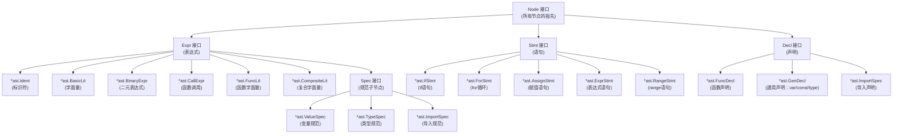
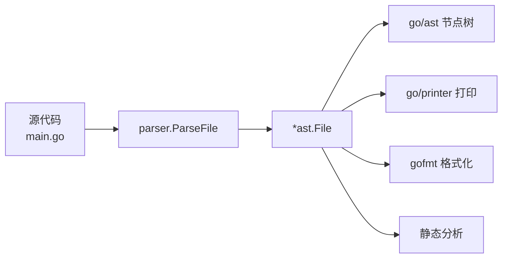
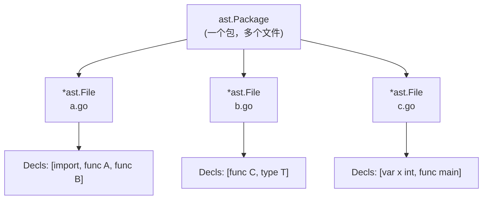
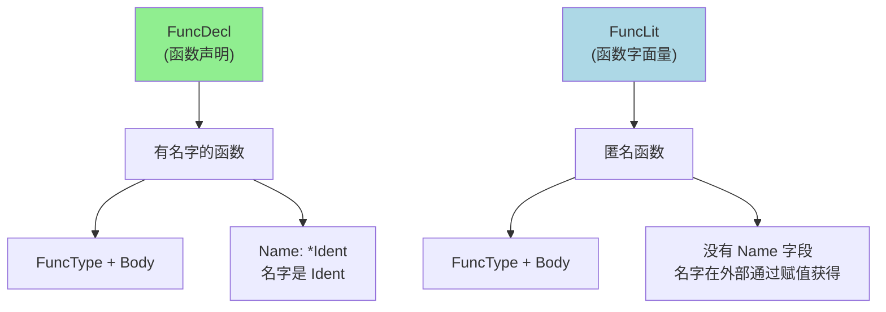
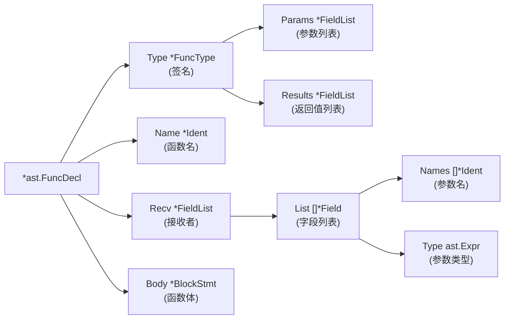
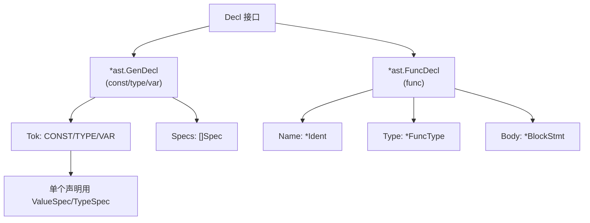
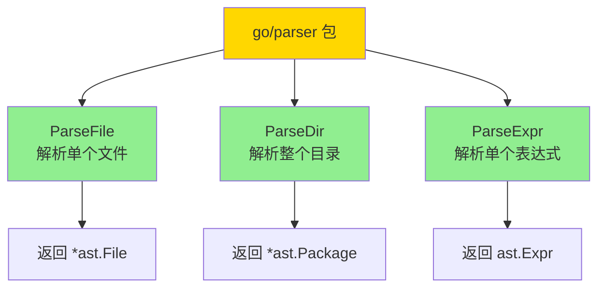

+++
title = "第43章：Go 语法树——go/ast、go/parser"
weight = 430
date = "2026-03-30T13:43:00+08:00"
type = "docs"
description = ""
isCJKLanguage = true
draft = false
+++
# 第43章：Go 语法树——go/ast、go/parser

> *"程序员最浪漫的事，不是写代码，而是让代码自己读懂自己。"*
>
> 当你写下一个 `fmt.Println("Hello")`，Go 编译器默默把你的代码拆成一个个最小的语法单元，然后像搭积木一样把它们组装成一棵树。这棵树，就是抽象语法树（AST）。有了它，IDE 能给你自动补全，gofmt 能帮你格式化，静态分析工具能找出你代码里的 bug。这，就是 go/ast 和 go/parser 的魔法世界。

---

## 43.1 go/ast 包解决什么问题：词法分析输出 token，语法分析把 token 组织成树

### 问题引入：代码是怎么被"理解"的？

当你打开一个 Go 文件，编译器看到的是一堆字节。但它需要"理解"这些字节的含义。这就要分两步走：

1. **词法分析（Lexical Analysis）**：把源代码字符串拆成一个个 **token（词法单元）**。比如 `age := 18` 会被拆成 `标识符(age)`、`赋值(:=)`、`数字(18)`、`分号`。
2. **语法分析（Syntax Analysis）**：把这些 token 按照语法规则组装成一棵树——**AST（抽象语法树）**。

Go 官方把这两步分别交给了 `go/scanner`（词法分析）和 `go/parser`（语法分析），而 `go/ast` 则负责定义这棵树的节点类型。

### 词法分析 vs 语法分析

```go
package main

import (
	"fmt"
	"go/scanner"
	"go/token"
)

func main() {
	// 源代码
	src := []byte(`age := 18`)

	// 创建一个 token 文件集（记录每个 token 的位置）
	fset := token.NewFileSet()

	// 创建一个 scanner
	var s scanner.Scanner
	s.Init(fset.AddFile("main.go", fset.Base(), len(src)), src, nil, scanner.ScanComments)

	// 循环扫描所有 token
	for {
		pos, tok, lit := s.Scan()
		if tok == token.EOF {
			break
		}
		// 打印每个 token：位置、类型、字面量
		fmt.Printf("位置: %s, 类型: %-8s, 字面量: %q\n", fset.Position(pos), tok, lit)
	}
}
```

```
位置: main.go:1:1, 类型: IDENT   , 字面量: "age"
位置: main.go:1:5, 类型: :=      , 字面量: ""
位置: main.go:1:8, 类型: INT     , 字面量: "18"
位置: main.go:1:10, 类型: ;      , 字面量: ""
```

### 术语解释

| 术语 | 英文 | 含义 |
|------|------|------|
| token | Token | 词法分析的最小单元，代表源代码中的一个原子元素 |
| 词法分析 | Lexical Analysis | 将源代码字符串分解为 token 序列的过程 |
| 语法分析 | Syntax Analysis | 将 token 序列按照语法规则组织成 AST 的过程 |
| AST | Abstract Syntax Tree | 抽象语法树，以树形结构表示源代码的语法结构 |

---

## 43.2 go/ast 核心原理：Node 接口体系，Expr、Stmt、Decl、Spec

### Go AST 的核心接口

`go/ast` 包定义了一个核心接口 `Node`，所有 AST 节点都实现了这个接口：

```go
// Node 接口——所有 AST 节点的"老祖宗"
type Node interface {
	Pos() token.Pos   // 节点在源代码中的起始位置
	End() token.Pos   // 节点在源代码中的结束位置
}
```

在这个接口之下，Go 将节点分成了四大类：

```go
// 表达式——有值的东西，比如 1+2、fmt.Println、a[i]
type Expr interface {
    Node
    exprNode()
}

// 语句——执行动作，比如 if、for、赋值
type Stmt interface {
    Node
    stmtNode()
}

// 声明——定义东西，比如 var、type、func
type Decl interface {
    Node
    declNode()
}

// 规范声明的子节点——用于 Spec（规范）中
type Spec interface {
    Node
    specNode()
}
```

### 节点类型体系图



### 为什么分这么多接口？

这其实是一种**组合模式（Composite Pattern）**的应用。通过接口分层，Go 的 `ast.Inspect`、`ast.Walk` 等工具可以用统一的方式遍历不同类型的节点——它们只需要判断一个 `Node` 是否实现了 `Expr`、`Stmt` 或 `Decl`，就能知道该如何处理它。

### 术语解释

| 术语 | 英文 | 含义 |
|------|------|------|
| Expr | Expression | 表达式，有值，可以求值 |
| Stmt | Statement | 语句，执行动作，不返回值 |
| Decl | Declaration | 声明，定义一个名称 |
| Spec | Specification | 规范声明的子节点，如 ValueSpec、TypeSpec |

---

## 43.3 ast.File：完整文件的 AST 表示

### 什么是 ast.File？

当你用 `parser.ParseFile` 解析一个 `.go` 文件时，得到的就是一个 `*ast.File`。它代表一个完整的 Go 源代码文件，包含了这个文件所有的组成部分。

```go
// ast.File 的结构（简化版）
type File struct {
    Doc     *CommentGroup   // 包文档注释
    Package token.Pos       // package 关键字的位置
    Name    *Ident          // 包名（如 main、fmt）
    Decls   []Decl          // 文件中的所有声明（import、type、var、func...）
    Scope   *Scope          // 文件级作用域
    Imports []*ImportSpec   // 所有导入的包
    Comments []*CommentGroup // 所有注释
}
```

### 解析并查看文件结构

```go
package main

import (
	"fmt"
	"go/ast"
	"go/parser"
	"go/token"
)

func main() {
	// 创建一个 token 文件集
	fset := token.NewFileSet()

	// 解析一个 Go 源代码字符串
	src := `package main

import "fmt"

// Add 计算两数之和
func Add(a, b int) int {
	return a + b
}

func main() {
	fmt.Println(Add(1, 2))
}`

	// 解析源代码，返回 *ast.File
	f, err := parser.ParseFile(fset, "main.go", src, parser.ParseComments)
	if err != nil {
		panic(err)
	}

	// 打印文件基本信息
	fmt.Printf("包名: %s\n", f.Name.Name)
	fmt.Printf("包文档: %s\n", f.Doc.Text())
	fmt.Printf("导入包数量: %d\n", len(f.Imports))
	for _, imp := range f.Imports {
		fmt.Printf("  - 导入路径: %s\n", imp.Path.Value)
	}

	// 遍历所有声明
	fmt.Printf("声明数量: %d\n", len(f.Decls))
	for i, decl := range f.Decls {
		fmt.Printf("  [%d] 类型: %T\n", i, decl)
	}
}
```

```
包名: main
包文档: 
导入包数量: 1
  - 导入路径: "fmt"
声明数量: 3
  [0] 类型: *ast.GenDecl
  [1] 类型: *ast.FuncDecl
  [2] 类型: *ast.FuncDecl
```

### ast.File 在工具链中的地位



`ast.File` 是整个 `go/ast` 包的门面，所有对文件级别操作都离不开它。

---

## 43.4 ast.Package：包（多个文件）

### 什么是 ast.Package？

当你的代码分布在多个 `.go` 文件中（比如 `a.go`、`b.go`），它们共同组成一个 **Package**。`ast.Package` 就是对这种多文件包的抽象——它把同一个包名下所有的 `ast.File` 汇总在一起。

```go
// ast.Package 的结构（简化版）
type Package struct {
    Name    string             // 包名
    Scope   *Scope             // 包级作用域
    Imports map[string]*File   // 文件名到 ast.File 的映射
    Files   map[string]*File   // 文件路径到 ast.File 的映射（新版 Go 更喜欢用 Files）
}
```

### 解析整个包目录

```go
package main

import (
	"fmt"
	"go/parser"
	"go/token"
)

func main() {
	fset := token.NewFileSet()

	// 解析一个目录（假设当前目录有一些 .go 文件）
	// 这里用 "" 表示解析内置的测试用包
	// 实际使用时：parser.ParseDir(fset, "/path/to/package", nil, 0)
	pkg, err := parser.ParseDir(fset, ".", func(info os.FileInfo) bool {
		return !info.IsDir() && !strings.HasSuffix(info.Name(), "_test.go")
	}, 0)
	if err != nil {
		panic(err)
	}

	// 遍历包中的所有文件
	for name, file := range pkg.Files {
		fmt.Printf("文件: %s, 包名: %s, 声明数: %d\n",
			name, file.Name.Name, len(file.Decls))
	}
}
```

> **注意**：`parser.ParseDir` 的第二个参数是包所在的目录路径，上面的代码需要在真实目录下运行才能看到结果。

### ast.Package vs ast.File



简单来说：
- **`ast.File`** = 一个 `.go` 文件的 AST
- **`ast.Package`** = 同一个包名下所有 `.go` 文件的 AST 集合

---

## 43.5 ast.Ident：标识符

### 什么是 ast.Ident？

标识符（Identifier）就是源代码中的名字——变量名、函数名、包名、类型名，统统都是 `*ast.Ident`。

```go
// ast.Ident 的结构
type Ident struct {
	NamePos token.Pos  // 名字出现的位置
	Name    string     // 标识符的名称
	Obj     *Object    // 指向作用域中对应对象的引用（解析后填充）
}
```

### 用处多多的标识符

```go
package main

import (
	"fmt"
	"go/ast"
	"go/parser"
	"go/token"
)

func main() {
	src := `package main

func greet(name string) {
	msg := "Hello, " + name
	println(msg)
}`

	fset := token.NewFileSet()
	f, _ := parser.ParseFile(fset, "main.go", src, 0)

	// 使用 ast.Inspect 遍历所有节点，找所有 Ident
	fmt.Println("找到的标识符：")
	ast.Inspect(f, func(n ast.Node) bool {
		if ident, ok := n.(*ast.Ident); ok {
			fmt.Printf("  名字: %-10s 位置: %s\n", ident.Name, fset.Position(ident.Pos()))
		}
		return true // 返回 true 继续遍历
	})
}
```

```
找到的标识符：
  名字: main      位置: main.go:2:10
  名字: greet     位置: main.go:3:6
  名字: string    位置: main.go:3:12
  名字: name      位置: main.go:3:17
  名字: msg       位置: main.go:5:3
  名字: string    位置: main.go:5:15
  名字: name      位置: main.go:6:20
  名字: println   位置: main.go:7:3
```

> 有趣的是，`string` 也被当作 `*ast.Ident` 识别了——因为 Go 的预定义类型名本质上也是一个标识符。

### 术语解释

| 术语 | 英文 | 含义 |
|------|------|------|
| 标识符 | Identifier | 用来命名变量、函数、类型等的符号 |
| 作用域 | Scope | 标识符的有效范围 |
| Object | Object | 标识符在作用域中对应的对象，存储其元信息 |

---

## 43.6 ast.BasicLit：基本字面量

### 什么是 ast.BasicLit？

基本字面量就是那些"字面"的值——数字 `42`、字符串 `"hello"`、字符 `'a'`、布尔值 `true`/`false`（Go 里布尔没有字面量表示，但常量有）。在 AST 中，这些统一用 `*ast.BasicLit` 表示。

```go
// ast.BasicLit 的结构
type BasicLit struct {
	ValuePos token.Pos   // 值出现的位置
	Kind     token.Token // 值的类型：INT、FLOAT、IMAG、CHAR、STRING
	Value    string      // 字面值的字符串表示（未经解析的原始字符串）
}
```

### 识别各种基本字面量

```go
package main

import (
	"fmt"
	"go/ast"
	"go/parser"
	"go/token"
)

func main() {
	src := `package main

const (
	age     = 18
	pi      = 3.14159
	version = "v1.0.0"
	none    = '\u0000'
)`)

	fset := token.NewFileSet()
	f, _ := parser.ParseFile(fset, "main.go", src, 0)

	ast.Inspect(f, func(n ast.Node) bool {
		if lit, ok := n.(*ast.BasicLit); ok {
			fmt.Printf("字面值: %-15s 类型: %-8s 位置: %s\n",
				lit.Value, lit.Kind, fset.Position(lit.Pos()))
		}
		return true
	})
}
```

```
字面值: 18           类型: INT     位置: main.go:3:13
字面值: 3.14159      类型: FLOAT   位置: main.go:4:13
字面值: "v1.0.0"     类型: STRING  位置: main.go:5:16
字面值: '\u0000'     类型: CHAR    位置: main.go:6:15
```

### 字面量类型对照表

| Kind | 示例 | 说明 |
|------|------|------|
| INT | `42`、`0xFF`、`1e10` | 整数（包括十进制、十六进制、科学计数法） |
| FLOAT | `3.14`、`1e-9` | 浮点数 |
| IMAG | `3.14i` | 虚数（Go 独有） |
| CHAR | `'a'`、`'\n'`、`'\u4e2d'` | 字符（单引号） |
| STRING | `"hello"`、`"中文"`、`\` `raw` `\` | 字符串 |

---

## 43.7 ast.FuncLit：函数字面量，匿名函数

### 什么是 ast.FuncLit？

`ast.FuncLit` 就是**匿名函数**——没有名字的函数。你可以把它赋值给变量、作为参数传递、作为返回值，简直是函数式编程的瑞士军刀。

```go
// ast.FuncLit 的结构
type FuncLit struct {
	Type *FuncType  // 函数类型签名（参数和返回值）
	Body *BlockStmt // 函数体（花括号里的代码块）
}
```

### 匿名函数在 AST 中的样子

```go
package main

import (
	"fmt"
	"go/ast"
	"go/parser"
	"go/token"
)

func main() {
	src := `package main

func main() {
	// 匿名函数赋值给变量
	add := func(a, b int) int {
		return a + b
	}
	fmt.Println(add(1, 2))

	// 匿名函数直接调用
	result := func(x int) int {
		return x * x
	}(5)
	fmt.Println(result)

	// 匿名函数作为参数
	visit([]int{1, 2, 3}, func(n int) {
		fmt.Println(n)
	})
}`

	fset := token.NewFileSet()
	f, _ := parser.ParseFile(fset, "main.go", src, 0)

	ast.Inspect(f, func(n ast.Node) bool {
		if fl, ok := n.(*ast.FuncLit); ok {
			// 获取所在位置附近的上下文
			pos := fset.Position(fl.Pos())
			fmt.Printf("发现匿名函数！位置: %s\n", pos)
			if fl.Type.Params != nil {
				fmt.Printf("  参数数量: %d\n", len(fl.Type.Params.List))
			}
			fmt.Printf("  有返回值: %v\n", fl.Type.Results != nil)
		}
		return true
	})
}
```

```
发现匿名函数！位置: main.go:4:11
  参数数量: 2
  有返回值: true
发现匿名函数！位置: main.go:10:13
  参数数量: 1
  有返回值: true
发现匿名函数！位置: main.go:15:24
  参数数量: 1
  有返回值: false
```

### FuncLit vs FuncDecl 对比



**核心区别**：FuncDecl 有名字（`Name *Ident`），FuncLit 没有名字——它是"字面"存在的函数，像数字 `42` 一样可以直接使用。

---

## 43.8 ast.CompositeLit：复合字面量

### 什么是 ast.CompositeLit？

复合字面量就是用 `T{...}` 语法直接构造类型值的写法。比如 `[]int{1, 2, 3}`、`map[string]int{"a": 1}`、结构体 `Point{X: 1, Y: 2}`，都是复合字面量。

```go
// ast.CompositeLit 的结构
type CompositeLit struct {
	Type       Expr      // 类型表达式（如 *ast.MapType、*ast.StructType，可以为 nil 表示简短形式）
	Lbrace     token.Pos // 左花括号位置
	Elts       []Expr    // 元素列表
	Rbrace     token.Pos // 右花括号位置
	Incomplete bool      // 解析是否不完整
}
```

### 各种复合字面量一览

```go
package main

import (
	"fmt"
	"go/ast"
	"go/parser"
	"go/token"
)

func main() {
	src := `package main

type Point struct {
	X int
	Y int
}

func main() {
	// 结构体复合字面量
	p1 := Point{X: 1, Y: 2}
	p2 := Point{1, 2}

	// 切片复合字面量
	nums := []int{1, 2, 3, 4, 5}

	// 数组
	arr := [3]int{10, 20, 30}

	// map
	m := map[string]int{"a": 1, "b": 2}

	// 嵌套
	matrix := [][]int{{1, 2}, {3, 4}}
}`

	fset := token.NewFileSet()
	f, _ := parser.ParseFile(fset, "main.go", src, 0)

	ast.Inspect(f, func(n ast.Node) bool {
		if cl, ok := n.(*ast.CompositeLit); ok {
			pos := fset.Position(cl.Pos())
			fmt.Printf("复合字面量 @ %s\n", pos)

			// 打印类型
			if cl.Type != nil {
				switch t := cl.Type.(type) {
				case *ast.Ident:
					fmt.Printf("  类型: %s (结构体/自定义类型)\n", t.Name)
				case *ast.ArrayType:
					fmt.Printf("  类型: []%s (数组/切片)\n", typeString(t.Elt))
				case *ast.MapType:
					fmt.Printf("  类型: map[%s]%s\n",
						typeString(t.Key), typeString(t.Value))
				}
			} else {
				fmt.Printf("  类型: 简短形式（从上下文推断）\n")
			}
			fmt.Printf("  元素数量: %d\n", len(cl.Elts))
		}
		return true
	})
}

// 辅助函数：获取类型的字符串表示
func typeString(e ast.Expr) string {
	if ident, ok := e.(*ast.Ident); ok {
		return ident.Name
	}
	return "unknown"
}
```

```
复合字面量 @ main.go:9:12
  类型: 简短形式（从上下文推断）
  元素数量: 2
复合字面量 @ main.go:10:12
  类型: 简短形式（从上下文推断）
  元素数量: 2
复合字面量 @ main.go:13:12
  类型: []int (数组/切片)
  元素数量: 5
复合字面量 @ main.go:16:12
  类型: []int (数组/切片)
  元素数量: 3
复合字面量 @ main.go:19:12
  类型: map[string]int
  元素数量: 2
复合字面量 @ main.go:22:12
  类型: 简短形式（从上下文推断）
  元素数量: 2
```

### 术语解释

| 术语 | 英文 | 含义 |
|------|------|------|
| CompositeLit | Composite Literal | 复合字面量，用 `T{...}` 语法直接构造值 |
| StructType | Struct Type | 结构体类型 |
| ArrayType | Array Type | 数组/切片类型 |
| MapType | Map Type | 字典类型 |

---

## 43.9 ast.FuncDecl：函数声明

### 什么是 ast.FuncDecl？

`ast.FuncDecl` 代表一个**命名函数**的声明——也就是我们最常见的 `func FunctionName() {}`。

```go
// ast.FuncDecl 的结构
type FuncDecl struct {
	Recv *FieldList  // 接收者（如果是方法则为非 nil）
	Name *Ident      // 函数名
	Type *FuncType   // 函数类型签名
	Body *BlockStmt  // 函数体（nil 表示接口方法声明或外部函数）
}
```

### 函数声明与 AST

```go
package main

import (
	"fmt"
	"go/ast"
	"go/parser"
	"go/token"
)

func main() {
	src := `package main

import "fmt"

// Add 求两数之和（普通函数）
func Add(a, b int) int {
	return a + b
}

// SayHello 打招呼（带接收者的方法）
func (p *Person) SayHello() {
	fmt.Println("Hello!")
}

// Internal 不导出（私有函数）
func internal(x int) int {
	return x * 2
}

// NoBody 没有函数体（外部函数声明，如 syscall/js）
func NoBody()`

	fset := token.NewFileSet()
	f, _ := parser.ParseFile(fset, "main.go", src, 0)

	for _, decl := range f.Decls {
		if fd, ok := decl.(*ast.FuncDecl); ok {
			fmt.Printf("函数: %s\n", fd.Name.Name)
			fmt.Printf("  位置: %s\n", fset.Position(fd.Name.Pos()))
			fmt.Printf("  是否导出: %v\n", token.IsExported(fd.Name.Name))
			fmt.Printf("  是方法: %v\n", fd.Recv != nil)
			fmt.Printf("  有函数体: %v\n", fd.Body != nil)

			// 打印签名
			if fd.Type.Params != nil {
				fmt.Printf("  参数数: %d\n", len(fd.Type.Params.List))
			}
			if fd.Type.Results != nil {
				fmt.Printf("  返回值数: %d\n", len(fd.Type.Results.List))
			}
			fmt.Println()
		}
	}
}
```

```
函数: Add
  位置: main.go:7:6
  是否导出: true
  是方法: false
  有函数体: true
  参数数: 2
  返回值数: 1

函数: SayHello
  位置: main.go:12:6
  是否导出: true
  是方法: true
  有函数体: true
  参数数: 0
  返回值数: 0

函数: internal
  位置: main.go:18:6
  是否导出: false
  是方法: false
  有函数体: true
  参数数: 1
  返回值数: 1

函数: NoBody
  位置: main.go:23:6
  是否导出: true
  是方法: false
  有函数体: false
  参数数: 0
  返回值数: 0
```

### FuncDecl 结构图



---

## 43.10 ast.GenDecl：通用声明，const、type、var

### 什么是 ast.GenDecl？

`ast.GenDecl` 是"通用声明"——用来表示 `const`、`type`、`var` 这三种声明。它专门处理**批量声明**，比如 `const (a = 1; b = 2)`。

```go
// ast.GenDecl 的结构
type GenDecl struct {
	Tok    token.Token   // 关键字：CONST、TYPE、VAR
	Lparen token.Pos      // 左圆括号位置（用于分组声明）
	Specs  []Spec        // 声明的规范列表
	Rparen token.Pos      // 右圆括号位置
}
```

### 批量声明的 AST 形态

```go
package main

import (
	"fmt"
	"go/ast"
	"go/parser"
	"go/token"
)

func main() {
	src := `package main

// 常量分组声明
const (
	Debug   = false
	Version = "1.0.0"
	Port    = 8080
)

// 类型分组声明
type (
	User struct {
		Name string
		Age  int
	}
	Status int
)

// 变量分组声明
var (
	globalVar int
	once      sync.Once
)`

	fset := token.NewFileSet()
	f, _ := parser.ParseFile(fset, "main.go", src, 0)

	for _, decl := range f.Decls {
		if gd, ok := decl.(*ast.GenDecl); ok {
			fmt.Printf("声明类型: %s, Specs 数量: %d\n", gd.Tok, len(gd.Specs))

			for i, spec := range gd.Specs {
				switch s := spec.(type) {
				case *ast.ValueSpec:
					names := make([]string, len(s.Names))
					for j, n := range s.Names {
						names[j] = n.Name
					}
					values := make([]string, len(s.Values))
					for j, v := range s.Values {
						if v != nil {
							values[j] = v.(*ast.BasicLit).Value
						}
					}
					fmt.Printf("  [%d] ValueSpec: 名字=%v, 值=%v\n", i, names, values)

				case *ast.TypeSpec:
					fmt.Printf("  [%d] TypeSpec: 名字=%s\n", i, s.Name.Name)
				}
			}
			fmt.Println()
		}
	}
}
```

```
声明类型: CONST, Specs 数量: 3
  [0] ValueSpec: 名字=[Debug], 值=[false]
  [1] ValueSpec: 名字=[Version], 值=["1.0.0"]
  [2] ValueSpec: 名字=[Port], 值=[8080]

声明类型: TYPE, Specs 数量: 2
  [0] TypeSpec: 名字=User
  [1] TypeSpec: 名字=Status

声明类型: VAR, Specs 数量: 2
  [0] ValueSpec: 名字=[globalVar], 值=[]
  [1] ValueSpec: 名字=[once], 值=[]
```

### GenDecl vs FuncDecl



---

## 43.11 ast.IfStmt、ast.ForStmt、ast.RangeStmt：控制流语句

### 控制流语句家族

Go 的控制流语句在 AST 中有多种专门的节点类型：

```go
// IfStmt: if 条件语句
type IfStmt struct {
	If   token.Pos   // if 关键字位置
	Cond Expr        // 条件表达式
	Body *BlockStmt  // then 分支
	Else Stmt        // else 分支（可以为 nil）
}

// ForStmt: for 循环语句
type ForStmt struct {
	For  token.Pos   // for 关键字位置
	Init Stmt        // 初始化语句（可以为 nil）
	Cond Expr        // 循环条件（可以为 nil，无条件=无限循环）
	Post Stmt        // 后置语句（每次迭代后执行）
	Body *BlockStmt  // 循环体
}

// RangeStmt: range 遍历语句
type RangeStmt struct {
	For    token.Pos   // for 关键字位置
	X      Expr        // 被遍历的表达式
	Tok    token.Token // = 或 :=（赋值/短变量声明）
	K, V   Expr        // 键和值（可以为 nil）
	Body   *BlockStmt  // 循环体
}
```

### 探索控制流语句的 AST

```go
package main

import (
	"fmt"
	"go/ast"
	"go/parser"
	"go/token"
)

func main() {
	src := `package main

func demo(x int, items []int) {
	// if 语句
	if x > 0 {
		fmt.Println("positive")
	} else if x < 0 {
		fmt.Println("negative")
	} else {
		fmt.Println("zero")
	}

	// for 循环的三种形式
	for {
		break
	}

	i := 0
	for i < 10 {
		i++
	}

	for j := 0; j < 5; j++ {
		fmt.Println(j)
	}

	// range 遍历
	for i, v := range items {
		fmt.Printf("%d: %d\n", i, v)
	}
}`

	fset := token.NewFileSet()
	f, _ := parser.ParseFile(fset, "main.go", src, 0)

	// 找到 demo 函数
	var funcDecl *ast.FuncDecl
	for _, decl := range f.Decls {
		if fd, ok := decl.(*ast.FuncDecl); ok && fd.Name.Name == "demo" {
			funcDecl = fd
			break
		}
	}

	if funcDecl != nil {
		ast.Inspect(funcDecl.Body, func(n ast.Node) bool {
			switch stmt := n.(type) {
			case *ast.IfStmt:
				cond := exprString(stmt.Cond)
				hasElse := stmt.Else != nil
				fmt.Printf("IfStmt: 条件=%s, 有else=%v\n", cond, hasElse)

			case *ast.ForStmt:
				hasInit := stmt.Init != nil
				hasCond := stmt.Cond != nil
				hasPost := stmt.Post != nil
				condStr := "无（无限循环）"
				if stmt.Cond != nil {
					condStr = exprString(stmt.Cond)
				}
				fmt.Printf("ForStmt: 初始化=%v, 条件=%s, 后置=%v\n",
					hasInit, condStr, hasPost)

			case *ast.RangeStmt:
				fmt.Printf("RangeStmt: 被遍历=%s\n", exprString(stmt.X))
			}
			return true
		})
	}
}

// 辅助：简化表达式的字符串表示
func exprString(e ast.Expr) string {
	switch v := e.(type) {
	case *ast.Ident:
		return v.Name
	case *ast.BinaryExpr:
		return exprString(v.X) + " " + v.Op.String() + " " + exprString(v.Y)
	case *ast.ParenExpr:
		return "(" + exprString(v.X) + ")"
	default:
		return "..."
	}
}
```

```
IfStmt: 条件=x>0, 有else=true
IfStmt: 条件=x<0, 有else=false
ForStmt: 初始化=无（无限循环）, 条件=无（无限循环）, 后置=false
ForStmt: 初始化=false, 条件=i<10, 后置=false
ForStmt: 初始化=true, 条件=j<5, 后置=true
RangeStmt: 被遍历=items
```

### 流程控制语句对照

| 语句类型 | AST 节点 | 关键字段 |
|----------|----------|----------|
| if 条件 | `*ast.IfStmt` | Cond, Body, Else |
| for 循环 | `*ast.ForStmt` | Init, Cond, Post, Body |
| range 遍历 | `*ast.RangeStmt` | X, K, V, Body |
| switch 分支 | `*ast.SwitchStmt` | Init, Tag, Body |
| select 通信 | `*ast.SelectStmt` | Body |
| goto 跳转 | `*ast.BranchStmt` | Tok (GOTO/BREAK/CONTINUE) |

---

## 43.12 ast.Walk：遍历语法树，Visitor 模式

### 什么是 ast.Walk？

`ast.Walk` 是 Go 提供的一个**语法树遍历工具**。它使用 **Visitor 模式**：你定义一个"访问者"（实现 `Visitor` 接口），然后 `ast.Walk` 会自动遍历树中的每个节点，每遇到一个节点就调用你的访问者方法。

```go
// Visitor 接口
type Visitor interface {
	Visit(n Node) (w Visitor)
}

// Walk 函数
func Walk(v Visitor, n Node)

// Inspect 函数（更轻量，不递归）
func Inspect(n Node, f func(Node) bool)
```

### 自定义 Visitor 遍历 AST

```go
package main

import (
	"fmt"
	"go/ast"
	"go/parser"
	"go/token"
)

// FuncCounter 统计函数定义和调用的访问者
type FuncCounter struct {
	FuncDefs   int
	FuncCalls  int
	TotalNodes int
}

// Visit 实现 Visitor 接口
func (fc *FuncCounter) Visit(n ast.Node) ast.Visitor {
	fc.TotalNodes++
	switch n.(type) {
	case *ast.FuncDecl:
		fc.FuncDefs++
	case *ast.CallExpr:
		fc.FuncCalls++
	}
	return fc // 继续遍历子树
}

func main() {
	src := `package main

import "fmt"

func add(a, b int) int {
	return a + b
}

func main() {
	result := add(1, 2)
	fmt.Println(result)
	moreAdd := func(x, y int) int {
		return add(x, y)
	}
	fmt.Println(moreAdd(3, 4))
}`

	fset := token.NewFileSet()
	f, _ := parser.ParseFile(fset, "main.go", src, 0)

	fc := &FuncCounter{}
	ast.Walk(fc, f)

	fmt.Printf("函数定义数: %d\n", fc.FuncDefs)
	fmt.Printf("函数调用数: %d\n", fc.FuncCalls)
	fmt.Printf("总节点数: %d\n", fc.TotalNodes)
}
```

```
函数定义数: 2
函数调用数: 4
总节点数: 87
```

### 经典应用：自动格式化字符串

```go
package main

import (
	"bytes"
	"fmt"
	"go/ast"
	"go/parser"
	"go/printer"
	"go/token"
)

func main() {
	src := `package main
func hello(){fmt.Println("Hello")}`

	fset := token.NewFileSet()
	f, _ := parser.ParseFile(fset, "", src, 0)

	// 格式化并输出
	var buf bytes.Buffer
	printer.Fprint(&buf, fset, f)
	fmt.Println(buf.String())
}
```

```
package main

func hello() {
	fmt.Println("Hello")
}
```

### Walk 执行流程图

```mermaid
sequenceDiagram
    participant W as ast.Walk
    participant V as Visitor (FuncCounter)
    participant N as Node
    
    W->>+N: 从根节点 File 开始
    N->>+V: Visit(File)
    V-->>-W: 返回 V（继续遍历）
    W->>+N: 遍历 Decls[]
    N->>+V: Visit(FuncDecl)
    V-->>-W: 返回 V
    W->>+N: 遍历 FuncDecl.Body.BlockStmt
    N->>+V: Visit(AssignStmt)
    V-->>-W: 返回 V
    Note over W,V: 递归遍历所有子节点...
    W->>+N: Visit(CallExpr)
    V-->>-W: 记录 FuncCalls++
```

### 术语解释

| 术语 | 英文 | 含义 |
|------|------|------|
| Visitor 模式 | Visitor Pattern | 一种设计模式，将数据结构与操作分离 |
| 深度优先遍历 | DFS (Depth-First Search) | 优先访问子节点的遍历方式 |
| Walk | Walk | `ast.Walk` 函数，沿着树结构递归访问每个节点 |

---

## 43.13 go/parser 包：语法解析器

### go/parser 包全景

`go/parser` 包是 Go 标准库中的**语法解析器**，它负责将源代码字符串解析成 `*ast.File` 或 `*ast.Package`。



### 解析模式

`parser.ParseFile` 和 `parser.ParseDir` 有一个 `mode` 参数，控制解析的行为：

```go
const (
	ParseComments   Mode = 1 << iota // 解析注释
	StopAtError                      // 遇到错误停止
	Trace                            // 打印解析过程（调试用）
	AllErrors                        // 收集所有错误，不止第一个
	PublicErrors                     // 公开错误信息
	AllErrors | PublicErrors         // 最常用组合：收集所有错误
)
```

### 一个解析器诊断工具的雏形

```go
package main

import (
	"fmt"
	"go/parser"
	"go/token"
)

func main() {
	// 故意写一个语法有问题的代码
	badSrc := `package main

func broken() {
	x := 1
	y := 2
	z := x + y
	return z  // 这里有问题：返回值类型不匹配
}`

	fset := token.NewFileSet()
	_, err := parser.ParseFile(fset, "broken.go", badSrc, parser.AllErrors)
	if err != nil {
		fmt.Println("解析错误：", err)
	}
	// Go 的类型检查不属于语法解析，这里只演示语法解析
	// 实际项目中类型检查需要 go/types 包
}
```

```
解析错误： broken.go:6:3: expected '}', found 'return'
```

---

## 43.14 parser.ParseFile：解析单个文件

### ParseFile 详解

```go
func ParseFile(fset *token.FileSet, filename string, src interface{}, mode Mode) (f *ast.File, err error)

// 参数说明：
// fset:      token 文件集（用于记录位置信息，必传）
// filename:  文件名（仅用于错误信息和 token 位置，可为 "")
// src:       源代码，可以是 string、[]byte 或 io.Reader
// mode:      解析模式标志位
```

### 完整使用示例

```go
package main

import (
	"fmt"
	"go/ast"
	"go/parser"
	"go/token"
	"strings"
)

func main() {
	src := `package main

import (
	"fmt"
	"errors"
)

// Divide 安全的除法
func Divide(a, b float64) (float64, error) {
	if b == 0 {
		return 0, errors.New("division by zero")
	}
	return a / b, nil
}

func main() {
	result, err := Divide(10, 0)
	if err != nil {
		fmt.Println("Error:", err)
		return
	}
	fmt.Println("Result:", result)
}`

	fset := token.NewFileSet()

	// 解析文件（包含注释）
	f, err := parser.ParseFile(fset, "main.go", src, parser.ParseComments)
	if err != nil {
		panic(fmt.Sprintf("解析失败: %v", err))
	}

	// 打印文件概览
	fmt.Println("=== 文件概览 ===")
	fmt.Printf("包名: %s\n", f.Name.Name)
	fmt.Printf("导入包:\n")
	for _, imp := range f.Imports {
		path := strings.Trim(imp.Path.Value, `"`)
		alias := ""
		if imp.Name != nil {
			alias = " (as " + imp.Name.Name + ")"
		}
		fmt.Printf("  - %s%s\n", path, alias)
	}

	fmt.Printf("\n声明列表:\n")
	for _, decl := range f.Decls {
		switch d := decl.(type) {
		case *ast.FuncDecl:
			isMethod := d.Recv != nil
			recv := ""
			if isMethod {
				recv = " (method)"
			}
			fmt.Printf("  func %s%s\n", d.Name.Name, recv)
		case *ast.GenDecl:
			fmt.Printf("  %s declaration (包含 %d 个 spec)\n", d.Tok, len(d.Specs))
		}
	}

	// 打印注释
	fmt.Printf("\n注释:\n")
	if f.Doc != nil {
		for _, c := range f.Doc.List {
			fmt.Printf("  包文档: %s\n", c.Text)
		}
	}

	// 遍历并打印每个函数的文档
	for _, decl := range f.Decls {
		if fd, ok := decl.(*ast.FuncDecl); ok && fd.Name.Name != "main" {
			if fd.Doc != nil {
				fmt.Printf("  函数 %s 的文档: %s\n", fd.Name.Name, fd.Doc.Text())
			}
		}
	}
}
```

```
=== 文件概览 ===
包名: main
导入包:
  - fmt
  - errors

声明列表:
  func Divide (method)
  func main

注释:
  包文档: 
  函数 Divide 的文档: 安全的除法
```

---

## 43.15 parser.ParseDir：解析目录，返回 Package

### ParseDir 详解

```go
func ParseDir(fset *token.FileSet, dir string, filter func(os.FileInfo) bool, mode Mode) (pkg *ast.Package, err error)

// 参数说明：
// dir:     目录路径
// filter:  文件过滤器，返回 true 表示包含该文件
// mode:    解析模式
```

### 解析目录示例

```go
package main

import (
	"fmt"
	"go/parser"
	"go/token"
	"os"
	"path/filepath"
	"strings"
)

func main() {
	// 查找当前目录
	cwd, err := os.Getwd()
	if err != nil {
		fmt.Println("获取当前目录失败:", err)
		return
	}

	fset := token.NewFileSet()

	// 解析整个包目录
	// 过滤掉 _test.go 文件
	pkg, err := parser.ParseDir(fset, cwd, func(info os.FileInfo) bool {
		return !strings.HasSuffix(info.Name(), "_test.go")
	}, parser.ParseComments)

	if err != nil {
		fmt.Println("解析目录失败:", err)
		return
	}

	// 遍历包
	for name, p := range pkg {
		fmt.Printf("包名: %s\n", name)
		fmt.Printf("文件数量: %d\n", len(p.Files))

		// 统计各种声明
		funcCount := 0
		typeCount := 0
		varCount := 0
		constCount := 0

		for fname, file := range p.Files {
			fmt.Printf("\n  文件: %s\n", filepath.Base(fname))
			for _, decl := range file.Decls {
				switch decl.(type) {
				case *ast.FuncDecl:
					funcCount++
				case *ast.GenDecl:
					// 进一步细分
					if gd, ok := decl.(*ast.GenDecl); ok {
						switch gd.Tok {
						case token.TYPE:
							typeCount++
						case token.VAR:
							varCount++
						case token.CONST:
							constCount++
						}
					}
				}
			}
		}

		fmt.Printf("\n=== 统计 ===\n")
		fmt.Printf("函数定义: %d\n", funcCount)
		fmt.Printf("类型定义: %d\n", typeCount)
		fmt.Printf("变量声明: %d\n", varCount)
		fmt.Printf("常量声明: %d\n", constCount)
	}
}
```

> **提示**：运行此代码时，请确保当前目录下有真实的 `.go` 文件，否则输出会为空。

### 多文件包的 AST 结构

```mermaid
graph TD
    A["*ast.Package<br/>name=\"mypkg\""]
    
    A --> B["Files map<br/>文件集合"]
    A --> C["Scope<br/>包作用域"]
    
    B --> D["\"a.go\" → *ast.File"]
    B --> E["\"b.go\" → *ast.File"]
    B --> F["\"util.go\" → *ast.File"]
    
    D --> D1["Name: mypkg"]
    D --> D2["Decls: [import, func A]"]
    
    E --> E1["Name: mypkg"]
    E --> E2["Decls: [func B, type T]"]
    
    F --> F1["Name: mypkg"]
    F --> F2["Decls: [var x int, func helper]"]
```

---

## 43.16 parser.ParseExpr：解析单个表达式

### ParseExpr 详解

```go
func ParseExpr(x string) (Expr, error)
func ParseExprKind(fset *token.FileSet, filename string, src interface{}) (ast.Expr, error)

// 特点：
// - 只能解析表达式，不能解析语句或声明
// - 适合做表达式级别的工具，如公式解析、计算器、模板引擎
```

### 表达式解析的妙用

```go
package main

import (
	"fmt"
	"go/ast"
	"go/parser"
)

func main() {
	// 解析各种表达式
	expressions := []string{
		`1 + 2`,
		`a > b && c < d`,
		`func(x int) int { return x * 2 }`,
		`[]int{1, 2, 3}`,
		`map[string]int{"a": 1}`,
		`Person{Name: "Tom", Age: 20}`,
	}

	for _, expr := range expressions {
		e, err := parser.ParseExpr(expr)
		if err != nil {
			fmt.Printf("表达式 %q 解析失败: %v\n", expr, err)
			continue
		}

		// 获取表达式类型
		exprType := getExprType(e)
		fmt.Printf("表达式: %-30s 类型: %s\n", expr, exprType)
	}
}

func getExprType(e ast.Expr) string {
	switch e.(type) {
	case *ast.Ident:
		return "*ast.Ident (标识符)"
	case *ast.BasicLit:
		return "*ast.BasicLit (基本字面量)"
	case *ast.BinaryExpr:
		return "*ast.BinaryExpr (二元表达式)"
	case *ast.UnaryExpr:
		return "*ast.UnaryExpr (一元表达式)"
	case *ast.ParenExpr:
		return "*ast.ParenExpr (括号表达式)"
	case *ast.FuncLit:
		return "*ast.FuncLit (函数字面量)"
	case *ast.CompositeLit:
		return "*ast.CompositeLit (复合字面量)"
	case *ast.CallExpr:
		return "*ast.CallExpr (函数调用)"
	case *ast.IndexExpr:
		return "*ast.IndexExpr (索引表达式)"
	case *ast.SelectorExpr:
		return "*ast.SelectorExpr (选择表达式)"
	default:
		return fmt.Sprintf("%T", e)
	}
}
```

```
表达式: 1 + 2                        类型: *ast.BinaryExpr (二元表达式)
表达式: a > b && c < d               类型: *ast.BinaryExpr (二元表达式)
表达式: func(x int) int { return x * 2 }  类型: *ast.FuncLit (函数字面量)
表达式: []int{1, 2, 3}               类型: *ast.CompositeLit (复合字面量)
表达式: map[string]int{"a": 1}        类型: *ast.CompositeLit (复合字面量)
表达式: Person{Name: "Tom", Age: 20}  类型: *ast.CompositeLit (复合字面量)
```

### 实用场景

| 场景 | 说明 |
|------|------|
| 表达式计算器 | 解析 `1+2*3`，构建 AST，求值得到 `7` |
| 公式渲染 | 解析数学公式，渲染成 LaTeX 或图片 |
| 模板引擎 | 解析 `{{.Name}}`，识别字段访问 |
| 条件解析 | 解析用户输入的布尔条件，动态执行 |

---

## 本章小结

本章我们深入探索了 Go 标准库中用于**语法分析**的两大核心包：`go/ast` 和 `go/parser`。

### 核心概念回顾

| 概念 | 说明 |
|------|------|
| **AST** | 抽象语法树，以树形结构表示源代码的语法组成 |
| **Token** | 词法分析的产物，源代码的最小语义单元 |
| **Node 接口** | 所有 AST 节点的公共接口，包含 `Pos()` 和 `End()` |
| **Expr / Stmt / Decl** | 三大节点类型接口，分别代表表达式、语句、声明 |

### go/ast 核心节点速查

| 节点类型 | 说明 |
|----------|------|
| `*ast.File` | 单个文件的完整 AST 表示 |
| `*ast.Package` | 多文件包的 AST 集合 |
| `*ast.Ident` | 标识符（变量名、函数名等） |
| `*ast.BasicLit` | 基本字面量（数字、字符串、字符） |
| `*ast.FuncLit` | 匿名函数（函数字面量） |
| `*ast.CompositeLit` | 复合字面量（`T{...}`） |
| `*ast.FuncDecl` | 函数/方法声明 |
| `*ast.GenDecl` | 通用声明（const / type / var） |
| `*ast.IfStmt` | if 条件语句 |
| `*ast.ForStmt` | for 循环语句 |
| `*ast.RangeStmt` | range 遍历语句 |

### go/parser 解析函数

| 函数 | 返回值 | 用途 |
|------|--------|------|
| `ParseFile` | `*ast.File` | 解析单个 `.go` 文件 |
| `ParseDir` | `*ast.Package` | 解析整个包目录 |
| `ParseExpr` | `ast.Expr` | 解析单个表达式 |

### 关键技巧

1. **`ast.Inspect`**：轻量级遍历，不需要实现完整的 Visitor 接口
2. **`ast.Walk`**：配合自定义 Visitor，实现对语法树的递归遍历
3. **`token.FileSet`**：每个解析操作都需要它来记录源码位置信息
4. **模式标志**：`parser.ParseComments` 开启注释解析，`parser.AllErrors` 收集所有错误

### 应用场景

`go/ast` 和 `go/parser` 是 Go 生态中众多工具的基础：

- **gofmt / go vet**：代码格式化和静态分析
- **IDE 自动补全**（gopls）：理解代码结构，提供智能提示
- **代码生成工具**（如 `stringer`、`mockgen`）：通过 AST 读取注解生成代码
- **文档生成工具**（godoc）：解析注释生成文档
- **自定义 linter**：分析代码风格和安全问题

掌握了 AST，你就像拥有了一双"代码之眼"，能够看到代码背后的结构之美，进而构建出强大的代码分析和处理工具。
