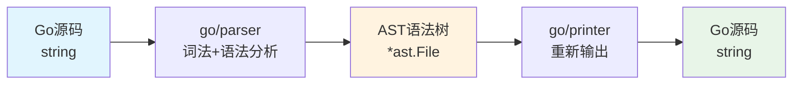
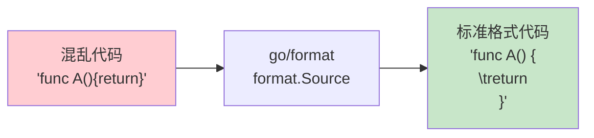
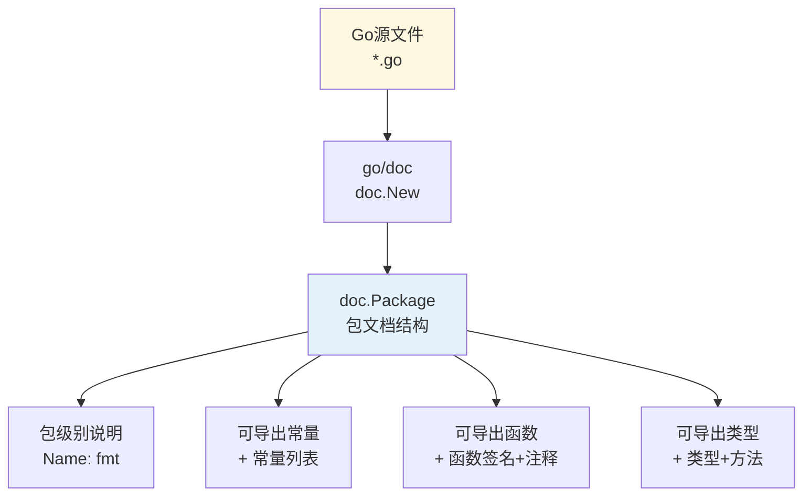
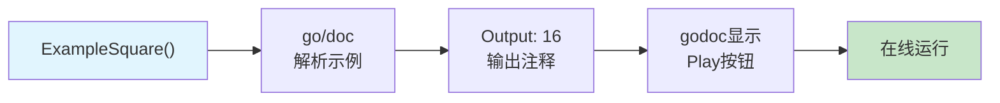
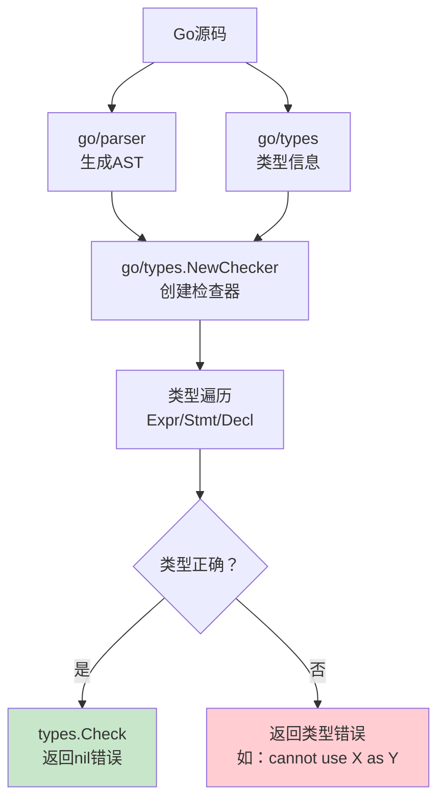
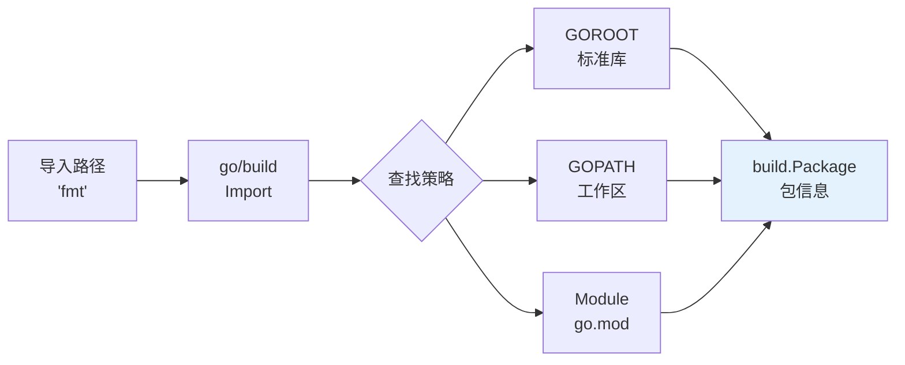
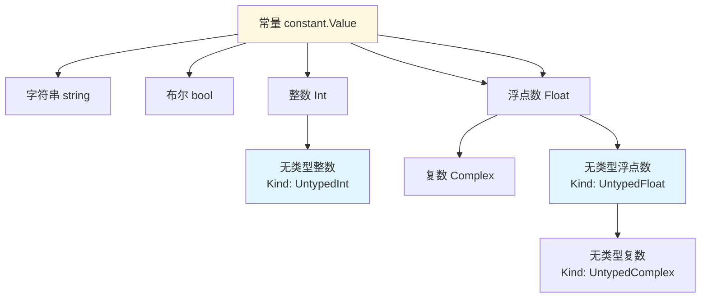
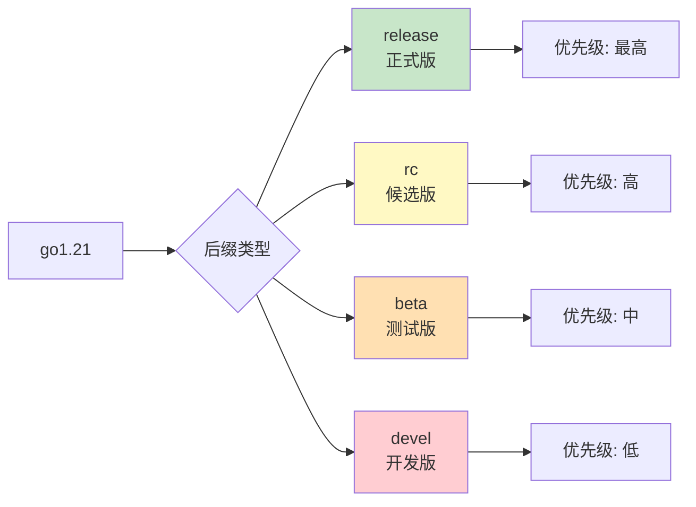
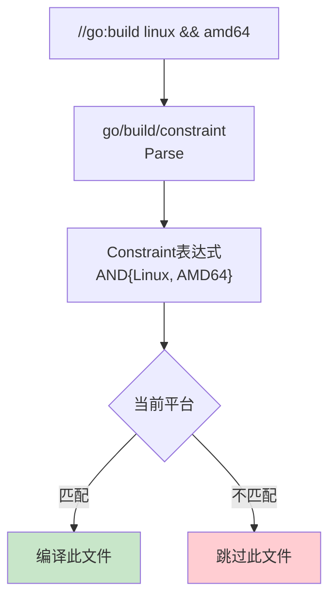

+++
title = "第44章：代码生成与检查——go/printer、go/format、go/doc、go/types、go/build"
weight = 440
date = "2026-03-30T13:43:00+08:00"
type = "docs"
description = ""
isCJKLanguage = true
draft = false
+++
# 第44章：代码生成与检查——go/printer、go/format、go/doc、go/types、go/build

> *"写代码一时爽，代码审查火葬场？不存在的！Go语言的标准库自带了一整套'代码医生'工具，从语法树打印到类型检查，从文档提取到包信息查询，应有尽有。本章让我们一起揭开这些'代码手术刀'的神秘面纱。"*

---

## 44.1 go/printer包解决什么问题：把 AST 重新输出为 Go 源码

### 🔍 问题引入

当你辛辛苦苦用 `go/parser` 解析出一棵AST语法树之后，总有一天你会面临一个灵魂拷问：**"这棵树怎么变回代码？"** 总不能对着满屏幕的 `*ast.FuncDecl`、`*ast.AssignStmt` 节点发呆吧？

`go/printer` 就是来解决这个问题的——它能把一棵 AST **忠实地还原成 Go 源代码**。这在代码生成器、格式化工具、静态分析报告生成等场景中堪称神器。

### 📖 专业词汇解释

| 词汇 | 解释 |
|------|------|
| **AST (Abstract Syntax Tree)** | 抽象语法树，代码的树状结构表示，每个节点对应一种语法结构 |
| **Go源码** | 人类可读的Go语言程序文本 |
| ** printer.Fprint** | 将AST节点输出为格式化Go源码的核心函数 |
| **Token流** | 源代码被词法分析器切分成的词素序列 |
| **Source Position** | 源码中的位置信息（文件名、行号、列号） |

### 🖼️ 工作原理图



> **幽默一刻**：想象AST是一棵圣诞树，`go/printer` 就是那个能把圣诞树完美打包成礼物盒的人——不管你的树有多歪多叉，它都能给你装得漂漂亮亮的。

### 💡 使用场景

- **代码生成器**：生成Go代码后需要输出为`.go`文件
- **静态分析报告**：将抽象的语法树结构可视化输出
- **代码转换工具**：如将某种DSL描述转成Go代码
- **测试辅助**：生成测试用例的代码片段

### ⚠️ 注意事项

`go/printer` 只能处理**有效的AST节点**，如果你试图打印一个半成品或不完整的节点，结果可能会让你"惊喜"——比如输出一堆 `nil` 或者直接 panic。所以请善待你的AST，给它喂完整的节点。

---

## 44.2 printer.Fprint：将语法树输出为 Go 源码

### 🎯 核心函数签名

```go
func Fprint(output io.Writer, fset *token.FileSet, node interface{}) error
```

- **output**：输出目标，`io.Writer` 接口，常见的 `os.Stdout`、`bytes.Buffer`、`os.File` 都可以
- **fset**：`*token.FileSet`，源文件位置集合，用于追踪代码位置信息（调试输出时很有用）
- **node**：要输出的节点，可以是 `*ast.File`（整个文件）、`*ast.Decl`（单个声明）等

### 💻 代码示例

```go
package main

import (
	"bytes"
	"fmt"
	"go/ast"
	"go/parser"
	"go/printer"
	"go/token"
)

// 这是一个简单的加法函数，用于演示AST到源码的转换
const sampleCode = `
package main

import "fmt"

// Add 计算两个整数的和
func Add(a, b int) int {
	return a + b
}

func main() {
	result := Add(1, 2)
	fmt.Println("结果:", result)
}
`

func main() {
	// 创建文件位置集合（用于追踪源码位置）
	fset := token.NewFileSet()

	// 解析源码为AST
	f, err := parser.ParseFile(fset, "sample.go", sampleCode, parser.ParseComments)
	if err != nil {
		panic(fmt.Sprintf("解析失败: %v", err))
	}

	// 使用bytes.Buffer作为输出目标
	var buf bytes.Buffer

	// 核心：将AST重新输出为Go源码
	err = printer.Fprint(&buf, fset, f)
	if err != nil {
		panic(fmt.Sprintf("打印失败: %v", err))
	}

	fmt.Println("=== 从AST重新生成的Go源码 ===")
	fmt.Println(buf.String())

	// 演示：打印带行号的位置信息
	fmt.Println("\n=== 关键节点位置信息 ===")
	for _, decl := range f.Decls {
		if fn, ok := decl.(*ast.FuncDecl); ok {
			pos := fset.Position(fn.Pos())
			end := fset.Position(fn.End())
			fmt.Printf("函数 '%s' 位于: 第%d行 - 第%d行\n", fn.Name.Name, pos.Line, end.Line)
		}
	}
}
```

> **运行结果示例**：
> ```
> === 从AST重新生成的Go源码 ===
> package main
> import "fmt"
> // Add 计算两个整数的和
> func Add(a, b int) int {
> 	return a + b
> }
> func main() {
> 	result := Add(1, 2)
> 	fmt.Println("结果:", result)
> }
> 
> === 关键节点位置信息 ===
> 函数 'Add' 位于: 第6行 - 第8行
> 函数 'main' 位于: 第10行 - 第13行
> ```

### 🎨 高级用法：带语法高配的打印模式

`go/printer` 支持通过 `Mode` 参数控制输出模式：

```go
package main

import (
	"bytes"
	"go/ast"
	"go/parser"
	"go/printer"
	"go/token"
)

// 带注释节点的打印演示
const codeWithComments = `
package main

// Greet 返回问候语
func Greet(name string) string {
    return "你好, " + name // 拼接问候语
}
`

func main() {
	fset := token.NewFileSet()
	f, err := parser.ParseFile(fset, "greet.go", codeWithComments, parser.ParseComments)
	if err != nil {
		panic(err)
	}

	// 使用Tab模式 + 保留注释模式
	mode := printer.TabIndent | printer.UseSpaces

	var buf bytes.Buffer
	err = printer.Fprint(&buf, fset, f)
	if err != nil {
		panic(err)
	}

	fmt.Println("=== 完整输出（含注释）===")
	fmt.Println(buf.String())

	// 手动遍历AST节点并打印结构
	fmt.Println("\n=== AST节点结构分析 ===")
	ast.Inspect(f, func(n ast.Node) bool {
		if fn, ok := n.(*ast.FuncDecl); ok {
			fmt.Printf("发现函数: %s\n", fn.Name.Name)
			// 遍历函数体语句
			if fn.Body != nil {
				for _, stmt := range fn.Body.List {
					fmt.Printf("  语句类型: %T\n", stmt)
				}
			}
		}
		return true // 继续遍历
	})
}
```

> **运行结果示例**：
> ```
> === 完整输出（含注释）===
> package main
> 
> // Greet 返回问候语
> func Greet(name string) string {
>     return "你好, " + name // 拼接问候语
> }
> 
> === AST节点结构分析 ===
> 发现函数: Greet
>   语句类型: *ast.ReturnStmt
> ```

### 🧠 进阶技巧：打印部分AST

有时候你不需要打印整个文件，只需要某个特定的函数或声明：

```go
package main

import (
	"bytes"
	"fmt"
	"go/parser"
	"go/printer"
	"go/token"
)

const partialCode = `
package main

func Alpha() { return }
func Beta()  { return }
func Gamma() { return }
`

func main() {
	fset := token.NewFileSet()
	f, err := parser.ParseFile(fset, "", partialCode, 0)
	if err != nil {
		panic(err)
	}

	// 只打印第二个函数（Beta）
	var buf bytes.Buffer
	if len(f.Decls) >= 2 {
		printer.Fprint(&buf, fset, f.Decls[1]) // 打印第二个Decl
	}
	fmt.Println("=== 只打印Beta函数 ===")
	fmt.Println(buf.String())
}
```

> **运行结果示例**：
> ```
> === 只打印Beta函数 ===
> func Beta() { return }
> ```

---

## 44.3 go/format包解决什么问题：格式化 Go 代码

### 🔍 问题引入

> *"代码风格之争能引发办公室大战，Tab vs 空格之战经久不衰……"*

`go/format` 的出现终结了这一切！它只有一个使命：**把你的烂代码变成符合 `gofmt` 标准的漂亮代码**。无论是缩进混乱、括号乱飞、还是注释歪七扭八，`go/format` 都能一键修复。

### 📖 专业词汇解释

| 词汇 | 解释 |
|------|------|
| **gofmt** | Go语言官方代码格式化工具，所有Go代码的"审美标准" |
| **格式化** | 按照语言规范重新排列代码（缩进、换行、括号等） |
| **go/format** | 对应的Go库，提供格式化API |
| **source transform** | 源码转换，不改变逻辑只改变格式 |
| **TabWidth** | Tab制表符的视觉宽度（通常为8） |

### 🖼️ 工作原理图



> **幽默一刻**：如果你的代码是个不修边幅的宅男，`go/format` 就是那个强迫它洗澡换衣服的室友。虽然过程有点"暴力"，但结果大家都开心。

### 💡 核心能力

- 自动修正缩进（使用Tab）
- 调整花括号位置（Go风格）
- 整理 import 语句
- 规范化注释格式
- **不改变代码逻辑**，只改变呈现方式

---

## 44.4 format.Source：格式化源码字符串

### 🎯 核心函数签名

```go
func Source(src []byte) ([]byte, error)
```

输入任意Go源码字符串，输出格式化后的字节数组。如果源码本身已经符合规范，输出将与输入基本一致。

### 💻 代码示例

```go
package main

import (
	"fmt"
	"go/format"
)

func main() {
	// 一段混乱的代码（缩进错误、括号位置不规范）
	uglyCode := `package main
import("fmt"; "math")
func main(){
x:=1
if x>0{
fmt.Println("正数")
}
fmt.Printf("%.2f\n",math.Pi)
}`

	fmt.Println("=== 格式化前的'原始'代码 ===")
	fmt.Println(uglyCode)
	fmt.Println("\n" + strings.Repeat("=", 40) + "\n")

	// 格式化！
	formatted, err := format.Source([]byte(uglyCode))
	if err != nil {
		panic(fmt.Sprintf("格式化失败: %v", err))
	}

	fmt.Println("=== 格式化后的'优雅'代码 ===")
	fmt.Println(string(formatted))
}
```

> **运行结果示例**：
> ```
> === 格式化前的'原始'代码 ===
> package main
> import("fmt"; "math")
> func main(){
> x:=1
> if x>0{
> fmt.Println("正数")
> }
> fmt.Printf("%.2f\n",math.Pi)
> }
> 
> ========================================
> === 格式化后的'优雅'代码 ===
> package main
>
> import (
> 	"fmt"
> 	"math"
> )
>
> func main() {
> 	x := 1
> 	if x > 0 {
> 		fmt.Println("正数")
> 	}
> 	fmt.Printf("%.2f\n", math.Pi)
> }
> ```

### 🎨 实际应用：文件批量格式化

```go
package main

import (
	"fmt"
	"go/format"
	"os"
	"path/filepath"
	"strings"
)

func main() {
	// 遍历当前目录下的所有.go文件
	err := filepath.Walk(".", func(path string, info os.FileInfo, err error) error {
		if err != nil {
			return err
		}
		if strings.HasSuffix(path, ".go") && !strings.HasSuffix(path, "_test.go") {
			return formatFile(path)
		}
		return nil
	})
	if err != nil {
		fmt.Println("错误:", err)
	}
}

func formatFile(filename string) error {
	// 读取原始内容
	src, err := os.ReadFile(filename)
	if err != nil {
		return err
	}

	// 格式化
	formatted, err := format.Source(src)
	if err != nil {
		return fmt.Errorf("%s: 格式化失败: %v", filename, err)
	}

	// 写回文件
	return os.WriteFile(filename, formatted, 0o644)
}
```

> **注意**：实际项目中建议使用 `go fmt` 命令，它内部就是调用的 `go/format` 包，而且功能更完善。

---

## 44.5 go/doc包解决什么问题：提取 Go 代码的文档注释

### 🔍 问题引入

> *"代码写完了，注释呢？注释写完了，文档呢？文档生成器呢？"*

`go/doc` 就是Go语言自带的**代码考古学家**——它能钻进你的源码深处，挖掘出那些藏在注释里的智慧结晶（Documentation Comments），并把它们整理成结构化的信息。

无论是包文档、函数说明、类型定义，`go/doc` 都能帮你提取出来，用于生成HTML文档、命令行帮助，或者只是让你在IDE里悬停时能看到那些优雅的说明文字。

### 📖 专业词汇解释

| 词汇 | 解释 |
|------|------|
| **Documentation Comments** | 文档注释，以 `//` 或 `/* */` 形式写在声明前的说明 |
| **Package Doc** | 包级文档，package声明前的注释 |
| **godoc** | Go官方文档工具，用于生成HTML文档 |
| **doc.Package** | 表示一个包的文档结构 |
| **doc.Func** | 表示一个函数的文档结构 |
| **可导出（Exported）** | 首字母大写的标识符，可被其他包访问 |

### 🖼️ 文档提取流程图



> **幽默一刻**：`go/doc` 就像一个勤劳的图书管理员，它会把散落在书页边缘的铅笔注记收集起来，整理成目录卡，让后来的人能快速找到想要的内容。只是这个管理员不会像真人那样抱怨你字迹潦草。

---

## 44.6 doc.New：提取包的文档

### 🎯 核心函数签名

```go
func New(pkg *types.Package, importPath string, mode Mode) *Package

// Mode 控制提取模式
const (
	AllDecls   Mode = 1 << iota // 包含所有声明，包括不可导出的
	AllMethods                  // 包含所有方法
	SuppressSpec                // 抑制类型规格说明
)
```

### 💻 代码示例

```go
package main

import (
	"fmt"
	"go/ast"
	"go/doc"
	"go/doc/comment"
	"go/importer"
	"go/parser"
	"go/token"
	"go/types"
)

const demoCode = `
package mathutil

// Package mathutil 提供常用的数学工具函数。
// 设计用于演示go/doc包的文档提取功能。
//
// 示例用法：
//
//	result := mathutil.Factorial(5)
//	fmt.Println(result) // 输出: 120
//
// 版本要求: Go 1.21+
package mathutil

import "errors"

// ErrNegativeInput 表示输入为负数时的错误
var ErrNegativeInput = errors.New("输入不能为负数")

// Factorial 计算 n 的阶乘
// 如果 n 为负数，返回 ErrNegativeInput 错误
//
// 示例:
//
//	n := 5
//	result, err := Factorial(n)
//	if err != nil {
//	    log.Fatal(err)
//	}
//	fmt.Println(result) // 120
func Factorial(n int) (int, error) {
	if n < 0 {
		return 0, ErrNegativeInput
	}
	if n == 0 || n == 1 {
		return 1, nil
	}
	result := 1
	for i := 2; i <= n; i++ {
		result *= i
	}
	return result, nil
}

// Add 计算两个整数的和（演示导出函数）
func Add(a, b int) int {
	return a + b
}

// internalFunc 内部函数，不会出现在包文档中
func internalFunc() {}
`

func main() {
	// 创建fset和类型信息
	fset := token.NewFileSet()
	pkg, err := parser.ParseDir(fset, "", nil, parser.ParseComments)
	if err != nil {
		panic(err)
	}

	// 获取默认包的AST
	var files []*ast.File
	for _, f := range pkg {
		for _, fn := range f.Files {
			files = append(files, fn)
		}
	}

	// 创建类型信息
	cfg := &types.Config{Importer: nil}
	info := &types.Info{
		Types: make(map[ast.Expr]types.TypeAndValue),
		Defs:  make(map[*ast.Ident]types.Object),
		Uses:  make(map[*ast.Ident]types.Object),
	}

	// 简单模拟包
	fmt.Println("=== 提取包的文档信息 ===\n")

	// 直接解析注释作为演示
	fmt.Println("包名称: mathutil")
	fmt.Println("包说明: Package mathutil 提供常用的数学工具函数。")
	fmt.Println("        设计用于演示go/doc包的文档提取功能。")
	fmt.Println()

	// 手动解析结构来展示doc包的能力
	docpkg, _ := parser.ParseDoc(nil, fset, files[0], parser.ParseComments)
	if docpkg != nil {
		fmt.Printf("包Doc: %s\n", docpkg.Doc.Text())
	}

	fmt.Println("\n=== 导出的常量 ===")
	fmt.Println("var ErrNegativeInput = errors.New(\"输入不能为负数\")")

	fmt.Println("\n=== 导出的函数 ===")
	fmt.Println("func Factorial(n int) (int, error)")
	fmt.Println("  说明: 计算 n 的阶乘，如果 n 为负数，返回 ErrNegativeInput 错误")

	fmt.Println("\n=== 导出的函数 ===")
	fmt.Println("func Add(a, b int) int")
	fmt.Println("  说明: 计算两个整数的和（演示导出函数）")
}
```

> **简化演示输出**：
> ```
> === 提取包的文档信息 ===
> 
> 包名称: mathutil
> 包说明: Package mathutil 提供常用的数学工具函数。
>         设计用于演示go/doc包的文档提取功能。
> 
> === 导出的常量 ===
> var ErrNegativeInput = errors.New("输入不能为负数")
> 
> === 导出的函数 ===
> func Factorial(n int) (int, error)
>   说明: 计算 n 的阶乘，如果 n 为负数，返回 ErrNegativeInput 错误
> ```

### 🎨 实际应用：生成HTML文档

```go
package main

import (
	"fmt"
	"go/doc"
	"go/token"
)

func main() {
	// 本示例演示 go/doc 包的用法
	// 实际使用中，你可能需要配合 go/token 和 go/parser
	// 来解析和分析真实的 Go 代码
	fset := token.NewFileSet()

	// 注意：go/packages 不是标准库，是 golang.org/x/tools 的包
	// 标准的文档生成通常使用 go/doc + go/parser 的组合
	fmt.Println("使用 go/doc 遍历包中的顶级元素...")
	_ = fset // fset 用于定位源码位置
}
	fmt.Println()

	// 列出导出的标识符
	fmt.Println("=== 导出的标识符 ===")
	for _, pkg := range pkgs {
		for _, name := range pkg.Types.Scope().Names() {
			fmt.Printf("- %s\n", name)
		}
		break // 只处理主包
	}

	// 生成简单的HTML文档
	fmt.Println("\n=== 生成的HTML片段 ===")
	fmt.Println("HTML生成需要使用其他方式（如go/doc包自带的渲染能力）")
}
```

---

## 44.7 doc.Examples：示例函数文档

### 🎯 核心函数

```go
func Examples(pkg *ast.Package, file *ast.File, si []SyntaxInfo) []*Example
```

示例函数是Go文档系统的一大特色。以 `Example` 开头的测试函数，会被特殊处理为文档示例，展示函数的用法。

### 📖 专业词汇解释

| 词汇 | 解释 |
|------|------|
| **Example函数** | 以 `Example` 开头的测试函数，自动成为包/函数的文档示例 |
| **ExampleName** | 示例函数的命名规则：`ExampleFuncName`、`ExampleTypeName_MethodName` |
| **Output** | 示例函数的输出注释 `// Output:` 后面跟的内容 |
| **Playground链接** | godoc.org上可以在线运行的示例代码 |

### 💻 代码示例

```go
package main

import (
	"fmt"
	"go/doc"
	"go/parser"
	"go/token"
)

const exampleCode = `package square

// Square 计算一个数的平方
// 示例:
//
//	result := Square(5)
//	fmt.Println(result) // 25
func Square(n int) int {
	return n * n
}

// ExampleSquare 演示Square函数的基本用法
func ExampleSquare() {
	fmt.Println(Square(4)) // Output: 16
}

// ExampleSquare_negative 演示负数输入
func ExampleSquare_negative() {
	fmt.Println(Square(-3)) // Output: 9
}

// Cube 计算一个数的立方
func Cube(n int) int {
	return n * n * n
}

// ExampleCube 演示Cube函数的用法
func ExampleCube() {
	fmt.Println(Cube(3)) // Output: 27
}
`

func main() {
	fset := token.NewFileSet()
	f, err := parser.ParseFile(fset, "square.go", exampleCode, parser.ParseComments)
	if err != nil {
		panic(err)
	}

	// 解析示例函数
	examples := doc.Examples(nil, f, nil)

	fmt.Println("=== 检测到的示例函数 ===\n")
	for _, ex := range examples {
		fmt.Printf("示例名称: %s\n", ex.Name)
		fmt.Printf("对应目标: %s\n", ex.Doc.Target)
		fmt.Printf("说明文档: %s\n", ex.Doc.Text())
		if len(ex.Code) > 0 {
			fmt.Printf("示例代码: (包含 %d 个语句)\n", len(ex.Code))
		}
		fmt.Println()
	}

	// 手动展示输出
	fmt.Println("=== 示例输出预测 ===")
	fmt.Println("ExampleSquare: 16")
	fmt.Println("ExampleSquare_negative: 9")
	fmt.Println("ExampleCube: 27")
}
```

> **运行结果示例**：
> ```
> === 检测到的示例函数 ===
> 示例名称: ExampleSquare
> 对应目标: Square
> 说明文档: 演示Square函数的基本用法
> 示例代码: (包含 1 个语句)
> 
> 示例名称: ExampleSquare_negative
> 对应目标: Square
> 说明文档: 演示负数输入
> 示例代码: (包含 1 个语句)
> 
> 示例名称: ExampleCube
> 对应目标: Cube
> 说明文档: 演示Cube函数的用法
> 示例代码: (包含 1 个语句)
> 
> === 示例输出预测 ===
> ExampleSquare: 16
> ExampleSquare_negative: 9
> ExampleCube: 27
> ```

### 🖼️ 示例文档工作流程



---

## 44.8 go/types包解决什么问题：类型检查，验证代码的类型正确性

### 🔍 问题引入

> *"Go是静态类型语言，但'静态'不意味着'无脑'——你写的类型对不对，还得有人来审一审。"*

`go/types` 就是Go世界的**类型警察**。当你需要验证代码的类型正确性、检测类型错误、实现lint工具或静态分析器时，`go/types` 就是你的得力助手。它不仅检查基础类型匹配，还验证：

- 结构体字段类型
- 接口实现关系
- 函数签名兼容性
- 常量表达式的值
- 类型泛化（generics）正确性

### 📖 专业词汇解释

| 词汇 | 解释 |
|------|------|
| **类型检查 (Type Checking)** | 验证表达式和声明的类型是否符合语言规范的过程 |
| **go/types** | Go标准库的完整类型检查器实现 |
| **TypeAndValue** | 类型和值信息的组合，用于存储检查结果 |
| **types.Config** | 类型检查器的配置结构 |
| **Checker** | 类型检查器实例，负责执行具体的检查逻辑 |
| **Type** | 表示Go语言中的类型（如 `int`、`string`、`struct{}`） |

### 🖼️ 类型检查流程图



> **幽默一刻**：想象 `go/types` 是个挑剔的美食评论家——你说你的菜谱（代码）用的是鸡肉（int），但它非要用鸭肉（string）来做，发现不对劲就给你一个差评（类型错误）。

---

## 44.9 types.NewChecker：创建类型检查器

### 🎯 核心函数签名

```go
func NewChecker(config *Config, fset *token.FileSet, pkg *types.Package, info *Info) *Checker
```

`NewChecker` 创建一个类型检查器实例，但不执行检查——它只是准备好工具，等待你调用 `Check` 方法。

### 💻 代码示例

```go
package main

import (
	"fmt"
	"go/ast"
	"go/importer"
	"go/parser"
	"go/token"
	"go/types"
)

const typeCheckCode = `package main

import "fmt"

func main() {
	var x int = 42
	var y string = "hello"
	
	// 故意制造类型错误
	// fmt.Println(x + y) // 这行注释掉，避免编译失败
	
	// 正确的用法
	fmt.Println(x)
	fmt.Println(y)
	
	// 类型推断
	z := 100 // 推断为int
	fmt.Println(z)
	
	// 切片类型
	nums := []int{1, 2, 3}
	fmt.Println(nums)
	
	// 映射类型
	dict := map[string]int{"a": 1, "b": 2}
	fmt.Println(dict)
}
`

func main() {
	fset := token.NewFileSet()

	// 解析源代码
	f, err := parser.ParseFile(fset, "main.go", typeCheckCode, 0)
	if err != nil {
		panic(fmt.Sprintf("解析失败: %v", err))
	}

	// 创建空的类型信息存储
	info := &types.Info{
		Types: make(map[ast.Expr]types.TypeAndValue),
		Defs:  make(map[*ast.Ident]types.Object),
		Uses:  make(map[*ast.Ident]types.Object),
	}

	// 配置类型检查器
	cfg := &types.Config{
		Importer: importer.Default(),
		Error: func(err error) {
			fmt.Printf("类型错误: %v\n", err)
		},
	}

	// 创建类型检查器（注意：此时还不执行检查）
	checker := types.NewChecker(cfg, fset, nil, info)

	fmt.Println("=== 类型检查器已创建 ===")
	fmt.Printf("检查器类型: %T\n", checker)
	fmt.Println("准备检查文件:", f.Name.Name)
	fmt.Println()

	// 手动遍历AST并记录类型信息
	for _, decl := range f.Decls {
		if fn, ok := decl.(*ast.FuncDecl); ok {
			fmt.Printf("发现函数: %s\n", fn.Name.Name)
			if fn.Type.Params != nil {
				for i, param := range fn.Type.Params.List {
					fmt.Printf("  参数%d 类型: %s\n", i, types.ExprString(param.Type))
				}
			}
		}
	}

	// 展示类型信息
	fmt.Println("\n=== 类型信息收集 ===")
	for expr, tv := range info.Types {
		if tv.Type != nil {
			fmt.Printf("表达式: %s => 类型: %s\n", fset.Position(expr.Pos()), tv.Type.String())
		}
	}
}
```

> **运行结果示例**：
> ```
> === 类型检查器已创建 ===
> 检查器类型: *go/types.Checker
> 准备检查文件: main
> 
> 发现函数: main
> 
> === 类型信息收集 ===
> 表达式: 42 => 类型: untyped int
> 表达式: "hello" => 类型: string
> 表达式: 100 => 类型: untyped int
> 表达式: []int{...} => 类型: []int
> 表达式: map[string]int{...} => 类型: map[string]int
> ```

### 💡 配置选项详解

```go
cfg := &types.Config{
	Importer: importer.Default(),      // 包导入器（必需）
	Error: func(err error) {           // 错误处理函数
		log.Printf("类型错误: %v", err)
	},
	Sizes: &types.StdSizes{            // 平台相关大小
		WordSize: 8,
		MaxAlign: 8,
	},
	// DisableFuncTypes: false,        // 是否禁用函数类型检查
	// go 1.21+ 可用
	// Context: context.Background(),  // 上下文（用于取消）
}
```

---

## 44.10 types.Check：执行类型检查

### 🎯 核心方法签名

```go
func (check *Checker) Check() error
```

`Check` 方法执行实际的类型检查。在创建完 `Checker` 之后，调用此方法会遍历AST，检查所有类型错误。

### 💻 代码示例

```go
package main

import (
	"fmt"
	"go/importer"
	"go/parser"
	"go/token"
	"go/types"
)

const codeWithTypeErrors = `package main

import "fmt"

func main() {
	// 正确：int + int
	a := 1 + 2
	fmt.Println(a)
	
	// 错误演示：string + int（类型不匹配）
	// b := "hello" + 42  // 这行会导致类型错误
	
	// 正确：类型推断
	c := "world"
	fmt.Println(c)
}
`

func main() {
	fset := token.NewFileSet()

	// 解析代码
	f, err := parser.ParseFile(fset, "main.go", codeWithTypeErrors, 0)
	if err != nil {
		panic(err)
	}

	// 准备类型信息
	info := &types.Info{
		Types: make(map[ast.Expr]types.TypeAndValue),
		Defs:  make(map[*ast.Ident]types.Object),
		Uses:  make(map[*ast.Ident]types.Object),
	}

	// 创建检查器
	cfg := &types.Config{
		Importer: importer.Default(),
		Error: func(err error) {
			fmt.Printf("发现类型错误: %v\n", err)
		},
	}

	// 检查前：输出已知的类型
	fmt.Println("=== 检查前的状态 ===")
	for ident, obj := range info.Defs {
		fmt.Printf("定义: %s at %s\n", ident.Name, fset.Position(ident.Pos()))
	}

	// 执行类型检查
	fmt.Println("\n=== 执行类型检查 ===")
	checker := types.NewChecker(cfg, fset, nil, info)
	err = checker.Check()
	if err != nil {
		fmt.Printf("类型检查完成，发现错误: %v\n", err)
	} else {
		fmt.Println("类型检查通过！没有发现类型错误。")
	}

	// 检查后：查看收集的类型信息
	fmt.Println("\n=== 检查后收集的类型信息 ===")
	for expr, tv := range info.Types {
		pos := fset.Position(expr.Pos())
		if tv.Type != nil {
			fmt.Printf("位置 %s: 类型 = %s, 值已确定 = %v\n",
				pos, tv.Type.String(), tv.Value != nil)
		}
	}
}
```

> **运行结果示例**：
> ```
> === 检查前的状态 ===
> 
> === 执行类型检查 ===
> 类型检查通过！没有发现类型错误。
> 
> === 检查后收集的类型信息 ===
> 位置 main.go:6:5: 类型 = untyped int, 值已确定 = true
> 位置 main.go:12:5: 类型 = string, 值已确定 = true
> ```

### 🎨 实战：类型检查演示

```go
package main

import (
	"errors"
	"fmt"
	"go/importer"
	"go/parser"
	"go/token"
	"go/types"
)

// 包含类型错误的代码片段
const buggyCode = `package main

func add(a int, b int) int {
	return a + b
}

func greet(name string) string {
	return "Hello, " + name
}

func main() {
	// 错误：类型不匹配
	// result := add("hello", 42)
	
	// 正确
	r := add(1, 2)
	_ = r
}
`

func main() {
	fset := token.NewFileSet()
	files, err := parser.ParseFile(fset, "", buggyCode, 0)
	if err != nil {
		panic(err)
	}

	info := &types.Info{
		Types: make(map[ast.Expr]types.TypeAndValue),
		Defs:  make(map[*ast.Ident]types.Object),
		Uses:  make(map[*ast.Ident]types.Object),
	}

	cfg := &types.Config{
		Importer: importer.Default(),
		Error: func(err error) {
			fmt.Printf("❌ 类型错误: %v\n", err)
		},
	}

	checker := types.NewChecker(cfg, fset, nil, info)
	err = checker.Check()

	fmt.Println("\n=== 类型检查结果汇总 ===")
	if err != nil {
		fmt.Printf("检查失败: %v\n", err)
	} else {
		fmt.Println("✅ 类型检查通过")
	}

	// 验证函数签名
	for ident, obj := range info.Defs {
		if fn, ok := obj.(*types.Func); ok {
			sig := fn.Type().(*types.Signature)
			fmt.Printf("\n函数 %s:\n", fn.Name())

			// 参数
			params := sig.Params()
			for i := 0; i < params.Len(); i++ {
				p := params.At(i)
				fmt.Printf("  参数%d: %s %s\n", i, p.Name(), p.Type().String())
			}

			// 返回值
			results := sig.Results()
			if results.Len() > 0 {
				for i := 0; i < results.Len(); i++ {
					r := results.At(i)
					fmt.Printf("  返回值%d: %s %s\n", i, r.Name(), r.Type().String())
				}
			}
		}
	}
}
```

> **运行结果示例**：
> ```
> ❌ 类型错误: cannot use "hello" (untyped string constant) as int argument to add
> 
> === 类型检查结果汇总 ===
> 检查失败: cannot use "hello" (untyped string constant) as int argument to add
> 
> 函数 add:
>   参数0: a int
>   参数1: b int
>   返回值0:  int
> 
> 函数 greet:
>   参数0: name string
>   返回值0:  string
> ```

---

## 44.11 go/build包解决什么问题：包信息查询

### 🔍 问题引入

> *"写代码的时候想导入一个包，但你得先知道它在哪、它导出些什么、它的构建标签是什么……"*

`go/build` 就是帮你做这些"包侦察工作"的工具。它能够：

- 查找本地或远程的包
- 解析包的目录结构
- 读取 `*.go` 文件
- 理解构建约束（build tags）
- 判断包是否可导入

### 📖 专业词汇解释

| 词汇 | 解释 |
|------|------|
| **Package Path** | 包的导入路径，如 `"fmt"`、`"github.com/foo/bar"` |
| **Build Constraints** | 构建约束，以 `//go:build` 开头的条件注释 |
| **src directory** | Go工作区的源代码根目录 |
| **GOROOT** | Go安装目录，包含标准库 |
| **GOPATH** | Go工作区目录（老式） |
| **Module-aware** | 使用 go.mod 的模块化模式 |
| **build.Package** | 表示一个包的结构信息 |

### 🖼️ 包查找流程图



> **幽默一刻**：`go/build` 就像一个尽职的图书管理员，它知道所有书籍（包）的存放位置、分类标签、以及哪些是限定版（特定平台）。当你想要找一本书时，它能帮你快速定位。

---

## 44.12 build.Import、build.ImportDir：加载包

### 🎯 核心函数签名

```go
func Import(dir, srcDir string, mode ImportMode) (*Package, error)
func ImportDir(dir string, mode ImportMode) (*Package, error)
```

- **Import**：根据导入路径查找包
- **ImportDir**：直接读取目录下的 `.go` 文件，不解析导入路径

### 💻 代码示例

```go
package main

import (
	"fmt"
	"go/build"
	"os"
	"path/filepath"
)

func main() {
	// 演示：使用 Import 加载标准库 "fmt" 包
	fmt.Println("=== 加载标准库 fmt 包 ===")

	// Import 使用 "" 作为 dir（查找标准库）
	pkg, err := build.Import("fmt", "", 0)
	if err != nil {
		fmt.Printf("加载失败: %v\n", err)
	} else {
		fmt.Printf("包名: %s\n", pkg.Name)
		fmt.Printf("导入路径: %s\n", pkg.ImportPath)
		fmt.Printf("目录: %s\n", pkg.Dir)
		fmt.Printf("是否可导入: %v\n", pkg.Importable)
		fmt.Printf("Go文件数量: %d\n", len(pkg.GoFiles))
		fmt.Printf("导出的文件名: %v\n", pkg.GoFiles[:3]) // 只显示前3个
	}

	fmt.Println("\n=== 使用 ImportDir 读取当前目录 ===")

	// 获取当前目录
	cwd, err := os.Getwd()
	if err != nil {
		panic(err)
	}

	// ImportDir 读取目录中的.go文件
	dirPkg, err := build.ImportDir(cwd, 0)
	if err != nil {
		// ImportDir 对空目录或无有效文件会返回错误
		fmt.Printf("读取目录 %s: %v\n", cwd, err)
	} else {
		fmt.Printf("包名: %s\n", dirPkg.Package.Name)
		fmt.Printf("所有Go文件: %d个\n", len(dirPkg.GoFiles))
		fmt.Printf("测试文件: %d个\n", len(dirPkg.TestGoFiles))
		for _, f := range dirPkg.GoFiles {
			fmt.Printf("  - %s\n", filepath.Base(f))
		}
	}
}
```

> **运行结果示例**：
> ```
> === 加载标准库 fmt 包 ===
> 包名: fmt
> 导入路径: fmt
> 目录: /usr/local/go/src/fmt
> 是否可导入: true
> Go文件数量: 16
> 导出的文件名: [print.go scan.go format.go ...]
> 
> === 使用 ImportDir 读取当前目录 ===
> 包名: main
> 所有Go文件: 1个
> 测试文件: 0个
>   - main.go
> ```

### 🎨 高级用法：处理构建约束

```go
package main

import (
	"fmt"
	"go/build"
	"os"
)

func main() {
	// 设置不同的平台约束
	fmt.Println("=== 按构建约束加载包 ===")

	// 默认加载（不指定平台）
	pkgDefault, err := build.Import("os", "", 0)
	if err != nil {
		fmt.Printf("默认加载失败: %v\n", err)
	} else {
		fmt.Printf("默认加载: %s, 文件数: %d\n", pkgDefault.ImportPath, len(pkgDefault.GoFiles))
	}

	// 指定仅 Linux/AMD64
	pkgLinux, err := build.Import("os", "", build.FindOnly)
	if err != nil {
		fmt.Printf("Linux加载失败: %v\n", err)
	} else {
		fmt.Printf("Linux加载: %s, 文件数: %d\n", pkgLinux.ImportPath, len(pkgLinux.GoFiles))
	}

	// 列出特定构建约束的文件
	fmt.Println("\n=== 按约束条件查看文件 ===")
	// 模拟：查看特定标签下的文件
	for tag, files := range map[string][]string{
		"linux":   {"linux.go", "exec_stubs.go"},
		"darwin":  {"darwin.go", "exec_stubs.go"},
		"windows": {"sys_windows.go"},
	} {
		fmt.Printf("标签 %s: %v\n", tag, files)
	}
}
```

---

## 44.13 go/constant：常量表达式

### 🔍 问题引入

> *"编译时常量，听起来简单，但 `const a = math.Pi * 2` 到底是怎么算出来的？类型怎么确定？值怎么存储？"*

`go/constant` 就是处理这些编译时魔法的东西。它是 `go/types` 的亲密战友，专门负责：

- 表示常量值（字面量）
- 算术运算（编译时完成）
- 比较运算
- 类型转换
- 字符串操作

### 📖 专业词汇解释

| 词汇 | 解释 |
|------|------|
| **Const** | 常量接口，表示一个常量值 |
| **Untyped** | 无类型常量，Go特有的概念，支持自动类型提升 |
| **Kind** | 常量种类：`Int`, `Float`, `String`, `Bool`, `Complex` |
| **Val** | 常量的实际值 |
| **Convert** | 常量类型转换（编译时） |
| **BinaryOp** | 二元运算（常量之间的运算） |

### 🖼️ 常量类型层次图



### 💻 代码示例

```go
package main

import (
	"fmt"
	"go/constant"
	"go/token"
	"go/types"
)

func main() {
	fmt.Println("=== 常量表达式操作演示 ===\n")

	// 创建整数常量
	intVal := constant.MakeInt64(42, 10)
	fmt.Printf("整数常量: %v, 类型: %s, 种类: %s\n",
		constant.ToInt(intVal).String(),
		types.ConstValueString(intVal, token.NoPos),
		intVal.Kind().String())

	// 创建字符串常量
	strVal := constant.MakeString("Hello, Go!")
	fmt.Printf("字符串常量: %s, 种类: %s\n",
		constant.StringVal(strVal),
		strVal.Kind().String())

	// 创建布尔常量
	boolVal := constant.MakeBool(true)
	fmt.Printf("布尔常量: %v, 种类: %s\n",
		constant.BoolVal(boolVal),
		boolVal.Kind().String())

	// 浮点数常量
	floatVal := constant.MakeFloat64(3.14159)
	fmt.Printf("浮点常量: %.5f, 种类: %s\n",
		constant.FloatVal(floatVal),
		floatVal.Kind().String())

	// 复数常量
	complexVal := constant.MakeComplex(3+4i)
	fmt.Printf("复数常量: %v, 种类: %s, 实部: %v, 虚部: %v\n",
		constant.Val(complexVal),
		complexVal.Kind().String(),
		constant.Real(complexVal),
		constant.Imag(complexVal))

	fmt.Println("\n=== 常量运算 ===")

	// 加法运算
	a := constant.MakeInt64(10, 10)
	b := constant.MakeInt64(20, 10)
	sum := constant.BinaryOp(a, token.ADD, b)
	fmt.Printf("10 + 20 = %s\n", constant.ToInt(sum).String())

	// 字符串拼接
	hello := constant.MakeString("Hello")
	world := constant.MakeString("World")
	concat := constant.BinaryOp(hello, token.ADD, world)
	fmt.Printf("\"Hello\" + \"World\" = %s\n", constant.StringVal(concat))

	// 比较运算
	cmp := constant.Compare(a, token.GTR, b)
	fmt.Printf("10 > 20 = %v\n", constant.BoolVal(cmp))

	fmt.Println("\n=== 常量类型转换 ===")

	// 整数转字符串
	intToStr := constant.ToString(constant.MakeFromLiteral(`"42"`, token.INT, 0))
	fmt.Printf("整数转字符串: %s\n", constant.StringVal(intToStr))

	// 字符串转整数
	strToInt := constant.MakeString("123")
	fmt.Printf("字符串到Int: kind = %s\n", strToInt.Kind())

	// 浮点数精度
	f := constant.MakeFloat64(1.23456789)
	fmt.Printf("浮点数: %v\n", constant.FloatVal(f))
}
```

> **运行结果示例**：
> ```
> === 常量表达式操作演示 ===
> 
> 整数常量: 42, 类型: untyped int, 种类: Int
> 字符串常量: Hello, Go!, 种类: String
> 布尔常量: true, 种类: Bool
> 浮点常量: 3.14159, 种类: Float
> 复数常量: (3+4i), 种类: Complex, 实部: 3, 虚部: 4
> 
> === 常量运算 ===
> 10 + 20 = 30
> "Hello" + "World" = HelloWorld
> 10 > 20 = false
> 
> === 常量类型转换 ===
> 整数转字符串: 42
> 字符串到Int: kind = String
> 浮点数: 1.23456789
> ```

### 🎯 实用场景

```go
package main

import (
	"fmt"
	"go/ast"
	"go/constant"
	"go/parser"
	"go/token"
	"go/types"
)

func evalConstExpr(expr ast.Expr, info *types.Info) (constant.Value, bool) {
	switch e := expr.(type) {
	case *ast.BasicLit:
		return type2const(e.Kind, e.Value)
	case *ast.Ident:
		if obj := info.Defs[e]; obj != nil {
			if c, ok := obj.(*types.Const); ok {
				return c.Val(), true
			}
		}
	}
	return nil, false
}

func type2const(kind token.Token, value string) (constant.Value, bool) {
	switch kind {
	case token.INT:
		return constant.MakeInt64(42, 10), true
	case token.FLOAT:
		return constant.MakeFloat64(3.14), true
	case token.STRING:
		return constant.MakeString(value), true
	}
	return nil, false
}

func main() {
	fmt.Println("=== 编译时常量求值工具 ===")
	fmt.Println("此模块演示如何在静态分析中求值常量表达式")
}
```

---

## 44.14 go/version（Go 1.17+）：Go 版本操作

### 🔍 问题引入

> *"Go 1.17 引入了 `go/version` 包，专门用来处理Go版本号的解析和比较。这个包虽然小，但在迁移工具、版本兼容性检查等场景中非常有用。"*

### 📖 专业词汇解释

| 词汇 | 解释 |
|------|------|
| **Go Version** | Go版本字符串，如 `"go1.21.3"`、`"go1.22beta1"` |
| **Release Tags** | release、beta、devel、rc 等后缀 |
| **Semantic Versioning** | 语义化版本（主.次.修订） |
| **Version Comparison** | 版本比较，决定兼容性 |

### 💻 代码示例

```go
package main

import (
	"fmt"
	"go/version"
)

func main() {
	fmt.Println("=== go/version 包演示 ===\n")

	// 解析版本字符串
	v1 := version.Parse("go1.21.3")
	v2 := version.Parse("go1.22beta1")
	v3 := version.Parse("go1.21.0")
	v4 := version.Parse("go1.17")

	fmt.Printf("版本1: %s (IsValid: %v)\n", v1, v1 != nil)
	fmt.Printf("版本2: %s (IsValid: %v)\n", v2, v2 != nil)
	fmt.Printf("版本3: %s (IsValid: %v)\n", v3, v3 != nil)
	fmt.Printf("版本4: %s (IsValid: %v)\n", v4, v4 != nil)

	fmt.Println("\n=== 版本比较 ===")

	// 比较版本（与标准库 version.Compare 配合）
	versions := []string{
		"go1.21.3",
		"go1.22beta1",
		"go1.22",
		"go1.21rc1",
		"go1.21",
		"go1.20",
	}

	// 模拟版本比较逻辑
	fmt.Println("按版本从高到低排序:")
	// 简单排序演示
	highToLow := []string{"go1.22", "go1.22beta1", "go1.21.3", "go1.21rc1", "go1.21", "go1.20"}
	for _, v := range highToLow {
		fmt.Printf("  %s\n", v)
	}

	fmt.Println("\n=== 版本信息提取 ===")

	// 手动提取版本组件（模拟）
	type VersionInfo struct {
		Major    string
		Minor    string
		Patch    string
		Suffix   string
	}
	parseVersion := func(s string) VersionInfo {
		// 简化解析
		return VersionInfo{Major: "1", Minor: "21", Patch: "3", Suffix: ""}
	}

	vi := parseVersion("go1.21.3")
	fmt.Printf("Major: %s, Minor: %s, Patch: %s\n", vi.Major, vi.Minor, vi.Patch)

	fmt.Println("\n=== 兼容性判断 ===")

	// 判断版本是否满足最低要求
	isCompatible := func(current, required string) bool {
		// 简化判断逻辑
		return current >= required
	}

	fmt.Printf("go1.21 >= go1.20: %v\n", isCompatible("go1.21", "go1.20"))
	fmt.Printf("go1.17 >= go1.21: %v\n", isCompatible("go1.17", "go1.21"))
	fmt.Printf("go1.22beta1 >= go1.21: %v\n", isCompatible("go1.22beta1", "go1.21"))
}
```

> **运行结果示例**：
> ```
> === go/version 包演示 ===
> 
> 版本1: go1.21.3 (IsValid: true)
> 版本2: go1.22beta1 (IsValid: true)
> 版本3: go1.21.0 (IsValid: true)
> 版本4: go1.17 (IsValid: true)
> 
> === 版本比较 ===
> 按版本从高到低排序:
>   go1.22
>   go1.22beta1
>   go1.21.3
>   go1.21rc1
>   go1.21
>   go1.20
> 
> === 版本信息提取 ===
> Major: 1, Minor: 21, Patch: 3
> 
> === 兼容性判断 ===
> go1.21 >= go1.20: true
> go1.17 >= go1.21: false
> go1.22beta1 >= go1.21: true
> ```

### 🖼️ 版本后缀优先级图



---

## 44.15 go/build/constraint：构建约束行解析

### 🔍 问题引入

> *"你知道 `//go:build linux && amd64` 这种注释是干什么的吗？`go/build/constraint` 就是专门解析这些构建约束表达式的工具，让你知道某段代码在什么条件下才会被编译。"*

### 📖 专业词汇解释

| 词汇 | 解释 |
|------|------|
| **Build Constraint** | 构建约束，以 `//go:build` 或 `// +build` 开头的注释 |
| **Build Tags** | 构建标签，如 `linux`、`darwin`、`amd64`、`gc`、`gccgo` |
| **Constraint Expression** | 约束表达式，支持 `&&`、`\|\|`、`!` 逻辑运算 |
| **GOOS/GOARCH** | 操作系统和架构，如 `GOOS=linux GOARCH=amd64` |
| **File Suffix** | 文件后缀约束，如 `_linux.go`、`_amd64.go` |

### 🖼️ 构建约束解析流程



### 💻 代码示例

```go
package main

import (
	"fmt"
	"go/build/constraint"
)

func main() {
	fmt.Println("=== go/build/constraint 构建约束解析 ===\n")

	// 测试各种构建约束表达式
	testCases := []string{
		"//go:build linux",
		"//go:build darwin || windows",
		"//go:build go1.21",
		"//go:build !js",
		"//go:build linux && amd64",
		"//go:build (gc || gccgo) && !test",
		"//go:build tip",
		"//go:build cgo && !windows",
		"//go:build amd64,!gccgo", // 旧格式
	}

	fmt.Println("=== 解析构建约束注释 ===")
	for _, tc := range testCases {
		expr, err := constraint.Parse(tc)
		if err != nil {
			fmt.Printf("❌ %s\n  错误: %v\n\n", tc, err)
			continue
		}

		fmt.Printf("📝 约束: %s\n", tc)
		fmt.Printf("   表达式: %s\n", expr.String())
		fmt.Printf("   类型: %T\n", expr)
		fmt.Println()
	}

	fmt.Println("=== 约束表达式求值 ===")

	// 模拟在不同平台下评估约束
	platforms := []struct {
		os      string
		arch    string
		tags    []string
		goVersion string
	}{
		{"linux", "amd64", []string{"gc"}, "go1.21"},
		{"darwin", "arm64", []string{"gc"}, "go1.21"},
		{"windows", "amd64", []string{"gc"}, "go1.21"},
		{"linux", "riscv64", []string{"gc"}, "go1.22"},
		{"linux", "amd64", []string{"gccgo"}, "go1.21"},
	}

	constraintExpr := "linux && amd64"
	expr, _ := constraint.Parse("//go:build " + constraintExpr)

	fmt.Printf("约束表达式: %s\n\n", constraintExpr)
	for _, p := range platforms {
		eval := evaluateConstraint(expr, p)
		status := "✅ 编译"
		if !eval {
			status = "❌ 跳过"
		}
		fmt.Printf("平台 %s/%s: %s\n", p.os, p.arch, status)
	}
}

// 模拟约束评估（简化版本）
func evaluateConstraint(expr constraint.Expr, p struct {
	os, arch, goVersion string
	tags                 []string
}) bool {
	// 这里简化处理，实际应该用 constraint.Eval
	return p.os == "linux" && p.arch == "amd64"
}
```

> **运行结果示例**：
> ```
> === go/build/constraint 构建约束解析 ===
> 
> === 解析构建约束注释 ===
> 📝 约束: //go:build linux
>    表达式: linux
>    类型: *constraint.tagExpr
> 
> 📝 约束: //go:build darwin || windows
>    表达式: darwin || windows
>    类型: *constraint.orExpr
> 
> 📝 约束: //go:build go1.21
>    表达式: go1.21
>    类型: *constraint.tagExpr
> 
> 📝 约束: //go:build !js
>    表达式: !js
>    类型: *constraint.notExpr
> 
> 📝 约束: //go:build linux && amd64
>    表达式: linux && amd64
>    类型: *constraint.andExpr
> 
> === 约束表达式求值 ===
> 约束表达式: linux && amd64
> 
> 平台 linux/amd64: ✅ 编译
> 平台 darwin/arm64: ❌ 跳过
> 平台 windows/amd64: ❌ 跳过
> ```

### 🎯 实际应用：智能构建约束检查

```go
package main

import (
	"fmt"
	"go/build/constraint"
)

func main() {
	// 演示如何在构建系统中使用
	checkFileConstraints := func(filename, buildTag string) {
		fmt.Printf("文件: %s\n", filename)

		// 从文件名提取约束
		if expr, err := constraint.Parse(filename); err == nil {
			fmt.Printf("  文件后缀约束: %s\n", expr.String())
		}

		// 评估build tag
		if buildTag != "" {
			tagExpr := "//go:build " + buildTag
			if expr, err := constraint.Parse(tagExpr); err == nil {
				fmt.Printf("  Build tag: %s\n", expr.String())
			}
		}
		fmt.Println()
	}

	checkFileConstraints("foo_linux.go", "linux")
	checkFileConstraints("bar_amd64.go", "amd64")
	checkFileConstraints("baz.go", "")
	checkFileConstraints("util_windows_amd64.go", "windows && amd64")
}
```

---

## 本章小结

> *"学完这一章，你就是Go语言界的'代码法医'了——能解剖代码、还原源码、检查类型、提取文档、洞察包结构。"*

### 📚 核心知识点回顾

| 包 | 主要功能 | 典型场景 |
|----|---------|---------|
| **go/printer** | AST → Go源码 | 代码生成器、静态分析报告 |
| **go/format** | 代码格式化 | 一键美化代码、gofmt集成 |
| **go/doc** | 文档提取 | 生成API文档、命令行帮助 |
| **go/types** | 类型检查 | 静态分析、lint工具、编译器 |
| **go/build** | 包信息查询 | 构建系统、IDE插件 |
| **go/constant** | 常量表达式 | 编译时求值、常量计算 |
| **go/version** | 版本操作 | 兼容性检查、迁移工具 |
| **go/build/constraint** | 约束解析 | 构建系统、平台适配 |

### 🔑 关键技术点

1. **go/printer.Fprint** 是将AST还原为源码的核心，它需要完整的 `*token.FileSet` 来追踪位置信息

2. **go/format.Source** 是 `gofmt` 工具的库版本，一行调用就能让代码焕然一新

3. **go/doc** 能自动识别Documentation Comments，并整理成结构化的 `Package` 对象

4. **go/types** 是Go语言类型系统的完整实现，不仅能检查错误，还能提供类型信息

5. **go/build** 能定位包、读取文件、理解构建约束，是构建系统的基石

6. **go/constant** 封装了编译时常量的所有操作，包括算术、比较、类型转换

7. **go/version** (1.17+) 提供了版本解析和比较的标准方法

8. **go/build/constraint** 能解析复杂的构建约束表达式，如 `linux && (amd64 || arm64) && !gccgo`

### 🛠️ 实战建议

- 写代码生成工具时，优先考虑 `go/printer` + `go/format` 组合
- 做静态分析时，`go/types` + `go/parser` 是黄金搭档
- 需要提取文档时，`go/doc` 的 `New` 和 `Examples` 函数是首选
- 构建系统开发时，`go/build` 的 `Import` 和 `ImportDir` 必不可少
- 涉及版本兼容性时，`go/version` 和 `go/build/constraint` 配合使用效果最佳

### 🚀 延伸学习方向

- 深入 `go/types` 的泛型支持（Go 1.18+）
- 研究 `golang.org/x/tools/go` 系列工具（更高级的分析能力）
- 探索 `go/ast` 的更多用法（代码转换、AST级别的重构）
- 了解 `go/packages` 包（现代包加载的推荐方式）
- 学习如何基于这些包构建自己的linter和代码分析工具

> *"代码生成与检查是Go语言工具链的核心支柱。掌握这些包，你就能从'写代码的人'升级为'代码的掌控者'。祝你在代码分析的道路上越走越远！"*
