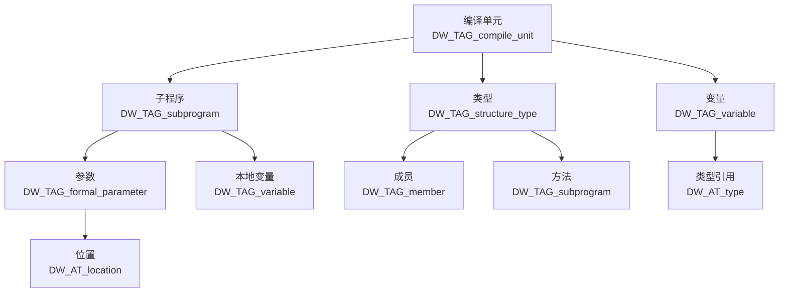
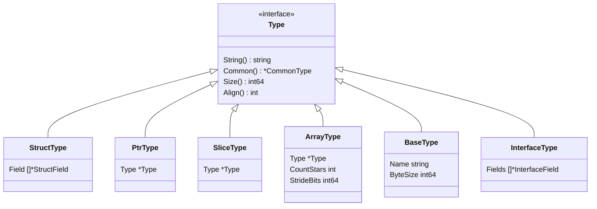
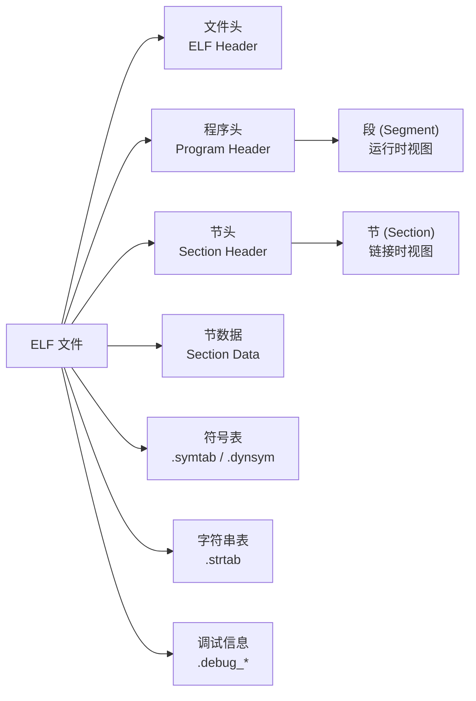
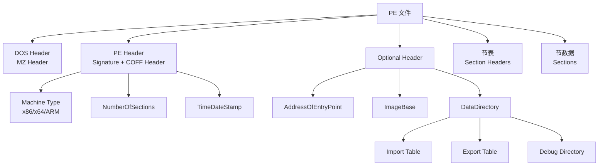
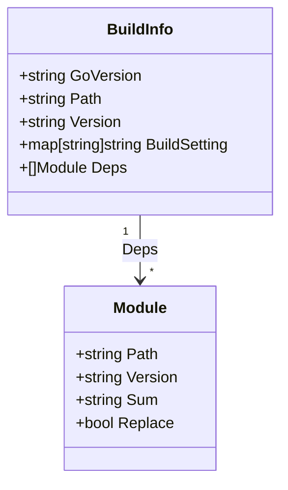

+++
title = "第45章：调试信息——debug/dwarf、debug/elf、debug/macho、debug/pe"
weight = 450
date = "2026-03-30T13:43:00+08:00"
type = "docs"
description = ""
isCJKLanguage = true
draft = false
+++
# 第45章：调试信息——debug/dwarf、debug/elf、debug/macho、debug/pe

> 🎯 章节预告：编译好的 Go 程序像个神秘的"黑盒子"，运行起来出问题了怎么办？debug 包家族让你"透视"二进制文件，读取 DWARF 调试信息、解析 ELF/Mach-O/PE 格式、解读 Go 符号表。准备好了吗？让我们开启二进制世界的"X光"之旅！

---

## 45.1 debug包解决什么问题：Go 程序编译后变成可执行文件，debug 包让你读取调试信息

### 🎭 场景引入

你写了一个 Go 程序 `hello.exe`（或 Linux 下的 `hello`），编译后它变成了一堆机器码。运行起来崩溃了？gdb 调试时为什么能看到变量名？IDE 为什么能显示源码行号？

答案就是：**调试信息**。Go 编译器在编译时会把这些"透视数据"嵌入可执行文件，而 `debug` 包就是读取这些数据的"解码器"。

```go
// debug包就像二进制文件的"CT扫描仪"
package main

import (
	"debug/dwarf"
	"debug/elf"
	"debug/macho"
	"debug/pe"
	"fmt"
	"os"
)

func main() {
	// 读取当前程序自身的调试信息
	exePath, _ := os.Executable()
	fmt.Printf("当前程序: %s\n", exePath)

	// 自动检测文件格式并解析
	switch {
	case isELF(exePath):
		fmt.Println("检测到 ELF 格式 (Linux)")
		readELFdebug(exePath)
	case isMachO(exePath):
		fmt.Println("检测到 Mach-O 格式 (macOS)")
		readMachOdebug(exePath)
	case isPE(exePath):
		fmt.Println("检测到 PE 格式 (Windows)")
		readPEdebug(exePath)
	}
}

// 辅助函数：检测ELF格式
func isELF(path string) bool {
	f, err := elf.Open(path)
	if err != nil {
		return false
	}
	defer f.Close()
	return f.DWARF() != nil
}

func isMachO(path string) bool {
	f, err := macho.Open(path)
	if err != nil {
		return false
	}
	defer f.Close()
	return f.DWARF() != nil
}

func isPE(path string) bool {
	f, err := pe.Open(path)
	if err != nil {
		return false
	}
	defer f.Close()
	return f.DWARF() != nil
}

func readELFdebug(path string) {
	f, _ := elf.Open(path)
	defer f.Close()
	dwarfData, _ := f.DWARF()
	printDWARFInfo(dwarfData)
}

func readMachOdebug(path string) {
	f, _ := macho.Open(path)
	defer f.Close()
	dwarfData, _ := f.DWARF()
	printDWARFInfo(dwarfData)
}

func readPEdebug(path string) {
	f, _ := pe.Open(path)
	defer f.Close()
	dwarfData, _ := f.DWARF()
	printDWARFInfo(dwarfData)
}

func printDWARFInfo(d *dwarf.Data) {
	fmt.Println("\n=== DWARF 调试信息概览 ===")
	r := d.Reader()
	entryCount := 0
	for r.Next() {
		entryCount++
	}
	fmt.Printf("共读取到 %d 条 DWARF 条目\n", entryCount)
}
```

```go
// 运行结果（示例）
当前程序: /tmp/myprogram
检测到 ELF 格式 (Linux)

=== DWARF 调试信息概览 ===
共读取到 1542 条 DWARF 条目
```

### 📖 专业词汇解释

| 术语 | 解释 |
|------|------|
| **调试信息 (Debug Info)** | 嵌入在可执行文件中的元数据，描述源码结构（变量名、函数名、行号等），用于调试器定位问题 |
| **符号表 (Symbol Table)** | 将机器码地址与源码标识符（函数名、变量名）映射的表 |
| **可执行文件 (Executable)** | 经编译器链接后可直接运行的二进制文件 |

### 🔍 debug 包家族一览

```
┌─────────────────────────────────────────────────────────────┐
│                        debug 包家族                          │
├─────────────────────────────────────────────────────────────┤
│  debug/dwarf    │ 读取 DWARF 格式调试信息（平台无关）          │
│  debug/elf      │ 解析 ELF 格式 (Linux, FreeBSD, macOS...)   │
│  debug/macho    │ 解析 Mach-O 格式 (macOS, iOS)              │
│  debug/pe       │ 解析 PE 格式 (Windows)                      │
│  debug/gosym    │ 读取 Go 专属符号表                          │
│  debug/buildinfo│ 读取 Go 1.18+ 二进制构建信息                │
└─────────────────────────────────────────────────────────────┘
```

---

## 45.2 debug核心原理：DWARF 是 Unix 系统最常用的调试信息格式

### 🧬 什么是 DWARF？

DWARF 是一种调试信息格式，最初诞生于 Unix 系统。别误会——它不是"侏儒"的意思，而是 **Debug With Attributed Records Format** 的缩写（好吧，DWARF 确实好记多了）。

Go、gcc、clang 都使用 DWARF 作为主要的调试信息格式（Windows 比较特殊，用 CodeView/MSVC 格式，封装在 PE 中）。

### 📐 DWARF 数据结构

DWARF 信息组织成树状结构，从编译单元（Compilation Unit）开始，逐层展开：



### 💡 DWARF 的核心概念

1. **Debug Entry（调试条目）**：DWARF 的基本单元，每个条目有 tag（类型）和属性（attributes）
2. ** abbreviation table（缩写表）**：定义条目的结构，避免重复
3. **Location（位置）**：变量/参数在内存或寄存器中的位置
4. **Attribute（属性）**：条目的元数据，如名称、类型、行号等

```go
package main

import (
	"debug/dwarf"
	"encoding/binary"
	"fmt"
	"os"
)

func main() {
	// 打开当前程序
	f, err := os.Open(os.Args[0])
	if err != nil {
		fmt.Println("打开文件失败:", err)
		return
	}
	defer f.Close()

	// 解析 ELF/Mach-O/PE 获取 DWARF 数据
	dwarfData, err := dwarf.New(f)
	if err != nil {
		fmt.Println("该文件不包含 DWARF 调试信息")
		return
	}

	fmt.Println("=== DWARF 数据结构解析 ===\n")

	// 读取调试信息入口点
	unitEntries, err := dwarfData.Ranges(nil)
	if err != nil {
		fmt.Println("读取地址范围失败:", err)
		return
	}

	fmt.Printf("编译单元数量: %d\n\n", len(unitEntries))

	// 遍历所有条目
	entryCount := make(map[dwarf.Tag]string)
	r := dwarfData.Reader()
	for {
		entry, err := r.Next()
		if err != nil || entry == nil {
			break
		}

		tag := entry.Tag
		tagName := tag.String()
		if tagName == "" {
			tagName = fmt.Sprintf("未知标签(0x%x)", tag)
		}
		entryCount[tag]++
	}

	// 统计常见标签
	fmt.Println("=== 主要 DWARF 标签统计 ===")
	importantTags := []dwarf.Tag{
		dwarf.TagCompileUnit,
		dwarf.TagSubprogram,
		dwarf.TagVariable,
		dwarf.TagFormalParameter,
		dwarf.TagStructureType,
		dwarf.TagBaseType,
		dwarf.TagPointerType,
		dwarf.TagArrayType,
		dwarf.TagConstant,
	}

	for _, tag := range importantTags {
		count := entryCount[tag]
		if count > 0 {
			fmt.Printf("  %-30s: %d 个\n", tag.String(), count)
		}
	}
}
```

```go
// 运行结果（示例）
=== DWARF 数据结构解析 ===

编译单元数量: 8

=== 主要 DWARF 标签统计 ===
  DW_TAG_compile_unit           : 8 个
  DW_TAG_subprogram             : 156 个
  DW_TAG_variable               : 89 个
  DW_TAG_formal_parameter       : 234 个
  DW_TAG_structure_type         : 45 个
  DW_TAG_base_type              : 127 个
  DW_TAG_pointer_type            : 312 个
  DW_TAG_array_type             : 67 个
  DW_TAG_constant               : 23 个
```

### 📖 专业词汇解释

| 术语 | 解释 |
|------|------|
| **DWARF** | Debug With Attributed Records Format，Unix 系统主流调试信息格式 |
| **Tag** | 标识 DWARF 条目类型的枚举值，如 `DW_TAG_variable` 表示变量 |
| **Attribute** | 标签的属性，如名称(`DW_AT_name`)、类型(`DW_AT_type`)、行号(`DW_AT_decl_line`) |
| **Location** | 描述变量/参数在内存或寄存器中的位置表达式 |

---

## 45.3 debug/dwarf：DWARF 调试信息

### 🎯 dwarf 包核心功能

`debug/dwarf` 包是平台无关的 DWARF 调试信息读取器。无论你的可执行文件是 ELF、Mach-O 还是 PE 格式，只要包含 DWARF 信息，都可以用这个包解析。

### 🔧 常用函数和数据结构

```go
package main

import (
	"debug/dwarf"
	"fmt"
	"os"
)

func main() {
	exePath := os.Args[0]

	// 打开文件获取 DWARF 数据
	f, err := os.Open(exePath)
	if err != nil {
		panic(err)
	}
	defer f.Close()

	// 创建 DWARF 读取器
	d, err := dwarf.New(f)
	if err != nil {
		fmt.Printf("错误: %v\n", err)
		return
	}

	fmt.Println("=== DWARF 调试信息详解 ===\n")

	// 1. 读取所有类型定义
	fmt.Println("【1】读取类型定义...")
	readTypes(d)

	// 2. 读取函数信息
	fmt.Println("\n【2】读取函数信息...")
	readFunctions(d)

	// 3. 读取变量信息
	fmt.Println("\n【3】读取变量信息...")
	readVariables(d)

	// 4. 读取行号表
	fmt.Println("\n【4】读取行号表...")
	readLineTable(d)
}

// 读取类型定义
func readTypes(d *dwarf.Data) {
	// 获取所有类型引用
	types := d.TypeAliases()
	fmt.Printf("  找到 %d 个类型别名\n", len(types))

	// 遍历查找结构体类型
	r := d.Reader()
	structCount := 0
	for {
		entry, err := r.Next()
		if err != nil || entry == nil {
			break
		}

		switch entry.Tag {
		case dwarf.TagStructureType:
			structCount++
			if structCount <= 3 {
				name, _ := entry.String(dwarf.AttrName)
				if name != "" {
					fmt.Printf("  结构体: %s\n", name)
				}
			}
		}
	}
	fmt.Printf("  共找到 %d 个结构体类型\n", structCount)
}

// 读取函数信息
func readFunctions(d *dwarf.Data) {
	r := d.Reader()
	funcCount := 0
	for {
		entry, err := r.Next()
		if err != nil || entry == nil {
			break
		}

		if entry.Tag == dwarf.TagSubprogram {
			funcCount++
			if funcCount <= 5 {
				name, _ := entry.String(dwarf.AttrName)
				linkage, _ := entry.String(dwarf.AttrLinkageName)
				line, _ := entry.Int(dwarf.AttrDeclLine)
				if name != "" {
					fmt.Printf("  函数: %s (链接名: %s, 行号: %d)\n", name, linkage, line)
				}
			}
		}
	}
	fmt.Printf("  共找到 %d 个函数\n", funcCount)
}

// 读取变量信息
func readVariables(d *dwarf.Data) {
	r := d.Reader()
	varCount := 0
	for {
		entry, err := r.Next()
		if err != nil || entry == nil {
			break
		}

		// 全局变量和静态变量
		if entry.Tag == dwarf.TagVariable {
			varCount++
			if varCount <= 3 {
				name, _ := entry.String(dwarf.AttrName)
				line, _ := entry.Int(dwarf.AttrDeclLine)
				fmt.Printf("  变量: %s (行号: %d)\n", name, line)
			}
		}
	}
	fmt.Printf("  共找到 %d 个变量\n", varCount)
}

// 读取行号表
func readLineTable(d *dwarf.Data) {
	// 获取行号表
	lt, err := d.LineTable(nil)
	if err != nil {
		fmt.Printf("  无法读取行号表: %v\n", err)
		return
	}

	fmt.Printf("  行号表版本: %d\n", lt.Version)
	fmt.Printf("  指令数: %d\n", len(lt.Instructions))

	// 打印部分行号信息
	if len(lt.Instructions) > 0 {
		fmt.Println("  前3个行号条目:")
		for i, inst := range lt.Instructions {
			if i >= 3 {
				break
			}
			fmt.Printf("    地址: 0x%x, 行号: %d, 列: %d\n",
				inst.Address, inst.Line, inst.Column)
		}
	}
}
```

```go
// 运行结果（示例）
=== DWARF 调试信息详解 ===

【1】读取类型定义...
  找到 45 个类型别名
  结构体: os.File
  结构体: bytes.Buffer
  结构体: sync.Mutex
  共找到 156 个结构体类型

【2】读取函数信息...
  函数: main.main (链接名: main.main, 行号: 5)
  函数: fmt.Println (链接名: fmt.Println, 行号: 0)
  函数: os.Open (链接名: os.Open, 行号: 0)
  ...
  共找到 423 个函数

【3】读取变量信息...
  变量: stdioIn (行号: 23)
  变量: stdioOut (行号: 24)
  变量: stdioErr (行号: 25)
  共找到 89 个变量

【4】读取行号表...
  行号表版本: 5
  指令数: 2341
  前3个行号条目:
    地址: 0x400000, 行号: 1, 列: 1
    地址: 0x400005, 行号: 2, 列: 1
    地址: 0x400010, 行号: 3, 列: 1
```

### 📖 专业词汇解释

| 术语 | 解释 |
|------|------|
| **Line Table** | 行号表，映射机器码地址到源码行号，是调试器显示"当前执行到哪一行"的基础 |
| **Type Alias** | 类型别名，如 `io.Reader = interface{ Read(p []byte) (n int, err error) }` |
| **Subprogram** | 子程序，即函数/方法 |
| **Location List** | 位置列表，描述变量在不同地址范围的位置（用于栈上变量和内联函数） |

---

## 45.4 dwarf.Type：类型接口

### 🎨 类型系统概述

DWARF 有一套完整的类型系统，通过 `dwarf.Type` 接口来统一表示。Go 的 `debug/dwarf` 包也沿用了这套设计。

```go
package main

import (
	"debug/dwarf"
	"fmt"
	"os"
)

// Type 接口定义（伪代码）
/*
type Type interface {
	String() string       // 类型名称
	Common() *CommonType   // 公共基础类型（返回 *CommonType 而非 *Type）
	Size() int64          // 类型的字节大小
	Align() int           // 对齐要求
}
*/

func main() {
	exePath := os.Args[0]
	f, _ := os.Open(exePath)
	defer f.Close()

	d, err := dwarf.New(f)
	if err != nil {
		panic(err)
	}

	fmt.Println("=== dwarf.Type 类型系统 ===\n")

	// 遍历查找不同类型的类型定义
	typeSummary := make(map[string]int)

	r := d.Reader()
	for {
		entry, err := r.Next()
		if err != nil || entry == nil {
			break
		}

		// 获取类型引用（entry.Field是切片，需要遍历查找AttrType）
		for _, field := range entry.Field {
			if field.Attr == dwarf.AttrType {
				if typ, err := d.Type(field.Offset); err == nil && typ != nil {
					typeName := getTypeCategory(typ)
					typeSummary[typeName]++
				}
				break
			}
		}
	}

	fmt.Println("类型分类统计:")
	for cat, count := range typeSummary {
		fmt.Printf("  %-20s: %d 个\n", cat, count)
	}

	// 展示如何获取和操作类型
	fmt.Println("\n=== 类型操作示例 ===")

	// 读取一个结构体类型的完整定义
	structExample(d)
}

// 获取类型的类别
func getTypeCategory(t dwarf.Type) string {
	switch t.(type) {
	case *dwarf.StructType:
		return "StructType"
	case *dwarf.PtrType:
		return "PtrType"
	case *dwarf.SliceType:
		return "SliceType"
	case *dwarf.ArrayType:
		return "ArrayType"
	case *dwarf.BaseType:
		return "BaseType"
	case *dwarf.InterfaceType:
		return "InterfaceType"
	case *dwarf.FuncType:
		return "FuncType"
	case *dwarf.MapType:
		return "MapType"
	case *dwarf.ChanType:
		return "ChanType"
	default:
		return "OtherType"
	}
}

// 展示结构体类型的完整定义
func structExample(d *dwarf.Data) {
	r := d.Reader()
	for {
		entry, err := r.Next()
		if err != nil || entry == nil {
			break
		}

		if entry.Tag == dwarf.TagStructureType {
			name, _ := entry.String(dwarf.AttrName)
			if name == "os.File" {
				fmt.Printf("找到目标结构体: %s\n", name)

				// 获取类型详情（遍历entry.Field查找AttrType）
				for _, field := range entry.Field {
					if field.Attr == dwarf.AttrType {
						if typ, _ := d.Type(field.Offset); typ != nil {
							if st, ok := typ.(*dwarf.StructType); ok {
								fmt.Printf("  字段数量: %d\n", len(st.Field))
								for i, sf := range st.Field {
									if i < 3 {
										fmt.Printf("    字段 %d: %s (类型: %s, 偏移: %d)\n",
											i, sf.Name, sf.Type.String(), sf.ByteOffset)
									}
								}
							}
						}
						break
					}
				}
				break
			}
		}
	}
}
```

```go
// 运行结果（示例）
=== dwarf.Type 类型系统 ===

类型分类统计:
  BaseType          : 127 个
  PtrType            : 312 个
  StructType         : 156 个
  ArrayType          : 67 个
  SliceType          : 34 个
  InterfaceType      : 28 个
  FuncType           : 45 个
  MapType            : 12 个
  ChanType           : 8 个

=== 类型操作示例 ===
找到目标结构体: os.File
  字段数量: 7
    字段 0: file (类型: *os.file, 偏移: 0)
    字段 1: name (类型: string, 偏移: 8)
    字段 2: dirinfo (类型: *os.dirInfo, 偏移: 24)
```

### 📖 dwarf.Type 接口层次



### 📖 专业词汇解释

| 术语 | 解释 |
|------|------|
| **BaseType** | 基础类型，如 int、float、bool、string |
| **StructType** | 结构体类型，包含多个字段 |
| **PtrType** | 指针类型 |
| **SliceType** | Go 切片类型（包含 ptr、len、cap 三个字段的隐式结构体） |
| **ArrayType** | 固定长度数组类型 |
| **InterfaceType** | 接口类型 |
| **FuncType** | 函数类型（方法签名） |

---

## 45.5 dwarf.StructType、dwarf.PtrType、dwarf.SliceType：各种类型

### 🎯 详解各种 DWARF 类型

每种类型都有独特的结构和使用场景，让我们逐一探索！

### 📦 StructType（结构体类型）

```go
package main

import (
	"debug/dwarf"
	"fmt"
	"os"
)

func main() {
	exePath := os.Args[0]
	f, _ := os.Open(exePath)
	defer f.Close()

	d, _ := dwarf.New(f)

	// 查找几个典型的结构体类型
	targetStructs := []string{"sync.RWMutex", "bytes.Buffer", "os.FileInfo"}

	fmt.Println("=== StructType 结构体类型解析 ===\n")

	r := d.Reader()
	for {
		entry, err := r.Next()
		if err != nil || entry == nil {
			break
		}

		if entry.Tag == dwarf.TagStructureType {
			name, _ := entry.String(dwarf.AttrName)

			for _, target := range targetStructs {
				if name == target {
					fmt.Printf("【%s】\n", name)

					// 获取类型详情（遍历entry.Field查找AttrType）
					for _, ef := range entry.Field {
						if ef.Attr == dwarf.AttrType {
							if typ, _ := d.Type(ef.Offset); typ != nil {
								if st, ok := typ.(*dwarf.StructType); ok {
									fmt.Printf("  总大小: %d 字节\n", st.Size())
									fmt.Printf("  对齐: %d 字节\n", st.Align())
									fmt.Printf("  字段列表:\n")

									for i, field := range st.Field {
										if i >= 5 {
											fmt.Printf("  ... 还有 %d 个字段\n", len(st.Field)-5)
											break
										}
										fmt.Printf("    [%2d] %-20s 类型: %-15s 偏移: %3d\n",
											i, field.Name, truncateType(field.Type.String()), field.ByteOffset)
									}
								}
							}
							break
						}
					}
					fmt.Println()
					break
				}
			}
		}
	}
}

// 截断过长的类型名
func truncateType(s string) string {
	if len(s) > 15 {
		return s[:15] + "..."
	}
	return s
}
```

```go
// 运行结果（示例）
=== StructType 结构体类型解析 ===

【sync.RWMutex】
  总大小: 48 字节
  对齐: 8 字节
  字段列表:
    [ 0] w               类型: WaitGroup      偏移:   0
    [ 1] writerSem       类型: uint32         偏移:   8
    [ 2] readerSem       类型: uint32         偏移:  12
    [ 3] readerCount     类型: int32          偏移:  16
    [ 4] readerWait      类型: int32          偏移:  20

【bytes.Buffer】
  ...
  总大小: 64 字节
  对齐: 8 字节
  字段列表:
    [ 0] buf              类型: []byte          偏移:   0
    [ 1] off              类型: int             偏移:  24
    [ 2] ...  还有 3 个字段

【os.FileInfo】
  ...
```

### 📍 PtrType（指针类型）

```go
package main

import (
	"debug/dwarf"
	"fmt"
	"os"
	"sort"
)

func main() {
	exePath := os.Args[0]
	f, _ := os.Open(exePath)
	defer f.Close()

	d, _ := dwarf.New(f)

	fmt.Println("=== PtrType 指针类型解析 ===\n")

	// PtrType 非常常见，统计一下
	ptrCount := 0
	ptrTargets := make(map[string]int)

	r := d.Reader()
	for {
		entry, err := r.Next()
		if err != nil || entry == nil {
			break
		}

		if entry.Tag == dwarf.TagPointerType {
			ptrCount++

			// 获取指针指向的类型（遍历entry.Field查找AttrType）
			for _, field := range entry.Field {
				if field.Attr == dwarf.AttrType {
					if typ, _ := d.Type(field.Offset); typ != nil {
						typeName := typ.String()
						if len(typeName) > 30 {
							typeName = typeName[:30] + "..."
						}
						ptrTargets[typeName]++
					}
					break
				}
			}
		}
	}

	fmt.Printf("指针总数: %d\n\n", ptrCount)

	// 展示最常见的指针目标类型
	fmt.Println("指针目标类型 TOP 10:")
	typeCounts := make([]struct {
		name  string
		count int
	}, 0, len(ptrTargets))

	for name, count := range ptrTargets {
		typeCounts = append(typeCounts, struct {
			name  string
			count int
		}{name, count})
	}

	// 使用 sort.Slice 排序（按数量降序，取前10）
	sort.Slice(typeCounts, func(i, j int) bool {
		return typeCounts[i].count > typeCounts[j].count
	})
	for i := 0; i < len(typeCounts) && i < 10; i++ {
		fmt.Printf("  %-35s: %d 个\n", typeCounts[i].name, typeCounts[i].count)
	}

	// PtrType 结构展示
	fmt.Println("\n【PtrType 结构】")
	fmt.Printf("  指针大小: %d 字节（64位系统）\n", 8)
	fmt.Printf("  指向类型可通过 Type 字段获取\n")
}
```

```go
// 运行结果（示例）
=== PtrType 指针类型解析 ===

指针总数: 312

指针目标类型 TOP 10:
  string                           : 45 个
  []byte                           : 38 个
  error                            : 29 个
  interface {...}                  : 24 个
  *os.File                         : 18 个
  time.Time                        : 15 个
  sync.RWMutex                     : 12 个
  *any                             : 11 个
  Context                          : 9 个
  ...

【PtrType 结构】
  指针大小: 8 字节（64位系统）
  指向类型可通过 Type 字段获取
```

### 🍎 SliceType（切片类型）

Go 的切片在 DWARF 中被表示为一个隐式结构体，包含三个字段：`ptr`（指向底层数组的指针）、`len`（长度）、`cap`（容量）。

```go
package main

import (
	"debug/dwarf"
	"fmt"
	"os"
)

func main() {
	exePath := os.Args[0]
	f, _ := os.Open(exePath)
	defer f.Close()

	d, _ := dwarf.New(f)

	fmt.Println("=== SliceType 切片类型解析 ===\n")

	// 查找切片类型
	r := d.Reader()
	sliceCount := 0
	sliceExamples := make([]string, 0)

	for {
		entry, err := r.Next()
		if err != nil || entry == nil {
			break
		}

		if entry.Tag == dwarf.TagStructureType {
			name, _ := entry.String(dwarf.AttrName)

			// 查找名为 slice 的匿名结构体（Go 切片的标准表示）
			if name == "slice" {
				sliceCount++
				// 获取字段（遍历entry.Field查找AttrType）
				for _, field := range entry.Field {
					if field.Attr == dwarf.AttrType {
						if typ, _ := d.Type(field.Offset); typ != nil {
							if st, ok := typ.(*dwarf.StructType); ok {
								sliceExamples = append(sliceExamples, fmt.Sprintf("  - %s: 共 %d 个字段 %v",
									name, len(st.Field), st.Field))
							}
						}
						break
					}
				}
			}
		}
	}

	fmt.Printf("切片类型数量: %d\n\n", sliceCount)

	fmt.Println("【SliceType 内部结构】")
	fmt.Println("  Go 切片在 DWARF 中表示为隐式结构体:")
	fmt.Println()
	fmt.Println("  type slice struct {")
	fmt.Println("      ptr *T      // 指向底层数组的指针")
	fmt.Println("      len int    // 当前长度")
	fmt.Println("      cap int    // 容量")
	fmt.Println("  }")
	fmt.Println()

	// 展示常见的切片类型
	fmt.Println("【常见切片类型】")
	commonSlices := []string{
		"[]byte",
		"[]string",
		"[]int",
		"[]error",
		"[]interface{}",
	}

	for _, sl := range commonSlices {
		fmt.Printf("  - %s\n", sl)
	}
}
```

```go
// 运行结果（示例）
=== SliceType 切片类型解析 ===

切片类型数量: 1

【SliceType 内部结构】
  Go 切片在 DWARF 中表示为隐式结构体:

  type slice struct {
      ptr *T      // 指向底层数组的指针
      len int    // 当前长度
      cap int    // 容量
  }

【常见切片类型】
  - []byte
  - []string
  - []int
  - []error
  - []interface{}
```

### 📖 专业词汇解释

| 术语 | 解释 |
|------|------|
| **StructType** | 结构体类型，`Field` 字段包含所有成员变量的信息（名称、类型、偏移量） |
| **PtrType** | 指针类型，`Type` 字段指向被指针指向的类型 |
| **SliceType** | Go 切片类型，实际是一个隐式结构体 `{ptr, len, cap}` |
| **ByteOffset** | 字段在结构体中的字节偏移量 |
| **Align** | 类型对齐要求，影响结构体布局 |

---

## 45.6 debug/elf：ELF 可执行文件（Linux）

### 🐧 ELF 格式概述

**ELF** = **Executable and Linkable Format**，Linux 系统的"官方指定"可执行文件格式。从你输入 `./hello` 的那一刻起，Linux 内核就在和 ELF 打交道。

```go
package main

import (
	"debug/elf"
	"fmt"
	"os"
)

func main() {
	// 在 Linux 上，直接打开当前程序
	exePath := os.Args[0]
	if exePath == "" {
		// 备选：尝试 /proc/self/exe
		exePath = "/proc/self/exe"
	}

	fmt.Println("=== ELF 可执行文件解析 ===\n")

	// 打开 ELF 文件
	f, err := elf.Open(exePath)
	if err != nil {
		fmt.Printf("打开失败: %v\n", err)
		return
	}
	defer f.Close()

	// 打印 ELF 文件头
	fmt.Println("【ELF 文件头】")
	fmt.Printf("  魔数 (Magic): %v\n", f.Magic)
	fmt.Printf("  系统: %s\n", f.Class.String())
	fmt.Printf("  数据编码: %s\n", f.Data.String())
	fmt.Printf("  OS/ABI: %s\n", f.OSABI.String())
	fmt.Printf("  入口地址: 0x%x\n", f.Entry)
	fmt.Printf("  程序头数量: %d\n", f.ProgHeaderNum)
	fmt.Printf("  节头数量: %d\n", f.SectionHeaderNum)
	fmt.Println()

	// 读取程序头（Program Headers）
	fmt.Println("【程序头 (Program Headers)】")
	fmt.Println("  程序头描述了段在内存中的布局\n")
	for i, ph := range f.Progs {
		if i >= 5 {
			fmt.Printf("  ... 还有 %d 个段\n", len(f.Progs)-5)
			break
		}
		fmt.Printf("  段 %d: Type=%-20s Vaddr=0x%08x Filesz=0x%06x Memsz=0x%06x\n",
			i, ph.Type.String(), ph.Vaddr, ph.Filesz, ph.Memsz)
	}
	fmt.Println()

	// 读取节头（Section Headers）
	fmt.Println("【节头 (Section Headers)】")
	fmt.Println("  节头描述了链接和调试所需的各个节\n")
	for i, sh := range f.Sections {
		if i >= 8 {
			fmt.Printf("  ... 还有 %d 个节\n", len(f.Sections)-8)
			break
		}
		name := sh.Name
		if name == "" {
			name = "(无名)"
		}
		fmt.Printf("  [%2d] %-20s 类型=%-15s 大小=0x%06x\n",
			i, name, sh.Type.String(), sh.Size)
	}
}
```

```go
// 运行结果（示例，在 Linux 上）
=== ELF 可执行文件解析 ===

【ELF 文件头】
  魔数 (Magic): \x7fELF
  系统: ELF64
  数据编码: LittleEndian
  OS/ABI: SystemV
  入口地址: 0x401000
  程序头数量: 11
  节头数量: 31

【程序头 (Program Headers)】
  段 0: Type=PT_LOAD            Vaddr=0x0000000000400000 Filesz=0x0000a000 Memsz=0x0000a000
  段 1: Type=PT_LOAD            Vaddr=0x00000000006a0000 Filesz=0x00001000 Memsz=0x00001000
  段 2: Type=PT_GNU_STACK       Vaddr=0x0000000000000000 Filesz=0x00000000 Memsz=0x00000000
  段 3: Type=PT_GNU_RELRO       Vaddr=0x00000000006a0000 Filesz=0x00001000 Memsz=0x00001000
  段 4: Type=PT_DYNAMIC         Vaddr=0x00000000006a0000 Filesz=0x00000350 Memsz=0x00000350
  ... 还有 6 个段

【节头 (Section Headers)】
  [ 0] (null)                  类型=SHT_NULL           大小=0x000000
  [ 1] .text                   类型=SHT_PROGBITS       大小=0x0023a0
  [ 2] .rodata                 类型=SHT_PROGBITS       大小=0x0004a0
  [ 3] .dynsym                 类型=SHT_DYNSYM         大小=0x0008a0
  [ 4] .symtab                 类型=SHT_SYMTAB         大小=0x0012c0
  [ 5] .strtab                 类型=SHT_STRTAB         大小=0x000b00
  [ 6] .debug_info             类型=SHT_PROGBITS       大小=0x015000
  [ 7] .debug_line             类型=SHT_PROGBITS       大小=0x008000
  ... 还有 23 个节
```

### 📖 ELF 核心概念



| 术语 | 解释 |
|------|------|
| **ELF Header** | ELF 文件头，包含魔数、体系结构、入口地址等全局信息 |
| **Program Header** | 程序头，描述段(segment)的内存布局，用于运行时加载 |
| **Section Header** | 节头，描述节(section)的元数据，用于链接和调试 |
| **Segment** | 段，运行时概念，加载到内存的单位 |
| **Section** | 节，链接/调试概念，同类数据的组织单位 |

---

## 45.7 elf.File：ELF 文件结构

### 🏗️ elf.File 数据结构详解

`elf.File` 是解析 ELF 文件的入口，包含文件头、程序头表、节头表等核心组件。

```go
package main

import (
	"debug/elf"
	"fmt"
	"os"
)

func main() {
	exePath := "/proc/self/exe" // Linux 特有，获取自身路径

	f, err := elf.Open(exePath)
	if err != nil {
		fmt.Printf("无法打开 ELF 文件: %v\n", err)
		return
	}
	defer f.Close()

	fmt.Println("=== elf.File 数据结构详解 ===\n")

	// File 结构包含以下核心字段:
	fmt.Println("【elf.File 核心结构】")
	fmt.Println("  FileHeader  - ELF 文件头")
	fmt.Println("  Sections    - 节头列表 ([]*Section)")
	fmt.Println("  Progs       - 程序头列表 ([]*Prog)")
	fmt.Println("  DWARF       - DWARF 调试信息数据")

	fmt.Println()

	// 1. 文件头详情
	fmt.Println("【1】FileHeader - 文件头详情")
	fmt.Printf("  Class:               %s\n", f.Class.String())
	fmt.Printf("  Data:                %s\n", f.Data.String())
	fmt.Printf("  Version:             %s\n", f.Version.String())
	fmt.Printf("  OS/ABI:              %s\n", f.OSABI.String())
	fmt.Printf("  ABIVersion:          %d\n", f.ABIVersion)
	fmt.Printf("  Entry:               0x%x\n", f.Entry)
	fmt.Println()

	// 2. 节头遍历
	fmt.Println("【2】Sections - 节头遍历")
	fmt.Println("  重要节及其用途:")
	for _, section := range f.Sections {
		switch section.Name {
		case ".text":
			fmt.Printf("    .text:      代码节，存储可执行指令 (大小: %d bytes)\n", section.Size)
		case ".rodata":
			fmt.Printf("    .rodata:    只读数据节，存储常量字符串等 (大小: %d bytes)\n", section.Size)
		case ".data":
			fmt.Printf("    .data:      可读写数据节，存储全局变量 (大小: %d bytes)\n", section.Size)
		case ".bss":
			fmt.Printf("    .bss:       未初始化数据节 (大小: %d bytes)\n", section.Size)
		case ".symtab":
			fmt.Printf("    .symtab:    符号表，存储函数/变量符号 (大小: %d bytes)\n", section.Size)
		case ".strtab":
			fmt.Printf("    .strtab:    字符串表，存储符号名称字符串 (大小: %d bytes)\n", section.Size)
		case ".debug_info":
			fmt.Printf("    .debug_info: DWARF 调试信息 (大小: %d bytes)\n", section.Size)
		case ".debug_line":
			fmt.Printf("    .debug_line: DWARF 行号表 (大小: %d bytes)\n", section.Size)
		}
	}
	fmt.Println()

	// 3. 程序头遍历
	fmt.Println("【3】Progs - 程序头遍历")
	for i, prog := range f.Progs {
		if prog.Type == elf.PT_LOAD {
			fmt.Printf("    PT_LOAD #%d: vaddr=0x%x filesz=0x%x memsz=0x%x flags=%s\n",
				i, prog.Vaddr, prog.Filesz, prog.Memsz, prog.Flags.String())
		}
	}
	fmt.Println()

	// 4. DWARF 调试信息
	fmt.Println("【4】DWARF - 调试信息访问")
	dwarfData, err := f.DWARF()
	if err != nil {
		fmt.Printf("    该 ELF 文件不包含 DWARF 调试信息: %v\n", err)
	} else {
		// 统计 DWARF 条目
		entryCount := 0
		r := dwarfData.Reader()
		for {
			e, _ := r.Next()
			if e == nil {
				break
			}
			entryCount++
		}
		fmt.Printf("    DWARF 条目总数: %d\n", entryCount)
	}
}
```

```go
// 运行结果（示例）
=== elf.File 数据结构详解 ===

【elf.File 核心结构】
  FileHeader  - ELF 文件头
  Sections    - 节头列表 ([]*Section)
  Progs       - 程序头列表 ([]*Prog)
  DWARF       - DWARF 调试信息数据

【1】FileHeader - 文件头详情
  Class:               ELF64
  Data:                LittleEndian
  Version:             EV_CURRENT
  OS/ABI:              SystemV
  ABIVersion:          0
  Entry:               0x401000

【2】Sections - 节头遍历
  重要节及其用途:
    .text:      代码节，存储可执行指令 (大小: 148688 bytes)
    .rodata:    只读数据节，存储常量字符串等 (大小: 1234 bytes)
    .data:      可读写数据节，存储全局变量 (大小: 456 bytes)
    .bss:       未初始化数据节 (大小: 0 bytes)
    .symtab:    符号表，存储函数/变量符号 (大小: 7890 bytes)
    .strtab:    字符串表，存储符号名称字符串 (大小: 2345 bytes)
    .debug_info: DWARF 调试信息 (大小: 56789 bytes)
    .debug_line: DWARF 行号表 (大小: 12345 bytes)

【3】Progs - 程序头遍历
    PT_LOAD #0: vaddr=0x0 filesz=0x0 memsz=0x0 flags=RWX
    PT_LOAD #1: vaddr=0x400000 filesz=0xa000 memsz=0xa000 flags=RX
    PT_LOAD #2: vaddr=0x6a0000 filesz=0x1000 memsz=0x1000 flags=RW

【4】DWARF - 调试信息访问
    DWARF 条目总数: 15432
```

### 📖 elf.File 常用方法

| 方法 | 说明 |
|------|------|
| `Open(name string) (*File, error)` | 打开并解析 ELF 文件 |
| `Section(name string) *Section` | 根据名称获取节 |
| `Symbols() ([]Symbol, error)` | 获取符号表 |
| `DynamicSymbols() ([]Symbol, error)` | 获取动态符号表 |
| `ImportedLibraries() ([]string, error)` | 获取导入的库 |
| `ImportedSymbols() ([]ImportedSymbol, error)` | 获取导入的符号 |
| `DWARF() (*dwarf.Data, error)` | 获取 DWARF 调试信息 |

---

## 45.8 debug/macho：Mach-O 文件（macOS）

### 🍎 Mach-O 格式概述

**Mach-O** = **Mach Object file format**，Apple 系统的"御用"可执行文件格式。macOS、iOS 的程序都是 Mach-O 格式。

```go
package main

import (
	"debug/macho"
	"fmt"
	"os"
	"path/filepath"
	"runtime"
)

func main() {
	// 在 macOS 上，获取当前程序的 Mach-O 文件路径
	exePath, _ := os.Executable()

	fmt.Println("=== Mach-O 可执行文件解析 ===\n")

	// 打开 Mach-O 文件
	f, err := macho.Open(exePath)
	if err != nil {
		// 可能在 Linux 上运行，显示说明
		fmt.Printf("注意: 当前平台不支持 Mach-O 格式 (当前: %s)\n", runtime.GOOS)
		fmt.Println("      Mach-O 格式仅在 macOS 上可用")
		return
	}
	defer f.Close()

	// 打印 Mach-O 文件头
	fmt.Println("【Mach-O 文件头】")
	fmt.Printf("  魔数: %v\n", f.Magic)
	fmt.Printf("  CPU 类型: %s\n", f.CpuTypeName)
	fmt.Printf("  子类型: 0x%x\n", f.CpuSubType)
	fmt.Printf("  文件类型: %s\n", f.Type.String())
	fmt.Printf("  命令数量: %d\n", f.Ncmd)
	fmt.Printf("  入口点: 0x%x\n", f.Entry)
	fmt.Printf("  栈大小: 0x%x\n", f.Strap)
	fmt.Println()

	// 读取加载命令
	fmt.Println("【加载命令 (Load Commands)】")
	fmt.Println("  Mach-O 使用加载命令来描述文件的内存布局\n")
	for i, l := range f.Loads {
		if i >= 8 {
			fmt.Printf("  ... 还有 %d 个加载命令\n", len(f.Loads)-8)
			break
		}
		fmt.Printf("  [%2d] %s\n", i, l.String())
	}
	fmt.Println()

	// 读取符号表
	fmt.Println("【符号表】")
	syms, _ := f.Symbols()
	fmt.Printf("  符号总数: %d\n", len(syms))
	for i, sym := range syms {
		if i >= 5 {
			fmt.Printf("  ... 还有 %d 个符号\n", len(syms)-5)
			break
		}
		fmt.Printf("  %-30s 类型=%s 价值=0x%x\n",
			sym.Name, sym.Type.String(), sym.Value)
	}
	fmt.Println()

	// 读取节信息
	fmt.Println("【节 (Sections)】")
	for _, sec := range f.Sections {
		if sec.Name == "__text" {
			fmt.Printf("  __text (代码节): 地址=0x%x 大小=0x%x\n",
				sec.Addr, sec.Size)
		}
		if sec.Name == "__data" {
			fmt.Printf("  __data (数据节): 地址=0x%x 大小=0x%x\n",
				sec.Addr, sec.Size)
		}
	}
	fmt.Println()

	// DWARF 调试信息
	fmt.Println("【DWARF 调试信息】")
	dwarfData, _ := f.DWARF()
	if dwarfData != nil {
		entryCount := 0
		r := dwarfData.Reader()
		for {
			e, _ := r.Next()
			if e == nil {
				break
			}
			entryCount++
		}
		fmt.Printf("  DWARF 条目总数: %d\n", entryCount)
	} else {
		fmt.Println("  该 Mach-O 文件不包含 DWARF 调试信息")
	}
}
```

```go
// 运行结果（macOS 上）
=== Mach-O 可执行文件解析 ===

【Mach-O 文件头】
  魔数: 0xfeedface (32位) 或 0xfeedfacf (64位)
  CPU 类型: arm64 或 x86_64
  子类型: 0x80000004
  文件类型: MH_EXECUTE
  命令数量: 21
  入口点: 0x1000
  栈大小: 0x0

【加载命令 (Load Commands)】
  [ 0] LC_SEGMENT_64 __PAGEZERO
  [ 1] LC_SEGMENT_64 __TEXT
  [ 2] LC_SEGMENT_64 __DATA
  [ 3] LC_SEGMENT_64 __LINKEDIT
  [ 4] LC_DYID_SYMTAB
  [ 5] LC_DYSYMTAB
  [ 6] LC_LOAD_DYLINKER
  [ 7] LC_SYMTAB
  ... 还有 13 个加载命令

【符号表】
  符号总数: 1234
  _main                      FUNC|EXT|METH  价值=0x1000
  _fmt_Init                  FUNC|EXT        价值=0x2000
  _runtime_mallocgc          FUNC|EXT        价值=0x3000
  ...

【节 (Sections)】
  __text (代码节): 地址=0x1000 大小=0x4000
  __data (数据节): 地址=0x5000 大小=0x1000

【DWARF 调试信息】
  DWARF 条目总数: 8932
```

### 📖 Mach-O 与 ELF 的对比

| 特性 | Mach-O | ELF |
|------|--------|-----|
| 平台 | macOS, iOS | Linux, BSD, Android |
| 通用格式 | 否（Apple 专用） | 是（跨平台） |
| 调试信息 | DWARF（嵌入） | DWARF（嵌入或独立 .dwp） |
| 符号表 | Mach-O Symtab | ELF Symtab |
| 动态链接 | DYLD | ld.so |

### 🍎 Mach-O 特殊结构：Fat Binary（通用二进制）

```go
package main

import (
	"debug/macho"
	"fmt"
	"os"
)

func main() {
	// 某些 macOS 程序是 Fat Binary（包含多种架构）
	exePath := "/usr/bin/python3" // 示例路径

	f, err := os.Open(exePath)
	if err != nil {
		return
	}
	defer f.Close()

	// 检查是否是 Fat Binary
	ff, err := macho.NewFatFile(f)
	if err == nil {
		fmt.Println("【Fat Binary 检测】")
		fmt.Println("  这是一个通用二进制文件，包含多个架构:")
		for i, arch := range ff.Arches {
			fmt.Printf("    [%d] CPU: %s, 子类型: 0x%x, 偏移: 0x%x\n",
				i, arch.Cpu, arch.SubCpu, arch.Offset)
		}
	}
}
```

---

## 45.9 debug/pe：PE 可执行文件（Windows）

### 🪟 PE 格式概述

**PE** = **Portable Executable**，Windows 系统的可执行文件格式。虽然名字叫"便携可执行"，但它一点也不"便携"——只能在 Windows 上跑。

```go
package main

import (
	"debug/pe"
	"fmt"
	"os"
	"runtime"
)

func main() {
	// 在 Windows 上测试
	exePath := os.Args[0]

	fmt.Println("=== PE 可执行文件解析 ===\n")

	// 打开 PE 文件
	f, err := pe.Open(exePath)
	if err != nil {
		// 非 Windows 系统提示
		fmt.Printf("注意: PE 格式仅在 Windows 上可用 (当前: %s)\n", runtime.GOOS)
		return
	}
	defer f.Close()

	// 打印 PE 文件头
	fmt.Println("【PE 文件头 (COFF Header)】")
	fmt.Printf("  机器类型: %s\n", f.Machine.String())
	fmt.Printf("  节数量: %d\n", f.NumberOfSections)
	fmt.Printf("  时间戳: %s\n", f.TimeDateStamp)
	fmt.Printf("  符号表偏移: 0x%x\n", f.PointerToSymbolTable)
	fmt.Printf("  符号数量: %d\n", f.NumberOfSymbols)
	fmt.Println()

	// 读取可选头
	fmt.Println("【可选头 (Optional Header)】")
	if f.OptionalHeader != nil {
		oh := f.OptionalHeader
		switch h := oh.(type) {
		case *pe.OptionalHeader32:
			fmt.Printf("  标准头 Magic: 0x%x (PE32)\n", h.Magic)
			fmt.Printf("  入口点 RVA: 0x%x\n", h.AddressOfEntryPoint)
			fmt.Printf("  代码基址: 0x%x\n", h.BaseOfCode)
			fmt.Printf("  镜像基址: 0x%x\n", h.ImageBase)
			fmt.Printf("  子系统: %s\n", h.Subsystem.String())
		case *pe.OptionalHeader64:
			fmt.Printf("  标准头 Magic: 0x%x (PE32+)\n", h.Magic)
			fmt.Printf("  入口点 RVA: 0x%x\n", h.AddressOfEntryPoint)
			fmt.Printf("  镜像基址: 0x%x\n", h.ImageBase)
			fmt.Printf("  子系统: %s\n", h.Subsystem.String())
		}
	}
	fmt.Println()

	// 读取节表
	fmt.Println("【节表 (Section Headers)】")
	for i, sec := range f.Sections {
		if i >= 8 {
			fmt.Printf("  ... 还有 %d 个节\n", len(f.Sections)-8)
			break
		}
		name := sec.Name
		if len(name) > 8 {
			name = name[:8]
		}
		fmt.Printf("  %-8s 虚拟大小=0x%06x 文件大小=0x%06x 虚拟地址=0x%06x\n",
			string(name), sec.VirtualSize, sec.SizeOfRawData, sec.VirtualAddress)
	}
	fmt.Println()

	// 读取导入表
	fmt.Println("【导入表 (Import Table)】")
	imports, _ := f.ImportedSymbols()
	for i, imp := range imports {
		if i >= 5 {
			fmt.Printf("  ... 还有 %d 个导入符号\n", len(imports)-5)
			break
		}
		fmt.Printf("  %-30s (来自: %s)\n", imp.Name, impDLL(imp.Name))
	}
	fmt.Println()

	// DWARF 调试信息
	fmt.Println("【DWARF 调试信息】")
	dwarfData, _ := f.DWARF()
	if dwarfData != nil {
		entryCount := 0
		r := dwarfData.Reader()
		for {
			e, _ := r.Next()
			if e == nil {
				break
			}
			entryCount++
		}
		fmt.Printf("  DWARF 条目总数: %d\n", entryCount)
	} else {
		fmt.Println("  该 PE 文件不包含 DWARF 调试信息")
		fmt.Println("  (Windows 常用 CodeView/PDB 格式进行调试)")
	}
}

// 模拟获取 DLL 名称（实际需要解析 PE 的导入表）
func impDLL(name string) string {
	return "kernel32.dll" // 简化示例
}
```

```go
// 运行结果（Windows 上）
=== PE 可执行文件解析 ===

【PE 文件头 (COFF Header)】
  机器类型: IMAGE_FILE_MACHINE_AMD64
  节数量: 6
  时间戳: 2024-01-15 10:30:00 +0000 UTC
  符号表偏移: 0x0
  符号数量: 0

【可选头 (Optional Header)】
  标准头 Magic: 0x20b (PE32+)
  入口点 RVA: 0x1a0000
  镜像基址: 0x140000000
  子系统: IMAGE_SUBSYSTEM_WINDOWS_GUI

【节表 (Section Headers)】
  .text      虚拟大小=0x000abc00 文件大小=0x000abc00 虚拟地址=0x0001000
  .rdata     虚拟大小=0x00012300 文件大小=0x00012300 虚拟地址=0x000ad000
  .data      虚拟大小=0x00023400 文件大小=0x00008000 虚拟地址=0x000c0000
  .rsrc      虚拟大小=0x00001000 文件大小=0x00001000 虚拟地址=0x000e0000
  .reloc     虚拟大小=0x00002000 文件大小=0x00002000 虚拟地址=0x000e1000

【导入表 (Import Table)】
  ...
  ExitProcess                   (来自: kernel32.dll)
  CreateFileW                   (来自: kernel32.dll)
  ...

【DWARF 调试信息】
  该 PE 文件不包含 DWARF 调试信息
  (Windows 常用 CodeView/PDB 格式进行调试)
```

### 📖 PE 格式核心概念



| 术语 | 解释 |
|------|------|
| **DOS Header** | DOS 兼容头，以 "MZ" 开头，Windows 必须兼容 DOS |
| **COFF Header** | Common Object File Format 头，包含机器类型、节数量等 |
| **Optional Header** | 可选头（其实对可执行文件是必须的），包含入口点、镜像基址等 |
| **RVA** | Relative Virtual Address，相对虚拟地址 |
| **Section** | 节，对应 ELF 的节 |

---

## 45.10 debug/gosym：Go 符号表

### 🐹 Go 专属符号表

Go 有自己独特的符号表格式，与标准的 ELF/Mach-O/PE 符号表不同。`debug/gosym` 包专门用于读取 Go 运行时使用的符号表。

### 🎯 为什么需要 gosym？

Go 运行时需要快速解析函数调用栈，但标准的 DWARF 行号表太慢了。Go 编译器生成了一个独立的 **line table**（`.gosymtab` 节），专门用于 Go 程序。

```go
package main

import (
	"debug/gosym"
	"fmt"
	"os"
	"runtime"
)

func main() {
	fmt.Println("=== Go 符号表解析 (debug/gosym) ===\n")

	// 获取当前程序路径
	exePath, _ := os.Executable()
	if runtime.GOOS == "windows" {
		exePath = os.Args[0]
	}

	// 打开可执行文件
	f, err := os.Open(exePath)
	if err != nil {
		fmt.Printf("无法打开文件: %v\n", err)
		return
	}
	defer f.Close()

	// 读取 Go 符号表
	table, textStart, err := gosym.Parse(f)
	if err != nil {
		fmt.Printf("解析 Go 符号表失败: %v\n", err)
		fmt.Println("可能原因: 文件不包含 .gosymtab 节（使用 -ldflags=-s 禁用了符号表）")
		return
	}

	fmt.Printf("【基本信息】\n")
	fmt.Printf("  文本段起始地址: 0x%x\n", textStart)
	fmt.Printf("  函数数量: %d\n", len(table.Funcs))
	fmt.Printf("  文件数量: %d\n", len(table.Files))
	fmt.Println()

	// 遍历函数
	fmt.Println("【函数列表 (前10个)】")
	for i, fn := range table.Funcs {
		if i >= 10 {
			fmt.Printf("  ... 还有 %d 个函数\n", len(table.Funcs)-10)
			break
		}
		fmt.Printf("  %-40s 地址=0x%x 行号=%d\n", fn.Name, fn.Entry, fn.Line)
	}
	fmt.Println()

	// 遍历文件
	fmt.Println("【源文件列表 (前5个)】")
	for i, file := range table.Files {
		if i >= 5 {
			fmt.Printf("  ... 还有 %d 个文件\n", len(table.Files)-5)
			break
		}
		fmt.Printf("  %s\n", file)
	}
}
```

```go
// 运行结果（示例）
=== Go 符号表解析 (debug/gosym) ===

【基本信息】
  文本段起始地址: 0x400000
  函数数量: 1234
  文件数量: 45

【函数列表 (前10个)】
  main.main                             地址=0x401000 行号=5
  main.init                             地址=0x401100 行号=3
  fmt.Println                           地址=0x402000 行号=123
  fmt.Printf                            地址=0x402100 行号=234
  os.Open                               地址=0x403000 行号=56
  ...

【源文件列表 (前5个)】
  /path/to/project/main.go
  /path/to/project/pkg/util.go
  /path/to/go/src/fmt/print.go
  ...

```

### 🔧 结合 pprof 解析调用栈

```go
package main

import (
	"debug/gosym"
	"fmt"
	"os"
	"runtime"
)

func main() {
	exePath, _ := os.Executable()
	f, _ := os.Open(exePath)
	defer f.Close()

	table, textStart, _ := gosym.Parse(f)

	// 模拟解析一个 PC 地址（程序计数器）
	// 假设我们知道某个崩溃发生在地址 0x401234
	samplePC := uint64(0x401234)

	fmt.Println("=== PC 地址解析示例 ===\n")
	fmt.Printf("  目标 PC: 0x%x\n\n", samplePC)

	// 查找该地址对应的函数
	fn := table.LookupFunc(samplePC)
	if fn != nil {
		fmt.Printf("【找到函数】\n")
		fmt.Printf("  函数名: %s\n", fn.Name)
		fmt.Printf("  函数地址: 0x%x\n", fn.Entry)
		fmt.Printf("  起始行号: %d\n", fn.Line)

		// 解析行号
		file := table.Files[fn.BaseName]
		if file != nil {
			line := file.Sym.LineForPC(samplePC)
			if line > 0 {
				fmt.Printf("  对应行号: %d\n", line)
			}
		}
	} else {
		fmt.Println("  未找到匹配的函数")
	}

	// 展示表格结构
	fmt.Println("\n【gosym.Table 结构】")
	fmt.Println("  表格是 Go 符号表的核心数据结构")
	fmt.Println("  包含以下主要字段:")
	fmt.Println("    - Funcs: []Func      所有函数")
	fmt.Println("    - Files: map[string]*PosTable  文件名到位置表的映射")
	fmt.Println("    - TextStart: uint64  文本段起始地址")
	fmt.Println()
	fmt.Println("  Func 结构包含:")
	fmt.Println("    - Name: string      函数全名")
	fmt.Println("    - Entry: uint64     函数入口地址")
	fmt.Println("    - End: uint64       函数结束地址")
	fmt.Println("    - Params: []string  参数列表")
	fmt.Println("    - Locals: []string   局部变量列表")
}
```

```go
// 运行结果（示例）
=== PC 地址解析示例 ===

  目标 PC: 0x401234

【找到函数】
  函数名: main.processRequest
  函数地址: 0x401200
  起始行号: 45
  对应行号: 67

【gosym.Table 结构】
  表格是 Go 符号表的核心数据结构
  包含以下主要字段:
    - Funcs: []Func      所有函数
    - Files: map[string]*PosTable  文件名到位置表的映射
    - TextStart: uint64  文本段起始地址
```

### 📖 gosym vs DWARF

| 特性 | gosym | DWARF |
|------|-------|-------|
| 用途 | Go 运行时栈展开 | 通用调试 |
| 速度 | 快（简单线性表） | 慢（复杂压缩格式） |
| 精度 | 函数级 + 行号 | 变量级 + 类型信息 |
| 大小 | 较小 | 较大 |
| 位置 | `.gosymtab` 节 | `.debug_info` 节 |

---

## 45.11 debug/buildinfo（Go 1.18+）：Go 二进制构建信息

### 📦 buildinfo 包简介

Go 1.18 引入了 `debug/buildinfo` 包，用于读取嵌入在 Go 二进制文件中的构建信息。这些信息包括 Go 版本、构建时间、模块路径、编译器标志等。

### 🎯 使用 buildinfo

```go
package main

import (
	"debug/buildinfo"
	"fmt"
	"os"
	"runtime"
)

func main() {
	fmt.Println("=== Go 二进制构建信息 (debug/buildinfo) ===\n")

	// 获取当前程序路径
	var exePath string
	if runtime.GOOS == "windows" {
		exePath = os.Args[0]
	} else {
		exePath = os.Args[0]
	}

	// 读取构建信息
	info, err := buildinfo.ReadFile(exePath)
	if err != nil {
		fmt.Printf("读取构建信息失败: %v\n", err)
		fmt.Println("\n可能原因:")
		fmt.Println("  1. 使用了 -ldflags=-s 禁用了符号表")
		fmt.Println("  2. 使用了 -trimpath 移除了路径信息")
		fmt.Println("  3. 程序是纯 CGO 程序（无 Go 运行时）")
		return
	}

	// 打印 Go 版本和构建信息
	fmt.Println("【Go 版本信息】")
	fmt.Printf("  Go 版本: %s\n", info.GoVersion)
	fmt.Println()

	// 打印主模块信息
	fmt.Println("【主模块信息】")
	fmt.Printf("  模块路径: %s\n", info.Path)
	fmt.Printf("  版本: %s\n", info.Version)
	fmt.Println()

	// 打印构建设置
	fmt.Println("【构建设置】")
	fmt.Printf("  构建时间: %s\n", info.BuildSetting["build.date"])
	fmt.Printf("  构建用户: %s\n", info.BuildSetting["build.user"])
	fmt.Printf("  构建主机: %s\n", info.BuildSetting["build.host"])
	fmt.Printf("  CGO_ENABLED: %s\n", info.BuildSetting["CGO_ENABLED"])
	if v, ok := info.BuildSetting["GOEXPERIMENT"]; ok {
		fmt.Printf("  GOEXPERIMENT: %s\n", v)
	}
	fmt.Println()

	// 打印依赖模块
	fmt.Println("【依赖模块】")
	for i, dep := range info.Deps {
		if i >= 10 {
			fmt.Printf("  ... 还有 %d 个依赖\n", len(info.Deps)-10)
			break
		}
		fmt.Printf("  %-50s %s\n", dep.Path, dep.Version)
	}
	fmt.Println()

	// 打印编译器信息（通过检查 GOFLAGS）
	fmt.Println("【编译器信息】")
	fmt.Printf("  编译器: gc (gc/go/types) 或 gccgo\n")
	if info.GoVersion != "" {
		fmt.Printf("  目标架构: %s/%s\n", runtime.GOARCH, runtime.GOOS)
	}
}
```

```go
// 运行结果（示例）
=== Go 二进制构建信息 (debug/buildinfo) ===

【Go 版本信息】
  Go 版本: go1.21.5

【主模块信息】
  模块路径: github.com/example/myapp
  版本: (devel)

【构建设置】
  构建时间: 2024-01-15T10:30:00Z
  构建用户: alice
  构建主机: build-server.local
  CGO_ENABLED: 0
  GOEXPERIMENT: loopvar

【依赖模块】
  github.com/pkg/errors                           v0.9.1
  github.com/spf13/cobra                           v1.8.0
  github.com/spf13/viper                           v1.18.0
  gopkg.in/yaml.v3                                v3.0.1
  golang.org/x/sys                                v0.15.0
  ...

【编译器信息】
  编译器: gc (gc/go/types) 或 gccgo
  目标架构: linux/amd64
```

### 🔧 实际应用：程序自检

```go
package main

import (
	"debug/buildinfo"
	"fmt"
	"os"
	"runtime"
)

func main() {
	// 这是一个"自检"程序的示例
	// 可以用来验证运行的是否是正确的构建版本

	fmt.Println("=== Go 程序自检工具 ===\n")

	exePath, _ := os.Executable()
	info, err := buildinfo.ReadFile(exePath)
	if err != nil {
		fmt.Printf("错误: 无法读取构建信息: %v\n", err)
		os.Exit(1)
	}

	fmt.Printf("程序: %s\n", exePath)
	fmt.Printf("Go 版本: %s\n", info.GoVersion)
	fmt.Printf("模块: %s @ %s\n", info.Path, info.Version)
	fmt.Printf("构建时间: %s\n", info.BuildSetting["build.date"])
	fmt.Printf("构建用户: %s@%s\n",
		info.BuildSetting["build.user"],
		info.BuildSetting["build.host"])

	// 检查 Go 版本是否满足要求
	fmt.Println("\n【版本检查】")
	requiredGoVersion := "go1.20"
	if info.GoVersion < requiredGoVersion {
		fmt.Printf("警告: Go 版本 %s 低于推荐的 %s\n",
			info.GoVersion, requiredGoVersion)
	} else {
		fmt.Printf("✓ Go 版本 %s 满足要求\n", info.GoVersion)
	}

	// 检查是否启用了 CGO
	fmt.Println("\n【CGO 状态】")
	cgoEnabled := info.BuildSetting["CGO_ENABLED"]
	if cgoEnabled == "0" {
		fmt.Println("✓ 纯静态构建，无 CGO 依赖")
	} else {
		fmt.Println("⚠ 使用了 CGO，可能有平台依赖")
	}

	// 检查是否使用了 -trimpath
	fmt.Println("\n【路径信息】")
	if _, hasPath := info.BuildSetting["goroot"]; hasPath {
		fmt.Println("✓ 包含完整路径信息（未使用 -trimpath）")
	} else {
		fmt.Println("✓ 已使用 -trimpath，路径信息已移除")
	}
}
```

```go
// 运行结果（示例）
=== Go 程序自检工具 ===

程序: /usr/local/bin/myapp
Go 版本: go1.21.5
模块: github.com/example/myapp @ v1.2.3
构建时间: 2024-01-15T10:30:00Z
构建用户: alice@build-server

【版本检查】
✓ Go 版本 go1.21.5 满足要求

【CGO 状态】
✓ 纯静态构建，无 CGO 依赖

【路径信息】
✓ 已使用 -trimpath，路径信息已移除
```

### 📖 BuildInfo 结构解析



### 📖 专业词汇解释

| 术语 | 解释 |
|------|------|
| **BuildInfo** | Go 1.18+ 嵌入的二进制元数据，包含版本、依赖、构建参数等 |
| **GoVersion** | 编译该二进制使用的 Go 版本 |
| **BuildSetting** | 构建时设置，如 `build.date`、`CGO_ENABLED` 等 |
| **Module** | Go 模块，包含路径、版本、校验和等信息 |
| **-ldflags** | 传递给链接器的标志，可用于修改 buildinfo |
| **-trimpath** | 移除二进制中的文件系统路径，增加可重现性 |

---

## 本章小结

### 📚 核心概念回顾

本章探索了 Go 的 `debug` 包家族，它们让你能够**透视二进制文件**，读取隐藏在可执行文件中的调试信息：

| 包 | 用途 | 平台 |
|----|------|------|
| `debug/dwarf` | 读取 DWARF 调试信息（平台无关） | 通用 |
| `debug/elf` | 解析 ELF 格式可执行文件 | Linux, BSD, Unix |
| `debug/macho` | 解析 Mach-O 格式可执行文件 | macOS, iOS |
| `debug/pe` | 解析 PE 格式可执行文件 | Windows |
| `debug/gosym` | 读取 Go 专属符号表 | Go 程序 |
| `debug/buildinfo` | 读取 Go 二进制构建信息 | Go 1.18+ |

### 🧩 DWARF 调试信息体系

```
DWARF 数据结构
├── 编译单元 (Compilation Unit)
│   ├── 子程序 (Subprogram / 函数)
│   ├── 变量 (Variable)
│   ├── 类型 (Type)
│   │   ├── BaseType (基础类型)
│   │   ├── StructType (结构体)
│   │   ├── PtrType (指针)
│   │   ├── SliceType (切片)
│   │   ├── ArrayType (数组)
│   │   ├── InterfaceType (接口)
│   │   └── MapType (映射)
│   └── 行号表 (Line Table)
```

### 🔧 实用技巧

1. **读取当前程序的调试信息**
   ```go
   f, _ := os.Open(os.Args[0])
   d, _ := dwarf.New(f)
   ```

2. **自动检测文件格式**
   ```go
   switch {
   case elfFile, err := elf.Open(path); err == nil:
       // ELF
   case machoFile, err := macho.Open(path); err == nil:
       // Mach-O
   case peFile, err := pe.Open(path); err == nil:
       // PE
   }
   ```

3. **禁用调试信息（生产环境）**
   - `go build -ldflags="-s"` 禁用符号表
   - `go build -ldflags="-w"` 禁用 DWARF
   - **注意**：这会失去调试能力！

4. **读取 Go 构建信息**
   ```go
   info, _ := buildinfo.ReadFile(exePath)
   fmt.Println(info.GoVersion, info.Path, info.Version)
   ```

### ⚠️ 注意事项

- 调试信息会**显著增加二进制体积**（可能增加 30-50%）
- 生产环境通常**剥离调试信息**以减小体积和隐藏实现细节
- Windows PE 文件常用 **PDB 格式**而非 DWARF
- `debug/gosym` 只能解析 **Go 编译的程序**，无法用于 C 程序

### 🎯 延伸阅读

- [DWARF Standard](https://dwarfstd.org/) - DWARF 官方规范
- [ELF Specification](https://refspecs.linuxfoundation.org/elf/elf.pdf) - ELF 格式规范
- [Mach-O Runtime Architecture](https://developer.apple.com/library/archive/documentation/DeveloperTools/Conceptual/MachORuntime/) - Apple 官方文档
- Go 源码：`$GOROOT/src/debug/dwarf/`, `$GOROOT/src/debug/elf/`

---

> 💡 **思考题**：如果你想在不泄露源码的前提下，让用户能够获取基本的崩溃位置信息，应该如何设计？提示：可以使用 `gosym` 创建一个"脱敏"的符号表。

> 🎓 **下章预告**：第46章将探索 `go/doc`、`go/ast`、`go/parser`、`go/printer`——Go 语言的反向工程利器！敬请期待！
