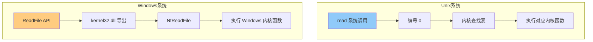
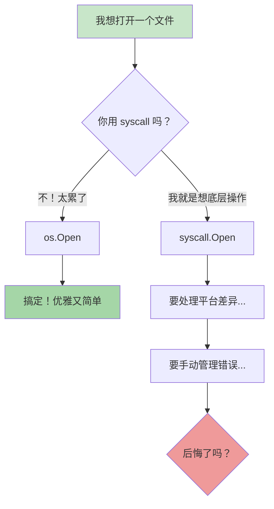
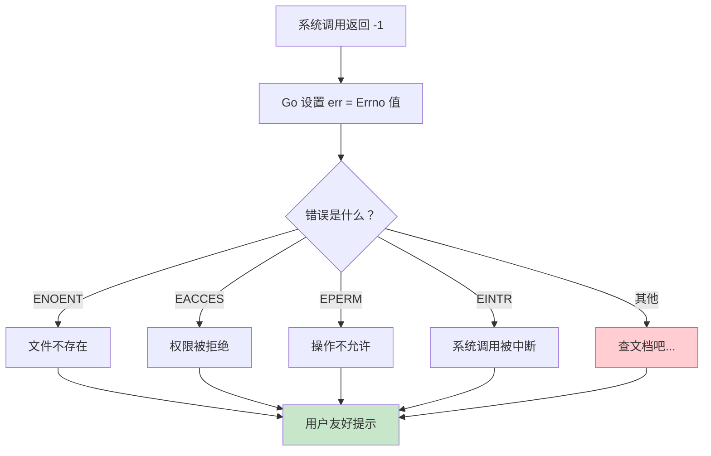
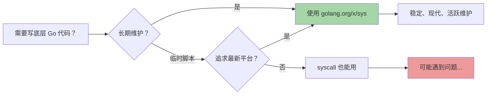

+++
title = "第 46 章：系统调用——syscall 包"
weight = 460
date = "2026-03-30T13:43:00+08:00"
type = "docs"
description = ""
isCJKLanguage = true
draft = false
+++
# 第 46 章：系统调用——syscall 包

> 想象一下，你正在对操作系统说"嘿，能帮我打开这个文件吗？"——syscall 包就是翻译官，把你的 Go 代码翻译成操作系统能听懂的语言。

## 46.1 syscall 包解决什么问题：提供操作系统底层系统调用的接口

`syscall` 包就像是 Go 语言与操作系统之间的"外交部发言人"。它提供了最底层的接口，让你的 Go 程序能够直接向操作系统发出请求。

### 问题来了：为什么需要 syscall？

在编程的世界里，大多数时候我们都在用高级抽象——打开文件用 `os.Open`，打印用 `fmt.Println`，创建线程用 `goroutine`。但总有些时刻，你需要直接跟操作系统对话：

- 你需要控制一个进程的运行环境
- 你需要绑定一个特殊的网络端口
- 你需要访问文件系统的一些底层属性
- 你需要在 Unix 系统上设置信号的处理器

这些时候，`syscall` 包就是你的瑞士军刀。

### 专业词汇解释

**系统调用（System Call）**：应用程序向操作系统内核请求服务的编程接口。你可以把它理解为操作系统提供给应用程序的"服务窗口"，比如打开文件、创建进程、读写网络数据等，都需要通过这个窗口来完成。

**内核空间 vs 用户空间**：操作系统内核运行在内核空间，应用程序运行在用户空间。系统调用就是用户空间程序访问内核服务的唯一合法通道——想象成外交官在机场过海关。

```go
package main

import (
    "fmt"
    "syscall"
)

func main() {
    // syscall.Getpid 返回当前进程的 PID
    // 这是一个直接的系统调用，不经过任何中间层
    pid := syscall.Getpid()
    fmt.Printf("当前进程的 PID 是: %d\n", pid)
    // 输出: 当前进程的 PID 是: 12345（这个数字每次运行都不同）

    // 再来一个：获取当前用户的 UID
    uid := syscall.Getuid()
    fmt.Printf("当前用户的 UID 是: %d\n", uid)
    // 输出: 当前用户的 UID 是: 1000
}
```

> 💡 小贴士：大多数情况下，你不需要直接使用 syscall。Go 的高级包（如 os、net、io）已经封装好了常用的系统调用。但当你需要做一些"骚操作"的时候，syscall 就是你的秘密武器。

---

## 46.2 syscall 核心原理：直接映射到操作系统调用

`syscall` 包的原理说白了就是四个字：**直接映射**。每一个 `syscall` 包中的函数，基本上都对应着操作系统内核提供的一个系统调用。

### 映射机制图解


### syscall 的三层结构

Go 的 syscall 设计可以分为三层：

| 层级 | 包/层 | 说明 |
|------|-------|------|
| 第一层 | `syscall` | 直接映射，Go 语言的零封装系统调用 |
| 第二层 | `os`, `net`, `io` | 基于 syscall 封装，提供友好的 API |
| 第三层 | `fmt`, `log`, `bufio` | 更高级的抽象，面向业务逻辑 |

### 一个简单的例子

```go
package main

import (
    "fmt"
    "syscall"
    "time"
)

func main() {
    // syscall.Nanosleep 是直接让进程睡眠的系统调用
    // 第一个参数是指向 timespec 结构体的指针
    // 第二个参数是用来存储剩余时间（如果你想被中断的话）
    req := syscall.Timespec{
        Sec:  1,        // 睡眠 1 秒
        Nsec: 500_000_000, // 加上 500 毫秒（500,000,000 纳秒）
    }

    fmt.Println("开始睡眠 1.5 秒...")
    start := time.Now()

    // 调用系统睡眠
    err := syscall.Nanosleep(&req, nil)
    if err != nil {
        fmt.Printf("睡眠被中断了: %v\n", err)
    }

    elapsed := time.Since(start)
    fmt.Printf("实际睡眠时间: %v\n", elapsed)
    // 输出: 开始睡眠 1.5 秒...
    // 输出: 实际睡眠时间: 1.5s
}
```

### 专业词汇解释

**零成本抽象**：Go 的 syscall 设计尽量做到了"你付的钱（运行时开销）就是你得到的（系统调用本身）"，没有额外的中间层开销。每一个 syscall 函数基本上就是一个汇编指令的包装。

**timespec 结构体**：这是一个表示时间的数据结构，在 Unix 系统中用于指定时间精度到纳秒。结构体包含 `Sec`（秒）和 `Nsec`（纳秒）两个字段。

---

## 46.3 syscall 的平台差异：Unix 和 Windows 的系统调用完全不同

这是一个悲伤的故事：Unix 和 Windows 从诞生那天起就走上了完全不同的道路，连系统调用都像是两种完全不同的语言。

### Unix vs Windows：系统调用大不同

| 特性 | Unix (Linux/macOS) | Windows |
|------|-------------------|---------|
| 系统调用编号 | 数字编号（如 read=0, write=1） | 函数名入口（如 NtWriteFile） |
| 调用方式 | 通过中断或 sysenter 进入内核 | 通过 DLL 导出函数 |
| 文件描述符 | int 类型的 fd | HANDLE 句柄 |
| 进程 ID | pid_t (int) | HANDLE (void*) |
| 错误处理 | 返回 -1，设置 errno | 返回错误码 |
| 生态 | POSIX 标准 | Win32 API |

### 平台差异的可视化



### 代码示例：跨平台需要注意

```go
package main

import (
    "fmt"
    "syscall"
)

func main() {
    // 在 Unix 上，这是一个文件描述符（int）
    // 在 Windows 上，这是一个句柄（HANDLE，本质是 void*）
    //
    // syscall.Stdout 是标准输出的文件描述符/句柄
    // Unix: 1
    // Windows: 0xFFFFFFFF（是个特殊的句柄值）

    fmt.Printf("Stdout 的值: %d\n", syscall.Stdout)
    fmt.Printf("Stderr 的值: %d\n", syscall.Stderr)
    fmt.Printf("Stdin 的值: %d\n", syscall.Stdin)
    // 在 Unix 上输出: Stdout=1, Stderr=2, Stdin=0
    // 在 Windows 上输出: 套接字或特殊句柄值
}
```

### 专业词汇解释

**POSIX**：Portable Operating System Interface，可移植操作系统接口。这是一套 IEEE 制定的标准，定义了 UNIX 操作系统应该如何工作。Linux 和 macOS 都遵循 POSIX 标准，所以它们的系统调用非常相似。

**文件描述符（File Descriptor）**：在 Unix 系统中，每个打开的文件、套接字、管道等都被分配一个整数标识符。0 是标准输入，1 是标准输出，2 是标准错误。

**句柄（Handle）**：在 Windows 中，句柄是一个抽象的引用，用于访问各种系统资源（文件、进程、窗口等）。它本质上是一个指针，但被操作系统隐藏了具体实现。

> ⚠️ 警告：syscall 包在不同平台上有不同的实现，所以写跨平台代码时要格外小心。Go 的 syscall 包会尝试统一这些差异，但总有一些情况需要你自己处理。

---

## 46.4 为什么通常不用 syscall：os 和 io 等高级包已封装了常见需求

既然 syscall 是"直接跟操作系统对话"，那为什么大多数 Go 程序员从不碰它？答案很简单：因为有人在前面替你做了所有脏活累活。

### 封装层级对比



### 对比一下：读文件的两种方式

```go
package main

import (
    "fmt"
    "io"
    "os"
    "syscall"
)

func main() {
    filename := "test.txt"

    // 方式一：os 包（推荐）
    // 简单、直观、自动处理常见错误
    fmt.Println("=== 使用 os 包 ===")
    file1, err := os.Open(filename)
    if err != nil {
        fmt.Printf("os.Open 出错了: %v\n", err)
    } else {
        data := make([]byte, 100)
        n, _ := file1.Read(data)
        fmt.Printf("读取了 %d 字节: %s\n", n, string(data[:n]))
        file1.Close()
    }

    // 方式二：syscall（不推荐，除非你有特殊需求）
    // 想象一下你要手动处理这些：
    fmt.Println("\n=== 使用 syscall ===")
    fmt.Println("你将面临以下问题：")
    fmt.Println("1. Unix 需要 O_RDONLY 标志，Windows 需要 GENERIC_READ")
    fmt.Println("2. 文件描述符是 int，Windows 句柄是 Handle")
    fmt.Println("3. read 的参数和返回值完全不同")
    fmt.Println("4. 要手动调用 close...")
    fmt.Println("5. 错误处理方式不同...")

    // Unix 上的 syscall.Open 示例（不可跨平台）
    fd, err := syscall.Open(filename, syscall.O_RDONLY, 0)
    if err != nil {
        fmt.Printf("syscall.Open 出错了: %v\n", err)
    } else {
        buf := make([]byte, 100)
        n, _, _ := syscall.Read(fd, buf)
        fmt.Printf("使用 syscall 读取了 %d 字节\n", n)
        syscall.Close(fd)
    }
}
```

### os 包 vs syscall：选择指南

| 场景 | 推荐使用 | 原因 |
|------|---------|------|
| 普通文件操作 | `os` | 跨平台，API 友好 |
| 网络编程 | `net` | 封装了 socket 的复杂性 |
| 读写数据 | `io` / `bufio` | 提供了缓冲和抽象 |
| 进程控制 | `os/exec` | 封装了跨平台进程创建 |
| 需要特殊权限/底层操作 | `syscall` | 没有其他选择时 |

### 专业词汇解释

**抽象泄漏（Leaky Abstraction）**：Joel Spolsky 提出的概念，意思是任何有效的抽象都会在一定程度上"泄漏"其底层的实现。当你在用高级 API 时，总会遇到一些它无法隐藏的底层细节。Go 的 os 包尽力隐藏了平台差异，但在某些边缘情况下，你还是需要知道 syscall 的存在。

**正交性（Orthogonality）**：好的 API 设计应该让各个功能相互独立（正交）。os 包的文件操作和网络操作是分开的，因为它们在底层确实是不同的系统调用。

> 💡 经验法则：先用高级包（os, net, io），遇到它们确实无法满足的需求时，再考虑 syscall。90% 的情况下，高级包已经足够了。

---

## 46.5 syscall.Syscall：最低层的系统调用入口

终于到了最底层！`syscall.Syscall` 就像是 syscall 包的"掌门人"，所有其他 syscall 函数（除了那些更特殊的）都基于它实现。

### Syscall 的函数签名

```go
func Syscall(trap, a1, a2, a3 uintptr) (r1, r2 uintptr, err Errno)
```

参数解释：
- `trap`：系统调用号，这是你想调用的系统函数的编号
- `a1, a2, a3`：三个参数，根据系统调用的不同而不同
- 返回值：r1, r2 是系统调用的返回值，err 是错误码

### 底层原理图


### 实际例子：自己实现一个 sleep

```go
package main

import (
    "fmt"
    "syscall"
    "time"
    "unsafe"
)

// 在 Linux x86-64 上：
// - syscall.SYS_NANOSLEEP 是 35
// - 使用 Syscall6 来传递 6 个参数（timespec 结构体有 2 个 64 位值）

func main() {
    fmt.Println("手动用 Syscall 实现 sleep 1 秒...")

    // timespec 结构体：tv_sec（秒）+ tv_nsec（纳秒）
    // [repr(C)]
    // struct timespec {
    //     time_t tv_sec;        /* seconds */
    //     long   tv_nsec;       /* nanoseconds */
    // }
    type timespec struct {
        Sec  int64
        Nsec int64
    }

    req := timespec{1, 0} // 睡眠 1 秒，0 纳秒

    start := time.Now()

    // syscall.Syscall6 的 6 个参数分别是：
    // 1. 系统调用号：syscall.SYS_NANOSLEEP
    // 2-4. 三个参数（这里传 req 和 nil）
    // 5-6. 额外参数（用于 6 参数系统调用）
    //
    // 在 Linux 上，nanosleep 只用 2 个参数，但 Syscall6 需要 6 个
    // 所以后四个参数传 0
    _, _, errno := syscall.Syscall6(
        uintptr(syscall.SYS_NANOSLEEP),
        uintptr(unsafe.Pointer(&req)),
        uintptr(0), // 第二个参数（unused for nanosleep）
        uintptr(0),
        uintptr(0),
        uintptr(0),
        uintptr(0),
    )

    if errno != 0 {
        fmt.Printf("出错了: %v\n", errno)
    }

    elapsed := time.Since(start)
    fmt.Printf("实际睡眠时间: %v\n", elapsed)
    // 输出: 手动用 Syscall 实现 sleep 1 秒...
    // 输出: 实际睡眠时间: 1s
}
```

### 专业词汇解释

**系统调用号（System Call Number）**：在 Unix 系统中，每个系统调用都有一个唯一的数字编号。当 CPU 执行 `syscall` 指令时，它会用这个编号去内核的查找表中找到对应的处理函数。可以把它想象成餐厅的桌号——你知道你想吃什么（系统调用），但你需要知道桌号（调用号）才能点菜。

**ABI（Application Binary Interface）**：应用二进制接口，定义了二进制层面如何调用函数，包括参数如何传递（寄存器还是栈）、返回值如何处理、寄存器如何保存等。Go 的 syscall 遵循操作系统的 ABI。

> ⚠️ 警告：直接使用 `Syscall` 是非常危险的！参数类型、调用号、返回值都跟硬件和操作系统紧密相关。任何错误都可能导致程序崩溃或安全漏洞。除非你是写标准库，否则请远离它。

---

## 46.6 syscall.Errno：系统调用错误类型

当系统调用失败时，Go 用 `syscall.Errno` 来表示错误。这是一个非常特殊的类型——它是 int 的别名，代表操作系统返回的错误码。

### Errno 的定义

```go
type Errno uintptr

// 一些常见的 Errno 值（Linux 下的值，不同操作系统可能不同）
const (
    EPERM   Errno = 1   // 操作不允许（权限不足）
    ENOENT  Errno = 2   // 文件不存在
    ESRCH   Errno = 3   // 没有此进程
    EINTR   Errno = 4   // 系统调用被中断
    EIO     Errno = 5   // I/O 错误
    ENXIO   Errno = 6   // 无此设备或地址
    E2BIG   Errno = 7   // 参数列表太长
    ENOEXEC Errno = 8   // 可执行文件格式错误
    EBADF   Errno = 9   // 坏文件描述符
    ECHILD  Errno = 10  // 没有子进程
    EAGAIN  Errno = 11  // 资源暂时不可用
    ENOMEM  Errno = 12  // 内存不足
    EACCES  Errno = 13  // 权限被拒绝
    EFAULT  Errno = 14  // 坏地址
    ENOTBLK Errno = 15  // 不是块设备
    EBUSY   Errno = 16  // 资源忙
    EEXIST  Errno = 17  // 文件已存在
    EXDEV   Errno = 18  // 跨设备链接
    ENODEV  Errno = 19  // 无此设备
    ENOTDIR Errno = 20  // 不是目录
    EISDIR  Errno = 21  // 是目录
    EINVAL  Errno = 22  // 无效参数
    ENFILE  Errno = 23  // 文件表溢出
    EMFILE  Errno = 24  // 打开文件过多
    ENOTTY  Errno = 25  // 不是打字机
    ETXTBSY Errno = 26  // 文本文件忙
    EFBIG   Errno = 27  // 文件太大
    ENOSPC  Errno = 28  // 设备无空间
    ESPIPE  Errno = 29  // 非法seek
    EROFS   Errno = 30  // 只读文件系统
    EMLINK  Errno = 31  // 链接太多
    EPIPE   Errno = 32  // 管道破裂
    EDOM    Errno = 33  // 数学参数超出函数域
    ERANGE  Errno = 34  // 数学结果无法表示
)
```

### Errno 的使用

```go
package main

import (
    "fmt"
    "syscall"
)

func main() {
    // 尝试打开一个不存在的文件
    filename := "不存在的文件_12345.txt"

    // 使用 Unix 的 open 系统调用
    fd, err := syscall.Open(filename, syscall.O_RDONLY, 0)

    if err != nil {
        // err 是一个 syscall.Errno
        fmt.Printf("打开文件失败！\n")
        fmt.Printf("错误类型: %T\n", err) // 输出: 错误类型: syscall.Errno
        fmt.Printf("错误值: %v\n", err)   // 输出: 错误值: no such file or directory

        // 检查是否是特定错误
        if err == syscall.ENOENT {
            fmt.Println("原因：文件不存在！")
        } else if err == syscall.EACCES {
            fmt.Println("原因：权限不足！")
        }

        // 你也可以把 Errno 当作数字使用
        fmt.Printf("原始错误码（数字）: %d\n", err.(syscall.Errno))
    } else {
        fmt.Printf("文件打开了，fd = %d\n", fd)
        syscall.Close(fd)
    }
}
```

### 错误码映射图



### 专业词汇解释

**Errno**：是"error number"的缩写。在 Unix 系统中，几乎每个系统调用失败时都会设置一个全局的 `errno` 变量，表示错误的类型。Go 的 `syscall.Errno` 就是这个概念的映射。ENOENT = "Error NO ENTry" = 条目不存在。

**错误包装**：`syscall.Errno` 实现了 `error` 接口，所以你可以直接用 `fmt.Println(err)` 打印它，会输出人类可读的错误信息（如 "no such file or directory"）。

### 常用 Errno 一览

| 常量 | Linux值 | 含义 |
|-----|-----|------|
| `syscall.EINVAL` | 22 | 无效参数 |
| `syscall.ENOENT` | 2 | 文件/目录不存在 |
| `syscall.EACCES` | 13 | 权限不足 |
| `syscall.EEXIST` | 17 | 文件已存在 |
| `syscall.EBADF` | 9 | 坏文件描述符 |
| `syscall.ENOMEM` | 12 | 内存不足 |
| `syscall.EPERM` | 1 | 操作不允许 |

---

## 46.7 golang.org/x/sys vs syscall：建议优先使用 x/sys

这是 Go 语言社区的"新旧交替"故事。老一代的 `syscall` 包渐渐退役，取而代之的是更现代的 `golang.org/x/sys`。

### 为什么 x/sys 更好？

| 特性 | syscall | golang.org/x/sys |
|------|---------|------------------|
| 维护状态 | 已冻结（Go 1 之后不再更新） | 活跃维护 |
| 平台支持 | 所有平台 | 所有平台 + 新增平台 |
| API 稳定性 | 可能改变 | 承诺稳定 |
| 文档 | 较少 | 完整 |
| 新功能 | 无 | 持续添加 |

### 迁移指南

```go
package main

import (
    "fmt"
    // 旧方式（不推荐）
    // "syscall"

    // 新方式（推荐）
    "golang.org/x/sys/windows"
)

func main() {
    // 在 Windows 上获取当前进程 ID
    pid := windows.GetCurrentProcessId()
    fmt.Printf("当前进程 ID: %d\n", pid)

    // 获取当前线程 ID
    tid := windows.GetCurrentThreadId()
    fmt.Printf("当前线程 ID: %d\n", tid)
}
```

### Unix vs Windows API 统一示例

```go
package main

import (
    "fmt"
    "golang.org/x/sys/unix"
)

func main() {
    // golang.org/x/sys/unix 提供了跨平台的统一接口

    // 获取主机名
    hostname := make([]byte, 64)
    err := unix.Gethostname(hostname)
    if err != nil {
        fmt.Printf("获取主机名失败: %v\n", err)
    } else {
        // 找到实际的 hostname 结尾
        for i, b := range hostname {
            if b == 0 {
                hostname = hostname[:i]
                break
            }
        }
        fmt.Printf("主机名: %s\n", string(hostname))
    }

    // Unix 系统上，获取进程 ID
    fmt.Printf("PID: %d\n", unix.Getpid())
    fmt.Printf("UID: %d\n", unix.Getuid())
}
```

### x/sys vs syscall：选择指南



### 专业词汇解释

**golang.org/x/sys**：这是 Go 的扩展（experimental）包仓库，"x" 代表 experimental。跟标准库一样在 GitHub 上管理，但由 Go 团队维护。它被认为是"准标准库"，API 稳定性有保障。

**syscall 冻结**：从 Go 1.4 左右开始，`syscall` 包被标记为"冻结"，意味着它不会有新的 API 添加，但会修复 bug。新的系统调用支持都在 `golang.org/x/sys` 中实现。

> 💡 强烈建议：新项目直接使用 `golang.org/x/sys/unix` 或 `golang.org/x/sys/windows`，不要用 `syscall`。如果你看到老代码用了 `syscall`，可以考虑帮它"升级"一下。

---

## 本章小结

本章我们深入探索了 Go 语言的 `syscall` 包，这是 Go 程序与操作系统内核对话的桥梁。回顾一下要点：

### 核心概念

- **syscall 包**是 Go 提供的底层系统调用接口，让你能直接向操作系统发出请求
- **系统调用**是应用程序访问内核服务的唯一通道，如打开文件、创建进程、读写网络数据
- **直接映射**意味着 syscall 函数基本上一对一对应操作系统的系统调用

### 平台差异

- Unix 和 Windows 的系统调用完全不同：Unix 用数字编号和文件描述符，Windows 用 DLL 导出函数和句柄
- 跨平台代码中使用 syscall 需要格外小心，因为很多底层细节不同

### 为什么不常用

- `os`、`net`、`io` 等高级包已经封装了 90% 的常见需求
- 这些高级包提供了更好的跨平台支持和更友好的 API
- syscall 直接使用容易出错，除非有特殊需求否则不推荐

### 关键函数

- **syscall.Syscall / Syscall3 / Syscall6**：最低层的系统调用入口
  - Syscall：用于 0-5 个参数的系统调用
  - Syscall3：专门用于 3 个参数的系统调用（参数较多时的便捷封装）
  - Syscall6：用于 6 个参数的系统调用（x86-64 Linux 的标准入口）
- **syscall.Errno**：系统调用错误的类型，实现了 error 接口
- **golang.org/x/sys**：推荐使用的现代替代品，活跃维护且 API 稳定

### 实践建议

1. **优先使用高级包**：`os`/`net`/`io`/`bufio` 能满足大部分需求
2. **只有必要时才用 syscall**：当你需要标准库不支持的特殊功能时
3. **选择 x/sys**：新代码使用 `golang.org/x/sys/unix` 或 `golang.org/x/sys/windows`
4. **理解错误处理**：syscall.Errno 提供了操作系统级别的错误码

> 🎓 最后的忠告：syscall 是 Go 世界的"梯子"——大多数人不需要爬到这么高，但当你真的需要的时候，它就在那里。知道它的存在和原理，比实际使用它更重要。
