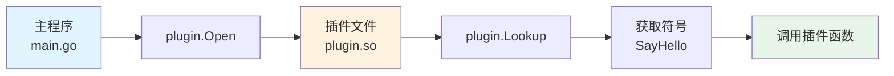
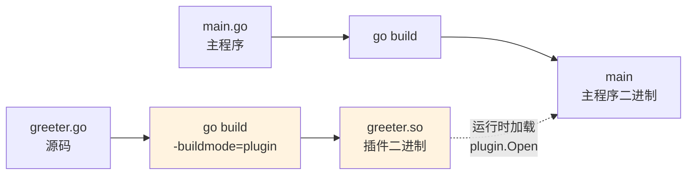
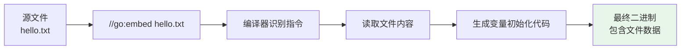
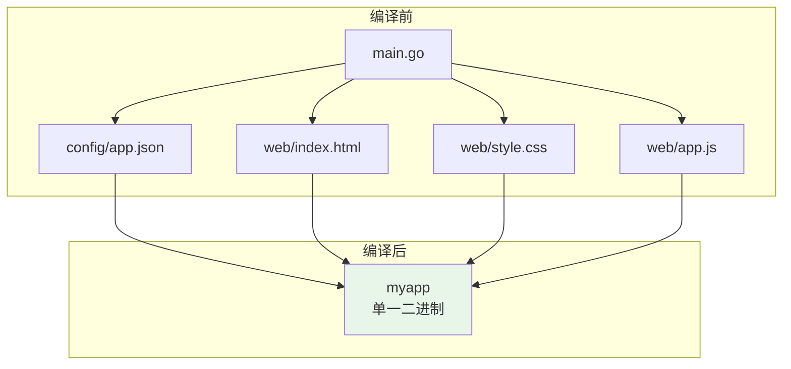

+++
title = "第 47 章：插件与 CGO"
weight = 470
date = "2026-03-30T13:43:00+08:00"
type = "docs"
description = ""
isCJKLanguage = true
draft = false
+++
# 第 47 章：插件与 CGO

> "程序写完就固定了？不，我们可以让它在运行时还能加载新代码——这就是插件的魔法。"
>
> "什么？你想把配置文件直接塞进二进制里？embed 说：我全都要。"

---

## 47.1 plugin 包解决什么问题：程序运行时要动态加载代码

你有没有想过，程序发布之后，还能往里面塞新功能？传统 Go 程序编译后就定型了，但 plugin 包说："不，我可以热插拔！"

**痛点场景：** 想象你写了一个插件系统，用户不需要重新编译主程序，只需要丢一个 `.so`（Linux）或 `.dll`（Windows）文件进去，你的程序就能解锁新技能。就像给相机换镜头——不用换相机本身。

**核心概念：** Go 的 `plugin` 包提供了一种机制，让程序在运行时动态加载编译好的插件（本质上是编译为标准插件格式的 Go 代码），并调用其中暴露的函数和变量。

```go
// plugin 包的核心能力
// 1. 动态加载编译好的插件（.so 或 .dll 文件）
// 2. 运行时解析符号（函数、变量）
// 3. 调用插件中暴露的接口
```



**专业词汇解释：**

- **插件（Plugin）**：一种可动态加载的代码模块，在运行时被主程序发现和使用，而无需重新编译主程序。
- **动态加载（Dynamic Loading）**：程序运行时将代码模块加载到内存的过程，与静态编译相对。
- **符号（Symbol）**：编译后的二进制文件中函数或变量的名字，运行时通过符号名来查找和调用。
- **热插拔（Hot Swapping）**：系统运行时替换或添加组件的能力，无需停止系统。

**注意事项：** 插件功能目前**仅支持 Linux/macOS/BSD** 等 Unix 系统（`.so` 后缀）以及 **Windows**（`.dll` 后缀）。在 Windows 上编译插件需要 GCC（如 MinGW）。而且**Go 版本必须完全一致**，否则会炸给你看。

---

## 47.2 plugin 核心原理：运行时符号解析，Lookup 通过名称找到插件中的变量或函数

plugin 包的精髓在于**符号解析**。当你用 `go build -buildmode=plugin` 编译一个插件时，Go 编译器会生成一个包含符号表的二进制文件。运行时，`plugin.Lookup` 就像一个雷达，通过符号名"扫"出对应的函数或变量。

**原理图：**

```mermaid
flowchart TB
    subgraph 插件二进制 ["插件 binary（.so/.dll）"]
        S1["Symbol: SayHello<br/>地址: 0x7f8a2b1c"]
        S2["Symbol: Version<br/>地址: 0x7f8a2b1d"]
    end
    subgraph 主程序 ["主程序"]
        L["Lookup&#40;\"SayHello\"&#41;"] --> R["解析符号表"]
        R --> A["找到地址 0x7f8a2b1c"]
        A --> C["类型断言为 func()"]
        C --> Call["调用函数"]
    end
```

**符号解析流程：**

1. 编译器把每个导出的函数/变量及其地址记录在符号表中
2. 运行时通过 `dlopen`（Unix）或 `LoadLibrary`（Windows）加载插件
3. 通过符号名查找对应地址
4. 将地址类型断言为正确的函数/变量类型后调用

**为什么需要 Lookup？** 直接导出函数地址不就好了？因为编译器优化可能导致地址变化，而且 `Lookup` 提供了统一的接口，通过**字符串名字**找符号，灵活又安全。

---

## 47.3 plugin.Open：加载插件，.so（Unix）或 .dll（Windows）

`plugin.Open` 是插件系统的入口，它负责把插件文件加载进内存，就像给汽车通电一样。

**函数签名：**

```go
func Open(path string) (*Plugin, error)
```

**参数说明：**

- `path`：插件文件的路径，可以是相对路径或绝对路径
- 返回值：`*Plugin` 实例，后续用它来查找符号

**Windows vs Unix 差异：**

| 系统 | 插件后缀 | 加载方式 | 依赖 |
|------|---------|---------|------|
| Linux/macOS | `.so` | `dlopen` | 无额外依赖 |
| Windows | `.dll` | `LoadLibrary` | 需要 GCC（MinGW） |

**示例代码：**

```go
package main

import (
	"fmt"
	"plugin"
)

func main() {
	// 加载插件文件
	// 不同系统后缀不同：
	// - Linux/macOS: "./myplugin.so"
	// - Windows:     "./myplugin.dll"
	p, err := plugin.Open("./hello.so")
	if err != nil {
		fmt.Printf("插件加载失败: %v\n", err)
		return
	}
	fmt.Printf("插件加载成功: %+v\n", p)
}
```

```go
// 编译插件: go build -buildmode=plugin -o hello.so hello.go
// 运行主程序时会输出类似：
// 插件加载成功: &{name:./hello.so plugin_path:...}
```

**常见错误：**

```go
// 错误1: 文件路径不存在
_, err := plugin.Open("./notexist.so")
// 错误: plugin.Open: ./notexist.so: plugin.Open: could not open
//       ./notexist.so: The system cannot find the file specified.

// 错误2: Go 版本不匹配
// 错误: plugin.Open: ./old_plugin.so: plugin was built with
//       Go version go1.20.0 and the program expects go1.21.0
```

> 💡 **小贴士：** 路径可以是相对路径（相对于当前工作目录）或绝对路径。建议使用绝对路径避免"去哪儿了"的困惑。

---

## 47.4 plugin.Lookup：查找符号

加载插件后，下一步就是用 `Lookup` 在插件的符号表里找到你需要的函数或变量。就像在图书馆的索引柜里翻卡片一样。

**函数签名：**

```go
func (p *Plugin) Lookup(symName string) (Symbol, error)
```

**参数说明：**

- `symName`：符号名称，注意必须是**插件中导出的（首字母大写）**名称
- 返回值：`any` 类型，需要类型断言后使用

**示例代码：**

```go
package main

import (
	"fmt"
	"plugin"
)

func main() {
	p, err := plugin.Open("./hello.so")
	if err != nil {
		panic(err)
	}

	// 查找名为 "Greet" 的符号
	sym, err := p.Lookup("Greet")
	if err != nil {
		fmt.Printf("没找到 Greet 符号: %v\n", err)
		return
	}

	// sym 是 any 类型，需要断言成具体类型才能用
	// 假设 Greet 是一个 func() string
	greetFunc, ok := sym.(func() string)
	if !ok {
		fmt.Println("符号类型不对，吓死我了！")
		return
	}

	// 调用插件函数
	fmt.Println(greetFunc())
}
```

```go
// 假设 hello.so 中定义了:
// var Greet = func() string { return "Hello from plugin!" }
//
// 运行结果:
// Hello from plugin!
```

**查找变量 vs 查找函数：**

```go
// 查找变量
sym, _ := p.Lookup("Version")
version := sym.(string) // 断言为 string 类型
fmt.Println("插件版本:", version)

// 查找函数
sym, _ := p.Lookup("DoSomething")
doFunc := sym.(func(int) int) // 断言为函数类型
result := doFunc(42)
fmt.Println("计算结果:", result)
```

> 🎯 **技巧：** 如果你想查找多个符号，多次调用 `Lookup` 即可。但注意**每次 Lookup 都有开销**，如果频繁调用，考虑缓存结果。

---

## 47.5 plugin.Symbol：获取符号

`plugin.Symbol` 是 `Lookup` 返回的**符号类型**的本质——它只是一个 `any` 的别名。

```go
// 源码定义
type Symbol any
```

所以 `Lookup` 返回的就是 `Symbol`，你拿到后必须**类型断言**才能使用。这有点像是开盲盒——你知道里面大概是什么，但得亲手打开才知道。

**类型断言的艺术：**

```go
package main

import (
	"fmt"
	"plugin"
)

// 先定义好接口，插件必须实现
type Greeter interface {
	Greet() string
}

func main() {
	p, err := plugin.Open("./greeter.so")
	if err != nil {
		panic(err)
	}

	// 查找符号
	sym, err := p.Lookup("Greeter")
	if err != nil {
		panic(err)
	}

	// 方法1: 直接断言为函数
	if fn, ok := sym.(func() string); ok {
		fmt.Println("直接函数:", fn())
	}

	// 方法2: 断言为接口（更优雅）
	// 注意：插件变量类型需要实现接口才行
	if g, ok := sym.(Greeter); ok {
		fmt.Println("接口方式:", g.Greet())
	}

	// 方法3: 如果插件暴露的是结构体实例
	typeStr, _ := p.Lookup("GreeterImpl")
	if impl, ok := typeStr.(Greeter); ok {
		fmt.Println("结构体实例:", impl.Greet())
	}
}
```

**安全类型断言技巧：**

```go
// 使用 ok idiom 避免 panic
sym, err := p.Lookup("MayNotExist")
if err != nil {
	// 符号不存在是正常的，不是错误
	fmt.Println("这个符号不存在:", err)
} else {
	// 存在才断言
	if fn, ok := sym.(func()); ok {
		fn()
	}
}

// 使用 switch 做多类型分支
switch v := sym.(type) {
case func():
	v()
case string:
	fmt.Println("字符串:", v)
case int:
	fmt.Println("数字:", v)
default:
	fmt.Printf("未知的类型: %T\n", v)
}
```

---

## 47.6 go build -buildmode=plugin：构建插件

光有源码不行，还得编译成插件格式。`go build` 的 `-buildmode=plugin` 就是那把钥匙。

**命令格式：**

```bash
# 编译插件（注意是 .go 文件，不是 .so）
go build -buildmode=plugin -o output_name.so source.go

# 示例
go build -buildmode=plugin -o greeter.so greeter.go
```

**⚠️ 重要限制：**

1. **只能编译主包（package main）的文件**
2. **不能有 `main` 函数**
3. **Go 版本必须与加载插件的主程序完全一致**
4. **不能交叉编译**（不能在一个平台上编译另一个平台的插件）

**完整示例：**

```go
// greeter.go - 这是插件源码
package main

import "fmt"

// 导出的函数
func Greet() string {
	return "你好，来自插件的问候！🎉"
}

// 导出的变量
var Version = "1.0.0"

// 导出的结构体（需要先实例化）
type Greeter struct{}

func (g Greeter) Greet() string {
	return "Hello from struct!"
}

var GreeterImpl = Greeter{}
```

```bash
# 编译插件
# Linux/macOS
$ go build -buildmode=plugin -o greeter.so greeter.go

# Windows (需要 MinGW)
# go build -buildmode=plugin -o greeter.dll greeter.go
```

```go
// main.go - 这是主程序
package main

import (
	"fmt"
	"plugin"
)

func main() {
	// 加载插件
	p, err := plugin.Open("./greeter.so")
	if err != nil {
		panic(err)
	}

	// 查找并调用函数
	sym, _ := p.Lookup("Greet")
	greet := sym.(func() string)
	fmt.Println(greet())

	// 查找变量
	sym, _ = p.Lookup("Version")
	fmt.Println("版本:", sym)

	// 查找结构体实例
	sym, _ = p.Lookup("GreeterImpl")
	g := sym.(struct{ Greet func() string })
	fmt.Println(g.Greet())
}
```

```bash
# 运行主程序
$ go run main.go
# 你好，来自插件的问候！🎉
# 版本: 1.0.0
# Hello from struct!
```

**mermaid 图解编译流程：**



---

## 47.7 插件的使用场景与限制：Go 版本必须匹配

插件看起来很美，但并非银弹。了解它的场景和限制，才能用得恰到好处。

### 使用场景

| 场景 | 说明 | 示例 |
|------|------|------|
| **插件化架构** | 允许第三方扩展功能 | VSCode 插件、IDE 扩展 |
| **模块热更新** | 无需重启更新业务逻辑 | 游戏外挂、监控插件 |
| **插件式工具** | 命令行工具的插件系统 | kubectl 插件、git 插件 |
| **多版本共存** | 同时加载不同版本同一模块 | 兼容旧版 API |

### 致命限制

> ⚠️ **Go 版本必须完全匹配！**
>
> 这是插件系统最大的坑。主程序和插件必须使用**完全相同**的 Go 版本编译，否则会报错：
>
> ```
> plugin.Open: ./xxx.so: plugin was built with Go version go1.21.0
> and the program expects go1.22.0
> ```

**其他限制：**

```go
// 限制1: 无法在插件中使用 CGO
// plugin.go 包含 #cgo 指令？
// 报错: cannot use plugin build mode with cgo

// 限制2: 无法交叉编译
// 在 macOS 上无法编译 Linux 插件
// go build -buildmode=plugin GOOS=linux GOARCH=amd64 ...
// 报错: cannot use plugin build mode with cgo

// 限制3: 插件只能导出 Go 符号
// 不能导出 C 函数（除非通过 cgo，但 cgo 本身又不支持插件模式）
```

### 为什么有这些限制？

Go 插件依赖 Go 运行时（runtime）的类型系统和垃圾回收。跨版本或不兼容的运行时会导致类型布局不一致，调用会直接 crash。

**实用建议：**

```go
// 如果你需要更自由的插件系统，考虑：
// 1. gRPC/HTTP 服务 - 插件是独立进程，通过网络通信
// 2. Wasm（WebAssembly）- 使用 go:wasmimport
// 3. 动态链接库（.dll/.so）但用 cgo 调用 - 但这需要 C 代码做桥梁
```

---

## 47.8 embed 包解决什么问题：把文件打包进二进制

有没有想过，把 `config.json`、`index.html`、`certificate.crt` 这些文件**直接编译进 Go 程序**？这样发布时只需要一个二进制文件，不用担心文件丢失或路径错误。

Go 1.16 引入了 `embed` 包，专门解决这个痛点。

**痛点场景：**

```go
// 以前读取配置文件的"苦逼"方式
func loadConfig() ([]byte, error) {
	// 路径是相对当前工作目录的！
	// 换个目录运行就爆炸
	return os.ReadFile("./config/config.json")
}
```

**embed 的解决方案：**

```go
// 只需一行，文件在编译时就打包进去了
import _ "embed"

//go:embed config.json
var configData []byte

// 现在 configData 就是 config.json 的内容！
fmt.Println(string(configData))
```

**嵌入式资源的特点：**

- 文件在**编译时**被嵌入，而不是运行时读取
- 最终二进制文件包含所有资源，**单文件分发**
- 不用担心文件路径、权限、丢失等问题
- 适合部署到 Docker、Kubernetes 等环境

---

## 47.9 embed 核心原理：//go:embed 指令，编译时把文件内容嵌入

`embed` 的核心是 `//go:embed` 指令，这是 Go 编译器认识的特殊注释。

**工作原理：**



**编译器内部做了什么：**

```go
// 你写的代码:
import _ "embed"

//go:embed hello.txt
var greeting string

// 编译器生成的等价代码（伪代码）:
var greeting string = "\u0048\u0065\u006c\u006c\u006f\u0020\u0057\u006f\u0072\u006c\u0064\u0021"
```

**关键点：**

1. `//go:embed` 必须在**变量声明前**且**紧挨着**
2. 编译器指令不会运行，只在编译时生效
3. 文件路径相对于**源文件所在目录**（不是工作目录）
4. 路径支持**通配符**和**目录**

---

## 47.10 //go:embed 指令：编译时嵌入文件内容

`//go:embed` 有多种用法，满足不同场景需求。

**基础用法：**

```go
import _ "embed"

// 嵌入单个文件内容为字符串
//go:embed hello.txt
var greeting string

// 嵌入单个文件内容为字节切片
//go:embed image.png
var imageData []byte
```

**嵌入多个文件（使用空格分隔）：**

```go
//go:embed config.json version.txt
var config string
var version string

// 编译器按顺序赋值
// config = contents of config.json
// version = contents of version.txt
```

**使用通配符：**

```go
// 嵌入 templates 目录下所有 .html 文件
//go:embed templates/*.html
var templates map[string]string

// 嵌入 static 目录下所有文件
//go:embed static/*
var staticAssets embed.FS

// 嵌入所有 .md 文件（递归）
//go:embed docs/...
var docs embed.FS
```

**忽略文件：**

```go
//go:embed assets/*
//go:ignore *.tmp  // 这不是合法语法，只是说明可以忽略
```

**完整示例：**

```go
package main

import (
	"embed"
	"fmt"
	"io/fs"
	"os"
)

//go:embed version.txt
var version string

//go:embed config.json
var configJSON []byte

//go:embed templates/*.html
var templates embed.FS

//go:embed static
var staticFiles embed.FS

func main() {
	fmt.Println("=== 基础类型 ===")
	fmt.Printf("版本: %s\n", version)
	fmt.Printf("配置: %s\n", string(configJSON))

	fmt.Println("\n=== 模板文件 ===")
	entries, _ := templates.ReadDir("templates")
	for _, entry := range entries {
		content, _ := templates.ReadFile("templates/" + entry.Name())
		fmt.Printf("- %s: %d bytes\n", entry.Name(), len(content))
	}

	fmt.Println("\n=== 静态文件 ===")
	fs.WalkDir(staticFiles, ".", func(path string, d fs.DirEntry, err error) error {
		if !d.IsDir() {
			fmt.Printf("- %s\n", path)
		}
		return nil
	})
}
```

```bash
# 目录结构
# .
# ├── main.go
# ├── version.txt      # 内容: "1.2.3"
# ├── config.json     # 内容: {"host": "localhost"}
# ├── templates/
# │   ├── header.html
# │   └── footer.html
# └── static/
#     ├── style.css
#     └── app.js

# 编译运行
$ go build -o app main.go
$ ./app
# === 基础类型 ===
# 版本: 1.2.3
# 配置: {"host": "localhost"}
#
# === 模板文件 ===
# - header.html: 45 bytes
# - footer.html: 32 bytes
#
# === 静态文件 ===
# - static/style.css
# - static/app.js
```

---

## 47.11 embed.FS：文件系统接口，像操作普通 FS 一样操作嵌入的文件

`embed.FS` 是 Go 1.16 引入的 `io/fs.FS` 实现，让你把嵌入的文件系统当成普通文件系统操作。

**为什么用 FS？**

```go
// 普通文件系统
os.Open("config.json")

// 嵌入的文件系统（用法几乎一样！）
f, err := templates.Open("header.html")
```

**FS 接口定义（简化）：**

```go
type FS interface {
	Open(name string) (File, error)
}

// embed.FS 实现了 io/fs.FS，所以可以用标准库的 fs 包操作
```

**常用操作：**

```go
package main

import (
	"embed"
	"fmt"
	"io/fs"
	"os"
)

//go:embed docs/*
var docs embed.FS

func main() {
	// 读取单个文件
	content, err := docs.ReadFile("docs/README.md")
	if err != nil {
		fmt.Println("读取失败:", err)
	} else {
		fmt.Println("README 内容:", string(content))
	}

	// 使用 Open 方法（像 os.Open 一样）
	f, err := docs.Open("docs/guide.txt")
	if err != nil {
		panic(err)
	}
	defer f.Close()

	// 获取文件信息
	info, _ := f.Stat()
	fmt.Printf("文件: %s, 大小: %d bytes\n", info.Name(), info.Size())

	// 遍历目录（使用 fs.WalkDir）
	fmt.Println("\n所有文档:")
	fs.WalkDir(docs, "docs", func(path string, d fs.DirEntry, err error) error {
		if err != nil {
			return err
		}
		if !d.IsDir() {
			fmt.Printf("  - %s\n", path)
		}
		return nil
	})

	// 安全地打开子目录（Sub 方法）
	sub, _ := docs.Sub(docs)
	f2, _ := sub.Open("docs/README.md")
	defer f2.Close()
}
```

```go
// 假设 docs 目录下有 README.md 和 guide.txt
// 运行结果:
// README 内容: 这是嵌入的 README 文件
// 文件: guide.txt, 大小: 128 bytes
//
// 所有文档:
//   - docs/README.md
//   - docs/guide.txt
```

**与标准库完美配合：**

```go
import (
	"embed"
	"text/template"
	"path/filepath"
)

//go:embed templates
var templateFS embed.FS

func parseTemplates() (*template.Template, error) {
	// 使用 template.ParseFS 直接解析 embed.FS
	return template.ParseFS(templateFS, "templates/*.html")
}

// 也可以解析特定文件
tmpl, _ := template.ParseFS(docs, "docs/*.md", "docs/*.txt")
```

---

## 47.12 embed.Dir：嵌入整个目录

`//go:embed` 还可以直接嵌入整个目录，把目录下的所有文件都打包进去。

**基本用法：**

```go
//go:embed static
var staticFiles embed.FS

// 这会把 static 目录下所有文件都嵌入
// 包括子目录！
```

**嵌入多个目录：**

```go
//go:embed public templates
var assets embed.FS

// 访问 public/logo.png
// 访问 templates/index.html
```

**与 .gitignore 类似的行为：**

```go
//go:embed public/*
var public embed.FS

// 默认会忽略以下文件（类似 .gitignore）：
// - 以 . 开头的文件（隐藏文件）
// - 以 _ 开头的文件名
// - 名为 .git 的目录
```

**实战：构建单文件 Web 服务器：**

```go
package main

import (
	"embed"
	"html/template"
	"io/fs"
	"log"
	"net/http"
)

//go:embed public templates
var content embed.FS

//go:embed public
var publicDir embed.FS

func main() {
	// 提供静态文件服务
	fs := http.FS(publicDir)
	http.Handle("/static/", http.StripPrefix("/static/", fs))

	// 提供 HTML 模板
	tmpl, _ := template.ParseFS(content, "templates/*.html")

	http.HandleFunc("/", func(w http.ResponseWriter, r *http.Request) {
		tmpl.ExecuteTemplate(w, "index.html", nil)
	})

	log.Println("服务器启动: http://localhost:8080")
	log.Fatal(http.ListenAndServe(":8080", nil))
}
```

```bash
# 目录结构
# .
# ├── main.go
# ├── public/
# │   ├── css/style.css
# │   └── js/app.js
# └── templates/
#     └── index.html

# 编译后只有一个二进制文件
$ go build -o webserver main.go
$ ./webserver
# 服务器启动: http://localhost:8080
# 静态文件也打包在里面了！
```

---

## 47.13 实战：嵌入配置文件、前端资源到二进制

光说不练假把式，来个实际项目：用 embed 把配置文件和前端资源打包进二进制。

**项目结构：**

```
myapp/
├── main.go
├── config/
│   ├── app.json
│   └── db.yaml
├── web/
│   ├── index.html
│   ├── style.css
│   └── app.js
└── generate_cert.sh
```

**配置文件的嵌入：**

```go
// config/config.go
package config

import (
	_ "embed"
	"encoding/json"
	"fmt"
)

//go:embed app.json
var appConfigJSON []byte

//go:embed db.yaml
var dbConfigYAML []byte

// AppConfig App 配置结构体
type AppConfig struct {
	Port    int    `json:"port"`
	Host    string `json:"host"`
	Debug   bool   `json:"debug"`
}

// LoadAppConfig 加载应用配置
func LoadAppConfig() (*AppConfig, error) {
	var cfg AppConfig
	if err := json.Unmarshal(appConfigJSON, &cfg); err != nil {
		return nil, fmt.Errorf("解析 app.json 失败: %w", err)
	}
	return &cfg, nil
}

// DBConfig 数据库配置（YAML 部分可自行用 yaml 库解析）
func LoadDBConfig() ([]byte, error) {
	return dbConfigYAML, nil
}
```

```json
// config/app.json
{
	"port": 8080,
	"host": "0.0.0.0",
	"debug": true
}
```

```yaml
# config/db.yaml
database:
  host: localhost
  port: 5432
  user: postgres
  password: secret
  name: myapp
```

**前端资源的嵌入：**

```go
// web/assets.go
package web

import (
	"embed"
	"io/fs"
	"net/http"
)

//go:embed index.html style.css app.js
var assets embed.FS

// 获取前端资源FS，可用于 http.FileServer
func Assets() fs.FS {
	return assets
}

// GetAsset 读取单个资源
func GetAsset(name string) ([]byte, error) {
	return assets.ReadFile(name)
}
```

```html
<!-- web/index.html -->
<!DOCTYPE html>
<html lang="zh-CN">
<head>
    <meta charset="UTF-8">
    <meta name="viewport" content="width=device-width, initial-scale=1.0">
    <title>我的全栈应用</title>
    <link rel="stylesheet" href="/static/style.css">
</head>
<body>
    <h1>🎉 欢迎使用嵌入式 Web 应用！</h1>
    <p>配置文件和前端资源都打包在二进制里了。</p>
    <div id="app"></div>
    <script src="/static/app.js"></script>
</body>
</html>
```

**主程序整合：**

```go
// main.go
package main

import (
	"fmt"
	"log"
	"net/http"
	"strings"
	"myapp/config"
	"myapp/web"
)

func main() {
	// 1. 加载配置
	cfg, err := config.LoadAppConfig()
	if err != nil {
		log.Fatalf("配置加载失败: %v", err)
	}
	fmt.Printf("✅ 配置加载成功: %+v\n", cfg)

	// 2. 启动静态文件服务
	assets := web.Assets()
	fs := http.FS(assets)

	// 注意：嵌入的文件没有目录前缀，直接是文件名
	http.Handle("/static/", http.StripPrefix("/static/", fs))

	// 3. 直接服务根目录（需要处理路径）
	http.HandleFunc("/", func(w http.ResponseWriter, r *http.Request) {
		path := r.URL.Path
		if path == "/" {
			path = "/index.html"
		}
		path = strings.TrimPrefix(path, "/")

		data, err := assets.ReadFile(path)
		if err != nil {
			http.NotFound(w, r)
			return
		}
		w.Write(data)
	})

	// 4. 启动服务器
	addr := fmt.Sprintf("%s:%d", cfg.Host, cfg.Port)
	fmt.Printf("🚀 服务器启动: http://%s\n", addr)
	log.Fatal(http.ListenAndServe(addr, nil))
}
```

```bash
# 编译
$ go build -o myapp .

# 运行
$ ./myapp
# ✅ 配置加载成功: &{Port:8080 Host:0.0.0.0 Debug:true}
# 🚀 服务器启动: http://0.0.0.0:8080

# 访问 http://localhost:8080 即可看到页面
# 不需要单独的 index.html 文件了！
```

**最终效果：**



---

## 47.14 runtime/cgo：cgo 运行时支持

`runtime/cgo` 是 Go 运行时和 C 代码之间的"外交官"，负责管理 Go 和 C 之间的边界。

**为什么需要 runtime/cgo？**

```go
import "C"

// 这行代码背后发生了什么？
// 1. 编译器生成 C 代码骨架
// 2. cgo 预处理，识别 C.xxx 调用
// 3. 运行时创建 goroutine 用于 C 代码回调
// 4. 内存管理：C 和 Go 共享的内存需要特殊处理
```

**runtime/cgo 的职责：**

| 职责 | 说明 |
|------|------|
| **线程管理** | 跟踪进入 C 代码的线程，维护 C 调用栈 |
| **内存安全** | Go 传指针给 C 时，保证指针指向的数据不被 GC 移动 |
| **回调处理** | C 调用 Go 函数时，创建新的 goroutine 处理 |
| **符号解析** | 运行时解析 C 库函数地址 |

**当你使用 cgo 时，runtime/cgo 做了什么：**

```go
package main

/*
#include <stdio.h>

static void greet() {
    printf("Hello from C!\n");
}
*/
import "C"

func main() {
	// 编译时，cgo 会：
	// 1. 调用 runtime/cgo.initt() 初始化
	// 2. 在进入 C.greet() 前，runtime/cgo 准备 C 栈
	// 3. 调用完成后，恢复 Go 栈和调度
	C.greet()
}
```

**与 Go 1.20+ 的变化：**

Go 1.20 开始，`runtime/cgo` 的处理方式有所改进，特别是对于回调函数的处理更加高效。


**安全提醒：**

```go
// ⚠️ 指针传递的安全规则
var data = []byte("hello")

// 安全：Go 指针传给 C 后，在 C 执行期间 Go GC 不会移动这块内存
C.process(&data[0], C.int(len(data)))

// 不安全：传递指针给 Go 运行时管理的对象时要小心
// 确保 C 代码不会存储这个指针供后续使用
```

---

## 47.15 cgo.Handle：Go 和 C 之间的 Handle

`runtime/cgo.Handle` 是一种在 Go 和 C 之间安全传递"句柄"（Handle）的机制。Handle 本质上是一个整数 ID，映射到 Go 堆上的对象，C 代码只需要知道这个 ID，调用时 Go 运行时再解析到实际对象。

**为什么需要 Handle？**

```go
// 直接传指针的问题：
var obj = MyObject{...}

// 传给 C 后：
// 1. C 可能存储了指针
// 2. Go GC 发现 obj 不再被 Go 代码引用
// 3. GC 回收 obj，指针变成悬空指针！💥

// 使用 Handle：
// C 拿到的是整数 ID，不是指针
// Go GC 只看到 Handle 还在引用 obj
// obj 不会被回收！
```

**Handle 的工作原理：**

```go
type Handle uint64

// NewHandle 将 value 存入 Handle，返回 ID
func NewHandle(i any) Handle

// HandleValue 根据 ID 获取原始值
func HandleValue(h Handle) any
```

**使用示例：**

```go
package main

/*
#include <stdint.h>

// C 代码中使用 Handle
void process_handle(uint64_t handle) {
    // 调用 Go 函数时传入 handle
    // Go 端用 HandleValue 还原对象
}
*/
import "C"
import (
	"fmt"
	"runtime/cgo"
)

// MyResource 某种资源
type MyResource struct {
	Name string
	Data []byte
}

var handle cgo.Handle

func main() {
	// 创建资源
	res := &MyResource{
		Name: "数据库连接",
		Data: []byte("SELECT * FROM users"),
	}

	// 创建 Handle，获取一个 uint64 ID
	handle = cgo.NewHandle(res)
	fmt.Printf("创建 Handle: ID = %d\n", handle)

	// 模拟调用 C 函数（这里直接演示）
	C.process_handle(C.uint64_t(handle))

	// 模拟 C 回调 Go
	C.go_callback(C.uint64_t(handle))

	// 使用完毕后删除 Handle
	handle.Delete()

	// 现在资源可以被 GC 回收了
	fmt.Println("Handle 已删除")
}

//export go_callback
func go_callback(handle C.uint64_t) {
	// C 回调时，Go 端还原对象
	h := cgo.Handle(handle)
	obj := h.Value().(*MyResource)
	fmt.Printf("C 回调: 处理 %s, 数据: %s\n", obj.Name, string(obj.Data))
}
```

```go
// 实际运行输出：
// 创建 Handle: ID = 1234567890
// C 回调: 处理 数据库连接, 数据: SELECT * FROM users
// Handle 已删除
```

**Handle 的优势：**

| 特性 | 直接传指针 | 使用 Handle |
|------|-----------|-------------|
| GC 安全 | ❌ 可能被回收 | ✅ ID 保持引用 |
| 跨线程传递 | ⚠️ 危险 | ✅ 安全 |
| C 存储后使用 | ❌ 指针失效 | ✅ ID 有效 |
| 生命周期管理 | ❌ 手动管理 | ✅ Delete 释放 |

**典型使用场景：**

```go
// 场景1: Go 对象传给 C 库（C 库保存并在后续调用）
db, _ := sql.Open("postgres", "...")
handle := cgo.NewHandle(db)
// 把 handle 传给 C，C 用它来调用 Go 的 db.Query 等

// 场景2: 回调函数携带上下文
type Context struct {
	UserID int
	Token  string
}

ctx := &Context{UserID: 123, Token: "abc"}
handle := cgo.NewHandle(ctx)
// C 调用时传入 handle，Go 还原 ctx
```

---

## 本章小结

本章我们深入探索了 Go 的**插件系统（plugin）**和**嵌入式资源（embed）**，以及 **cgo** 的高级用法。

### plugin 包：动态加载的艺术

| 函数 | 作用 |
|------|------|
| `plugin.Open(path)` | 加载 `.so`/`.dll` 插件文件 |
| `p.Lookup(name)` | 根据名称查找符号（函数/变量） |
| `Symbol` | 符号类型，本质是 `any`，需要类型断言 |

**核心限制：**

- Go 版本必须完全匹配
- 不支持 cgo
- 不支持交叉编译
- 仅支持 Unix（`.so`）和 Windows（`.dll`）

### embed 包：把一切打包进二进制

| 指令 | 作用 |
|------|------|
| `//go:embed file` | 嵌入单个文件 |
| `//go:embed *.ext` | 使用通配符嵌入 |
| `//go:embed dir` | 嵌入整个目录 |
| `embed.FS` | 文件系统接口，操作如普通 FS |

**优势：** 单文件分发、零运行时依赖、路径问题消失。

### runtime/cgo：Go 与 C 的桥梁

| 机制 | 作用 |
|------|------|
| `runtime/cgo.Handle` | 安全传递 Go 对象给 C |
| `cgo.NewHandle(v)` | 创建 Handle，返回 uint64 ID |
| `Handle.Value()` | 根据 ID 还原原始对象 |

**Handle 的价值：** 解决 C 存储 Go 指针导致的 GC 安全问题。

### 实战建议

1. **插件系统**：适合需要**运行时扩展**的场景，但要注意版本管理。如果追求更稳定的方案，考虑 gRPC 或 HTTP 服务插件化。
2. **embed**：推荐日常使用，特别是部署到 Docker/K8s 时。配置、前端资源、证书等都可以打包进二进制。
3. **cgo Handle**：当 C 库需要保存 Go 对象引用时，**必须**使用 Handle，否则会有悬空指针风险。

> 记住：**插件是动态的快乐，embed 是静态的幸福，Handle 是穿越边界的护照。** 🎫
